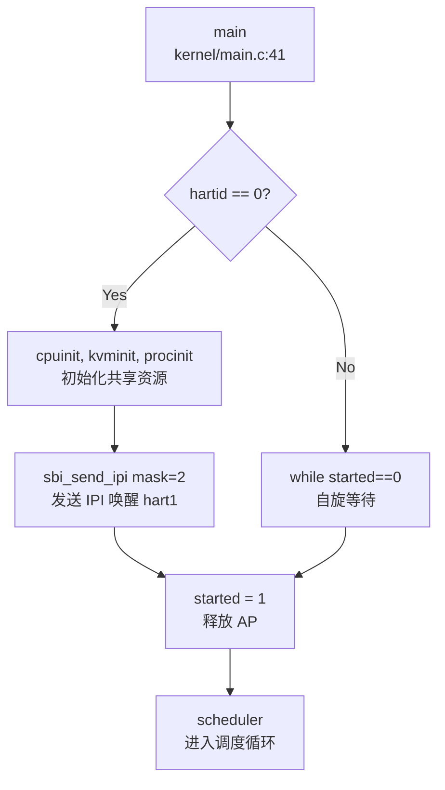

## 第 9 章：多核支持与并行机制

本章分析 oskernel2023-zmz 操作系统的多核（SMP）支持实现。通过代码分析发现，该系统实现了**基础的双核 SMP 架构**，但功能较为有限：支持 Secondary CPU 启动、核间中断（IPI）、Per-CPU 变量，但**未实现多核调度负载均衡**，所有 CPU 共享全局就绪队列。

---

## 多核架构设计（SMP/AMP）

### 架构类型：SMP（对称多处理）

该系统采用 **SMP（Symmetric Multi-Processing）** 架构设计，支持最多 2 个 CPU 核心（hart）。

**关键证据：**

1. **CPU 数量定义** (`include/param.h:5`)：
   ```c
   #define NCPU 2  // maximum number of CPUs
   ```

2. **Per-CPU 数组** (`kernel/sched/proc.c:92`)：
   ```c
   struct cpu cpus[NCPU];
   ```

3. **Per-CPU 结构定义** (`include/sched/proc.h:158-165`)：
   ```c
   struct cpu {
       struct proc *proc;       // The process running on this cpu, or NULL
       struct context context;  // swtch() here to enter scheduler()
       int noff;                // Depth of push_off() nesting
       int intena;              // Were interrupts enabled before push_off()?
   };
   ```

### 核心识别机制

系统通过 RISC-V 的 `tp` 寄存器存储 CPU ID（hartid）：

```c
// include/sched/proc.h:166-168
static inline int cpuid(void) {
    return r_tp();
}
struct cpu *mycpu(void);
```

`mycpu()` 函数 (`kernel/sched/proc.c:96-99`) 返回当前 CPU 的结构体指针：
```c
struct cpu *mycpu(void) {
    int id = cpuid();
    return &cpus[id];
}
```

**✅ 已实现**：基础 SMP 架构，支持 2 个 CPU 核心。

---

## Secondary CPU 启动流程

### 启动机制：IPI 唤醒 + 自旋等待

系统采用 **BSP（Bootstrap Processor）+ AP（Application Processor）** 模式：
- **hart 0** 作为 BSP，负责初始化所有共享资源
- **hart 1** 作为 AP，通过自旋等待 BSP 发送 IPI 唤醒

### 详细启动链

**入口点**：`kernel/main.c:41-105` 的 `main()` 函数



**关键代码分析** (`kernel/main.c:76-95`)：

```c
if (hartid == 0) {
    // BSP: 初始化共享资源
    started = 0;
    cpuinit();
    kvminit();       // 创建内核页表
    procinit();      // 初始化进程管理
    // ... 其他初始化 ...
    userinit();      // 创建第一个用户进程
    
    // 唤醒其他 CPU
    for (int i = 1; i < NCPU; i ++) {
        unsigned long mask = 1 << i;
        struct sbiret res = sbi_send_ipi(mask, 0);
        __debug_assert("main", SBI_SUCCESS == res.error, "sbi_send_ipi failed");
    }
    __sync_synchronize();
    started = 1;  // 释放 AP
}
else {
    // AP: hart 1
    while (started == 0)  // 自旋等待 BSP 信号
        ;
    __sync_synchronize();
    floatinithart();
    kvminithart();   // 初始化本核页表
    trapinithart();  // 安装中断向量
    plicinithart();  // 配置 PLIC 中断
    printf("hart 1 init done\n");
}

// 所有 CPU 进入调度器
scheduler();
```

### 启动流程详解

1. **BSP 初始化阶段**（hart 0）：
   - 初始化全局共享资源：物理内存分配器、内核页表、进程管理结构
   - 创建第一个用户进程（`userinit()`）
   - 通过 SBI IPI 发送启动信号给 AP

2. **AP 等待阶段**（hart 1）：
   - 执行自旋循环 `while (started == 0);`
   - 使用内存屏障 `__sync_synchronize()` 确保可见性

3. **AP 初始化阶段**：
   - 收到 IPI 后退出自旋
   - 初始化本核相关资源：浮点单元、页表、中断向量
   - **注意**：AP 不重复初始化共享资源（如内存分配器）

4. **统一进入调度**：
   - 所有 CPU 调用 `scheduler()` 进入调度循环

**✅ 已实现**：Secondary CPU 启动机制，通过 IPI + 自旋等待实现。

---

## 核间通信与 IPI 机制

### IPI 实现架构

系统通过 **SBI（Supervisor Binary Interface）扩展** 实现 IPI 功能，底层依赖 RISC-V 的 CLINT（Core-Local Interruptor）或 PLIC 控制器。

### IPI 发送路径

**调用链**：
```
kernel/main.c:84 → sbi_send_ipi() → SBI ECALL → sbi/psicasbi/src/trap/sbi/ipi.rs → clint::send_ipi()
```

**用户态接口** (`include/sbi.h:98-103`)：
```c
static inline struct sbiret sbi_send_ipi(
    unsigned long hart_mask, 
    unsigned long hart_mask_base
) {
    return SBI_CALL_2(IPI_EID, IPI_SEND_IPI, hart_mask, hart_mask_base);
}
```

**SBI 处理逻辑** (`sbi/psicasbi/src/trap/sbi/ipi.rs:12-46`)：
```rust
pub(super) fn handler(tf: &TrapFrame) -> SbiRet {
    let fid = tf.a6;
    match fid {
        SEND_IPI => {
            let hart_mask = tf.a0 as usize;
            let hart_mask_base = tf.a1 as usize;
            
            if hart_mask_base > NCPU {
                SbiRet(ERR_INVALID_PARAM, 0)
            } else {
                let max_shift = core::cmp::min(NCPU - hart_mask_base, 32);
                if 0 != (hart_mask >> max_shift) {
                    SbiRet(ERR_INVALID_PARAM, 0)
                } else {
                    for i in 0..max_shift {
                        let hart = 1usize << i;
                        if 0 != (hart_mask & hart) {
                            clint::send_ipi(i);  // 调用底层发送
                        }
                    }
                    SbiRet(SUCCESS, 0)
                }
            }
        }
        _ => SbiRet(ERR_NOT_SUPPORTED, 0)
    }
}
```

**底层硬件访问** (`sbi/psicasbi/src/hal/clint/mod.rs:40-51`)：
```rust
pub fn send_ipi(hartid: usize) {
    match () {
        #[cfg(feature = "qemu")]
        () => { qemu::send_ipi(hartid); }
        #[cfg(feature = "k210")]
        () => { k210::send_ipi(hartid); }
    }
}
```

**QEMU 实现** (`sbi/psicasbi/src/hal/clint/qemu.rs:31-35`)：
```rust
pub(super) fn send_ipi(hartid: usize) {
    unsafe {
        write_volatile((BASE as *mut u32).add(hartid), 1);
    }
}
```

### IPI 处理机制

**关键特性**：
- **掩码机制**：支持批量发送 IPI 到多个 hart（通过 `hart_mask` 位图）
- **平台适配**：通过 Cargo feature 区分 QEMU 和 K210 硬件
- **SBI 标准**：遵循 RISC-V SBI v0.3+ 的 sPI（s-mode IPI）扩展规范

**⚠️ 未发现**：系统中**未实现 IPI 接收处理函数**（如 `ipi_handler()`）。IPI 仅用于启动时唤醒 AP，运行时未使用 IPI 进行核间通信（如调度器间通信、TLB 刷新等）。

---

## Per-CPU 变量与数据结构

### Per-CPU 状态管理

系统通过 `struct cpu` 管理每个 CPU 的私有状态：

**结构定义** (`include/sched/proc.h:158-165`)：
```c
struct cpu {
    struct proc *proc;       // 当前运行的进程
    struct context context;  // 调度器上下文（swtch 切换点）
    int noff;                // push_off() 嵌套深度
    int intena;              // push_off() 前的中断状态
};
```

### 访问方式

1. **获取当前 CPU**：`mycpu()` 通过 `r_tp()` 读取 hartid
2. **获取当前进程**：`myproc()` (`kernel/sched/proc.c:101-106`)：
   ```c
   struct proc *myproc(void) {
       push_off();
       struct cpu *c = mycpu();
       struct proc *p = c->proc;
       pop_off();
       return p;
   }
   ```

### 中断嵌套保护

系统使用 `push_off()` / `pop_off()` 机制管理中断禁用状态 (`kernel/intr.c:12-40`)：

```c
void push_off(void) {
    int old = intr_get();
    intr_off();  // 禁用中断
    struct cpu *c = mycpu();
    if (c->noff == 0)
        c->intena = old;  // 保存初始状态
    c->noff += 1;
}

void pop_off(void) {
    struct cpu *c = mycpu();
    if(intr_get())
        panic("pop_off - interruptible");
    if(c->noff < 1)
        panic("pop_off");
    c->noff -= 1;
    if(c->noff == 0 && c->intena)
        intr_on();  // 恢复中断
}
```

**设计特点**：
- **嵌套计数**：`noff` 记录 `push_off()` 调用次数
- **状态保存**：仅在最外层保存中断使能状态
- **Per-CPU 安全**：每个 CPU 独立维护自己的 `noff` 和 `intena`

**✅ 已实现**：Per-CPU 变量设计与访问机制。

---

## 多核调度策略

### 调度器架构

系统采用 **全局就绪队列 + 每 CPU 调度循环** 的简单 SMP 调度模型。

**调度器主循环** (`kernel/sched/proc.c:658-698`)：
```c
void scheduler(void) {
    struct proc *tmp;
    struct cpu *c = mycpu();

    while (1) {
        int found = 0;
        intr_on();  // 使能中断
        __enter_proc_cs 
        tmp = __get_runnable_no_lock();  // 从全局队列获取进程
        if (NULL != tmp) {
            tmp->state = RUNNING;
            c->proc = tmp;
            
            w_satp(MAKE_SATP(tmp->pagetable));  // 切换页表
            sfence_vma();
            swtch(&c->context, &tmp->context);  // 上下文切换
            
            w_satp(MAKE_SATP(kernel_pagetable));
            sfence_vma();
            
            if (ZOMBIE == tmp->state) {
                release(&(tmp->parent->lk));
            }
            found = 1;
        }
        c->proc = NULL;
        __leave_proc_cs
        if (!found) {
            intr_on();
            asm volatile("wfi");  // 无进程可运行时进入低功耗
        }
    }
}
```

### 就绪队列设计

**全局就绪队列** (`kernel/sched/proc.c:242-244`)：
```c
#define PRIORITY_IRQ    1
#define PRIORITY_NORMAL 2
#define PRIORITY_NUMBER 3
struct proc *proc_runnable[PRIORITY_NUMBER];  // 优先级队列数组
struct proc *proc_sleep;                       // 睡眠队列
```

**进程调度字段** (`include/sched/proc.h:59-60`)：
```c
struct proc *sched_next;   // 指向下一个进程
struct proc **sched_pprev; // 指向前一个指针的地址
```

### 调度策略分析

**❌ 未实现负载均衡**：
- 所有 CPU 共享**单一全局就绪队列** `proc_runnable[]`
- 无 CPU 亲和性（affinity）机制
- 无任务迁移（migration）逻辑
- 多个 CPU 可能同时从同一队列取走进程（通过 `proc_lock` 保护）

**❌ 未实现 CPU 亲和性**：
- `struct proc` 中**无** `cpu_affinity` 或 `run_on_cpu` 字段
- 进程可能在任意 CPU 上运行
- 无 `sched_setaffinity()` 系统调用

**🔸 简单优先级调度**：
- 支持 3 个优先级：`PRIORITY_IRQ`、`PRIORITY_NORMAL`、`PRIORITY_TIMEOUT`
- 调度器按优先级顺序扫描队列
- 时间片机制：`proc_tick()` 递减进程 `timer`，超时后降级到 `PRIORITY_TIMEOUT`

### 多核同步问题

**竞争条件**：
- 多个 CPU 同时调用 `__get_runnable_no_lock()` 可能导致负载不均
- 通过 `proc_lock` 串行化访问，但降低了并行性

**改进建议**（未实现）：
- 每 CPU 独立就绪队列
- 工作窃取（work-stealing）机制
- 负载均衡定时器

---

## 锁的实现与多核安全

### SpinLock 设计

**结构定义** (`include/sync/spinlock.h:7-13`)：
```c
struct spinlock {
    uint locked;       // Is the lock held?
    char *name;        // Name of lock (for debugging)
    struct cpu *cpu;   // The cpu holding the lock
};
```

**获取锁** (`kernel/sync/spinlock.c:23-47`)：
```c
void acquire(struct spinlock *lk) {
    push_off();  // 禁用中断（防止死锁）
    if(holding(lk))
        panic("acquire");

    // RISC-V 原子操作：amoswap.w.aq
    while(__sync_lock_test_and_set(&lk->locked, 1) != 0)
        ;

    // 内存屏障（fence 指令）
    __sync_synchronize();

    lk->cpu = mycpu();  // 记录持有者
}
```

**释放锁** (`kernel/sync/spinlock.c:49-73`)：
```c
void release(struct spinlock *lk) {
    if(!holding(lk))
        panic("release");

    lk->cpu = 0;

    // 内存屏障
    __sync_synchronize();

    // RISC-V 原子操作：amoswap.w
    __sync_lock_release(&lk->locked);

    pop_off();  // 恢复中断状态
}
```

### 关键特性

1. **中断禁用**：`acquire()` 首先调用 `push_off()` 禁用本地中断
   - **目的**：防止同一 CPU 上的中断处理程序尝试获取同一锁导致死锁
   - **代价**：增加中断延迟

2. **原子操作**：使用 GCC 内置函数 `__sync_lock_test_and_set()`
   - 编译为 RISC-V `amoswap.w.aq` 指令（原子交换 + acquire 语义）
   - 自旋等待直到锁可用

3. **内存屏障**：`__sync_synchronize()` 编译为 `fence` 指令
   - 确保临界区内的内存访问不会重排序到锁操作之外
   - **多核可见性保证**

4. **调试支持**：记录持有锁的 CPU，检测重入

### 优先级继承

**❌ 未实现**：SpinLock **不支持优先级继承**（Priority Inheritance）。
- 无 `owner_priority` 或 `waiter_list` 字段
- 高优先级进程可能被低优先级进程阻塞（优先级反转问题）

### 其他同步原语

**SleepLock** (`include/sync/sleeplock.h`)：
- 基于 SpinLock 的长期锁
- 允许在等待时让出 CPU（进入睡眠）
- **未实现**：无优先级继承

**WaitQueue** (`include/sync/waitqueue.h`)：
- 用于进程等待特定条件
- 包含 `struct spinlock lock` 保护队列

---

## 原子操作与内存序

### 内存屏障使用

系统在关键位置使用 `__sync_synchronize()` 确保多核内存可见性：

1. **Secondary CPU 启动** (`kernel/main.c:82, 90`)：
   ```c
   __sync_synchronize();  // 确保 started=1 对其他 CPU 可见
   started = 1;
   ```

2. **SpinLock 获取/释放** (`kernel/sync/spinlock.c:41, 62`)：
   ```c
   __sync_synchronize();  // 防止临界区访问重排序
   ```

3. **VirtIO 磁盘驱动** (`kernel/hal/virtio_disk.c:317-364`)：
   - 多次使用内存屏障确保 DMA 描述符可见性

### 原子操作类型

**GCC 内置函数**：
- `__sync_lock_test_and_set()`：原子交换（acquire 语义）
- `__sync_lock_release()`：原子释放（release 语义）
- `__sync_synchronize()`：全内存屏障（full fence）

**⚠️ 未发现**：系统**未使用** C11 `stdatomic.h` 或 Rust `core::sync::atomic`。所有原子操作依赖 GCC 内置函数。

---

## 关键代码片段

### 1. Per-CPU 访问宏

```c
// include/sched/proc.h:166-168
static inline int cpuid(void) {
    return r_tp();  // 读取 tp 寄存器（hartid）
}

struct cpu *mycpu(void);
struct proc *myproc(void);
```

### 2. IPI 发送（BSP 唤醒 AP）

```c
// kernel/main.c:76-85
for (int i = 1; i < NCPU; i ++) {
    unsigned long mask = 1 << i;
    struct sbiret res = sbi_send_ipi(mask, 0);
    sbi_send_ipi(mask, 0);
    __debug_assert("main", SBI_SUCCESS == res.error, "sbi_send_ipi failed");
}
__sync_synchronize();
started = 1;
```

### 3. 自旋锁获取（含中断禁用）

```c
// kernel/sync/spinlock.c:23-47
void acquire(struct spinlock *lk) {
    push_off();  // 禁用中断
    if(holding(lk))
        panic("acquire");
    
    while(__sync_lock_test_and_set(&lk->locked, 1) != 0)
        ;  // 自旋等待
    
    __sync_synchronize();  // 内存屏障
    lk->cpu = mycpu();
}
```

### 4. 调度器（全局队列 + 多核竞争）

```c
// kernel/sched/proc.c:658-698
void scheduler(void) {
    struct cpu *c = mycpu();
    while (1) {
        intr_on();
        __enter_proc_cs 
        tmp = __get_runnable_no_lock();  // 全局队列
        if (NULL != tmp) {
            c->proc = tmp;
            swtch(&c->context, &tmp->context);
        }
        c->proc = NULL;
        __leave_proc_cs
        if (!found)
            asm volatile("wfi");  // 无进程时休眠
    }
}
```

---

## 本章小结

| 功能 | 实现状态 | 说明 |
|------|---------|------|
| **SMP 架构** | ✅ 已实现 | 支持 2 核，`struct cpu cpus[NCPU]` |
| **Secondary CPU 启动** | ✅ 已实现 | IPI 唤醒 + 自旋等待 |
| **IPI 机制** | ✅ 已实现（部分） | 仅用于启动，无运行时 IPI 处理 |
| **Per-CPU 变量** | ✅ 已实现 | `mycpu()` / `myproc()` 访问 |
| **SpinLock** | ✅ 已实现 | 禁用中断 + 原子操作 + 内存屏障 |
| **优先级继承** | ❌ 未实现 | 无优先级继承机制 |
| **多核负载均衡** | ❌ 未实现 | 全局单一队列，无任务迁移 |
| **CPU 亲和性** | ❌ 未实现 | 无 affinity 机制 |
| **RCU** | ❌ 未实现 | 未发现 RCU 实现 |

**总体评价**：
oskernel2023-zmz 实现了**基础 SMP 支持**，能够启动双核并运行独立进程。但多核调度机制较为原始：
- 所有 CPU 竞争全局就绪队列，可能导致负载不均
- 无 CPU 亲和性，进程可能在核间频繁迁移（缓存失效）
- IPI 仅用于启动，未用于运行时核间通信（如 TLB 刷新、调度器间通知）

该设计适用于教学演示，但在实际多核场景下性能受限。
