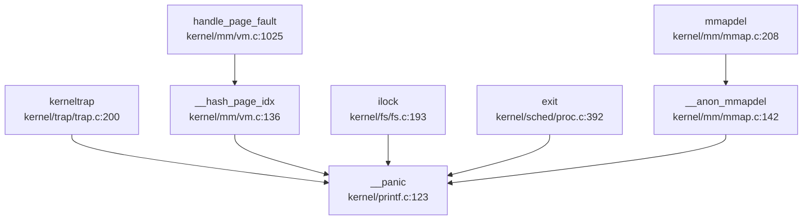

## 第 12 章：调试机制与错误处理

本章分析 oskernel2023-zmz 操作系统的调试支持、日志系统、错误处理机制以及调试接口。

---

## 日志与打印系统

### 打印宏实现

该系统的日志系统基于 `printf` 函数构建，支持彩色输出和模块化调试。

**核心头文件**：`include/printf.h` 和 `include/utils/debug.h`

**日志级别设计**：

```c
// include/utils/debug.h:10-15
#define __INFO(str)     "[\e[32;1m"str"\e[0m]"    // 绿色 - 信息
#define __WARN(str)     "[\e[33;1m"str"\e[0m]"    // 黄色 - 警告
#define __ERROR(str)    "[\e[31;1m"str"\e[0m]"    // 红色 - 错误
```

**调试宏分类**：

1. **`__debug_info(func, ...)`**：信息级日志，仅 DEBUG 模式生效
2. **`__debug_warn(func, ...)`**：警告级日志
3. **`__debug_error(func, ...)`**：错误级日志，附带文件行号
4. **`__debug_assert(func, cond, ...)`**：调试断言，条件失败时触发 panic
5. **`__assert(func, cond, ...)`**：生产环境断言，始终生效

**实现位置**：`kernel/printf.c` (152 行，2.4KB)

```c
// kernel/printf.c:69
void printf(char *fmt, ...)
{
    // 支持 %d, %x, %p, %s 等格式
    // 通过 consputc() 输出到 UART 控制台
}
```

**模块名配置**：
```c
// include/utils/debug.h:14
#ifndef __module_name__ 
    #define __module_name__     "xv6-k210"
#endif 
```

各模块可通过定义 `__module_name__` 自定义日志前缀，如 `trap` 模块在 `kernel/trap/trap.c` 开头定义：
```c
#define __module_name__     "trap"
```

---

## Panic 处理与栈回溯

### Panic 处理流程

**✅ 已实现**：完整的 panic 处理链

**入口宏** (`include/printf.h:11-16`)：
```c
#define panic(s) do {\
    printf(__ERROR(__module_name__)": hart %d at %s: %d\n", \
            cpuid(), __FILE__, __LINE__\
    );\
    __panic(s);\
} while (0)
```

**核心处理函数** (`kernel/printf.c:123-133`)：
```c
void
__panic(char *s)
{
    printf(__ERROR("panic")": ");
    printf(s);
    printf("\n");
    backtrace();          // 打印栈回溯
    panicked = 1;         // 冻结 UART 输出
    intr_off();           // 关闭中断
    for(;;)
        ;                 // 无限循环停机
}
```

### 栈回溯 (Backtrace) 实现

**✅ 已实现**：基于 Frame Pointer 的栈回溯（非 DWARF 解析）

**实现位置**：`kernel/printf.c:135-143`

```c
void backtrace()
{
    uint64 *fp = (uint64 *)r_fp();           // 读取当前帧指针
    uint64 *bottom = (uint64 *)PGROUNDUP((uint64)fp);
    printf("backtrace:\n");
    while (fp < bottom) {
        uint64 ra = *(fp - 1);               // 返回地址
        printf("%p\n", ra - 4);              // 打印返回地址
        fp = (uint64 *)*(fp - 2);            // 移动到上一帧
    }
}
```

**原理**：
- RISC-V 调用约定中，栈帧布局为 `[prev_fp, ra, locals...]`
- 通过读取 `fp` 寄存器获取当前栈帧基址
- `fp-1` 位置存储返回地址 (ra)
- `fp-2` 位置存储上一帧的 fp
- 循环遍历直到栈底

**局限性**：
- ❌ **不支持 DWARF 调试信息解析**
- ❌ **不支持函数名符号解析**（仅打印原始地址）
- 依赖编译时保留帧指针（需 `-fno-omit-frame-pointer`）

### Panic 调用链分析

通过 `lsp_get_call_graph` 分析 `__panic` 的入向调用：



**主要触发场景**：
1. **内核陷阱处理失败** (`kerneltrap`)
2. **内存管理错误** (页表操作、mmap 删除)
3. **文件系统锁错误** (`ilock`)
4. **进程退出时的断言失败**
5. **调试断言触发** (`__debug_assert`)

---

## 错误码与 Result 设计

### 错误码定义

**✅ 已实现**：标准 POSIX 风格错误码

**定义位置**：`include/errno.h` (107 行，4.8KB)

系统定义了 98 个标准错误码，覆盖常见错误场景：

```c
// include/errno.h:1-40
#define EPERM       1   /* Operation not permitted */
#define ENOENT      2   /* No such file or directory */
#define ESRCH       3   /* No such process */
#define EINTR       4   /* Interrupted system call */
#define EIO         5   /* I/O error */
#define ENOMEM      12  /* Out of memory */
#define EACCES      13  /* Permission denied */
#define EFAULT      14  /* Bad address */
#define EINVAL      22  /* Invalid argument */
#define ENOSYS      38  /* Invalid system call number */
```

### 错误返回约定

系统调用遵循 Unix 传统：
- 成功：返回非负值（结果或 0）
- 失败：返回 `-ERROR_CODE`

**示例** (`kernel/syscall/sysfile.c`):
```c
// sys_read 返回读取的字节数或 -errno
if (n < 0) return -n;  // 错误码取负
```

**Rust 部分** (SBI 层 `sbi/psicasbi/src/main.rs`):
```rust
// 使用 Result<T, E> 模式
fn panic(info: &PanicInfo) -> ! {
    println!("\x1b[31;1m[panic]\x1b[0m: {}", info);
    loop {}
}
```

---

## 调试接口与交互式 Shell

### 用户态 Shell

**✅ 已实现**：基础交互式 Shell

**实现位置**：`xv6-user/sh.c` (661 行，12.0KB)

**支持命令**：
- 内置命令：`cd`, `exit`
- 外部命令：通过 `execve` 执行 `/bin/` 下程序
- 管道：`|` 支持
- 重定向：`<`, `>` 支持

**快捷键支持** (README.md:80):
- `Ctrl-C`: 发送 SIGINT
- `Ctrl-D`: EOF
- `Ctrl-U`: 清除行
- `Ctrl-K`: 杀死进程

**调试功能**：
```c
// xv6-user/sh.c:293
// 支持嵌入式环境变量（用于基本命令）
```

### 内核调试命令

**🔸 桩函数/有限实现**：`procdump` 进程调试

**实现位置**：`kernel/sched/proc.c:888-899`

```c
void procdump(void) {
    printf("\nepc = %p\n", r_sepc());
    printf("next pid = %d\n", __pid);
    printf("\nPID\tPPID\tSTATE\tKILLED\tNAME\tMEM_LOAD\tMEM_HEAP\n");
    for (int i = 0; i < HASH_SIZE; i ++) {
        __print_proc_no_lock(pid_hash[i]);
    }
}
```

**功能**：打印所有进程的状态表（PID、PPID、状态、名称、内存负载）

**调用方式**：需在内核代码中显式调用，**未提供交互式 Monitor 接口**

### 栈打印辅助

**✅ 已实现**：`show_stack` 函数

**实现位置**：`kernel/exec.c:126-134`

```c
void
show_stack(pagetable_t pagetable, uint64 sp, uint64 sz)
{
  for(uint64 i = sp; i < sz; i += 8) {
    uint64 *pa = (void*)walkaddr(pagetable, i) + i - PGROUNDDOWN(i);
    if(pa) printf("addr %p phaddr:%p value %p\n", i, pa, *pa);
    else printf("addr %p value (nil)\n", i);
  }
}
```

**用途**：打印指定栈范围的内存内容，用于调试栈溢出或异常

---

## GDB Stub 支持情况

### GDB Stub 分析

**❌ 未实现**：内核级 GDB Stub

**搜索结果**：
- `grep "gdbstub|gdb_stub|handle_gdb"`：**0 匹配**
- 无数据包解析循环
- 无 GDB 协议处理函数

**现有调试配置** (`debug/.gdbinit.tmpl-riscv`):
```
# 仅作为 GDB 初始化模板
# 用于连接外部调试器（如 OpenOCD）
# 非内核内置 GDB Stub
```

**OpenOCD 支持** (`debug/openocd_cfg/`):
- `ft2232c.cfg`: FTDI 适配器配置
- `k210.cfg`: K210 开发板配置
- `openocd_ftdi.cfg`: 通用 FTDI 配置

**结论**：系统依赖**外部硬件调试器**（OpenOCD + GDB），**未实现软件 GDB Stub**。

---

## 断言与运行时检查

### 断言系统

**✅ 已实现**：双层断言机制

**定义位置**：`include/utils/debug.h`

**调试断言** (仅 DEBUG 模式):
```c
#ifdef DEBUG 
    #define __debug_assert(func, cond, ...) do {\
        if (!(cond)) {\
            __debug_error(func, __VA_ARGS__);\
            panic("panic!\n");\
        }\
    } while (0)
#else 
    #define __debug_assert(func, cond, ...) \
        do {} while(0)
#endif 
```

**生产断言** (始终生效):
```c
#define __assert(func, cond, ...) do {\
    if (!(cond)) {\
        __debug_error(func, "at %s: %d\n", __FILE__, __LINE__);\
        __debug_error(func, __VA_ARGS__);\
        panic("panic!\n");\
    }\
} while (0)
```

### 实际使用示例

**内存管理断言** (`kernel/mm/pm.c:190`):
```c
__assert("kpminit", START_SINGLE - (uint64)boot_stack_top >= PGSIZE,
         "boot stack too large\n");
```

**进程管理断言** (`kernel/sched/proc.c:50-75`):
```c
__debug_assert("hash_insert", NULL != p, "insert NULL into hash\n");
__debug_assert("hash_search", pid >= 1, "pid %d too small\n", pid);
```

**陷阱处理断言** (`kernel/trap/trap.c:213-215`):
```c
__debug_assert("kerneltrap", (0 != (sstatus & SSTATUS_SPP)), 
               "not from supervisor mode\n");
__debug_assert("kerneltrap", 0 == intr_get(), 
               "interrupts enable\n");
```

### 系统调用追踪 (Trace)

**✅ 已实现**：基础系统调用追踪

**系统调用号** (`include/sysnum.h:11`):
```c
#define SYS_trace     18
```

**系统调用实现** (`kernel/syscall/sysproc.c:254-264`):
```c
uint64
sys_trace(void)
{
    // int mask;
    // if(argint(0, &mask) < 0) {
    //   return -1;
    // }
    // myproc()->tmask = mask;
    myproc()->tmask = 1;  // 🔸 简化实现：固定 mask=1
    return 0;
}
```

**追踪逻辑** (`kernel/syscall/syscall.c:365-373`):
```c
// trace
int trace = p->tmask;  // & (1 << (num - 1));
if (trace) {
    printf("pid %d: %s(", p->pid, sysnames[num]);
}
p->trapframe->a0 = syscalls[num]();
if (trace) {
    printf(") -> %d\n", p->trapframe->a0);
}
```

**用户态工具** (`xv6-user/strace.c`):
```c
if (trace() < 0) {
    fprintf(2, "%s: strace failed\n", argv[0]);
    exit(1);
}
execve(nargv[0], nargv, envp);
```

**功能**：打印进程执行的系统调用及其返回值

**局限性**：
- 🔸 `sys_trace` 仅支持固定 mask=1，**不支持按系统调用类型过滤**
- 无时间戳、无调用参数详细打印

---

## 关键代码片段

### 1. Panic 处理完整流程

```c
// include/printf.h:11-16 - Panic 宏
#define panic(s) do {\
    printf(__ERROR(__module_name__)": hart %d at %s: %d\n", \
            cpuid(), __FILE__, __LINE__\
    );\
    __panic(s);\
} while (0)

// kernel/printf.c:123-143 - Panic 处理 + 栈回溯
void __panic(char *s)
{
    printf(__ERROR("panic")": ");
    printf(s);
    printf("\n");
    backtrace();          // 打印调用栈
    panicked = 1;
    intr_off();           // 关中断
    for(;;)
        ;                 // 死循环停机
}

void backtrace()
{
    uint64 *fp = (uint64 *)r_fp();
    uint64 *bottom = (uint64 *)PGROUNDUP((uint64)fp);
    printf("backtrace:\n");
    while (fp < bottom) {
        uint64 ra = *(fp - 1);
        printf("%p\n", ra - 4);
        fp = (uint64 *)*(fp - 2);
    }
}
```

### 2. 调试断言宏

```c
// include/utils/debug.h:38-58
#ifdef DEBUG 
    #define __debug_assert(func, cond, ...) do {\
        if (!(cond)) {\
            __debug_error(func, __VA_ARGS__);\
            panic("panic!\n");\
        }\
    } while (0)
#else 
    #define __debug_assert(func, cond, ...) \
        do {} while(0)
#endif 

#define __assert(func, cond, ...) do {\
    if (!(cond)) {\
        __debug_error(func, "at %s: %d\n", __FILE__, __LINE__);\
        __debug_error(func, __VA_ARGS__);\
        panic("panic!\n");\
    }\
} while (0)
```

### 3. 系统调用追踪

```c
// kernel/syscall/syscall.c:365-373
int trace = p->tmask;
if (trace) {
    printf("pid %d: %s(", p->pid, sysnames[num]);
}
p->trapframe->a0 = syscalls[num]();
if (trace) {
    printf(") -> %d\n", p->trapframe->a0);
}
```

---

## 本章总结

| 功能模块 | 实现状态 | 说明 |
|---------|---------|------|
| **日志系统** | ✅ 已实现 | 支持 INFO/WARN/ERROR 三级，彩色输出，模块化前缀 |
| **Panic 处理** | ✅ 已实现 | 完整流程：打印错误→栈回溯→关中断→停机 |
| **栈回溯** | ✅ 已实现 (基础) | 基于 Frame Pointer，不支持 DWARF/符号解析 |
| **错误码** | ✅ 已实现 | 98 个标准 POSIX 错误码 |
| **交互式 Shell** | ✅ 已实现 | 支持管道、重定向、快捷键 |
| **内核 Monitor** | ❌ 未实现 | 仅有 `procdump` 函数，无交互式命令接口 |
| **GDB Stub** | ❌ 未实现 | 依赖外部 OpenOCD 硬件调试 |
| **系统调用追踪** | 🔸 桩函数 | 仅支持固定 mask=1，无细粒度过滤 |
| **断言系统** | ✅ 已实现 | DEBUG/生产双层断言 |
| **Perf/Ftrace** | ❌ 未实现 | 无性能分析工具支持 |

**设计特点**：
1. **轻量级调试**：基于 Frame Pointer 的栈回溯，避免 DWARF 解析开销
2. **分层断言**：DEBUG 模式与生产模式分离
3. **外部调试依赖**：通过 OpenOCD+GDB 进行源码级调试，内核保持精简

**改进建议**：
1. 实现符号解析，将回溯地址转换为函数名
2. 完善 `sys_trace`，支持按系统调用类型过滤
3. 添加内核 Monitor，支持 `ps`、`meminfo` 等调试命令
4. 考虑实现简易 GDB Stub 或 RISC-V 调试模块 (debug mode) 支持
