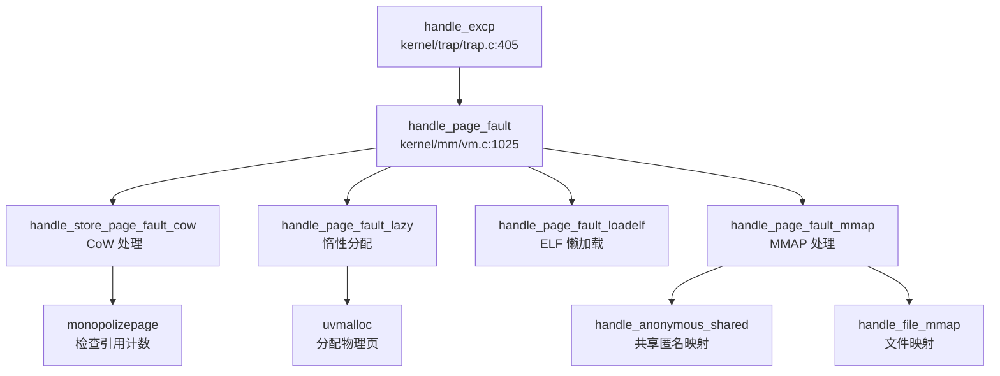

## 执行摘要（Executive Summary）

本项目 `xv6-k210` 是一个基于 MIT xv6-riscv 移植到 Kendryte K210 RISC-V SoC 的教学操作系统，同时支持 QEMU 仿真运行。项目采用 **C 语言为主的宏内核架构**，SBI 固件层使用 Rust 编写，目标架构为 **RISC-V 64 位（rv64g）**，支持 K210 开发板与 QEMU 虚拟机双平台编译。

核心功能完成度方面，系统实现了操作系统的基础闭环：**分页机制**（SV39 三级页表）、**COW Fork**（`PTE_COW` 标记）、**优先级调度**（3 级队列）、**FAT32 文件系统**（完整驱动）、**管道 IPC**（1024 字节环形缓冲区）、**信号机制**、**mmap 共享映射**、**惰性分配**（缺页处理）以及**基础 SMP 支持**（双核启动 + IPI）。然而，**网络协议栈完全缺失**（无 socket 系统调用、无网卡驱动），**System V IPC 未实现**（消息队列/信号量/共享内存接口），**用户权限模型简化**（UID/GID 硬编码为 0），**高级安全机制空白**（无 KPTI、Seccomp、Stack Canary）。

总体而言，该项目是一个功能完整的教学级 RISC-V 操作系统，适合学习 OS 核心原理（进程、内存、文件系统、中断），但不具备生产环境所需的网络能力与安全防护。

---

## 核心架构与机制提炼

### 1. 内存管理子系统

#### 物理页分配器（`kernel/mm/pm.c`）
- **双链表分配器**：`multiple`（主空闲池）+ `single`（高地址 400 页预留池），优先从 `single` 池分配以减少锁竞争
- **首次适配策略**：`__mul_alloc_no_lock()` 遍历空闲链表找到第一个足够大的块
- **引用计数机制**：哈希表 `page_ref_table` 跟踪物理页引用，支持 COW 和共享映射

#### 虚拟内存与页表（`kernel/mm/vm.c`）
- **SV39 三级页表**：27-bit VPN，9-bit 每级索引，使用 `walk()` 函数进行页表遍历
- **内核页表初始化**：`kvminit()` 映射 UART、VIRTIO、CLINT、PLIC 等外设及内核代码/数据段
- **用户页表隔离**：每个进程独立 `pagetable_t`，通过 `PTE_U` 位限制用户访问内核页面
- **关键映射函数**：
  ```c
  // kernel/mm/vm.c:297-325
  int mappages(pagetable_t pagetable, uint64 va, uint64 size, uint64 pa, int perm) {
      for(;;){
          if((pte = walk(pagetable, a, 1)) == NULL) return -1;
          *pte = PA2PTE(pa) | perm | PTE_V;
          if(a == last) break;
          a += PGSIZE; pa += PGSIZE;
      }
  }
  ```

#### 写时复制（COW）机制
- **Fork 时标记**：`uvmcopy()` 检测到 `PTE_W` 时设置 `PTE_COW` 并清除写权限
- **缺页处理**：`handle_store_page_fault_cow()` 检查引用计数，唯一引用直接添加写权限，否则分配新页复制内容
- **PTE 标志**：`PTE_COW` 复用 `PTE_RSW1`（软件定义位）

#### 惰性分配（Lazy Allocation）
- **sbrk/brk 行为**：`sys_sbrk()` 仅调整 `p->pbrk` 边界，不立即分配物理页
- **缺页触发**：`handle_page_fault_lazy()` 在首次访问时调用 `uvmalloc()` 分配真实物理页
- **适用场景**：HEAP/STACK 类型的 segment

#### 内存映射（mmap）
- **系统调用**：`sys_mmap()` 支持 `MAP_FIXED`/`MAP_ANONYMOUS`/`MAP_SHARED`/`MAP_PRIVATE`
- **共享映射实现**：`mmap_anonymous()` 创建 `anonfile` 结构，使用红黑树 `fp->mapping` 管理 `mmap_page`
- **文件映射同步**：`__file_mmapdel()` 在 `MS_SYNC` 时触发写回

#### 内核堆分配器（`kernel/mm/kmalloc.c`）
- **类 Slab 设计**：`kmem_table[17]` 哈希表按对象大小（16 字节对齐）分级管理
- **节点结构**：`kmem_node` 包含空闲链表 `table[]` 和可用对象计数 `avail`
- **分配流程**：哈希查找 → 节点分配 → 页分配（若节点已满）

---

### 2. 进程调度与任务模型

#### 进程控制块（`include/sched/proc.h`）
```c
struct proc {
    int pid;                        // 进程 ID
    enum procstate state;           // RUNNABLE/RUNNING/SLEEPING/ZOMBIE
    struct context context;         // 内核上下文（ra, sp, s0-s11）
    struct trapframe *trapframe;    // 用户态寄存器保存区
    pagetable_t pagetable;          // 用户页表
    struct seg *segment;            // 地址空间段链表
    uint64 pbrk;                    // 堆顶边界
    struct fdtable fds;             // 文件描述符表
    int priority;                   // 调度优先级
    uint64 timer;                   // 时间片计数器
    // 信号机制
    ksigaction_t *sig_act;
    __sigset_t sig_pending;
    int killed;
};
```

#### 调度器实现（`kernel/sched/proc.c`）
- **优先级队列**：`proc_runnable[PRIORITY_NUMBER]` 三个队列（`PRIORITY_IRQ=1`, `PRIORITY_NORMAL=2`, `PRIORITY_TIMEOUT=0`）
- **调度循环**：
  ```c
  // kernel/sched/proc.c:658-698
  void scheduler(void) {
      while (1) {
          tmp = __get_runnable_no_lock();  // 按优先级扫描全局队列
          if (NULL != tmp) {
              tmp->state = RUNNING;
              w_satp(MAKE_SATP(tmp->pagetable));  // 切换页表
              swtch(&c->context, &tmp->context);  // 上下文切换
          } else {
              asm volatile("wfi");  // 无进程时低功耗等待
          }
      }
  }
  ```
- **时间片管理**：`proc_tick()` 递减非 RUNNING 进程的 `timer`，超时后降级到 `PRIORITY_TIMEOUT`
- **局限性**：同一优先级内为 FIFO 顺序，**未实现时间片轮转抢占**

#### 上下文切换（`kernel/sched/swtch.S`）
- **保存寄存器**：ra + sp + s0-s11（共 13 个，104 字节）
- **浮点惰性保存**：仅在 `sstatus.FS == DIRTY` 时调用 `floatstore()` 保存浮点寄存器

#### 进程创建与销毁
- **fork()**：`clone(0, NULL)` → `allocproc()` → `copysegs()`（复制页表和段）→ `copyfdtable()` → 插入就绪队列
- **exec()**：创建新页表 → 加载 ELF 段 → 创建 HEAP/STACK 段 → 压入 argv/envp → 切换 `pagetable/segment` → 释放旧地址空间
- **exit()**：设置 `ZOMBIE` 状态 → 关闭文件 → 释放内存 → 通知父进程 `wakeup()`
- **wait4()**：等待子进程 `ZOMBIE` → 回收资源 → `freeproc()`

---

### 3. 中断与陷阱处理

#### Trap 入口架构
- **用户态入口**：`kernel/trap/trampoline.S:uservec` → 保存所有寄存器到 `TrapFrame` → 切换到内核栈 → 跳转 `usertrap()`
- **内核态入口**：`kernel/trap/kernelvec.S:kernelvec` → 分配 256 字节栈空间 → 保存寄存器 → 调用 `kerneltrap()`

#### TrapFrame 结构（`include/trap.h`）
- **70 个字段**：32 个整数寄存器 + 33 个浮点寄存器 + 5 个内核元数据（`kernel_satp`, `kernel_sp`, `kernel_trap`, `epc`, `kernel_hartid`）
- **总大小**：808 字节

#### 异常分发（`kernel/trap/trap.c`）
```c
void kerneltrap() {
    uint64 scause = r_scause();
    if (0 == handle_intr(scause)) {
        // 中断处理（定时器/外部/软件）
    } else if (0 == handle_excp(scause)) {
        // 异常处理（缺页/非法指令/系统调用）
    } else {
        panic("kerneltrap");
    }
}
```

#### 系统调用分发
- **调用号获取**：从 `trapframe->a7` 读取
- **分发表**：`syscalls[]` 数组（约 74 个条目）
- **完整链路**：`user ecall` → `uservec` → `kerneltrap` → `syscall()` → `syscalls[num]()` → 返回用户态

#### 缺页异常处理链


#### 信号机制
- **发送**：`kill(pid, sig)` 设置 `sig_pending` 位图，唤醒睡眠进程
- **处理时机**：`sighandle()` 在 Trap 返回用户态前检查待处理信号
- **跳板机制**：`sig_trampoline.S` 提供 `sig_handler` 和 `default_sigaction` 入口
- **信号返回**：`SYS_rt_sigreturn` → `sigreturn()` 恢复原始 `trapframe`

---

### 4. 文件系统（VFS + FAT32）

#### VFS 抽象层（`include/fs/fs.h`）
- **Superblock**：文件系统实例描述符，包含 `root` dentry 和 `fs_op` 操作集
- **Inode**：文件元数据（`mode`, `size`, `nlink`），嵌入 `inode_op` 和 `file_op` 接口
- **Dentry**：目录项缓存，包含 `parent`/`child`/`next` 链表指针和 `mount` 挂载点
- **File**：打开文件描述，包含 `off` 偏移、`ip` inode 指针、`readable/writable` 标志

#### FAT32 实现（`kernel/fs/fat32/`）
- **超级块解析**：`fat32_init()` 读取 BPB（BIOS Parameter Block），计算 `first_data_sec`、`data_clus_cnt`
- **簇链管理**：FAT 表追踪文件簇链，支持动态簇分配（`fat_alloc_clus()`）与回收
- **长文件名支持**：VFAT 长目录项（L-N-E），最多 255 字符
- **目录项操作**：`fat_alloc_entry()`、`fat_lookup_dir()`、`fat_remove_entry()`

#### 文件描述符管理（`kernel/fs/file.c`）
- **Per-Process FdTable**：`struct fdtable` 包含 `arr[NOFILE]` 数组（NOFILE=256），支持链式扩展
- **分配策略**：从 `nextfd` 开始查找空闲位置，表满时自动扩展新表
- **exec_close 标志**：exec 时关闭标记为 `O_CLOEXEC` 的 fd

#### 管道（Pipe）实现（`kernel/fs/pipe.c`）
- **环形缓冲区**：1024 字节，`nread`/`nwrite` 计数器实现模运算索引
- **独立等待队列**：`rqueue`（读等待）和 `wqueue`（写等待）
- **FIFO 排队**：`pipelock()` 确保只有队列第一个进程可以获取资源
- **Poll 支持**：`pipepoll()` 检查 `nwrite - nread` 判断可读/可写状态

#### 块缓存（`kernel/fs/bio.c`）
- **LRU 淘汰**：双向链表维护最近使用缓冲
- **哈希索引**：`BCACHE_TABLE_SIZE` 根据缓冲数量动态调整（47/131/233）
- **写回机制**：脏标记异步写回磁盘

---

### 5. 设备驱动与硬件抽象

#### 双平台驱动架构
- **条件编译**：`#ifdef QEMU` / `#ifndef QEMU` 隔离平台相关代码
- **Makefile 配置**：`platform := k210` 或 `qemu` 控制目标平台
- **SBI Feature**：Cargo features（`k210`/`qemu`）选择 Rust 固件实现

#### UART 驱动
- **SBI 层**：`sbi/psicasbi/src/hal/uart/` 提供 Trait 抽象，QEMU（NS16550a）和 K210（UARTHS）分别实现
- **内核层**：`kernel/console.c` 实现环形缓冲区和 `consoleintr()` 中断处理
- **MMU 地址切换**：MMU 启用前使用物理地址，启用后使用 `UART_V = UART + VIRT_OFFSET`

#### 块设备驱动
- **VirtIO-Blk（QEMU）**：`kernel/hal/virtio_disk.c` 实现完整的 VirtIO 状态机（ACK → DRIVER → FEATURES_OK → DRIVER_OK）、队列初始化、描述符提交、中断处理
- **SD 卡（K210）**：`kernel/hal/sdcard.c` 通过 SPI 接口通信，支持 DMA 传输（`sd_read_data_dma()`）
- **统一接口**：`disk_init()`、`disk_read()`、`disk_write()` 通过条件编译分发

#### 中断控制器（PLIC）
- **初始化**：`plicinit()` 使能 UART 和磁盘中断，`plicinithart()` 配置每 CPU 中断使能寄存器
- **认领与完成**：`plic_claim()` 读取当前中断号，`plic_complete()` 通知 PLIC 处理完成
- **平台差异**：QEMU 使用 S-Mode 中断（`PLIC_SCLAIM`），K210 使用 M-Mode 中断（`PLIC_MCLAIM`）

#### 多核启动（SMP）
- **BSP/AP 模式**：hart 0 初始化共享资源，通过 `sbi_send_ipi()` 唤醒 hart 1
- **自旋等待**：hart 1 执行 `while (started == 0);` 等待 BSP 信号
- **Per-CPU 变量**：`struct cpu cpus[NCPU]`，通过 `r_tp()` 读取 hart ID 访问

---

### 6. 同步与互斥原语

#### SpinLock（`kernel/sync/spinlock.c`）
- **原子操作**：`__sync_lock_test_and_set()`（`amoswap.w.aq`）获取锁，`__sync_lock_release()` 释放
- **中断禁用**：`acquire()` 调用 `push_off()` 禁用本地中断防止死锁
- **内存屏障**：`__sync_synchronize()` 确保多核内存可见性
- **调试支持**：记录持有锁的 CPU，检测重入

#### SleepLock（`kernel/sync/sleeplock.c`）
- **嵌套 SpinLock**：内嵌 `spinlock lk` 保护 `locked` 字段
- **睡眠等待**：获取失败时调用 `sleep()` 将进程挂起到等待队列
- **唤醒机制**：释放时调用 `wakeup()` 唤醒等待者

#### WaitQueue（`include/sync/waitqueue.h`）
- **双向链表**：`d_list` 组织等待节点
- **通道匹配**：`wakeup(chan)` 通过 `chan` 地址匹配唤醒特定等待队列上的进程

---

## 问题与缺陷揭露

基于代码审查，以下核心功能模块**未完成**或**仅有桩实现**：

### 1. 网络子系统（❌ 完全缺失）
- **无协议栈**：未集成 smoltcp、lwip 或任何 TCP/IP 协议栈
- **无网卡驱动**：VirtIO-Net 驱动未实现，仅 VirtIO-Blk 块设备驱动
- **无 Socket 系统调用**：`include/sysnum.h` 中无 `SYS_socket`、`SYS_bind`、`SYS_connect` 等定义
- **无本地回环**：不支持 Loopback 通信

### 2. 用户权限模型（🔸 桩函数）
- **UID/GID 硬编码**：`sys_getuid()`、`sys_geteuid()`、`sys_getgid()`、`sys_getegid()` 均返回 0（root）
- **文件权限检查简化**：`sys_faccessat()` 注释明确标注 `// assume user as root`，仅检查所有者权限位
- **无多用户隔离**：`struct proc` 中无 `uid`、`gid`、`credential` 字段
- **辅助向量硬编码**：`exec.c` 中 `AT_UID`、`AT_EUID`、`AT_GID`、`AT_EGID` 均设为 0

### 3. System V IPC（❌ 完全缺失）
- **消息队列**：`msgget()`、`msgsnd()`、`msgrcv()` 未实现（仅 `resource.h` 中有统计字段）
- **信号量**：`semget()`、`semop()`、`semctl()` 未实现
- **共享内存接口**：`shmget()`、`shmat()`、`shmdt()` 未实现（仅 mmap 支持 `MAP_SHARED`）
- **Futex**：`futex_wait()`、`futex_wake()` 未实现

### 4. 调度器局限性（🔸 功能简化）
- **无 CFS/公平调度**：仅实现 3 级优先级队列，同一优先级内为 FIFO 顺序
- **无时间片抢占**：`proc_tick()` 仅对非 RUNNING 进程递减 timer，运行中进程不会被强制剥夺 CPU
- **无负载均衡**：多核共享全局就绪队列，无 CPU 亲和性或任务迁移机制
- **无优先级继承**：SpinLock 不支持优先级继承，存在优先级反转风险

### 5. 安全机制缺失（❌ 空白）
- **无 KPTI**：内核与用户共享同一页表，仅通过 `PTE_U` 位隔离
- **无 Stack Canary**：注释提及但已注释掉，未实际实现
- **无 Seccomp/Prctl**：无系统调用过滤或进程控制机制
- **无 Audit 审计**：无安全日志记录
- **无 Secure Boot**：无签名验证或安全启动机制

### 6. 内存管理不完整（❌ 缺失）
- **无 Swap/页面置换**：未实现 swap_out/swap_in 机制，物理内存耗尽时无法换出页面
- **无大页支持**：仅支持 4KB 页，无 2MB/1GB Huge Page
- **无 RCU**：未发现 Read-Copy-Update 实现
- **无反向映射表（rmap）**：无法快速查找物理页被哪些虚拟地址映射

### 7. 调试机制局限（🔸 功能有限）
- **无 GDB Stub**：依赖外部 OpenOCD 硬件调试，内核未实现软件 GDB Stub
- **栈回溯无符号解析**：`backtrace()` 仅打印原始地址，无法转换为函数名
- **系统调用追踪简化**：`sys_trace()` 仅支持固定 mask=1，不支持按系统调用类型过滤
- **无内核 Monitor**：仅有 `procdump()` 函数，无交互式调试命令接口

### 8. 文件系统单一（❌ 缺失）
- **仅支持 FAT32**：无 ext4、RamFS、Tmpfs 等其他文件系统
- **无日志功能**：FAT32 无日志机制，断电后可能损坏
- **无配额管理**：无磁盘配额限制

### 9. 多核同步薄弱（🔸 风险）
- **SpinLock 代码量过小**：`kernel/sync/spinlock.c` 仅 84 行，可能为简化版本
- **无 Ticket Lock/MCS Lock**：自旋锁为简单测试 - 设置模式，多核竞争时可能性能低下
- **IPI 仅用于启动**：运行时未使用 IPI 进行核间通信（如 TLB 刷新、调度器通知）

### 10. 资源限制缺失（🔸 桩函数）
- **`sys_prlimit64()` 桩实现**：注释明确标注"暂时没必要实现"，直接返回 0
- **无 RLIMIT 机制**：无法限制进程的 CPU 时间、内存使用、文件描述符数量等资源

---

**客观差距总结**：

与完整的生产级操作系统相比，本项目的核心差距在于：
1. **网络功能完全空白**，无法进行任何网络通信
2. **多用户权限模型缺失**，所有进程均为 root，无安全隔离
3. **高级 IPC 机制未实现**，仅支持 Pipe 和 Signal
4. **调度器过于简化**，无公平性保证和负载均衡
5. **安全机制薄弱**，无 KPTI、Seccomp、Stack Canary 等现代防护
6. **内存管理不完整**，无 Swap 和大页支持
7. **调试工具有限**，无符号解析和交互式 Monitor

这些缺失使得该系统适合作为**教学实验平台**学习 OS 核心原理，但**不具备生产环境部署能力**。
