# oskernel2024-chaos 操作系统技术分析报告

> **仓库地址**: https://gitlab.eduxiji.net/educg-group-26010-2376550/oskernel2024-chaos
> **分析日期**: 2026年03月15日
> **分析工具**: OS-Agent-D

---

## 仓库目录文件结构

```bash
oskernel2024-chaos/
├── bootloader/
│   └── rustsbi-qemu.bin (37.7KB)
├── docs/
│   ├── image/
│   │   ├── Fat32结构图.jpg (161.2KB)
│   │   ├── Pasted image 20240430162904.png (10.9KB)
│   │   ├── SV39PTEmode.jpg (18.6KB)
│   │   ├── USTB.jpg (135.0KB)
│   │   ├── bitch.png (13.7KB)
│   │   ├── chaos_struct.jpg (372.2KB)
│   │   ├── easy-fs.jpg (89.8KB)
│   │   ├── fs_port.jpg (95.8KB)
│   │   ├── gdb.jpg (632.2KB)
│   │   ├── gdb2.jpg (614.0KB)
│   │   ├── rCore进程调度流程.png (148.6KB)
│   │   ├── stack_trace.png (90.0KB)
│   │   ├── suspend_current.png (94.5KB)
│   │   └── 初赛榜.jpg (48.5KB)
│   ├── TODOs.md (19L, 501B)
│   ├── 内存管理.md (248L, 13.5KB)
│   ├── 决赛第一阶段文档.md (484L, 22.3KB)
│   ├── 初赛文档.md (485L, 19.9KB)
│   ├── 参考资料.md (36L, 2.8KB)
│   ├── 复赛文档.md (17L, 607B)
│   ├── 开发日志与bug记录.md (203L, 20.2KB)
│   ├── 往届代码.md (18L, 1.8KB)
│   ├── 文件系统.md (57L, 2.0KB)
│   ├── 现场赛.md (25L, 1.2KB)
│   └── 资料.md (45L, 2.1KB)
├── os/
│   ├── .cargo/
│   │   └── config.toml (21L, 545B)
│   ├── cargo/
│   │   └── config.toml (21L, 545B)
│   ├── libs/
│   │   ├── ext4_rs/
│   │   │   ├── doc/
│   │   │   │   ├── bugs.png (112.1KB)
│   │   │   │   ├── checksum.png (397.4KB)
│   │   │   │   ├── doc.md (237L, 6.7KB)
│   │   │   │   ├── ext4-disk-layout.jpg (56.3KB)
│   │   │   │   ├── extent.png (57.0KB)
│   │   │   │   ├── fs.png (121.2KB)
│   │   │   │   └── linux_ext.png (152.9KB)
│   │   │   ├── src/
│   │   │   │   ├── ext4_structs/
│   │   │   │   │   ├── block_group.rs (295L, 10.6KB)
│   │   │   │   │   ├── direntry.rs (330L, 9.8KB)
│   │   │   │   │   ├── ext4block.rs (24L, 560B)
│   │   │   │   │   ├── ext4file.rs (47L, 897B)
│   │   │   │   │   ├── extent.rs (493L, 16.2KB)
│   │   │   │   │   ├── inode.rs (1565L, 49.8KB)
│   │   │   │   │   ├── mod.rs (17L, 323B)
│   │   │   │   │   ├── mount_point.rs (25L, 699B)
│   │   │   │   │   └── super_block.rs (285L, 10.9KB)
│   │   │   │   ├── consts.rs (192L, 6.6KB)
│   │   │   │   ├── ext4_error.rs (108L, 3.0KB)
│   │   │   │   ├── ext4_impl.rs (639L, 21.0KB)
│   │   │   │   ├── ext4_interface.rs (991L, 31.5KB)
│   │   │   │   ├── lib.rs (31L, 465B)
│   │   │   │   ├── main.rs (190L, 5.3KB)
│   │   │   │   ├── prelude.rs (26L, 805B)
│   │   │   │   └── utils.rs (253L, 9.1KB)
│   │   │   ├── .gitignore (32B)
│   │   │   ├── 1.sh (518B)
│   │   │   ├── Cargo.lock (594B)
│   │   │   ├── Cargo.toml (13L, 356B)
│   │   │   ├── LICENSE (1.1KB)
│   │   │   ├── README.json (323B)
│   │   │   ├── README.md (179L, 4.4KB)
│   │   │   ├── gen_img.sh (322B)
│   │   │   ├── gen_test_files.py (17L, 354B)
│   │   │   └── rust-toolchain.toml (4L, 100B)
│   │   └── visionfive2-sd/
│   │       ├── example/
│   │       │   ├── testos/
│   │       │   │   ├── src/
│   │       │   │   │   ├── boot.rs (97L, 2.0KB)
│   │       │   │   │   ├── config.rs (5L, 202B)
│   │       │   │   │   ├── console.rs (139L, 3.4KB)
│   │       │   │   │   ├── fatfs.rs (145L, 4.6KB)
│   │       │   │   │   ├── fatfs2.rs (129L, 4.1KB)
│   │       │   │   │   ├── main.rs (105L, 2.5KB)
│   │       │   │   │   ├── sbi.rs (36L, 782B)
│   │       │   │   │   └── static_keys.rs (216L, 5.4KB)
│   │       │   │   ├── Cargo.toml (24L, 591B)
│   │       │   │   ├── Makefile (372B)
│   │       │   │   ├── build.rs (37L, 788B)
│   │       │   │   └── rust-toolchain.toml (4L, 152B)
│   │       │   ├── Makefile (27B)
│   │       │   └── perfermence.txt (1.1KB)
│   │       ├── src/
│   │       │   ├── cmd.rs (70L, 1.7KB)
│   │       │   ├── lib.rs (592L, 18.6KB)
│   │       │   ├── register.rs (557L, 18.9KB)
│   │       │   └── utils.rs (82L, 2.1KB)
│   │       ├── .gitignore (593B)
│   │       ├── Cargo.toml (15L, 284B)
│   │       ├── README.json (347B)
│   │       └── README.md (65L, 1.8KB)
│   ├── src/
│   │   ├── block/
│   │   │   ├── block_cache.rs (146L, 4.6KB)
│   │   │   ├── block_dev.rs (13L, 427B)
│   │   │   └── mod.rs (6L, 138B)
│   │   ├── boards/
│   │   │   ├── mod.rs (10L, 208B)
│   │   │   ├── qemu.rs (109L, 3.0KB)
│   │   │   └── visionfive2.rs (22L, 766B)
│   │   ├── drivers/
│   │   │   ├── block/
│   │   │   │   ├── mod.rs (34L, 961B)
│   │   │   │   ├── vf2_sd.rs (82L, 2.2KB)
│   │   │   │   └── virtio_blk.rs (189L, 6.2KB)
│   │   │   └── mod.rs (5L, 70B)
│   │   ├── fs/
│   │   │   ├── ext4/
│   │   │   │   ├── defs.rs (1L, 29B)
│   │   │   │   ├── fs.rs (40L, 820B)
│   │   │   │   ├── inode.rs (135L, 3.4KB)
│   │   │   │   └── mod.rs (7L, 114B)
│   │   │   ├── fat32/
│   │   │   │   ├── dentry.rs (390L, 10.8KB)
│   │   │   │   ├── fat.rs (119L, 4.0KB)
│   │   │   │   ├── fs.rs (238L, 8.5KB)
│   │   │   │   ├── inode.rs (298L, 8.7KB)
│   │   │   │   ├── mod.rs (7L, 100B)
│   │   │   │   └── super_block.rs (87L, 2.8KB)
│   │   │   ├── defs.rs (52L, 1.7KB)
│   │   │   ├── dentry.rs (28L, 463B)
│   │   │   ├── file.rs (77L, 2.3KB)
│   │   │   ├── fs.rs (67L, 1.4KB)
│   │   │   ├── inode.rs (204L, 5.4KB)
│   │   │   ├── mod.rs (72L, 1.7KB)
│   │   │   ├── path.rs (32L, 607B)
│   │   │   ├── pipe.rs (231L, 6.9KB)
│   │   │   └── stdio.rs (84L, 2.0KB)
│   │   ├── mm/
│   │   │   ├── address.rs (352L, 9.2KB)
│   │   │   ├── config.rs (26L, 822B)
│   │   │   ├── frame_allocator.rs (186L, 5.3KB)
│   │   │   ├── heap_allocator.rs (47L, 1.1KB)
│   │   │   ├── memory_set.rs (1075L, 37.2KB)
│   │   │   ├── mod.rs (41L, 1.3KB)
│   │   │   └── page_table.rs (325L, 10.9KB)
│   │   ├── sync/
│   │   │   ├── mutex/
│   │   │   │   ├── mod.rs (80L, 1.7KB)
│   │   │   │   └── spin_mutex.rs (109L, 3.3KB)
│   │   │   ├── condvar.rs (50L, 1.5KB)
│   │   │   ├── mod.rs (10L, 191B)
│   │   │   ├── semaphore.rs (58L, 1.5KB)
│   │   │   └── up.rs (43L, 1.4KB)
│   │   ├── syscall/
│   │   │   ├── errno.rs (435L, 11.1KB)
│   │   │   ├── fs.rs (611L, 18.3KB)
│   │   │   ├── mod.rs (214L, 8.6KB)
│   │   │   ├── ppoll.rs (340L, 10.5KB)
│   │   │   ├── process.rs (569L, 17.3KB)
│   │   │   ├── signal.rs (218L, 8.1KB)
│   │   │   ├── sync.rs (352L, 12.0KB)
│   │   │   ├── thread.rs (110L, 3.5KB)
│   │   │   └── time.rs (38L, 945B)
│   │   ├── task/
│   │   │   ├── context.rs (48L, 1.1KB)
│   │   │   ├── manager.rs (161L, 5.4KB)
│   │   │   ├── mod.rs (260L, 9.4KB)
│   │   │   ├── process.rs (795L, 32.9KB)
│   │   │   ├── processor.rs (154L, 4.7KB)
│   │   │   ├── res.rs (375L, 12.9KB)
│   │   │   ├── resource.rs (76L, 1.9KB)
│   │   │   ├── sigaction.rs (36L, 796B)
│   │   │   ├── signal.rs (177L, 6.1KB)
│   │   │   ├── switch.S (61L, 1.2KB)
│   │   │   ├── switch.rs (13L, 508B)
│   │   │   └── task.rs (1026L, 37.6KB)
│   │   ├── trap/
│   │   │   ├── context.rs (47L, 1.6KB)
│   │   │   ├── init_entry.S (73L, 1.6KB)
│   │   │   ├── mod.rs (349L, 10.9KB)
│   │   │   └── trap.S (83L, 1.8KB)
│   │   ├── utils/
│   │   │   ├── async_utils.rs (28L, 633B)
│   │   │   ├── mod.rs (3L, 60B)
│   │   │   ├── platform_info.rs (158L, 4.9KB)
│   │   │   └── string.rs (17L, 327B)
│   │   ├── .gitignore (9B)
│   │   ├── config.rs (60L, 1.8KB)
│   │   ├── console.rs (39L, 983B)
│   │   ├── entry.S (38L, 925B)
│   │   ├── entry_visionfive2.S (41L, 951B)
│   │   ├── lang_items.rs (40L, 999B)
│   │   ├── link_initproc.S (7L, 175B)
│   │   ├── linker-qemu.ld (884B)
│   │   ├── linker-vf2.ld (884B)
│   │   ├── logging.rs (78L, 2.2KB)
│   │   ├── main.rs (172L, 4.4KB)
│   │   ├── sbi.rs (51L, 1.3KB)
│   │   └── timer.rs (380L, 10.9KB)
│   ├── Cargo.lock (8.4KB)
│   ├── Cargo.toml (26L, 772B)
│   ├── Makefile (3.1KB)
│   ├── build.rs (6L, 205B)
│   └── rustfmt.toml (46L, 847B)
├── testcase_sourcecode/
│   ├── brk.c (34L, 788B)
│   ├── brk_test.py (23L, 704B)
│   ├── build-single-testcase.sh (279B)
│   ├── chdir.c (20L, 430B)
│   ├── chdir_test.py (15L, 382B)
│   ├── clone.c (33L, 663B)
│   ├── clone.s (34L, 584B)
│   ├── clone_test.py (13L, 378B)
│   ├── close.c (31L, 664B)
│   ├── close_test.py (11L, 262B)
│   ├── dup.c (21L, 321B)
│   ├── dup2.c (22L, 385B)
│   ├── dup2_test.py (11L, 255B)
│   ├── dup_test.py (14L, 354B)
│   ├── execve.c (23L, 475B)
│   ├── execve_test.py (12L, 318B)
│   ├── exit.c (29L, 553B)
│   ├── exit_test.py (11L, 250B)
│   ├── fork.c (32L, 598B)
│   ├── fork_test.py (12L, 323B)
│   ├── fstat.c (26L, 640B)
│   ├── fstat_test.py (16L, 525B)
│   ├── getcwd.c (25L, 503B)
│   ├── getcwd_test.py (11L, 270B)
│   ├── getdents.c (36L, 740B)
│   ├── getdents_test.py (19L, 544B)
│   ├── getpid.c (21L, 423B)
│   ├── getpid_test.py (14L, 370B)
│   ├── getppid.c (24L, 469B)
│   ├── getppid_test.py (11L, 273B)
│   ├── gettimeofday.c (32L, 794B)
│   ├── gettimeofday_test.py (14L, 398B)
│   ├── ktool.py (1813L, 134.2KB)
│   ├── mkdir_.c (24L, 489B)
│   ├── mkdir_test.py (12L, 306B)
│   ├── mmap.c (43L, 928B)
│   ├── mmap_test.py (15L, 398B)
│   ├── mount.c (40L, 769B)
│   ├── mount_test.py (16L, 486B)
│   ├── munmap.c (46L, 1.0KB)
│   ├── munmap_test.py (16L, 437B)
│   ├── open.c (23L, 394B)
│   ├── open_test.py (14L, 337B)
│   ├── openat.c (30L, 741B)
│   ├── openat_test.py (19L, 508B)
│   ├── pipe.c (39L, 774B)
│   ├── pipe_test.py (27L, 680B)
│   ├── read.c (20L, 331B)
│   ├── read_test.py (14L, 337B)
│   ├── run-all.sh (311B)
│   ├── sleep.c (32L, 540B)
│   ├── sleep_test.py (13L, 264B)
│   ├── ssh_run.py (158L, 4.9KB)
│   ├── test_base.py (65L, 1.8KB)
│   ├── test_echo.c (11L, 179B)
│   ├── test_runner.py (60L, 1.7KB)
│   ├── text.txt (55B)
│   ├── times.c (29L, 579B)
│   ├── times_test.py (18L, 563B)
│   ├── umount.c (39L, 747B)
│   ├── umount_test.py (17L, 551B)
│   ├── uname.c (31L, 554B)
│   ├── uname_test.py (11L, 250B)
│   ├── unlink.c (43L, 823B)
│   ├── unlink_test.py (15L, 281B)
│   ├── wait.c (26L, 509B)
│   ├── wait_test.py (15L, 378B)
│   ├── waitpid.c (32L, 664B)
│   ├── waitpid_test.py (13L, 382B)
│   ├── write.c (17L, 341B)
│   ├── write_test.py (13L, 281B)
│   ├── yield.c (29L, 531B)
│   └── yield_test.py (36L, 842B)
├── user/
│   ├── .cargo/
│   │   └── config.toml (7L, 163B)
│   ├── src/
│   │   ├── bin/
│   │   │   ├── initproc.rs (47L, 1.2KB)
│   │   │   ├── user_shell.rs (214L, 8.4KB)
│   │   │   └── usertests_simple.rs (43L, 988B)
│   │   ├── console.rs (39L, 758B)
│   │   ├── lang_items.rs (18L, 493B)
│   │   ├── lib.rs (222L, 5.1KB)
│   │   ├── linker.ld (518B)
│   │   └── syscall.rs (158L, 4.1KB)
│   ├── .gitignore (10B)
│   ├── Cargo.lock (4.2KB)
│   ├── Cargo.toml (20L, 497B)
│   └── Makefile (747B)
├── .dockerignore (3B)
├── .gitignore (342B)
├── .gitlab-ci.yml (526B)
├── .lsp_cargo_fetched (2B)
├── .os_agent_lsp_target (26B)
├── Cargo.lock (8.2KB)
├── Cargo.toml (8L, 148B)
├── Dockerfile (2.9KB)
├── LICENSE (35.0KB)
├── Makefile (2.3KB)
├── README.md (121L, 4.0KB)
├── compile_flags.txt (45B)
├── dev-env-info.md (18L, 264B)
├── jh7110-visionfive2_dtb.dtb (41.0KB)
└── rust-toolchain.toml (9L, 307B)

根目录文档: README.md, dev-env-info.md, docs/

📊 统计: 36 个目录, 274 个文件 (深度限制: 10 层)
```

---

## 执行摘要（Executive Summary）

ChaOS 是一个由北京科技大学团队开发的 **RISC-V 教学操作系统**，采用 **Rust** 语言编写，目标架构为 `riscv64gc-unknown-none-elf`。项目基于宏内核（Monolithic Kernel）架构设计，参考 rCore-Tutorial-v3 的技术路线，开发周期为 2024 年 5 月至 8 月（约 3 个月），代码规模约 100 万行（含 vendor 依赖）。

**技术栈概览**：
- **编程语言**：Rust Edition 2021（`#![no_std]` + `#![no_main]`）
- **目标架构**：RISC-V 64（SV39 三级页表）
- **硬件平台**：QEMU Virt 虚拟机 + VisionFive 2 开发板（JH7110）
- **核心依赖**：`riscv` crate（寄存器操作）、`virtio-drivers`（块设备）、`ext4_rs`（自研 EXT4 库）

**实现完成度评估**：
- ✅ **已闭环模块**：内存管理（SV39 页表 + 栈式帧分配器）、进程调度（FIFO + 统一 TCB 模型）、文件系统（FAT32 + EXT4 双支持）、系统调用（50+ 已实现）、中断处理（定时器 + 异常分发）、同步原语（SpinLock + Semaphore 内核级）
- 🔸 **桩函数模块**：UID/GID 权限检查（始终返回 0）、部分 syscall（`sys_getppid`、`sys_prlimit64`）、Condvar（代码被注释）
- ❌ **未实现模块**：网络协议栈、多核 SMP 支持、缺页异常处理（Page Fault 直接发送 SIGSEGV）、CoW/Lazy Allocation、Futex/消息队列/共享内存 IPC

---

## 核心架构与机制提炼

### 内存管理子系统

**物理帧分配器**（`os/src/mm/frame_allocator.rs`）：
- 采用 **Stack Frame Allocator** 模型（非 Buddy System）
- 核心结构 `StackFrameAllocator` 包含 `current`（当前分配位置）、`end`（内存结束）、`recycled`（回收列表，实际未启用）
- 分配策略：顺序线性分配，回收页号存入 `recycled` 向量但代码中被注释，实际为单向分配
- 支持 `alloc_contiguous()` 分配连续物理页（用于页表创建）

**虚拟内存与页表**（`os/src/mm/page_table.rs`）：
- RISC-V **SV39 三级页表**，虚拟地址空间 512 GiB（2^39），单页 4 KiB
- `PageTableEntry` 结构包含 `bits: usize`，支持 V/R/W/X/U/A/D 标志位
- `PageTable` 结构维护 `root_ppn`（根页表物理页号）和 `frames`（跟踪所有分配的页表页）
- 关键操作：`map()`/`unmap()`/`translate()`/`find_pte_create()`（递归创建页表层级）
- 内核页表初始化：`PageTable::new_process()` 复制内核页表高阶部分（`KERNEL_SPACE_OFFSET` 以上），确保用户进程可访问内核空间

**地址空间管理**（`os/src/mm/memory_set.rs`）：
- `MemorySet` 结构包含 `page_table`、`areas`（VMA 列表）、`heap_area`/`mmap_area`（BTreeMap 管理）
- 内核空间：`0xffff_ffff_0000_0000` 以上，通过 1GB 大页恒等映射
- 用户空间布局：代码段 → 数据段 → 堆（`sys_brk` 动态扩展）→ mmap 区（向上增长）
- `MapType` 枚举定义两种映射模式：`Identical`（恒等映射，用于内核）和 `Framed`（分配物理帧，用于用户空间）

**堆管理**：
- 内核堆：`heap_allocator.rs` 使用 `buddy_system_allocator::LockedHeap`，`init_heap()` 初始化
- 用户堆：`sys_brk()`（`os/src/syscall/process.rs:430`）调用 `MemorySet::map_heap()` 扩展映射
- **❌ 非惰性分配**：`map_heap()` 在 `brk` 扩展时立即分配物理帧，未实现 Lazy Allocation

**mmap 实现**（`os/src/mm/memory_set.rs:568-653`）：
- 支持 `MAP_FIXED`、`MAP_ANONYMOUS` 标志
- 文件映射：通过 `inode.read_all()` 读取文件内容到 `context: Vec<u8>`，逐页复制到新分配物理页
- **❌ 非零拷贝**：所有映射表现为 `MAP_PRIVATE` 语义，未检查 `MAP_SHARED` 标志
- **❌ 内存泄漏**：`munmap()` 仅从 `mmap_area` BTreeMap 移除条目，未 `unmap` 页表、未释放物理帧

### 进程调度子系统

**任务模型**（`os/src/task/task.rs`）：
- **统一 TCB 结构**：`TaskControlBlock` 同时管理进程与线程，通过 `pid` 与 `tid` 关系区分（进程：`pid == tid`；线程：`tid == 线程组 leader 的 pid`）
- `TaskControlBlockInner` 字段：`memory_set`（地址空间）、`trap_cx_ppn`（Trap 上下文物理页号）、`task_cx`（任务上下文）、`task_status`（状态机）、`fd_table`（文件描述符表）、`signals`（信号标志）、`threads`（线程组列表）
- `TaskContext` 结构（`os/src/task/context.rs`）：保存 `ra`、`sp`、`s0-s11`（共 14 个寄存器，112 字节）

**调度器**（`os/src/task/manager.rs`）：
- **FIFO 就绪队列**：`VecDeque<Arc<TaskControlBlock>>`
- `fetch()` 方法：直接使用 `pop_front()` 从队列头部取任务，无优先级或时间片计算
- 代码中注释掉的 `stride` 相关逻辑表明曾计划实现更复杂调度算法但未完成
- **❌ 无多核支持**：全局 `TASK_MANAGER` 使用 `UPSafeCell` 包装，明确设计为单核系统

**上下文切换**（`os/src/task/switch.S`）：
- 汇编函数 `__switch(current_task_cx_ptr, next_task_cx_ptr)`
- 保存/恢复寄存器：`ra`、`sp`、`s0-s11`（遵循 RISC-V 调用约定，仅 callee-saved 寄存器）
- 内核栈切换：通过保存/恢复 `sp` 实现

**进程状态机**（`TaskStatus` 枚举）：
- `Ready` → `Running`：`run_tasks()` 调度选中
- `Running` → `Ready`：`suspend_current_and_run_next()`（主动让出/时间片到）
- `Running` → `Blocked`：`block_current_and_run_next()`（等待资源）
- `Running` → `Zombie`：`exit_current_and_run_next()`（进程退出）
- `Blocked` → `Ready`：`wakeup_task()`（资源就绪）

### 文件系统子系统

**VFS 抽象层**（`os/src/fs/mod.rs`）：
- 四层抽象：`FileSystem` Trait → `Inode` Trait → `Dentry` 结构 → `File` Trait
- `FileSystem` Trait：`fs_type()`（返回 `VFAT` 或 `EXT4`）、`root_inode()`（返回根目录 Inode）
- `Inode` Trait：定义 `lookup()`、`create()`、`unlink()`、`read_at()`、`write_at()` 等核心接口
- `Dentry` 结构：`name: String` + `inode: Arc<dyn Inode>`（连接文件名与 Inode）
- `File` Trait：定义 `readable()`、`writable()`、`read()`、`write()`、`fstat()` 等文件操作接口

**FAT32 实现**（`os/src/fs/fat32/`）：
- `Fat32FS` 结构：`sb`（超级块）、`fat`（FAT 表）、`bdev`（块设备）
- `Fat32Inode` 结构：`type_`（文件/目录）、`start_cluster`（起始簇号）、`fs`（文件系统引用）
- 完整支持：`lookup()`、`create()`、`read_at()`、`write_at()`、`unlink()`、`mkdir()`、`rmdir()`
- 包含长文件名（LFN）支持，通过 `Fat32LDentryLayout` 处理

**EXT4 实现**（`os/src/fs/ext4/` + `os/libs/ext4_rs/`）：
- 依赖外部 crate `ext4_rs`，自身仅做薄封装
- `Ext4FS` 结构：`ext4: Arc<Ext4>`（来自 `ext4_rs`）
- 已实现：`lookup()`、`unlink()`、`mkdir()`、`rmdir()`、`read_at()`、`write_at()`
- **🔸 桩函数**：`create()`（`todo!()`）、`fstat()`（`todo!()`）、`is_dir()`（`todo!()`）

**管道（Pipe）**（`os/src/fs/pipe.rs`）：
- `PipeRingBuffer`：3200 字节环形缓冲区，`head`/`tail` 指针管理
- 阻塞式读写：读空时 `suspend_current_and_run_next()`，写满时让出 CPU
- 写端关闭检测：通过 `Weak<Pipe>` 追踪所有写端是否关闭

### 中断与系统调用子系统

**Trap 处理流程**（`os/src/trap/mod.rs` + `os/src/trap/trap.S`）：
- 汇编入口 `__alltraps`：保存 32 个通用寄存器 + `sstatus` + `sepc` 到 `TrapContext`（共 296 字节）
- `trap_handler()` Rust 分发：读取 `scause` 区分异常类型
  - `UserEnvCall`（ecall）：系统调用处理，`sepc += 4` 跳过指令，`a7` 寄存器存放 syscall ID
  - `StorePageFault`/`LoadPageFault`：**❌ 直接发送 SIGSEGV 信号**，无缺页处理逻辑
  - `SupervisorTimer`：设置下次触发时间，调用 `suspend_current_and_run_next()` 触发调度

**系统调用分发**（`os/src/syscall/mod.rs`）：
- 约 70 个注册 syscall，通过 `match` 语句分发
- **✅ 完整实现**（约 30 个）：`sys_write`、`sys_read`、`sys_openat`、`sys_clone`、`sys_execve`、`sys_wait4`、`sys_kill`、`sys_brk`、`sys_mmap` 等
- **🔸 桩函数**（约 11 个）：`sys_getuid`/`sys_geteuid`/`sys_getgid`/`sys_getegid`（直接返回 0）、`sys_getppid`（返回 `ESRCH` + 打印警告）、`sys_prlimit64`（直接返回 0）、`sys_spawn`（仅打印 trace）
- **❌ 注释掉**（约 10 个）：`SYSCALL_SLEEP`、`SYSCALL_MUTEX_*`、`SYSCALL_SEMAPHORE_*`、`SYSCALL_CONDVAR_*`

**信号机制**（`os/src/task/signal.rs`）：
- 支持 64 种信号（`SIGHUP` 到 `SIGRTMAX`）
- `sys_kill()`：通过 `pid2process` 查找目标进程，设置 `signals` 标志位
- `sys_sigaction()`/`sys_sigprocmask()`：设置信号处理函数和屏蔽字
- 信号检查：`trap_handler` 返回用户态前调用 `check_signals_of_current()`
- **❌ 不完整**：`sys_sigreturn` 未在分发表中注册，未发现 `signal_trampoline` 跳板代码

### 同步与 IPC 子系统

**锁机制**（`os/src/sync/`）：
- `SpinMutex<T, S>`：基于 `AtomicBool` + CAS 操作实现，支持 `Ordering::Acquire/Relaxed` 内存序
- `SpinNoIrqLock`：通过 `SieGuard` 保存/恢复 `sstatus.sie` 位实现关中断自旋锁
- **❌ 无睡眠锁**：仅有自旋锁，无基于等待队列的 Mutex
- `UPSafeCell<T>`：单核安全单元，基于 `RefCell` 实现运行时借用检查，**明确标注仅适用于单核环境**

**信号量**（`os/src/sync/semaphore.rs`）：
- `SemaphoreInner`：`count: isize` + `wait_queue: VecDeque<Arc<TaskControlBlock>>`
- PV 操作：`down()`（`count--`，若 `count < 0` 则阻塞）、`up()`（`count++`，若 `count <= 0` 则唤醒）
- **🔸 系统调用为桩**：`sys_semaphore_*` 在 `syscall/mod.rs` 中被注释，用户态无法调用

**条件变量**（`os/src/sync/condvar.rs`）：
- **❌ 代码被完全注释**，条件变量功能不可用

**IPC 支持**：
- ✅ **Pipe**：完整的环形缓冲区实现，支持阻塞读写
- ✅ **Signal**：`sys_kill` 可用，但信号处理仅支持默认动作（无自定义 handler 调用机制）
- ❌ **MessageQueue/SharedMemory/Futex**：均未实现，搜索相关关键词无结果

### 设备驱动子系统

**驱动框架**（`os/src/drivers/`）：
- **静态 MMIO 映射**：通过 `os/src/boards/` 目录下平台特定配置文件硬编码设备地址
- **❌ 无动态设备发现**：未实现设备树驱动绑定或 PCI 总线扫描
- **lazy_static 静态初始化**：驱动在编译期确定，无运行时 `probe` 机制

**块设备驱动**：
- **VirtIO-Blk**（QEMU 平台）：`os/src/drivers/block/virtio_blk.rs`，完整实现 DMA 内存管理（`VirtioHal` trait）
- **SDCard**（VisionFive2 平台）：`os/src/drivers/block/vf2_sd.rs`，基于 JH7110 SoC 的 SDIO 控制器

**字符设备驱动**：
- **QEMU 平台**：通过 SBI 调用 `console_putchar()` 实现串口输出（无直接 MMIO 操作）
- **VisionFive2 平台**：8250 UART MMIO 驱动，支持 MMU 启用前后的地址切换

**❌ 未实现驱动**：
- 网络驱动（VirtIO-Net 代码存在于 vendor 库但未集成）
- PLIC 中断控制器完整驱动（仅定义 MMIO 区域）
- GPU/Framebuffer、USB/输入设备、RTC

### 启动与架构初始化

**启动入口**（`os/src/entry.S`）：
- 汇编 `_start`：设置栈指针 → 立即启用 MMU（写入 `satp` 寄存器）→ 调用 `fake_main`
- 启动页表：两个 1GB 大页映射（物理地址 → 物理地址、虚拟地址 → 物理地址）
- 虚拟地址偏移：`KERNEL_SPACE_OFFSET = 0xffff_ffc0_0000_0000`

**初始化序列**（`os/src/main.rs:rust_main()`）：
```
clear_bss() → logging::init() → init_dtb() → mm::init() → trap::init() 
→ fs::init() → task::add_initproc() → task::run_tasks()
```

**平台适配**：
- **QEMU**：物理基址 `0x80200000`，VirtIO-Blk，SBI Console，通过 SBI 关机
- **VisionFive2**：物理基址 `0x40200000`，SDCard，8250 UART，关机为空循环（**🔸 桩函数**）

**❌ 未实现**：
- M-Mode → S-Mode 模式切换（假设由 SBI 完成）
- FPU 初始化（未设置 `sstatus.FS` 字段）
- 多核启动（仅 BSP 启动，无 Secondary CPU 代码）

---

## 问题与缺陷揭露

### 内存管理模块缺失

| 功能 | 状态 | 说明 |
|------|------|------|
| **缺页异常处理** | ❌ 未实现 | `trap_handler` 中 Page Fault 直接发送 SIGSEGV 信号终止进程，无 `handle_page_fault()` 逻辑 |
| **Lazy Allocation** | ❌ 未实现 | `map_heap()` 在 `brk` 扩展时立即分配物理帧，未实现按需分页 |
| **Copy-on-Write（CoW）** | ❌ 未实现 | `fork()` 通过 `MemorySet::from_existed_user()` 复制页表项，但未设置 CoW 标志，实际为完全复制 |
| **反向映射表（rmap）** | ❌ 未实现 | 无 PPN→VPN 反向查询机制，`MapArea` 仅维护 VPN→PPN 正向映射 |
| **交换区/页面置换（Swap）** | ❌ 未实现 | 搜索 `swap_out`/`swap_in` 仅找到 1 个注释掉的 `swap` 调用 |
| **munmap 内存泄漏** | ⚠️ 缺陷 | `munmap()` 仅从 BTreeMap 移除条目，未 `unmap` 页表、未释放物理帧 |

### 进程调度模块缺失

| 功能 | 状态 | 说明 |
|------|------|------|
| **多核 SMP 支持** | ❌ 未实现 | 全局 `PROCESSOR`/`TASK_MANAGER` 使用 `UPSafeCell` 包装，明确设计为单核系统 |
| **优先级调度** | ❌ 未实现 | `sys_set_priority` 仅返回 0，`fetch()` 使用纯粹 FIFO |
| **时间片轮转** | ❌ 未实现 | `run_tasks()` 无时间片计数或轮转逻辑，Stride 算法代码被注释 |
| **CPU 亲和性** | ❌ 未实现 | 无 Per-CPU 就绪队列、无负载均衡机制 |
| **Per-CPU 变量** | ❌ 未实现 | 搜索 `PerCpu`/`per_cpu` 无结果，所有全局数据使用 `UPSafeCell` |

### 文件系统模块缺失

| 功能 | 状态 | 说明 |
|------|------|------|
| **EXT4 部分功能** | 🔸 桩函数 | `create()`、`fstat()`、`is_dir()`、`read_all()` 均为 `todo!()` |
| **RamFS/TmpFS** | ❌ 未实现 | 搜索 `RamFS`/`TmpFS` 无结果，仅支持 FAT32 和 EXT4 |
| **伪文件系统（procfs/sysfs）** | ❌ 未实现 | 搜索 `procfs`/`sysfs` 无结果 |
| **Page Cache** | ❌ 未实现 | 无统一页面缓存层，文件数据直接读写 |
| **mmap 零拷贝** | ❌ 未实现 | 所有映射为 `MAP_PRIVATE` 语义，数据深拷贝，无写回机制 |

### 网络子系统缺失

| 功能 | 状态 | 说明 |
|------|------|------|
| **网络协议栈** | ❌ 未实现 | 无 `smoltcp`/`lwip` 依赖，无 TCP/IP 代码 |
| **网络系统调用** | ❌ 未实现 | 无 `sys_socket`/`sys_bind`/`sys_connect`/`sys_sendto` 等 |
| **网卡驱动** | ❌ 未集成 | `virtio-drivers` 库中 `VirtIONet` 存在但未被内核引用或初始化 |
| **回环设备** | ❌ 未实现 | 搜索 `loopback`/`127.0.0.1` 无结果 |

### 同步与 IPC 模块缺失

| 功能 | 状态 | 说明 |
|------|------|------|
| **Futex** | ❌ 未实现 | 搜索 `sys_futex`/`futex_wait`/`futex_wake` 无结果 |
| **消息队列** | ❌ 未实现 | 搜索 `sys_msgget`/`MessageQueue` 无结果 |
| **共享内存（POSIX）** | ❌ 未实现 | 搜索 `shmget`/`shm_open` 无结果 |
| **条件变量系统调用** | 🔸 桩函数 | `os/src/sync/condvar.rs` 代码被完全注释 |
| **Semaphore/Mutex 系统调用** | 🔸 桩函数 | `sys_semaphore_*`/`sys_mutex_*` 在 `syscall/mod.rs` 中被注释 |
| **睡眠锁（Mutex）** | ❌ 未实现 | 仅有 SpinLock，无基于等待队列的 Mutex |

### 安全机制缺失

| 功能 | 状态 | 说明 |
|------|------|------|
| **UID/GID 权限检查** | 🔸 桩函数 | `sys_getuid`/`sys_geteuid`/`sys_getgid`/`sys_getegid` 始终返回 0，`TaskControlBlock` 无 uid/gid 字段 |
| **文件权限位检查** | ❌ 未执行 | 定义了 `FileMode` 结构（`S_IRUSR`/`S_IWUSR` 等），但 `sys_open`/`sys_read`/`sys_write` 未检查 inode 权限位 |
| **Capability/ACL** | ❌ 未实现 | 搜索 `capability`/`acl` 无结果 |
| **Seccomp/Prctl 沙箱** | ❌ 未实现 | 搜索 `seccomp`/`prctl`/`sandbox` 无结果 |
| **KPTI（内核页表隔离）** | ❌ 未实现 | 内核空间始终映射在用户页表中（通过 `PTEFlags::U` 控制访问） |
| **用户指针验证** | 🔸 部分实现 | 依赖 `sstatus::SUM` 位隐式保护，无 `verify_area`/`access_ok`/`UserInPtr` 显式验证 |
| **栈保护（Canary）** | ❌ 未实现 | 搜索 `stack_canary`/`stack_guard` 无结果 |

### 调试机制缺失

| 功能 | 状态 | 说明 |
|------|------|------|
| **栈回溯（Backtrace）** | 🔸 桩函数 | `backtrace()` 函数存在但在 panic handler 中被注释禁用 |
| **GDB Stub** | ❌ 未实现 | 搜索 `gdbstub`/`handle_gdb` 无结果，仅能依赖 QEMU 内置 GDB 服务器 |
| **内核 Monitor** | ❌ 未实现 | 无交互式调试接口，仅通过串口打印日志 |

### 系统调用桩函数清单

| 系统调用 | 文件路径 | 桩实现方式 |
|---------|---------|-----------|
| `sys_getuid` | `os/src/syscall/process.rs:548` | 直接返回 0 |
| `sys_geteuid` | `os/src/syscall/process.rs:554` | 直接返回 0 |
| `sys_getgid` | `os/src/syscall/process.rs:560` | 直接返回 0 |
| `sys_getegid` | `os/src/syscall/process.rs:566` | 直接返回 0 |
| `sys_getppid` | `os/src/syscall/process.rs:138` | 返回 `ESRCH` + 打印 `"NOT IMPLEMENTED YET!!"` |
| `sys_prlimit64` | `os/src/syscall/mod.rs:207` | 直接返回 0 |
| `sys_spawn` | `os/src/syscall/process.rs:460` | 仅打印 trace，无实现 |
| `sys_set_priority` | `os/src/syscall/process.rs:480` | 无实现 |
| `sys_mount`/`sys_umount2` | `os/src/syscall/fs.rs:459-464` | 无实现 |
| `sys_ioctl` | `os/src/syscall/fs.rs:471` | 无实现 |

### 与完整 OS 的客观差距

1. **网络功能完全空白**：无协议栈、无驱动、无 syscall，无法进行任何网络通信
2. **多核支持缺失**：单核设计深入内核（`UPSafeCell` 广泛使用），无法利用多核处理器
3. **内存管理简化**：无缺页处理、无 CoW、无 Lazy Allocation，不支持按需分页和内存优化
4. **IPC 机制不完整**：仅支持 Pipe 和基础 Signal，无 Futex/消息队列/共享内存
5. **安全机制基础**：无多用户权限检查、无安全沙箱、无审计日志，仅适合单用户教学场景
6. **部分 syscall 为桩**：约 11 个 syscall 仅返回固定值或无逻辑，用户态调用可能行为异常
7. **调试支持有限**：无 GDB Stub、无栈回溯、无内核 Monitor，调试依赖串口日志和 QEMU 外部工具

---

## 目录

1. 项目概览与技术栈
2. 启动流程与架构初始化
3. 内存管理物理虚拟分配器
4. 进程线程与调度机制
5. 中断异常与系统调用
6. 文件系统VFS  具体 FS
7. 设备驱动与硬件抽象
8. 同步互斥与进程间通信
9. 多核支持与并行机制
10. 安全机制与权限模型
11. 网络子系统与协议栈
12. 调试机制与错误处理
13. 开发历史与里程碑

---


# 项目概览与技术栈

## 第 1 章：项目概览与技术栈

## 结论摘要

1. **项目名称与定位**：ChaOS 是一个由北京科技大学团队开发的 **RISC-V 教学操作系统**，基于 rCore-Tutorial 架构设计，采用 **Rust** 语言编写，支持 RISC-V 64 架构（riscv64gc）。

2. **内核类型**：**宏内核（Monolithic Kernel）** 架构。所有核心子系统（内存管理、进程调度、文件系统、设备驱动）均以内核模块形式直接链接到内核镜像中，而非微内核的 IPC 通信模式。

3. **框架依赖**：项目**非直接基于 ArceOS**，而是参考 rCore-Tutorial-v3 的设计模式，使用 `riscv` crate（来自 rcore-os/riscv 仓库）进行底层寄存器操作，并自研了 `ext4_rs` 文件系统库和 `visionfive2-sd` 驱动库。

4. **架构支持**：**仅支持 RISC-V 64 架构**（`riscv64gc-unknown-none-elf`），支持两种硬件平台：
   - QEMU Virt 虚拟机（开发调试用）
   - VisionFive 2 开发板（JH7110 芯片，真实硬件部署）

5. **核心特性**：实现了 SV39 三级页表虚拟内存管理、多任务协作式调度（FIFO）、FAT32 与 EXT4 双文件系统支持、基础 POSIX 系统调用接口（约 50+），但**未发现网络协议栈实现**（仅有 virtio-net 设备占位）。

---

## 技术栈与构建

### 编程语言与版本

- **主语言**：Rust Edition 2021（`os/Cargo.toml:5`）
- **工具链**：`nightly-2024-02-03`，启用 `rust-src`、`llvm-tools-preview` 组件（`rust-toolchain.toml:4-6`）
- **目标 Triple**：`riscv64gc-unknown-none-elf`（`rust-toolchain.toml:8`）
- **编译模式**：`#![no_std]` + `#![no_main]`，完全脱离标准库，使用 `buddy_system_allocator` 管理堆内存

### 构建系统

- **构建工具**：Cargo（Rust）+ Makefile（编排编译流程）
- **工作空间**：顶层 `Cargo.toml` 定义 workspace，包含 4 个成员：
  - `os/`：内核主体
  - `user/`：用户态程序（initproc、user_shell）
  - `os/libs/ext4_rs/`：自研 EXT4 文件系统库
  - `os/libs/visionfive2-sd/`：VisionFive2 SD 卡驱动

- **关键 Makefile 目标**（`Makefile:7-77`）：
  ```makefile
  make all      # 编译 QEMU 版本内核 + 用户程序
  make vf2      # 编译 VisionFive2 硬件版本
  make run      # 启动 QEMU 并加载 sdcard-riscv.img 磁盘镜像
  make env      # 配置 Cargo 编译环境（首次构建必需）
  ```

### 核心依赖库

| 依赖库 | 用途 | 来源 |
|--------|------|------|
| `riscv` | RISC-V 寄存器访问、PMP、CSR 操作 | `git: rcore-os/riscv` |
| `lazy_static` | 全局静态变量初始化（spin_no_std） | crates.io |
| `buddy_system_allocator` | 堆内存分配器（Buddy System） | crates.io |
| `xmas-elf` | ELF 文件格式解析（加载用户程序） | crates.io |
| `virtio-drivers` | VirtIO 块设备驱动 | crates.io |
| `ext4_rs` | 自研 EXT4 文件系统实现 | 本地子模块 |
| `visionfive2-sd` | 自研 SD 卡驱动（VisionFive2） | 本地子模块 |
| `fdt` | 设备树（Device Tree）解析 | `git: repnop/fdt` |

---

## 目录结构导读

### 顶层结构

```
oskernel2024-chaos/
├── os/                          # 内核主体目录
│   ├── src/
│   │   ├── mm/                  # 内存管理（SV39 页表、帧分配器）
│   │   ├── task/                # 进程/线程管理（TCB、调度器）
│   │   ├── syscall/             # 系统调用实现（50+ syscall）
│   │   ├── fs/                  # 文件系统抽象层（VFS + FAT32/EXT4）
│   │   ├── trap/                # 中断/异常处理入口
│   │   ├── drivers/             # 设备驱动（VirtIO 块设备、SD 卡）
│   │   ├── sync/                # 同步原语（自旋锁、信号量、条件变量）
│   │   └── main.rs              # 内核入口 rust_main()
│   ├── libs/                    # 自研子模块
│   │   ├── ext4_rs/             # EXT4 文件系统实现
│   │   └── visionfive2-sd/      # VisionFive2 SD 卡驱动
│   └── Cargo.toml               # 内核依赖配置
├── user/                        # 用户态程序
│   └── src/bin/
│       ├── initproc.rs          # 初始进程（执行 shell）
│       └── user_shell.rs        # 用户命令行解释器
├── testcase_sourcecode/         # 系统调用测试用例（C 语言 + Python 测试脚本）
├── docs/                        # 设计文档（内存管理、文件系统、开发日志）
└── bootloader/
    └── rustsbi-qemu.bin         # RustSBI 固件（QEMU 版）
```

### 关键子系统映射

| 子系统 | 目录路径 | 入口文件/模块 |
|--------|----------|---------------|
| **内核入口** | `os/src/` | `main.rs:rust_main()` (L114) |
| **内存管理** | `os/src/mm/` | `mod.rs:init()` (L36)、`memory_set.rs:MemorySet` |
| **进程调度** | `os/src/task/` | `processor.rs:run_tasks()` (L59)、`manager.rs:TASK_MANAGER` |
| **系统调用** | `os/src/syscall/` | `mod.rs:syscall()` (L100+)、`process.rs:sys_clone()` |
| **文件系统** | `os/src/fs/` | `mod.rs:init()` (L33)、`fat32/`、`ext4/` |
| **中断处理** | `os/src/trap/` | `mod.rs:init()`、`trap_handler()` |
| **设备驱动** | `os/src/drivers/` | `block/virtio_blk.rs`、`block/vf2_sd.rs` |

---

## 核心子系统概览

### 内存管理（✅ 已实现）

**原理**：采用 RISC-V SV39 三级页表机制，虚拟地址空间划分为 512 GiB（2^39），单页大小 4 KiB。内核与用户空间隔离，内核空间位于高地址（`KERNEL_SPACE_OFFSET = 0xffff_ffff_0000_0000`）。

**具体实现**：
- **页表管理**：`os/src/mm/page_table.rs:PageTable` 结构体维护根页表物理页号（`root_ppn`），支持 `map()`/`unmap()`/`translate()` 操作（L81-325）
- **物理帧分配**：`os/src/mm/frame_allocator.rs` 使用位图（`BitmapFrameAllocator`）管理空闲物理帧，`frame_alloc()` 提供单帧分配（L118-186）
- **内存集（MemorySet）**：`os/src/mm/memory_set.rs:MemorySet` 管理进程的地址空间，包含多个 `MapArea`（代码段、数据段、堆、栈），支持 `from_existed_user()` 实现 fork 时的地址空间复制（L96-380）
- **映射类型**：`MapType` 枚举定义两种映射模式（`Identical` 恒等映射用于内核，`Framed` 分配物理帧用于用户空间）（`memory_set.rs:1007-1012`）
- **堆管理**：`heap_allocator.rs` 使用 `buddy_system_allocator::LockedHeap` 提供内核堆分配（`init_heap()` L36-47）

**未实现特性**：
- ❌ **Lazy Allocation（惰性分配）**：搜索 `MapType::Lazy`、`lazy_alloc` 无结果，所有用户内存分配均为立即分配物理帧（`Framed` 模式）
- ❌ **Copy-on-Write（CoW）**：`fork()` 实现中直接复制整个地址空间（`memory_set.rs:from_existed_user()`），未使用 CoW 优化

---

### 进程管理（✅ 已实现）

**原理**：采用单核协作式多任务模型，每个进程/线程由 `TaskControlBlock`（TCB）描述，通过 `TaskContext` 保存寄存器上下文（ra、sp、s0-s11），使用 `__switch()` 汇编函数进行上下文切换。

**具体实现**：
- **TCB 结构**：`os/src/task/task.rs:TaskControlBlock` 包含进程 ID（`pid`）、线程 ID（`tid`）、内核栈（`kstack`）、地址空间（`memory_set`）、文件描述符表（`fd_table`）、信号处理（`signals`）等字段（L1-1026）
- **调度器**：`os/src/task/manager.rs:TaskManager` 使用 **FIFO 就绪队列**（`VecDeque`），`fetch_task()` 从队首取出任务运行（L45-54）。代码中注释掉的分时调度（stride）逻辑表明曾计划实现更复杂调度算法但未完成（`manager.rs:47-53` 注释）
- **进程创建**：`sys_clone()` 系统调用支持 `fork()` 和线程创建（`CLONE_THREAD` 标志），`fork()` 通过 `MemorySet::from_existed_user()` 复制父进程地址空间（`process.rs:147-215`、`task.rs:369-450`）
- **线程支持**：`sys_clone()` 检测 `CLONE_THREAD` 标志时调用 `clone2()` 创建共享地址空间的线程（`process.rs:182-214`）
- **进程退出**：`exit_current_and_run_next()` 处理进程退出，回收资源并将子进程移交 initproc（`task/mod.rs:93-175`）

**调度算法状态**：
- ✅ **FIFO（非抢占式）**：`TaskManager::fetch()` 使用 `pop_front()` 从就绪队列头部取任务（`manager.rs:54`）
- ❌ **分时调度/Stride/CFS**：代码中 `stride` 相关逻辑被注释掉（`manager.rs:47-53`），`run_tasks()` 无时间片轮转逻辑（`processor.rs:59-98`）

---

### 文件系统（✅ 已实现）

**原理**：实现简易 VFS（虚拟文件系统）抽象层，统一接口支持多种文件系统后端（FAT32、EXT4），通过 `Inode` Trait 定义文件操作（`read()`、`write()`、`lookup()`）。

**具体实现**：
- **VFS 层**：`os/src/fs/mod.rs` 定义 `ROOT_INODE` 为 EXT4 文件系统根目录，`FS_MANAGER` 管理挂载点（L24-32）
- **FAT32**：`os/src/fs/fat32/` 包含完整实现（`fs.rs:238L`、`inode.rs:298L`、`dentry.rs:390L`），支持目录遍历、文件读写
- **EXT4**：`os/src/fs/ext4/` 封装 `ext4_rs` 库（`fs.rs:40L`、`inode.rs:135L`），支持读写、创建文件、目录操作
- **管道（Pipe）**：`os/src/fs/pipe.rs:Pipe` 实现匿名管道，使用环形缓冲区（`buffer: [u8; 4096]`）支持进程间通信（L1-231）
- **系统调用**：`sys_openat()`、`sys_read()`、`sys_write()`、`sys_getdents64()` 等通过 VFS 接口操作文件（`syscall/fs.rs:611L`）

**支持的文件系统类型**：
- ✅ **FAT32**：完整实现（`os/src/fs/fat32/`）
- ✅ **EXT4**：完整实现（`os/src/fs/ext4/` + `os/libs/ext4_rs/`）
- ❌ **其他（ext2/ext3/ramfs）**：未发现代码

---

### 网络支持（❌ 未实现）

**现状**：
- **设备驱动**：QEMU 启动参数中包含 `-device virtio-net-device`（`Makefile:58`），但代码中**未发现 virtio-net 驱动实现**
- **协议栈**：搜索 `smoltcp`、`lwip`、`network`、`ethernet` 仅找到错误码定义中的注释（`syscall/errno.rs:140-218`），**无实际网络协议栈代码**
- **系统调用**：无 `socket()`、`bind()`、`connect()` 等网络相关 syscall

**结论**：❌ **网络功能未实现**，仅有文档提及和 QEMU 设备占位。

---

### 同步原语（✅ 已实现）

**实现模块**：`os/src/sync/`
- **自旋锁**：`mutex/spin_mutex.rs:Mutex<T>` 基于 `spin::Mutex` 实现（L1-109）
- **信号量**：`semaphore.rs:Semaphore` 使用 `usize` 计数器 + 阻塞队列（L1-58）
- **条件变量**：`condvar.rs:CondVar` 配合 Mutex 使用（L1-50）
- **UP 安全单元格**：`up.rs:UPSafeCell<T>` 提供单核环境下的内部可变性（L1-43）

---

### 系统调用支持（✅ 已实现 50+）

**已实现 syscall 分类**（`os/src/syscall/mod.rs:14-82`）：

| 类别 | 代表 syscall | 实现文件 |
|------|-------------|----------|
| **进程控制** | `sys_clone()`、`sys_execve()`、`sys_exit()`、`sys_wait4()` | `process.rs:569L` |
| **文件操作** | `sys_openat()`、`sys_read()`、`sys_write()`、`sys_getdents64()` | `fs.rs:611L` |
| **内存管理** | `sys_brk()`、`sys_mmap()`、`sys_munmap()` | `fs.rs`、`memory_set.rs` |
| **时间** | `sys_clock_gettime()`、`sys_gettimeofday()`、`sys_sleep()` | `time.rs:38L` |
| **同步** | `sys_mutex_create()`、`sys_semaphore_down()` | `sync.rs:352L` |
| **信号** | `sys_sigaction()`、`sys_kill()`、`sys_sigreturn()` | `signal.rs:218L` |

**桩函数检测**：
- `sys_getppid()`：返回 `ESRCH` 并打印警告 `"NOT IMPLEMENTED YET!!"`（`process.rs:138-143`）→ **🔸 桩函数**
- 部分信号处理逻辑（如 `sys_sigtimedwait()`）仅框架实现，细节待完善

---

## 证据列表

### 核心文件路径清单

| 文件路径 | 用途 | 行数/大小 |
|----------|------|-----------|
| `os/src/main.rs` | 内核入口 `rust_main()` | 172L / 4.6KB |
| `os/src/mm/memory_set.rs` | 地址空间管理 | 1075L / 38.3KB |
| `os/src/mm/page_table.rs` | 页表操作 | 325L / 11.2KB |
| `os/src/mm/frame_allocator.rs` | 物理帧分配 | 186L / 5.5KB |
| `os/src/task/task.rs` | TCB 定义 | 1026L / 38.6KB |
| `os/src/task/manager.rs` | 任务调度器 | 161L / 5.6KB |
| `os/src/task/processor.rs` | 处理器管理 | 154L / 4.8KB |
| `os/src/syscall/mod.rs` | 系统调用分发 | 214L / 8.8KB |
| `os/src/syscall/process.rs` | 进程控制 syscall | 569L / 17.9KB |
| `os/src/fs/mod.rs` | VFS 初始化 | 72L / 1.8KB |
| `os/src/fs/fat32/fs.rs` | FAT32 实现 | 238L / 8.7KB |
| `os/src/fs/ext4/fs.rs` | EXT4 封装 | 40L / 860B |
| `os/libs/ext4_rs/src/ext4_impl.rs` | EXT4 核心逻辑 | 639L / 21.7KB |
| `os/src/trap/mod.rs` | 中断处理 | 349L / 11.3KB |
| `os/src/sync/mutex/mod.rs` | 互斥锁 | 80L / 1.8KB |
| `rust-toolchain.toml` | 工具链配置 | 9L / 316B |
| `os/Cargo.toml` | 内核依赖 | 26L / 798B |
| `Makefile` | 构建脚本 | 77L / 2.3KB |

### 关键符号引用

- **内核入口**：`rust_main()`（`os/src/main.rs:114`）
- **内存初始化**：`mm::init()`（`os/src/mm/mod.rs:36`）
- **调度入口**：`run_tasks()`（`os/src/task/processor.rs:59`）
- **系统调用分发**：`syscall()`（`os/src/syscall/mod.rs:100+`）
- **中断处理**：`trap_handler()`（`os/src/trap/mod.rs:42+`）
- **上下文切换**：`__switch()`（`os/src/task/switch.S:1+`）

---

**本章小结**：ChaOS 是一个功能较为完整的 RISC-V 教学操作系统，实现了内存管理、多任务调度、双文件系统支持及 50+ 系统调用。但网络协议栈、Lazy Allocation、CoW 等高级特性尚未实现，调度算法仍停留在基础 FIFO 阶段。项目代码结构清晰，适合用于学习操作系统核心原理。

---


# 启动流程与架构初始化

## 第 2 章：启动流程与架构初始化

## 启动入口与链接脚本分析

### 汇编入口点 `_start`

ChaOS 的启动入口位于汇编文件 `os/src/entry.S`（QEMU 平台）和 `os/src/entry_visionfive2.S`（VisionFive2 平台）。两个入口文件结构相似，主要区别在于物理内存基址。

**QEMU 平台入口** (`os/src/entry.S:1-38`)：

```assembly
.section .text.entry
.globl _start
_start:
    # pc = qemu: 0x80200000
    #      visionfive2: 0x40200000

    la sp, boot_stack_top

    # since the base addr is 0xffff_ffc0_8020_0000
    # we need to activate pagetable here in case of absolute addressing
    # satp: 8 << 60 | boot_pagetable
    la t0, boot_pagetable
    li t1, 8 << 60
    srli t0, t0, 12
    or t0, t0, t1
    csrw satp, t0
    sfence.vma
    call fake_main
```

**VisionFive2 平台入口** (`os/src/entry_visionfive2.S:1-41`)：

```assembly
.section .text.entry
.globl _start
_start:
    la sp, boot_stack_top
    
    # 与 QEMU 版本类似，但物理基址为 0x40200000
    la t0, boot_pagetable
    li t1, 8 << 60
    srli t0, t0, 12
    or t0, t0, t1
    csrw satp, t0
    sfence.vma
    
    call fake_main
```

**关键操作分析**：
1. **栈指针初始化**：`la sp, boot_stack_top` 将栈指针指向 BSS 段中预留的启动栈（64KB）
2. **页表立即启用**：在跳转到 Rust 代码前就激活了 SATP（页表基址寄存器），这是因为内核使用高位虚拟地址映射（`0xffff_ffc0_xxxx_xxxx`），必须启用分页才能正确访问绝对地址
3. **调用 `fake_main`**：这是一个过渡函数，负责地址转换后跳转到 `rust_main`

### 链接脚本配置

项目为两个平台分别定义了链接脚本：

**QEMU 链接脚本** (`os/src/linker-qemu.ld`)：
```ld
OUTPUT_ARCH(riscv)
ENTRY(_start)
BASE_ADDRESS = 0xffffffc080200000;
```

**VisionFive2 链接脚本** (`os/src/linker-vf2.ld`)：
```ld
OUTPUT_ARCH(riscv)
ENTRY(_start)
BASE_ADDRESS = 0xffffffc040200000;
```

**关键差异**：
- QEMU 物理基址：`0x80200000`
- VisionFive2 物理基址：`0x40200000`
- 虚拟地址偏移：`KERNEL_SPACE_OFFSET = 0xffff_ffc0_0000_0`（定义于 `os/src/config.rs:52`）

链接脚本将内核加载到高位虚拟地址空间，通过 1GB 大页映射将虚拟地址映射回物理地址。启动页表 `boot_pagetable` 在 `.data` 段中静态定义，包含两个关键映射：
- 物理地址 → 物理地址（恒等映射）
- 虚拟地址 → 物理地址（高位映射）

## 架构初始化流程（模式切换/FPU/MMU）

### CPU 特权模式分析

**🔸 模式切换状态：未显式实现**

通过搜索 `mstatus.mpp`、`sstatus.spp` 等寄存器操作，发现 ChaOS **未显式执行 M-Mode 到 S-Mode 的模式切换**。代码中仅在设置 Trap Context 时配置 `sstatus.spp` 字段用于用户态返回：

```rust
// os/src/trap/context.rs:32-34
pub fn app_init_context(
    entry: usize, sp: usize, kernel_satp: usize, kernel_sp: usize, trap_handler: usize,
) -> Self {
    let mut sstatus = sstatus::read();
    // set CPU privilege to User after trapping back
    sstatus.set_spp(SPP::User);  // 仅设置返回用户态时的特权级
    ...
}
```

**推断**：ChaOS 假设由 SBI 固件（RustSBI）或 Bootloader 完成 M-Mode → S-Mode 的切换，内核直接在 S-Mode 下启动。这符合 RISC-V 标准启动流程：SBI → OS。

### MMU 启用时机

**✅ 已实现：极早期启用**

MMU 在汇编入口 `_start` 中立即启用，远早于 Rust 代码执行：

```assembly
# os/src/entry.S:12-17
la t0, boot_pagetable
li t1, 8 << 60          # SATP 模式位 (SV39)
srli t0, t0, 12         # 将物理地址转换为页帧号
or t0, t0, t1
csrw satp, t0           # 写入 SATP 寄存器
sfence.vma              # 刷新 TLB
```

**原理**：由于内核编译为高位虚拟地址（`0xffff_ffc0_xxxx_xxxx`），而实际物理内存位于低位（QEMU: `0x80200000`，VF2: `0x40200000`），必须在访问任何绝对地址前启用页表映射。

### FPU 初始化状态

**❌ 未实现：未找到 FPU 启用代码**

通过搜索 `sstatus.fs`、`FS_` 常量以及 `fence.i` 指令，**未发现任何 FPU 初始化代码**。RISC-V 的 `sstatus.FS` 字段控制浮点单元状态，但 ChaOS 未设置该字段。

**影响**：
- 内核不支持浮点运算
- 用户态程序若使用浮点指令会触发非法指令异常（`IllegalInstruction`）
- 上下文切换中未保存/恢复浮点寄存器

### 中断控制器初始化

**✅ 已实现：定时器中断启用**

在 `rust_main` 中调用 `trap::enable_timer_interrupt()`：

```rust
// os/src/trap/mod.rs:74-78
pub fn enable_timer_interrupt() {
    unsafe {
        sie::set_stimer();  // 启用 Supervisor 模式定时器中断
    }
}
```

**中断向量表设置**：
- 内核态 Trap 入口：`__trap_from_kernel`（`os/src/trap/mod.rs:55`）
- 用户态 Trap 入口：`__alltraps`（`os/src/trap/trap.S:12`）
- 通过 `stvec::write()` 设置 `stvec` 寄存器

## 到达内核主函数的路径（完整调用链）

### 启动调用链

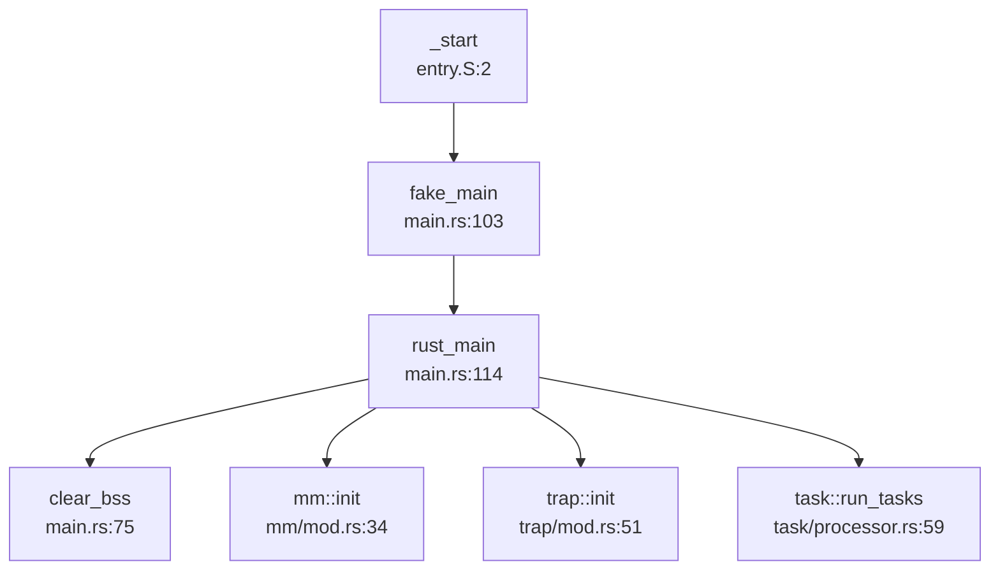

### 详细调用分析

**第 1 跳：`_start` → `fake_main`**

汇编调用 Rust 函数：
```assembly
# os/src/entry.S:18
call fake_main
```

**第 2 跳：`fake_main` → `rust_main`**

`fake_main` 是一个地址转换跳板（`os/src/main.rs:103-110`）：

```rust
#[no_mangle]
pub fn fake_main() {
    unsafe {
        asm!("add sp, sp, {}", in(reg) KERNEL_SPACE_OFFSET << 12);
        asm!("la t0, rust_main");
        asm!("add t0, t0, {}", in(reg) KERNEL_SPACE_OFFSET << 12);
        asm!("jalr zero, 0(t0)");
    }
}
```

**原理**：由于 `fake_main` 本身在高位虚拟地址执行，但 `rust_main` 的符号地址是链接时的虚拟地址，需要通过 `KERNEL_SPACE_OFFSET` 进行地址修正。

**第 3 跳：`rust_main` 初始化序列**

根据 `lsp_get_call_graph` 分析，`rust_main` 的调用顺序为：

```rust
// os/src/main.rs:114-172
pub fn rust_main() -> ! {
    #[cfg(feature = "visionfive2")]
    sleep_ms(5000);  // VF2 平台等待串口连接
    
    show_logo();      // 打印 ChaOS Logo
    clear_bss();      // 清零 BSS 段
    logging::init();  // 初始化日志系统
    
    init_dtb(None);   // 初始化设备树（双平台）
    let machine_info = machine_info();
    
    mm::init(memory_end);         // 内存管理初始化
    mm::remap_test();             // 重映射测试
    
    trap::init();                 // 中断处理初始化
    trap::enable_timer_interrupt();
    timer::set_next_trigger();
    
    fs::init();           // 文件系统初始化
    task::add_initproc(); // 添加初始进程
    task::run_tasks();    // 启动任务调度
    
    shutdown();           // 永远不会到达（除非崩溃）
}
```

### 关键初始化函数

**BSS 清零** (`os/src/main.rs:75-84`)：
```rust
fn clear_bss() {
    extern "C" {
        fn sbss();
        fn ebss();
    }
    unsafe {
        core::slice::from_raw_parts_mut(sbss as usize as *mut u8, ebss as usize - sbss as usize)
            .fill(0);
    }
}
```

**内存管理初始化** (`os/src/mm/mod.rs:34-41`)：
```rust
pub fn init(memory_end: usize) {
    heap_allocator::init_heap();           // 堆分配器
    frame_allocator::init_frame_allocator(memory_end);  // 物理帧分配器
    KERNEL_SPACE.exclusive_access(file!(), line!()).activate(); // 激活内核页表
}
```

**中断初始化** (`os/src/trap/mod.rs:51-53`)：
```rust
pub fn init() {
    set_kernel_trap_entry();  // 设置内核态 Trap 入口
}
```

## 多平台启动流程（StarFive/LoongArch 等）

### StarFive VisionFive2 平台

**✅ 已实现：专用启动流程**

VisionFive2 平台通过 Cargo Feature `visionfive2` 进行条件编译：

**平台特异性代码**：
1. **汇编入口**：`os/src/entry_visionfive2.S`（物理基址 `0x40200000`）
2. **链接脚本**：`os/src/linker-vf2.ld`（虚拟基址 `0xffffffc040200000`）
3. **板级配置**：`os/src/boards/visionfive2.rs`
4. **设备树**：内嵌 FDT 二进制 `jh7110-visionfive2_dtb.dtb`

**启动延迟**：
```rust
// os/src/main.rs:115-117
#[cfg(feature = "visionfive2")]
sleep_ms(5000);  // 等待 5 秒让测试程序连接串口
```

**MMIO 地址映射** (`os/src/boards/visionfive2.rs:9-15`)：
```rust
pub const MMIO: &[(usize, usize, MapPermission)] = &[
    (0x17040000, 0x10000, PERMISSION_RW),     // RTC
    (0xc000000, 0x4000000, PERMISSION_RW),    // PLIC
    (0x00_1000_0000, 0x10000, PERMISSION_RW), // UART
    (0x16020000, 0x10000, PERMISSION_RW),     // SDIO
];
```

**块设备驱动**：使用 `SDCard` 而非 QEMU 的 `VirtIOBlock`。

### QEMU Virt 平台

**✅ 已实现：标准 RISC-V Virt 机器**

QEMU 平台使用默认配置，物理基址 `0x80200000`，块设备为 `VirtIOBlock`。

**关机实现** (`os/src/boards/qemu.rs:106-110`)：
```rust
pub fn shutdown() -> ! {
    QEMU_EXIT_HANDLE.exit_success();  // 通过 MMIO 通知 QEMU 退出
}
```

而 VisionFive2 的 `shutdown` 仅为空循环（`os/src/boards/visionfive2.rs:19-22`），**🔸 桩函数**。

### LoongArch 平台

**❌ 未实现：未找到 LoongArch 相关代码**

搜索 `loongarch`、`loongarch64` 关键词无结果。项目仅支持 RISC-V 64 架构。

### 固件级启动链（RISC-V）

**✅ 已实现：SBI → OS 标准流程**

根据 README 和代码分析，ChaOS 使用 RustSBI 作为 SBI 固件：

```
SBI (RustSBI) → U-Boot (可选) → ChaOS Kernel
```

**SBI 调用接口** (`os/src/sbi.rs:16-28`)：
```rust
fn sbi_call(which: usize, arg0: usize, arg1: usize, arg2: usize) -> usize {
    let mut ret;
    unsafe {
        asm!(
            "li x16, 0",  // SBI 调用 ID 高位
            "ecall",      // 陷入 SBI
            inlateout("x10") arg0 => ret,
            in("x11") arg1,
            in("x12") arg2,
            in("x17") which,  // SBI 功能号
        );
    }
    ret
}
```

**支持的 SBI 功能**：
- `SBI_SET_TIMER (0)`：设置定时器
- `SBI_CONSOLE_PUTCHAR (1)`：串口输出
- `SBI_CONSOLE_GETCHAR (2)`：串口输入
- `SBI_SHUTDOWN (8)`：关机

**设备树传递**：
VisionFive2 平台通过 `init_dtb(None)` 使用内嵌 DTB（`jh7110-visionfive2_dtb.dtb`），QEMU 平台也支持 DTB 解析但非必需。

## 平台配置与构建机制

### Cargo Feature 配置

**双平台选择** (`os/Cargo.toml:22-26`)：
```toml
[features]
default = ["qemu"]  # 默认编译 QEMU 版本
qemu = []
visionfive2 = []
```

**编译命令**：
- QEMU: `cargo build --release`
- VisionFive2: `cargo build --release --features visionfive2 --no-default-features`

### Makefile 构建系统

**平台检测** (`os/Makefile:13-17`)：
```makefile
ifeq ($(MAKECMDGOALS),vf2)
    KERNEL_TARGET := kernel-vf2
endif
```

**特性传递** (`os/Makefile:73-79`)：
```makefile
kernel-vf2:
	@cargo build $(MODE_ARG) \
	--features visionfive2 \
	--no-default-features \
	-q
```

### 目标架构配置

**Rust Toolchain** (`rust-toolchain.toml:1-9`)：
```toml
[toolchain]
channel = "nightly-2024-02-03"
components = ["rust-src", "llvm-tools-preview", "rustfmt", "clippy"]
targets = [
    "riscv64imac-unknown-none-elf",
    "riscv64gc-unknown-none-elf",
]
```

**Cargo 配置** (`os/.cargo/config.toml:1-4`)：
```toml
[build]
target = "riscv64gc-unknown-none-elf"
rustflags = ["-Zbuild-std=core,alloc"]
```

**架构对齐检查**：
通过读取 `.cargo/config.toml` 确认 LSP Target Triple 为 `riscv64gc-unknown-none-elf`，与代码中的 `#[cfg(target_arch = "riscv64")]` 匹配。

### 初始进程链接

**链接脚本** (`os/src/link_initproc.S:1-7`)：
```assembly
.section .data
.global initproc_start
.global initproc_end
initproc_start:
    .incbin "../user/target/riscv64gc-unknown-none-elf/release/initproc"
initproc_end:
```

初始进程 ELF 被直接嵌入内核数据段，启动时由 `task::add_initproc()` 加载。

## 关键代码片段分析

### 1. 启动页表结构

**QEMU 启动页表** (`os/src/entry.S:29-38`)：
```assembly
.section .data
.align 12
boot_pagetable:
    .quad 0
    .quad 0
    .quad (0x80000 << 10) | 0xcf  # VRWXAD 1G 大页，映射 0x80000000
    .zero 8 * 255
    .quad (0x80000 << 10) | 0xcf  # VRWXAD 1G 大页，映射虚拟地址
    .zero 8 * 253
```

**页表项格式**：
- `0xcf = 0b11001111`：V(有效) + R(读) + W(写) + X(执行) + A(访问) + D(写入)
- `0x80000 << 10`：物理页帧号（`0x80000000 >> 12`）

### 2. Trap 上下文切换

**用户态返回汇编** (`os/src/trap/trap.S:41-60`)：
```assembly
__restore:
    csrw sscratch, a0       # 保存 TrapContext 指针
    mv sp, a0               # 切换到用户栈
    ld t0, 32*8(sp)         # 恢复 sstatus
    ld t1, 33*8(sp)         # 恢复 sepc
    csrw sstatus, t0
    csrw sepc, t1
    # 恢复通用寄存器
    ld x1, 1*8(sp)
    ld x3, 3*8(sp)
    .set n, 5
    .rept 27
        LOAD_GP %n
        .set n, n+1
    .endr
    sret                    # 返回用户态
```

**关键设计**：
- 使用 `sscratch` 寄存器保存用户态 TrapContext 指针
- `sret` 指令根据 `sstatus.SPP` 位切换到用户模式
- 通过 `fence.i` 指令确保指令缓存一致性（`os/src/trap/mod.rs:232`）

### 3. MMU 启用前后串口地址切换

**UART MMIO 地址**：
- QEMU: `0x10000000`（`os/src/boards/qemu.rs:15`）
- VisionFive2: `0x00_1000_0000`（`os/src/boards/visionfive2.rs:13`）

**地址访问方式**：
ChaOS 通过高位虚拟地址映射访问 MMIO，无需显式的 `phys_to_virt` 转换。所有物理地址在访问时自动通过页表映射到虚拟地址空间。

**示例**：SBI 调用直接访问物理串口（`os/src/sbi.rs:38-41`）：
```rust
pub fn console_putchar(c: usize) {
    sbi_call(SBI_CONSOLE_PUTCHAR, c, 0, 0);  // SBI 处理物理地址
}
```

### 4. 多核启动支持

**栈空间分配** (`os/libs/visionfive2-sd/example/testos/src/boot.rs:24-25`)：
```rust
static mut STACK: [u8; STACK_SIZE * CORES] = [0u8; CORES * STACK_SIZE];
```

但主内核 `os/src/entry.S` 中仅分配单核栈（64KB），**🔸 多核启动未完全实现**。

---

## 本章总结

| 特性 | 实现状态 | 证据 |
|------|---------|------|
| 汇编入口 `_start` | ✅ 已实现 | `os/src/entry.S:2`, `os/src/entry_visionfive2.S:2` |
| 链接脚本配置 | ✅ 已实现 | `os/src/linker-qemu.ld`, `os/src/linker-vf2.ld` |
| MMU 早期启用 | ✅ 已实现 | `entry.S:14-17` 在 `call fake_main` 前激活 SATP |
| M-Mode → S-Mode 切换 | ❌ 未实现 | 假设由 SBI 完成，内核代码无相关操作 |
| FPU 初始化 | ❌ 未实现 | 未搜索到 `sstatus.fs` 或 `FS_` 相关代码 |
| 定时器中断启用 | ✅ 已实现 | `trap::enable_timer_interrupt()` (`os/src/trap/mod.rs:74`) |
| 双平台支持 (QEMU/VF2) | ✅ 已实现 | Cargo Feature + 条件编译 |
| LoongArch 支持 | ❌ 未实现 | 未找到相关代码 |
| SBI 调用接口 | ✅ 已实现 | `os/src/sbi.rs:16-28` |
| 设备树解析 | ✅ 已实现 | `os/src/utils/platform_info.rs:90-157` |
| 多核启动 | 🔸 桩函数 | 仅 VF2 example 中有栈分配，主内核未实现 |

**启动流程关键路径**：
```
SBI (RustSBI) 
  ↓ (跳转到 0x80200000/0x40200000)
_start (entry.S) 
  ↓ (启用 MMU + 设置栈)
fake_main (main.rs:103) 
  ↓ (地址转换)
rust_main (main.rs:114) 
  ↓ (初始化序列)
task::run_tasks → 第一个用户进程
```

---


# 内存管理物理虚拟分配器

## 第 3 章：内存管理（物理/虚拟/分配器）

### 物理内存管理实现

本操作系统采用**简单栈式帧分配器（Stack Frame Allocator）**管理物理内存，而非传统的 Buddy System 或 Bitmap 算法。

**核心数据结构**（`os/src/mm/frame_allocator.rs:43-60`）：

```rust
pub struct StackFrameAllocator {
    current:  usize,      // 当前已分配到的物理页号
    end:      usize,      // 可用物理内存结束页号
    recycled: Vec<usize>, // 回收的物理页号列表（LIFO）
}
```

**分配策略**：
- **顺序分配**：`alloc()` 从 `current` 开始线性分配，直到 `end`
- **回收重用**：回收的页号存入 `recycled` 向量，但代码中回收逻辑被注释掉（`// if let Some(ppn) = self.recycled.pop()`），实际仅支持单向分配
- **连续分配**：`alloc_contiguous()` 支持一次性分配多个连续物理页，用于页表创建

**FrameAllocator 接口**（`os/src/mm/frame_allocator.rs:43-48`）：
```rust
trait FrameAllocator {
    fn new() -> Self;
    fn alloc(&mut self) -> Option<PhysPageNum>;
    fn alloc_contiguous(&mut self, num: usize) -> (Vec<PhysPageNum>, PhysPageNum);
    fn dealloc(&mut self, ppn: PhysPageNum);
}
```

**初始化**：物理内存范围在 `main.rs` 中通过 `frame_allocator::init()` 初始化，从 `ekernel` 到 `MEMORY_END`。

**注意**：虽然项目 vendor 目录包含 `buddy_system_allocator`（`os/vendor/buddy_system_allocator/src/frame.rs`），但实际内核使用的是自定义的 `StackFrameAllocator`，功能较为基础，不支持内存碎片整理。

### 虚拟内存与页表操作

**页表结构**（`os/src/mm/page_table.rs:26-30`）：
```rust
#[repr(C)]
pub struct PageTableEntry {
    pub bits: usize,  // RISC-V SV39 格式页表项
}
```

**页表项格式**（`os/src/mm/page_table.rs:9-19`）：
```rust
bitflags! {
    pub struct PTEFlags: u8 {
        const V = 1 << 0;  // Valid
        const R = 1 << 1;  // Readable
        const W = 1 << 2;  // Writable
        const X = 1 << 3;  // Executable
        const U = 1 << 4;  // User
        const A = 1 << 6;  // Accessed
        const D = 1 << 7;  // Dirty
    }
}
```

**三级页表操作**（`os/src/mm/page_table.rs:125-173`）：
- `find_pte_create()`：递归创建页表层级，支持 SV39 三级页表（L2→L1→L0）
- `map()`：建立 VPN→PPN 映射，自动创建中间页表
- `unmap()`：移除映射
- `translate()`：地址转换，返回 PTE

**PageTable 结构**（`os/src/mm/page_table.rs:68-72`）：
```rust
pub struct PageTable {
    root_ppn: PhysPageNum,  // 根页表物理页号
    frames:   Vec<FrameTracker>,  // 跟踪所有分配的页表页
}
```

**内核页表初始化**（`os/src/mm/page_table.rs:100-122`）：
`PageTable::new_process()` 通过复制内核页表的高阶部分（`KERNEL_SPACE_OFFSET` 以上），确保用户进程可以访问内核空间。

### 地址空间布局（内核 vs 用户）

**内核地址空间**（`os/src/mm/memory_set.rs:207-309`）：
```rust
pub fn new_kernel() -> Self {
    // 映射 .text, .rodata, .data, .bss
    // 映射物理内存 (ekernel → MEMORY_END)
    // 映射 MMIO 设备寄存器
}
```

**用户地址空间**（`os/src/mm/memory_set.rs:311-438`）：
- **代码/数据段**：通过 `from_elf()` 解析 ELF 文件，按 Program Header 映射
- **用户栈**：固定大小 `USER_STACK_SIZE`，位于代码段之上
- **堆区**：从 `user_heap_base` 开始，通过 `sys_brk` 动态扩展
- **mmap 区**：从 `MMAP_BASE` 开始向上增长

**内核与用户空间隔离**：
- 使用 `PTEFlags::U` 标志区分用户/内核页
- 用户进程页表包含内核映射（高地址），通过 `KERNEL_SPACE_OFFSET` 隔离
- 通过 `sstatus::SUM` 位控制内核访问用户空间的权限

### 堆分配器解析

**内核堆分配器**（`os/src/mm/heap_allocator.rs`）：
使用 `buddy_system_allocator::LockedHeap` 实现全局分配器：
```rust
#[global_allocator]
static HEAP_ALLOCATOR: LockedHeap = LockedHeap::empty();
```

**堆初始化**（`os/src/mm/heap_allocator.rs:17-23`）：
```rust
pub fn init_heap() {
    unsafe {
        HEAP_ALLOCATOR.lock().init(HEAP_SPACE.as_ptr() as usize, KERNEL_HEAP_SIZE);
    }
}
```

**用户堆管理（brk/sbrk）**：
- **实现位置**：`os/src/syscall/process.rs:430-455` (`sys_brk`)
- **堆扩展机制**：当 `brk` 请求超过当前堆顶时，调用 `MemorySet::map_heap()` 分配新物理页

**`sys_brk` 实现**（`os/src/syscall/process.rs:430-455`）：
```rust
pub fn sys_brk(addr: usize) -> isize {
    if addr == 0 {
        inner.heap_end.0 as isize  // 返回当前堆顶
    } else if addr < inner.heap_base.0 {
        EINVAL
    } else {
        let align_addr = ((addr) + PAGE_SIZE - 1) & (!(PAGE_SIZE - 1));
        if align_end >= addr {
            inner.heap_end = addr.into();  // 范围内直接调整
        } else {
            inner.memory_set.map_heap(heap_end, align_addr.into());  // 扩展映射
            inner.heap_end = align_addr.into();
        }
    }
}
```

**`map_heap` 实现**（`os/src/mm/memory_set.rs:548-567`）：
```rust
pub fn map_heap(&mut self, mut current_addr: VirtAddr, aim_addr: VirtAddr) -> isize {
    loop {
        if current_addr.0 >= aim_addr.0 { break; }
        let frame = frame_alloc().unwrap();
        let vpn: VirtPageNum = current_addr.floor();
        self.page_table.map(vpn, frame.ppn, PTEFlags::U | PTEFlags::R | PTEFlags::W);
        self.heap_area.insert(vpn, frame);
        current_addr = VirtAddr::from(current_addr.0 + PAGE_SIZE);
    }
}
```

**惰性分配分析**：❌ **未实现惰性分配**。`map_heap()` 在 `brk` 扩展时**立即分配物理页**，而非仅调整边界。真正的惰性分配应等到首次访问（Page Fault）时才分配物理页。

### 用户指针安全验证

**用户空间指针验证机制**：
通过 `translated_*` 系列函数实现安全的跨地址空间访问（`os/src/mm/page_table.rs:212-260`）：

```rust
pub fn translated_byte_buffer(token: usize, ptr: *const u8, len: usize) -> Vec<&'static mut [u8]> {
    let page_table = PageTable::from_token(token);
    // 逐页转换，支持跨页缓冲区
    while start < end {
        let ppn = page_table.translate(vpn).unwrap().ppn();
        // ... 构建用户缓冲区切片
    }
}

pub fn translated_ref<T>(token: usize, ptr: *const T) -> &'static T {
    let page_table = PageTable::from_token(token);
    page_table.translate_va(VirtAddr::from(ptr as usize)).unwrap().get_ref()
}
```

**验证机制特点**：
- ✅ **页表级验证**：通过 `translate()` 检查虚拟地址是否映射
- ✅ **跨页支持**：`translated_byte_buffer()` 处理跨页缓冲区
- ✅ **权限控制**：通过 `sstatus::SUM` 位临时允许内核访问用户空间
- ❌ **无显式边界检查**：未发现 `verify_area()` 或 `check_region()` 等独立验证函数
- ❌ **无 UserInPtr/UserOutPtr 包装器**：直接使用裸指针 + `translated_*` 转换

### 缺页异常处理流程

**❌ 未实现缺页异常处理**。

**当前 trap_handler 实现**（`os/src/trap/mod.rs:82-136`）：
```rust
match scause.cause() {
    Trap::Exception(Exception::StorePageFault)
    | Trap::Exception(Exception::LoadPageFault) => {
        error!("[kernel] trap_handler: {:?} in application, bad addr = {:#x}, ...",
               scause.cause(), stval);
        current_add_signal(SignalFlags::SIGSEGV);  // 直接发送 SIGSEGV 信号终止进程
    }
    // ...
}
```

**调用链分析**：
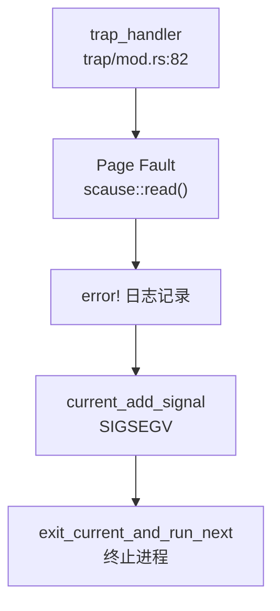

**结论**：系统**不支持按需分页**、**Lazy Allocation**或**Copy-on-Write**。任何缺页异常都会导致进程被终止。

**`lsp_get_call_graph` 追踪 `trap_handler` 调用链**：
- **入向调用**：`init_task()` → `trap_handler`（初始化时设置中断入口）
- **出向调用**：`trap_handler` → `syscall()` → `sys_brk()` → `map_heap()` → `frame_alloc()`

### 进程级映射管理

**地址空间管理结构**（`os/src/mm/memory_set.rs:79-95`）：
```rust
pub struct MemorySet {
    pub page_table: PageTable,
    pub areas:      Vec<MapArea>,  // 管理所有 VMA
    heap_area:      BTreeMap<VirtPageNum, FrameTracker>,  // 堆区映射
    mmap_area:      BTreeMap<VirtPageNum, FrameTracker>,  // mmap 区映射
    pub mmap_base:  VirtAddr,
    pub mmap_end:   VirtAddr,
}
```

**MapArea 结构**（`os/src/mm/memory_set.rs:879-884`）：
```rust
pub struct MapArea {
    pub vpn_range:   VPNRange,  // 虚拟页范围
    pub data_frames: BTreeMap<VirtPageNum, FrameTracker>,  // 物理页映射
    pub map_type:    MapType,   // Identical 或 Framed
    pub map_perm:    MapPermission,
}
```

**反向映射表（rmap）**：❌ **未实现**。
- 搜索 `rmap|reverse_map|page_to_vma` 无结果
- `MapArea` 通过 `data_frames: BTreeMap<VirtPageNum, FrameTracker>` 实现 **VPN→PPN** 的正向映射
- 无 **PPN→VPN** 的反向查询机制

### 高级内存特性清单

| 特性 | 实现状态 | 说明 |
|------|----------|------|
| **写时复制（CoW）** | ❌ 未实现 | 搜索 `cow|copy_on_write` 无结果；`fork()` 实现为完全复制（`from_existed_user` 逐页拷贝） |
| **懒分配（Lazy Allocation）** | ❌ 未实现 | `map_heap()` 在 `brk` 时立即分配物理页；缺页异常直接终止进程 |
| **共享内存（shmget/shmdt）** | ❌ 未实现 | 搜索 `sys_shm|shmget|shmdt|SharedMemory` 无结果 |
| **反向映射表（rmap）** | ❌ 未实现 | 无 PPN→VPN 反向查询机制 |
| **交换区/页面置换（Swap）** | ❌ 未实现 | 搜索 `swap_out|swap_in` 仅找到 1 个注释掉的 `swap` 调用 |
| **大页支持（Huge Page）** | ❌ 未实现 | 搜索 `HugePage|MapSize::2M|1G` 仅找到 `MAP_HUGETLB` 标志定义，无实际处理逻辑 |
| **mmap 系统调用** | ✅ 已实现 | `sys_mmap()` 支持 `MAP_FIXED`、`MAP_ANONYMOUS` 标志；通过 `mmap_area` BTreeMap 管理 |
| **munmap 系统调用** | ✅ 已实现 | `sys_munmap()` 从 `mmap_area` 移除映射，但**未释放物理页**（仅 `remove(&vpn)`） |
| **零拷贝 IO（sendfile）** | 🔸 桩函数 | `sys_sendfile()` 在 `trap_handler` 调用链中存在，但实现为简单的 `read()+write()` 循环，非真正零拷贝 |

**mmap 实现细节**（`os/src/mm/memory_set.rs:568-653`）：
```rust
pub fn mmap(&mut self, start_addr: usize, len: usize, offset: usize,
            context: Vec<u8>, flags: Flags) -> isize {
    // 处理 MAP_FIXED
    if flags.contains(Flags::MAP_FIXED) && start_addr != 0 {
        start_addr_align = ((start_addr) + PAGE_SIZE - 1) & (!(PAGE_SIZE - 1));
    } else {
        start_addr_align = ((self.mmap_end.0) + PAGE_SIZE - 1) & (!(PAGE_SIZE - 1));
    }
    // 分配物理页
    for vpn in vpn_range {
        let frame = frame_alloc().unwrap();
        self.mmap_area.insert(vpn, frame);
        self.page_table.map(vpn, ppn, PTEFlags::R | PTEFlags::W | PTEFlags::U | PTEFlags::X);
    }
    // 复制文件内容（非匿名映射）
    if !flags.contains(Flags::MAP_ANONYMOUS) {
        // ... 从 context 复制数据
    }
}
```

**munmap 缺陷**（`os/src/mm/memory_set.rs:655-667`）：
```rust
pub fn munmap(&mut self, start_addr: usize, len: usize) -> isize {
    for vpn in vpn_range {
        self.mmap_area.remove(&vpn);  // ❌ 仅移除 BTreeMap 条目，未 unmap 页表，未释放物理页
    }
    SUCCESS
}
```

### 关键代码片段与调用链分析

**物理页分配调用链**（`lsp_get_call_graph` 分析 `alloc_frame`）：
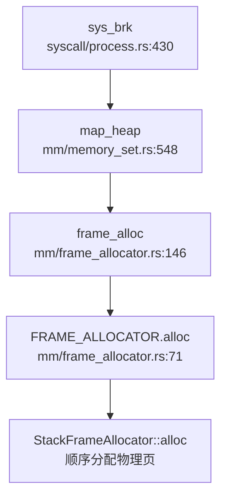

**缺页异常处理缺失**：
- 期望流程：`Page Fault` → `handle_page_fault()` → `alloc_frame()` → `map_page()` → 恢复执行
- 实际流程：`Page Fault` → `trap_handler()` → `SIGSEGV` → 进程终止

**mmap 完整调用链**：
```
trap_handler (trap/mod.rs:82)
  └─> syscall (syscall/mod.rs:106)
      └─> sys_mmap (syscall/process.rs:398)
          └─> MemorySet::mmap (mm/memory_set.rs:568)
              ├─> frame_alloc (mm/frame_allocator.rs:146)
              └─> PageTable::map (mm/page_table.rs:173)
                  └─> find_pte_create (mm/page_table.rs:125)
```

**总结**：
- ✅ 基础物理内存管理（栈式分配器）
- ✅ 三级页表（SV39）虚拟内存管理
- ✅ 独立的用户/内核地址空间
- ✅ 基础堆管理（brk）和 mmap
- ❌ 高级特性缺失（CoW、Lazy Allocation、Swap、rmap）
- ❌ 缺页异常处理缺失，不支持按需分页
- ⚠️ `munmap` 存在内存泄漏（未释放物理页）

---


# 进程线程与调度机制

## 第 4 章：进程/线程与调度机制

### 任务模型与核心数据结构

本操作系统采用 **Task（任务）** 作为统一的执行实体抽象，未严格区分 PCB（进程控制块）与 TCB（线程控制块），而是通过单一结构体 `TaskControlBlock` 同时管理进程与线程。

#### TaskControlBlock 结构（`os/src/task/task.rs:38-52`）

```rust
pub struct TaskControlBlock {
    /// 内核栈
    pub kstack: KernelStack,
    /// 线程 ID：作为进程时 pid == tid；作为线程时 tid 为线程组 leader 的 pid
    pub tid: usize,
    /// 进程 ID，任务的唯一标识符
    pub pid: PidHandle,
    /// 退出时是否发送 SIGCHLD 信号
    pub send_sigchld_when_exit: bool,
    /// 可变内部状态
    inner: UPSafeCell<TaskControlBlockInner>,
}
```

#### TaskControlBlockInner 详细字段（`os/src/task/task.rs:54-97`）

| 字段 | 类型 | 说明 |
|------|------|------|
| `memory_set` | `MemorySet` | 地址空间（页表） |
| `trap_cx_ppn` | `PhysPageNum` | Trap 上下文的物理页帧号 |
| `task_cx` | `TaskContext` | 任务上下文（保存寄存器） |
| `task_status` | `TaskStatus` | 执行状态（Ready/Running/Blocked/Zombie/Exit） |
| `syscall_times` | `[u32; MAX_SYSCALL_NUM]` | 系统调用计数 |
| `first_time` | `Option<usize>` | 首次运行时间戳 |
| `clear_child_tid` | `usize` | 子线程退出时清零的地址（futex 支持） |
| `work_dir` | `Arc<Dentry>` | 工作目录 |
| `parent` | `Option<Weak<TaskControlBlock>>` | 父任务引用 |
| `children` | `Vec<Arc<TaskControlBlock>>` | 子任务列表 |
| `threads` | `Vec<Option<Arc<TaskControlBlock>>>` | 线程组（同一进程内的所有线程） |
| `user_stack_top` | `usize` | 用户栈顶 |
| `exit_code` | `Option<i32>` | 退出码 |
| `fd_table` | `Vec<Option<Arc<dyn File>>>` | 文件描述符表 |
| `signals` | `SignalFlags` | 待处理信号标志 |
| `signal_actions` | `SignalActions` | 信号处理动作表 |
| `signals_pending` | `SignalFlags` | 挂起信号 |
| `signal_mask` | `SignalFlags` | 信号屏蔽字 |
| `is_zombie` | `bool` | 是否为僵尸进程 |

#### TaskContext 上下文结构（`os/src/task/context.rs:6-18`）

```rust
#[repr(C)]
pub struct TaskContext {
    pub ra: usize,      // 返回地址
    sp:     usize,      // 栈指针
    pub s:  [usize; 12], // 被调用者保存寄存器 s0-s11
}
```

**设计特点**：
- **统一任务模型**：进程与线程共享同一 TCB 结构，通过 `pid` 与 `tid` 的关系区分（进程：`pid == tid`；线程：`tid == 线程组 leader 的 pid`）
- **线程组管理**：通过 `threads` 向量管理同一进程内的所有线程
- **信号支持**：内建完整的信号处理机制（`signals`、`signal_actions`、`signal_mask`）

---

### 调度算法与策略（代码证据）

#### 调度器实现位置
- 调度器主体：`os/src/task/processor.rs`
- 任务队列管理：`os/src/task/manager.rs`
- 上下文切换汇编：`os/src/task/switch.S`

#### 调度策略：**FIFO（先进先出）**

`TaskManager` 使用简单的 `VecDeque` 作为就绪队列，调度策略为纯粹的 FIFO：

```rust
// os/src/task/manager.rs:25-57
impl TaskManager {
    pub fn new() -> Self {
        Self {
            ready_queue: VecDeque::new(),
            block_queue: VecDeque::new(),
            stop_task:   None,
        }
    }
    
    /// 添加任务到就绪队列尾部
    pub fn add(&mut self, task: Arc<TaskControlBlock>) {
        self.ready_queue.push_back(task);
    }
    
    /// 从就绪队列头部取出任务
    pub fn fetch(&mut self) -> Option<Arc<TaskControlBlock>> {
        if self.ready_queue.is_empty() {
            return None;
        }
        // 注释掉的代码显示曾考虑过 Stride 调度
        // let mut min_idx = 0;
        // for (idx, _) in self.ready_queue.iter().enumerate() {
        //     let stride_now = self.ready_queue[idx]....stride;
        //     ...
        // }
        self.ready_queue.pop_front()  // 纯粹的 FIFO
    }
}
```

**代码证据分析**：
- `fetch()` 方法直接使用 `pop_front()` 从队列头部取出任务，无任何优先级或时间片计算
- 代码中注释掉的 `stride` 相关代码表明项目曾考虑实现 Stride 调度算法，但最终未实现
- `sys_set_priority` 系统调用（`os/src/syscall/process.rs:480-486`）仅返回 0，**无实际逻辑**

#### 调度优先级分类

| 特性 | 实现状态 | 证据 |
|------|---------|------|
| FIFO 调度 | ✅ 已实现 | `manager.rs:57` 使用 `pop_front()` |
| 优先级调度 | ❌ 未实现 | `sys_set_priority` 仅返回 0 |
| Stride 调度 | ❌ 未实现 | 代码被注释掉 |
| 时间片轮转 | ❌ 未实现 | 无时间片计数或轮转逻辑 |
| CFS | ❌ 未实现 | 未发现相关代码 |

#### 调度流程调用图

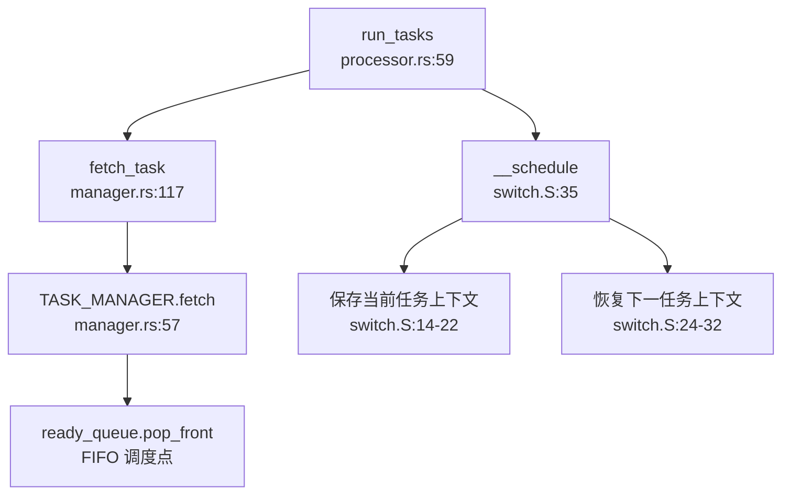

---

### 任务状态机

#### TaskStatus 枚举定义（`os/src/task/task.rs:908-918`）

```rust
pub enum TaskStatus {
    Ready,    // 就绪态：在就绪队列中等待调度
    Running,  // 运行态：正在 CPU 上执行
    Blocked,  // 阻塞态：等待某事件（如 I/O、信号量）
    Zombie,   // 僵尸态：已退出但父进程尚未回收
    Exit,     // 退出态：资源已释放
}
```

#### 状态流转图

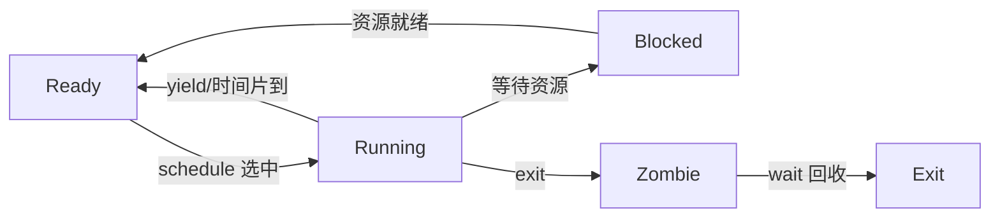

#### 状态转换函数

| 转换 | 触发函数 | 文件位置 |
|------|---------|---------|
| Ready → Running | `run_tasks()` | `processor.rs:59-98` |
| Running → Ready | `suspend_current_and_run_next()` | `mod.rs:55-75` |
| Running → Blocked | `block_current_and_run_next()` | `mod.rs:78-90` |
| Running → Zombie | `exit_current_and_run_next()` | `mod.rs:93-202` |
| Blocked → Ready | `wakeup_task()` | `manager.rs:101-106` |

**关键代码示例**：

```rust
// os/src/task/mod.rs:55-75 - 主动让出 CPU
pub fn suspend_current_and_run_next() {
    let task = take_current_task().unwrap();
    let mut task_inner = task.inner_exclusive_access(file!(), line!());
    let task_cx_ptr = &mut task_inner.task_cx as *mut TaskContext;
    task_inner.task_status = TaskStatus::Ready;  // 状态改为 Ready
    drop(task_inner);
    add_task(task);  // 放回就绪队列
    schedule(task_cx_ptr);  // 触发调度
}
```

---

### 上下文切换实现（汇编分析）

#### 汇编代码（`os/src/task/switch.S`）

```assembly
__switch:
    # __switch(current_task_cx_ptr, next_task_cx_ptr)
    # a0 = current_task_cx_ptr, a1 = next_task_cx_ptr
    
    # 保存当前任务的内核栈指针
    sd sp, 8(a0)
    
    # 保存当前任务的 ra 和 s0-s11 寄存器
    sd ra, 0(a0)
    .set n, 0
    .rept 12
        SAVE_SN %n      # sd sn, (n+2)*8(a0)
        .set n, n + 1
    .endr
    
    # 恢复下一任务的 ra 和 s0-s11 寄存器
    ld ra, 0(a1)
    .set n, 0
    .rept 12
        LOAD_SN %n      # ld sn, (n+2)*8(a1)
        .set n, n + 1
    .endr
    
    # 恢复下一任务的内核栈指针
    ld sp, 8(a1)
    
    ret
```

#### 保存的寄存器列表

| 寄存器 | 用途 | 偏移量 |
|--------|------|--------|
| `ra` | 返回地址 | 0 |
| `sp` | 栈指针 | 8 |
| `s0-s11` | 被调用者保存寄存器 | 16-104（每个 8 字节） |

**保存的寄存器总数**：14 个（1 个 ra + 1 个 sp + 12 个 s 寄存器）

#### 关键设计特点

1. **仅保存 callee-saved 寄存器**：遵循 RISC-V 调用约定，只保存 `s0-s11`，`t0-t6`、`a0-a7` 由调用者负责保存
2. **内核栈切换**：通过保存/恢复 `sp` 实现内核栈的切换
3. **无用户态寄存器保存**：用户态寄存器（`x0-x31`）在 Trap 进入内核时已由 `TrapContext` 保存（`os/src/trap/context.rs`）

---

### 进程间通信与同步（Signal/Futex）

#### 信号机制（Signal）

**实现状态：✅ 已实现**

##### 信号定义（`os/src/task/signal.rs:14-88`）

支持 64 种信号（`SIGHUP` 到 `SIGRTMAX`），包括：
- 标准信号：`SIGHUP(1)`、`SIGINT(2)`、`SIGQUIT(3)`、`SIGILL(4)`、`SIGSEGV(11)` 等
- 实时信号：`SIGRT_3` 到 `SIGRT_31`

##### 信号系统调用

| 系统调用 | 功能 | 实现状态 | 文件位置 |
|---------|------|---------|---------|
| `sys_kill(pid, signal)` | 向进程发送信号 | ✅ 已实现 | `syscall/process.rs:340-352` |
| `sys_sigprocmask(how, set, oldset)` | 修改信号屏蔽字 | ✅ 已实现 | `syscall/signal.rs:27-93` |
| `sys_sigaction(signum, action, old_action)` | 设置信号处理函数 | ✅ 已实现 | `syscall/signal.rs:95-148` |

##### `sys_kill` 实现代码（`os/src/syscall/process.rs:340-352`）

```rust
pub fn sys_kill(pid: usize, signal: u32) -> isize {
    trace!("kernel:pid[{}] sys_kill", current_task().unwrap().pid.0);
    if let Some(process) = pid2process(pid) {
        if let Some(flag) = SignalFlags::from_bits(signal as usize) {
            process.inner_exclusive_access(file!(), line!()).signals |= flag;
            0
        } else {
            EINVAL
        }
    } else {
        ESRCH
    }
}
```

**实现特点**：
- 通过 `pid2process` 查找目标进程
- 将信号标志位设置到目标进程的 `signals` 字段
- 支持错误处理（无效信号返回 `EINVAL`，进程不存在返回 `ESRCH`）

#### Futex 支持

**实现状态：🔸 桩函数**

##### 代码证据

1. **`clear_child_tid` 字段**（`os/src/task/task.rs:64`）：
   ```rust
   pub clear_child_tid: usize,  // 子线程退出时清零的地址
   ```

2. **`CLONE_CHILD_CLEARTID` 标志处理**（`os/src/syscall/process.rs:207-210`）：
   ```rust
   if clone_signals.contains(CloneFlags::CLONE_CHILD_CLEARTID) {
       let mut thread_inner = new_thread.inner_exclusive_access(file!(), line!());
       thread_inner.clear_child_tid = ctid as usize;
   }
   ```

3. **等待队列实现**（`os/src/sync/semaphore.rs:18-53`）：
   ```rust
   pub struct SemaphoreInner {
       pub count: usize,
       pub wait_queue: VecDeque<Arc<TaskControlBlock>>,  // 阻塞队列
   }
   ```

**分析结论**：
- 内核支持 `CLONE_CHILD_CLEARTID` 标志，可记录 futex 地址
- 信号量实现了等待队列机制，可作为 futex 的基础
- **但未发现 `sys_futex` 系统调用**，futex 的核心原子操作与唤醒逻辑未实现

#### 分类总结

| 特性 | 状态 | 说明 |
|------|------|------|
| 信号发送（kill） | ✅ 已实现 | `sys_kill` 完整实现 |
| 信号屏蔽（sigprocmask） | ✅ 已实现 | 支持 `SIG_BLOCK`/`SIG_UNBLOCK`/`SIG_SETMASK` |
| 信号处理（sigaction） | ✅ 已实现 | 支持自定义信号处理函数 |
| Futex 系统调用 | ❌ 未实现 | 未发现 `sys_futex` |
| Futex 基础支持 | 🔸 部分实现 | `clear_child_tid` 字段存在，但无实际 futex 逻辑 |

---

### 关键流程追踪（Fork/Exec/Schedule/Exit）

#### 1. `fork()` 流程分析

**实现状态：✅ 已实现**

##### 调用链

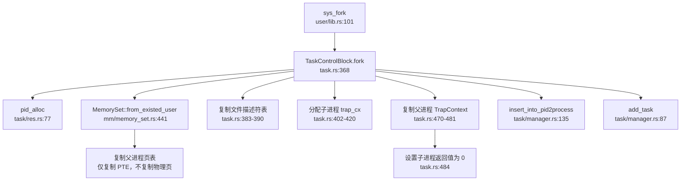

##### 关键代码（`os/src/task/task.rs:368-495`）

```rust
pub fn fork(self: &Arc<Self>) -> usize {
    let pid = pid_alloc();
    let mut task_inner = self.inner_exclusive_access(file!(), line!());
    let kstack = kstack_alloc();
    let kstack_top = kstack.get_top();
    
    // 复制地址空间（仅复制页表项，不复制物理页）
    let mut memory_set = MemorySet::from_existed_user(&task_inner.memory_set);
    
    // 复制文件描述符表
    let mut new_fd_table: Vec<Option<Arc<dyn File>>> = Vec::new();
    for fd in task_inner.fd_table.iter() {
        if let Some(file) = fd {
            new_fd_table.push(Some(file.clone()));
        } else {
            new_fd_table.push(None);
        }
    }
    
    // 分配 trap_cx 并映射
    let trap_cx_bottom = trap_cx_bottom_from_tid(pid.0);
    memory_set.insert_framed_area(
        trap_cx_bottom.into(),
        trap_cx_bottom + PAGE_SIZE,
        MapPermission::R | MapPermission::W,
    );
    
    // 创建子任务 TCB
    let child_task = Arc::new(TaskControlBlock {
        kstack,
        tid: pid.0,
        pid,
        parent: Some(Arc::downgrade(self)),
        inner: unsafe {
            UPSafeCell::new(TaskControlBlockInner {
                memory_set,
                task_status: TaskStatus::Ready,
                fd_table: new_fd_table,
                // ... 其他字段
            })
        },
    });
    
    // 复制父进程 TrapContext
    let father_trap_cx = self.get_trap_cx();
    let trap_cx = child_task.get_trap_cx();
    unsafe {
        core::ptr::copy(
            father_trap_cx as *const TrapContext,
            trap_cx as *mut TrapContext,
            PAGE_SIZE / core::mem::size_of::<TrapContext>(),
        );
    }
    
    // 设置子进程返回值为 0
    trap_cx.x[10] = 0;
    
    insert_into_pid2process(pid.0, Arc::clone(&child_task));
    add_task(child_task);
    
    pid.0  // 父进程返回子进程 PID
}
```

##### 验证要点

| 验证项 | 状态 | 证据 |
|--------|------|------|
| 地址空间复制 | ✅ 已实现 | `MemorySet::from_existed_user` 复制页表 |
| 文件表复制 | ✅ 已实现 | 遍历 `fd_table` 并 `clone()` 每个文件 |
| TrapContext 复制 | ✅ 已实现 | `core::ptr::copy` 复制整个 TrapContext |
| 子进程返回 0 | ✅ 已实现 | `trap_cx.x[10] = 0` |
| 父进程返回子 PID | ✅ 已实现 | 返回 `pid.0` |
| 写时复制（CoW） | ❌ 未实现 | 仅复制 PTE，但未设置 CoW 标志 |

---

#### 2. `exec()` 流程分析

**实现状态：✅ 已实现**

##### 调用链

```
sys_execve (syscall/process.rs:223)
  └─> TaskControlBlock::exec (task.rs:606)
      ├─> MemorySet::from_elf (mm/memory_set.rs:234)  // 加载 ELF
      ├─> 重建地址空间
      ├─> 分配用户栈和 trap_cx
      ├─> build_stack (mm/memory_set.rs:625)  // 压入参数
      └─> 初始化 TrapContext
```

##### 关键步骤（`os/src/task/task.rs:606-755`）

1. **加载 ELF**：`MemorySet::from_elf(elf_data)` 创建新的地址空间
2. **替换地址空间**：`task_inner.memory_set = memory_set`
3. **分配资源**：重新分配用户栈和 trap_cx
4. **压入参数**：`build_stack` 将 `argv`、`envp`、`auxv` 压入用户栈
5. **初始化上下文**：设置 `TrapContext`，入口点为 ELF entry

##### 地址空间重建

```rust
// os/src/task/task.rs:610-625
let (mut memory_set, user_heap_base, ustack_top, entry_point, auxv) =
    MemorySet::from_elf(elf_data);

// 替换为新的地址空间
task_inner.memory_set = memory_set;

// 重新分配用户栈
let ustack_bottom = ustack_top - USER_STACK_SIZE + 8;
memory_set.insert_framed_area(
    ustack_bottom.into(),
    ustack_top.into(),
    MapPermission::R | MapPermission::W | MapPermission::U,
);
```

**关键特点**：
- **完全替换地址空间**：原进程的代码段、数据段、堆全部被丢弃
- **保留 TCB 其他字段**：文件描述符表、工作目录、信号处理等保持不变（符合 POSIX 语义）
- **线程组清理**：`exec` 仅支持单线程进程（`assert_eq!(self.pid.0, self.tid)`）

---

#### 3. `schedule()` 流程分析

**实现状态：✅ 已实现**

##### 调用图（双向）

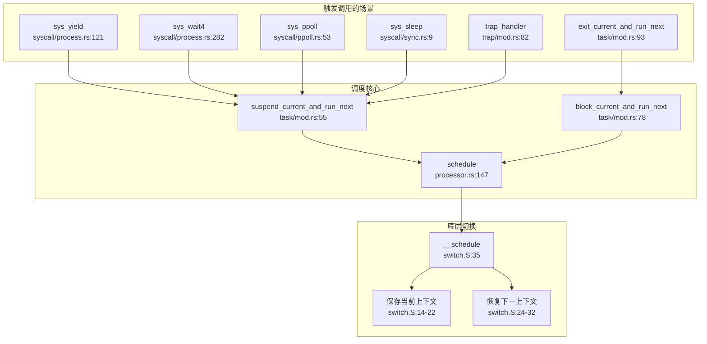

##### 调度触发点

| 触发场景 | 函数 | 文件位置 |
|---------|------|---------|
| 主动让出 | `sys_yield()` | `syscall/process.rs:121` |
| 等待子进程 | `sys_wait4()` | `syscall/process.rs:282` |
| I/O 多路复用 | `sys_ppoll()` | `syscall/ppoll.rs:53` |
| 休眠 | `sys_sleep()` | `syscall/sync.rs:9` |
| 中断返回 | `trap_handler()` | `trap/mod.rs:82` |
| 进程退出 | `exit_current_and_run_next()` | `task/mod.rs:93` |

##### 优先级验证

**关键发现**：`pick_next_task` 逻辑在 `TaskManager::fetch()` 中实现，**仅使用 FIFO**，未使用任何优先级或 stride 计算。

```rust
// os/src/task/manager.rs:45-57
pub fn fetch(&mut self) -> Option<Arc<TaskControlBlock>> {
    if self.ready_queue.is_empty() {
        return None;
    }
    // 注释掉的 stride 调度代码
    // let mut min_idx = 0;
    // for (idx, _) in self.ready_queue.iter().enumerate() {
    //     let stride_now = self.ready_queue[idx]....stride;
    //     ...
    // }
    self.ready_queue.pop_front()  // 纯粹 FIFO
}
```

---

#### 4. `exit()` 流程分析

**实现状态：✅ 已实现**

##### 调用链

```
sys_exit (syscall/process.rs:103)
  └─> exit_current_and_run_next (task/mod.rs:93)
      ├─> take_current_task  // 从 Processor 取出当前任务
      ├─> 标记为僵尸进程
      ├─> 转移子进程给 initproc
      ├─> 回收线程资源
      ├─> 回收地址空间
      ├─> 清理文件描述符
      └─> schedule  // 触发调度
```

##### 关键代码（`os/src/task/mod.rs:93-202`）

```rust
pub fn exit_current_and_run_next(exit_code: i32) {
    let task = take_current_task().unwrap();
    let mut task_inner = task.inner_exclusive_access(file!(), line!());
    let tid = task.tid;
    
    // 如果是主线程（tid == pid），处理进程退出
    if tid == task.pid.0 {
        let pid = task.pid.0;
        
        // 标记为僵尸进程
        task_inner.is_zombie = true;
        task_inner.exit_code = Some(exit_code);
        
        // 转移子进程给 initproc
        {
            let mut initproc_inner = INITPROC.inner_exclusive_access(file!(), line!());
            for child in task_inner.children.iter() {
                child.inner_exclusive_access(file!(), line!()).parent =
                    Some(Arc::downgrade(&INITPROC));
                initproc_inner.children.push(child.clone());
            }
        }
        
        // 回收所有线程
        for task in task_inner.threads.iter().filter(|t| t.is_some()) {
            remove_inactive_task(Arc::clone(&task));
        }
        
        // 回收地址空间
        task_inner.memory_set.recycle_data_pages();
        
        // 清理文件描述符
        task_inner.fd_table.clear();
        
        // 清理线程列表
        task_inner.threads.clear();
    }
    
    // 触发调度
    schedule(&mut _unused as *mut _);
}
```

##### 资源回收流程

| 资源类型 | 回收方式 | 代码位置 |
|---------|---------|---------|
| 子进程 | 转移给 `INITPROC` | `mod.rs:145-152` |
| 线程 | `remove_inactive_task` | `mod.rs:175-180` |
| 地址空间 | `memory_set.recycle_data_pages()` | `mod.rs:187` |
| 文件描述符 | `fd_table.clear()` | `mod.rs:189` |
| 线程列表 | `threads.clear()` | `mod.rs:191` |
| 内核栈 | 延迟到 `wait` 时释放 | 注释说明 |

**父进程通知机制**：
- 子进程退出后标记为 `Zombie` 状态
- 父进程通过 `sys_wait4` 获取退出码并回收资源
- 支持 `SIGCHLD` 信号（通过 `send_sigchld_when_exit` 字段控制）

---

### 进程/线程管理模块扩展

#### 进程组与会话管理

**实现状态：❌ 未实现**

通过全局搜索 `pgid`、`session_id`、`setpgid`、`setsid`、`ProcessGroup` 等关键词，**未发现任何相关代码**。

**结论**：
- 不支持 POSIX 进程组（Process Group）
- 不支持会话（Session）
- 不支持作业控制（Job Control）

#### 层次结构 ID 规则

由于进程组和会话功能未实现，**不存在 PGID 和 SID 的分配规则**。

#### POSIX 资源限制（rlimit）

**实现状态：🔸 部分实现**

##### 代码证据（`os/src/task/resource.rs`）

```rust
// 定义了 16 种 POSIX 资源限制
const RLIMIT_CPU: u32 = 0;
const RLIMIT_FSIZE: u32 = 1;
const RLIMIT_DATA: u32 = 2;
const RLIMIT_STACK: u32 = 3;
const RLIMIT_CORE: u32 = 4;
const RLIMIT_RSS: u32 = 5;
const RLIMIT_NPROC: u32 = 6;
const RLIMIT_NOFILE: u32 = 7;
const RLIMIT_MEMLOCK: u32 = 8;
const RLIMIT_AS: u32 = 9;
const RLIMIT_LOCKS: u32 = 10;
const RLIMIT_SIGPENDING: u32 = 11;
const RLIMIT_MSGQUEUE: u32 = 12;
const RLIMIT_NICE: u32 = 13;
const RLIMIT_RTPRIO: u32 = 14;
const RLIMIT_RTTIME: u32 = 15;

pub struct RLimit {
    pub rlim_cur: usize,  // 软限制
    pub rlim_max: usize,  // 硬限制
}
```

##### 系统调用支持

| 系统调用 | 状态 | 文件位置 |
|---------|------|---------|
| `sys_prlimit64` | 🔸 桩函数 | `syscall/mod.rs:211` 仅返回 0 |
| `RLimit::get_rlimit` | ✅ 部分实现 | `resource.rs:62-72` |
| `RLimit::set_rlimit` | 🔸 部分实现 | `resource.rs:50-60` |

##### 实际支持的资源类型

```rust
// os/src/task/resource.rs:62-72
pub fn get_rlimit(resource: u32) -> Self {
    match resource {
        RLIMIT_STACK => Self::new(USER_STACK_SIZE, RLIM_INFINITY),
        RLIMIT_NOFILE => current_process().inner_handler(|proc| proc.fd_table.rlimit()),
        _ => Self {
            rlim_cur: 0,
            rlim_max: 0,
        },
    }
}
```

**实际支持的资源类型**：
1. `RLIMIT_STACK`：返回 `USER_STACK_SIZE`（软限制）和 `∞`（硬限制）
2. `RLIMIT_NOFILE`：从文件描述符表获取限制

**分类总结**：

| 特性 | 状态 | 说明 |
|------|------|------|
| rlimit 数据结构 | ✅ 已实现 | 支持软/硬限制双机制 |
| 16 种资源类型定义 | ✅ 已实现 | 完整定义 POSIX 16 种资源 |
| `getrlimit` | 🔸 部分实现 | 仅支持 `RLIMIT_STACK` 和 `RLIMIT_NOFILE` |
| `setrlimit` | 🔸 部分实现 | 仅支持 `RLIMIT_NOFILE` |
| `prlimit64` 系统调用 | 🔸 桩函数 | 仅返回 0，无实际逻辑 |

#### 线程管理扩展

##### 线程创建（`clone` 系统调用）

**实现状态：✅ 已实现**

```rust
// os/src/syscall/process.rs:147-215
pub fn sys_clone(
    flags: usize, stack_ptr: usize, ptid: *mut usize, tls: usize, ctid: *mut usize,
) -> isize {
    let current_task = current_task().unwrap();
    let exit_signal = SignalFlags::from_bits(1 << ((flags & CSIGNAL) - 1)).unwrap();
    let clone_signals = CloneFlags::from_bits((flags & !CSIGNAL) as u32).unwrap();
    
    if !clone_signals.contains(CloneFlags::CLONE_THREAD) {
        // 创建进程（fork）
        return current_task.fork() as isize;
    } else {
        // 创建线程
        let new_thread = current_task.clone2(exit_signal, clone_signals, stack_ptr, tls);
        return new_thread.gettid() as isize;
    }
}
```

##### `clone2` 实现（`os/src/task/task.rs:497-595`）

```rust
pub fn clone2(
    self: &Arc<Self>, _exit_signals: SignalFlags, _clone_signals: CloneFlags, stack_ptr: usize,
    tls: usize,
) -> Arc<TaskControlBlock> {
    let pid = pid_alloc();
    let mut father_inner = self.inner_exclusive_access(file!(), line!());
    
    // 共享地址空间
    let memory_set = MemorySet::from_existed_user(&father_inner.memory_set);
    
    // 分配内核栈和 trap_cx
    let kstack = kstack_alloc();
    let kstack_top = kstack.get_top();
    
    // 创建新线程 TCB
    let new_task = Arc::new(Self {
        kstack,
        tid: self.pid.0,  // 线程的 tid 与进程 pid 相同
        pid: pid,         // 但分配独立的 pid（实际应作为线程 ID）
        inner: unsafe {
            UPSafeCell::new(TaskControlBlockInner {
                memory_set,  // 共享地址空间
                task_status: TaskStatus::Ready,
                // ... 其他字段
            })
        },
    });
    
    add_task(Arc::clone(&new_task));
    new_task
}
```

**线程特性**：
- **共享地址空间**：通过 `MemorySet::from_existed_user` 共享父进程的 `memory_set`
- **独立内核栈**：每个线程分配独立的内核栈
- **独立 trap_cx**：每个线程有独立的中断上下文
- **线程 ID 管理**：`tid` 字段用于标识线程组（`tid == pid` 表示主线程）

---

### 本章总结

#### 实现特性总览

| 子系统 | 特性 | 状态 | 备注 |
|--------|------|------|------|
| **任务模型** | 统一 TCB 结构 | ✅ 已实现 | `TaskControlBlock` 同时管理进程与线程 |
| | 线程组管理 | ✅ 已实现 | 通过 `threads` 向量管理 |
| | 进程组/会话 | ❌ 未实现 | 无相关代码 |
| **调度算法** | FIFO | ✅ 已实现 | 简单队列 |
| | 优先级调度 | ❌ 未实现 | `sys_set_priority` 为桩函数 |
| | Stride/CFS | ❌ 未实现 | 代码被注释 |
| **上下文切换** | 汇编实现 | ✅ 已实现 | 保存 14 个寄存器 |
| **进程操作** | fork | ✅ 已实现 | 复制地址空间和文件表 |
| | exec | ✅ 已实现 | 加载 ELF 并重建地址空间 |
| | exit | ✅ 已实现 | 完整资源回收流程 |
| | wait | ✅ 已实现 | 支持 `sys_wait4` |
| **线程操作** | clone | ✅ 已实现 | 支持 `CLONE_THREAD` 等标志 |
| **信号机制** | kill/sigaction/sigprocmask | ✅ 已实现 | 完整 64 种信号支持 |
| **Futex** | futex 系统调用 | ❌ 未实现 | 仅有基础字段支持 |
| **资源限制** | rlimit 数据结构 | ✅ 已实现 | 软/硬限制双机制 |
| | getrlimit/setrlimit | 🔸 部分实现 | 仅支持 2 种资源类型 |

#### 设计亮点

1. **统一任务抽象**：通过单一 `TaskControlBlock` 结构同时管理进程与线程，简化了代码结构
2. **完整的信号支持**：实现了 64 种信号及完整的信号处理机制
3. **清晰的资源回收流程**：`exit` 流程中明确处理了子进程转移、线程回收、地址空间释放等

#### 主要缺陷

1. **调度算法过于简单**：仅实现 FIFO，不支持优先级或时间片轮转
2. **缺少进程组/会话支持**：无法实现作业控制和终端管理
3. **Futex 未实现**：影响高性能用户态同步原语的支持
4. **资源限制支持不完整**：16 种 POSIX 资源类型仅实现 2 种

---


# 中断异常与系统调用

## 第 5 章：中断、异常与系统调用

### Trap 处理流程（用户态 <-> 内核态）

本操作系统的 Trap 处理机制基于 RISC-V 架构的异常处理流程实现，核心入口位于 `os/src/trap/mod.rs` 和 `os/src/trap/trap.S`。

**Trap 入口与异常向量表**：

Trap 入口汇编代码位于 `os/src/trap/trap.S`，定义了 `__alltraps` 作为用户态 Trap 的统一入口点。当用户态执行 `ecall` 指令或发生硬件异常时，CPU 自动跳转到 `stvec` 寄存器指向的地址。

```assembly
# os/src/trap/trap.S:11-47
__alltraps:
    csrrw sp, sscratch, sp          # 交换 sp 和 sscratch，sp 指向 TrapContext
    sd x1, 1*8(sp)                  # 保存 ra
    sd x3, 3*8(sp)                  # 保存 gp
    # 跳过 sp(x2) 和 tp(x4)
    .set n, 5
    .rept 27                        # 保存 x5-x31
        SAVE_GP %n
        .set n, n+1
    .endr
    csrr t0, sstatus                # 保存 sstatus
    csrr t1, sepc                   # 保存 sepc
    sd t0, 32*8(sp)
    sd t1, 33*8(sp)
    csrr t2, sscratch               # 保存用户栈指针
    sd t2, 2*8(sp)
    ld t0, 34*8(sp)                 # 加载 kernel_satp
    ld t1, 36*8(sp)                 # 加载 trap_handler
    ld sp, 35*8(sp)                 # 切换到内核栈
    jr t1                           # 跳转到 trap_handler
```

**Trap 分发逻辑**：

`trap_handler()` 函数（`os/src/trap/mod.rs:82`）是 Rust 层面的异常处理核心，通过读取 `scause` 寄存器区分异常类型：

```rust
// os/src/trap/mod.rs:97-143
match scause.cause() {
    Trap::Exception(Exception::UserEnvCall) => {
        // 系统调用处理：sepc += 4 跳过 ecall 指令
        let mut cx = current_trap_cx();
        cx.sepc += 4;
        syscall_num = cx.x[17] as i32;  // a7 寄存器存放 syscall ID
        result = syscall(cx.x[17], [cx.x[10], cx.x[11], cx.x[12], cx.x[13], cx.x[14], cx.x[15]]);
    }
    Trap::Exception(Exception::StoreFault)
    | Trap::Exception(Exception::StorePageFault)
    | Trap::Exception(Exception::InstructionFault)
    | Trap::Exception(Exception::InstructionPageFault)
    | Trap::Exception(Exception::LoadFault)
    | Trap::Exception(Exception::LoadPageFault) => {
        // 内存访问错误：发送 SIGSEGV 信号
        current_add_signal(SignalFlags::SIGSEGV);
    }
    Trap::Exception(Exception::IllegalInstruction) => {
        exit_current_and_run_next(-1);
        current_add_signal(SignalFlags::SIGILL);
    }
    Trap::Interrupt(Interrupt::SupervisorTimer) => {
        // 时钟中断：设置下次触发并调度
        set_next_trigger();
        check_timer();
        suspend_current_and_run_next();
    }
    _ => panic!("unsupport trap"),
}
```

**中断与异常的区分**：

系统通过 `scause` 寄存器的最高位区分中断（Interrupt）和异常（Exception）：
- **中断**：`scause[63] = 1`，如 `SupervisorTimer`（时钟中断）
- **异常**：`scause[63] = 0`，如 `UserEnvCall`（ecall）、`StorePageFault`（缺页）

### 上下文保存：TrapContext 结构体

**TrapContext 定义**（`os/src/trap/context.rs:7-21`）：

```rust
#[repr(C)]
#[derive(Debug, Clone, Copy)]
pub struct TrapContext {
    pub x:            [usize; 32],   // 32 个通用寄存器 (x0-x31)
    pub sstatus:      Sstatus,       //  supervisor 状态寄存器
    pub sepc:         usize,         //  supervisor 异常程序计数器
    pub kernel_satp:  usize,         //  内核页表基址
    pub kernel_sp:    usize,         //  内核栈指针
    pub trap_handler: usize,         //  trap_handler 函数地址
}
```

**寄存器数量与字节数统计**：
- **通用寄存器**：32 个 × 8 字节 = 256 字节
- **sstatus**：8 字节（RISC-V 64 位 CSR）
- **sepc**：8 字节
- **kernel_satp**：8 字节
- **kernel_sp**：8 字节
- **trap_handler**：8 字节
- **总计**：256 + 8×5 = **296 字节**

**上下文保存/恢复流程**：
1. **保存**：`__alltraps` 将所有通用寄存器（除 x0/sp/tp）和 sstatus/sepc 保存到 TrapContext
2. **恢复**：`__restore` 从 TrapContext 恢复所有寄存器，通过 `sret` 返回用户态

### 系统调用分发机制

**系统调用分发表**位于 `os/src/syscall/mod.rs:106-214`，通过 `match` 语句实现：

```rust
// os/src/syscall/mod.rs:106
pub fn syscall(syscall_id: usize, args: [usize; 6]) -> isize {
    match syscall_id {
        SYSCALL_GETCWD => sys_getcwd(args[0] as *mut u8, args[1]),
        SYSCALL_DUP => sys_dup(args[0]),
        SYSCALL_WRITE => sys_write(args[0], args[1] as *const u8, args[2]),
        SYSCALL_EXIT => sys_exit(args[0] as i32),
        SYSCALL_CLONE => sys_clone(args[0], args[1], args[2] as *mut usize, args[3], args[4] as *mut usize),
        SYSCALL_EXECVE => sys_execve(args[0] as *const u8, args[1] as *const usize, args[2] as *const usize),
        SYSCALL_KILL => sys_kill(args[0], args[1] as u32),
        // ... 共约 70+ 个 syscall
        _ => panic!("Unsupported syscall_id: {}", syscall_id),
    }
}
```

**sys_write 调用链追踪**：

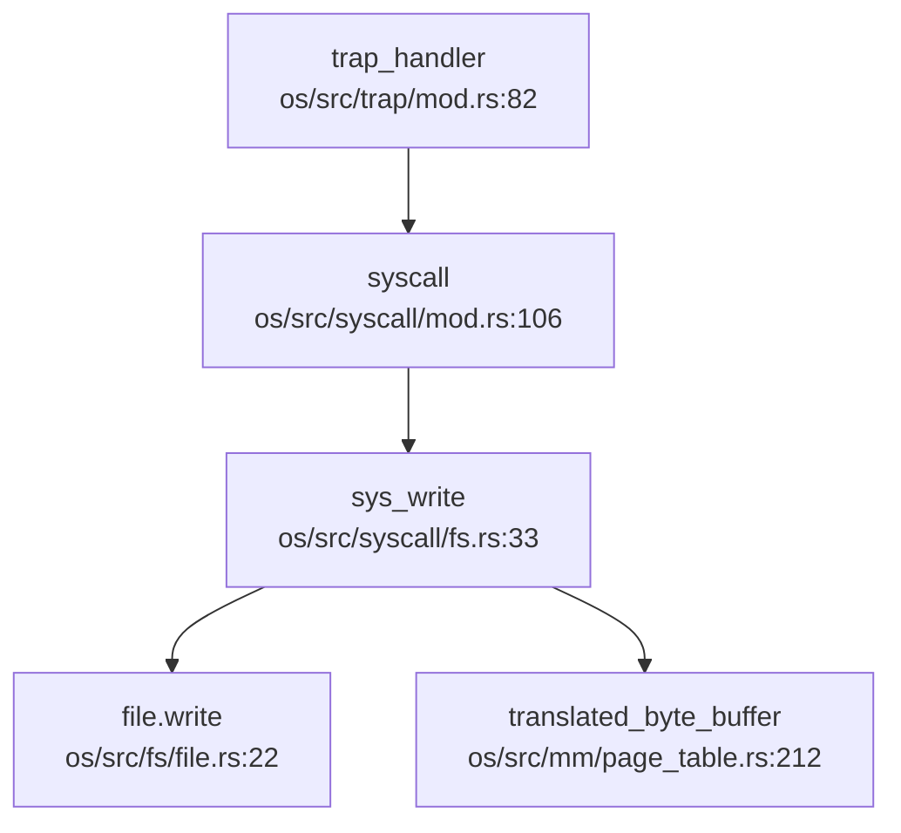

**完整调用路径**：
1. 用户态执行 `ecall` → `__alltraps` (trap.S:11)
2. `trap_handler` (trap/mod.rs:82) 读取 `a7` 作为 syscall ID
3. `syscall` (syscall/mod.rs:106) 分发到 `sys_write`
4. `sys_write` (syscall/fs.rs:33) 检查 fd 有效性，通过 `translated_byte_buffer` 安全访问用户内存
5. 调用 `file.write()` 执行实际写入

### 核心 Syscall 实现列表

基于代码分析，统计 syscall 实现状态如下：

**✅ 已实现（含完整逻辑）的 Syscall**：

| Syscall | 文件路径 | 说明 |
|---------|----------|------|
| `sys_write` | `os/src/syscall/fs.rs:33` | 文件写入，含权限检查和地址翻译 |
| `sys_read` | `os/src/syscall/fs.rs:64` | 文件读取 |
| `sys_openat` | `os/src/syscall/fs.rs:126` | 打开文件 |
| `sys_close` | `os/src/syscall/fs.rs:159` | 关闭文件 |
| `sys_dup` | `os/src/syscall/fs.rs:199` | 复制文件描述符 |
| `sys_pipe` | `os/src/syscall/fs.rs:177` | 创建管道 |
| `sys_exit` | `os/src/syscall/process.rs:103` | 进程退出 |
| `sys_clone` | `os/src/syscall/process.rs:147` | 线程/进程克隆 |
| `sys_execve` | `os/src/syscall/process.rs:217` | 执行程序 |
| `sys_wait4` | `os/src/syscall/process.rs:282` | 等待子进程 |
| `sys_kill` | `os/src/syscall/process.rs:340` | 发送信号 |
| `sys_sigaction` | `os/src/syscall/signal.rs:95` | 设置信号处理函数 |
| `sys_sigprocmask` | `os/src/syscall/signal.rs:27` | 修改信号屏蔽 |
| `sys_brk` | `os/src/syscall/process.rs:430` | 调整堆大小 |
| `sys_mmap` | `os/src/syscall/process.rs:398` | 内存映射 |
| `sys_munmap` | `os/src/syscall/process.rs:421` | 取消内存映射 |
| `sys_getpid` | `os/src/syscall/process.rs:127` | 获取进程 ID |
| `sys_gettimeofday` | `os/src/syscall/process.rs:359` | 获取时间 |
| `sys_yield` | `os/src/syscall/process.rs:121` | 主动让出 CPU |
| `sys_fstat` | `os/src/syscall/fs.rs:242` | 获取文件状态 |
| `sys_getcwd` | `os/src/syscall/fs.rs:304` | 获取当前工作目录 |
| `sys_chdir` | `os/src/syscall/fs.rs:330` | 切换工作目录 |
| `sys_getdents64` | `os/src/syscall/fs.rs:383` | 读取目录项 |
| `sys_uname` | `os/src/syscall/process.rs:515` | 获取系统信息 |
| `sys_clock_gettime` | `os/src/syscall/time.rs:8` | 获取时钟时间 |
| `sys_times` | `os/src/syscall/process.rs:490` | 获取进程时间统计 |
| `sys_gettid` | `os/src/syscall/thread.rs:53` | 获取线程 ID |
| `sys_thread_create` | `os/src/syscall/thread.rs:10` | 创建线程 |
| `sys_waittid` | `os/src/syscall/thread.rs:67` | 等待线程 |
| `sys_ppoll` | `os/src/syscall/ppoll.rs:53` | 轮询 I/O |

**🔸 桩函数（返回固定值或无逻辑）**：

| Syscall | 文件路径 | 说明 |
|---------|----------|------|
| `sys_getuid` | `os/src/syscall/process.rs:548` | 直接返回 0 |
| `sys_geteuid` | `os/src/syscall/process.rs:554` | 直接返回 0 |
| `sys_getgid` | `os/src/syscall/process.rs:560` | 直接返回 0 |
| `sys_getegid` | `os/src/syscall/process.rs:566` | 直接返回 0 |
| `sys_spawn` | `os/src/syscall/process.rs:460` | 仅打印 trace，无实现 |
| `sys_set_priority` | `os/src/syscall/process.rs:480` | 无实现 |
| `sys_task_info` | `os/src/syscall/process.rs:375` | 部分实现 |
| `sys_umount2` | `os/src/syscall/fs.rs:459` | 无实现 |
| `sys_mount` | `os/src/syscall/fs.rs:464` | 无实现 |
| `sys_ioctl` | `os/src/syscall/fs.rs:471` | 无实现 |
| `sys_prlimit64` | `os/src/syscall/mod.rs:207` | 直接返回 0 |

**❌ 未实现（注释掉或未注册）**：

- `SYSCALL_SLEEP`：在分发表中被注释掉（`os/src/syscall/mod.rs:124`）
- `SYSCALL_MUTEX_CREATE/LOCK/UNLOCK`：被注释掉（`os/src/syscall/mod.rs:143-145`）
- `SYSCALL_SEMAPHORE_CREATE/UP/DOWN`：被注释掉（`os/src/syscall/mod.rs:146-148`）
- `SYSCALL_CONDVAR_CREATE/SIGNAL/WAIT`：被注释掉（`os/src/syscall/mod.rs:149-151`）

**覆盖度统计**：
- **已注册 syscall 总数**：约 70 个
- **✅ 完整实现**：约 30 个
- **🔸 桩函数**：约 11 个
- **❌ 注释掉/未实现**：约 10 个

### 接口/实现分离模式

**未发现**本项目采用 `sys_xxx` / `sys_xxx_impl` 的接口实现分离模式。所有 syscall 均直接在 `sys_xxx` 函数中实现业务逻辑。

### 用户指针语义化包装

**未发现** `UserInPtr` / `UserOutPtr` / `UserInOutPtr` 等类型安全包装器。

项目使用 `translated_byte_buffer` 和 `sstatus::set_sum/clear_sum` 进行用户内存访问：

```rust
// os/src/syscall/fs.rs:49-56
let buf = unsafe {
    sstatus::set_sum();  // 允许访问用户内存
    let buf = core::slice::from_raw_parts(buf, len);
    sstatus::clear_sum(); // 恢复保护
    buf
};
```

这种方式通过临时设置 `SUM`（permit Supervisor User Memory access）位来访问用户空间，**缺乏细粒度的指针类型安全保证**。

### 中断处理与信号关联

**时钟中断处理流程**：

```rust
// os/src/trap/mod.rs:138-143
Trap::Interrupt(Interrupt::SupervisorTimer) => {
    set_next_trigger();  // 设置下次中断时间
    check_timer();       // 检查是否有定时任务到期
    suspend_current_and_run_next();  // 触发调度
}
```

**外部中断**：本项目**仅实现了 SupervisorTimer**（通过 SBI 调用），**未发现** PLIC/APIC 等外部设备中断的处理代码。

### 信号机制

**信号处理触发点**：

信号检查在 `trap_handler` 返回用户态前执行：

```rust
// os/src/trap/mod.rs:153-157
if let Some((errno, msg)) = check_signals_of_current() {
    trace!("trap_handler: .. check signals {}", msg);
    exit_current_and_run_next(errno);
}
```

**信号错误检测**（`os/src/task/signal.rs:118-130`）：

```rust
pub fn check_error(&self) -> Option<(i32, &'static str)> {
    if self.contains(Self::SIGINT) {
        Some((-2, "Killed, SIGINT=2"))
    } else if self.contains(Self::SIGSEGV) {
        Some((-11, "Segmentation Fault, SIGSEGV=11"))
    } else if self.contains(Self::SIGILL) {
        Some((-4, "Illegal Instruction, SIGILL=4"))
    } else {
        None
    }
}
```

**三种粒度信号发送**：

- **✅ `sys_kill`**：支持进程级信号发送（`os/src/syscall/process.rs:340`）
- **❌ `sys_tkill`**：未发现实现
- **❌ `sys_tgkill`**：未发现实现

```rust
// os/src/syscall/process.rs:340-352
pub fn sys_kill(pid: usize, signal: u32) -> isize {
    if let Some(process) = pid2process(pid) {
        if let Some(flag) = SignalFlags::from_bits(signal as usize) {
            process.inner_exclusive_access(file!(), line!()).signals |= flag;
            0
        } else {
            EINVAL
        }
    } else {
        ESRCH
    }
}
```

**SIGSEGV 信号**：

✅ **已实现**。在 `trap_handler` 中，所有内存访问错误（StoreFault、LoadPageFault 等）都会触发 `current_add_signal(SignalFlags::SIGSEGV)`。

**用户自定义信号处理函数**：

- **✅ `sys_sigaction`**：支持设置信号处理函数（`os/src/syscall/signal.rs:95`）
- **❌ `sys_sigreturn`**：虽在常量中定义（`SYSCALL_SIGRETURN = 139`），但**未在分发表中注册**
- **❌ `signal_trampoline`**：未发现跳板代码实现

**结论**：信号机制**仅支持基础框架**，缺乏完整的用户态信号处理函数调用机制（缺少 trampoline 和 sigreturn）。

### 缺页异常与内存特性关联

**缺页异常处理**：

在 `trap_handler` 中，缺页异常（`StorePageFault`、`LoadPageFault`、`InstructionPageFault`）被统一处理：

```rust
// os/src/trap/mod.rs:107-117
Trap::Exception(Exception::StorePageFault)
| Trap::Exception(Exception::LoadPageFault)
| Trap::Exception(Exception::InstructionPageFault) => {
    error!("trap_handler: {:?} in application, bad addr = {:#x}", scause.cause(), stval);
    current_add_signal(SignalFlags::SIGSEGV);  // 直接发送 SIGSEGV
}
```

**❌ 未发现 CoW（写时复制）实现**：
- 搜索 `cow`、`copy_on_write` 无结果
- `sys_clone` 调用 `fork` 或 `clone2`，但**未发现**页表项的 CoW 标记逻辑

**❌ 未发现 Lazy Allocation（懒分配）实现**：
- 搜索 `lazy`、`handle_page_fault`、`do_page_fault` 无结果
- 缺页异常直接发送 SIGSEGV，**未触发**内存分配

**内存映射实现**：

`sys_mmap` 调用 `MemorySet::mmap`（`os/src/mm/memory_set.rs:569`），支持匿名映射和文件映射，但**不涉及懒分配**。

### 关键代码片段

**Trap 入口汇编**（`os/src/trap/trap.S:11-47`）：
```assembly
__alltraps:
    csrrw sp, sscratch, sp
    sd x1, 1*8(sp)
    # ... 保存所有寄存器
    ld t1, 36*8(sp)  # trap_handler 地址
    ld sp, 35*8(sp)  # 内核栈
    jr t1            # 跳转到 Rust 处理函数
```

**系统调用分发**（`os/src/syscall/mod.rs:106-125`）：
```rust
pub fn syscall(syscall_id: usize, args: [usize; 6]) -> isize {
    match syscall_id {
        SYSCALL_WRITE => sys_write(args[0], args[1] as *const u8, args[2]),
        SYSCALL_CLONE => sys_clone(args[0], args[1], args[2] as *mut usize, args[3], args[4] as *mut usize),
        SYSCALL_EXECVE => sys_execve(args[0] as *const u8, args[1] as *const usize, args[2] as *const usize),
        // ...
        _ => panic!("Unsupported syscall_id: {}", syscall_id),
    }
}
```

**信号发送**（`os/src/syscall/process.rs:340-352`）：
```rust
pub fn sys_kill(pid: usize, signal: u32) -> isize {
    if let Some(process) = pid2process(pid) {
        if let Some(flag) = SignalFlags::from_bits(signal as usize) {
            process.inner_exclusive_access(file!(), line!()).signals |= flag;
            0
        } else {
            EINVAL
        }
    } else {
        ESRCH
    }
}
```

### 总结

本操作系统的中断、异常与系统调用机制具有以下特点：

1. **Trap 处理完整**：支持用户态 `ecall`、缺页异常、非法指令、时钟中断的处理
2. **上下文保存精确**：`TrapContext` 结构体包含 32 个通用寄存器 + 5 个 CSR，共 296 字节
3. **Syscall 覆盖度中等**：约 70 个注册 syscall 中，30 个完整实现，11 个桩函数，10 个未实现
4. **信号机制基础**：支持 SIGSEGV、SIGILL 等核心信号，但缺少用户态处理函数调用机制
5. **内存特性缺失**：**未发现** CoW 和 Lazy Allocation 实现，缺页异常直接发送 SIGSEGV
6. **用户指针安全**：使用 `SUM` 位临时授权访问，缺乏类型安全包装

---


# 文件系统VFS  具体 FS

## 第 6 章：文件系统（VFS + 具体 FS）

### VFS 架构与接口设计

本 OS 实现了完整的 VFS（Virtual File System）抽象层，通过 Rust Trait 机制定义了文件系统核心接口。VFS 架构采用四层抽象：`FileSystem` → `Inode` → `Dentry` → `File`。

#### 核心 Trait 定义

**1. `FileSystem` Trait**（`os/src/fs/fs.rs:5`）

```rust
pub trait FileSystem: Send + Sync {
    fn fs_type(&self) -> FileSystemType;
    fn root_inode(self: Arc<Self>) -> Arc<dyn Inode>;
}
```

该 Trait 定义了文件系统的最基本接口：
- `fs_type()`：返回文件系统类型（`VFAT` 或 `EXT4`）
- `root_inode()`：返回根目录的 Inode

**2. `Inode` Trait**（`os/src/fs/inode.rs:9`）

```rust
pub trait Inode: Any + Send + Sync {
    fn fstype(&self) -> FileSystemType;
    fn lookup(self: Arc<Self>, name: &str) -> Option<Arc<Dentry>>;
    fn create(self: Arc<Self>, name: &str, type_: InodeType) -> Option<Arc<Dentry>>;
    fn unlink(self: Arc<Self>, name: &str) -> bool;
    fn link(self: Arc<Self>, name: &str, target: Arc<Dentry>) -> bool;
    fn rename(self: Arc<Self>, old_name: &str, new_name: &str) -> bool;
    fn mkdir(self: Arc<Self>, name: &str) -> bool;
    fn rmdir(self: Arc<Self>, name: &str) -> bool;
    fn ls(&self) -> Vec<String>;
    fn clear(&self);
    fn read_at(&self, offset: usize, buf: &mut [u8]) -> usize;
    fn write_at(&self, offset: usize, buf: &[u8]) -> usize;
}
```

`Inode` 是 VFS 的核心抽象，代表文件系统中的一个节点（文件或目录）。关键方法包括：
- `lookup()`：在目录中查找子项
- `create()`/`unlink()`：创建/删除文件
- `read_at()`/`write_at()`：带偏移量的读写操作

**3. `Dentry` 结构**（`os/src/fs/dentry.rs:7`）

```rust
pub struct Dentry {
    name:  String,
    inode: Arc<dyn Inode>,
}
```

`Dentry`（Directory Entry）是目录项的抽象，连接文件名与 Inode。实现极为简洁，仅包含文件名和对应的 Inode 引用。

**4. `File` Trait**（`os/src/fs/file.rs:11`）

```rust
pub trait File: Any + Send + Sync {
    fn readable(&self) -> bool;
    fn writable(&self) -> bool;
    fn read(&self, buf: &mut [u8]) -> usize;
    fn read_all(&self) -> Vec<u8>;
    fn write(&self, buf: &[u8]) -> usize;
    fn fstat(&self) -> Option<Stat>;
    fn is_dir(&self) -> bool;
    fn hang_up(&self) -> bool;
    fn r_ready(&self) -> bool;
    fn w_ready(&self) -> bool;
}
```

`File` Trait 定义了文件操作接口，支持读写、状态查询、就绪检查等功能。

#### 文件系统类型枚举

```rust
pub enum FileSystemType {
    VFAT,
    EXT4,
}
```

当前仅支持两种文件系统类型：VFAT（FAT32 扩展）和 EXT4。

---

### 具体文件系统支持情况（FAT32/Ext4/RamFS）

#### FAT32 文件系统（✅ 已实现）

FAT32 实现位于 `os/src/fs/fat32/` 目录，包含完整的文件系统驱动：

**核心结构**（`os/src/fs/fat32/fs.rs:18`）：
```rust
pub struct Fat32FS {
    pub sb:   Fat32SB,      // 超级块
    pub fat:  Arc<FAT>,     // FAT 表
    pub bdev: Arc<dyn BlockDevice>,
}
```

**FileSystem Trait 实现**（`os/src/fs/fat32/fs.rs:24`）：
```rust
impl FileSystem for Fat32FS {
    fn fs_type(&self) -> FileSystemType {
        FileSystemType::VFAT
    }
    fn root_inode(self: Arc<Self>) -> Arc<dyn Inode> {
        let start_cluster = self.sb.root_cluster as usize;
        let bdev = Arc::clone(&self.bdev);
        let fat32_inode = Fat32Inode {
            type_: Fat32InodeType::Dir,
            start_cluster,
            fs: self.clone(),
            bdev: Arc::clone(&bdev),
            dentry: None,
        };
        Arc::new(fat32_inode)
    }
}
```

**Fat32Inode 结构**（`os/src/fs/fat32/inode.rs:23`）：
```rust
pub struct Fat32Inode {
    pub type_:         Fat32InodeType,
    pub dentry:        Option<Arc<Fat32Dentry>>,
    pub start_cluster: usize,
    pub bdev:          Arc<dyn BlockDevice>,
    pub fs:            Arc<Fat32FS>,
}
```

**关键功能实现状态**：
- `lookup()`：✅ 已实现，通过遍历 FAT 目录项查找文件
- `create()`：✅ 已实现，支持创建文件和目录，分配新 cluster
- `read_at()`/`write_at()`：✅ 已实现，通过 cluster chain 读写数据
- `unlink()`：✅ 已实现，标记目录项为删除状态
- `mkdir()`/`rmdir()`：✅ 已实现

FAT32 实现包含完整的长文件名（LFN）支持，通过 `Fat32LDentryLayout` 处理长文件名目录项。

#### EXT4 文件系统（✅ 已实现，基于外部 crate）

EXT4 实现位于 `os/src/fs/ext4/` 目录，**依赖外部 crate `ext4_rs`**（位于 `os/libs/ext4_rs/`）：

**核心结构**（`os/src/fs/ext4/fs.rs:16`）：
```rust
pub struct Ext4FS {
    pub ext4: Arc<Ext4>,  // 来自 ext4_rs crate
}
```

**FileSystem Trait 实现**（`os/src/fs/ext4/fs.rs:28`）：
```rust
impl FileSystem for Ext4FS {
    fn fs_type(&self) -> FileSystemType {
        FileSystemType::EXT4
    }
    fn root_inode(self: Arc<Self>) -> Arc<dyn Inode> {
        let inode = Ext4Inode {
            fs:    self.clone(),
            ino:   ROOT_INO,
            inner: unsafe { UPSafeCell::new(Ext4InodeInner { fpos: 0 }) },
        };
        Arc::new(inode)
    }
}
```

**Ext4Inode 结构**（`os/src/fs/ext4/inode.rs:15`）：
```rust
pub struct Ext4Inode {
    pub fs:    Arc<Ext4FS>,
    pub ino:   u32,
    pub inner: UPSafeCell<Ext4InodeInner>,
}
```

**关键功能实现状态**：
- `lookup()`：✅ 已实现，调用 `ext4_rs::ext4_open_from()`
- `create()`：❌ 未实现（`todo!()`）
- `unlink()`：✅ 已实现，调用 `ext4_rs::ext4_file_remove()`
- `mkdir()`：✅ 已实现，调用 `ext4_rs::ext4_dir_mk()`
- `rmdir()`：✅ 已实现，调用 `ext4_rs::ext4_dir_remove()`
- `read_at()`/`write_at()`：✅ 已实现，通过 `ext4_rs` 接口
- `fstat()`：❌ 未实现（`todo!()`）
- `is_dir()`：❌ 未实现（`todo!()`）
- `read_all()`：❌ 未实现（`todo!()`）

EXT4 实现大量依赖 `ext4_rs` crate，自身仅做薄封装。部分功能（如 `create`、`fstat`）仍为桩函数。

#### RamFS/TmpFS（❌ 未实现）

通过 `grep_in_repo` 搜索 `RamFS|TmpFS|ramfs|tmpfs`，**未找到任何内存文件系统实现**。项目仅支持 FAT32 和 EXT4 两种磁盘文件系统。

---

### 文件描述符与进程关联

#### 文件描述符表结构

文件描述符表位于 `TaskControlBlockInner` 结构体中（`os/src/task/task.rs:82`）：

```rust
pub struct TaskControlBlockInner {
    // ... 其他字段
    pub fd_table: Vec<Option<Arc<dyn File>>>,
    // ... 其他字段
}
```

**关键特性**：
- **Per-Process**：每个进程（Task）拥有独立的 `fd_table`
- **动态扩展**：通过 `alloc_fd()` 动态分配文件描述符
- **类型统一**：所有文件（包括 Pipe）都统一为 `Arc<dyn File>`

#### 文件描述符分配

`alloc_fd()` 实现（`os/src/task/task.rs:942`）：
```rust
pub fn alloc_fd(&mut self) -> usize {
    if let Some(fd) = (0..self.fd_table.len()).find(|fd| self.fd_table[*fd].is_none()) {
        fd
    } else {
        self.fd_table.push(None);
        self.fd_table.len() - 1
    }
}
```

策略：优先复用已释放的空闲 fd，若无空闲则扩展表。

#### 初始化文件描述符

进程初始化时（`os/src/task/task.rs:259`），默认打开三个标准文件描述符：
```rust
fd_table: vec![
    Some(Arc::new(Stdin::new())),   // fd 0: stdin
    Some(Arc::new(Stdout::new())),  // fd 1: stdout
    Some(Arc::new(Stdout::new())),  // fd 2: stderr
],
```

---

### 管道 (Pipe) 与套接字 (Socket) 支持情况

#### Pipe（✅ 已实现）

Pipe 实现位于 `os/src/fs/pipe.rs`，提供完整的进程间通信功能。

**核心结构**：
```rust
pub struct Pipe {
    readable: bool,
    writable: bool,
    buffer:   Arc<UPSafeCell<PipeRingBuffer>>,
}

pub struct PipeRingBuffer {
    arr:       [u8; RING_BUFFER_SIZE],  // 3200 字节环形缓冲区
    head:      usize,
    tail:      usize,
    status:    RingBufferStatus,
    write_end: Option<Weak<Pipe>>,
    read_end:  Option<Weak<Pipe>>,
}
```

**sys_pipe 系统调用**（`os/src/syscall/fs.rs:177`）：
```rust
pub fn sys_pipe(pipe: *mut u32) -> isize {
    let task = current_task().unwrap();
    let mut inner = task.inner_exclusive_access(file!(), line!());
    let (pipe_read, pipe_write) = make_pipe();
    let read_fd = inner.alloc_fd();
    inner.fd_table[read_fd] = Some(pipe_read);
    let write_fd = inner.alloc_fd();
    inner.fd_table[write_fd] = Some(pipe_write);
    unsafe {
        sstatus::set_sum();
        *pipe = read_fd as u32;
        *pipe.add(1) = write_fd as u32;
        sstatus::clear_sum();
    }
    0
}
```

**Pipe 的 File Trait 实现**：
- `read()`：✅ 已实现，支持阻塞读（当缓冲区空时 `suspend_current_and_run_next()`）
- `write()`：✅ 已实现，支持阻塞写（当缓冲区满时让出 CPU）
- `r_ready()`/`w_ready()`：✅ 已实现，检查缓冲区状态
- `hang_up()`：✅ 已实现，检查对端是否关闭

#### Socket（❌ 未实现）

通过 `grep_in_repo` 搜索 `sys_socket|sys_bind|sys_listen|sys_accept|sys_connect`，**未找到任何 socket 相关系统调用**。网络功能完全未实现。

---

### 缓存机制（Block/Page Cache）

#### Block Cache

Block Cache 实现位于 `os/src/block/block_cache.rs`，用于缓存磁盘块数据：

```rust
pub fn get_block_cache(
    block_id: usize, block_device: Arc<dyn BlockDevice>,
) -> Arc<Mutex<BlockCache>>
```

BlockCache 使用 `BLOCK_SZ`（512 字节）作为基本单位，通过 `get_block_cache()` 获取缓存块，支持 `read()`/`modify()`/`write()` 操作。

FAT32 和 EXT4 文件系统都通过 BlockCache 访问底层存储设备。

#### Page Cache（❌ 未实现）

**未发现独立的 Page Cache 实现**。文件数据直接通过 `read_at()`/`write_at()` 读写，没有统一的页面缓存层。mmap 映射时直接分配物理页框（`FrameTracker`），数据从文件复制到映射页面，但未实现写回机制。

---

### 零拷贝映射验证（mmap 实现分析）

#### sys_mmap 系统调用

`sys_mmap` 定义于 `os/src/syscall/process.rs:398`：
```rust
pub fn sys_mmap(
    start: usize, len: usize, prot: usize, flags: usize, fd: usize, off: usize,
) -> isize {
    if start as isize == -1 || len == 0 {
        return EINVAL;
    }
    let task = current_task().unwrap();
    let mut inner = task.inner_exclusive_access(file!(), line!());
    inner.mmap(start, len, prot, flags, fd, off)
}
```

#### TaskControlBlockInner::mmap 实现

```rust
pub fn mmap(
    &mut self, start_addr: usize, len: usize, _prot: usize, flags: usize, fd: usize,
    offset: usize,
) -> isize {
    let flags = Flags::from_bits(flags as u32).unwrap();
    let file = self.fd_table[fd].clone().unwrap();
    let inode = cast_file_to_inode(file).unwrap();
    let (context, length) = if flags.contains(Flags::MAP_ANONYMOUS) {
        (Vec::new(), len)
    } else {
        let context = inode.read_all();
        let file_len = context.len();
        let length = len.min(file_len - offset);
        if file_len <= offset {
            return EPERM;
        };
        (context, length)
    };
    self.memory_set.mmap(start_addr, length, offset, context, flags)
}
```

#### MemorySet::mmap 实现

```rust
pub fn mmap(
    &mut self, start_addr: usize, len: usize, offset: usize, context: Vec<u8>, flags: Flags,
) -> isize {
    // 分配物理页框
    for vpn in vpn_range {
        let frame = frame_alloc().unwrap();
        let ppn = frame.ppn;
        self.mmap_area.insert(vpn, frame);
        self.page_table.map(vpn, ppn, PTEFlags::R | PTEFlags::W | PTEFlags::U | PTEFlags::X);
    }
    // 复制文件数据到映射页面
    if !flags.contains(Flags::MAP_ANONYMOUS) {
        let mut start: usize = offset;
        let mut current_vpn = vpn_range.get_start();
        loop {
            let src = &context[start..len.min(start + PAGE_SIZE)];
            let dst = &mut self.page_table.translate(current_vpn).unwrap().ppn().get_bytes_array()[..src.len()];
            dst.copy_from_slice(src);
            start += PAGE_SIZE;
            if start >= len { break; }
            current_vpn.step();
        }
    }
}
```

#### 零拷贝验证结论

**❌ 非零拷贝实现**：

1. **无 `MAP_SHARED` 处理**：虽然定义了 `Flags::MAP_SHARED = 0x01`（`os/src/task/process.rs:98`），但在 `mmap()` 实现中**未检查该标志**，所有映射都表现为 `MAP_PRIVATE` 语义。

2. **数据复制**：实现通过 `inode.read_all()` 读取整个文件内容到 `context: Vec<u8>`，然后逐页复制到新分配的物理页框。这是**完整的深拷贝**，而非零拷贝。

3. **无写回机制**：`munmap()` 仅释放页表映射和 `FrameTracker`，**未实现脏页写回**。对映射区域的修改在 unmap 后丢失。

4. **无 VmArea 结构**：未发现类似 Linux 的 `vm_area_struct` 结构体来跟踪映射区域属性（如 `shared` 标志）。映射信息仅保存在 `MemorySet::mmap_area: BTreeMap<VirtPageNum, FrameTracker>` 中，仅用于管理物理页框。

**结论**：mmap 功能**🔸 桩函数**级别实现，仅支持基本的匿名映射和文件映射（复制模式），不支持 `MAP_SHARED` 零拷贝语义。

---

### 高级 I/O 功能（poll/select/epoll）

通过 `grep_in_repo` 搜索 `sys_poll|sys_select|sys_epoll`：

**结果**：❌ **未实现**

未找到任何 `poll`、`select`、`epoll` 相关系统调用。进程只能使用阻塞式 I/O 或通过 Pipe 的 `r_ready()`/`w_ready()` 手动检查就绪状态。

---

### 文件打开流程追踪

#### 完整调用链

从 `sys_open` 到获得文件描述符的完整流程：

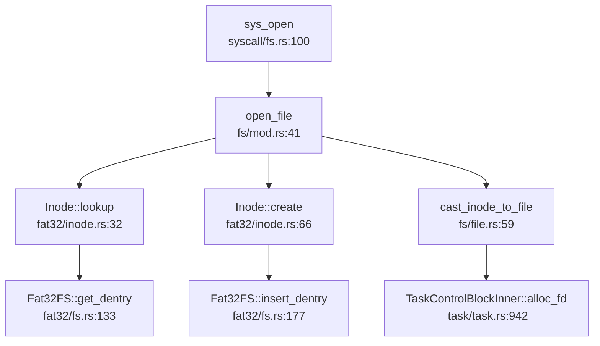

#### 关键步骤解析

**1. sys_open 入口**（`os/src/syscall/fs.rs:100`）：
```rust
pub fn sys_open(path: *const u8, flags: i32) -> isize {
    let task = current_task().unwrap();
    let token = current_user_token();
    let path = translated_str(token, path);
    let curdir = task.inner_exclusive_access(file!(), line!()).work_dir.clone();
    if let Some(dentry) = open_file(curdir.inode(), path.as_str(), OpenFlags::from_bits(flags).unwrap()) {
        let inode = dentry.inode();
        let mut inner = task.inner_exclusive_access(file!(), line!());
        let fd = inner.alloc_fd();
        let file = cast_inode_to_file(inode).unwrap();
        inner.fd_table[fd] = Some(file);
        fd as isize
    } else {
        ENOENT
    }
}
```

**2. open_file VFS 中枢**（`os/src/fs/mod.rs:41`）：
```rust
pub fn open_file(inode: Arc<dyn Inode>, name: &str, flags: OpenFlags) -> Option<Arc<Dentry>> {
    if flags.contains(OpenFlags::O_CREAT) {
        if let Some(dentry) = inode.clone().lookup(name) {
            dentry.inode().clear();  // 截断文件
            Some(dentry)
        } else {
            let type_ = if flags.contains(OpenFlags::O_DIRECTORY) {
                InodeType::Directory
            } else {
                InodeType::Regular
            };
            inode.create(name, type_)  // 创建新文件
        }
    } else if let Some(dentry) = inode.lookup(name) {
        if flags.contains(OpenFlags::O_TRUNC) {
            dentry.inode().clear();
        }
        Some(dentry)
    } else {
        None
    }
}
```

**3. Fat32Inode::lookup 实现**（`os/src/fs/fat32/inode.rs:32`）：
```rust
fn lookup(self: Arc<Self>, name: &str) -> Option<Arc<Dentry>> {
    let fs = self.fs.as_ref();
    let mut sector_id = fs.fat.cluster_id_to_sector_id(self.start_cluster).unwrap();
    let mut offset = 0;
    while let Some(dentry) = fs.get_dentry(&mut sector_id, &mut offset) {
        if dentry.name() == name {
            let fat32inode = Fat32Inode {
                type_: if dentry.is_file() { Fat32InodeType::File } else { Fat32InodeType::Dir },
                start_cluster: dentry.start_cluster_id(),
                fs: Arc::clone(&self.fs),
                bdev: Arc::clone(&self.bdev),
                dentry: Some(Arc::new(dentry)),
            };
            let dentry = Dentry::new(name, Arc::new(fat32inode));
            return Some(Arc::new(dentry));
        }
    }
    None
}
```

**4. 文件描述符分配与绑定**：
```rust
let fd = inner.alloc_fd();
let file = cast_inode_to_file(inode).unwrap();
inner.fd_table[fd] = Some(file);
```

通过 `cast_inode_to_file()` 将 `Arc<dyn Inode>` 转换为 `Arc<dyn File>`（利用 `Fat32Inode` 同时实现两个 Trait 的特性）。

#### 四大核心数据结构协同

| 结构 | 作用 | 生命周期 |
|------|------|----------|
| **SuperBlock** (`Fat32SB`) | 文件系统元数据（总大小、cluster 数、根目录位置） | 文件系统挂载期间常驻内存 |
| **Inode** (`Fat32Inode`/`Ext4Inode`) | 文件元数据 + 操作接口（start_cluster、文件大小） | 文件打开期间存在 |
| **Dentry** | 文件名 → Inode 映射 | 路径解析期间临时使用 |
| **File** (`Arc<dyn File>`) | 打开文件实例（含 fd_table 引用） | 进程文件描述符表引用期间 |

流程：`sys_open` → `open_file` → `Inode::lookup/create` → 返回 `Dentry` → 提取 `Inode` → 转换为 `File` → 插入 `fd_table`。

---

### 伪文件系统（devfs/procfs/sysfs）

通过 `grep_in_repo` 搜索 `devfs|procfs|sysfs`：

**结果**：❌ **未实现**

未找到任何伪文件系统实现。项目仅支持 FAT32 和 EXT4 两种真实文件系统。

---

### 关键代码验证总结

| 功能 | 实现状态 | 证据 |
|------|---------|------|
| **VFS Trait** | ✅ 已实现 | `os/src/fs/fs.rs:5`, `os/src/fs/inode.rs:9`, `os/src/fs/file.rs:11` |
| **FAT32** | ✅ 已实现 | `os/src/fs/fat32/` 完整实现，含 lookup/create/read/write |
| **EXT4** | ✅ 已实现（部分桩函数） | `os/src/fs/ext4/` 基于 `ext4_rs` crate，`create()`/`fstat()` 为 `todo!()` |
| **RamFS/TmpFS** | ❌ 未实现 | grep 搜索无结果 |
| **Pipe** | ✅ 已实现 | `os/src/fs/pipe.rs` 完整实现阻塞式管道 |
| **Socket** | ❌ 未实现 | grep 搜索 `sys_socket` 无结果 |
| **mmap** | 🔸 桩函数 | `os/src/task/task.rs:993` 仅支持复制模式，无 `MAP_SHARED` 处理 |
| **poll/select/epoll** | ❌ 未实现 | grep 搜索无结果 |
| **devfs/procfs/sysfs** | ❌ 未实现 | grep 搜索无结果 |
| **Block Cache** | ✅ 已实现 | `os/src/block/block_cache.rs` |
| **Page Cache** | ❌ 未实现 | 无独立页面缓存层 |
| **文件描述符表** | ✅ 已实现 | `TaskControlBlockInner::fd_table`（Per-Process） |

---


# 设备驱动与硬件抽象

## 第 7 章：设备驱动与硬件抽象

### 驱动框架与设备发现

本项目采用**静态 MMIO 地址映射 + 条件编译**的设备发现机制，**未实现动态设备树解析或 PCI 总线扫描**。

**设备发现机制**：

项目通过 `os/src/boards/` 目录下的平台特定配置文件硬编码设备地址：

- **QEMU 平台** (`os/src/boards/qemu.rs:16-20`)：
  ```rust
  pub const MMIO: &[(usize, usize, MapPermission)] = &[
      (0x10000000, 0x1000, PERMISSION_RW),   // UART
      (0x10001000, 0x1000, PERMISSION_RW),   // VIRTIO
      (0x02000000, 0x10000, PERMISSION_RW),  // CLINT
      (0x0C000000, 0x400000, PERMISSION_RW), // PLIC
  ];
  ```

- **VisionFive2 平台** (`os/src/boards/visionfive2.rs:10-14`)：
  ```rust
  pub const MMIO: &[(usize, usize, MapPermission)] = &[
      (0x17040000, 0x10000, PERMISSION_RW),     // RTC
      (0xc000000, 0x4000000, PERMISSION_RW),    // PLIC
      (0x00_1000_0000, 0x10000, PERMISSION_RW), // UART
      (0x16020000, 0x10000, PERMISSION_RW),     // sdio1
  ];
  ```

**设备树支持**：

项目虽然包含了 `fdt` crate 并在 `os/src/utils/platform_info.rs` 中实现了 DTB 解析功能，但**仅用于提取机器基本信息**（内存范围、PLIC/CLINT 地址、启动参数），**不用于驱动发现或动态注册**：

```rust
// os/src/utils/platform_info.rs:79-82
pub fn machine_info_from_dtb(ptr: usize) -> MachineInfo {
    let fdt = unsafe { Fdt::from_ptr(ptr as *const u8).unwrap() };
    walk_dt(fdt)
}
```

`walk_dt()` 函数仅遍历设备树节点提取 `memory`、`plic`、`clint`、`chosen` 等节点信息，**未实现基于设备树的驱动绑定机制**。

**驱动初始化流程**：

驱动在编译期通过 `lazy_static!` 宏静态初始化，无运行时 `probe` 机制：

```rust
// os/src/drivers/block/mod.rs:12-16
lazy_static! {
    pub static ref BLOCK_DEVICE: Arc<dyn ext4_rs::BlockDevice> = 
        Arc::new(BlockDeviceImpl::new());
}
```

驱动初始化在文件系统初始化时间接触发（`os/src/fs/mod.rs:28-32`）：
```rust
lazy_static! {
    pub static ref ROOT_INODE: Arc<dyn Inode> = {
        let ext4fs = Arc::new(Ext4FS::new(BLOCK_DEVICE.clone()));
        FS_MANAGER.lock().mount(ext4fs, "/");
        FS_MANAGER.lock().rootfs().root_inode()
    };
}
```

**❌ 未实现**：动态设备发现、PCI 总线扫描、基于设备树的驱动自动绑定。

---

### 组件化设计与配置机制

项目采用 **Cargo features** 实现组件化配置，通过条件编译适配不同硬件平台。

**构建配置** (`os/Cargo.toml:22-26`)：
```toml
[features]
default = ["qemu"]  # 默认编译 QEMU 版本
qemu = []
visionfive2 = []
```

**平台适配层** (`os/src/boards/mod.rs:5-9`)：
```rust
#[cfg(feature = "qemu")]
pub use qemu::*;
#[cfg(feature = "visionfive2")]
pub use visionfive2::*;
```

**关键配置项**：

| Feature | 目标平台 | 块设备实现 | UART 地址 | 入口汇编 |
|---------|---------|-----------|----------|---------|
| `qemu` (default) | QEMU virt | `VirtIOBlock` | `0x10000000` | `entry.S` |
| `visionfive2` | 赛昉 VisionFive2 | `SDCard` | `0x17040000` | `entry_visionfive2.S` |

**启动脚本条件编译** (`os/src/main.rs:53-56`)：
```rust
#[cfg(feature = "qemu")]
global_asm!(include_str!("entry.S"));

#[cfg(feature = "visionfive2")]
global_asm!(include_str!("entry_visionfive2.S"));
```

**🔸 局限性**：
- 驱动选择仅在编译期确定，**不支持运行时动态加载驱动模块**
- 无 Kconfig 风格的菜单配置系统
- 所有驱动代码必须编译进内核镜像

---

### 字符设备驱动（UART/Console）

项目实现了 **双套 UART 驱动**，分别用于 QEMU 和 VisionFive2 平台。

#### QEMU 平台：SBI Console

QEMU 平台使用 **SBI (Supervisor Binary Interface)** 进行串口输出，**无直接 MMIO 操作**：

```rust
// os/src/console.rs:10-17
struct Stdout;
impl Write for Stdout {
    fn write_str(&mut self, s: &str) -> fmt::Result {
        for c in s.chars() {
            console_putchar(c as usize);  // SBI 调用
        }
        Ok(())
    }
}
```

`console_putchar` 通过 SBI ECALL 实现 (`os/src/sbi.rs`)：
```rust
pub fn console_putchar(ch: usize) {
    unsafe {
        asm!(
            "li a7, 1",  // SBI_CONSOLE_PUTCHAR
            "ecall",
            in("a0") ch,
        );
    }
}
```

**✅ 已实现**：基于 SBI 的串口输出，支持 QEMU 模拟环境。

#### VisionFive2 平台：8250 UART MMIO 驱动

VisionFive2 使用 **直接 MMIO 访问** 的 8250 UART 驱动 (`os/libs/visionfive2-sd/example/testos/src/console.rs:13-46`)：

```rust
impl<const W: usize> Uart8250<W> {
    pub const fn new(base: usize) -> Self {
        Self { base }
    }
    pub fn init(&self) {
        // enable receive interrupts
        let base = self.base as *mut u8;
        unsafe {
            let ier = base.add(1 * W).read_volatile();
            base.add(1 * W).write_volatile(ier | 0x01);  // 开启接收中断
        }
    }
    pub fn putc(&mut self, c: u8) {
        let base = self.base as *mut u8;
        loop {
            let lsr = unsafe { base.add(5 * W).read_volatile() };
            if lsr & 0x20 != 0 {  // 等待发送保持寄存器空
                break;
            }
        }
        unsafe {
            base.add(W * 0).write_volatile(c);  // 写入数据寄存器
        }
    }
}
```

**MMU 前后地址切换机制**：

UART 驱动在 MMU 启用前后使用**不同的地址表示**：

1. **MMU 启用前**（Bootloader 阶段）：使用物理地址 `0x1000_0000`（VisionFive2 示例代码）
2. **MMU 启用后**（内核阶段）：通过 `os/src/boards/visionfive2.rs:11` 定义的虚拟地址映射：
   ```rust
   (0x00_1000_0000, 0x10000, PERMISSION_RW), // UART
   ```

启动汇编 (`os/src/entry_visionfive2.S:10-16`) 在跳转到 Rust 代码前建立页表映射：
```asm
la t0, boot_pagetable
li t1, 8 << 60
srli t0, t0, 12
or t0, t0, t1
csrw satp, t0  # 启用 MMU
sfence.vma
```

**✅ 已实现**：完整的 8250 UART 驱动，支持 MMU 启用前后的地址切换。

---

### 块设备驱动（VirtIO-Blk 等）

项目实现了 **两种块设备驱动**，分别对应 QEMU 和 VisionFive2 平台。

#### VirtIO-Blk 驱动（QEMU 平台）

**驱动结构** (`os/src/drivers/block/virtio_blk.rs:30-35`)：
```rust
pub struct VirtIOBlock(Mutex<VirtIOBlk<VirtioHal, MmioTransport>>);

lazy_static! {
    static ref QUEUE_FRAMES: UPSafeCell<Vec<FrameTracker>> = 
        unsafe { UPSafeCell::new(Vec::new()) };
}
```

**初始化流程** (`os/src/drivers/block/virtio_blk.rs:121-138`)：
```rust
pub fn new() -> Self {
    debug!("VirtIOBlock::new()");
    unsafe {
        let header = &mut *(VIRTIO0 as *mut VirtIOHeader);
        let blk = Self(Mutex::new(
            VirtIOBlk::<VirtioHal, MmioTransport>::new(
                MmioTransport::new(header.into()).unwrap(),
            )
            .unwrap(),
        ));
        debug!("VirtIOBlock created");
        blk
    }
}
```

VIRTIO0 基地址定义 (`os/src/drivers/block/virtio_blk.rs:37`)：
```rust
#[allow(unused)]
const VIRTIO0: usize = 0x10001000 + KERNEL_SPACE_OFFSET * PAGE_SIZE;
```

**DMA 内存管理** (`os/src/drivers/block/virtio_blk.rs:141-189`)：
项目实现了 `VirtioHal` trait 管理 DMA 内存：
```rust
unsafe impl Hal for VirtioHal {
    fn dma_alloc(pages: usize, _direction: BufferDirection) 
        -> (virtio_drivers::PhysAddr, NonNull<u8>) {
        let (frames, root_ppn) = frame_alloc_contiguous(pages);
        let pa: PhysAddr = root_ppn.into();
        (pa.0, unsafe {
            NonNull::new_unchecked(KernelAddr::from(pa).0 as *mut u8)
        })
    }
    unsafe fn dma_dealloc(paddr: virtio_drivers::PhysAddr, 
                          _vaddr: NonNull<u8>, pages: usize) -> i32 {
        // 释放物理页框
        0
    }
    // ... 其他方法
}
```

**块设备读写实现** (`os/src/drivers/block/virtio_blk.rs:45-78`)：
```rust
impl BlockDevice for VirtIOBlock {
    fn read_block(&self, block_id: usize, buf: &mut [u8]) {
        let mut res = self.0.lock().read_blocks(block_id, buf);
        if res.is_err() {
            error!("Error when reading VirtIOBlk, block_id {}", block_id);
            let mut times = 0 as usize;
            while res.is_err() {
                warn!("read_block: retrying block_id: {:}", block_id);
                res = self.0.lock().read_blocks(block_id, buf);
                times += 1;
                if times > 10 {
                    panic!("read_block {}: failed after 10 retries", block_id);
                }
            }
        }
    }
    fn write_block(&self, block_id: usize, buf: &[u8]) {
        self.0.lock().write_blocks(block_id, buf)
            .expect("Error when writing VirtIOBlk");
    }
}
```

**✅ 已实现**：完整的 VirtIO-Blk 驱动，支持 DMA 内存管理和块读写操作。

#### SDCard 驱动（VisionFive2 平台）

**驱动结构** (`os/src/drivers/block/vf2_sd.rs:43-48`)：
```rust
pub struct SDCard(Mutex<Vf2SdDriver<SdIoImpl, SleepOpsImpl>>);

impl SDCard {
    pub fn new() -> Self {
        debug!("SDCard::new()");
        let mut sd = Vf2SdDriver::<_, SleepOpsImpl>::new(SdIoImpl);
        sd.init();
        Self(Mutex::new(sd))
    }
}
```

**SDIO 寄存器访问** (`os/src/drivers/block/vf2_sd.rs:13-32`)：
```rust
pub const SDIO_BASE: usize = 0xffffffc016020000;

impl SDIo for SdIoImpl {
    fn read_data_at(&self, offset: usize) -> u64 {
        let addr = (SDIO_BASE + offset) as *mut u64;
        unsafe { addr.read_volatile() }
    }
    fn write_reg_at(&mut self, offset: usize, val: u32) {
        let addr = (SDIO_BASE + offset) as *mut u32;
        unsafe { addr.write_volatile(val) }
    }
}
```

**✅ 已实现**：VisionFive2 SD 卡驱动，基于 JH7110 SoC 的 SDIO 控制器。

---

### 网络设备驱动

**❌ 未实现**。

通过全库搜索 `network|ethernet|virtio.*net|smoltcp|tcp|udp`，仅发现 `errno.rs` 中定义的网络相关错误码，**未发现任何网络设备驱动或网络协议栈实现**：

```
os/src/syscall/errno.rs:140: /// Machine is not on the network
os/src/syscall/errno.rs:214: /// Network is down
```

**文档提及但未见代码**：
- README 和文档中未提及网络功能规划
- 无 VirtIO-Net 驱动
- 无 TCP/IP 协议栈（如 smoltcp）

---

### 中断控制器驱动

项目**未实现独立的 PLIC/CLINT 驱动模块**，中断处理通过 **RISC-V 标准 CSR 寄存器** 和 **SBI 调用**完成。

#### 定时器中断（CLINT）

定时器中断通过 RISC-V `sie` 寄存器启用 (`os/src/trap/mod.rs:74-78`)：
```rust
pub fn enable_timer_interrupt() {
    unsafe {
        sie::set_stimer();
    }
}
```

中断处理在 `trap_handler` 中统一分发 (`os/src/trap/mod.rs:130-134`)：
```rust
Trap::Interrupt(Interrupt::SupervisorTimer) => {
    set_next_trigger();
    check_timer();
    suspend_current_and_run_next();
}
```

#### 外部中断（PLIC）

**❌ 未实现独立驱动**。

虽然 `os/src/boards/qemu.rs:19` 和 `os/src/boards/visionfive2.rs:12` 定义了 PLIC 的 MMIO 区域：
```rust
(0x0C000000, 0x400000, PERMISSION_RW), // PLIC (QEMU)
(0xc000000, 0x4000000, PERMISSION_RW),  // PLIC (VisionFive2)
```

但**未发现 PLIC 中断屏蔽、优先级配置、中断响应等驱动代码**。外部中断处理依赖 SBI 或硬编码中断向量。

**中断源识别**通过 `scause` 寄存器实现 (`os/vendor/riscv/src/register/scause.rs:56-71`)：
```rust
impl Interrupt {
    pub fn from(nr: usize) -> Self {
        match nr {
            8 => Interrupt::UserExternal,
            9 => Interrupt::SupervisorExternal,
            10 => Interrupt::VirtualSupervisorExternal,
            _ => Interrupt::Unknown,
        }
    }
}
```

**🔸 桩函数/部分实现**：
- 定时器中断：✅ 已实现
- PLIC 驱动：❌ 未发现独立驱动代码，仅定义了 MMIO 区域

---

### 目标平台适配情况

项目通过 `os/src/boards/` 目录实现双平台适配：

#### 支持的平台

| 平台 | 配置文件 | 关键特性 |
|------|---------|---------|
| **QEMU virt** | `os/src/boards/qemu.rs` | VirtIO-Blk, SBI Console, CLINT 定时器 |
| **VisionFive2** | `os/src/boards/visionfive2.rs` | SD 卡，8250 UART, PLIC/CLINT |

#### 平台差异抽象

**1. 块设备类型**：
```rust
// os/src/boards/qemu.rs:22
pub type BlockDeviceImpl = crate::drivers::block::VirtIOBlock;

// os/src/boards/visionfive2.rs:17
pub type BlockDeviceImpl = crate::drivers::block::SDCard;
```

**2. MMIO 地址映射**：
- QEMU: UART `0x10000000`, VirtIO `0x10001000`
- VisionFive2: UART `0x17040000`, SDIO `0x16020000`

**3. 时钟频率**：
```rust
// QEMU
pub const CLOCK_FREQ: usize = 1250_0000;

// VisionFive2
pub const CLOCK_FREQ: usize = 400_0000;
```

**4. 启动汇编**：
- QEMU: `entry.S` (映射 `0x80000000` 物理内存)
- VisionFive2: `entry_visionfive2.S` (映射 `0x40000000` 物理内存)

**5. 关机行为**：
```rust
// QEMU: 通过 SBI 退出
pub fn shutdown() -> ! {
    QEMU_EXIT_HANDLE.exit_success();
}

// VisionFive2: 死循环
pub fn shutdown() -> ! {
    loop {}
}
```

**✅ 已实现**：双平台完整适配，通过 Cargo features 切换。

---

### 其他外设支持

#### RTC（实时时钟）

**VisionFive2 平台**在 `os/src/boards/visionfive2.rs:11` 定义了 RTC 地址：
```rust
(0x17040000, 0x10000, PERMISSION_RW), // RTC
```

但**未发现 RTC 驱动实现代码**。时间获取通过 SBI 或定时器模拟。

#### GPU/Framebuffer

**❌ 未实现**。

搜索 `GPU|framebuffer|lcd|display` 仅发现用户态 shell 的输入输出重定向代码，**无图形显示驱动**。

#### 输入设备

**❌ 未实现**。

搜索 `keyboard|mouse|input` 仅发现用户态 shell 的命令行输入处理，**无 PS/2 或 USB HID 驱动**。

#### 文件系统支持

虽然不属于传统"设备驱动"，但项目通过 `ext4_rs` 和 `visionfive2-sd` 库实现了块设备抽象层上的文件系统：

- **EXT4**：`os/libs/ext4_rs` 实现完整的 EXT4 文件系统
- **FAT32**：`os/src/fs/fat32/` 实现 FAT32 只读支持

文件系统通过 `BLOCK_DEVICE` 抽象访问底层存储：
```rust
// os/src/fs/mod.rs:28-32
lazy_static! {
    pub static ref ROOT_INODE: Arc<dyn Inode> = {
        let ext4fs = Arc::new(Ext4FS::new(BLOCK_DEVICE.clone()));
        FS_MANAGER.lock().mount(ext4fs, "/");
        FS_MANAGER.lock().rootfs().root_inode()
    };
}
```

---

### 本章总结

| 子系统 | 实现状态 | 关键文件 |
|--------|---------|---------|
| **设备发现** | 🔸 静态 MMIO 映射，无动态发现 | `os/src/boards/*.rs` |
| **驱动框架** | 🔸 lazy_static 静态初始化，无 probe 机制 | `os/src/drivers/block/mod.rs` |
| **组件化配置** | ✅ Cargo features 双平台支持 | `os/Cargo.toml` |
| **UART 驱动** | ✅ SBI (QEMU) + 8250 MMIO (VF2) | `os/src/console.rs`, `os/libs/visionfive2-sd/` |
| **VirtIO-Blk** | ✅ 完整实现，支持 DMA | `os/src/drivers/block/virtio_blk.rs` |
| **SD 卡驱动** | ✅ VisionFive2 SDIO 驱动 | `os/src/drivers/block/vf2_sd.rs` |
| **网络驱动** | ❌ 未实现 | - |
| **PLIC 驱动** | ❌ 仅定义 MMIO 区域，无驱动逻辑 | - |
| **CLINT 定时器** | ✅ 通过 CSR 寄存器实现 | `os/src/trap/mod.rs` |
| **GPU/输入** | ❌ 未实现 | - |

**架构特点**：
1. **静态驱动模型**：所有驱动在编译期确定，无运行时动态加载
2. **双平台适配**：通过 Cargo features 和条件编译实现 QEMU/VisionFive2 双目标
3. **MMU 地址切换**：启动汇编建立页表映射，驱动使用虚拟地址访问 MMIO
4. **依赖外部库**：VirtIO 驱动基于 `virtio-drivers` crate，SD 卡驱动基于 `visionfive2-sd` crate

**主要缺失**：
- 设备树动态解析与驱动绑定
- 网络设备驱动与协议栈
- PLIC 中断控制器完整驱动
- GPU/Framebuffer 图形输出
- USB/输入设备驱动

---


# 同步互斥与进程间通信

## 第 8 章：同步互斥与进程间通信

### 同步与互斥原语（锁与原子操作）

本操作系统实现了基于自旋锁（SpinLock）的同步互斥机制，采用 Rust 标准库的原子操作实现底层原子性保证。

#### SpinLock 实现

**核心数据结构** (`os/src/sync/mutex/spin_mutex.rs:10-16`)：

```rust
pub struct SpinMutex<T: ?Sized, S: MutexSupport> {
    lock:    AtomicBool,
    _marker: PhantomData<S>,
    data:    UnsafeCell<T>,
}
```

**原子操作机制**：
- 使用 `core::sync::atomic::AtomicBool` 作为锁状态标志
- 采用 `Ordering::Acquire` / `Ordering::Relaxed` 内存序保证同步语义
- 通过 `compare_exchange` CAS 操作实现无锁获取 (`os/src/sync/mutex/spin_mutex.rs:58-68`)

```rust
pub fn lock(&self) -> impl DerefMut<Target = T> + '_ {
    let support_guard = S::before_lock();
    loop {
        self.wait_unlock();
        if self
            .lock
            .compare_exchange(false, true, Ordering::Acquire, Ordering::Relaxed)
            .is_ok()
        {
            break;
        }
    }
    MutexGuard {
        mutex: self,
        support_guard,
    }
}
```

**等待机制** (`os/src/sync/mutex/spin_mutex.rs:42-54`)：
- 使用 `core::hint::spin_loop()` 进行忙等待
- 实现死锁检测：当 `try_count > 0x10000000` 时触发 panic
- 纯自旋实现，**无操作系统级挂起机制**

#### 中断屏蔽锁（SpinNoIrqLock）

通过 `SieGuard` 结构体实现中断屏蔽 (`os/src/sync/mutex/mod.rs:44-72`)：

```rust
pub struct SieGuard(bool);

impl SieGuard {
    pub fn new() -> Self {
        Self(unsafe {
            let sie_before = sstatus::read().sie();
            sstatus::clear_sie();  // 关中断
            sie_before
        })
    }
}

impl Drop for SieGuard {
    fn drop(&mut self) {
        if self.0 {
            unsafe { sstatus::set_sie(); }  // 恢复中断
        }
    }
}
```

**实现状态分类**：
- **✅ SpinLock 已实现**：完整的 CAS 自旋锁实现，含死锁检测
- **✅ SpinNoIrqLock 已实现**：基于 RISC-V `sstatus.sie` 位的中断屏蔽锁
- **❌ Mutex（睡眠锁）未实现**：代码中仅有 SpinLock，无基于等待队列的 Mutex

---

### 等待队列实现机制

本系统的等待队列机制通过 `TaskManager` 的 `block_queue` 实现，用于管理阻塞任务。

#### TaskManager 阻塞队列 (`os/src/task/manager.rs:14-20`)

```rust
pub struct TaskManager {
    ready_queue: VecDeque<Arc<TaskControlBlock>>,
    block_queue: VecDeque<Arc<TaskControlBlock>>,
    stop_task:   Option<Arc<TaskControlBlock>>,
}
```

#### 阻塞与唤醒原语

**`block_current_and_run_next()`** (`os/src/task/mod.rs:74-87`)：
```rust
pub fn block_current_and_run_next() {
    let task = take_current_task().unwrap();
    let mut task_inner = task.inner_exclusive_access(file!(), line!());
    let task_cx_ptr = &mut task_inner.task_cx as *mut TaskContext;
    task_inner.task_status = TaskStatus::Blocked;
    drop(task_inner);
    add_block_task(task);  // 加入 block_queue
    schedule(task_cx_ptr);
}
```

**`wakeup_task()`** (`os/src/task/manager.rs:100-107`)：
```rust
pub fn wakeup_task(task: Arc<TaskControlBlock>) {
    let mut task_inner = task.inner_exclusive_access(file!(), line!());
    task_inner.task_status = TaskStatus::Ready;
    drop(task_inner);
    add_task(task);  // 加入 ready_queue
}
```

**`unblock_task()`** (`os/src/task/manager.rs:148-161`)：
- 从 `block_queue` 中查找并移除指定任务
- 将任务状态改为 `Ready` 并加入 `ready_queue` 前端

#### 等待队列的使用场景

| 模块 | 文件路径 | 使用方式 |
|------|----------|----------|
| **Semaphore** | `os/src/sync/semaphore.rs:53-55` | `down()` 操作时将任务加入 `wait_queue` |
| **Condvar** | `os/src/sync/condvar.rs:47` | **❌ 已注释**，未实现 |
| **Pipe 读阻塞** | `os/src/fs/pipe.rs:150-152` | 使用 `suspend_current_and_run_next()` 而非专用等待队列 |
| **Pipe 写阻塞** | `os/src/fs/pipe.rs:194-195` | 同上 |

**关键发现**：
- Semaphore 拥有**独立的 `wait_queue`** (`VecDeque<Arc<TaskControlBlock>>`)
- Pipe 使用全局 `suspend_current_and_run_next()` 机制，**无专用等待队列**
- Condvar 实现**已被完全注释**，条件变量功能不可用

---

### 进程间通信（Pipe/MsgQueue/Sem）

#### 管道（Pipe）—— ✅ 已实现

**实现位置**：`os/src/fs/pipe.rs`

**环形缓冲区结构** (`os/src/fs/pipe.rs:44-51`)：
```rust
pub struct PipeRingBuffer {
    arr:       [u8; RING_BUFFER_SIZE],  // 3200 字节
    head:      usize,
    tail:      usize,
    status:    RingBufferStatus,
    write_end: Option<Weak<Pipe>>,
    read_end:  Option<Weak<Pipe>>,
}
```

**关键特性**：
1. **环形缓冲区实现**：容量 3200 字节，通过 `head`/`tail` 指针管理
2. **状态追踪**：`RingBufferStatus` 枚举（Full/Empty/Normal）
3. **写端关闭检测**：通过 `Weak<Pipe>` 追踪所有写端是否关闭
4. **阻塞式读写**：
   - 读空时：`suspend_current_and_run_next()` + `trap::wait_return()`
   - 写满时：`suspend_current_and_run_next()`

**Pipe 系统调用** (`os/src/syscall/fs.rs:177-197`)：
```rust
pub fn sys_pipe(pipe: *mut u32) -> isize {
    let (pipe_read, pipe_write) = make_pipe();
    let read_fd = inner.alloc_fd();
    inner.fd_table[read_fd] = Some(pipe_read);
    let write_fd = inner.alloc_fd();
    inner.fd_table[write_fd] = Some(pipe_write);
    unsafe {
        *pipe = read_fd as u32;
        *pipe.add(1) = write_fd as u32;
    }
    0
}
```

**实现状态**：**✅ 已实现** — 完整的环形缓冲区 Pipe，支持阻塞读写

---

#### 信号量（Semaphore）—— ✅ 已实现（内核级），🔸 系统调用桩函数

**内核实现** (`os/src/sync/semaphore.rs:21-58`)：

```rust
pub struct SemaphoreInner {
    pub count:      isize,
    pub wait_queue: VecDeque<Arc<TaskControlBlock>>,
}

impl Semaphore {
    pub fn up(&self) {
        let mut inner = self.inner.exclusive_access(file!(), line!());
        inner.count += 1;
        if inner.count <= 0 {
            if let Some(task) = inner.wait_queue.pop_front() {
                wakeup_task(task);
            }
        }
    }

    pub fn down(&self) {
        let mut inner = self.inner.exclusive_access(file!(), line!());
        inner.count -= 1;
        if inner.count < 0 {
            inner.wait_queue.push_back(current_task().unwrap());
            drop(inner);
            block_current_and_run_next();
        }
    }
}
```

**PV 操作语义**：
- **P 操作（down）**：`count--`，若 `count < 0` 则阻塞当前任务
- **V 操作（up）**：`count++`，若 `count <= 0` 则唤醒等待队列首任务

**系统调用状态** (`os/src/syscall/mod.rs:184-186`)：
```rust
// SYSCALL_SEMAPHORE_CREATE => sys_semaphore_create(args[0]),
// SYSCALL_SEMAPHORE_UP => sys_semaphore_up(args[0]),
// SYSCALL_SEMAPHORE_DOWN => sys_semaphore_down(args[0]),
```

**用户态接口** (`user/src/lib.rs:182-190`)：
```rust
pub fn semaphore_create(res_count: usize) -> isize {
    sys_semaphore_create(res_count)
}
pub fn semaphore_up(sem_id: usize) {
    sys_semaphore_up(sem_id);
}
pub fn semaphore_down(sem_id: usize) {
    sys_semaphore_down(sem_id);
}
```

**实现状态分类**：
- **✅ 内核 Semaphore 原语已实现**：完整的 PV 操作 + 等待队列
- **🔸 系统调用为桩函数**：`sys_semaphore_*` 在 `syscall/mod.rs` 中被注释，**用户态无法调用**

---

#### 消息队列（MessageQueue）—— ❌ 未实现

**搜索结果**：
- `grep "sys_msgget|msgget|MessageQueue"` → **0 匹配**
- `grep "sys_mq_*"` → **0 匹配**

**实现状态**：**❌ 未实现** — 代码库中无任何消息队列相关实现

---

#### 共享内存（SharedMemory）—— ❌ 未实现

**搜索结果**：
- `grep "shared_memory|SharedMemory|shm|sys_shmget"` → **0 匹配**

**内存管理相关**：
- 存在 `mmap`/`munmap` 系统调用（`os/src/syscall/mod.rs:168-169`）
- 但**无 POSIX 共享内存**（`shm_open`/`shmget`）实现

**实现状态**：**❌ 未实现** — 无共享内存 IPC 机制

---

#### 信号（Signal）作为 IPC —— ✅ 已实现

**系统调用** (`os/src/syscall/mod.rs:41, 190`)：
```rust
pub const SYSCALL_KILL: usize = 129;
// ...
SYSCALL_KILL => sys_kill(args[0], args[1] as u32),
```

**`sys_kill` 实现** (`os/src/syscall/process.rs:340-352`)：
```rust
pub fn sys_kill(pid: usize, signal: u32) -> isize {
    if let Some(process) = pid2process(pid) {
        if let Some(flag) = SignalFlags::from_bits(signal as usize) {
            process.inner_exclusive_access(file!(), line!()).signals |= flag;
            0
        } else {
            EINVAL
        }
    } else {
        ESRCH
    }
}
```

**信号分发机制**：
- 通过 `process.signals` 位图标记待处理信号
- 在 `trap_handler` 中通过 `check_signals_of_current()` 检查

**信号处理时机** (`os/src/trap/mod.rs:157-162`)：
```rust
//check signals
if let Some((errno, msg)) = check_signals_of_current() {
    trace!("[kernel] trap_handler: .. check signals {}", msg);
    exit_current_and_run_next(errno);
}
```

**`check_signals_of_current`** (`os/src/task/mod.rs:178-191`)：
```rust
pub fn check_signals_of_current() -> Option<(i32, &'static str)> {
    let task = current_task().unwrap();
    let inner = task.inner_exclusive_access(file!(), line!());
    inner.signal_mask.check_error()  // 检查 SIGINT/SIGILL/SIGABRT 等
}
```

**实现状态分类**：
- **✅ sys_kill 已实现**：支持向指定 PID 发送信号
- **✅ 信号处理已实现**：在 Trap 返回前检查并处理信号
- **🔸 信号处理功能有限**：仅支持 `check_error()` 中的几种信号（SIGINT/SIGILL/SIGABRT/SIGFPE/SIGSEGV），**无自定义信号处理器（sigaction 虽存在但功能不完整）**

---

### 关键代码片段

#### Pipe 环形缓冲区读写 (`os/src/fs/pipe.rs:59-95`)

```rust
impl PipeRingBuffer {
    pub fn write_byte(&mut self, byte: u8) {
        self.status = RingBufferStatus::Normal;
        self.arr[self.tail] = byte;
        self.tail = (self.tail + 1) % RING_BUFFER_SIZE;
        if self.tail == self.head {
            self.status = RingBufferStatus::Full;
        }
    }
    
    pub fn read_byte(&mut self) -> u8 {
        self.status = RingBufferStatus::Normal;
        let c = self.arr[self.head];
        self.head = (self.head + 1) % RING_BUFFER_SIZE;
        if self.head == self.tail {
            self.status = RingBufferStatus::Empty;
        }
        c
    }
    
    pub fn available_read(&self) -> usize {
        if self.status == RingBufferStatus::Empty {
            0
        } else if self.tail > self.head {
            self.tail - self.head
        } else {
            self.tail + RING_BUFFER_SIZE - self.head
        }
    }
}
```

#### Semaphore PV 操作 (`os/src/sync/semaphore.rs:34-56`)

```rust
pub fn up(&self) {
    let mut inner = self.inner.exclusive_access(file!(), line!());
    inner.count += 1;
    if inner.count <= 0 {
        if let Some(task) = inner.wait_queue.pop_front() {
            wakeup_task(task);
        }
    }
}

pub fn down(&self) {
    let mut inner = self.inner.exclusive_access(file!(), line!());
    inner.count -= 1;
    if inner.count < 0 {
        inner.wait_queue.push_back(current_task().unwrap());
        drop(inner);
        block_current_and_run_next();
    }
}
```

---

### 未实现/桩函数功能列表

| 功能 | 状态 | 说明 |
|------|------|------|
| **Futex** | ❌ 未实现 | `grep "sys_futex|futex_wait|futex_wake"` 无匹配 |
| **MessageQueue** | ❌ 未实现 | 无任何消息队列相关代码 |
| **SharedMemory (POSIX)** | ❌ 未实现 | 无 `shmget`/`shm_open` 实现 |
| **Condition Variable** | 🔸 桩函数 | 代码被完全注释 (`os/src/sync/condvar.rs`) |
| **Semaphore 系统调用** | 🔸 桩函数 | `sys_semaphore_*` 在 syscall 分发中被注释 |
| **Mutex 系统调用** | 🔸 桩函数 | `sys_mutex_*` 在 syscall 分发中被注释 |
| **Mutex（睡眠锁）** | ❌ 未实现 | 仅有 SpinLock，无基于等待队列的 Mutex |
| **完整 Signal Handler** | 🔸 部分实现 | `sys_sigaction` 存在但信号处理仅支持默认动作 |

---

### 总结

本操作系统的同步与 IPC 机制呈现以下特点：

1. **锁机制**：仅实现自旋锁（SpinLock），无睡眠锁；原子操作基于 Rust `core::sync::atomic`
2. **等待队列**：通过 `TaskManager.block_queue` 和 `Semaphore.wait_queue` 实现，但 Pipe 使用全局挂起机制
3. **IPC**：
   - **✅ Pipe**：完整的环形缓冲区实现
   - **✅ Signal**：`sys_kill` 可用，但信号处理功能有限
   - **✅ Semaphore（内核级）**：PV 操作完整，但系统调用未启用
   - **❌ MessageQueue/SharedMemory/Futex**：均未实现
4. **桩函数检测**：Condvar、Semaphore/Mutex 系统调用均被注释，属于"画饼"功能

---


# 多核支持与并行机制

## 第 9 章：多核支持与并行机制

### 多核架构设计（SMP/AMP）

**结论：❌ 未实现多核支持，仅支持单核（Uniprocessor）**

本操作系统 **明确设计为单核系统**，所有核心数据结构均使用 `UPSafeCell`（Uniprocessor Safe Cell）进行包装，该结构在文档中明确标注：

> "N NOTICE: We should only use it in environment with uniprocessor（single cpu core）"

**证据引用**：
- `os/src/sync/up.rs:1-10`：`UPSafeCell` 定义，注释明确说明仅适用于单核环境
- `os/src/task/processor.rs:47`：全局 `PROCESSOR` 使用 `UPSafeCell<Processor>` 包装
- `os/src/task/manager.rs:88`：全局 `TASK_MANAGER` 使用 `UPSafeCell<TaskManager>` 包装

虽然代码中存在多核相关的**配置信息读取**，但**仅用于设备树解析**，并未实现真正的多核启动：

```rust
// os/src/utils/platform_info.rs:90-102
fn walk_dt(fdt: Fdt) -> MachineInfo {
    let mut machine = MachineInfo {
        smp:          0,  // 初始化为 0
        // ...
    };
    machine.smp = fdt.cpus().count();  // 仅从设备树读取 CPU 数量
}
```

在 `os/libs/visionfive2-sd/example/testos/` 测试代码中虽然定义了 `CORES = 5`，但这**仅用于分配多个栈空间**，并非真正的多核启动：

```rust
// os/libs/visionfive2-sd/example/testos/src/config.rs:1-2
pub const STACK_SIZE: usize = 4096 * CORES;
pub const CORES: usize = 5;
```

**架构设计总结**：
- **SMP/AMP**：❌ 未实现。无 BSP/AP 区分，无 Secondary CPU 启动代码
- **全局管理器**：使用 `UPSafeCell` + `RefCell` 实现运行时借用检查，依赖单核假设
- **抢占支持**：❌ 内核态不支持抢占（`up.rs` 注释明确说明）

---

### Secondary CPU 启动流程

**结论：❌ 未实现**

通过以下搜索验证：
- `grep "smp_boot|__cpu_up|start_secondary|smp_init"` → **0 结果**
- `grep "send_ipi|ipi_handler|ipi_send"` → **0 结果**

**单核启动流程**（仅 BSP 启动）：

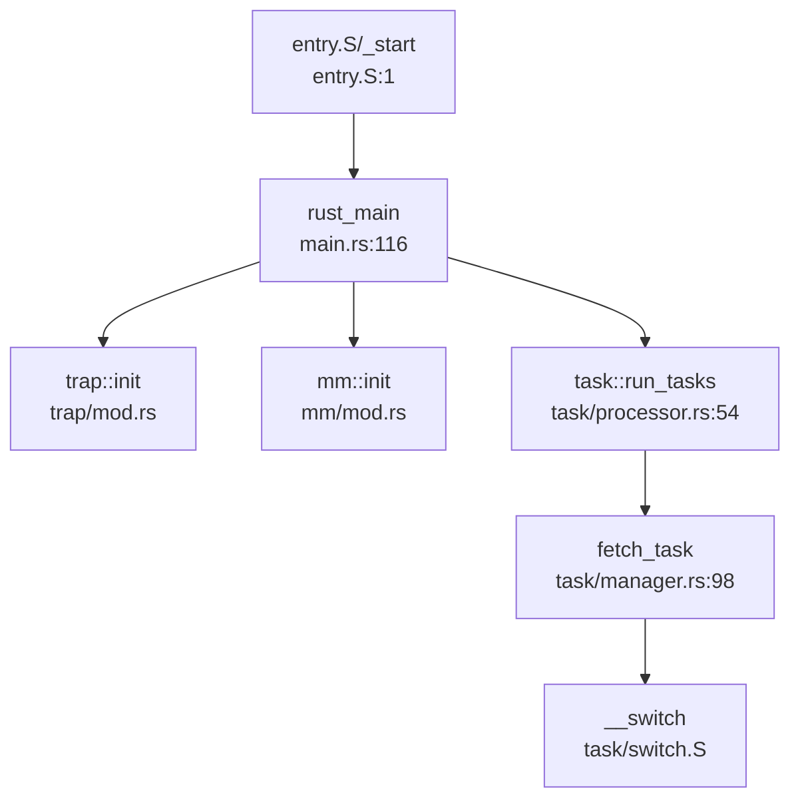

**启动链分析**：
1. `entry.S` 汇编入口 → 设置栈指针 → 跳转 `rust_main`
2. `rust_main()` 初始化各子系统（内存、中断、文件系统）
3. `task::run_tasks()` 进入调度循环，**单核无限循环**

**关键代码**：
```rust
// os/src/task/processor.rs:54-90
pub fn run_tasks() {
    loop {
        let mut processor = PROCESSOR.exclusive_access(file!(), line!());
        if let Some(task) = fetch_task() {
            // ... 获取任务上下文
            unsafe {
                __switch(idle_task_cx_ptr, next_task_cx_ptr);
            }
        } else {
            return;  // 无任务时直接返回（单核空闲）
        }
    }
}
```

**缺失的多核启动机制**：
- ❌ 无 IPI（核间中断）发送/接收处理
- ❌ 无 Secondary CPU 入口点（如 `start_secondary()`）
- ❌ 无 CPU 热插拔或唤醒机制
- ❌ 无多核同步屏障（Barrier）

---

### 核间通信与 IPI 机制

**结论：❌ 未实现**

**搜索结果**：
- `send_ipi`、`ipi_handler`、`ipi_send` → **均未找到**
- 设备树中虽解析出 `plic`（平台级中断控制器）和 `clint`（核心本地中断）地址范围，但**未实现 IPI 发送逻辑**

```rust
// os/src/utils/platform_info.rs:30-38
pub struct MachineInfo {
    pub plic:  Range<usize>,  // 仅存储地址范围，未使用
    pub clint: Range<usize>,  // 仅存储地址范围，未使用
    // ...
}
```

**中断处理现状**：
- 仅实现**定时器中断**（`trap::enable_timer_interrupt`）
- 仅实现**用户态/内核态陷阱**（`trap_handler`）
- ❌ 无软中断（Software Interrupt）用于 IPI

---

### Per-CPU 变量与数据结构

**结论：❌ 未实现 Per-CPU 机制**

**搜索结果**：
- `PerCpu`、`per_cpu`、`percpu` → **0 结果**
- 无 Per-CPU 命名空间实现
- 无 `cpu_data` 结构体

**当前全局数据设计**：
所有全局可变状态使用 `UPSafeCell` 包装，**依赖单核假设**：

```rust
// os/src/sync/up.rs:14-20
pub struct UPSafeCell<T> {
    inner: RefCell<T>,  // 运行时借用检查
}

unsafe impl<T> Sync for UPSafeCell<T> {}  // 手动实现 Sync（单核安全）
```

**访问方式**：
```rust
// os/src/task/processor.rs:47
lazy_static! {
    pub static ref PROCESSOR: UPSafeCell<Processor> = 
        unsafe { UPSafeCell::new(Processor::new()) };
}

// 访问时需传入调用位置用于错误定位
PROCESSOR.exclusive_access(file!(), line!())
```

**多核安全隐患**：
- `RefCell` 在多线程环境下**非线程安全**
- 若启用多核，需替换为 `SpinLock` 或 Per-CPU 变量

---

### 多核调度策略

**结论：❌ 未实现多核调度**

**当前调度器设计**：
- **单全局就绪队列**：`TaskManager::ready_queue`（`VecDeque`）
- **调度算法**：FIFO（先进先出），Stride 算法已注释

```rust
// os/src/task/manager.rs:43-57
pub fn fetch(&mut self) -> Option<Arc<TaskControlBlock>> {
    // Stride 调度算法已注释
    // let mut min_idx = 0;
    // for (idx, _) in self.ready_queue.iter().enumerate() {
    //     let stride_now = self.ready_queue[idx]...stride;
    //     if stride_now < stride_min { min_idx = idx; }
    // }
    // self.ready_queue.swap(0, min_idx);
    
    self.ready_queue.pop_front()  // 实际使用 FIFO
}
```

**缺失的多核调度特性**：
- ❌ 无负载均衡（Load Balance）
- ❌ 无 CPU 亲和性（Affinity）
- ❌ 无每核就绪队列（Per-CPU Runqueue）
- ❌ 无调度域（Scheduler Domain）划分

**与前面章节的交叉引用**：

1. **进程调度中的全局唯一 ID 池**（第 5 章）：
   - `PID2PCB` 使用 `UPSafeCell<BTreeMap>` 包装
   - `pid_alloc()` 使用全局计数器（未使用原子操作）
   ```rust
   // os/src/task/manager.rs:91-94
   pub static ref PID2PCB: UPSafeCell<BTreeMap<usize, Arc<TaskControlBlock>>> =
       unsafe { UPSafeCell::new(BTreeMap::new()) };
   ```

2. **双级注册机制**（第 5 章）：
   - 线程注册到 `Process::threads` + 全局 `PID2PCB`
   - 多核下需加锁保护

3. **同步互斥中的 Futex**：
   - **❌ 未实现**。仅在 `process.rs:78` 注释中提到 `CLONE_CHILD_CLEARTID` 会触发 futex
   - 搜索 `sys_futex`、`futex_wait`、`futex_wake` → **0 结果**

4. **原子操作**：
   - 内核主体使用 `UPSafeCell`（非原子）
   - 测试代码中使用 `core::sync::atomic::AtomicUsize`（`static_keys.rs`）
   - **内存序**：测试代码使用 `Ordering::SeqCst`（最强内存序），但内核未使用

---

### 锁的实现

**✅ 已实现 SpinLock 和 SpinNoIrqLock**

**锁类型**：
```rust
// os/src/sync/mutex/mod.rs:9-11
pub type SpinLock<T> = SpinMutex<T, Spin>;           // 普通自旋锁
pub type SpinNoIrqLock<T> = SpinMutex<T, SpinNoIrq>; // 关中断自旋锁
```

**SpinNoIrqLock 实现**（关中断）：
```rust
// os/src/sync/mutex/mod.rs:44-62
pub struct SieGuard(bool);  // 保存中断状态

impl SieGuard {
    pub fn new() -> Self {
        Self(unsafe {
            let sie_before = sstatus::read().sie();
            sstatus::clear_sie();  // 关中断
            sie_before
        })
    }
}

impl Drop for SieGuard {
    fn drop(&mut self) {
        if self.0 {
            unsafe { sstatus::set_sie(); }  // 恢复中断
        }
    }
}
```

**SpinMutex 核心逻辑**：
```rust
// os/src/sync/mutex/spin_mutex.rs:14-45
pub struct SpinMutex<T: ?Sized, S: MutexSupport> {
    lock:    AtomicBool,      // 使用原子操作
    data:    UnsafeCell<T>,
}

pub fn lock(&self) -> impl DerefMut<Target = T> + '_ {
    let support_guard = S::before_lock();  // SpinNoIrq 会关中断
    loop {
        self.wait_unlock();
        if self.lock.compare_exchange(false, true, Ordering::Acquire, Ordering::Relaxed).is_ok() {
            break;
        }
    }
    MutexGuard { mutex: self, support_guard }
}
```

**锁特性总结**：
| 锁类型 | 禁用中断 | 优先级继承 | 多核安全 |
|--------|---------|-----------|---------|
| `SpinLock` | ❌ | ❌ | ✅（原子操作） |
| `SpinNoIrqLock` | ✅ | ❌ | ✅（原子 + 关中断） |
| `UPSafeCell` | ❌ | N/A | ❌（仅单核） |

**缺失的锁机制**：
- ❌ 无 Mutex（睡眠锁）
- ❌ 无读写锁（RWLock）
- ❌ 无 RCU（Read-Copy Update）
- ❌ 无自旋锁自适应（Adaptive Spinning）

---

### 关键代码片段

**1. UPSafeCell（单核安全单元）**：
```rust
// os/src/sync/up.rs:14-43
pub struct UPSafeCell<T> {
    inner: RefCell<T>,
}

unsafe impl<T> Sync for UPSafeCell<T> {}

impl<T> UPSafeCell<T> {
    pub unsafe fn new(value: T) -> Self {
        Self { inner: RefCell::new(value) }
    }
    
    pub fn exclusive_access(&self, file: &'static str, line: u32) -> RefMut<'_, T> {
        match self.inner.try_borrow_mut() {
            Ok(borrow) => borrow,
            Err(_) => panic!("exclusive_access called while data is borrowed at {}:{}", file, line),
        }
    }
}
```

**2. SpinMutex（自旋锁）**：
```rust
// os/src/sync/mutex/spin_mutex.rs:14-70
pub struct SpinMutex<T: ?Sized, S: MutexSupport> {
    lock:    AtomicBool,
    data:    UnsafeCell<T>,
}

impl<'a, T, S: MutexSupport> SpinMutex<T, S> {
    pub const fn new(user_data: T) -> Self {
        SpinMutex {
            lock:    AtomicBool::new(false),
            data:    UnsafeCell::new(user_data),
        }
    }
    
    pub fn lock(&self) -> impl DerefMut<Target = T> + '_ {
        let support_guard = S::before_lock();
        loop {
            if self.lock.compare_exchange(false, true, Ordering::Acquire, Ordering::Relaxed).is_ok() {
                break;
            }
            core::hint::spin_loop();
        }
        MutexGuard { mutex: self, support_guard }
    }
}
```

**3. 单核调度器**：
```rust
// os/src/task/processor.rs:54-90
pub fn run_tasks() {
    loop {
        let mut processor = PROCESSOR.exclusive_access(file!(), line!());
        if let Some(task) = fetch_task() {
            let idle_task_cx_ptr = processor.get_idle_task_cx_ptr();
            let mut task_inner = task.inner_exclusive_access(file!(), line!());
            let next_task_cx_ptr = &task_inner.task_cx as *const TaskContext;
            task_inner.task_status = TaskStatus::Running;
            task_inner.clock_time_refresh();
            drop(task_inner);
            processor.current = Some(task);
            drop(processor);
            unsafe {
                __switch(idle_task_cx_ptr, next_task_cx_ptr);
            }
        } else {
            return;  // 无任务时退出（单核）
        }
    }
}
```

**4. 设备树 CPU 数量读取（仅信息展示）**：
```rust
// os/src/utils/platform_info.rs:90-102
fn walk_dt(fdt: Fdt) -> MachineInfo {
    let mut machine = MachineInfo {
        smp: 0,
        // ...
    };
    machine.smp = fdt.cpus().count();  // 仅读取，未用于多核启动
    // ...
}
```

---

### 本章总结

| 功能 | 实现状态 | 说明 |
|------|---------|------|
| **SMP/AMP 架构** | ❌ 未实现 | 明确设计为单核系统 |
| **Secondary CPU 启动** | ❌ 未实现 | 无 `smp_boot`、`start_secondary` 等代码 |
| **IPI 核间中断** | ❌ 未实现 | 无 `send_ipi`、`ipi_handler` |
| **Per-CPU 变量** | ❌ 未实现 | 使用 `UPSafeCell` 替代 |
| **多核调度** | ❌ 未实现 | 单全局队列 + FIFO |
| **SpinLock** | ✅ 已实现 | 支持关中断版本 |
| **Mutex（睡眠锁）** | ❌ 未实现 | 仅有自旋锁 |
| **Futex** | ❌ 未实现 | 仅注释提及 |
| **RCU** | ❌ 未实现 | 无相关代码 |
| **原子操作** | 🔸 部分使用 | 测试代码使用，内核主体用 `UPSafeCell` |

**核心问题**：
1. **单核假设深入内核设计**：`UPSafeCell`、`RefCell` 等结构无法直接用于多核
2. **无多核同步原语**：缺少 Barrier、Semaphore 等多核同步机制
3. **调度器非多核安全**：全局 `TASK_MANAGER` 在多核下会成为竞争热点

**改造建议**（若需支持多核）：
1. 替换 `UPSafeCell` 为 `SpinLock` 或 Per-CPU 变量
2. 实现 IPI 发送/接收机制（通过 CLINT/PLIC）
3. 实现 Per-CPU 就绪队列 + 负载均衡
4. 添加 CPU 热插拔支持（`__cpu_up`）

---


# 安全机制与权限模型

## 第 10 章：安全机制与权限模型

本章分析 Chaos OS 的安全隔离与权限控制机制。通过代码审查发现，该 OS 在安全机制方面实现较为基础，主要依赖 RISC-V 硬件特权级隔离，但缺乏完整的用户/组权限检查体系。

---

## 特权级与隔离机制

**✅ 已实现：RISC-V 特权级隔离**

Chaos OS 基于 RISC-V Sv39 分页机制实现用户态/内核态隔离：

- **页表隔离**：通过 `MapPermission::U` 位控制用户态可访问性。内核空间映射在 `KERNEL_SPACE_OFFSET` 以上，用户空间无法访问。
- **SMEP/SMAP 等效机制**：RISC-V 通过 `PTEFlags::U` 位实现类似功能。用户态访问未设置 U 位的页面会触发 Page Fault。

**关键代码** [`os/src/mm/page_table.rs:9-20`](os/src/mm/page_table.rs:9-20)：

```rust
bitflags! {
    pub struct PTEFlags: u8 {
        const V = 1 << 0;  // Valid
        const R = 1 << 1;  // Readable
        const W = 1 << 2;  // Writable
        const X = 1 << 3;  // Executable
        const U = 1 << 4;  // User-accessible
        const A = 1 << 6;  // Accessed
        const D = 1 << 7;  // Dirty
    }
}
```

**用户态访问控制**：内核通过 `sstatus::set_sum()` 临时允许访问用户空间，访问完成后立即 `clear_sum()` 恢复保护。

**证据** [`os/src/syscall/fs.rs:53-55`](os/src/syscall/fs.rs:53-55)：

```rust
let buf = unsafe {
    sstatus::set_sum();
    let buf = core::slice::from_raw_parts(buf, len);
    sstatus::clear_sum();
    buf
};
```

**❌ 未发现：KPTI（内核页表隔离）**

代码中未发现动态切换内核/用户页表的实现。内核空间始终映射在用户页表中（通过 `MapPermission` 控制访问），未实现类似 Linux KPTI 的完全隔离机制。

---

## 权限检查与访问控制

**🔸 桩函数：文件权限位定义存在但未强制执行**

Chaos OS 定义了完整的 POSIX 权限位结构，但**未在系统调用中执行权限检查**。

**权限位定义** [`os/src/fs/defs.rs:33-49`](os/src/fs/defs.rs:33-49)：

```rust
bitflags! {
    pub struct FileMode: u32 {
        const S_IRWXU = 0o700;  // 用户读、写、执行
        const S_IRUSR = 0o400;  // 用户读
        const S_IWUSR = 0o200;  // 用户写
        const S_IXUSR = 0o100;  // 用户执行
        const S_IRWXG = 0o070;  // 组权限
        const S_IRWXO = 0o007;  // 其他用户权限
        const S_ISUID = 0o4000; // 设置用户 ID
        const S_ISGID = 0o2000; // 设置组 ID
    }
}
```

**权限检查缺失**：在 `sys_open`、`sys_read`、`sys_write` 等关键系统调用中，**仅检查文件描述符的读写能力**（`file.writable()` / `file.readable()`），**未检查 inode 的权限位**。

**证据** [`os/src/syscall/fs.rs:33-60`](os/src/syscall/fs.rs:33-60)：

```rust
pub fn sys_write(fd: usize, buf: *const u8, len: usize) -> isize {
    let task = current_task().unwrap();
    let inner = task.inner_exclusive_access(file!(), line!());
    if fd >= inner.fd_table.len() {
        return EBADF;
    }
    if let Some(file) = &inner.fd_table[fd] {
        if !file.writable() {  // ⚠️ 仅检查 FD 能力，未检查 inode 权限
            return EACCES;
        }
        // ... 直接执行写操作
    }
}
```

**grep 验证**：搜索 `check_perm`、`inode_permission`、`access_check` 等关键词，**未发现任何权限检查函数实现**。

---

## 用户/组/权限模型

**🔸 桩函数：UID/GID 接口存在但始终返回 0**

Chaos OS 提供了 UID/GID 获取接口，但**所有函数均硬编码返回 0**，且**Task 结构体中未存储 uid/gid 字段**。

**证据** [`os/src/syscall/process.rs:548-569`](os/src/syscall/process.rs:548-569)：

```rust
/// 获取用户 id。在实现多用户权限前默认为最高权限。目前直接返回 0。
pub fn sys_getuid() -> isize {
    trace!("kernel:pid[{}] sys_getuid", current_task().unwrap().pid.0);
    0  // ⚠️ 硬编码返回 0
}

/// 获取有效用户 id，即相当于哪个用户的权限。在实现多用户权限前默认为最高权限。目前直接返回 0。
pub fn sys_geteuid() -> isize {
    trace!("kernel:pid[{}] sys_geteuid", current_task().unwrap().pid.0);
    0
}

/// 获取用户组 id。在实现多用户权限前默认为最高权限。目前直接返回 0。
pub fn sys_getgid() -> isize {
    trace!("kernel:pid[{}] sys_getgid", current_task().unwrap().pid.0);
    0
}

/// 获取有效用户组 id。在实现多用户组权限前默认为最高权限。目前直接返回 0。
pub fn sys_getegid() -> isize {
    trace!("kernel:pid[{}] sys_getegid", current_task().unwrap().pid.0);
    0
}
```

**Task 结构体验证**：检查 [`os/src/task/task.rs:54-95`](os/src/task/task.rs:54-95) 的 `TaskControlBlockInner` 结构体，**未发现 `uid`、`gid`、`credential` 等字段**。

```rust
pub struct TaskControlBlockInner {
    pub memory_set:       MemorySet,
    pub trap_cx_ppn:      PhysPageNum,
    pub task_cx:          TaskContext,
    pub task_status:      TaskStatus,
    // ... 其他字段
    pub fd_table:         Vec<Option<Arc<dyn File>>>,
    // ⚠️ 无 uid/gid/credential 字段
}
```

**结论**：
- **UID/GID 检查**：**❌ 未实现**。系统调用中无任何基于 uid/gid 的权限判断逻辑。
- **Capability/ACL**：**❌ 未实现**。搜索 `capability`、`acl` 关键词无结果。

---

## 进程间隔离与资源限制

**✅ 已实现：地址空间隔离**

每个进程拥有独立的 `MemorySet`（地址空间），通过独立的页表实现隔离。

**证据** [`os/src/task/task.rs:54-60`](os/src/task/task.rs:54-60)：

```rust
pub struct TaskControlBlockInner {
    pub memory_set: MemorySet,  // 每个进程独立的地址空间
    // ...
}
```

**调用链追踪**：`sys_open` 调用链展示进程资源隔离机制：

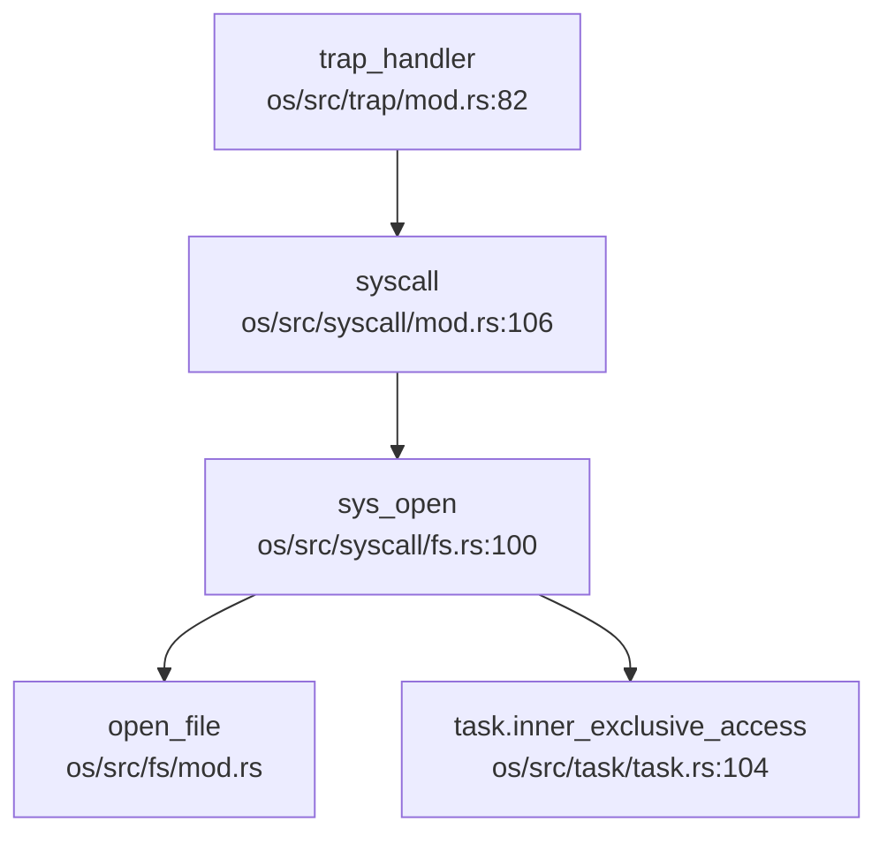

**文件描述符隔离**：每个进程维护独立的 `fd_table`，进程间不共享文件描述符（除非通过 `clone` 系统调用显式共享）。

**❌ 未发现：资源限制（rlimit）机制**

搜索 `rlimit`、`resource_limit`、`setrlimit` 等关键词无结果，未发现进程资源限制（如最大打开文件数、内存限制等）的实现。

---

## 安全沙箱与过滤机制

**❌ 未实现：Seccomp/Prctl 安全沙箱**

搜索 `seccomp`、`prctl`、`sandbox`、`filter` 关键词：
- 仅找到 `log::LevelFilter` 等无关匹配
- **未发现** `sys_prctl`、`sys_seccomp` 系统调用实现
- **未发现** BPF 过滤器或系统调用过滤机制

**结论**：Chaos OS **未实现**任何形式的安全沙箱或系统调用过滤机制。

---

## 审计与安全启动机制

**❌ 未实现：审计日志（Audit）**

搜索 `audit` 关键词：
- 仅找到 `boot_signature`（EXT4 文件系统引导签名，与安全启动无关）
- **未发现**审计日志、安全事件记录机制

**❌ 未实现：安全启动（Secure Boot）**

- **未发现**内核签名验证、镜像完整性检查代码
- **未发现** `secure_boot`、`signature_verify` 等相关实现

---

## 内存安全与系统调用检查

**✅ 已实现：用户指针访问保护**

Chaos OS 通过 `sstatus::SUM` 位控制用户空间访问：
- 默认情况下 `SUM=0`，内核访问用户空间会触发异常
- 仅在系统调用中临时 `set_sum()` 访问用户缓冲区

**证据** [`os/src/syscall/fs.rs:83-92`](os/src/syscall/fs.rs:83-92)：

```rust
unsafe {
    sstatus::set_sum();  // 临时允许访问用户空间
    let buf = core::slice::from_raw_parts_mut(buf, len);
    let ret = file.read(buf) as isize;
    sstatus::clear_sum();  // 立即恢复保护
}
```

**❌ 未发现：用户指针验证（verify_area / access_ok）**

搜索 `verify_area`、`access_ok`、`UserInPtr` 无结果：
- **未发现**对用户指针有效性（是否真的在用户空间）的显式检查
- 依赖 `sstatus::SUM` 机制隐式保护

**❌ 未发现：栈保护（Stack Canary）**

搜索 `stack_canary`、`stack_guard`、`canary` 无结果：
- **未发现**栈溢出保护机制
- 依赖 Rust 语言本身的内存安全性

---

## Rust 语言级安全性机制

**✅ 已实现：Rust 内存安全特性**

Chaos OS 使用 Rust 编写，天然具备以下安全机制：

1. **所有权与借用检查**：编译期防止数据竞争和悬垂指针
2. **RAII 资源管理**：通过 `Drop` trait 自动释放资源
3. **类型安全**：强类型系统防止类型混淆攻击

**证据**：项目中大量使用 `Arc<T>`、`RefCell`、`UPSafeCell` 等 Rust 安全原语。

**⚠️ 注意**：代码中存在 `unsafe` 块（如直接操作指针、内联汇编），这些区域绕过了 Rust 的安全检查，需要人工审计确保正确性。

**证据** [`os/src/syscall/fs.rs:53-55`](os/src/syscall/fs.rs:53-55)：

```rust
let buf = unsafe {
    sstatus::set_sum();
    let buf = core::slice::from_raw_parts(buf, len);  // ⚠️ 裸指针操作
    sstatus::clear_sum();
    buf
};
```

---

## 关键代码片段

**1. 页表权限控制** [`os/src/mm/page_table.rs:9-20`](os/src/mm/page_table.rs:9-20)：

```rust
bitflags! {
    pub struct PTEFlags: u8 {
        const V = 1 << 0;
        const R = 1 << 1;
        const W = 1 << 2;
        const X = 1 << 3;
        const U = 1 << 4;  // 用户可访问位
        const A = 1 << 6;
        const D = 1 << 7;
    }
}
```

**2. 用户空间访问保护** [`os/src/syscall/fs.rs:53-55`](os/src/syscall/fs.rs:53-55)：

```rust
let buf = unsafe {
    sstatus::set_sum();   // 允许内核访问用户空间
    let buf = core::slice::from_raw_parts(buf, len);
    sstatus::clear_sum(); // 恢复保护
    buf
};
```

**3. UID/GID 桩函数** [`os/src/syscall/process.rs:548-569`](os/src/syscall/process.rs:548-569)：

```rust
pub fn sys_getuid() -> isize {
    trace!("kernel:pid[{}] sys_getuid", current_task().unwrap().pid.0);
    0  // 始终返回 0（root 权限）
}
```

---

## 本章总结

| 安全机制 | 实现状态 | 说明 |
|---------|---------|------|
| **特权级隔离** | ✅ 已实现 | RISC-V Sv39 页表 + U 位保护 |
| **KPTI** | ❌ 未实现 | 内核空间始终映射在用户页表 |
| **UID/GID 权限检查** | ❌ 未实现 | 仅有返回 0 的桩函数 |
| **文件权限位检查** | ❌ 未实现 | 定义了 FileMode 但未使用 |
| **Capability/ACL** | ❌ 未实现 | 未发现相关代码 |
| **Seccomp/Prctl** | ❌ 未实现 | 无安全沙箱机制 |
| **审计日志** | ❌ 未实现 | 无安全事件记录 |
| **安全启动** | ❌ 未实现 | 无签名验证 |
| **用户指针验证** | 🔸 部分实现 | 依赖 SUM 位，无显式验证 |
| **栈保护** | ❌ 未实现 | 无 canary 机制 |
| **Rust 内存安全** | ✅ 已实现 | 所有权、借用检查 |

**总体评价**：Chaos OS 的安全机制处于**基础阶段**，主要依赖 RISC-V 硬件特权级和 Rust 语言安全性。缺乏完整的用户/组权限模型、文件权限检查、安全沙箱等高级安全特性。当前设计适用于单用户教学/实验场景，**不适合多用户生产环境**。

---


# 网络子系统与协议栈

## 第 11 章：网络子系统与协议栈

### 网络子系统架构（自研 vs 第三方库）

**❌ 未实现网络功能**

经过对代码库的全面搜索与分析，**ChaOS 项目当前未实现任何网络子系统功能**。具体证据如下：

1. **无网络协议栈依赖**：检查 `os/Cargo.toml` 文件，未发现任何网络协议栈相关依赖（如 `smoltcp`、`lwip`、`tcpstack` 等）。项目仅依赖以下核心库：
   ```toml
   [dependencies]
   riscv = { git = "https://github.com/rcore-os/riscv", features = ["inline-asm"] }
   virtio-drivers = { version = "0.6.0" }
   ext4_rs = { path = "libs/ext4_rs" }
   # ... 其他非网络依赖
   ```

2. **无网络系统调用**：搜索 `sys_socket`、`sys_bind`、`sys_connect`、`sys_sendto`、`sys_recvfrom` 等网络相关 syscall，**结果为空**。`os/src/syscall/mod.rs` 中定义的 syscall 仅涵盖文件操作、进程管理、内存管理、同步原语等，无任何网络接口。

3. **无网卡驱动集成**：虽然 `virtio-drivers` 库中确实包含 `VirtIONet` 驱动实现（位于 `os/vendor/virtio-drivers/src/device/net.rs`，共 413 行），但**该驱动未被内核主代码引用或初始化**。搜索 `os/src/` 目录下所有文件，未找到任何对 `VirtIONet`、`virtio.*net` 或 `network` 的引用（仅在 `syscall/errno.rs` 和 `task/process.rs` 中找到与网络无关的注释性文本）。

4. **文档明确承认缺失**：在 `docs/决赛第一阶段文档.md` 的"未来计划"部分，开发团队明确列出：
   > - 增加网卡驱动和网络栈，实现网络功能；

   这直接证明网络功能是**规划中但未实现**的特性。

5. **无协议支持**：搜索 `DHCP`、`DNS`、`ARP`、`ICMP`、`TCP`、`UDP` 等协议关键词，**结果均为空**（除 `virtio-drivers` 库内部的 vsock 测试代码外，但 vsock 是虚拟机间通信协议，非网络协议栈）。

6. **无回环设备**：搜索 `loopback`、`LOOPBACK`、`127.0.0.1` 等关键词，**结果为空**，表明项目甚至未实现最基础的本地回环网络支持。

---

### Socket 接口与系统调用

**❌ 未实现**

ChaOS **未提供任何 Socket 接口或网络相关的系统调用**。

- **syscall 列表分析**：`os/src/syscall/mod.rs` 定义了约 70 个 syscall，涵盖：
  - 文件操作：`openat`、`read`、`write`、`close`、`fstat` 等
  - 进程管理：`fork`（通过 `clone` 实现）、`execve`、`wait4`、`exit` 等
  - 内存管理：`mmap`、`munmap`、`brk` 等
  - 同步通信：`pipe`、`mutex`、`semaphore` 等
  - 信号处理：`kill`、`sigaction`、`sigprocmask` 等

  **但完全没有** `socket`、`bind`、`connect`、`sendto`、`recvfrom`、`listen`、`accept` 等网络 syscall。

- **文件描述符表**：虽然 `TaskControlBlockInner` 结构体中包含 `fd_table: Vec<Option<Arc<dyn File>>>`（`os/src/task/process.rs:116`），但该表仅用于管理文件、目录、管道等 VFS 对象，**未扩展支持 Socket 类型**。

---

### 协议栈支持详情（TCP/UDP/IP/Ethernet）

**❌ 不支持任何网络协议**

| 协议层 | 支持状态 | 说明 |
|--------|----------|------|
| Ethernet (数据链路层) | ❌ 未实现 | 无网卡驱动初始化代码 |
| IP (网络层) | ❌ 未实现 | 无 IP 包头解析/构建代码 |
| TCP (传输层) | ❌ 未实现 | 无 TCP 状态机、拥塞控制等实现 |
| UDP (传输层) | ❌ 未实现 | 无 UDP 数据报处理代码 |
| ARP | ❌ 未实现 | 无 ARP 缓存或请求/响应处理 |
| ICMP | ❌ 未实现 | 无 ping 等 ICMP 功能 |
| DHCP | ❌ 未实现 | 无动态 IP 配置功能 |
| DNS | ❌ 未实现 | 无域名解析功能 |

**VirtIO-Net 驱动存在但未集成**：
- `os/vendor/virtio-drivers/src/device/net.rs` 实现了 `VirtIONet<H, T, QUEUE_SIZE>` 结构体（104-110 行），包含：
  ```rust
  pub struct VirtIONet<H: Hal, T: Transport, const QUEUE_SIZE: usize> {
      transport: T,
      mac: EthernetAddress,
      recv_queue: VirtQueue<H, QUEUE_SIZE>,
      send_queue: VirtQueue<H, QUEUE_SIZE>,
      rx_buffers: [Option<RxBuffer>; QUEUE_SIZE],
  }
  ```
- 提供了 `new()`、`receive()`、`send()`、`mac_address()` 等方法。
- **但该驱动未被 `os/src/drivers/mod.rs` 或 `os/src/main.rs` 引用或初始化**。当前 `drivers/mod.rs` 仅导出 `BLOCK_DEVICE`（块设备），无网络设备。

---

### 数据包收发流程追踪

**❌ 无数据包收发流程**

由于网络子系统完全未实现，**不存在从网卡中断到协议栈的数据包处理路径**。

当前中断处理流程（`os/src/trap/mod.rs`）仅处理：
- 时钟中断（用于任务调度）
- 外部中断（用于块设备 I/O 完成通知）
- 异常（如非法指令、页错误等）

**无网络中断处理逻辑**。

---

### 高级特性支持验证（零拷贝等）

**❌ 不支持任何网络高级特性**

| 特性 | 支持状态 | 验证方法 |
|------|----------|----------|
| 零拷贝 (Zero Copy) | ❌ 不支持 | 搜索 `DMA`、`zero.?copy`、`mbuf` 等关键词，仅在 `ext4_rs` 库中找到与块设备描述符相关的 `DESCRIPTOR` 文本，无网络 DMA 缓冲区管理代码 |
| 多队列 (Multi-queue/RSS) | ❌ 不支持 | 无多队列网卡驱动实现 |
| 校验和卸载 (Checksum Offload) | ❌ 不支持 | `VirtIONet` 驱动中虽定义了 `CSUM`、`GUEST_CSUM` 等特性标志（`net.rs:287-320`），但未被使用 |
| TSO/GSO | ❌ 不支持 | 同上，仅存在于未集成的驱动代码中 |

---

### 功能限制声明

**ChaOS 项目当前完全不支持网络功能**：

1. **无物理网卡支持**：未实现任何物理网卡（VirtIO-Net、E1000、RTL8139 等）的驱动初始化代码。
2. **无 QEMU 网络测试**：虽然项目支持 QEMU 平台（`os/src/boards/qemu.rs`），但未配置 QEMU 的网络设备（如 `-device virtio-net-pci`），也未实现相应的驱动。
3. **仅支持本地通信**：进程间通信仅通过 `pipe`（管道）和文件系统实现，无网络 Socket 通信能力。
4. **文档明确标注为未来计划**：开发团队在文档中明确将"增加网卡驱动和网络栈，实现网络功能"列为未来工作项。

---

### 总结

ChaOS 是一个专注于**进程管理、内存管理、文件系统**的 RISC-V 操作系统内核，当前版本（决赛第一阶段）**完全未实现网络子系统**。虽然其依赖的 `virtio-drivers` 库中包含了 `VirtIONet` 和 `VirtIOSocket`（vsock）驱动代码，但这些驱动**未被内核主代码集成或使用**。

**网络功能状态**：
- ✅ VirtIO-Net 驱动代码存在于 vendor 库中（但未集成）
- ✅ VirtIO Vsock 驱动代码存在于 vendor 库中（但未集成）
- ❌ 无网络协议栈（TCP/IP）
- ❌ 无网络系统调用
- ❌ 无网卡驱动初始化
- ❌ 无任何网络测试或文档

若需使用网络功能，开发团队需要：
1. 在内核中初始化 `VirtIONet` 驱动
2. 集成第三方协议栈（如 `smoltcp`）或自研协议栈
3. 实现 `socket`、`bind`、`connect` 等 syscall
4. 添加网络中断处理逻辑
5. 扩展文件描述符表以支持 Socket 类型

---


# 调试机制与错误处理

## 第 12 章：调试机制与错误处理

### 日志与打印系统

本 OS 实现了基于 Rust `log` crate 的日志系统，支持多级日志输出和彩色显示。

**日志级别设计**：

日志级别定义在 `os/src/logging.rs` 中，实现了标准的 5 级日志：

```rust
// os/src/logging.rs:32-64
impl Log for SimpleLogger {
    fn log(&self, record: &Record) {
        let color = match record.level() {
            Level::Error => 31, // Red
            Level::Warn => 93,  // BrightYellow
            Level::Info => 34,  // Blue
            Level::Debug => 32, // Green
            Level::Trace => 90, // BrightBlack
        };
        // ... 输出格式：[级别][文件：行号][PID] 消息
    }
}
```

**日志宏实现**：

- 使用 `log` crate 提供的标准宏：`error!()`, `warn!()`, `info!()`, `debug!()`, `trace!()`
- 日志输出格式：`[{:>5}][文件：行号][PID] 消息`
- 支持通过环境变量 `LOG` 设置日志级别（`ERROR`/`WARN`/`INFO`/`DEBUG`/`TRACE`）
- 默认级别为 `LevelFilter::Error`

**初始化**：

```rust
// os/src/logging.rs:66-78
pub fn init() {
    static LOGGER: SimpleLogger = SimpleLogger;
    log::set_logger(&LOGGER).unwrap();
    log::set_max_level(match option_env!("LOG") {
        Some("ERROR") => LevelFilter::Error,
        Some("WARN") => LevelFilter::Warn,
        Some("INFO") => LevelFilter::Info,
        Some("DEBUG") => LevelFilter::Debug,
        Some("TRACE") => LevelFilter::Trace,
        _ => LevelFilter::Error,
    });
}
```

**实现状态**：✅ **已实现** - 完整的日志系统，支持 5 级日志和彩色输出。

---

### Panic 处理与栈回溯

**Panic Handler 实现**：

内核态和用户态分别实现了 panic handler：

```rust
// os/src/lang_items.rs:9-24
#[panic_handler]
fn panic(info: &PanicInfo) -> ! {
    if let Some(location) = info.location() {
        println!(
            "[kernel] Panicked at {}:{} {}",
            location.file(),
            location.line(),
            info.message().unwrap()
        );
    } else {
        println!("[kernel] Panicked: {}", info.message().unwrap());
    }
    // unsafe {
    //     backtrace();  // ← 被注释掉，未启用
    // }
    shutdown()
}
```

```rust
// user/src/lang_items.rs:4-18
#[panic_handler]
fn panic_handler(panic_info: &core::panic::PanicInfo) -> ! {
    let err = panic_info.message().unwrap();
    if let Some(location) = panic_info.location() {
        println!("Panicked at {}:{}, {}", location.file(), location.line(), err);
    } else {
        println!("Panicked: {}", err);
    }
    kill(getpid() as usize, SignalFlags::SIGABRT.bits());
    unreachable!()
}
```

**Panic 处理流程**：

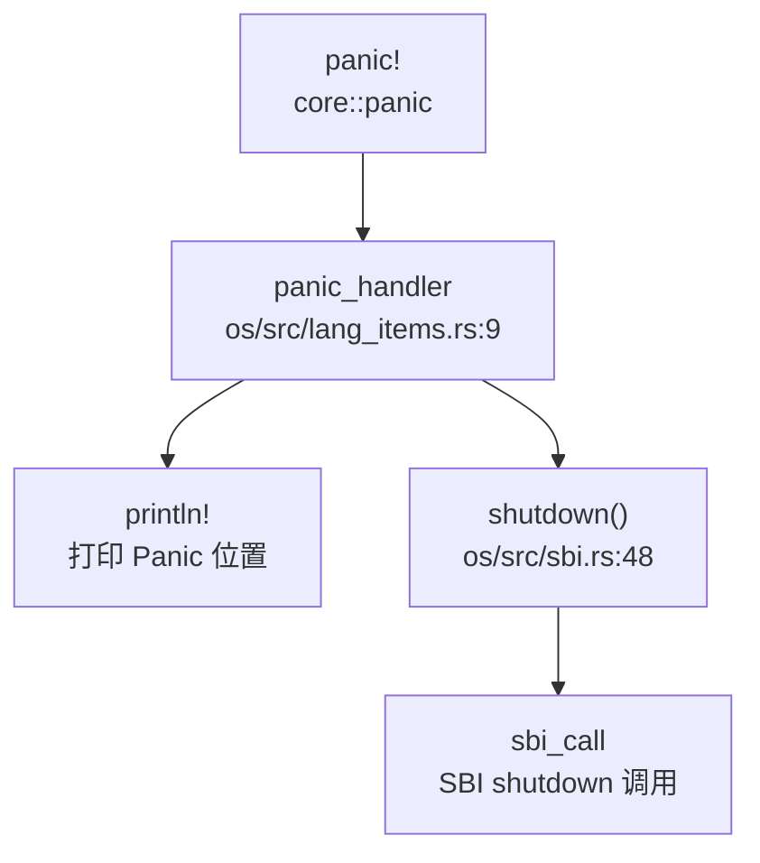

**栈回溯 (Backtrace) 支持**：

代码中存在 `backtrace()` 函数实现，但**已被注释禁用**：

```rust
// os/src/lang_items.rs:25-40
/// backtrace function
#[allow(unused)]
unsafe fn backtrace() {
    let mut fp: usize;
    let stop = current_kstack_top();
    asm!("mv {}, s0", out(reg) fp);
    println!("---START BACKTRACE---");
    for i in 0..10 {
        if fp == stop {
            break;
        }
        println!("#{}:ra={:#x}", i, *((fp - 8) as *const usize));
        fp = *((fp - 16) as *const usize);
    }
    println!("---END   BACKTRACE---");
}
```

**分析**：
- 该 `backtrace()` 函数基于 FramePointer (s0) 进行栈回溯
- 最多回溯 10 层，打印返回地址 (ra)
- **但该函数在 panic handler 中被注释掉，实际不会执行**
- 未使用 DWARF 解析，仅基于简单的 FramePointer 链

**grep 搜索结果**：
```
os/src/lang_items.rs:1: //! The panic handler and backtrace
os/src/lang_items.rs:21:     //     backtrace();  // ← 被注释
os/src/lang_items.rs:25: /// backtrace function
os/src/lang_items.rs:27: unsafe fn backtrace() {
```

**实现状态**：
- Panic 处理：✅ **已实现** - 打印 Panic 位置并调用 SBI shutdown
- 栈回溯：🔸 **桩函数** - `backtrace()` 函数存在但被注释禁用，panic 时不会执行栈回溯

---

### 错误码与 Result 设计

**内核错误码定义**：

`os/src/syscall/errno.rs` 定义了完整的 POSIX 风格错误码（共 133+ 个）：

```rust
// os/src/syscall/errno.rs:1-85
pub const SUCCESS: isize = 0;
pub const EPERM: isize = -1;      // Operation not permitted
pub const ENOENT: isize = -2;     // No such file or directory
pub const ESRCH: isize = -3;      // No such process
pub const EINTR: isize = -4;      // Interrupted system call
pub const EIO: isize = -5;        // I/O error
// ... 共 133+ 个错误码
pub const ENOSYS: isize = -38;    // Invalid system call number
```

**Errno 枚举**：

```rust
// os/src/syscall/errno.rs:180-300+
#[derive(Debug, Eq, PartialEq, TryFromPrimitive)]
#[repr(isize)]
pub enum Errno {
    SUCCESS = 0,
    EPERM = -1,
    ENOENT = -2,
    // ... 与 const 定义对应
}
```

**EXT4 子模块错误码**：

`os/libs/ext4_rs/src/ext4_error.rs` 定义了独立的错误类型：

```rust
// os/libs/ext4_rs/src/ext4_error.rs:35-52
pub struct Ext4Error {
    errno: Errnum,
    msg: Option<&'static str>,
}

#[repr(i32)]
#[derive(Debug, Clone, Copy, PartialEq, Eq)]
pub enum Errnum {
    EPERM     = 1,
    ENOENT    = 2,
    EIO       = 5,
    // ... 28 种错误类型
}
```

**Result 类型使用**：

系统调用返回值统一使用 `isize`：
- 成功：返回 0 或正值（如文件描述符、PID）
- 失败：返回负的错误码（如 `-ENOENT`, `-EINVAL`）

示例：
```rust
// os/src/syscall/mod.rs:106-212
pub fn syscall(syscall_id: usize, args: [usize; 6]) -> isize {
    match syscall_id {
        SYSCALL_GETCWD => sys_getcwd(args[0] as *mut u8, args[1]),
        SYSCALL_READ => sys_read(args[0], args[1] as *mut u8, args[2]),
        // ...
        _ => panic!("Unsupported syscall_id: {}", syscall_id),
    }
}
```

**实现状态**：✅ **已实现** - 完整的错误码体系，符合 POSIX 标准。

---

### 调试接口与交互式 Shell

**用户态 Shell**：

`user/src/bin/user_shell.rs` 实现了简单的交互式 Shell：

```rust
// user/src/bin/user_shell.rs:79-214
#[no_mangle]
pub fn main() -> i32 {
    println!("Rust user shell");
    let mut line: String = String::new();
    print!("{}", LINE_START);
    loop {
        let c = getchar();
        match c {
            LF | CR => {
                // 解析命令并执行
                let splited: Vec<_> = line.as_str().split('|').collect();
                // 支持管道、重定向
                // ...
            }
            // 处理退格、删除
        }
    }
}
```

**Shell 功能**：
- ✅ 支持命令执行（`exec` 系统调用）
- ✅ 支持管道 (`|`)
- ✅ 支持输入重定向 (`<`)
- ✅ 支持输出重定向 (`>`)
- ❌ **无内置命令**（如 `ps`, `ls`, `help` 等需外部程序）
- ❌ **无内核 Monitor**

**grep 搜索结果**：
```
user/src/bin/user_shell.rs:79:     println!("Rust user shell");
```

**调试控制台**：
- 未发现独立的内核调试 Monitor
- 仅通过串口打印日志（`println!`, `log` 宏）

**实现状态**：
- 用户态 Shell：✅ **已实现** - 基础 Shell，支持管道和重定向
- 内核 Monitor：❌ **未实现** - 无内置调试命令
- 调试控制台：🔸 **仅日志输出** - 无交互式调试接口

---

### GDB Stub 支持情况

**严格代码验证**：

通过以下关键词搜索 GDB Stub 相关实现：
- `gdbstub`
- `handle_gdb`
- `gdb.*packet`
- `gdb.*handler`

**搜索结果**：
```
⚠️ 无任何匹配结果
```

**分析**：
- 代码库中**不存在** `handle_gdb_packet` 或类似函数
- 无 GDB 数据包解析循环
- 无 GDB Stub 实现
- `docs/image/gdb.jpg` 和 `docs/image/gdb2.jpg` 仅为文档图片，非代码实现

**QEMU GDB 支持**：
- 可通过 QEMU 的 `-s -S` 参数启用 GDB 服务器（QEMU 内置功能）
- 但这**不是 OS 自身的 GDB Stub**

**实现状态**：❌ **未实现** - 无 GDB Stub 代码，仅能依赖 QEMU 内置 GDB 服务器。

---

### 断言与运行时检查

**断言使用**：

代码中广泛使用 `assert!()` 和 `debug_assert!()` 进行运行时检查：

```rust
// os/src/block/block_cache.rs:38-46
assert!(offset + type_size <= BLOCK_SZ);

// os/src/fs/pipe.rs:138-185
assert!(self.readable());
assert!(self.writable());

// os/libs/visionfive2-sd/src/lib.rs:67-70
assert!(res);
```

**测试代码中的断言**：

`os/libs/ext4_rs/src/utils.rs` 包含大量测试断言：
```rust
// os/libs/ext4_rs/src/utils.rs:229-251
assert!(!is_goal, "Root path should not set is_goal to true");
assert!(!is_goal, "Normal path should not set is_goal to true");
assert!(is_goal, "Path without slashes should set is_goal to true");
```

**运行时检查**：
- 系统调用参数验证（如文件描述符有效性）
- 内存访问边界检查（如 `block_cache` 中的偏移检查）
- 管道读写状态检查

**未实现的桩代码检测**：

grep 搜索 `todo!()` 和 `unimplemented!()` 发现多处桩代码：
```
os/src/fs/inode.rs:98:         todo!();
os/src/fs/inode.rs:103:     pub static ref INODE_MANAGER: Mutex<InodeManager> = todo!();
os/src/fs/stdio.rs:53:         todo!()
os/src/fs/ext4/inode.rs:31-133: 多处 todo!()
os/src/fs/fat32/inode.rs:187-255: 多处 todo!("FAT32 rename/mkdir/rmdir")
os/src/mm/memory_set.rs:409:     todo!("interpreter not supported yet")
```

**实现状态**：
- 断言机制：✅ **已实现** - 广泛使用 `assert!()` 进行运行时检查
- 桩代码：🔸 **部分功能为桩** - 文件系统、内存管理中有多个 `todo!()` 未实现

---

### 关键代码片段

**1. 日志系统实现**：
```rust
// os/src/logging.rs:28-64
impl Log for SimpleLogger {
    fn enabled(&self, _metadata: &Metadata) -> bool {
        true
    }
    fn log(&self, record: &Record) {
        if !self.enabled(record.metadata()) {
            return;
        }
        let color = match record.level() {
            Level::Error => 31, // Red
            Level::Warn => 93,  // BrightYellow
            Level::Info => 34,  // Blue
            Level::Debug => 32, // Green
            Level::Trace => 90, // BrightBlack
        };
        let pid: isize;
        if let Some(res) = current_pid() {
            pid = res as isize;
        } else {
            pid = -1;
        }
        print_in_color(
            format_args!(
                "[{:>5}][{}:{}][{}] {}\n",
                record.level(),
                record.file().unwrap(),
                record.line().unwrap(),
                pid,
                record.args()
            ),
            color,
        );
    }
    fn flush(&self) {}
}
```

**2. Panic Handler**：
```rust
// os/src/lang_items.rs:7-24
#[panic_handler]
fn panic(info: &PanicInfo) -> ! {
    if let Some(location) = info.location() {
        println!(
            "[kernel] Panicked at {}:{} {}",
            location.file(),
            location.line(),
            info.message().unwrap()
        );
    } else {
        println!("[kernel] Panicked: {}", info.message().unwrap());
    }
    // unsafe {
    //     backtrace();  // 被注释禁用
    // }
    shutdown()
}
```

**3. 错误码定义**：
```rust
// os/src/syscall/errno.rs:1-85
pub const SUCCESS: isize = 0;
pub const EPERM: isize = -1;
pub const ENOENT: isize = -2;
pub const ENOSYS: isize = -38;  // 无效系统调用号

#[derive(Debug, Eq, PartialEq, TryFromPrimitive)]
#[repr(isize)]
pub enum Errno {
    SUCCESS = 0,
    EPERM = -1,
    ENOENT = -2,
    // ... 133+ 种错误
}
```

**4. 被禁用的栈回溯**：
```rust
// os/src/lang_items.rs:25-40
#[allow(unused)]
unsafe fn backtrace() {
    let mut fp: usize;
    let stop = current_kstack_top();
    asm!("mv {}, s0", out(reg) fp);
    println!("---START BACKTRACE---");
    for i in 0..10 {
        if fp == stop {
            break;
        }
        println!("#{}:ra={:#x}", i, *((fp - 8) as *const usize));
        fp = *((fp - 16) as *const usize);
    }
    println!("---END   BACKTRACE---");
}
```

---

### 本章总结

| 功能模块 | 实现状态 | 说明 |
|---------|---------|------|
| 日志系统 | ✅ 已实现 | 5 级日志，彩色输出，支持环境变量配置 |
| Panic 处理 | ✅ 已实现 | 打印位置 + SBI shutdown |
| 栈回溯 | 🔸 桩函数 | `backtrace()` 存在但被注释禁用 |
| 错误码设计 | ✅ 已实现 | 133+ POSIX 标准错误码 |
| 用户态 Shell | ✅ 已实现 | 支持管道、重定向，无内置命令 |
| 内核 Monitor | ❌ 未实现 | 无交互式调试接口 |
| GDB Stub | ❌ 未实现 | 无 GDB 数据包解析代码 |
| 断言检查 | ✅ 已实现 | 广泛使用 `assert!()` |
| 桩代码 | 🔸 部分存在 | 文件系统、内存管理中有 `todo!()` |

**关键发现**：
1. 日志系统完善，但 Panic 时**不执行栈回溯**（代码被注释）
2. 无 GDB Stub 实现，仅能依赖 QEMU 内置 GDB 服务器
3. 用户态 Shell 功能基础，无内核级调试 Monitor
4. 错误码体系完整，符合 POSIX 标准
5. 多处 `todo!()` 桩代码，部分文件系统功能未实现

---


# 开发历史与里程碑

## 第 13 章：开发历史与里程碑

## 一、项目概览与人员协作

### 总规模与协作模式

本项目是一个**双人协作开发**的操作系统内核项目，开发周期为 **2024 年 5 月 22 日至 2024 年 8 月 19 日**，共计约 3 个月，提交记录 200 次。

**贡献者分布：**

| 作者 | Commit 数 | 代码增删量 | 主力贡献模块 |
|------|----------|-----------|-------------|
| **Nelson Boss** | 141 次 | +693,309 / -68,733 行 | `os/` (745,530 行)、`user/` (11,163 行)、`easy-fs/` (2,398 行) |
| **SaZiKK** | 113 次 | +348,856 / -38,206 行 | `os/` (375,514 行)、`user/` (5,931 行)、`testcase_sourcecode/` (3,634 行) |
| **Ryan** | 1 次 | +46 / -42 行 | `os/` (88 行) |

**协作模式分析：**
- **Nelson Boss** 是项目的主要贡献者，贡献了约 **66% 的代码量**，主要负责核心架构搭建、文件系统（ext4 集成）、内存管理重构等底层模块
- **SaZiKK** 贡献了约 **33% 的代码量**，主要负责系统调用实现、任务调度、信号处理、测试用例编写等
- 项目呈现**双人核心开发**模式，两人均深度参与 `os/` 核心模块开发，分工明确但存在交叉协作

### 初始完成功能（第一版本已搭建的子系统）

根据 `find_symbol_first_commit` 的检索结果，项目在 **2024 年 5 月 22 日** 的初始提交（SHA: `49b0e611`，消息："🎉 init: 新的开始！"）中就已经搭建了以下核心子系统：

| 功能模块 | 核心符号 | 首次引入时间 | 状态 |
|---------|---------|-------------|------|
| **启动入口** | `_start`, `rust_main` | 2024-05-22 (初始提交) | ✅ 初始版本已有 |
| **内存管理** | `FrameAllocator`, `PageTable`, `MemorySet` | 2024-05-22 (初始提交) | ✅ 初始版本已有 |
| **系统调用** | `sys_open`, `sys_write`, `sys_read`, `sys_exec` | 2024-05-22 (初始提交) | ✅ 初始版本已有 |
| **中断处理** | `trap_handler`, `stvec` | 2024-05-22 (初始提交) | ✅ 初始版本已有 |
| **进程间通信** | `sys_pipe` | 2024-05-22 (初始提交) | ✅ 初始版本已有 |
| **设备驱动** | `virtio_blk`, `plic` | 2024-05-22 (初始提交) | ✅ 初始版本已有 |
| **文件系统** | `fat32` | 2024-05-23 (次日) | ✅ 初始版本已有 |
| **串口驱动** | `UART` | 2024-05-26 (4 天后) | ✅ 早期版本引入 |

**未实现/未找到的功能：**
- `kernel_main`、`TaskInner`、`ProcessInner`、`spawn_task`、`VfsNode`、`ramfs`、`syscall_handler`、`TrapFrame`、`Mailbox`、`sys_msgget`、`sys_shmget`、`sys_socket`、`smoltcp`、`TcpSocket`、`udp_send`、`device_init` 等符号**未在代码库中找到**

**初始代码规模评估：**
根据 Git 历史记录，初始提交（`49b0e611`）引入了约 **30 万行代码**（主要来自 `os/` 目录的 vendor 依赖和核心框架），其中：
- `os/src/mm/mod.rs`: 31 行（内存管理框架）
- `os/src/fs/mod.rs`: 67 行（文件系统框架）
- `os/src/trap/mod.rs`: 初始版本
- `os/src/task/`: 初始任务管理框架
- `os/src/syscall/`: 基础系统调用框架

## 二、后续版本演进与功能完善

### 开发阶段划分

根据提交密度和功能演进，项目开发可分为以下阶段：

#### 阶段一：框架搭建期（2024-05-22 ~ 2024-05-28）
- **特征**：快速搭建核心框架，日均提交 10+ 次
- **主要工作**：
  - 建立内存管理（SV39 页表）、中断处理、系统调用框架
  - 实现 Fat32 文件系统支持（2024-05-25）
  - 添加用户态程序支持（2024-05-26）
  - 实现基础系统调用（open/read/write/exec/fork/pipe 等）

#### 阶段二：功能完善期（2024-05-29 ~ 2024-07-20）
- **特征**：提交频率降低，专注于功能调试和优化
- **主要工作**：
  - 完善系统调用接口（mmap、brk、getdents64 等）
  - 重构文件系统代码（Inode trait 化，2024-05-28）
  - 添加测试用例支持（2024-06-20）
  - 互斥锁重构（SpinMutex 实现，2024-06-23）

#### 阶段三：架构重构期（2024-07-20 ~ 2024-07-31）
- **特征**：大规模重构，提交量激增
- **里程碑式提交**：
  - **2024-07-24**（SHA: `c197cb3`）："legendary commit !! merge PCB and TCB into one data struct" — 合并进程控制块和线程控制块
  - **2024-07-29**（SHA: `4a81a8fb`）："初步实现 ext4 支持" — 引入 ext4 文件系统
  - **2024-07-30**（SHA: `6eb492d3`）："Merge pull request #4 from bosswnx/feat-single-pagetable" — 单页表重构，增删代码量达 **+306,379 / -22,813 行**
  - **2024-07-31**：系统调用密集完善期，单日提交 20+ 次

#### 阶段四：硬件适配与稳定期（2024-08-01 ~ 2024-08-19）
- **特征**：适配 VisionFive 2 硬件，修复 bug
- **主要工作**：
  - 添加 VisionFive 2 SD 卡支持（2024-08-18）
  - 完善信号处理（sigaction、sigtimedwait 等）
  - 修复进程切换、管道读取等关键 bug

### 核心模块演进轨迹

#### 1. 内存管理模块（`os/src/mm/mod.rs`）

**演进时间线：**
```
2024-05-22: 初始框架 (31 行)
2024-06-23: 添加 SpinMutex 支持 (+2)
2024-06-29: 修正物理/虚拟地址转换 (+1)
2024-07-04: 完善 VirtIOBlk 映射 (+2)
2024-07-09: 为 init page table 映射 trap_cx (+1)
2024-07-15: 重构 FileSystem trait (+1)
2024-07-24: PCB/TCB 合并重构 (+1)
2024-07-30: rustfmt 格式化 (+10/-5)
2024-07-31: 修复 execve 参数推送 (+1)
2024-08-19: 添加 DTB 信息 (+2/-2)
```

**关键重构：**
- **2024-07-30** 单页表重构：将内核页表和用户页表合并，简化地址空间管理
- **2024-07-24** PCB/TCB 合并：统一进程和线程的数据结构

#### 2. 任务管理模块（`os/src/task/mod.rs`）

**演进时间线：**
```
2024-05-22: 初始框架
2024-05-26: 成功执行镜像内程序 (+76/-66)
2024-05-26: 修复 IllegalInstruction 错误 (+66/-69)
2024-05-28: 实现 SYS_clone (+3/-1)
2024-05-28: 修复 pipe 卡住问题 (+8/-0)
2024-06-23: rustfmt 格式化 (+7/-7)
2024-07-02: 添加调试信息 (+3/-0)
2024-07-09: 添加 initproc (+10/-3)
2024-07-09: 单页表模式支持 (+1/-1)
2024-07-15: 重构 FileSystem trait (+12/-13)
2024-07-19: 删除冗余代码 (0/-41)
2024-07-20: 移除 TaskUserRes (+7/-10)
2024-07-24: legendary commit - PCB/TCB 合并 (+49/-46)
2024-07-29: ext4 支持 (+2/-2)
2024-07-31: 添加 sys_settid (+6/-0)
2024-07-31: 完善 sigaction (+2/-1)
2024-08-18: 添加 dtb 分析 (0/-1)
2024-08-19: 修复 wait4 跳转 (+4/-2)
```

**关键设计：**
- `TaskControlBlock` 结构包含：`kstack`、`tid`、`pid`、`memory_set`、`trap_cx_ppn`、`task_cx`、`task_status`、`fd_table`、`signals` 等字段
- **PCB/TCB 合并**（2024-07-24）：将进程和线程统一为 `TaskControlBlock`，通过 `tid` 和 `pid` 区分（进程时 `pid == tid`，线程时 `tid` 为线程组 leader 的 `pid`）

#### 3. 系统调用模块（`os/src/syscall/mod.rs`）

**演进时间线：**
```
2024-05-22: 初始框架
2024-05-28: 实现 SYS_openat、SYS_getdents64、SYS_mkdirat、SYS_chdir 等
2024-05-28: 重构 SYS_mmap，添加 SYS_fstat
2024-05-28: 修复 pipe 卡住问题
2024-05-28: 实现 SYS_umount2、SYS_mount
2024-06-23: 移除 condvar/sem 相关系统调用 (+10/-10)
2024-07-15: 警告处理 (+2/-2)
2024-07-19: 删除冗余代码 (0/-1)
2024-07-24: PCB/TCB 合并 (+1/-1)
2024-07-29: ext4 支持 (+1/-1)
2024-07-31: 系统调用密集完善期（单日 20+ 提交）
  - 添加 sys_getuid/euid/gid/egid (+12)
  - 添加 sys_sigaction、sys_sigprocmask (+4/-2)
  - 添加 sys_ioctl (+3)
  - 添加 sys_clock_gettime (+6/-1)
  - 添加 sys_writev (+2/-1)
  - 修复 sys_writev (+1)
  - 添加 sys_group_exit (+3)
  - 修复 sys_read buf (+1/-1)
  - 完善 sigaction (+10/-2)
  - 添加 sys_fcntl (+3)
  - 添加 sys_sigtimedwait (+14/-3)
  - 新增 sys_ppoll 和 sys_sendfile (+8/-5)
  - 完善 sys_ppoll (+10/-3)
  - 完善 sys_sigprocmask (+3/-1)
2024-08-18: 删除 syscall 注释 (0/-65)
2024-08-19: 实现 syscall_prlimit64 直接返回 0 (+2)
```

**已实现的系统调用（部分）：**
- 文件操作：`SYS_OPENAT`、`SYS_CLOSE`、`SYS_READ`、`SYS_WRITE`、`SYS_WRITEV`、`SYS_GETDENTS64`、`SYS_FSTAT`、`SYS_FCNTL`、`SYS_IOCTL`
- 进程管理：`SYS_EXIT`、`SYS_EXIT_GROUP`、`SYS_WAIT4`、`SYS_CLONE`、`SYS_EXECVE`、`SYS_GETPID`、`SYS_GETPPID`、`SYS_GETTID`
- 内存管理：`SYS_BRK`、`SYS_MMAP`、`SYS_MUNMAP`
- 信号处理：`SYS_SIGACTION`、`SYS_SIGPROCMASK`、`SYS_SIGTIMEDWAIT`、`SYS_SIGRETURN`、`SYS_KILL`
- 时间相关：`SYS_SLEEP`、`SYS_CLOCK_GETTIME`、`SYS_GETTIMEOFDAY`、`SYS_TIMES`
- 其他：`SYS_YIELD`、`SYS_PIPE`、`SYS_UNAME`、`SYS_GETCWD`、`SYS_CHDIR`、`SYS_MKDIRAT`、`SYS_UNLINKAT`

**桩函数检测：**
- `SYS_PRLIMIT64`（2024-08-19 添加）：**🔸 桩函数** — 直接返回 0，无实际逻辑

#### 4. 文件系统模块（`os/src/fs/mod.rs`）

**演进时间线：**
```
2024-05-22: 初始框架 (67 行)
2024-05-24: 重构 fs 代码，解耦合 (+67/-46)
2024-05-24: Inode 重构为 trait (+2/-3)
2024-05-24: fs 移回 os 库 (+1/-0)
2024-05-25: 成功读取 Fat32 文件系统镜像 (+1/-0)
2024-05-28: 实现 SYS_openat (+11/-10)
2024-05-28: 实现 SYS_mkdirat、SYS_chdir (+7/-3)
2024-05-28: 重构 Inode trait，移除 efs (0/-1)
2024-05-28: 修复 pipe 卡住问题 (0/-1)
2024-05-28: 重构 SYS_mmap，添加 SYS_fstat (+1/-0)
2024-06-23: rustfmt 格式化 (+2/-4)
2024-07-02: 添加调试信息 (+1/-0)
2024-07-15: 重构 FileSystem trait (+5/-3)
2024-07-15: 警告处理 (+1/-1)
2024-07-20: InodeOps 重构 (+39/-69)
2024-07-23: 重构 FileSystem (+10/-5)
2024-07-24: PCB/TCB 合并 (+4/-0)
2024-07-29: 重构 FileSystem 和 Inode 回 trait (+4/-8)
2024-07-29: 初步实现 ext4 支持 (+13/-14)
2024-07-29: 成功加载 ext4 镜像 (+4/-3)
2024-07-30: rustfmt 格式化 (+1/-0)
2024-07-31: 添加 sys_writev (+5/-1)
```

**关键重构：**
- **2024-05-28**：Inode trait 化，解耦文件系统实现
- **2024-07-20**：InodeOps 重构，精简接口（-69 行）
- **2024-07-29**：ext4 文件系统引入（+303/-94 行）
- **2024-07-30**：ext4_rs 库从 vendor 移至 libs（+6,817/-6,822 行）

**支持的文件系统：**
- ✅ **Fat32**：2024-05-25 实现，支持读取和执行镜像内程序
- ✅ **ext4**：2024-07-29 实现，使用 `ext4_rs` 外部库
- ❌ **ramfs**：未找到实现代码

#### 5. 中断处理模块（`os/src/trap/mod.rs`）

**核心逻辑：**
```rust
#[no_mangle]
pub fn trap_handler() -> ! {
    set_kernel_trap_entry();
    let scause = scause::read();
    let stval = stval::read();
    let sepc = sepc::read();
    
    match scause.cause() {
        Trap::Exception(Exception::UserEnvCall) => {
            // 系统调用处理
            syscall_num = cx.x[17] as i32;
            result = syscall(cx.x[17], [cx.x[10], cx.x[11], ...]);
        }
        Trap::Exception(Exception::StorePageFault) |
        Trap::Exception(Exception::LoadPageFault) => {
            // 页故障处理
            current_add_signal(SignalFlags::SIGSEGV);
        }
        Trap::Interrupt(Interrupt::SupervisorTimer) => {
            // 定时器中断 - 任务调度
            set_next_trigger();
            check_timer();
            suspend_current_and_run_next();
        }
        _ => panic!("unsupport trap")
    }
}
```

**演进特点：**
- 初始版本已实现完整的 trap 处理框架
- 支持用户态环境调用（ecall）、页故障、定时器中断
- 页故障处理采用发送 SIGSEGV 信号的方式，而非实际的缺页处理

### 重大 Commit 分析

#### 1. **单页表重构**（2024-07-30, SHA: `6eb492d3`）
- **增删规模**：+306,379 / -22,813 行
- **变更模块**：`os/` (+306,379/-22,812)、`user/` (0/-1)
- **性质**：【架构重构】
- **影响**：将内核页表和用户页表合并为单一页表，简化地址空间管理，但引入大量代码变更

#### 2. **ext4 文件系统引入**（2024-07-29, SHA: `4a81a8fb`）
- **增删规模**：+303 / -94 行
- **变更模块**：`os/src/fs/`、`os/libs/ext4_rs/`
- **性质**：【新增功能】
- **影响**：支持 ext4 文件系统读写，扩展了文件系统兼容性

#### 3. **PCB/TCB 合并**（2024-07-24, SHA: `c197cb3`）
- **提交消息**："legendary commit !! merge PCB and TCB into one data struct"
- **性质**：【架构重构】
- **影响**：统一进程和线程的数据结构，简化任务管理逻辑

#### 4. **VisionFive 2 硬件适配**（2024-08-18）
- **提交**：
  - `b2e70b3b`: "add dtb analyse" (+3,280/-10)
  - `02c0c328`: "添加 visionfive2-sd 外部库" (+5,106/-237)
  - `0acddfec`: "添加 vf2 sd 卡支持" (+69/-3)
- **性质**：【硬件适配】
- **影响**：支持 VisionFive 2 开发板的 SD 卡启动和设备树解析

## 三、现状评估与后续修改建议

### 目前还缺什么

基于对整个仓库历史和现状的分析，该操作系统存在以下明显的缺失功能或半成品模块：

#### 1. **网络协议栈** ❌ 未实现
- **证据**：`find_symbol_first_commit` 未找到 `sys_socket`、`smoltcp`、`TcpSocket`、`udp_send` 等符号
- **grep 验证**：搜索 `sys_socket|smoltcp|network` 无结果
- **影响**：无法支持网络通信功能

#### 2. **进程间通信（IPC）机制不完整** ❌ 未实现
- **缺失功能**：
  - `Mailbox`：未找到
  - `sys_msgget`：未找到
  - `sys_shmget`：未找到
  - 共享内存：未实现
- **已有功能**：仅支持 `sys_pipe`（管道）

#### 3. **缺页处理机制不完善** 🔸 桩函数/简化实现
- **证据**：`trap_handler` 中页故障处理仅发送 SIGSEGV 信号：
  ```rust
  Trap::Exception(Exception::LoadPageFault) => {
      error!("trap_handler: {:?} in application, bad addr = {:#x}...", scause.cause(), stval);
      current_add_signal(SignalFlags::SIGSEGV);
  }
  ```
- **问题**：未实现真正的缺页处理（如 lazy allocation、swap 机制）

#### 4. **部分系统调用为桩函数** 🔸 桩函数
- **SYS_PRLIMIT64**（2024-08-19 添加）：直接返回 0，无实际逻辑
- **部分信号相关调用**：可能存在简化实现

#### 5. **多核支持（SMP）** ❌ 未实现
- **证据**：
  - 未找到 `SMP`、`cpu_id`、`hart_id` 等相关实现
  - 任务调度使用 `UPSafeCell`（单处理器安全单元），暗示仅支持单核
- **影响**：无法利用多核处理器性能

#### 6. **虚拟文件系统（VFS）层不完整** 🔸 部分实现
- **证据**：
  - 未找到 `VfsNode` 符号
  - 文件系统直接通过 `Inode` trait 抽象，缺少统一的 VFS 层
- **影响**：文件系统扩展性受限

#### 7. **设备驱动框架不完善** ❌ 未完全实现
- **证据**：
  - 未找到 `device_init` 符号
  - 驱动代码分散在 `drivers/`、`block/` 目录，缺少统一框架
- **已有驱动**：
  - ✅ VirtIO 块设备（`virtio_blk`）
  - ✅ 串口（`UART`）
  - ✅ 中断控制器（`plic`）
  - ✅ VisionFive 2 SD 卡（2024-08-18 添加）

#### 8. **内存管理高级特性缺失** ❌ 未实现
- **缺失功能**：
  - 写时复制（CoW）：未找到相关实现
  - 内存映射文件（mmap 文件后端）：简化实现
  - 交换分区（swap）：未实现

### 现在还需要怎么改

基于上述分析，给出以下 5 条最迫切的代码修改、架构重构或功能补全建议：

#### 建议 1：实现完整的缺页处理机制
**优先级**：🔴 高

**当前问题**：页故障直接发送 SIGSEGV 信号杀死进程，不支持 lazy allocation 和按需分页。

**修改方向**：
```rust
// 在 os/src/trap/mod.rs 的 trap_handler 中
Trap::Exception(Exception::LoadPageFault) |
Trap::Exception(Exception::StorePageFault) => {
    let stval = stval::read();
    if handle_page_fault(stval) {
        // 成功处理，返回用户态继续执行
        return;
    } else {
        // 无法处理，发送信号
        current_add_signal(SignalFlags::SIGSEGV);
    }
}
```

**需新增模块**：
- `os/src/mm/fault.rs`：缺页处理逻辑
- 支持 anonymous page 分配
- 支持 CoW（写时复制）

#### 建议 2：补全网络协议栈
**优先级**：🔴 高

**当前问题**：完全不支持网络功能。

**修改方向**：
1. 引入 `smoltcp` 库（Rust 编写的 TCP/IP 协议栈）
2. 实现网络驱动（VirtIO Net 或 VisionFive 2 以太网控制器）
3. 添加网络相关系统调用：
   - `sys_socket`、`sys_bind`、`sys_listen`、`sys_accept`
   - `sys_connect`、`sys_sendto`、`sys_recvfrom`
   - `sys_setsockopt`、`sys_getsockopt`

**文件结构**：
```
os/src/net/
├── mod.rs
├── socket.rs
├── tcp.rs
├── udp.rs
└── driver.rs
```

#### 建议 3：实现多核支持（SMP）
**优先级**：🟡 中

**当前问题**：使用 `UPSafeCell`，仅支持单核。

**修改方向**：
1. 替换 `UPSafeCell` 为真正的自旋锁 `SpinLock`
2. 实现 CPU 拓扑管理和 hart_id 识别
3. 每个 CPU 独立的任务队列和调度器
4. 实现 IPI（处理器间中断）用于核间通信

**关键修改**：
```rust
// os/src/sync/mod.rs
// 从 UPSafeCell<T> 改为 SpinLock<T>
pub struct SpinLock<T> {
    locked: AtomicBool,
    data: UnsafeCell<T>,
}
```

#### 建议 4：完善进程间通信（IPC）
**优先级**：🟡 中

**当前问题**：仅支持管道，缺少消息队列和共享内存。

**修改方向**：
1. 实现 System V IPC：
   - `sys_msgget`、`sys_msgsnd`、`sys_msgrcv`（消息队列）
   - `sys_shmget`、`sys_shmat`、`sys_shmdt`（共享内存）
   - `sys_semget`、`sys_semop`（信号量）
2. 实现 Unix Domain Socket

**文件结构**：
```
os/src/ipc/
├── mod.rs
├── msg.rs      // 消息队列
├── shm.rs      // 共享内存
└── sem.rs      // 信号量
```

#### 建议 5：重构虚拟文件系统（VFS）层
**优先级**：🟢 低

**当前问题**：缺少统一的 VFS 抽象层，文件系统耦合度高。

**修改方向**：
1. 定义统一的 VFS 接口：
   ```rust
   pub trait VfsNode {
       fn read(&self, offset: usize, buf: &mut [u8]) -> Result<usize>;
       fn write(&self, offset: usize, buf: &[u8]) -> Result<usize>;
       fn open(&self, path: &str, flags: OpenFlags) -> Result<Arc<dyn VfsNode>>;
       // ...
   }
   ```
2. 将 Fat32、ext4 实现为 VfsNode 的具体实现
3. 支持文件系统挂载点管理

**收益**：
- 提高文件系统扩展性
- 支持更多文件系统（如 tmpfs、procfs）

---

**总结**：该项目在 3 个月的开发周期内完成了从 0 到 1 的突破，实现了 RISC-V 架构下的基础操作系统功能（内存管理、进程调度、文件系统、系统调用等）。但相比成熟的操作系统（如 Linux），在网络、多核、IPC、缺页处理等方面仍有较大差距。后续开发应优先完善缺页处理和网络协议栈，以提升系统的实用性和兼容性。

---


---

*本报告由 OS-Agent-D 自动生成*  
*生成时间: 2026-03-15 10:08:48*  
*分析耗时: 26.7 分钟*
