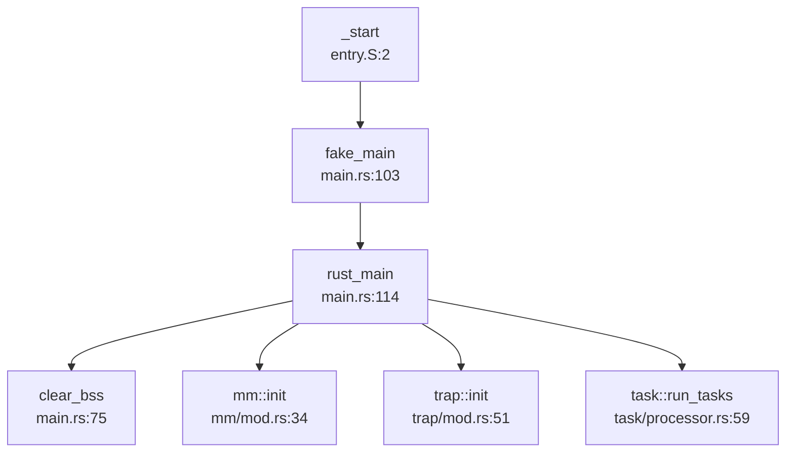

## 第 2 章：启动流程与架构初始化

## 启动入口与链接脚本分析

### 汇编入口点 `_start`

ChaOS 的启动入口位于汇编文件 `os/src/entry.S`（QEMU 平台）和 `os/src/entry_visionfive2.S`（VisionFive2 平台）。两个入口文件结构相似，主要区别在于物理内存基址。

**QEMU 平台入口** (`os/src/entry.S:1-38`)：

```assembly
.section .text.entry
.globl _start
_start:
    # pc = qemu: 0x80200000
    #      visionfive2: 0x40200000

    la sp, boot_stack_top

    # since the base addr is 0xffff_ffc0_8020_0000
    # we need to activate pagetable here in case of absolute addressing
    # satp: 8 << 60 | boot_pagetable
    la t0, boot_pagetable
    li t1, 8 << 60
    srli t0, t0, 12
    or t0, t0, t1
    csrw satp, t0
    sfence.vma
    call fake_main
```

**VisionFive2 平台入口** (`os/src/entry_visionfive2.S:1-41`)：

```assembly
.section .text.entry
.globl _start
_start:
    la sp, boot_stack_top
    
    # 与 QEMU 版本类似，但物理基址为 0x40200000
    la t0, boot_pagetable
    li t1, 8 << 60
    srli t0, t0, 12
    or t0, t0, t1
    csrw satp, t0
    sfence.vma
    
    call fake_main
```

**关键操作分析**：
1. **栈指针初始化**：`la sp, boot_stack_top` 将栈指针指向 BSS 段中预留的启动栈（64KB）
2. **页表立即启用**：在跳转到 Rust 代码前就激活了 SATP（页表基址寄存器），这是因为内核使用高位虚拟地址映射（`0xffff_ffc0_xxxx_xxxx`），必须启用分页才能正确访问绝对地址
3. **调用 `fake_main`**：这是一个过渡函数，负责地址转换后跳转到 `rust_main`

### 链接脚本配置

项目为两个平台分别定义了链接脚本：

**QEMU 链接脚本** (`os/src/linker-qemu.ld`)：
```ld
OUTPUT_ARCH(riscv)
ENTRY(_start)
BASE_ADDRESS = 0xffffffc080200000;
```

**VisionFive2 链接脚本** (`os/src/linker-vf2.ld`)：
```ld
OUTPUT_ARCH(riscv)
ENTRY(_start)
BASE_ADDRESS = 0xffffffc040200000;
```

**关键差异**：
- QEMU 物理基址：`0x80200000`
- VisionFive2 物理基址：`0x40200000`
- 虚拟地址偏移：`KERNEL_SPACE_OFFSET = 0xffff_ffc0_0000_0`（定义于 `os/src/config.rs:52`）

链接脚本将内核加载到高位虚拟地址空间，通过 1GB 大页映射将虚拟地址映射回物理地址。启动页表 `boot_pagetable` 在 `.data` 段中静态定义，包含两个关键映射：
- 物理地址 → 物理地址（恒等映射）
- 虚拟地址 → 物理地址（高位映射）

## 架构初始化流程（模式切换/FPU/MMU）

### CPU 特权模式分析

**🔸 模式切换状态：未显式实现**

通过搜索 `mstatus.mpp`、`sstatus.spp` 等寄存器操作，发现 ChaOS **未显式执行 M-Mode 到 S-Mode 的模式切换**。代码中仅在设置 Trap Context 时配置 `sstatus.spp` 字段用于用户态返回：

```rust
// os/src/trap/context.rs:32-34
pub fn app_init_context(
    entry: usize, sp: usize, kernel_satp: usize, kernel_sp: usize, trap_handler: usize,
) -> Self {
    let mut sstatus = sstatus::read();
    // set CPU privilege to User after trapping back
    sstatus.set_spp(SPP::User);  // 仅设置返回用户态时的特权级
    ...
}
```

**推断**：ChaOS 假设由 SBI 固件（RustSBI）或 Bootloader 完成 M-Mode → S-Mode 的切换，内核直接在 S-Mode 下启动。这符合 RISC-V 标准启动流程：SBI → OS。

### MMU 启用时机

**✅ 已实现：极早期启用**

MMU 在汇编入口 `_start` 中立即启用，远早于 Rust 代码执行：

```assembly
# os/src/entry.S:12-17
la t0, boot_pagetable
li t1, 8 << 60          # SATP 模式位 (SV39)
srli t0, t0, 12         # 将物理地址转换为页帧号
or t0, t0, t1
csrw satp, t0           # 写入 SATP 寄存器
sfence.vma              # 刷新 TLB
```

**原理**：由于内核编译为高位虚拟地址（`0xffff_ffc0_xxxx_xxxx`），而实际物理内存位于低位（QEMU: `0x80200000`，VF2: `0x40200000`），必须在访问任何绝对地址前启用页表映射。

### FPU 初始化状态

**❌ 未实现：未找到 FPU 启用代码**

通过搜索 `sstatus.fs`、`FS_` 常量以及 `fence.i` 指令，**未发现任何 FPU 初始化代码**。RISC-V 的 `sstatus.FS` 字段控制浮点单元状态，但 ChaOS 未设置该字段。

**影响**：
- 内核不支持浮点运算
- 用户态程序若使用浮点指令会触发非法指令异常（`IllegalInstruction`）
- 上下文切换中未保存/恢复浮点寄存器

### 中断控制器初始化

**✅ 已实现：定时器中断启用**

在 `rust_main` 中调用 `trap::enable_timer_interrupt()`：

```rust
// os/src/trap/mod.rs:74-78
pub fn enable_timer_interrupt() {
    unsafe {
        sie::set_stimer();  // 启用 Supervisor 模式定时器中断
    }
}
```

**中断向量表设置**：
- 内核态 Trap 入口：`__trap_from_kernel`（`os/src/trap/mod.rs:55`）
- 用户态 Trap 入口：`__alltraps`（`os/src/trap/trap.S:12`）
- 通过 `stvec::write()` 设置 `stvec` 寄存器

## 到达内核主函数的路径（完整调用链）

### 启动调用链



### 详细调用分析

**第 1 跳：`_start` → `fake_main`**

汇编调用 Rust 函数：
```assembly
# os/src/entry.S:18
call fake_main
```

**第 2 跳：`fake_main` → `rust_main`**

`fake_main` 是一个地址转换跳板（`os/src/main.rs:103-110`）：

```rust
#[no_mangle]
pub fn fake_main() {
    unsafe {
        asm!("add sp, sp, {}", in(reg) KERNEL_SPACE_OFFSET << 12);
        asm!("la t0, rust_main");
        asm!("add t0, t0, {}", in(reg) KERNEL_SPACE_OFFSET << 12);
        asm!("jalr zero, 0(t0)");
    }
}
```

**原理**：由于 `fake_main` 本身在高位虚拟地址执行，但 `rust_main` 的符号地址是链接时的虚拟地址，需要通过 `KERNEL_SPACE_OFFSET` 进行地址修正。

**第 3 跳：`rust_main` 初始化序列**

根据 `lsp_get_call_graph` 分析，`rust_main` 的调用顺序为：

```rust
// os/src/main.rs:114-172
pub fn rust_main() -> ! {
    #[cfg(feature = "visionfive2")]
    sleep_ms(5000);  // VF2 平台等待串口连接
    
    show_logo();      // 打印 ChaOS Logo
    clear_bss();      // 清零 BSS 段
    logging::init();  // 初始化日志系统
    
    init_dtb(None);   // 初始化设备树（双平台）
    let machine_info = machine_info();
    
    mm::init(memory_end);         // 内存管理初始化
    mm::remap_test();             // 重映射测试
    
    trap::init();                 // 中断处理初始化
    trap::enable_timer_interrupt();
    timer::set_next_trigger();
    
    fs::init();           // 文件系统初始化
    task::add_initproc(); // 添加初始进程
    task::run_tasks();    // 启动任务调度
    
    shutdown();           // 永远不会到达（除非崩溃）
}
```

### 关键初始化函数

**BSS 清零** (`os/src/main.rs:75-84`)：
```rust
fn clear_bss() {
    extern "C" {
        fn sbss();
        fn ebss();
    }
    unsafe {
        core::slice::from_raw_parts_mut(sbss as usize as *mut u8, ebss as usize - sbss as usize)
            .fill(0);
    }
}
```

**内存管理初始化** (`os/src/mm/mod.rs:34-41`)：
```rust
pub fn init(memory_end: usize) {
    heap_allocator::init_heap();           // 堆分配器
    frame_allocator::init_frame_allocator(memory_end);  // 物理帧分配器
    KERNEL_SPACE.exclusive_access(file!(), line!()).activate(); // 激活内核页表
}
```

**中断初始化** (`os/src/trap/mod.rs:51-53`)：
```rust
pub fn init() {
    set_kernel_trap_entry();  // 设置内核态 Trap 入口
}
```

## 多平台启动流程（StarFive/LoongArch 等）

### StarFive VisionFive2 平台

**✅ 已实现：专用启动流程**

VisionFive2 平台通过 Cargo Feature `visionfive2` 进行条件编译：

**平台特异性代码**：
1. **汇编入口**：`os/src/entry_visionfive2.S`（物理基址 `0x40200000`）
2. **链接脚本**：`os/src/linker-vf2.ld`（虚拟基址 `0xffffffc040200000`）
3. **板级配置**：`os/src/boards/visionfive2.rs`
4. **设备树**：内嵌 FDT 二进制 `jh7110-visionfive2_dtb.dtb`

**启动延迟**：
```rust
// os/src/main.rs:115-117
#[cfg(feature = "visionfive2")]
sleep_ms(5000);  // 等待 5 秒让测试程序连接串口
```

**MMIO 地址映射** (`os/src/boards/visionfive2.rs:9-15`)：
```rust
pub const MMIO: &[(usize, usize, MapPermission)] = &[
    (0x17040000, 0x10000, PERMISSION_RW),     // RTC
    (0xc000000, 0x4000000, PERMISSION_RW),    // PLIC
    (0x00_1000_0000, 0x10000, PERMISSION_RW), // UART
    (0x16020000, 0x10000, PERMISSION_RW),     // SDIO
];
```

**块设备驱动**：使用 `SDCard` 而非 QEMU 的 `VirtIOBlock`。

### QEMU Virt 平台

**✅ 已实现：标准 RISC-V Virt 机器**

QEMU 平台使用默认配置，物理基址 `0x80200000`，块设备为 `VirtIOBlock`。

**关机实现** (`os/src/boards/qemu.rs:106-110`)：
```rust
pub fn shutdown() -> ! {
    QEMU_EXIT_HANDLE.exit_success();  // 通过 MMIO 通知 QEMU 退出
}
```

而 VisionFive2 的 `shutdown` 仅为空循环（`os/src/boards/visionfive2.rs:19-22`），**🔸 桩函数**。

### LoongArch 平台

**❌ 未实现：未找到 LoongArch 相关代码**

搜索 `loongarch`、`loongarch64` 关键词无结果。项目仅支持 RISC-V 64 架构。

### 固件级启动链（RISC-V）

**✅ 已实现：SBI → OS 标准流程**

根据 README 和代码分析，ChaOS 使用 RustSBI 作为 SBI 固件：

```
SBI (RustSBI) → U-Boot (可选) → ChaOS Kernel
```

**SBI 调用接口** (`os/src/sbi.rs:16-28`)：
```rust
fn sbi_call(which: usize, arg0: usize, arg1: usize, arg2: usize) -> usize {
    let mut ret;
    unsafe {
        asm!(
            "li x16, 0",  // SBI 调用 ID 高位
            "ecall",      // 陷入 SBI
            inlateout("x10") arg0 => ret,
            in("x11") arg1,
            in("x12") arg2,
            in("x17") which,  // SBI 功能号
        );
    }
    ret
}
```

**支持的 SBI 功能**：
- `SBI_SET_TIMER (0)`：设置定时器
- `SBI_CONSOLE_PUTCHAR (1)`：串口输出
- `SBI_CONSOLE_GETCHAR (2)`：串口输入
- `SBI_SHUTDOWN (8)`：关机

**设备树传递**：
VisionFive2 平台通过 `init_dtb(None)` 使用内嵌 DTB（`jh7110-visionfive2_dtb.dtb`），QEMU 平台也支持 DTB 解析但非必需。

## 平台配置与构建机制

### Cargo Feature 配置

**双平台选择** (`os/Cargo.toml:22-26`)：
```toml
[features]
default = ["qemu"]  # 默认编译 QEMU 版本
qemu = []
visionfive2 = []
```

**编译命令**：
- QEMU: `cargo build --release`
- VisionFive2: `cargo build --release --features visionfive2 --no-default-features`

### Makefile 构建系统

**平台检测** (`os/Makefile:13-17`)：
```makefile
ifeq ($(MAKECMDGOALS),vf2)
    KERNEL_TARGET := kernel-vf2
endif
```

**特性传递** (`os/Makefile:73-79`)：
```makefile
kernel-vf2:
	@cargo build $(MODE_ARG) \
	--features visionfive2 \
	--no-default-features \
	-q
```

### 目标架构配置

**Rust Toolchain** (`rust-toolchain.toml:1-9`)：
```toml
[toolchain]
channel = "nightly-2024-02-03"
components = ["rust-src", "llvm-tools-preview", "rustfmt", "clippy"]
targets = [
    "riscv64imac-unknown-none-elf",
    "riscv64gc-unknown-none-elf",
]
```

**Cargo 配置** (`os/.cargo/config.toml:1-4`)：
```toml
[build]
target = "riscv64gc-unknown-none-elf"
rustflags = ["-Zbuild-std=core,alloc"]
```

**架构对齐检查**：
通过读取 `.cargo/config.toml` 确认 LSP Target Triple 为 `riscv64gc-unknown-none-elf`，与代码中的 `#[cfg(target_arch = "riscv64")]` 匹配。

### 初始进程链接

**链接脚本** (`os/src/link_initproc.S:1-7`)：
```assembly
.section .data
.global initproc_start
.global initproc_end
initproc_start:
    .incbin "../user/target/riscv64gc-unknown-none-elf/release/initproc"
initproc_end:
```

初始进程 ELF 被直接嵌入内核数据段，启动时由 `task::add_initproc()` 加载。

## 关键代码片段分析

### 1. 启动页表结构

**QEMU 启动页表** (`os/src/entry.S:29-38`)：
```assembly
.section .data
.align 12
boot_pagetable:
    .quad 0
    .quad 0
    .quad (0x80000 << 10) | 0xcf  # VRWXAD 1G 大页，映射 0x80000000
    .zero 8 * 255
    .quad (0x80000 << 10) | 0xcf  # VRWXAD 1G 大页，映射虚拟地址
    .zero 8 * 253
```

**页表项格式**：
- `0xcf = 0b11001111`：V(有效) + R(读) + W(写) + X(执行) + A(访问) + D(写入)
- `0x80000 << 10`：物理页帧号（`0x80000000 >> 12`）

### 2. Trap 上下文切换

**用户态返回汇编** (`os/src/trap/trap.S:41-60`)：
```assembly
__restore:
    csrw sscratch, a0       # 保存 TrapContext 指针
    mv sp, a0               # 切换到用户栈
    ld t0, 32*8(sp)         # 恢复 sstatus
    ld t1, 33*8(sp)         # 恢复 sepc
    csrw sstatus, t0
    csrw sepc, t1
    # 恢复通用寄存器
    ld x1, 1*8(sp)
    ld x3, 3*8(sp)
    .set n, 5
    .rept 27
        LOAD_GP %n
        .set n, n+1
    .endr
    sret                    # 返回用户态
```

**关键设计**：
- 使用 `sscratch` 寄存器保存用户态 TrapContext 指针
- `sret` 指令根据 `sstatus.SPP` 位切换到用户模式
- 通过 `fence.i` 指令确保指令缓存一致性（`os/src/trap/mod.rs:232`）

### 3. MMU 启用前后串口地址切换

**UART MMIO 地址**：
- QEMU: `0x10000000`（`os/src/boards/qemu.rs:15`）
- VisionFive2: `0x00_1000_0000`（`os/src/boards/visionfive2.rs:13`）

**地址访问方式**：
ChaOS 通过高位虚拟地址映射访问 MMIO，无需显式的 `phys_to_virt` 转换。所有物理地址在访问时自动通过页表映射到虚拟地址空间。

**示例**：SBI 调用直接访问物理串口（`os/src/sbi.rs:38-41`）：
```rust
pub fn console_putchar(c: usize) {
    sbi_call(SBI_CONSOLE_PUTCHAR, c, 0, 0);  // SBI 处理物理地址
}
```

### 4. 多核启动支持

**栈空间分配** (`os/libs/visionfive2-sd/example/testos/src/boot.rs:24-25`)：
```rust
static mut STACK: [u8; STACK_SIZE * CORES] = [0u8; CORES * STACK_SIZE];
```

但主内核 `os/src/entry.S` 中仅分配单核栈（64KB），**🔸 多核启动未完全实现**。

---

## 本章总结

| 特性 | 实现状态 | 证据 |
|------|---------|------|
| 汇编入口 `_start` | ✅ 已实现 | `os/src/entry.S:2`, `os/src/entry_visionfive2.S:2` |
| 链接脚本配置 | ✅ 已实现 | `os/src/linker-qemu.ld`, `os/src/linker-vf2.ld` |
| MMU 早期启用 | ✅ 已实现 | `entry.S:14-17` 在 `call fake_main` 前激活 SATP |
| M-Mode → S-Mode 切换 | ❌ 未实现 | 假设由 SBI 完成，内核代码无相关操作 |
| FPU 初始化 | ❌ 未实现 | 未搜索到 `sstatus.fs` 或 `FS_` 相关代码 |
| 定时器中断启用 | ✅ 已实现 | `trap::enable_timer_interrupt()` (`os/src/trap/mod.rs:74`) |
| 双平台支持 (QEMU/VF2) | ✅ 已实现 | Cargo Feature + 条件编译 |
| LoongArch 支持 | ❌ 未实现 | 未找到相关代码 |
| SBI 调用接口 | ✅ 已实现 | `os/src/sbi.rs:16-28` |
| 设备树解析 | ✅ 已实现 | `os/src/utils/platform_info.rs:90-157` |
| 多核启动 | 🔸 桩函数 | 仅 VF2 example 中有栈分配，主内核未实现 |

**启动流程关键路径**：
```
SBI (RustSBI) 
  ↓ (跳转到 0x80200000/0x40200000)
_start (entry.S) 
  ↓ (启用 MMU + 设置栈)
fake_main (main.rs:103) 
  ↓ (地址转换)
rust_main (main.rs:114) 
  ↓ (初始化序列)
task::run_tasks → 第一个用户进程
```
