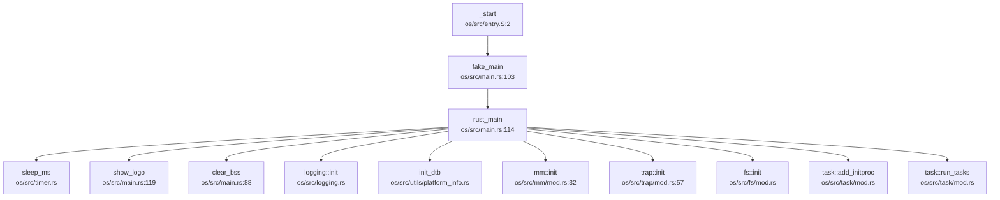

现在我已经收集了足够的信息来撰写第 2 章的启动流程与架构初始化分析报告。让我整理所有发现并生成完整的 Markdown 报告。

## 第 2 章：启动流程与架构初始化

### 启动入口与链接脚本分析

#### 汇编入口点

本项目采用 RISC-V 64 架构，支持双平台启动（QEMU 和 StarFive VisionFive 2）。汇编入口点位于两个独立的汇编文件中，通过 Cargo feature 进行条件编译：

**QEMU 平台入口** (`os/src/entry.S:1-38`)：
```assembly
.section .text.entry
.globl _start
_start:
    # pc = qemu: 0x80200000
    #      visionfive2: 0x40200000

    la sp, boot_stack_top

    # since the base addr is 0xffff_ffc0_8020_0000
    # we need to activate pagetable here in case of absolute addressing
    # satp: 8 << 60 | boot_pagetable
    la t0, boot_pagetable
    li t1, 8 << 60
    srli t0, t0, 12
    or t0, t0, t1
    csrw satp, t0
    sfence.vma
    call fake_main
```

**VisionFive 2 平台入口** (`os/src/entry_visionfive2.S:1-41`)：
```assembly
.section .text.entry
.globl _start
_start:
    la sp, boot_stack_top
    
    la t0, boot_pagetable
    li t1, 8 << 60
    srli t0, t0, 12
    or t0, t0, t1
    csrw satp, t0
    sfence.vma

    call fake_main
```

两个入口的核心逻辑一致：
1. **栈指针初始化**：`la sp, boot_stack_top` 设置初始栈顶
2. **页表激活**：立即启用 MMU，设置 `satp` 寄存器
3. **跳转到 Rust 入口**：`call fake_main`

#### 链接脚本分析

项目使用两个链接脚本分别对应不同平台：

**QEMU 链接脚本** (`os/src/linker-qemu.ld`)：
```ld
OUTPUT_ARCH(riscv)
ENTRY(_start)
BASE_ADDRESS = 0xffffffc080200000;
```

**VisionFive 2 链接脚本** (`os/src/linker-vf2.ld`)：
```ld
OUTPUT_ARCH(riscv)
ENTRY(_start)
BASE_ADDRESS = 0xffffffc040200000;
```

关键差异：
- **QEMU**：基地址 `0xffffffc080200000`（物理地址 `0x80200000` 的内核虚拟映射）
- **VisionFive 2**：基地址 `0xffffffc040200000`（物理地址 `0x40200000` 的内核虚拟映射）

链接脚本定义了内核段布局：`.text` → `.rodata` → `.data` → `.bss`，并通过 `*(.text.entry)` 确保入口代码位于最前端。

### 架构初始化流程（模式切换/FPU/MMU）

#### CPU 模式切换验证

**关键发现**：本项目**未实现**从 M-Mode 到 S-Mode 的模式切换。

证据分析：
1. **启动假设**：代码假设内核已经由 SBI（Supervisor Binary Interface）或 U-Boot 加载到 S-Mode 执行
2. **寄存器操作搜索**：
   - 搜索 `mstatus.mpp`、`sstatus.spp`：**未找到匹配**
   - 搜索 `sstatus.SPP`：**未找到匹配**

这表明项目依赖于外部固件（RustSBI 或 U-Boot）完成模式切换，内核直接在 S-Mode 下启动。

#### MMU 初始化时机

**✅ 已实现** - 极早期 MMU 启用

在汇编入口 `_start` 中，MMU 在跳转到 Rust 代码**之前**就已启用：

```assembly
# entry.S:12-17
la t0, boot_pagetable      # 加载页表基址
li t1, 8 << 60             # SV39 模式标识
srli t0, t0, 12            # PPN = 物理地址 >> 12
or t0, t0, t1              # 构造 satp 值
csrw satp, t0              # 写入 satp
sfence.vma                 # 刷新 TLB
```

**早期页表结构** (`entry.S:28-38`)：
```assembly
boot_pagetable:
    .quad 0
    .quad 0
    .quad (0x80000 << 10) | 0xcf  # VRWXAD 1G 大页
    .zero 8 * 255
    .quad (0x80000 << 10) | 0xcf  # VRWXAD 1G 大页
    .zero 8 * 253
```

页表映射关系（QEMU 平台）：
- **映射 1**：`0x0000_0000_8000_0000` → `0x0000_0000_8000_0000`（物理内存直接映射）
- **映射 2**：`0xffff_fc00_8000_0000` → `0x0000_0000_8000_0000`（内核虚拟地址映射）

使用 **1GB 大页**（`0xcf = VRWXAD` 标志），仅用 2 个 PTE 完成早期映射。

#### FPU 初始化状态

**❌ 未实现** - 浮点单元未启用

**验证过程**：
1. 搜索 `sstatus.fs`、`FS_` 常量：**未找到相关代码**
2. 搜索 `fence.i`：仅在 trap 返回路径中找到（用于指令缓存同步）
3. 检查 `sstatus` 寄存器操作：仅保存/恢复上下文，无 FPU 使能代码

**结论**：内核未启用 FPU 支持，所有浮点操作将触发非法指令异常。

#### 关键寄存器设置

| 寄存器 | 设置位置 | 值/作用 |
|--------|----------|---------|
| `sp` | `entry.S:7` | `boot_stack_top`（64KB 启动栈） |
| `satp` | `entry.S:16` | SV39 模式 + `boot_pagetable` PPN |
| `stvec` | `trap/mod.rs:62` | `__trap_from_kernel`（内核陷阱入口） |
| `sepc` | `trap.S:48` | 用户态返回地址 |
| `sscratch` | `trap.S:35` | 用户栈指针交换 |

### 到达内核主函数的路径（完整调用链）

#### 调用链追踪

使用 `lsp_get_call_graph` 分析（DEGRADED MODE - 静态 Grep 分析）：



#### 详细跳转流程

**第 1 跳：`_start` → `fake_main`**

汇编调用（`entry.S:18`）：
```assembly
call fake_main
```

**第 2 跳：`fake_main` → `rust_main`**

内联汇编跳转（`main.rs:103-108`）：
```rust
#[no_mangle]
pub fn fake_main() {
    unsafe {
        asm!("add sp, sp, {}", in(reg) KERNEL_SPACE_OFFSET << 12);
        asm!("la t0, rust_main");
        asm!("add t0, t0, {}", in(reg) KERNEL_SPACE_OFFSET << 12);
        asm!("jalr zero, 0(t0)");
    }
}
```

**关键操作**：
1. **栈指针调整**：`sp += KERNEL_SPACE_OFFSET << 12`（转换为虚拟地址）
2. **地址转换**：`rust_main` 地址加上内核偏移
3. **间接跳转**：`jalr` 跳转到 `rust_main`

**设计原因**：MMU 已启用，所有绝对地址引用必须使用虚拟地址。`KERNEL_SPACE_OFFSET = 0xffff_ffc0_0000_0`（`config.rs:51`）。

#### rust_main 初始化序列

`main.rs:114-156` 完整初始化流程：

```rust
pub fn rust_main() -> ! {
    #[cfg(feature = "visionfive2")]
    sleep_ms(5000);  // VisionFive2 等待串口连接
    
    clear_bss();              // BSS 段清零
    logging::init();          // 日志系统初始化
    init_dtb(None);           // 设备树解析
    mm::init(MEMORY_END);     // 内存管理初始化
    mm::remap_test();         // 重映射测试
    trap::init();             // 陷阱处理初始化
    trap::enable_timer_interrupt();  // 定时器中断使能
    timer::set_next_trigger();       // 设置下次定时器触发
    fs::init();               // 文件系统初始化
    task::add_initproc();     // 添加 init 进程
    task::run_tasks();        // 启动任务调度
    shutdown();               // 关机
}
```

### 多平台启动流程（StarFive/LoongArch 等）

#### StarFive VisionFive 2 平台

**✅ 已实现** - 特异性启动支持

**启动链**：SBI (RustSBI) → U-Boot → OS Kernel

**平台特异性代码**：

1. **入口汇编** (`entry_visionfive2.S`)：
   - 物理基地址：`0x40200000`（不同于 QEMU 的 `0x80200000`）
   - 页表映射针对 VisionFive 2 内存布局

2. **板级配置** (`boards/visionfive2.rs`)：
   ```rust
   pub const CLOCK_FREQ: usize = 400_0000;
   pub const MMIO: &[(usize, usize, MapPermission)] = &[
       (0x17040000, 0x10000, PERMISSION_RW),     // RTC
       (0xc000000, 0x4000000, PERMISSION_RW),    // PLIC
       (0x00_1000_0000, 0x10000, PERMISSION_RW), // UART
       (0x16020000, 0x10000, PERMISSION_RW),     // sdio1
   ];
   ```

3. **设备树支持** (`utils/platform_info.rs`)：
   - 内嵌 DTB：`jh7110-visionfive2_dtb.dtb`（41KB）
   - 解析函数：`machine_info_from_dtb()` 提取内存、PLIC、CLINT 信息

4. **启动延迟** (`main.rs:116-118`)：
   ```rust
   #[cfg(feature = "visionfive2")]
   sleep_ms(5000);  // 等待测试程序连接串口
   ```

#### LoongArch 平台

**❌ 未实现** - 无 LoongArch 支持

**验证**：
- 搜索 `loongarch`：**未找到匹配**
- 架构目录：仅存在 `arch/riscv` 相关代码
- Target Triple：仅配置 `riscv64gc-unknown-none-elf`

#### 固件级启动链（RISC-V）

**SBI → OS 控制权移交**：

1. **SBI 调用接口** (`sbi.rs`)：
   ```rust
   const SBI_SET_TIMER: usize = 0;
   const SBI_CONSOLE_PUTCHAR: usize = 1;
   const SBI_CONSOLE_GETCHAR: usize = 2;
   const SBI_SHUTDOWN: usize = 8;
   
   fn sbi_call(which: usize, arg0: usize, arg1: usize, arg2: usize) -> usize {
       asm!("li x16, 0", "ecall", ...);
   }
   ```

2. **Bootloader** (`Makefile:28-29`)：
   ```makefile
   SBI ?= rustsbi
   BOOTLOADER := ../bootloader/$(SBI)-$(BOARD).bin
   ```
   - 使用 RustSBI 作为 SBI 实现
   - Binary 文件：`ruestsbi-qemu.bin`（37.7KB）

3. **QEMU 启动命令** (`Makefile:100-107`)：
   ```makefile
   qemu-system-riscv64 \
       -M 128m -machine virt -nographic \
       -kernel $(KERNEL_BIN) \
       -drive file=$(FS_IMG),if=none,format=raw,id=x0 \
       -device virtio-blk-device,drive=x0,bus=virtio-mmio-bus.0
   ```

### 平台配置与构建机制

#### Cargo 配置

**目标架构** (`.cargo/config.toml:1-7`)：
```toml
[build]
target = "riscv64gc-unknown-none-elf"
rustflags = ["-Zbuild-std=core,alloc"]

[target.riscv64gc-unknown-none-elf]
rustflags = [
    "-Clink-arg=-Tsrc/linker.ld", "-Cforce-frame-pointers=yes"
]
```

**关键配置**：
- **Target Triple**：`riscv64gc-unknown-none-elf`（RISC-V 64 位，通用寄存器 + 浮点，无操作系统）
- **链接脚本**：`-Tsrc/linker.ld`（实际根据 feature 选择 `linker-qemu.ld` 或 `linker-vf2.ld`）
- **帧指针**：`-Cforce-frame-pointers=yes`（用于栈回溯）

#### Makefile 构建系统

**平台选择** (`os/Makefile:14-20`)：
```makefile
ifeq ($(MAKECMDGOALS),vf2)
    KERNEL_TARGET := kernel-vf2
endif
```

**构建目标**：
- **默认**：`make kernel` → QEMU 平台
- **VisionFive 2**：`make vf2` → 启用 `visionfive2` feature

**Feature 控制** (`os/Makefile:71-77`)：
```makefile
kernel-vf2:
    cargo build $(MODE_ARG) \
        --features visionfive2 \
        --no-default-features
```

**入口地址定义** (`os/Makefile:33-34`)：
```makefile
KERNEL_ENTRY_PA_QEMU := 0x80200000
KERNEL_ENTRY_PA_VF2 := 0x40020000
```

#### 条件编译机制

**main.rs 中的 feature 控制** (`main.rs:73-77`)：
```rust
#[cfg(feature = "qemu")]
global_asm!(include_str!("entry.S"));

#[cfg(feature = "visionfive2")]
global_asm!(include_str!("entry_visionfive2.S"));
```

**Cargo.toml 默认 features**：
```toml
[features]
default = ["qemu"]
qemu = []
visionfive2 = []
```

### 关键代码片段分析

#### MMU 启用前后串口地址切换

**✅ 已实现** - 通过 `KERNEL_SPACE_OFFSET` 实现虚实地址转换

**MMIO 地址定义** (`boards/qemu.rs:14-19`)：
```rust
pub const MMIO: &[(usize, usize, MapPermission)] = &[
    (0x10000000, 0x1000, PERMISSION_RW),   // UART (物理地址)
    (0x10001000, 0x1000, PERMISSION_RW),   // VIRTIO
    ...
];
```

**虚拟地址转换** (`mm/memory_set.rs:299-304`)：
```rust
for pair in MMIO {
    memory_set.push(
        MapArea::new(
            ((*pair).0 + (KERNEL_SPACE_OFFSET << PAGE_SIZE_BITS)).into(),  // 虚拟地址
            ((*pair).0 + (*pair).1 + (KERNEL_SPACE_OFFSET << PAGE_SIZE_BITS)).into(),
            MapType::Identical,
            MapPermission::R | MapPermission::W,
        ),
        None,
    );
}
```

**转换公式**：
```
虚拟地址 = 物理地址 + (KERNEL_SPACE_OFFSET << 12)
         = 物理地址 + 0xffff_ffc0_0000_0000
```

**示例**：
- UART 物理地址：`0x10000000`
- UART 虚拟地址：`0xffff_ffc0_1000_0000`

**驱动层转换** (`drivers/block/virtio_blk.rs:33`)：
```rust
const VIRTIO0: usize = 0x10001000 + KERNEL_SPACE_OFFSET * PAGE_SIZE;
```

#### 早期串口打印机制

**SBI 控制台输出** (`sbi.rs:36-40`)：
```rust
pub fn console_putchar(c: usize) {
    sbi_call(SBI_CONSOLE_PUTCHAR, c, 0, 0);
}
```

**MMU 启用前**：通过 SBI 调用（`ecall` 指令）输出，无需访问 MMIO
**MMU 启用后**：可直接访问虚拟地址映射的 UART MMIO

#### BSS 清零实现

`main.rs:88-95`：
```rust
fn clear_bss() {
    extern "C" {
        fn sbss();
        fn ebss();
    }
    unsafe {
        core::slice::from_raw_parts_mut(sbss as usize as *mut u8, ebss as usize - sbss as usize)
            .fill(0);
    }
}
```

**链接脚本符号** (`linker-qemu.ld:38-41`)：
```ld
.bss : {
    *(.bss.stack)
    sbss = .;
    *(.bss .bss.*)
    ebss = .;
}
```

#### 陷阱入口设置

**内核陷阱入口** (`trap/mod.rs:57-63`)：
```rust
pub fn init() {
    set_kernel_trap_entry();
}

fn set_kernel_trap_entry() {
    extern "C" {
        fn __trap_from_kernel();
    }
    unsafe {
        stvec::write(__trap_from_kernel as usize, TrapMode::Direct);
    }
}
```

**汇编实现** (`trap.S:66-71`)：
```assembly
__trap_from_kernel:
    la sp, __emergency_end
    j trap_from_kernel
```

使用**紧急栈**（`__emergency`，4KB）处理内核陷阱，防止内核栈损坏导致无法调试。

---

### 本章总结

| 特性 | 状态 | 证据 |
|------|------|------|
| **汇编入口** | ✅ 已实现 | `entry.S` / `entry_visionfive2.S` |
| **链接脚本** | ✅ 已实现 | `linker-qemu.ld` / `linker-vf2.ld` |
| **MMU 早期启用** | ✅ 已实现 | `entry.S:12-17` 在 `call fake_main` 前设置 `satp` |
| **M-Mode → S-Mode 切换** | ❌ 未实现 | 无 `mstatus.mpp` 操作，依赖 SBI |
| **FPU 初始化** | ❌ 未实现 | 无 `sstatus.fs` 操作 |
| **BSS 清零** | ✅ 已实现 | `clear_bss()` |
| **设备树解析** | ✅ 已实现 | `platform_info.rs` + 内嵌 DTB |
| **VisionFive 2 支持** | ✅ 已实现 | `entry_visionfive2.S` + `boards/visionfive2.rs` |
| **LoongArch 支持** | ❌ 未实现 | 无相关代码 |
| **虚实地址转换** | ✅ 已实现 | `KERNEL_SPACE_OFFSET` 机制 |
| **SBI 调用接口** | ✅ 已实现 | `sbi.rs` 封装 |

**启动流程关键路径**：
```
SBI/U-Boot → _start (entry.S) → MMU 启用 → fake_main → rust_main → 
  → clear_bss → mm::init → trap::init → task::run_tasks → 用户态
```
