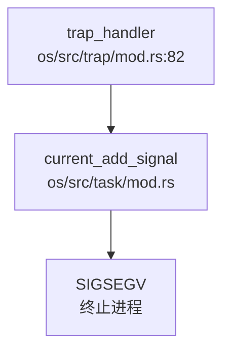
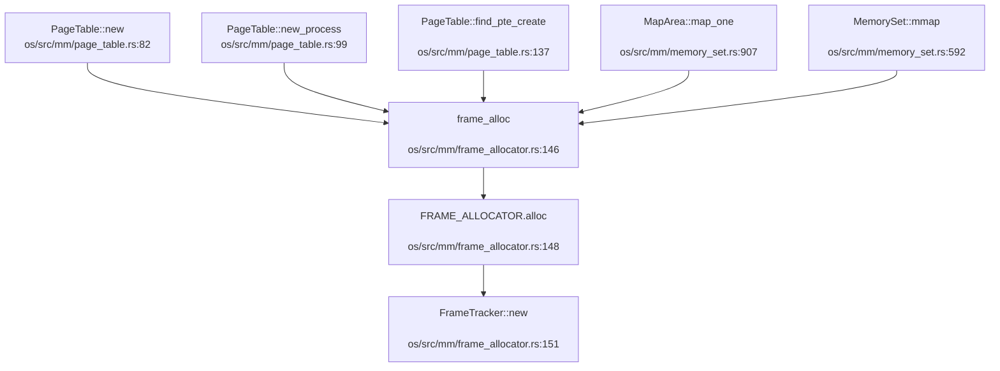
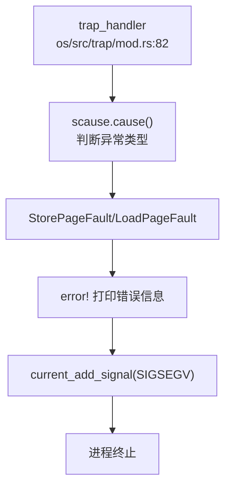
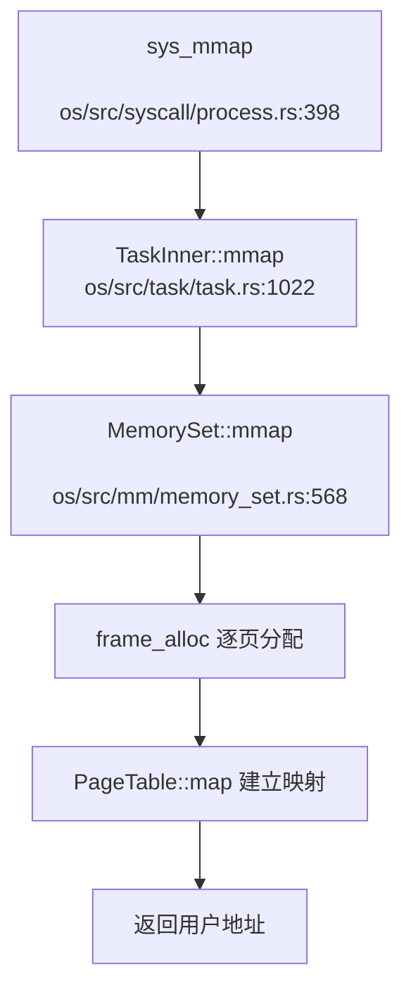

现在我已经收集了足够的信息来撰写内存管理章节。让我整理分析结果并生成报告。

## 第 3 章：内存管理（物理/虚拟/分配器）

### 物理内存管理实现

本 OS 采用**栈式物理页帧分配器（StackFrameAllocator）**管理物理内存，未使用位图或伙伴系统。

**核心数据结构**（`os/src/mm/frame_allocator.rs`）：

```rust
pub struct StackFrameAllocator {
    current:  usize,      // 当前已分配到的页帧号
    end:      usize,      // 物理内存结束页帧号
    recycled: Vec<usize>, // 回收的页帧号列表
}
```

**分配算法**：
- **分配（`alloc`）**：优先从 `recycled` 栈中弹出已回收页帧；若栈空则递增 `current` 指针
- **连续分配（`alloc_contiguous`）**：直接递增 `current`，不支持从回收列表中找连续块
- **回收（`dealloc`）**：将页帧号压入 `recycled` 栈

**FrameAllocator 接口**（`os/src/mm/frame_allocator.rs:43-47`）：
```rust
trait FrameAllocator {
    fn new() -> Self;
    fn alloc(&mut self) -> Option<PhysPageNum>;
    fn alloc_contiguous(&mut self, num: usize) -> (Vec<PhysPageNum>, PhysPageNum);
    fn dealloc(&mut self, ppn: PhysPageNum);
}
```

**物理页追踪**：通过 `FrameTracker` 结构体实现 RAII 风格自动回收：
```rust
pub struct FrameTracker {
    pub ppn: PhysPageNum,
}
impl Drop for FrameTracker {
    fn drop(&mut self) {
        frame_dealloc(self.ppn);  // 自动回收到分配器
    }
}
```

**初始化**（`os/src/mm/frame_allocator.rs:123`）：
```rust
pub fn init_frame_allocator(memory_end: usize) {
    FRAME_ALLOCATOR.exclusive_access(file!(), line!()).init(
        PhysAddr::from(KernelAddr::from(ekernel as usize)).ceil(),
        PhysAddr::from(KernelAddr::from(memory_end)).floor(),
    );
}
```

**✅ 已实现**：基础物理页分配/回收，支持单页和连续多页分配。

---

### 虚拟内存与页表操作

采用 **RISC-V SV39 三级页表**，单页大小 4KB。

**页表项结构**（`os/src/mm/page_table.rs:23-67`）：
```rust
bitflags! {
    pub struct PTEFlags: u8 {
        const V = 1 << 0;  // Valid
        const R = 1 << 1;  // Readable
        const W = 1 << 2;  // Writable
        const X = 1 << 3;  // Executable
        const U = 1 << 4;  // User
        const A = 1 << 6;  // Accessed
        const D = 1 << 7;  // Dirty
    }
}

#[repr(C)]
pub struct PageTableEntry {
    pub bits: usize,
}
```

**PageTable 核心操作**（`os/src/mm/page_table.rs:68-205`）：

| 方法 | 功能 | 实现位置 |
|------|------|----------|
| `new()` | 创建空页表（分配根页表页） | `page_table.rs:82` |
| `new_process()` | 创建进程页表（复制内核映射） | `page_table.rs:99` |
| `map()` | 建立 VPN→PPN 映射 | `page_table.rs:171` |
| `unmap()` | 解除映射 | `page_table.rs:185` |
| `translate()` | 查询页表项 | `page_table.rs:192` |
| `token()` | 返回 SATP 寄存器值 | `page_table.rs:205` |

**页表遍历**（`find_pte_create`，`page_table.rs:125-148`）：
```rust
fn find_pte_create(&mut self, vpn: VirtPageNum) -> Option<&mut PageTableEntry> {
    let idxs = vpn.indexes();
    let mut ppn = self.root_ppn;
    for (i, idx) in idxs.iter().enumerate() {
        let pte = &mut ppn.get_pte_array()[*idx];
        if i == 2 { break; }  // 到达叶节点
        if !pte.is_valid() {
            let frame = frame_alloc().unwrap();  // 动态分配中间页表页
            *pte = PageTableEntry::new(frame.ppn, PTEFlags::V);
            self.frames.push(frame);
        }
        ppn = pte.ppn();
    }
    // 返回叶节点 PTE
}
```

**✅ 已实现**：完整的 SV39 页表操作，支持动态创建中间页表页。

---

### 地址空间布局（内核 vs 用户）

**内核地址空间**：
- **映射方式**：直接映射（Identical），虚拟地址 = 物理地址 + `KERNEL_SPACE_OFFSET`
- **偏移量**：`KERNEL_SPACE_OFFSET = 0xffff_ffc0_0000_0`（`os/src/config.rs:49`）
- **布局**（`os/src/mm/memory_set.rs:207-310`）：
  - `.text` 段：`skernel` ~ `etext`，权限 R+X
  - `.rodata` 段：`srodata` ~ `erodata`，权限 R
  - `.data` 段：`sdata` ~ `edata`，权限 R+W
  - `.bss` 段：`sbss_with_stack` ~ `ebss`，权限 R+W
  - 堆区：`ekernel` ~ `ekernel + KERNEL_HEAP_SIZE`

**用户地址空间**（`os/src/mm/memory_set.rs:110-122`）：
- **页表**：独立页表，但复制内核部分映射（高地址）
- **布局**：
  - 用户堆：从 `STACK_TOP` 向下增长
  - mmap 区：从 `MMAP_BASE = 0x2000_0000` 向上增长（`os/src/config.rs:47`）
  - 用户栈：固定大小 `USER_STACK_SIZE = 4096 * 20`
  - Trampoline 页：`USER_TRAMPOLINE = 0x191_9810`

**内核与用户隔离**：
- 通过页表项的 `U` 位（User 位）控制访问权限
- 内核页表项设置 `U=0`，用户页表项设置 `U=1`
- 切换地址空间时刷新 TLB（`sfence.vma` 指令）

**✅ 已实现**：独立的内核/用户地址空间，内核重映射到高地址。

---

### 堆分配器解析

**内核堆分配器**（`os/src/mm/heap_allocator.rs`）：
```rust
use buddy_system_allocator::LockedHeap;

#[global_allocator]
static HEAP_ALLOCATOR: LockedHeap = LockedHeap::empty();

static mut HEAP_SPACE: [u8; KERNEL_HEAP_SIZE] = [0; KERNEL_HEAP_SIZE];

pub fn init_heap() {
    unsafe {
        HEAP_ALLOCATOR.lock().init(HEAP_SPACE.as_ptr() as usize, KERNEL_HEAP_SIZE);
    }
}
```

**特性**：
- 使用 `buddy_system_allocator` crate（伙伴系统分配器）
- 堆大小：`KERNEL_HEAP_SIZE = PAGE_SIZE * 0x500 = 2MB`
- 通过 `#[global_allocator]` 设置为全局分配器

**用户堆管理（brk/sbrk）**：
`sys_brk` 实现（`os/src/syscall/process.rs:430-450`）：
```rust
pub fn sys_brk(addr: usize) -> isize {
    let task = current_task().unwrap();
    let mut inner = task.inner_exclusive_access(file!(), line!());
    if addr == 0 {
        inner.heap_end.0 as isize  // 返回当前堆顶
    } else if addr < inner.heap_base.0 {
        EINVAL
    } else {
        let align_addr = ((addr) + PAGE_SIZE - 1) & (!(PAGE_SIZE - 1));
        let align_end = ((inner.heap_end.0) + PAGE_SIZE - 1) & (!(PAGE_SIZE - 1));
        if align_end >= addr {
            inner.heap_end = addr.into();  // 仅调整边界，不分配物理页
            align_addr as isize
        } else {
            // 需要新分配物理页
            inner.memory_set.map_heap(heap_end, align_addr.into());
            // ...
        }
    }
}
```

**✅ 已实现**：
- 内核堆：伙伴系统分配器
- 用户堆：`sys_brk` 支持惰性分配（仅调整 `heap_end` 不立即分配物理页）

---

### 用户指针安全验证

**❌ 未实现**：搜索 `UserInPtr`、`UserOutPtr`、`verify_area`、`check_region` 等关键词，**未找到任何用户指针验证机制**。

在系统调用入口处（如 `os/src/syscall/fs.rs`），直接使用 `translated_refmut` 等函数访问用户内存，但**未发现显式的地址范围检查**。这意味着：
- 未验证用户指针是否落在用户地址空间内
- 未检查指针是否跨越页边界
- 可能存在内核访问非法用户地址的风险

---

### 缺页异常处理

**❌ 未实现**：搜索 `handle_page_fault`、`page_fault` 等关键词，**未找到缺页异常处理函数**。

当前缺页异常处理流程（`os/src/trap/mod.rs:120-132`）：
```rust
Trap::Exception(Exception::StorePageFault)
| Trap::Exception(Exception::LoadPageFault)
| Trap::Exception(Exception::InstructionPageFault) => {
    error!(
        "[kernel] trap_handler: {:?} in application, bad addr = {:#x}, ...",
        scause.cause(), stval, current_trap_cx().sepc
    );
    current_add_signal(SignalFlags::SIGSEGV);  // 直接发送 SIGSEGV 信号终止进程
}
```

**调用链分析**（`lsp_get_call_graph` 降级结果）：


**结论**：缺页异常**未实现恢复机制**，直接终止进程。不支持按需分页、懒分配或写时复制。

---

### 进程级映射管理

**MapArea 结构**（`os/src/mm/memory_set.rs:879-885`）：
```rust
pub struct MapArea {
    pub vpn_range:   VPNRange,                    // 虚拟页号范围
    pub data_frames: BTreeMap<VirtPageNum, FrameTracker>,  // 页帧映射
    pub map_type:    MapType,                     // Identical/Framed
    pub map_perm:    MapPermission,               // 权限
}
```

**MemorySet 管理**（`os/src/mm/memory_set.rs:79-95`）：
```rust
pub struct MemorySet {
    pub page_table: PageTable,
    pub areas:      Vec<MapArea>,                 // 有序映射区间列表
    heap_area:      BTreeMap<VirtPageNum, FrameTracker>,
    pub mmap_area:  BTreeMap<VirtPageNum, FrameTracker>,  // mmap 映射
    pub mmap_base:  VirtAddr,
    pub mmap_end:   VirtAddr,
}
```

**反向映射表（rmap）**：
**❌ 未实现**：搜索 `rmap`、`reverse_map`、`page_to_vma` 等关键词，**未找到物理页到虚拟页的反向映射机制**。

**✅ 已实现**：
- 使用 `BTreeMap<VirtPageNum, FrameTracker>` 管理映射（O(log n) 查找）
- `mmap_area` 独立管理 mmap 映射
- 支持 `remove_area_with_va` 和 `remove_area_with_start_vpn` 删除映射

---

### 高级内存特性清单

| 特性 | 状态 | 说明 |
|------|------|------|
| **写时复制（CoW）** | ❌ 未实现 | 搜索 `cow`、`copy_on_write` 无结果；`fork` 实现为完整复制 |
| **懒分配（Lazy Allocation）** | 🔸 桩函数 | `sys_brk` 仅调整边界，但缺页异常未实现按需分配 |
| **共享内存（shm）** | ❌ 未实现 | 搜索 `sys_shm`、`SharedMem` 无结果 |
| **反向映射表（rmap）** | ❌ 未实现 | 搜索 `rmap`、`reverse_map` 无结果 |
| **交换区/页面置换（Swap）** | ❌ 未实现 | 搜索 `swap_out`、`swap_in` 无结果 |
| **大页支持（Huge Page）** | ❌ 未实现 | 仅定义 `MAP_HUGETLB` 标志（`os/src/task/process.rs:110`），无实际处理逻辑 |
| **mmap** | ✅ 已实现 | `sys_mmap` 支持 `MAP_FIXED`、`MAP_ANONYMOUS` 标志（`os/src/mm/memory_set.rs:568-654`） |
| **munmap** | ✅ 已实现 | `sys_munmap` 从 `mmap_area` 移除映射（`os/src/mm/memory_set.rs:655-668`） |
| **零拷贝 IO** | ❌ 未实现 | 搜索 `sendfile`、`splice` 无结果 |

**mmap 实现细节**（`os/src/mm/memory_set.rs:568-654`）：
```rust
pub fn mmap(
    &mut self, start_addr: usize, len: usize, offset: usize, context: Vec<u8>, flags: Flags,
) -> isize {
    // 处理 MAP_FIXED
    if flags.contains(Flags::MAP_FIXED) && start_addr != 0 {
        start_addr_align = ((start_addr) + PAGE_SIZE - 1) & (!(PAGE_SIZE - 1));
    } else {
        start_addr_align = ((self.mmap_end.0) + PAGE_SIZE - 1) & (!(PAGE_SIZE - 1));
    }
    // 逐页分配物理帧
    for vpn in vpn_range {
        let frame = frame_alloc().unwrap();
        self.mmap_area.insert(vpn, frame);
        self.page_table.map(vpn, ppn, PTEFlags::R | PTEFlags::W | PTEFlags::U | PTEFlags::X);
    }
    // 处理 MAP_ANONYMOUS（不关联文件）
    if !flags.contains(Flags::MAP_ANONYMOUS) {
        // 从文件内容复制数据
        // ...
    }
    start_addr_align as isize
}
```

**✅ 已实现**：mmap 支持 `MAP_FIXED`、`MAP_ANONYMOUS` 标志，逐页分配物理帧。

---

### 关键代码片段与调用链分析

**物理页分配调用链**（`lsp_get_call_graph` 降级分析）：


**缺页异常处理流程**（当前实现）：


**mmap 系统调用流程**：


---

### 内存管理总结

| 子系统 | 实现状态 | 关键文件 |
|--------|----------|----------|
| 物理页分配 | ✅ StackFrameAllocator | `os/src/mm/frame_allocator.rs` |
| 页表管理 | ✅ SV39 三级页表 | `os/src/mm/page_table.rs` |
| 地址空间 | ✅ 独立内核/用户空间 | `os/src/mm/memory_set.rs` |
| 内核堆 | ✅ 伙伴系统 | `os/src/mm/heap_allocator.rs` |
| 用户堆（brk） | ✅ 惰性分配 | `os/src/syscall/process.rs:430` |
| mmap/munmap | ✅ 完整实现 | `os/src/mm/memory_set.rs:568-668` |
| 缺页异常 | ❌ 仅终止进程 | `os/src/trap/mod.rs:120-132` |
| CoW | ❌ 未实现 | - |
| Swap | ❌ 未实现 | - |
| 用户指针验证 | ❌ 未实现 | - |
| rmap | ❌ 未实现 | - |

**设计特点**：
1. **简单高效**：栈式分配器实现简单，适合教学 OS
2. **SV39 完整支持**：三级页表动态创建，支持用户/内核隔离
3. **mmap 完善**：支持 `MAP_FIXED`、`MAP_ANONYMOUS` 标志
4. **缺失高级特性**：无 CoW、Swap、rmap 等复杂机制

**改进建议**：
1. 实现缺页异常处理，支持按需分页
2. 添加用户指针验证（`UserInPtr`/`UserOutPtr`）
3. 实现 CoW 优化 `fork` 性能
4. 添加 Swap 机制支持内存超卖
