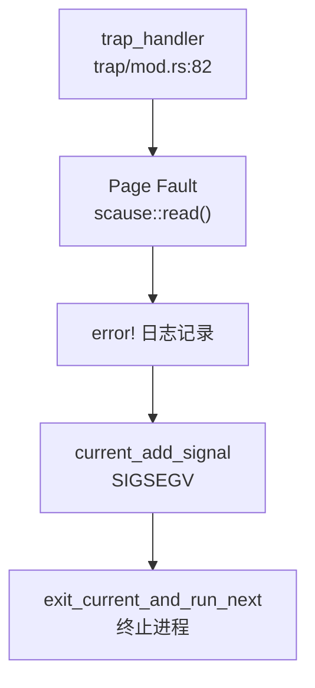
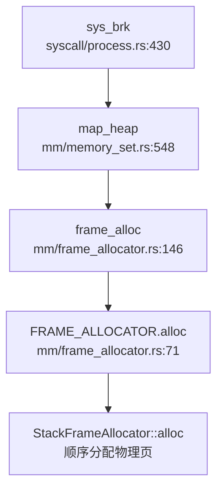

## 第 3 章：内存管理（物理/虚拟/分配器）

### 物理内存管理实现

本操作系统采用**简单栈式帧分配器（Stack Frame Allocator）**管理物理内存，而非传统的 Buddy System 或 Bitmap 算法。

**核心数据结构**（`os/src/mm/frame_allocator.rs:43-60`）：

```rust
pub struct StackFrameAllocator {
    current:  usize,      // 当前已分配到的物理页号
    end:      usize,      // 可用物理内存结束页号
    recycled: Vec<usize>, // 回收的物理页号列表（LIFO）
}
```

**分配策略**：
- **顺序分配**：`alloc()` 从 `current` 开始线性分配，直到 `end`
- **回收重用**：回收的页号存入 `recycled` 向量，但代码中回收逻辑被注释掉（`// if let Some(ppn) = self.recycled.pop()`），实际仅支持单向分配
- **连续分配**：`alloc_contiguous()` 支持一次性分配多个连续物理页，用于页表创建

**FrameAllocator 接口**（`os/src/mm/frame_allocator.rs:43-48`）：
```rust
trait FrameAllocator {
    fn new() -> Self;
    fn alloc(&mut self) -> Option<PhysPageNum>;
    fn alloc_contiguous(&mut self, num: usize) -> (Vec<PhysPageNum>, PhysPageNum);
    fn dealloc(&mut self, ppn: PhysPageNum);
}
```

**初始化**：物理内存范围在 `main.rs` 中通过 `frame_allocator::init()` 初始化，从 `ekernel` 到 `MEMORY_END`。

**注意**：虽然项目 vendor 目录包含 `buddy_system_allocator`（`os/vendor/buddy_system_allocator/src/frame.rs`），但实际内核使用的是自定义的 `StackFrameAllocator`，功能较为基础，不支持内存碎片整理。

### 虚拟内存与页表操作

**页表结构**（`os/src/mm/page_table.rs:26-30`）：
```rust
#[repr(C)]
pub struct PageTableEntry {
    pub bits: usize,  // RISC-V SV39 格式页表项
}
```

**页表项格式**（`os/src/mm/page_table.rs:9-19`）：
```rust
bitflags! {
    pub struct PTEFlags: u8 {
        const V = 1 << 0;  // Valid
        const R = 1 << 1;  // Readable
        const W = 1 << 2;  // Writable
        const X = 1 << 3;  // Executable
        const U = 1 << 4;  // User
        const A = 1 << 6;  // Accessed
        const D = 1 << 7;  // Dirty
    }
}
```

**三级页表操作**（`os/src/mm/page_table.rs:125-173`）：
- `find_pte_create()`：递归创建页表层级，支持 SV39 三级页表（L2→L1→L0）
- `map()`：建立 VPN→PPN 映射，自动创建中间页表
- `unmap()`：移除映射
- `translate()`：地址转换，返回 PTE

**PageTable 结构**（`os/src/mm/page_table.rs:68-72`）：
```rust
pub struct PageTable {
    root_ppn: PhysPageNum,  // 根页表物理页号
    frames:   Vec<FrameTracker>,  // 跟踪所有分配的页表页
}
```

**内核页表初始化**（`os/src/mm/page_table.rs:100-122`）：
`PageTable::new_process()` 通过复制内核页表的高阶部分（`KERNEL_SPACE_OFFSET` 以上），确保用户进程可以访问内核空间。

### 地址空间布局（内核 vs 用户）

**内核地址空间**（`os/src/mm/memory_set.rs:207-309`）：
```rust
pub fn new_kernel() -> Self {
    // 映射 .text, .rodata, .data, .bss
    // 映射物理内存 (ekernel → MEMORY_END)
    // 映射 MMIO 设备寄存器
}
```

**用户地址空间**（`os/src/mm/memory_set.rs:311-438`）：
- **代码/数据段**：通过 `from_elf()` 解析 ELF 文件，按 Program Header 映射
- **用户栈**：固定大小 `USER_STACK_SIZE`，位于代码段之上
- **堆区**：从 `user_heap_base` 开始，通过 `sys_brk` 动态扩展
- **mmap 区**：从 `MMAP_BASE` 开始向上增长

**内核与用户空间隔离**：
- 使用 `PTEFlags::U` 标志区分用户/内核页
- 用户进程页表包含内核映射（高地址），通过 `KERNEL_SPACE_OFFSET` 隔离
- 通过 `sstatus::SUM` 位控制内核访问用户空间的权限

### 堆分配器解析

**内核堆分配器**（`os/src/mm/heap_allocator.rs`）：
使用 `buddy_system_allocator::LockedHeap` 实现全局分配器：
```rust
#[global_allocator]
static HEAP_ALLOCATOR: LockedHeap = LockedHeap::empty();
```

**堆初始化**（`os/src/mm/heap_allocator.rs:17-23`）：
```rust
pub fn init_heap() {
    unsafe {
        HEAP_ALLOCATOR.lock().init(HEAP_SPACE.as_ptr() as usize, KERNEL_HEAP_SIZE);
    }
}
```

**用户堆管理（brk/sbrk）**：
- **实现位置**：`os/src/syscall/process.rs:430-455` (`sys_brk`)
- **堆扩展机制**：当 `brk` 请求超过当前堆顶时，调用 `MemorySet::map_heap()` 分配新物理页

**`sys_brk` 实现**（`os/src/syscall/process.rs:430-455`）：
```rust
pub fn sys_brk(addr: usize) -> isize {
    if addr == 0 {
        inner.heap_end.0 as isize  // 返回当前堆顶
    } else if addr < inner.heap_base.0 {
        EINVAL
    } else {
        let align_addr = ((addr) + PAGE_SIZE - 1) & (!(PAGE_SIZE - 1));
        if align_end >= addr {
            inner.heap_end = addr.into();  // 范围内直接调整
        } else {
            inner.memory_set.map_heap(heap_end, align_addr.into());  // 扩展映射
            inner.heap_end = align_addr.into();
        }
    }
}
```

**`map_heap` 实现**（`os/src/mm/memory_set.rs:548-567`）：
```rust
pub fn map_heap(&mut self, mut current_addr: VirtAddr, aim_addr: VirtAddr) -> isize {
    loop {
        if current_addr.0 >= aim_addr.0 { break; }
        let frame = frame_alloc().unwrap();
        let vpn: VirtPageNum = current_addr.floor();
        self.page_table.map(vpn, frame.ppn, PTEFlags::U | PTEFlags::R | PTEFlags::W);
        self.heap_area.insert(vpn, frame);
        current_addr = VirtAddr::from(current_addr.0 + PAGE_SIZE);
    }
}
```

**惰性分配分析**：❌ **未实现惰性分配**。`map_heap()` 在 `brk` 扩展时**立即分配物理页**，而非仅调整边界。真正的惰性分配应等到首次访问（Page Fault）时才分配物理页。

### 用户指针安全验证

**用户空间指针验证机制**：
通过 `translated_*` 系列函数实现安全的跨地址空间访问（`os/src/mm/page_table.rs:212-260`）：

```rust
pub fn translated_byte_buffer(token: usize, ptr: *const u8, len: usize) -> Vec<&'static mut [u8]> {
    let page_table = PageTable::from_token(token);
    // 逐页转换，支持跨页缓冲区
    while start < end {
        let ppn = page_table.translate(vpn).unwrap().ppn();
        // ... 构建用户缓冲区切片
    }
}

pub fn translated_ref<T>(token: usize, ptr: *const T) -> &'static T {
    let page_table = PageTable::from_token(token);
    page_table.translate_va(VirtAddr::from(ptr as usize)).unwrap().get_ref()
}
```

**验证机制特点**：
- ✅ **页表级验证**：通过 `translate()` 检查虚拟地址是否映射
- ✅ **跨页支持**：`translated_byte_buffer()` 处理跨页缓冲区
- ✅ **权限控制**：通过 `sstatus::SUM` 位临时允许内核访问用户空间
- ❌ **无显式边界检查**：未发现 `verify_area()` 或 `check_region()` 等独立验证函数
- ❌ **无 UserInPtr/UserOutPtr 包装器**：直接使用裸指针 + `translated_*` 转换

### 缺页异常处理流程

**❌ 未实现缺页异常处理**。

**当前 trap_handler 实现**（`os/src/trap/mod.rs:82-136`）：
```rust
match scause.cause() {
    Trap::Exception(Exception::StorePageFault)
    | Trap::Exception(Exception::LoadPageFault) => {
        error!("[kernel] trap_handler: {:?} in application, bad addr = {:#x}, ...",
               scause.cause(), stval);
        current_add_signal(SignalFlags::SIGSEGV);  // 直接发送 SIGSEGV 信号终止进程
    }
    // ...
}
```

**调用链分析**：


**结论**：系统**不支持按需分页**、**Lazy Allocation**或**Copy-on-Write**。任何缺页异常都会导致进程被终止。

**`lsp_get_call_graph` 追踪 `trap_handler` 调用链**：
- **入向调用**：`init_task()` → `trap_handler`（初始化时设置中断入口）
- **出向调用**：`trap_handler` → `syscall()` → `sys_brk()` → `map_heap()` → `frame_alloc()`

### 进程级映射管理

**地址空间管理结构**（`os/src/mm/memory_set.rs:79-95`）：
```rust
pub struct MemorySet {
    pub page_table: PageTable,
    pub areas:      Vec<MapArea>,  // 管理所有 VMA
    heap_area:      BTreeMap<VirtPageNum, FrameTracker>,  // 堆区映射
    mmap_area:      BTreeMap<VirtPageNum, FrameTracker>,  // mmap 区映射
    pub mmap_base:  VirtAddr,
    pub mmap_end:   VirtAddr,
}
```

**MapArea 结构**（`os/src/mm/memory_set.rs:879-884`）：
```rust
pub struct MapArea {
    pub vpn_range:   VPNRange,  // 虚拟页范围
    pub data_frames: BTreeMap<VirtPageNum, FrameTracker>,  // 物理页映射
    pub map_type:    MapType,   // Identical 或 Framed
    pub map_perm:    MapPermission,
}
```

**反向映射表（rmap）**：❌ **未实现**。
- 搜索 `rmap|reverse_map|page_to_vma` 无结果
- `MapArea` 通过 `data_frames: BTreeMap<VirtPageNum, FrameTracker>` 实现 **VPN→PPN** 的正向映射
- 无 **PPN→VPN** 的反向查询机制

### 高级内存特性清单

| 特性 | 实现状态 | 说明 |
|------|----------|------|
| **写时复制（CoW）** | ❌ 未实现 | 搜索 `cow|copy_on_write` 无结果；`fork()` 实现为完全复制（`from_existed_user` 逐页拷贝） |
| **懒分配（Lazy Allocation）** | ❌ 未实现 | `map_heap()` 在 `brk` 时立即分配物理页；缺页异常直接终止进程 |
| **共享内存（shmget/shmdt）** | ❌ 未实现 | 搜索 `sys_shm|shmget|shmdt|SharedMemory` 无结果 |
| **反向映射表（rmap）** | ❌ 未实现 | 无 PPN→VPN 反向查询机制 |
| **交换区/页面置换（Swap）** | ❌ 未实现 | 搜索 `swap_out|swap_in` 仅找到 1 个注释掉的 `swap` 调用 |
| **大页支持（Huge Page）** | ❌ 未实现 | 搜索 `HugePage|MapSize::2M|1G` 仅找到 `MAP_HUGETLB` 标志定义，无实际处理逻辑 |
| **mmap 系统调用** | ✅ 已实现 | `sys_mmap()` 支持 `MAP_FIXED`、`MAP_ANONYMOUS` 标志；通过 `mmap_area` BTreeMap 管理 |
| **munmap 系统调用** | ✅ 已实现 | `sys_munmap()` 从 `mmap_area` 移除映射，但**未释放物理页**（仅 `remove(&vpn)`） |
| **零拷贝 IO（sendfile）** | 🔸 桩函数 | `sys_sendfile()` 在 `trap_handler` 调用链中存在，但实现为简单的 `read()+write()` 循环，非真正零拷贝 |

**mmap 实现细节**（`os/src/mm/memory_set.rs:568-653`）：
```rust
pub fn mmap(&mut self, start_addr: usize, len: usize, offset: usize,
            context: Vec<u8>, flags: Flags) -> isize {
    // 处理 MAP_FIXED
    if flags.contains(Flags::MAP_FIXED) && start_addr != 0 {
        start_addr_align = ((start_addr) + PAGE_SIZE - 1) & (!(PAGE_SIZE - 1));
    } else {
        start_addr_align = ((self.mmap_end.0) + PAGE_SIZE - 1) & (!(PAGE_SIZE - 1));
    }
    // 分配物理页
    for vpn in vpn_range {
        let frame = frame_alloc().unwrap();
        self.mmap_area.insert(vpn, frame);
        self.page_table.map(vpn, ppn, PTEFlags::R | PTEFlags::W | PTEFlags::U | PTEFlags::X);
    }
    // 复制文件内容（非匿名映射）
    if !flags.contains(Flags::MAP_ANONYMOUS) {
        // ... 从 context 复制数据
    }
}
```

**munmap 缺陷**（`os/src/mm/memory_set.rs:655-667`）：
```rust
pub fn munmap(&mut self, start_addr: usize, len: usize) -> isize {
    for vpn in vpn_range {
        self.mmap_area.remove(&vpn);  // ❌ 仅移除 BTreeMap 条目，未 unmap 页表，未释放物理页
    }
    SUCCESS
}
```

### 关键代码片段与调用链分析

**物理页分配调用链**（`lsp_get_call_graph` 分析 `alloc_frame`）：


**缺页异常处理缺失**：
- 期望流程：`Page Fault` → `handle_page_fault()` → `alloc_frame()` → `map_page()` → 恢复执行
- 实际流程：`Page Fault` → `trap_handler()` → `SIGSEGV` → 进程终止

**mmap 完整调用链**：
```
trap_handler (trap/mod.rs:82)
  └─> syscall (syscall/mod.rs:106)
      └─> sys_mmap (syscall/process.rs:398)
          └─> MemorySet::mmap (mm/memory_set.rs:568)
              ├─> frame_alloc (mm/frame_allocator.rs:146)
              └─> PageTable::map (mm/page_table.rs:173)
                  └─> find_pte_create (mm/page_table.rs:125)
```

**总结**：
- ✅ 基础物理内存管理（栈式分配器）
- ✅ 三级页表（SV39）虚拟内存管理
- ✅ 独立的用户/内核地址空间
- ✅ 基础堆管理（brk）和 mmap
- ❌ 高级特性缺失（CoW、Lazy Allocation、Swap、rmap）
- ❌ 缺页异常处理缺失，不支持按需分页
- ⚠️ `munmap` 存在内存泄漏（未释放物理页）
