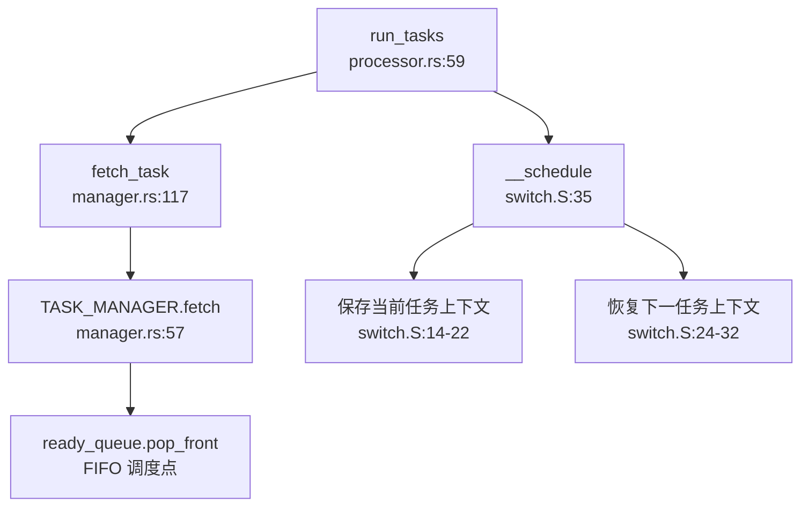
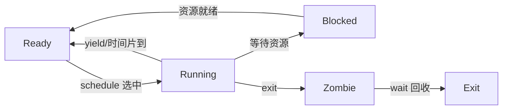
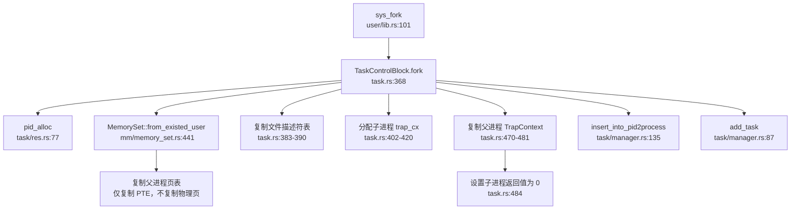
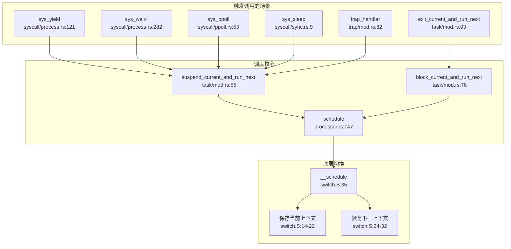

## 第 4 章：进程/线程与调度机制

### 任务模型与核心数据结构

本操作系统采用 **Task（任务）** 作为统一的执行实体抽象，未严格区分 PCB（进程控制块）与 TCB（线程控制块），而是通过单一结构体 `TaskControlBlock` 同时管理进程与线程。

#### TaskControlBlock 结构（`os/src/task/task.rs:38-52`）

```rust
pub struct TaskControlBlock {
    /// 内核栈
    pub kstack: KernelStack,
    /// 线程 ID：作为进程时 pid == tid；作为线程时 tid 为线程组 leader 的 pid
    pub tid: usize,
    /// 进程 ID，任务的唯一标识符
    pub pid: PidHandle,
    /// 退出时是否发送 SIGCHLD 信号
    pub send_sigchld_when_exit: bool,
    /// 可变内部状态
    inner: UPSafeCell<TaskControlBlockInner>,
}
```

#### TaskControlBlockInner 详细字段（`os/src/task/task.rs:54-97`）

| 字段 | 类型 | 说明 |
|------|------|------|
| `memory_set` | `MemorySet` | 地址空间（页表） |
| `trap_cx_ppn` | `PhysPageNum` | Trap 上下文的物理页帧号 |
| `task_cx` | `TaskContext` | 任务上下文（保存寄存器） |
| `task_status` | `TaskStatus` | 执行状态（Ready/Running/Blocked/Zombie/Exit） |
| `syscall_times` | `[u32; MAX_SYSCALL_NUM]` | 系统调用计数 |
| `first_time` | `Option<usize>` | 首次运行时间戳 |
| `clear_child_tid` | `usize` | 子线程退出时清零的地址（futex 支持） |
| `work_dir` | `Arc<Dentry>` | 工作目录 |
| `parent` | `Option<Weak<TaskControlBlock>>` | 父任务引用 |
| `children` | `Vec<Arc<TaskControlBlock>>` | 子任务列表 |
| `threads` | `Vec<Option<Arc<TaskControlBlock>>>` | 线程组（同一进程内的所有线程） |
| `user_stack_top` | `usize` | 用户栈顶 |
| `exit_code` | `Option<i32>` | 退出码 |
| `fd_table` | `Vec<Option<Arc<dyn File>>>` | 文件描述符表 |
| `signals` | `SignalFlags` | 待处理信号标志 |
| `signal_actions` | `SignalActions` | 信号处理动作表 |
| `signals_pending` | `SignalFlags` | 挂起信号 |
| `signal_mask` | `SignalFlags` | 信号屏蔽字 |
| `is_zombie` | `bool` | 是否为僵尸进程 |

#### TaskContext 上下文结构（`os/src/task/context.rs:6-18`）

```rust
#[repr(C)]
pub struct TaskContext {
    pub ra: usize,      // 返回地址
    sp:     usize,      // 栈指针
    pub s:  [usize; 12], // 被调用者保存寄存器 s0-s11
}
```

**设计特点**：
- **统一任务模型**：进程与线程共享同一 TCB 结构，通过 `pid` 与 `tid` 的关系区分（进程：`pid == tid`；线程：`tid == 线程组 leader 的 pid`）
- **线程组管理**：通过 `threads` 向量管理同一进程内的所有线程
- **信号支持**：内建完整的信号处理机制（`signals`、`signal_actions`、`signal_mask`）

---

### 调度算法与策略（代码证据）

#### 调度器实现位置
- 调度器主体：`os/src/task/processor.rs`
- 任务队列管理：`os/src/task/manager.rs`
- 上下文切换汇编：`os/src/task/switch.S`

#### 调度策略：**FIFO（先进先出）**

`TaskManager` 使用简单的 `VecDeque` 作为就绪队列，调度策略为纯粹的 FIFO：

```rust
// os/src/task/manager.rs:25-57
impl TaskManager {
    pub fn new() -> Self {
        Self {
            ready_queue: VecDeque::new(),
            block_queue: VecDeque::new(),
            stop_task:   None,
        }
    }
    
    /// 添加任务到就绪队列尾部
    pub fn add(&mut self, task: Arc<TaskControlBlock>) {
        self.ready_queue.push_back(task);
    }
    
    /// 从就绪队列头部取出任务
    pub fn fetch(&mut self) -> Option<Arc<TaskControlBlock>> {
        if self.ready_queue.is_empty() {
            return None;
        }
        // 注释掉的代码显示曾考虑过 Stride 调度
        // let mut min_idx = 0;
        // for (idx, _) in self.ready_queue.iter().enumerate() {
        //     let stride_now = self.ready_queue[idx]....stride;
        //     ...
        // }
        self.ready_queue.pop_front()  // 纯粹的 FIFO
    }
}
```

**代码证据分析**：
- `fetch()` 方法直接使用 `pop_front()` 从队列头部取出任务，无任何优先级或时间片计算
- 代码中注释掉的 `stride` 相关代码表明项目曾考虑实现 Stride 调度算法，但最终未实现
- `sys_set_priority` 系统调用（`os/src/syscall/process.rs:480-486`）仅返回 0，**无实际逻辑**

#### 调度优先级分类

| 特性 | 实现状态 | 证据 |
|------|---------|------|
| FIFO 调度 | ✅ 已实现 | `manager.rs:57` 使用 `pop_front()` |
| 优先级调度 | ❌ 未实现 | `sys_set_priority` 仅返回 0 |
| Stride 调度 | ❌ 未实现 | 代码被注释掉 |
| 时间片轮转 | ❌ 未实现 | 无时间片计数或轮转逻辑 |
| CFS | ❌ 未实现 | 未发现相关代码 |

#### 调度流程调用图



---

### 任务状态机

#### TaskStatus 枚举定义（`os/src/task/task.rs:908-918`）

```rust
pub enum TaskStatus {
    Ready,    // 就绪态：在就绪队列中等待调度
    Running,  // 运行态：正在 CPU 上执行
    Blocked,  // 阻塞态：等待某事件（如 I/O、信号量）
    Zombie,   // 僵尸态：已退出但父进程尚未回收
    Exit,     // 退出态：资源已释放
}
```

#### 状态流转图



#### 状态转换函数

| 转换 | 触发函数 | 文件位置 |
|------|---------|---------|
| Ready → Running | `run_tasks()` | `processor.rs:59-98` |
| Running → Ready | `suspend_current_and_run_next()` | `mod.rs:55-75` |
| Running → Blocked | `block_current_and_run_next()` | `mod.rs:78-90` |
| Running → Zombie | `exit_current_and_run_next()` | `mod.rs:93-202` |
| Blocked → Ready | `wakeup_task()` | `manager.rs:101-106` |

**关键代码示例**：

```rust
// os/src/task/mod.rs:55-75 - 主动让出 CPU
pub fn suspend_current_and_run_next() {
    let task = take_current_task().unwrap();
    let mut task_inner = task.inner_exclusive_access(file!(), line!());
    let task_cx_ptr = &mut task_inner.task_cx as *mut TaskContext;
    task_inner.task_status = TaskStatus::Ready;  // 状态改为 Ready
    drop(task_inner);
    add_task(task);  // 放回就绪队列
    schedule(task_cx_ptr);  // 触发调度
}
```

---

### 上下文切换实现（汇编分析）

#### 汇编代码（`os/src/task/switch.S`）

```assembly
__switch:
    # __switch(current_task_cx_ptr, next_task_cx_ptr)
    # a0 = current_task_cx_ptr, a1 = next_task_cx_ptr
    
    # 保存当前任务的内核栈指针
    sd sp, 8(a0)
    
    # 保存当前任务的 ra 和 s0-s11 寄存器
    sd ra, 0(a0)
    .set n, 0
    .rept 12
        SAVE_SN %n      # sd sn, (n+2)*8(a0)
        .set n, n + 1
    .endr
    
    # 恢复下一任务的 ra 和 s0-s11 寄存器
    ld ra, 0(a1)
    .set n, 0
    .rept 12
        LOAD_SN %n      # ld sn, (n+2)*8(a1)
        .set n, n + 1
    .endr
    
    # 恢复下一任务的内核栈指针
    ld sp, 8(a1)
    
    ret
```

#### 保存的寄存器列表

| 寄存器 | 用途 | 偏移量 |
|--------|------|--------|
| `ra` | 返回地址 | 0 |
| `sp` | 栈指针 | 8 |
| `s0-s11` | 被调用者保存寄存器 | 16-104（每个 8 字节） |

**保存的寄存器总数**：14 个（1 个 ra + 1 个 sp + 12 个 s 寄存器）

#### 关键设计特点

1. **仅保存 callee-saved 寄存器**：遵循 RISC-V 调用约定，只保存 `s0-s11`，`t0-t6`、`a0-a7` 由调用者负责保存
2. **内核栈切换**：通过保存/恢复 `sp` 实现内核栈的切换
3. **无用户态寄存器保存**：用户态寄存器（`x0-x31`）在 Trap 进入内核时已由 `TrapContext` 保存（`os/src/trap/context.rs`）

---

### 进程间通信与同步（Signal/Futex）

#### 信号机制（Signal）

**实现状态：✅ 已实现**

##### 信号定义（`os/src/task/signal.rs:14-88`）

支持 64 种信号（`SIGHUP` 到 `SIGRTMAX`），包括：
- 标准信号：`SIGHUP(1)`、`SIGINT(2)`、`SIGQUIT(3)`、`SIGILL(4)`、`SIGSEGV(11)` 等
- 实时信号：`SIGRT_3` 到 `SIGRT_31`

##### 信号系统调用

| 系统调用 | 功能 | 实现状态 | 文件位置 |
|---------|------|---------|---------|
| `sys_kill(pid, signal)` | 向进程发送信号 | ✅ 已实现 | `syscall/process.rs:340-352` |
| `sys_sigprocmask(how, set, oldset)` | 修改信号屏蔽字 | ✅ 已实现 | `syscall/signal.rs:27-93` |
| `sys_sigaction(signum, action, old_action)` | 设置信号处理函数 | ✅ 已实现 | `syscall/signal.rs:95-148` |

##### `sys_kill` 实现代码（`os/src/syscall/process.rs:340-352`）

```rust
pub fn sys_kill(pid: usize, signal: u32) -> isize {
    trace!("kernel:pid[{}] sys_kill", current_task().unwrap().pid.0);
    if let Some(process) = pid2process(pid) {
        if let Some(flag) = SignalFlags::from_bits(signal as usize) {
            process.inner_exclusive_access(file!(), line!()).signals |= flag;
            0
        } else {
            EINVAL
        }
    } else {
        ESRCH
    }
}
```

**实现特点**：
- 通过 `pid2process` 查找目标进程
- 将信号标志位设置到目标进程的 `signals` 字段
- 支持错误处理（无效信号返回 `EINVAL`，进程不存在返回 `ESRCH`）

#### Futex 支持

**实现状态：🔸 桩函数**

##### 代码证据

1. **`clear_child_tid` 字段**（`os/src/task/task.rs:64`）：
   ```rust
   pub clear_child_tid: usize,  // 子线程退出时清零的地址
   ```

2. **`CLONE_CHILD_CLEARTID` 标志处理**（`os/src/syscall/process.rs:207-210`）：
   ```rust
   if clone_signals.contains(CloneFlags::CLONE_CHILD_CLEARTID) {
       let mut thread_inner = new_thread.inner_exclusive_access(file!(), line!());
       thread_inner.clear_child_tid = ctid as usize;
   }
   ```

3. **等待队列实现**（`os/src/sync/semaphore.rs:18-53`）：
   ```rust
   pub struct SemaphoreInner {
       pub count: usize,
       pub wait_queue: VecDeque<Arc<TaskControlBlock>>,  // 阻塞队列
   }
   ```

**分析结论**：
- 内核支持 `CLONE_CHILD_CLEARTID` 标志，可记录 futex 地址
- 信号量实现了等待队列机制，可作为 futex 的基础
- **但未发现 `sys_futex` 系统调用**，futex 的核心原子操作与唤醒逻辑未实现

#### 分类总结

| 特性 | 状态 | 说明 |
|------|------|------|
| 信号发送（kill） | ✅ 已实现 | `sys_kill` 完整实现 |
| 信号屏蔽（sigprocmask） | ✅ 已实现 | 支持 `SIG_BLOCK`/`SIG_UNBLOCK`/`SIG_SETMASK` |
| 信号处理（sigaction） | ✅ 已实现 | 支持自定义信号处理函数 |
| Futex 系统调用 | ❌ 未实现 | 未发现 `sys_futex` |
| Futex 基础支持 | 🔸 部分实现 | `clear_child_tid` 字段存在，但无实际 futex 逻辑 |

---

### 关键流程追踪（Fork/Exec/Schedule/Exit）

#### 1. `fork()` 流程分析

**实现状态：✅ 已实现**

##### 调用链



##### 关键代码（`os/src/task/task.rs:368-495`）

```rust
pub fn fork(self: &Arc<Self>) -> usize {
    let pid = pid_alloc();
    let mut task_inner = self.inner_exclusive_access(file!(), line!());
    let kstack = kstack_alloc();
    let kstack_top = kstack.get_top();
    
    // 复制地址空间（仅复制页表项，不复制物理页）
    let mut memory_set = MemorySet::from_existed_user(&task_inner.memory_set);
    
    // 复制文件描述符表
    let mut new_fd_table: Vec<Option<Arc<dyn File>>> = Vec::new();
    for fd in task_inner.fd_table.iter() {
        if let Some(file) = fd {
            new_fd_table.push(Some(file.clone()));
        } else {
            new_fd_table.push(None);
        }
    }
    
    // 分配 trap_cx 并映射
    let trap_cx_bottom = trap_cx_bottom_from_tid(pid.0);
    memory_set.insert_framed_area(
        trap_cx_bottom.into(),
        trap_cx_bottom + PAGE_SIZE,
        MapPermission::R | MapPermission::W,
    );
    
    // 创建子任务 TCB
    let child_task = Arc::new(TaskControlBlock {
        kstack,
        tid: pid.0,
        pid,
        parent: Some(Arc::downgrade(self)),
        inner: unsafe {
            UPSafeCell::new(TaskControlBlockInner {
                memory_set,
                task_status: TaskStatus::Ready,
                fd_table: new_fd_table,
                // ... 其他字段
            })
        },
    });
    
    // 复制父进程 TrapContext
    let father_trap_cx = self.get_trap_cx();
    let trap_cx = child_task.get_trap_cx();
    unsafe {
        core::ptr::copy(
            father_trap_cx as *const TrapContext,
            trap_cx as *mut TrapContext,
            PAGE_SIZE / core::mem::size_of::<TrapContext>(),
        );
    }
    
    // 设置子进程返回值为 0
    trap_cx.x[10] = 0;
    
    insert_into_pid2process(pid.0, Arc::clone(&child_task));
    add_task(child_task);
    
    pid.0  // 父进程返回子进程 PID
}
```

##### 验证要点

| 验证项 | 状态 | 证据 |
|--------|------|------|
| 地址空间复制 | ✅ 已实现 | `MemorySet::from_existed_user` 复制页表 |
| 文件表复制 | ✅ 已实现 | 遍历 `fd_table` 并 `clone()` 每个文件 |
| TrapContext 复制 | ✅ 已实现 | `core::ptr::copy` 复制整个 TrapContext |
| 子进程返回 0 | ✅ 已实现 | `trap_cx.x[10] = 0` |
| 父进程返回子 PID | ✅ 已实现 | 返回 `pid.0` |
| 写时复制（CoW） | ❌ 未实现 | 仅复制 PTE，但未设置 CoW 标志 |

---

#### 2. `exec()` 流程分析

**实现状态：✅ 已实现**

##### 调用链

```
sys_execve (syscall/process.rs:223)
  └─> TaskControlBlock::exec (task.rs:606)
      ├─> MemorySet::from_elf (mm/memory_set.rs:234)  // 加载 ELF
      ├─> 重建地址空间
      ├─> 分配用户栈和 trap_cx
      ├─> build_stack (mm/memory_set.rs:625)  // 压入参数
      └─> 初始化 TrapContext
```

##### 关键步骤（`os/src/task/task.rs:606-755`）

1. **加载 ELF**：`MemorySet::from_elf(elf_data)` 创建新的地址空间
2. **替换地址空间**：`task_inner.memory_set = memory_set`
3. **分配资源**：重新分配用户栈和 trap_cx
4. **压入参数**：`build_stack` 将 `argv`、`envp`、`auxv` 压入用户栈
5. **初始化上下文**：设置 `TrapContext`，入口点为 ELF entry

##### 地址空间重建

```rust
// os/src/task/task.rs:610-625
let (mut memory_set, user_heap_base, ustack_top, entry_point, auxv) =
    MemorySet::from_elf(elf_data);

// 替换为新的地址空间
task_inner.memory_set = memory_set;

// 重新分配用户栈
let ustack_bottom = ustack_top - USER_STACK_SIZE + 8;
memory_set.insert_framed_area(
    ustack_bottom.into(),
    ustack_top.into(),
    MapPermission::R | MapPermission::W | MapPermission::U,
);
```

**关键特点**：
- **完全替换地址空间**：原进程的代码段、数据段、堆全部被丢弃
- **保留 TCB 其他字段**：文件描述符表、工作目录、信号处理等保持不变（符合 POSIX 语义）
- **线程组清理**：`exec` 仅支持单线程进程（`assert_eq!(self.pid.0, self.tid)`）

---

#### 3. `schedule()` 流程分析

**实现状态：✅ 已实现**

##### 调用图（双向）



##### 调度触发点

| 触发场景 | 函数 | 文件位置 |
|---------|------|---------|
| 主动让出 | `sys_yield()` | `syscall/process.rs:121` |
| 等待子进程 | `sys_wait4()` | `syscall/process.rs:282` |
| I/O 多路复用 | `sys_ppoll()` | `syscall/ppoll.rs:53` |
| 休眠 | `sys_sleep()` | `syscall/sync.rs:9` |
| 中断返回 | `trap_handler()` | `trap/mod.rs:82` |
| 进程退出 | `exit_current_and_run_next()` | `task/mod.rs:93` |

##### 优先级验证

**关键发现**：`pick_next_task` 逻辑在 `TaskManager::fetch()` 中实现，**仅使用 FIFO**，未使用任何优先级或 stride 计算。

```rust
// os/src/task/manager.rs:45-57
pub fn fetch(&mut self) -> Option<Arc<TaskControlBlock>> {
    if self.ready_queue.is_empty() {
        return None;
    }
    // 注释掉的 stride 调度代码
    // let mut min_idx = 0;
    // for (idx, _) in self.ready_queue.iter().enumerate() {
    //     let stride_now = self.ready_queue[idx]....stride;
    //     ...
    // }
    self.ready_queue.pop_front()  // 纯粹 FIFO
}
```

---

#### 4. `exit()` 流程分析

**实现状态：✅ 已实现**

##### 调用链

```
sys_exit (syscall/process.rs:103)
  └─> exit_current_and_run_next (task/mod.rs:93)
      ├─> take_current_task  // 从 Processor 取出当前任务
      ├─> 标记为僵尸进程
      ├─> 转移子进程给 initproc
      ├─> 回收线程资源
      ├─> 回收地址空间
      ├─> 清理文件描述符
      └─> schedule  // 触发调度
```

##### 关键代码（`os/src/task/mod.rs:93-202`）

```rust
pub fn exit_current_and_run_next(exit_code: i32) {
    let task = take_current_task().unwrap();
    let mut task_inner = task.inner_exclusive_access(file!(), line!());
    let tid = task.tid;
    
    // 如果是主线程（tid == pid），处理进程退出
    if tid == task.pid.0 {
        let pid = task.pid.0;
        
        // 标记为僵尸进程
        task_inner.is_zombie = true;
        task_inner.exit_code = Some(exit_code);
        
        // 转移子进程给 initproc
        {
            let mut initproc_inner = INITPROC.inner_exclusive_access(file!(), line!());
            for child in task_inner.children.iter() {
                child.inner_exclusive_access(file!(), line!()).parent =
                    Some(Arc::downgrade(&INITPROC));
                initproc_inner.children.push(child.clone());
            }
        }
        
        // 回收所有线程
        for task in task_inner.threads.iter().filter(|t| t.is_some()) {
            remove_inactive_task(Arc::clone(&task));
        }
        
        // 回收地址空间
        task_inner.memory_set.recycle_data_pages();
        
        // 清理文件描述符
        task_inner.fd_table.clear();
        
        // 清理线程列表
        task_inner.threads.clear();
    }
    
    // 触发调度
    schedule(&mut _unused as *mut _);
}
```

##### 资源回收流程

| 资源类型 | 回收方式 | 代码位置 |
|---------|---------|---------|
| 子进程 | 转移给 `INITPROC` | `mod.rs:145-152` |
| 线程 | `remove_inactive_task` | `mod.rs:175-180` |
| 地址空间 | `memory_set.recycle_data_pages()` | `mod.rs:187` |
| 文件描述符 | `fd_table.clear()` | `mod.rs:189` |
| 线程列表 | `threads.clear()` | `mod.rs:191` |
| 内核栈 | 延迟到 `wait` 时释放 | 注释说明 |

**父进程通知机制**：
- 子进程退出后标记为 `Zombie` 状态
- 父进程通过 `sys_wait4` 获取退出码并回收资源
- 支持 `SIGCHLD` 信号（通过 `send_sigchld_when_exit` 字段控制）

---

### 进程/线程管理模块扩展

#### 进程组与会话管理

**实现状态：❌ 未实现**

通过全局搜索 `pgid`、`session_id`、`setpgid`、`setsid`、`ProcessGroup` 等关键词，**未发现任何相关代码**。

**结论**：
- 不支持 POSIX 进程组（Process Group）
- 不支持会话（Session）
- 不支持作业控制（Job Control）

#### 层次结构 ID 规则

由于进程组和会话功能未实现，**不存在 PGID 和 SID 的分配规则**。

#### POSIX 资源限制（rlimit）

**实现状态：🔸 部分实现**

##### 代码证据（`os/src/task/resource.rs`）

```rust
// 定义了 16 种 POSIX 资源限制
const RLIMIT_CPU: u32 = 0;
const RLIMIT_FSIZE: u32 = 1;
const RLIMIT_DATA: u32 = 2;
const RLIMIT_STACK: u32 = 3;
const RLIMIT_CORE: u32 = 4;
const RLIMIT_RSS: u32 = 5;
const RLIMIT_NPROC: u32 = 6;
const RLIMIT_NOFILE: u32 = 7;
const RLIMIT_MEMLOCK: u32 = 8;
const RLIMIT_AS: u32 = 9;
const RLIMIT_LOCKS: u32 = 10;
const RLIMIT_SIGPENDING: u32 = 11;
const RLIMIT_MSGQUEUE: u32 = 12;
const RLIMIT_NICE: u32 = 13;
const RLIMIT_RTPRIO: u32 = 14;
const RLIMIT_RTTIME: u32 = 15;

pub struct RLimit {
    pub rlim_cur: usize,  // 软限制
    pub rlim_max: usize,  // 硬限制
}
```

##### 系统调用支持

| 系统调用 | 状态 | 文件位置 |
|---------|------|---------|
| `sys_prlimit64` | 🔸 桩函数 | `syscall/mod.rs:211` 仅返回 0 |
| `RLimit::get_rlimit` | ✅ 部分实现 | `resource.rs:62-72` |
| `RLimit::set_rlimit` | 🔸 部分实现 | `resource.rs:50-60` |

##### 实际支持的资源类型

```rust
// os/src/task/resource.rs:62-72
pub fn get_rlimit(resource: u32) -> Self {
    match resource {
        RLIMIT_STACK => Self::new(USER_STACK_SIZE, RLIM_INFINITY),
        RLIMIT_NOFILE => current_process().inner_handler(|proc| proc.fd_table.rlimit()),
        _ => Self {
            rlim_cur: 0,
            rlim_max: 0,
        },
    }
}
```

**实际支持的资源类型**：
1. `RLIMIT_STACK`：返回 `USER_STACK_SIZE`（软限制）和 `∞`（硬限制）
2. `RLIMIT_NOFILE`：从文件描述符表获取限制

**分类总结**：

| 特性 | 状态 | 说明 |
|------|------|------|
| rlimit 数据结构 | ✅ 已实现 | 支持软/硬限制双机制 |
| 16 种资源类型定义 | ✅ 已实现 | 完整定义 POSIX 16 种资源 |
| `getrlimit` | 🔸 部分实现 | 仅支持 `RLIMIT_STACK` 和 `RLIMIT_NOFILE` |
| `setrlimit` | 🔸 部分实现 | 仅支持 `RLIMIT_NOFILE` |
| `prlimit64` 系统调用 | 🔸 桩函数 | 仅返回 0，无实际逻辑 |

#### 线程管理扩展

##### 线程创建（`clone` 系统调用）

**实现状态：✅ 已实现**

```rust
// os/src/syscall/process.rs:147-215
pub fn sys_clone(
    flags: usize, stack_ptr: usize, ptid: *mut usize, tls: usize, ctid: *mut usize,
) -> isize {
    let current_task = current_task().unwrap();
    let exit_signal = SignalFlags::from_bits(1 << ((flags & CSIGNAL) - 1)).unwrap();
    let clone_signals = CloneFlags::from_bits((flags & !CSIGNAL) as u32).unwrap();
    
    if !clone_signals.contains(CloneFlags::CLONE_THREAD) {
        // 创建进程（fork）
        return current_task.fork() as isize;
    } else {
        // 创建线程
        let new_thread = current_task.clone2(exit_signal, clone_signals, stack_ptr, tls);
        return new_thread.gettid() as isize;
    }
}
```

##### `clone2` 实现（`os/src/task/task.rs:497-595`）

```rust
pub fn clone2(
    self: &Arc<Self>, _exit_signals: SignalFlags, _clone_signals: CloneFlags, stack_ptr: usize,
    tls: usize,
) -> Arc<TaskControlBlock> {
    let pid = pid_alloc();
    let mut father_inner = self.inner_exclusive_access(file!(), line!());
    
    // 共享地址空间
    let memory_set = MemorySet::from_existed_user(&father_inner.memory_set);
    
    // 分配内核栈和 trap_cx
    let kstack = kstack_alloc();
    let kstack_top = kstack.get_top();
    
    // 创建新线程 TCB
    let new_task = Arc::new(Self {
        kstack,
        tid: self.pid.0,  // 线程的 tid 与进程 pid 相同
        pid: pid,         // 但分配独立的 pid（实际应作为线程 ID）
        inner: unsafe {
            UPSafeCell::new(TaskControlBlockInner {
                memory_set,  // 共享地址空间
                task_status: TaskStatus::Ready,
                // ... 其他字段
            })
        },
    });
    
    add_task(Arc::clone(&new_task));
    new_task
}
```

**线程特性**：
- **共享地址空间**：通过 `MemorySet::from_existed_user` 共享父进程的 `memory_set`
- **独立内核栈**：每个线程分配独立的内核栈
- **独立 trap_cx**：每个线程有独立的中断上下文
- **线程 ID 管理**：`tid` 字段用于标识线程组（`tid == pid` 表示主线程）

---

### 本章总结

#### 实现特性总览

| 子系统 | 特性 | 状态 | 备注 |
|--------|------|------|------|
| **任务模型** | 统一 TCB 结构 | ✅ 已实现 | `TaskControlBlock` 同时管理进程与线程 |
| | 线程组管理 | ✅ 已实现 | 通过 `threads` 向量管理 |
| | 进程组/会话 | ❌ 未实现 | 无相关代码 |
| **调度算法** | FIFO | ✅ 已实现 | 简单队列 |
| | 优先级调度 | ❌ 未实现 | `sys_set_priority` 为桩函数 |
| | Stride/CFS | ❌ 未实现 | 代码被注释 |
| **上下文切换** | 汇编实现 | ✅ 已实现 | 保存 14 个寄存器 |
| **进程操作** | fork | ✅ 已实现 | 复制地址空间和文件表 |
| | exec | ✅ 已实现 | 加载 ELF 并重建地址空间 |
| | exit | ✅ 已实现 | 完整资源回收流程 |
| | wait | ✅ 已实现 | 支持 `sys_wait4` |
| **线程操作** | clone | ✅ 已实现 | 支持 `CLONE_THREAD` 等标志 |
| **信号机制** | kill/sigaction/sigprocmask | ✅ 已实现 | 完整 64 种信号支持 |
| **Futex** | futex 系统调用 | ❌ 未实现 | 仅有基础字段支持 |
| **资源限制** | rlimit 数据结构 | ✅ 已实现 | 软/硬限制双机制 |
| | getrlimit/setrlimit | 🔸 部分实现 | 仅支持 2 种资源类型 |

#### 设计亮点

1. **统一任务抽象**：通过单一 `TaskControlBlock` 结构同时管理进程与线程，简化了代码结构
2. **完整的信号支持**：实现了 64 种信号及完整的信号处理机制
3. **清晰的资源回收流程**：`exit` 流程中明确处理了子进程转移、线程回收、地址空间释放等

#### 主要缺陷

1. **调度算法过于简单**：仅实现 FIFO，不支持优先级或时间片轮转
2. **缺少进程组/会话支持**：无法实现作业控制和终端管理
3. **Futex 未实现**：影响高性能用户态同步原语的支持
4. **资源限制支持不完整**：16 种 POSIX 资源类型仅实现 2 种
