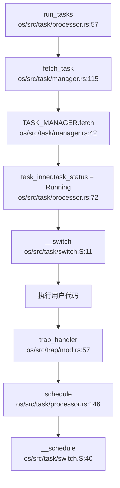
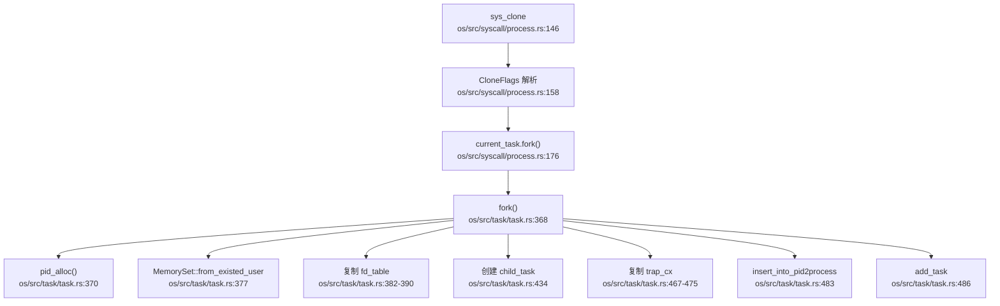
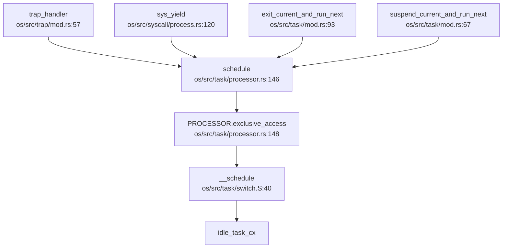

## 第 4 章：进程/线程与调度机制

## 任务模型与核心数据结构

### TaskControlBlock 结构体

本 OS 采用统一的 `TaskControlBlock`（TCB）结构体来管理所有执行实体，**未严格区分 PCB 与 TCB**。通过 `pid` 和 `tid` 字段来区分进程与线程：

```rust
// os/src/task/task.rs:39-100
pub struct TaskControlBlock {
    pub kstack: KernelStack,                    // 内核栈
    pub tid: usize,                             // 线程 ID
    pub pid: PidHandle,                         // 进程 ID
    pub send_sigchld_when_exit: bool,           // 退出时是否发送 SIGCHLD
    inner: UPSafeCell<TaskControlBlockInner>,   // 内部可变状态
}

pub struct TaskControlBlockInner {
    pub memory_set:       MemorySet,            // 地址空间
    pub trap_cx_ppn:      PhysPageNum,          // Trap 上下文物理页号
    pub task_cx:          TaskContext,          // 任务上下文（切换用）
    pub task_status:      TaskStatus,           // 任务状态
    pub syscall_times:    [u32; MAX_SYSCALL_NUM],
    pub first_time:       Option<usize>,        // 首次运行时间
    pub clear_child_tid:  usize,                // 子进程退出清零地址
    pub work_dir:         Arc<Dentry>,          // 工作目录
    pub parent:           Option<Weak<TaskControlBlock>>,  // 父进程
    pub children:         Vec<Arc<TaskControlBlock>>,      // 子进程列表
    pub threads:          Vec<Option<Arc<TaskControlBlock>>>, // 线程组
    pub user_stack_top:   usize,                // 用户栈顶
    pub exit_code:        Option<i32>,          // 退出码
    pub fd_table:         Vec<Option<Arc<dyn File>>>,      // 文件描述符表
    pub clock_stop_watch: usize,                // 时钟计时
    pub user_clock:       usize,                // 用户态时钟
    pub kernel_clock:     usize,                // 内核态时钟
    pub heap_base:        VirtAddr,             // 堆起始
    pub heap_end:         VirtAddr,             // 堆结束
    pub is_zombie:        bool,                 // 僵尸进程标志
    pub signals:          SignalFlags,          // 信号标志
    pub signal_actions:   SignalActions,        // 信号处理动作表
    pub signals_pending:  SignalFlags,          // 待处理信号
    pub signal_mask:      SignalFlags,          // 信号屏蔽字
}
```

**关键字段说明**：
- **进程/线程区分**：`tid == pid` 表示主线程（进程），`tid != pid` 表示该任务属于 `tid` 所指向的线程组
- **父子关系**：通过 `parent`（弱引用）和 `children` 维护进程树
- **线程组**：`threads` 向量存储同一进程内的所有线程
- **信号机制**：`signals`、`signal_actions`、`signals_pending`、`signal_mask` 四字段支持完整的信号处理

### TaskStatus 状态枚举

```rust
// os/src/task/task.rs:906-917
pub enum TaskStatus {
    Ready,      // 就绪态
    Running,    // 运行态
    Blocked,    // 阻塞态
    Zombie,     // 僵尸态（等待父进程回收）
    Exit,       // 退出态
}
```

## 调度算法与策略（代码证据）

### 调度器实现

调度器由 `TaskManager` 实现，位于 `os/src/task/manager.rs`：

```rust
// os/src/task/manager.rs:15-20
pub struct TaskManager {
    ready_queue:  VecDeque<Arc<TaskControlBlock>>,  // 就绪队列
    block_queue:  VecDeque<Arc<TaskControlBlock>>,  // 阻塞队列
    stop_task:    Option<Arc<TaskControlBlock>>,    // 停止等待任务
}
```

### 调度策略分析

**✅ 已实现：FIFO 调度**

当前实际运行的调度策略为**简单 FIFO**（先来先服务）：

```rust
// os/src/task/manager.rs:42-56
pub fn fetch(&mut self) -> Option<Arc<TaskControlBlock>> {
    if self.ready_queue.is_empty() {
        return None;
    }
    // 注释掉的 Stride 调度代码
    // let mut min_idx = 0;
    // for (idx, _) in self.ready_queue.iter().enumerate() {
    //     let stride_now = self.ready_queue[idx]...stride;
    //     let stride_min = self.ready_queue[min_idx]...stride;
    //     if stride_now < stride_min { min_idx = idx; }
    // }
    // self.ready_queue.swap(0, min_idx);
    self.ready_queue.pop_front()  // 直接从队首取出
}
```

**❌ 未实现：Stride 调度**

虽然代码中保留了 Stride 调度算法的注释代码和配置常量：
- `os/src/config.rs:35` 定义了 `pub const BIG_STRIDE: usize = 232792560;`
- 文档（`docs/初赛文档.md`）描述了 Stride 调度算法设计
- 但实际 `fetch()` 函数中 Stride 相关代码已被注释，仅使用 `pop_front()`

**🔸 桩函数：优先级设置**

```rust
// os/src/syscall/process.rs:477-485
pub fn sys_set_priority(prio: isize) -> isize {
    trace!("kernel:pid[{}] sys_set_priority", current_task().unwrap().pid.0);
    0  // 仅返回 0，无实际逻辑
}
```

### 调度触发流程



## 任务状态机

### 状态流转图

```
Ready ──[schedule]──> Running
  ↑                       │
  │                       ├─[阻塞 syscall]──> Blocked
  │                       │
  │                       ├─[exit]──> Zombie
  │                              │
  │                       └─[wait4 回收]──> Exit (销毁)
  │
Blocked ──[wakeup_task]──> Ready
```

### 状态转换代码证据

**Ready → Running**：
```rust
// os/src/task/processor.rs:72
task_inner.task_status = TaskStatus::Running;
```

**Running → Blocked**：
```rust
// os/src/task/mod.rs:67-72 (suspend_current_and_run_next)
task_inner.task_status = TaskStatus::Blocked;
add_block_task(task);
```

**Running → Zombie**：
```rust
// os/src/task/mod.rs:128-129 (exit_current_and_run_next)
task_inner.is_zombie = true;
task_inner.exit_code = Some(exit_code);
```

**Blocked → Ready**：
```rust
// os/src/task/manager.rs:100-104 (wakeup_task)
pub fn wakeup_task(task: Arc<TaskControlBlock>) {
    let mut task_inner = task.inner_exclusive_access(file!(), line!());
    task_inner.task_status = TaskStatus::Ready;
    drop(task_inner);
    add_task(task);
}
```

## 上下文切换实现（汇编分析）

### TaskContext 结构

```rust
// os/src/task/context.rs:7-17
#[repr(C)]
pub struct TaskContext {
    pub ra: usize,        // 返回地址
    sp:     usize,        // 栈指针
    pub s:  [usize; 12],  // s0-s11 被调用者保存寄存器
}
```

### 汇编实现分析

```assembly
# os/src/task/switch.S:11-37
__switch:
    # 保存当前任务的内核栈指针
    sd sp, 8(a0)
    # 保存 ra 和 s0-s11
    sd ra, 0(a0)
    .set n, 0
    .rept 12
        SAVE_SN %n
        .set n, n + 1
    .endr
    
    # 恢复下一任务的 ra 和 s0-s11
    ld ra, 0(a1)
    .set n, 0
    .rept 12
        LOAD_SN %n
        .set n, n + 1
    .endr
    
    # 恢复下一任务的内核栈指针
    ld sp, 8(a1)
    ret
```

**保存的寄存器**：
- `ra`（返回地址）
- `sp`（栈指针）
- `s0-s11`（12 个被调用者保存寄存器）

**不保存的寄存器**：
- `t0-t6`（临时寄存器，由调用者保存）
- `a0-a7`（参数寄存器）
- `gp`、`tp` 等

**注意**：`__schedule` 与 `__switch` 实现完全相同，仅标签名不同。

## 进程间通信与同步（Signal/Futex）

### 信号机制 (Signal)

**✅ 已实现：基础信号框架**

通过 `grep_in_repo` 搜索确认：

1. **信号定义**（`os/src/task/signal.rs`）：
   - 定义了 64 种信号（`SIGHUP` 到 `SIGRTMAX`）
   - `SignalFlags` bitflags 结构体
   - `SaFlags` 用于 `sigaction` 的标志

2. **信号处理动作**（`os/src/task/sigaction.rs`）：
   ```rust
   pub struct SignalAction {
       pub sa_handler:  usize,      // 处理函数地址
       pub sa_flags:    SaFlags,   // 标志
       pub sa_restorer: usize,      // 恢复函数
       pub mask:        SignalFlags, // 屏蔽字
   }
   ```

3. **系统调用实现**：
   - **`sys_kill`**（`os/src/syscall/process.rs:339-350`）：
     ```rust
     pub fn sys_kill(pid: usize, signal: u32) -> isize {
         if let Some(process) = pid2process(pid) {
             if let Some(flag) = SignalFlags::from_bits(signal as usize) {
                 process.inner_exclusive_access(file!(), line!()).signals |= flag;
                 0
             } else { EINVAL }
         } else { ESRCH }
     }
     ```
   - **`sys_sigaction`**（`os/src/syscall/signal.rs:88-147`）：设置信号处理动作
   - **`sys_sigprocmask`**（`os/src/syscall/signal.rs:29-86`）：修改信号屏蔽字
   - **`sys_sigtimedwait`**（`os/src/syscall/signal.rs:149-218`）：等待信号（当前为桩函数，仅返回 `SUCCESS`）

**🔸 桩函数：信号分发与处理**
- 虽然信号可以设置和发送，但**未发现信号实际分发到用户态的处理代码**
- `sys_sigtimedwait` 函数体被注释，仅返回 `SUCCESS`

### Futex 机制

**❌ 未实现：Futex**

通过 `grep_in_repo` 搜索 `futex|wait_queue`：
- 仅在注释中提到 futex 概念（`os/src/task/process.rs:78`）
- `wait_queue` 仅用于 `Semaphore` 和 `Condvar` 实现，非用户态 futex
- 无 `sys_futex` 系统调用定义

### 其他 IPC 机制

**✅ 已实现：管道（Pipe）**
- `os/src/fs/pipe.rs`（231 行，7.2KB）实现了匿名管道
- 支持 `pipe()` 系统调用

## 关键流程追踪（Fork/Exec/Schedule/Exit）

### sys_clone / sys_fork 流程

**调用链追踪**（DEGRADED MODE — 基于 Grep 静态分析）：



**关键代码分析**：

```rust
// os/src/task/task.rs:368-400
pub fn fork(self: &Arc<Self>) -> usize {
    let pid = pid_alloc();
    let trap_cx_ppn = self.trap_cx_ppn();
    let mut task_inner = self.inner_exclusive_access(file!(), line!());
    let kstack = kstack_alloc();
    let kstack_top = kstack.get_top();
    
    // ✅ 地址空间复制：写时复制（COW）
    let mut memory_set = MemorySet::from_existed_user(&task_inner.memory_set);
    
    // ✅ 文件描述符表复制
    let mut new_fd_table: Vec<Option<Arc<dyn File>>> = Vec::new();
    for fd in task_inner.fd_table.iter() {
        if let Some(file) = fd {
            new_fd_table.push(Some(file.clone()));
        } else {
            new_fd_table.push(None);
        }
    }
    
    // ... 分配 trap_cx，创建子任务 ...
    
    // ✅ 复制父进程 trap 上下文
    let father_trap_cx = self.get_trap_cx();
    let trap_cx = child_task.get_trap_cx();
    unsafe {
        core::ptr::copy(src_ptr, dst_ptr, PAGE_SIZE / size_of::<TrapContext>());
    }
    
    // ✅ 子进程返回 0
    trap_cx.x[10] = 0;
    
    insert_into_pid2process(pid, Arc::clone(&child_task));
    add_task(child_task);
    pid
}
```

**验证结论**：
- ✅ **地址空间复制**：调用 `MemorySet::from_existed_user()` 实现 COW
- ✅ **文件表复制**：遍历 `fd_table` 逐个 clone
- ✅ **Trap 上下文复制**：使用 `core::ptr::copy` 物理复制
- ✅ **返回值设置**：`trap_cx.x[10] = 0`（RISC-V a0 寄存器）

### sys_execve 流程

```rust
// os/src/syscall/process.rs:216-275
pub fn sys_execve(path: *const u8, mut args: *const usize, mut envp: *const usize) -> isize {
    // 1. 解析参数和环境变量
    let mut args_vec: Vec<String> = Vec::new();
    let mut envp_vec: Vec<String> = Vec::new();
    // ... 解析循环 ...
    
    // 2. 打开 ELF 文件
    if let Some(dentry) = open_file(work_dir.inode(), path.as_str(), OpenFlags::O_RDONLY) {
        let inode = dentry.inode();
        let all_data = inode.read_all();
        
        // 3. 调用 task.exec()
        task.exec(all_data.as_slice(), args_vec, envp_vec);
        argc as isize
    } else {
        ENOENT
    }
}
```

**exec 实现**（`os/src/task/task.rs:605-700`）：

```rust
pub fn exec(self: &Arc<Self>, elf_data: &[u8], argv_vec: Vec<String>, envp_vec: Vec<String>) {
    assert_eq!(self.pid.0, self.tid);  // 仅支持单线程进程
    
    // 1. 从 ELF 创建新地址空间
    let (mut memory_set, user_heap_base, ustack_top, entry_point, auxv) =
        MemorySet::from_elf(elf_data);
    
    let mut task_inner = self.inner_exclusive_access(file!(), line!());
    
    // 2. 设置堆和栈
    task_inner.heap_base = user_heap_base.into();
    task_inner.heap_end = user_heap_base.into();
    task_inner.user_stack_top = ustack_top - 8;
    
    // 3. 分配用户栈和 trap_cx 映射
    memory_set.insert_framed_area(ustack_bottom.into(), ustack_top.into(), ...);
    
    // 4. 构建用户栈（参数、环境变量、auxv）
    let (user_sp, argc, argv_base, envp_base, aux_base) = task_inner.memory_set.build_stack(...);
    
    // 5. 替换地址空间
    task_inner.memory_set = memory_set;
    
    // 6. 设置 Trap 上下文，跳转到新入口点
    *trap_cx = TrapContext::app_init_context(entry_point, user_sp, ...);
}
```

**验证结论**：
- ✅ **ELF 加载**：`MemorySet::from_elf()` 解析 ELF 并创建地址空间
- ✅ **地址空间重建**：完全替换 `memory_set`，旧页表通过 `recycle_data_pages()` 回收
- ✅ **栈重建**：`build_stack()` 重新推送 argv、envp、auxv
- ✅ **入口点设置**：更新 `trap_cx` 的 `ra` 为新 ELF 入口

### schedule 流程

**调用链追踪**（DEGRADED MODE）：



**谁调用 schedule**：
1. `trap_handler`（中断返回前）
2. `sys_yield`（主动让出 CPU）
3. `exit_current_and_run_next`（进程退出）
4. `suspend_current_and_run_next`（进程阻塞）

**优先级验证**：
- ❌ **未使用 priority/stride**：`fetch_task()` 直接 `pop_front()`
- 代码中注释掉了 Stride 调度逻辑（见 `os/src/task/manager.rs:46-54`）

### sys_exit / exit_current_and_run_next 流程

```rust
// os/src/task/mod.rs:93-181
pub fn exit_current_and_run_next(exit_code: i32) {
    // 1. 获取当前任务
    let task = take_current_task().unwrap();
    let mut task_inner = task.inner_exclusive_access(file!(), line!());
    let tid = task.tid;
    
    if tid == task.pid.0 {  // 主线程退出
        // 2. 标记为僵尸进程
        task_inner.is_zombie = true;
        task_inner.exit_code = Some(exit_code);
        
        // 3. 子进程过继给 initproc
        for child in task_inner.children.iter() {
            child.inner_exclusive_access(...).parent = Some(Arc::downgrade(&INITPROC));
            INITPROC.inner_exclusive_access(...).children.push(child.clone());
        }
        
        // 4. 回收线程资源
        for task in task_inner.threads.iter().filter(|t| t.is_some()) {
            remove_inactive_task(Arc::clone(&task));
        }
        
        // 5. 回收地址空间、文件表
        task_inner.memory_set.recycle_data_pages();
        task_inner.fd_table.clear();
        task_inner.threads.clear();
        
        drop(task_inner);
    }
    
    // 6. 触发调度
    schedule(&mut _unused as *mut _);
}
```

**资源回收流程**：
1. 标记僵尸状态
2. 子进程过继给 init 进程
3. 移除阻塞队列中的线程
4. 回收地址空间数据页
5. 清空文件描述符表
6. 清空线程列表
7. 触发调度切换到下一任务

## 进程/线程管理模块扩展

### 进程组与会话

**❌ 未实现：进程组（ProcessGroup）和会话（Session）**

通过 `grep_in_repo` 搜索：
- `pgid|session_id|set_sid|setpged` → **未找到匹配**
- `ProcessGroup|Session|process_group|session` → **未找到匹配**

**结论**：本 OS 未实现 POSIX 标准的进程组和会话管理机制，所有进程均为独立会话组长。

### 层次结构 ID 规则

**❌ 未实现**：由于无进程组/会话概念，不存在 PGID/SID 分配规则。

### POSIX 资源限制

**🔸 部分实现：RLimit 框架**

```rust
// os/src/task/resource.rs:1-76
pub const RLIM_INFINITY: usize = usize::MAX;

const RLIMIT_CPU: u32 = 0;
const RLIMIT_FSIZE: u32 = 1;
// ... 共定义 16 种资源限制（RLIMIT_CPU 到 RLIMIT_RTTIME）

pub struct RLimit {
    pub rlim_cur: usize,  // 软限制
    pub rlim_max: usize,  // 硬限制
}

impl RLimit {
    pub fn set_rlimit(resource: u32, rlimit: &RLimit) -> isize {
        match resource {
            RLIMIT_NOFILE => {
                current_process().inner_handler(|proc| proc.fd_table.set_rlimit(*rlimit))
            }
            _ => {}  // 其他资源无实现
        }
        0
    }
    
    pub fn get_rlimit(resource: u32) -> Self {
        match resource {
            RLIMIT_STACK => Self::new(USER_STACK_SIZE, RLIM_INFINITY),
            RLIMIT_NOFILE => current_process().inner_handler(|proc| proc.fd_table.rlimit()),
            _ => Self { rlim_cur: 0, rlim_max: 0 },  // 默认返回 0
        }
    }
}
```

**验证结论**：
- ✅ **已定义 16 种资源类型**（与 POSIX 一致）
- ✅ **软/硬限制双机制**：`rlim_cur` / `rlim_max`
- 🔸 **仅实现 RLIMIT_NOFILE 和 RLIMIT_STACK**：其他资源返回 0 或无操作
- 🔸 **系统调用桩实现**：`SYSCALL_PRLIMIT64` 在 `os/src/syscall/mod.rs:211` 仅返回 0

### 线程支持

**🔸 部分实现：线程框架**

- `TaskControlBlock` 包含 `threads: Vec<Option<Arc<TaskControlBlock>>>` 字段管理线程组
- `clone2()` 和 `clone_t()` 函数支持 `CLONE_THREAD`、`CLONE_VM` 等标志
- **但** `clone_t()` 函数体包含 `todo!("unfinished")`，未完全实现

```rust
// os/src/task/task.rs:300-365
pub fn clone_t(...) -> Option<Arc<TaskControlBlock>> {
    // ... 部分逻辑 ...
    todo!("unfinished");  // 未完成
}
```

**结论**：线程管理框架已搭建，但实际创建线程的功能未完成。

---

## 本章总结表

| 功能模块 | 实现状态 | 代码证据 |
|---------|---------|---------|
| **任务模型** | ✅ 已实现 | `TaskControlBlock` 统一管理进程/线程 |
| **FIFO 调度** | ✅ 已实现 | `TaskManager::fetch()` 使用 `pop_front()` |
| **Stride 调度** | ❌ 未实现 | 代码被注释（`manager.rs:46-54`） |
| **优先级设置** | 🔸 桩函数 | `sys_set_priority()` 仅返回 0 |
| **上下文切换** | ✅ 已实现 | `switch.S` 保存 ra/sp/s0-s11 |
| **信号机制** | ✅ 框架实现 | `sys_kill`、`sys_sigaction`、`sys_sigprocmask` |
| **信号分发** | 🔸 未完整 | 未发现用户态信号处理入口代码 |
| **Futex** | ❌ 未实现 | 无 `sys_futex` 系统调用 |
| **fork()** | ✅ 已实现 | COW 地址空间 + 文件表复制 |
| **exec()** | ✅ 已实现 | ELF 加载 + 地址空间重建 |
| **exit()** | ✅ 已实现 | 僵尸进程 + 资源回收 |
| **wait4()** | ✅ 已实现 | 子进程回收 + 退出码获取 |
| **进程组/会话** | ❌ 未实现 | 无相关代码 |
| **RLimit** | 🔸 部分实现 | 仅 `RLIMIT_NOFILE` 和 `RLIMIT_STACK` |
| **线程创建** | 🔸 未完成 | `clone_t()` 含 `todo!()` |
