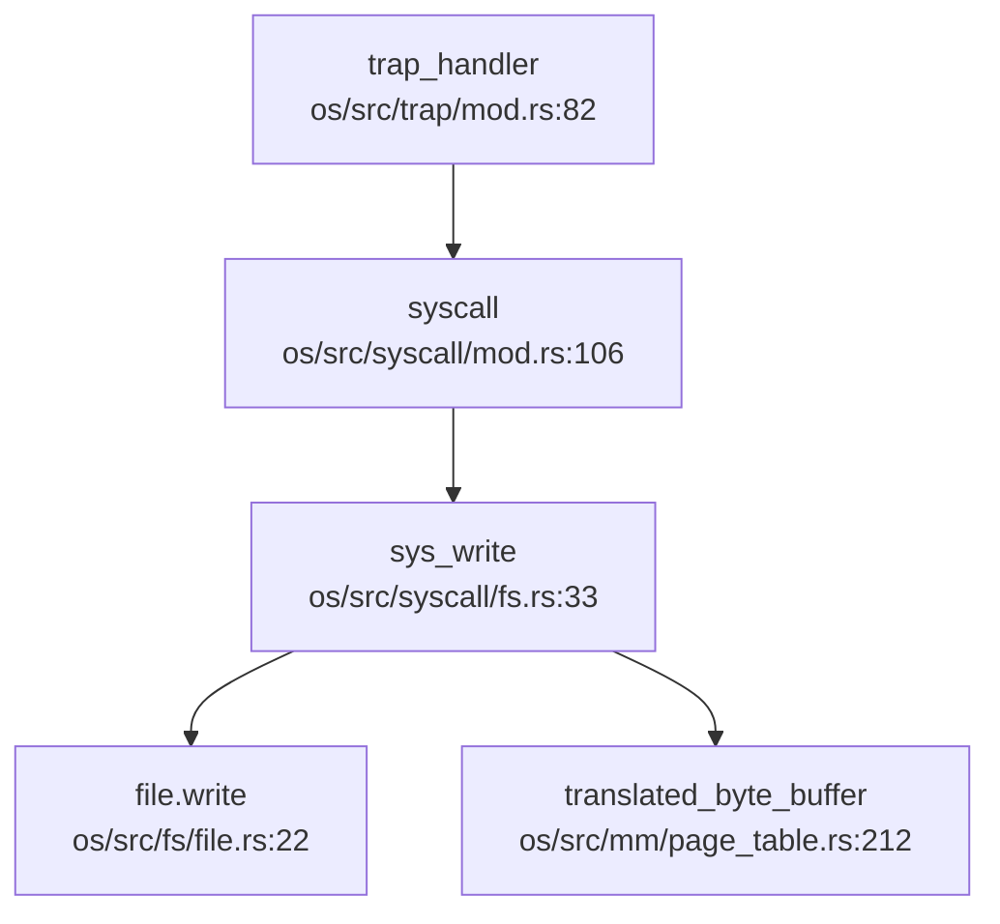

## 第 5 章：中断、异常与系统调用

### Trap 处理流程（用户态 <-> 内核态）

本操作系统的 Trap 处理机制基于 RISC-V 架构的异常处理流程实现，核心入口位于 `os/src/trap/mod.rs` 和 `os/src/trap/trap.S`。

**Trap 入口与异常向量表**：

Trap 入口汇编代码位于 `os/src/trap/trap.S`，定义了 `__alltraps` 作为用户态 Trap 的统一入口点。当用户态执行 `ecall` 指令或发生硬件异常时，CPU 自动跳转到 `stvec` 寄存器指向的地址。

```assembly
# os/src/trap/trap.S:11-47
__alltraps:
    csrrw sp, sscratch, sp          # 交换 sp 和 sscratch，sp 指向 TrapContext
    sd x1, 1*8(sp)                  # 保存 ra
    sd x3, 3*8(sp)                  # 保存 gp
    # 跳过 sp(x2) 和 tp(x4)
    .set n, 5
    .rept 27                        # 保存 x5-x31
        SAVE_GP %n
        .set n, n+1
    .endr
    csrr t0, sstatus                # 保存 sstatus
    csrr t1, sepc                   # 保存 sepc
    sd t0, 32*8(sp)
    sd t1, 33*8(sp)
    csrr t2, sscratch               # 保存用户栈指针
    sd t2, 2*8(sp)
    ld t0, 34*8(sp)                 # 加载 kernel_satp
    ld t1, 36*8(sp)                 # 加载 trap_handler
    ld sp, 35*8(sp)                 # 切换到内核栈
    jr t1                           # 跳转到 trap_handler
```

**Trap 分发逻辑**：

`trap_handler()` 函数（`os/src/trap/mod.rs:82`）是 Rust 层面的异常处理核心，通过读取 `scause` 寄存器区分异常类型：

```rust
// os/src/trap/mod.rs:97-143
match scause.cause() {
    Trap::Exception(Exception::UserEnvCall) => {
        // 系统调用处理：sepc += 4 跳过 ecall 指令
        let mut cx = current_trap_cx();
        cx.sepc += 4;
        syscall_num = cx.x[17] as i32;  // a7 寄存器存放 syscall ID
        result = syscall(cx.x[17], [cx.x[10], cx.x[11], cx.x[12], cx.x[13], cx.x[14], cx.x[15]]);
    }
    Trap::Exception(Exception::StoreFault)
    | Trap::Exception(Exception::StorePageFault)
    | Trap::Exception(Exception::InstructionFault)
    | Trap::Exception(Exception::InstructionPageFault)
    | Trap::Exception(Exception::LoadFault)
    | Trap::Exception(Exception::LoadPageFault) => {
        // 内存访问错误：发送 SIGSEGV 信号
        current_add_signal(SignalFlags::SIGSEGV);
    }
    Trap::Exception(Exception::IllegalInstruction) => {
        exit_current_and_run_next(-1);
        current_add_signal(SignalFlags::SIGILL);
    }
    Trap::Interrupt(Interrupt::SupervisorTimer) => {
        // 时钟中断：设置下次触发并调度
        set_next_trigger();
        check_timer();
        suspend_current_and_run_next();
    }
    _ => panic!("unsupport trap"),
}
```

**中断与异常的区分**：

系统通过 `scause` 寄存器的最高位区分中断（Interrupt）和异常（Exception）：
- **中断**：`scause[63] = 1`，如 `SupervisorTimer`（时钟中断）
- **异常**：`scause[63] = 0`，如 `UserEnvCall`（ecall）、`StorePageFault`（缺页）

### 上下文保存：TrapContext 结构体

**TrapContext 定义**（`os/src/trap/context.rs:7-21`）：

```rust
#[repr(C)]
#[derive(Debug, Clone, Copy)]
pub struct TrapContext {
    pub x:            [usize; 32],   // 32 个通用寄存器 (x0-x31)
    pub sstatus:      Sstatus,       //  supervisor 状态寄存器
    pub sepc:         usize,         //  supervisor 异常程序计数器
    pub kernel_satp:  usize,         //  内核页表基址
    pub kernel_sp:    usize,         //  内核栈指针
    pub trap_handler: usize,         //  trap_handler 函数地址
}
```

**寄存器数量与字节数统计**：
- **通用寄存器**：32 个 × 8 字节 = 256 字节
- **sstatus**：8 字节（RISC-V 64 位 CSR）
- **sepc**：8 字节
- **kernel_satp**：8 字节
- **kernel_sp**：8 字节
- **trap_handler**：8 字节
- **总计**：256 + 8×5 = **296 字节**

**上下文保存/恢复流程**：
1. **保存**：`__alltraps` 将所有通用寄存器（除 x0/sp/tp）和 sstatus/sepc 保存到 TrapContext
2. **恢复**：`__restore` 从 TrapContext 恢复所有寄存器，通过 `sret` 返回用户态

### 系统调用分发机制

**系统调用分发表**位于 `os/src/syscall/mod.rs:106-214`，通过 `match` 语句实现：

```rust
// os/src/syscall/mod.rs:106
pub fn syscall(syscall_id: usize, args: [usize; 6]) -> isize {
    match syscall_id {
        SYSCALL_GETCWD => sys_getcwd(args[0] as *mut u8, args[1]),
        SYSCALL_DUP => sys_dup(args[0]),
        SYSCALL_WRITE => sys_write(args[0], args[1] as *const u8, args[2]),
        SYSCALL_EXIT => sys_exit(args[0] as i32),
        SYSCALL_CLONE => sys_clone(args[0], args[1], args[2] as *mut usize, args[3], args[4] as *mut usize),
        SYSCALL_EXECVE => sys_execve(args[0] as *const u8, args[1] as *const usize, args[2] as *const usize),
        SYSCALL_KILL => sys_kill(args[0], args[1] as u32),
        // ... 共约 70+ 个 syscall
        _ => panic!("Unsupported syscall_id: {}", syscall_id),
    }
}
```

**sys_write 调用链追踪**：



**完整调用路径**：
1. 用户态执行 `ecall` → `__alltraps` (trap.S:11)
2. `trap_handler` (trap/mod.rs:82) 读取 `a7` 作为 syscall ID
3. `syscall` (syscall/mod.rs:106) 分发到 `sys_write`
4. `sys_write` (syscall/fs.rs:33) 检查 fd 有效性，通过 `translated_byte_buffer` 安全访问用户内存
5. 调用 `file.write()` 执行实际写入

### 核心 Syscall 实现列表

基于代码分析，统计 syscall 实现状态如下：

**✅ 已实现（含完整逻辑）的 Syscall**：

| Syscall | 文件路径 | 说明 |
|---------|----------|------|
| `sys_write` | `os/src/syscall/fs.rs:33` | 文件写入，含权限检查和地址翻译 |
| `sys_read` | `os/src/syscall/fs.rs:64` | 文件读取 |
| `sys_openat` | `os/src/syscall/fs.rs:126` | 打开文件 |
| `sys_close` | `os/src/syscall/fs.rs:159` | 关闭文件 |
| `sys_dup` | `os/src/syscall/fs.rs:199` | 复制文件描述符 |
| `sys_pipe` | `os/src/syscall/fs.rs:177` | 创建管道 |
| `sys_exit` | `os/src/syscall/process.rs:103` | 进程退出 |
| `sys_clone` | `os/src/syscall/process.rs:147` | 线程/进程克隆 |
| `sys_execve` | `os/src/syscall/process.rs:217` | 执行程序 |
| `sys_wait4` | `os/src/syscall/process.rs:282` | 等待子进程 |
| `sys_kill` | `os/src/syscall/process.rs:340` | 发送信号 |
| `sys_sigaction` | `os/src/syscall/signal.rs:95` | 设置信号处理函数 |
| `sys_sigprocmask` | `os/src/syscall/signal.rs:27` | 修改信号屏蔽 |
| `sys_brk` | `os/src/syscall/process.rs:430` | 调整堆大小 |
| `sys_mmap` | `os/src/syscall/process.rs:398` | 内存映射 |
| `sys_munmap` | `os/src/syscall/process.rs:421` | 取消内存映射 |
| `sys_getpid` | `os/src/syscall/process.rs:127` | 获取进程 ID |
| `sys_gettimeofday` | `os/src/syscall/process.rs:359` | 获取时间 |
| `sys_yield` | `os/src/syscall/process.rs:121` | 主动让出 CPU |
| `sys_fstat` | `os/src/syscall/fs.rs:242` | 获取文件状态 |
| `sys_getcwd` | `os/src/syscall/fs.rs:304` | 获取当前工作目录 |
| `sys_chdir` | `os/src/syscall/fs.rs:330` | 切换工作目录 |
| `sys_getdents64` | `os/src/syscall/fs.rs:383` | 读取目录项 |
| `sys_uname` | `os/src/syscall/process.rs:515` | 获取系统信息 |
| `sys_clock_gettime` | `os/src/syscall/time.rs:8` | 获取时钟时间 |
| `sys_times` | `os/src/syscall/process.rs:490` | 获取进程时间统计 |
| `sys_gettid` | `os/src/syscall/thread.rs:53` | 获取线程 ID |
| `sys_thread_create` | `os/src/syscall/thread.rs:10` | 创建线程 |
| `sys_waittid` | `os/src/syscall/thread.rs:67` | 等待线程 |
| `sys_ppoll` | `os/src/syscall/ppoll.rs:53` | 轮询 I/O |

**🔸 桩函数（返回固定值或无逻辑）**：

| Syscall | 文件路径 | 说明 |
|---------|----------|------|
| `sys_getuid` | `os/src/syscall/process.rs:548` | 直接返回 0 |
| `sys_geteuid` | `os/src/syscall/process.rs:554` | 直接返回 0 |
| `sys_getgid` | `os/src/syscall/process.rs:560` | 直接返回 0 |
| `sys_getegid` | `os/src/syscall/process.rs:566` | 直接返回 0 |
| `sys_spawn` | `os/src/syscall/process.rs:460` | 仅打印 trace，无实现 |
| `sys_set_priority` | `os/src/syscall/process.rs:480` | 无实现 |
| `sys_task_info` | `os/src/syscall/process.rs:375` | 部分实现 |
| `sys_umount2` | `os/src/syscall/fs.rs:459` | 无实现 |
| `sys_mount` | `os/src/syscall/fs.rs:464` | 无实现 |
| `sys_ioctl` | `os/src/syscall/fs.rs:471` | 无实现 |
| `sys_prlimit64` | `os/src/syscall/mod.rs:207` | 直接返回 0 |

**❌ 未实现（注释掉或未注册）**：

- `SYSCALL_SLEEP`：在分发表中被注释掉（`os/src/syscall/mod.rs:124`）
- `SYSCALL_MUTEX_CREATE/LOCK/UNLOCK`：被注释掉（`os/src/syscall/mod.rs:143-145`）
- `SYSCALL_SEMAPHORE_CREATE/UP/DOWN`：被注释掉（`os/src/syscall/mod.rs:146-148`）
- `SYSCALL_CONDVAR_CREATE/SIGNAL/WAIT`：被注释掉（`os/src/syscall/mod.rs:149-151`）

**覆盖度统计**：
- **已注册 syscall 总数**：约 70 个
- **✅ 完整实现**：约 30 个
- **🔸 桩函数**：约 11 个
- **❌ 注释掉/未实现**：约 10 个

### 接口/实现分离模式

**未发现**本项目采用 `sys_xxx` / `sys_xxx_impl` 的接口实现分离模式。所有 syscall 均直接在 `sys_xxx` 函数中实现业务逻辑。

### 用户指针语义化包装

**未发现** `UserInPtr` / `UserOutPtr` / `UserInOutPtr` 等类型安全包装器。

项目使用 `translated_byte_buffer` 和 `sstatus::set_sum/clear_sum` 进行用户内存访问：

```rust
// os/src/syscall/fs.rs:49-56
let buf = unsafe {
    sstatus::set_sum();  // 允许访问用户内存
    let buf = core::slice::from_raw_parts(buf, len);
    sstatus::clear_sum(); // 恢复保护
    buf
};
```

这种方式通过临时设置 `SUM`（permit Supervisor User Memory access）位来访问用户空间，**缺乏细粒度的指针类型安全保证**。

### 中断处理与信号关联

**时钟中断处理流程**：

```rust
// os/src/trap/mod.rs:138-143
Trap::Interrupt(Interrupt::SupervisorTimer) => {
    set_next_trigger();  // 设置下次中断时间
    check_timer();       // 检查是否有定时任务到期
    suspend_current_and_run_next();  // 触发调度
}
```

**外部中断**：本项目**仅实现了 SupervisorTimer**（通过 SBI 调用），**未发现** PLIC/APIC 等外部设备中断的处理代码。

### 信号机制

**信号处理触发点**：

信号检查在 `trap_handler` 返回用户态前执行：

```rust
// os/src/trap/mod.rs:153-157
if let Some((errno, msg)) = check_signals_of_current() {
    trace!("trap_handler: .. check signals {}", msg);
    exit_current_and_run_next(errno);
}
```

**信号错误检测**（`os/src/task/signal.rs:118-130`）：

```rust
pub fn check_error(&self) -> Option<(i32, &'static str)> {
    if self.contains(Self::SIGINT) {
        Some((-2, "Killed, SIGINT=2"))
    } else if self.contains(Self::SIGSEGV) {
        Some((-11, "Segmentation Fault, SIGSEGV=11"))
    } else if self.contains(Self::SIGILL) {
        Some((-4, "Illegal Instruction, SIGILL=4"))
    } else {
        None
    }
}
```

**三种粒度信号发送**：

- **✅ `sys_kill`**：支持进程级信号发送（`os/src/syscall/process.rs:340`）
- **❌ `sys_tkill`**：未发现实现
- **❌ `sys_tgkill`**：未发现实现

```rust
// os/src/syscall/process.rs:340-352
pub fn sys_kill(pid: usize, signal: u32) -> isize {
    if let Some(process) = pid2process(pid) {
        if let Some(flag) = SignalFlags::from_bits(signal as usize) {
            process.inner_exclusive_access(file!(), line!()).signals |= flag;
            0
        } else {
            EINVAL
        }
    } else {
        ESRCH
    }
}
```

**SIGSEGV 信号**：

✅ **已实现**。在 `trap_handler` 中，所有内存访问错误（StoreFault、LoadPageFault 等）都会触发 `current_add_signal(SignalFlags::SIGSEGV)`。

**用户自定义信号处理函数**：

- **✅ `sys_sigaction`**：支持设置信号处理函数（`os/src/syscall/signal.rs:95`）
- **❌ `sys_sigreturn`**：虽在常量中定义（`SYSCALL_SIGRETURN = 139`），但**未在分发表中注册**
- **❌ `signal_trampoline`**：未发现跳板代码实现

**结论**：信号机制**仅支持基础框架**，缺乏完整的用户态信号处理函数调用机制（缺少 trampoline 和 sigreturn）。

### 缺页异常与内存特性关联

**缺页异常处理**：

在 `trap_handler` 中，缺页异常（`StorePageFault`、`LoadPageFault`、`InstructionPageFault`）被统一处理：

```rust
// os/src/trap/mod.rs:107-117
Trap::Exception(Exception::StorePageFault)
| Trap::Exception(Exception::LoadPageFault)
| Trap::Exception(Exception::InstructionPageFault) => {
    error!("trap_handler: {:?} in application, bad addr = {:#x}", scause.cause(), stval);
    current_add_signal(SignalFlags::SIGSEGV);  // 直接发送 SIGSEGV
}
```

**❌ 未发现 CoW（写时复制）实现**：
- 搜索 `cow`、`copy_on_write` 无结果
- `sys_clone` 调用 `fork` 或 `clone2`，但**未发现**页表项的 CoW 标记逻辑

**❌ 未发现 Lazy Allocation（懒分配）实现**：
- 搜索 `lazy`、`handle_page_fault`、`do_page_fault` 无结果
- 缺页异常直接发送 SIGSEGV，**未触发**内存分配

**内存映射实现**：

`sys_mmap` 调用 `MemorySet::mmap`（`os/src/mm/memory_set.rs:569`），支持匿名映射和文件映射，但**不涉及懒分配**。

### 关键代码片段

**Trap 入口汇编**（`os/src/trap/trap.S:11-47`）：
```assembly
__alltraps:
    csrrw sp, sscratch, sp
    sd x1, 1*8(sp)
    # ... 保存所有寄存器
    ld t1, 36*8(sp)  # trap_handler 地址
    ld sp, 35*8(sp)  # 内核栈
    jr t1            # 跳转到 Rust 处理函数
```

**系统调用分发**（`os/src/syscall/mod.rs:106-125`）：
```rust
pub fn syscall(syscall_id: usize, args: [usize; 6]) -> isize {
    match syscall_id {
        SYSCALL_WRITE => sys_write(args[0], args[1] as *const u8, args[2]),
        SYSCALL_CLONE => sys_clone(args[0], args[1], args[2] as *mut usize, args[3], args[4] as *mut usize),
        SYSCALL_EXECVE => sys_execve(args[0] as *const u8, args[1] as *const usize, args[2] as *const usize),
        // ...
        _ => panic!("Unsupported syscall_id: {}", syscall_id),
    }
}
```

**信号发送**（`os/src/syscall/process.rs:340-352`）：
```rust
pub fn sys_kill(pid: usize, signal: u32) -> isize {
    if let Some(process) = pid2process(pid) {
        if let Some(flag) = SignalFlags::from_bits(signal as usize) {
            process.inner_exclusive_access(file!(), line!()).signals |= flag;
            0
        } else {
            EINVAL
        }
    } else {
        ESRCH
    }
}
```

### 总结

本操作系统的中断、异常与系统调用机制具有以下特点：

1. **Trap 处理完整**：支持用户态 `ecall`、缺页异常、非法指令、时钟中断的处理
2. **上下文保存精确**：`TrapContext` 结构体包含 32 个通用寄存器 + 5 个 CSR，共 296 字节
3. **Syscall 覆盖度中等**：约 70 个注册 syscall 中，30 个完整实现，11 个桩函数，10 个未实现
4. **信号机制基础**：支持 SIGSEGV、SIGILL 等核心信号，但缺少用户态处理函数调用机制
5. **内存特性缺失**：**未发现** CoW 和 Lazy Allocation 实现，缺页异常直接发送 SIGSEGV
6. **用户指针安全**：使用 `SUM` 位临时授权访问，缺乏类型安全包装
