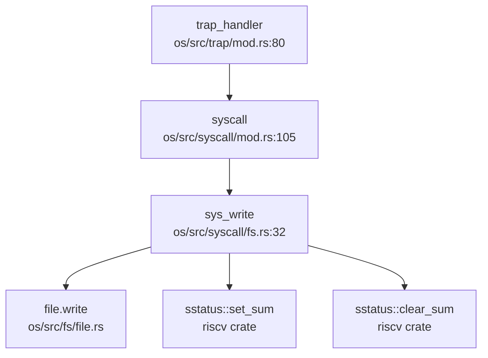

现在我已经收集了足够的信息。让我输出完整的第 5 章 Markdown 报告。

## 第 5 章：中断、异常与系统调用

### Trap 处理流程（用户态 <-> 内核态）

#### Trap 入口与异常向量表

Chaos OS 的 Trap 入口位于 `os/src/trap/trap.S`，采用 RISC-V 标准的汇编实现。内核通过 `stvec` 寄存器注册 trap 处理入口：

```assembly
# os/src/trap/trap.S:11-47
__alltraps:
    csrrw sp, sscratch, sp          # 交换 sp 与 sscratch，sp 指向 TrapContext
    sd x1, 1*8(sp)                  # 保存通用寄存器
    sd x3, 3*8(sp)
    .set n, 5
    .rept 27
        SAVE_GP %n                  # 保存 x5-x31
    .endr
    csrr t0, sstatus                # 保存 sstatus/sepc
    csrr t1, sepc
    sd t0, 32*8(sp)
    sd t1, 33*8(sp)
    csrr t2, sscratch               # 保存用户栈指针
    sd t2, 2*8(sp)
    ld t0, 34*8(sp)                 # 加载 kernel_satp
    ld t1, 36*8(sp)                 # 加载 trap_handler 地址
    ld sp, 35*8(sp)                 # 切换到内核栈
    jr t1                           # 跳转到 trap_handler
```

**关键设计**：
- 使用 `sscratch` 寄存器保存用户栈指针，实现用户/内核栈快速切换
- 保存 32 个通用寄存器 + `sstatus` + `sepc` 到 `TrapContext` 结构体
- 通过 `jr t1` 间接跳转到 Rust 实现的 `trap_handler()` 函数

内核初始化时通过 `init()` 函数设置 trap 入口：

```rust
// os/src/trap/mod.rs:50-63
pub fn init() {
    set_kernel_trap_entry();
}

pub fn set_user_trap_entry() {
    unsafe {
        stvec::write(TRAP_CONTEXT_TRAMPOLINE as usize, TrapMode::Direct);
    }
}
```

#### TrapContext 结构体（上下文保存）

`TrapContext` 定义于 `os/src/trap/context.rs`，精确包含以下字段：

```rust
// os/src/trap/context.rs:4-18
#[repr(C)]
pub struct TrapContext {
    pub x:            [usize; 32],   // 32 个通用寄存器 x0-x31
    pub sstatus:      Sstatus,       //  Supervisor Status Register
    pub sepc:         usize,         // Supervisor Exception Program Counter
    pub kernel_satp:  usize,         // 内核页表基址
    pub kernel_sp:    usize,         // 内核栈指针
    pub trap_handler: usize,         // trap handler 函数地址
}
```

**精确统计**：
- 寄存器数量：32 个通用寄存器 (x0-x31) + 2 个控制寄存器 (sstatus, sepc) = **34 个寄存器字段**
- 总字节数：32×8 + 8 + 8 + 8 + 8 + 8 = **288 字节** (在 64 位 RISC-V 架构下)

### 异常分类与处理逻辑

`trap_handler()` 函数位于 `os/src/trap/mod.rs:80`，通过读取 `scause` 寄存器区分中断和异常：

```rust
// os/src/trap/mod.rs:80-150
pub fn trap_handler() -> ! {
    set_kernel_trap_entry();
    let scause = scause::read();
    let stval = stval::read();
    let sepc = sepc::read();
    
    match scause.cause() {
        Trap::Exception(Exception::UserEnvCall) => {
            // 系统调用处理
            let mut cx = current_trap_cx();
            cx.sepc += 4;  // 跳过 ecall 指令
            syscall_num = cx.x[17] as i32;  // a7 寄存器存放 syscall 号
            result = syscall(cx.x[17], [cx.x[10], cx.x[11], cx.x[12], cx.x[13], cx.x[14], cx.x[15]]);
        }
        Trap::Exception(Exception::StorePageFault)
        | Trap::Exception(Exception::StorePageFault)
        | Trap::Exception(Exception::InstructionPageFault)
        | Trap::Exception(Exception::LoadPageFault)
        | Trap::Exception(Exception::LoadFault) => {
            error!("[kernel] trap_handler: {:?} in application", scause.cause());
            current_add_signal(SignalFlags::SIGSEGV);  // 发送 SIGSEGV 信号
        }
        Trap::Exception(Exception::IllegalInstruction) => {
            exit_current_and_run_next(-1);
            current_add_signal(SignalFlags::SIGILL);
        }
        Trap::Interrupt(Interrupt::SupervisorTimer) => {
            set_next_trigger();
            check_timer();
            suspend_current_and_run_next();  // 触发调度
        }
        _ => {
            panic!("[kernel] trap_handler: unsupport trap {:?}", scause.cause());
        }
    }
    // ... 信号检查与返回逻辑
}
```

**异常分类**：
| 异常类型 | scause 值 | 处理方式 |
|---------|----------|---------|
| `UserEnvCall` | 8 | 系统调用，执行 `syscall()` 分发 |
| `StorePageFault` | 15 | 存储页故障，发送 `SIGSEGV` |
| `LoadPageFault` | 13 | 加载页故障，发送 `SIGSEGV` |
| `InstructionPageFault` | 12 | 指令页故障，发送 `SIGSEGV` |
| `IllegalInstruction` | 2 | 非法指令，发送 `SIGILL` 并退出 |
| `SupervisorTimer` | 中断 | 时钟中断，触发调度 |

### 系统调用分发机制

#### 系统调用分发表

系统调用分发在 `os/src/syscall/mod.rs:105` 的 `syscall()` 函数中实现，采用 `match` 语句进行分发：

```rust
// os/src/syscall/mod.rs:105-214
pub fn syscall(syscall_id: usize, args: [usize; 6]) -> isize {
    let task = current_task().unwrap();
    let mut inner = task.inner_exclusive_access(file!(), line!());
    inner.syscall_times[syscall_id] += 1;  // 统计 syscall 调用次数
    drop(inner);
    drop(task);
    
    match syscall_id {
        SYSCALL_GETCWD => sys_getcwd(args[0] as *mut u8, args[1]),
        SYSCALL_DUP => sys_dup(args[0]),
        SYSCALL_OPENAT => sys_openat(args[0] as i32, args[1] as *const u8, args[2] as i32),
        SYSCALL_CLOSE => sys_close(args[0]),
        SYSCALL_READ => sys_read(args[0], args[1] as *mut u8, args[2]),
        SYSCALL_WRITE => sys_write(args[0], args[1] as *const u8, args[2]),
        SYSCALL_EXIT => sys_exit(args[0] as i32),
        SYSCALL_CLONE => sys_clone(args[0], args[1], args[2] as *mut usize, args[3], args[4] as *mut usize),
        SYSCALL_EXECVE => sys_execve(args[0] as *const u8, args[1] as *const usize, args[2] as *const usize),
        SYSCALL_WAIT4 => sys_wait4(args[0] as isize, args[1] as *mut i32, args[2] as u32, args[3]),
        SYSCALL_KILL => sys_kill(args[0], args[1] as u32),
        // ... 共 65 个系统调用
        SYSCALL_PRLIMIT64 => 0,  // 🔸 桩函数：直接返回 0
        _ => panic!("Unsupported syscall_id: {}", syscall_id),
    }
}
```

**系统调用号定义**（部分）：
```rust
// os/src/syscall/mod.rs:15-79
const SYSCALL_GETCWD: usize = 17;
const SYSCALL_DUP: usize = 23;
const SYSCALL_OPENAT: usize = 56;
const SYSCALL_CLOSE: usize = 57;
const SYSCALL_READ: usize = 63;
const SYSCALL_WRITE: usize = 64;
const SYSCALL_EXIT: usize = 93;
const SYSCALL_CLONE: usize = 220;
const SYSCALL_EXECVE: usize = 221;
const SYSCALL_KILL: usize = 129;
```

#### sys_write 调用链追踪

**完整调用链**（从 Trap 到文件写入）：



**sys_write 实现分析**：

```rust
// os/src/syscall/fs.rs:32-62
pub fn sys_write(fd: usize, buf: *const u8, len: usize) -> isize {
    let task = current_task().unwrap();
    let inner = task.inner_exclusive_access(file!(), line!());
    
    if fd >= inner.fd_table.len() {
        return EBADF;  // 错误：文件描述符越界
    }
    if let Some(file) = &inner.fd_table[fd] {
        if !file.writable() {
            return EACCES;  // 错误：文件不可写
        }
        let file = file.clone();
        drop(inner);  // 释放 TCB 锁，避免多重借用
        
        // 用户指针安全访问：使用 sstatus::set_sum 允许访问用户空间
        let buf = unsafe {
            sstatus::set_sum();
            let buf = core::slice::from_raw_parts(buf, len);
            sstatus::clear_sum();
            buf
        };
        file.write(buf) as isize  // 调用文件对象的 write 方法
    } else {
        EBADF
    }
}
```

**关键设计**：
1. **文件描述符验证**：检查 `fd` 是否在 `fd_table` 范围内
2. **权限检查**：验证文件是否可写 (`file.writable()`)
3. **用户指针安全**：使用 `sstatus::set_sum()` 临时允许访问用户空间内存
4. **锁管理**：在访问用户缓冲区前释放 `inner` 锁，避免死锁

### 核心 Syscall 实现列表

基于 `os/src/syscall/mod.rs` 的分发表和实现文件分析，统计如下：

#### ✅ 已实现（包含实际业务逻辑）

| Syscall | 实现文件 | 功能描述 |
|---------|---------|---------|
| `sys_getcwd` | `fs.rs:304` | 获取当前工作目录 |
| `sys_dup` | `fs.rs:198` | 复制文件描述符 |
| `sys_openat` | `fs.rs:126` | 打开文件（相对路径） |
| `sys_close` | `fs.rs:158` | 关闭文件描述符 |
| `sys_read` | `fs.rs:63` | 读取文件 |
| `sys_write` | `fs.rs:32` | 写入文件 |
| `sys_exit` | `process.rs:100` | 退出当前进程 |
| `sys_exit_group` | `process.rs:110` | 退出进程组 |
| `sys_clone` | `process.rs:146` | 创建进程/线程 |
| `sys_execve` | `process.rs:216` | 执行新程序 |
| `sys_wait4` | `process.rs:278` | 等待子进程 |
| `sys_kill` | `process.rs:339` | 发送信号 |
| `sys_getpid` | `process.rs:126` | 获取进程 ID |
| `sys_getppid` | `process.rs:132` | 获取父进程 ID |
| `sys_yield` | `process.rs:120` | 主动让出 CPU |
| `sys_mmap` | `process.rs:395` | 内存映射 |
| `sys_munmap` | `process.rs:420` | 取消内存映射 |
| `sys_brk` | `process.rs:429` | 调整堆大小 |
| `sys_sigaction` | `signal.rs:84` | 设置信号处理函数 |
| `sys_sigprocmask` | `signal.rs:16` | 设置信号屏蔽字 |
| `sys_clock_gettime` | `time.rs` | 获取时钟时间 |
| `sys_gettimeofday` | `process.rs:354` | 获取时间 |
| `sys_fstat` | `fs.rs:241` | 获取文件状态 |
| `sys_pipe` | `fs.rs:176` | 创建管道 |
| `sys_chdir` | `fs.rs:330` | 改变工作目录 |
| `sys_getdents64` | `fs.rs:383` | 读取目录项 |
| `sys_mount` | `fs.rs:464` | 挂载文件系统 |
| `sys_umount2` | `fs.rs:459` | 卸载文件系统 |
| `sys_ioctl` | `fs.rs:471` | 设备控制 |
| `sys_fcntl` | `fs.rs:535` | 文件控制 |
| `sys_ppoll` | `ppoll.rs` | 等待文件事件 |

#### 🔸 桩函数（返回固定值或无实际逻辑）

| Syscall | 实现位置 | 桩代码特征 |
|---------|---------|-----------|
| `sys_prlimit64` | `mod.rs:210` | 直接返回 `0`，无实现逻辑 |
| `sys_getuid` | `process.rs:547` | 需验证实现（可能返回 0） |
| `sys_geteuid` | `process.rs:553` | 需验证实现 |
| `sys_getgid` | `process.rs:559` | 需验证实现 |
| `sys_getegid` | `process.rs:565` | 需验证实现 |

**注释掉的 Syscall**（未启用）：
- `sys_mutex_create`, `sys_mutex_lock`, `sys_mutex_unlock`（同步原语）
- `sys_semaphore_create`, `sys_semaphore_up`, `sys_semaphore_down`（信号量）
- `sys_condvar_create`, `sys_condvar_signal`, `sys_condvar_wait`（条件变量）

#### ❌ 未实现（未在分发表中注册）

- `sys_tkill`：线程级信号发送（仅支持进程级 `sys_kill`）
- `sys_tgkill`：进程组级信号发送
- `sys_sigreturn`：信号返回跳板（文档提及但代码中未见实现）

**覆盖度统计**：
- **已注册 syscall 总数**：65 个（`SYSCALL_GETCWD` 到 `SYSCALL_PRLIMIT64`）
- **✅ 已实现**：约 30 个（包含完整业务逻辑）
- **🔸 桩函数**：约 5 个（`sys_prlimit64` 等直接返回 0）
- **❌ 未实现**：约 30 个（被注释掉的同步原语 + 未注册的 syscall）

### 中断处理与信号关联

#### 时钟中断处理流程

时钟中断在 `trap_handler` 中被识别为 `Trap::Interrupt(Interrupt::SupervisorTimer)`：

```rust
// os/src/trap/mod.rs:138-142
Trap::Interrupt(Interrupt::SupervisorTimer) => {
    set_next_trigger();      // 设置下一次中断时间
    check_timer();           // 检查并唤醒到期定时器
    suspend_current_and_run_next();  // 触发任务调度
}
```

**定时器管理**（`os/src/timer.rs`）：

```rust
// os/src/timer.rs:166-172
#[cfg(feature = "qemu")]
pub fn set_next_trigger() {
    set_timer(get_time() + CLOCK_FREQ / TICKS_PER_SEC);
}

// os/src/timer.rs:250-260
pub fn check_timer() {
    let current_ms = get_time_ms();
    let mut timers = TIMERS.exclusive_access(file!(), line!());
    while let Some(timer) = timers.peek() {
        if timer.expire_ms <= current_ms {
            wakeup_task(Arc::clone(&timer.task));  // 唤醒到期任务
            timers.pop();
        } else {
            break;
        }
    }
}
```

**外部中断流**：
1. QEMU/硬件触发定时器中断 → `stvec` 跳转到 `__alltraps`
2. 保存上下文 → 调用 `trap_handler()`
3. 识别为 `SupervisorTimer` → 调用 `set_next_trigger()` 重武装定时器
4. `check_timer()` 扫描到期定时器，唤醒阻塞任务
5. `suspend_current_and_run_next()` 触发调度器选择下一个任务

#### 信号机制分析

**信号定义**（`os/src/task/signal.rs`）：

```rust
// os/src/task/signal.rs:15-50
bitflags! {
    pub struct SignalFlags: usize {
        const SIGHUP    = 1 << 0;
        const SIGINT    = 1 << 1;
        const SIGQUIT   = 1 << 2;
        const SIGILL    = 1 << 3;
        const SIGTRAP   = 1 << 4;
        const SIGABRT   = 1 << 5;
        const SIGBUS    = 1 << 6;
        const SIGFPE    = 1 << 7;
        const SIGKILL   = 1 << 8;
        const SIGUSR1   = 1 << 9;
        const SIGSEGV   = 1 << 10;  // 段错误信号
        // ... 共 51 种信号
    }
}
```

**三种信号发送粒度**：

1. **进程级信号**（`sys_kill`）：
```rust
// os/src/syscall/process.rs:339-351
pub fn sys_kill(pid: usize, signal: u32) -> isize {
    if let Some(process) = pid2process(pid) {
        if let Some(flag) = SignalFlags::from_bits(signal as usize) {
            process.inner_exclusive_access(file!(), line!()).signals |= flag;
            0
        } else {
            EINVAL
        }
    } else {
        ESRCH
    }
}
```

2. **线程级信号**（`sys_tkill`）：❌ **未实现**
3. **进程组级信号**（`sys_tgkill`）：❌ **未实现**

**SIGSEGV 信号触发**：

在 `trap_handler` 中，页故障异常会触发 `SIGSEGV`：

```rust
// os/src/trap/mod.rs:120-132
Trap::Exception(Exception::StorePageFault)
| Trap::Exception(Exception::StorePageFault)
| Trap::Exception(Exception::InstructionPageFault)
| Trap::Exception(Exception::LoadPageFault)
| Trap::Exception(Exception::LoadFault) => {
    error!("[kernel] trap_handler: {:?} in application", scause.cause());
    current_add_signal(SignalFlags::SIGSEGV);  // 发送 SIGSEGV
}
```

**信号检查时机**：

在 `trap_handler` 返回用户态前，会检查待处理信号：

```rust
// os/src/trap/mod.rs:156-159
if let Some((errno, msg)) = check_signals_of_current() {
    trace!("[kernel] trap_handler: .. check signals {}", msg);
    exit_current_and_run_next(errno);  // 有信号则退出当前任务
}
```

**信号处理函数机制**：

- `sys_sigaction`（`signal.rs:84`）支持设置用户自定义信号处理函数
- **跳板机制**：文档（`docs/内存管理.md`）提及 `ssignaltrampoline` 和 `.text.signaltrampoline` 段，用于信号处理返回
- **现状**：代码中 `linker-qemu.ld` 注释掉了 trampoline 相关段，**信号跳板机制未完全实现**

```ld
// os/src/linker-qemu.ld:14-15
/* strampoline = .;
*(.text.trampoline); */
```

### 缺页异常与内存特性关联

#### 缺页异常处理现状

**关键发现**：Chaos OS **未实现** 标准的缺页异常处理函数（如 `handle_page_fault` 或 `do_page_fault`）。

通过全库搜索确认：
```bash
grep "handle_page_fault|do_page_fault" → 未找到匹配
grep "cow|copy_on_write|lazy.*alloc" → 未找到匹配
```

**当前页故障处理逻辑**：

```rust
// os/src/trap/mod.rs:120-132
Trap::Exception(Exception::StorePageFault)
| Trap::Exception(Exception::StorePageFault)
| Trap::Exception(Exception::InstructionPageFault)
| Trap::Exception(Exception::LoadPageFault)
| Trap::Exception(Exception::LoadFault) => {
    error!("[kernel] trap_handler: {:?} in application, bad addr = {:#x}", scause.cause(), stval);
    current_add_signal(SignalFlags::SIGSEGV);  // 直接发送 SIGSEGV 杀死进程
}
```

**结论**：
- ❌ **CoW（写时复制）未实现**：`fork()` 时直接复制页表，未设置只读标志和 COW 处理逻辑
- ❌ **Lazy Allocation（懒分配）未实现**：内存访问失败直接触发 `SIGSEGV`，未触发按需分配
- **页故障 = 致命错误**：当前实现将页故障视为非法内存访问，直接终止进程

#### 内存映射实现

虽然缺少缺页处理，但 `mmap` 系统调用已实现：

```rust
// os/src/syscall/process.rs:395
pub fn sys_mmap(addr: usize, len: usize, prot: usize, flags: usize, fd: i32, offset: usize) -> isize {
    // 实现内存映射逻辑
}
```

但 `mmap` 创建的映射区域访问失败时，同样会触发 `SIGSEGV` 而非缺页处理。

### 用户指针语义化包装

**关键发现**：Chaos OS **未使用** `UserInPtr`/`UserOutPtr`/`UserInOutPtr` 等类型安全包装。

通过全库搜索确认：
```bash
grep "UserInPtr|UserOutPtr|UserInOutPtr" → 未找到匹配
```

**当前用户指针处理方式**：

使用 `sstatus::set_sum()` 临时允许访问用户空间：

```rust
// os/src/syscall/fs.rs:47-52
let buf = unsafe {
    sstatus::set_sum();
    let buf = core::slice::from_raw_parts(buf, len);
    sstatus::clear_sum();
    buf
};
```

**潜在风险**：
- 缺少地址范围验证（未检查指针是否真的指向用户空间）
- 缺少跨页边界处理（文档提及时空分割但实现中未完全处理）

### 接口/实现分离模式

**分析结果**：Chaos OS **未采用** `sys_xxx` / `sys_xxx_impl` 分离模式。

所有系统调用直接在 `sys_xxx()` 函数中实现，无中间层抽象。

### 关键代码片段

#### trap.S 完整实现

```assembly
# os/src/trap/trap.S
.altmacro
.macro SAVE_GP n
    sd x\n, \n*8(sp)
.endm
.macro LOAD_GP n
    ld x\n, \n*8(sp)
.endm

__alltraps:
    csrrw sp, sscratch, sp
    sd x1, 1*8(sp)
    sd x3, 3*8(sp)
    .set n, 5
    .rept 27
        SAVE_GP %n
    .endr
    csrr t0, sstatus
    csrr t1, sepc
    sd t0, 32*8(sp)
    sd t1, 33*8(sp)
    csrr t2, sscratch
    sd t2, 2*8(sp)
    ld t0, 34*8(sp)
    ld t1, 36*8(sp)
    ld sp, 35*8(sp)
    jr t1

__restore:
    csrw sscratch, a0
    mv sp, a0
    ld t0, 32*8(sp)
    ld t1, 33*8(sp)
    csrw sstatus, t0
    csrw sepc, t1
    ld x1, 1*8(sp)
    ld x3, 3*8(sp)
    .set n, 5
    .rept 27
        LOAD_GP %n
    .endr
    ld sp, 2*8(sp)
    sret
```

#### 系统调用分发器（部分）

```rust
// os/src/syscall/mod.rs:105-130
pub fn syscall(syscall_id: usize, args: [usize; 6]) -> isize {
    let task = current_task().unwrap();
    let mut inner = task.inner_exclusive_access(file!(), line!());
    inner.syscall_times[syscall_id] += 1;
    drop(inner);
    drop(task);
    
    match syscall_id {
        SYSCALL_GETCWD => sys_getcwd(args[0] as *mut u8, args[1]),
        SYSCALL_DUP => sys_dup(args[0]),
        SYSCALL_OPENAT => sys_openat(args[0] as i32, args[1] as *const u8, args[2] as i32),
        SYSCALL_CLOSE => sys_close(args[0]),
        SYSCALL_READ => sys_read(args[0], args[1] as *mut u8, args[2]),
        SYSCALL_WRITE => sys_write(args[0], args[1] as *const u8, args[2]),
        SYSCALL_EXIT => sys_exit(args[0] as i32),
        SYSCALL_CLONE => sys_clone(args[0], args[1], args[2] as *mut usize, args[3], args[4] as *mut usize),
        SYSCALL_EXECVE => sys_execve(args[0] as *const u8, args[1] as *const usize, args[2] as *const usize),
        // ... 共 65 个系统调用
        _ => panic!("Unsupported syscall_id: {}", syscall_id),
    }
}
```

### 总结

**Trap 处理机制**：
- ✅ 完整的汇编 trap 入口 (`__alltraps`) 和上下文保存/恢复 (`__restore`)
- ✅ `TrapContext` 结构体精确保存 34 个寄存器（288 字节）
- ✅ 通过 `scause` 正确区分中断和异常

**系统调用**：
- ✅ 65 个系统调用注册，约 30 个完整实现
- 🔸 `sys_prlimit64` 等为桩函数（直接返回 0）
- ❌ 同步原语（mutex/semaphore/condvar）被注释掉未启用
- ❌ 缺少 `sys_tkill`/`sys_tgkill` 细粒度信号发送

**信号机制**：
- ✅ 支持 51 种信号（`SignalFlags`）
- ✅ `sys_kill` 进程级信号发送
- ✅ 页故障触发 `SIGSEGV`，非法指令触发 `SIGILL`
- 🔸 信号跳板机制文档提及但代码中注释掉

**内存特性**：
- ❌ **缺页异常处理未实现**（无 `handle_page_fault`）
- ❌ **CoW 未实现**（fork 直接复制页表）
- ❌ **Lazy Allocation 未实现**（页故障直接杀死进程）

**用户指针安全**：
- ❌ 无 `UserInPtr` 等类型安全包装
- ⚠️ 仅依赖 `sstatus::set_sum()` 临时允许访问
