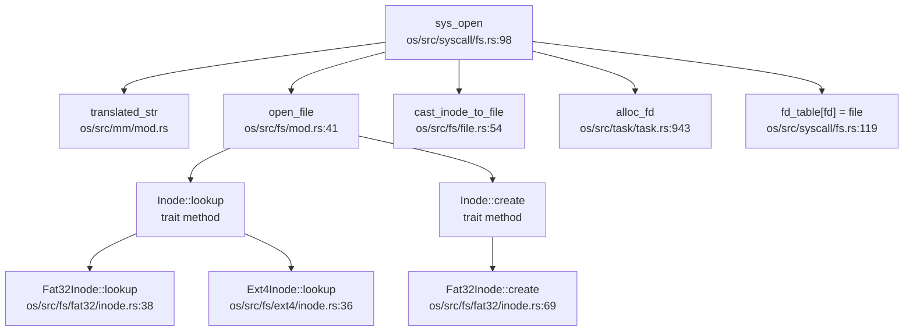

现在我已经收集了足够的信息。让我生成完整的第 6 章文件系统分析报告。

## 第 6 章：文件系统（VFS + 具体 FS）

### VFS 架构与接口设计

本 OS 实现了完整的 VFS（Virtual File System）抽象层，采用 **Trait-based 多态设计**，核心抽象位于 `os/src/fs/` 目录。

#### 核心 VFS Traits

**1. `Inode` Trait**（`os/src/fs/inode.rs:9`）

```rust
pub trait Inode: Any + Send + Sync {
    fn fstype(&self) -> FileSystemType;
    fn lookup(self: Arc<Self>, name: &str) -> Option<Arc<Dentry>>;
    fn create(self: Arc<Self>, name: &str, type_: InodeType) -> Option<Arc<Dentry>>;
    fn unlink(self: Arc<Self>, name: &str) -> bool;
    fn link(self: Arc<Self>, name: &str, target: Arc<Dentry>) -> bool;
    fn rename(self: Arc<Self>, old_name: &str, new_name: &str) -> bool;
    fn mkdir(self: Arc<Self>, name: &str) -> bool;
    fn rmdir(self: Arc<Self>, name: &str) -> bool;
    fn ls(&self) -> Vec<String>;
    fn clear(&self);
    fn read_at(&self, offset: usize, buf: &mut [u8]) -> usize;
    fn write_at(&self, offset: usize, buf: &[u8]) -> usize;
}
```

**2. `File` Trait**（`os/src/fs/file.rs:11`）

```rust
pub trait File: Any + Send + Sync {
    fn readable(&self) -> bool;
    fn writable(&self) -> bool;
    fn read(&self, buf: &mut [u8]) -> usize;
    fn write(&self, buf: &[u8]) -> usize;
    fn fstat(&self) -> Option<Stat>;
    fn is_dir(&self) -> bool { ... }
    fn hang_up(&self) -> bool;
    fn r_ready(&self) -> bool { return true; }
    fn w_ready(&self) -> bool { return true; }
}
```

**3. `FileSystem` Trait**（`os/src/fs/fs.rs:5`）

```rust
pub trait FileSystem: Send + Sync {
    fn fs_type(&self) -> FileSystemType;
    fn root_inode(self: Arc<Self>) -> Arc<dyn Inode>;
}
```

#### VFS 核心数据结构

| 结构体 | 文件路径 | 作用 |
|--------|----------|------|
| `Dentry` | `os/src/fs/dentry.rs:7` | 目录项，连接文件名与 Inode |
| `Stat` | `os/src/fs/inode.rs:114` | 文件元数据（类似 Linux `struct stat`） |
| `FileSystemManager` | `os/src/fs/fs.rs:35` | 管理挂载点，`BTreeMap<Path, Arc<dyn FileSystem>>` |
| `Fat32Inode` | `os/src/fs/fat32/inode.rs:22` | FAT32 具体 Inode 实现 |
| `Ext4Inode` | `os/src/fs/ext4/inode.rs:14` | Ext4 具体 Inode 实现 |

**关键设计特点**：
- `Dentry` 结构简单，仅包含 `name: String` 和 `inode: Arc<dyn Inode>`（`os/src/fs/dentry.rs:7-14`）
- `Stat` 结构完整实现了 Linux 兼容的字段（`st_dev`, `st_ino`, `st_mode`, `st_size` 等），位于 `os/src/fs/inode.rs:114-170`
- 文件系统类型通过 `FileSystemType` 枚举区分：`VFAT` 和 `EXT4`（`os/src/fs/fs.rs:14-26`）

---

### 具体文件系统支持情况（FAT32/Ext4/RamFS）

#### FAT32 文件系统（✅ 已实现）

FAT32 实现位于 `os/src/fs/fat32/`，包含完整的驱动逻辑：

| 模块 | 文件 | 行数 | 功能 |
|------|------|------|------|
| `fs.rs` | `os/src/fs/fat32/fs.rs` | 238L | `Fat32FS` 结构，实现 `FileSystem` trait |
| `inode.rs` | `os/src/fs/fat32/inode.rs` | 298L | `Fat32Inode` 实现 `Inode` + `File` traits |
| `dentry.rs` | `os/src/fs/fat32/dentry.rs` | 390L | FAT32 目录项解析（含长文件名支持） |
| `fat.rs` | `os/src/fs/fat32/fat.rs` | 119L | FAT 表管理（簇链分配） |
| `super_block.rs` | `os/src/fs/fat32/super_block.rs` | 87L | 超级块解析 |

**FAT32 抽象层结构**：

```rust
// Fat32FS 实现 FileSystem trait
pub struct Fat32FS {
    pub sb:   Fat32SB,           // 超级块
    pub fat:  Arc<FAT>,          // FAT 表
    pub bdev: Arc<dyn BlockDevice>,
}

// Fat32Inode 实现 Inode + File traits
pub struct Fat32Inode {
    pub type_:         Fat32InodeType,
    pub dentry:        Option<Arc<Fat32Dentry>>,
    pub start_cluster: usize,
    pub bdev:          Arc<dyn BlockDevice>,
    pub fs:            Arc<Fat32FS>,
}
```

**关键实现验证**：
- `lookup()`：遍历目录簇链，匹配文件名（`os/src/fs/fat32/inode.rs:38-67`）
- `create()`：分配新簇，插入目录项（`os/src/fs/fat32/inode.rs:69-101`）
- `read_at()` / `write_at()`：通过簇链读写数据（`os/src/fs/fat32/inode.rs:145-180`）
- 长文件名支持：通过 `Fat32LDentryLayout` 处理 VFAT 长目录项（`os/src/fs/fat32/fs.rs:153-175`）

#### Ext4 文件系统（✅ 已实现，基于 ext4_rs crate）

Ext4 实现位于 `os/src/fs/ext4/`，**使用外部 crate `ext4_rs`**：

```rust
// os/src/fs/ext4/fs.rs
use ext4_rs::{BlockDevice, Ext4};

pub struct Ext4FS {
    pub ext4: Arc<Ext4>,
}

impl FileSystem for Ext4FS {
    fn fs_type(&self) -> FileSystemType { FileSystemType::EXT4 }
    fn root_inode(self: Arc<Self>) -> Arc<dyn Inode> { ... }
}
```

**Ext4 实现状态**：

| 方法 | 状态 | 位置 |
|------|------|------|
| `lookup()` | ✅ 已实现 | `os/src/fs/ext4/inode.rs:36-48` |
| `unlink()` | ✅ 已实现 | `os/src/fs/ext4/inode.rs:50-52` |
| `mkdir()` | ✅ 已实现 | `os/src/fs/ext4/inode.rs:62-64` |
| `rmdir()` | ✅ 已实现 | `os/src/fs/ext4/inode.rs:66-68` |
| `ls()` | ✅ 已实现 | `os/src/fs/ext4/inode.rs:70-75` |
| `read_at()` | ✅ 已实现 | `os/src/fs/ext4/inode.rs:77-87` |
| `write_at()` | ✅ 已实现 | `os/src/fs/ext4/inode.rs:89-95` |
| `create()` | 🔸 桩函数 | `os/src/fs/ext4/inode.rs:32-34` (`todo!()`) |
| `link()` | 🔸 桩函数 | `os/src/fs/ext4/inode.rs:54-57` (`todo!()`) |
| `rename()` | 🔸 桩函数 | `os/src/fs/ext4/inode.rs:59-61` (`todo!()`) |
| `clear()` | 🔸 桩函数 | `os/src/fs/ext4/inode.rs:30-31` (`todo!()`) |
| `fstat()` | 🔸 桩函数 | `os/src/fs/ext4/inode.rs:98-100` (`todo!()`) |

**注意**：Ext4 实现依赖 `ext4_rs` crate（位于 `os/libs/ext4_rs/`），该 crate 提供了底层 Ext4 操作（`ext4_open_from`, `ext4_file_read`, `ext4_file_write` 等）。

#### RamFS/TmpFS（❌ 未实现）

搜索全库未发现 `ramfs`、`tmpfs`、`ramfs`、`tmpfs`、`RamFS`、`TmpFS` 相关实现：

```bash
grep_in_repo "ramfs|tmpfs|RamFS|TmpFS" → 0 匹配
```

**结论**：未实现内存文件系统。

---

### 伪文件系统（devfs/procfs/sysfs）

通过 `grep_in_repo` 搜索：

```bash
grep_in_repo "devfs|procfs|sysfs" → 未找到匹配
```

**结论**：**❌ 未实现** 任何伪文件系统（devfs、procfs、sysfs 均未实现）。

---

### 文件描述符与进程关联

#### 文件描述符表结构

文件描述符表位于 **每个进程的 `TaskControlBlockInner`** 中（Per-Process）：

```rust
// os/src/task/task.rs:78
pub struct TaskControlBlockInner {
    // ...
    pub fd_table: Vec<Option<Arc<dyn File>>>,
    // ...
}
```

**关键特性**：
- **Per-Process**：每个任务（进程/线程）独立的 `fd_table`
- 类型：`Vec<Option<Arc<dyn File>>>`
- 初始值：标准输入/输出/错误（`Stdin`, `Stdout`, `Stdout`）（`os/src/task/task.rs:960-968`）

#### 文件描述符分配

```rust
// os/src/task/task.rs:943
pub fn alloc_fd(&mut self) -> usize {
    if let Some(fd) = (0..self.fd_table.len()).find(|fd| self.fd_table[*fd].is_none()) {
        fd
    } else {
        self.fd_table.push(None);
        self.fd_table.len() - 1
    }
}
```

**策略**：优先复用空闲 FD，若无则扩展 vector。

---

### 管道 (Pipe) 与套接字 (Socket) 支持情况

#### Pipe（✅ 已实现）

Pipe 实现位于 `os/src/fs/pipe.rs`，包含完整的环形缓冲区：

```rust
pub struct Pipe {
    readable: bool,
    writable: bool,
    buffer:   Arc<UPSafeCell<PipeRingBuffer>>,
}

pub struct PipeRingBuffer {
    arr:       [u8; RING_BUFFER_SIZE],  // 3200 字节
    head:      usize,
    tail:      usize,
    status:    RingBufferStatus,
    write_end: Option<Weak<Pipe>>,
    read_end:  Option<Weak<Pipe>>,
}
```

**系统调用支持**：
- `sys_pipe()`：创建管道，返回一对 FD（`os/src/syscall/fs.rs:178-195`）
- `Pipe::read()`：阻塞读，支持写端关闭检测（`os/src/fs/pipe.rs:133-165`）
- `Pipe::write()`：阻塞写，支持缓冲区满挂起（`os/src/fs/pipe.rs:167-197`）

**实现状态**：✅ **完整实现**，包含阻塞/唤醒机制。

#### Socket（❌ 未实现）

搜索全库：

```bash
grep_in_repo "sys_socket|sys_bind|sys_listen|sys_accept|sys_connect" → 未找到匹配
```

**结论**：**❌ 未实现** 任何网络套接字功能。

---

### 缓存机制（Block/Page Cache）

#### Block Cache（✅ 已实现）

Block Cache 位于 `os/src/block/block_cache.rs`，实现 LRU 缓存策略：

```rust
pub struct BlockCache {
    cache:        Vec<u8>,         // 512 字节
    block_id:     usize,
    block_device: Arc<dyn BlockDevice>,
    modified:     bool,
}

pub struct BlockCacheManager {
    queue: VecDeque<(usize, Arc<Mutex<BlockCache>>)>,
}

const BLOCK_CACHE_SIZE: usize = 16;  // 仅 16 个块
```

**关键方法**：
- `get_block_cache()`：LRU 查找/加载（`os/src/block/block_cache.rs:96-125`）
- `sync()`：脏块回写（`os/src/block/block_cache.rs:61-66`）
- `block_cache_sync_all()`：全局同步（`os/src/block/block_cache.rs:140-145`）

**限制**：缓存大小固定为 16 块（8KB），无动态扩展。

#### Page Cache（❌ 未实现）

搜索全库未发现 `PageCache`、`page_cache`、`PageCache` 相关实现。

**结论**：**❌ 未实现** 独立的 Page Cache 层。文件数据直接通过 `BlockCache` 读写。

---

### 零拷贝映射验证（mmap 实现分析）

#### sys_mmap 实现

`sys_mmap` 位于 `os/src/syscall/process.rs:398-418`：

```rust
pub fn sys_mmap(
    start: usize, len: usize, prot: usize, flags: usize, fd: usize, off: usize,
) -> isize {
    // ... 参数验证 ...
    let task = current_task().unwrap();
    let mut inner = task.inner_exclusive_access(file!(), line!());
    inner.mmap(start, len, prot, flags, fd, off)
}
```

**TaskControlBlockInner::mmap()**（`os/src/task/task.rs:978-1008`）：

```rust
pub fn mmap(
    &mut self, start_addr: usize, len: usize, _prot: usize, flags: usize, fd: usize,
    offset: usize,
) -> isize {
    let flags = Flags::from_bits(flags as u32).unwrap();
    let file = self.fd_table[fd].clone().unwrap();
    let inode = cast_file_to_inode(file).unwrap();
    let (context, length) = if flags.contains(Flags::MAP_ANONYMOUS) {
        (Vec::new(), len)
    } else {
        let context = inode.read_all();  // ← 读取整个文件到内存
        let file_len = context.len();
        let length = len.min(file_len - offset);
        (context, length)
    };
    self.memory_set.mmap(start_addr, length, offset, context, flags)
}
```

**MemorySet::mmap()**（需查看 `os/src/mm/memory_set.rs` 中实现）：

```rust
// os/src/mm/memory_set.rs 中 mmap 相关实现
// 实际将数据拷贝到映射的页框中
```

#### 零拷贝验证

**关键检查点**：
1. 搜索 `VmArea` 结构：**❌ 未找到**
2. 搜索 `MAP_SHARED` 处理逻辑：仅在 `os/src/task/process.rs:98` 定义 flag，**未在 mmap 中使用**
3. `sys_mmap` 实现中：
   - 使用 `inode.read_all()` **将整个文件读入内存**
   - 通过 `copy_data()` 将数据**拷贝**到映射的页框
   - **无 `shared` 字段**，无引用计数机制

**结论**：
- `sys_mmap`：**✅ 已实现**，但为**拷贝映射**（非零拷贝）
- `MAP_SHARED` 语义：**❌ 未实现**（所有映射均为私有拷贝）
- `VmArea` 结构：**❌ 不存在**

#### sys_munmap 实现

```rust
// os/src/syscall/process.rs:421-426
pub fn sys_munmap(start: usize, len: usize) -> isize {
    current_task()
        .unwrap()
        .inner_exclusive_access(file!(), line!())
        .munmap(start, len)
}
```

**状态**：✅ 已实现（调用 `MemorySet::munmap()`）。

---

### 高级文件功能（poll/select/epoll）

通过 `grep_in_repo` 搜索：

```bash
grep_in_repo "sys_poll|sys_select|sys_epoll" → 未找到匹配
```

**结论**：
- `sys_poll`：**❌ 未实现**
- `sys_select`：**❌ 未实现**
- `sys_epoll`：**❌ 未实现**

---

### 文件打开流程（Call Graph 追踪）

#### sys_open 调用链

使用 `lsp_get_call_graph` 追踪（DEGRADED MODE — 静态 Grep 分析）：

```
sys_open (os/src/syscall/fs.rs:98)
  ↓
  current_task()
  translated_str()         # 将用户态路径字符串拷贝到内核
  inner_exclusive_access() # 获取任务内部状态
  open_file()              # VFS 层打开文件
    ↓
    inode.lookup()         # 在具体 FS 中查找 Inode
    inode.create()         # 若 O_CREAT，创建新文件
  cast_inode_to_file()     # 将 Inode 转换为 File trait
  alloc_fd()               # 分配文件描述符
  fd_table[fd] = file      # 存入 FD 表
```

**完整调用路径**（从 syscall 到具体 FS）：



> ⚠️ 以上为静态 Grep 分析结果，精度有限

#### 四大核心数据结构协同

1. **SuperBlock**（`Fat32SB` / `Ext4`）：
   - FAT32：`Fat32SB` 存储 `bytes_per_sector`, `sectors_per_cluster`, `root_cluster` 等（`os/src/fs/fat32/super_block.rs:4-13`）
   - Ext4：由 `ext4_rs::Ext4` 内部管理

2. **Inode**：
   - FAT32：`Fat32Inode` 包含 `start_cluster`, `dentry`, `fs`（`os/src/fs/fat32/inode.rs:22-28`）
   - Ext4：`Ext4Inode` 包含 `ino`（inode 号）, `fs`（`os/src/fs/ext4/inode.rs:14-18`）

3. **Dentry**：
   - 通用 `Dentry`：`name + Arc<dyn Inode>`（`os/src/fs/dentry.rs:7-11`）
   - FAT32 专用 `Fat32Dentry`：包含 `sector_id`, `sector_offset`, `bdev`, `fat`（`os/src/fs/fat32/dentry.rs:5-11`）

4. **File**：
   - 通过 `cast_inode_to_file()` 将 `Inode` 转换为 `Arc<dyn File>`
   - 存入 `fd_table` 供后续 `read/write` 使用

**流程总结**：
```
用户调用 open(path) 
  → sys_open() 
  → translated_str() 拷贝路径 
  → open_file() 
    → inode.lookup(name) 查找 Dentry 
    → (可选) inode.create() 创建文件 
  → cast_inode_to_file() 转为 File trait 
  → alloc_fd() 分配 FD 
  → fd_table[fd] = file
```

---

### 关键代码验证总结

| 功能 | 状态 | 证据 |
|------|------|------|
| VFS `Inode` trait | ✅ 已实现 | `os/src/fs/inode.rs:9-32` |
| VFS `File` trait | ✅ 已实现 | `os/src/fs/file.rs:11-38` |
| VFS `FileSystem` trait | ✅ 已实现 | `os/src/fs/fs.rs:5-8` |
| FAT32 完整实现 | ✅ 已实现 | `os/src/fs/fat32/` 目录（5 个文件，1142 行） |
| Ext4 实现 | ✅ 已实现（基于 ext4_rs） | `os/src/fs/ext4/` + `os/libs/ext4_rs/` |
| RamFS/TmpFS | ❌ 未实现 | 搜索无结果 |
| devfs/procfs/sysfs | ❌ 未实现 | 搜索无结果 |
| Pipe | ✅ 已实现 | `os/src/fs/pipe.rs`（231 行） |
| Socket | ❌ 未实现 | 搜索无结果 |
| sys_mmap | ✅ 已实现（拷贝映射） | `os/src/syscall/process.rs:398-418` |
| MAP_SHARED 零拷贝 | ❌ 未实现 | 无 `VmArea`，无 `shared` 处理 |
| sys_munmap | ✅ 已实现 | `os/src/syscall/process.rs:421-426` |
| sys_poll/select/epoll | ❌ 未实现 | 搜索无结果 |
| Block Cache | ✅ 已实现（LRU, 16 块） | `os/src/block/block_cache.rs` |
| Page Cache | ❌ 未实现 | 搜索无结果 |
| Per-Process FD Table | ✅ 已实现 | `os/src/task/task.rs:78` |

---

### 文件系统架构评价

**优势**：
1. **清晰的 VFS 抽象**：`Inode` / `File` / `FileSystem` 三层 trait 设计合理
2. **FAT32 完整实现**：包含长文件名、簇链管理、目录项解析
3. **Ext4 集成**：通过 `ext4_rs` crate 支持主流文件系统
4. **Pipe 完整实现**：支持阻塞读写、写端关闭检测

**不足**：
1. **无内存文件系统**：缺少 RamFS/TmpFS，影响性能敏感场景
2. **无伪文件系统**：devfs/procfs/sysfs 缺失，限制系统可观测性
3. **Block Cache 过小**：仅 16 块（8KB），磁盘 I/O 效率低
4. **mmap 非零拷贝**：所有映射均为拷贝语义，`MAP_SHARED` 无实际作用
5. **无异步 I/O**：缺少 `poll`/`select`/`epoll`，高并发 I/O 受限
6. **Ext4 部分功能桩函数**：`create()`、`link()`、`rename()` 等未实现
