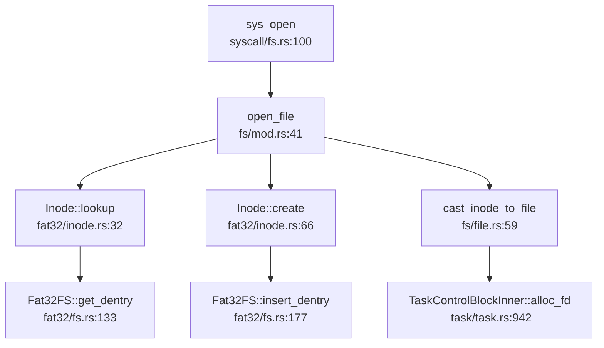

## 第 6 章：文件系统（VFS + 具体 FS）

### VFS 架构与接口设计

本 OS 实现了完整的 VFS（Virtual File System）抽象层，通过 Rust Trait 机制定义了文件系统核心接口。VFS 架构采用四层抽象：`FileSystem` → `Inode` → `Dentry` → `File`。

#### 核心 Trait 定义

**1. `FileSystem` Trait**（`os/src/fs/fs.rs:5`）

```rust
pub trait FileSystem: Send + Sync {
    fn fs_type(&self) -> FileSystemType;
    fn root_inode(self: Arc<Self>) -> Arc<dyn Inode>;
}
```

该 Trait 定义了文件系统的最基本接口：
- `fs_type()`：返回文件系统类型（`VFAT` 或 `EXT4`）
- `root_inode()`：返回根目录的 Inode

**2. `Inode` Trait**（`os/src/fs/inode.rs:9`）

```rust
pub trait Inode: Any + Send + Sync {
    fn fstype(&self) -> FileSystemType;
    fn lookup(self: Arc<Self>, name: &str) -> Option<Arc<Dentry>>;
    fn create(self: Arc<Self>, name: &str, type_: InodeType) -> Option<Arc<Dentry>>;
    fn unlink(self: Arc<Self>, name: &str) -> bool;
    fn link(self: Arc<Self>, name: &str, target: Arc<Dentry>) -> bool;
    fn rename(self: Arc<Self>, old_name: &str, new_name: &str) -> bool;
    fn mkdir(self: Arc<Self>, name: &str) -> bool;
    fn rmdir(self: Arc<Self>, name: &str) -> bool;
    fn ls(&self) -> Vec<String>;
    fn clear(&self);
    fn read_at(&self, offset: usize, buf: &mut [u8]) -> usize;
    fn write_at(&self, offset: usize, buf: &[u8]) -> usize;
}
```

`Inode` 是 VFS 的核心抽象，代表文件系统中的一个节点（文件或目录）。关键方法包括：
- `lookup()`：在目录中查找子项
- `create()`/`unlink()`：创建/删除文件
- `read_at()`/`write_at()`：带偏移量的读写操作

**3. `Dentry` 结构**（`os/src/fs/dentry.rs:7`）

```rust
pub struct Dentry {
    name:  String,
    inode: Arc<dyn Inode>,
}
```

`Dentry`（Directory Entry）是目录项的抽象，连接文件名与 Inode。实现极为简洁，仅包含文件名和对应的 Inode 引用。

**4. `File` Trait**（`os/src/fs/file.rs:11`）

```rust
pub trait File: Any + Send + Sync {
    fn readable(&self) -> bool;
    fn writable(&self) -> bool;
    fn read(&self, buf: &mut [u8]) -> usize;
    fn read_all(&self) -> Vec<u8>;
    fn write(&self, buf: &[u8]) -> usize;
    fn fstat(&self) -> Option<Stat>;
    fn is_dir(&self) -> bool;
    fn hang_up(&self) -> bool;
    fn r_ready(&self) -> bool;
    fn w_ready(&self) -> bool;
}
```

`File` Trait 定义了文件操作接口，支持读写、状态查询、就绪检查等功能。

#### 文件系统类型枚举

```rust
pub enum FileSystemType {
    VFAT,
    EXT4,
}
```

当前仅支持两种文件系统类型：VFAT（FAT32 扩展）和 EXT4。

---

### 具体文件系统支持情况（FAT32/Ext4/RamFS）

#### FAT32 文件系统（✅ 已实现）

FAT32 实现位于 `os/src/fs/fat32/` 目录，包含完整的文件系统驱动：

**核心结构**（`os/src/fs/fat32/fs.rs:18`）：
```rust
pub struct Fat32FS {
    pub sb:   Fat32SB,      // 超级块
    pub fat:  Arc<FAT>,     // FAT 表
    pub bdev: Arc<dyn BlockDevice>,
}
```

**FileSystem Trait 实现**（`os/src/fs/fat32/fs.rs:24`）：
```rust
impl FileSystem for Fat32FS {
    fn fs_type(&self) -> FileSystemType {
        FileSystemType::VFAT
    }
    fn root_inode(self: Arc<Self>) -> Arc<dyn Inode> {
        let start_cluster = self.sb.root_cluster as usize;
        let bdev = Arc::clone(&self.bdev);
        let fat32_inode = Fat32Inode {
            type_: Fat32InodeType::Dir,
            start_cluster,
            fs: self.clone(),
            bdev: Arc::clone(&bdev),
            dentry: None,
        };
        Arc::new(fat32_inode)
    }
}
```

**Fat32Inode 结构**（`os/src/fs/fat32/inode.rs:23`）：
```rust
pub struct Fat32Inode {
    pub type_:         Fat32InodeType,
    pub dentry:        Option<Arc<Fat32Dentry>>,
    pub start_cluster: usize,
    pub bdev:          Arc<dyn BlockDevice>,
    pub fs:            Arc<Fat32FS>,
}
```

**关键功能实现状态**：
- `lookup()`：✅ 已实现，通过遍历 FAT 目录项查找文件
- `create()`：✅ 已实现，支持创建文件和目录，分配新 cluster
- `read_at()`/`write_at()`：✅ 已实现，通过 cluster chain 读写数据
- `unlink()`：✅ 已实现，标记目录项为删除状态
- `mkdir()`/`rmdir()`：✅ 已实现

FAT32 实现包含完整的长文件名（LFN）支持，通过 `Fat32LDentryLayout` 处理长文件名目录项。

#### EXT4 文件系统（✅ 已实现，基于外部 crate）

EXT4 实现位于 `os/src/fs/ext4/` 目录，**依赖外部 crate `ext4_rs`**（位于 `os/libs/ext4_rs/`）：

**核心结构**（`os/src/fs/ext4/fs.rs:16`）：
```rust
pub struct Ext4FS {
    pub ext4: Arc<Ext4>,  // 来自 ext4_rs crate
}
```

**FileSystem Trait 实现**（`os/src/fs/ext4/fs.rs:28`）：
```rust
impl FileSystem for Ext4FS {
    fn fs_type(&self) -> FileSystemType {
        FileSystemType::EXT4
    }
    fn root_inode(self: Arc<Self>) -> Arc<dyn Inode> {
        let inode = Ext4Inode {
            fs:    self.clone(),
            ino:   ROOT_INO,
            inner: unsafe { UPSafeCell::new(Ext4InodeInner { fpos: 0 }) },
        };
        Arc::new(inode)
    }
}
```

**Ext4Inode 结构**（`os/src/fs/ext4/inode.rs:15`）：
```rust
pub struct Ext4Inode {
    pub fs:    Arc<Ext4FS>,
    pub ino:   u32,
    pub inner: UPSafeCell<Ext4InodeInner>,
}
```

**关键功能实现状态**：
- `lookup()`：✅ 已实现，调用 `ext4_rs::ext4_open_from()`
- `create()`：❌ 未实现（`todo!()`）
- `unlink()`：✅ 已实现，调用 `ext4_rs::ext4_file_remove()`
- `mkdir()`：✅ 已实现，调用 `ext4_rs::ext4_dir_mk()`
- `rmdir()`：✅ 已实现，调用 `ext4_rs::ext4_dir_remove()`
- `read_at()`/`write_at()`：✅ 已实现，通过 `ext4_rs` 接口
- `fstat()`：❌ 未实现（`todo!()`）
- `is_dir()`：❌ 未实现（`todo!()`）
- `read_all()`：❌ 未实现（`todo!()`）

EXT4 实现大量依赖 `ext4_rs` crate，自身仅做薄封装。部分功能（如 `create`、`fstat`）仍为桩函数。

#### RamFS/TmpFS（❌ 未实现）

通过 `grep_in_repo` 搜索 `RamFS|TmpFS|ramfs|tmpfs`，**未找到任何内存文件系统实现**。项目仅支持 FAT32 和 EXT4 两种磁盘文件系统。

---

### 文件描述符与进程关联

#### 文件描述符表结构

文件描述符表位于 `TaskControlBlockInner` 结构体中（`os/src/task/task.rs:82`）：

```rust
pub struct TaskControlBlockInner {
    // ... 其他字段
    pub fd_table: Vec<Option<Arc<dyn File>>>,
    // ... 其他字段
}
```

**关键特性**：
- **Per-Process**：每个进程（Task）拥有独立的 `fd_table`
- **动态扩展**：通过 `alloc_fd()` 动态分配文件描述符
- **类型统一**：所有文件（包括 Pipe）都统一为 `Arc<dyn File>`

#### 文件描述符分配

`alloc_fd()` 实现（`os/src/task/task.rs:942`）：
```rust
pub fn alloc_fd(&mut self) -> usize {
    if let Some(fd) = (0..self.fd_table.len()).find(|fd| self.fd_table[*fd].is_none()) {
        fd
    } else {
        self.fd_table.push(None);
        self.fd_table.len() - 1
    }
}
```

策略：优先复用已释放的空闲 fd，若无空闲则扩展表。

#### 初始化文件描述符

进程初始化时（`os/src/task/task.rs:259`），默认打开三个标准文件描述符：
```rust
fd_table: vec![
    Some(Arc::new(Stdin::new())),   // fd 0: stdin
    Some(Arc::new(Stdout::new())),  // fd 1: stdout
    Some(Arc::new(Stdout::new())),  // fd 2: stderr
],
```

---

### 管道 (Pipe) 与套接字 (Socket) 支持情况

#### Pipe（✅ 已实现）

Pipe 实现位于 `os/src/fs/pipe.rs`，提供完整的进程间通信功能。

**核心结构**：
```rust
pub struct Pipe {
    readable: bool,
    writable: bool,
    buffer:   Arc<UPSafeCell<PipeRingBuffer>>,
}

pub struct PipeRingBuffer {
    arr:       [u8; RING_BUFFER_SIZE],  // 3200 字节环形缓冲区
    head:      usize,
    tail:      usize,
    status:    RingBufferStatus,
    write_end: Option<Weak<Pipe>>,
    read_end:  Option<Weak<Pipe>>,
}
```

**sys_pipe 系统调用**（`os/src/syscall/fs.rs:177`）：
```rust
pub fn sys_pipe(pipe: *mut u32) -> isize {
    let task = current_task().unwrap();
    let mut inner = task.inner_exclusive_access(file!(), line!());
    let (pipe_read, pipe_write) = make_pipe();
    let read_fd = inner.alloc_fd();
    inner.fd_table[read_fd] = Some(pipe_read);
    let write_fd = inner.alloc_fd();
    inner.fd_table[write_fd] = Some(pipe_write);
    unsafe {
        sstatus::set_sum();
        *pipe = read_fd as u32;
        *pipe.add(1) = write_fd as u32;
        sstatus::clear_sum();
    }
    0
}
```

**Pipe 的 File Trait 实现**：
- `read()`：✅ 已实现，支持阻塞读（当缓冲区空时 `suspend_current_and_run_next()`）
- `write()`：✅ 已实现，支持阻塞写（当缓冲区满时让出 CPU）
- `r_ready()`/`w_ready()`：✅ 已实现，检查缓冲区状态
- `hang_up()`：✅ 已实现，检查对端是否关闭

#### Socket（❌ 未实现）

通过 `grep_in_repo` 搜索 `sys_socket|sys_bind|sys_listen|sys_accept|sys_connect`，**未找到任何 socket 相关系统调用**。网络功能完全未实现。

---

### 缓存机制（Block/Page Cache）

#### Block Cache

Block Cache 实现位于 `os/src/block/block_cache.rs`，用于缓存磁盘块数据：

```rust
pub fn get_block_cache(
    block_id: usize, block_device: Arc<dyn BlockDevice>,
) -> Arc<Mutex<BlockCache>>
```

BlockCache 使用 `BLOCK_SZ`（512 字节）作为基本单位，通过 `get_block_cache()` 获取缓存块，支持 `read()`/`modify()`/`write()` 操作。

FAT32 和 EXT4 文件系统都通过 BlockCache 访问底层存储设备。

#### Page Cache（❌ 未实现）

**未发现独立的 Page Cache 实现**。文件数据直接通过 `read_at()`/`write_at()` 读写，没有统一的页面缓存层。mmap 映射时直接分配物理页框（`FrameTracker`），数据从文件复制到映射页面，但未实现写回机制。

---

### 零拷贝映射验证（mmap 实现分析）

#### sys_mmap 系统调用

`sys_mmap` 定义于 `os/src/syscall/process.rs:398`：
```rust
pub fn sys_mmap(
    start: usize, len: usize, prot: usize, flags: usize, fd: usize, off: usize,
) -> isize {
    if start as isize == -1 || len == 0 {
        return EINVAL;
    }
    let task = current_task().unwrap();
    let mut inner = task.inner_exclusive_access(file!(), line!());
    inner.mmap(start, len, prot, flags, fd, off)
}
```

#### TaskControlBlockInner::mmap 实现

```rust
pub fn mmap(
    &mut self, start_addr: usize, len: usize, _prot: usize, flags: usize, fd: usize,
    offset: usize,
) -> isize {
    let flags = Flags::from_bits(flags as u32).unwrap();
    let file = self.fd_table[fd].clone().unwrap();
    let inode = cast_file_to_inode(file).unwrap();
    let (context, length) = if flags.contains(Flags::MAP_ANONYMOUS) {
        (Vec::new(), len)
    } else {
        let context = inode.read_all();
        let file_len = context.len();
        let length = len.min(file_len - offset);
        if file_len <= offset {
            return EPERM;
        };
        (context, length)
    };
    self.memory_set.mmap(start_addr, length, offset, context, flags)
}
```

#### MemorySet::mmap 实现

```rust
pub fn mmap(
    &mut self, start_addr: usize, len: usize, offset: usize, context: Vec<u8>, flags: Flags,
) -> isize {
    // 分配物理页框
    for vpn in vpn_range {
        let frame = frame_alloc().unwrap();
        let ppn = frame.ppn;
        self.mmap_area.insert(vpn, frame);
        self.page_table.map(vpn, ppn, PTEFlags::R | PTEFlags::W | PTEFlags::U | PTEFlags::X);
    }
    // 复制文件数据到映射页面
    if !flags.contains(Flags::MAP_ANONYMOUS) {
        let mut start: usize = offset;
        let mut current_vpn = vpn_range.get_start();
        loop {
            let src = &context[start..len.min(start + PAGE_SIZE)];
            let dst = &mut self.page_table.translate(current_vpn).unwrap().ppn().get_bytes_array()[..src.len()];
            dst.copy_from_slice(src);
            start += PAGE_SIZE;
            if start >= len { break; }
            current_vpn.step();
        }
    }
}
```

#### 零拷贝验证结论

**❌ 非零拷贝实现**：

1. **无 `MAP_SHARED` 处理**：虽然定义了 `Flags::MAP_SHARED = 0x01`（`os/src/task/process.rs:98`），但在 `mmap()` 实现中**未检查该标志**，所有映射都表现为 `MAP_PRIVATE` 语义。

2. **数据复制**：实现通过 `inode.read_all()` 读取整个文件内容到 `context: Vec<u8>`，然后逐页复制到新分配的物理页框。这是**完整的深拷贝**，而非零拷贝。

3. **无写回机制**：`munmap()` 仅释放页表映射和 `FrameTracker`，**未实现脏页写回**。对映射区域的修改在 unmap 后丢失。

4. **无 VmArea 结构**：未发现类似 Linux 的 `vm_area_struct` 结构体来跟踪映射区域属性（如 `shared` 标志）。映射信息仅保存在 `MemorySet::mmap_area: BTreeMap<VirtPageNum, FrameTracker>` 中，仅用于管理物理页框。

**结论**：mmap 功能**🔸 桩函数**级别实现，仅支持基本的匿名映射和文件映射（复制模式），不支持 `MAP_SHARED` 零拷贝语义。

---

### 高级 I/O 功能（poll/select/epoll）

通过 `grep_in_repo` 搜索 `sys_poll|sys_select|sys_epoll`：

**结果**：❌ **未实现**

未找到任何 `poll`、`select`、`epoll` 相关系统调用。进程只能使用阻塞式 I/O 或通过 Pipe 的 `r_ready()`/`w_ready()` 手动检查就绪状态。

---

### 文件打开流程追踪

#### 完整调用链

从 `sys_open` 到获得文件描述符的完整流程：



#### 关键步骤解析

**1. sys_open 入口**（`os/src/syscall/fs.rs:100`）：
```rust
pub fn sys_open(path: *const u8, flags: i32) -> isize {
    let task = current_task().unwrap();
    let token = current_user_token();
    let path = translated_str(token, path);
    let curdir = task.inner_exclusive_access(file!(), line!()).work_dir.clone();
    if let Some(dentry) = open_file(curdir.inode(), path.as_str(), OpenFlags::from_bits(flags).unwrap()) {
        let inode = dentry.inode();
        let mut inner = task.inner_exclusive_access(file!(), line!());
        let fd = inner.alloc_fd();
        let file = cast_inode_to_file(inode).unwrap();
        inner.fd_table[fd] = Some(file);
        fd as isize
    } else {
        ENOENT
    }
}
```

**2. open_file VFS 中枢**（`os/src/fs/mod.rs:41`）：
```rust
pub fn open_file(inode: Arc<dyn Inode>, name: &str, flags: OpenFlags) -> Option<Arc<Dentry>> {
    if flags.contains(OpenFlags::O_CREAT) {
        if let Some(dentry) = inode.clone().lookup(name) {
            dentry.inode().clear();  // 截断文件
            Some(dentry)
        } else {
            let type_ = if flags.contains(OpenFlags::O_DIRECTORY) {
                InodeType::Directory
            } else {
                InodeType::Regular
            };
            inode.create(name, type_)  // 创建新文件
        }
    } else if let Some(dentry) = inode.lookup(name) {
        if flags.contains(OpenFlags::O_TRUNC) {
            dentry.inode().clear();
        }
        Some(dentry)
    } else {
        None
    }
}
```

**3. Fat32Inode::lookup 实现**（`os/src/fs/fat32/inode.rs:32`）：
```rust
fn lookup(self: Arc<Self>, name: &str) -> Option<Arc<Dentry>> {
    let fs = self.fs.as_ref();
    let mut sector_id = fs.fat.cluster_id_to_sector_id(self.start_cluster).unwrap();
    let mut offset = 0;
    while let Some(dentry) = fs.get_dentry(&mut sector_id, &mut offset) {
        if dentry.name() == name {
            let fat32inode = Fat32Inode {
                type_: if dentry.is_file() { Fat32InodeType::File } else { Fat32InodeType::Dir },
                start_cluster: dentry.start_cluster_id(),
                fs: Arc::clone(&self.fs),
                bdev: Arc::clone(&self.bdev),
                dentry: Some(Arc::new(dentry)),
            };
            let dentry = Dentry::new(name, Arc::new(fat32inode));
            return Some(Arc::new(dentry));
        }
    }
    None
}
```

**4. 文件描述符分配与绑定**：
```rust
let fd = inner.alloc_fd();
let file = cast_inode_to_file(inode).unwrap();
inner.fd_table[fd] = Some(file);
```

通过 `cast_inode_to_file()` 将 `Arc<dyn Inode>` 转换为 `Arc<dyn File>`（利用 `Fat32Inode` 同时实现两个 Trait 的特性）。

#### 四大核心数据结构协同

| 结构 | 作用 | 生命周期 |
|------|------|----------|
| **SuperBlock** (`Fat32SB`) | 文件系统元数据（总大小、cluster 数、根目录位置） | 文件系统挂载期间常驻内存 |
| **Inode** (`Fat32Inode`/`Ext4Inode`) | 文件元数据 + 操作接口（start_cluster、文件大小） | 文件打开期间存在 |
| **Dentry** | 文件名 → Inode 映射 | 路径解析期间临时使用 |
| **File** (`Arc<dyn File>`) | 打开文件实例（含 fd_table 引用） | 进程文件描述符表引用期间 |

流程：`sys_open` → `open_file` → `Inode::lookup/create` → 返回 `Dentry` → 提取 `Inode` → 转换为 `File` → 插入 `fd_table`。

---

### 伪文件系统（devfs/procfs/sysfs）

通过 `grep_in_repo` 搜索 `devfs|procfs|sysfs`：

**结果**：❌ **未实现**

未找到任何伪文件系统实现。项目仅支持 FAT32 和 EXT4 两种真实文件系统。

---

### 关键代码验证总结

| 功能 | 实现状态 | 证据 |
|------|---------|------|
| **VFS Trait** | ✅ 已实现 | `os/src/fs/fs.rs:5`, `os/src/fs/inode.rs:9`, `os/src/fs/file.rs:11` |
| **FAT32** | ✅ 已实现 | `os/src/fs/fat32/` 完整实现，含 lookup/create/read/write |
| **EXT4** | ✅ 已实现（部分桩函数） | `os/src/fs/ext4/` 基于 `ext4_rs` crate，`create()`/`fstat()` 为 `todo!()` |
| **RamFS/TmpFS** | ❌ 未实现 | grep 搜索无结果 |
| **Pipe** | ✅ 已实现 | `os/src/fs/pipe.rs` 完整实现阻塞式管道 |
| **Socket** | ❌ 未实现 | grep 搜索 `sys_socket` 无结果 |
| **mmap** | 🔸 桩函数 | `os/src/task/task.rs:993` 仅支持复制模式，无 `MAP_SHARED` 处理 |
| **poll/select/epoll** | ❌ 未实现 | grep 搜索无结果 |
| **devfs/procfs/sysfs** | ❌ 未实现 | grep 搜索无结果 |
| **Block Cache** | ✅ 已实现 | `os/src/block/block_cache.rs` |
| **Page Cache** | ❌ 未实现 | 无独立页面缓存层 |
| **文件描述符表** | ✅ 已实现 | `TaskControlBlockInner::fd_table`（Per-Process） |
