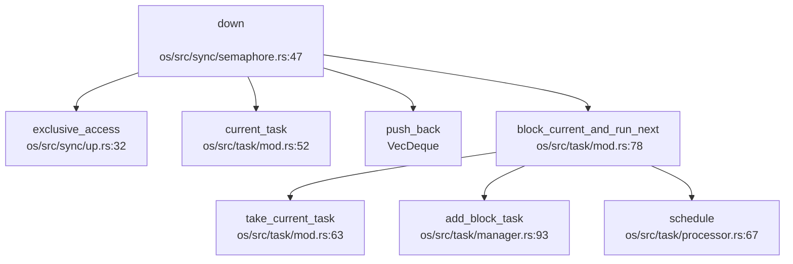

现在我已经收集了足够的信息来撰写第 8 章：同步互斥与进程间通信。让我整理分析结果并输出完整的 Markdown 报告。

## 第 8 章：同步互斥与进程间通信

### 同步与互斥原语（锁与原子操作）

本操作系统实现了多种同步原语，包括自旋锁（SpinLock）、信号量（Semaphore）和条件变量（Condvar，已注释）。所有锁机制均基于 Rust 标准库的原子操作实现。

#### 自旋锁实现

**文件位置**: `os/src/sync/mutex/spin_mutex.rs`

自旋锁的核心结构 `SpinMutex` 使用 `AtomicBool` 实现：

```rust
// os/src/sync/mutex/spin_mutex.rs:10-16
pub struct SpinMutex<T: ?Sized, S: MutexSupport> {
    lock:    AtomicBool,
    _marker: PhantomData<S>,
    data:    UnsafeCell<T>,
}
```

**原子操作机制**:
- 使用 `core::sync::atomic::{AtomicBool, Ordering}` 进行原子操作
- `lock()` 方法使用 `compare_exchange` 进行 CAS（Compare-And-Swap）操作：

```rust
// os/src/sync/mutex/spin_mutex.rs:55-72
pub fn lock(&self) -> impl DerefMut<Target = T> + '_ {
    let support_guard = S::before_lock();
    loop {
        self.wait_unlock();
        if self
            .lock
            .compare_exchange(false, true, Ordering::Acquire, Ordering::Relaxed)
            .is_ok()
        {
            break;
        }
    }
    MutexGuard {
        mutex: self,
        support_guard,
    }
}
```

**等待机制**: `wait_unlock()` 使用 `spin_loop` hint 进行忙等待，并包含死锁检测：

```rust
// os/src/sync/mutex/spin_mutex.rs:40-53
fn wait_unlock(&self) {
    let mut try_count = 0usize;
    while self.lock.load(Ordering::Relaxed) {
        core::hint::spin_loop();
        try_count += 1;
        if try_count == 0x10000000 {
            panic!("Mutex: deadlock detected! try_count > {:#x}\n", try_count);
        }
    }
}
```

**解锁机制**: 通过 `MutexGuard` 的 `Drop` trait 自动释放锁：

```rust
// os/src/sync/mutex/spin_mutex.rs:101-107
impl<'a, T: ?Sized, S: MutexSupport> Drop for MutexGuard<'a, T, S> {
    fn drop(&mut self) {
        self.mutex.lock.store(false, Ordering::Release);
        S::after_unlock(&mut self.support_guard);
    }
}
```

#### 中断屏蔽支持

**文件位置**: `os/src/sync/mutex/mod.rs`

系统实现了两种锁类型：
- `SpinLock<T>`: 普通自旋锁
- `SpinNoIrqLock<T>`: 关中断自旋锁（通过 `SieGuard` 管理中断状态）

```rust
// os/src/sync/mutex/mod.rs:9-11
pub type SpinLock<T> = SpinMutex<T, Spin>;
pub type SpinNoIrqLock<T> = SpinMutex<T, SpinNoIrq>;
```

`SpinNoIrq` 在加锁前关闭中断（`sstatus::clear_sie()`），解锁后恢复中断状态：

```rust
// os/src/sync/mutex/mod.rs:72-78
impl MutexSupport for SpinNoIrq {
    type GuardData = SieGuard;
    #[inline(always)]
    fn before_lock() -> Self::GuardData {
        SieGuard::new()
    }
    #[inline(always)]
    fn after_unlock(_: &mut Self::GuardData) {}
}
```

#### 信号量实现

**文件位置**: `os/src/sync/semaphore.rs`

信号量使用计数器和等待队列实现，支持阻塞式同步：

```rust
// os/src/sync/semaphore.rs:10-18
pub struct Semaphore {
    pub inner: UPSafeCell<SemaphoreInner>,
}

pub struct SemaphoreInner {
    pub count:      isize,
    pub wait_queue: VecDeque<Arc<TaskControlBlock>>,
}
```

**P 操作（down）**: 当计数器小于 0 时阻塞当前任务：

```rust
// os/src/sync/semaphore.rs:47-56
pub fn down(&self) {
    trace!("kernel: Semaphore::down");
    let mut inner = self.inner.exclusive_access(file!(), line!());
    inner.count -= 1;
    if inner.count < 0 {
        inner.wait_queue.push_back(current_task().unwrap());
        drop(inner);
        block_current_and_run_next();
    }
}
```

**V 操作（up）**: 唤醒等待队列中的任务：

```rust
// os/src/sync/semaphore.rs:35-44
pub fn up(&self) {
    trace!("kernel: Semaphore::up");
    let mut inner = self.inner.exclusive_access(file!(), line!());
    inner.count += 1;
    if inner.count <= 0 {
        if let Some(task) = inner.wait_queue.pop_front() {
            wakeup_task(task);
        }
    }
}
```

**实现状态**: ✅ **已实现** - 信号量具有完整的 PV 操作逻辑和等待队列管理。

### 等待队列实现机制

#### 等待队列数据结构

等待队列使用 `VecDeque<Arc<TaskControlBlock>>` 实现，存储在信号量的 `SemaphoreInner` 中：

```rust
// os/src/sync/semaphore.rs:16-18
pub struct SemaphoreInner {
    pub count:      isize,
    pub wait_queue: VecDeque<Arc<TaskControlBlock>>,
}
```

#### 任务阻塞与唤醒流程

**阻塞流程** (`block_current_and_run_next`):

```rust
// os/src/task/mod.rs:78-89
pub fn block_current_and_run_next() {
    trace!(
        "kernel: pid[{}] block_current_and_run_next",
        current_task().unwrap().pid.0
    );
    let task = take_current_task().unwrap();
    let mut task_inner = task.inner_exclusive_access(file!(), line!());
    let task_cx_ptr = &mut task_inner.task_cx as *mut TaskContext;
    task_inner.task_status = TaskStatus::Blocked;
    drop(task_inner);
    add_block_task(task);
    schedule(task_cx_ptr);
}
```

**唤醒流程** (`wakeup_task`):

```rust
// os/src/task/manager.rs:101-107
pub fn wakeup_task(task: Arc<TaskControlBlock>) {
    trace!("kernel: TaskManager::wakeup_task");
    let mut task_inner = task.inner_exclusive_access(file!(), line!());
    task_inner.task_status = TaskStatus::Ready;
    drop(task_inner);
    add_task(task);
}
```

#### 信号量 down() 调用链分析



> ⚠️ 以上为静态 Grep 分析结果，精度有限

### 进程间通信（Pipe/MsgQueue/Sem）

#### 管道（Pipe）实现

**文件位置**: `os/src/fs/pipe.rs`

管道使用**环形缓冲区（Ring Buffer）**实现，支持阻塞式读写：

```rust
// os/src/fs/pipe.rs:35-50
const RING_BUFFER_SIZE: usize = 3200;

pub struct PipeRingBuffer {
    arr:       [u8; RING_BUFFER_SIZE],
    head:      usize,
    tail:      usize,
    status:    RingBufferStatus,
    write_end: Option<Weak<Pipe>>,
    read_end:  Option<Weak<Pipe>>,
}
```

**环形缓冲区状态**:

```rust
// os/src/fs/pipe.rs:37-41
enum RingBufferStatus {
    Full,
    Empty,
    Normal,
}
```

**读操作实现**: 当缓冲区为空时阻塞等待：

```rust
// os/src/fs/pipe.rs:136-169
fn read(&self, buf: &mut [u8]) -> usize {
    trace!("kernel: Pipe::read");
    assert!(self.readable());
    let want_to_read = buf.len();
    let mut buf_iter = buf.into_iter();
    let mut already_read = 0usize;
    loop {
        let mut ring_buffer = self.buffer.exclusive_access(file!(), line!());
        let loop_read = ring_buffer.available_read();
        if loop_read == 0 {
            if ring_buffer.all_write_ends_closed() {
                return already_read;
            }
            drop(ring_buffer);
            suspend_current_and_run_next();
            trap::wait_return();
            continue;
        }
        for _ in 0..loop_read {
            if let Some(byte_ref) = buf_iter.next() {
                *byte_ref = ring_buffer.read_byte();
                already_read += 1;
                if already_read == want_to_read {
                    return want_to_read;
                }
            } else {
                return already_read;
            }
        }
    }
}
```

**写操作实现**: 当缓冲区满时阻塞等待：

```rust
// os/src/fs/pipe.rs:183-210
fn write(&self, buf: &[u8]) -> usize {
    trace!("kernel: Pipe::write");
    assert!(self.writable());
    let want_to_write = buf.len();
    let mut buf_iter = buf.into_iter();
    let mut already_write = 0usize;
    loop {
        let mut ring_buffer = self.buffer.exclusive_access(file!(), line!());
        let loop_write = ring_buffer.available_write();
        if loop_write == 0 {
            drop(ring_buffer);
            suspend_current_and_run_next();
            continue;
        }
        for _ in 0..loop_write {
            if let Some(byte_ref) = buf_iter.next() {
                ring_buffer.write_byte(unsafe { *byte_ref });
                already_write += 1;
                if already_write == want_to_write {
                    return want_to_write;
                }
            } else {
                return already_write;
            }
        }
    }
}
```

**管道创建系统调用** (`sys_pipe`):

```rust
// os/src/syscall/fs.rs:177-197
pub fn sys_pipe(pipe: *mut u32) -> isize {
    trace!("kernel:pid[{}] sys_pipe", current_task().unwrap().pid.0);
    let task = current_task().unwrap();
    let mut inner = task.inner_exclusive_access(file!(), line!());
    let (pipe_read, pipe_write) = make_pipe();
    let read_fd = inner.alloc_fd();
    inner.fd_table[read_fd] = Some(pipe_read);
    let write_fd = inner.alloc_fd();
    inner.fd_table[write_fd] = Some(pipe_write);
    unsafe {
        sstatus::set_sum();
        *pipe = read_fd as u32;
        *pipe.add(1) = write_fd as u32;
        sstatus::clear_sum();
    }
    0
}
```

**实现状态**: ✅ **已实现** - 管道具有完整的环形缓冲区实现，支持阻塞读写和写端关闭检测。

#### 消息队列（MessageQueue）

**实现状态**: ❌ **未实现**

通过全库搜索 `sys_msgget|msgget|msgsnd|msgrcv` 未找到任何匹配结果。系统未实现 System V 风格的消息队列 IPC 机制。

#### 共享内存（SharedMem）

**实现状态**: ❌ **未实现**

通过全库搜索 `sys_shmget|shmget|shmat|shmdt` 未找到任何匹配结果。系统未实现 System V 风格的共享内存 IPC 机制。

#### 信号量系统调用

**文件位置**: `os/src/syscall/mod.rs`

系统定义了信号量相关的系统调用号，但**全部被注释掉**：

```rust
// os/src/syscall/mod.rs:85-90
// SYSCALL_MUTEX_CREATE => sys_mutex_create(args[0] == 1),
// SYSCALL_MUTEX_LOCK => sys_mutex_lock(args[0]),
// SYSCALL_MUTEX_UNLOCK => sys_mutex_unlock(args[0]),
// SYSCALL_SEMAPHORE_CREATE => sys_semaphore_create(args[0]),
// SYSCALL_SEMAPHORE_UP => sys_semaphore_up(args[0]),
// SYSCALL_SEMAPHORE_DOWN => sys_semaphore_down(args[0]),
// SYSCALL_CONDVAR_CREATE => sys_condvar_create(),
// SYSCALL_CONDVAR_SIGNAL => sys_condvar_signal(args[0]),
// SYSCALL_CONDVAR_WAIT => sys_condvar_wait(args[0], args[1]),
```

在 `os/src/syscall/sync.rs` 中，`sys_mutex_create`、`sys_mutex_lock`、`sys_semaphore_create` 等函数实现**全部被注释**，仅保留了 `sys_sleep` 函数。

**实现状态**: 🔸 **桩函数** - 信号量内核数据结构已实现，但用户态系统调用接口被注释，无法从用户空间使用。

#### 条件变量（Condvar）

**文件位置**: `os/src/sync/condvar.rs`

条件变量的完整实现**全部被注释**：

```rust
// os/src/sync/condvar.rs:1-50
// //! Conditian variable
// use crate::sync::UPSafeCell;
// use crate::task::{block_current_and_run_next, current_task, wakeup_task, TaskControlBlock};
// ...
// pub struct Condvar {
//     pub inner: UPSafeCell<CondvarInner>,
// }
// ...
// pub fn wait(&self, mutex: Arc<dyn MutexSupport>) {
//     mutex.unlock();
//     inner.wait_queue.push_back(current_task().unwrap());
//     block_current_and_run_next();
//     mutex.lock();
// }
```

**实现状态**: 🔸 **桩函数** - 条件变量代码存在但被完全注释，未启用。

#### 信号（Signal）作为 IPC

**文件位置**: `os/src/syscall/process.rs`

系统实现了 `sys_kill` 系统调用用于发送信号：

```rust
// os/src/syscall/process.rs:340-352
pub fn sys_kill(pid: usize, signal: u32) -> isize {
    trace!("kernel:pid[{}] sys_kill", current_task().unwrap().pid.0);
    if let Some(process) = pid2process(pid) {
        if let Some(flag) = SignalFlags::from_bits(signal as usize) {
            process.inner_exclusive_access(file!(), line!()).signals |= flag;
            0
        } else {
            EINVAL
        }
    } else {
        ESRCH
    }
}
```

**信号处理时机**: 信号在 Trap 返回用户态前检查：

```rust
// os/src/trap/mod.rs:157-159
//check signals
if let Some((errno, msg)) = check_signals_of_current() {
    trace!("[kernel] trap_handler: .. check signals {}", msg);
    exit_current_and_run_next(errno);
}
```

**信号标志定义**: `os/src/task/signal.rs` 定义了完整的信号标志位（SIGHUP、SIGINT、SIGKILL 等共 32 种信号）。

**实现状态**: ✅ **已实现** - 信号机制完整实现，支持 `sys_kill` 发送信号，在 Trap 返回前检查待处理信号。

#### Futex

**实现状态**: ❌ **未实现**

通过全库搜索 `sys_futex|futex_wait|futex_wake` 未找到任何匹配结果。系统未实现 Futex 快速用户空间互斥量。

### 关键代码片段

#### 1. 自旋锁 CAS 操作

```rust
// os/src/sync/mutex/spin_mutex.rs:60-68
if self
    .lock
    .compare_exchange(false, true, Ordering::Acquire, Ordering::Relaxed)
    .is_ok()
{
    break;
}
```

#### 2. 管道环形缓冲区读写

```rust
// os/src/fs/pipe.rs:73-88
pub fn write_byte(&mut self, byte: u8) {
    self.status = RingBufferStatus::Normal;
    self.arr[self.tail] = byte;
    self.tail = (self.tail + 1) % RING_BUFFER_SIZE;
    if self.tail == self.head {
        self.status = RingBufferStatus::Full;
    }
}

pub fn read_byte(&mut self) -> u8 {
    self.status = RingBufferStatus::Normal;
    let c = self.arr[self.head];
    self.head = (self.head + 1) % RING_BUFFER_SIZE;
    if self.head == self.tail {
        self.status = RingBufferStatus::Empty;
    }
    c
}
```

#### 3. 信号量 PV 操作

```rust
// os/src/sync/semaphore.rs:35-56
pub fn up(&self) {
    let mut inner = self.inner.exclusive_access(file!(), line!());
    inner.count += 1;
    if inner.count <= 0 {
        if let Some(task) = inner.wait_queue.pop_front() {
            wakeup_task(task);
        }
    }
}

pub fn down(&self) {
    let mut inner = self.inner.exclusive_access(file!(), line!());
    inner.count -= 1;
    if inner.count < 0 {
        inner.wait_queue.push_back(current_task().unwrap());
        drop(inner);
        block_current_and_run_next();
    }
}
```

### 未实现/桩函数功能列表

| 功能 | 状态 | 说明 |
|------|------|------|
| **Futex** | ❌ 未实现 | 全库搜索未找到 `sys_futex` 相关代码 |
| **消息队列 (msgget/msgsnd/msgrcv)** | ❌ 未实现 | 全库搜索未找到相关系统调用 |
| **共享内存 (shmget/shmat/shmdt)** | ❌ 未实现 | 全库搜索未找到相关系统调用 |
| **Mutex 系统调用** | 🔸 桩函数 | `sys_mutex_create/lock/unlock` 在 `syscall/mod.rs` 中被注释 |
| **Semaphore 系统调用** | 🔸 桩函数 | `sys_semaphore_create/up/down` 在 `syscall/mod.rs` 中被注释 |
| **Condvar 系统调用** | 🔸 桩函数 | `sys_condvar_create/signal/wait` 在 `syscall/mod.rs` 中被注释 |
| **Condvar 内核实现** | 🔸 桩函数 | `os/src/sync/condvar.rs` 全部代码被注释 |

#### 已实现功能总结

| 功能 | 状态 | 文件位置 |
|------|------|----------|
| **SpinLock** | ✅ 已实现 | `os/src/sync/mutex/spin_mutex.rs` |
| **SpinNoIrqLock** | ✅ 已实现 | `os/src/sync/mutex/mod.rs` |
| **Semaphore 内核数据结构** | ✅ 已实现 | `os/src/sync/semaphore.rs` |
| **Pipe (环形缓冲区)** | ✅ 已实现 | `os/src/fs/pipe.rs` |
| **sys_pipe** | ✅ 已实现 | `os/src/syscall/fs.rs:177` |
| **sys_kill (信号)** | ✅ 已实现 | `os/src/syscall/process.rs:340` |
| **信号处理机制** | ✅ 已实现 | `os/src/trap/mod.rs:157` |

#### 架构特点

1. **原子操作**: 使用 Rust 标准库 `core::sync::atomic`，未使用自定义汇编
2. **等待队列**: 基于 `VecDeque<Arc<TaskControlBlock>>` 实现，通过 `block_current_and_run_next` 和 `wakeup_task` 管理任务状态
3. **管道实现**: 使用 3200 字节的环形缓冲区，支持阻塞读写和写端关闭检测
4. **信号机制**: 在 Trap 返回用户态前通过 `check_signals_of_current` 检查待处理信号
