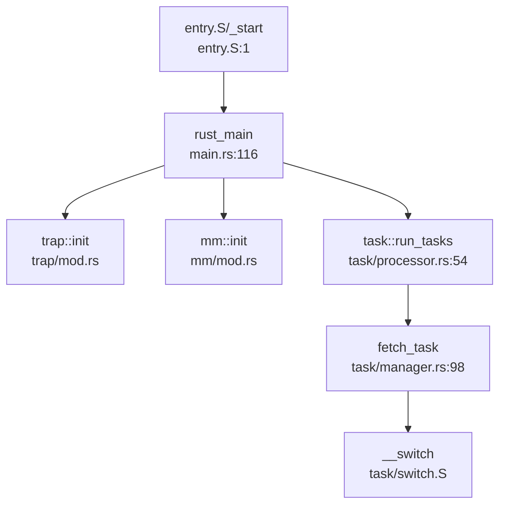

## 第 9 章：多核支持与并行机制

### 多核架构设计（SMP/AMP）

**结论：❌ 未实现多核支持，仅支持单核（Uniprocessor）**

本操作系统 **明确设计为单核系统**，所有核心数据结构均使用 `UPSafeCell`（Uniprocessor Safe Cell）进行包装，该结构在文档中明确标注：

> "N NOTICE: We should only use it in environment with uniprocessor（single cpu core）"

**证据引用**：
- `os/src/sync/up.rs:1-10`：`UPSafeCell` 定义，注释明确说明仅适用于单核环境
- `os/src/task/processor.rs:47`：全局 `PROCESSOR` 使用 `UPSafeCell<Processor>` 包装
- `os/src/task/manager.rs:88`：全局 `TASK_MANAGER` 使用 `UPSafeCell<TaskManager>` 包装

虽然代码中存在多核相关的**配置信息读取**，但**仅用于设备树解析**，并未实现真正的多核启动：

```rust
// os/src/utils/platform_info.rs:90-102
fn walk_dt(fdt: Fdt) -> MachineInfo {
    let mut machine = MachineInfo {
        smp:          0,  // 初始化为 0
        // ...
    };
    machine.smp = fdt.cpus().count();  // 仅从设备树读取 CPU 数量
}
```

在 `os/libs/visionfive2-sd/example/testos/` 测试代码中虽然定义了 `CORES = 5`，但这**仅用于分配多个栈空间**，并非真正的多核启动：

```rust
// os/libs/visionfive2-sd/example/testos/src/config.rs:1-2
pub const STACK_SIZE: usize = 4096 * CORES;
pub const CORES: usize = 5;
```

**架构设计总结**：
- **SMP/AMP**：❌ 未实现。无 BSP/AP 区分，无 Secondary CPU 启动代码
- **全局管理器**：使用 `UPSafeCell` + `RefCell` 实现运行时借用检查，依赖单核假设
- **抢占支持**：❌ 内核态不支持抢占（`up.rs` 注释明确说明）

---

### Secondary CPU 启动流程

**结论：❌ 未实现**

通过以下搜索验证：
- `grep "smp_boot|__cpu_up|start_secondary|smp_init"` → **0 结果**
- `grep "send_ipi|ipi_handler|ipi_send"` → **0 结果**

**单核启动流程**（仅 BSP 启动）：



**启动链分析**：
1. `entry.S` 汇编入口 → 设置栈指针 → 跳转 `rust_main`
2. `rust_main()` 初始化各子系统（内存、中断、文件系统）
3. `task::run_tasks()` 进入调度循环，**单核无限循环**

**关键代码**：
```rust
// os/src/task/processor.rs:54-90
pub fn run_tasks() {
    loop {
        let mut processor = PROCESSOR.exclusive_access(file!(), line!());
        if let Some(task) = fetch_task() {
            // ... 获取任务上下文
            unsafe {
                __switch(idle_task_cx_ptr, next_task_cx_ptr);
            }
        } else {
            return;  // 无任务时直接返回（单核空闲）
        }
    }
}
```

**缺失的多核启动机制**：
- ❌ 无 IPI（核间中断）发送/接收处理
- ❌ 无 Secondary CPU 入口点（如 `start_secondary()`）
- ❌ 无 CPU 热插拔或唤醒机制
- ❌ 无多核同步屏障（Barrier）

---

### 核间通信与 IPI 机制

**结论：❌ 未实现**

**搜索结果**：
- `send_ipi`、`ipi_handler`、`ipi_send` → **均未找到**
- 设备树中虽解析出 `plic`（平台级中断控制器）和 `clint`（核心本地中断）地址范围，但**未实现 IPI 发送逻辑**

```rust
// os/src/utils/platform_info.rs:30-38
pub struct MachineInfo {
    pub plic:  Range<usize>,  // 仅存储地址范围，未使用
    pub clint: Range<usize>,  // 仅存储地址范围，未使用
    // ...
}
```

**中断处理现状**：
- 仅实现**定时器中断**（`trap::enable_timer_interrupt`）
- 仅实现**用户态/内核态陷阱**（`trap_handler`）
- ❌ 无软中断（Software Interrupt）用于 IPI

---

### Per-CPU 变量与数据结构

**结论：❌ 未实现 Per-CPU 机制**

**搜索结果**：
- `PerCpu`、`per_cpu`、`percpu` → **0 结果**
- 无 Per-CPU 命名空间实现
- 无 `cpu_data` 结构体

**当前全局数据设计**：
所有全局可变状态使用 `UPSafeCell` 包装，**依赖单核假设**：

```rust
// os/src/sync/up.rs:14-20
pub struct UPSafeCell<T> {
    inner: RefCell<T>,  // 运行时借用检查
}

unsafe impl<T> Sync for UPSafeCell<T> {}  // 手动实现 Sync（单核安全）
```

**访问方式**：
```rust
// os/src/task/processor.rs:47
lazy_static! {
    pub static ref PROCESSOR: UPSafeCell<Processor> = 
        unsafe { UPSafeCell::new(Processor::new()) };
}

// 访问时需传入调用位置用于错误定位
PROCESSOR.exclusive_access(file!(), line!())
```

**多核安全隐患**：
- `RefCell` 在多线程环境下**非线程安全**
- 若启用多核，需替换为 `SpinLock` 或 Per-CPU 变量

---

### 多核调度策略

**结论：❌ 未实现多核调度**

**当前调度器设计**：
- **单全局就绪队列**：`TaskManager::ready_queue`（`VecDeque`）
- **调度算法**：FIFO（先进先出），Stride 算法已注释

```rust
// os/src/task/manager.rs:43-57
pub fn fetch(&mut self) -> Option<Arc<TaskControlBlock>> {
    // Stride 调度算法已注释
    // let mut min_idx = 0;
    // for (idx, _) in self.ready_queue.iter().enumerate() {
    //     let stride_now = self.ready_queue[idx]...stride;
    //     if stride_now < stride_min { min_idx = idx; }
    // }
    // self.ready_queue.swap(0, min_idx);
    
    self.ready_queue.pop_front()  // 实际使用 FIFO
}
```

**缺失的多核调度特性**：
- ❌ 无负载均衡（Load Balance）
- ❌ 无 CPU 亲和性（Affinity）
- ❌ 无每核就绪队列（Per-CPU Runqueue）
- ❌ 无调度域（Scheduler Domain）划分

**与前面章节的交叉引用**：

1. **进程调度中的全局唯一 ID 池**（第 5 章）：
   - `PID2PCB` 使用 `UPSafeCell<BTreeMap>` 包装
   - `pid_alloc()` 使用全局计数器（未使用原子操作）
   ```rust
   // os/src/task/manager.rs:91-94
   pub static ref PID2PCB: UPSafeCell<BTreeMap<usize, Arc<TaskControlBlock>>> =
       unsafe { UPSafeCell::new(BTreeMap::new()) };
   ```

2. **双级注册机制**（第 5 章）：
   - 线程注册到 `Process::threads` + 全局 `PID2PCB`
   - 多核下需加锁保护

3. **同步互斥中的 Futex**：
   - **❌ 未实现**。仅在 `process.rs:78` 注释中提到 `CLONE_CHILD_CLEARTID` 会触发 futex
   - 搜索 `sys_futex`、`futex_wait`、`futex_wake` → **0 结果**

4. **原子操作**：
   - 内核主体使用 `UPSafeCell`（非原子）
   - 测试代码中使用 `core::sync::atomic::AtomicUsize`（`static_keys.rs`）
   - **内存序**：测试代码使用 `Ordering::SeqCst`（最强内存序），但内核未使用

---

### 锁的实现

**✅ 已实现 SpinLock 和 SpinNoIrqLock**

**锁类型**：
```rust
// os/src/sync/mutex/mod.rs:9-11
pub type SpinLock<T> = SpinMutex<T, Spin>;           // 普通自旋锁
pub type SpinNoIrqLock<T> = SpinMutex<T, SpinNoIrq>; // 关中断自旋锁
```

**SpinNoIrqLock 实现**（关中断）：
```rust
// os/src/sync/mutex/mod.rs:44-62
pub struct SieGuard(bool);  // 保存中断状态

impl SieGuard {
    pub fn new() -> Self {
        Self(unsafe {
            let sie_before = sstatus::read().sie();
            sstatus::clear_sie();  // 关中断
            sie_before
        })
    }
}

impl Drop for SieGuard {
    fn drop(&mut self) {
        if self.0 {
            unsafe { sstatus::set_sie(); }  // 恢复中断
        }
    }
}
```

**SpinMutex 核心逻辑**：
```rust
// os/src/sync/mutex/spin_mutex.rs:14-45
pub struct SpinMutex<T: ?Sized, S: MutexSupport> {
    lock:    AtomicBool,      // 使用原子操作
    data:    UnsafeCell<T>,
}

pub fn lock(&self) -> impl DerefMut<Target = T> + '_ {
    let support_guard = S::before_lock();  // SpinNoIrq 会关中断
    loop {
        self.wait_unlock();
        if self.lock.compare_exchange(false, true, Ordering::Acquire, Ordering::Relaxed).is_ok() {
            break;
        }
    }
    MutexGuard { mutex: self, support_guard }
}
```

**锁特性总结**：
| 锁类型 | 禁用中断 | 优先级继承 | 多核安全 |
|--------|---------|-----------|---------|
| `SpinLock` | ❌ | ❌ | ✅（原子操作） |
| `SpinNoIrqLock` | ✅ | ❌ | ✅（原子 + 关中断） |
| `UPSafeCell` | ❌ | N/A | ❌（仅单核） |

**缺失的锁机制**：
- ❌ 无 Mutex（睡眠锁）
- ❌ 无读写锁（RWLock）
- ❌ 无 RCU（Read-Copy Update）
- ❌ 无自旋锁自适应（Adaptive Spinning）

---

### 关键代码片段

**1. UPSafeCell（单核安全单元）**：
```rust
// os/src/sync/up.rs:14-43
pub struct UPSafeCell<T> {
    inner: RefCell<T>,
}

unsafe impl<T> Sync for UPSafeCell<T> {}

impl<T> UPSafeCell<T> {
    pub unsafe fn new(value: T) -> Self {
        Self { inner: RefCell::new(value) }
    }
    
    pub fn exclusive_access(&self, file: &'static str, line: u32) -> RefMut<'_, T> {
        match self.inner.try_borrow_mut() {
            Ok(borrow) => borrow,
            Err(_) => panic!("exclusive_access called while data is borrowed at {}:{}", file, line),
        }
    }
}
```

**2. SpinMutex（自旋锁）**：
```rust
// os/src/sync/mutex/spin_mutex.rs:14-70
pub struct SpinMutex<T: ?Sized, S: MutexSupport> {
    lock:    AtomicBool,
    data:    UnsafeCell<T>,
}

impl<'a, T, S: MutexSupport> SpinMutex<T, S> {
    pub const fn new(user_data: T) -> Self {
        SpinMutex {
            lock:    AtomicBool::new(false),
            data:    UnsafeCell::new(user_data),
        }
    }
    
    pub fn lock(&self) -> impl DerefMut<Target = T> + '_ {
        let support_guard = S::before_lock();
        loop {
            if self.lock.compare_exchange(false, true, Ordering::Acquire, Ordering::Relaxed).is_ok() {
                break;
            }
            core::hint::spin_loop();
        }
        MutexGuard { mutex: self, support_guard }
    }
}
```

**3. 单核调度器**：
```rust
// os/src/task/processor.rs:54-90
pub fn run_tasks() {
    loop {
        let mut processor = PROCESSOR.exclusive_access(file!(), line!());
        if let Some(task) = fetch_task() {
            let idle_task_cx_ptr = processor.get_idle_task_cx_ptr();
            let mut task_inner = task.inner_exclusive_access(file!(), line!());
            let next_task_cx_ptr = &task_inner.task_cx as *const TaskContext;
            task_inner.task_status = TaskStatus::Running;
            task_inner.clock_time_refresh();
            drop(task_inner);
            processor.current = Some(task);
            drop(processor);
            unsafe {
                __switch(idle_task_cx_ptr, next_task_cx_ptr);
            }
        } else {
            return;  // 无任务时退出（单核）
        }
    }
}
```

**4. 设备树 CPU 数量读取（仅信息展示）**：
```rust
// os/src/utils/platform_info.rs:90-102
fn walk_dt(fdt: Fdt) -> MachineInfo {
    let mut machine = MachineInfo {
        smp: 0,
        // ...
    };
    machine.smp = fdt.cpus().count();  // 仅读取，未用于多核启动
    // ...
}
```

---

### 本章总结

| 功能 | 实现状态 | 说明 |
|------|---------|------|
| **SMP/AMP 架构** | ❌ 未实现 | 明确设计为单核系统 |
| **Secondary CPU 启动** | ❌ 未实现 | 无 `smp_boot`、`start_secondary` 等代码 |
| **IPI 核间中断** | ❌ 未实现 | 无 `send_ipi`、`ipi_handler` |
| **Per-CPU 变量** | ❌ 未实现 | 使用 `UPSafeCell` 替代 |
| **多核调度** | ❌ 未实现 | 单全局队列 + FIFO |
| **SpinLock** | ✅ 已实现 | 支持关中断版本 |
| **Mutex（睡眠锁）** | ❌ 未实现 | 仅有自旋锁 |
| **Futex** | ❌ 未实现 | 仅注释提及 |
| **RCU** | ❌ 未实现 | 无相关代码 |
| **原子操作** | 🔸 部分使用 | 测试代码使用，内核主体用 `UPSafeCell` |

**核心问题**：
1. **单核假设深入内核设计**：`UPSafeCell`、`RefCell` 等结构无法直接用于多核
2. **无多核同步原语**：缺少 Barrier、Semaphore 等多核同步机制
3. **调度器非多核安全**：全局 `TASK_MANAGER` 在多核下会成为竞争热点

**改造建议**（若需支持多核）：
1. 替换 `UPSafeCell` 为 `SpinLock` 或 Per-CPU 变量
2. 实现 IPI 发送/接收机制（通过 CLINT/PLIC）
3. 实现 Per-CPU 就绪队列 + 负载均衡
4. 添加 CPU 热插拔支持（`__cpu_up`）
