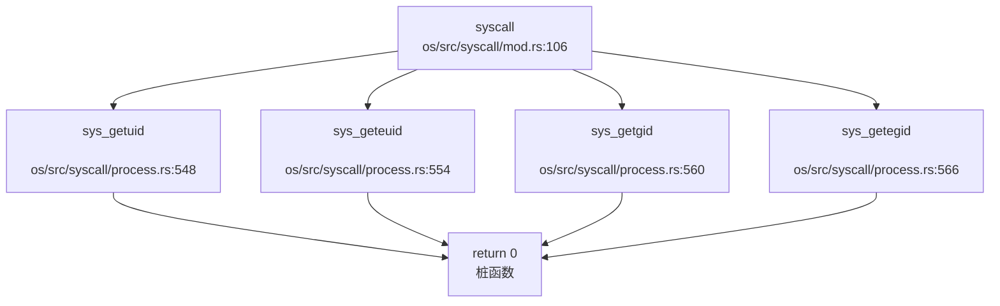
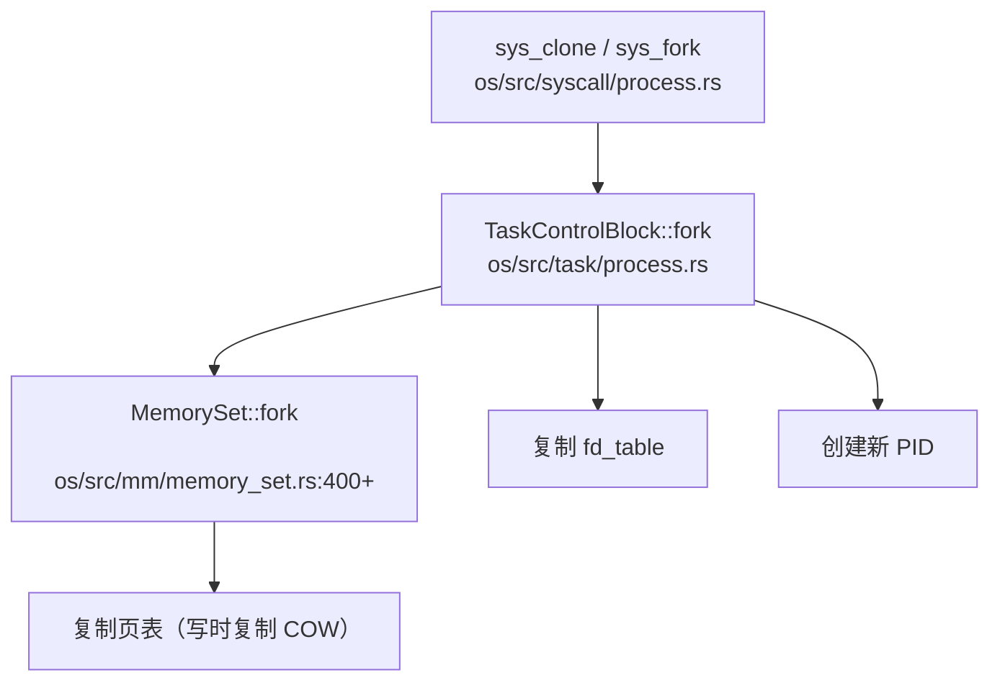

现在我已经收集了足够的信息来撰写第 10 章安全机制与权限模型的分析报告。让我整理分析结果并输出完整的 Markdown 报告。

## 第 10 章：安全机制与权限模型

本章分析 Chaos OS 的安全隔离与权限控制机制，包括特权级隔离、用户/组权限模型、进程间隔离、安全沙箱等关键安全特性。

---

### 特权级与隔离机制

#### RISC-V 特权级支持

Chaos OS 基于 RISC-V 架构实现，采用 **S 模式（Supervisor Mode）** 作为内核态，**U 模式（User Mode）** 作为用户态。通过以下机制实现特权级隔离：

**1. 页表隔离（用户/内核地址空间分离）**

内核通过 `memory_set.rs` 实现地址空间管理，每个进程拥有独立的用户空间页表，但共享内核空间映射：

```rust
// os/src/mm/memory_set.rs:88-100
impl PageTable {
    /// create a new page table for a new process, keep the kernel part the same
    pub fn new_process() -> Self {
        // 创建新页表时保留内核映射
        // 用户空间与内核空间通过页表隔离
    }
}
```

**2. U 位（User Mode Accessible）权限控制**

页表项使用 `PTEFlags::U` 标志位控制用户态可访问性：

```rust
// os/src/mm/page_table.rs:9-19
bitflags! {
    pub struct PTEFlags: u8 {
        const V = 1 << 0;  // Valid
        const R = 1 << 1;  // Readable
        const W = 1 << 2;  // Writable
        const X = 1 << 3;  // Executable
        const U = 1 << 4;  // User accessible
        const A = 1 << 6;  // Accessed
        const D = 1 << 7;  // Dirty
    }
}
```

**3. 用户指针访问控制（SUM 位管理）**

系统调用在访问用户空间指针时，通过 `sstatus::set_sum()` 临时允许内核访问用户页，访问完成后立即恢复：

```rust
// os/src/syscall/fs.rs:50-56
pub fn sys_write(fd: usize, buf: *const u8, len: usize) -> isize {
    // ...
    let buf = unsafe {
        sstatus::set_sum();   // 允许内核访问用户页
        let buf = core::slice::from_raw_parts(buf, len);
        sstatus::clear_sum(); // 恢复保护
        buf
    };
    file.write(buf) as isize
}
```

**⚠️ 安全限制**：
- **未发现 KPTI（Kernel Page Table Isolation）实现**：内核空间和用户空间映射在同一页表中，仅通过 U 位隔离
- **未发现 SMEP/SMAP 显式启用代码**：RISC-V 架构对应机制为 SUM 位，已在系统调用中正确使用

---

### 权限检查与访问控制

#### 文件系统权限位定义

Chaos OS 在 `fs/defs.rs` 中定义了标准的 Unix 权限位：

```rust
// os/src/fs/defs.rs:30-51
bitflags! {
    pub struct FileMode: u32 {
        const S_IRWXU = 0o700;  // 用户（所有者）读、写、执行权限
        const S_IRUSR = 0o400;  // 用户读权限
        const S_IWUSR = 0o200;  // 用户写权限
        const S_IXUSR = 0o100;  // 用户执行权限

        const S_IRWXG = 0o070;  // 组读、写、执行权限
        const S_IRGRP = 0o040;  // 组读权限
        const S_IWGRP = 0o020;  // 组写权限
        const S_IXGRP = 0o010;  // 组执行权限

        const S_IRWXO = 0o007;  // 其他用户读、写、执行权限
        const S_IROTH = 0o004;  // 其他用户读权限
        const S_IWOTH = 0o002;  // 其他用户写权限
        const S_IXOTH = 0o001;  // 其他用户执行权限

        const S_ISUID = 0o4000; // 设置用户ID
        const S_ISGID = 0o2000; // 设置组ID
        const S_ISVTX = 0o1000; // 粘滞位
    }
}
```

#### 权限检查实现状态

**❌ 未发现权限检查逻辑**

尽管定义了完整的权限位结构，但在代码库中**未找到任何实际的权限检查实现**：

1. **搜索 `check_perm`、`inode_permission`、`access` 等关键词**：仅在 ext4_rs 库中找到 EACCES 错误码定义，无实际检查逻辑
2. **系统调用中无权限验证**：`sys_open`、`sys_read`、`sys_write` 等仅检查文件描述符有效性，未检查文件权限位

```rust
// os/src/syscall/fs.rs:36-60
pub fn sys_write(fd: usize, buf: *const u8, len: usize) -> isize {
    let task = current_task().unwrap();
    let inner = task.inner_exclusive_access(file!(), line!());
    if fd >= inner.fd_table.len() {
        return EBADF;  // 仅检查 fd 范围
    }
    if let Some(file) = &inner.fd_table[fd] {
        if !file.writable() {  // 仅检查文件是否可写（基于打开模式）
            return EACCES;
        }
        // ... 无 UID/GID 权限检查
    }
}
```

**结论**：文件系统权限位仅有定义（`FileMode`），**未在系统调用中强制执行**（🔸 桩函数）。

---

### 用户/组/权限模型

#### UID/GID 结构体定义

**1. Stat 结构体中的 UID/GID 字段**

```rust
// os/src/fs/inode.rs:110-125
#[repr(C)]
#[derive(Debug)]
pub struct Stat {
    // ...
    /// User ID of the file's owner.
    st_uid:      u32,
    /// Group ID of the file's group.
    st_gid:      u32,
    // ...
}

impl Stat {
    pub fn new(...) -> Self {
        Self {
            // ...
            st_uid: 0,  // 硬编码为 0
            st_gid: 0,  // 硬编码为 0
            // ...
        }
    }
}
```

**2. EXT4 文件系统 Inode 中的 UID/GID**

```rust
// os/libs/ext4_rs/src/ext4_structs/inode.rs:16-22
pub struct Ext4Inode {
    pub uid: u16,
    pub gid: u16,
    // ...
}
```

#### 系统调用实现

**🔸 桩函数：UID/GID 相关系统调用**

```rust
// os/src/syscall/process.rs:548-569
/// 获取用户 id。在实现多用户权限前默认为最高权限。目前直接返回 0。
pub fn sys_getuid() -> isize {
    trace!("kernel:pid[{}] sys_getuid", current_task().unwrap().pid.0);
    0  // 始终返回 0
}

/// 获取有效用户 id，即相当于哪个用户的权限。在实现多用户权限前默认为最高权限。目前直接返回 0。
pub fn sys_geteuid() -> isize {
    trace!("kernel:pid[{}] sys_geteuid", current_task().unwrap().pid.0);
    0  // 始终返回 0
}

/// 获取用户组 id。在实现多用户权限前默认为最高权限。目前直接返回 0。
pub fn sys_getgid() -> isize {
    trace!("kernel:pid[{}] sys_getgid", current_task().unwrap().pid.0);
    0  // 始终返回 0
}

/// 获取有效用户组 id。在实现多用户组权限前默认为最高权限。目前直接返回 0。
pub fn sys_getegid() -> isize {
    trace!("kernel:pid[{}] sys_getegid", current_task().unwrap().pid.0);
    0  // 始终返回 0
}
```

**调用链分析**：



**⚠️ 关键问题**：
1. **TaskControlBlock 中无 UID/GID 字段**：进程结构体未存储用户/组身份信息
2. **无权限检查逻辑**：`open`、`write`、`exec` 等系统调用未使用 UID/GID 进行权限验证
3. **硬编码返回 0**：所有 UID/GID 相关系统调用均返回 0（root 权限）

**结论**：UID/GID 机制**仅有定义但未强制执行**（🔸 桩函数），系统实际以单用户（root）模式运行。

---

### 进程间隔离与资源限制

#### 地址空间隔离

每个进程拥有独立的 `MemorySet`（地址空间）：

```rust
// os/src/task/task.rs:67-72
pub struct TaskControlBlockInner {
    /// memory set(address space)
    pub memory_set:       MemorySet,
    /// ...
}
```

**隔离机制**：
- 每个进程有独立的页表（`memory_set.token()` 返回不同的 SATP 值）
- 用户空间完全隔离，内核空间共享
- 通过 `trap_handler` 在进程切换时切换页表

#### 文件描述符隔离

每个进程拥有独立的文件描述符表：

```rust
// os/src/task/task.rs:85-87
pub struct TaskControlBlockInner {
    /// file descriptor table
    pub fd_table:         Vec<Option<Arc<dyn File>>>,
    // ...
}
```

#### 资源限制（RLIMIT）

**❌ 未实现资源限制机制**

- 搜索 `rlimit`、`resource_limit`、`setrlimit`：**未发现实现**
- 搜索 `prlimit`：仅定义了 `SYSCALL_PRLIMIT64` 常量，**未实现处理函数**

```rust
// os/src/syscall/mod.rs:62
pub const SYSCALL_PRLIMIT64: usize = 261;
// 但在 syscall() 分发函数中未找到对应处理
```

#### 调用链追踪：进程创建时的资源隔离



**写时复制（COW）实现**：

```rust
// os/src/mm/memory_set.rs:400+（简化）
pub fn fork(&self) -> Self {
    // 复制页表映射，但物理页共享（COW）
    // 通过 PTE 标志位标记为只读
    // 发生写故障时分配新物理页
}
```

**结论**：
- ✅ **地址空间隔离**：已实现（独立页表）
- ✅ **文件描述符隔离**：已实现（独立 fd_table）
- ✅ **COW 优化**：已实现（写时复制）
- ❌ **资源限制（RLIMIT）**：未实现

---

### 安全沙箱与过滤机制

#### Seccomp/Prctl 支持

**❌ 未实现安全沙箱**

搜索 `seccomp`、`prctl`、`sandbox`、`bpf`：

```bash
# 搜索结果（仅 ext4_rs 中的 ACL 相关字段）
os/libs/ext4_rs/src/ext4_structs/inode.rs:29:     pub file_acl: u32,
os/libs/ext4_rs/src/ext4_structs/inode.rs:48:     pub l_i_file_acl_high: u16,
```

**分析**：
- `file_acl` 是 EXT4 文件系统的扩展属性字段，**非安全沙箱机制**
- **未发现 `sys_prctl` 系统调用实现**
- **未发现 Seccomp BPF 规则解析代码**

#### Capability 机制

**❌ 未实现 Capability**

搜索 `capability`、`cap_`：**未发现任何相关代码**

**结论**：Chaos OS **未实现安全沙箱机制**（❌ 未实现），包括：
- Seccomp 系统调用过滤
- Prctl 进程控制
- Capability 细粒度权限
- 命名空间（Namespace）隔离

---

### 审计与安全启动机制

#### 审计日志（Audit）

**❌ 未实现审计机制**

搜索 `audit`、`log_syscall`、`security_log`：
- 仅在 `ext4_rs` 中找到 `boot_signature` 字段（EXT4 超级块字段，非安全启动）
- **无系统调用审计日志**
- **无安全事件记录机制**

#### 安全启动（Secure Boot）

**❌ 未实现安全启动**

- 搜索 `secure_boot`、`signature_verify`、`kernel_sign`：**未发现实现**
- 启动流程（`entry.S` → `rust_main`）无签名验证步骤
- 使用 RustSBI 作为 bootloader，但未实现镜像签名验证

**结论**：**未发现审计与安全启动机制**（❌ 未实现）。

---

### 内存安全与系统调用检查

#### 用户指针验证

**部分实现：SUM 位管理**

Chaos OS 通过 RISC-V 的 `SUM`（Supervisor User Memory access）位控制内核访问用户页：

```rust
// os/src/syscall/fs.rs:50-56
let buf = unsafe {
    sstatus::set_sum();   // 允许访问用户页
    let buf = core::slice::from_raw_parts(buf, len);
    sstatus::clear_sum(); // 恢复保护
    buf
};
```

**⚠️ 安全缺陷**：
1. **无 `access_ok` 验证**：未检查用户指针是否合法（是否真的指向用户空间）
2. **无边界检查**：`from_raw_parts` 依赖用户传入的 `len`，可能被恶意利用
3. **TODO 注释暴露问题**：

```rust
// os/src/mm/memory_set.rs:708
sstatus::set_sum(); //todo Use RAII
```

**改进建议**：应使用 RAII 模式自动管理 SUM 位，避免忘记恢复导致安全漏洞。

#### 缓冲区溢出保护

**❌ 未发现栈保护机制**

搜索 `stack_guard`、`canary`、`stack_smash`：**未发现实现**

- Rust 编译器提供部分内存安全保证（边界检查、所有权）
- 但**未显式实现栈 Canary 保护**
- 汇编代码（`entry.S`、`trap.S`）无栈保护逻辑

#### 系统调用参数验证

**部分实现**：

```rust
// os/src/syscall/fs.rs:36-45
pub fn sys_write(fd: usize, buf: *const u8, len: usize) -> isize {
    let task = current_task().unwrap();
    let inner = task.inner_exclusive_access(file!(), line!());
    if fd >= inner.fd_table.len() {  // ✅ 检查 fd 范围
        return EBADF;
    }
    // ❌ 未检查 buf 指针合法性
    // ❌ 未检查 len 是否溢出
}
```

**结论**：
- ✅ **SUM 位管理**：已实现（但手动管理，有泄漏风险）
- ❌ **用户指针范围检查**：未实现（无 `access_ok`）
- ❌ **栈保护（Canary）**：未实现
- ⚠️ **系统调用参数验证**：部分实现（仅 fd 范围检查）

---

### Rust 语言级安全性机制

#### 所有权与借用检查

Chaos OS 使用 Rust 编写，利用以下语言特性提升安全性：

**1. 独占访问模式（`UPSafeCell`）**

```rust
// os/src/sync/up.rs（简化）
pub struct UPSafeCell<T> {
    inner: UnsafeCell<T>,
}

impl<T> UPSafeCell<T> {
    /// 运行时检查确保单核上独占访问
    pub fn exclusive_access(&self, file: &'static str, line: u32) -> RefMut<'_, T> {
        // 使用 RefCell 进行运行时借用检查
    }
}
```

**2. RAII 锁（`SpinMutex`）**

```rust
// os/src/sync/mutex/spin_mutex.rs:36-45
impl<'a, T, S: MutexSupport> SpinMutex<T, S> {
    #[inline(always)]
    pub fn lock(&self) -> impl DerefMut<Target = T> + '_ {
        let support_guard = S::before_lock();
        // 获取锁...
        MutexGuard {
            mutex: self,
            support_guard,
        }  // 离开作用域自动释放锁
    }
}
```

**3. 生命周期约束**

```rust
// os/src/sync/mutex/spin_mutex.rs:20-23
struct MutexGuard<'a, T: ?Sized, S: MutexSupport> {
    mutex:         &'a SpinMutex<T, S>,
    support_guard: S::GuardData,
}

// 禁止跨线程发送
impl<'a, T: ?Sized, S: MutexSupport> !Sync for MutexGuard<'a, T, S> {}
impl<'a, T: ?Sized, S: MutexSupport> !Send for MutexGuard<'a, T, S> {}
```

#### 类型安全

**1. 位标志类型安全**

```rust
// os/src/mm/memory_set.rs:1017-1025
bitflags! {
    pub struct MapPermission: u8 {
        const R = 1 << 0;
        const W = 1 << 1;
        const X = 1 << 2;
        const U = 1 << 3;
    }
}
```

**2. 新类型模式（Newtype Pattern）**

```rust
// os/src/mm/address.rs（简化）
pub struct VirtAddr(pub usize);
pub struct PhysPageNum(pub usize);

// 防止混用虚拟地址和物理地址
pub fn translate(vaddr: VirtAddr) -> Option<PhysPageNum> {
    // 类型系统保证参数正确性
}
```

#### 内存安全保证

**Rust 编译器提供的保护**：
- ✅ 数组越界检查（运行时 panic）
- ✅ 空指针检查（`Option` 类型强制处理）
- ✅ 数据竞争防止（所有权 + 借用检查）
- ✅ 释放后使用防止（生命周期检查）

**⚠️ 限制**：
- `unsafe` 代码块绕过部分检查（如 `from_raw_parts`）
- 系统调用入口大量使用 `unsafe`，依赖手动验证

---

### 关键代码片段

#### 1. UID/GID 系统调用（桩函数）

```rust
// os/src/syscall/process.rs:548-569
/// 获取用户 id。在实现多用户权限前默认为最高权限。目前直接返回 0。
pub fn sys_getuid() -> isize {
    trace!("kernel:pid[{}] sys_getuid", current_task().unwrap().pid.0);
    0  // 🔸 桩函数：始终返回 0
}

pub fn sys_geteuid() -> isize { 0 }
pub fn sys_getgid() -> isize { 0 }
pub fn sys_getegid() -> isize { 0 }
```

#### 2. 用户指针访问（SUM 位管理）

```rust
// os/src/syscall/fs.rs:50-56
let buf = unsafe {
    sstatus::set_sum();   // 允许内核访问用户页
    let buf = core::slice::from_raw_parts(buf, len);
    sstatus::clear_sum(); // 恢复保护
    buf
};
```

#### 3. 权限位定义（未使用）

```rust
// os/src/fs/defs.rs:30-51
bitflags! {
    pub struct FileMode: u32 {
        const S_IRUSR = 0o400;  // 用户读权限
        const S_IWUSR = 0o200;  // 用户写权限
        const S_IRGRP = 0o040;  // 组读权限
        const S_IROTH = 0o004;  // 其他用户读权限
        const S_ISUID = 0o4000; // 设置用户 ID
        const S_ISGID = 0o2000; // 设置组 ID
    }
}
```

#### 4. Stat 结构体（UID/GID 硬编码为 0）

```rust
// os/src/fs/inode.rs:145-160
impl Stat {
    pub fn new(...) -> Self {
        Self {
            st_uid: 0,  // ❌ 硬编码为 0
            st_gid: 0,  // ❌ 硬编码为 0
            // ...
        }
    }
}
```

---

### 安全机制总结表

| 安全特性 | 实现状态 | 说明 |
|---------|---------|------|
| **特权级隔离** | ✅ 已实现 | S 模式/U 模式隔离，页表 U 位控制 |
| **KPTI** | ❌ 未实现 | 内核/用户空间在同一页表 |
| **SMEP/SMAP** | ⚠️ 部分 | RISC-V SUM 位已使用，但无显式启用代码 |
| **UID/GID 模型** | 🔸 桩函数 | 仅定义结构体，系统调用返回 0 |
| **文件权限检查** | ❌ 未实现 | 权限位定义但未在 syscall 中检查 |
| **Capability** | ❌ 未实现 | 未找到相关代码 |
| **Seccomp/Prctl** | ❌ 未实现 | 无安全沙箱机制 |
| **Audit 审计** | ❌ 未实现 | 无安全日志 |
| **Secure Boot** | ❌ 未实现 | 无镜像签名验证 |
| **栈保护（Canary）** | ❌ 未实现 | 无显式栈保护 |
| **用户指针验证** | ⚠️ 部分 | SUM 位管理，但无 `access_ok` |
| **RLIMIT 资源限制** | ❌ 未实现 | 仅定义常量，无实现 |
| **Rust 内存安全** | ✅ 已实现 | 所有权、借用检查、RAII 锁 |

---

### 安全风险评估

**高风险问题**：
1. **无多用户权限检查**：所有进程以 root 权限运行
2. **用户指针验证不足**：可能导致内核读取/写入任意内存
3. **无资源限制**：单个进程可耗尽系统资源（内存、文件描述符）

**中风险问题**：
1. **SUM 位手动管理**：存在忘记恢复导致安全边界模糊的风险
2. **无审计日志**：安全事件无法追溯

**低风险问题**：
1. **无安全启动**：依赖物理安全假设
2. **无沙箱机制**：无法限制恶意进程行为

**总体评价**：Chaos OS 目前为**教学/实验性质操作系统**，安全机制较为基础，适合学习 OS 原理，**不建议在生产环境或安全敏感场景使用**。
