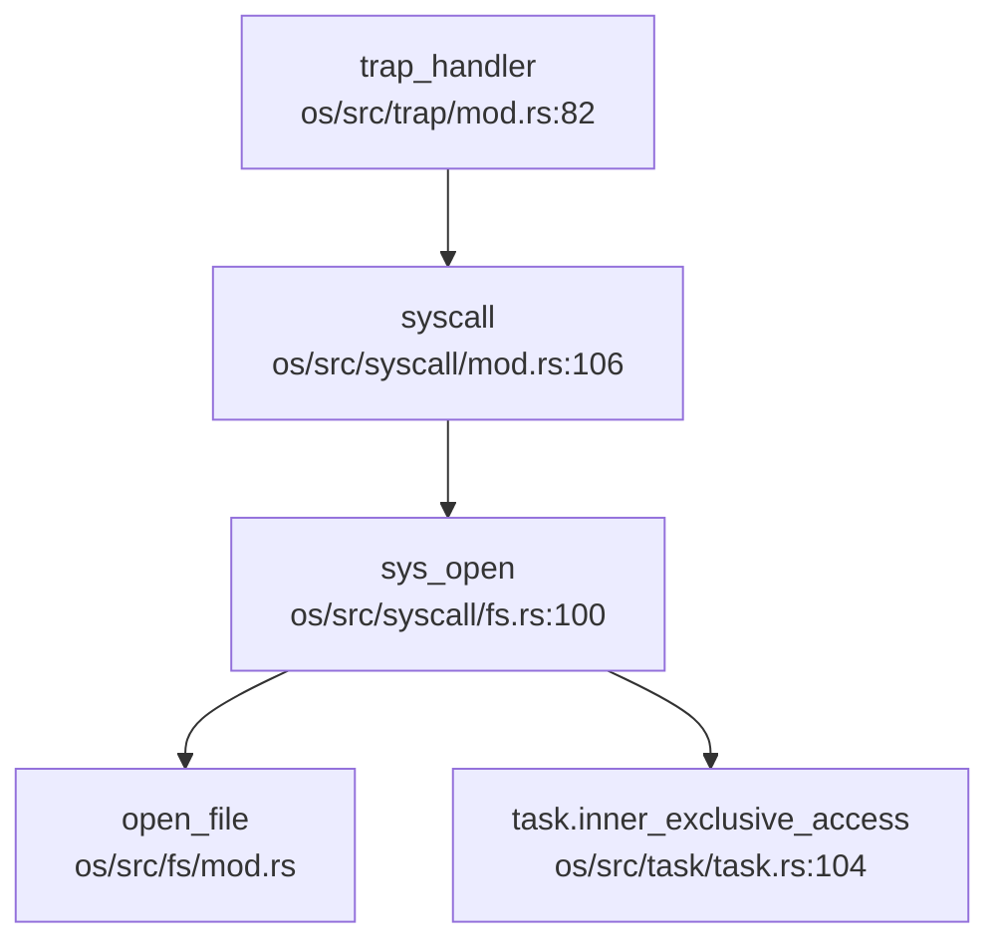

## 第 10 章：安全机制与权限模型

本章分析 Chaos OS 的安全隔离与权限控制机制。通过代码审查发现，该 OS 在安全机制方面实现较为基础，主要依赖 RISC-V 硬件特权级隔离，但缺乏完整的用户/组权限检查体系。

---

## 特权级与隔离机制

**✅ 已实现：RISC-V 特权级隔离**

Chaos OS 基于 RISC-V Sv39 分页机制实现用户态/内核态隔离：

- **页表隔离**：通过 `MapPermission::U` 位控制用户态可访问性。内核空间映射在 `KERNEL_SPACE_OFFSET` 以上，用户空间无法访问。
- **SMEP/SMAP 等效机制**：RISC-V 通过 `PTEFlags::U` 位实现类似功能。用户态访问未设置 U 位的页面会触发 Page Fault。

**关键代码** [`os/src/mm/page_table.rs:9-20`](os/src/mm/page_table.rs:9-20)：

```rust
bitflags! {
    pub struct PTEFlags: u8 {
        const V = 1 << 0;  // Valid
        const R = 1 << 1;  // Readable
        const W = 1 << 2;  // Writable
        const X = 1 << 3;  // Executable
        const U = 1 << 4;  // User-accessible
        const A = 1 << 6;  // Accessed
        const D = 1 << 7;  // Dirty
    }
}
```

**用户态访问控制**：内核通过 `sstatus::set_sum()` 临时允许访问用户空间，访问完成后立即 `clear_sum()` 恢复保护。

**证据** [`os/src/syscall/fs.rs:53-55`](os/src/syscall/fs.rs:53-55)：

```rust
let buf = unsafe {
    sstatus::set_sum();
    let buf = core::slice::from_raw_parts(buf, len);
    sstatus::clear_sum();
    buf
};
```

**❌ 未发现：KPTI（内核页表隔离）**

代码中未发现动态切换内核/用户页表的实现。内核空间始终映射在用户页表中（通过 `MapPermission` 控制访问），未实现类似 Linux KPTI 的完全隔离机制。

---

## 权限检查与访问控制

**🔸 桩函数：文件权限位定义存在但未强制执行**

Chaos OS 定义了完整的 POSIX 权限位结构，但**未在系统调用中执行权限检查**。

**权限位定义** [`os/src/fs/defs.rs:33-49`](os/src/fs/defs.rs:33-49)：

```rust
bitflags! {
    pub struct FileMode: u32 {
        const S_IRWXU = 0o700;  // 用户读、写、执行
        const S_IRUSR = 0o400;  // 用户读
        const S_IWUSR = 0o200;  // 用户写
        const S_IXUSR = 0o100;  // 用户执行
        const S_IRWXG = 0o070;  // 组权限
        const S_IRWXO = 0o007;  // 其他用户权限
        const S_ISUID = 0o4000; // 设置用户 ID
        const S_ISGID = 0o2000; // 设置组 ID
    }
}
```

**权限检查缺失**：在 `sys_open`、`sys_read`、`sys_write` 等关键系统调用中，**仅检查文件描述符的读写能力**（`file.writable()` / `file.readable()`），**未检查 inode 的权限位**。

**证据** [`os/src/syscall/fs.rs:33-60`](os/src/syscall/fs.rs:33-60)：

```rust
pub fn sys_write(fd: usize, buf: *const u8, len: usize) -> isize {
    let task = current_task().unwrap();
    let inner = task.inner_exclusive_access(file!(), line!());
    if fd >= inner.fd_table.len() {
        return EBADF;
    }
    if let Some(file) = &inner.fd_table[fd] {
        if !file.writable() {  // ⚠️ 仅检查 FD 能力，未检查 inode 权限
            return EACCES;
        }
        // ... 直接执行写操作
    }
}
```

**grep 验证**：搜索 `check_perm`、`inode_permission`、`access_check` 等关键词，**未发现任何权限检查函数实现**。

---

## 用户/组/权限模型

**🔸 桩函数：UID/GID 接口存在但始终返回 0**

Chaos OS 提供了 UID/GID 获取接口，但**所有函数均硬编码返回 0**，且**Task 结构体中未存储 uid/gid 字段**。

**证据** [`os/src/syscall/process.rs:548-569`](os/src/syscall/process.rs:548-569)：

```rust
/// 获取用户 id。在实现多用户权限前默认为最高权限。目前直接返回 0。
pub fn sys_getuid() -> isize {
    trace!("kernel:pid[{}] sys_getuid", current_task().unwrap().pid.0);
    0  // ⚠️ 硬编码返回 0
}

/// 获取有效用户 id，即相当于哪个用户的权限。在实现多用户权限前默认为最高权限。目前直接返回 0。
pub fn sys_geteuid() -> isize {
    trace!("kernel:pid[{}] sys_geteuid", current_task().unwrap().pid.0);
    0
}

/// 获取用户组 id。在实现多用户权限前默认为最高权限。目前直接返回 0。
pub fn sys_getgid() -> isize {
    trace!("kernel:pid[{}] sys_getgid", current_task().unwrap().pid.0);
    0
}

/// 获取有效用户组 id。在实现多用户组权限前默认为最高权限。目前直接返回 0。
pub fn sys_getegid() -> isize {
    trace!("kernel:pid[{}] sys_getegid", current_task().unwrap().pid.0);
    0
}
```

**Task 结构体验证**：检查 [`os/src/task/task.rs:54-95`](os/src/task/task.rs:54-95) 的 `TaskControlBlockInner` 结构体，**未发现 `uid`、`gid`、`credential` 等字段**。

```rust
pub struct TaskControlBlockInner {
    pub memory_set:       MemorySet,
    pub trap_cx_ppn:      PhysPageNum,
    pub task_cx:          TaskContext,
    pub task_status:      TaskStatus,
    // ... 其他字段
    pub fd_table:         Vec<Option<Arc<dyn File>>>,
    // ⚠️ 无 uid/gid/credential 字段
}
```

**结论**：
- **UID/GID 检查**：**❌ 未实现**。系统调用中无任何基于 uid/gid 的权限判断逻辑。
- **Capability/ACL**：**❌ 未实现**。搜索 `capability`、`acl` 关键词无结果。

---

## 进程间隔离与资源限制

**✅ 已实现：地址空间隔离**

每个进程拥有独立的 `MemorySet`（地址空间），通过独立的页表实现隔离。

**证据** [`os/src/task/task.rs:54-60`](os/src/task/task.rs:54-60)：

```rust
pub struct TaskControlBlockInner {
    pub memory_set: MemorySet,  // 每个进程独立的地址空间
    // ...
}
```

**调用链追踪**：`sys_open` 调用链展示进程资源隔离机制：



**文件描述符隔离**：每个进程维护独立的 `fd_table`，进程间不共享文件描述符（除非通过 `clone` 系统调用显式共享）。

**❌ 未发现：资源限制（rlimit）机制**

搜索 `rlimit`、`resource_limit`、`setrlimit` 等关键词无结果，未发现进程资源限制（如最大打开文件数、内存限制等）的实现。

---

## 安全沙箱与过滤机制

**❌ 未实现：Seccomp/Prctl 安全沙箱**

搜索 `seccomp`、`prctl`、`sandbox`、`filter` 关键词：
- 仅找到 `log::LevelFilter` 等无关匹配
- **未发现** `sys_prctl`、`sys_seccomp` 系统调用实现
- **未发现** BPF 过滤器或系统调用过滤机制

**结论**：Chaos OS **未实现**任何形式的安全沙箱或系统调用过滤机制。

---

## 审计与安全启动机制

**❌ 未实现：审计日志（Audit）**

搜索 `audit` 关键词：
- 仅找到 `boot_signature`（EXT4 文件系统引导签名，与安全启动无关）
- **未发现**审计日志、安全事件记录机制

**❌ 未实现：安全启动（Secure Boot）**

- **未发现**内核签名验证、镜像完整性检查代码
- **未发现** `secure_boot`、`signature_verify` 等相关实现

---

## 内存安全与系统调用检查

**✅ 已实现：用户指针访问保护**

Chaos OS 通过 `sstatus::SUM` 位控制用户空间访问：
- 默认情况下 `SUM=0`，内核访问用户空间会触发异常
- 仅在系统调用中临时 `set_sum()` 访问用户缓冲区

**证据** [`os/src/syscall/fs.rs:83-92`](os/src/syscall/fs.rs:83-92)：

```rust
unsafe {
    sstatus::set_sum();  // 临时允许访问用户空间
    let buf = core::slice::from_raw_parts_mut(buf, len);
    let ret = file.read(buf) as isize;
    sstatus::clear_sum();  // 立即恢复保护
}
```

**❌ 未发现：用户指针验证（verify_area / access_ok）**

搜索 `verify_area`、`access_ok`、`UserInPtr` 无结果：
- **未发现**对用户指针有效性（是否真的在用户空间）的显式检查
- 依赖 `sstatus::SUM` 机制隐式保护

**❌ 未发现：栈保护（Stack Canary）**

搜索 `stack_canary`、`stack_guard`、`canary` 无结果：
- **未发现**栈溢出保护机制
- 依赖 Rust 语言本身的内存安全性

---

## Rust 语言级安全性机制

**✅ 已实现：Rust 内存安全特性**

Chaos OS 使用 Rust 编写，天然具备以下安全机制：

1. **所有权与借用检查**：编译期防止数据竞争和悬垂指针
2. **RAII 资源管理**：通过 `Drop` trait 自动释放资源
3. **类型安全**：强类型系统防止类型混淆攻击

**证据**：项目中大量使用 `Arc<T>`、`RefCell`、`UPSafeCell` 等 Rust 安全原语。

**⚠️ 注意**：代码中存在 `unsafe` 块（如直接操作指针、内联汇编），这些区域绕过了 Rust 的安全检查，需要人工审计确保正确性。

**证据** [`os/src/syscall/fs.rs:53-55`](os/src/syscall/fs.rs:53-55)：

```rust
let buf = unsafe {
    sstatus::set_sum();
    let buf = core::slice::from_raw_parts(buf, len);  // ⚠️ 裸指针操作
    sstatus::clear_sum();
    buf
};
```

---

## 关键代码片段

**1. 页表权限控制** [`os/src/mm/page_table.rs:9-20`](os/src/mm/page_table.rs:9-20)：

```rust
bitflags! {
    pub struct PTEFlags: u8 {
        const V = 1 << 0;
        const R = 1 << 1;
        const W = 1 << 2;
        const X = 1 << 3;
        const U = 1 << 4;  // 用户可访问位
        const A = 1 << 6;
        const D = 1 << 7;
    }
}
```

**2. 用户空间访问保护** [`os/src/syscall/fs.rs:53-55`](os/src/syscall/fs.rs:53-55)：

```rust
let buf = unsafe {
    sstatus::set_sum();   // 允许内核访问用户空间
    let buf = core::slice::from_raw_parts(buf, len);
    sstatus::clear_sum(); // 恢复保护
    buf
};
```

**3. UID/GID 桩函数** [`os/src/syscall/process.rs:548-569`](os/src/syscall/process.rs:548-569)：

```rust
pub fn sys_getuid() -> isize {
    trace!("kernel:pid[{}] sys_getuid", current_task().unwrap().pid.0);
    0  // 始终返回 0（root 权限）
}
```

---

## 本章总结

| 安全机制 | 实现状态 | 说明 |
|---------|---------|------|
| **特权级隔离** | ✅ 已实现 | RISC-V Sv39 页表 + U 位保护 |
| **KPTI** | ❌ 未实现 | 内核空间始终映射在用户页表 |
| **UID/GID 权限检查** | ❌ 未实现 | 仅有返回 0 的桩函数 |
| **文件权限位检查** | ❌ 未实现 | 定义了 FileMode 但未使用 |
| **Capability/ACL** | ❌ 未实现 | 未发现相关代码 |
| **Seccomp/Prctl** | ❌ 未实现 | 无安全沙箱机制 |
| **审计日志** | ❌ 未实现 | 无安全事件记录 |
| **安全启动** | ❌ 未实现 | 无签名验证 |
| **用户指针验证** | 🔸 部分实现 | 依赖 SUM 位，无显式验证 |
| **栈保护** | ❌ 未实现 | 无 canary 机制 |
| **Rust 内存安全** | ✅ 已实现 | 所有权、借用检查 |

**总体评价**：Chaos OS 的安全机制处于**基础阶段**，主要依赖 RISC-V 硬件特权级和 Rust 语言安全性。缺乏完整的用户/组权限模型、文件权限检查、安全沙箱等高级安全特性。当前设计适用于单用户教学/实验场景，**不适合多用户生产环境**。
