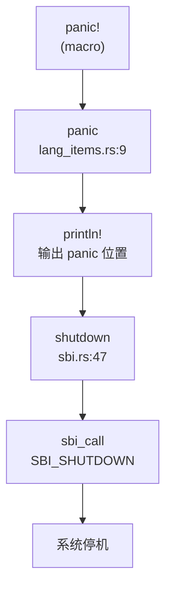

现在我已经收集了足够的信息来撰写第 12 章的调试机制与错误处理分析报告。让我整理所有发现并生成完整的 Markdown 报告。

## 第 12 章：调试机制与错误处理

### 日志与打印系统

ChaOS 实现了基于 `log` crate 的分层日志系统，支持五级日志输出（Error/Warn/Info/Debug/Trace）。

**日志宏实现**：

日志系统核心位于 `os/src/logging.rs`，通过实现 `log::Log` trait 的 `SimpleLogger` 结构体完成：

```rust
// os/src/logging.rs:24-52
struct SimpleLogger;

impl Log for SimpleLogger {
    fn enabled(&self, _metadata: &Metadata) -> bool {
        true
    }
    fn log(&self, record: &Record) {
        let color = match record.level() {
            Level::Error => 31, // Red
            Level::Warn => 93,  // BrightYellow
            Level::Info => 34,  // Blue
            Level::Debug => 32, // Green
            Level::Trace => 90, // BrightBlack
        };
        let pid: isize;
        if let Some(res) = current_pid() {
            pid = res as isize;
        } else {
            pid = -1; // -1 代表当前没有在任何进程内
        }
        print_in_color(
            format_args!(
                "[{:>5}][{}:{}][{}] {}\n",
                record.level(),
                record.file().unwrap(),
                record.line().unwrap(),
                pid,
                record.args()
            ),
            color,
        );
    }
    fn flush(&self) {}
}
```

**日志级别设计**：

| 级别 | 颜色码 | 用途 |
|------|--------|------|
| Error | 31 (红) | 严重错误 |
| Warn | 93 (亮黄) | 警告信息 |
| Info | 34 (蓝) | 一般信息 |
| Debug | 32 (绿) | 调试信息 |
| Trace | 90 (亮黑) | 详细追踪 |

**日志输出格式**：
```
[Level][file:line][pid] message
```
例如：`[INFO][os/src/mm/frame_allocator.rs:125][1] alloc a new page`

**日志初始化**：

在 `os/src/main.rs:124` 的 `rust_main()` 中调用：
```rust
logging::init();
info!("logging init done");
```

日志级别通过环境变量 `LOG` 控制（`os/src/logging.rs:68-76`）：
```rust
log::set_max_level(match option_env!("LOG") {
    Some("ERROR") => LevelFilter::Error,
    Some("WARN") => LevelFilter::Warn,
    Some("INFO") => LevelFilter::Info,
    Some("DEBUG") => LevelFilter::Debug,
    Some("TRACE") => LevelFilter::Trace,
    _ => LevelFilter::Error, // 默认为 Error
});
```

**打印宏**：

`os/src/console.rs` 提供了 `print!` 和 `println!` 宏，通过 SBI 的 `console_putchar` 实现底层输出：

```rust
// os/src/console.rs:10-22
impl Write for Stdout {
    fn write_str(&mut self, s: &str) -> fmt::Result {
        for c in s.chars() {
            console_putchar(c as usize);
        }
        Ok(())
    }
}
```

---

### Panic 处理与栈回溯

**Panic Handler 实现**：

Panic 处理位于 `os/src/lang_items.rs:7-23`，通过 `#[panic_handler]` 属性注册：

```rust
#[panic_handler]
fn panic(info: &PanicInfo) -> ! {
    if let Some(location) = info.location() {
        println!(
            "[kernel] Panicked at {}:{} {}",
            location.file(),
            location.line(),
            info.message().unwrap()
        );
    } else {
        println!("[kernel] Panicked: {}", info.message().unwrap());
    }
    // unsafe {
    //     backtrace();
    // }
    shutdown()
}
```

**Panic 处理流程**：



**关键发现**：
- ✅ Panic 位置输出：**已实现**（文件、行号、消息）
- 🔸 栈回溯：**桩函数**（代码存在但被注释掉，见 `lang_items.rs:21-22`）
- ✅ 停机：通过 SBI `shutdown()` 实现

**栈回溯 (Backtrace) 分析**：

`os/src/lang_items.rs:25-39` 定义了 `backtrace()` 函数，但**在 panic handler 中被注释掉**：

```rust
/// backtrace function
#[allow(unused)]
unsafe fn backtrace() {
    let mut fp: usize;
    let stop = current_kstack_top();
    asm!("mv {}, s0", out(reg) fp);
    println!("---START BACKTRACE---");
    for i in 0..10 {
        if fp == stop {
            break;
        }
        println!("#{}:ra={:#x}", i, *((fp - 8) as *const usize));
        fp = *((fp - 16) as *const usize);
    }
    println!("---END   BACKTRACE---");
}
```

**栈回溯实现原理**：
- 基于 RISC-V 的 Frame Pointer (`s0`) 进行栈帧回溯
- 通过读取栈上的返回地址 (RA) 打印调用栈
- 最多回溯 10 层，直到栈顶 (`current_kstack_top()`)

**❌ 未实现的功能**：
- **DWARF 解析**：搜索 `dwarf` 关键词无结果，未发现 DWARF 调试信息解析
- **完整调用栈打印**：由于 `backtrace()` 被注释，panic 时**不会**打印完整调用栈
- **unwind 支持**：搜索 `unwind` 仅发现 `backtrace` 相关代码，无标准库 unwind 集成

**结论**：ChaOS 的栈回溯功能处于**桩函数状态**，panic 时仅输出位置信息，不打印完整调用栈。

---

### 错误码与 Result 设计

**错误码定义**：

`os/src/syscall/errno.rs` 定义了完整的 POSIX 风格错误码（共 134 个），采用负的 `isize` 值：

```rust
// os/src/syscall/errno.rs:1-60
pub const SUCCESS: isize = 0;
pub const EPERM: isize = -1;      // Operation not permitted
pub const ENOENT: isize = -2;     // No such file or directory
pub const ESRCH: isize = -3;      // No such process
pub const EINTR: isize = -4;      // Interrupted system call
pub const EIO: isize = -5;        // I/O error
// ... (共 134 个错误码)
pub const ENOSYS: isize = -38;    // Invalid system call number
```

**Errno 枚举**：

使用 `num_enum::TryFromPrimitive` 实现 `isize` 到 `Errno` 的转换：

```rust
#[derive(Debug, Eq, PartialEq, TryFromPrimitive)]
#[repr(isize)]
pub enum Errno {
    SUCCESS = 0,
    EPERM = -1,
    ENOENT = -2,
    // ... (与常量对应)
}
```

**错误码设置宏**：

```rust
// os/src/syscall/errno.rs:428-435
#[macro_export]
macro_rules! set_errno {
    ($errno:expr) => {};
}

#[macro_export]
macro_rules! errno_exit {
    ($errno:expr) => {
        set_errno!($errno)!;
        return expr; // or -1?
    };
}
```

**注意**：`set_errno!` 宏体为空，**❌ 未实现**实际的错误码设置逻辑（如设置线程局部存储的 errno）。

**用户态错误处理**：

用户态库 (`user/src/lib.rs`) 通过系统调用返回值的正负判断成功/失败：
- 返回值 `>= 0`：成功
- 返回值 `< 0`：失败，返回值为错误码的负值

---

### 调试接口与交互式 Shell

**用户态 Shell**：

`user/src/bin/user_shell.rs` 实现了简单的用户态 Shell，支持：
- 命令解析与执行（通过 `exec` 系统调用）
- 管道 (`|`) 支持
- 输入/输出重定向 (`<`, `>`)

**Shell 功能限制**：
- ❌ **无内置命令**：不支持 `ps`、`ls`、`help` 等内置命令
- ❌ **无交互式调试**：仅提供命令执行，无调试功能
- ✅ **基础功能**：支持多命令管道、重定向

**内核调试接口**：

搜索 `monitor|debug.*command` 未发现内核级 Monitor 或调试命令接口。

**日志作为调试手段**：

ChaOS 主要依赖日志系统进行调试，在关键路径插入了大量 `log::debug!`、`log::info!`、`log::error!` 调用：

```rust
// os/src/trap/mod.rs:94-97
info!(
    "[kernel] trap triggered, trap_handler: scause = {:?}, stval = {:#x}, sepc = {:#x}",
    scause.cause(),
    stval,
    sepc
);
```

**Tracepoints 插入**：

在关键路径（如定时器、内存分配、系统调用）有 `log::trace!` 调用：

```rust
// os/src/timer.rs:228
trace!("kernel:pid[{}] add_timer", current_task().unwrap().pid.0);

// os/src/mm/frame_allocator.rs:72
// trace!("last {} Physical Frames.", self.end - self.current);
```

**❌ 未实现的功能**：
- **perf 支持**：搜索 `perf` 仅发现构建依赖，无性能分析接口
- **ftrace 支持**：搜索 `ftrace` 无结果
- **调试控制台**：无独立于日志的调试控制台

---

### GDB Stub 支持情况

**严格验证结果**：

搜索 `gdbstub|handle_gdb_packet` 的结果：
- ✅ 在文档 (`docs/开发日志与 bug 记录.md`) 中发现 10 处 `gdb` 提及
- ❌ **未发现** `gdbstub` crate 依赖
- ❌ **未发现** `handle_gdb_packet` 函数
- ❌ **未发现** GDB 数据包解析循环

**文档中的 GDB 使用**：

文档提到使用 QEMU 内置的 GDB Server 进行调试：
```markdown
docs/开发日志与 bug 记录.md:112
原先 rCore 的逻辑是切换进程统一先进入 `trap_return`...
在 gdb 的时候有两...
```

**结论**：
- ❌ **GDB Stub 未实现**：ChaOS 本身**不包含** GDB Stub 实现
- ✅ **依赖 QEMU GDB Server**：开发者通过 QEMU 的 `-s -S` 参数使用外部 GDB 调试
- ❌ **无内置调试协议**：不支持 GDB Remote Serial Protocol

---

### 断言与运行时检查

**断言使用**：

搜索 `debug_assert|assert!|assert_eq!` 发现 88 处匹配，主要分布在：
- `os/libs/ext4_rs/`：文件系统测试与验证
- `os/src/`：内核核心逻辑检查

**debug_assert 使用**：

仅发现 1 处 `debug_assert!`（且被注释）：
```rust
// os/src/sync/mutex/spin_mutex.rs:105
// debug_assert!(self.mutex.lock.load(Ordering::Relaxed));
```

**运行时检查示例**：

1. **死锁检测**（`os/src/sync/mutex/spin_mutex.rs:44-52`）：
```rust
fn wait_unlock(&self) {
    let mut try_count = 0usize;
    while self.lock.load(Ordering::Relaxed) {
        core::hint::spin_loop();
        try_count += 1;
        if try_count == 0x10000000 {
            error!("dead lock!!");
            panic!("Mutex: deadlock detected! try_count > {:#x}\n", try_count);
        }
    }
}
```

2. **内存分配检查**（`os/src/mm/frame_allocator.rs:96-101`）：
```rust
fn dealloc(&mut self, ppn: PhysPageNum) {
    let ppn = ppn.0;
    // 有效性检查
    if ppn >= self.current || self.recycled.iter().any(|&v| v == ppn) {
        panic!("Frame ppn={:#x} has not been allocated!", ppn);
    }
    self.recycled.push(ppn);
}
```

3. **系统调用参数验证**：在 `os/src/syscall/*.rs` 中广泛使用 `if` 检查参数合法性，返回错误码。

**桩代码检测**：

搜索 `unimplemented!|todo!` 发现 23 处桩代码，关键位置包括：

| 文件 | 行号 | 功能 | 状态 |
|------|------|------|------|
| `os/src/fs/inode.rs` | 98, 103 | Inode 管理器初始化 | 🔸 桩函数 |
| `os/src/fs/ext4/inode.rs` | 31-133 | EXT4 inode 操作 | 🔸 桩函数 |
| `os/src/fs/fat32/inode.rs` | 187-255 | FAT32 重命名/目录操作 | 🔸 桩函数 |
| `os/src/syscall/fs.rs` | 579, 582 | 文件系统系统调用 | 🔸 桩函数 |
| `os/src/task/task.rs` | 365 | 线程功能 | 🔸 桩函数 |

---

### 关键代码片段

**1. Panic Handler 完整实现**：
```rust
// os/src/lang_items.rs:7-23
#[panic_handler]
fn panic(info: &PanicInfo) -> ! {
    if let Some(location) = info.location() {
        println!(
            "[kernel] Panicked at {}:{} {}",
            location.file(),
            location.line(),
            info.message().unwrap()
        );
    } else {
        println!("[kernel] Panicked: {}", info.message().unwrap());
    }
    // unsafe {
    //     backtrace();
    // }
    shutdown()
}
```

**2. 日志级别颜色映射**：
```rust
// os/src/logging.rs:33-42
let color = match record.level() {
    Level::Error => 31, // Red
    Level::Warn => 93,  // BrightYellow
    Level::Info => 34,  // Blue
    Level::Debug => 32, // Green
    Level::Trace => 90, // BrightBlack
};
```

**3. 错误码定义（部分）**：
```rust
// os/src/syscall/errno.rs:1-60
pub const SUCCESS: isize = 0;
pub const EPERM: isize = -1;
pub const ENOENT: isize = -2;
pub const ENOSYS: isize = -38;  // 无效系统调用
```

**4. 死锁检测机制**：
```rust
// os/src/sync/mutex/spin_mutex.rs:44-52
fn wait_unlock(&self) {
    let mut try_count = 0usize;
    while self.lock.load(Ordering::Relaxed) {
        core::hint::spin_loop();
        try_count += 1;
        if try_count == 0x10000000 {
            panic!("Mutex: deadlock detected! try_count > {:#x}\n", try_count);
        }
    }
}
```

---

### 本章总结

| 功能 | 实现状态 | 说明 |
|------|----------|------|
| 日志系统 | ✅ 已实现 | 5 级日志，带颜色输出，支持进程 PID |
| Panic 位置输出 | ✅ 已实现 | 文件、行号、消息 |
| 栈回溯 (Backtrace) | 🔸 桩函数 | 代码存在但被注释，panic 时不执行 |
| DWARF 解析 | ❌ 未实现 | 未发现相关代码 |
| 错误码设计 | ✅ 已实现 | 134 个 POSIX 风格错误码 |
| 交互式 Shell | 🔸 部分实现 | 仅支持命令执行，无内置调试命令 |
| GDB Stub | ❌ 未实现 | 依赖 QEMU 外部 GDB Server |
| perf/ftrace | ❌ 未实现 | 无性能分析接口 |
| 断言检查 | ✅ 已实现 | 广泛使用 `assert!`，`debug_assert!` 被注释 |
| 运行时检查 | ✅ 已实现 | 死锁检测、内存合法性检查 |

**设计特点**：
1. **日志驱动调试**：ChaOS 高度依赖日志系统进行调试，在关键路径插入大量日志
2. **简化 Panic 处理**：Panic 时仅输出位置信息，不打印完整调用栈（栈回溯被禁用）
3. **外部调试依赖**：无内置 GDB Stub，依赖 QEMU 的 GDB Server 进行源码级调试
4. **完善的错误码**：定义了完整的 POSIX 错误码，但 `set_errno` 宏未实现

**改进建议**：
1. 启用 `backtrace()` 函数，支持完整的调用栈打印
2. 实现内核级 Monitor/Shell，支持 `ps`、`ls`、`meminfo` 等调试命令
3. 添加 GDB Stub 支持，实现独立的源码级调试能力
4. 实现 `set_errno!` 宏，支持线程局部存储的错误码设置
