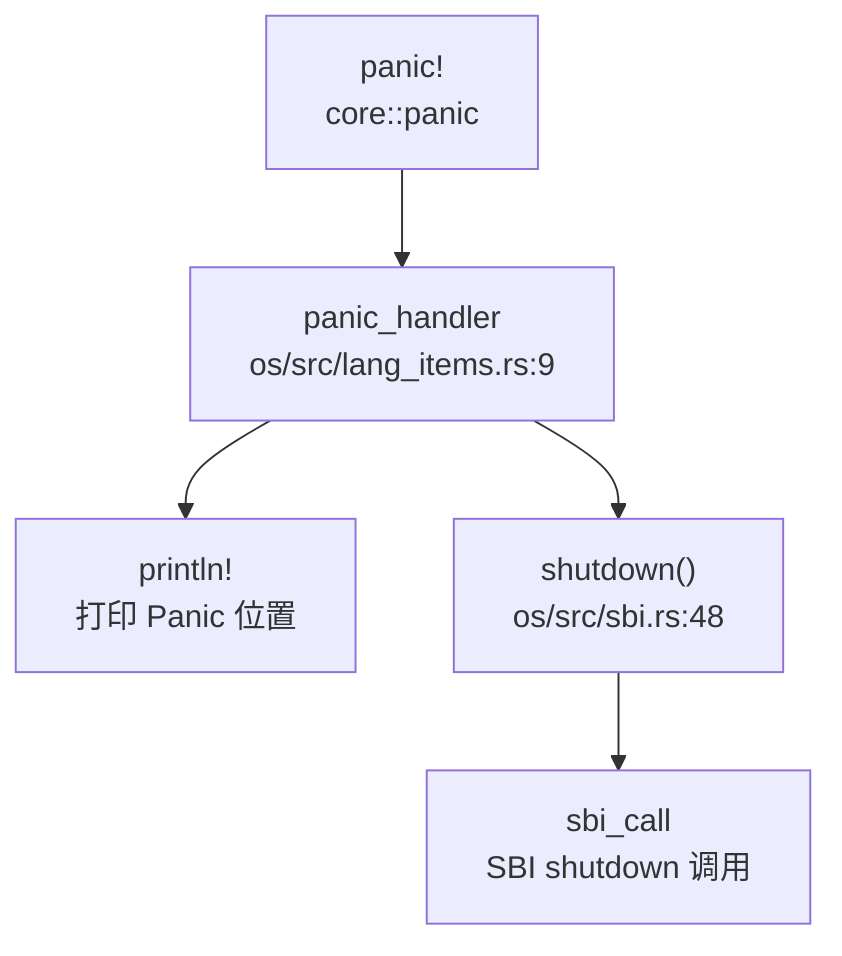

## 第 12 章：调试机制与错误处理

### 日志与打印系统

本 OS 实现了基于 Rust `log` crate 的日志系统，支持多级日志输出和彩色显示。

**日志级别设计**：

日志级别定义在 `os/src/logging.rs` 中，实现了标准的 5 级日志：

```rust
// os/src/logging.rs:32-64
impl Log for SimpleLogger {
    fn log(&self, record: &Record) {
        let color = match record.level() {
            Level::Error => 31, // Red
            Level::Warn => 93,  // BrightYellow
            Level::Info => 34,  // Blue
            Level::Debug => 32, // Green
            Level::Trace => 90, // BrightBlack
        };
        // ... 输出格式：[级别][文件：行号][PID] 消息
    }
}
```

**日志宏实现**：

- 使用 `log` crate 提供的标准宏：`error!()`, `warn!()`, `info!()`, `debug!()`, `trace!()`
- 日志输出格式：`[{:>5}][文件：行号][PID] 消息`
- 支持通过环境变量 `LOG` 设置日志级别（`ERROR`/`WARN`/`INFO`/`DEBUG`/`TRACE`）
- 默认级别为 `LevelFilter::Error`

**初始化**：

```rust
// os/src/logging.rs:66-78
pub fn init() {
    static LOGGER: SimpleLogger = SimpleLogger;
    log::set_logger(&LOGGER).unwrap();
    log::set_max_level(match option_env!("LOG") {
        Some("ERROR") => LevelFilter::Error,
        Some("WARN") => LevelFilter::Warn,
        Some("INFO") => LevelFilter::Info,
        Some("DEBUG") => LevelFilter::Debug,
        Some("TRACE") => LevelFilter::Trace,
        _ => LevelFilter::Error,
    });
}
```

**实现状态**：✅ **已实现** - 完整的日志系统，支持 5 级日志和彩色输出。

---

### Panic 处理与栈回溯

**Panic Handler 实现**：

内核态和用户态分别实现了 panic handler：

```rust
// os/src/lang_items.rs:9-24
#[panic_handler]
fn panic(info: &PanicInfo) -> ! {
    if let Some(location) = info.location() {
        println!(
            "[kernel] Panicked at {}:{} {}",
            location.file(),
            location.line(),
            info.message().unwrap()
        );
    } else {
        println!("[kernel] Panicked: {}", info.message().unwrap());
    }
    // unsafe {
    //     backtrace();  // ← 被注释掉，未启用
    // }
    shutdown()
}
```

```rust
// user/src/lang_items.rs:4-18
#[panic_handler]
fn panic_handler(panic_info: &core::panic::PanicInfo) -> ! {
    let err = panic_info.message().unwrap();
    if let Some(location) = panic_info.location() {
        println!("Panicked at {}:{}, {}", location.file(), location.line(), err);
    } else {
        println!("Panicked: {}", err);
    }
    kill(getpid() as usize, SignalFlags::SIGABRT.bits());
    unreachable!()
}
```

**Panic 处理流程**：



**栈回溯 (Backtrace) 支持**：

代码中存在 `backtrace()` 函数实现，但**已被注释禁用**：

```rust
// os/src/lang_items.rs:25-40
/// backtrace function
#[allow(unused)]
unsafe fn backtrace() {
    let mut fp: usize;
    let stop = current_kstack_top();
    asm!("mv {}, s0", out(reg) fp);
    println!("---START BACKTRACE---");
    for i in 0..10 {
        if fp == stop {
            break;
        }
        println!("#{}:ra={:#x}", i, *((fp - 8) as *const usize));
        fp = *((fp - 16) as *const usize);
    }
    println!("---END   BACKTRACE---");
}
```

**分析**：
- 该 `backtrace()` 函数基于 FramePointer (s0) 进行栈回溯
- 最多回溯 10 层，打印返回地址 (ra)
- **但该函数在 panic handler 中被注释掉，实际不会执行**
- 未使用 DWARF 解析，仅基于简单的 FramePointer 链

**grep 搜索结果**：
```
os/src/lang_items.rs:1: //! The panic handler and backtrace
os/src/lang_items.rs:21:     //     backtrace();  // ← 被注释
os/src/lang_items.rs:25: /// backtrace function
os/src/lang_items.rs:27: unsafe fn backtrace() {
```

**实现状态**：
- Panic 处理：✅ **已实现** - 打印 Panic 位置并调用 SBI shutdown
- 栈回溯：🔸 **桩函数** - `backtrace()` 函数存在但被注释禁用，panic 时不会执行栈回溯

---

### 错误码与 Result 设计

**内核错误码定义**：

`os/src/syscall/errno.rs` 定义了完整的 POSIX 风格错误码（共 133+ 个）：

```rust
// os/src/syscall/errno.rs:1-85
pub const SUCCESS: isize = 0;
pub const EPERM: isize = -1;      // Operation not permitted
pub const ENOENT: isize = -2;     // No such file or directory
pub const ESRCH: isize = -3;      // No such process
pub const EINTR: isize = -4;      // Interrupted system call
pub const EIO: isize = -5;        // I/O error
// ... 共 133+ 个错误码
pub const ENOSYS: isize = -38;    // Invalid system call number
```

**Errno 枚举**：

```rust
// os/src/syscall/errno.rs:180-300+
#[derive(Debug, Eq, PartialEq, TryFromPrimitive)]
#[repr(isize)]
pub enum Errno {
    SUCCESS = 0,
    EPERM = -1,
    ENOENT = -2,
    // ... 与 const 定义对应
}
```

**EXT4 子模块错误码**：

`os/libs/ext4_rs/src/ext4_error.rs` 定义了独立的错误类型：

```rust
// os/libs/ext4_rs/src/ext4_error.rs:35-52
pub struct Ext4Error {
    errno: Errnum,
    msg: Option<&'static str>,
}

#[repr(i32)]
#[derive(Debug, Clone, Copy, PartialEq, Eq)]
pub enum Errnum {
    EPERM     = 1,
    ENOENT    = 2,
    EIO       = 5,
    // ... 28 种错误类型
}
```

**Result 类型使用**：

系统调用返回值统一使用 `isize`：
- 成功：返回 0 或正值（如文件描述符、PID）
- 失败：返回负的错误码（如 `-ENOENT`, `-EINVAL`）

示例：
```rust
// os/src/syscall/mod.rs:106-212
pub fn syscall(syscall_id: usize, args: [usize; 6]) -> isize {
    match syscall_id {
        SYSCALL_GETCWD => sys_getcwd(args[0] as *mut u8, args[1]),
        SYSCALL_READ => sys_read(args[0], args[1] as *mut u8, args[2]),
        // ...
        _ => panic!("Unsupported syscall_id: {}", syscall_id),
    }
}
```

**实现状态**：✅ **已实现** - 完整的错误码体系，符合 POSIX 标准。

---

### 调试接口与交互式 Shell

**用户态 Shell**：

`user/src/bin/user_shell.rs` 实现了简单的交互式 Shell：

```rust
// user/src/bin/user_shell.rs:79-214
#[no_mangle]
pub fn main() -> i32 {
    println!("Rust user shell");
    let mut line: String = String::new();
    print!("{}", LINE_START);
    loop {
        let c = getchar();
        match c {
            LF | CR => {
                // 解析命令并执行
                let splited: Vec<_> = line.as_str().split('|').collect();
                // 支持管道、重定向
                // ...
            }
            // 处理退格、删除
        }
    }
}
```

**Shell 功能**：
- ✅ 支持命令执行（`exec` 系统调用）
- ✅ 支持管道 (`|`)
- ✅ 支持输入重定向 (`<`)
- ✅ 支持输出重定向 (`>`)
- ❌ **无内置命令**（如 `ps`, `ls`, `help` 等需外部程序）
- ❌ **无内核 Monitor**

**grep 搜索结果**：
```
user/src/bin/user_shell.rs:79:     println!("Rust user shell");
```

**调试控制台**：
- 未发现独立的内核调试 Monitor
- 仅通过串口打印日志（`println!`, `log` 宏）

**实现状态**：
- 用户态 Shell：✅ **已实现** - 基础 Shell，支持管道和重定向
- 内核 Monitor：❌ **未实现** - 无内置调试命令
- 调试控制台：🔸 **仅日志输出** - 无交互式调试接口

---

### GDB Stub 支持情况

**严格代码验证**：

通过以下关键词搜索 GDB Stub 相关实现：
- `gdbstub`
- `handle_gdb`
- `gdb.*packet`
- `gdb.*handler`

**搜索结果**：
```
⚠️ 无任何匹配结果
```

**分析**：
- 代码库中**不存在** `handle_gdb_packet` 或类似函数
- 无 GDB 数据包解析循环
- 无 GDB Stub 实现
- `docs/image/gdb.jpg` 和 `docs/image/gdb2.jpg` 仅为文档图片，非代码实现

**QEMU GDB 支持**：
- 可通过 QEMU 的 `-s -S` 参数启用 GDB 服务器（QEMU 内置功能）
- 但这**不是 OS 自身的 GDB Stub**

**实现状态**：❌ **未实现** - 无 GDB Stub 代码，仅能依赖 QEMU 内置 GDB 服务器。

---

### 断言与运行时检查

**断言使用**：

代码中广泛使用 `assert!()` 和 `debug_assert!()` 进行运行时检查：

```rust
// os/src/block/block_cache.rs:38-46
assert!(offset + type_size <= BLOCK_SZ);

// os/src/fs/pipe.rs:138-185
assert!(self.readable());
assert!(self.writable());

// os/libs/visionfive2-sd/src/lib.rs:67-70
assert!(res);
```

**测试代码中的断言**：

`os/libs/ext4_rs/src/utils.rs` 包含大量测试断言：
```rust
// os/libs/ext4_rs/src/utils.rs:229-251
assert!(!is_goal, "Root path should not set is_goal to true");
assert!(!is_goal, "Normal path should not set is_goal to true");
assert!(is_goal, "Path without slashes should set is_goal to true");
```

**运行时检查**：
- 系统调用参数验证（如文件描述符有效性）
- 内存访问边界检查（如 `block_cache` 中的偏移检查）
- 管道读写状态检查

**未实现的桩代码检测**：

grep 搜索 `todo!()` 和 `unimplemented!()` 发现多处桩代码：
```
os/src/fs/inode.rs:98:         todo!();
os/src/fs/inode.rs:103:     pub static ref INODE_MANAGER: Mutex<InodeManager> = todo!();
os/src/fs/stdio.rs:53:         todo!()
os/src/fs/ext4/inode.rs:31-133: 多处 todo!()
os/src/fs/fat32/inode.rs:187-255: 多处 todo!("FAT32 rename/mkdir/rmdir")
os/src/mm/memory_set.rs:409:     todo!("interpreter not supported yet")
```

**实现状态**：
- 断言机制：✅ **已实现** - 广泛使用 `assert!()` 进行运行时检查
- 桩代码：🔸 **部分功能为桩** - 文件系统、内存管理中有多个 `todo!()` 未实现

---

### 关键代码片段

**1. 日志系统实现**：
```rust
// os/src/logging.rs:28-64
impl Log for SimpleLogger {
    fn enabled(&self, _metadata: &Metadata) -> bool {
        true
    }
    fn log(&self, record: &Record) {
        if !self.enabled(record.metadata()) {
            return;
        }
        let color = match record.level() {
            Level::Error => 31, // Red
            Level::Warn => 93,  // BrightYellow
            Level::Info => 34,  // Blue
            Level::Debug => 32, // Green
            Level::Trace => 90, // BrightBlack
        };
        let pid: isize;
        if let Some(res) = current_pid() {
            pid = res as isize;
        } else {
            pid = -1;
        }
        print_in_color(
            format_args!(
                "[{:>5}][{}:{}][{}] {}\n",
                record.level(),
                record.file().unwrap(),
                record.line().unwrap(),
                pid,
                record.args()
            ),
            color,
        );
    }
    fn flush(&self) {}
}
```

**2. Panic Handler**：
```rust
// os/src/lang_items.rs:7-24
#[panic_handler]
fn panic(info: &PanicInfo) -> ! {
    if let Some(location) = info.location() {
        println!(
            "[kernel] Panicked at {}:{} {}",
            location.file(),
            location.line(),
            info.message().unwrap()
        );
    } else {
        println!("[kernel] Panicked: {}", info.message().unwrap());
    }
    // unsafe {
    //     backtrace();  // 被注释禁用
    // }
    shutdown()
}
```

**3. 错误码定义**：
```rust
// os/src/syscall/errno.rs:1-85
pub const SUCCESS: isize = 0;
pub const EPERM: isize = -1;
pub const ENOENT: isize = -2;
pub const ENOSYS: isize = -38;  // 无效系统调用号

#[derive(Debug, Eq, PartialEq, TryFromPrimitive)]
#[repr(isize)]
pub enum Errno {
    SUCCESS = 0,
    EPERM = -1,
    ENOENT = -2,
    // ... 133+ 种错误
}
```

**4. 被禁用的栈回溯**：
```rust
// os/src/lang_items.rs:25-40
#[allow(unused)]
unsafe fn backtrace() {
    let mut fp: usize;
    let stop = current_kstack_top();
    asm!("mv {}, s0", out(reg) fp);
    println!("---START BACKTRACE---");
    for i in 0..10 {
        if fp == stop {
            break;
        }
        println!("#{}:ra={:#x}", i, *((fp - 8) as *const usize));
        fp = *((fp - 16) as *const usize);
    }
    println!("---END   BACKTRACE---");
}
```

---

### 本章总结

| 功能模块 | 实现状态 | 说明 |
|---------|---------|------|
| 日志系统 | ✅ 已实现 | 5 级日志，彩色输出，支持环境变量配置 |
| Panic 处理 | ✅ 已实现 | 打印位置 + SBI shutdown |
| 栈回溯 | 🔸 桩函数 | `backtrace()` 存在但被注释禁用 |
| 错误码设计 | ✅ 已实现 | 133+ POSIX 标准错误码 |
| 用户态 Shell | ✅ 已实现 | 支持管道、重定向，无内置命令 |
| 内核 Monitor | ❌ 未实现 | 无交互式调试接口 |
| GDB Stub | ❌ 未实现 | 无 GDB 数据包解析代码 |
| 断言检查 | ✅ 已实现 | 广泛使用 `assert!()` |
| 桩代码 | 🔸 部分存在 | 文件系统、内存管理中有 `todo!()` |

**关键发现**：
1. 日志系统完善，但 Panic 时**不执行栈回溯**（代码被注释）
2. 无 GDB Stub 实现，仅能依赖 QEMU 内置 GDB 服务器
3. 用户态 Shell 功能基础，无内核级调试 Monitor
4. 错误码体系完整，符合 POSIX 标准
5. 多处 `todo!()` 桩代码，部分文件系统功能未实现
