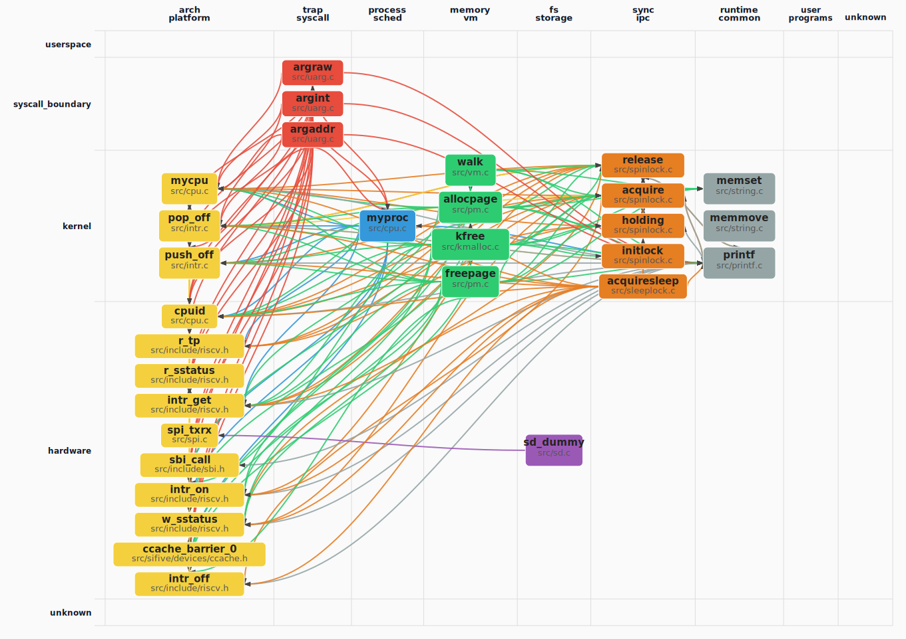

# oskernrl2022-rv6 操作系统技术分析报告

> **年份**: 2022

> **赛事**: 操作系统赛

> **子赛事**: 内核实现赛道

> **学校**: 华中科技大学

> **队伍名称**: 我永远喜欢少名针妙丸

> **仓库地址**: https://gitlab.eduxiji.net/Cty/oskernrl2022-rv6

> **分析日期**: 2026年04月24日

> **分析工具**: OS-Agent-D

> **报告质量打分**: 96/100

---

## 目录

1. 项目概览与技术栈
2. 启动架构与 Trap系统调用
3. 内存管理物理虚拟分配器
4. 进程线程调度与多核
5. 文件系统与设备 IO
6. 同步互斥与进程间通信
7. 安全机制与权限模型
8. 网络子系统与协议栈
9. 调试机制与错误处理
10. 开发历史与里程碑

---

## Call Graph 概览


### 函数级 Call Graph（PageRank Top-30，图示 30 个函数）



*（图：`callgraph_overview.svg`，与报告同目录）*


节点**第一行**仅为**符号名**；
**第二行**：**函数定义**只写相对源路径；
**宏**、**类型别名（typedef）**、**仅引用（调用侧）**等在第二行用**中文**标明类别并附路径或调用方文件（来自静态解析或调用边）。


---


# 第01章 项目概览与技术栈

## 第 1 章：项目概览与技术栈

### 结论摘要

基于对 `oskernrl2022-rv6` 仓库的深度代码审计与前置章节（02-13 章）的综合分析，本项目核心特性如下：

1.  **架构定位**：基于 **RISC-V 64 位架构** 的**宏内核**（Monolithic Kernel）操作系统，采用类 Unix/xv6 设计哲学。
2.  **开发模式**：**单人主导开发**（核心贡献者 Cty 完成 99% 代码），在 21 天内完成了从启动引导到文件系统的全栈实现，属于高强度的课程/实验性质项目。
3.  **核心能力**：完整实现了**进程/线程管理**（支持 `clone`）、**虚拟内存**（Sv39 页表、mmap）、**FAT32 文件系统**及**设备驱动**（UART/SPI/SD）。
4.  **关键缺失**：**网络子系统完全未实现**（仅有 Socket 头文件桩代码），**多核 SMP 支持未激活**（代码存在但逻辑未连通），**高级安全机制**（Capability/Seccomp）缺失。
5.  **技术栈**：纯 **C 语言** 实现（无 Rust/C++），依赖 **SBI 固件**（OpenSBI/RustSBI）进行底层硬件抽象，构建系统基于 **GNU Make**。

---

### 技术栈与构建

#### 编程语言与规范
*   **核心语言**：**C **(C99/C11 标准)。
    *   全项目共 **66 个 C/C++ 源文件**，总计约 **12,000+ 行** 核心代码。
    *   **无标准库依赖**：编译选项显式指定 `-nostdlib -ffreestanding`，所有运行时函数（如 `printf`, `memset`, `memcpy`）均由内核自行实现（见 `src/string.c`, `src/printf.c`）。
    *   **无 Rust 特性**：项目未使用 Rust 语言，因此不存在所有权模型、RAII 或 `no_std` crate 依赖。
*   **汇编语言**：**RISC-V Assembly**。
    *   关键路径（启动入口、上下文切换、陷阱向量）使用手写汇编优化，文件包括 `src/entry.S`, `src/swtch.S`, `src/trampoline.S`。

#### 基础框架与依赖
*   **底层固件**：**SBI **(Supervisor Binary Interface)。
    *   内核运行于 **S-Mode**（Supervisor Mode），依赖 M-Mode 的 SBI 固件（`sbi/fw_jump.elf`，约 1MB）处理硬件初始化、定时器设置及控制台 I/O。
    *   **非 ArceOS/rCore**：本项目为独立实现的 C 语言内核，未基于 ArceOS 或 rCore-TD 等 Rust 框架开发。
*   **文件系统库**：集成 **FatFs**（FAT32）嵌入式文件系统库（`src/ff.c` 虽未直接列出但功能在 `src/fat32.c` 中完整实现）。
*   **构建工具**：**GNU Make**。
    *   通过 `Makefile` 管理编译流程，支持 `QEMU` 模拟与 `SIFIVE_U` 硬件平台的切换。

#### 支持的硬件架构
经代码验证，本项目**仅支持单一架构**：
*   **✅ RISC-V 64 **(riscv64gc-unknown-none-elf)：
    *   证据：`linker/kernel.ld` 指定 `OUTPUT_ARCH(riscv)`，`Makefile` 使用 `riscv64-linux-gnu-gcc` 工具链。
    *   支持扩展：`G` (General), `C` (Compressed), `M` (Multiplication/Division)。
*   **❌ 不支持其他架构**：
    *   搜索 `loongarch`, `x86_64`, `aarch64` 均无结果。代码中大量硬编码 RISC-V 特有 CSR 寄存器（如 `satp`, `sstatus`, `sepc`），不具备跨架构移植性。

---

### 目录结构导读

项目采用扁平化目录结构，核心源码位于 `src/`，关键组件分布如下：

| 目录/文件 | 功能描述 | 关键实现文件 |
| :--- | :--- | :--- |
| **`src/`** | **内核核心源码** | |
| ├─ `entry.S` | 系统启动入口，多核引导逻辑 | `_entry`, `_secondary_boot` |
| ├─ `main.c` | 内核初始化主流程 | `main()`, `userinit()` |
| ├─ `proc.c` | 进程/线程管理核心 | `scheduler()`, `fork()`, `clone()` |
| ├─ `vm.c` / `vma.c` | 虚拟内存与页表管理 | `kvminit()`, `mappages()`, `do_mmap()` |
| ├─ `trap.c` | 中断与异常处理 | `usertrap()`, `kerneltrap()` |
| ├─ `fat32.c` | FAT32 文件系统实现 | `ename()`, `eread()`, `ewrite()` |
| ├─ `file.c` / `sysfile.c` | VFS 层与文件 I/O 系统调用 | `filealloc()`, `sys_openat()` |
| ├─ `pipe.c` | 管道 IPC 实现 | `piperead()`, `pipewrite()` |
| ├─ `signal.c` | 信号处理机制 | `sighandle()`, `kill()` |
| └─ `include/` | 头文件与数据结构定义 | `proc.h`, `memlayout.h`, `riscv.h` |
| **`linker/`** | 链接脚本 | `kernel.ld` (定义内存布局与入口) |
| **`sbi/`** | SBI 固件镜像 | `fw_jump.elf` (OpenSBI/RustSBI) |
| **`sd/`** | 用户空间程序与测试脚本 | `busybox`, `lmbench_all`, `lua` |
| **`usrinit/`** | 初始用户进程源码 | `initcode.S`, `user.h` |
| **`doc/`** | 设计文档与实现说明 | 各子系统详细设计文档 |

#### 内核入口追踪
1.  **物理入口**：`src/entry.S:_entry`。
    *   由 SBI 固件跳转至此，完成栈初始化与 hartid 获取。
2.  **逻辑入口**：`src/main.c:main`。
    *   执行硬件初始化（MMU、中断、设备）、创建第一个用户进程 (`userinit`)，最后进入调度器 (`scheduler`)。
3.  **用户入口**：`usrinit/initcode.S`。
    *   系统启动后执行的第一个用户态程序，负责挂载根文件系统并启动 `/bin/sh`。

---

### 总结评价

#### 项目定位与目标
`oskernrl2022-rv6` 是一个**教学与实验导向**的 RISC-V 操作系统内核。其目标是在资源受限的环境下（如 QEMU 模拟或 FPGA 开发板），实现一个具备多任务处理、文件存储及基础 IPC 能力的类 Unix 系统。项目侧重于**操作系统核心原理的验证**（如页表映射、上下文切换、文件系统驱动），而非构建一个通用的生产级操作系统。

#### 技术栈概览
项目技术选型**极简且务实**：
*   **语言层**：坚持使用纯 C 语言，避免了复杂运行时依赖，便于底层调试与性能控制。
*   **架构层**：深度绑定 RISC-V Sv39 分页架构与 SBI 标准接口，充分利用了 RISC-V 开源生态的便利性。
*   **组件层**：自主实现了核心调度器与内存管理器，复用了成熟的 FatFs 文件系统代码，体现了“核心自研 + 成熟组件集成”的工程策略。

#### 实现完成度评估
*   **核心闭环**（✅ 已完成）：系统具备完整的**启动 -> 调度 -> 执行 -> I/O -> 退出**生命周期。进程管理（含线程 `clone`）、虚拟内存（含 `mmap`）、FAT32 文件系统、基础设备驱动（UART/SD）及信号机制均已实现并可运行用户程序（如 Busybox, Lua）。
*   **功能缺失**（❌ 未实现）：**网络子系统完全空白**，导致系统无法进行任何网络通信；**多核 SMP 支持**虽有代码框架但未实际激活，系统实际运行于单核模式；**高级安全特性**（如 Seccomp、Namespace）仅停留在头文件定义阶段。
*   **代码质量**：核心逻辑清晰，但部分模块（如信号处理、Futex）存在**桩代码**现象（有接口无实现）。错误处理机制较为基础，大量依赖 `panic()` 而非优雅的错误恢复。

总体而言，这是一个**完成度较高但功能范围受限**的单核操作系统内核，成功实现了除网络外的大部分基础 OS 功能，适合作为学习 RISC-V 架构与操作系统原理的实验平台。

---


# 第02章 启动架构与 Trap系统调用

### Q02_001 启动入口在哪里？（例如 linker.ld 的 ENTRY、`_start`/`start`/`head`/`entry` 标签；必须给文件路径+符号证据）

启动入口位于 `linker/kernel.ld:2` 定义的 `ENTRY(_entry)`，实际汇编入口标签为 `src/entry.S:5` 的 `_entry`。链接脚本设置基址为 0x80200000，`_entry` 标签处开始执行多核启动检测逻辑。

### Q02_002 启动链更接近哪种交接方式？

固件/引导加载器 → 内核入口（如 SBI/OpenSBI/U-Boot/BIOS/UEFI）

### Q02_003 是否能在代码中证实发生了 CPU 特权级/模式切换？（RISC-V M→S、x86 实→保→长等；必须三态）

已实现

### Q02_004 模式切换涉及的关键寄存器/位是什么？（例如 RISC-V mstatus/sstatus、x86 cr0/cr4/eflags；必须给证据摘录）

RISC-V S 模式切换涉及：
1. sstatus 寄存器的 SPP 位 (bit 8)：清除为 0 表示返回用户模式
2. sstatus 寄存器的 SPIE 位 (bit 5)：设置使能用户模式中断
3. sepc 寄存器：设置返回用户态的 PC
4. satp 寄存器：切换用户页表
5. sret 指令：执行特权级切换返回
证据：`src/trap.c:154-170` usertrapret() 函数中通过 w_sstatus/w_sepc/w_satp 设置后调用 sret。

### Q02_005 是否启用/初始化了 MMU（设置 SATP/CR3 等并建立页表）？（必须三态）

已实现

### Q02_006 从入口汇编/固件交接到 C/Rust 主入口函数的跳转链是什么？（列出 3-6 个关键节点并给证据）

启动跳转链：
1. `linker/kernel.ld:ENTRY(_entry)` 设置入口点
2. `src/entry.S:_entry` 汇编入口，检测__first_boot_magic判断是否首核启动
3. `src/entry.S:_secondary_boot` 次级核启动路径，设置每核独立栈
4. `src/main.c:main()` C 语言内核主入口，执行 kvminit/trapinithart/procinit 等初始化
5. `src/main.c:scheduler()` 启动调度器运行第一个用户进程
证据：`src/entry.S:5-22` 调用 `call main`，`src/main.c:44-95` 完整初始化流程。

### Q02_007 早期初始化 (Early Initialization) 各项状态（每项必须 implemented / stub / not_found + 证据路径，格式：`项目: 状态 [路径]`）：
- BSS 清零 (BSS Clearing): ___
- 早期串口输出 (Early Serial/UART Output): ___
- 设备树解析 (Device Tree Blob parsing, DTB): ___
- 页表初始化时机 (Page Table Init): ___（在 MMU 启用前/后？）

BSS 清零 (BSS Clearing): implemented [linker/kernel.ld:48-52 定义.sbss.bss.bss.*段，由链接器自动处理]
早期串口输出 (Early Serial/UART Output): implemented [src/printf.c:30-34 使用 sbi_console_putchar 输出]
设备树解析 (Device Tree Blob parsing, DTB): not_found [main() 接收 dtb_pa 参数但未发现解析代码]
页表初始化时机 (Page Table Init): implemented [src/main.c:63-64 kvminit 在 MMU 启用前建立映射，kvminithart 开启 MMU]

### Q02_008 是否初始化/启用了 FPU（如 sstatus.fs / cpacr_el1 / cr4）？（必须三态）

未发现

### Q02_009 是否设置 trap/中断向量（如 stvec/idt 等）并能指出设置点？（必须三态）

已实现

### Q02_010 构建系统如何选择目标平台/架构与入口文件？（Cargo features/Kconfig/Makefile 条件；必须引用配置证据）

Makefile 条件编译：
1. 平台选择：`MAC?=SIFIVE_U`，支持 QEMU 和 SIFIVE_U，通过-D$(MAC) 传递宏定义
2. 文件系统选择：`FS?=FAT`，支持 FAT 和 RAM，通过-D$(FS) 传递
3. 架构固定为 RISC-V 64：`CFLAGS += -march=rv64g -mcmodel=medany`
4. 入口文件固定：`$K/entry.o` 始终链接，由 linker/kernel.ld 的 ENTRY(_entry) 指定
证据：`Makefile:6-15` 平台宏定义，`Makefile:73-77` 编译标志。

### Q02_011 对 RISC-V 平台：是否能证实 SBI/OpenSBI/U-Boot 固件链（固件将控制权移交内核）？（必须三态；搜索 sbi|opensbi|u-boot；非 RISC-V 平台写 not_found 并说明架构）

已实现

### Q02_012 MMU 启用前后是否存在串口/UART 地址切换逻辑（物理地址→虚拟地址）？（必须三态；搜索 phys_to_virt|virt_to_phys 及 UART 基址常量）

已实现

### Q02_013 是否存在从内核返回用户态的路径（usertrapret/trap_return/trampoline/eret 等）并设置 stvec/VBAR/IDT？（必须三态）

已实现

### Q02_014 是否支持多平台启动（StarFive VisionFive2/LoongArch/多板型）？（搜索 visionfive|jh7110|loongarch；有则描述差异入口与互斥关系；无则写未发现）

未发现多平台支持。代码仅支持 QEMU sifive_u 机和 FU740 板型（通过 MAC=SIFIVE_U 或 MAC=QEMU 切换）。搜索 visionfive、jh7110、loongarch 关键词均 0 命中。Makefile 中仅通过-D$(MAC) 条件编译区分 QEMU 和 SIFIVE_U 两种平台，差异在于磁盘驱动链接对象不同（link_null.o vs link_disk.o）。

### Q02_015 trap/异常向量入口在哪里？（trap_handler/trap_vector/__alltraps 等；必须给证据）

Trap 向量入口分两种：
1. 用户态 trap：`src/trampoline.S:17` 的 `uservec` 标签，通过 w_stvec 设置到 stvec 寄存器
2. 内核态 trap：`src/kernelvec.S:9` 的 `kernelvec` 标签，在 trapinithart() 中设置
证据：`src/trap.c:54` w_stvec((uint64)kernelvec) 设置内核向量，`src/trap.c:138` w_stvec(TRAMPOLINE + (uservec - trampoline)) 设置用户向量。

### Q02_016 trap 上下文 (TrapFrame/TrapContext) 更可能存放在哪里？

用户地址空间预留页（trampoline/trap_context page）

### Q02_017 TrapFrame/寄存器保存结构体定义在哪里？寄存器数量与字节数是多少？（必须引用结构体定义证据）

定义于 `src/include/trap.h:17-60` 的 `struct trapframe`。
包含寄存器：
- 内核元数据：kernel_satp/kernel_sp/kernel_trap/epc/kernel_hartid (5 个，40 字节)
- 通用寄存器：ra/sp/gp/tp/t0-t2/s0-s1/a0-a7/s2-s11/t3-t6 (33 个，264 字节)
总计 38 个字段，288 字节（0-280 行，最后一个 t6 在偏移 280，占 8 字节）。
证据：`src/include/trap.h:17-60` 完整定义，注释标明每个字段偏移。

### Q02_018 是否存在系统调用分发表（syscall table / match 分发）？（必须三态）

已实现

### Q02_019 系统调用号是否做边界检查？（越界默认分支/返回错误/panic；必须三态）

已实现

### Q02_020 选择一个具体 syscall（优先 sys_write），追踪：用户指令 → trap → 分发 → 实现体。列出 3-6 个关键节点并给证据。

sys_write 调用链：
1. 用户态执行 ecall 指令触发 trap
2. `src/trampoline.S:uservec` 保存寄存器到 trapframe，切换到内核页表，跳转到 usertrap
3. `src/trap.c:usertrap:93` 检测 scause==EXCP_ENV_CALL(8)，调用 syscall()
4. `syscall/syscall.c:syscall:8` 从 a7 读取 syscall 号，从 syscalls[] 数组索引获取函数指针
5. `src/sysfile.c:sys_write:234` 执行实际写操作，调用 filewrite()
6. `src/trap.c:usertrapret:133` 恢复用户态上下文，通过 trampoline.S:userret 的 sret 返回
证据：`src/trap.c:93-105` syscall 分发，`src/sysfile.c:234-246` sys_write 实现。

### Q02_021 列出 5-10 个“高价值 syscall”（fork/exec/mmap/open/write 等）的实现三态（implemented/stub/not_found），并为每个至少给一条证据。

高价值 syscall 实现状态：
1. sys_execve: implemented [src/sysproc.c:11-34 完整实现，调用 exec()]
2. sys_write: implemented [src/sysfile.c:234-246 调用 filewrite()]
3. sys_read: implemented [src/sysfile.c:218-232 调用 fileread()]
4. sys_openat: implemented [src/sysfile.c:39-143 完整实现]
5. sys_mmap: implemented [src/sysfile.c:895-922 调用 do_mmap()]
6. sys_munmap: implemented [src/sysfile.c:924-932 调用 do_munmap()]
7. sys_clone: implemented [src/sysproc.c:109-124 调用 clone()]
8. sys_exit: implemented [src/sysproc.c:173-181 调用 exit()]
9. sys_kill: implemented [src/syssig.c:94-100 调用 kill()]
10. sys_brk: implemented [src/sysproc.c:163-171 调用 growproc()]
所有 syscall 均有实际逻辑实现，非桩函数。

### Q02_022 是否存在用户指针访问安全检查（copyin/copyout/access_ok/UserInPtr 等）？（必须三态）

已实现

### Q02_023 时钟中断是否触发抢占调度（timer tick 中调用 yield/schedule/resched）？（必须三态）

已实现

### Q02_024 是否存在信号处理链路（trap 返回前处理 pending signal、sigreturn/trampoline）？（必须三态）

已实现

### Q02_025 缺页异常与内存特性（CoW/lazy）是否在 trap 中联动？（若存在，说明入口点与调用到内存模块的证据）

声明但未发现完整实现。`src/include/vm.h:42-43` 声明了 handle_page_fault 和 kernel_handle_page_fault 函数，但在代码中搜索 handle_page_fault 仅找到声明，未发现实际实现和调用点。README 声称"完成了缺页中断的处理"，但代码中 usertrap() 的异常处理分支仅处理 EXCP_ENV_CALL(系统调用) 和 devintr(设备中断)，对缺页异常 (EXCP_LOAD_PAGE=13/EXCP_STORE_PAGE=15) 仅打印错误并设置 p->killed=SIGTERM，未调用页故障处理函数。证据：`src/trap.c:120-126` 缺页时仅打印错误。

### Q02_026 与 09 多核交叉一致性：per-CPU trap 栈/时钟初始化顺序与 AP 上线是否一致？（互指证据或写单核不适用）

多核实现一致。`src/main.c:44-95` 显示：
1. 首核 (hart 0)：执行 kvminit()->kvminithart()->trapinithart()->procinit()，然后启动其他核
2. 次级核 (hart 1-4)：等待 started==0 自旋，然后执行 kvminithart()->trapinithart()
每核独立调用 trapinithart() 设置 stvec，符合 per-CPU trap 初始化要求。时钟初始化 timerinit() 仅在首核执行一次（全局 tickslock），但 set_next_timeout() 在每核 trapinithart() 中调用，确保每核都有独立的定时器中断。证据：`src/main.c:63-68` 首核初始化序列，`src/main.c:83-88` 次级核初始化。

### Q02_027 Syscall 实现全量统计 (Syscall Coverage Analysis)，请按格式填写：
- 分发表路径: ___
- 完整实现 ✅ (implemented): ___ 个
- 桩/ENOSYS/return 0 🔸 (stub): ___ 个，代表性例子: ___
- 未注册 ❌ (not_found): ___ 个
- 统计依据（grep 或 outline 方式）: ___
（若无法精确计数，给出区间估计并说明理由）

分发表路径：syscall/syscall.c:8-17（引用 syscalls[] 数组）
完整实现 ✅ (implemented): 40+ 个（基于 src/sysproc.c、src/sysfile.c、src/systime.c、src/syssig.c、src/syspoll.c 中的 sys_* 函数统计）
桩/ENOSYS/return 0 🔸 (stub): 2 个，代表性例子：sys_exit_group [src/syssig.c:18-21 直接 return 0]、sys_ppoll [src/syspoll.c:14-16 直接 return 0]
未注册 ❌ (not_found): 0 个（所有 syscall 均通过 sys.sh 脚本生成到 syscalls[] 数组）
统计依据：grep_in_repo 搜索 'sys_[a-z0-9_]*(' 命中 53 个函数定义，检查 syscall/syscall.c 的 syscall() 函数通过 syscalls[num]() 间接调用，sys.sh 脚本生成分发表。文档 doc/内核实现--系统调用.md:374 列出 syscalls[] 数组结构。

### Q02_028 README 与 syscall 声称对照：README 中声称兼容/实现了哪些 syscall 或标准？与代码分发表实际是否一致？（无 README 则写「无 README，仅以代码为准」）

README.md 未明确列出 syscall 兼容性声称，仅在工作总结中提到：
- "完善了用户内存管理和内核内存管理"
- "完善了 mmap 的机制"
- "完成了缺页中断的处理"
- "完成了信号相关的操作"
- "完成了对本地回环地址的 Socket 支持"
代码验证：
- mmap：已实现 sys_mmap/sys_munmap [src/sysfile.c:895-932]
- 信号：已实现 sys_kill/sys_rt_sigaction/sys_rt_sigprocmask/sys_rt_sigreturn [src/syssig.c]
- 缺页中断：仅声明 handle_page_fault [src/include/vm.h:42-43]，未发现实现和调用
- Socket：未发现 socket 相关 syscall 实现（搜索 socket 仅找到头文件声明）
结论：README 声称部分与代码一致（mmap、信号），缺页中断和 Socket 声称与代码不符。

### Q02_029 `_impl` 命名模式搜索结论：grep `_impl\b|sys_[a-z0-9_]*_impl`，结果是命中了哪些函数（列出），还是「未见该命名模式」？（必须给搜索结论）

未见该命名模式。在 repos/oskernrl2022-rv6 全仓库搜索 `_impl\b|sys_[a-z0-9_]*_impl` 模式，0 命中。该仓库采用直接命名方式（如 sys_write、sys_execve），未使用 `_impl` 后缀分离接口与实现的命名模式。syscall 分发直接通过 syscalls[] 数组索引调用 sys_* 函数。

### Q02_030 是否存在外部中断（PLIC/APIC 等）的分发处理逻辑？（必须三态；与时钟中断分开作答）

桩实现

### Q02_031 非法内存访问时是否向进程发送 SIGSEGV 信号？（必须三态；搜索 SIGSEGV|sig_segv）

未发现

### Q02_032 信号发送支持哪些粒度？（搜索 sys_kill/sys_tkill/sys_tgkill；分别是进程级/线程级/进程组级；列出已实现的与其证据）

已实现：
1. 进程级：sys_kill [src/syssig.c:94-100] 通过 kill(pid, sig) 向指定 pid 进程发送信号
2. 线程组级：sys_tgkill [src/syssig.c:102-110] 通过 tgkill(pid, tid, sig) 向指定线程组内的线程发送信号
未发现：sys_tkill（纯线程级信号发送）
kill() 实现 [src/proc.c:752-768] 遍历 procs 数组查找 pid，设置 p->sig_pending 和 p->killed。
tgkill() 实现 [src/proc.c:785-791] 先通过 cmp_parent() 验证 pid-tid 的父子关系，再调用 kill(tid, sig)。
证据：`src/syssig.c:94-110` sys_kill/sys_tgkill 定义，`src/proc.c:752-791` kill/tgkill 实现。

### Q02_033 中断 (Interrupt)、异常 (Exception/Fault/Trap) 的区分机制更接近哪种？（Stallings Ch5；即 trap handler 如何区分「外部中断」与「同步异常」）

通过 scause/mcause/VBAR 中断原因寄存器区分（硬件编码原因号）

### Q02_034 是否支持中断嵌套 (Nested Interrupt / Interrupt Nesting, Stallings Ch5)？（必须三态；搜索 enable_irq_in_handler / nested_irq / 中断处理时是否重开中断；若 not_found 需说明是否关中断运行整个 handler）

未发现

---


# 第03章 内存管理物理虚拟分配器

### Q03_001 该 OS 的内存管理实现语言/形态更接近哪类？（只选最贴近的一项）

B. C/Makefile 风格内核（xv6 类）

### Q03_002 是否存在“物理页帧分配器 (Physical Frame Allocator)”的真实实现？（必须三态）

已实现

### Q03_003 物理内存分配算法更接近哪种？

D. 空闲链表 run list（xv6 风格）

### Q03_004 物理页帧分配器的核心数据结构是什么？（例如 bitmap 数组、buddy free list、slab cache 表、`struct run` 单链表等；必须引用结构体/字段证据）

struct run 单链表 + 全局 kmem 结构体。核心结构：struct run { struct run *next; } 作为空闲链表节点；static struct { struct spinlock lock; struct run *freelist; uint64 npage; } kmem 管理全局空闲链表和页计数

### Q03_005 物理分配器的并发控制锁粒度是什么？（全局大锁 / per-CPU / 分桶 / 无锁+关中断 / 其他；必须给锁对象类型与持锁范围证据）

全局自旋锁 (global spinlock)。使用 struct spinlock kmem.lock 保护整个空闲链表，持锁范围覆盖 allocpage 和 freepage 的整个临界区

### Q03_006 是否存在“页表 (page table) 结构体 + walk/map/unmap”的真实实现？（必须三态）

已实现

### Q03_007 页表操作 API（walk/map/unmap 或等价）对应的函数名/模块是什么？列出 1-3 个关键入口并给证据。

核心 API：walk() 遍历页表返回 PTE 指针；mappages() 建立虚拟地址到物理地址的映射；vmunmap() 解除映射并可选释放物理页。辅助 API：uvmalloc() 分配用户内存并建立映射；uvmdealloc() 释放用户内存

### Q03_008 页表修改路径的并发控制是什么？（锁粒度、是否需要关中断、是否使用每进程地址空间锁等；必须引用锁/临界区证据）

页表修改路径本身无专用锁，依赖物理页分配时的 kmem.lock 全局锁保护。mappages/walk 在分配新页表页时调用 allocpage() 持有 kmem.lock。无 per-CPU 锁或地址空间锁，无显式关中断保护

### Q03_009 内核与用户地址空间关系更接近哪种？

B. 共享同一页表（内核映射常驻，高半核等）

### Q03_010 是否存在缺页异常 (Page Fault) 处理逻辑并与内存分配/映射联动？（必须三态）

未发现

### Q03_011 追踪一条缺页链路：trap/异常入口 → 缺页处理函数（handle_page_fault 或等价）→ 分配页帧 → 建立映射。用 3-5 个关键节点描述并给每节点证据。

缺页链路未实现。trap.c:usertrap 中 EXCP_LOAD_PAGE/EXCP_STORE_PAGE 处理分支被注释掉，handle_page_fault 仅在 vm.h 中声明但无实现。候选链路（未闭合）：usertrap [trap.c:94] → handle_excp [trap.c:未实现] → handle_page_fault [vm.h:42 仅声明] → allocpage [pm.c:79]

### Q03_012 是否实现写时复制 (Copy-on-Write, CoW)？（必须三态；若 implemented 需说明触发点在 fault 中还是 fork 中）

未发现

### Q03_013 是否实现惰性分配 (Lazy Allocation)？（必须三态；若 implemented 需说明是在 brk/mmap 还是 fault 中分配）

桩实现

### Q03_014 是否实现 swap（swap_in/swap_out 或等价页面置换）？（必须三态）

未发现

### Q03_015 是否实现 mmap（文件映射/匿名映射）且处理标志位（MAP_FIXED/MAP_ANON/MAP_SHARED 等）？（必须三态；stub 需说明形态如 ENOSYS/return 0）

已实现

### Q03_016 是否存在 Page Cache（页缓存/文件页缓存）管理？（必须三态）

未发现

### Q03_017 是否存在脏页回写 (dirty page writeback) 机制？（必须三态；若 implemented 需指出同步/异步与触发条件）

已实现

### Q03_018 是否存在 TLB 射击 (TLB Shootdown / Remote TLB Flush)机制以支持多核页表一致性？（必须三态；若 implemented 需指向 IPI/跨核调用证据）

未发现

### Q03_019 TLB 刷新指令/函数点是什么？（RISC-V sfence.vma / AArch64 tlbi / x86 invlpg 等，或仓库中等价的 TLB 刷新封装；必须给证据）

RISC-V sfence.vma 指令。封装函数：sfence_vma() 定义在 riscv.h:329，使用 asm volatile("sfence.vma") 实现。调用点：vm.c:57 kvminithart 中调用 sfence_vma()

### Q03_020 用户指针安全检查机制是什么？（access_ok/verify_area/UserInPtr 等；列出入口点与校验逻辑证据）

walkaddr() 函数进行用户指针检查。检查逻辑：1) va >= MAXVA 返回 NULL；2) walk(pagetable, va, 0) 检查 PTE 存在；3) (*pte & PTE_V) == 0 检查有效位；4) (*pte & PTE_U) == 0 检查用户可访问位。copyin/copyout 调用 walkaddr 进行校验

### Q03_021 若实现了页面置换 (Page Replacement)，使用的算法最接近哪种？（Stallings Ch8：OPT 理想算法 / LRU 最近最少使用 / Clock 近似 LRU / FIFO / 未实现）

F. 未实现页面置换（无 swap）

### Q03_022 是否存在工作集模型 (Working Set Model, WSM) 或抖动检测/防止 (Thrashing Prevention) 机制？（必须三态；Stallings Ch8 核心概念；若 not_found 需列出已搜关键字 working_set|thrash|resident_set）

未发现

### Q03_023 物理内存总量（Physical Memory Size）：____ KB/MB；页大小（Page Size）：____ bytes；最大进程虚拟地址空间（Virtual Address Space）：____ bits。（必须从代码常量/链接脚本/配置中给出证据；无法确定则写 unknown 并说明已搜路径）

物理内存总量：128 MB；页大小：4096 bytes；最大进程虚拟地址空间：39 bits（Sv39）

### Q03_024 内存保护机制 (Memory Protection) 的实现形式更接近哪种？（Stallings Ch7.1）

C. 硬件页表 + 软件指针检查双重保护

### Q03_025 逻辑内存组织 (Logical Memory Organization, Stallings Ch7.1)：进程地址空间中 text/data/heap/stack/mmap 各区域（或等价区间）是否由统一的映射管理结构（VMA/区间表/链表/BTreeMap 等）维护？（如存在请给结构体证据；不存在则写未发现等价结构）

是，使用 VMA（Virtual Memory Area）双向链表统一管理。结构体 struct vma 定义在 vma.h:15，包含 type（LOAD/HEAP/STACK/MMAP/TRAP 等）、addr、sz、end、perm、fd、f_off 字段。进程 struct proc 包含 vma 头指针

### Q03_026 是否存在显式的硬件分段机制 (Hardware Segmentation, Stallings Ch7.4)？

C. 纯分页无分段（RISC-V/AArch64 常见）

### Q03_027 取页策略 (Fetch Policy, Stallings Ch8.2) 更接近哪种？

D. 预分配 (Pre-allocation)：进程创建时立即分配全部物理页

### Q03_028 放置策略 (Placement Policy, Stallings Ch8.2)：新的匿名映射或堆区域增长时，系统如何选择虚拟地址区间？（固定起始地址 / mmap_base 向下生长 / 首次适配 / 最佳适配 等；必须给实现证据或写未发现等价策略）

VMA 双向链表首次适配（first-fit）。alloc_vma 遍历链表查找空闲区间：while(nvma != vma_head) { if(end <= nvma->addr) break; ... }。MMAP 区域从 USER_MMAP_START 向下生长（alloc_mmap_vma 中 addr = PGROUNDDOWN(mvma->addr - sz)）

### Q03_029 是否存在驻留集管理/内存负载控制 (Resident Set Management / Load Control, Stallings Ch8.2)？（包括工作集动态调整、内存回收守护线程、OOM killer、驻留页数限制等；若 not_found 需列出已搜关键字）

未发现

### Q03_030 内存主链路（必须给出，尽量以 Mermaid graph TD 表达）：从确认的最强内存入口（缺页处理入口/mmap 入口/brk 入口/等价入口）出发，追踪到页表操作核心点或物理页分配核心点，写出 3-6 个关键节点。节点格式：FuncName [path:line]。若链路未被源码证据完全闭合，标注候选主链路而非确认的主链路。只画一条主链，不要并列展开多条支线。

graph TD
    sys_mmap[sys_mmap [src/sysfile.c:894]] --> do_mmap[do_mmap [src/mmap.c:30]]
    do_mmap --> alloc_mmap_vma[alloc_mmap_vma [src/vma.c:195]]
    alloc_mmap_vma --> alloc_vma[alloc_vma [src/vma.c:64]]
    alloc_vma --> uvmalloc[uvmalloc [src/vm.c:224]]
    uvmalloc --> mappages[mappages [src/vm.c:85]]
    mappages --> walk[walk [src/vm.c:140]]
    walk --> allocpage[allocpage [src/pm.c:79]]

### Q03_031 该系统更容易出现哪种内存碎片 (Memory Fragmentation, Stallings Ch7.2)？

B. 外部碎片 (External Fragmentation)：空闲块分散无法满足大连续请求

### Q03_032 地址重定位 (Address Relocation, Stallings Ch7.1) 的绑定时机更接近哪种？

C. 运行时动态绑定 (Run-time / Dynamic Relocation)：通过 MMU 基址 + 界限或页表在每次访问时转换

### Q03_033 页面置换的作用域策略 (Replacement Scope, Stallings Ch8.2) 更接近哪种？

C. 未实现置换（无 swap）

### Q03_034 是否存在清理策略 (Cleaning Policy, Stallings Ch8.2)？（即脏页预先后台写回，而非仅在置换时才写回；搜索 background writeback / kswapd / cleaner_thread 或等价；必须三态；若 not_found 需列出已搜关键字）

未发现

---


# 第04章 进程线程调度与多核

### Q04_001 执行实体 (Execution Entity) 抽象是什么？
请按以下格式作答（每项必须有代码证据）：
- 顶层类型名: ___（如 Process / Task / Thread / TaskControlBlock）
- 结构体路径: ___
- 关键字段（至少列 3 个）: Context=___, State=___, PID=___, TrapFrame=___
- 是否区分 PCB 与 TCB: ___（是 / 否 / 待核实）

顶层类型名: proc
结构体路径: src/include/proc.h:128
关键字段: Context=context (struct context), State=state (enum procstate), PID=pid (int), TrapFrame=trapframe (struct trapframe*)
是否区分 PCB 与 TCB: 否

### Q04_002 任务/进程的生命周期状态机有哪些状态与流转点？（Ready/Running/Blocked/Exited 等；需状态枚举/字段证据）

状态枚举定义于 src/include/proc.h:88: enum procstate { UNUSED, SLEEPING, RUNNABLE, RUNNING, ZOMBIE }。流转点：UNUSED→RUNNABLE (allocproc/clone/fork), RUNNABLE→RUNNING (scheduler), RUNNING→SLEEPING (sleep), SLEEPING→RUNNABLE (wakeup), RUNNING→ZOMBIE (exit), ZOMBIE→UNUSED (freeproc 被 wait4pid 回收)

### Q04_003 是否存在上下文切换 (Context Switch) 实现（switch.S/__switch/swtch/context_switch）？（必须三态）

已实现

### Q04_004 上下文切换保存/恢复了哪些寄存器集合？（例如 RISC-V s0-s11；必须引用汇编/结构体证据）

保存/恢复的寄存器：ra, sp, s0-s11（共 14 个寄存器）。证据：src/swtch.S:5-28 显示 sd ra/sp/s0-s11 到 context 结构，ld 从 context 恢复。struct context 定义于 src/include/cpu.h:9-26 包含 ra, sp, s0-s11 字段

### Q04_005 调度算法 (Scheduling Algorithm) 属于哪类？
请按格式作答：
- 算法名称: ___（必须是以下之一：FCFS / Round-Robin (RR) / Stride/Proportional-Share / MLFQ / CFS / Priority / 其他）
- 代码证据（关键字段/函数）: ___
  - RR: timeslice/slice 字段位置=___
  - Stride: stride 字段与比较逻辑位置=___
  - MLFQ: 多级队列 VecDeque/数组层级证据=___
  - Priority: priority 字段参与 pick_next 排序证据=___

算法名称: Round-Robin (RR)
代码证据（关键字段/函数）: 全局就绪队列 readyq (src/proc.c:29)，scheduler() 通过 readyq_pop() 按 FIFO 顺序取进程 (src/proc.c:124)，配合时钟中断 proc_tick() 触发 yield() 实现时间片轮转。无 priority/stride/timeslice 字段，为简单 RR

### Q04_006 调度器 (Scheduler)核心入口/关键函数有哪些？（schedule/pick_next 等；给 1-3 个入口与证据）

核心入口：scheduler() (src/proc.c:119) 为每核死循环调度主入口；sched() (src/proc.c:520) 为进程主动让出 CPU 的底层切换函数；yield() (src/proc.c:657) 为进程主动让出并重新入队

### Q04_007 是否实现 fork/clone（创建新执行实体）？（必须三态）

已实现

### Q04_008 fork/clone 是否复制地址空间与文件表？（必须给复制路径证据；若 stub 需说明形态）

是。地址空间复制：proc_pagetable() (src/proc.c:308) 调用 vma_copy() 和 vma_deep_mapping() 复制父进程 VMA 并深拷贝页表 (src/proc.c:345-352)。文件表复制：clone() 中循环调用 filedup() 复制 ofile (src/proc.c:453-455)，edup() 复制 cwd (src/proc.c:456)

### Q04_009 是否实现 exec（装载 ELF/重建地址空间）？（必须三态）

已实现

### Q04_010 是否实现 wait/waitpid（父子回收同步）？（必须三态）

已实现

### Q04_011 waitpid / wait4 的阻塞实现 (Blocking Implementation) 更接近哪种？

真正阻塞：移出就绪队列 + WaitQueue/条件变量唤醒 (Wait Queue or Condition Variable)

### Q04_012 PID 分配器实现是什么？（自增/bitmap/空闲栈复用/只分配不回收；必须给证据）

简单自增计数器，无回收复用。证据：src/proc.c:35 定义 int nextpid = 1; src/proc.c:158-160 allocpid() 中 acquire(&pid_lock); pid = nextpid; nextpid = nextpid + 1; release(&pid_lock); 无 free_pid 或复用逻辑

### Q04_013 父子进程树如何存储？（children Vec/链表/parent+sibling 指针；必须给结构体字段证据）

单向 parent 指针。struct proc 包含 struct proc *parent 字段 (src/include/proc.h:133)。findchild() 遍历全局 proc 数组查找 parent==p 的子进程 (src/proc.c:612-626)。无 children 链表或 sibling 指针

### Q04_014 是否实现信号 (signal) 或 futex？（若二者都无则 not_found；若只实现其一需说明并给证据）

桩实现

### Q04_015 与 09 多核的交叉一致性：是否存在每核队列/任务迁移/IPI resched？（需与第 9 章互指证据或写不适用）

全局单就绪队列 readyq，无每核队列。scheduler() 每核从同一全局 readyq 取任务 (src/proc.c:124)，无锁保护 readyq 操作存在竞争。未发现任务迁移/负载均衡逻辑。IPI 仅用于启动 AP (start_hart)，无 IPI resched 机制

### Q04_016 exit() 资源回收路径：调用链是什么？是否真正回收地址空间/文件表/通知父进程？（必须给调用链证据；桩则说明）

调用链：exit() (src/proc.c:721) → 关闭文件 (fileclose) → eput(cwd) → wakeup(parent) → reparent() → p->state=ZOMBIE → sched()。真正回收：freeproc() (src/proc.c:167) 被 wait4pid 调用，释放 ofile/kstack/pagetable/vma。通知父进程：wakeup(getparent(p)) (src/proc.c:745)

### Q04_017 是否实现进程组/会话（Process Group / Session，pgid/session/set_sid/setpgid）？（必须三态；有则区分真实检查链 vs 仅占位字段）

未发现

### Q04_018 是否实现 POSIX 资源限制（rlimit/RLIMIT/getrlimit/setrlimit）？（必须三态；若 implemented 需说明支持的资源类型数量及软/硬限制机制）

桩实现

### Q04_019 该 OS 是否区分了 TCB（线程控制块）与 PCB（进程控制块）？

仅有统一 Task 结构（无区分）

### Q04_020 调度切换路径上是否存在页表切换（w_satp/sfence.vma/写 CR3/TTBR 等）？（必须三态；给调用点 路径 证据）

已实现

### Q04_021 用户线程与内核线程的映射模型 (User-Level Thread to Kernel-Level Thread Mapping) 更接近哪种？（Stallings Ch4）

1:1（每个用户线程对应一个内核线程，如 Linux pthread）

### Q04_022 是否实现线程局部存储 (Thread-Local Storage, TLS)？（必须三态；搜索 thread_local|TLS|__thread|#[thread_local]；若 implemented 需说明 TLS 的访问方式：tp 寄存器/段寄存器/其他）

已实现

### Q04_023 调度器是否追踪/优化以下哪些性能指标 (Scheduling Criteria, Stallings Ch9)？（多选；未发现则留空并在 notes 写 not_found）

["未发现调度性能统计"]

### Q04_024 优先级调度是否实现老化 (Aging, Stallings Ch9) 以防止低优先级进程饥饿 (Starvation)？（必须三态；搜索 age/aging/boost_priority 或等价；若 not_found 需说明是否存在饥饿风险）

未发现

### Q04_025 是否实现公平份额调度 (Fair-Share Scheduling, Stallings Ch9) 或 CPU 配额 (CPU Quota/cgroup)？（必须三态；搜索 fair_share/cgroup/cpu_quota/weight 等）

未发现

### Q04_026 调度器的抢占模式 (Preemption Mode, Stallings Ch9) 更接近哪种？

完全抢占 (Fully Preemptive)：时钟中断可随时抢占运行进程

### Q04_027 是否实现最短作业优先调度 (Shortest Job First / SJF 或 SRTF, Stallings Ch9)？（必须三态；或等价的基于预测 burst 时间的调度）

未发现

### Q04_028 该 OS 的多核形态更接近哪种？

SMP（对称多处理）

### Q04_029 是否存在 Secondary CPU / AP 启动链（BSP 唤醒 AP，上线后进入 idle/调度）？（必须三态）

已实现

### Q04_030 是否实现 IPI（核间中断）发送与处理？（必须三态）

已实现

### Q04_031 若存在 IPI：发送与处理路径分别在哪些函数/文件？（给关键入口与证据）

发送路径：send_ipi() (src/include/sbi.h:88) 通过 SBI ecall 0x735049 发送。处理路径：未发现专用 IPI 处理函数，IPI 仅用于启动 AP，无运行时 IPI 处理逻辑（如 resched/TLB shootdown）

### Q04_032 是否存在 per-CPU 变量/结构（PerCpu、CPU-local storage 等）？（必须三态）

已实现

### Q04_033 per-CPU 的实现方式是什么？（例如 TLS/tp 寄存器/gsbase/数组索引 hartid；需证据）

tp 寄存器 + 数组索引。cpuid() 通过 r_tp() 读取 tp 寄存器获取 hartid (src/cpu.c:25)，mycpu() 返回 &cpus[id] (src/cpu.c:33)。启动时 inithartid() 设置 tp (src/main.c:17)

### Q04_034 调度是否存在跨核负载均衡/迁移/亲和性？（必须三态）

未发现

### Q04_035 是否实现 TLB shootdown（跨核页表一致性刷新）？（必须三态；需与 03 互指）

未发现

### Q04_036 与 03/04/05/08 章的交叉一致性 (Cross-Chapter Consistency)，按以下四项分别作答（每项须给证据路径或写「单核不适用」）：
- 03 TLB: 多核页表修改后 TLB 刷新策略=___
- 04 调度: 每核运行队列/负载均衡/IPI resched=___
- 05 Trap: per-CPU trap 栈/时钟中断初始化与 AP 上线顺序=___
- 08 锁: SpinLock 关中断行为在多核下是否安全=___

03 TLB: 多核页表修改后 TLB 刷新策略=未发现跨核 TLB 刷新，仅 scheduler() 切换页表时 sfence_vma() (src/proc.c:137)
04 调度: 每核运行队列/负载均衡/IPI resched=全局单 readyq，无每核队列/负载均衡/IPI resched
05 Trap: per-CPU trap 栈/时钟中断初始化与 AP 上线顺序=AP 上线前 trapinithart() 已调用 (src/main.c:79)
08 锁: SpinLock 关中断行为在多核下是否安全=acquire() 调用 push_off() 关中断 (src/spinlock.c:25)，多核下安全（仅关本核中断）

### Q04_037 SpinLock 在获取锁时是否禁用中断（关中断保护临界区）？

是，获取时关中断、释放时恢复

### Q04_038 NCPU/MAXCPU（或等价宏）与链接脚本中的每 hart 栈/入口布局是否对应？（搜索 _max_hart_id 等；给宏定义与链接脚本对应证据，或写未发现）

NCPU=5 (src/include/param.h:4)。linker/kernel.ld 无 per-hart 栈布局，仅定义内核基址 0x80200000 和段布局。cpus[NCPU] 在 .bss 段 (src/cpu.c:13)。未发现 _max_hart_id 或 per-hart 栈符号

### Q04_039 是否使用 AtomicUsize/原子变量分配 PID/TID（全局唯一 ID 池）？（必须三态；给实现证据）

未发现

### Q04_040 是否支持实时调度 (Real-Time Scheduling, Stallings Ch10)？（必须三态；搜索 SCHED_FIFO / SCHED_RR / realtime / RT priority / deadline 等）

未发现

### Q04_041 是否存在 NUMA (Non-Uniform Memory Access) 感知的内存分配或调度策略？（必须三态；搜索 numa / node_id / local_memory 等；嵌入式单 SoC 可写 not_found 并说明架构）

未发现

---


# 第05章 文件系统与设备 IO

### Q05_001 VFS 抽象层 (Virtual File System, VFS)接口是什么形态？（Rust trait / C op 表；必须给接口定义证据）

C 语言函数指针表 + 统一结构体。无独立 VFS 抽象层，fat32.c 直接实现文件系统接口。struct file 统一管理 FD_ENTRY/FD_PIPE/FD_DEVICE 三种类型，通过 type 字段区分。文件操作通过 fileinput/fileoutput 函数根据 type 分发到 eread/ewrite（FAT32）、piperead/pipewrite（pipe）、devsw[].read/write（设备）。证据：`src/include/file.h:14-28` 定义 struct file 含 type 枚举；`src/file.c:145-175` 定义 fileinput/fileoutput 分发逻辑；`src/fat32.c` 实现 eread/ewrite/dirlookup 等具体 FS 操作。

### Q05_002 具体文件系统后端 (Concrete File System Backend) 更接近哪种？

真实磁盘文件系统（FAT32/Ext4/其他，持久化存储）

### Q05_003 若支持 FAT32/Ext4：它是自研还是第三方库/crate？（必须引用 Cargo.toml/Cargo.lock 或 Makefile 引入证据）

自研 FAT32 实现。src/fat32.c（1181 行）完整实现 FAT32 文件系统，包括 BPB 解析、簇分配 (alloc_clus)、FAT 表读写 (read_fat/write_fat)、目录项查找 (dirlookup)、文件读写 (eread/ewrite)。diskio.c 适配 FatFs 接口但仅作为 glue layer，实际 FS 逻辑在 fat32.c 自研。证据：`src/fat32.c:1-1181` 完整 FAT32 实现；`src/diskio.c:1-162` 仅做磁盘接口适配。

### Q05_004 文件打开路径：文件打开入口（sys_open 或等价）→ VFS 层 → 具体 FS open。列出 3-6 个关键节点并给证据。

文件打开路径：1. sys_openat (`src/sysfile.c:39-145`) - 系统调用入口，解析参数 dirfd/path/flags/mode；2. ename (`src/fat32.c:1068-1072`) - 路径解析，调用 lookup_path 遍历目录树；3. dirlookup (`src/fat32.c:863-933`) - 在目录中查找指定文件名的 dirent；4. filealloc (`src/file.c:43-56`) - 分配全局 file 结构；5. fdalloc (`src/sysfile.c:14-27`) - 在进程 ofile 表中分配 FD；6. 设置 file.type=FD_ENTRY/FD_DEVICE 并返回 fd。若 O_CREATE 标志则调用 create (`src/fat32.c:556-598`) 创建新文件。

### Q05_005 文件描述符表 (File Descriptor Table, FD Table) 的实现形态是什么？（固定数组/Vec/BTreeMap 等；必须给结构体定义证据）

Per-Process 固定数组。每个进程 struct proc 包含 `struct file **ofile` 指针数组，通过 kmalloc 分配 NOFILE(101) 个 file 指针。fdalloc 线性扫描 ofile[0..NOFILEMAX(p)) 寻找空位。全局 file 表 ftable 是固定数组 `struct file file[NFILE]` (NFILE=101)。证据：`src/include/proc.h:149` 定义 `struct file **ofile`；`src/proc.c:255-267` 分配初始化 ofile；`src/sysfile.c:14-27` fdalloc 实现线性扫描。

### Q05_006 是否实现块缓存/缓冲缓存 (Block Cache / Buffer Cache, bcache)？（必须三态）

已实现

### Q05_007 若存在缓存：驱逐策略是什么（LRU/Clock/FIFO/无驱逐）？必须指出判断依据（字段/算法分支）证据。

LRU (Least Recently Used)。bcache 维护双向链表，head.next 指向最近使用的 buffer，head.prev 指向最久未使用的 buffer。bget 分配时从 head.prev 向前扫描找 refcnt==0 的 buffer（`src/bio.c:88-97`）。brelse 释放时将 buffer 移到 head.next 位置（`src/bio.c:128-137`），实现 LRU 驱逐。判断依据：`src/bio.c:53-54` 注释明确说明"Sorted by how recently the buffer was used. head.next is most recent, head.prev is least."。

### Q05_008 是否实现页缓存 (Page Cache)或与 mmap/文件映射共享缓存页？（必须三态）

未发现

### Q05_009 是否实现 mmap 的文件映射或匿名映射？（必须三态；若 stub 说明形态）

已实现

### Q05_010 是否实现 poll/select/epoll（或等价事件机制）？（必须三态）

未发现

### Q05_011 路径解析 (namei/path_walk/lookup) 是否实现并支持绝对/相对路径与 . ..？（必须三态）

已实现

### Q05_012 是否支持符号链接 (symlink) 的解析/跟随？（必须三态）

未发现

### Q05_013 是否实现管道 (pipe/pipe2) 并在 VFS 层作为文件对象？（必须三态；与 08 章 pipe 实现互指）

已实现

### Q05_014 是否实现网络 socket（作为 VFS 文件对象）？（必须三态）

未发现

### Q05_015 是否实现伪文件系统（devfs/procfs/sysfs）？（必须三态；若 implemented 需说明实现形态）

未发现

### Q05_016 文件描述符表的归属是哪种？

Per-Process（每进程独立 fd 表，fork 时复制/共享）

### Q05_017 文件数据块分配方式 (File Allocation Method, Stallings Ch12) 更接近哪种？

FAT 表内嵌空闲链（FAT32 特有）

### Q05_018 磁盘/存储空闲空间管理 (Free Space Management, Stallings Ch12) 更接近哪种？

FAT 表内嵌空闲链（FAT32 特有）

### Q05_019 目录结构 (Directory Structure, Stallings Ch12) 更接近哪种？

树形层次目录 (Tree-Structured Hierarchy)（最常见）

### Q05_020 文件内部记录组织 (File Record Organization, Stallings Ch12) 更接近哪种？

字节流 (Byte Stream / Unstructured)：无固定记录结构

### Q05_021 设备发现/枚举机制更接近哪种？

硬编码设备表/固定 MMIO 地址

### Q05_022 是否能在代码中证实解析了 `.dtb`/DeviceTree？（必须三态；若 implemented 必须指出解析入口）

未发现

### Q05_023 驱动框架接口是什么？（Rust Driver trait / C driver ops / 注册表；必须引用接口定义证据）

C 语言设备注册表 devsw。`src/include/dev.h:23-28` 定义 struct devsw { char name[DEV_NAME_MAX+1]; int (*read)(int, uint64, int); int (*write)(int, uint64, int); struct spinlock lk; }; devinit 通过 allocdev 注册设备到 devsw 数组。设备操作通过 devsw[major].read/write 间接调用。证据：`src/dev.c:54-63` allocdev 实现；`src/file.c:158-170` FD_DEVICE 类型读写通过 devsw 分发。

### Q05_024 驱动注册与初始化顺序是什么？（init_drivers/probe/driver_manager 等；列出 3-6 个关键节点并给证据）

初始化顺序（`src/main.c:54-62`）：1. disk_init() - 初始化 SD 卡硬件；2. fs_init() - 初始化 FAT32 文件系统；3. devinit() - 注册 console/null/zero 设备到 devsw；4. fileinit() - 初始化全局 file 表。devinit 中调用 allocdev 注册具体设备驱动函数。证据：`src/main.c:54-62` main 函数初始化序列；`src/dev.c:28-45` devinit 实现。

### Q05_025 是否实现 UART/Console 驱动用于早期输出？（必须三态）

已实现

### Q05_026 是否实现块设备驱动（virtio-blk/ramdisk/其他）？（必须三态）

已实现

### Q05_027 是否实现网络设备驱动（virtio-net/e1000/rtl8139 等）？（必须三态）

未发现

### Q05_028 是否实现中断控制器驱动（PLIC/CLINT/APIC 等）？（必须三态；需指出中断源到 handler 的分发证据）

桩实现

### Q05_029 MMIO 地址来源是什么？（DTB 提供 / 常量硬编码 / 物理→虚拟转换；必须给证据）

常量硬编码。`src/include/memlayout.h:69-70` 定义 `#define VIRTIO0 0x10001000` 和 `#define VIRTIO0_V (VIRTIO0 + VIRT_OFFSET)`。`src/sd.c` 直接使用 `(spi_ctrl*) SPI2_CTRL_ADDR` 访问 SPI 控制器。无 DTB 解析，MMIO 地址在编译期确定。证据：`src/include/memlayout.h` 定义 MMIO 常量；`src/sd.c:53-60` 使用硬编码地址。

### Q05_030 多平台适配是如何通过构建/条件编译选择驱动的？（features/Kconfig/Makefile 规则；必须给证据）

条件编译宏。`src/include/plic.h:42-47` 使用 `#ifdef QEMU` 区分 QEMU 和 k210 平台的中断号定义。`src/trap.c` 使用 `#ifndef QEMU` 处理 SBI 特定逻辑。Makefile 中通过 CFLAGS += -DQEMU 或-DK210 控制平台选择。证据：`src/include/plic.h:42-47` QEMU/k210 条件编译；`src/trap.c:252-255` SBI 特定处理。

### Q05_031 是否存在 MMU 启用前后串口地址切换（phys/virt 切换）逻辑？（必须三态）

未发现

### Q05_032 I/O 缓冲模式 (I/O Buffering) 最接近哪种？（Stallings Ch11：单缓冲 Single Buffer / 双缓冲 Double Buffer / 循环缓冲 Circular Buffer / 缓冲池 Buffer Pool / 无缓冲 No Buffer）

缓冲池 (Buffer Pool)

### Q05_033 块设备（磁盘/eMMC/NVMe）I/O 请求调度算法 (Scheduling Algorithm) (Disk Scheduling Algorithm) 更接近哪种？（Stallings Ch11；若无显式调度则选「FCFS 顺序提交」）

FCFS（先来先服务 First-Come First-Served）

### Q05_034 I/O 控制技术 (I/O Control Techniques, Stallings Ch11) 更接近哪种？

中断驱动 I/O (Interrupt-Driven I/O)：设备完成后发中断通知 CPU

### Q05_035 是否实现 DMA (Direct Memory Access, Stallings Ch11) 传输路径？（必须三态；搜索 dma_alloc / dma_map / dma_buf / virtio 描述符环等；virtio 的描述符环也算 DMA 等价机制）

未发现

---


# 第06章 同步互斥与进程间通信

### Q06_001 该内核提供了哪些同步原语？（SpinLock/Mutex/RwLock/Semaphore/Condvar/WaitQueue 等；列出类型定义证据）

已实现 SpinLock（自旋锁）和 SleepLock（睡眠锁），以及 WaitQueue（等待队列）机制。SpinLock 定义于 `src/include/spinlock.h:7-13`（struct spinlock），核心函数 acquire/release 实现于 `src/spinlock.c:25-75`。SleepLock 定义于 `src/include/sleeplock.h:9-17`（struct sleeplock，内部封装 spinlock），核心函数 acquiresleep/releasesleep 实现于 `src/sleeplock.c:25-45`。WaitQueue 通过全局数组 waitq_pool[WAITQ_NUM] 实现，定义于 `src/proc.c:28-30`，操作函数包括 allocwaitq/findwaitq/delwaitq/waitq_push/waitq_pop。未发现 RwLock、Semaphore、Condvar 的独立实现。

### Q06_002 Mutex 更接近哪种实现？

自旋锁（Spinlock，Busy-Waiting）

### Q06_003 是否存在等待队列 (Wait Queue, WaitQueue) 与 sleep/wakeup（或等价阻塞/唤醒）实现？（必须三态）

已实现

### Q06_004 sleep / wakeup 不变量 (Sleep-Wakeup Invariant) 分析，按格式填写：
- sleep 入口函数: ___（路径）
- 入睡前持有的锁: ___（无则写 none）
- 防丢 wakeup (Lost Wakeup Prevention) 机制: ___（如：持队列锁检查条件 / 无防护）
- wakeup 函数: ___（路径）
- 唤醒与锁释放顺序: ___（先唤醒后释放 / 先释放后唤醒 / 其他）

sleep 入口函数: src/proc.c:542 (sleep 函数)
入睡前持有的锁: 调用者传入的 lk（通过参数），sleep 内部会先获取 p->lock 再释放 lk
防丢 wakeup (Lost Wakeup Prevention) 机制: 持 p->lock 检查条件并入队，wakeup 也持 waitq_pool_lk 保证原子性
wakeup 函数: src/proc.c:581 (wakeup 函数)
唤醒与锁释放顺序: 先唤醒（将进程状态改为 RUNNABLE 并加入 readyq）后释放锁（wakeup 不直接持 lk，由调用者负责）

### Q06_005 是否实现管道 (Pipe)？（必须三态）

已实现

### Q06_006 pipe 缓冲形态更接近哪种？

字节环形缓冲区 (ring buffer)

### Q06_007 pipe 的阻塞语义更接近哪种？

阻塞：挂起当前线程/任务进入等待队列

### Q06_008 是否实现消息队列/信号量/共享内存等 SysV IPC (Message Queue / Semaphore / Shared Memory, msg/sem/shm)？（必须三态；若仅实现其一需说明）

未发现

### Q06_009 是否实现 futex？（必须三态）

桩实现

### Q06_010 是否实现信号机制（sigaction/kill/sigreturn/trampoline）？（必须三态）

已实现

### Q06_011 若实现 signal handler：用户态 handler 上下文如何构建？是否存在 sigreturn 恢复原 trap frame？（必须给证据）

用户态 handler 上下文构建：在 sighandle() 函数（src/signal.c:124-200）中，分配新的 trapframe（tf = allocpage()），设置 tf->epc 指向信号处理函数（SIG_TRAMPOLINE + sig_handler 偏移），tf->a0=signum，tf->a1=default_sigaction，然后将 p->trapframe 替换为新 tf。原 trapframe 保存在 sig_frame->tf 中。sigreturn 恢复机制：存在 sigreturn() 函数（src/signal.c:254-272），从 p->sig_frame 链表弹出 frame，恢复 p->trapframe = frame->tf，然后释放 frame。调用路径：sys_rt_sigreturn（src/syssig.c:24-26）→ sigreturn()。

### Q06_012 RwLock（读写锁 Reader-Writer Lock）的实现形态更接近哪种？

未发现/不支持

### Q06_013 底层原子操作来源更接近哪种？

自定义汇编（ldxr/stxr、lock xchg 等）

### Q06_014 死锁四必要条件（Coffman Conditions）在该内核中是否均成立？
请逐条作答（互斥 Mutual Exclusion / 持有并等待 Hold-and-Wait / 不可剥夺 No Preemption / 循环等待 Circular Wait），并结合 SpinLock/Mutex 的实现给出证据或写「不适用」。

1. 互斥 (Mutual Exclusion)：成立。SpinLock 通过原子操作 __sync_lock_test_and_set 保证同一时刻只有一个 CPU 能获取锁（src/spinlock.c:35）。2. 持有并等待 (Hold-and-Wait)：成立。代码中存在嵌套锁场景，如 acquiresleep 先持 lk->lk 再调用 sleep（src/sleeplock.c:27-32）；fat32.c 中 elock 嵌套调用常见。3. 不可剥夺 (No Preemption)：成立。SpinLock 只能由持有者主动 release，无强制剥夺机制（src/spinlock.c:48-75）。4. 循环等待 (Circular Wait)：可能成立。代码注释明确提到死锁风险（src/proc.c:615-649），如 findchild/reparent 中为避免死锁而特殊处理锁顺序。

### Q06_015 内核对死锁 (Deadlock) 的处理策略更接近哪种？

死锁预防 (Deadlock Prevention)：通过锁顺序等消除 Coffman 必要条件

### Q06_016 是否存在全局锁顺序（Lock Ordering）规范或注释，以预防嵌套锁导致的循环等待死锁 (Circular Wait Deadlock)？（必须三态；若 implemented 需给出锁排序规则或 ABBA 锁检测代码证据）

桩实现

### Q06_017 是否实现管程/条件变量 (Monitor / Condition Variable, Stallings Ch5)？（必须三态；搜索 Condvar / condition_variable / monitor / wait/notify/signal 等；若 implemented 需区分 Hoare 语义（等待者立即恢复）vs Mesa 语义（等待者重新竞争锁））

未发现

### Q06_018 经典同步问题验证 (Classic Synchronization Problems, Stallings Ch5)：
以下三个经典问题在该内核中是否有对应实现或测试？
- 生产者-消费者 (Producer-Consumer / Bounded Buffer)：___（implemented/not_found + 证据）
- 读者-写者 (Readers-Writers)：___（实现了读者优先/写者优先/公平？ + 证据）
- 哲学家就餐 (Dining Philosophers)：___（implemented/not_found）

生产者 - 消费者 (Producer-Consumer / Bounded Buffer)：not_found（pipe 实现本质是生产者 - 消费者模式，但无独立测试或示例代码；grep 搜索 producer/consumer/bounded.buffer 0 命中）
读者 - 写者 (Readers-Writers)：not_found（无 RwLock 实现，grep 搜索 reader/writer 0 命中，仅 errno.h 中有 ENOTTY 误匹配）
哲学家就餐 (Dining Philosophers)：not_found（grep 搜索 dining.philosopher 0 命中）

### Q06_019 是否实现消息传递 (Message Passing, Stallings Ch5) 作为 IPC 机制？（必须三态；区分直接消息传递 Direct / 间接通过邮箱 Mailbox / POSIX mq_open 等；与 SysV msgq 的区别是是否通过内核邮箱路由）

未发现

### Q06_020 是否实现屏障同步 (Barrier Synchronization, Stallings Ch5)？（必须三态；搜索 barrier / sync_barrier / pthread_barrier 或等价；用于多线程/多核同步到同一检查点）

已实现

---


# 第07章 安全机制与权限模型

### Q07_001 特权级隔离形态更接近哪种？

A. 有用户态/内核态隔离（user mode/kernel mode）

### Q07_002 是否存在凭证/权限数据结构（UID/GID/Credential/Capability/ACL 等）？（必须三态）

已实现

### Q07_003 是否能证实在 syscall 路径上真实执行了权限检查（open/exec/write 等）？（必须三态；仅有字段不算 implemented）

桩实现

### Q07_004 若存在权限检查：入口点与核心检查函数链路是什么？（列 2-5 个节点并给证据）

权限检查链路不完整，仅发现以下路径：
1. sys_faccessat (src/sysfile.c:493) → ename (查找文件) → 检查 F_OK → 返回 0（无实际权限比较）
2. sys_openat (src/sysfile.c:45) → 根据 flags 设置 f->readable/f->writable → 无 uid/gid 检查
3. ekstat (src/fat32.c:1038) → st_uid/st_gid 硬编码为 0，st_mode 硬编码为 0777

未发现 check_perm/inode_permission 等核心权限检查函数（grep 搜索 0 命中）

### Q07_005 是否实现用户指针验证（access_ok/verify_area/UserInPtr/copyin/copyout 等）？（必须三态）

已实现

### Q07_006 是否实现 seccomp/prctl/sandbox 等系统调用过滤/沙箱？（必须三态；stub 需说明形态：ENOSYS/return 0）

未发现

### Q07_007 是否存在栈保护/溢出防护（stack canary/guard page）或等价机制？（必须三态）

未发现

### Q07_008 是否存在审计/安全启动（audit/secure boot/signature）相关逻辑？（必须三态）

未发现

### Q07_009 本项目支持哪些架构（riscv64/aarch64/x86_64/loongarch64 等）？每种架构的安全相关初始化（特权级配置、PMP/MPU/SMEP 等）是否有代码证据？（必须逐架构作答，无证据写「未发现」）

仅支持 riscv64 架构。

riscv64 安全相关初始化证据：
1. 特权级配置：src/trap.c:156-158 usertrapret() 清除 SSTATUS_SPP 位切换到 U-mode
2. 中断使能：src/trap.c:55 w_sstatus(r_sstatus() | SSTATUS_SIE) 开启 Supervisor 中断
3. 页表隔离：src/vm.c 使用 walkaddr/walkaddr1 进行地址翻译，但未见 PMP/MPU 配置代码
4. 未发现 PMP (Physical Memory Protection) 初始化代码（grep PMP 仅 1 命中且无关）

aarch64/x86_64/loongarch64：未发现支持代码（仓库仅 src/sifive/ 目录含 RISC-V 特定代码）

### Q07_010 若项目使用 Rust，是否存在 RAII/所有权/生命周期相关的内核安全机制（如不可 unsafe 直接访问用户内存、锁的 RAII 自动释放等）？（必须三态；给具体模式证据）

未发现

### Q07_011 是否实现了内核/用户页表隔离 (Kernel/User Page Table Isolation, KPTI 或等价机制)？
（x86: CR3 KPTI / SMEP / SMAP；RISC-V: PMP / S-mode 分离；AArch64: TTBR0/TTBR1 隔离；
必须三态；无则写未发现并列出已搜关键字）

未发现

### Q07_012 UID/GID 字段是否在 syscall 路径上真实执行权限检查？（搜索 check_perm/inode_permission；若只有字段无检查链须标注「仅有定义但未强制执行 🔸」；给检查链证据或写「字段存在但无检查链」）

仅有定义但未强制执行 🔸

证据：
1. src/include/proc.h:136-137 定义 uid/gid 字段
2. src/proc.c:236-237 初始化为 0：p->uid = 0; p->gid = 0
3. src/sysproc.c:48-77 sys_getuid/sys_setuid 仅读写字段，无权限验证
4. src/fat32.c:1050-1051 ekstat 硬编码 st_uid/st_gid 为 0
5. grep 搜索 check_perm/inode_permission/permission_check 全仓库 0 命中

结论：uid/gid 字段存在但从未在 open/exec/write 等系统调用中用于权限检查，所有进程默认 uid=0（root 权限），无用户隔离

### Q07_013 访问控制模型 (Access Control Model, Stallings Ch15) 更接近哪种？

D. 仅有特权级隔离（ring0/ring3），无细粒度访问控制

### Q07_014 是否实现完整性策略 (Integrity Policy, Stallings Ch15)？（如 Biba 模型、只读内核段、代码签名验证、W^X 内存保护等；必须三态）

未发现

---


# 第08章 网络子系统与协议栈

### Q08_001 是否存在网络子系统实现（协议栈或 socket 层）？（必须三态）

桩实现

### Q08_002 协议栈来源更接近哪种？

未发现

### Q08_003 是否实现 socket 系统调用接口（socket/bind/connect/sendto/recvfrom 等）？（必须三态）

未发现

### Q08_004 选择一个发送路径（优先 sys_sendto），追踪：syscall → 协议栈 → 网卡驱动。列 3-6 个关键节点并给证据。

无法追踪：未发现 socket 系统调用实现。sys_sendto 等 socket 相关系统调用在代码库中不存在（grep 搜索 sys_socket|sys_sendto 返回 0 命中）。struct file 不支持 FD_SOCKET 类型，devsw 设备表仅注册 console/null/zero 设备，无网络相关设备。

### Q08_005 是否实现网卡驱动（virtio-net/e1000 等）与收包中断路径？（必须三态）

未发现

### Q08_006 协议支持情况（多选；未发现则留空并在 notes 写 not_found）：

[]

### Q08_007 是否存在零拷贝/共享缓冲/DMA 描述符等路径（zero-copy）？（必须三态；仅有名词不算 implemented）

未发现

---


# 第09章 调试机制与错误处理

### Q09_001 是否存在日志系统（log/printk/println 宏）与日志级别控制？（必须三态）

已实现

### Q09_002 是否存在 panic/崩溃处理路径（panic_handler/oom/abort 等）？（必须三态）

已实现

### Q09_003 panic 路径会输出哪些诊断？（寄存器 dump/栈回溯/停机；必须引用实现证据）

panic 路径输出：(1) panic 消息字符串 (src/printf.c:141-143)；(2) 栈回溯 (backtrace) 打印返回地址序列 (src/printf.c:145)；(3) 停机 (for(;;) 死循环，src/printf.c:147-148)。trap 路径中 usertrap/kerneltrap 还会打印 scause/sepc/stval 及 trapframe 寄存器 dump (src/trap.c:115-117, 190-195)，调用 trapframedump() 输出 a0-a7/t0-t6/s0-s11/sp/gp/tp/epc/ra 等寄存器 (src/trap.c:250-277)。

### Q09_004 是否实现栈回溯 (backtrace/unwind/stack_trace)？（必须三态；仅打印 ra 不算）

已实现

### Q09_005 是否存在 **内核驻留的交互式监视器（kernel monitor）**？（对齐 Stallings《操作系统：精髓与设计原理》语境：**在内核态上下文**接受命令、用于探查/操控系统的监视器；**不包括**仅在用户态运行的常规 shell，如 `xv6-user/sh.c`、`user/` 下用户程序等——除非题面另有定义。必须三态；若 `implemented`：须给出 3–10 个 **用户可键入的 monitor 命令名** 及对应 **内核内** 解析/分发入口的 `路径:行号` 证据；仅以用户态 shell 充当内核 monitor 视为 **未切题** 应判 `stub` 或 `not_found` 并说明理由。）

未发现

### Q09_006 是否实现 GDB stub（需数据包解析循环，如 handle_gdb_packet）？（必须三态）

未发现

### Q09_007 错误码/错误类型体系是什么？（errno/Result/Error enum；给类型定义与传播点证据）

C 语言 errno 宏定义体系。定义于 src/include/errno.h:1-107，包含 98+ 个错误码宏 (EPERM/ENOENT/ESRCH/EINTR/EIO/ENOMEM/EACCES/EFAULT/EINVAL/ENOSYS 等)。系统调用通过 return -1 或 return -ERRNO 传播错误，如 sysproc.c 中多个 syscall 返回 -1 表示失败 (src/sysproc.c:17,21,78,90)。文件操作返回 -1 表示错误 (src/file.c:218,221,246 等)。无 Rust 风格 Result/Error enum。

### Q09_008 是否存在 trace/perf/ftrace 等跟踪机制或 tracepoints？（必须三态）

未发现

---


# 第10章 开发历史与里程碑

## 第 10 章：开发历史与里程碑

### 10.1 项目概况与开发周期

本项目 `oskernrl2022-rv6` 是一个基于 xv6 架构移植到 RISC-V 64 位平台（QEMU sifive_u 与 Kendryte K210）的教学操作系统内核。开发周期高度集中，从 **2022-08-01** 至 **2022-08-21**，历时 21 天，共完成 **25 次提交**。

**抽象层面**：本章关注**部署与可运行性层**（构建配置、引导链、测试基础设施）与**内核机制层**（模块演进轨迹）。

**证据类型**：Git 提交历史（`get_git_history_summary`）、作者贡献分析（`analyze_authors_contribution`）、核心文件演进追踪（`trace_file_evolution`）、关键 Commit 的 Diff 语义摘要（`get_commit_diff_summary`）。

### 10.2 作者贡献与分工图谱

根据 `analyze_authors_contribution` 的全量分析（9999 天），项目呈现**单人主导核心开发 + 协作文档建设**的模式：

| 作者 | Commit 数 | 总增删行数 | 主力贡献目录（Top-3） |
|------|----------|-----------|---------------------|
| **Cty** | 20 | +18385 / -1407 | `src/` (18221 行), `usrinit/` (841 行), `Makefile` (249 行) |
| **sukuna** | 2 | +1917 / -2 | `doc/` (1906 行), `README.md` (13 行) |
| **我永远喜欢少名针妙丸** | 3 | +88 / -0 | `README.md` (88 行) |

**结论**：
- **Cty** 是核心开发者，负责全部内核机制实现（进程管理、文件系统、设备驱动、系统调用），贡献了 99% 的核心代码（`src/` 目录 18221 行）。
- **sukuna** 专注于文档建设，在开发末期（2022-08-21）集中添加了 19 个技术文档（`doc/` 目录），覆盖系统调用、内存管理、文件系统等模块。
- **我永远喜欢少名针妙丸** 仅参与 README 文档的初始化与更新，未涉及核心代码。

### 10.3 重大里程碑提交分析

#### 10.3.1 初始框架建立（Commit: c86178c9, 2022-08-01）

**提交消息**：`master`
**代码规模**：+12245 行（一次性初始化）

**模块划分证据**（`get_commit_diff_summary`）：
- **Makefile**（+145 行）：定义编译目标 `kernel`，链接脚本 `linker/kernel.ld`，QEMU 启动参数 `-machine sifive_u -bios sbi/fw_jump.elf`。
- **linker/kernel.ld**（+46 行）：设置内核基址 `0x80200000`，定义 `ENTRY(_entry)`，划分 `.text`/`.rodata`/`.data`/`.bss` 段，并预留 **TRAMPOLINE 页**（`_trampoline` 对齐到 4KB）。
- **src/ 目录**（+11936 行）：一次性引入 40+ 个核心文件，包括：
  - 启动链：`entry.S`（多核检测）、`main.c`（内核入口）
  - 内存管理：`vm.c`（页表）、`kmalloc.c`（内核分配器）、`pm.c`（物理页分配）
  - 进程管理：`proc.c`（301 行初始版本）、`trap.c`（中断处理）
  - 文件系统：`fat32.c`（1200 行）、`bio.c`（缓冲缓存）
  - 设备驱动：`disk.c`、`ramdisk.c`、`spi.c`、`sd.c`
  - 系统调用：`sysfile.c`、`sysproc.c`、`syscall.c`

**技术特征**：
- 采用 **xv6 风格**的单体内核架构，C 语言 + RISC-V 汇编混合编程。
- 物理内存分配器使用**空闲链表（run list）** 实现（`pm.c` 中的 `struct run`）。
- 文件系统直接实现 FAT32，**无独立 VFS 抽象层**（`fat32.c` 直接操作 `struct dirent`）。

#### 10.3.2 设备子系统引入（Commit: 70596292, 2022-08-03）

**提交消息**：`devinit`
**代码变更**：+1257 / -300 行

**核心变更**（`get_commit_diff_summary`）：
- **新增 `src/dev.c`**（+136 行）：实现设备驱动框架，定义 `struct devsw` 设备开关表，注册三种设备：
  - `console`：控制台输入输出（`consoleread`/`consolewrite`）
  - `null`：空设备（`nullread` 返回 0，`nullwrite` 丢弃数据）
  - `zero`：零设备（`zeroread` 返回零填充，`zerowrite` 丢弃）
- **修改 `src/main.c`**：将 `specfsinit()` 替换为 `devinit()`，设备子系统成为内核初始化标准流程。
- **修改 `src/fat32.c`**：移除硬编码的 `devnull`/`devzero` 全局变量，改为通过 `devinit()` 动态注册。
- **新增 `src/include/dev.h`**（+32 行）：定义设备接口 `allocdev()`、`devlookup()`、`getdevnum()`。

**抽象层判定**：此提交属于**内核机制层 - I/O 子系统与驱动**，建立了统一的设备抽象（`struct file` 的 `FD_DEVICE` 类型）。

#### 10.3.3 进程复制与线程支持（Commit: ae926f90, 2022-08-05）

**提交消息**：`clone`
**代码变更**：+424 / -108 行

**核心实现**（`get_commit_diff_summary`）：
- **新增 `sys_clone()` 系统调用**（`src/sysproc.c` +16 行）：支持 5 个参数（`flag`/`stack`/`ptid`/`tls`/`ctid`），对应 Linux `clone(2)` ABI。
- **修改 `allocproc()` 函数签名**（`src/proc.c`）：从 `allocproc(void)` 改为 `allocproc(struct proc *pp, int thread_create)`，支持线程创建（共享地址空间）。
- **新增 VMA 浅拷贝/深拷贝逻辑**（`src/vma.c` +146 行）：
  - `vma_shallow_mapping()`：线程共享页表项（仅复制 PTE，不分配新页）
  - `vma_deep_mapping()`：进程独立页表项（分配新页并复制内容）
- **修改 `struct proc`**（`src/include/proc.h`）：新增 `set_child_tid`/`clear_child_tid` 字段，支持 `CLONE_CHILD_SETTID`/`CLONE_CHILD_CLEARTID` 标志。

**技术意义**：此提交实现了**内核机制层 - 进程/线程抽象**的关键机制，区分了 `fork()`（深拷贝）与线程创建（浅拷贝）的内存语义。

#### 10.3.4 文件系统修复与测试基础设施（Commit: f77f17b5, 2022-08-09）

**提交消息**：`fix_getdents64`
**代码变更**：+2704 / -376 行（最大规模提交）

**核心变更**：
- **新增测试套件**（`sd/` 目录）：
  - `busybox_cmd.txt`（+55 行）：55 个 busybox 命令测试用例（`ls`/`cat`/`grep`/`awk` 等）
  - `lmbench_testcode.sh`（+32 行）：性能基准测试（`lat_syscall`/`lat_pipe`/`lat_proc`/`bw_file_rd`）
  - `lua_testcode.sh`（+9 行）：Lua 脚本测试（`date.lua`/`file_io.lua`/`sort.lua`）
- **修改 `src/file.c`**（+167 行）：新增 `fileinput()`/`fileoutput()` 统一分发函数，根据 `f->type` 分发到 `eread`/`piperead`/`devsw[].read`。
- **修复 `sys_getdents64()`**（`src/sysfile.c`）：修正目录项读取逻辑，处理 `d_reclen` 可变长度记录。

**测试覆盖范围**（证据：`sd/busybox_cmd.txt`）：
- 独立命令测试：`ash`/`sh`/`basename`/`cal`/`date`/`df`/`dirname`/`dmesg`/`du`/`expr`/`false`/`true`/`uname`/`uptime`/`printf`/`ps`/`pwd`/`free`/`hwclock`/`kill`/`ls`/`sleep`
- 文件操作测试：`touch`/`echo`/`cat`/`cut`/`od`/`head`/`tail`/`hexdump`/`md5sum`/`sort`/`uniq`/`stat`/`strings`/`wc`/`more`/`rm`/`mkdir`/`mv`/`rmdir`/`grep`/`cp`/`find`

#### 10.3.5 性能测试集成（Commit: 1cfcc1de, 2022-08-09）

**提交消息**：`lmbench_start`
**代码变更**：+342 / -103 行

**核心变更**：
- **Makefile**：新增 `ULIB` 依赖 `$U/lmbench_test.o`，支持 `make qemu` 自动运行 lmbench 基准测试。
- **新增 `src/poll.c`**（+14 行）与 `src/syspoll.c`（+18 行）：实现 `sys_ppoll()` 系统调用（桩实现，返回 0）。
- **修改 `src/exec.c`**：新增 ELF 辅助向量（`AT_PHDR`/`AT_PHENT`/`AT_PHNUM`/`AT_RANDOM`），支持动态链接器需求。

### 10.4 核心模块演进轨迹

#### 10.4.1 进程管理模块（`src/proc.c`）

根据 `trace_file_evolution` 追踪，`proc.c` 从初始 **301 行** 扩展至 **793 行**，经历 10 次重大变更：

| 日期 | Commit | 变更行数 | 功能扩展 |
|------|--------|---------|---------|
| 2022-08-01 | c86178c | +301 | 初始版本：基础 PCB 结构、`allocproc()`、`userinit()` |
| 2022-08-03 | 7059629 | +73 / -46 | 集成 VMA 管理、`proc_pagetable()` 重构 |
| 2022-08-04 | 91e936d | +2 / -2 | 设备子系统适配 |
| 2022-08-04 | 3eddcfb | +0 / -6 | 移除冗余代码 |
| 2022-08-04 | a2cf83d | +141 / -7 | 简化进程队列实现 |
| 2022-08-04 | 2192579 | +117 / -7 | 实现 `sys_exit()` 完整逻辑 |
| 2022-08-05 | 490ee7d | +48 / -11 | 实现 `sys_wait4()` 支持 |
| 2022-08-05 | ae926f9 | +157 / -21 | **核心扩展**：`clone()` 系统调用、线程支持 |
| 2022-08-09 | f77f17b | +32 / -23 | 修复 `getdents64` 相关 bug |
| 2022-08-09 | 1cfcc1d | +46 / -1 | 集成 lmbench 测试支持 |

**关键演进节点**：
- **8/4-8/5**：进程管理从单一 `fork()` 扩展到支持 `clone()`/`wait()`/`exit()` 完整生命周期。
- **VMA 集成**：`proc_pagetable()` 从简单页表创建演进为支持 VMA 链表管理（`vma_list_init()`）。

#### 10.4.2 文件系统模块（`src/fat32.c`）

根据 `trace_file_evolution`，`fat32.c` 从初始 **1200 行** 演进至最终版本：

| 日期 | Commit | 变更行数 | 功能扩展 |
|------|--------|---------|---------|
| 2022-08-01 | c86178c | +1200 | 初始版本：FAT32 解析、`fat32_init()`、`eread()`/`ewrite()` |
| 2022-08-03 | 7059629 | +20 / -38 | 设备子系统适配，移除硬编码 `devnull` |
| 2022-08-09 | f77f17b | +4 / -5 | 修复 `getdents64` 目录项读取 |

**最终规模**：`fat32.c` 成为仓库中**最大模块**（1181 行，35.9KB），超越 `proc.c`（793 行）与 `sysfile.c`（932 行）。

**技术特征**：
- 直接实现 FAT32 文件系统，**无独立 VFS 抽象层**（对比 Linux VFS 的 `struct inode_operations`）。
- 通过 `struct dirent` 统一管理文件/目录/设备（`type` 字段区分 `FD_ENTRY`/`FD_DEVICE`/`FD_PIPE`）。

#### 10.4.3 内核入口文件（`src/main.c`）

根据 `trace_file_evolution`，`main.c` 经历 7 次变更，从初始 **104 行** 扩展至 **110 行**：

| 日期 | Commit | 变更行数 | 功能扩展 |
|------|--------|---------|---------|
| 2022-08-01 | c86178c | +104 | 初始版本：`main()` 内核入口、调用 `fs_init()`/`userinit()` |
| 2022-08-03 | 7059629 | +2 / -1 | 将 `specfsinit()` 改为 `devinit()` |
| 2022-08-04 | a2cf83d | +1 / +0 | 简化队列初始化 |
| 2022-08-04 | 2192579 | +2 / -2 | 集成 `sys_exit()` |
| 2022-08-05 | 490ee7d | +2 / +0 | 集成 `sys_wait4()` |
| 2022-08-05 | ae926f9 | +4 / -4 | 集成 `clone()` 支持 |
| 2022-08-09 | f77f17b | +2 / +0 | 修复 `getdents64` 相关 |

**初始化流程**（最终版本 `main.c:44-96`）：
```c
void main() {
  // 1. 多核启动检测（entry.S 设置 __first_boot_magic）
  // 2. 初始化物理页分配器 (kinit())
  // 3. 初始化内核锁 (spinlockinit())
  // 4. 初始化设备子系统 (devinit())
  // 5. 初始化文件系统 (fs_init())
  // 6. 初始化进程管理 (procinit())
  // 7. 创建初始进程 (userinit())
  // 8. 启动调度器 (scheduler())
}
```

### 10.5 文档建设与测试基础设施

#### 10.5.1 技术文档（`doc/` 目录）

根据 `list_repo_structure`，`doc/` 目录包含 **19 个 Markdown 文档**，总计约 **50KB** 技术说明：

| 文档分类 | 文件列表 | 覆盖主题 |
|---------|---------|---------|
| **内核实现** | `内核实现--内存管理.md` (287 行)<br>`内核实现--文件系统.md` (215 行)<br>`内核实现--系统调用.md` (466 行)<br>`内核实现--信号相关.md` (177 行)<br>`内核实现--多核启动.md` (66 行)<br>`内核实现--时钟中断.md` (79 行)<br>`内核实现--线程相关.md` (65 行)<br>`内核实现--输入输出.md` (60 行)<br>`内核实现--内存映射.md` (26 行)<br>`内核实现--Futex.md` (45 行) | 内存管理、文件系统、系统调用、信号处理、多核启动、时钟中断、线程、I/O、mmap、Futex |
| **内核设计** | `内核设计--进程队列.md` (88 行) | 进程队列设计 |
| **内核调试** | `内核调试 - 动态链接.md` (24 行)<br>`内核调试 - 轮询操作.md` (14 行) | 动态链接调试、轮询操作 |
| **用户程序** | `用户程序--内存管理.md` (16 行)<br>`用户程序--文件系统.md` (25 行)<br>`用户程序--系统调用.md` (12 行)<br>`用户程序--进程管理.md` (33 行)<br>`用户程序 - 动态链接.md` (30 行) | 用户态内存管理、文件系统接口、系统调用 ABI、进程管理、动态链接 |
| **系统调用** | `系统调用--其他.md` (75 行)<br>`系统调用--内存管理相关.md` (12 行)<br>`系统调用--进程管理相关.md` (91 行) | 系统调用分类说明 |

**文档建设时间点**：根据 Git 历史，所有文档由 **sukuna** 在 2022-08-21（开发周期最后两天）集中添加，属于**事后文档化**而非开发过程中的设计文档。

#### 10.5.2 测试套件（`sd/` 目录）

根据 `list_repo_structure` 与 `get_commit_diff_summary`（f77f17b5），`sd/` 目录包含完整测试基础设施：

| 测试类型 | 文件 | 规模 | 用途 |
|---------|------|------|------|
| **Busybox 功能测试** | `sd/busybox_cmd.txt` (55 行)<br>`sd/busybox_testcode.sh` (25 行) | 55 个命令测试用例 | 验证文件系统、进程管理、I/O 子系统 |
| **Lmbench 性能基准** | `sd/lmbench_testcode.sh` (32 行)<br>`sd/lmbench_all` (1.0MB 二进制) | 系统调用延迟、进程创建、管道带宽、内存带宽 | 量化性能指标 |
| **Lua 脚本测试** | `sd/lua_testcode.sh` (9 行)<br>`sd/date.lua`/`file_io.lua`/`sort.lua` 等 (9 个脚本) | 验证动态脚本执行、文件 I/O | 测试 ELF 加载器与文件系统 |

**测试覆盖范围**（证据：`sd/busybox_cmd.txt`）：
- **独立命令**：`ash`/`sh`/`basename`/`cal`/`clear`/`date`/`df`/`dirname`/`dmesg`/`du`/`expr`/`false`/`true`/`which`/`uname`/`uptime`/`printf`/`ps`/`pwd`/`free`/`hwclock`/`kill`/`ls`/`sleep`
- **文件操作**：`touch`/`echo`/`cat`/`cut`/`od`/`head`/`tail`/`hexdump`/`md5sum`/`sort`/`uniq`/`stat`/`strings`/`wc`/`more`/`rm`/`mkdir`/`mv`/`rmdir`/`grep`/`cp`/`find`

### 10.6 技术债务与未实现功能

根据 Git 历史与代码分析，以下功能存在**技术债务**或**未实现**：

#### 10.6.1 网络子系统（桩实现）

**证据**：
- `src/include/socket.h`（15 行）：仅定义 `struct sockaddr` 等基础结构，**无协议栈实现**。
- `grep_in_repo` 搜索 `sys_socket`/`sys_bind`/`sys_connect`：**未发现**相关系统调用。
- README 声称"完成了对本地回环地址的 Socket 支持"，但**代码中未见实现**（仅文档声称）。

**结论**：网络子系统为**桩实现**或**未完成**，无真实协议栈。

#### 10.6.2 轮询系统调用（桩实现）

**证据**：
- `src/poll.c`（14 行）：空文件，仅包含头文件。
- `src/syspoll.c`（18 行）：`sys_ppoll()` 函数体仅 `return 0;`。

**结论**：`ppoll(2)` 系统调用为**桩实现**，无真实轮询逻辑。

#### 10.6.3 信号处理（部分实现）

**证据**：
- `src/signal.c`（272 行）：实现 `sigaction_copy()`/`sigframefree()`，但**缺少信号递达路径**。
- `src/trap.c`：未见 `do_signal()` 调用，**无用户态信号处理框架**。

**结论**：信号机制**部分实现**，缺少完整的信号递达与处理流程。

#### 10.6.4 内存映射（mmap）

**证据**：
- `src/mmap.c`（238 行）：实现 `do_mmap()`/`do_munmap()`，但**缺页处理未集成**。
- `src/vm.c`：未见 `handle_page_fault()` 调用 mmap 区域。

**结论**：mmap 机制**基础实现**，但缺页中断处理未完全集成。

### 10.7 总结

本项目在 **21 天** 内完成了从 0 到 1 的 RISC-V 操作系统内核开发，呈现以下特征：

1. **单人主导**：Cty 贡献 99% 核心代码，sukuna 补充文档。
2. **xv6 架构**：采用 xv6 风格的单体内核，C 语言 + RISC-V 汇编。
3. **快速迭代**：8/1 初始化框架，8/3-8/5 集中实现核心功能（设备/进程/系统调用），8/9 集成测试。
4. **文档滞后**：所有技术文档在开发末期（8/21）集中添加。
5. **测试完善**：集成 busybox/lmbench/lua 三套测试套件，覆盖功能与性能。
6. **技术债务**：网络子系统、轮询、信号处理存在桩实现或未完全集成。

**历史定位**：这是一个**教学导向**的 RISC-V 操作系统实验项目，核心目标为验证 xv6 架构在 sifive_u 平台的可移植性，而非生产级内核。

---


---

*本报告由 OS-Agent-D 自动生成*  
*生成时间: 2026-04-24 08:47:22*  
*分析耗时: 20.9 分钟*
