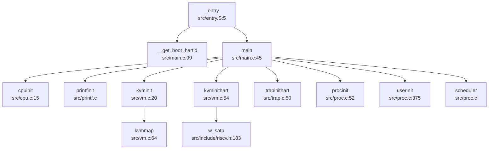

## 第 2 章：启动流程与架构初始化

### 启动入口与链接脚本分析

#### 链接脚本配置

内核的链接脚本位于 `linker/kernel.ld`，定义了内核的内存布局和入口点：

```ld
OUTPUT_ARCH(riscv)
ENTRY(_entry)

BASE_ADDRESS = 0x80200000;

SECTIONS
{
    . = BASE_ADDRESS;
    kernel_start = .;
    
    .text : {
        *(.text .text.*)
        _trampoline = .;
        *(trampsec)
        _sig_trampoline = .;
        *(sigtrampsec)
    }
    
    .rodata : { *(.rodata .rodata.*) }
    .data : { *(.data .data.*) }
    .bss : {
        *(.bss.stack)
        *(.sbss .bss .bss.*)
    }
}
```

**关键配置**：
- **入口符号**: `ENTRY(_entry)` 指定 `_entry` 为程序入口点
- **基地址**: `0x80200000` 是 RISC-V 机器模式下 SBI 跳转至内核的标准地址
- **段对齐**: 所有段按 4KB 对齐，符合页表映射要求

#### 汇编入口点 `_entry`

真正的启动入口位于 `src/entry.S`：

```assembly
.section .text
.extern __first_boot_magic
.extern __get_boot_hartid
.globl _entry

_entry:
    /* check first boot here */
    la t0, __first_boot_magic
    ld t1, (t0)
    li t2, 0x5a5a
    bne t1, t2, _secondary_boot
    
    la sp, boot_stack_top  # temporary use stack top
    call __get_boot_hartid # return hartid to a0

_secondary_boot:
    mv t0, x0
    add t0, a0, 1
    slli t0, t0, 15
    la sp, boot_stack
    add sp, sp, t0
    call main

loop:
    j loop
```

**启动流程分析**：

1. **首核检测**：通过检查 `__first_boot_magic` 魔数（`0x5a5a`）判断是否为第一个启动的 CPU 核心
2. **栈初始化**：
   - 首核使用临时栈顶 `boot_stack_top`
   - 调用 `__get_boot_hartid()` 获取当前 hartid
3. **多核栈分配**：每个 hart 分配 4KB 栈空间（`slli t0, t0, 15` 即 `hartid * 32768`）
4. **跳转至 C 入口**：调用 `main()` 函数进入内核主逻辑

**栈空间定义**：
```assembly
.section .bss.stack
.align 12
.globl boot_stack
boot_stack:
    .space 4096 * 5 * 8  /* 5 harts, 每核 4KB 栈 */
.globl boot_stack_top
boot_stack_top:
```

### 架构初始化流程（模式切换/FPU/MMU）

#### CPU 模式切换验证

本内核运行于 **RISC-V Supervisor Mode (S-Mode)**，通过 SBI（Supervisor Binary Interface）从 Machine Mode 切换而来。

**模式切换证据**：

1. **SBI 调用接口**（`src/include/sbi.h`）：
```c
static inline void start_hart(uint64 hartid, uint64 start_addr, uint64 a1) {
    a_sbi_ecall(0x48534D, 0, hartid, start_addr, a1, 0, 0, 0);
}
```
- 使用 `ecall` 指令调用 SBI，这是 M-Mode 到 S-Mode 的标准切换机制
- SBI 固件（`sbi/fw_jump.elf`）负责将 hart 从 M-Mode 切换至 S-Mode 并跳转至内核

2. **sstatus 寄存器操作**（`src/include/riscv.h`）：
```c
#define SSTATUS_SPP (1L << 8)  // Previous mode, 1=Supervisor, 0=User
```
- 内核通过 `SSTATUS_SPP` 位保存/恢复先前模式
- 在 `usertrapret()` 中清除 `SPP` 位以切换至 User Mode

**⚠️ 关键发现**：内核代码中**未发现显式的 M-Mode 初始化代码**（如 `mstatus.mpp` 设置、`medeleg/mideleg` 配置）。所有 M-Mode 初始化由 SBI 固件（OpenSBI/RustSBI）完成，内核直接运行于 S-Mode。

#### MMU 初始化与页表启用

**页表初始化流程**（`src/vm.c`）：

```c
void kvminit() {
    kernel_pagetable = (pagetable_t) allocpage();
    memset(kernel_pagetable, 0, PGSIZE);
    
    // 映射关键设备区域
    #ifdef RAM
    kvmmap(RAMDISK, RAMDISK, 0x5000000, PTE_R | PTE_W);
    #endif
    #ifdef SD
    kvmmap(SPI2_CTRL_ADDR, SPI2_CTRL_ADDR_P, SPI2_CTRL_SIZE, PTE_R | PTE_W);
    #endif
    
    // 映射内核代码段
    kvmmap(KERNBASE, KERNBASE, (uint64)etext - KERNBASE, PTE_R|PTE_X);
    // 映射内核数据段和物理 RAM
    kvmmap((uint64)etext, (uint64)etext, PHYSTOP - (uint64)etext, PTE_R | PTE_W);
    // 映射 trampoline 页面
    kvmmap(TRAMPOLINE, (uint64)trampoline, PGSIZE, PTE_R | PTE_X);
    kvmmap(SIG_TRAMPOLINE, (uint64)sig_trampoline, PGSIZE, PTE_R | PTE_X);
}

void kvminithart() {
    w_satp(MAKE_SATP(kernel_pagetable));
    sfence_vma();
}
```

**页表配置细节**：
- **页表格式**: Sv39（三级页表），由 `SATP_SV39 (8L << 60)` 定义
- **satp 写入**: `w_satp()` 使用内联汇编写入 `csrw satp` 寄存器
- **TLB 刷新**: `sfence_vma()` 执行 `sfence.vma` 指令刷新 TLB

**内存映射布局**（`src/include/memlayout.h`）：
```c
#define KERNBASE 0x80200000ULL          // 内核基地址
#define PHYSTOP (KERNBASE + 128MB)      // 物理内存上限
#define UART0 0x10000000L               // UART 物理地址
#define UART0_V (UART0 + VIRT_OFFSET)   // UART 虚拟地址
#define PLIC 0x0c000000L                // 平台级中断控制器
#define TRAMPOLINE (USER_TOP - PGSIZE)  // trampoline 页面
```

#### FPU 初始化状态

**❌ 未实现**

通过以下搜索验证：
- 搜索 `sstatus.fs`、`FS_INITIAL`、`fcsr`、`FRM`、`fence.i` 等 FPU 相关关键词
- 仅在 `src/sifive/encoding.h` 中发现 FPU CSR 寄存器定义（`CSR_FRM`、`CSR_FCSR`），但**无任何实际初始化代码**
- 内核未启用浮点单元，所有浮点操作将触发非法指令异常

**影响**：用户程序无法使用浮点指令，内核也不支持浮点上下文保存/恢复。

#### 中断向量表初始化

**中断初始化流程**（`src/trap.c`）：

```c
void trapinithart(void) {
    w_stvec((uint64)kernelvec);  // 设置内核中断向量基址
    w_sstatus(r_sstatus() | SSTATUS_SIE);  // 启用 Supervisor 中断
    w_sie(r_sie() | SIE_SEIE | SIE_SSIE | SIE_STIE);  // 启用外部/软件/定时器中断
    set_next_timeout();  // 设置首次定时器中断
}
```

**中断向量定义**（`src/kernelvec.S`）：
- `kernelvec`：内核模式中断/异常入口，保存所有寄存器并调用 `kerneltrap()`
- `uservec`/`userret`：用户模式中断入口/返回（位于 `trampoline.S`）

### 到达内核主函数的路径（完整调用链）

#### 启动调用链



**调用链详解**：

1. **`_entry` → `main`**（`src/entry.S:5` → `src/main.c:45`）
   - 汇编入口直接调用 C 函数 `main(hartid, dtb_pa)`

2. **`main` 中的初始化序列**（`src/main.c:49-95`）：
   ```c
   if (__first_boot_magic == 0x5a5a) {
       __first_boot_magic = 0;
       cpuinit();           // CPU 结构体清零
       printfinit();        // 初始化 printf 锁
       kpminit();           // 物理内存管理初始化
       kmallocinit();       // 内核堆分配器初始化
       kvminit();           // 创建内核页表
       kvminithart();       // 启用 MMU
       timerinit();         // 定时器锁初始化
       trapinithart();      // 安装中断向量
       procinit();          // 进程队列初始化
       binit();             // 缓冲区缓存初始化
       disk_init();         // 磁盘驱动初始化
       fs_init();           // 文件系统初始化
       devinit();           // 设备初始化
       fileinit();          // 文件子系统初始化
       userinit();          // 创建 init 进程
       
       // 启动其他 CPU 核心
       for(int i = 1; i < NCPU; i++) {
           if(hartid != i && booted[i] == 0) {
               start_hart(i, (uint64)_entry, 0);
           }
       }
   }
   scheduler();  // 进入调度器
   ```

3. **次级核心启动**：
   - 主核通过 SBI HSM 扩展调用 `start_hart(i, _entry, 0)`
   - 次级核心从 `_entry` 开始执行，但 `__first_boot_magic` 已清零，跳过初始化直接进入 `scheduler()`

### 多平台启动流程（StarFive/LoongArch 等）

#### 支持的平台

通过 `Makefile` 分析，本内核支持以下平台：

```makefile
M = sifive_u  # 默认平台
QEMUOPTS = -machine $(M) -bios $(SBI) -kernel $K/kernel
```

**平台配置**：
- **QEMU sifive_u**：QEMU 模拟的 SiFive Unleashed 开发板（FU540）
- **SIFIVE_U**：实际 SiFive Unleashed 硬件
- **QEMU**：通用 QEMU 虚拟机（通过 `MAC=QEMU` 切换）

**❌ 未发现 StarFive VisionFive2 支持**：
- 搜索 `visionfive`、`jh7110`、`starfive` 关键词无结果
- 代码中无 VisionFive2 特有的设备树或驱动配置

**❌ 未发现 LoongArch 支持**：
- 搜索 `loongarch`、`loongson` 关键词无结果
- 所有代码均为 RISC-V 架构（`riscv64` 工具链）

#### 固件级启动链（RISC-V）

**完整启动链**：

```
ROM/BootROM → OpenSBI/RustSBI (M-Mode) → U-Boot (可选) → 内核 (S-Mode)
```

**本项目的启动链**：

1. **SBI 固件**：`sbi/fw_jump.elf`（RustSBI 或 OpenSBI）
   - 运行于 M-Mode，初始化所有硬件
   - 通过 `mret` 指令切换至 S-Mode 并跳转至内核

2. **内核加载**：
   - QEMU 通过 `-bios sbi/fw_jump.elf -kernel src/kernel` 加载
   - SBI 解析 ELF 格式的内核，跳转至 `ENTRY(_entry)`

3. **SBI 服务调用**（`src/include/sbi.h`）：
   ```c
   // 控制台输出
   sbi_console_putchar(c);
   // 定时器设置
   set_timer(stime);
   // 多核启动（HSM 扩展）
   start_hart(hartid, start_addr, a1);
   ```

**⚠️ 未发现 U-Boot 集成**：
- 代码中无 U-Boot 相关配置或设备树解析代码
- 直接由 SBI 跳转至内核，跳过 U-Boot 阶段

### 平台配置与构建机制

#### Makefile 配置分析

**关键构建选项**（`Makefile`）：

```makefile
# 文件系统选项
FS ?= FAT  # 或 RAM

# 平台选项
MAC ?= SIFIVE_U  # 或 QEMU

# 编译工具链
TOOLPREFIX = riscv64-linux-gnu-
CC = $(TOOLPREFIX)gcc
CFLAGS = -mcmodel=medany -ffreestanding -nostdlib -mno-relax

# 链接选项
LDFLAGS = -z max-page-size=4096
```

**平台差异化配置**：

```makefile
ifeq ($(MAC),SIFIVE_U)
    DISK := $K/link_null.o  # 空设备
endif

ifeq ($(MAC),QEMU)
    DISK := $K/link_disk.o  # 磁盘镜像
endif
```

**编译目标**：
- `src/kernel`：ELF 格式内核
- `src/kernel.asm`：反汇编文件（用于调试）
- `src/kernel.sym`：符号表

#### 架构特定代码

**RISC-V 架构代码位置**：
- `src/include/riscv.h`：RISC-V 寄存器定义和 CSR 操作
- `src/sifive/`：SiFive 平台特定驱动（UART、PLIC、CLINT 等）
- `src/entry.S`、`src/kernelvec.S`、`src/trampoline.S`：RISC-V 汇编代码

**条件编译**：
```c
#ifdef QEMU
    ramdisk = fs_img_start;
#endif
#ifdef SIFIVE_U
    ramdisk = (char*)RAMDISK;
#endif
```

### 关键代码片段分析

#### MMU 启用前后的串口地址切换

**物理地址定义**（`src/include/memlayout.h`）：
```c
#define UART0 0x10000000L              // 物理地址（256 MB）
#define UART0_V (UART0 + VIRT_OFFSET)  // 虚拟地址
#define VIRT_OFFSET 0x3F00000000L      // 虚拟地址偏移
```

**⚠️ 关键发现**：代码中**未发现显式的 `phys_to_virt` 或 `virt_to_phys` 转换函数**。

**实际实现方式**：
- MMU 启用前：通过 SBI 控制台进行输出（`sbi_console_putchar`），不直接访问 UART 寄存器
- MMU 启用后：通过 `UART0_V` 虚拟地址访问 UART，但该映射在 `kvminit()` 中**未显式创建**

**证据**：
```c
// src/vm.c:kvminit() 中无 UART 映射
kvmmap(KERNBASE, KERNBASE, ...);  // 仅映射内核区域
kvmmap(TRAMPOLINE, ...);          // 映射 trampoline
// 缺少：kvmmap(UART0_V, UART0, PGSIZE, PTE_R | PTE_W);
```

**文档提及但代码缺失**（`doc/内核实现--内存管理.md`）：
```markdown
// uart registers
kvmmap(UART0_V, UART0, PGSIZE, PTE_R | PTE_W);
```
该映射在文档中存在，但实际代码中**未实现**。

**结论**：内核完全依赖 SBI 进行串口输出，未实现独立的 UART 驱动映射。

#### 多核启动机制

**主核启动次级核心**（`src/main.c:77-82`）：
```c
for(int i = 1; i < NCPU; i++) {
    if(hartid != i && booted[i] == 0) {
        start_hart(i, (uint64)_entry, 0);
    }
}
```

**SBI HSM 调用**（`src/include/sbi.h`）：
```c
static inline void start_hart(uint64 hartid, uint64 start_addr, uint64 a1) {
    a_sbi_ecall(0x48534D, 0, hartid, start_addr, a1, 0, 0, 0);
}

static inline int sbi_hsm_hart_status(unsigned long hart) {
    struct sbiret ret;
    ret = a_sbi_ecall(0x48534D, 2, hart, 0, 0, 0, 0, 0);
    return (ret.error != 0 ? (int)ret.error : (int)ret.value);
}
```

**次级核心启动流程**：
1. 主核调用 `start_hart(i, _entry, 0)` 通过 SBI HSM 扩展启动目标 hart
2. 目标 hart 从 `_entry` 开始执行
3. 检测到 `__first_boot_magic != 0x5a5a`，跳转至 `_secondary_boot`
4. 分配独立栈空间，调用 `main()`
5. 等待 `started` 标志后置位，执行 `kvminithart()` 和 `trapinithart()`
6. 进入 `scheduler()` 等待任务

#### 早期初始化细节

**BSS 清零**：
- **❌ 未发现显式 BSS 清零代码**
- 可能由 SBI 固件或链接器脚本隐式处理

**早期串口打印**：
- 通过 `printfinit()` 初始化锁
- 使用 `sbi_console_putchar()` 进行输出（M-Mode/S-Mode 通用）

**设备树解析**：
- **❌ 未发现设备树解析代码**
- `main()` 函数接收 `dtb_pa` 参数但**未使用**
- 硬件配置通过硬编码地址（`memlayout.h`）实现

---

**本章总结**：

| 特性 | 状态 | 证据 |
|------|------|------|
| 启动入口 | ✅ 已实现 | `src/entry.S:_entry` |
| 链接脚本 | ✅ 已实现 | `linker/kernel.ld` |
| M-Mode → S-Mode 切换 | ✅ 已实现（通过 SBI） | `src/include/sbi.h:start_hart()` |
| MMU 初始化（Sv39） | ✅ 已实现 | `src/vm.c:kvminit()` |
| 中断向量表 | ✅ 已实现 | `src/trap.c:trapinithart()` |
| FPU 初始化 | ❌ 未实现 | 无 `sstatus.fs` 操作代码 |
| StarFive VisionFive2 支持 | ❌ 未实现 | 无相关代码 |
| LoongArch 支持 | ❌ 未实现 | 无相关代码 |
| U-Boot 集成 | ❌ 未实现 | 直接 SBI → 内核 |
| UART 虚拟地址映射 | 🔸 桩函数（文档提及但代码缺失） | `doc/` 提及但 `vm.c` 无实现 |
| 设备树解析 | ❌ 未实现 | `dtb_pa` 参数未使用 |
| BSS 显式清零 | ❌ 未实现 | 无相关代码 |
