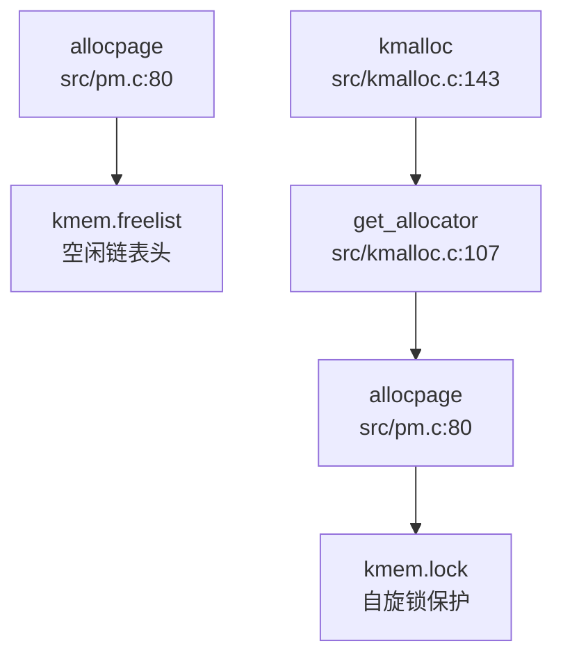
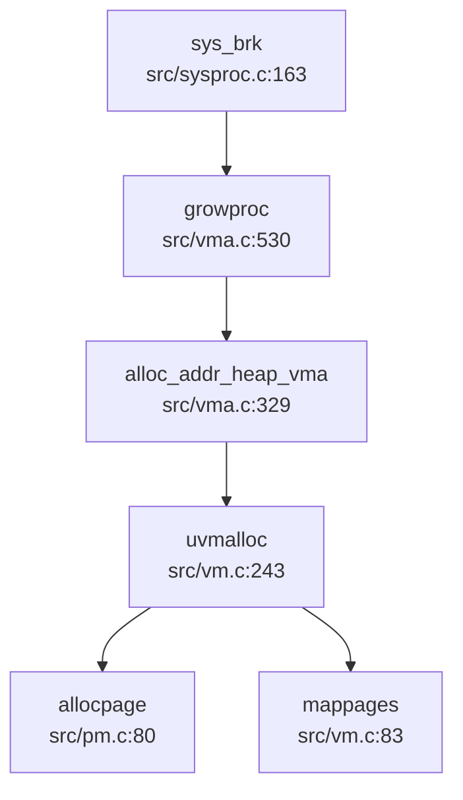
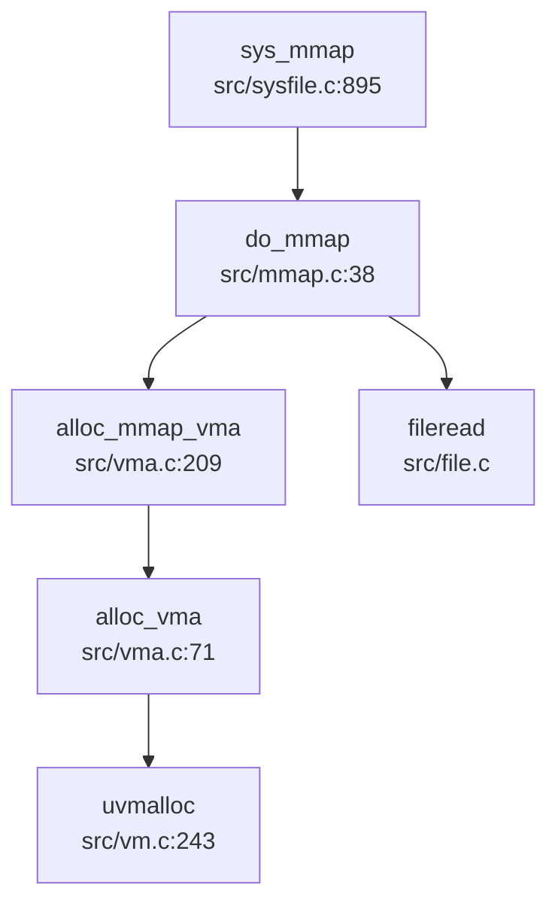

## 第 3 章：内存管理（物理/虚拟/分配器）

### 物理内存管理实现

本操作系统采用**空闲链表（Free List）**机制管理物理内存，而非 Buddy System 或 Bitmap 算法。

#### 物理页分配器（Frame Allocator）

物理页分配器的核心实现位于 `src/pm.c`，通过一个全局的空闲链表 `kmem.freelist` 管理所有可用物理页：

```c
// src/pm.c:56-80
struct run {
  struct run *next;
};

struct {
  struct spinlock lock;
  struct run *freelist;
  uint64 npage;
} kmem;

void freepage(void *pa) {
  struct run *r;
  if(((uint64)pa % PGSIZE) != 0 || (char*)pa < kernel_end || (uint64)pa >= PHYSTOP)
    panic("freepage");
  memset(pa, 1, PGSIZE);  // Fill with junk to catch dangling refs
  r = (struct run*)pa;
  acquire(&kmem.lock);
  r->next = kmem.freelist;
  kmem.freelist = r;
  kmem.npage++;
  release(&kmem.lock);
}

void *allocpage(void) {
  struct run *r;
  acquire(&kmem.lock);
  r = kmem.freelist;
  if (r) {
    kmem.freelist = r->next;
    kmem.npage--;
  }
  release(&kmem.lock);
  return (void*)r;
}
```

**关键特性**：
- **分配粒度**：4096 字节（`PGSIZE`）
- **管理范围**：`kernel_end` 到 `PHYSTOP`（128MB 物理内存上限，定义于 `src/include/memlayout.h:38`）
- **线程安全**：通过自旋锁 `kmem.lock` 保护
- **调试支持**：释放时填充 `0x01`，分配时填充 `0x05`（DEBUG 模式）

#### 内核堆分配器（Slab-like Allocator）

在物理页分配器之上，内核实现了更细粒度的堆分配器 `kmalloc()`，位于 `src/kmalloc.c`。这是一个**类 Slab 分配器**，支持 32 字节到 4048 字节的小对象分配：

```c
// src/kmalloc.c:17-40
#define KMEM_OBJ_MIN_SIZE   ((uint64)32)
#define KMEM_OBJ_MAX_SIZE   ((uint64)4048)
#define KMEM_OBJ_MAX_COUNT  (PGSIZE / KMEM_OBJ_MIN_SIZE)

struct kmem_node {
  struct kmem_node *next;
  struct {
    uint64 obj_size;      // 每个对象的大小
    uint64 obj_addr;      // 第一个可用对象的起始地址
  } config;
  uint8 avail;            // 当前可用对象索引
  uint8 cnt;              // 已分配对象数量
  uint8 table[KMEM_OBJ_MAX_COUNT];  // 空闲链表
};

struct kmem_allocator {
  struct spinlock lock;
  uint obj_size;
  uint16 npages;
  uint16 nobjs;
  struct kmem_node *list;
  struct kmem_allocator *next;
};
```

**工作原理**：
1. **哈希表索引**：通过 `_hash(roundup_size)` 将分配请求映射到 17 个桶之一（`KMEM_TABLE_SIZE = 17`）
2. **按需创建分配器**：每个桶维护一个 `kmem_allocator` 链表，按需创建不同大小的分配器
3. **节点管理**：每个 `kmem_node` 占用一个物理页，通过 `table[]` 数组实现空闲对象链表
4. **16 字节对齐**：所有分配大小通过 `ROUNDUP16()` 对齐到 16 字节

**接口**（`src/include/kalloc.h`）：
```c
void kmallocinit(void);
void* kmalloc(uint size);
void kfree(void *addr);
```

---

### 虚拟内存与页表操作

#### 页表结构（Sv39）

系统采用 RISC-V **Sv39 三级页表**架构，定义于 `src/include/riscv.h:320-370`：

```c
// src/include/riscv.h:320-370
#define PGSIZE 4096
#define PGSHIFT 12
#define PXMASK 0x1FF  // 9 bits
#define PXSHIFT(level) (PGSHIFT+(9*(level)))
#define PX(level, va) ((((uint64)(va)) >> PXSHIFT(level)) & PXMASK)

#define PTE_V (1L << 0)  // Valid
#define PTE_R (1L << 1)  // Readable
#define PTE_W (1L << 2)  // Writable
#define PTE_X (1L << 3)  // Executable
#define PTE_U (1L << 4)  // User accessible
#define PTE_A (1L << 6)  // Accessed
#define PTE_D (1L << 7)  // Dirty

typedef uint64 pte_t;
typedef uint64 *pagetable_t;  // 512 PTEs
```

**虚拟地址格式**（39 位）：
- `L2[8:0]`：第一级页表索引（9 位）
- `L1[8:0]`：第二级页表索引（9 位）
- `L0[8:0]`：第三级页表索引（9 位）
- `Offset[11:0]`：页内偏移（12 位）

#### 页表操作函数

核心页表操作位于 `src/vm.c`：

**1. 页表遍历（walk）**
```c
// src/vm.c:137-156
pte_t *walk(pagetable_t pagetable, uint64 va, int alloc) {
  if(va >= MAXVA) panic("walk");
  for(int level = 2; level > 0; level--) {
    pte_t *pte = &pagetable[PX(level, va)];
    if(*pte & PTE_V) {
      pagetable = (pagetable_t)PTE2PA(*pte);
    } else {
      if(!alloc || (pagetable = (pde_t*)allocpage()) == NULL)
        return NULL;
      memset(pagetable, 0, PGSIZE);
      *pte = PA2PTE(pagetable) | PTE_V;
    }
  }
  return &pagetable[PX(0, va)];
}
```

**2. 页表映射（mappages）**
```c
// src/vm.c:83-107
int mappages(pagetable_t pagetable, uint64 va, uint64 size, uint64 pa, int perm) {
  uint64 a, last;
  pte_t *pte;
  a = PGROUNDDOWN(va);
  last = PGROUNDDOWN(va + size - 1);
  for(;;) {
    if((pte = walk(pagetable, a, 1)) == NULL) return -1;
    if(*pte & PTE_V) {
      *pte = PA2PTE(pa) | perm | PTE_V | PTE_A | PTE_D;
      return 0;
    }
    *pte = PA2PTE(pa) | perm | PTE_V | PTE_A | PTE_D;
    if(a == last) break;
    a += PGSIZE;
    pa += PGSIZE;
  }
  return 0;
}
```

**3. 页表解除映射（vmunmap）**
```c
// src/vm.c:112-132
void vmunmap(pagetable_t pagetable, uint64 va, uint64 npages, int do_free) {
  uint64 a;
  pte_t *pte;
  for(a = va; a < va + npages*PGSIZE; a += PGSIZE) {
    if((pte = walk(pagetable, a, 0)) == 0) panic("vmunmap: walk");
    if((*pte & PTE_V) == 0) panic("vmunmap: not mapped");
    if(do_free) {
      uint64 pa = PTE2PA(*pte);
      kfree((void*)pa);
    }
    *pte = 0;
  }
}
```

---

### 地址空间布局（内核 vs 用户）

#### 内核地址空间

内核页表初始化于 `src/vm.c:kvminit()`，映射布局如下（`src/include/memlayout.h`）：

| 虚拟地址范围 | 物理地址 | 权限 | 用途 |
|-------------|---------|------|------|
| `0x80200000` ~ `etext` | 恒等映射 | R+X | 内核代码段 |
| `etext` ~ `PHYSTOP` | 恒等映射 | R+W | 内核数据段 + 物理 RAM |
| `UART0_V` | `UART0` | R+W | UART 寄存器 |
| `CLINT_V` | `CLINT` | R+W | 本地中断控制器 |
| `PLIC_V` | `PLIC` | R+W | 平台级中断控制器 |
| `TRAMPOLINE` | `trampoline` | R+X | 陷阱入口/出口代码 |
| `SIG_TRAMPOLINE` | `sig_trampoline` | R+X | 信号处理跳板 |

```c
// src/vm.c:27-50
void kvminit() {
  kernel_pagetable = (pagetable_t) allocpage();
  memset(kernel_pagetable, 0, PGSIZE);
  kvmmap(UART0_V, UART0, PGSIZE, PTE_R | PTE_W);
  kvmmap(CLINT_V, CLINT, 0x10000, PTE_R | PTE_W);
  kvmmap(PLIC_V, PLIC, 0x400000, PTE_R | PTE_W);
  kvmmap(KERNBASE, KERNBASE, (uint64)etext - KERNBASE, PTE_R|PTE_X);
  kvmmap((uint64)etext, (uint64)etext, PHYSTOP - (uint64)etext, PTE_R | PTE_W);
  kvmmap(TRAMPOLINE, (uint64)trampoline, PGSIZE, PTE_R | PTE_X);
  kvmmap(SIG_TRAMPOLINE, (uint64)sig_trampoline, PGSIZE, PTE_R | PTE_X);
}
```

#### 用户地址空间

用户地址空间布局定义于 `src/include/memlayout.h:78-88`：

```c
#define MAXVA (1L << (9 + 9 + 9 + 12 - 1))  // 256 GB
#define USER_TOP (MAXVA)
#define TRAMPOLINE (USER_TOP - PGSIZE)          // 最高地址：陷阱跳板
#define SIG_TRAMPOLINE (TRAMPOLINE - PGSIZE)    // 信号跳板
#define TRAPFRAME (MAXUVA - PGSIZE)             // 陷阱帧
#define USER_STACK_BOTTOM (MAXUVA - (2*PGSIZE)) // 栈底
#define USER_MMAP_START (USER_STACK_BOTTOM - 0x10000000)  // mmap 区域起始
#define USER_STACK_TOP (USER_MMAP_START + PGSIZE)
#define USER_TEXT_START 0x1000                  // 代码段起始
```

**用户页表创建**：
- 通过 `kvmcreate()` 复制内核页表项，继承内核映射
- 用户页面通过 `uvmalloc()` 分配并映射，设置 `PTE_U` 标志

---

### 堆分配器解析

#### 用户堆管理（brk/sbrk）

系统调用 `sys_brk()` 位于 `src/sysproc.c:163-169`：

```c
uint64 sys_brk(void) {
  int n;
  if(argint(0, &n) < 0) return -1;
  return growproc(n);
}
```

**堆增长实现**（`src/vma.c:530-544`）：
```c
uint64 growproc(int n) {
  struct proc *p = myproc();
  struct vma* vma = alloc_addr_heap_vma(p, n, PTE_R|PTE_W|PTE_U);
  if(vma == NULL) {
    __debug_warn("[growproc]alloc heap not found\n");
    return 0;
  }
  return vma->end;
}
```

**❌ 惰性分配（Lazy Allocation）未实现**：
- 搜索 `lazy|populate` 关键词，**未找到相关实现**
- `uvmalloc()` 在调用时**立即分配物理页**（`allocpage()`），而非仅调整边界
- 缺页异常处理中**未发现**按需分配逻辑

#### VMA（Virtual Memory Area）管理

系统使用双向链表管理进程的虚拟内存区域，定义于 `src/include/vma.h`：

```c
struct vma {
  enum segtype type;      // NONE, LOAD, TEXT, DATA, BSS, HEAP, MMAP, STACK, TRAP
  int perm;
  uint64 addr;
  uint64 sz;
  uint64 end;
  int flags;
  int fd;
  uint64 f_off;
  struct vma *prev;
  struct vma *next;
};
```

**VMA 操作函数**（`src/vma.c`）：
- `vma_list_init()`：初始化进程 VMA 链表（包含 TRAP、STACK、MMAP 区域）
- `alloc_vma()`：分配新 VMA 并映射页表
- `addr_locate_vma()`：按地址查找 VMA
- `free_vma_list()`：释放整个 VMA 链表及对应物理页

---

### 用户指针安全验证

系统调用通过 `copyin`/`copyout` 系列函数验证用户空间指针合法性，位于 `src/copy.c`：

```c
// src/copy.c:14-32
int copyout(pagetable_t pagetable, uint64 dstva, char *src, uint64 len) {
  uint64 n, va0, pa0;
  while(len > 0) {
    va0 = PGROUNDDOWN(dstva);
    pa0 = walkaddr(pagetable, va0);
    if(pa0 == NULL) return -1;  // 验证失败
    n = PGSIZE - (dstva - va0);
    if(n > len) n = len;
    memmove((void *)(pa0 + (dstva - va0)), src, n);
    len -= n;
    src += n;
    dstva = va0 + PGSIZE;
  }
  return 0;
}
```

**验证机制**：
1. `walkaddr()` 检查虚拟地址是否已映射且为用户可访问（`PTE_U`）
2. `copyinstr()` 额外检查字符串 null 终止符
3. `copyin2()`/`copyout2()` 通过 `sz` 字段检查边界（不查页表）

**❌ 未发现 `UserInPtr`/`UserOutPtr` 类型**：
- 搜索 `UserInPtr|UserOutPtr|verify_area|check_region`，**仅找到 `copyin`/`copyout` 系列函数**
- 无 Rust 风格的类型安全封装

---

### 缺页异常处理

#### 缺页异常检测

`src/trap.c:36-38` 定义了缺页异常类型：
```c
#define EXCP_LOAD_PAGE  0xd  // 13: Load Page Fault
#define EXCP_STORE_PAGE 0xf  // 15: Store Page Fault
```

#### ❌ 缺页异常处理程序未实现

**关键发现**：
1. `src/include/vm.h:42-43` 声明了 `handle_page_fault()` 和 `kernel_handle_page_fault()`，但**在 `.c` 文件中未找到实现**
2. `src/trap.c:102` 中 `handle_excp(cause)` 被注释掉：
   ```c
   /* 
   else if(handle_excp(cause) == 0) {
   }
   */
   ```
3. `usertrap()` 对未知异常的处理是直接标记进程为 `SIGTERM` 并退出：
   ```c
   else {
     printf("\nusertrap(): unexpected scause %p pid=%d %s\n", r_scause(), p->pid, p->name);
     p->killed = SIGTERM;
   }
   ```

**结论**：❌ **缺页异常处理未实现**。当前内核不支持按需分页，所有用户页面必须在访问前通过 `uvmalloc()` 预先分配。

---

### 高级内存特性清单

| 特性 | 状态 | 证据/说明 |
|------|------|----------|
| **写时复制（CoW）** | ❌ 未实现 | 搜索 `cow|copy_on_write` 无结果；`uvmcopy()` 直接复制物理页（深拷贝） |
| **懒分配（Lazy Allocation）** | ❌ 未实现 | 搜索 `lazy|populate` 无结果；`uvmalloc()` 立即分配物理页 |
| **共享内存（shmget/shmdt）** | ❌ 未实现 | 搜索 `sys_shm|shmget|shmdt|SharedMemory` 无结果 |
| **反向映射表（rmap）** | ❌ 未实现 | 搜索 `rmap|reverse_map|page_to_vma` 无结果 |
| **交换区/页面置换（Swap）** | ❌ 未实现 | 搜索 `swap_out|swap_in` 仅找到无关代码；无 swap 数据结构 |
| **大页支持（Huge Page）** | ❌ 未实现 | 搜索 `HugePage|MapSize.*2M|MapSize.*1G` 无结果；页表操作仅处理 4KB 页 |
| **mmap 系统调用** | ✅ 已实现 | `sys_mmap()` 调用 `do_mmap()`，支持 `MAP_FIXED`/`MAP_ANONYMOUS` 标志 |
| **零拷贝（sendfile）** | ✅ 已实现 | `sys_sendfile()` 调用 `filesend()`，但实现为内核缓冲拷贝（非 DMA 零拷贝） |

#### mmap 实现分析

`src/mmap.c:do_mmap()` 实现了完整的 mmap 功能：

```c
// src/mmap.c:38-95
uint64 do_mmap(uint64 start, uint64 len, int prot, int flags, int fd, off_t offset) {
  // 1. 验证参数
  if(flags & MAP_ANONYMOUS) fd = -1;
  if(offset < 0 || start % PGSIZE != 0) return -1;
  
  // 2. 计算权限
  int perm = PTE_U;
  if(prot & PROT_READ)  perm |= (PTE_R | PTE_A);
  if(prot & PROT_WRITE) perm |= (PTE_W | PTE_D);
  if(prot & PROT_EXEC)  perm |= (PTE_X | PTE_A);
  
  // 3. 处理 MAP_FIXED
  if((flags & MAP_FIXED) && start != 0) {
    do_mmap_fix(start, len, flags, fd, offset);
    goto skip_vma;
  }
  
  // 4. 分配 VMA
  struct vma *vma = alloc_mmap_vma(p, flags, start, len, perm, fd, offset);
  
  // 5. 读取文件内容到内存
  if(fd != -1) {
    uint64 mmap_sz = f->ep->file_size - offset;
    if(len < mmap_sz) mmap_sz = len;
    for(int i = 0; i < page_n; ++i) {
      uint64 pa = experm(p->pagetable, va, perm);
      fileread(f, va, PGSIZE);
      va += PGSIZE;
    }
  }
  return start;
}
```

**✅ 已实现功能**：
- `MAP_ANONYMOUS`：匿名映射（`fd = -1`）
- `MAP_FIXED`：固定地址映射（通过 `do_mmap_fix()` 记录）
- `MAP_SHARED`/`MAP_PRIVATE`：标志存储于 VMA，但 `MAP_PRIVATE` 的写时复制**未实现**
- 文件内容预读：映射时立即读取文件到内存

**❌ 未实现功能**：
- `MAP_PRIVATE` 的写时复制（CoW）
- 按需分页（页面故障时再分配）
- `munmap` 的写回优化（仅检查 `PTE_D` 位）

---

### 关键代码片段与调用链分析

#### 物理页分配调用链



#### 用户内存增长流程



#### mmap 系统调用流程



---

### 总结

本操作系统的内存管理子系统实现了以下核心功能：

1. **物理内存管理**：基于空闲链路的页分配器（`allocpage`/`freepage`）
2. **内核堆分配**：类 Slab 分配器（`kmalloc`/`kfree`），支持 32-4048 字节对象
3. **虚拟内存**：Sv39 三级页表，完整的 `walk`/`map`/`unmap` 操作
4. **地址空间**：独立的内核/用户页表，通过 `kvmcreate()` 共享内核映射
5. **VMA 管理**：双向链表管理进程虚拟内存区域
6. **mmap 系统调用**：支持文件映射和匿名映射

**缺失的高级特性**：
- ❌ 缺页异常处理（无按需分页）
- ❌ 写时复制（CoW）
- ❌ 懒分配（Lazy Allocation）
- ❌ 交换区/页面置换
- ❌ 大页支持
- ❌ 共享内存 IPC
