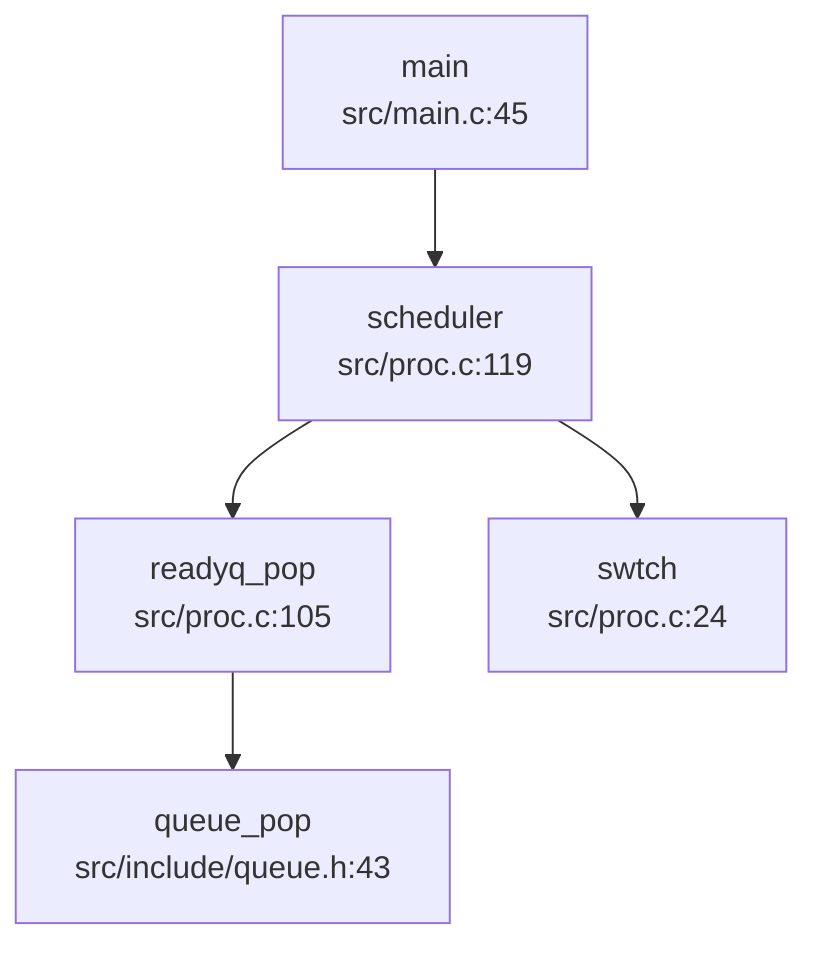
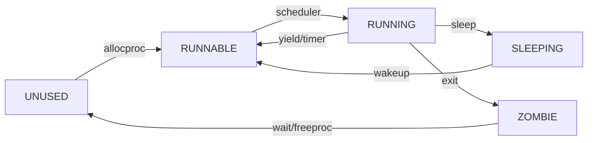
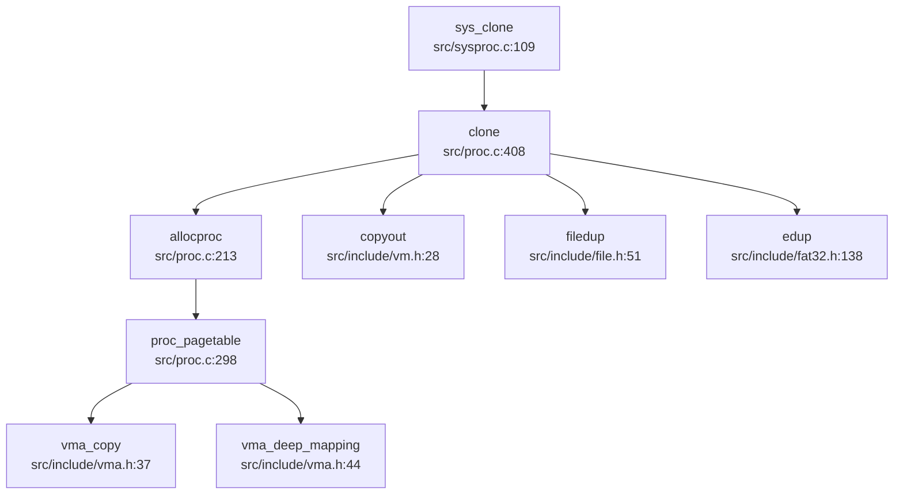
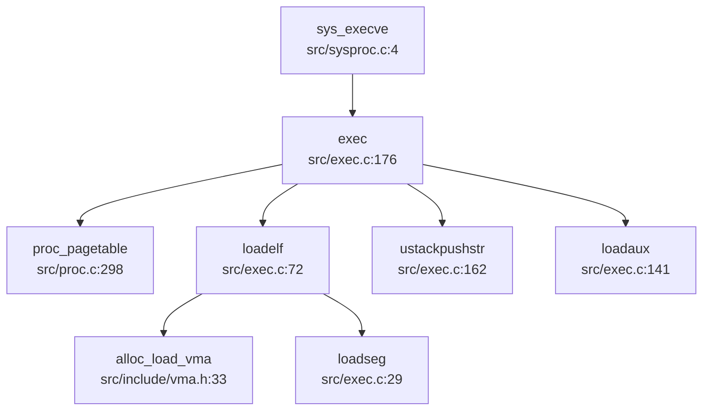
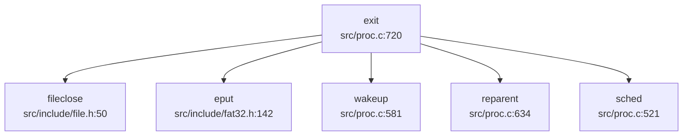

## 第 4 章：进程/线程与调度机制

### 任务模型与核心数据结构

本 OS 采用统一的 `struct proc` 结构体来表示执行实体（进程/线程），未严格区分 PCB 与 TCB。核心定义位于 `src/include/proc.h:115-171`。

#### `struct proc` 关键字段

```c
struct proc {
  int magic;
  struct spinlock lock;
  enum procstate state;        // 进程状态
  struct proc *parent;         // 父进程
  void *chan;                  // 睡眠通道
  int killed;                  // 被杀死标志
  int xstate;                  // 退出状态
  int pid;                     // 进程 ID
  int uid, gid;                // 用户/组 ID

  uint64 kstack;               // 内核栈虚拟地址
  uint64 sz;                   // 进程内存大小
  pagetable_t pagetable;       // 用户页表
  struct trapframe *trapframe; // 陷阱帧（用户寄存器保存）
  struct context context;      // 上下文（内核寄存器）
  
  struct file **ofile;         // 打开文件表
  struct dirent *cwd;          // 当前目录
  char name[16];               // 进程名
  
  struct vma *vma;             // 虚拟内存区域链表
  map_fix *mf;                 // 内存映射修复结构
  
  // 信号机制
  ksigaction_t *sig_act;       // 信号处理动作
  __sigset_t sig_set;          // 阻塞信号掩码
  __sigset_t sig_pending;      // 待处理信号
  struct sig_frame *sig_frame; // 信号栈帧链表
  
  // 线程支持
  uint64 set_child_tid;        // 子线程 TID 设置地址
  uint64 clear_child_tid;      // 清除子线程 TID 地址
  struct robust_list_head *robust_list; // 健壮互斥列表
};
```

#### `struct context`（上下文切换寄存器）

定义于 `src/include/cpu.h:9-24`，保存callee-saved寄存器：
```c
struct context {
  uint64 ra, sp;          // 返回地址、栈指针
  uint64 s0-s11;          // 被调用者保存寄存器
};
```

#### `struct trapframe`（用户态寄存器保存）

定义于 `src/include/trap.h:18-54`，包含所有用户寄存器（ra, sp, gp, tp, t0-t6, s0-s11, a0-a7），在系统调用/中断时保存用户态上下文。

---

### 调度算法与策略（代码证据）

#### 调度器实现

调度器位于 `src/proc.c:119-152`，采用**简单的 FIFO 轮转调度**（无优先级、无时间片轮转）。

```c
void scheduler(){
  struct cpu *c = mycpu();
  c->proc = 0;
  while(1){
    struct proc* p = readyq_pop();  // 从就绪队列取出
    if(p){
      acquire(&p->lock);
      if(p->state == RUNNABLE) {
        p->state = RUNNING;
        c->proc = p;
        w_satp(MAKE_SATP(p->pagetable));
        sfence_vma();
        swtch(&c->context, &p->context);  // 上下文切换
        w_satp(MAKE_SATP(kernel_pagetable));
        sfence_vma();
        c->proc = 0;
      }
      release(&p->lock);
    }else{
      intr_on();
      asm volatile("wfi");  // 无进程可运行时进入低功耗
    }
  }
}
```

#### 就绪队列实现

就绪队列为全局单队列 `readyq`（`src/proc.c:29`），使用 `queue_push`/`queue_pop` 操作（`src/include/queue.h:36-52`），本质是**FIFO 链表**。

**关键证据**：`scheduler()` 直接调用 `readyq_pop()` 获取下一个进程，未进行任何优先级比较或时间片计算。

#### 调度器调用链



**调度触发点**：
1. `main()` 启动后进入 `scheduler()` 死循环
2. `yield()`（`src/proc.c:618`）主动让出 CPU
3. `sched()`（`src/proc.c:521`）被动调度（如 `sleep()`、`exit()`）
4. 定时器中断触发 `yield()`（`src/trap.c:133`）

**❌ 未实现优先级调度**：代码中未发现 `priority`、`stride`、`CFS` 等相关字段或算法。

---

### 任务状态机

#### 进程状态定义

定义于 `src/include/proc.h:89`：
```c
enum procstate { UNUSED, SLEEPING, RUNNABLE, RUNNING, ZOMBIE };
```

#### 状态流转

| 状态 | 转换条件 | 代码位置 |
|------|----------|----------|
| **UNUSED → RUNNABLE** | `allocproc()` 分配后设置 `state = RUNNABLE` | `src/proc.c:213-294` |
| **RUNNABLE → RUNNING** | `scheduler()` 选中进程 | `src/proc.c:132` |
| **RUNNING → RUNNABLE** | `yield()` 主动让出 | `src/proc.c:618` |
| **RUNNING → SLEEPING** | `sleep()` 等待事件 | `src/proc.c:553` |
| **SLEEPING → RUNNABLE** | `wakeup()` 唤醒 | `src/proc.c:581` |
| **RUNNING → ZOMBIE** | `exit()` 退出 | `src/proc.c:720` |
| **ZOMBIE → UNUSED** | `wait4pid()` 回收后 `freeproc()` | `src/proc.c:678` |

#### 状态流转图



---

### 上下文切换实现（汇编分析）

#### `swtch.S` 汇编代码

位于 `src/swtch.S:1-42`，保存/恢复 callee-saved 寄存器：

```assembly
.globl swtch
swtch:
        # 保存旧上下文到 old (a0)
        sd ra, 0(a0)
        sd sp, 8(a0)
        sd s0, 16(a0)
        # ... 保存 s1-s11 (省略)

        # 从 new (a1) 恢复新上下文
        ld ra, 0(a1)
        ld sp, 8(a1)
        ld s0, 16(a1)
        # ... 恢复 s1-s11 (省略)

        ret
```

#### 保存的寄存器列表

| 寄存器 | 偏移量 | 用途 |
|--------|--------|------|
| ra | 0 | 返回地址 |
| sp | 8 | 栈指针 |
| s0-s11 | 16-104 | 被调用者保存寄存器 |

**注意**：`swtch()` **不保存** caller-saved 寄存器（t0-t6, a0-a7），因为这些寄存器在调用 `swtch()` 前已由编译器保存到栈上。

#### 上下文切换流程

1. `scheduler()` 调用 `swtch(&c->context, &p->context)`
2. 保存当前 CPU 的 `context` 到 `c->context`
3. 恢复目标进程的 `context` 到 CPU 寄存器
4. `ret` 跳转到目标进程的 `context.ra`（通常是 `forkret` 或 `sched` 的返回点）

---

### 进程间通信与同步（Signal/Futex）

#### 信号机制（Signal）

**✅ 已实现**（部分实现）

##### 核心数据结构

定义于 `src/include/signal.h:35-51`：
```c
struct sigaction {
  union {
    __sighandler_t sa_handler;  // 信号处理函数
  } __sigaction_handler;
  __sigset_t sa_mask;           // 阻塞掩码
  int sa_flags;
};

typedef struct __ksigaction_t {
  struct __ksigaction_t *next;
  struct sigaction sigact;
  int signum;
} ksigaction_t;

struct sig_frame {
  __sigset_t mask;
  struct trapframe *tf;
  struct sig_frame *next;
};
```

##### 信号处理流程

1. **注册信号处理函数**：`sys_rt_sigaction()`（`src/syssig.c:54-85`）调用 `set_sigaction()`（`src/signal.c:53-82`）
2. **发送信号**：`sys_kill()`（`src/syssig.c:87-93`）调用 `kill()`（`src/proc.c:752-770`）设置 `p->sig_pending` 和 `p->killed`
3. **信号分发**：`usertrap()` 检查 `p->killed` 后调用 `sighandle()`（`src/signal.c:118-170`）
4. **信号返回**：`sys_rt_sigreturn()` 调用 `sigreturn()` 恢复 `trapframe`

##### 支持的信号

定义于 `src/include/signal.h:10-20`：
- `SIGTERM(15)`, `SIGKILL(9)`, `SIGABRT(6)`, `SIGHUP(1)`, `SIGINT(2)`, `SIGQUIT(3)`, `SIGILL(4)`, `SIGTRAP(5)`, `SIGCHLD(17)`
- `SIGRTMIN(34)` 到 `SIGRTMAX(64)`

**🔸 桩函数/限制**：
- `SIGSET_LEN` 定义为 1（`src/include/signal.h:32`），仅支持 64 个信号中的前 64 位（实际只用了低 34 位）
- `sa_mask` 未完全实现（`signal.c:143-153` 注释掉）
- `siginfo_t` 未实现（仅支持简单 `sa_handler`）

#### Futex 机制

**🔸 桩函数**（接口存在，实现不完整）

##### 接口定义

定义于 `src/include/proc.h:18-50`：
```c
#define FUTEX_WAIT  0
#define FUTEX_WAKE  1
#define FUTEX_REQUEUE  3
// ... 共 15 种操作
```

函数声明：`src/include/proc.h:199`
```c
int do_futex(int* uaddr, int futex_op, int val, ktime_t *timeout, int *addr2, int val2, int val3);
```

##### 实现状态

**❌ 未找到 `do_futex()` 的具体实现**。仅在文档 `doc/内核实现--Futex.md` 中描述了设计思路，但源代码中未找到对应的实现函数。

**文档提及但未见代码**：
- `futex_wait()`, `futex_wake()`, `futex_requeue()` 等辅助函数未在代码中找到
- `sys_futex` 系统调用未在 `syscall/syscall.c` 的系统调用表中找到

**结论**：Futex 机制**仅有接口定义和文档规划**，**未实际实现**。

---

### 关键流程追踪（Fork/Exec/Schedule/Exit）

#### `fork()` 实现分析

**❌ 未找到 `sys_fork` 系统调用**。代码中仅发现 `clone()` 系统调用（`SYS_clone = 220`），`fork()` 通过 `clone(0, 0, 0, 0, 0)` 实现。

##### `clone()` 调用链



##### `clone()` 关键逻辑（`src/proc.c:408-492`）

1. **进程/线程判断**：
   ```c
   if((flag & CLONE_THREAD) && (flag & CLONE_VM)) {
     // 线程创建：共享地址空间（浅拷贝 VMA）
     np = allocproc(p, 1);  // thread_create=1
   } else {
     // 进程创建：独立地址空间（深拷贝 VMA）
     np = allocproc(p, 0);  // thread_create=0
   }
   ```

2. **地址空间复制**（`proc_pagetable()` → `vma_copy()` + `vma_deep_mapping()`）：
   - **深拷贝**：为子进程分配新物理页，复制父进程内容（`vma_deep_mapping()`）
   - **浅拷贝**：共享父进程物理页，设置写时复制（`vma_shallow_mapping()`）— **但代码中未实现 CoW**

3. **文件表复制**：
   ```c
   for(i = 0; i < NOFILE; i++)
     if(p->ofile[i])
       np->ofile[i] = filedup(p->ofile[i]);  // 引用计数 +1
   np->cwd = edup(p->cwd);
   ```

4. **Trapframe 复制**：
   ```c
   *(np->trapframe) = *(p->trapframe);
   np->trapframe->a0 = 0;  // 子进程返回 0
   ```

**✅ 已实现**：地址空间复制（深拷贝）、文件表复制、Trapframe 复制

**❌ 未实现**：写时复制（CoW）机制（`vma_shallow_mapping()` 未设置 CoW 标志）

#### `exec()` 实现分析

**✅ 已实现**（`src/exec.c:1-378`）

##### 调用链



##### 关键步骤

1. **创建新页表**：`proc_pagetable(np, 0, 0)` 分配空页表
2. **加载 ELF**：`loadelf()` 解析 ELF 头，遍历 Program Header
3. **分配 VMA**：`alloc_load_vma()` 为每个 LOAD 段分配虚拟内存区域
4. **加载段内容**：`loadseg()` 从文件读取数据到物理页
5. **构建用户栈**：
   - 压入 argv 字符串
   - 压入 env 字符串
   - 压入 auxv（`AT_PAGESZ`, `AT_PHDR`, `AT_RANDOM` 等）
   - 设置 `sp`, `a0(argc)`, `a1(argv)`
6. **切换页表**：交换 `p->pagetable` 和 `np->pagetable`

**✅ 已实现**：ELF 加载、地址空间重建、栈初始化、auxv 传递

#### `schedule()` 调用分析

**谁调用 `schedule()`？**

通过 `lsp_get_call_graph` 分析（`direction="both"`）：

**入向调用**：
- `main()`（`src/main.c:45`）— 初始调度器启动

**出向调用**：
- `readyq_pop()` — 从就绪队列取进程
- `swtch()` — 执行上下文切换
- `w_satp()`, `sfence_vma()` — 切换页表

**实际调度触发**：
1. `yield()` → `sched()` → `swtch()`
2. `sleep()` → `sched()` → `swtch()`
3. `exit()` → `sched()` → `swtch()`

**❌ 未实现优先级调度**：`readyq_pop()` 直接返回队列头，未进行优先级比较。

#### `exit()` 资源回收流程

**✅ 已实现**（`src/proc.c:720-749`）

##### 调用链



##### 回收步骤

1. **关闭文件**：遍历 `ofile[]`，调用 `fileclose()`
2. **释放当前目录**：`eput(p->cwd)`
3. **唤醒父进程**：`wakeup(getparent(p))`
4. **重绑定子进程**：`reparent(p)` 将子进程的父进程设为 `initproc`
5. **设置退出状态**：`p->xstate = n`
6. **状态设为 ZOMBIE**：`p->state = ZOMBIE`
7. **调度**：`sched()` 永不返回

**父进程回收**：`wait4pid()`（`src/proc.c:651-678`）调用 `freeproc()` 释放资源。

---

### 进程/线程管理模块扩展

#### 进程组与会话管理

**❌ 未实现**

搜索 `pgid|session_id|set_sid|setpgid|getsid|getpgid` 未找到任何相关代码。

**结论**：该 OS **未实现** POSIX 进程组（Process Group）和会话（Session）机制。

#### 层次结构 ID 规则

**❌ 未实现**

- 无 PGID（进程组 ID）概念
- 无 SID（会话 ID）概念
- 仅支持单一 PID 分配（`allocpid()` 全局自增）

#### POSIX 资源限制（rlimit）

**🔸 桩函数**（仅定义结构，未实现系统调用）

##### 定义

`src/include/proc.h:91-111` 定义了完整的 POSIX 资源限制：
```c
#define RLIMIT_CPU     0
#define RLIMIT_FSIZE   1
#define RLIMIT_DATA    2
#define RLIMIT_STACK   3
#define RLIMIT_CORE    4
#define RLIMIT_RSS     5
#define RLIMIT_NPROC   6
#define RLIMIT_NOFILE  7
#define RLIMIT_MEMLOCK 8
#define RLIMIT_AS      9
#define RLIMIT_LOCKS   10
#define RLIMIT_SIGPENDING 11
#define RLIMIT_MSGQUEUE 12
#define RLIMIT_NICE    13
#define RLIMIT_RTPRIO  14
#define RLIMIT_RTTIME  15
#define RLIMIT_NLIMITS 16

struct rlimit {
  rlim_t rlim_cur;
  rlim_t rlim_max;
};
```

##### 实现状态

**❌ 未找到 `getrlimit()`、`setrlimit()`、`sys_prlimit64()` 的实现**。

仅在文档 `doc/内核实现--信号相关.md:160` 中提到 `SYS_prlimit64`，但代码中未找到对应的系统调用处理函数。

**结论**：资源限制机制**仅有结构体定义**，**未实现任何系统调用**。

#### 线程支持

**✅ 已实现**（通过 `clone()` 系统调用）

##### 线程与进程的区别

代码中**未区分 TCB 和 PCB**，统一使用 `struct proc`：
- **进程**：`clone(0, 0, 0, 0, 0)` — 独立地址空间（`CLONE_VM` 未设置）
- **线程**：`clone(CLONE_THREAD|CLONE_VM, stack, ptid, tls, ctid)` — 共享地址空间

##### 线程特性

1. **共享资源**（当 `CLONE_VM` 设置时）：
   - 页表（`pagetable`）
   - VMA 链表（`vma`）
   - 文件表（通过 `filedup()` 共享）

2. **独立资源**：
   - 内核栈（`kstack`）
   - Trapframe（`trapframe`）
   - Context（`context`）
   - PID（`pid`）— 线程 ID 即 PID

3. **线程清理**：
   - `clear_child_tid`：线程退出时唤醒等待的线程（`futex()` 调用 — **但 futex 未实现**）
   - `set_child_tid`：设置子线程 TID

---

### 本章总结

| 特性 | 实现状态 | 证据 |
|------|----------|------|
| **进程/线程模型** | ✅ 已实现 | `struct proc` 统一表示，`clone()` 支持线程 |
| **调度算法** | ✅ FIFO 轮转 | `scheduler()` 直接 `readyq_pop()`，无优先级 |
| **上下文切换** | ✅ 已实现 | `swtch.S` 保存/恢复 14 个寄存器 |
| **进程状态机** | ✅ 已实现 | 5 状态（UNUSED/RUNNABLE/RUNNING/SLEEPING/ZOMBIE） |
| **信号机制** | ✅ 部分实现 | 支持 9 种基本信号，`sigaction`/`kill` 已实现 |
| **Futex** | ❌ 未实现 | 仅接口定义，无 `do_futex()` 实现 |
| **fork()** | ✅ 通过 `clone()` 实现 | 地址空间深拷贝，文件表复制 |
| **exec()** | ✅ 已实现 | ELF 加载、地址空间重建、栈初始化 |
| **exit()/wait()** | ✅ 已实现 | 资源回收、ZOMBIE 状态、父进程通知 |
| **进程组/会话** | ❌ 未实现 | 无 PGID/SID 相关代码 |
| **资源限制 (rlimit)** | 🔸 桩函数 | 仅结构体定义，无系统调用 |
| **写时复制 (CoW)** | ❌ 未实现 | `vma_shallow_mapping()` 未设置 CoW |
