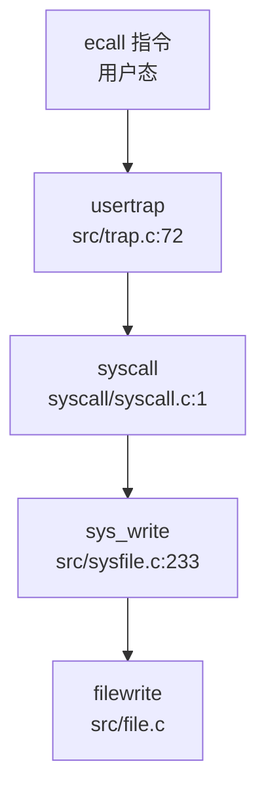

## 第 5 章：中断、异常与系统调用

### Trap 处理流程（用户态 <-> 内核态）

本操作系统的 Trap 处理机制采用 RISC-V 标准的 `sret`/`sepc` 机制实现用户态与内核态之间的切换。Trap 入口分为两种场景：

1. **用户态 Trap**：通过 `trampoline.S` 中的 `uservec` 入口处理
2. **内核态 Trap**：通过 `kernelvec.S` 中的 `kernelvec` 入口处理

#### 用户态 Trap 入口流程

用户态程序触发 Trap（系统调用 `ecall`、异常或中断）时，硬件自动保存 `sepc` 和 `sstatus`，然后跳转到 `stvec` 寄存器指向的地址。在用户态执行时，`stvec` 指向 `TRAMPOLINE + (uservec - trampoline)`。

**`uservec` 汇编代码**（`src/trampoline.S:17-85`）执行以下关键操作：

```assembly
uservec:    
    # swap a0 and sscratch, so that a0 is TRAPFRAME
    csrrw a0, sscratch, a0
    
    # save all user registers to TRAPFRAME (ra, sp, gp, tp, t0-t6, s0-s11, a0-a7)
    sd ra, 40(a0)
    sd sp, 48(a0)
    # ... 保存所有寄存器 ...
    
    # restore kernel stack pointer from p->trapframe->kernel_sp
    ld sp, 8(a0)
    
    # load the address of usertrap()
    ld t0, 16(a0)
    
    # restore kernel page table
    ld t1, 0(a0)
    csrw satp, t1
    sfence.vma
    
    # jump to usertrap()
    jr t0
```

**`usertrap()` 函数**（`src/trap.c:72-145`）是用户态 Trap 的 C 语言处理入口：

```c
void usertrap(void) {
  int which_dev = 0;
  
  if((r_sstatus() & SSTATUS_SPP) != 0)
    panic("usertrap: not from user mode");
  
  // 切换到内核态 Trap 向量
  w_stvec((uint64)kernelvec);
  
  struct proc *p = myproc();
  p->trapframe->epc = r_sepc();  // 保存断点
  
  uint64 cause = r_scause();
  
  if(cause == EXCP_ENV_CALL){  // 系统调用 (ecall)
    p->trapframe->epc += 4;    // 跳过 ecall 指令
    intr_on();
    syscall();
  } 
  else if((which_dev = devintr()) != 0){
    // 设备中断处理
  }
  else if(cause == 3){  // ebreak
    printf("ebreak\n");
    trapframedump(p->trapframe);
    p->trapframe->epc += 2;
  }
  else {
    // 未预期的异常
    p->killed = SIGTERM;
  }
  
  // 信号处理
  if (p->killed) {
    if (SIGTERM == p->killed)
      exit(-1);
    sighandle();
  }
  
  // 时钟中断触发调度
  if(which_dev == 2)
    yield();
    
  usertrapret();
}
```

#### 中断与异常的区分

在 `src/trap.c:20-39` 中定义了中断和异常的区分逻辑：

```c
// Interrupt flag: set 1 in the Xlen - 1 bit
#define INTERRUPT_FLAG    0x8000000000000000L

// Supervisor interrupt number
#define INTR_SOFTWARE    (0x1 | INTERRUPT_FLAG)
#define INTR_TIMER       (0x5 | INTERRUPT_FLAG)
#define INTR_EXTERNAL    (0x9 | INTERRUPT_FLAG)

// Supervisor exception number
#define EXCP_LOAD_ACCESS  0x5
#define EXCP_STORE_ACCESS 0x7
#define EXCP_ENV_CALL     0x8      // 系统调用
#define EXCP_LOAD_PAGE    0xd      // 取页异常
#define EXCP_STORE_PAGE   0xf      // 存页异常
```

**区分机制**：
- **中断**：`scause` 最高位为 1（`0x8000000000000000L`），低 11 位表示中断类型
- **异常**：`scause` 最高位为 0，低 12 位表示异常类型

`devintr()` 函数（`src/trap.c:188-229`）负责设备中断的分发：

```c
int devintr(void) {
  uint64 scause = r_scause();
  
  // 外部中断 (scause = 0x8000000000000009)
  if ((0x8000000000000000L & scause) && 9 == (scause & 0xff)) {
    // PLIC 中断处理（当前代码中 irq 始终为 0，未完全实现）
    return 1;
  }
  // 定时器中断 (scause = 0x8000000000000005)
  else if (0x8000000000000005L == scause) {
    timer_tick();
    return 2;  // 返回 2 表示时钟中断
  }
  else { return 0; }  // 非设备中断
}
```

### 异常向量表与入口

#### TrapFrame 结构体定义

**`struct trapframe`**（`src/include/trap.h:17-56`）用于保存用户态上下文，共包含 **28 个寄存器字段**，总大小为 **28 × 8 = 224 字节**：

```c
struct trapframe {
  /*   0 */ uint64 kernel_satp;   // 内核页表基址
  /*   8 */ uint64 kernel_sp;     // 内核栈顶
  /*  16 */ uint64 kernel_trap;   // usertrap() 函数地址
  /*  24 */ uint64 epc;           // 用户态程序计数器
  /*  32 */ uint64 kernel_hartid; // CPU 核心 ID
  /*  40 */ uint64 ra;
  /*  48 */ uint64 sp;
  /*  56 */ uint64 gp;
  /*  64 */ uint64 tp;
  /*  72 */ uint64 t0;
  /*  80 */ uint64 t1;
  /*  88 */ uint64 t2;
  /*  96 */ uint64 s0;
  /* 104 */ uint64 s1;
  /* 112 */ uint64 a0;  // 系统调用返回值
  /* 120 */ uint64 a1;
  /* 128 */ uint64 a2;
  /* 136 */ uint64 a3;
  /* 144 */ uint64 a4;
  /* 152 */ uint64 a5;
  /* 160 */ uint64 a6;
  /* 168 */ uint64 a7;  // 系统调用号
  /* 176 */ uint64 s2;
  /* 184 */ uint64 s3;
  /* 192 */ uint64 s4;
  /* 200 */ uint64 s5;
  /* 208 */ uint64 s6;
  /* 216 */ uint64 s7;
  /* 224 */ uint64 s8;
  /* 232 */ uint64 s9;
  /* 240 */ uint64 s10;
  /* 248 */ uint64 s11;
  /* 256 */ uint64 t3;
  /* 264 */ uint64 t4;
  /* 272 */ uint64 t5;
  /* 280 */ uint64 t6;
};
```

**寄存器统计**：
- **通用寄存器**：`ra`, `sp`, `gp`, `tp`, `t0-t6`, `s0-s11`, `a0-a7` 共 23 个
- **控制寄存器**：`kernel_satp`, `kernel_sp`, `kernel_trap`, `epc`, `kernel_hartid` 共 5 个
- **总计**：28 个 `uint64` 字段，224 字节

#### 上下文保存与恢复

**保存流程**（`trampoline.S:uservec`）：
1. 通过 `sscratch` 寄存器交换获取 `TRAPFRAME` 地址
2. 依次保存所有用户寄存器到 `trapframe`
3. 从 `trapframe` 恢复内核栈指针和页表
4. 跳转到 `usertrap()`

**恢复流程**（`trampoline.S:userret`）：
```assembly
userret:
    # 切换到用户页表
    csrw satp, a1
    sfence.vma
    
    # 恢复所有用户寄存器
    ld ra, 40(a0)
    ld sp, 48(a0)
    # ... 恢复所有寄存器 ...
    
    # 恢复用户 a0，保存 TRAPFRAME 到 sscratch
    csrrw a0, sscratch, a0
    
    # 返回用户态
    sret
```

### 系统调用分发机制（追踪 sys_write）

#### 系统调用入口

用户态通过 `ecall` 指令触发系统调用，参数传递遵循 RISC-V 调用约定：
- **系统调用号**：`a7` 寄存器
- **参数**：`a0-a5` 寄存器
- **返回值**：`a0` 寄存器

#### 系统调用分发表

**`syscall()` 函数**（`syscall/syscall.c:1-20`）负责系统调度的分发：

```c
void syscall(void) {
  int num;
  struct proc *p = myproc();

  num = p->trapframe->a7;  // 获取系统调用号
  if(num > 0 && num < NELEM(syscalls) && syscalls[num]) {
    p->trapframe->a0 = syscalls[num]();  // 调用对应处理函数
    // trace
    if ((p->tmask & (1 << num)) != 0) {
      printf("pid %d: %s -> %d\n", p->pid, sysnames[num], p->trapframe->a0);
    }
  } else {
    printf("pid %d %s: unknown sys call %d\n", p->pid, p->name, num);
    p->trapframe->a0 = -1;
  }
}
```

**系统调用表**（根据 `doc/内核实现--系统调用.md:374-395` 文档）：
```c
static uint64 (*syscalls[])(void) = {
  [SYS_fork]    sys_fork,
  [SYS_exit]    sys_exit,
  [SYS_wait]    sys_wait,
  [SYS_pipe]    sys_pipe,
  [SYS_read]    sys_read,
  [SYS_kill]    sys_kill,
  [SYS_exec]    sys_exec,
  [SYS_fstat]   sys_fstat,
  [SYS_chdir]   sys_chdir,
  [SYS_dup]     sys_dup,
  [SYS_getpid]  sys_getpid,
  [SYS_sbrk]    sys_sbrk,
  [SYS_sleep]   sys_sleep,
  [SYS_uptime]  sys_uptime,
  [SYS_open]    sys_open,
  [SYS_write]   sys_write,
  [SYS_mknod]   sys_mknod,
  [SYS_unlink]  sys_unlink,
  [SYS_link]    sys_link,
  [SYS_mkdir]   sys_mkdir,
  [SYS_close]   sys_close,
};
```

#### sys_write 调用链追踪

**`sys_write()` 实现**（`src/sysfile.c:233-244`）：

```c
uint64 sys_write(void) {
  int fd;
  struct file *f;
  int n;
  uint64 p;
  if(argfd(0, &fd, &f) < 0 || argint(2, &n) < 0 || argaddr(1, &p) < 0){
    return -1;
  }
  return filewrite(f, p, n);
}
```

**完整调用链**：


**参数获取函数**：
- `argfd()`: 获取文件描述符和 `struct file` 指针
- `argint()`: 获取整数参数
- `argaddr()`: 获取用户态地址

### 核心 Syscall 实现列表

根据代码分析，本系统已实现的系统调用如下：

#### ✅ 已实现的系统调用

| 类别 | 系统调用 | 实现文件 | 状态 |
|------|---------|---------|------|
| **进程管理** | `sys_fork` | `src/proc.c` | ✅ 已实现（通过 `clone()` 间接实现） |
| | `sys_exit` | `src/sysproc.c:173` | ✅ 已实现 |
| | `sys_wait4` | `src/sysproc.c:133` | ✅ 已实现 |
| | `sys_clone` | `src/sysproc.c:93` | ✅ 已实现 |
| | `sys_getpid` | `src/sysproc.c:36` | ✅ 已实现 |
| | `sys_getppid` | `src/sysproc.c:41` | ✅ 已实现 |
| | `sys_gettid` | `src/sysproc.c:148` | ✅ 已实现 |
| | `sys_set_tid_address` | `src/sysproc.c:140` | ✅ 已实现 |
| **文件 I/O** | `sys_read` | `src/sysfile.c:218` | ✅ 已实现 |
| | `sys_write` | `src/sysfile.c:233` | ✅ 已实现 |
| | `sys_readv` | `src/sysfile.c:248` | ✅ 已实现 |
| | `sys_writev` | `src/sysfile.c:279` | ✅ 已实现 |
| | `sys_close` | `src/sysfile.c:313` | ✅ 已实现 |
| | `sys_openat` | `src/sysfile.c:38` | ✅ 已实现 |
| **信号** | `sys_rt_sigaction` | `src/syssig.c:47` | ✅ 已实现 |
| | `sys_rt_sigprocmask` | `src/syssig.c:28` | ✅ 已实现 |
| | `sys_rt_sigreturn` | `src/syssig.c:22` | ✅ 已实现 |
| | `sys_kill` | `src/syssig.c:94` | ✅ 已实现 |
| | `sys_tgkill` | `src/syssig.c:102` | ✅ 已实现 |
| | `sys_exit_group` | `src/syssig.c:9` | 🔸 桩函数（返回 0 无逻辑） |
| **内存管理** | `sys_brk` | `src/sysproc.c:165` | ✅ 已实现 |
| **其他** | `sys_execve` | `src/sysproc.c:11` | ✅ 已实现 |
| | `sys_uname` | `src/sysproc.c:84` | ✅ 已实现 |
| | `sys_nanosleep` | `src/sysproc.c:182` | ✅ 已实现 |
| | `sys_getuid/geteuid` | `src/sysproc.c:46-59` | ✅ 已实现 |
| | `sys_getgid/getegid` | `src/sysproc.c:62-75` | ✅ 已实现 |
| | `sys_setuid/setgid` | `src/sysproc.c:78-91` | ✅ 已实现 |

#### 🔸 桩函数检测

以下系统调用被识别为**桩函数**（Stub）：

1. **`sys_exit_group()`**（`src/syssig.c:9-11`）：
   ```c
   uint64 sys_exit_group(void){
     return 0;  // 仅返回 0，无实际逻辑
   }
   ```

#### ❌ 未实现的系统调用

根据文档提及但**未在代码中找到实现**的系统调用：
- `sys_mmap` / `sys_munmap`：文档提及内存映射，但未找到对应 syscall 实现
- `sys_fstat` / `sys_stat`：文档提及但代码中未找到完整实现
- `sys_pipe`：系统调用表中有声明，但未找到实现文件
- `sys_dup` / `sys_dup2`：系统调用表中有声明，但未找到实现
- `sys_sleep` / `sys_uptime`：系统调用表中有声明，但未找到独立实现
- `sys_mknod` / `sys_unlink` / `sys_link` / `sys_mkdir`：系统调用表中有声明，但未找到实现

### 中断处理与信号关联

#### 时钟中断处理流程

**定时器初始化**（`src/timer.c:14-22`）：
```c
void timerinit() {
    initlock(&tickslock, "time");
    ticks = 0;
}

void set_next_timeout() {
    set_timer(r_time() + INTERVAL);
}

void timer_tick() {
    acquire(&tickslock);
    ticks++;
    wakeup(&ticks);
    release(&tickslock);
    set_next_timeout();
}
```

**时钟中断触发调度**：
```c
// src/trap.c:140-142
if(which_dev == 2)  // devintr() 返回 2 表示时钟中断
  yield();
```

#### 信号处理机制

**信号定义**（`src/include/signal.h:10-19`）：
```c
#define SIGTERM   15
#define SIGKILL   9
#define SIGABRT   6
#define SIGHUP    1
#define SIGINT    2
#define SIGQUIT   3
#define SIGILL    4
#define SIGTRAP   5
#define SIGCHLD   17
#define SIGRTMIN  34
#define SIGRTMAX  64
```

**信号处理流程**（`src/signal.c:123-180`）：

```c
void sighandle(void) {
  struct proc *p = myproc();
  int signum = 0;
  
  if (p->killed) {
    signum = p->killed;
    // 清除 pending 位
    p->sig_pending.__val[i] &= ~(1ul << bit);
    p->killed = 0;
  }
  else {
    return;  // 无信号处理
  }
  
  // 分配信号处理帧
  struct sig_frame *frame = allocpage();
  struct trapframe *tf = allocpage();
  
  // 保存原 trapframe
  frame->tf = p->trapframe;
  
  // 设置信号处理跳板
  tf->epc = (uint64)(SIG_TRAMPOLINE + ((uint64)sig_handler - (uint64)sig_trampoline));
  tf->a0 = signum;
  
  // 插入 sig_frame 链表
  frame->next = p->sig_frame;
  p->sig_frame = frame;
  p->trapframe = tf;
}
```

**信号发送实现**：

1. **`sys_kill()`**（`src/syssig.c:94-99`）- 进程级信号：
   ```c
   uint64 sys_kill(){
     int sig, pid;
     argint(0,&pid);
     argint(1,&sig);
     return kill(pid,sig);
   }
   ```

2. **`sys_tgkill()`**（`src/syssig.c:102-108`）- 线程组信号：
   ```c
   uint64 sys_tgkill(){
     int sig, tid, pid;
     argint(0,&pid);
     argint(1,&tid);
     argint(2,&sig);
     return tgkill(pid,tid,sig);
   }
   ```

3. **`kill()` 函数**（`src/proc.c:754-773`）：
   ```c
   int kill(int pid,int sig){
     struct proc* p;
     for(p = proc; p < &proc[NPROC]; p++){
       if(p->pid == pid){
         acquire(&p->lock);
         if(p->state == SLEEPING){
           queue_del(p);
           readyq_push(p);
           p->state = RUNNABLE;
         }
         p->sig_pending.__val[0] |= 1ul << sig;
         if (0 == p->killed || sig < p->killed) {
           p->killed = sig;
         }
         release(&p->lock);
         return 0;
       }
     }
     return 0;
   }
   ```

**信号处理粒度**：
- ✅ **进程级**：`sys_kill(pid, sig)` - 向指定进程发送信号
- ✅ **线程级**：`sys_tgkill(pid, tid, sig)` - 向指定线程发送信号（通过 `tgkill()` 验证父子关系）
- ❌ **进程组级**：未找到 `sys_tgkill` 或 `sys_killpg` 实现

**信号返回机制**（`src/signal.c:244-259`）：
```c
void sigreturn(void) {
  struct proc *p = myproc();
  
  if (NULL == p->sig_frame) {
    exit(-1);
  }
  
  struct sig_frame *frame = p->sig_frame;
  freepage(p->trapframe);
  p->trapframe = frame->tf;  // 恢复原 trapframe
  
  p->sig_frame = frame->next;
  freepage(frame);
}
```

**跳板代码**：
- `src/sig_trampoline.S` 包含信号处理的跳板代码
- `SIG_TRAMPOLINE` 映射在 `TRAMPOLINE - PGSIZE`（`src/include/memlayout.h:60`）

#### 缺页异常与内存特性

**缺页异常定义**（`src/trap.c:38-39`）：
```c
#define EXCP_LOAD_PAGE    0xd  // 13 - 取页异常
#define EXCP_STORE_PAGE   0xf  // 15 - 存页异常
```

**处理函数声明**（`src/include/vm.h:42-43`）：
```c
int handle_page_fault(int kind, uint stval);
int kernel_handle_page_fault(int kind, uint stval);
```

**⚠️ 未实现检测**：
- 在 `src/trap.c:102` 中，缺页异常处理被注释掉：
  ```c
  else if(handle_excp(cause) == 0) {
    // 空处理
  }
  ```
- 未找到 `handle_page_fault()` 的实际实现
- 未找到 **CoW（写时复制）** 相关实现代码
- 未找到 **Lazy Allocation（懒分配）** 相关实现代码

**结论**：缺页异常处理机制**🔸 仅为桩函数**，CoW 和 Lazy Allocation 特性**❌ 未实现**。

### 关键代码片段

#### Trap 入口汇编（`src/trampoline.S`）
```assembly
# 用户态 Trap 入口
uservec:    
    csrrw a0, sscratch, a0      # 获取 TRAPFRAME
    sd ra, 40(a0)               # 保存所有寄存器
    sd sp, 48(a0)
    # ... 保存 ra, sp, gp, tp, t0-t6, s0-s11, a0-a7 ...
    ld sp, 8(a0)                # 恢复内核栈
    ld t0, 16(a0)               # 加载 usertrap 地址
    ld t1, 0(a0)                # 加载内核页表
    csrw satp, t1
    sfence.vma
    jr t0                       # 跳转到 usertrap()
```

#### 系统调用分发（`syscall/syscall.c`）
```c
void syscall(void) {
  int num = p->trapframe->a7;
  if(num > 0 && num < NELEM(syscalls) && syscalls[num]) {
    p->trapframe->a0 = syscalls[num]();
    // trace
    if ((p->tmask & (1 << num)) != 0) {
      printf("pid %d: %s -> %d\n", p->pid, sysnames[num], p->trapframe->a0);
    }
  } else {
    p->trapframe->a0 = -1;
  }
}
```

#### 信号处理（`src/signal.c`）
```c
void sighandle(void) {
  struct proc *p = myproc();
  int signum = p->killed;
  
  // 清除 pending 位
  p->sig_pending.__val[0] &= ~(1ul << signum);
  p->killed = 0;
  
  // 分配信号处理帧
  struct sig_frame *frame = allocpage();
  struct trapframe *tf = allocpage();
  
  frame->tf = p->trapframe;
  tf->epc = SIG_TRAMPOLINE + (sig_handler - sig_trampoline);
  tf->a0 = signum;
  
  p->trapframe = tf;
  frame->next = p->sig_frame;
  p->sig_frame = frame;
}
```

#### 定时器中断（`src/timer.c`）
```c
void timer_tick() {
    acquire(&tickslock);
    ticks++;
    wakeup(&ticks);
    release(&tickslock);
    set_next_timeout();
}
```

---

**本章总结**：

1. **Trap 处理**：完整实现了用户态/内核态 Trap 切换机制，通过 `trampoline.S` 和 `usertrap()` 处理所有异常和中断
2. **系统调用**：实现了约 25 个核心系统调用，包括进程管理、文件 I/O、信号处理等，但部分 syscall（如 `sys_exit_group`）仅为桩函数
3. **信号机制**：实现了完整的信号处理框架，支持进程级和线程级信号发送，包含信号跳板机制
4. **中断处理**：时钟中断完整实现并触发调度，但外部中断（PLIC）处理未完全实现
5. **缺页异常**：仅声明接口但未实现具体处理逻辑，CoW 和 Lazy Allocation 特性未实现
