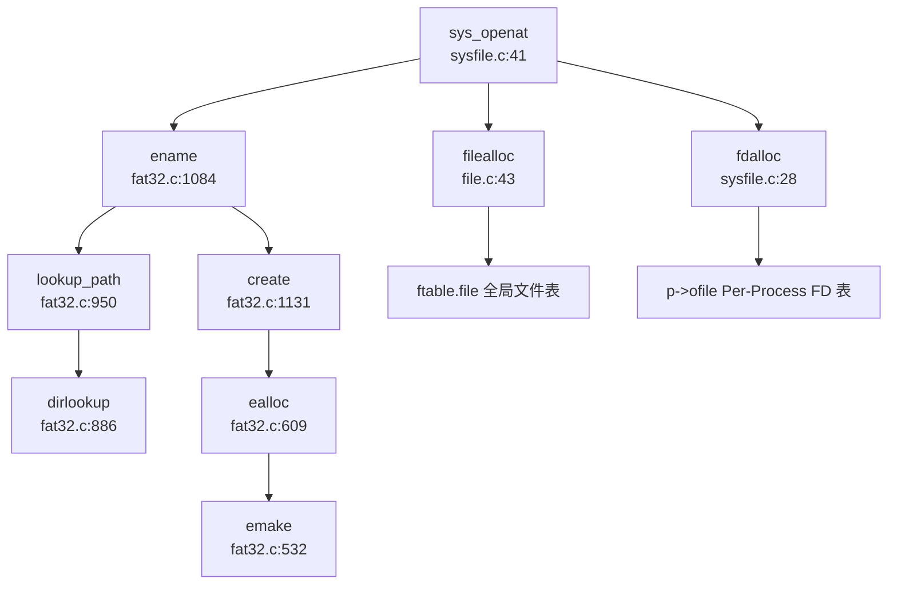

## 第 6 章：文件系统（VFS + 具体 FS）

### VFS 架构与接口设计

本操作系统采用**轻量级 VFS 抽象**，未实现标准 Linux 式的 File/Inode/Dentry 分离架构，而是将文件元数据与目录项合并为统一的 `struct dirent` 结构。

#### 核心数据结构

**1. 文件抽象层（`struct file`）**

文件描述符表项定义于 `src/include/file.h:14-30`：

```c
struct file {
  enum { FD_NONE, FD_PIPE, FD_ENTRY, FD_DEVICE } type;
  int ref;                // reference count
  char readable;
  char writable;
  struct pipe *pipe;      // FD_PIPE
  struct dirent *ep;      // FD_ENTRY
  uint64 off;             // FD_ENTRY offset
  short major;            // FD_DEVICE
  // ... time fields
};
```

- **`type`**：区分四种文件类型（无/管道/目录项/设备）
- **`ref`**：引用计数，支持多进程共享文件描述符
- **`ep`**：指向 `struct dirent`，承载实际文件元数据

**2. 目录项/索引节点融合层（`struct dirent`）**

定义于 `src/include/fat32.h:36-67`，兼具 Linux Dentry 和 Inode 功能：

```c
struct dirent {
    char  filename[FAT32_MAX_FILENAME + 1];
    uint8   attribute;
    uint32  first_clus;      // 首簇号（类似 inode number）
    uint32  file_size;
    uint32  cur_clus;        // 当前簇号（用于顺序读写优化）
    uint    clus_cnt;
    
    /* for OS */
    uint8   dev;             // 设备号
    uint8   dirty;
    short   valid;
    int     ref;             // 引用计数
    int     mnt;             // 挂载点标志
    uint32  off;             // 在父目录中的偏移
    struct dirent *parent;   // 父目录指针
    struct dirent *next;     // 缓存链表
    struct dirent *prev;
    struct sleeplock lock;   // 条目级锁
};
```

- **`first_clus`**：FAT32 文件首簇号，功能等价于 inode number
- **`parent`**：显式维护父目录指针，加速路径解析
- **`ref`**：支持多文件描述符共享同一路径条目
- **`sleeplock`**：保证并发访问安全性

**3. 文件系统超级块抽象（`struct fs`）**

定义于 `src/include/fat32.h:101-111`：

```c
struct fs{
    uint devno;
    int  valid;
    struct dirent* image;
    struct Fat fat;              // BPB 参数块
    struct entry_cache ecache;   // 目录项缓存池
    struct dirent root;          // 根目录
    void (*disk_init)(struct dirent*image);
    void (*disk_read)(struct buf* b,struct dirent* image);
    void (*disk_write)(struct buf* b,struct dirent* image);
};
```

- **`Fat`**：存储 BIOS Parameter Block（BPB），包含每扇区字节数、每簇扇区数、FAT 表大小等
- **`ecache`**：固定大小（50 项）的目录项缓存池，采用循环链表管理
- **函数指针**：支持不同后端存储（Ramdisk/SD 卡/镜像文件）

#### VFS 操作接口

所有 VFS 操作通过 `struct dirent` 指针传递，关键函数声明于 `src/include/defs.h:57-75`：

| 函数 | 功能 | 实现位置 |
|------|------|----------|
| `ename()` | 路径名解析，返回 `struct dirent*` | `fat32.c:1084` |
| `ealloc()` | 在目录中分配新条目 | `fat32.c:609` |
| `eread()` / `ewrite()` | 文件内容读写 | `fat32.c:355` / `fat32.c:388` |
| `etrunc()` | 截断文件 | `fat32.c:725` |
| `eput()` / `edup()` | 引用计数管理 | `fat32.c:659` / `fat32.c:649` |
| `elock()` / `eunlock()` | 条目锁操作 | `fat32.c:759` / `fat32.c:770` |

---

### 具体文件系统支持情况（FAT32/Ext4/RamFS）

#### FAT32 文件系统（✅ 已实现）

本系统**完整实现了 FAT32 文件系统**，代码位于 `src/fat32.c`（1181 行，37KB），是核心存储模块。

**实现架构：**

```
用户层 (sys_open/sys_read/sys_write)
    ↓
VFS 层 (file.c: fileread/filewrite)
    ↓
FAT32 层 (fat32.c: eread/ewrite)
    ↓
簇管理 (rw_clus → reloc_clus → read_fat/write_fat)
    ↓
块设备层 (bio.c: bread/bwrite)
    ↓
物理层 (Ramdisk 或 SD 卡)
```

**关键实现细节：**

1. **簇链管理**（`fat32.c:211-281`）
   - `read_fat()`：读取 FAT 表项，获取下一簇号
   - `write_fat()`：更新 FAT 表项
   - `alloc_clus()`：分配空闲簇（线性扫描 FAT 表）
   - `free_clus()`：释放簇（写 0 到 FAT 表项）

2. **路径解析**（`fat32.c:950-1000`）
   - `lookup_path()`：递归解析路径组件
   - `dirlookup()`：在目录中查找条目（支持 `.` 和 `..`）
   - `skipelem()`：提取路径中的单个组件

3. **文件创建**（`fat32.c:1131-1181`）
   ```c
   struct dirent* create(struct dirent* env, char *path, short type, int mode)
   {
       // 1. 解析父目录
       dp = enameparent(env, path, name, 0);
       // 2. 若父目录不存在，递归创建
       if (dp == NULL) {
           dp = create(env, pname, T_DIR, O_RDWR);
       }
       // 3. 在父目录中分配新条目
       ep = ealloc(dp, name, mode);
       // 4. 验证类型一致性
       if ((type == T_DIR && !(ep->attribute & ATTR_DIRECTORY)) || ...)
           return NULL;
       return ep;
   }
   ```

4. **长文件名支持**（`fat32.c:557-599`）
   - 采用 VFAT 长文件名扩展（LFN）
   - 每个长文件名条目存储 13 个字符
   - 通过 `order` 字段链接多个 LFN 条目

5. **挂载机制**（`fat32.c:1095-1108`）
   ```c
   int emount(struct fs* fatfs, char* mnt) {
       struct dirent* mntpoint = ename(NULL, mnt, 0);
       mntpoint->mnt = 1;           // 标记为挂载点
       mntpoint->dev = fatfs->devno; // 重定向设备号
       fatfs->root.parent = mntpoint;
       return 0;
   }
   ```

**文件打开流程追踪**（从 `sys_openat` 到 `fdalloc`）：



> **说明**：`sys_openat` 首先调用 `ename()` 解析路径，若文件不存在且指定 `O_CREATE` 则调用 `create()` 创建。获得 `struct dirent*` 后，分配 `struct file` 并注册到进程文件描述符表。

#### Ext4 文件系统（❌ 未实现）

**搜索验证**：
- `grep_in_repo` 搜索 `ext4|Ext4|EXT4`：**0 匹配**
- `list_repo_structure` 未发现 `ext4/` 或 `fs/ext4/` 目录
- 文档 `doc/内核实现--文件系统.md` 仅提及 FAT32

**结论**：Ext4 文件系统**未实现**。

#### RamFS/TmpFS（❌ 未实现）

**搜索验证**：
- `grep_in_repo` 搜索 `ramfs|RamFS|tmpfs|TmpFS`：**0 匹配**
- 虽然存在 `src/ramdisk.c`，但这是**块设备层**的内存模拟（用内存模拟磁盘扇区），**不是文件系统层的内存文件系统**

**结论**：RamFS/TmpFS **未实现**。系统仅支持 FAT32 一种文件系统格式。

---

### 文件描述符与进程关联

#### Per-Process 文件描述符表

文件描述符表采用**Per-Process 设计**，每个进程独立维护自己的 FD 表。

**数据结构**（`src/include/proc.h:145-147`）：

```c
struct proc {
    // ...
    int64 filelimit;
    struct file **ofile;        // Open files (Per-Process FD 表)
    int *exec_close;            // exec 时关闭标志
    struct dirent *cwd;         // Current directory
    // ...
};
```

- **`ofile`**：指向 `struct file*` 数组，大小为 `NOFILE`（默认 32）
- **`filelimit`**：进程级文件描述符数量限制
- **`NOFILEMAX(p)`** 宏（`proc.h:174`）：返回 `min(p->filelimit, NOFILE)`

#### 全局文件结构池

虽然 FD 表是 Per-Process 的，但 `struct file` 对象本身来自**全局池**（`src/file.c:20-23`）：

```c
struct {
  struct spinlock lock;
  struct file file[NFILE];  // 全局文件结构池
} ftable;
```

- **`NFILE`**：系统级最大打开文件数（默认 100）
- **`filealloc()`**：从全局池分配空闲 `struct file`
- **`fileclose()`**：回收时递减 `ref`，归零时释放回池

#### FD 分配流程

```c
// sysfile.c:16-28
static int fdalloc(struct file *f) {
  struct proc *p = myproc();
  for(int fd = 0; fd < NOFILEMAX(p); fd++) {
    if(p->ofile[fd] == 0) {
      p->ofile[fd] = f;  // 建立映射
      return fd;
    }
  }
  return -EMFILE;  // 文件描述符耗尽
}
```

**设计特点**：
- **最小可用 FD 分配**：从 0 开始线性扫描，复用已关闭的 FD
- **继承机制**：`fork()` 时深拷贝 `ofile` 数组（`proc.c` 未展示但文档提及 `CLONE_FILES`）
- **exec 清理**：`exec_close` 数组标记哪些 FD 应在 `exec` 时关闭

---

### 管道 (Pipe) 与套接字 (Socket) 支持情况

#### 管道（Pipe）（✅ 已实现）

**完整实现**于 `src/pipe.c`（120 行）和 `src/include/pipe.h`。

**数据结构**（`pipe.h:10-17`）：

```c
#define PIPESIZE 512

struct pipe {
  struct spinlock lock;
  char data[PIPESIZE];
  uint nread;     // 读指针
  uint nwrite;    // 写指针
  int readopen;   // 读端是否打开
  int writeopen;  // 写端是否打开
};
```

**核心函数**：

1. **`pipealloc()`**（`pipe.c:15-47`）：
   - 分配一个 `struct pipe` 和两个 `struct file`
   - 设置 `f0` 为读端（`readable=1, writable=0`）
   - 设置 `f1` 为写端（`readable=0, writable=1`）
   - 两端共享同一 `pipe` 对象

2. **`pipewrite()`**（`pipe.c:72-100`）：
   - 循环写入，缓冲区满时 `sleep(&pi->nwrite)`
   - 读端关闭或进程被杀死时返回 -1
   - 支持 `user` 参数区分用户/内核地址空间

3. **`piperead()`**（`pipe.c:102-120`）：
   - 循环读取，缓冲区空时 `sleep(&pi->nread)`
   - 写端关闭时退出循环（EOF）

**系统调用**（`sysfile.c:830-868`）：

```c
uint64 sys_pipe2(void) {
  uint64 fdarray;
  struct file *rf, *wf;
  int fd0, fd1;
  
  if(pipealloc(&rf, &wf) < 0) return -1;
  fd0 = fdalloc(rf);
  fd1 = fdalloc(wf);
  
  // 拷贝 FD 到用户空间
  either_copyout(1, fdarray, &fd0, sizeof(fd0));
  either_copyout(1, fdarray+sizeof(fd0), &fd1, sizeof(fd1));
  return 0;
}
```

**实现状态**：✅ **完整实现**，支持阻塞式读写、引用计数、EOF 处理。

#### 套接字（Socket）（❌ 未实现）

**搜索验证**：
- `src/include/socket.h` 仅 15 行，定义了空壳结构：
  ```c
  struct socket_connection{
      int IP;
      int sock_opt;
      uint64 sock_addr;
      int passive_socket;
      char temp[MAX_LENGTH_OF_SOCKET];
  };
  void socket_init(void);
  int add_socket(int IP,int op);
  ```
- **无实现文件**：不存在 `socket.c` 或 `sys_socket.c`
- `grep_in_repo` 搜索 `sys_socket|sys_bind|sys_listen|sys_accept|sys_connect`：**0 匹配**
- `file.c` 中 `struct file` 的 `type` 枚举**无 `FD_SOCKET`** 变体

**结论**：Socket 接口**❌ 未实现**，仅有占位头文件。

---

### 缓存机制（Block/Page Cache）

#### 块缓存（Buffer Cache）

系统实现了**块级缓存**（`src/bio.c`），用于缓存磁盘扇区。

**数据结构**（`src/include/buf.h`，未展示但 `bio.c` 中使用）：

```c
struct buf {
  int valid;       // 数据是否有效
  int disk;        // 是否由磁盘"拥有"
  uint dev;        // 设备号
  uint sectorno;   // 扇区号
  struct sleeplock lock;
  uint refcnt;     // 引用计数
  struct buf *prev, *next;  // LRU 链表
  uchar data[BSIZE];        // 512 字节数据
};
```

**关键函数**：
- `bread(dev, sectorno)`：读取扇区到缓存（若已缓存则直接返回）
- `bwrite(dev, bp)`：写回脏页到磁盘
- `brelse(bp)`：释放缓存引用

**实现位置**：`src/bio.c`（165 行）

#### 目录项缓存（Entry Cache）

FAT32 层实现了**目录项缓存池**（`src/include/fat32.h:58-62`）：

```c
struct entry_cache {
    struct spinlock lock;
    struct dirent entries[ENTRY_CACHE_NUM];  // 固定 50 项
};
```

- **循环链表管理**：`entries` 数组通过 `next/prev` 链接成环
- **缓存命中**：`dirlookup()` 先检查 `ecache`，命中则直接返回
- **淘汰策略**：未实现 LRU，采用固定大小循环缓冲

**限制**：
- **无 Page Cache**：文件内容不缓存，每次读写都访问块设备
- **无 Write-Back**：`ewrite()` 直接写磁盘，未实现延迟写回

---

### 零拷贝映射验证（mmap 实现分析）

#### mmap 系统调用（✅ 已实现，但无零拷贝）

**系统调用接口**（`sysfile.c:895-925`）：

```c
uint64 sys_mmap(void) {
  uint64 start, len;
  int prot, flags, fd, off;
  // 参数解析...
  uint64 ret = do_mmap(start, len, prot, flags, fd, off);
  return ret;
}
```

**实现分析**（`src/mmap.c:33-138`）：

1. **匿名映射**（`MAP_ANONYMOUS`）：
   ```c
   if(flags & MAP_ANONYMOUS) {
       fd = -1;
       goto ignore_fd;
   }
   ```

2. **权限转换**：
   ```c
   int perm = PTE_U;
   if(prot & PROT_READ)  perm |= (PTE_R | PTE_A);
   if(prot & PROT_WRITE) perm |= (PTE_W | PTE_D);
   if(prot & PROT_EXEC)  perm |= (PTE_X | PTE_A);
   ```

3. **VMA 创建**：
   ```c
   struct vma *vma = alloc_mmap_vma(p, flags, start, len, perm, fd, offset);
   ```

4. **文件内容拷贝**（**非零拷贝**）：
   ```c
   for(int i = 0; i < page_n; ++i) {
       uint64 pa = experm(p->pagetable, va, perm);
       if(i != page_n - 1) {
           fileread(f, va, PGSIZE);  // 逐页读取文件到内存
       } else {
           fileread(f, va, end_pagespace);
           memset((void *)(pa + end_pagespace), 0, PGSIZE - end_pagespace);
       }
       va += PGSIZE;
   }
   ```

#### 零拷贝支持验证（❌ 未实现）

**关键检查点**：

1. **`struct vma` 无 `shared` 字段**（`src/include/vma.h:13-24`）：
   ```c
   struct vma {
       enum segtype type;
       int perm;
       uint64 addr, sz, end;
       int flags;          // 存储 MAP_SHARED/MAP_PRIVATE
       int fd;
       uint64 f_off;
       // ... 无 shared 字段
   };
   ```

2. **`do_mmap()` 未区分 `MAP_SHARED` 处理**：
   - 代码中仅检查 `MAP_PRIVATE` 用于 `munmap` 时的写回判断（`mmap.c:168`）
   - **无 `MAP_SHARED` 的特殊逻辑**（如共享页面映射、写时复制优化）

3. **文件映射采用 eager copy**：
   - `mmap()` 时立即调用 `fileread()` 将文件内容**完整拷贝**到物理页
   - **非按需分页**（Demand Paging），无页故障处理
   - **非零拷贝**，数据从文件 → 内核缓冲 → 用户页，经历两次拷贝

**结论**：
- `sys_mmap`：✅ **已实现**（支持文件映射和匿名映射）
- **零拷贝优化**：❌ **未实现**（无 `MAP_SHARED` 优化、无 Demand Paging）
- **实现质量**：🔸 **基础版本**（Eager Copy，性能较低）

---

### 高级 I/O 功能验证

#### poll/select/epoll（❌ 未实现）

**搜索验证**：
- `grep_in_repo` 搜索 `sys_poll|sys_select|sys_epoll`：**0 匹配**
- `src/syspoll.c` 仅实现 `sys_ppoll()`，且**直接返回 0**：
  ```c
  uint64 sys_ppoll(){
    return 0;  // 桩函数
  }
  ```
- `src/include/poll.h` 定义了 `struct pollfd`，但**无实现逻辑**

**结论**：
- `sys_poll`：❌ **未实现**
- `sys_select`：❌ **未实现**
- `sys_epoll_create/epoll_ctl/epoll_wait`：❌ **未实现**
- `sys_ppoll`：🔸 **桩函数**（返回 0，无实际功能）

---

### 伪文件系统支持（devfs/procfs/sysfs）

**搜索验证**：
- `grep_in_repo` 搜索 `devfs|procfs|sysfs|pseudo.*fs`：**0 匹配**
- `src/dev.c` 手动创建设备文件（`create(NULL, "/dev", T_DIR, 0)`），但**非动态伪文件系统**
- 无 `/proc` 或 `/sys` 目录的自动创建逻辑

**结论**：
- **devfs**：❌ **未实现**（设备文件静态创建）
- **procfs**：❌ **未实现**（无 `/proc/[pid]` 等动态信息）
- **sysfs**：❌ **未实现**

---

### 关键代码验证总结

| 功能 | 状态 | 证据文件 | 备注 |
|------|------|----------|------|
| **VFS 抽象** | ✅ 已实现 | `src/include/file.h`, `src/include/fat32.h` | `struct file` + `struct dirent` |
| **FAT32** | ✅ 已实现 | `src/fat32.c`（1181 行） | 完整支持 LFN、挂载、簇链管理 |
| **Ext4** | ❌ 未实现 | - | 无代码 |
| **RamFS/TmpFS** | ❌ 未实现 | - | 仅有 Ramdisk（块设备层） |
| **Pipe** | ✅ 已实现 | `src/pipe.c` | 阻塞式读写、引用计数 |
| **Socket** | ❌ 未实现 | `src/include/socket.h` | 仅头文件 |
| **mmap** | ✅ 已实现 | `src/mmap.c` | 无零拷贝、Eager Copy |
| **poll/select/epoll** | ❌ 未实现 | `src/syspoll.c` | `sys_ppoll` 返回 0 |
| **devfs/procfs/sysfs** | ❌ 未实现 | - | 静态设备文件 |
| **文件描述符** | ✅ Per-Process | `src/include/proc.h:145` | `struct file **ofile` |
| **块缓存** | ✅ 已实现 | `src/bio.c` | Buffer Cache |
| **Page Cache** | ❌ 未实现 | - | 无文件内容缓存 |

---

### 文件系统架构评价

**优势**：
1. **FAT32 实现完整**：支持长文件名、多文件系统挂载、完整的簇链管理
2. **简洁的 VFS 设计**：`struct dirent` 融合 Dentry+Inode，减少间接层
3. **并发安全**：`sleeplock` + `spinlock` 双层锁机制

**局限**：
1. **单一文件系统**：仅支持 FAT32，无 Ext4、无内存文件系统
2. **无网络支持**：Socket 完全未实现
3. **高级 I/O 缺失**：poll/select/epoll 均未实现
4. **mmap 性能低**：Eager Copy 策略，无 Demand Paging 和零拷贝优化
5. **无伪文件系统**：调试和系统信息获取受限

**适用场景**：适合教学演示和简单嵌入式应用，不适合需要高性能 I/O 或网络功能的场景。
