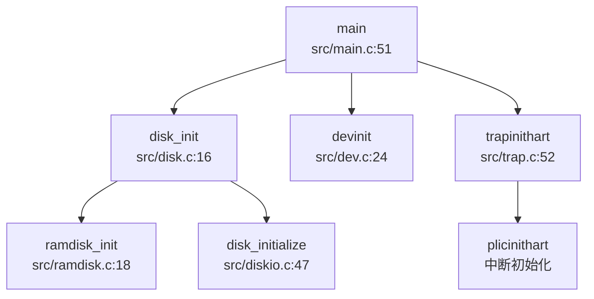

## 第 7 章：设备驱动与硬件抽象

本章分析 `oskernrl2022-rv6` 操作系统的设备驱动架构、硬件抽象层实现以及目标平台适配机制。该内核基于 xv6-k210 改编，支持 QEMU sifive_u 虚拟机和 SiFive FU740 等硬件平台。

---

### 驱动框架与设备发现

#### 设备发现机制

**❌ 未实现 Device Tree 解析**。内核未实现动态设备树（DTS/DTB）解析功能，设备地址和中断号均通过编译期宏定义硬编码。

设备发现采用**静态内存映射表**方式，所有外设的物理地址在 `src/include/memlayout.h` 和 `src/sifive/platform.h` 中预定义：

```c
// src/include/memlayout.h
#define UART0 0x10000000L       // QEMU UART0 物理地址
#define VIRTIO0 0x10001000      // VirtIO 磁盘接口
#define PLIC 0x0c000000L        // 平台级中断控制器
#define CLINT 0x02000000L       // 本地中断控制器（含定时器）

// src/sifive/platform.h (SiFive 硬件平台)
#define UART0_CTRL_ADDR _AC(0x10010000,UL)
#define SPI0_CTRL_ADDR  _AC(0x10040000,UL)
#define GPIO_CTRL_ADDR  _AC(0x10060000,UL)
```

#### 设备驱动框架

**🔸 桩函数/简化实现**。内核未实现现代操作系统的 Driver Trait 或设备驱动模型（如 Linux 的 `struct device_driver`）。设备管理采用**静态设备表**方式：

```c
// src/include/dev.h
#define DEV_NAME_MAX 12
#define NDEV 4  // 最多支持 4 种设备

struct devsw {
  char name[DEV_NAME_MAX+1];
  struct spinlock lk;
  int (*read)(int, uint64, int);   // 读函数指针
  int (*write)(int, uint64, int);  // 写函数指针
};

extern struct devsw devsw[];
```

设备注册通过 `allocdev()` 函数在初始化时静态完成：

```c
// src/dev.c:42-45
int devinit() {
  // ... 创建 /dev 目录 ...
  memset(devsw, 0, NDEV*sizeof(struct devsw));
  allocdev("console", consoleread, consolewrite);  // 控制台
  allocdev("null", nullread, nullwrite);           // 空设备
  allocdev("zero", zeroread, zerowrite);           // 零设备
  return 0;
}
```

**设备查找**通过线性扫描设备表实现：

```c
// src/dev.c:72-78
int devlookup(char *name) {
  for(int i = 0; i < NDEV; i++) {
    if(strncmp(name, devsw[i].name, DEV_NAME_MAX+1) == 0) {
      return i;  // 返回设备索引
    }
  }
  return -1;  // 未找到
}
```

#### 驱动初始化流程

驱动初始化在内核启动时按固定顺序执行，调用链如下：



---

### 组件化设计与配置机制

#### 编译配置系统

内核通过 **Makefile 宏定义** 实现组件化配置，支持在编译期选择不同的存储后端和目标平台。

**存储后端配置**（`Makefile:4-9`）：

```makefile
FS?=FAT
MAC?=SIFIVE_U

ifeq ($(MAC),SIFIVE_U)
DISK:=$K/link_null.o    # 空磁盘后端
endif

ifeq ($(MAC),QEMU)
DISK:=$K/link_disk.o    # VirtIO 磁盘后端
endif
```

**编译选项**（`Makefile:70`）：

```makefile
CFLAGS = -Wall -Werror -O -fno-omit-frame-pointer -ggdb -DDEBUG -DWARNING -DERROR -D$(FS) -D$(MAC)
```

支持的平台和存储模式：

| 宏定义 | 含义 | 影响 |
|--------|------|------|
| `QEMU` | QEMU sifive_u 虚拟机 | 启用 VirtIO 磁盘、UART 地址 0x10000000 |
| `SIFIVE_U` | SiFive FU740 硬件 | 启用 SPI/SD 卡驱动、UART 地址 0x10010000 |
| `RAM` | RAM 磁盘模式 | 使用内存模拟磁盘，`ramdisk_rw()` |
| `SD` | SD 卡模式 | 使用 SPI+SD 卡驱动，`disk_read/write()` |
| `FAT` | FAT32 文件系统 | 启用 FatFs 文件系统支持 |

#### 条件编译示例

磁盘驱动根据 `RAM` 宏选择不同后端：

```c
// src/disk.c:16-35
void disk_init(void) {
    if(disk_init_flag) return;
    else disk_init_flag = 1;
    #ifdef RAM
    ramdisk_init();      // RAM 磁盘初始化
    #else
    disk_initialize(0);  // SD 卡初始化
    #endif
}

void vdisk_read(struct buf *b) {
    #ifdef RAM    
    ramdisk_rw(b, 0);    // 从 RAM 读取
    #else 
    disk_read(0, b->data, b->sectorno, 1);  // 从 SD 卡读取
    #endif
}
```

---

### 字符设备驱动（UART/Console）

#### UART 驱动实现

**✅ 已实现**。UART 驱动采用**SBI（Supervisor Binary Interface）调用**方式，而非直接操作 UART 硬件寄存器。

```c
// src/include/sbi.h:61-66
static inline void sbi_console_putchar(int c) {
    sbi_call(SBI_CONSOLE_PUTCHAR, c, 0, 0);
}

static inline int sbi_console_getchar() {
    return sbi_call(SBI_CONSOLE_GETCHAR, 0, 0, 0);
}
```

**SBI 调用封装**通过 RISC-V `ecall` 指令实现：

```c
// src/include/sbi.h:31-38
static int inline sbi_call(uint64 which, uint64 arg0, uint64 arg1, uint64 arg2) {
    register uint64 a0 asm("a0") = arg0;
    register uint64 a1 asm("a1") = arg1;
    register uint64 a2 asm("a2") = arg2;
    register uint64 a7 asm("a7") = which;
    asm volatile("ecall" : "=r"(a0) : "r"(a0), "r"(a1), "r"(a2), "r"(a7) : "memory");
    return a0;
}
```

**控制台读写**通过设备表接口暴露：

```c
// src/dev.c:113-130
int consoleread(int user_dst, uint64 addr, int n) {
  char readbuf[CONSOLE_BUF_LEN];
  int ret = 0;
  while(n) {
    int len = MIN(n, CONSOLE_BUF_LEN);
    for(int i=0; i<len; i++) {
      char c = 0;
      while((c = sbi_console_getchar()) == 255);  // 等待输入
      c = c == 13 ? 10 : c;  // CR -> LF
      readbuf[i] = c;
      consputc(c);  // 回显
    }
    // ... 拷贝到用户空间 ...
  }
  return ret;
}
```

#### MMU 前后地址切换

**🔸 部分实现**。UART 驱动在 MMU 启用前后均使用 SBI 调用，**无需地址切换**。SBI 固件负责将虚拟地址转换为物理地址或直接操作硬件。

```c
// src/include/memlayout.h:57-58
#define UART0 0x10000000L      // QEMU 物理地址
#define UART0_V (UART0 + VIRT_OFFSET)  // 虚拟地址（未使用）
```

**注意**：虽然定义了 `UART0_V` 虚拟地址，但实际代码中未直接使用 UART 寄存器，而是通过 SBI 抽象层，因此不存在 MMU 前后的地址切换问题。

#### 中断处理

UART 中断通过 PLIC（Platform-Level Interrupt Controller）管理：

```c
// src/include/plic.h:88-91
#ifdef QEMU
#define UART0_IRQ 4 
#define UART1_IRQ 5
#else  // K210
#define UART0_IRQ 4 
#define UART1_IRQ 5
#endif 
```

**❌ 未实现 PLIC 完整驱动**。`devintr()` 函数中 UART 中断处理被注释掉：

```c
// src/trap.c:220-235
int devintr(void) {
  if ((0x8000000000000000L & scause) && 9 == (scause & 0xff)) {
    int irq = 0;  // ⚠️ 硬编码为 0，未从 PLIC 读取
    // plic_claim();
    if (UART0_IRQ == irq) {
      int c = sbi_console_getchar();
      if (-1 != c) {
        // consoleintr(c);  // 被注释
      }
    }
    // plic_complete(irq);
    return 1;
  }
  // ...
}
```

---

### 块设备驱动（VirtIO-Blk 等）

#### 存储后端架构

内核支持两种存储后端，通过 `RAM` 宏切换：

| 后端 | 实现文件 | 原理 |
|------|----------|------|
| **RAM 磁盘** | `src/ramdisk.c` | 将内存区域模拟为磁盘，`ramdisk = fs_img_start` |
| **SD 卡** | `src/diskio.c`, `src/sd.c` | 通过 SPI 协议读写 SD 卡，FatFs 文件系统 |

#### RAM 磁盘实现

**✅ 已实现**。RAM 磁盘将内核镜像后的内存区域作为磁盘使用：

```c
// src/ramdisk.c:18-29
void ramdisk_init(void) {
#ifdef QEMU
  ramdisk = fs_img_start;  // 使用内核后的内存
#endif
#ifdef SIFIVE_U
  ramdisk = (char*)RAMDISK;  // 固定地址
#endif
  initlock(&ramdisklock, "ramdisk lock");
}

void ramdisk_rw(struct buf *b, int write) {
  acquire(&ramdisklock);
  char *addr = ramdisk + b->sectorno * BSIZE;
  if (write)
    memmove(addr, b->data, BSIZE);
  else
    memmove(b->data, addr, BSIZE);
  release(&ramdisklock);
}
```

#### SD 卡驱动（SPI 协议）

**✅ 已实现**。SD 卡驱动通过 SPI 控制器实现，支持初始化、读写块操作。

**SPI 控制器定义**：

```c
// src/diskio.c:22-24
static spi_ctrl* spictrl = (spi_ctrl*) SPI2_CTRL_ADDR;
static unsigned int peripheral_input_khz = 500000;  // 500kHz 初始频率
```

**SD 卡初始化流程**：

```c
// src/sd.c:256-271
int sd_init(spi_ctrl* spi, unsigned int input_clk_khz, int skip_sd_init_commands) {
  if (!skip_sd_init_commands) {
    sd_poweron(spi, input_clk_khz);      // 上电延时 1ms
    if (sd_cmd0(spi)) return SD_INIT_ERROR_CMD0;   // GO_IDLE_STATE
    if (sd_cmd8(spi)) return SD_INIT_ERROR_CMD8;   // SEND_IF_COND
    if (sd_acmd41(spi)) return SD_INIT_ERROR_ACMD41; // ACMD41 (HCS)
    if (sd_cmd58(spi)) return SD_INIT_ERROR_CMD58; // READ_OCR
    if (sd_cmd16(spi)) return SD_INIT_ERROR_CMD16; // SET_BLOCKLEN (512B)
  }
  spi->sckdiv = spi_min_clk_divisor(input_clk_khz, SD_POST_INIT_CLK_KHZ); // 提升到 20MHz
  return 0;
}
```

**块读写操作**：

```c
// src/sd.c:293-328
int sd_read_blocks(spi_ctrl* spi, void* dst, uint32_t src_lba, size_t size) {
  // CMD18: READ_BLOCK_MULTIPLE
  if (sd_cmd(spi, SD_CMD(SD_CMD_READ_BLOCK_MULTIPLE), src_lba, crc) != 0x00) {
    sd_cmd_end(spi);
    return SD_COPY_ERROR_CMD18;
  }
  do {
    // 等待数据令牌
    while (sd_dummy(spi) != SD_DATA_TOKEN);
    // 读取 512 字节
    n = 512;
    do {
      uint8_t x = sd_dummy(spi);
      *p++ = x;
      crc = crc16(crc, x);
    } while (--n > 0);
    // 验证 CRC
    crc_exp = ((uint16_t)sd_dummy(spi) << 8) | sd_dummy(spi);
    if (crc != crc_exp) {
      rc = SD_COPY_ERROR_CMD18_CRC;
      break;
    }
  } while (--i > 0);
  // CMD12: STOP_TRANSMISSION
  sd_cmd(spi, SD_CMD(SD_CMD_STOP_TRANSMISSION), 0, 0x01);
  sd_cmd_end(spi);
  return rc;
}
```

#### VirtIO 支持

**❌ 未实现**。虽然 `src/include/virtio.h` 定义了 VirtIO 描述符结构，但**无实际驱动代码**：

```c
// src/include/virtio.h:56-61
struct VRingDesc {
  uint64 addr;
  uint32 len;
  uint16 flags;
  uint16 next;
};

// 声明但未实现
void virtio_disk_init(void);
void virtio_disk_rw(struct buf *b, int write);
void virtio_disk_intr(void);
```

`src/disk.c` 中仅调用 `disk_read/write()`，未使用 VirtIO 接口。

---

### 网络设备驱动

**❌ 未实现**。内核未实现任何网络设备驱动或网络协议栈。

- 无网卡驱动（VirtIO-Net、MAC 控制器等）
- 无 TCP/IP 协议栈（如 smoltcp、lwIP）
- `src/include/socket.h` 仅定义结构体，无实现

---

### 中断控制器驱动

#### PLIC（Platform-Level Interrupt Controller）

**🔸 桩函数**。`src/include/plic.h` 声明了 PLIC 操作函数，但**未实现完整功能**：

```c
// src/include/plic.h:95-98
void plicinit(void);
void plicinithart(void);
int plic_claim(void);
void plic_complete(int irq);
```

**中断使能和优先级设置**通过内存映射寄存器实现：

```c
// src/include/memlayout.h:70-77
#define PLIC_PRIORITY (PLIC_V + 0x0)
#define PLIC_PENDING (PLIC_V + 0x1000)
#define PLIC_MENABLE(hart) (PLIC_V + 0x1f80 + (hart)*0x100)
#define PLIC_MCLAIM(hart) (PLIC_V + 0x1ff004 + (hart)*0x2000)
#define PLIC_SCLAIM(hart) (PLIC_V + 0x200004 + (hart)*0x2000)
```

**❌ 未实现中断路由**。`devintr()` 函数中 `irq` 硬编码为 0，未从 `PLIC_MCLAIM` 读取实际中断号。

#### CLINT（Core Local Interruptor）

**✅ 已实现**。CLINT 驱动通过 SBI 调用实现定时器中断：

```c
// src/timer.c:30-34
void set_next_timeout() {
  set_timer(r_time() + INTERVAL);  // SBI_SET_TIMER
}

void timer_tick() {
  acquire(&tickslock);
  ticks++;
  wakeup(&ticks);
  release(&tickslock);
  set_next_timeout();
}
```

**定时器中断处理**在 `devintr()` 中识别：

```c
// src/trap.c:244-248
else if (0x8000000000000005L == scause) {  // Supervisor Timer Interrupt
  timer_tick();
  return 2;
}
```

---

### 目标平台适配情况

#### 支持的平台

| 平台 | 宏定义 | UART 地址 | 存储后端 |
|------|--------|-----------|----------|
| **QEMU sifive_u** | `QEMU` | 0x10000000 | VirtIO / RAM 磁盘 |
| **SiFive FU740** | `SIFIVE_U` | 0x10010000 | SPI+SD 卡 |
| **Kendryte K210** | `K210`（已注释） | 0x38000000 | SPI+SD 卡 |

#### 平台适配机制

通过 `Makefile` 的 `MAC` 变量切换平台：

```makefile
# Makefile:5
MAC?=SIFIVE_U

# 编译命令
make MAC=QEMU    # QEMU 虚拟机
make MAC=SIFIVE_U  # SiFive 硬件
```

**内存布局差异**在 `src/include/memlayout.h` 中通过条件编译区分：

```c
// src/include/memlayout.h:1-2
// #define K210  // 已注释，支持 K210 时启用

#ifdef QEMU
#define UART0 0x10000000L
#define UART0_IRQ 4
#else  // SIFIVE_U / K210
#define UART0_CTRL_ADDR 0x10010000  // 来自 platform.h
#define UART0_IRQ 5
#endif
```

#### 板级特有驱动

**SiFive 平台**包含完整的外设定义（`src/sifive/platform.h`）：

```c
#define CLINT_CTRL_ADDR   _AC(0x2000000,UL)
#define PLIC_CTRL_ADDR    _AC(0xc000000,UL)
#define UART0_CTRL_ADDR   _AC(0x10010000,UL)
#define SPI0_CTRL_ADDR    _AC(0x10040000,UL)
#define GPIO_CTRL_ADDR    _AC(0x10060000,UL)
#define I2C_CTRL_ADDR     _AC(0x10030000,UL)
```

**K210 平台**（已废弃）使用不同的地址映射（见 `memlayout.h` 注释）：

```c
// (0x0200_0000, 0x1000),      /* CLINT     */
// (0x0C20_0000, 0x1000),      /* PLIC      */
// (0x3800_0000, 0x1000),      /* UARTHS    */
// (0x5020_0000, 0x1000),      /* SPI0      */
```

---

### 其他外设支持

#### SPI 控制器驱动

**✅ 已实现**。SPI 驱动用于 SD 卡通信，提供基础的 TX/RX 操作：

```c
// src/spi.c:14-37
void spi_tx(spi_ctrl* spictrl, uint8_t in) {
  while ((int32_t) spictrl->txdata.raw_bits < 0);
  spictrl->txdata.data = in;
}

uint8_t spi_rx(spi_ctrl* spictrl) {
  int32_t out;
  while ((out = (int32_t) spictrl->rxdata.raw_bits) < 0);
  return (uint8_t) out;
}

uint8_t spi_txrx(spi_ctrl* spictrl, uint8_t in) {
  spi_tx(spictrl, in);
  return spi_rx(spictrl);
}
```

#### GPIO/I2C 驱动

**❌ 未实现**。虽然 `src/sifive/devices/gpio.h` 和 `i2c.h` 定义了寄存器结构，但**无驱动实现代码**。

#### 文件系统支持

**✅ 已实现**。内核集成 FatFs（FAT32）文件系统，通过 `src/fat32.c` 实现：

- 文件读写：`file_read()`, `file_write()`
- 目录操作：`create()`, `dirlookup()`
- 块设备抽象：`bread()`, `bwrite()` 通过 buffer cache

---

### 总结

| 子系统 | 实现状态 | 备注 |
|--------|----------|------|
| **设备发现** | ❌ 未实现 | 硬编码地址，无 DTB 解析 |
| **驱动框架** | 🔸 简化实现 | 静态设备表，无动态注册 |
| **UART/Console** | ✅ 已实现 | 通过 SBI 调用抽象 |
| **RAM 磁盘** | ✅ 已实现 | 内存模拟磁盘 |
| **SD 卡驱动** | ✅ 已实现 | SPI 协议，FatFs 集成 |
| **VirtIO-Blk** | ❌ 未实现 | 仅头文件定义 |
| **网络驱动** | ❌ 未实现 | 无网卡/协议栈 |
| **PLIC 中断** | 🔸 桩函数 | 未实现中断路由 |
| **CLINT 定时器** | ✅ 已实现 | SBI 调用 |
| **平台适配** | ✅ 已实现 | QEMU / SiFive_U 双支持 |

**架构特点**：
1. **SBI 抽象层**：通过 SBI 调用简化硬件操作，但限制了裸机部署能力
2. **静态配置**：所有设备地址和中断号编译期确定，无运行时发现
3. **组件化编译**：通过 Makefile 宏切换存储后端和目标平台
4. **简化驱动模型**：无设备树、无动态驱动加载，适合教学和资源受限场景
