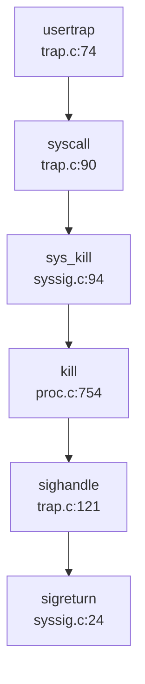

## 第 8 章：同步互斥与进程间通信

### 同步与互斥原语（锁与原子操作）

本操作系统实现了两种核心锁机制：**SpinLock（自旋锁）** 和 **SleepLock（睡眠锁）**，分别适用于短临界区和长临界区的互斥保护。

#### SpinLock 实现

**文件位置**: `src/spinlock.c` (85 行), `src/include/spinlock.h` (30 行)

**结构体定义** (`src/include/spinlock.h:7-13`):
```c
struct spinlock {
  uint locked;       // Is the lock held?
  char *name;        // Name of lock.
  struct cpu *cpu;   // The cpu holding the lock.
};
```

**加锁机制** (`src/spinlock.c:24-46`):
```c
void acquire(struct spinlock *lk)
{
  push_off(); // disable interrupts to avoid deadlock.
  if(holding(lk))
    panic("acquire");

  // On RISC-V, sync_lock_test_and_set turns into an atomic swap:
  //   amoswap.w.aq a5, a5, (s1)
  while(__sync_lock_test_and_set(&lk->locked, 1) != 0)
    ;

  __sync_synchronize(); // memory fence
  lk->cpu = mycpu();
}
```

**原子操作实现**:
- 使用 GCC 内置函数 `__sync_lock_test_and_set()` 实现原子交换
- 在 RISC-V 架构下编译为 `amoswap.w.aq` 指令（原子内存交换）
- 通过 `while` 循环自旋等待直到锁可用
- 使用 `__sync_synchronize()` 发出 `fence` 指令确保内存顺序

**解锁机制** (`src/spinlock.c:49-75`):
```c
void release(struct spinlock *lk)
{
  if(!holding(lk))
    panic("release");

  lk->cpu = 0;
  __sync_synchronize(); // memory fence
  __sync_lock_release(&lk->locked); // amoswap.w zero, zero, (s1)
  pop_off();
}
```

**状态分类**: **✅ 已实现** - 包含完整的原子操作和内存屏障逻辑

#### SleepLock 实现

**文件位置**: `src/sleeplock.c` (56 行), `src/include/sleeplock.h` (24 行)

**结构体定义** (`src/include/sleeplock.h:10-17`):
```c
struct sleeplock {
  uint locked;       // Is the lock held?
  struct spinlock lk; // spinlock protecting this sleep lock
  char *name;        // Name of lock.
  int pid;           // Process holding lock
};
```

**实现原理**:
- SleepLock 内部嵌套一个 SpinLock 保护其状态
- 当锁不可用时，调用 `sleep()` 将进程挂起到等待队列，而非自旋
- 适用于持有时间较长的临界区（如文件系统操作）

**加锁流程** (`src/sleeplock.c:24-34`):
```c
void acquiresleep(struct sleeplock *lk)
{
  acquire(&lk->lk);
  while (lk->locked) {
    sleep(lk, &lk->lk);  // 挂起进程
  }
  lk->locked = 1;
  release(&lk->lk);
}
```

**状态分类**: **✅ 已实现** - 完整实现睡眠/唤醒语义

### 等待队列实现机制

**文件位置**: `src/proc.c` (等待队列管理), `src/include/queue.h` (队列数据结构)

#### 等待队列池

系统维护一个全局等待队列池 (`src/proc.c:28-30`):
```c
#define WAITQ_NUM 100
struct spinlock waitq_pool_lk;
queue waitq_pool[WAITQ_NUM];
int waitq_valid[WAITQ_NUM];
```

**队列结构** (`src/include/queue.h:9-14`):
```c
typedef struct{
  void* chan;           // 睡眠通道标识
  struct spinlock lk;   // 队列锁
  struct list head;     // 双向链表头
}queue;
```

#### 核心 API

**分配等待队列** (`src/proc.c:76-89`):
```c
queue* allocwaitq(void* chan){
  acquire(&waitq_pool_lk);
  for(int i=0;i<WAITQ_NUM ;i++){
    if(!waitq_valid[i]){
      waitq_valid[i] = 1;
      queue_init(waitq_pool+i,chan);
      release(&waitq_pool_lk);
      return waitq_pool+i;
    }
  }
  release(&waitq_pool_lk);
  return NULL;
}
```

**睡眠机制** (`src/proc.c:542-576`):
```c
void sleep(void *chan, struct spinlock *lk)
{
  struct proc *p = myproc();
  
  if(lk != &p->lock){
    acquire(&p->lock);
    release(lk);
  }

  queue* q = findwaitq(chan);
  if(!q) q = allocwaitq(chan);
  waitq_push(q, p);
  p->state = SLEEPING;
  sched();  // 触发调度

  if(lk != &p->lock){
    release(&p->lock);
    acquire(lk);
  }
}
```

**唤醒机制** (`src/proc.c:580-592`):
```c
void wakeup(void *chan)
{
   queue* q = findwaitq(chan);
   if(q){
     struct proc* p;
     while((p = waitq_pop(q))!=NULL){
       p->state = RUNNABLE;
       readyq_push(p);
     }
     delwaitq(q);
   }
}
```

**状态分类**: **✅ 已实现** - 完整的等待队列管理和进程挂起/唤醒逻辑

### 进程间通信（Pipe/MsgQueue/Sem）

#### 管道（Pipe）

**文件位置**: `src/pipe.c` (120 行), `src/include/pipe.h` (24 行)

**结构体定义** (`src/include/pipe.h:10-17`):
```c
#define PIPESIZE 512

struct pipe {
  struct spinlock lock;
  char data[PIPESIZE];      // 环形缓冲区
  uint nread;               // 读指针
  uint nwrite;              // 写指针
  int readopen;             // 读端是否打开
  int writeopen;            // 写端是否打开
};
```

**实现特点**:
- 使用 **512 字节环形缓冲区** 实现
- 通过 `nread` 和 `nwrite` 索引实现循环访问
- 读写操作均持有 `spinlock` 保证原子性
- 缓冲区满/空时通过 `sleep/wakeup` 机制阻塞

**写操作** (`src/pipe.c:69-93`):
```c
int pipewrite(struct pipe *pi, int user, uint64 addr, int n)
{
  for(i = 0; i < n; i++){
    while(pi->nwrite == pi->nread + PIPESIZE){  // 缓冲区满
      if(pi->readopen == 0 || pr->killed){
        release(&pi->lock);
        return -1;
      }
      wakeup(&pi->nread);
      sleep(&pi->nwrite, &pi->lock);
    }
    pi->data[pi->nwrite++ % PIPESIZE] = ch;
  }
  wakeup(&pi->nread);
  return i;
}
```

**读操作** (`src/pipe.c:95-120`):
```c
int piperead(struct pipe *pi, int user, uint64 addr, int n)
{
  while(pi->nread == pi->nwrite && pi->writeopen){  // 缓冲区空
    if(pr->killed){
      release(&pi->lock);
      return -1;
    }
    sleep(&pi->nread, &pi->lock);
  }
  for(i = 0; i < n; i++){
    if(pi->nread == pi->nwrite)
      break;
    ch = pi->data[pi->nread++ % PIPESIZE];
  }
  wakeup(&pi->nwrite);
  return i;
}
```

**状态分类**: **✅ 已实现** - 完整的环形缓冲区实现和阻塞式读写

#### 消息队列（Message Queue）

**搜索结果**: 在整个代码库中搜索 `sys_msgget|msgget|msgsnd|msgrcv` 未找到任何匹配。

**状态分类**: **❌ 未实现** - 代码库中不存在消息队列相关系统调用或数据结构

#### 信号量（Semaphore）

**搜索结果**: 搜索 `sys_semget|semget|semop` 未找到任何匹配。

**状态分类**: **❌ 未实现** - 代码库中不存在 System V 信号量相关系统调用

#### 共享内存（Shared Memory）

**搜索结果**: 搜索 `shmat|shmdt|shmget` 仅找到 `src/include/sysinfo.h:14` 中 `sharedram` 字段引用，无实际实现。

**状态分类**: **❌ 未实现** - 无 System V 共享内存系统调用

#### Futex

**文档描述** (`doc/内核实现--Futex.md`):
- 定义了 `FUTEX_WAIT`, `FUTEX_WAKE`, `FUTEX_REQUEUE` 操作
- 函数原型声明在 `src/include/proc.h:199`: `int do_futex(int* uaddr,int futex_op,int val,ktime_t *timeout,int *addr2,int val2,int val3);`

**代码验证**:
- 搜索 `do_futex` 仅在头文件中找到声明，**未找到实现体**
- 搜索 `sys_futex|futex(` 仅在文档中找到引用
- `src/sysproc.c` 中无 `sys_futex` 系统调用实现

**状态分类**: **🔸 桩函数** - 仅有接口声明和文档描述，无实际实现代码

#### 信号（Signal）作为 IPC

**文件位置**: `src/signal.c` (272 行), `src/syssig.c` (110 行), `src/proc.c:754-792`

**信号发送** (`src/proc.c:754-777`):
```c
int kill(int pid,int sig){
  struct proc* p;
  for(p = proc; p < &proc[NPROC]; p++){
    if(p->pid == pid){
      acquire(&p->lock);
      if(p->state == SLEEPING){
        queue_del(p);
        readyq_push(p);
        p->state = RUNNABLE;
      }
      p->sig_pending.__val[0] |= 1ul << sig;
      if (0 == p->killed || sig < p->killed) {
        p->killed = sig;
      }
      release(&p->lock);
      return 0;
    }
  }
  return 0;
}
```

**系统调用** (`src/syssig.c:94-109`):
```c
uint64 sys_kill(){
  int sig, pid;
  argint(0,&pid);
  argint(1,&sig);
  return kill(pid,sig);
}

uint64 sys_tgkill(){
  int sig, tid, pid;
  argint(0,&pid);
  argint(1,&tid);
  argint(2,&sig);
  return tgkill(pid,tid,sig);
}
```

**信号处理时机** (`src/trap.c:118-122`):
```c
if (p->killed) {
  if (SIGTERM == p->killed)
    exit(-1);
  sighandle();  // 在 Trap 返回用户态前处理信号
}
```

**信号处理流程** (`src/signal.c:119-190`):
```c
void sighandle(void) {
  struct proc *p = myproc();
  int signum = 0;
  
  if (p->killed) {
    signum = p->killed;
    // 清除 pending 位
    p->sig_pending.__val[0] &= ~(1ul << signum);
    p->killed = 0;
  }
  else return;  // 无信号处理
  
  // 分配信号帧
  frame = allocpage();
  tf = allocpage();
  
  // 设置 trapframe 跳转到信号处理函数
  tf->epc = (uint64)(SIG_TRAMPOLINE + ((uint64)sig_handler - (uint64)sig_trampoline));
  tf->a0 = signum;
  
  // 保存原 trapframe
  frame->tf = p->trapframe;
  p->trapframe = tf;
}
```

**状态分类**: **✅ 已实现** - 完整的信号发送、pending 标记、Trap 返回前处理机制

### 关键代码片段

#### 原子操作实现（RISC-V）

```c
// src/spinlock.c:34-36
// RISC-V 原子交换指令: amoswap.w.aq
while(__sync_lock_test_and_set(&lk->locked, 1) != 0)
  ;

// src/spinlock.c:71-72
// 解锁: amoswap.w zero, zero, (s1)
__sync_lock_release(&lk->locked);
```

#### Pipe 环形缓冲区索引计算

```c
// src/pipe.c:86
pi->data[pi->nwrite++ % PIPESIZE] = ch;

// src/pipe.c:113
ch = pi->data[pi->nread++ % PIPESIZE];
```

#### 信号处理流程调用链



### 未实现/桩函数功能列表

| 功能 | 状态 | 说明 |
|------|------|------|
| **SpinLock** | ✅ 已实现 | 基于 RISC-V `amoswap` 原子指令 |
| **SleepLock** | ✅ 已实现 | 基于 SpinLock + WaitQueue |
| **WaitQueue** | ✅ 已实现 | 100 个队列的池化管理 |
| **Pipe** | ✅ 已实现 | 512 字节环形缓冲区 |
| **Signal (kill)** | ✅ 已实现 | 支持 `sys_kill`, `sys_tgkill` |
| **Signal Handler** | ✅ 已实现 | Trap 返回前调用 `sighandle()` |
| **Futex** | 🔸 桩函数 | 仅有 `do_futex` 声明，无实现 |
| **Message Queue** | ❌ 未实现 | 无 `msgget/msgsnd/msgrcv` |
| **Semaphore** | ❌ 未实现 | 无 `semget/semop` |
| **Shared Memory** | ❌ 未实现 | 无 `shmget/shmat/shmdt` |

**总结**: 本操作系统在同步互斥方面实现了基础的 SpinLock 和 SleepLock，配合 WaitQueue 机制支持进程阻塞/唤醒。IPC 方面仅实现了 Pipe 和 Signal 两种基础机制，System V IPC（消息队列、信号量、共享内存）和 Futex 均未实现（仅有文档规划或接口声明）。
