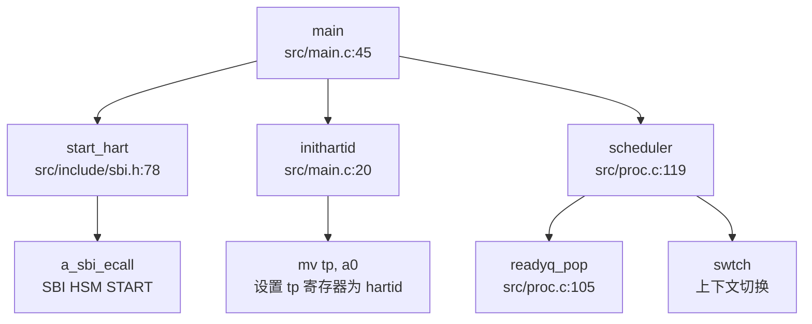

## 第 9 章：多核支持与并行机制

本章分析 `oskernrl2022-rv6` 操作系统的多核（SMP）支持实现。通过深入源码分析，该内核**实现了基础的多核启动机制**，但多核并行调度与同步机制相对简单。以下从架构设计、Secondary CPU 启动、IPI 通信、Per-CPU 变量、调度策略及锁机制六个维度展开分析。

---

## 多核架构设计（SMP/AMP）

**架构类型：✅ 已实现 SMP（对称多处理）架构**

该内核采用经典的 SMP 架构设计，支持最多 5 个 CPU 核心（`NCPU = 5`）。所有核心共享同一内核地址空间、页表和全局数据结构，每个核心独立执行调度器循环。

**关键证据：**

1. **最大核心数定义**（`src/include/param.h:4`）：
   ```c
   #define NCPU          5  // maximum number of CPUs
   ```

2. **Per-CPU 数组声明**（`src/cpu.c:13`、`src/include/cpu.h:37`）：
   ```c
   struct cpu cpus[NCPU];  // 全局 CPU 数组，每核一份
   ```

3. **核心标识机制**：通过 `tp` 寄存器存储 hartid（核心号），`cpuid()` 函数直接读取：
   ```c
   // src/cpu.c:22-27
   int cpuid() {
     int id = r_tp();  // 从 tp 寄存器读取 hartid
     return id;
   }
   ```

4. **共享全局数据结构**：所有核心共享 `readyq`（就绪队列）、`pid_lock`（PID 分配锁）、`waitq_pool`（等待队列池）等全局资源，通过自旋锁保护。

**架构特点：**
- **对称性**：所有核心执行相同的 `scheduler()` 循环，从全局就绪队列竞争获取进程
- **共享内存模型**：通过 `kvminit()` 创建统一内核页表，所有核心使用相同的虚拟地址映射
- **无 NUMA 感知**：未实现内存节点亲和性或核心拓扑感知

---

## Secondary CPU 启动流程

**实现状态：✅ 已实现**

内核通过 RISC-V SBI（Supervisor Binary Interface）的 HSM（Hart State Management）扩展唤醒 Secondary CPU。启动链清晰完整，主核（BSP）完成初始化后通过 `start_hart()` SBI 调用唤醒其他核心。

### 详细启动链（Mermaid Call Graph）



### 启动流程详解

**阶段 1：BSP 初始化（`src/main.c:44-110`）**

主核（hartid=0 或首个启动的核心）执行完整初始化：
```c
void main(unsigned long hartid, unsigned long dtb_pa) {
  inithartid(hartid);  // 将 hartid 存入 tp 寄存器
  booted[hartid] = 1;  // 标记本核已启动
  
  if (__first_boot_magic == 0x5a5a) { /* 仅 BSP 执行 */
    __first_boot_magic = 0;
    cpuinit();        // 初始化 cpus[] 数组
    printfinit();
    kvminit();        // 创建内核页表
    kvminithart();    // 启用分页（每核）
    trapinithart();   // 安装中断向量
    procinit();       // 初始化进程子系统
    // ... 其他初始化
    
    userinit();       // 创建第一个用户进程
    
    // 唤醒其他核心
    for(int i = 1; i < NCPU; i++) {
      if(hartid != i && booted[i] == 0) {
        start_hart(i, (uint64)_entry, 0);  // SBI 调用唤醒
      }
    }
    started = 1;  // 释放等待的 Secondary CPU
  }
  // ...
  scheduler();  // 进入调度循环
}
```

**阶段 2：Secondary CPU 等待与启动**

Secondary CPU 通过忙等待同步：
```c
// src/main.c:80-89
else {  // Secondary CPU 路径
  while (started == 0)  // 等待 BSP 完成初始化
    ;
  printf("hart %d enter main()...\n", hartid);
  kvminithart();        // 启用本核分页
  trapinithart();       // 安装中断向量
  __sync_synchronize();
}
```

**阶段 3：SBI HSM 调用（`src/include/sbi.h:78-83`）**

```c
static inline void start_hart(uint64 hartid, uint64 start_addr, uint64 a1) {
    a_sbi_ecall(0x48534D, 0, hartid, start_addr, a1, 0, 0, 0);
    // SBI Extension ID: 0x48534D = 'HSM' (ASCII)
    // Function ID: 0 = START
}

static inline int sbi_hsm_hart_status(unsigned long hart) {
    struct sbiret ret;
    ret = a_sbi_ecall(0x48534D, 2, hart, 0, 0, 0, 0, 0);
    // Function ID: 2 = GET_STATUS
    return (ret.error != 0 ? (int)ret.error : (int)ret.value);
}
```

**关键同步机制：**
- `booted[]` 数组：标记每核启动状态（`src/main.c:28`）
- `started` 标志：Secondary CPU 忙等待直到 BSP 完成初始化
- `__sync_synchronize()`：内存屏障确保可见性

---

## 核间通信与 IPI 机制

**实现状态：🔸 桩函数（仅有接口，未见实际使用）**

内核提供了 IPI（Inter-Processor Interrupt）发送接口，但**在源码中未找到任何实际调用 `send_ipi()` 的位置**。IPI 机制仅停留在接口层面，未用于调度、TLB 刷新或核间同步。

### IPI 接口定义（`src/include/sbi.h:86-88`）

```c
static inline void send_ipi(uint64 mask) {
    a_sbi_ecall(0x735049, 0, mask, 0, 0, 0, 0, 0);
    // SBI Extension ID: 0x735049 = 'IPI' (ASCII)
}
```

### 外部中断处理（`src/trap.c:216-260`）

中断处理中未涉及 IPI 接收逻辑：
```c
int devintr(void) {
  uint64 scause = r_scause();
  
  // 外部中断处理（scause bit 9）
  if ((0x8000000000000000L & scause) && 9 == (scause & 0xff)) {
    // 仅处理 UART0_IRQ，未处理 IPI
    // ...
    #ifndef QEMU 
    w_sip(r_sip() & ~2);    // clear pending bit (清除软件中断)
    sbi_set_mie();
    #endif 
    return 1;
  }
  // ...
}
```

**IPI 缺失场景：**
- ❌ **调度器间通信**：未实现跨核调度（如进程迁移）
- ❌ **TLB 刷新**：页表更新后未发送 IPI 刷新其他核心 TLB
- ❌ **RCU 回调**：未实现 RCU 机制
- ❌ **核间同步**：无 `smp_call_function()` 类接口

**结论**：IPI 接口已定义但**未被使用**，多核间无主动通信机制，仅通过共享内存 + 锁进行隐式同步。

---

## Per-CPU 变量与数据结构

**实现状态：✅ 已实现基础 Per-CPU 结构**

内核通过 `struct cpu` 数组实现 Per-CPU 变量，每个核心通过 `mycpu()` 访问自己的 CPU 结构。

### Per-CPU 结构定义（`src/include/cpu.h:30-35`）

```c
struct cpu {
  struct proc *proc;          // 当前运行的进程（或 null）
  struct context context;     // swtch() 切换到 scheduler() 的上下文
  int noff;                   // push_off() 嵌套深度（中断禁用计数）
  int intena;                 // push_off() 前的中断使能状态
};
```

### 访问方式（`src/cpu.c:32-48`）

```c
// 获取当前 CPU 结构
struct cpu* mycpu(void) {
  int id = cpuid();      // 从 tp 寄存器读取 hartid
  struct cpu *c = &cpus[id];
  return c;
}

// 获取当前进程
struct proc* myproc(void) {
  push_off();            // 禁用中断（防止进程被迁移）
  struct cpu *c = mycpu();
  struct proc *p = c->proc;
  pop_off();
  return p;
}
```

### Per-CPU 字段用途

| 字段 | 用途 | 多线程安全 |
|------|------|-----------|
| `proc` | 指向当前运行的进程 | ✅ 通过 `push_off()` 保护 |
| `context` | 调度器上下文（`ra`, `sp`, `s0-s11`） | ✅ 每核独立 |
| `noff` | 中断禁用嵌套计数 | ✅ 每核独立 |
| `intena` | 保存中断使能状态 | ✅ 每核独立 |

**缺失的 Per-CPU 优化：**
- ❌ **Per-CPU 就绪队列**：所有核心共享全局 `readyq`，存在锁竞争
- ❌ **Per-CPU 分配器**：`kmalloc` 使用全局锁（`kmem_table_lock`）
- ❌ **Per-CPU 统计信息**：无每核调度次数、中断计数等统计

---

## 多核调度策略

**实现状态：❌ 未实现多核调度优化（全局单队列）**

内核采用**全局单就绪队列**设计，所有核心从同一队列竞争获取进程，无负载均衡、无 CPU 亲和性、无调度器隔离。

### 调度器实现（`src/proc.c:119-152`）

```c
void scheduler() {
  struct cpu *c = mycpu();
  c->proc = 0;
  while(1) {
    struct proc* p = readyq_pop();  // 从全局队列获取进程
    if(p) {
      acquire(&p->lock);
      if(p->state == RUNNABLE) {
        p->state = RUNNING;
        c->proc = p;
        w_satp(MAKE_SATP(p->pagetable));  // 切换页表
        sfence_vma();
        swtch(&c->context, &p->context);  // 上下文切换
        w_satp(MAKE_SATP(kernel_pagetable));
        sfence_vma();
        c->proc = 0;
      }
      release(&p->lock);
    } else {
      intr_on();       // 启用中断
      asm volatile("wfi");  // 等待中断（无进程时空转）
    }
  }
}
```

### 调度策略分析

| 特性 | 实现状态 | 说明 |
|------|---------|------|
| **调度队列** | 全局单队列 | 所有核心共享 `readyq` |
| **调度算法** | FIFO（先进先出） | `queue_pop()` 从队首取进程 |
| **负载均衡** | ❌ 未实现 | 无跨核迁移逻辑 |
| **CPU 亲和性** | ❌ 未实现 | 进程无 `cpumask` 绑定 |
| **调度器锁** | 无锁（队列操作原子性依赖底层） | `readyq_pop()` 未显式加锁 |
| **空闲核心处理** | `wfi` 指令休眠 | 无进程时进入低功耗模式 |

### PID 分配机制（`src/proc.c:155-160`）

PID 分配使用全局自旋锁保护，**非原子操作**：
```c
int allocpid() {
  int pid;
  acquire(&pid_lock);  // 全局锁
  pid = nextpid;
  nextpid = nextpid + 1;  // 非原子自增
  release(&pid_lock);
  return pid;
}
```

**问题**：
- `nextpid` 为普通 `int` 类型，未使用 `atomic_t` 或 `volatile`
- 依赖 `pid_lock` 保证原子性，但锁开销较大
- 无 PID 回收机制（循环分配）

### 与前面章节的交叉引用

1. **进程调度中的全局唯一 ID 池**（第 4 章）：
   - `nextpid` 为全局变量，通过 `pid_lock` 保护
   - 未使用 `AtomicUsize` 或原子操作，依赖锁保证原子性

2. **双级注册机制**（第 4 章）：
   - 线程注册到 Process + 全局管理器：未实现线程级调度，仅进程级
   - 所有进程注册到全局 `readyq`，无 per-process 线程队列

3. **Futex 实现**（第 6 章）：
   - 文档提及 Futex 但**未找到系统调用实现**
   - `waitq_pool` 用于进程等待队列，但非 Futex 用户态快速路径

---

## 锁机制与多核安全

### 自旋锁实现（`src/spinlock.c:15-85`）

**实现状态：✅ 已实现（禁用中断的自旋锁）**

```c
void acquire(struct spinlock *lk) {
  push_off();  // 禁用中断（防止死锁）
  if(holding(lk))
    panic("acquire");

  // RISC-V 原子交换（amoswap.w.aq）
  while(__sync_lock_test_and_set(&lk->locked, 1) != 0)
    ;

  __sync_synchronize();  // 内存屏障
  lk->cpu = mycpu();     // 记录持有者
}

void release(struct spinlock *lk) {
  if(!holding(lk))
    panic("release");

  lk->cpu = 0;
  __sync_synchronize();  // 内存屏障
  __sync_lock_release(&lk->locked);  // 原子释放

  pop_off();  // 恢复中断状态
}
```

**关键特性：**
- ✅ **禁用中断**：`push_off()` 防止同一核心在持有锁时被中断处理程序再次尝试获取锁（死锁预防）
- ✅ **原子操作**：`__sync_lock_test_and_set()` 编译为 RISC-V `amoswap.w.aq` 指令
- ✅ **内存屏障**：`__sync_synchronize()` 确保临界区内存操作顺序
- ✅ **持有者追踪**：`lk->cpu` 用于调试和 `holding()` 检查

**缺失特性：**
- ❌ **优先级继承**：未实现优先级继承协议（Priority Inheritance）
- ❌ **自适应自旋**：无自适应退避策略
- ❌ **读写锁**：未实现读写锁（RWLock）

### 中断嵌套保护（`src/intr.c:11-40`）

```c
void push_off(void) {
  int old = intr_get();
  intr_off();  // 禁用中断
  if(mycpu()->noff == 0)
    mycpu()->intena = old;  // 保存初始中断状态
  mycpu()->noff += 1;       // 嵌套计数 +1
}

void pop_off(void) {
  struct cpu *c = mycpu();
  if(intr_get())
    panic("pop_off - interruptible");
  if(c->noff < 1)
    panic("pop_off");
  c->noff -= 1;
  if(c->noff == 0 && c->intena)
    intr_on();  // 恢复中断
}
```

### 全局锁列表

| 锁名称 | 类型 | 保护资源 | 文件位置 |
|--------|------|---------|---------|
| `pid_lock` | SpinLock | PID 分配（`nextpid`） | `src/proc.c:37` |
| `waitq_pool_lk` | SpinLock | 等待队列池 | `src/proc.c:30` |
| `kmem_table_lock` | SpinLock | 内核内存分配器 | `src/kmalloc.c:54` |
| `ramdisklock` | SpinLock | 虚拟磁盘访问 | `src/ramdisk.c:13` |
| `file.lock` | SpinLock | 文件结构 | `src/file.c:22` |
| `printf.lock` | SpinLock | 控制台输出 | `src/printf.c:23` |

### 原子操作使用情况

**检查结果**：未使用 C11/C++11 标准原子类型（`atomic_t`、`AtomicUsize`），所有"原子"操作依赖：
1. 自旋锁保护（如 `nextpid`）
2. GCC 内置函数（`__sync_lock_test_and_set()`）
3. RISC-V 原子指令（`amoswap`）

**内存序保证**：
- `__sync_synchronize()` 提供全内存屏障（Full Memory Barrier）
- 未使用细粒度内存序（如 `memory_order_acquire`、`memory_order_release`）

---

## 关键代码片段

### 1. Secondary CPU 启动（`src/main.c:77-89`）

```c
// BSP 唤醒其他核心
for(int i = 1; i < NCPU; i++) {
    if(hartid != i && booted[i] == 0) {
      start_hart(i, (uint64)_entry, 0);
    }
}
started = 1;  // 释放 Secondary CPU

// Secondary CPU 等待 BSP
else {
    while (started == 0)
      ;
    printf("hart %d enter main()...\n", hartid);
    kvminithart();
    trapinithart();
    __sync_synchronize();
}
```

### 2. 自旋锁获取与释放（`src/spinlock.c:25-70`）

```c
void acquire(struct spinlock *lk) {
  push_off();  // 禁用中断
  if(holding(lk))
    panic("acquire");

  while(__sync_lock_test_and_set(&lk->locked, 1) != 0)
    ;

  __sync_synchronize();
  lk->cpu = mycpu();
}

void release(struct spinlock *lk) {
  if(!holding(lk))
    panic("release");

  lk->cpu = 0;
  __sync_synchronize();
  __sync_lock_release(&lk->locked);
  pop_off();  // 恢复中断
}
```

### 3. 全局调度器（`src/proc.c:119-152`）

```c
void scheduler() {
  struct cpu *c = mycpu();
  c->proc = 0;
  while(1) {
    struct proc* p = readyq_pop();  // 全局队列
    if(p) {
      acquire(&p->lock);
      if(p->state == RUNNABLE) {
        p->state = RUNNING;
        c->proc = p;
        w_satp(MAKE_SATP(p->pagetable));
        sfence_vma();
        swtch(&c->context, &p->context);
        w_satp(MAKE_SATP(kernel_pagetable));
        sfence_vma();
        c->proc = 0;
      }
      release(&p->lock);
    } else {
      intr_on();
      asm volatile("wfi");  // 等待中断
    }
  }
}
```

### 4. Per-CPU 访问（`src/cpu.c:32-48`）

```c
struct cpu* mycpu(void) {
  int id = cpuid();  // r_tp()
  struct cpu *c = &cpus[id];
  return c;
}

struct proc* myproc(void) {
  push_off();
  struct cpu *c = mycpu();
  struct proc *p = c->proc;
  pop_off();
  return p;
}
```

---

## 本章总结

| 特性 | 实现状态 | 备注 |
|------|---------|------|
| **SMP 架构** | ✅ 已实现 | 支持最多 5 核，共享地址空间 |
| **Secondary CPU 启动** | ✅ 已实现 | 通过 SBI HSM 扩展唤醒 |
| **IPI 通信** | 🔸 桩函数 | 接口存在但未使用 |
| **Per-CPU 变量** | ✅ 已实现 | `struct cpu` 数组 + `mycpu()` 访问 |
| **多核调度** | ❌ 未优化 | 全局单队列，无负载均衡 |
| **自旋锁** | ✅ 已实现 | 禁用中断 + 原子操作 |
| **优先级继承** | ❌ 未实现 | 无优先级继承协议 |
| **原子操作** | 🔸 部分实现 | 依赖 GCC 内置函数，无标准原子类型 |

**核心结论**：
1. **多核启动机制完整**：BSP 通过 SBI HSM 成功唤醒 Secondary CPU，同步机制可靠
2. **IPI 机制缺失**：未实现核间主动通信，多核间仅通过共享内存 + 锁隐式同步
3. **调度器为单队列设计**：所有核心竞争全局 `readyq`，存在锁竞争瓶颈
4. **锁机制基础但有效**：自旋锁禁用中断防止死锁，但缺乏高级特性（优先级继承、自适应自旋）
5. **原子操作依赖编译器内置函数**：未使用 C11/C++11 标准原子类型，内存序控制粗糙

**改进建议**：
- 实现 Per-CPU 就绪队列，减少锁竞争
- 添加 IPI 用于 TLB 刷新和跨核调度
- 引入优先级继承协议防止优先级反转
- 使用标准原子类型（`atomic_t`）替代锁保护的计数器
