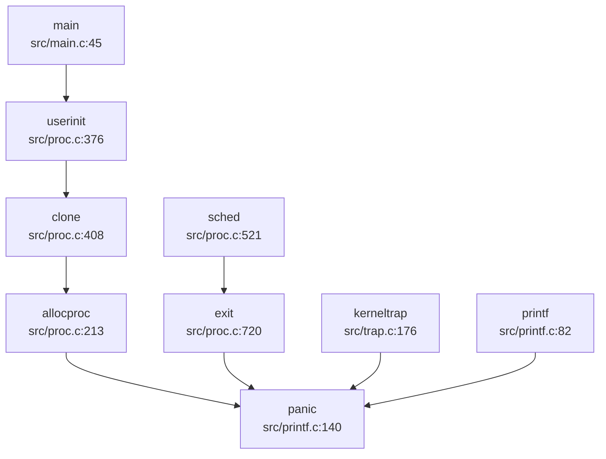

## 第 12 章：调试机制与错误处理

本章分析 oskernrl2022-rv6 操作系统的调试支持、日志系统、错误处理机制以及调试接口。该内核基于 RISC-V 架构，采用 C 语言实现，调试机制相对基础但功能完整。

---

## 日志与打印系统

### 核心打印函数 `printf`

内核的打印系统围绕 `printf` 函数构建，位于 [`src/printf.c`](repos\oskernrl2022-rv6\src\printf.c:81-137)。该函数支持标准格式化输出，包括 `%c`、`%d`、`%x`、`%p`、`%s` 等格式说明符。

```c
// src/printf.c:81-137
void printf(char *fmt, ...) {
  va_list ap;
  int i, c;
  int locking;
  char *s;
  locking = pr.locking;
  if(locking)
    acquire(&pr.lock);
  
  if (fmt == 0)
    panic("null fmt");

  va_start(ap, fmt);
  for(i = 0; (c = fmt[i] & 0xff) != 0; i++){
    if(c != '%'){
      consputc(c);
      continue;
    }
    c = fmt[++i] & 0xff;
    // ... 格式化处理
  }
  if(locking)
    release(&pr.lock);
}
```

**实现特点**：
- **线程安全**：通过 `pr.lock` 自旋锁保护并发访问
- **格式化支持**：支持字符、整数、十六进制、指针、字符串等格式
- **底层输出**：通过 `consputc()` 将字符输出到控制台（UART）

### 日志级别设计

内核实现了三级日志系统，通过条件编译控制：

| 级别 | 函数 | 宏控制 | 文件位置 |
|------|------|--------|----------|
| INFO | `__debug_info()` | `DEBUG` | [`src/printf.c:163-219`](repos\oskernrl2022-rv6\src\printf.c:163-219) |
| WARN | `__debug_warn()` | `WARNING` | [`src/printf.c:221-277`](repos\oskernrl2022-rv6\src\printf.c:221-277) |
| ERROR | `__debug_error()` | `ERROR` | [`src/printf.c`](repos\oskernrl2022-rv6\src\printf.c) |

```c
// src/printf.c:163-180
void __debug_info(char *fmt, ...){
#ifdef DEBUG
  va_list ap;
  // ... 获取锁
  if (fmt == 0)
    panic("null fmt");
  printstring("[DEBUG]");  // 添加前缀
  va_start(ap, fmt);
  // ... 格式化输出
#endif    
}
```

**实现状态**：✅ 已实现

日志级别通过编译时宏控制，开发者可在编译时定义 `DEBUG`、`WARNING`、`ERROR` 来启用相应级别的日志输出。

### 系统日志缓冲区

内核实现了简单的系统日志缓冲区机制，位于 [`src/syslog.c`](repos\oskernrl2022-rv6\src\syslog.c:12-50)：

```c
// src/syslog.c:12-22
char syslogbuf[1024];
int logbuflen = 0;

void logbufinit(){
  logbuflen = 0;
  strncpy(syslogbuf, "[log]init done\n", 1024);
  logbuflen += strlen(syslogbuf);
}
```

通过 `sys_syslog()` 系统调用（`SYSLOG_ACTION_READ_ALL`）可读取缓冲区内容，但实现较为简单，仅支持读取固定大小的缓冲区。

---

## Panic 处理与栈回溯

### Panic 处理流程

当内核遇到致命错误时，调用 `panic()` 函数处理。其实现位于 [`src/printf.c:139-149`](repos\oskernrl2022-rv6\src\printf.c:139-149)：

```c
void panic(char *s) {
  printf("panic: ");
  printf(s);
  printf("\n");
  backtrace();
  panicked = 1;  // freeze uart output from other CPUs
  for(;;)
    ;
}
```

**处理流程**：
1. 打印 panic 消息
2. 调用 `backtrace()` 打印调用栈
3. 设置全局标志 `panicked = 1` 冻结 UART 输出
4. 进入无限循环停机

### 栈回溯 (Backtrace) 实现

内核支持基于 **Frame Pointer (FP)** 的栈回溯，位于 [`src/printf.c:151-161`](repos\oskernrl2022-rv6\src\printf.c:151-161)：

```c
void backtrace() {
  uint64 *fp = (uint64 *)r_fp();
  uint64 *bottom = (uint64 *)PGROUNDUP((uint64)fp);
  printf("backtrace:\n");
  while (fp < bottom) {
    uint64 ra = *(fp - 1);
    printf("%p\n", ra - 4);
    fp = (uint64 *)*(fp - 2);
  }
}
```

**实现原理**：
- 通过 `r_fp()` 读取当前帧指针（`fp` 寄存器）
- 利用 RISC-V 调用约定：`fp-8` 存储返回地址（`ra`），`fp-16` 存储上一帧的 `fp`
- 遍历栈帧直到达到页边界（`PGROUNDUP`）
- 打印每个返回地址（减 4 以指向 call 指令）

**实现状态**：✅ 已实现（基于 FramePointer）

**限制**：
- ❌ **不支持 DWARF 解析**：未搜索到 DWARF 相关代码
- ❌ **不支持 libunwind**：无 unwind 库集成
- 仅支持内核态栈回溯，不支持用户态回溯

### Panic 调用链分析

通过 `lsp_get_call_graph` 分析 `panic` 的入向调用：



**触发 panic 的主要场景**：
1. **内核陷阱处理**：`kerneltrap()` 遇到未处理异常时（[`src/trap.c:176-209`](repos\oskernrl2022-rv6\src\trap.c:176-209)）
2. **进程分配失败**：`allocproc()` 资源不足时
3. **进程退出**：`exit()` 遇到致命错误
4. **格式化错误**：`printf()` 收到空格式字符串

### 陷阱帧转储 (Trapframe Dump)

内核提供 `trapframedump()` 函数用于打印陷阱帧内容，位于 [`src/trap.c:263-297`](repos\oskernrl2022-rv6\src\trap.c:263-297)：

```c
void trapframedump(struct trapframe *tf) {
  printf("a0: %p\t", tf->a0);
  printf("a1: %p\t", tf->a1);
  // ... 打印所有寄存器
  printf("epc: %p\n", tf->epc);
}
```

该函数在 `kerneltrap()` 中被调用，用于调试异常发生时的寄存器状态。

**实现状态**：✅ 已实现

---

## 错误码与 Result 设计

### 错误码定义

内核采用类 Unix 的错误码设计，定义在 [`src/include/errno.h`](repos\oskernrl2022-rv6\src\include\errno.h:1-107) 中：

```c
// src/include/errno.h:1-40
#define EPERM     1   /* Operation not permitted */
#define ENOENT    2   /* No such file or directory */
#define ESRCH     3   /* No such process */
#define EINTR     4   /* Interrupted system call */
#define EIO       5   /* I/O error */
#define ENOMEM    12  /* Out of memory */
#define EACCES    13  /* Permission denied */
#define EFAULT    14  /* Bad address */
#define EINVAL    22  /* Invalid argument */
#define ENOSYS    38  /* Invalid system call number */
// ... 共 98+ 个错误码
```

**错误码分类**：
- **权限相关**：`EPERM`、`EACCES`
- **资源相关**：`ENOMEM`、`ENOSPC`、`EMFILE`
- **文件操作**：`ENOENT`、`EISDIR`、`ENOTDIR`
- **系统调用**：`ENOSYS`、`EINVAL`

### 返回值约定

内核函数采用 **C 语言传统错误处理模式**：
- **成功**：返回 `0` 或有效值
- **失败**：返回 `-1` 并设置全局 `errno`，或直接返回负的错误码

```c
// src/copy.c:12-15
// Return 0 on success, -1 on error.

// src/diskio.c:57-58
result = sd_init(spictrl, peripheral_input_khz, 0);
return result == 0 ? RES_OK : RES_ERROR;
```

**实现状态**：✅ 已实现

**注意**：该内核未使用 Rust 风格的 `Result<T, E>` 类型，而是采用传统 C 语言的错误处理方式。

---

## 调试接口与交互式 Shell

### 交互式 Shell 支持

**❌ 未实现内核级交互式 Shell/Monitor**

通过搜索 `monitor|shell|command` 发现：
- 文档中提及用户态 shell（busybox），但**内核未实现调试 Monitor**
- 无内核命令解析器（如 `ps`、`ls`、`help` 等命令）
- 用户程序通过系统调用与内核交互，无运行时调试接口

### 系统调用追踪

内核支持简单的系统调用追踪机制，位于 [`syscall/syscall.c:1-20`](repos\oskernrl2022-rv6\syscall\syscall.c:1-20)：

```c
void syscall(void) {
  int num;
  struct proc *p = myproc();
  
  num = p->trapframe->a7;
  if(num > 0 && num < NELEM(syscalls) && syscalls[num]) {
    p->trapframe->a0 = syscalls[num]();
    // trace
    if ((p->tmask & (1 << num)) != 0) {
      printf("pid %d: %s -> %d\n", p->pid, sysnames[num], p->trapframe->a0);
    }
  } else {
    printf("pid %d %s: unknown sys call %d\n", p->pid, p->name, num);
    p->trapframe->a0 = -1;
  }
}
```

**实现特点**：
- 通过进程结构体中的 `tmask` 字段控制追踪掩码（[`src/include/proc.h:153`](repos\oskernrl2022-rv6\src\include\proc.h:153)）
- 当 `tmask` 对应位被设置时，打印系统调用名称和返回值
- 类似 `strace` 功能，但功能较为基础

**实现状态**：✅ 已实现（基础追踪）

### 调试控制台

内核通过 UART 提供基础的控制台输出：
- `printf()` 系列函数输出到串口
- `consputc()` 为底层字符输出函数
- 无交互式命令输入支持

---

## GDB Stub 支持情况

### GDB 远程调试配置

仓库包含 `.gdbinit` 配置文件，用于配合 QEMU 进行远程调试：

```
# .gdbinit
set confirm off
set architecture riscv:rv64
target remote 127.0.0.1:26000
symbol-file src/kernel
set disassemble-next-line auto
set riscv use-compressed-breakpoints yes
```

**实现状态**：🔸 仅配置文件

### GDB Stub 代码检查

**❌ 未实现内核级 GDB Stub**

通过搜索 `gdb|gdbstub|handle_gdb_packet`：
- **未找到任何 GDB 数据包处理代码**
- **未找到 GDB Stub 实现**（如 `handle_gdb_packet`、`gdb_enter` 等）
- 调试依赖 QEMU 内置的 GDB Server，而非内核实现

**结论**：该内核不支持运行时 GDB 远程调试协议，仅能通过 QEMU 的外部 GDB Server 进行调试。

---

## 断言与运行时检查

### 链接器断言

内核在链接脚本中使用 `ASSERT` 进行编译时检查，位于 [`linker/kernel.ld`](repos\oskernrl2022-rv6\linker\kernel.ld:23-27)：

```ld
/* linker/kernel.ld */
ASSERT(. - _trampoline == 0x1000, "error: trampoline larger than one page")
ASSERT(. - _sig_trampoline == 0x1000, "error: sig_trampoline larger than one page")
```

**检查内容**：
- 确保 `trampoline` 代码大小不超过一页（4KB）
- 确保信号跳板代码大小不超过一页

### 静态断言

内核在头文件中使用 `_Static_assert` 进行类型大小检查，位于 [`src/include/spi.h`](repos\oskernrl2022-rv6\src\include\spi.h:13-179)：

```c
// src/include/spi.h:13
#define _ASSERT_SIZEOF(type, size) _Static_assert(sizeof(type) == (size), #type " must be " #size " bytes wide")

// src/include/spi.h:25-179
_ASSERT_SIZEOF(spi_reg_sckmode, 4);
_ASSERT_SIZEOF(spi_reg_csmode, 4);
// ... 多个 SPI 寄存器结构检查
```

**实现状态**：✅ 已实现

### 运行时断言

**❌ 未发现运行时 `assert()` 宏实现**

- 未找到 `assert.h` 或 `KERNEL_ASSERT` 的运行时实现
- 代码中注释提及 `//#include <utils/assert.h>`，但实际未启用
- 错误处理主要依赖返回值检查和 `panic()`

### 调试宏使用示例

内核代码中广泛使用条件编译的调试宏：

```c
// src/bio.c:60
#ifdef DEBUG
  // 调试输出
#endif

// src/cpu.c:12
// #define DEBUG1
```

**实现状态**：🔸 部分实现（依赖编译选项）

---

## 关键代码片段

### Panic 与 Backtrace 完整实现

```c
// src/printf.c:139-161
void panic(char *s) {
  printf("panic: ");
  printf(s);
  printf("\n");
  backtrace();
  panicked = 1;  // freeze uart output from other CPUs
  for(;;)
    ;
}

void backtrace() {
  uint64 *fp = (uint64 *)r_fp();
  uint64 *bottom = (uint64 *)PGROUNDUP((uint64)fp);
  printf("backtrace:\n");
  while (fp < bottom) {
    uint64 ra = *(fp - 1);
    printf("%p\n", ra - 4);
    fp = (uint64 *)*(fp - 2);
  }
}
```

### 内核陷阱处理中的 Panic

```c
// src/trap.c:176-200
void kerneltrap() {
  int which_dev = 0;
  uint64 sepc = r_sepc();
  uint64 sstatus = r_sstatus();
  uint64 scause = r_scause();

  if((sstatus & SSTATUS_SPP) == 0)
    panic("kerneltrap: not from supervisor mode");
  if(intr_get() != 0)
    panic("kerneltrap: interrupts enabled");

  if((which_dev = devintr()) == 0){
    printf("\nscause %p\n", scause);
    printf("sepc=%p stval=%p hart=%d\n", r_sepc(), r_stval(), r_tp());
    struct proc *p = myproc();
    if (p != 0) {
      printf("pid: %d, name: %s\n", p->pid, p->name);
    }
    panic("kerneltrap");
  }
  // ... 处理设备中断
}
```

### 系统日志实现

```c
// src/syslog.c:12-50
char syslogbuf[1024];
int logbuflen = 0;

uint64 sys_syslog() {
  int type;
  uint64 bufp;
  int len;
  if(argint(0,&type)<0) return -1;
  if(argaddr(1,&bufp)<0) return -1;
  if(argint(2,&len)<0) return -1;
  
  switch(type){
    case SYSLOG_ACTION_READ_ALL:
      if(either_copyout(1,bufp,syslogbuf,logbuflen)<0)
        return -1;
      return logbuflen;
    case SYSLOG_ACTION_SIZE_BUFFER: 
      return sizeof(syslogbuf);
  }
  return 0;
}
```

---

## 总结

| 功能模块 | 实现状态 | 说明 |
|----------|----------|------|
| 日志系统 | ✅ 已实现 | 支持 `printf` 和三级日志（DEBUG/WARNING/ERROR） |
| Panic 处理 | ✅ 已实现 | 打印消息 + 栈回溯 + 停机 |
| 栈回溯 (Backtrace) | ✅ 已实现 | 基于 FramePointer，不支持 DWARF |
| 错误码设计 | ✅ 已实现 | 类 Unix 错误码（98+ 个） |
| 交互式 Shell | ❌ 未实现 | 无内核 Monitor |
| GDB Stub | ❌ 未实现 | 仅 QEMU 外部调试 |
| 系统调用追踪 | ✅ 已实现 | 基于 `tmask` 的基础追踪 |
| 断言检查 | 🔸 部分实现 | 仅链接器和静态断言 |
| Perf/ftrace | ❌ 未实现 | 无性能分析工具 |

该内核的调试机制以满足基础调试需求为主，缺乏高级调试功能（如 GDB Stub、交互式 Monitor、性能分析工具）。栈回溯功能完整但较为基础，错误处理机制遵循传统 C 语言风格。
