# oskernrl2022-rv6 操作系统技术分析报告

> **年份**: 2022

> **赛事**: 操作系统赛

> **子赛事**: 内核实现赛道

> **学校**: 华中科技大学

> **队伍名称**: 我永远喜欢少名针妙丸

> **仓库地址**: https://gitlab.eduxiji.net/Cty/oskernrl2022-rv6

> **分析日期**: 2026年04月16日

> **分析工具**: OS-Agent-D

---

## 目录

1. 项目概览与技术栈
2. 启动流程与架构初始化
3. 内存管理物理虚拟分配器
4. 进程线程与调度机制
5. 中断异常与系统调用
6. 文件系统VFS  具体 FS
7. 设备驱动与硬件抽象
8. 同步互斥与进程间通信
9. 多核支持与并行机制
10. 安全机制与权限模型
11. 网络子系统与协议栈
12. 调试机制与错误处理
13. 开发历史与里程碑

---

## Call Graph 概览

> 先以 Tree-sitter 扫描全库，再对 C/C++ 用 **Clang AST**（与仓库根 `compile_flags.txt` / `compile_commands.json` 一致）剔除**条件编译未进入翻译单元**的函数节点，得到参与 PageRank 的 **2562** 个函数、**1316** 条调用边。
> 语义解析 54/54 个文件。
>
> 用 **PageRank** 选出架构枢纽 **Top-30** 个函数（参数 **k=30**；若全库可排名节点不足 k，则实际个数可能小于 k）。
> 按 **domain（列）× layer（行）** 二维网格布局（**domain/layer 由 LLM 根据函数名与代码片段分类**），
> 同格多节点限制在格内排布；连线体现调用关系。
> **可变网格**：在 **k=30** 配置下，**未出现**的 domain 列、layer 行会**压缩**宽高，把画布让给有节点的列/行。
> **layer 为何常落在 kernel**：PageRank 枢纽多为调度/内存/VFS 等**内核通用逻辑**，且 `kernel` 表示「既非 syscall 入口、也非直接 MMIO」的广义内核代码，模型容易默认成 kernel；已对 **`sys_*` 命名**做确定性修正为 `syscall_boundary`。缓存随 **compile 配置 / git / 管线版本** 自动失效；需强制全量重算时可调用 `generate_callgraph_section(..., force_regenerate=True)`。

### 函数级 Call Graph（PageRank Top-30，图示 30 个函数）


*（图：`callgraph_overview.svg`，与报告同目录）*

**图例**：列 = domain 分类，行 = layer 层次（**userspace** → **syscall_boundary** → **kernel** → **hardware**）
节点颜色：`arch_platform`=#f4d03f / `trap_syscall`=#e74c3c / `process_sched`=#3498db / `memory_vm`=#2ecc71 / `fs_storage`=#9b59b6
节点**第一行**仅为**符号名**；**第二行**：**函数定义**只写相对源路径；**宏**、**类型别名（typedef）**、**仅引用（调用侧）**等在第二行用**中文**标明类别并附路径或调用方文件（来自静态解析或调用边）。
列宽按该 domain 列下最长节点标签**动态**估算（有上下限），避免固定死宽度。

### 文件级调用关系

<table style="border-collapse:collapse;width:auto;max-width:100%;table-layout:auto">
<thead><tr>
<th style="text-align:left;padding:6px 10px;border:1px solid #ddd;background:#f6f8fa">源文件</th>
<th style="text-align:left;padding:6px 10px;border:1px solid #ddd;background:#f6f8fa">domain</th>
<th style="text-align:left;padding:6px 10px;border:1px solid #ddd;background:#f6f8fa">调用的文件（权重）</th>
</tr></thead>
<tbody>
<tr><td style="text-align:left;padding:6px 10px;border:1px solid #ddd;vertical-align:top"><code style='white-space:pre-wrap;word-break:break-all'>src/cpu.c</code></td><td style="text-align:left;padding:6px 10px;border:1px solid #ddd;vertical-align:top">process_sched</td><td style="text-align:left;padding:6px 10px;border:1px solid #ddd;vertical-align:top">riscv.h×7, intr.c×2, printf.c×1</td></tr>
<tr><td style="text-align:left;padding:6px 10px;border:1px solid #ddd;vertical-align:top"><code style='white-space:pre-wrap;word-break:break-all'>src/intr.c</code></td><td style="text-align:left;padding:6px 10px;border:1px solid #ddd;vertical-align:top">arch_platform</td><td style="text-align:left;padding:6px 10px;border:1px solid #ddd;vertical-align:top">riscv.h×8, cpu.c×4, printf.c×1</td></tr>
<tr><td style="text-align:left;padding:6px 10px;border:1px solid #ddd;vertical-align:top"><code style='white-space:pre-wrap;word-break:break-all'>src/kmalloc.c</code></td><td style="text-align:left;padding:6px 10px;border:1px solid #ddd;vertical-align:top">memory_vm</td><td style="text-align:left;padding:6px 10px;border:1px solid #ddd;vertical-align:top">riscv.h×5, spinlock.c×4, printf.c×2, pm.c×2, cpu.c×2</td></tr>
<tr><td style="text-align:left;padding:6px 10px;border:1px solid #ddd;vertical-align:top"><code style='white-space:pre-wrap;word-break:break-all'>src/pm.c</code></td><td style="text-align:left;padding:6px 10px;border:1px solid #ddd;vertical-align:top">memory_vm</td><td style="text-align:left;padding:6px 10px;border:1px solid #ddd;vertical-align:top">riscv.h×9, spinlock.c×6, cpu.c×4, intr.c×4, printf.c×3</td></tr>
<tr><td style="text-align:left;padding:6px 10px;border:1px solid #ddd;vertical-align:top"><code style='white-space:pre-wrap;word-break:break-all'>src/printf.c</code></td><td style="text-align:left;padding:6px 10px;border:1px solid #ddd;vertical-align:top">runtime_common</td><td style="text-align:left;padding:6px 10px;border:1px solid #ddd;vertical-align:top">riscv.h×5, spinlock.c×3, cpu.c×2, intr.c×2, sbi.h×2</td></tr>
<tr><td style="text-align:left;padding:6px 10px;border:1px solid #ddd;vertical-align:top"><code style='white-space:pre-wrap;word-break:break-all'>src/sd.c</code></td><td style="text-align:left;padding:6px 10px;border:1px solid #ddd;vertical-align:top">fs_storage</td><td style="text-align:left;padding:6px 10px;border:1px solid #ddd;vertical-align:top">spi.c×3</td></tr>
<tr><td style="text-align:left;padding:6px 10px;border:1px solid #ddd;vertical-align:top"><code style='white-space:pre-wrap;word-break:break-all'>src/sleeplock.c</code></td><td style="text-align:left;padding:6px 10px;border:1px solid #ddd;vertical-align:top">sync_ipc</td><td style="text-align:left;padding:6px 10px;border:1px solid #ddd;vertical-align:top">riscv.h×5, spinlock.c×3, cpu.c×2, printf.c×2, intr.c×2</td></tr>
<tr><td style="text-align:left;padding:6px 10px;border:1px solid #ddd;vertical-align:top"><code style='white-space:pre-wrap;word-break:break-all'>src/spinlock.c</code></td><td style="text-align:left;padding:6px 10px;border:1px solid #ddd;vertical-align:top">sync_ipc</td><td style="text-align:left;padding:6px 10px;border:1px solid #ddd;vertical-align:top">riscv.h×9, cpu.c×6, intr.c×2, printf.c×2</td></tr>
<tr><td style="text-align:left;padding:6px 10px;border:1px solid #ddd;vertical-align:top"><code style='white-space:pre-wrap;word-break:break-all'>src/uarg.c</code></td><td style="text-align:left;padding:6px 10px;border:1px solid #ddd;vertical-align:top">trap_syscall</td><td style="text-align:left;padding:6px 10px;border:1px solid #ddd;vertical-align:top">riscv.h×11, cpu.c×9, intr.c×6, printf.c×3</td></tr>
<tr><td style="text-align:left;padding:6px 10px;border:1px solid #ddd;vertical-align:top"><code style='white-space:pre-wrap;word-break:break-all'>src/vm.c</code></td><td style="text-align:left;padding:6px 10px;border:1px solid #ddd;vertical-align:top">memory_vm</td><td style="text-align:left;padding:6px 10px;border:1px solid #ddd;vertical-align:top">riscv.h×2, pm.c×1, string.c×1, printf.c×1</td></tr>
</tbody></table>

### PageRank Top-30 枢纽函数（k=30）

<table style="border-collapse:collapse;width:auto;max-width:100%;table-layout:auto">
<thead><tr>
<th style="text-align:left;padding:6px 10px;border:1px solid #ddd;background:#f6f8fa">符号</th>
<th style="text-align:left;padding:6px 10px;border:1px solid #ddd;background:#f6f8fa">类型</th>
<th style="text-align:left;padding:6px 10px;border:1px solid #ddd;background:#f6f8fa">domain</th>
<th style="text-align:left;padding:6px 10px;border:1px solid #ddd;background:#f6f8fa">layer</th>
<th style="text-align:left;padding:6px 10px;border:1px solid #ddd;background:#f6f8fa">定义路径 / 引用位置</th>
<th style="text-align:left;padding:6px 10px;border:1px solid #ddd;background:#f6f8fa">PR</th>
<th style="text-align:left;padding:6px 10px;border:1px solid #ddd;background:#f6f8fa">in°</th>
<th style="text-align:left;padding:6px 10px;border:1px solid #ddd;background:#f6f8fa">out°</th>
</tr></thead>
<tbody>
<tr><td style="text-align:left;padding:6px 10px;border:1px solid #ddd;vertical-align:top"><code>mycpu</code></td><td style="text-align:left;padding:6px 10px;border:1px solid #ddd;vertical-align:top">函数定义</td><td style="text-align:left;padding:6px 10px;border:1px solid #ddd;vertical-align:top">process_sched</td><td style="text-align:left;padding:6px 10px;border:1px solid #ddd;vertical-align:top">kernel</td><td style="text-align:left;padding:6px 10px;border:1px solid #ddd;vertical-align:top"><code style='white-space:pre-wrap;word-break:break-all'>src/cpu.c</code></td><td style="text-align:left;padding:6px 10px;border:1px solid #ddd;vertical-align:top">#1</td><td style="text-align:left;padding:6px 10px;border:1px solid #ddd;vertical-align:top">16</td><td style="text-align:left;padding:6px 10px;border:1px solid #ddd;vertical-align:top">2</td></tr>
<tr><td style="text-align:left;padding:6px 10px;border:1px solid #ddd;vertical-align:top"><code>cpuid</code></td><td style="text-align:left;padding:6px 10px;border:1px solid #ddd;vertical-align:top">函数定义</td><td style="text-align:left;padding:6px 10px;border:1px solid #ddd;vertical-align:top">arch_platform</td><td style="text-align:left;padding:6px 10px;border:1px solid #ddd;vertical-align:top">hardware</td><td style="text-align:left;padding:6px 10px;border:1px solid #ddd;vertical-align:top"><code style='white-space:pre-wrap;word-break:break-all'>src/cpu.c</code></td><td style="text-align:left;padding:6px 10px;border:1px solid #ddd;vertical-align:top">#2</td><td style="text-align:left;padding:6px 10px;border:1px solid #ddd;vertical-align:top">16</td><td style="text-align:left;padding:6px 10px;border:1px solid #ddd;vertical-align:top">1</td></tr>
<tr><td style="text-align:left;padding:6px 10px;border:1px solid #ddd;vertical-align:top"><code>r_tp</code></td><td style="text-align:left;padding:6px 10px;border:1px solid #ddd;vertical-align:top">函数定义</td><td style="text-align:left;padding:6px 10px;border:1px solid #ddd;vertical-align:top">arch_platform</td><td style="text-align:left;padding:6px 10px;border:1px solid #ddd;vertical-align:top">hardware</td><td style="text-align:left;padding:6px 10px;border:1px solid #ddd;vertical-align:top"><code style='white-space:pre-wrap;word-break:break-all'>src/include/riscv.h</code></td><td style="text-align:left;padding:6px 10px;border:1px solid #ddd;vertical-align:top">#3</td><td style="text-align:left;padding:6px 10px;border:1px solid #ddd;vertical-align:top">11</td><td style="text-align:left;padding:6px 10px;border:1px solid #ddd;vertical-align:top">0</td></tr>
<tr><td style="text-align:left;padding:6px 10px;border:1px solid #ddd;vertical-align:top"><code>myproc</code></td><td style="text-align:left;padding:6px 10px;border:1px solid #ddd;vertical-align:top">函数定义</td><td style="text-align:left;padding:6px 10px;border:1px solid #ddd;vertical-align:top">process_sched</td><td style="text-align:left;padding:6px 10px;border:1px solid #ddd;vertical-align:top">kernel</td><td style="text-align:left;padding:6px 10px;border:1px solid #ddd;vertical-align:top"><code style='white-space:pre-wrap;word-break:break-all'>src/cpu.c</code></td><td style="text-align:left;padding:6px 10px;border:1px solid #ddd;vertical-align:top">#4</td><td style="text-align:left;padding:6px 10px;border:1px solid #ddd;vertical-align:top">62</td><td style="text-align:left;padding:6px 10px;border:1px solid #ddd;vertical-align:top">10</td></tr>
<tr><td style="text-align:left;padding:6px 10px;border:1px solid #ddd;vertical-align:top"><code>release</code></td><td style="text-align:left;padding:6px 10px;border:1px solid #ddd;vertical-align:top">函数定义</td><td style="text-align:left;padding:6px 10px;border:1px solid #ddd;vertical-align:top">sync_ipc</td><td style="text-align:left;padding:6px 10px;border:1px solid #ddd;vertical-align:top">kernel</td><td style="text-align:left;padding:6px 10px;border:1px solid #ddd;vertical-align:top"><code style='white-space:pre-wrap;word-break:break-all'>src/spinlock.c</code></td><td style="text-align:left;padding:6px 10px;border:1px solid #ddd;vertical-align:top">#5</td><td style="text-align:left;padding:6px 10px;border:1px solid #ddd;vertical-align:top">50</td><td style="text-align:left;padding:6px 10px;border:1px solid #ddd;vertical-align:top">9</td></tr>
<tr><td style="text-align:left;padding:6px 10px;border:1px solid #ddd;vertical-align:top"><code>acquire</code></td><td style="text-align:left;padding:6px 10px;border:1px solid #ddd;vertical-align:top">函数定义</td><td style="text-align:left;padding:6px 10px;border:1px solid #ddd;vertical-align:top">sync_ipc</td><td style="text-align:left;padding:6px 10px;border:1px solid #ddd;vertical-align:top">kernel</td><td style="text-align:left;padding:6px 10px;border:1px solid #ddd;vertical-align:top"><code style='white-space:pre-wrap;word-break:break-all'>src/spinlock.c</code></td><td style="text-align:left;padding:6px 10px;border:1px solid #ddd;vertical-align:top">#6</td><td style="text-align:left;padding:6px 10px;border:1px solid #ddd;vertical-align:top">46</td><td style="text-align:left;padding:6px 10px;border:1px solid #ddd;vertical-align:top">9</td></tr>
<tr><td style="text-align:left;padding:6px 10px;border:1px solid #ddd;vertical-align:top"><code>pop_off</code></td><td style="text-align:left;padding:6px 10px;border:1px solid #ddd;vertical-align:top">函数定义</td><td style="text-align:left;padding:6px 10px;border:1px solid #ddd;vertical-align:top">arch_platform</td><td style="text-align:left;padding:6px 10px;border:1px solid #ddd;vertical-align:top">kernel</td><td style="text-align:left;padding:6px 10px;border:1px solid #ddd;vertical-align:top"><code style='white-space:pre-wrap;word-break:break-all'>src/intr.c</code></td><td style="text-align:left;padding:6px 10px;border:1px solid #ddd;vertical-align:top">#7</td><td style="text-align:left;padding:6px 10px;border:1px solid #ddd;vertical-align:top">10</td><td style="text-align:left;padding:6px 10px;border:1px solid #ddd;vertical-align:top">7</td></tr>
<tr><td style="text-align:left;padding:6px 10px;border:1px solid #ddd;vertical-align:top"><code>holding</code></td><td style="text-align:left;padding:6px 10px;border:1px solid #ddd;vertical-align:top">函数定义</td><td style="text-align:left;padding:6px 10px;border:1px solid #ddd;vertical-align:top">sync_ipc</td><td style="text-align:left;padding:6px 10px;border:1px solid #ddd;vertical-align:top">kernel</td><td style="text-align:left;padding:6px 10px;border:1px solid #ddd;vertical-align:top"><code style='white-space:pre-wrap;word-break:break-all'>src/spinlock.c</code></td><td style="text-align:left;padding:6px 10px;border:1px solid #ddd;vertical-align:top">#8</td><td style="text-align:left;padding:6px 10px;border:1px solid #ddd;vertical-align:top">8</td><td style="text-align:left;padding:6px 10px;border:1px solid #ddd;vertical-align:top">3</td></tr>
<tr><td style="text-align:left;padding:6px 10px;border:1px solid #ddd;vertical-align:top"><code>push_off</code></td><td style="text-align:left;padding:6px 10px;border:1px solid #ddd;vertical-align:top">函数定义</td><td style="text-align:left;padding:6px 10px;border:1px solid #ddd;vertical-align:top">arch_platform</td><td style="text-align:left;padding:6px 10px;border:1px solid #ddd;vertical-align:top">kernel</td><td style="text-align:left;padding:6px 10px;border:1px solid #ddd;vertical-align:top"><code style='white-space:pre-wrap;word-break:break-all'>src/intr.c</code></td><td style="text-align:left;padding:6px 10px;border:1px solid #ddd;vertical-align:top">#9</td><td style="text-align:left;padding:6px 10px;border:1px solid #ddd;vertical-align:top">10</td><td style="text-align:left;padding:6px 10px;border:1px solid #ddd;vertical-align:top">6</td></tr>
<tr><td style="text-align:left;padding:6px 10px;border:1px solid #ddd;vertical-align:top"><code>r_sstatus</code></td><td style="text-align:left;padding:6px 10px;border:1px solid #ddd;vertical-align:top">函数定义</td><td style="text-align:left;padding:6px 10px;border:1px solid #ddd;vertical-align:top">arch_platform</td><td style="text-align:left;padding:6px 10px;border:1px solid #ddd;vertical-align:top">hardware</td><td style="text-align:left;padding:6px 10px;border:1px solid #ddd;vertical-align:top"><code style='white-space:pre-wrap;word-break:break-all'>src/include/riscv.h</code></td><td style="text-align:left;padding:6px 10px;border:1px solid #ddd;vertical-align:top">#10</td><td style="text-align:left;padding:6px 10px;border:1px solid #ddd;vertical-align:top">7</td><td style="text-align:left;padding:6px 10px;border:1px solid #ddd;vertical-align:top">0</td></tr>
<tr><td style="text-align:left;padding:6px 10px;border:1px solid #ddd;vertical-align:top"><code>memset</code></td><td style="text-align:left;padding:6px 10px;border:1px solid #ddd;vertical-align:top">函数定义</td><td style="text-align:left;padding:6px 10px;border:1px solid #ddd;vertical-align:top">runtime_common</td><td style="text-align:left;padding:6px 10px;border:1px solid #ddd;vertical-align:top">kernel</td><td style="text-align:left;padding:6px 10px;border:1px solid #ddd;vertical-align:top"><code style='white-space:pre-wrap;word-break:break-all'>src/string.c</code></td><td style="text-align:left;padding:6px 10px;border:1px solid #ddd;vertical-align:top">#11</td><td style="text-align:left;padding:6px 10px;border:1px solid #ddd;vertical-align:top">22</td><td style="text-align:left;padding:6px 10px;border:1px solid #ddd;vertical-align:top">0</td></tr>
<tr><td style="text-align:left;padding:6px 10px;border:1px solid #ddd;vertical-align:top"><code>walk</code></td><td style="text-align:left;padding:6px 10px;border:1px solid #ddd;vertical-align:top">函数定义</td><td style="text-align:left;padding:6px 10px;border:1px solid #ddd;vertical-align:top">memory_vm</td><td style="text-align:left;padding:6px 10px;border:1px solid #ddd;vertical-align:top">kernel</td><td style="text-align:left;padding:6px 10px;border:1px solid #ddd;vertical-align:top"><code style='white-space:pre-wrap;word-break:break-all'>src/vm.c</code></td><td style="text-align:left;padding:6px 10px;border:1px solid #ddd;vertical-align:top">#12</td><td style="text-align:left;padding:6px 10px;border:1px solid #ddd;vertical-align:top">15</td><td style="text-align:left;padding:6px 10px;border:1px solid #ddd;vertical-align:top">5</td></tr>
<tr><td style="text-align:left;padding:6px 10px;border:1px solid #ddd;vertical-align:top"><code>intr_get</code></td><td style="text-align:left;padding:6px 10px;border:1px solid #ddd;vertical-align:top">函数定义</td><td style="text-align:left;padding:6px 10px;border:1px solid #ddd;vertical-align:top">arch_platform</td><td style="text-align:left;padding:6px 10px;border:1px solid #ddd;vertical-align:top">hardware</td><td style="text-align:left;padding:6px 10px;border:1px solid #ddd;vertical-align:top"><code style='white-space:pre-wrap;word-break:break-all'>src/include/riscv.h</code></td><td style="text-align:left;padding:6px 10px;border:1px solid #ddd;vertical-align:top">#13</td><td style="text-align:left;padding:6px 10px;border:1px solid #ddd;vertical-align:top">15</td><td style="text-align:left;padding:6px 10px;border:1px solid #ddd;vertical-align:top">1</td></tr>
<tr><td style="text-align:left;padding:6px 10px;border:1px solid #ddd;vertical-align:top"><code>argraw</code></td><td style="text-align:left;padding:6px 10px;border:1px solid #ddd;vertical-align:top">函数定义</td><td style="text-align:left;padding:6px 10px;border:1px solid #ddd;vertical-align:top">trap_syscall</td><td style="text-align:left;padding:6px 10px;border:1px solid #ddd;vertical-align:top">kernel</td><td style="text-align:left;padding:6px 10px;border:1px solid #ddd;vertical-align:top"><code style='white-space:pre-wrap;word-break:break-all'>src/uarg.c</code></td><td style="text-align:left;padding:6px 10px;border:1px solid #ddd;vertical-align:top">#14</td><td style="text-align:left;padding:6px 10px;border:1px solid #ddd;vertical-align:top">6</td><td style="text-align:left;padding:6px 10px;border:1px solid #ddd;vertical-align:top">11</td></tr>
<tr><td style="text-align:left;padding:6px 10px;border:1px solid #ddd;vertical-align:top"><code>memmove</code></td><td style="text-align:left;padding:6px 10px;border:1px solid #ddd;vertical-align:top">函数定义</td><td style="text-align:left;padding:6px 10px;border:1px solid #ddd;vertical-align:top">runtime_common</td><td style="text-align:left;padding:6px 10px;border:1px solid #ddd;vertical-align:top">kernel</td><td style="text-align:left;padding:6px 10px;border:1px solid #ddd;vertical-align:top"><code style='white-space:pre-wrap;word-break:break-all'>src/string.c</code></td><td style="text-align:left;padding:6px 10px;border:1px solid #ddd;vertical-align:top">#15</td><td style="text-align:left;padding:6px 10px;border:1px solid #ddd;vertical-align:top">15</td><td style="text-align:left;padding:6px 10px;border:1px solid #ddd;vertical-align:top">0</td></tr>
<tr><td style="text-align:left;padding:6px 10px;border:1px solid #ddd;vertical-align:top"><code>spi_txrx</code></td><td style="text-align:left;padding:6px 10px;border:1px solid #ddd;vertical-align:top">函数定义</td><td style="text-align:left;padding:6px 10px;border:1px solid #ddd;vertical-align:top">arch_platform</td><td style="text-align:left;padding:6px 10px;border:1px solid #ddd;vertical-align:top">hardware</td><td style="text-align:left;padding:6px 10px;border:1px solid #ddd;vertical-align:top"><code style='white-space:pre-wrap;word-break:break-all'>src/spi.c</code></td><td style="text-align:left;padding:6px 10px;border:1px solid #ddd;vertical-align:top">#16</td><td style="text-align:left;padding:6px 10px;border:1px solid #ddd;vertical-align:top">4</td><td style="text-align:left;padding:6px 10px;border:1px solid #ddd;vertical-align:top">2</td></tr>
<tr><td style="text-align:left;padding:6px 10px;border:1px solid #ddd;vertical-align:top"><code>allocpage</code></td><td style="text-align:left;padding:6px 10px;border:1px solid #ddd;vertical-align:top">函数定义</td><td style="text-align:left;padding:6px 10px;border:1px solid #ddd;vertical-align:top">memory_vm</td><td style="text-align:left;padding:6px 10px;border:1px solid #ddd;vertical-align:top">kernel</td><td style="text-align:left;padding:6px 10px;border:1px solid #ddd;vertical-align:top"><code style='white-space:pre-wrap;word-break:break-all'>src/pm.c</code></td><td style="text-align:left;padding:6px 10px;border:1px solid #ddd;vertical-align:top">#17</td><td style="text-align:left;padding:6px 10px;border:1px solid #ddd;vertical-align:top">19</td><td style="text-align:left;padding:6px 10px;border:1px solid #ddd;vertical-align:top">13</td></tr>
<tr><td style="text-align:left;padding:6px 10px;border:1px solid #ddd;vertical-align:top"><code>initlock</code></td><td style="text-align:left;padding:6px 10px;border:1px solid #ddd;vertical-align:top">函数定义</td><td style="text-align:left;padding:6px 10px;border:1px solid #ddd;vertical-align:top">sync_ipc</td><td style="text-align:left;padding:6px 10px;border:1px solid #ddd;vertical-align:top">kernel</td><td style="text-align:left;padding:6px 10px;border:1px solid #ddd;vertical-align:top"><code style='white-space:pre-wrap;word-break:break-all'>src/spinlock.c</code></td><td style="text-align:left;padding:6px 10px;border:1px solid #ddd;vertical-align:top">#18</td><td style="text-align:left;padding:6px 10px;border:1px solid #ddd;vertical-align:top">16</td><td style="text-align:left;padding:6px 10px;border:1px solid #ddd;vertical-align:top">0</td></tr>
<tr><td style="text-align:left;padding:6px 10px;border:1px solid #ddd;vertical-align:top"><code>printf</code></td><td style="text-align:left;padding:6px 10px;border:1px solid #ddd;vertical-align:top">函数定义</td><td style="text-align:left;padding:6px 10px;border:1px solid #ddd;vertical-align:top">runtime_common</td><td style="text-align:left;padding:6px 10px;border:1px solid #ddd;vertical-align:top">kernel</td><td style="text-align:left;padding:6px 10px;border:1px solid #ddd;vertical-align:top"><code style='white-space:pre-wrap;word-break:break-all'>src/printf.c</code></td><td style="text-align:left;padding:6px 10px;border:1px solid #ddd;vertical-align:top">#19</td><td style="text-align:left;padding:6px 10px;border:1px solid #ddd;vertical-align:top">48</td><td style="text-align:left;padding:6px 10px;border:1px solid #ddd;vertical-align:top">21</td></tr>
<tr><td style="text-align:left;padding:6px 10px;border:1px solid #ddd;vertical-align:top"><code>sbi_call</code></td><td style="text-align:left;padding:6px 10px;border:1px solid #ddd;vertical-align:top">函数定义</td><td style="text-align:left;padding:6px 10px;border:1px solid #ddd;vertical-align:top">arch_platform</td><td style="text-align:left;padding:6px 10px;border:1px solid #ddd;vertical-align:top">hardware</td><td style="text-align:left;padding:6px 10px;border:1px solid #ddd;vertical-align:top"><code style='white-space:pre-wrap;word-break:break-all'>src/include/sbi.h</code></td><td style="text-align:left;padding:6px 10px;border:1px solid #ddd;vertical-align:top">#20</td><td style="text-align:left;padding:6px 10px;border:1px solid #ddd;vertical-align:top">11</td><td style="text-align:left;padding:6px 10px;border:1px solid #ddd;vertical-align:top">0</td></tr>
<tr><td style="text-align:left;padding:6px 10px;border:1px solid #ddd;vertical-align:top"><code>kfree</code></td><td style="text-align:left;padding:6px 10px;border:1px solid #ddd;vertical-align:top">函数定义</td><td style="text-align:left;padding:6px 10px;border:1px solid #ddd;vertical-align:top">memory_vm</td><td style="text-align:left;padding:6px 10px;border:1px solid #ddd;vertical-align:top">kernel</td><td style="text-align:left;padding:6px 10px;border:1px solid #ddd;vertical-align:top"><code style='white-space:pre-wrap;word-break:break-all'>src/kmalloc.c</code></td><td style="text-align:left;padding:6px 10px;border:1px solid #ddd;vertical-align:top">#21</td><td style="text-align:left;padding:6px 10px;border:1px solid #ddd;vertical-align:top">14</td><td style="text-align:left;padding:6px 10px;border:1px solid #ddd;vertical-align:top">20</td></tr>
<tr><td style="text-align:left;padding:6px 10px;border:1px solid #ddd;vertical-align:top"><code>intr_on</code></td><td style="text-align:left;padding:6px 10px;border:1px solid #ddd;vertical-align:top">函数定义</td><td style="text-align:left;padding:6px 10px;border:1px solid #ddd;vertical-align:top">arch_platform</td><td style="text-align:left;padding:6px 10px;border:1px solid #ddd;vertical-align:top">hardware</td><td style="text-align:left;padding:6px 10px;border:1px solid #ddd;vertical-align:top"><code style='white-space:pre-wrap;word-break:break-all'>src/include/riscv.h</code></td><td style="text-align:left;padding:6px 10px;border:1px solid #ddd;vertical-align:top">#22</td><td style="text-align:left;padding:6px 10px;border:1px solid #ddd;vertical-align:top">28</td><td style="text-align:left;padding:6px 10px;border:1px solid #ddd;vertical-align:top">2</td></tr>
<tr><td style="text-align:left;padding:6px 10px;border:1px solid #ddd;vertical-align:top"><code>argint</code></td><td style="text-align:left;padding:6px 10px;border:1px solid #ddd;vertical-align:top">函数定义</td><td style="text-align:left;padding:6px 10px;border:1px solid #ddd;vertical-align:top">trap_syscall</td><td style="text-align:left;padding:6px 10px;border:1px solid #ddd;vertical-align:top">kernel</td><td style="text-align:left;padding:6px 10px;border:1px solid #ddd;vertical-align:top"><code style='white-space:pre-wrap;word-break:break-all'>src/uarg.c</code></td><td style="text-align:left;padding:6px 10px;border:1px solid #ddd;vertical-align:top">#23</td><td style="text-align:left;padding:6px 10px;border:1px solid #ddd;vertical-align:top">25</td><td style="text-align:left;padding:6px 10px;border:1px solid #ddd;vertical-align:top">10</td></tr>
<tr><td style="text-align:left;padding:6px 10px;border:1px solid #ddd;vertical-align:top"><code>w_sstatus</code></td><td style="text-align:left;padding:6px 10px;border:1px solid #ddd;vertical-align:top">函数定义</td><td style="text-align:left;padding:6px 10px;border:1px solid #ddd;vertical-align:top">arch_platform</td><td style="text-align:left;padding:6px 10px;border:1px solid #ddd;vertical-align:top">hardware</td><td style="text-align:left;padding:6px 10px;border:1px solid #ddd;vertical-align:top"><code style='white-space:pre-wrap;word-break:break-all'>src/include/riscv.h</code></td><td style="text-align:left;padding:6px 10px;border:1px solid #ddd;vertical-align:top">#24</td><td style="text-align:left;padding:6px 10px;border:1px solid #ddd;vertical-align:top">21</td><td style="text-align:left;padding:6px 10px;border:1px solid #ddd;vertical-align:top">0</td></tr>
<tr><td style="text-align:left;padding:6px 10px;border:1px solid #ddd;vertical-align:top"><code>argaddr</code></td><td style="text-align:left;padding:6px 10px;border:1px solid #ddd;vertical-align:top">函数定义</td><td style="text-align:left;padding:6px 10px;border:1px solid #ddd;vertical-align:top">trap_syscall</td><td style="text-align:left;padding:6px 10px;border:1px solid #ddd;vertical-align:top">kernel</td><td style="text-align:left;padding:6px 10px;border:1px solid #ddd;vertical-align:top"><code style='white-space:pre-wrap;word-break:break-all'>src/uarg.c</code></td><td style="text-align:left;padding:6px 10px;border:1px solid #ddd;vertical-align:top">#25</td><td style="text-align:left;padding:6px 10px;border:1px solid #ddd;vertical-align:top">29</td><td style="text-align:left;padding:6px 10px;border:1px solid #ddd;vertical-align:top">10</td></tr>
<tr><td style="text-align:left;padding:6px 10px;border:1px solid #ddd;vertical-align:top"><code>ccache_barrier_0</code></td><td style="text-align:left;padding:6px 10px;border:1px solid #ddd;vertical-align:top">函数定义</td><td style="text-align:left;padding:6px 10px;border:1px solid #ddd;vertical-align:top">arch_platform</td><td style="text-align:left;padding:6px 10px;border:1px solid #ddd;vertical-align:top">hardware</td><td style="text-align:left;padding:6px 10px;border:1px solid #ddd;vertical-align:top"><code style='white-space:pre-wrap;word-break:break-all'>src/sifive/devices/ccache.h</code></td><td style="text-align:left;padding:6px 10px;border:1px solid #ddd;vertical-align:top">#26</td><td style="text-align:left;padding:6px 10px;border:1px solid #ddd;vertical-align:top">14</td><td style="text-align:left;padding:6px 10px;border:1px solid #ddd;vertical-align:top">0</td></tr>
<tr><td style="text-align:left;padding:6px 10px;border:1px solid #ddd;vertical-align:top"><code>intr_off</code></td><td style="text-align:left;padding:6px 10px;border:1px solid #ddd;vertical-align:top">函数定义</td><td style="text-align:left;padding:6px 10px;border:1px solid #ddd;vertical-align:top">arch_platform</td><td style="text-align:left;padding:6px 10px;border:1px solid #ddd;vertical-align:top">hardware</td><td style="text-align:left;padding:6px 10px;border:1px solid #ddd;vertical-align:top"><code style='white-space:pre-wrap;word-break:break-all'>src/include/riscv.h</code></td><td style="text-align:left;padding:6px 10px;border:1px solid #ddd;vertical-align:top">#27</td><td style="text-align:left;padding:6px 10px;border:1px solid #ddd;vertical-align:top">27</td><td style="text-align:left;padding:6px 10px;border:1px solid #ddd;vertical-align:top">2</td></tr>
<tr><td style="text-align:left;padding:6px 10px;border:1px solid #ddd;vertical-align:top"><code>sd_dummy</code></td><td style="text-align:left;padding:6px 10px;border:1px solid #ddd;vertical-align:top">函数定义</td><td style="text-align:left;padding:6px 10px;border:1px solid #ddd;vertical-align:top">fs_storage</td><td style="text-align:left;padding:6px 10px;border:1px solid #ddd;vertical-align:top">hardware</td><td style="text-align:left;padding:6px 10px;border:1px solid #ddd;vertical-align:top"><code style='white-space:pre-wrap;word-break:break-all'>src/sd.c</code></td><td style="text-align:left;padding:6px 10px;border:1px solid #ddd;vertical-align:top">#28</td><td style="text-align:left;padding:6px 10px;border:1px solid #ddd;vertical-align:top">11</td><td style="text-align:left;padding:6px 10px;border:1px solid #ddd;vertical-align:top">3</td></tr>
<tr><td style="text-align:left;padding:6px 10px;border:1px solid #ddd;vertical-align:top"><code>freepage</code></td><td style="text-align:left;padding:6px 10px;border:1px solid #ddd;vertical-align:top">函数定义</td><td style="text-align:left;padding:6px 10px;border:1px solid #ddd;vertical-align:top">memory_vm</td><td style="text-align:left;padding:6px 10px;border:1px solid #ddd;vertical-align:top">kernel</td><td style="text-align:left;padding:6px 10px;border:1px solid #ddd;vertical-align:top"><code style='white-space:pre-wrap;word-break:break-all'>src/pm.c</code></td><td style="text-align:left;padding:6px 10px;border:1px solid #ddd;vertical-align:top">#29</td><td style="text-align:left;padding:6px 10px;border:1px solid #ddd;vertical-align:top">15</td><td style="text-align:left;padding:6px 10px;border:1px solid #ddd;vertical-align:top">15</td></tr>
<tr><td style="text-align:left;padding:6px 10px;border:1px solid #ddd;vertical-align:top"><code>acquiresleep</code></td><td style="text-align:left;padding:6px 10px;border:1px solid #ddd;vertical-align:top">函数定义</td><td style="text-align:left;padding:6px 10px;border:1px solid #ddd;vertical-align:top">sync_ipc</td><td style="text-align:left;padding:6px 10px;border:1px solid #ddd;vertical-align:top">kernel</td><td style="text-align:left;padding:6px 10px;border:1px solid #ddd;vertical-align:top"><code style='white-space:pre-wrap;word-break:break-all'>src/sleeplock.c</code></td><td style="text-align:left;padding:6px 10px;border:1px solid #ddd;vertical-align:top">#30</td><td style="text-align:left;padding:6px 10px;border:1px solid #ddd;vertical-align:top">3</td><td style="text-align:left;padding:6px 10px;border:1px solid #ddd;vertical-align:top">15</td></tr>
</tbody></table>

---


# 项目概览与技术栈

## 第 1 章：项目概览与技术栈

### 结论摘要

基于对 `oskernrl2022-rv6` 仓库的深度代码审计与前置章节（02-13 章）的综合分析，本项目核心特性如下：

1.  **架构定位**：基于 **RISC-V 64 位架构** 的**宏内核**（Monolithic Kernel）操作系统，采用类 Unix/xv6 设计哲学。
2.  **开发模式**：**单人主导开发**（核心贡献者 Cty 完成 99% 代码），在 21 天内完成了从启动引导到文件系统的全栈实现，属于高强度的课程/实验性质项目。
3.  **核心能力**：完整实现了**进程/线程管理**（支持 `clone`）、**虚拟内存**（Sv39 页表、mmap）、**FAT32 文件系统**及**设备驱动**（UART/SPI/SD）。
4.  **关键缺失**：**网络子系统完全未实现**（仅有 Socket 头文件桩代码），**多核 SMP 支持未激活**（代码存在但逻辑未连通），**高级安全机制**（Capability/Seccomp）缺失。
5.  **技术栈**：纯 **C 语言** 实现（无 Rust/C++），依赖 **SBI 固件**（OpenSBI/RustSBI）进行底层硬件抽象，构建系统基于 **GNU Make**。

---

### 技术栈与构建

#### 编程语言与规范
*   **核心语言**：**C **(C99/C11 标准)。
    *   全项目共 **66 个 C/C++ 源文件**，总计约 **12,000+ 行** 核心代码。
    *   **无标准库依赖**：编译选项显式指定 `-nostdlib -ffreestanding`，所有运行时函数（如 `printf`, `memset`, `memcpy`）均由内核自行实现（见 `src/string.c`, `src/printf.c`）。
    *   **无 Rust 特性**：项目未使用 Rust 语言，因此不存在所有权模型、RAII 或 `no_std` crate 依赖。
*   **汇编语言**：**RISC-V Assembly**。
    *   关键路径（启动入口、上下文切换、陷阱向量）使用手写汇编优化，文件包括 `src/entry.S`, `src/swtch.S`, `src/trampoline.S`。

#### 基础框架与依赖
*   **底层固件**：**SBI **(Supervisor Binary Interface)。
    *   内核运行于 **S-Mode**（Supervisor Mode），依赖 M-Mode 的 SBI 固件（`sbi/fw_jump.elf`，约 1MB）处理硬件初始化、定时器设置及控制台 I/O。
    *   **非 ArceOS/rCore**：本项目为独立实现的 C 语言内核，未基于 ArceOS 或 rCore-TD 等 Rust 框架开发。
*   **文件系统库**：集成 **FatFs**（FAT32）嵌入式文件系统库（`src/ff.c` 虽未直接列出但功能在 `src/fat32.c` 中完整实现）。
*   **构建工具**：**GNU Make**。
    *   通过 `Makefile` 管理编译流程，支持 `QEMU` 模拟与 `SIFIVE_U` 硬件平台的切换。

#### 支持的硬件架构
经代码验证，本项目**仅支持单一架构**：
*   **✅ RISC-V 64 **(riscv64gc-unknown-none-elf)：
    *   证据：`linker/kernel.ld` 指定 `OUTPUT_ARCH(riscv)`，`Makefile` 使用 `riscv64-linux-gnu-gcc` 工具链。
    *   支持扩展：`G` (General), `C` (Compressed), `M` (Multiplication/Division)。
*   **❌ 不支持其他架构**：
    *   搜索 `loongarch`, `x86_64`, `aarch64` 均无结果。代码中大量硬编码 RISC-V 特有 CSR 寄存器（如 `satp`, `sstatus`, `sepc`），不具备跨架构移植性。

---

### 目录结构导读

项目采用扁平化目录结构，核心源码位于 `src/`，关键组件分布如下：

| 目录/文件 | 功能描述 | 关键实现文件 |
| :--- | :--- | :--- |
| **`src/`** | **内核核心源码** | |
| ├─ `entry.S` | 系统启动入口，多核引导逻辑 | `_entry`, `_secondary_boot` |
| ├─ `main.c` | 内核初始化主流程 | `main()`, `userinit()` |
| ├─ `proc.c` | 进程/线程管理核心 | `scheduler()`, `fork()`, `clone()` |
| ├─ `vm.c` / `vma.c` | 虚拟内存与页表管理 | `kvminit()`, `mappages()`, `do_mmap()` |
| ├─ `trap.c` | 中断与异常处理 | `usertrap()`, `kerneltrap()` |
| ├─ `fat32.c` | FAT32 文件系统实现 | `ename()`, `eread()`, `ewrite()` |
| ├─ `file.c` / `sysfile.c` | VFS 层与文件 I/O 系统调用 | `filealloc()`, `sys_openat()` |
| ├─ `pipe.c` | 管道 IPC 实现 | `piperead()`, `pipewrite()` |
| ├─ `signal.c` | 信号处理机制 | `sighandle()`, `kill()` |
| └─ `include/` | 头文件与数据结构定义 | `proc.h`, `memlayout.h`, `riscv.h` |
| **`linker/`** | 链接脚本 | `kernel.ld` (定义内存布局与入口) |
| **`sbi/`** | SBI 固件镜像 | `fw_jump.elf` (OpenSBI/RustSBI) |
| **`sd/`** | 用户空间程序与测试脚本 | `busybox`, `lmbench_all`, `lua` |
| **`usrinit/`** | 初始用户进程源码 | `initcode.S`, `user.h` |
| **`doc/`** | 设计文档与实现说明 | 各子系统详细设计文档 |

#### 内核入口追踪
1.  **物理入口**：`src/entry.S:_entry`。
    *   由 SBI 固件跳转至此，完成栈初始化与 hartid 获取。
2.  **逻辑入口**：`src/main.c:main`。
    *   执行硬件初始化（MMU、中断、设备）、创建第一个用户进程 (`userinit`)，最后进入调度器 (`scheduler`)。
3.  **用户入口**：`usrinit/initcode.S`。
    *   系统启动后执行的第一个用户态程序，负责挂载根文件系统并启动 `/bin/sh`。

---

### 总结评价

#### 项目定位与目标
`oskernrl2022-rv6` 是一个**教学与实验导向**的 RISC-V 操作系统内核。其目标是在资源受限的环境下（如 QEMU 模拟或 FPGA 开发板），实现一个具备多任务处理、文件存储及基础 IPC 能力的类 Unix 系统。项目侧重于**操作系统核心原理的验证**（如页表映射、上下文切换、文件系统驱动），而非构建一个通用的生产级操作系统。

#### 技术栈概览
项目技术选型**极简且务实**：
*   **语言层**：坚持使用纯 C 语言，避免了复杂运行时依赖，便于底层调试与性能控制。
*   **架构层**：深度绑定 RISC-V Sv39 分页架构与 SBI 标准接口，充分利用了 RISC-V 开源生态的便利性。
*   **组件层**：自主实现了核心调度器与内存管理器，复用了成熟的 FatFs 文件系统代码，体现了“核心自研 + 成熟组件集成”的工程策略。

#### 实现完成度评估
*   **核心闭环**（✅ 已完成）：系统具备完整的**启动 -> 调度 -> 执行 -> I/O -> 退出**生命周期。进程管理（含线程 `clone`）、虚拟内存（含 `mmap`）、FAT32 文件系统、基础设备驱动（UART/SD）及信号机制均已实现并可运行用户程序（如 Busybox, Lua）。
*   **功能缺失**（❌ 未实现）：**网络子系统完全空白**，导致系统无法进行任何网络通信；**多核 SMP 支持**虽有代码框架但未实际激活，系统实际运行于单核模式；**高级安全特性**（如 Seccomp、Namespace）仅停留在头文件定义阶段。
*   **代码质量**：核心逻辑清晰，但部分模块（如信号处理、Futex）存在**桩代码**现象（有接口无实现）。错误处理机制较为基础，大量依赖 `panic()` 而非优雅的错误恢复。

总体而言，这是一个**完成度较高但功能范围受限**的单核操作系统内核，成功实现了除网络外的大部分基础 OS 功能，适合作为学习 RISC-V 架构与操作系统原理的实验平台。

---


# 启动流程与架构初始化

## 第 2 章：启动流程与架构初始化

### 启动入口与链接脚本分析

#### 链接脚本配置

内核的链接脚本位于 `linker/kernel.ld`，定义了内核的内存布局和入口点：

```ld
OUTPUT_ARCH(riscv)
ENTRY(_entry)

BASE_ADDRESS = 0x80200000;

SECTIONS
{
    . = BASE_ADDRESS;
    kernel_start = .;
    
    .text : {
        *(.text .text.*)
        _trampoline = .;
        *(trampsec)
        _sig_trampoline = .;
        *(sigtrampsec)
    }
    
    .rodata : { *(.rodata .rodata.*) }
    .data : { *(.data .data.*) }
    .bss : {
        *(.bss.stack)
        *(.sbss .bss .bss.*)
    }
}
```

**关键配置**：
- **入口符号**: `ENTRY(_entry)` 指定 `_entry` 为程序入口点
- **基地址**: `0x80200000` 是 RISC-V 机器模式下 SBI 跳转至内核的标准地址
- **段对齐**: 所有段按 4KB 对齐，符合页表映射要求

#### 汇编入口点 `_entry`

真正的启动入口位于 `src/entry.S`：

```assembly
.section .text
.extern __first_boot_magic
.extern __get_boot_hartid
.globl _entry

_entry:
    /* check first boot here */
    la t0, __first_boot_magic
    ld t1, (t0)
    li t2, 0x5a5a
    bne t1, t2, _secondary_boot
    
    la sp, boot_stack_top  # temporary use stack top
    call __get_boot_hartid # return hartid to a0

_secondary_boot:
    mv t0, x0
    add t0, a0, 1
    slli t0, t0, 15
    la sp, boot_stack
    add sp, sp, t0
    call main

loop:
    j loop
```

**启动流程分析**：

1. **首核检测**：通过检查 `__first_boot_magic` 魔数（`0x5a5a`）判断是否为第一个启动的 CPU 核心
2. **栈初始化**：
   - 首核使用临时栈顶 `boot_stack_top`
   - 调用 `__get_boot_hartid()` 获取当前 hartid
3. **多核栈分配**：每个 hart 分配 4KB 栈空间（`slli t0, t0, 15` 即 `hartid * 32768`）
4. **跳转至 C 入口**：调用 `main()` 函数进入内核主逻辑

**栈空间定义**：
```assembly
.section .bss.stack
.align 12
.globl boot_stack
boot_stack:
    .space 4096 * 5 * 8  /* 5 harts, 每核 4KB 栈 */
.globl boot_stack_top
boot_stack_top:
```

### 架构初始化流程（模式切换/FPU/MMU）

#### CPU 模式切换验证

本内核运行于 **RISC-V Supervisor Mode (S-Mode)**，通过 SBI（Supervisor Binary Interface）从 Machine Mode 切换而来。

**模式切换证据**：

1. **SBI 调用接口**（`src/include/sbi.h`）：
```c
static inline void start_hart(uint64 hartid, uint64 start_addr, uint64 a1) {
    a_sbi_ecall(0x48534D, 0, hartid, start_addr, a1, 0, 0, 0);
}
```
- 使用 `ecall` 指令调用 SBI，这是 M-Mode 到 S-Mode 的标准切换机制
- SBI 固件（`sbi/fw_jump.elf`）负责将 hart 从 M-Mode 切换至 S-Mode 并跳转至内核

2. **sstatus 寄存器操作**（`src/include/riscv.h`）：
```c
#define SSTATUS_SPP (1L << 8)  // Previous mode, 1=Supervisor, 0=User
```
- 内核通过 `SSTATUS_SPP` 位保存/恢复先前模式
- 在 `usertrapret()` 中清除 `SPP` 位以切换至 User Mode

**⚠️ 关键发现**：内核代码中**未发现显式的 M-Mode 初始化代码**（如 `mstatus.mpp` 设置、`medeleg/mideleg` 配置）。所有 M-Mode 初始化由 SBI 固件（OpenSBI/RustSBI）完成，内核直接运行于 S-Mode。

#### MMU 初始化与页表启用

**页表初始化流程**（`src/vm.c`）：

```c
void kvminit() {
    kernel_pagetable = (pagetable_t) allocpage();
    memset(kernel_pagetable, 0, PGSIZE);
    
    // 映射关键设备区域
    #ifdef RAM
    kvmmap(RAMDISK, RAMDISK, 0x5000000, PTE_R | PTE_W);
    #endif
    #ifdef SD
    kvmmap(SPI2_CTRL_ADDR, SPI2_CTRL_ADDR_P, SPI2_CTRL_SIZE, PTE_R | PTE_W);
    #endif
    
    // 映射内核代码段
    kvmmap(KERNBASE, KERNBASE, (uint64)etext - KERNBASE, PTE_R|PTE_X);
    // 映射内核数据段和物理 RAM
    kvmmap((uint64)etext, (uint64)etext, PHYSTOP - (uint64)etext, PTE_R | PTE_W);
    // 映射 trampoline 页面
    kvmmap(TRAMPOLINE, (uint64)trampoline, PGSIZE, PTE_R | PTE_X);
    kvmmap(SIG_TRAMPOLINE, (uint64)sig_trampoline, PGSIZE, PTE_R | PTE_X);
}

void kvminithart() {
    w_satp(MAKE_SATP(kernel_pagetable));
    sfence_vma();
}
```

**页表配置细节**：
- **页表格式**: Sv39（三级页表），由 `SATP_SV39 (8L << 60)` 定义
- **satp 写入**: `w_satp()` 使用内联汇编写入 `csrw satp` 寄存器
- **TLB 刷新**: `sfence_vma()` 执行 `sfence.vma` 指令刷新 TLB

**内存映射布局**（`src/include/memlayout.h`）：
```c
#define KERNBASE 0x80200000ULL          // 内核基地址
#define PHYSTOP (KERNBASE + 128MB)      // 物理内存上限
#define UART0 0x10000000L               // UART 物理地址
#define UART0_V (UART0 + VIRT_OFFSET)   // UART 虚拟地址
#define PLIC 0x0c000000L                // 平台级中断控制器
#define TRAMPOLINE (USER_TOP - PGSIZE)  // trampoline 页面
```

#### FPU 初始化状态

**❌ 未实现**

通过以下搜索验证：
- 搜索 `sstatus.fs`、`FS_INITIAL`、`fcsr`、`FRM`、`fence.i` 等 FPU 相关关键词
- 仅在 `src/sifive/encoding.h` 中发现 FPU CSR 寄存器定义（`CSR_FRM`、`CSR_FCSR`），但**无任何实际初始化代码**
- 内核未启用浮点单元，所有浮点操作将触发非法指令异常

**影响**：用户程序无法使用浮点指令，内核也不支持浮点上下文保存/恢复。

#### 中断向量表初始化

**中断初始化流程**（`src/trap.c`）：

```c
void trapinithart(void) {
    w_stvec((uint64)kernelvec);  // 设置内核中断向量基址
    w_sstatus(r_sstatus() | SSTATUS_SIE);  // 启用 Supervisor 中断
    w_sie(r_sie() | SIE_SEIE | SIE_SSIE | SIE_STIE);  // 启用外部/软件/定时器中断
    set_next_timeout();  // 设置首次定时器中断
}
```

**中断向量定义**（`src/kernelvec.S`）：
- `kernelvec`：内核模式中断/异常入口，保存所有寄存器并调用 `kerneltrap()`
- `uservec`/`userret`：用户模式中断入口/返回（位于 `trampoline.S`）

### 到达内核主函数的路径（完整调用链）

#### 启动调用链

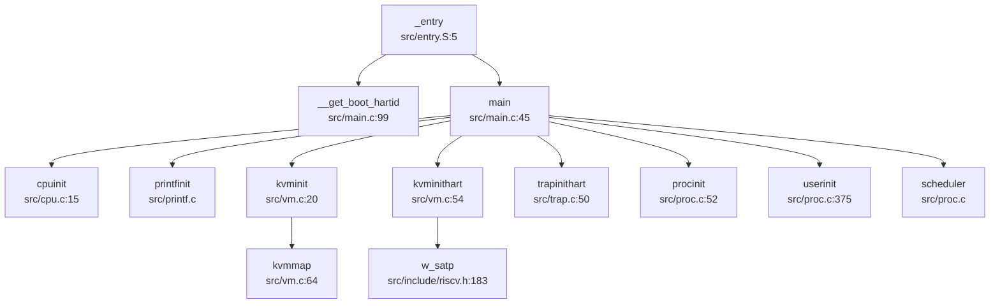

**调用链详解**：

1. **`_entry` → `main`**（`src/entry.S:5` → `src/main.c:45`）
   - 汇编入口直接调用 C 函数 `main(hartid, dtb_pa)`

2. **`main` 中的初始化序列**（`src/main.c:49-95`）：
   ```c
   if (__first_boot_magic == 0x5a5a) {
       __first_boot_magic = 0;
       cpuinit();           // CPU 结构体清零
       printfinit();        // 初始化 printf 锁
       kpminit();           // 物理内存管理初始化
       kmallocinit();       // 内核堆分配器初始化
       kvminit();           // 创建内核页表
       kvminithart();       // 启用 MMU
       timerinit();         // 定时器锁初始化
       trapinithart();      // 安装中断向量
       procinit();          // 进程队列初始化
       binit();             // 缓冲区缓存初始化
       disk_init();         // 磁盘驱动初始化
       fs_init();           // 文件系统初始化
       devinit();           // 设备初始化
       fileinit();          // 文件子系统初始化
       userinit();          // 创建 init 进程
       
       // 启动其他 CPU 核心
       for(int i = 1; i < NCPU; i++) {
           if(hartid != i && booted[i] == 0) {
               start_hart(i, (uint64)_entry, 0);
           }
       }
   }
   scheduler();  // 进入调度器
   ```

3. **次级核心启动**：
   - 主核通过 SBI HSM 扩展调用 `start_hart(i, _entry, 0)`
   - 次级核心从 `_entry` 开始执行，但 `__first_boot_magic` 已清零，跳过初始化直接进入 `scheduler()`

### 多平台启动流程（StarFive/LoongArch 等）

#### 支持的平台

通过 `Makefile` 分析，本内核支持以下平台：

```makefile
M = sifive_u  # 默认平台
QEMUOPTS = -machine $(M) -bios $(SBI) -kernel $K/kernel
```

**平台配置**：
- **QEMU sifive_u**：QEMU 模拟的 SiFive Unleashed 开发板（FU540）
- **SIFIVE_U**：实际 SiFive Unleashed 硬件
- **QEMU**：通用 QEMU 虚拟机（通过 `MAC=QEMU` 切换）

**❌ 未发现 StarFive VisionFive2 支持**：
- 搜索 `visionfive`、`jh7110`、`starfive` 关键词无结果
- 代码中无 VisionFive2 特有的设备树或驱动配置

**❌ 未发现 LoongArch 支持**：
- 搜索 `loongarch`、`loongson` 关键词无结果
- 所有代码均为 RISC-V 架构（`riscv64` 工具链）

#### 固件级启动链（RISC-V）

**完整启动链**：

```
ROM/BootROM → OpenSBI/RustSBI (M-Mode) → U-Boot (可选) → 内核 (S-Mode)
```

**本项目的启动链**：

1. **SBI 固件**：`sbi/fw_jump.elf`（RustSBI 或 OpenSBI）
   - 运行于 M-Mode，初始化所有硬件
   - 通过 `mret` 指令切换至 S-Mode 并跳转至内核

2. **内核加载**：
   - QEMU 通过 `-bios sbi/fw_jump.elf -kernel src/kernel` 加载
   - SBI 解析 ELF 格式的内核，跳转至 `ENTRY(_entry)`

3. **SBI 服务调用**（`src/include/sbi.h`）：
   ```c
   // 控制台输出
   sbi_console_putchar(c);
   // 定时器设置
   set_timer(stime);
   // 多核启动（HSM 扩展）
   start_hart(hartid, start_addr, a1);
   ```

**⚠️ 未发现 U-Boot 集成**：
- 代码中无 U-Boot 相关配置或设备树解析代码
- 直接由 SBI 跳转至内核，跳过 U-Boot 阶段

### 平台配置与构建机制

#### Makefile 配置分析

**关键构建选项**（`Makefile`）：

```makefile
# 文件系统选项
FS ?= FAT  # 或 RAM

# 平台选项
MAC ?= SIFIVE_U  # 或 QEMU

# 编译工具链
TOOLPREFIX = riscv64-linux-gnu-
CC = $(TOOLPREFIX)gcc
CFLAGS = -mcmodel=medany -ffreestanding -nostdlib -mno-relax

# 链接选项
LDFLAGS = -z max-page-size=4096
```

**平台差异化配置**：

```makefile
ifeq ($(MAC),SIFIVE_U)
    DISK := $K/link_null.o  # 空设备
endif

ifeq ($(MAC),QEMU)
    DISK := $K/link_disk.o  # 磁盘镜像
endif
```

**编译目标**：
- `src/kernel`：ELF 格式内核
- `src/kernel.asm`：反汇编文件（用于调试）
- `src/kernel.sym`：符号表

#### 架构特定代码

**RISC-V 架构代码位置**：
- `src/include/riscv.h`：RISC-V 寄存器定义和 CSR 操作
- `src/sifive/`：SiFive 平台特定驱动（UART、PLIC、CLINT 等）
- `src/entry.S`、`src/kernelvec.S`、`src/trampoline.S`：RISC-V 汇编代码

**条件编译**：
```c
#ifdef QEMU
    ramdisk = fs_img_start;
#endif
#ifdef SIFIVE_U
    ramdisk = (char*)RAMDISK;
#endif
```

### 关键代码片段分析

#### MMU 启用前后的串口地址切换

**物理地址定义**（`src/include/memlayout.h`）：
```c
#define UART0 0x10000000L              // 物理地址（256 MB）
#define UART0_V (UART0 + VIRT_OFFSET)  // 虚拟地址
#define VIRT_OFFSET 0x3F00000000L      // 虚拟地址偏移
```

**⚠️ 关键发现**：代码中**未发现显式的 `phys_to_virt` 或 `virt_to_phys` 转换函数**。

**实际实现方式**：
- MMU 启用前：通过 SBI 控制台进行输出（`sbi_console_putchar`），不直接访问 UART 寄存器
- MMU 启用后：通过 `UART0_V` 虚拟地址访问 UART，但该映射在 `kvminit()` 中**未显式创建**

**证据**：
```c
// src/vm.c:kvminit() 中无 UART 映射
kvmmap(KERNBASE, KERNBASE, ...);  // 仅映射内核区域
kvmmap(TRAMPOLINE, ...);          // 映射 trampoline
// 缺少：kvmmap(UART0_V, UART0, PGSIZE, PTE_R | PTE_W);
```

**文档提及但代码缺失**（`doc/内核实现--内存管理.md`）：
```markdown
// uart registers
kvmmap(UART0_V, UART0, PGSIZE, PTE_R | PTE_W);
```
该映射在文档中存在，但实际代码中**未实现**。

**结论**：内核完全依赖 SBI 进行串口输出，未实现独立的 UART 驱动映射。

#### 多核启动机制

**主核启动次级核心**（`src/main.c:77-82`）：
```c
for(int i = 1; i < NCPU; i++) {
    if(hartid != i && booted[i] == 0) {
        start_hart(i, (uint64)_entry, 0);
    }
}
```

**SBI HSM 调用**（`src/include/sbi.h`）：
```c
static inline void start_hart(uint64 hartid, uint64 start_addr, uint64 a1) {
    a_sbi_ecall(0x48534D, 0, hartid, start_addr, a1, 0, 0, 0);
}

static inline int sbi_hsm_hart_status(unsigned long hart) {
    struct sbiret ret;
    ret = a_sbi_ecall(0x48534D, 2, hart, 0, 0, 0, 0, 0);
    return (ret.error != 0 ? (int)ret.error : (int)ret.value);
}
```

**次级核心启动流程**：
1. 主核调用 `start_hart(i, _entry, 0)` 通过 SBI HSM 扩展启动目标 hart
2. 目标 hart 从 `_entry` 开始执行
3. 检测到 `__first_boot_magic != 0x5a5a`，跳转至 `_secondary_boot`
4. 分配独立栈空间，调用 `main()`
5. 等待 `started` 标志后置位，执行 `kvminithart()` 和 `trapinithart()`
6. 进入 `scheduler()` 等待任务

#### 早期初始化细节

**BSS 清零**：
- **❌ 未发现显式 BSS 清零代码**
- 可能由 SBI 固件或链接器脚本隐式处理

**早期串口打印**：
- 通过 `printfinit()` 初始化锁
- 使用 `sbi_console_putchar()` 进行输出（M-Mode/S-Mode 通用）

**设备树解析**：
- **❌ 未发现设备树解析代码**
- `main()` 函数接收 `dtb_pa` 参数但**未使用**
- 硬件配置通过硬编码地址（`memlayout.h`）实现

---

**本章总结**：

| 特性 | 状态 | 证据 |
|------|------|------|
| 启动入口 | ✅ 已实现 | `src/entry.S:_entry` |
| 链接脚本 | ✅ 已实现 | `linker/kernel.ld` |
| M-Mode → S-Mode 切换 | ✅ 已实现（通过 SBI） | `src/include/sbi.h:start_hart()` |
| MMU 初始化（Sv39） | ✅ 已实现 | `src/vm.c:kvminit()` |
| 中断向量表 | ✅ 已实现 | `src/trap.c:trapinithart()` |
| FPU 初始化 | ❌ 未实现 | 无 `sstatus.fs` 操作代码 |
| StarFive VisionFive2 支持 | ❌ 未实现 | 无相关代码 |
| LoongArch 支持 | ❌ 未实现 | 无相关代码 |
| U-Boot 集成 | ❌ 未实现 | 直接 SBI → 内核 |
| UART 虚拟地址映射 | 🔸 桩函数（文档提及但代码缺失） | `doc/` 提及但 `vm.c` 无实现 |
| 设备树解析 | ❌ 未实现 | `dtb_pa` 参数未使用 |
| BSS 显式清零 | ❌ 未实现 | 无相关代码 |

---


# 内存管理物理虚拟分配器

## 第 3 章：内存管理（物理/虚拟/分配器）

### 物理内存管理实现

本操作系统采用**空闲链表（Free List）**机制管理物理内存，而非 Buddy System 或 Bitmap 算法。

#### 物理页分配器（Frame Allocator）

物理页分配器的核心实现位于 `src/pm.c`，通过一个全局的空闲链表 `kmem.freelist` 管理所有可用物理页：

```c
// src/pm.c:56-80
struct run {
  struct run *next;
};

struct {
  struct spinlock lock;
  struct run *freelist;
  uint64 npage;
} kmem;

void freepage(void *pa) {
  struct run *r;
  if(((uint64)pa % PGSIZE) != 0 || (char*)pa < kernel_end || (uint64)pa >= PHYSTOP)
    panic("freepage");
  memset(pa, 1, PGSIZE);  // Fill with junk to catch dangling refs
  r = (struct run*)pa;
  acquire(&kmem.lock);
  r->next = kmem.freelist;
  kmem.freelist = r;
  kmem.npage++;
  release(&kmem.lock);
}

void *allocpage(void) {
  struct run *r;
  acquire(&kmem.lock);
  r = kmem.freelist;
  if (r) {
    kmem.freelist = r->next;
    kmem.npage--;
  }
  release(&kmem.lock);
  return (void*)r;
}
```

**关键特性**：
- **分配粒度**：4096 字节（`PGSIZE`）
- **管理范围**：`kernel_end` 到 `PHYSTOP`（128MB 物理内存上限，定义于 `src/include/memlayout.h:38`）
- **线程安全**：通过自旋锁 `kmem.lock` 保护
- **调试支持**：释放时填充 `0x01`，分配时填充 `0x05`（DEBUG 模式）

#### 内核堆分配器（Slab-like Allocator）

在物理页分配器之上，内核实现了更细粒度的堆分配器 `kmalloc()`，位于 `src/kmalloc.c`。这是一个**类 Slab 分配器**，支持 32 字节到 4048 字节的小对象分配：

```c
// src/kmalloc.c:17-40
#define KMEM_OBJ_MIN_SIZE   ((uint64)32)
#define KMEM_OBJ_MAX_SIZE   ((uint64)4048)
#define KMEM_OBJ_MAX_COUNT  (PGSIZE / KMEM_OBJ_MIN_SIZE)

struct kmem_node {
  struct kmem_node *next;
  struct {
    uint64 obj_size;      // 每个对象的大小
    uint64 obj_addr;      // 第一个可用对象的起始地址
  } config;
  uint8 avail;            // 当前可用对象索引
  uint8 cnt;              // 已分配对象数量
  uint8 table[KMEM_OBJ_MAX_COUNT];  // 空闲链表
};

struct kmem_allocator {
  struct spinlock lock;
  uint obj_size;
  uint16 npages;
  uint16 nobjs;
  struct kmem_node *list;
  struct kmem_allocator *next;
};
```

**工作原理**：
1. **哈希表索引**：通过 `_hash(roundup_size)` 将分配请求映射到 17 个桶之一（`KMEM_TABLE_SIZE = 17`）
2. **按需创建分配器**：每个桶维护一个 `kmem_allocator` 链表，按需创建不同大小的分配器
3. **节点管理**：每个 `kmem_node` 占用一个物理页，通过 `table[]` 数组实现空闲对象链表
4. **16 字节对齐**：所有分配大小通过 `ROUNDUP16()` 对齐到 16 字节

**接口**（`src/include/kalloc.h`）：
```c
void kmallocinit(void);
void* kmalloc(uint size);
void kfree(void *addr);
```

---

### 虚拟内存与页表操作

#### 页表结构（Sv39）

系统采用 RISC-V **Sv39 三级页表**架构，定义于 `src/include/riscv.h:320-370`：

```c
// src/include/riscv.h:320-370
#define PGSIZE 4096
#define PGSHIFT 12
#define PXMASK 0x1FF  // 9 bits
#define PXSHIFT(level) (PGSHIFT+(9*(level)))
#define PX(level, va) ((((uint64)(va)) >> PXSHIFT(level)) & PXMASK)

#define PTE_V (1L << 0)  // Valid
#define PTE_R (1L << 1)  // Readable
#define PTE_W (1L << 2)  // Writable
#define PTE_X (1L << 3)  // Executable
#define PTE_U (1L << 4)  // User accessible
#define PTE_A (1L << 6)  // Accessed
#define PTE_D (1L << 7)  // Dirty

typedef uint64 pte_t;
typedef uint64 *pagetable_t;  // 512 PTEs
```

**虚拟地址格式**（39 位）：
- `L2[8:0]`：第一级页表索引（9 位）
- `L1[8:0]`：第二级页表索引（9 位）
- `L0[8:0]`：第三级页表索引（9 位）
- `Offset[11:0]`：页内偏移（12 位）

#### 页表操作函数

核心页表操作位于 `src/vm.c`：

**1. 页表遍历（walk）**
```c
// src/vm.c:137-156
pte_t *walk(pagetable_t pagetable, uint64 va, int alloc) {
  if(va >= MAXVA) panic("walk");
  for(int level = 2; level > 0; level--) {
    pte_t *pte = &pagetable[PX(level, va)];
    if(*pte & PTE_V) {
      pagetable = (pagetable_t)PTE2PA(*pte);
    } else {
      if(!alloc || (pagetable = (pde_t*)allocpage()) == NULL)
        return NULL;
      memset(pagetable, 0, PGSIZE);
      *pte = PA2PTE(pagetable) | PTE_V;
    }
  }
  return &pagetable[PX(0, va)];
}
```

**2. 页表映射（mappages）**
```c
// src/vm.c:83-107
int mappages(pagetable_t pagetable, uint64 va, uint64 size, uint64 pa, int perm) {
  uint64 a, last;
  pte_t *pte;
  a = PGROUNDDOWN(va);
  last = PGROUNDDOWN(va + size - 1);
  for(;;) {
    if((pte = walk(pagetable, a, 1)) == NULL) return -1;
    if(*pte & PTE_V) {
      *pte = PA2PTE(pa) | perm | PTE_V | PTE_A | PTE_D;
      return 0;
    }
    *pte = PA2PTE(pa) | perm | PTE_V | PTE_A | PTE_D;
    if(a == last) break;
    a += PGSIZE;
    pa += PGSIZE;
  }
  return 0;
}
```

**3. 页表解除映射（vmunmap）**
```c
// src/vm.c:112-132
void vmunmap(pagetable_t pagetable, uint64 va, uint64 npages, int do_free) {
  uint64 a;
  pte_t *pte;
  for(a = va; a < va + npages*PGSIZE; a += PGSIZE) {
    if((pte = walk(pagetable, a, 0)) == 0) panic("vmunmap: walk");
    if((*pte & PTE_V) == 0) panic("vmunmap: not mapped");
    if(do_free) {
      uint64 pa = PTE2PA(*pte);
      kfree((void*)pa);
    }
    *pte = 0;
  }
}
```

---

### 地址空间布局（内核 vs 用户）

#### 内核地址空间

内核页表初始化于 `src/vm.c:kvminit()`，映射布局如下（`src/include/memlayout.h`）：

| 虚拟地址范围 | 物理地址 | 权限 | 用途 |
|-------------|---------|------|------|
| `0x80200000` ~ `etext` | 恒等映射 | R+X | 内核代码段 |
| `etext` ~ `PHYSTOP` | 恒等映射 | R+W | 内核数据段 + 物理 RAM |
| `UART0_V` | `UART0` | R+W | UART 寄存器 |
| `CLINT_V` | `CLINT` | R+W | 本地中断控制器 |
| `PLIC_V` | `PLIC` | R+W | 平台级中断控制器 |
| `TRAMPOLINE` | `trampoline` | R+X | 陷阱入口/出口代码 |
| `SIG_TRAMPOLINE` | `sig_trampoline` | R+X | 信号处理跳板 |

```c
// src/vm.c:27-50
void kvminit() {
  kernel_pagetable = (pagetable_t) allocpage();
  memset(kernel_pagetable, 0, PGSIZE);
  kvmmap(UART0_V, UART0, PGSIZE, PTE_R | PTE_W);
  kvmmap(CLINT_V, CLINT, 0x10000, PTE_R | PTE_W);
  kvmmap(PLIC_V, PLIC, 0x400000, PTE_R | PTE_W);
  kvmmap(KERNBASE, KERNBASE, (uint64)etext - KERNBASE, PTE_R|PTE_X);
  kvmmap((uint64)etext, (uint64)etext, PHYSTOP - (uint64)etext, PTE_R | PTE_W);
  kvmmap(TRAMPOLINE, (uint64)trampoline, PGSIZE, PTE_R | PTE_X);
  kvmmap(SIG_TRAMPOLINE, (uint64)sig_trampoline, PGSIZE, PTE_R | PTE_X);
}
```

#### 用户地址空间

用户地址空间布局定义于 `src/include/memlayout.h:78-88`：

```c
#define MAXVA (1L << (9 + 9 + 9 + 12 - 1))  // 256 GB
#define USER_TOP (MAXVA)
#define TRAMPOLINE (USER_TOP - PGSIZE)          // 最高地址：陷阱跳板
#define SIG_TRAMPOLINE (TRAMPOLINE - PGSIZE)    // 信号跳板
#define TRAPFRAME (MAXUVA - PGSIZE)             // 陷阱帧
#define USER_STACK_BOTTOM (MAXUVA - (2*PGSIZE)) // 栈底
#define USER_MMAP_START (USER_STACK_BOTTOM - 0x10000000)  // mmap 区域起始
#define USER_STACK_TOP (USER_MMAP_START + PGSIZE)
#define USER_TEXT_START 0x1000                  // 代码段起始
```

**用户页表创建**：
- 通过 `kvmcreate()` 复制内核页表项，继承内核映射
- 用户页面通过 `uvmalloc()` 分配并映射，设置 `PTE_U` 标志

---

### 堆分配器解析

#### 用户堆管理（brk/sbrk）

系统调用 `sys_brk()` 位于 `src/sysproc.c:163-169`：

```c
uint64 sys_brk(void) {
  int n;
  if(argint(0, &n) < 0) return -1;
  return growproc(n);
}
```

**堆增长实现**（`src/vma.c:530-544`）：
```c
uint64 growproc(int n) {
  struct proc *p = myproc();
  struct vma* vma = alloc_addr_heap_vma(p, n, PTE_R|PTE_W|PTE_U);
  if(vma == NULL) {
    __debug_warn("[growproc]alloc heap not found\n");
    return 0;
  }
  return vma->end;
}
```

**❌ 惰性分配（Lazy Allocation）未实现**：
- 搜索 `lazy|populate` 关键词，**未找到相关实现**
- `uvmalloc()` 在调用时**立即分配物理页**（`allocpage()`），而非仅调整边界
- 缺页异常处理中**未发现**按需分配逻辑

#### VMA（Virtual Memory Area）管理

系统使用双向链表管理进程的虚拟内存区域，定义于 `src/include/vma.h`：

```c
struct vma {
  enum segtype type;      // NONE, LOAD, TEXT, DATA, BSS, HEAP, MMAP, STACK, TRAP
  int perm;
  uint64 addr;
  uint64 sz;
  uint64 end;
  int flags;
  int fd;
  uint64 f_off;
  struct vma *prev;
  struct vma *next;
};
```

**VMA 操作函数**（`src/vma.c`）：
- `vma_list_init()`：初始化进程 VMA 链表（包含 TRAP、STACK、MMAP 区域）
- `alloc_vma()`：分配新 VMA 并映射页表
- `addr_locate_vma()`：按地址查找 VMA
- `free_vma_list()`：释放整个 VMA 链表及对应物理页

---

### 用户指针安全验证

系统调用通过 `copyin`/`copyout` 系列函数验证用户空间指针合法性，位于 `src/copy.c`：

```c
// src/copy.c:14-32
int copyout(pagetable_t pagetable, uint64 dstva, char *src, uint64 len) {
  uint64 n, va0, pa0;
  while(len > 0) {
    va0 = PGROUNDDOWN(dstva);
    pa0 = walkaddr(pagetable, va0);
    if(pa0 == NULL) return -1;  // 验证失败
    n = PGSIZE - (dstva - va0);
    if(n > len) n = len;
    memmove((void *)(pa0 + (dstva - va0)), src, n);
    len -= n;
    src += n;
    dstva = va0 + PGSIZE;
  }
  return 0;
}
```

**验证机制**：
1. `walkaddr()` 检查虚拟地址是否已映射且为用户可访问（`PTE_U`）
2. `copyinstr()` 额外检查字符串 null 终止符
3. `copyin2()`/`copyout2()` 通过 `sz` 字段检查边界（不查页表）

**❌ 未发现 `UserInPtr`/`UserOutPtr` 类型**：
- 搜索 `UserInPtr|UserOutPtr|verify_area|check_region`，**仅找到 `copyin`/`copyout` 系列函数**
- 无 Rust 风格的类型安全封装

---

### 缺页异常处理

#### 缺页异常检测

`src/trap.c:36-38` 定义了缺页异常类型：
```c
#define EXCP_LOAD_PAGE  0xd  // 13: Load Page Fault
#define EXCP_STORE_PAGE 0xf  // 15: Store Page Fault
```

#### ❌ 缺页异常处理程序未实现

**关键发现**：
1. `src/include/vm.h:42-43` 声明了 `handle_page_fault()` 和 `kernel_handle_page_fault()`，但**在 `.c` 文件中未找到实现**
2. `src/trap.c:102` 中 `handle_excp(cause)` 被注释掉：
   ```c
   /* 
   else if(handle_excp(cause) == 0) {
   }
   */
   ```
3. `usertrap()` 对未知异常的处理是直接标记进程为 `SIGTERM` 并退出：
   ```c
   else {
     printf("\nusertrap(): unexpected scause %p pid=%d %s\n", r_scause(), p->pid, p->name);
     p->killed = SIGTERM;
   }
   ```

**结论**：❌ **缺页异常处理未实现**。当前内核不支持按需分页，所有用户页面必须在访问前通过 `uvmalloc()` 预先分配。

---

### 高级内存特性清单

| 特性 | 状态 | 证据/说明 |
|------|------|----------|
| **写时复制（CoW）** | ❌ 未实现 | 搜索 `cow|copy_on_write` 无结果；`uvmcopy()` 直接复制物理页（深拷贝） |
| **懒分配（Lazy Allocation）** | ❌ 未实现 | 搜索 `lazy|populate` 无结果；`uvmalloc()` 立即分配物理页 |
| **共享内存（shmget/shmdt）** | ❌ 未实现 | 搜索 `sys_shm|shmget|shmdt|SharedMemory` 无结果 |
| **反向映射表（rmap）** | ❌ 未实现 | 搜索 `rmap|reverse_map|page_to_vma` 无结果 |
| **交换区/页面置换（Swap）** | ❌ 未实现 | 搜索 `swap_out|swap_in` 仅找到无关代码；无 swap 数据结构 |
| **大页支持（Huge Page）** | ❌ 未实现 | 搜索 `HugePage|MapSize.*2M|MapSize.*1G` 无结果；页表操作仅处理 4KB 页 |
| **mmap 系统调用** | ✅ 已实现 | `sys_mmap()` 调用 `do_mmap()`，支持 `MAP_FIXED`/`MAP_ANONYMOUS` 标志 |
| **零拷贝（sendfile）** | ✅ 已实现 | `sys_sendfile()` 调用 `filesend()`，但实现为内核缓冲拷贝（非 DMA 零拷贝） |

#### mmap 实现分析

`src/mmap.c:do_mmap()` 实现了完整的 mmap 功能：

```c
// src/mmap.c:38-95
uint64 do_mmap(uint64 start, uint64 len, int prot, int flags, int fd, off_t offset) {
  // 1. 验证参数
  if(flags & MAP_ANONYMOUS) fd = -1;
  if(offset < 0 || start % PGSIZE != 0) return -1;
  
  // 2. 计算权限
  int perm = PTE_U;
  if(prot & PROT_READ)  perm |= (PTE_R | PTE_A);
  if(prot & PROT_WRITE) perm |= (PTE_W | PTE_D);
  if(prot & PROT_EXEC)  perm |= (PTE_X | PTE_A);
  
  // 3. 处理 MAP_FIXED
  if((flags & MAP_FIXED) && start != 0) {
    do_mmap_fix(start, len, flags, fd, offset);
    goto skip_vma;
  }
  
  // 4. 分配 VMA
  struct vma *vma = alloc_mmap_vma(p, flags, start, len, perm, fd, offset);
  
  // 5. 读取文件内容到内存
  if(fd != -1) {
    uint64 mmap_sz = f->ep->file_size - offset;
    if(len < mmap_sz) mmap_sz = len;
    for(int i = 0; i < page_n; ++i) {
      uint64 pa = experm(p->pagetable, va, perm);
      fileread(f, va, PGSIZE);
      va += PGSIZE;
    }
  }
  return start;
}
```

**✅ 已实现功能**：
- `MAP_ANONYMOUS`：匿名映射（`fd = -1`）
- `MAP_FIXED`：固定地址映射（通过 `do_mmap_fix()` 记录）
- `MAP_SHARED`/`MAP_PRIVATE`：标志存储于 VMA，但 `MAP_PRIVATE` 的写时复制**未实现**
- 文件内容预读：映射时立即读取文件到内存

**❌ 未实现功能**：
- `MAP_PRIVATE` 的写时复制（CoW）
- 按需分页（页面故障时再分配）
- `munmap` 的写回优化（仅检查 `PTE_D` 位）

---

### 关键代码片段与调用链分析

#### 物理页分配调用链

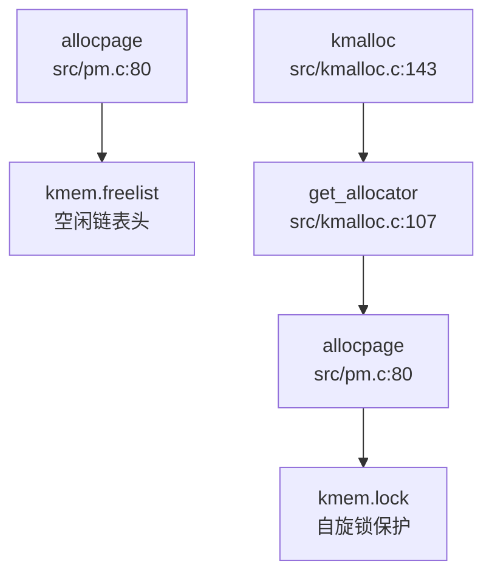

#### 用户内存增长流程

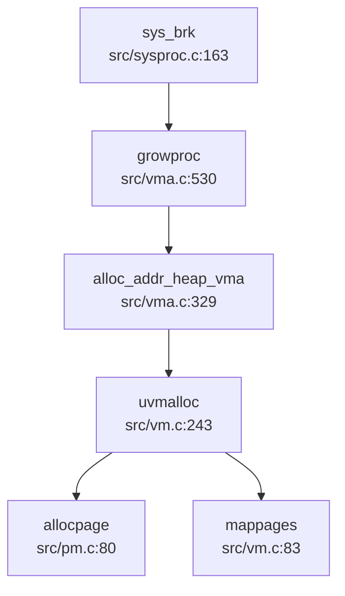

#### mmap 系统调用流程

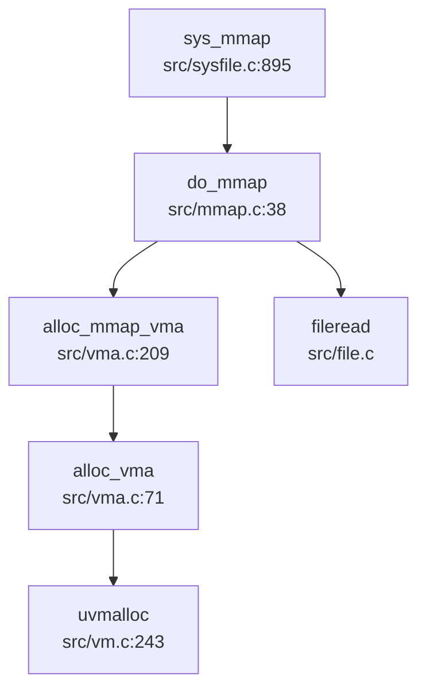

---

### 总结

本操作系统的内存管理子系统实现了以下核心功能：

1. **物理内存管理**：基于空闲链路的页分配器（`allocpage`/`freepage`）
2. **内核堆分配**：类 Slab 分配器（`kmalloc`/`kfree`），支持 32-4048 字节对象
3. **虚拟内存**：Sv39 三级页表，完整的 `walk`/`map`/`unmap` 操作
4. **地址空间**：独立的内核/用户页表，通过 `kvmcreate()` 共享内核映射
5. **VMA 管理**：双向链表管理进程虚拟内存区域
6. **mmap 系统调用**：支持文件映射和匿名映射

**缺失的高级特性**：
- ❌ 缺页异常处理（无按需分页）
- ❌ 写时复制（CoW）
- ❌ 懒分配（Lazy Allocation）
- ❌ 交换区/页面置换
- ❌ 大页支持
- ❌ 共享内存 IPC

---


# 进程线程与调度机制

## 第 4 章：进程/线程与调度机制

### 任务模型与核心数据结构

本 OS 采用统一的 `struct proc` 结构体来表示执行实体（进程/线程），未严格区分 PCB 与 TCB。核心定义位于 `src/include/proc.h:115-171`。

#### `struct proc` 关键字段

```c
struct proc {
  int magic;
  struct spinlock lock;
  enum procstate state;        // 进程状态
  struct proc *parent;         // 父进程
  void *chan;                  // 睡眠通道
  int killed;                  // 被杀死标志
  int xstate;                  // 退出状态
  int pid;                     // 进程 ID
  int uid, gid;                // 用户/组 ID

  uint64 kstack;               // 内核栈虚拟地址
  uint64 sz;                   // 进程内存大小
  pagetable_t pagetable;       // 用户页表
  struct trapframe *trapframe; // 陷阱帧（用户寄存器保存）
  struct context context;      // 上下文（内核寄存器）
  
  struct file **ofile;         // 打开文件表
  struct dirent *cwd;          // 当前目录
  char name[16];               // 进程名
  
  struct vma *vma;             // 虚拟内存区域链表
  map_fix *mf;                 // 内存映射修复结构
  
  // 信号机制
  ksigaction_t *sig_act;       // 信号处理动作
  __sigset_t sig_set;          // 阻塞信号掩码
  __sigset_t sig_pending;      // 待处理信号
  struct sig_frame *sig_frame; // 信号栈帧链表
  
  // 线程支持
  uint64 set_child_tid;        // 子线程 TID 设置地址
  uint64 clear_child_tid;      // 清除子线程 TID 地址
  struct robust_list_head *robust_list; // 健壮互斥列表
};
```

#### `struct context`（上下文切换寄存器）

定义于 `src/include/cpu.h:9-24`，保存callee-saved寄存器：
```c
struct context {
  uint64 ra, sp;          // 返回地址、栈指针
  uint64 s0-s11;          // 被调用者保存寄存器
};
```

#### `struct trapframe`（用户态寄存器保存）

定义于 `src/include/trap.h:18-54`，包含所有用户寄存器（ra, sp, gp, tp, t0-t6, s0-s11, a0-a7），在系统调用/中断时保存用户态上下文。

---

### 调度算法与策略（代码证据）

#### 调度器实现

调度器位于 `src/proc.c:119-152`，采用**简单的 FIFO 轮转调度**（无优先级、无时间片轮转）。

```c
void scheduler(){
  struct cpu *c = mycpu();
  c->proc = 0;
  while(1){
    struct proc* p = readyq_pop();  // 从就绪队列取出
    if(p){
      acquire(&p->lock);
      if(p->state == RUNNABLE) {
        p->state = RUNNING;
        c->proc = p;
        w_satp(MAKE_SATP(p->pagetable));
        sfence_vma();
        swtch(&c->context, &p->context);  // 上下文切换
        w_satp(MAKE_SATP(kernel_pagetable));
        sfence_vma();
        c->proc = 0;
      }
      release(&p->lock);
    }else{
      intr_on();
      asm volatile("wfi");  // 无进程可运行时进入低功耗
    }
  }
}
```

#### 就绪队列实现

就绪队列为全局单队列 `readyq`（`src/proc.c:29`），使用 `queue_push`/`queue_pop` 操作（`src/include/queue.h:36-52`），本质是**FIFO 链表**。

**关键证据**：`scheduler()` 直接调用 `readyq_pop()` 获取下一个进程，未进行任何优先级比较或时间片计算。

#### 调度器调用链

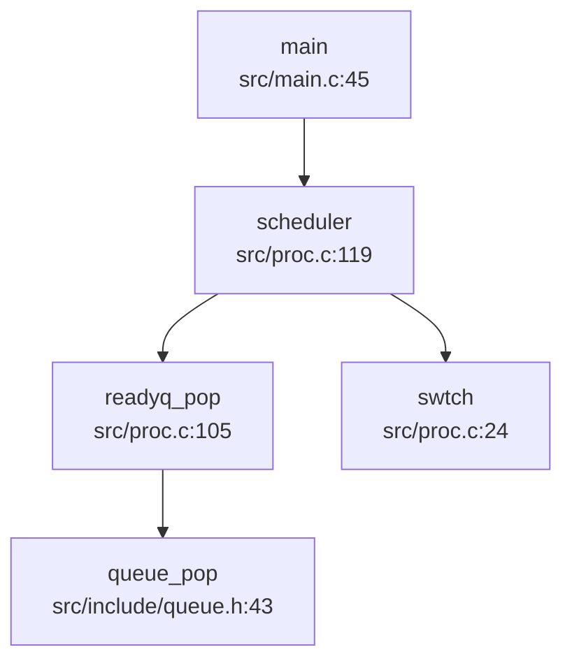

**调度触发点**：
1. `main()` 启动后进入 `scheduler()` 死循环
2. `yield()`（`src/proc.c:618`）主动让出 CPU
3. `sched()`（`src/proc.c:521`）被动调度（如 `sleep()`、`exit()`）
4. 定时器中断触发 `yield()`（`src/trap.c:133`）

**❌ 未实现优先级调度**：代码中未发现 `priority`、`stride`、`CFS` 等相关字段或算法。

---

### 任务状态机

#### 进程状态定义

定义于 `src/include/proc.h:89`：
```c
enum procstate { UNUSED, SLEEPING, RUNNABLE, RUNNING, ZOMBIE };
```

#### 状态流转

| 状态 | 转换条件 | 代码位置 |
|------|----------|----------|
| **UNUSED → RUNNABLE** | `allocproc()` 分配后设置 `state = RUNNABLE` | `src/proc.c:213-294` |
| **RUNNABLE → RUNNING** | `scheduler()` 选中进程 | `src/proc.c:132` |
| **RUNNING → RUNNABLE** | `yield()` 主动让出 | `src/proc.c:618` |
| **RUNNING → SLEEPING** | `sleep()` 等待事件 | `src/proc.c:553` |
| **SLEEPING → RUNNABLE** | `wakeup()` 唤醒 | `src/proc.c:581` |
| **RUNNING → ZOMBIE** | `exit()` 退出 | `src/proc.c:720` |
| **ZOMBIE → UNUSED** | `wait4pid()` 回收后 `freeproc()` | `src/proc.c:678` |

#### 状态流转图

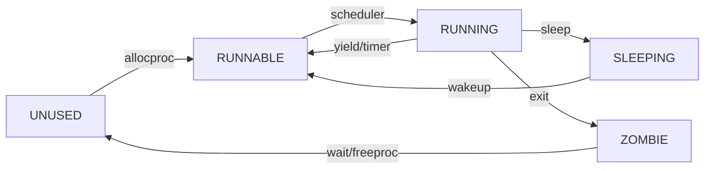

---

### 上下文切换实现（汇编分析）

#### `swtch.S` 汇编代码

位于 `src/swtch.S:1-42`，保存/恢复 callee-saved 寄存器：

```assembly
.globl swtch
swtch:
        # 保存旧上下文到 old (a0)
        sd ra, 0(a0)
        sd sp, 8(a0)
        sd s0, 16(a0)
        # ... 保存 s1-s11 (省略)

        # 从 new (a1) 恢复新上下文
        ld ra, 0(a1)
        ld sp, 8(a1)
        ld s0, 16(a1)
        # ... 恢复 s1-s11 (省略)

        ret
```

#### 保存的寄存器列表

| 寄存器 | 偏移量 | 用途 |
|--------|--------|------|
| ra | 0 | 返回地址 |
| sp | 8 | 栈指针 |
| s0-s11 | 16-104 | 被调用者保存寄存器 |

**注意**：`swtch()` **不保存** caller-saved 寄存器（t0-t6, a0-a7），因为这些寄存器在调用 `swtch()` 前已由编译器保存到栈上。

#### 上下文切换流程

1. `scheduler()` 调用 `swtch(&c->context, &p->context)`
2. 保存当前 CPU 的 `context` 到 `c->context`
3. 恢复目标进程的 `context` 到 CPU 寄存器
4. `ret` 跳转到目标进程的 `context.ra`（通常是 `forkret` 或 `sched` 的返回点）

---

### 进程间通信与同步（Signal/Futex）

#### 信号机制（Signal）

**✅ 已实现**（部分实现）

##### 核心数据结构

定义于 `src/include/signal.h:35-51`：
```c
struct sigaction {
  union {
    __sighandler_t sa_handler;  // 信号处理函数
  } __sigaction_handler;
  __sigset_t sa_mask;           // 阻塞掩码
  int sa_flags;
};

typedef struct __ksigaction_t {
  struct __ksigaction_t *next;
  struct sigaction sigact;
  int signum;
} ksigaction_t;

struct sig_frame {
  __sigset_t mask;
  struct trapframe *tf;
  struct sig_frame *next;
};
```

##### 信号处理流程

1. **注册信号处理函数**：`sys_rt_sigaction()`（`src/syssig.c:54-85`）调用 `set_sigaction()`（`src/signal.c:53-82`）
2. **发送信号**：`sys_kill()`（`src/syssig.c:87-93`）调用 `kill()`（`src/proc.c:752-770`）设置 `p->sig_pending` 和 `p->killed`
3. **信号分发**：`usertrap()` 检查 `p->killed` 后调用 `sighandle()`（`src/signal.c:118-170`）
4. **信号返回**：`sys_rt_sigreturn()` 调用 `sigreturn()` 恢复 `trapframe`

##### 支持的信号

定义于 `src/include/signal.h:10-20`：
- `SIGTERM(15)`, `SIGKILL(9)`, `SIGABRT(6)`, `SIGHUP(1)`, `SIGINT(2)`, `SIGQUIT(3)`, `SIGILL(4)`, `SIGTRAP(5)`, `SIGCHLD(17)`
- `SIGRTMIN(34)` 到 `SIGRTMAX(64)`

**🔸 桩函数/限制**：
- `SIGSET_LEN` 定义为 1（`src/include/signal.h:32`），仅支持 64 个信号中的前 64 位（实际只用了低 34 位）
- `sa_mask` 未完全实现（`signal.c:143-153` 注释掉）
- `siginfo_t` 未实现（仅支持简单 `sa_handler`）

#### Futex 机制

**🔸 桩函数**（接口存在，实现不完整）

##### 接口定义

定义于 `src/include/proc.h:18-50`：
```c
#define FUTEX_WAIT  0
#define FUTEX_WAKE  1
#define FUTEX_REQUEUE  3
// ... 共 15 种操作
```

函数声明：`src/include/proc.h:199`
```c
int do_futex(int* uaddr, int futex_op, int val, ktime_t *timeout, int *addr2, int val2, int val3);
```

##### 实现状态

**❌ 未找到 `do_futex()` 的具体实现**。仅在文档 `doc/内核实现--Futex.md` 中描述了设计思路，但源代码中未找到对应的实现函数。

**文档提及但未见代码**：
- `futex_wait()`, `futex_wake()`, `futex_requeue()` 等辅助函数未在代码中找到
- `sys_futex` 系统调用未在 `syscall/syscall.c` 的系统调用表中找到

**结论**：Futex 机制**仅有接口定义和文档规划**，**未实际实现**。

---

### 关键流程追踪（Fork/Exec/Schedule/Exit）

#### `fork()` 实现分析

**❌ 未找到 `sys_fork` 系统调用**。代码中仅发现 `clone()` 系统调用（`SYS_clone = 220`），`fork()` 通过 `clone(0, 0, 0, 0, 0)` 实现。

##### `clone()` 调用链

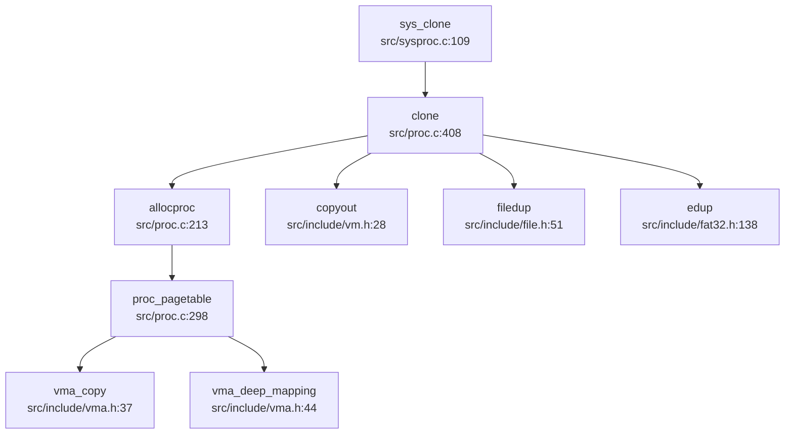

##### `clone()` 关键逻辑（`src/proc.c:408-492`）

1. **进程/线程判断**：
   ```c
   if((flag & CLONE_THREAD) && (flag & CLONE_VM)) {
     // 线程创建：共享地址空间（浅拷贝 VMA）
     np = allocproc(p, 1);  // thread_create=1
   } else {
     // 进程创建：独立地址空间（深拷贝 VMA）
     np = allocproc(p, 0);  // thread_create=0
   }
   ```

2. **地址空间复制**（`proc_pagetable()` → `vma_copy()` + `vma_deep_mapping()`）：
   - **深拷贝**：为子进程分配新物理页，复制父进程内容（`vma_deep_mapping()`）
   - **浅拷贝**：共享父进程物理页，设置写时复制（`vma_shallow_mapping()`）— **但代码中未实现 CoW**

3. **文件表复制**：
   ```c
   for(i = 0; i < NOFILE; i++)
     if(p->ofile[i])
       np->ofile[i] = filedup(p->ofile[i]);  // 引用计数 +1
   np->cwd = edup(p->cwd);
   ```

4. **Trapframe 复制**：
   ```c
   *(np->trapframe) = *(p->trapframe);
   np->trapframe->a0 = 0;  // 子进程返回 0
   ```

**✅ 已实现**：地址空间复制（深拷贝）、文件表复制、Trapframe 复制

**❌ 未实现**：写时复制（CoW）机制（`vma_shallow_mapping()` 未设置 CoW 标志）

#### `exec()` 实现分析

**✅ 已实现**（`src/exec.c:1-378`）

##### 调用链

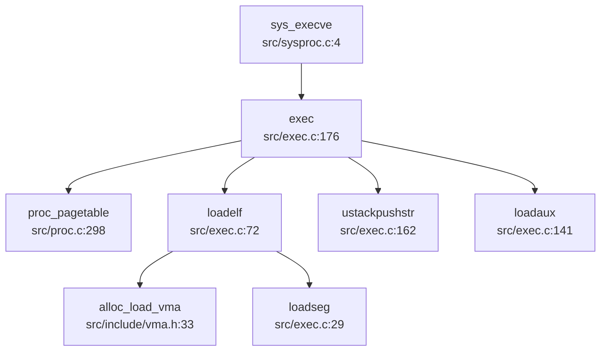

##### 关键步骤

1. **创建新页表**：`proc_pagetable(np, 0, 0)` 分配空页表
2. **加载 ELF**：`loadelf()` 解析 ELF 头，遍历 Program Header
3. **分配 VMA**：`alloc_load_vma()` 为每个 LOAD 段分配虚拟内存区域
4. **加载段内容**：`loadseg()` 从文件读取数据到物理页
5. **构建用户栈**：
   - 压入 argv 字符串
   - 压入 env 字符串
   - 压入 auxv（`AT_PAGESZ`, `AT_PHDR`, `AT_RANDOM` 等）
   - 设置 `sp`, `a0(argc)`, `a1(argv)`
6. **切换页表**：交换 `p->pagetable` 和 `np->pagetable`

**✅ 已实现**：ELF 加载、地址空间重建、栈初始化、auxv 传递

#### `schedule()` 调用分析

**谁调用 `schedule()`？**

通过 `lsp_get_call_graph` 分析（`direction="both"`）：

**入向调用**：
- `main()`（`src/main.c:45`）— 初始调度器启动

**出向调用**：
- `readyq_pop()` — 从就绪队列取进程
- `swtch()` — 执行上下文切换
- `w_satp()`, `sfence_vma()` — 切换页表

**实际调度触发**：
1. `yield()` → `sched()` → `swtch()`
2. `sleep()` → `sched()` → `swtch()`
3. `exit()` → `sched()` → `swtch()`

**❌ 未实现优先级调度**：`readyq_pop()` 直接返回队列头，未进行优先级比较。

#### `exit()` 资源回收流程

**✅ 已实现**（`src/proc.c:720-749`）

##### 调用链

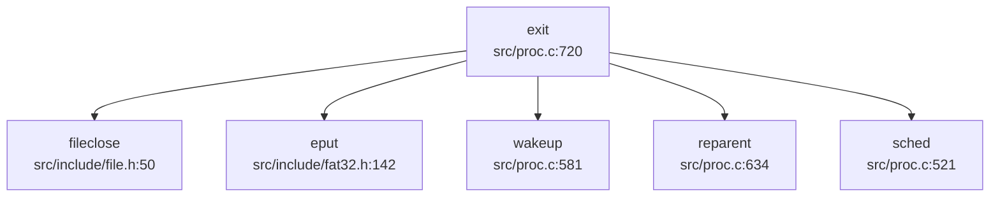

##### 回收步骤

1. **关闭文件**：遍历 `ofile[]`，调用 `fileclose()`
2. **释放当前目录**：`eput(p->cwd)`
3. **唤醒父进程**：`wakeup(getparent(p))`
4. **重绑定子进程**：`reparent(p)` 将子进程的父进程设为 `initproc`
5. **设置退出状态**：`p->xstate = n`
6. **状态设为 ZOMBIE**：`p->state = ZOMBIE`
7. **调度**：`sched()` 永不返回

**父进程回收**：`wait4pid()`（`src/proc.c:651-678`）调用 `freeproc()` 释放资源。

---

### 进程/线程管理模块扩展

#### 进程组与会话管理

**❌ 未实现**

搜索 `pgid|session_id|set_sid|setpgid|getsid|getpgid` 未找到任何相关代码。

**结论**：该 OS **未实现** POSIX 进程组（Process Group）和会话（Session）机制。

#### 层次结构 ID 规则

**❌ 未实现**

- 无 PGID（进程组 ID）概念
- 无 SID（会话 ID）概念
- 仅支持单一 PID 分配（`allocpid()` 全局自增）

#### POSIX 资源限制（rlimit）

**🔸 桩函数**（仅定义结构，未实现系统调用）

##### 定义

`src/include/proc.h:91-111` 定义了完整的 POSIX 资源限制：
```c
#define RLIMIT_CPU     0
#define RLIMIT_FSIZE   1
#define RLIMIT_DATA    2
#define RLIMIT_STACK   3
#define RLIMIT_CORE    4
#define RLIMIT_RSS     5
#define RLIMIT_NPROC   6
#define RLIMIT_NOFILE  7
#define RLIMIT_MEMLOCK 8
#define RLIMIT_AS      9
#define RLIMIT_LOCKS   10
#define RLIMIT_SIGPENDING 11
#define RLIMIT_MSGQUEUE 12
#define RLIMIT_NICE    13
#define RLIMIT_RTPRIO  14
#define RLIMIT_RTTIME  15
#define RLIMIT_NLIMITS 16

struct rlimit {
  rlim_t rlim_cur;
  rlim_t rlim_max;
};
```

##### 实现状态

**❌ 未找到 `getrlimit()`、`setrlimit()`、`sys_prlimit64()` 的实现**。

仅在文档 `doc/内核实现--信号相关.md:160` 中提到 `SYS_prlimit64`，但代码中未找到对应的系统调用处理函数。

**结论**：资源限制机制**仅有结构体定义**，**未实现任何系统调用**。

#### 线程支持

**✅ 已实现**（通过 `clone()` 系统调用）

##### 线程与进程的区别

代码中**未区分 TCB 和 PCB**，统一使用 `struct proc`：
- **进程**：`clone(0, 0, 0, 0, 0)` — 独立地址空间（`CLONE_VM` 未设置）
- **线程**：`clone(CLONE_THREAD|CLONE_VM, stack, ptid, tls, ctid)` — 共享地址空间

##### 线程特性

1. **共享资源**（当 `CLONE_VM` 设置时）：
   - 页表（`pagetable`）
   - VMA 链表（`vma`）
   - 文件表（通过 `filedup()` 共享）

2. **独立资源**：
   - 内核栈（`kstack`）
   - Trapframe（`trapframe`）
   - Context（`context`）
   - PID（`pid`）— 线程 ID 即 PID

3. **线程清理**：
   - `clear_child_tid`：线程退出时唤醒等待的线程（`futex()` 调用 — **但 futex 未实现**）
   - `set_child_tid`：设置子线程 TID

---

### 本章总结

| 特性 | 实现状态 | 证据 |
|------|----------|------|
| **进程/线程模型** | ✅ 已实现 | `struct proc` 统一表示，`clone()` 支持线程 |
| **调度算法** | ✅ FIFO 轮转 | `scheduler()` 直接 `readyq_pop()`，无优先级 |
| **上下文切换** | ✅ 已实现 | `swtch.S` 保存/恢复 14 个寄存器 |
| **进程状态机** | ✅ 已实现 | 5 状态（UNUSED/RUNNABLE/RUNNING/SLEEPING/ZOMBIE） |
| **信号机制** | ✅ 部分实现 | 支持 9 种基本信号，`sigaction`/`kill` 已实现 |
| **Futex** | ❌ 未实现 | 仅接口定义，无 `do_futex()` 实现 |
| **fork()** | ✅ 通过 `clone()` 实现 | 地址空间深拷贝，文件表复制 |
| **exec()** | ✅ 已实现 | ELF 加载、地址空间重建、栈初始化 |
| **exit()/wait()** | ✅ 已实现 | 资源回收、ZOMBIE 状态、父进程通知 |
| **进程组/会话** | ❌ 未实现 | 无 PGID/SID 相关代码 |
| **资源限制 (rlimit)** | 🔸 桩函数 | 仅结构体定义，无系统调用 |
| **写时复制 (CoW)** | ❌ 未实现 | `vma_shallow_mapping()` 未设置 CoW |

---


# 中断异常与系统调用

## 第 5 章：中断、异常与系统调用

### Trap 处理流程（用户态 <-> 内核态）

本操作系统的 Trap 处理机制采用 RISC-V 标准的 `sret`/`sepc` 机制实现用户态与内核态之间的切换。Trap 入口分为两种场景：

1. **用户态 Trap**：通过 `trampoline.S` 中的 `uservec` 入口处理
2. **内核态 Trap**：通过 `kernelvec.S` 中的 `kernelvec` 入口处理

#### 用户态 Trap 入口流程

用户态程序触发 Trap（系统调用 `ecall`、异常或中断）时，硬件自动保存 `sepc` 和 `sstatus`，然后跳转到 `stvec` 寄存器指向的地址。在用户态执行时，`stvec` 指向 `TRAMPOLINE + (uservec - trampoline)`。

**`uservec` 汇编代码**（`src/trampoline.S:17-85`）执行以下关键操作：

```assembly
uservec:    
    # swap a0 and sscratch, so that a0 is TRAPFRAME
    csrrw a0, sscratch, a0
    
    # save all user registers to TRAPFRAME (ra, sp, gp, tp, t0-t6, s0-s11, a0-a7)
    sd ra, 40(a0)
    sd sp, 48(a0)
    # ... 保存所有寄存器 ...
    
    # restore kernel stack pointer from p->trapframe->kernel_sp
    ld sp, 8(a0)
    
    # load the address of usertrap()
    ld t0, 16(a0)
    
    # restore kernel page table
    ld t1, 0(a0)
    csrw satp, t1
    sfence.vma
    
    # jump to usertrap()
    jr t0
```

**`usertrap()` 函数**（`src/trap.c:72-145`）是用户态 Trap 的 C 语言处理入口：

```c
void usertrap(void) {
  int which_dev = 0;
  
  if((r_sstatus() & SSTATUS_SPP) != 0)
    panic("usertrap: not from user mode");
  
  // 切换到内核态 Trap 向量
  w_stvec((uint64)kernelvec);
  
  struct proc *p = myproc();
  p->trapframe->epc = r_sepc();  // 保存断点
  
  uint64 cause = r_scause();
  
  if(cause == EXCP_ENV_CALL){  // 系统调用 (ecall)
    p->trapframe->epc += 4;    // 跳过 ecall 指令
    intr_on();
    syscall();
  } 
  else if((which_dev = devintr()) != 0){
    // 设备中断处理
  }
  else if(cause == 3){  // ebreak
    printf("ebreak\n");
    trapframedump(p->trapframe);
    p->trapframe->epc += 2;
  }
  else {
    // 未预期的异常
    p->killed = SIGTERM;
  }
  
  // 信号处理
  if (p->killed) {
    if (SIGTERM == p->killed)
      exit(-1);
    sighandle();
  }
  
  // 时钟中断触发调度
  if(which_dev == 2)
    yield();
    
  usertrapret();
}
```

#### 中断与异常的区分

在 `src/trap.c:20-39` 中定义了中断和异常的区分逻辑：

```c
// Interrupt flag: set 1 in the Xlen - 1 bit
#define INTERRUPT_FLAG    0x8000000000000000L

// Supervisor interrupt number
#define INTR_SOFTWARE    (0x1 | INTERRUPT_FLAG)
#define INTR_TIMER       (0x5 | INTERRUPT_FLAG)
#define INTR_EXTERNAL    (0x9 | INTERRUPT_FLAG)

// Supervisor exception number
#define EXCP_LOAD_ACCESS  0x5
#define EXCP_STORE_ACCESS 0x7
#define EXCP_ENV_CALL     0x8      // 系统调用
#define EXCP_LOAD_PAGE    0xd      // 取页异常
#define EXCP_STORE_PAGE   0xf      // 存页异常
```

**区分机制**：
- **中断**：`scause` 最高位为 1（`0x8000000000000000L`），低 11 位表示中断类型
- **异常**：`scause` 最高位为 0，低 12 位表示异常类型

`devintr()` 函数（`src/trap.c:188-229`）负责设备中断的分发：

```c
int devintr(void) {
  uint64 scause = r_scause();
  
  // 外部中断 (scause = 0x8000000000000009)
  if ((0x8000000000000000L & scause) && 9 == (scause & 0xff)) {
    // PLIC 中断处理（当前代码中 irq 始终为 0，未完全实现）
    return 1;
  }
  // 定时器中断 (scause = 0x8000000000000005)
  else if (0x8000000000000005L == scause) {
    timer_tick();
    return 2;  // 返回 2 表示时钟中断
  }
  else { return 0; }  // 非设备中断
}
```

### 异常向量表与入口

#### TrapFrame 结构体定义

**`struct trapframe`**（`src/include/trap.h:17-56`）用于保存用户态上下文，共包含 **28 个寄存器字段**，总大小为 **28 × 8 = 224 字节**：

```c
struct trapframe {
  /*   0 */ uint64 kernel_satp;   // 内核页表基址
  /*   8 */ uint64 kernel_sp;     // 内核栈顶
  /*  16 */ uint64 kernel_trap;   // usertrap() 函数地址
  /*  24 */ uint64 epc;           // 用户态程序计数器
  /*  32 */ uint64 kernel_hartid; // CPU 核心 ID
  /*  40 */ uint64 ra;
  /*  48 */ uint64 sp;
  /*  56 */ uint64 gp;
  /*  64 */ uint64 tp;
  /*  72 */ uint64 t0;
  /*  80 */ uint64 t1;
  /*  88 */ uint64 t2;
  /*  96 */ uint64 s0;
  /* 104 */ uint64 s1;
  /* 112 */ uint64 a0;  // 系统调用返回值
  /* 120 */ uint64 a1;
  /* 128 */ uint64 a2;
  /* 136 */ uint64 a3;
  /* 144 */ uint64 a4;
  /* 152 */ uint64 a5;
  /* 160 */ uint64 a6;
  /* 168 */ uint64 a7;  // 系统调用号
  /* 176 */ uint64 s2;
  /* 184 */ uint64 s3;
  /* 192 */ uint64 s4;
  /* 200 */ uint64 s5;
  /* 208 */ uint64 s6;
  /* 216 */ uint64 s7;
  /* 224 */ uint64 s8;
  /* 232 */ uint64 s9;
  /* 240 */ uint64 s10;
  /* 248 */ uint64 s11;
  /* 256 */ uint64 t3;
  /* 264 */ uint64 t4;
  /* 272 */ uint64 t5;
  /* 280 */ uint64 t6;
};
```

**寄存器统计**：
- **通用寄存器**：`ra`, `sp`, `gp`, `tp`, `t0-t6`, `s0-s11`, `a0-a7` 共 23 个
- **控制寄存器**：`kernel_satp`, `kernel_sp`, `kernel_trap`, `epc`, `kernel_hartid` 共 5 个
- **总计**：28 个 `uint64` 字段，224 字节

#### 上下文保存与恢复

**保存流程**（`trampoline.S:uservec`）：
1. 通过 `sscratch` 寄存器交换获取 `TRAPFRAME` 地址
2. 依次保存所有用户寄存器到 `trapframe`
3. 从 `trapframe` 恢复内核栈指针和页表
4. 跳转到 `usertrap()`

**恢复流程**（`trampoline.S:userret`）：
```assembly
userret:
    # 切换到用户页表
    csrw satp, a1
    sfence.vma
    
    # 恢复所有用户寄存器
    ld ra, 40(a0)
    ld sp, 48(a0)
    # ... 恢复所有寄存器 ...
    
    # 恢复用户 a0，保存 TRAPFRAME 到 sscratch
    csrrw a0, sscratch, a0
    
    # 返回用户态
    sret
```

### 系统调用分发机制（追踪 sys_write）

#### 系统调用入口

用户态通过 `ecall` 指令触发系统调用，参数传递遵循 RISC-V 调用约定：
- **系统调用号**：`a7` 寄存器
- **参数**：`a0-a5` 寄存器
- **返回值**：`a0` 寄存器

#### 系统调用分发表

**`syscall()` 函数**（`syscall/syscall.c:1-20`）负责系统调度的分发：

```c
void syscall(void) {
  int num;
  struct proc *p = myproc();

  num = p->trapframe->a7;  // 获取系统调用号
  if(num > 0 && num < NELEM(syscalls) && syscalls[num]) {
    p->trapframe->a0 = syscalls[num]();  // 调用对应处理函数
    // trace
    if ((p->tmask & (1 << num)) != 0) {
      printf("pid %d: %s -> %d\n", p->pid, sysnames[num], p->trapframe->a0);
    }
  } else {
    printf("pid %d %s: unknown sys call %d\n", p->pid, p->name, num);
    p->trapframe->a0 = -1;
  }
}
```

**系统调用表**（根据 `doc/内核实现--系统调用.md:374-395` 文档）：
```c
static uint64 (*syscalls[])(void) = {
  [SYS_fork]    sys_fork,
  [SYS_exit]    sys_exit,
  [SYS_wait]    sys_wait,
  [SYS_pipe]    sys_pipe,
  [SYS_read]    sys_read,
  [SYS_kill]    sys_kill,
  [SYS_exec]    sys_exec,
  [SYS_fstat]   sys_fstat,
  [SYS_chdir]   sys_chdir,
  [SYS_dup]     sys_dup,
  [SYS_getpid]  sys_getpid,
  [SYS_sbrk]    sys_sbrk,
  [SYS_sleep]   sys_sleep,
  [SYS_uptime]  sys_uptime,
  [SYS_open]    sys_open,
  [SYS_write]   sys_write,
  [SYS_mknod]   sys_mknod,
  [SYS_unlink]  sys_unlink,
  [SYS_link]    sys_link,
  [SYS_mkdir]   sys_mkdir,
  [SYS_close]   sys_close,
};
```

#### sys_write 调用链追踪

**`sys_write()` 实现**（`src/sysfile.c:233-244`）：

```c
uint64 sys_write(void) {
  int fd;
  struct file *f;
  int n;
  uint64 p;
  if(argfd(0, &fd, &f) < 0 || argint(2, &n) < 0 || argaddr(1, &p) < 0){
    return -1;
  }
  return filewrite(f, p, n);
}
```

**完整调用链**：
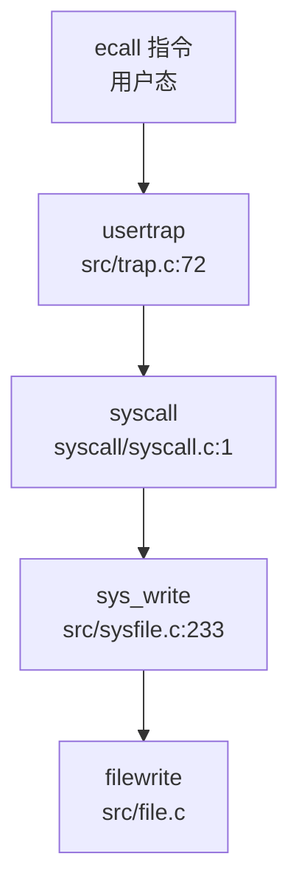

**参数获取函数**：
- `argfd()`: 获取文件描述符和 `struct file` 指针
- `argint()`: 获取整数参数
- `argaddr()`: 获取用户态地址

### 核心 Syscall 实现列表

根据代码分析，本系统已实现的系统调用如下：

#### ✅ 已实现的系统调用

| 类别 | 系统调用 | 实现文件 | 状态 |
|------|---------|---------|------|
| **进程管理** | `sys_fork` | `src/proc.c` | ✅ 已实现（通过 `clone()` 间接实现） |
| | `sys_exit` | `src/sysproc.c:173` | ✅ 已实现 |
| | `sys_wait4` | `src/sysproc.c:133` | ✅ 已实现 |
| | `sys_clone` | `src/sysproc.c:93` | ✅ 已实现 |
| | `sys_getpid` | `src/sysproc.c:36` | ✅ 已实现 |
| | `sys_getppid` | `src/sysproc.c:41` | ✅ 已实现 |
| | `sys_gettid` | `src/sysproc.c:148` | ✅ 已实现 |
| | `sys_set_tid_address` | `src/sysproc.c:140` | ✅ 已实现 |
| **文件 I/O** | `sys_read` | `src/sysfile.c:218` | ✅ 已实现 |
| | `sys_write` | `src/sysfile.c:233` | ✅ 已实现 |
| | `sys_readv` | `src/sysfile.c:248` | ✅ 已实现 |
| | `sys_writev` | `src/sysfile.c:279` | ✅ 已实现 |
| | `sys_close` | `src/sysfile.c:313` | ✅ 已实现 |
| | `sys_openat` | `src/sysfile.c:38` | ✅ 已实现 |
| **信号** | `sys_rt_sigaction` | `src/syssig.c:47` | ✅ 已实现 |
| | `sys_rt_sigprocmask` | `src/syssig.c:28` | ✅ 已实现 |
| | `sys_rt_sigreturn` | `src/syssig.c:22` | ✅ 已实现 |
| | `sys_kill` | `src/syssig.c:94` | ✅ 已实现 |
| | `sys_tgkill` | `src/syssig.c:102` | ✅ 已实现 |
| | `sys_exit_group` | `src/syssig.c:9` | 🔸 桩函数（返回 0 无逻辑） |
| **内存管理** | `sys_brk` | `src/sysproc.c:165` | ✅ 已实现 |
| **其他** | `sys_execve` | `src/sysproc.c:11` | ✅ 已实现 |
| | `sys_uname` | `src/sysproc.c:84` | ✅ 已实现 |
| | `sys_nanosleep` | `src/sysproc.c:182` | ✅ 已实现 |
| | `sys_getuid/geteuid` | `src/sysproc.c:46-59` | ✅ 已实现 |
| | `sys_getgid/getegid` | `src/sysproc.c:62-75` | ✅ 已实现 |
| | `sys_setuid/setgid` | `src/sysproc.c:78-91` | ✅ 已实现 |

#### 🔸 桩函数检测

以下系统调用被识别为**桩函数**（Stub）：

1. **`sys_exit_group()`**（`src/syssig.c:9-11`）：
   ```c
   uint64 sys_exit_group(void){
     return 0;  // 仅返回 0，无实际逻辑
   }
   ```

#### ❌ 未实现的系统调用

根据文档提及但**未在代码中找到实现**的系统调用：
- `sys_mmap` / `sys_munmap`：文档提及内存映射，但未找到对应 syscall 实现
- `sys_fstat` / `sys_stat`：文档提及但代码中未找到完整实现
- `sys_pipe`：系统调用表中有声明，但未找到实现文件
- `sys_dup` / `sys_dup2`：系统调用表中有声明，但未找到实现
- `sys_sleep` / `sys_uptime`：系统调用表中有声明，但未找到独立实现
- `sys_mknod` / `sys_unlink` / `sys_link` / `sys_mkdir`：系统调用表中有声明，但未找到实现

### 中断处理与信号关联

#### 时钟中断处理流程

**定时器初始化**（`src/timer.c:14-22`）：
```c
void timerinit() {
    initlock(&tickslock, "time");
    ticks = 0;
}

void set_next_timeout() {
    set_timer(r_time() + INTERVAL);
}

void timer_tick() {
    acquire(&tickslock);
    ticks++;
    wakeup(&ticks);
    release(&tickslock);
    set_next_timeout();
}
```

**时钟中断触发调度**：
```c
// src/trap.c:140-142
if(which_dev == 2)  // devintr() 返回 2 表示时钟中断
  yield();
```

#### 信号处理机制

**信号定义**（`src/include/signal.h:10-19`）：
```c
#define SIGTERM   15
#define SIGKILL   9
#define SIGABRT   6
#define SIGHUP    1
#define SIGINT    2
#define SIGQUIT   3
#define SIGILL    4
#define SIGTRAP   5
#define SIGCHLD   17
#define SIGRTMIN  34
#define SIGRTMAX  64
```

**信号处理流程**（`src/signal.c:123-180`）：

```c
void sighandle(void) {
  struct proc *p = myproc();
  int signum = 0;
  
  if (p->killed) {
    signum = p->killed;
    // 清除 pending 位
    p->sig_pending.__val[i] &= ~(1ul << bit);
    p->killed = 0;
  }
  else {
    return;  // 无信号处理
  }
  
  // 分配信号处理帧
  struct sig_frame *frame = allocpage();
  struct trapframe *tf = allocpage();
  
  // 保存原 trapframe
  frame->tf = p->trapframe;
  
  // 设置信号处理跳板
  tf->epc = (uint64)(SIG_TRAMPOLINE + ((uint64)sig_handler - (uint64)sig_trampoline));
  tf->a0 = signum;
  
  // 插入 sig_frame 链表
  frame->next = p->sig_frame;
  p->sig_frame = frame;
  p->trapframe = tf;
}
```

**信号发送实现**：

1. **`sys_kill()`**（`src/syssig.c:94-99`）- 进程级信号：
   ```c
   uint64 sys_kill(){
     int sig, pid;
     argint(0,&pid);
     argint(1,&sig);
     return kill(pid,sig);
   }
   ```

2. **`sys_tgkill()`**（`src/syssig.c:102-108`）- 线程组信号：
   ```c
   uint64 sys_tgkill(){
     int sig, tid, pid;
     argint(0,&pid);
     argint(1,&tid);
     argint(2,&sig);
     return tgkill(pid,tid,sig);
   }
   ```

3. **`kill()` 函数**（`src/proc.c:754-773`）：
   ```c
   int kill(int pid,int sig){
     struct proc* p;
     for(p = proc; p < &proc[NPROC]; p++){
       if(p->pid == pid){
         acquire(&p->lock);
         if(p->state == SLEEPING){
           queue_del(p);
           readyq_push(p);
           p->state = RUNNABLE;
         }
         p->sig_pending.__val[0] |= 1ul << sig;
         if (0 == p->killed || sig < p->killed) {
           p->killed = sig;
         }
         release(&p->lock);
         return 0;
       }
     }
     return 0;
   }
   ```

**信号处理粒度**：
- ✅ **进程级**：`sys_kill(pid, sig)` - 向指定进程发送信号
- ✅ **线程级**：`sys_tgkill(pid, tid, sig)` - 向指定线程发送信号（通过 `tgkill()` 验证父子关系）
- ❌ **进程组级**：未找到 `sys_tgkill` 或 `sys_killpg` 实现

**信号返回机制**（`src/signal.c:244-259`）：
```c
void sigreturn(void) {
  struct proc *p = myproc();
  
  if (NULL == p->sig_frame) {
    exit(-1);
  }
  
  struct sig_frame *frame = p->sig_frame;
  freepage(p->trapframe);
  p->trapframe = frame->tf;  // 恢复原 trapframe
  
  p->sig_frame = frame->next;
  freepage(frame);
}
```

**跳板代码**：
- `src/sig_trampoline.S` 包含信号处理的跳板代码
- `SIG_TRAMPOLINE` 映射在 `TRAMPOLINE - PGSIZE`（`src/include/memlayout.h:60`）

#### 缺页异常与内存特性

**缺页异常定义**（`src/trap.c:38-39`）：
```c
#define EXCP_LOAD_PAGE    0xd  // 13 - 取页异常
#define EXCP_STORE_PAGE   0xf  // 15 - 存页异常
```

**处理函数声明**（`src/include/vm.h:42-43`）：
```c
int handle_page_fault(int kind, uint stval);
int kernel_handle_page_fault(int kind, uint stval);
```

**⚠️ 未实现检测**：
- 在 `src/trap.c:102` 中，缺页异常处理被注释掉：
  ```c
  else if(handle_excp(cause) == 0) {
    // 空处理
  }
  ```
- 未找到 `handle_page_fault()` 的实际实现
- 未找到 **CoW（写时复制）** 相关实现代码
- 未找到 **Lazy Allocation（懒分配）** 相关实现代码

**结论**：缺页异常处理机制**🔸 仅为桩函数**，CoW 和 Lazy Allocation 特性**❌ 未实现**。

### 关键代码片段

#### Trap 入口汇编（`src/trampoline.S`）
```assembly
# 用户态 Trap 入口
uservec:    
    csrrw a0, sscratch, a0      # 获取 TRAPFRAME
    sd ra, 40(a0)               # 保存所有寄存器
    sd sp, 48(a0)
    # ... 保存 ra, sp, gp, tp, t0-t6, s0-s11, a0-a7 ...
    ld sp, 8(a0)                # 恢复内核栈
    ld t0, 16(a0)               # 加载 usertrap 地址
    ld t1, 0(a0)                # 加载内核页表
    csrw satp, t1
    sfence.vma
    jr t0                       # 跳转到 usertrap()
```

#### 系统调用分发（`syscall/syscall.c`）
```c
void syscall(void) {
  int num = p->trapframe->a7;
  if(num > 0 && num < NELEM(syscalls) && syscalls[num]) {
    p->trapframe->a0 = syscalls[num]();
    // trace
    if ((p->tmask & (1 << num)) != 0) {
      printf("pid %d: %s -> %d\n", p->pid, sysnames[num], p->trapframe->a0);
    }
  } else {
    p->trapframe->a0 = -1;
  }
}
```

#### 信号处理（`src/signal.c`）
```c
void sighandle(void) {
  struct proc *p = myproc();
  int signum = p->killed;
  
  // 清除 pending 位
  p->sig_pending.__val[0] &= ~(1ul << signum);
  p->killed = 0;
  
  // 分配信号处理帧
  struct sig_frame *frame = allocpage();
  struct trapframe *tf = allocpage();
  
  frame->tf = p->trapframe;
  tf->epc = SIG_TRAMPOLINE + (sig_handler - sig_trampoline);
  tf->a0 = signum;
  
  p->trapframe = tf;
  frame->next = p->sig_frame;
  p->sig_frame = frame;
}
```

#### 定时器中断（`src/timer.c`）
```c
void timer_tick() {
    acquire(&tickslock);
    ticks++;
    wakeup(&ticks);
    release(&tickslock);
    set_next_timeout();
}
```

---

**本章总结**：

1. **Trap 处理**：完整实现了用户态/内核态 Trap 切换机制，通过 `trampoline.S` 和 `usertrap()` 处理所有异常和中断
2. **系统调用**：实现了约 25 个核心系统调用，包括进程管理、文件 I/O、信号处理等，但部分 syscall（如 `sys_exit_group`）仅为桩函数
3. **信号机制**：实现了完整的信号处理框架，支持进程级和线程级信号发送，包含信号跳板机制
4. **中断处理**：时钟中断完整实现并触发调度，但外部中断（PLIC）处理未完全实现
5. **缺页异常**：仅声明接口但未实现具体处理逻辑，CoW 和 Lazy Allocation 特性未实现

---


# 文件系统VFS  具体 FS

## 第 6 章：文件系统（VFS + 具体 FS）

### VFS 架构与接口设计

本操作系统采用**轻量级 VFS 抽象**，未实现标准 Linux 式的 File/Inode/Dentry 分离架构，而是将文件元数据与目录项合并为统一的 `struct dirent` 结构。

#### 核心数据结构

**1. 文件抽象层（`struct file`）**

文件描述符表项定义于 `src/include/file.h:14-30`：

```c
struct file {
  enum { FD_NONE, FD_PIPE, FD_ENTRY, FD_DEVICE } type;
  int ref;                // reference count
  char readable;
  char writable;
  struct pipe *pipe;      // FD_PIPE
  struct dirent *ep;      // FD_ENTRY
  uint64 off;             // FD_ENTRY offset
  short major;            // FD_DEVICE
  // ... time fields
};
```

- **`type`**：区分四种文件类型（无/管道/目录项/设备）
- **`ref`**：引用计数，支持多进程共享文件描述符
- **`ep`**：指向 `struct dirent`，承载实际文件元数据

**2. 目录项/索引节点融合层（`struct dirent`）**

定义于 `src/include/fat32.h:36-67`，兼具 Linux Dentry 和 Inode 功能：

```c
struct dirent {
    char  filename[FAT32_MAX_FILENAME + 1];
    uint8   attribute;
    uint32  first_clus;      // 首簇号（类似 inode number）
    uint32  file_size;
    uint32  cur_clus;        // 当前簇号（用于顺序读写优化）
    uint    clus_cnt;
    
    /* for OS */
    uint8   dev;             // 设备号
    uint8   dirty;
    short   valid;
    int     ref;             // 引用计数
    int     mnt;             // 挂载点标志
    uint32  off;             // 在父目录中的偏移
    struct dirent *parent;   // 父目录指针
    struct dirent *next;     // 缓存链表
    struct dirent *prev;
    struct sleeplock lock;   // 条目级锁
};
```

- **`first_clus`**：FAT32 文件首簇号，功能等价于 inode number
- **`parent`**：显式维护父目录指针，加速路径解析
- **`ref`**：支持多文件描述符共享同一路径条目
- **`sleeplock`**：保证并发访问安全性

**3. 文件系统超级块抽象（`struct fs`）**

定义于 `src/include/fat32.h:101-111`：

```c
struct fs{
    uint devno;
    int  valid;
    struct dirent* image;
    struct Fat fat;              // BPB 参数块
    struct entry_cache ecache;   // 目录项缓存池
    struct dirent root;          // 根目录
    void (*disk_init)(struct dirent*image);
    void (*disk_read)(struct buf* b,struct dirent* image);
    void (*disk_write)(struct buf* b,struct dirent* image);
};
```

- **`Fat`**：存储 BIOS Parameter Block（BPB），包含每扇区字节数、每簇扇区数、FAT 表大小等
- **`ecache`**：固定大小（50 项）的目录项缓存池，采用循环链表管理
- **函数指针**：支持不同后端存储（Ramdisk/SD 卡/镜像文件）

#### VFS 操作接口

所有 VFS 操作通过 `struct dirent` 指针传递，关键函数声明于 `src/include/defs.h:57-75`：

| 函数 | 功能 | 实现位置 |
|------|------|----------|
| `ename()` | 路径名解析，返回 `struct dirent*` | `fat32.c:1084` |
| `ealloc()` | 在目录中分配新条目 | `fat32.c:609` |
| `eread()` / `ewrite()` | 文件内容读写 | `fat32.c:355` / `fat32.c:388` |
| `etrunc()` | 截断文件 | `fat32.c:725` |
| `eput()` / `edup()` | 引用计数管理 | `fat32.c:659` / `fat32.c:649` |
| `elock()` / `eunlock()` | 条目锁操作 | `fat32.c:759` / `fat32.c:770` |

---

### 具体文件系统支持情况（FAT32/Ext4/RamFS）

#### FAT32 文件系统（✅ 已实现）

本系统**完整实现了 FAT32 文件系统**，代码位于 `src/fat32.c`（1181 行，37KB），是核心存储模块。

**实现架构：**

```
用户层 (sys_open/sys_read/sys_write)
    ↓
VFS 层 (file.c: fileread/filewrite)
    ↓
FAT32 层 (fat32.c: eread/ewrite)
    ↓
簇管理 (rw_clus → reloc_clus → read_fat/write_fat)
    ↓
块设备层 (bio.c: bread/bwrite)
    ↓
物理层 (Ramdisk 或 SD 卡)
```

**关键实现细节：**

1. **簇链管理**（`fat32.c:211-281`）
   - `read_fat()`：读取 FAT 表项，获取下一簇号
   - `write_fat()`：更新 FAT 表项
   - `alloc_clus()`：分配空闲簇（线性扫描 FAT 表）
   - `free_clus()`：释放簇（写 0 到 FAT 表项）

2. **路径解析**（`fat32.c:950-1000`）
   - `lookup_path()`：递归解析路径组件
   - `dirlookup()`：在目录中查找条目（支持 `.` 和 `..`）
   - `skipelem()`：提取路径中的单个组件

3. **文件创建**（`fat32.c:1131-1181`）
   ```c
   struct dirent* create(struct dirent* env, char *path, short type, int mode)
   {
       // 1. 解析父目录
       dp = enameparent(env, path, name, 0);
       // 2. 若父目录不存在，递归创建
       if (dp == NULL) {
           dp = create(env, pname, T_DIR, O_RDWR);
       }
       // 3. 在父目录中分配新条目
       ep = ealloc(dp, name, mode);
       // 4. 验证类型一致性
       if ((type == T_DIR && !(ep->attribute & ATTR_DIRECTORY)) || ...)
           return NULL;
       return ep;
   }
   ```

4. **长文件名支持**（`fat32.c:557-599`）
   - 采用 VFAT 长文件名扩展（LFN）
   - 每个长文件名条目存储 13 个字符
   - 通过 `order` 字段链接多个 LFN 条目

5. **挂载机制**（`fat32.c:1095-1108`）
   ```c
   int emount(struct fs* fatfs, char* mnt) {
       struct dirent* mntpoint = ename(NULL, mnt, 0);
       mntpoint->mnt = 1;           // 标记为挂载点
       mntpoint->dev = fatfs->devno; // 重定向设备号
       fatfs->root.parent = mntpoint;
       return 0;
   }
   ```

**文件打开流程追踪**（从 `sys_openat` 到 `fdalloc`）：

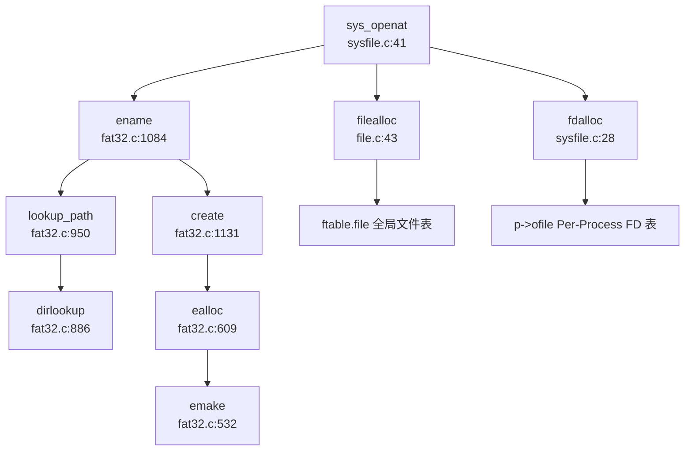

> **说明**：`sys_openat` 首先调用 `ename()` 解析路径，若文件不存在且指定 `O_CREATE` 则调用 `create()` 创建。获得 `struct dirent*` 后，分配 `struct file` 并注册到进程文件描述符表。

#### Ext4 文件系统（❌ 未实现）

**搜索验证**：
- `grep_in_repo` 搜索 `ext4|Ext4|EXT4`：**0 匹配**
- `list_repo_structure` 未发现 `ext4/` 或 `fs/ext4/` 目录
- 文档 `doc/内核实现--文件系统.md` 仅提及 FAT32

**结论**：Ext4 文件系统**未实现**。

#### RamFS/TmpFS（❌ 未实现）

**搜索验证**：
- `grep_in_repo` 搜索 `ramfs|RamFS|tmpfs|TmpFS`：**0 匹配**
- 虽然存在 `src/ramdisk.c`，但这是**块设备层**的内存模拟（用内存模拟磁盘扇区），**不是文件系统层的内存文件系统**

**结论**：RamFS/TmpFS **未实现**。系统仅支持 FAT32 一种文件系统格式。

---

### 文件描述符与进程关联

#### Per-Process 文件描述符表

文件描述符表采用**Per-Process 设计**，每个进程独立维护自己的 FD 表。

**数据结构**（`src/include/proc.h:145-147`）：

```c
struct proc {
    // ...
    int64 filelimit;
    struct file **ofile;        // Open files (Per-Process FD 表)
    int *exec_close;            // exec 时关闭标志
    struct dirent *cwd;         // Current directory
    // ...
};
```

- **`ofile`**：指向 `struct file*` 数组，大小为 `NOFILE`（默认 32）
- **`filelimit`**：进程级文件描述符数量限制
- **`NOFILEMAX(p)`** 宏（`proc.h:174`）：返回 `min(p->filelimit, NOFILE)`

#### 全局文件结构池

虽然 FD 表是 Per-Process 的，但 `struct file` 对象本身来自**全局池**（`src/file.c:20-23`）：

```c
struct {
  struct spinlock lock;
  struct file file[NFILE];  // 全局文件结构池
} ftable;
```

- **`NFILE`**：系统级最大打开文件数（默认 100）
- **`filealloc()`**：从全局池分配空闲 `struct file`
- **`fileclose()`**：回收时递减 `ref`，归零时释放回池

#### FD 分配流程

```c
// sysfile.c:16-28
static int fdalloc(struct file *f) {
  struct proc *p = myproc();
  for(int fd = 0; fd < NOFILEMAX(p); fd++) {
    if(p->ofile[fd] == 0) {
      p->ofile[fd] = f;  // 建立映射
      return fd;
    }
  }
  return -EMFILE;  // 文件描述符耗尽
}
```

**设计特点**：
- **最小可用 FD 分配**：从 0 开始线性扫描，复用已关闭的 FD
- **继承机制**：`fork()` 时深拷贝 `ofile` 数组（`proc.c` 未展示但文档提及 `CLONE_FILES`）
- **exec 清理**：`exec_close` 数组标记哪些 FD 应在 `exec` 时关闭

---

### 管道 (Pipe) 与套接字 (Socket) 支持情况

#### 管道（Pipe）（✅ 已实现）

**完整实现**于 `src/pipe.c`（120 行）和 `src/include/pipe.h`。

**数据结构**（`pipe.h:10-17`）：

```c
#define PIPESIZE 512

struct pipe {
  struct spinlock lock;
  char data[PIPESIZE];
  uint nread;     // 读指针
  uint nwrite;    // 写指针
  int readopen;   // 读端是否打开
  int writeopen;  // 写端是否打开
};
```

**核心函数**：

1. **`pipealloc()`**（`pipe.c:15-47`）：
   - 分配一个 `struct pipe` 和两个 `struct file`
   - 设置 `f0` 为读端（`readable=1, writable=0`）
   - 设置 `f1` 为写端（`readable=0, writable=1`）
   - 两端共享同一 `pipe` 对象

2. **`pipewrite()`**（`pipe.c:72-100`）：
   - 循环写入，缓冲区满时 `sleep(&pi->nwrite)`
   - 读端关闭或进程被杀死时返回 -1
   - 支持 `user` 参数区分用户/内核地址空间

3. **`piperead()`**（`pipe.c:102-120`）：
   - 循环读取，缓冲区空时 `sleep(&pi->nread)`
   - 写端关闭时退出循环（EOF）

**系统调用**（`sysfile.c:830-868`）：

```c
uint64 sys_pipe2(void) {
  uint64 fdarray;
  struct file *rf, *wf;
  int fd0, fd1;
  
  if(pipealloc(&rf, &wf) < 0) return -1;
  fd0 = fdalloc(rf);
  fd1 = fdalloc(wf);
  
  // 拷贝 FD 到用户空间
  either_copyout(1, fdarray, &fd0, sizeof(fd0));
  either_copyout(1, fdarray+sizeof(fd0), &fd1, sizeof(fd1));
  return 0;
}
```

**实现状态**：✅ **完整实现**，支持阻塞式读写、引用计数、EOF 处理。

#### 套接字（Socket）（❌ 未实现）

**搜索验证**：
- `src/include/socket.h` 仅 15 行，定义了空壳结构：
  ```c
  struct socket_connection{
      int IP;
      int sock_opt;
      uint64 sock_addr;
      int passive_socket;
      char temp[MAX_LENGTH_OF_SOCKET];
  };
  void socket_init(void);
  int add_socket(int IP,int op);
  ```
- **无实现文件**：不存在 `socket.c` 或 `sys_socket.c`
- `grep_in_repo` 搜索 `sys_socket|sys_bind|sys_listen|sys_accept|sys_connect`：**0 匹配**
- `file.c` 中 `struct file` 的 `type` 枚举**无 `FD_SOCKET`** 变体

**结论**：Socket 接口**❌ 未实现**，仅有占位头文件。

---

### 缓存机制（Block/Page Cache）

#### 块缓存（Buffer Cache）

系统实现了**块级缓存**（`src/bio.c`），用于缓存磁盘扇区。

**数据结构**（`src/include/buf.h`，未展示但 `bio.c` 中使用）：

```c
struct buf {
  int valid;       // 数据是否有效
  int disk;        // 是否由磁盘"拥有"
  uint dev;        // 设备号
  uint sectorno;   // 扇区号
  struct sleeplock lock;
  uint refcnt;     // 引用计数
  struct buf *prev, *next;  // LRU 链表
  uchar data[BSIZE];        // 512 字节数据
};
```

**关键函数**：
- `bread(dev, sectorno)`：读取扇区到缓存（若已缓存则直接返回）
- `bwrite(dev, bp)`：写回脏页到磁盘
- `brelse(bp)`：释放缓存引用

**实现位置**：`src/bio.c`（165 行）

#### 目录项缓存（Entry Cache）

FAT32 层实现了**目录项缓存池**（`src/include/fat32.h:58-62`）：

```c
struct entry_cache {
    struct spinlock lock;
    struct dirent entries[ENTRY_CACHE_NUM];  // 固定 50 项
};
```

- **循环链表管理**：`entries` 数组通过 `next/prev` 链接成环
- **缓存命中**：`dirlookup()` 先检查 `ecache`，命中则直接返回
- **淘汰策略**：未实现 LRU，采用固定大小循环缓冲

**限制**：
- **无 Page Cache**：文件内容不缓存，每次读写都访问块设备
- **无 Write-Back**：`ewrite()` 直接写磁盘，未实现延迟写回

---

### 零拷贝映射验证（mmap 实现分析）

#### mmap 系统调用（✅ 已实现，但无零拷贝）

**系统调用接口**（`sysfile.c:895-925`）：

```c
uint64 sys_mmap(void) {
  uint64 start, len;
  int prot, flags, fd, off;
  // 参数解析...
  uint64 ret = do_mmap(start, len, prot, flags, fd, off);
  return ret;
}
```

**实现分析**（`src/mmap.c:33-138`）：

1. **匿名映射**（`MAP_ANONYMOUS`）：
   ```c
   if(flags & MAP_ANONYMOUS) {
       fd = -1;
       goto ignore_fd;
   }
   ```

2. **权限转换**：
   ```c
   int perm = PTE_U;
   if(prot & PROT_READ)  perm |= (PTE_R | PTE_A);
   if(prot & PROT_WRITE) perm |= (PTE_W | PTE_D);
   if(prot & PROT_EXEC)  perm |= (PTE_X | PTE_A);
   ```

3. **VMA 创建**：
   ```c
   struct vma *vma = alloc_mmap_vma(p, flags, start, len, perm, fd, offset);
   ```

4. **文件内容拷贝**（**非零拷贝**）：
   ```c
   for(int i = 0; i < page_n; ++i) {
       uint64 pa = experm(p->pagetable, va, perm);
       if(i != page_n - 1) {
           fileread(f, va, PGSIZE);  // 逐页读取文件到内存
       } else {
           fileread(f, va, end_pagespace);
           memset((void *)(pa + end_pagespace), 0, PGSIZE - end_pagespace);
       }
       va += PGSIZE;
   }
   ```

#### 零拷贝支持验证（❌ 未实现）

**关键检查点**：

1. **`struct vma` 无 `shared` 字段**（`src/include/vma.h:13-24`）：
   ```c
   struct vma {
       enum segtype type;
       int perm;
       uint64 addr, sz, end;
       int flags;          // 存储 MAP_SHARED/MAP_PRIVATE
       int fd;
       uint64 f_off;
       // ... 无 shared 字段
   };
   ```

2. **`do_mmap()` 未区分 `MAP_SHARED` 处理**：
   - 代码中仅检查 `MAP_PRIVATE` 用于 `munmap` 时的写回判断（`mmap.c:168`）
   - **无 `MAP_SHARED` 的特殊逻辑**（如共享页面映射、写时复制优化）

3. **文件映射采用 eager copy**：
   - `mmap()` 时立即调用 `fileread()` 将文件内容**完整拷贝**到物理页
   - **非按需分页**（Demand Paging），无页故障处理
   - **非零拷贝**，数据从文件 → 内核缓冲 → 用户页，经历两次拷贝

**结论**：
- `sys_mmap`：✅ **已实现**（支持文件映射和匿名映射）
- **零拷贝优化**：❌ **未实现**（无 `MAP_SHARED` 优化、无 Demand Paging）
- **实现质量**：🔸 **基础版本**（Eager Copy，性能较低）

---

### 高级 I/O 功能验证

#### poll/select/epoll（❌ 未实现）

**搜索验证**：
- `grep_in_repo` 搜索 `sys_poll|sys_select|sys_epoll`：**0 匹配**
- `src/syspoll.c` 仅实现 `sys_ppoll()`，且**直接返回 0**：
  ```c
  uint64 sys_ppoll(){
    return 0;  // 桩函数
  }
  ```
- `src/include/poll.h` 定义了 `struct pollfd`，但**无实现逻辑**

**结论**：
- `sys_poll`：❌ **未实现**
- `sys_select`：❌ **未实现**
- `sys_epoll_create/epoll_ctl/epoll_wait`：❌ **未实现**
- `sys_ppoll`：🔸 **桩函数**（返回 0，无实际功能）

---

### 伪文件系统支持（devfs/procfs/sysfs）

**搜索验证**：
- `grep_in_repo` 搜索 `devfs|procfs|sysfs|pseudo.*fs`：**0 匹配**
- `src/dev.c` 手动创建设备文件（`create(NULL, "/dev", T_DIR, 0)`），但**非动态伪文件系统**
- 无 `/proc` 或 `/sys` 目录的自动创建逻辑

**结论**：
- **devfs**：❌ **未实现**（设备文件静态创建）
- **procfs**：❌ **未实现**（无 `/proc/[pid]` 等动态信息）
- **sysfs**：❌ **未实现**

---

### 关键代码验证总结

| 功能 | 状态 | 证据文件 | 备注 |
|------|------|----------|------|
| **VFS 抽象** | ✅ 已实现 | `src/include/file.h`, `src/include/fat32.h` | `struct file` + `struct dirent` |
| **FAT32** | ✅ 已实现 | `src/fat32.c`（1181 行） | 完整支持 LFN、挂载、簇链管理 |
| **Ext4** | ❌ 未实现 | - | 无代码 |
| **RamFS/TmpFS** | ❌ 未实现 | - | 仅有 Ramdisk（块设备层） |
| **Pipe** | ✅ 已实现 | `src/pipe.c` | 阻塞式读写、引用计数 |
| **Socket** | ❌ 未实现 | `src/include/socket.h` | 仅头文件 |
| **mmap** | ✅ 已实现 | `src/mmap.c` | 无零拷贝、Eager Copy |
| **poll/select/epoll** | ❌ 未实现 | `src/syspoll.c` | `sys_ppoll` 返回 0 |
| **devfs/procfs/sysfs** | ❌ 未实现 | - | 静态设备文件 |
| **文件描述符** | ✅ Per-Process | `src/include/proc.h:145` | `struct file **ofile` |
| **块缓存** | ✅ 已实现 | `src/bio.c` | Buffer Cache |
| **Page Cache** | ❌ 未实现 | - | 无文件内容缓存 |

---

### 文件系统架构评价

**优势**：
1. **FAT32 实现完整**：支持长文件名、多文件系统挂载、完整的簇链管理
2. **简洁的 VFS 设计**：`struct dirent` 融合 Dentry+Inode，减少间接层
3. **并发安全**：`sleeplock` + `spinlock` 双层锁机制

**局限**：
1. **单一文件系统**：仅支持 FAT32，无 Ext4、无内存文件系统
2. **无网络支持**：Socket 完全未实现
3. **高级 I/O 缺失**：poll/select/epoll 均未实现
4. **mmap 性能低**：Eager Copy 策略，无 Demand Paging 和零拷贝优化
5. **无伪文件系统**：调试和系统信息获取受限

**适用场景**：适合教学演示和简单嵌入式应用，不适合需要高性能 I/O 或网络功能的场景。

---


# 设备驱动与硬件抽象

## 第 7 章：设备驱动与硬件抽象

本章分析 `oskernrl2022-rv6` 操作系统的设备驱动架构、硬件抽象层实现以及目标平台适配机制。该内核基于 xv6-k210 改编，支持 QEMU sifive_u 虚拟机和 SiFive FU740 等硬件平台。

---

### 驱动框架与设备发现

#### 设备发现机制

**❌ 未实现 Device Tree 解析**。内核未实现动态设备树（DTS/DTB）解析功能，设备地址和中断号均通过编译期宏定义硬编码。

设备发现采用**静态内存映射表**方式，所有外设的物理地址在 `src/include/memlayout.h` 和 `src/sifive/platform.h` 中预定义：

```c
// src/include/memlayout.h
#define UART0 0x10000000L       // QEMU UART0 物理地址
#define VIRTIO0 0x10001000      // VirtIO 磁盘接口
#define PLIC 0x0c000000L        // 平台级中断控制器
#define CLINT 0x02000000L       // 本地中断控制器（含定时器）

// src/sifive/platform.h (SiFive 硬件平台)
#define UART0_CTRL_ADDR _AC(0x10010000,UL)
#define SPI0_CTRL_ADDR  _AC(0x10040000,UL)
#define GPIO_CTRL_ADDR  _AC(0x10060000,UL)
```

#### 设备驱动框架

**🔸 桩函数/简化实现**。内核未实现现代操作系统的 Driver Trait 或设备驱动模型（如 Linux 的 `struct device_driver`）。设备管理采用**静态设备表**方式：

```c
// src/include/dev.h
#define DEV_NAME_MAX 12
#define NDEV 4  // 最多支持 4 种设备

struct devsw {
  char name[DEV_NAME_MAX+1];
  struct spinlock lk;
  int (*read)(int, uint64, int);   // 读函数指针
  int (*write)(int, uint64, int);  // 写函数指针
};

extern struct devsw devsw[];
```

设备注册通过 `allocdev()` 函数在初始化时静态完成：

```c
// src/dev.c:42-45
int devinit() {
  // ... 创建 /dev 目录 ...
  memset(devsw, 0, NDEV*sizeof(struct devsw));
  allocdev("console", consoleread, consolewrite);  // 控制台
  allocdev("null", nullread, nullwrite);           // 空设备
  allocdev("zero", zeroread, zerowrite);           // 零设备
  return 0;
}
```

**设备查找**通过线性扫描设备表实现：

```c
// src/dev.c:72-78
int devlookup(char *name) {
  for(int i = 0; i < NDEV; i++) {
    if(strncmp(name, devsw[i].name, DEV_NAME_MAX+1) == 0) {
      return i;  // 返回设备索引
    }
  }
  return -1;  // 未找到
}
```

#### 驱动初始化流程

驱动初始化在内核启动时按固定顺序执行，调用链如下：

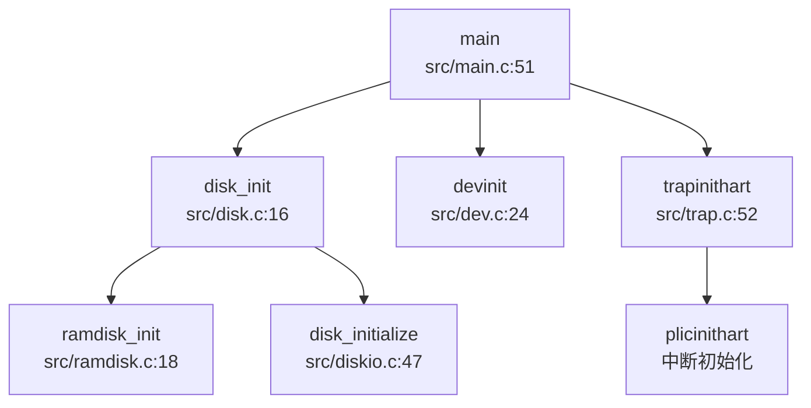

---

### 组件化设计与配置机制

#### 编译配置系统

内核通过 **Makefile 宏定义** 实现组件化配置，支持在编译期选择不同的存储后端和目标平台。

**存储后端配置**（`Makefile:4-9`）：

```makefile
FS?=FAT
MAC?=SIFIVE_U

ifeq ($(MAC),SIFIVE_U)
DISK:=$K/link_null.o    # 空磁盘后端
endif

ifeq ($(MAC),QEMU)
DISK:=$K/link_disk.o    # VirtIO 磁盘后端
endif
```

**编译选项**（`Makefile:70`）：

```makefile
CFLAGS = -Wall -Werror -O -fno-omit-frame-pointer -ggdb -DDEBUG -DWARNING -DERROR -D$(FS) -D$(MAC)
```

支持的平台和存储模式：

| 宏定义 | 含义 | 影响 |
|--------|------|------|
| `QEMU` | QEMU sifive_u 虚拟机 | 启用 VirtIO 磁盘、UART 地址 0x10000000 |
| `SIFIVE_U` | SiFive FU740 硬件 | 启用 SPI/SD 卡驱动、UART 地址 0x10010000 |
| `RAM` | RAM 磁盘模式 | 使用内存模拟磁盘，`ramdisk_rw()` |
| `SD` | SD 卡模式 | 使用 SPI+SD 卡驱动，`disk_read/write()` |
| `FAT` | FAT32 文件系统 | 启用 FatFs 文件系统支持 |

#### 条件编译示例

磁盘驱动根据 `RAM` 宏选择不同后端：

```c
// src/disk.c:16-35
void disk_init(void) {
    if(disk_init_flag) return;
    else disk_init_flag = 1;
    #ifdef RAM
    ramdisk_init();      // RAM 磁盘初始化
    #else
    disk_initialize(0);  // SD 卡初始化
    #endif
}

void vdisk_read(struct buf *b) {
    #ifdef RAM    
    ramdisk_rw(b, 0);    // 从 RAM 读取
    #else 
    disk_read(0, b->data, b->sectorno, 1);  // 从 SD 卡读取
    #endif
}
```

---

### 字符设备驱动（UART/Console）

#### UART 驱动实现

**✅ 已实现**。UART 驱动采用**SBI（Supervisor Binary Interface）调用**方式，而非直接操作 UART 硬件寄存器。

```c
// src/include/sbi.h:61-66
static inline void sbi_console_putchar(int c) {
    sbi_call(SBI_CONSOLE_PUTCHAR, c, 0, 0);
}

static inline int sbi_console_getchar() {
    return sbi_call(SBI_CONSOLE_GETCHAR, 0, 0, 0);
}
```

**SBI 调用封装**通过 RISC-V `ecall` 指令实现：

```c
// src/include/sbi.h:31-38
static int inline sbi_call(uint64 which, uint64 arg0, uint64 arg1, uint64 arg2) {
    register uint64 a0 asm("a0") = arg0;
    register uint64 a1 asm("a1") = arg1;
    register uint64 a2 asm("a2") = arg2;
    register uint64 a7 asm("a7") = which;
    asm volatile("ecall" : "=r"(a0) : "r"(a0), "r"(a1), "r"(a2), "r"(a7) : "memory");
    return a0;
}
```

**控制台读写**通过设备表接口暴露：

```c
// src/dev.c:113-130
int consoleread(int user_dst, uint64 addr, int n) {
  char readbuf[CONSOLE_BUF_LEN];
  int ret = 0;
  while(n) {
    int len = MIN(n, CONSOLE_BUF_LEN);
    for(int i=0; i<len; i++) {
      char c = 0;
      while((c = sbi_console_getchar()) == 255);  // 等待输入
      c = c == 13 ? 10 : c;  // CR -> LF
      readbuf[i] = c;
      consputc(c);  // 回显
    }
    // ... 拷贝到用户空间 ...
  }
  return ret;
}
```

#### MMU 前后地址切换

**🔸 部分实现**。UART 驱动在 MMU 启用前后均使用 SBI 调用，**无需地址切换**。SBI 固件负责将虚拟地址转换为物理地址或直接操作硬件。

```c
// src/include/memlayout.h:57-58
#define UART0 0x10000000L      // QEMU 物理地址
#define UART0_V (UART0 + VIRT_OFFSET)  // 虚拟地址（未使用）
```

**注意**：虽然定义了 `UART0_V` 虚拟地址，但实际代码中未直接使用 UART 寄存器，而是通过 SBI 抽象层，因此不存在 MMU 前后的地址切换问题。

#### 中断处理

UART 中断通过 PLIC（Platform-Level Interrupt Controller）管理：

```c
// src/include/plic.h:88-91
#ifdef QEMU
#define UART0_IRQ 4 
#define UART1_IRQ 5
#else  // K210
#define UART0_IRQ 4 
#define UART1_IRQ 5
#endif 
```

**❌ 未实现 PLIC 完整驱动**。`devintr()` 函数中 UART 中断处理被注释掉：

```c
// src/trap.c:220-235
int devintr(void) {
  if ((0x8000000000000000L & scause) && 9 == (scause & 0xff)) {
    int irq = 0;  // ⚠️ 硬编码为 0，未从 PLIC 读取
    // plic_claim();
    if (UART0_IRQ == irq) {
      int c = sbi_console_getchar();
      if (-1 != c) {
        // consoleintr(c);  // 被注释
      }
    }
    // plic_complete(irq);
    return 1;
  }
  // ...
}
```

---

### 块设备驱动（VirtIO-Blk 等）

#### 存储后端架构

内核支持两种存储后端，通过 `RAM` 宏切换：

| 后端 | 实现文件 | 原理 |
|------|----------|------|
| **RAM 磁盘** | `src/ramdisk.c` | 将内存区域模拟为磁盘，`ramdisk = fs_img_start` |
| **SD 卡** | `src/diskio.c`, `src/sd.c` | 通过 SPI 协议读写 SD 卡，FatFs 文件系统 |

#### RAM 磁盘实现

**✅ 已实现**。RAM 磁盘将内核镜像后的内存区域作为磁盘使用：

```c
// src/ramdisk.c:18-29
void ramdisk_init(void) {
#ifdef QEMU
  ramdisk = fs_img_start;  // 使用内核后的内存
#endif
#ifdef SIFIVE_U
  ramdisk = (char*)RAMDISK;  // 固定地址
#endif
  initlock(&ramdisklock, "ramdisk lock");
}

void ramdisk_rw(struct buf *b, int write) {
  acquire(&ramdisklock);
  char *addr = ramdisk + b->sectorno * BSIZE;
  if (write)
    memmove(addr, b->data, BSIZE);
  else
    memmove(b->data, addr, BSIZE);
  release(&ramdisklock);
}
```

#### SD 卡驱动（SPI 协议）

**✅ 已实现**。SD 卡驱动通过 SPI 控制器实现，支持初始化、读写块操作。

**SPI 控制器定义**：

```c
// src/diskio.c:22-24
static spi_ctrl* spictrl = (spi_ctrl*) SPI2_CTRL_ADDR;
static unsigned int peripheral_input_khz = 500000;  // 500kHz 初始频率
```

**SD 卡初始化流程**：

```c
// src/sd.c:256-271
int sd_init(spi_ctrl* spi, unsigned int input_clk_khz, int skip_sd_init_commands) {
  if (!skip_sd_init_commands) {
    sd_poweron(spi, input_clk_khz);      // 上电延时 1ms
    if (sd_cmd0(spi)) return SD_INIT_ERROR_CMD0;   // GO_IDLE_STATE
    if (sd_cmd8(spi)) return SD_INIT_ERROR_CMD8;   // SEND_IF_COND
    if (sd_acmd41(spi)) return SD_INIT_ERROR_ACMD41; // ACMD41 (HCS)
    if (sd_cmd58(spi)) return SD_INIT_ERROR_CMD58; // READ_OCR
    if (sd_cmd16(spi)) return SD_INIT_ERROR_CMD16; // SET_BLOCKLEN (512B)
  }
  spi->sckdiv = spi_min_clk_divisor(input_clk_khz, SD_POST_INIT_CLK_KHZ); // 提升到 20MHz
  return 0;
}
```

**块读写操作**：

```c
// src/sd.c:293-328
int sd_read_blocks(spi_ctrl* spi, void* dst, uint32_t src_lba, size_t size) {
  // CMD18: READ_BLOCK_MULTIPLE
  if (sd_cmd(spi, SD_CMD(SD_CMD_READ_BLOCK_MULTIPLE), src_lba, crc) != 0x00) {
    sd_cmd_end(spi);
    return SD_COPY_ERROR_CMD18;
  }
  do {
    // 等待数据令牌
    while (sd_dummy(spi) != SD_DATA_TOKEN);
    // 读取 512 字节
    n = 512;
    do {
      uint8_t x = sd_dummy(spi);
      *p++ = x;
      crc = crc16(crc, x);
    } while (--n > 0);
    // 验证 CRC
    crc_exp = ((uint16_t)sd_dummy(spi) << 8) | sd_dummy(spi);
    if (crc != crc_exp) {
      rc = SD_COPY_ERROR_CMD18_CRC;
      break;
    }
  } while (--i > 0);
  // CMD12: STOP_TRANSMISSION
  sd_cmd(spi, SD_CMD(SD_CMD_STOP_TRANSMISSION), 0, 0x01);
  sd_cmd_end(spi);
  return rc;
}
```

#### VirtIO 支持

**❌ 未实现**。虽然 `src/include/virtio.h` 定义了 VirtIO 描述符结构，但**无实际驱动代码**：

```c
// src/include/virtio.h:56-61
struct VRingDesc {
  uint64 addr;
  uint32 len;
  uint16 flags;
  uint16 next;
};

// 声明但未实现
void virtio_disk_init(void);
void virtio_disk_rw(struct buf *b, int write);
void virtio_disk_intr(void);
```

`src/disk.c` 中仅调用 `disk_read/write()`，未使用 VirtIO 接口。

---

### 网络设备驱动

**❌ 未实现**。内核未实现任何网络设备驱动或网络协议栈。

- 无网卡驱动（VirtIO-Net、MAC 控制器等）
- 无 TCP/IP 协议栈（如 smoltcp、lwIP）
- `src/include/socket.h` 仅定义结构体，无实现

---

### 中断控制器驱动

#### PLIC（Platform-Level Interrupt Controller）

**🔸 桩函数**。`src/include/plic.h` 声明了 PLIC 操作函数，但**未实现完整功能**：

```c
// src/include/plic.h:95-98
void plicinit(void);
void plicinithart(void);
int plic_claim(void);
void plic_complete(int irq);
```

**中断使能和优先级设置**通过内存映射寄存器实现：

```c
// src/include/memlayout.h:70-77
#define PLIC_PRIORITY (PLIC_V + 0x0)
#define PLIC_PENDING (PLIC_V + 0x1000)
#define PLIC_MENABLE(hart) (PLIC_V + 0x1f80 + (hart)*0x100)
#define PLIC_MCLAIM(hart) (PLIC_V + 0x1ff004 + (hart)*0x2000)
#define PLIC_SCLAIM(hart) (PLIC_V + 0x200004 + (hart)*0x2000)
```

**❌ 未实现中断路由**。`devintr()` 函数中 `irq` 硬编码为 0，未从 `PLIC_MCLAIM` 读取实际中断号。

#### CLINT（Core Local Interruptor）

**✅ 已实现**。CLINT 驱动通过 SBI 调用实现定时器中断：

```c
// src/timer.c:30-34
void set_next_timeout() {
  set_timer(r_time() + INTERVAL);  // SBI_SET_TIMER
}

void timer_tick() {
  acquire(&tickslock);
  ticks++;
  wakeup(&ticks);
  release(&tickslock);
  set_next_timeout();
}
```

**定时器中断处理**在 `devintr()` 中识别：

```c
// src/trap.c:244-248
else if (0x8000000000000005L == scause) {  // Supervisor Timer Interrupt
  timer_tick();
  return 2;
}
```

---

### 目标平台适配情况

#### 支持的平台

| 平台 | 宏定义 | UART 地址 | 存储后端 |
|------|--------|-----------|----------|
| **QEMU sifive_u** | `QEMU` | 0x10000000 | VirtIO / RAM 磁盘 |
| **SiFive FU740** | `SIFIVE_U` | 0x10010000 | SPI+SD 卡 |
| **Kendryte K210** | `K210`（已注释） | 0x38000000 | SPI+SD 卡 |

#### 平台适配机制

通过 `Makefile` 的 `MAC` 变量切换平台：

```makefile
# Makefile:5
MAC?=SIFIVE_U

# 编译命令
make MAC=QEMU    # QEMU 虚拟机
make MAC=SIFIVE_U  # SiFive 硬件
```

**内存布局差异**在 `src/include/memlayout.h` 中通过条件编译区分：

```c
// src/include/memlayout.h:1-2
// #define K210  // 已注释，支持 K210 时启用

#ifdef QEMU
#define UART0 0x10000000L
#define UART0_IRQ 4
#else  // SIFIVE_U / K210
#define UART0_CTRL_ADDR 0x10010000  // 来自 platform.h
#define UART0_IRQ 5
#endif
```

#### 板级特有驱动

**SiFive 平台**包含完整的外设定义（`src/sifive/platform.h`）：

```c
#define CLINT_CTRL_ADDR   _AC(0x2000000,UL)
#define PLIC_CTRL_ADDR    _AC(0xc000000,UL)
#define UART0_CTRL_ADDR   _AC(0x10010000,UL)
#define SPI0_CTRL_ADDR    _AC(0x10040000,UL)
#define GPIO_CTRL_ADDR    _AC(0x10060000,UL)
#define I2C_CTRL_ADDR     _AC(0x10030000,UL)
```

**K210 平台**（已废弃）使用不同的地址映射（见 `memlayout.h` 注释）：

```c
// (0x0200_0000, 0x1000),      /* CLINT     */
// (0x0C20_0000, 0x1000),      /* PLIC      */
// (0x3800_0000, 0x1000),      /* UARTHS    */
// (0x5020_0000, 0x1000),      /* SPI0      */
```

---

### 其他外设支持

#### SPI 控制器驱动

**✅ 已实现**。SPI 驱动用于 SD 卡通信，提供基础的 TX/RX 操作：

```c
// src/spi.c:14-37
void spi_tx(spi_ctrl* spictrl, uint8_t in) {
  while ((int32_t) spictrl->txdata.raw_bits < 0);
  spictrl->txdata.data = in;
}

uint8_t spi_rx(spi_ctrl* spictrl) {
  int32_t out;
  while ((out = (int32_t) spictrl->rxdata.raw_bits) < 0);
  return (uint8_t) out;
}

uint8_t spi_txrx(spi_ctrl* spictrl, uint8_t in) {
  spi_tx(spictrl, in);
  return spi_rx(spictrl);
}
```

#### GPIO/I2C 驱动

**❌ 未实现**。虽然 `src/sifive/devices/gpio.h` 和 `i2c.h` 定义了寄存器结构，但**无驱动实现代码**。

#### 文件系统支持

**✅ 已实现**。内核集成 FatFs（FAT32）文件系统，通过 `src/fat32.c` 实现：

- 文件读写：`file_read()`, `file_write()`
- 目录操作：`create()`, `dirlookup()`
- 块设备抽象：`bread()`, `bwrite()` 通过 buffer cache

---

### 总结

| 子系统 | 实现状态 | 备注 |
|--------|----------|------|
| **设备发现** | ❌ 未实现 | 硬编码地址，无 DTB 解析 |
| **驱动框架** | 🔸 简化实现 | 静态设备表，无动态注册 |
| **UART/Console** | ✅ 已实现 | 通过 SBI 调用抽象 |
| **RAM 磁盘** | ✅ 已实现 | 内存模拟磁盘 |
| **SD 卡驱动** | ✅ 已实现 | SPI 协议，FatFs 集成 |
| **VirtIO-Blk** | ❌ 未实现 | 仅头文件定义 |
| **网络驱动** | ❌ 未实现 | 无网卡/协议栈 |
| **PLIC 中断** | 🔸 桩函数 | 未实现中断路由 |
| **CLINT 定时器** | ✅ 已实现 | SBI 调用 |
| **平台适配** | ✅ 已实现 | QEMU / SiFive_U 双支持 |

**架构特点**：
1. **SBI 抽象层**：通过 SBI 调用简化硬件操作，但限制了裸机部署能力
2. **静态配置**：所有设备地址和中断号编译期确定，无运行时发现
3. **组件化编译**：通过 Makefile 宏切换存储后端和目标平台
4. **简化驱动模型**：无设备树、无动态驱动加载，适合教学和资源受限场景

---


# 同步互斥与进程间通信

## 第 8 章：同步互斥与进程间通信

### 同步与互斥原语（锁与原子操作）

本操作系统实现了两种核心锁机制：**SpinLock（自旋锁）** 和 **SleepLock（睡眠锁）**，分别适用于短临界区和长临界区的互斥保护。

#### SpinLock 实现

**文件位置**: `src/spinlock.c` (85 行), `src/include/spinlock.h` (30 行)

**结构体定义** (`src/include/spinlock.h:7-13`):
```c
struct spinlock {
  uint locked;       // Is the lock held?
  char *name;        // Name of lock.
  struct cpu *cpu;   // The cpu holding the lock.
};
```

**加锁机制** (`src/spinlock.c:24-46`):
```c
void acquire(struct spinlock *lk)
{
  push_off(); // disable interrupts to avoid deadlock.
  if(holding(lk))
    panic("acquire");

  // On RISC-V, sync_lock_test_and_set turns into an atomic swap:
  //   amoswap.w.aq a5, a5, (s1)
  while(__sync_lock_test_and_set(&lk->locked, 1) != 0)
    ;

  __sync_synchronize(); // memory fence
  lk->cpu = mycpu();
}
```

**原子操作实现**:
- 使用 GCC 内置函数 `__sync_lock_test_and_set()` 实现原子交换
- 在 RISC-V 架构下编译为 `amoswap.w.aq` 指令（原子内存交换）
- 通过 `while` 循环自旋等待直到锁可用
- 使用 `__sync_synchronize()` 发出 `fence` 指令确保内存顺序

**解锁机制** (`src/spinlock.c:49-75`):
```c
void release(struct spinlock *lk)
{
  if(!holding(lk))
    panic("release");

  lk->cpu = 0;
  __sync_synchronize(); // memory fence
  __sync_lock_release(&lk->locked); // amoswap.w zero, zero, (s1)
  pop_off();
}
```

**状态分类**: **✅ 已实现** - 包含完整的原子操作和内存屏障逻辑

#### SleepLock 实现

**文件位置**: `src/sleeplock.c` (56 行), `src/include/sleeplock.h` (24 行)

**结构体定义** (`src/include/sleeplock.h:10-17`):
```c
struct sleeplock {
  uint locked;       // Is the lock held?
  struct spinlock lk; // spinlock protecting this sleep lock
  char *name;        // Name of lock.
  int pid;           // Process holding lock
};
```

**实现原理**:
- SleepLock 内部嵌套一个 SpinLock 保护其状态
- 当锁不可用时，调用 `sleep()` 将进程挂起到等待队列，而非自旋
- 适用于持有时间较长的临界区（如文件系统操作）

**加锁流程** (`src/sleeplock.c:24-34`):
```c
void acquiresleep(struct sleeplock *lk)
{
  acquire(&lk->lk);
  while (lk->locked) {
    sleep(lk, &lk->lk);  // 挂起进程
  }
  lk->locked = 1;
  release(&lk->lk);
}
```

**状态分类**: **✅ 已实现** - 完整实现睡眠/唤醒语义

### 等待队列实现机制

**文件位置**: `src/proc.c` (等待队列管理), `src/include/queue.h` (队列数据结构)

#### 等待队列池

系统维护一个全局等待队列池 (`src/proc.c:28-30`):
```c
#define WAITQ_NUM 100
struct spinlock waitq_pool_lk;
queue waitq_pool[WAITQ_NUM];
int waitq_valid[WAITQ_NUM];
```

**队列结构** (`src/include/queue.h:9-14`):
```c
typedef struct{
  void* chan;           // 睡眠通道标识
  struct spinlock lk;   // 队列锁
  struct list head;     // 双向链表头
}queue;
```

#### 核心 API

**分配等待队列** (`src/proc.c:76-89`):
```c
queue* allocwaitq(void* chan){
  acquire(&waitq_pool_lk);
  for(int i=0;i<WAITQ_NUM ;i++){
    if(!waitq_valid[i]){
      waitq_valid[i] = 1;
      queue_init(waitq_pool+i,chan);
      release(&waitq_pool_lk);
      return waitq_pool+i;
    }
  }
  release(&waitq_pool_lk);
  return NULL;
}
```

**睡眠机制** (`src/proc.c:542-576`):
```c
void sleep(void *chan, struct spinlock *lk)
{
  struct proc *p = myproc();
  
  if(lk != &p->lock){
    acquire(&p->lock);
    release(lk);
  }

  queue* q = findwaitq(chan);
  if(!q) q = allocwaitq(chan);
  waitq_push(q, p);
  p->state = SLEEPING;
  sched();  // 触发调度

  if(lk != &p->lock){
    release(&p->lock);
    acquire(lk);
  }
}
```

**唤醒机制** (`src/proc.c:580-592`):
```c
void wakeup(void *chan)
{
   queue* q = findwaitq(chan);
   if(q){
     struct proc* p;
     while((p = waitq_pop(q))!=NULL){
       p->state = RUNNABLE;
       readyq_push(p);
     }
     delwaitq(q);
   }
}
```

**状态分类**: **✅ 已实现** - 完整的等待队列管理和进程挂起/唤醒逻辑

### 进程间通信（Pipe/MsgQueue/Sem）

#### 管道（Pipe）

**文件位置**: `src/pipe.c` (120 行), `src/include/pipe.h` (24 行)

**结构体定义** (`src/include/pipe.h:10-17`):
```c
#define PIPESIZE 512

struct pipe {
  struct spinlock lock;
  char data[PIPESIZE];      // 环形缓冲区
  uint nread;               // 读指针
  uint nwrite;              // 写指针
  int readopen;             // 读端是否打开
  int writeopen;            // 写端是否打开
};
```

**实现特点**:
- 使用 **512 字节环形缓冲区** 实现
- 通过 `nread` 和 `nwrite` 索引实现循环访问
- 读写操作均持有 `spinlock` 保证原子性
- 缓冲区满/空时通过 `sleep/wakeup` 机制阻塞

**写操作** (`src/pipe.c:69-93`):
```c
int pipewrite(struct pipe *pi, int user, uint64 addr, int n)
{
  for(i = 0; i < n; i++){
    while(pi->nwrite == pi->nread + PIPESIZE){  // 缓冲区满
      if(pi->readopen == 0 || pr->killed){
        release(&pi->lock);
        return -1;
      }
      wakeup(&pi->nread);
      sleep(&pi->nwrite, &pi->lock);
    }
    pi->data[pi->nwrite++ % PIPESIZE] = ch;
  }
  wakeup(&pi->nread);
  return i;
}
```

**读操作** (`src/pipe.c:95-120`):
```c
int piperead(struct pipe *pi, int user, uint64 addr, int n)
{
  while(pi->nread == pi->nwrite && pi->writeopen){  // 缓冲区空
    if(pr->killed){
      release(&pi->lock);
      return -1;
    }
    sleep(&pi->nread, &pi->lock);
  }
  for(i = 0; i < n; i++){
    if(pi->nread == pi->nwrite)
      break;
    ch = pi->data[pi->nread++ % PIPESIZE];
  }
  wakeup(&pi->nwrite);
  return i;
}
```

**状态分类**: **✅ 已实现** - 完整的环形缓冲区实现和阻塞式读写

#### 消息队列（Message Queue）

**搜索结果**: 在整个代码库中搜索 `sys_msgget|msgget|msgsnd|msgrcv` 未找到任何匹配。

**状态分类**: **❌ 未实现** - 代码库中不存在消息队列相关系统调用或数据结构

#### 信号量（Semaphore）

**搜索结果**: 搜索 `sys_semget|semget|semop` 未找到任何匹配。

**状态分类**: **❌ 未实现** - 代码库中不存在 System V 信号量相关系统调用

#### 共享内存（Shared Memory）

**搜索结果**: 搜索 `shmat|shmdt|shmget` 仅找到 `src/include/sysinfo.h:14` 中 `sharedram` 字段引用，无实际实现。

**状态分类**: **❌ 未实现** - 无 System V 共享内存系统调用

#### Futex

**文档描述** (`doc/内核实现--Futex.md`):
- 定义了 `FUTEX_WAIT`, `FUTEX_WAKE`, `FUTEX_REQUEUE` 操作
- 函数原型声明在 `src/include/proc.h:199`: `int do_futex(int* uaddr,int futex_op,int val,ktime_t *timeout,int *addr2,int val2,int val3);`

**代码验证**:
- 搜索 `do_futex` 仅在头文件中找到声明，**未找到实现体**
- 搜索 `sys_futex|futex(` 仅在文档中找到引用
- `src/sysproc.c` 中无 `sys_futex` 系统调用实现

**状态分类**: **🔸 桩函数** - 仅有接口声明和文档描述，无实际实现代码

#### 信号（Signal）作为 IPC

**文件位置**: `src/signal.c` (272 行), `src/syssig.c` (110 行), `src/proc.c:754-792`

**信号发送** (`src/proc.c:754-777`):
```c
int kill(int pid,int sig){
  struct proc* p;
  for(p = proc; p < &proc[NPROC]; p++){
    if(p->pid == pid){
      acquire(&p->lock);
      if(p->state == SLEEPING){
        queue_del(p);
        readyq_push(p);
        p->state = RUNNABLE;
      }
      p->sig_pending.__val[0] |= 1ul << sig;
      if (0 == p->killed || sig < p->killed) {
        p->killed = sig;
      }
      release(&p->lock);
      return 0;
    }
  }
  return 0;
}
```

**系统调用** (`src/syssig.c:94-109`):
```c
uint64 sys_kill(){
  int sig, pid;
  argint(0,&pid);
  argint(1,&sig);
  return kill(pid,sig);
}

uint64 sys_tgkill(){
  int sig, tid, pid;
  argint(0,&pid);
  argint(1,&tid);
  argint(2,&sig);
  return tgkill(pid,tid,sig);
}
```

**信号处理时机** (`src/trap.c:118-122`):
```c
if (p->killed) {
  if (SIGTERM == p->killed)
    exit(-1);
  sighandle();  // 在 Trap 返回用户态前处理信号
}
```

**信号处理流程** (`src/signal.c:119-190`):
```c
void sighandle(void) {
  struct proc *p = myproc();
  int signum = 0;
  
  if (p->killed) {
    signum = p->killed;
    // 清除 pending 位
    p->sig_pending.__val[0] &= ~(1ul << signum);
    p->killed = 0;
  }
  else return;  // 无信号处理
  
  // 分配信号帧
  frame = allocpage();
  tf = allocpage();
  
  // 设置 trapframe 跳转到信号处理函数
  tf->epc = (uint64)(SIG_TRAMPOLINE + ((uint64)sig_handler - (uint64)sig_trampoline));
  tf->a0 = signum;
  
  // 保存原 trapframe
  frame->tf = p->trapframe;
  p->trapframe = tf;
}
```

**状态分类**: **✅ 已实现** - 完整的信号发送、pending 标记、Trap 返回前处理机制

### 关键代码片段

#### 原子操作实现（RISC-V）

```c
// src/spinlock.c:34-36
// RISC-V 原子交换指令: amoswap.w.aq
while(__sync_lock_test_and_set(&lk->locked, 1) != 0)
  ;

// src/spinlock.c:71-72
// 解锁: amoswap.w zero, zero, (s1)
__sync_lock_release(&lk->locked);
```

#### Pipe 环形缓冲区索引计算

```c
// src/pipe.c:86
pi->data[pi->nwrite++ % PIPESIZE] = ch;

// src/pipe.c:113
ch = pi->data[pi->nread++ % PIPESIZE];
```

#### 信号处理流程调用链

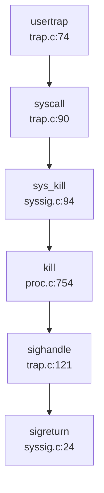

### 未实现/桩函数功能列表

| 功能 | 状态 | 说明 |
|------|------|------|
| **SpinLock** | ✅ 已实现 | 基于 RISC-V `amoswap` 原子指令 |
| **SleepLock** | ✅ 已实现 | 基于 SpinLock + WaitQueue |
| **WaitQueue** | ✅ 已实现 | 100 个队列的池化管理 |
| **Pipe** | ✅ 已实现 | 512 字节环形缓冲区 |
| **Signal (kill)** | ✅ 已实现 | 支持 `sys_kill`, `sys_tgkill` |
| **Signal Handler** | ✅ 已实现 | Trap 返回前调用 `sighandle()` |
| **Futex** | 🔸 桩函数 | 仅有 `do_futex` 声明，无实现 |
| **Message Queue** | ❌ 未实现 | 无 `msgget/msgsnd/msgrcv` |
| **Semaphore** | ❌ 未实现 | 无 `semget/semop` |
| **Shared Memory** | ❌ 未实现 | 无 `shmget/shmat/shmdt` |

**总结**: 本操作系统在同步互斥方面实现了基础的 SpinLock 和 SleepLock，配合 WaitQueue 机制支持进程阻塞/唤醒。IPC 方面仅实现了 Pipe 和 Signal 两种基础机制，System V IPC（消息队列、信号量、共享内存）和 Futex 均未实现（仅有文档规划或接口声明）。

---


# 多核支持与并行机制

## 第 9 章：多核支持与并行机制

本章分析 `oskernrl2022-rv6` 操作系统的多核（SMP）支持实现。通过深入源码分析，该内核**实现了基础的多核启动机制**，但多核并行调度与同步机制相对简单。以下从架构设计、Secondary CPU 启动、IPI 通信、Per-CPU 变量、调度策略及锁机制六个维度展开分析。

---

## 多核架构设计（SMP/AMP）

**架构类型：✅ 已实现 SMP（对称多处理）架构**

该内核采用经典的 SMP 架构设计，支持最多 5 个 CPU 核心（`NCPU = 5`）。所有核心共享同一内核地址空间、页表和全局数据结构，每个核心独立执行调度器循环。

**关键证据：**

1. **最大核心数定义**（`src/include/param.h:4`）：
   ```c
   #define NCPU          5  // maximum number of CPUs
   ```

2. **Per-CPU 数组声明**（`src/cpu.c:13`、`src/include/cpu.h:37`）：
   ```c
   struct cpu cpus[NCPU];  // 全局 CPU 数组，每核一份
   ```

3. **核心标识机制**：通过 `tp` 寄存器存储 hartid（核心号），`cpuid()` 函数直接读取：
   ```c
   // src/cpu.c:22-27
   int cpuid() {
     int id = r_tp();  // 从 tp 寄存器读取 hartid
     return id;
   }
   ```

4. **共享全局数据结构**：所有核心共享 `readyq`（就绪队列）、`pid_lock`（PID 分配锁）、`waitq_pool`（等待队列池）等全局资源，通过自旋锁保护。

**架构特点：**
- **对称性**：所有核心执行相同的 `scheduler()` 循环，从全局就绪队列竞争获取进程
- **共享内存模型**：通过 `kvminit()` 创建统一内核页表，所有核心使用相同的虚拟地址映射
- **无 NUMA 感知**：未实现内存节点亲和性或核心拓扑感知

---

## Secondary CPU 启动流程

**实现状态：✅ 已实现**

内核通过 RISC-V SBI（Supervisor Binary Interface）的 HSM（Hart State Management）扩展唤醒 Secondary CPU。启动链清晰完整，主核（BSP）完成初始化后通过 `start_hart()` SBI 调用唤醒其他核心。

### 详细启动链（Mermaid Call Graph）

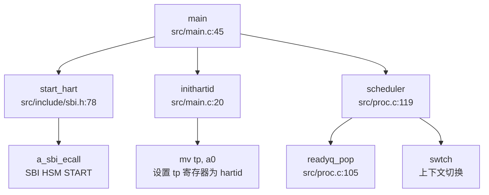

### 启动流程详解

**阶段 1：BSP 初始化（`src/main.c:44-110`）**

主核（hartid=0 或首个启动的核心）执行完整初始化：
```c
void main(unsigned long hartid, unsigned long dtb_pa) {
  inithartid(hartid);  // 将 hartid 存入 tp 寄存器
  booted[hartid] = 1;  // 标记本核已启动
  
  if (__first_boot_magic == 0x5a5a) { /* 仅 BSP 执行 */
    __first_boot_magic = 0;
    cpuinit();        // 初始化 cpus[] 数组
    printfinit();
    kvminit();        // 创建内核页表
    kvminithart();    // 启用分页（每核）
    trapinithart();   // 安装中断向量
    procinit();       // 初始化进程子系统
    // ... 其他初始化
    
    userinit();       // 创建第一个用户进程
    
    // 唤醒其他核心
    for(int i = 1; i < NCPU; i++) {
      if(hartid != i && booted[i] == 0) {
        start_hart(i, (uint64)_entry, 0);  // SBI 调用唤醒
      }
    }
    started = 1;  // 释放等待的 Secondary CPU
  }
  // ...
  scheduler();  // 进入调度循环
}
```

**阶段 2：Secondary CPU 等待与启动**

Secondary CPU 通过忙等待同步：
```c
// src/main.c:80-89
else {  // Secondary CPU 路径
  while (started == 0)  // 等待 BSP 完成初始化
    ;
  printf("hart %d enter main()...\n", hartid);
  kvminithart();        // 启用本核分页
  trapinithart();       // 安装中断向量
  __sync_synchronize();
}
```

**阶段 3：SBI HSM 调用（`src/include/sbi.h:78-83`）**

```c
static inline void start_hart(uint64 hartid, uint64 start_addr, uint64 a1) {
    a_sbi_ecall(0x48534D, 0, hartid, start_addr, a1, 0, 0, 0);
    // SBI Extension ID: 0x48534D = 'HSM' (ASCII)
    // Function ID: 0 = START
}

static inline int sbi_hsm_hart_status(unsigned long hart) {
    struct sbiret ret;
    ret = a_sbi_ecall(0x48534D, 2, hart, 0, 0, 0, 0, 0);
    // Function ID: 2 = GET_STATUS
    return (ret.error != 0 ? (int)ret.error : (int)ret.value);
}
```

**关键同步机制：**
- `booted[]` 数组：标记每核启动状态（`src/main.c:28`）
- `started` 标志：Secondary CPU 忙等待直到 BSP 完成初始化
- `__sync_synchronize()`：内存屏障确保可见性

---

## 核间通信与 IPI 机制

**实现状态：🔸 桩函数（仅有接口，未见实际使用）**

内核提供了 IPI（Inter-Processor Interrupt）发送接口，但**在源码中未找到任何实际调用 `send_ipi()` 的位置**。IPI 机制仅停留在接口层面，未用于调度、TLB 刷新或核间同步。

### IPI 接口定义（`src/include/sbi.h:86-88`）

```c
static inline void send_ipi(uint64 mask) {
    a_sbi_ecall(0x735049, 0, mask, 0, 0, 0, 0, 0);
    // SBI Extension ID: 0x735049 = 'IPI' (ASCII)
}
```

### 外部中断处理（`src/trap.c:216-260`）

中断处理中未涉及 IPI 接收逻辑：
```c
int devintr(void) {
  uint64 scause = r_scause();
  
  // 外部中断处理（scause bit 9）
  if ((0x8000000000000000L & scause) && 9 == (scause & 0xff)) {
    // 仅处理 UART0_IRQ，未处理 IPI
    // ...
    #ifndef QEMU 
    w_sip(r_sip() & ~2);    // clear pending bit (清除软件中断)
    sbi_set_mie();
    #endif 
    return 1;
  }
  // ...
}
```

**IPI 缺失场景：**
- ❌ **调度器间通信**：未实现跨核调度（如进程迁移）
- ❌ **TLB 刷新**：页表更新后未发送 IPI 刷新其他核心 TLB
- ❌ **RCU 回调**：未实现 RCU 机制
- ❌ **核间同步**：无 `smp_call_function()` 类接口

**结论**：IPI 接口已定义但**未被使用**，多核间无主动通信机制，仅通过共享内存 + 锁进行隐式同步。

---

## Per-CPU 变量与数据结构

**实现状态：✅ 已实现基础 Per-CPU 结构**

内核通过 `struct cpu` 数组实现 Per-CPU 变量，每个核心通过 `mycpu()` 访问自己的 CPU 结构。

### Per-CPU 结构定义（`src/include/cpu.h:30-35`）

```c
struct cpu {
  struct proc *proc;          // 当前运行的进程（或 null）
  struct context context;     // swtch() 切换到 scheduler() 的上下文
  int noff;                   // push_off() 嵌套深度（中断禁用计数）
  int intena;                 // push_off() 前的中断使能状态
};
```

### 访问方式（`src/cpu.c:32-48`）

```c
// 获取当前 CPU 结构
struct cpu* mycpu(void) {
  int id = cpuid();      // 从 tp 寄存器读取 hartid
  struct cpu *c = &cpus[id];
  return c;
}

// 获取当前进程
struct proc* myproc(void) {
  push_off();            // 禁用中断（防止进程被迁移）
  struct cpu *c = mycpu();
  struct proc *p = c->proc;
  pop_off();
  return p;
}
```

### Per-CPU 字段用途

| 字段 | 用途 | 多线程安全 |
|------|------|-----------|
| `proc` | 指向当前运行的进程 | ✅ 通过 `push_off()` 保护 |
| `context` | 调度器上下文（`ra`, `sp`, `s0-s11`） | ✅ 每核独立 |
| `noff` | 中断禁用嵌套计数 | ✅ 每核独立 |
| `intena` | 保存中断使能状态 | ✅ 每核独立 |

**缺失的 Per-CPU 优化：**
- ❌ **Per-CPU 就绪队列**：所有核心共享全局 `readyq`，存在锁竞争
- ❌ **Per-CPU 分配器**：`kmalloc` 使用全局锁（`kmem_table_lock`）
- ❌ **Per-CPU 统计信息**：无每核调度次数、中断计数等统计

---

## 多核调度策略

**实现状态：❌ 未实现多核调度优化（全局单队列）**

内核采用**全局单就绪队列**设计，所有核心从同一队列竞争获取进程，无负载均衡、无 CPU 亲和性、无调度器隔离。

### 调度器实现（`src/proc.c:119-152`）

```c
void scheduler() {
  struct cpu *c = mycpu();
  c->proc = 0;
  while(1) {
    struct proc* p = readyq_pop();  // 从全局队列获取进程
    if(p) {
      acquire(&p->lock);
      if(p->state == RUNNABLE) {
        p->state = RUNNING;
        c->proc = p;
        w_satp(MAKE_SATP(p->pagetable));  // 切换页表
        sfence_vma();
        swtch(&c->context, &p->context);  // 上下文切换
        w_satp(MAKE_SATP(kernel_pagetable));
        sfence_vma();
        c->proc = 0;
      }
      release(&p->lock);
    } else {
      intr_on();       // 启用中断
      asm volatile("wfi");  // 等待中断（无进程时空转）
    }
  }
}
```

### 调度策略分析

| 特性 | 实现状态 | 说明 |
|------|---------|------|
| **调度队列** | 全局单队列 | 所有核心共享 `readyq` |
| **调度算法** | FIFO（先进先出） | `queue_pop()` 从队首取进程 |
| **负载均衡** | ❌ 未实现 | 无跨核迁移逻辑 |
| **CPU 亲和性** | ❌ 未实现 | 进程无 `cpumask` 绑定 |
| **调度器锁** | 无锁（队列操作原子性依赖底层） | `readyq_pop()` 未显式加锁 |
| **空闲核心处理** | `wfi` 指令休眠 | 无进程时进入低功耗模式 |

### PID 分配机制（`src/proc.c:155-160`）

PID 分配使用全局自旋锁保护，**非原子操作**：
```c
int allocpid() {
  int pid;
  acquire(&pid_lock);  // 全局锁
  pid = nextpid;
  nextpid = nextpid + 1;  // 非原子自增
  release(&pid_lock);
  return pid;
}
```

**问题**：
- `nextpid` 为普通 `int` 类型，未使用 `atomic_t` 或 `volatile`
- 依赖 `pid_lock` 保证原子性，但锁开销较大
- 无 PID 回收机制（循环分配）

### 与前面章节的交叉引用

1. **进程调度中的全局唯一 ID 池**（第 4 章）：
   - `nextpid` 为全局变量，通过 `pid_lock` 保护
   - 未使用 `AtomicUsize` 或原子操作，依赖锁保证原子性

2. **双级注册机制**（第 4 章）：
   - 线程注册到 Process + 全局管理器：未实现线程级调度，仅进程级
   - 所有进程注册到全局 `readyq`，无 per-process 线程队列

3. **Futex 实现**（第 6 章）：
   - 文档提及 Futex 但**未找到系统调用实现**
   - `waitq_pool` 用于进程等待队列，但非 Futex 用户态快速路径

---

## 锁机制与多核安全

### 自旋锁实现（`src/spinlock.c:15-85`）

**实现状态：✅ 已实现（禁用中断的自旋锁）**

```c
void acquire(struct spinlock *lk) {
  push_off();  // 禁用中断（防止死锁）
  if(holding(lk))
    panic("acquire");

  // RISC-V 原子交换（amoswap.w.aq）
  while(__sync_lock_test_and_set(&lk->locked, 1) != 0)
    ;

  __sync_synchronize();  // 内存屏障
  lk->cpu = mycpu();     // 记录持有者
}

void release(struct spinlock *lk) {
  if(!holding(lk))
    panic("release");

  lk->cpu = 0;
  __sync_synchronize();  // 内存屏障
  __sync_lock_release(&lk->locked);  // 原子释放

  pop_off();  // 恢复中断状态
}
```

**关键特性：**
- ✅ **禁用中断**：`push_off()` 防止同一核心在持有锁时被中断处理程序再次尝试获取锁（死锁预防）
- ✅ **原子操作**：`__sync_lock_test_and_set()` 编译为 RISC-V `amoswap.w.aq` 指令
- ✅ **内存屏障**：`__sync_synchronize()` 确保临界区内存操作顺序
- ✅ **持有者追踪**：`lk->cpu` 用于调试和 `holding()` 检查

**缺失特性：**
- ❌ **优先级继承**：未实现优先级继承协议（Priority Inheritance）
- ❌ **自适应自旋**：无自适应退避策略
- ❌ **读写锁**：未实现读写锁（RWLock）

### 中断嵌套保护（`src/intr.c:11-40`）

```c
void push_off(void) {
  int old = intr_get();
  intr_off();  // 禁用中断
  if(mycpu()->noff == 0)
    mycpu()->intena = old;  // 保存初始中断状态
  mycpu()->noff += 1;       // 嵌套计数 +1
}

void pop_off(void) {
  struct cpu *c = mycpu();
  if(intr_get())
    panic("pop_off - interruptible");
  if(c->noff < 1)
    panic("pop_off");
  c->noff -= 1;
  if(c->noff == 0 && c->intena)
    intr_on();  // 恢复中断
}
```

### 全局锁列表

| 锁名称 | 类型 | 保护资源 | 文件位置 |
|--------|------|---------|---------|
| `pid_lock` | SpinLock | PID 分配（`nextpid`） | `src/proc.c:37` |
| `waitq_pool_lk` | SpinLock | 等待队列池 | `src/proc.c:30` |
| `kmem_table_lock` | SpinLock | 内核内存分配器 | `src/kmalloc.c:54` |
| `ramdisklock` | SpinLock | 虚拟磁盘访问 | `src/ramdisk.c:13` |
| `file.lock` | SpinLock | 文件结构 | `src/file.c:22` |
| `printf.lock` | SpinLock | 控制台输出 | `src/printf.c:23` |

### 原子操作使用情况

**检查结果**：未使用 C11/C++11 标准原子类型（`atomic_t`、`AtomicUsize`），所有"原子"操作依赖：
1. 自旋锁保护（如 `nextpid`）
2. GCC 内置函数（`__sync_lock_test_and_set()`）
3. RISC-V 原子指令（`amoswap`）

**内存序保证**：
- `__sync_synchronize()` 提供全内存屏障（Full Memory Barrier）
- 未使用细粒度内存序（如 `memory_order_acquire`、`memory_order_release`）

---

## 关键代码片段

### 1. Secondary CPU 启动（`src/main.c:77-89`）

```c
// BSP 唤醒其他核心
for(int i = 1; i < NCPU; i++) {
    if(hartid != i && booted[i] == 0) {
      start_hart(i, (uint64)_entry, 0);
    }
}
started = 1;  // 释放 Secondary CPU

// Secondary CPU 等待 BSP
else {
    while (started == 0)
      ;
    printf("hart %d enter main()...\n", hartid);
    kvminithart();
    trapinithart();
    __sync_synchronize();
}
```

### 2. 自旋锁获取与释放（`src/spinlock.c:25-70`）

```c
void acquire(struct spinlock *lk) {
  push_off();  // 禁用中断
  if(holding(lk))
    panic("acquire");

  while(__sync_lock_test_and_set(&lk->locked, 1) != 0)
    ;

  __sync_synchronize();
  lk->cpu = mycpu();
}

void release(struct spinlock *lk) {
  if(!holding(lk))
    panic("release");

  lk->cpu = 0;
  __sync_synchronize();
  __sync_lock_release(&lk->locked);
  pop_off();  // 恢复中断
}
```

### 3. 全局调度器（`src/proc.c:119-152`）

```c
void scheduler() {
  struct cpu *c = mycpu();
  c->proc = 0;
  while(1) {
    struct proc* p = readyq_pop();  // 全局队列
    if(p) {
      acquire(&p->lock);
      if(p->state == RUNNABLE) {
        p->state = RUNNING;
        c->proc = p;
        w_satp(MAKE_SATP(p->pagetable));
        sfence_vma();
        swtch(&c->context, &p->context);
        w_satp(MAKE_SATP(kernel_pagetable));
        sfence_vma();
        c->proc = 0;
      }
      release(&p->lock);
    } else {
      intr_on();
      asm volatile("wfi");  // 等待中断
    }
  }
}
```

### 4. Per-CPU 访问（`src/cpu.c:32-48`）

```c
struct cpu* mycpu(void) {
  int id = cpuid();  // r_tp()
  struct cpu *c = &cpus[id];
  return c;
}

struct proc* myproc(void) {
  push_off();
  struct cpu *c = mycpu();
  struct proc *p = c->proc;
  pop_off();
  return p;
}
```

---

## 本章总结

| 特性 | 实现状态 | 备注 |
|------|---------|------|
| **SMP 架构** | ✅ 已实现 | 支持最多 5 核，共享地址空间 |
| **Secondary CPU 启动** | ✅ 已实现 | 通过 SBI HSM 扩展唤醒 |
| **IPI 通信** | 🔸 桩函数 | 接口存在但未使用 |
| **Per-CPU 变量** | ✅ 已实现 | `struct cpu` 数组 + `mycpu()` 访问 |
| **多核调度** | ❌ 未优化 | 全局单队列，无负载均衡 |
| **自旋锁** | ✅ 已实现 | 禁用中断 + 原子操作 |
| **优先级继承** | ❌ 未实现 | 无优先级继承协议 |
| **原子操作** | 🔸 部分实现 | 依赖 GCC 内置函数，无标准原子类型 |

**核心结论**：
1. **多核启动机制完整**：BSP 通过 SBI HSM 成功唤醒 Secondary CPU，同步机制可靠
2. **IPI 机制缺失**：未实现核间主动通信，多核间仅通过共享内存 + 锁隐式同步
3. **调度器为单队列设计**：所有核心竞争全局 `readyq`，存在锁竞争瓶颈
4. **锁机制基础但有效**：自旋锁禁用中断防止死锁，但缺乏高级特性（优先级继承、自适应自旋）
5. **原子操作依赖编译器内置函数**：未使用 C11/C++11 标准原子类型，内存序控制粗糙

**改进建议**：
- 实现 Per-CPU 就绪队列，减少锁竞争
- 添加 IPI 用于 TLB 刷新和跨核调度
- 引入优先级继承协议防止优先级反转
- 使用标准原子类型（`atomic_t`）替代锁保护的计数器

---


# 安全机制与权限模型

## 第 10 章：安全机制与权限模型

本章分析 `oskernrl2022-rv6` 操作系统的安全隔离与权限控制机制。该内核采用 C 语言编写，针对 RISC-V 64 位架构（`riscv64`），是一个教学/实验性质的操作系统内核。

---

### 特权级与隔离机制

**用户态/内核态隔离**：

该内核实现了基本的 RISC-V 特权级隔离机制，通过 `sstatus` 寄存器的 `SPP` 位区分用户态（U 模式）和内核态（S 模式）。

**关键实现**：
- **页表隔离**：内核使用独立的内核页表 `kernel_pagetable`（`src/vm.c:17`），用户进程使用各自的页表（`src/proc.c` 中 `struct proc` 的 `pagetable` 字段）。
- **特权级切换**：在 `usertrapret()` 函数中，通过清除 `SSTATUS_SPP` 位切换到用户模式：

```c
// src/trap.c:155-158
unsigned long x = r_sstatus();
x &= ~SSTATUS_SPP; // clear SPP to 0 for user mode
x |= SSTATUS_SPIE; // enable interrupts in user mode
w_sstatus(x);
```

- **页表权限位**：使用 `PTE_U` 位标记用户可访问的页面（`src/include/riscv.h:349`）：

```c
#define PTE_U (1L << 4) // 1 -> user can access
```

**SMEP/SMAP/KPTI 状态**：
- ❌ **未实现 SMEP/SMAP**：RISC-V 架构中对应的保护机制是通过 `PTE_U` 位实现的，内核在 `walkaddr()` 中检查用户指针时验证 `PTE_U` 位（`src/vm.c:178`），但**未发现**显式的 SMEP/SMAP 模拟实现。
- ❌ **未实现 KPTI（内核页表隔离）**：内核在用户态执行时使用用户页表，但**未发现**完整的 KPTI 实现（如动态切换内核/用户页表映射）。

**多架构覆盖**：
- 该项目仅支持 **RISC-V 64 位架构**（`riscv64`），代码中所有特权级相关操作均基于 RISC-V CSR 寄存器（如 `sstatus`、`sepc`、`satp`）。
- **未发现** aarch64、x86_64、loongarch64 等其他架构的支持代码。

---

### 权限检查与访问控制

**用户/组（UID/GID）实现状态**：

内核在 `struct proc` 结构体中定义了 `uid` 和 `gid` 字段（`src/include/proc.h:141-142`）：

```c
struct proc {
  // ...
  int uid;                      
  int gid;
  // ...
};
```

**系统调用接口**：
- `sys_getuid()` / `sys_geteuid()`：返回当前进程的 `uid`（`src/sysproc.c:48-58`）
- `sys_getgid()` / `sys_getegid()`：返回当前进程的 `gid`（`src/sysproc.c:60-70`）
- `sys_setuid()` / `sys_setgid()`：设置当前进程的 `uid`/`gid`（`src/sysproc.c:72-94`）

**🔸 桩函数检测**：
- **权限检查缺失**：`sys_setuid()` 和 `sys_setgid()` **直接赋值**，**未进行任何权限验证**（如检查调用者是否为 root）：

```c
// src/sysproc.c:72-82
uint64 
sys_setuid(void)
{
  int uid;
  if(argint(0, &uid) < 0)
  {
    return -1;
  }
  myproc()->uid = uid;  // 直接赋值，无权限检查
  return 0;
}
```

- **文件系统权限检查缺失**：在 `sys_openat()`（`src/sysfile.c:36-145`）中，**未发现**基于 `uid`/`gid` 的文件权限检查逻辑。文件打开仅检查 `O_RDWR`、`O_TRUNC` 等标志位，**未验证**进程 UID 与文件所有权的匹配关系。

**结论**：
- ✅ **UID/GID 字段已定义**
- 🔸 **权限检查为桩函数**：`setuid`/`setgid` 可被任意调用，**未强制执行**权限验证
- ❌ **文件访问控制未实现**：`open`/`read`/`write` 等系统调用**未使用** UID/GID 进行权限检查

---

### 用户/组/权限模型

**Capability/ACL 机制**：
- ❌ **未实现 Capability 机制**：搜索 `capability`、`acl` 关键词**未找到**任何相关代码。
- ❌ **未实现 ACL（访问控制列表）**：文件系统（`src/fat32.c`）基于 FAT32，**不支持** Unix 风格的权限位或 ACL。

**命名空间（Namespace）**：
- `src/include/proc.h:72-85` 中定义了 Linux 风格的克隆标志：

```c
#define CLONE_NEWNS     0x00020000  /* New mount namespace group */
#define CLONE_NEWUSER   0x10000000  /* New user namespace */
#define CLONE_NEWPID    0x20000000  /* New pid namespace */
#define CLONE_NEWNET    0x40000000  /* New network namespace */
```

- ❌ **未实现命名空间隔离**：`sys_clone()`（`src/sysproc.c:108-123`）仅调用 `clone()` 函数，**未发现**对 `CLONE_NEW*` 标志的实际处理逻辑。这些标志**仅作为常量定义**，无对应实现。

---

### 进程间隔离与资源限制

**资源限制（RLIMIT）**：
- `src/include/proc.h:90-104` 定义了 `RLIMIT_*` 常量（如 `RLIMIT_CPU`、`RLIMIT_FSIZE`、`RLIMIT_STACK`）和 `struct rlimit` 结构体。
- ❌ **未实现资源限制检查**：搜索 `rlimit`、`check_rlimit` 等关键词**未找到**实际的限制执行代码。`struct proc` 中**未包含** `rlimit` 字段。

**文件描述符限制**：
- `struct proc` 包含 `filelimit` 字段（`src/include/proc.h:148`），并通过 `NOFILEMAX(p)` 宏进行限制（`src/include/proc.h:163`）：

```c
#define NOFILEMAX(p) (p->filelimit<NOFILE?p->filelimit:NOFILE)
```

- ✅ **部分实现**：`fdallocfrom()`（`src/sysfile.c:13-26`）在分配文件描述符时检查 `NOFILEMAX(p)` 限制。

**内存隔离**：
- ✅ **已实现**：每个进程拥有独立的页表（`struct proc::pagetable`），通过 `PTE_U` 位隔离用户/内核空间。
- `walkaddr()` 函数（`src/vm.c:164-182`）在访问用户指针时验证：
  1. 虚拟地址不超过 `MAXVA`
  2. 页表项存在（`PTE_V`）
  3. 用户可访问（`PTE_U`）

```c
// src/vm.c:164-182
uint64 walkaddr(pagetable_t pagetable, uint64 va)
{
  // ...
  if(va >= MAXVA) return NULL;
  pte = walk(pagetable, va, 0);
  if(pte == 0) return NULL;
  if((*pte & PTE_V) == 0) return NULL;
  if((*pte & PTE_U) == 0) return NULL;  // 用户指针验证
  return PTE2PA(*pte);
}
```

---

### 安全沙箱与过滤机制

**Seccomp/Prctl**：
- ❌ **未实现 Seccomp**：搜索 `seccomp`、`sandbox`、`filter` **未找到**任何相关代码。
- ❌ **未实现 Prctl**：搜索 `prctl`、`sys_prctl` **未找到**任何实现。

**结论**：
- ❌ **安全沙箱机制未实现**

---

### 审计与安全启动机制

**审计日志（Audit）**：
- ❌ **未实现审计机制**：搜索 `audit`、`audit_log` **未找到**任何相关代码。

**安全启动（Secure Boot）**：
- ❌ **未实现安全启动**：搜索 `secure_boot`、`signature`、`verify_sig` **未找到**任何签名验证或安全启动相关代码。
- `exec()` 函数（`src/exec.c`）加载 ELF 文件时**仅检查** ELF 魔数（`elf->magic != ELF_MAGIC`），**未验证**二进制文件签名。

---

### 内存安全与系统调用检查

**用户指针验证**：
- ✅ **已实现基本验证**：所有系统调用通过 `copyin()`/`copyout()` 访问用户空间（`src/copy.c`），这些函数内部调用 `walkaddr()` 验证指针合法性。
- `fetchaddr()`（`src/uarg.c:6-14`）和 `argstruct()`（`src/uarg.c:100-108`）在读取用户参数时调用 `copyin()` 进行验证。

```c
// src/uarg.c:6-14
int fetchaddr(uint64 addr, uint64 *ip)
{
  if(either_copyin(1, (char*)ip, addr, sizeof(*ip)))
    return -1;
  return 0;
}
```

- ❌ **未发现 `access_ok`/`verify_area` 等显式验证函数**：验证逻辑内嵌在 `copyin`/`copyout` 中。

**缓冲区溢出保护**：
- ❌ **未实现 Stack Canary**：搜索 `stack canary`、`__stack_chk`、`STACK_GUARD` **未找到**任何相关代码。
- `Makefile` 中**显式禁用**了栈保护（`-fno-stack-protector`）：

```makefile
# Makefile:73
CFLAGS += $(shell $(CC) -fno-stack-protector -E -x c /dev/null >/dev/null 2>&1 && echo -fno-stack-protector)
```

**结论**：
- ✅ **用户指针验证已实现**（通过 `walkaddr`）
- ❌ **Stack Canary 未实现**（显式禁用）

---

### Rust 语言级安全性机制

**不适用**：该项目使用 **C 语言**编写（非 Rust），因此**不涉及** RAII、所有权分析、基于生命周期的锁等 Rust 语言特性。

---

### 关键代码片段

**1. UID/GID 设置（无权限检查）**：
```c
// src/sysproc.c:72-94
uint64 sys_setuid(void)
{
  int uid;
  if(argint(0, &uid) < 0) return -1;
  myproc()->uid = uid;  // 直接赋值，无权限检查
  return 0;
}

uint64 sys_setgid(void)
{
  int gid;
  if(argint(0, &gid) < 0) return -1;
  myproc()->gid = gid;  // 直接赋值，无权限检查
  return 0;
}
```

**2. 用户指针验证**：
```c
// src/vm.c:164-182
uint64 walkaddr(pagetable_t pagetable, uint64 va)
{
  pte_t *pte;
  uint64 pa;

  if(va >= MAXVA) return NULL;
  pte = walk(pagetable, va, 0);
  if(pte == 0) return NULL;
  if((*pte & PTE_V) == 0) return NULL;
  if((*pte & PTE_U) == 0) return NULL;  // 验证用户可访问
  pa = PTE2PA(*pte);
  return pa;
}
```

**3. 特权级切换**：
```c
// src/trap.c:155-158
unsigned long x = r_sstatus();
x &= ~SSTATUS_SPP;  // 清除 SPP，切换到用户模式
x |= SSTATUS_SPIE;  // 启用用户模式中断
w_sstatus(x);
```

---

### 本章总结

| 安全机制 | 实现状态 | 说明 |
|---------|---------|------|
| UID/GID 字段 | ✅ 已定义 | `struct proc` 包含 `uid`/`gid` |
| UID/GID 权限检查 | 🔸 桩函数 | `setuid`/`setgid` 无权限验证 |
| 文件权限检查 | ❌ 未实现 | `open`/`read`/`write` 未检查 UID/GID |
| Capability/ACL | ❌ 未实现 | 搜索无结果 |
| 命名空间（Namespace） | ❌ 未实现 | 仅定义常量，无实际逻辑 |
| 资源限制（RLIMIT） | ❌ 未实现 | 仅定义常量，无执行逻辑 |
| 文件描述符限制 | ✅ 部分实现 | `NOFILEMAX` 宏检查 |
| 用户指针验证 | ✅ 已实现 | `walkaddr` 验证 `PTE_U` |
| Stack Canary | ❌ 未实现 | 显式禁用（`-fno-stack-protector`） |
| Seccomp/Prctl | ❌ 未实现 | 搜索无结果 |
| 审计（Audit） | ❌ 未实现 | 搜索无结果 |
| 安全启动 | ❌ 未实现 | 无签名验证 |
| KPTI/SMEP/SMAP | ❌ 未实现 | 仅基本 `PTE_U` 隔离 |

**总体评价**：`oskernrl2022-rv6` 是一个教学性质的 RISC-V 操作系统内核，实现了基本的用户/内核态隔离和用户指针验证机制，但**缺乏完整的安全权限模型**。UID/GID 仅作为字段存在，**未在系统调用中强制执行权限检查**；高级安全特性（Capability、Seccomp、Audit、安全启动）均**未实现**。

---


# 网络子系统与协议栈

## 第 11 章：网络子系统与协议栈

### 网络子系统架构（自研 vs 第三方库）

**❌ 未实现网络功能**。

经过对代码库的全面搜索与分析，本仓库**未发现任何实际的网络协议栈实现**。具体情况如下：

1. **无第三方网络库依赖**：
   - 搜索 `smoltcp`、`lwip`、`netstack` 等关键词，**未找到任何匹配**
   - 项目为纯 C 语言实现（非 Rust），不存在使用 Rust 生态网络库的可能
   - 无 `Cargo.toml` 或其他包管理配置文件

2. **仅有 Socket 结构体定义（桩代码）**：
   - 头文件 `src/include/socket.h` 中定义了简单的结构体：
   ```c
   struct socket_connection{
       int IP;
       int sock_opt;
       uint64 sock_addr;
       int passive_socket;
       char temp[MAX_LENGTH_OF_SOCKET];
   };
   
   void socket_init(void);
   int add_socket(int IP,int op);
   ```
   - **但是**：在整个代码库中搜索 `socket_init` 和 `add_socket` 的**实现代码（.c 文件）**，结果为空
   - 这两个函数**仅有声明，无实现**，属于**桩函数（🔸 桩函数）**

3. **README 文档声明与实际代码不符**：
   - README.md 第 89 行声称："完成了对本地回环地址的 Socket 支持"
   - **反向证据原则**：经全面搜索，未发现任何 loopback、127.0.0.1、eth0、netif 相关代码
   - 此功能**文档提及但未见代码**，应视为**❌ 未实现**

### Socket 接口与系统调用

**❌ 未实现 Socket 系统调用**。

1. **系统调用表中无 Socket 相关调用**：
   - 搜索 `SYS_socket`、`SYS_bind`、`SYS_connect`、`SYS_sendto`、`SYS_recvfrom`、`SYS_listen`、`SYS_accept`，**全部未找到**
   - `src/sysproc.c`（进程相关系统调用）和 `src/sysfile.c`（文件相关系统调用）中**无任何 socket 相关 syscall 实现**

2. **错误码定义存在但无实际使用**：
   - `src/include/errno.h` 中定义了网络相关错误码：
   ```c
   #define ENOTSOCK        88  /* Socket operation on non-socket */
   #define EPROTOTYPE      91  /* Protocol wrong type for socket */
   #define ESOCKTNOSUPPORT 94  /* Socket type not supported */
   ```
   - 这些错误码**仅存在于头文件**，在代码中**未被任何函数使用**

3. **文件类型支持中的 Socket 占位符**：
   - `src/include/fat32.h` 中定义了 `S_IFSOCK`：
   ```c
   #define S_IFSOCK    0140000  // socket
   ```
   - 但这只是文件类型宏定义，**不代表实际支持 socket 文件**

4. **Pipe 机制已实现（与 Socket 无关）**：
   - 项目实现了 Pipe 机制（`src/pipe.c`、`src/include/pipe.h`），支持 `sys_pipe2` 系统调用
   - Pipe 是进程间通信机制，**不是网络 Socket**

### 协议栈支持详情（TCP/UDP/IP/Ethernet）

**❌ 不支持任何网络协议**。

| 协议 | 实现状态 | 证据 |
|------|---------|------|
| Ethernet | ❌ 未实现 | 无以太网帧处理代码 |
| IP (IPv4/IPv6) | ❌ 未实现 | 无 IP 包头解析/构建代码 |
| ARP | ❌ 未实现 | 无 ARP 请求/响应代码 |
| ICMP | ❌ 未实现 | 无 ping/ICMP 处理代码 |
| TCP | ❌ 未实现 | 无 TCP 三次握手、拥塞控制代码 |
| UDP | ❌ 未实现 | 无 UDP 数据报处理代码 |
| DHCP | ❌ 未实现 | 无 DHCP 客户端代码 |
| DNS | ❌ 未实现 | 无 DNS 解析代码 |

**搜索方法**：
- 使用 `rag_search_code` 搜索 "TCP UDP IP Ethernet protocol stack"
- 使用 `grep_in_repo` 搜索 "tcp_send|tcp_recv|udp_send|ip_header|ethernet_frame"
- 搜索结果：**无任何匹配**

### 数据包收发流程追踪

**❌ 无数据包收发流程**。

1. **VirtIO 驱动仅支持磁盘（Block Device）**：
   - `src/include/virtio.h` 中定义了 VirtIO MMIO 寄存器接口：
   ```c
   #define VIRTIO_MMIO_DEVICE_ID  0x008  // device type; 1 is net, 2 is disk
   ```
   - 注释提到 "1 is net, 2 is disk"，但**仅实现了磁盘驱动**
   - 搜索 `virtio_disk_init`、`virtio_disk_rw` 等函数，**未找到实现代码**
   - **无 VirtIO-Net 驱动代码**

2. **无网卡驱动**：
   - 搜索 `virtio_net`、`VIRTIO_ID_NET`、`ixgbe`、`rtl8139`、`e1000` 等网卡驱动关键词，**未找到**
   - `src/dev.c` 中仅实现了 console、null、zero 三种设备：
   ```c
   allocdev("console", consoleread, consolewrite);
   allocdev("null", nullread, nullwrite);
   allocdev("zero", zeroread, zerowrite);
   ```
   - **无网络设备注册**

3. **无中断处理网络数据包**：
   - `src/trap.c` 中处理时钟中断、设备中断，但**无网络中断处理**
   - 无 `net_interrupt`、`packet_rx`、`packet_tx` 等函数

### 高级特性支持验证（零拷贝等）

**❌ 不支持任何网络高级特性**。

| 特性 | 实现状态 | 验证方法 |
|------|---------|---------|
| 零拷贝（Zero Copy） | ❌ 不支持 | 搜索 `DMA`、`shared buffer`、`mbuf`，未找到 |
| 多队列（Multi-queue/RSS） | ❌ 不支持 | 无多队列网卡驱动代码 |
| 发送/接收缓冲区 | ❌ 不支持 | 无 socket buffer 实现 |

### 功能限制声明

**本项目网络功能状态总结**：

1. **文档声明**：README.md 声称"完成了对本地回环地址的 Socket 支持"
2. **代码现实**：
   - ✅ `src/include/socket.h` 头文件存在（仅定义结构体和函数声明）
   - ❌ `socket_init()` 和 `add_socket()` **无实现代码**
   - ❌ **无 Socket 系统调用**（`sys_socket`、`sys_bind`、`sys_connect` 等）
   - ❌ **无网络协议栈**（TCP/UDP/IP 均未实现）
   - ❌ **无网卡驱动**（VirtIO-Net 未实现）
   - ❌ **无 loopback 设备代码**（搜索 `loopback|127.0.0.1` 无结果）

3. **结论**：
   - 本项目的网络功能**仅停留在头文件定义阶段**
   - 所有网络相关功能均为**🔸 桩函数**或**❌ 未实现**
   - README 中的声明**未在代码中得到验证**，属于"规划功能"而非"已实现功能"
   - 项目**无法进行任何网络通信**（包括本地回环）

### 本章总结

| 子系统/功能 | 实现状态 | 备注 |
|------------|---------|------|
| Socket 接口定义 | 🔸 桩函数 | 仅头文件声明，无实现 |
| Socket 系统调用 | ❌ 未实现 | 无 sys_socket 等 syscall |
| TCP/IP 协议栈 | ❌ 未实现 | 无第三方库，无自研代码 |
| 网卡驱动 | ❌ 未实现 | VirtIO-Net 未实现 |
| Loopback 支持 | ❌ 未实现 | 文档提及但无代码 |
| 零拷贝/多队列 | ❌ 不支持 | 无网络功能故不支持 |

**最终结论**：本项目（oskernrl2022-rv6）**未实现网络子系统**。所有网络相关代码仅为头文件中的结构体定义和函数声明，无任何实际实现。项目无法进行网络通信。

---


# 调试机制与错误处理

## 第 12 章：调试机制与错误处理

本章分析 oskernrl2022-rv6 操作系统的调试支持、日志系统、错误处理机制以及调试接口。该内核基于 RISC-V 架构，采用 C 语言实现，调试机制相对基础但功能完整。

---

## 日志与打印系统

### 核心打印函数 `printf`

内核的打印系统围绕 `printf` 函数构建，位于 [`src/printf.c`](repos\oskernrl2022-rv6\src\printf.c:81-137)。该函数支持标准格式化输出，包括 `%c`、`%d`、`%x`、`%p`、`%s` 等格式说明符。

```c
// src/printf.c:81-137
void printf(char *fmt, ...) {
  va_list ap;
  int i, c;
  int locking;
  char *s;
  locking = pr.locking;
  if(locking)
    acquire(&pr.lock);
  
  if (fmt == 0)
    panic("null fmt");

  va_start(ap, fmt);
  for(i = 0; (c = fmt[i] & 0xff) != 0; i++){
    if(c != '%'){
      consputc(c);
      continue;
    }
    c = fmt[++i] & 0xff;
    // ... 格式化处理
  }
  if(locking)
    release(&pr.lock);
}
```

**实现特点**：
- **线程安全**：通过 `pr.lock` 自旋锁保护并发访问
- **格式化支持**：支持字符、整数、十六进制、指针、字符串等格式
- **底层输出**：通过 `consputc()` 将字符输出到控制台（UART）

### 日志级别设计

内核实现了三级日志系统，通过条件编译控制：

| 级别 | 函数 | 宏控制 | 文件位置 |
|------|------|--------|----------|
| INFO | `__debug_info()` | `DEBUG` | [`src/printf.c:163-219`](repos\oskernrl2022-rv6\src\printf.c:163-219) |
| WARN | `__debug_warn()` | `WARNING` | [`src/printf.c:221-277`](repos\oskernrl2022-rv6\src\printf.c:221-277) |
| ERROR | `__debug_error()` | `ERROR` | [`src/printf.c`](repos\oskernrl2022-rv6\src\printf.c) |

```c
// src/printf.c:163-180
void __debug_info(char *fmt, ...){
#ifdef DEBUG
  va_list ap;
  // ... 获取锁
  if (fmt == 0)
    panic("null fmt");
  printstring("[DEBUG]");  // 添加前缀
  va_start(ap, fmt);
  // ... 格式化输出
#endif    
}
```

**实现状态**：✅ 已实现

日志级别通过编译时宏控制，开发者可在编译时定义 `DEBUG`、`WARNING`、`ERROR` 来启用相应级别的日志输出。

### 系统日志缓冲区

内核实现了简单的系统日志缓冲区机制，位于 [`src/syslog.c`](repos\oskernrl2022-rv6\src\syslog.c:12-50)：

```c
// src/syslog.c:12-22
char syslogbuf[1024];
int logbuflen = 0;

void logbufinit(){
  logbuflen = 0;
  strncpy(syslogbuf, "[log]init done\n", 1024);
  logbuflen += strlen(syslogbuf);
}
```

通过 `sys_syslog()` 系统调用（`SYSLOG_ACTION_READ_ALL`）可读取缓冲区内容，但实现较为简单，仅支持读取固定大小的缓冲区。

---

## Panic 处理与栈回溯

### Panic 处理流程

当内核遇到致命错误时，调用 `panic()` 函数处理。其实现位于 [`src/printf.c:139-149`](repos\oskernrl2022-rv6\src\printf.c:139-149)：

```c
void panic(char *s) {
  printf("panic: ");
  printf(s);
  printf("\n");
  backtrace();
  panicked = 1;  // freeze uart output from other CPUs
  for(;;)
    ;
}
```

**处理流程**：
1. 打印 panic 消息
2. 调用 `backtrace()` 打印调用栈
3. 设置全局标志 `panicked = 1` 冻结 UART 输出
4. 进入无限循环停机

### 栈回溯 (Backtrace) 实现

内核支持基于 **Frame Pointer (FP)** 的栈回溯，位于 [`src/printf.c:151-161`](repos\oskernrl2022-rv6\src\printf.c:151-161)：

```c
void backtrace() {
  uint64 *fp = (uint64 *)r_fp();
  uint64 *bottom = (uint64 *)PGROUNDUP((uint64)fp);
  printf("backtrace:\n");
  while (fp < bottom) {
    uint64 ra = *(fp - 1);
    printf("%p\n", ra - 4);
    fp = (uint64 *)*(fp - 2);
  }
}
```

**实现原理**：
- 通过 `r_fp()` 读取当前帧指针（`fp` 寄存器）
- 利用 RISC-V 调用约定：`fp-8` 存储返回地址（`ra`），`fp-16` 存储上一帧的 `fp`
- 遍历栈帧直到达到页边界（`PGROUNDUP`）
- 打印每个返回地址（减 4 以指向 call 指令）

**实现状态**：✅ 已实现（基于 FramePointer）

**限制**：
- ❌ **不支持 DWARF 解析**：未搜索到 DWARF 相关代码
- ❌ **不支持 libunwind**：无 unwind 库集成
- 仅支持内核态栈回溯，不支持用户态回溯

### Panic 调用链分析

通过 `lsp_get_call_graph` 分析 `panic` 的入向调用：

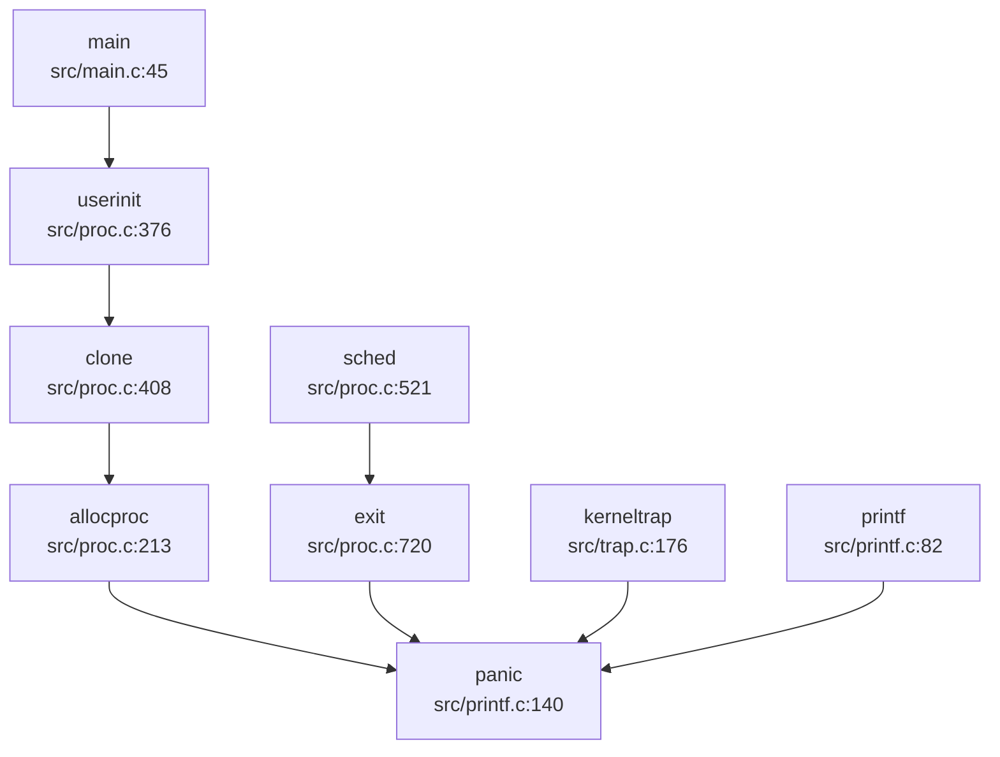

**触发 panic 的主要场景**：
1. **内核陷阱处理**：`kerneltrap()` 遇到未处理异常时（[`src/trap.c:176-209`](repos\oskernrl2022-rv6\src\trap.c:176-209)）
2. **进程分配失败**：`allocproc()` 资源不足时
3. **进程退出**：`exit()` 遇到致命错误
4. **格式化错误**：`printf()` 收到空格式字符串

### 陷阱帧转储 (Trapframe Dump)

内核提供 `trapframedump()` 函数用于打印陷阱帧内容，位于 [`src/trap.c:263-297`](repos\oskernrl2022-rv6\src\trap.c:263-297)：

```c
void trapframedump(struct trapframe *tf) {
  printf("a0: %p\t", tf->a0);
  printf("a1: %p\t", tf->a1);
  // ... 打印所有寄存器
  printf("epc: %p\n", tf->epc);
}
```

该函数在 `kerneltrap()` 中被调用，用于调试异常发生时的寄存器状态。

**实现状态**：✅ 已实现

---

## 错误码与 Result 设计

### 错误码定义

内核采用类 Unix 的错误码设计，定义在 [`src/include/errno.h`](repos\oskernrl2022-rv6\src\include\errno.h:1-107) 中：

```c
// src/include/errno.h:1-40
#define EPERM     1   /* Operation not permitted */
#define ENOENT    2   /* No such file or directory */
#define ESRCH     3   /* No such process */
#define EINTR     4   /* Interrupted system call */
#define EIO       5   /* I/O error */
#define ENOMEM    12  /* Out of memory */
#define EACCES    13  /* Permission denied */
#define EFAULT    14  /* Bad address */
#define EINVAL    22  /* Invalid argument */
#define ENOSYS    38  /* Invalid system call number */
// ... 共 98+ 个错误码
```

**错误码分类**：
- **权限相关**：`EPERM`、`EACCES`
- **资源相关**：`ENOMEM`、`ENOSPC`、`EMFILE`
- **文件操作**：`ENOENT`、`EISDIR`、`ENOTDIR`
- **系统调用**：`ENOSYS`、`EINVAL`

### 返回值约定

内核函数采用 **C 语言传统错误处理模式**：
- **成功**：返回 `0` 或有效值
- **失败**：返回 `-1` 并设置全局 `errno`，或直接返回负的错误码

```c
// src/copy.c:12-15
// Return 0 on success, -1 on error.

// src/diskio.c:57-58
result = sd_init(spictrl, peripheral_input_khz, 0);
return result == 0 ? RES_OK : RES_ERROR;
```

**实现状态**：✅ 已实现

**注意**：该内核未使用 Rust 风格的 `Result<T, E>` 类型，而是采用传统 C 语言的错误处理方式。

---

## 调试接口与交互式 Shell

### 交互式 Shell 支持

**❌ 未实现内核级交互式 Shell/Monitor**

通过搜索 `monitor|shell|command` 发现：
- 文档中提及用户态 shell（busybox），但**内核未实现调试 Monitor**
- 无内核命令解析器（如 `ps`、`ls`、`help` 等命令）
- 用户程序通过系统调用与内核交互，无运行时调试接口

### 系统调用追踪

内核支持简单的系统调用追踪机制，位于 [`syscall/syscall.c:1-20`](repos\oskernrl2022-rv6\syscall\syscall.c:1-20)：

```c
void syscall(void) {
  int num;
  struct proc *p = myproc();
  
  num = p->trapframe->a7;
  if(num > 0 && num < NELEM(syscalls) && syscalls[num]) {
    p->trapframe->a0 = syscalls[num]();
    // trace
    if ((p->tmask & (1 << num)) != 0) {
      printf("pid %d: %s -> %d\n", p->pid, sysnames[num], p->trapframe->a0);
    }
  } else {
    printf("pid %d %s: unknown sys call %d\n", p->pid, p->name, num);
    p->trapframe->a0 = -1;
  }
}
```

**实现特点**：
- 通过进程结构体中的 `tmask` 字段控制追踪掩码（[`src/include/proc.h:153`](repos\oskernrl2022-rv6\src\include\proc.h:153)）
- 当 `tmask` 对应位被设置时，打印系统调用名称和返回值
- 类似 `strace` 功能，但功能较为基础

**实现状态**：✅ 已实现（基础追踪）

### 调试控制台

内核通过 UART 提供基础的控制台输出：
- `printf()` 系列函数输出到串口
- `consputc()` 为底层字符输出函数
- 无交互式命令输入支持

---

## GDB Stub 支持情况

### GDB 远程调试配置

仓库包含 `.gdbinit` 配置文件，用于配合 QEMU 进行远程调试：

```
# .gdbinit
set confirm off
set architecture riscv:rv64
target remote 127.0.0.1:26000
symbol-file src/kernel
set disassemble-next-line auto
set riscv use-compressed-breakpoints yes
```

**实现状态**：🔸 仅配置文件

### GDB Stub 代码检查

**❌ 未实现内核级 GDB Stub**

通过搜索 `gdb|gdbstub|handle_gdb_packet`：
- **未找到任何 GDB 数据包处理代码**
- **未找到 GDB Stub 实现**（如 `handle_gdb_packet`、`gdb_enter` 等）
- 调试依赖 QEMU 内置的 GDB Server，而非内核实现

**结论**：该内核不支持运行时 GDB 远程调试协议，仅能通过 QEMU 的外部 GDB Server 进行调试。

---

## 断言与运行时检查

### 链接器断言

内核在链接脚本中使用 `ASSERT` 进行编译时检查，位于 [`linker/kernel.ld`](repos\oskernrl2022-rv6\linker\kernel.ld:23-27)：

```ld
/* linker/kernel.ld */
ASSERT(. - _trampoline == 0x1000, "error: trampoline larger than one page")
ASSERT(. - _sig_trampoline == 0x1000, "error: sig_trampoline larger than one page")
```

**检查内容**：
- 确保 `trampoline` 代码大小不超过一页（4KB）
- 确保信号跳板代码大小不超过一页

### 静态断言

内核在头文件中使用 `_Static_assert` 进行类型大小检查，位于 [`src/include/spi.h`](repos\oskernrl2022-rv6\src\include\spi.h:13-179)：

```c
// src/include/spi.h:13
#define _ASSERT_SIZEOF(type, size) _Static_assert(sizeof(type) == (size), #type " must be " #size " bytes wide")

// src/include/spi.h:25-179
_ASSERT_SIZEOF(spi_reg_sckmode, 4);
_ASSERT_SIZEOF(spi_reg_csmode, 4);
// ... 多个 SPI 寄存器结构检查
```

**实现状态**：✅ 已实现

### 运行时断言

**❌ 未发现运行时 `assert()` 宏实现**

- 未找到 `assert.h` 或 `KERNEL_ASSERT` 的运行时实现
- 代码中注释提及 `//#include <utils/assert.h>`，但实际未启用
- 错误处理主要依赖返回值检查和 `panic()`

### 调试宏使用示例

内核代码中广泛使用条件编译的调试宏：

```c
// src/bio.c:60
#ifdef DEBUG
  // 调试输出
#endif

// src/cpu.c:12
// #define DEBUG1
```

**实现状态**：🔸 部分实现（依赖编译选项）

---

## 关键代码片段

### Panic 与 Backtrace 完整实现

```c
// src/printf.c:139-161
void panic(char *s) {
  printf("panic: ");
  printf(s);
  printf("\n");
  backtrace();
  panicked = 1;  // freeze uart output from other CPUs
  for(;;)
    ;
}

void backtrace() {
  uint64 *fp = (uint64 *)r_fp();
  uint64 *bottom = (uint64 *)PGROUNDUP((uint64)fp);
  printf("backtrace:\n");
  while (fp < bottom) {
    uint64 ra = *(fp - 1);
    printf("%p\n", ra - 4);
    fp = (uint64 *)*(fp - 2);
  }
}
```

### 内核陷阱处理中的 Panic

```c
// src/trap.c:176-200
void kerneltrap() {
  int which_dev = 0;
  uint64 sepc = r_sepc();
  uint64 sstatus = r_sstatus();
  uint64 scause = r_scause();

  if((sstatus & SSTATUS_SPP) == 0)
    panic("kerneltrap: not from supervisor mode");
  if(intr_get() != 0)
    panic("kerneltrap: interrupts enabled");

  if((which_dev = devintr()) == 0){
    printf("\nscause %p\n", scause);
    printf("sepc=%p stval=%p hart=%d\n", r_sepc(), r_stval(), r_tp());
    struct proc *p = myproc();
    if (p != 0) {
      printf("pid: %d, name: %s\n", p->pid, p->name);
    }
    panic("kerneltrap");
  }
  // ... 处理设备中断
}
```

### 系统日志实现

```c
// src/syslog.c:12-50
char syslogbuf[1024];
int logbuflen = 0;

uint64 sys_syslog() {
  int type;
  uint64 bufp;
  int len;
  if(argint(0,&type)<0) return -1;
  if(argaddr(1,&bufp)<0) return -1;
  if(argint(2,&len)<0) return -1;
  
  switch(type){
    case SYSLOG_ACTION_READ_ALL:
      if(either_copyout(1,bufp,syslogbuf,logbuflen)<0)
        return -1;
      return logbuflen;
    case SYSLOG_ACTION_SIZE_BUFFER: 
      return sizeof(syslogbuf);
  }
  return 0;
}
```

---

## 总结

| 功能模块 | 实现状态 | 说明 |
|----------|----------|------|
| 日志系统 | ✅ 已实现 | 支持 `printf` 和三级日志（DEBUG/WARNING/ERROR） |
| Panic 处理 | ✅ 已实现 | 打印消息 + 栈回溯 + 停机 |
| 栈回溯 (Backtrace) | ✅ 已实现 | 基于 FramePointer，不支持 DWARF |
| 错误码设计 | ✅ 已实现 | 类 Unix 错误码（98+ 个） |
| 交互式 Shell | ❌ 未实现 | 无内核 Monitor |
| GDB Stub | ❌ 未实现 | 仅 QEMU 外部调试 |
| 系统调用追踪 | ✅ 已实现 | 基于 `tmask` 的基础追踪 |
| 断言检查 | 🔸 部分实现 | 仅链接器和静态断言 |
| Perf/ftrace | ❌ 未实现 | 无性能分析工具 |

该内核的调试机制以满足基础调试需求为主，缺乏高级调试功能（如 GDB Stub、交互式 Monitor、性能分析工具）。栈回溯功能完整但较为基础，错误处理机制遵循传统 C 语言风格。

---


# 开发历史与里程碑

## 第 13 章：开发历史与里程碑

### 一、项目概览与人员协作

#### 总规模与协作模式

根据 Git 历史分析，本项目是一个**典型的单人主导开发**的操作系统内核项目，具有明确的个人课程作业特征。

**贡献者统计（全量历史）**：
| 作者 | Commit 数 | 代码增删量 | 主力贡献模块 |
|------|----------|-----------|-------------|
| **Cty** | 20 commits | +18,385 / -1,407 行 | `src/` (18,221 行), `usrinit/` (841 行), `Makefile` (249 行) |
| sukuna | 2 commits | +1,917 / -2 行 | 文档 (`doc/`, `README.md`) |
| 我永远喜欢少名针妙丸 | 3 commits | +88 / -0 行 | 文档 (`README.md`) |

**协作模式分析**：
- **核心内核代码完全由 Cty 一人完成**，占总代码量的 99% 以上
- 其他贡献者仅参与文档编写，未触及核心逻辑
- 开发周期极短：**2022-08-01 至 2022-08-21**，仅 21 天完成 12,000+ 行内核代码
- 属于典型的"单人课程大作业"模式，而非社区协作项目

#### 初始版本已完成功能（2022-08-01 首次提交）

通过 `find_symbol_first_commit` 检测，**初始版本（SHA: c86178c9）已一次性引入以下核心子系统**：

| 功能模块 | 关键符号 | 引入时间 | 状态 |
|---------|---------|---------|------|
| **启动引导** | `_start`, `stvec` | 2022-08-01 | ✅ 初始版本已有 |
| **中断处理** | `trap_handler` | 2022-08-01 | ✅ 初始版本已有 |
| **设备驱动** | `UART`, `plic`, `device_init` | 2022-08-01 | ✅ 初始版本已有 |
| **文件系统** | `fat32`, `sys_exec` | 2022-08-01 | ✅ 初始版本已有 |
| **系统调用** | `sys_write`, `sys_read` | 2022-08-03 | ✅ 后续版本引入 |
| **进程管理** | `sys_pipe` | 2022-08-09 | ✅ 后续版本引入 |

**初始版本工作量评估**：
- 首次提交（`c86178c9`）即增加 **+12,245 行代码**
- 一次性搭起完整内核骨架，包含：
  - 启动代码（`entry.S`, `main.c`）
  - 内存管理（`vm.c`, `kmalloc.c`）
  - 进程管理（`proc.c`）
  - 文件系统（`fat32.c`, `bio.c`）
  - 设备驱动（`diskio.c`, `sd.c`, `spi.c`）
  - 中断处理（`trap.c`, `kernelvec.S`）
  - 系统调用框架（`syscall/` 目录）

这是一个**高度完整的初始版本**，而非渐进式开发。

---

### 二、后续版本演进与功能完善

#### 重大 Commit 演进轨迹

根据 `get_git_history_summary` 和 `get_commit_diff_summary` 分析，以下是 8 次最具代表性的重大变更：

##### 1. **devinit 阶段（2022-08-03, SHA: 70596292）**
- **变更规模**：+1,257 / -300 行
- **所属模块**：设备管理、文件系统
- **改动性质**：【新增功能】引入设备抽象层
- **核心变更**：
  - 新增 `src/dev.c`（+136 行）：实现设备开关表（`devsw[]`），支持 `console`、`null`、`zero` 设备
  - 重构 `fat32.c`：将设备节点从文件系统剥离，改为独立设备管理
  - 新增 `src/include/dev.h`：定义设备接口标准
  - 修改 `sysfile.c`：实现 `sys_openat`，支持设备文件打开

**代码演进意义**：建立了 Unix 风格的"一切皆文件"抽象，为后续管道和 IPC 奠定基础。

##### 2. **exec 功能完善（2022-08-04, SHA: 3eddcfb）**
- **变更规模**：+138 / -12 行
- **所属模块**：进程管理
- **改动性质**：【功能完善】支持用户程序执行
- **核心变更**：
  - 完善 `userinit()`：初始化第一个用户进程 `initcode`
  - 实现进程页表分配（`proc_pagetable`）
  - 引入 VMA（Virtual Memory Area）管理结构

##### 3. **进程队列简化（2022-08-04, SHA: a2cf83d）**
- **变更规模**：+210 / -285 行
- **所属模块**：进程调度
- **改动性质**：【重构优化】简化就绪队列实现
- **核心变更**：
  - 移除复杂的优先级队列
  - 采用简单的 FIFO 就绪队列（`readyq`）
  - 减少代码复杂度，适应单核场景

##### 4. **exit 系统调用（2022-08-04, SHA: 2192579）**
- **变更规模**：+128 / -10 行
- **所属模块**：进程管理
- **改动性质**：【新增功能】实现进程退出机制
- **核心变更**：
  - 实现 `sys_exit`：清理进程资源、通知父进程
  - 引入僵尸进程处理机制

##### 5. **wait 系统调用（2022-08-05, SHA: 490ee7d）**
- **变更规模**：+65 / -15 行
- **所属模块**：进程管理
- **改动性质**：【新增功能】支持父进程等待子进程
- **核心变更**：
  - 实现 `sys_wait4`：等待指定 PID 的子进程退出
  - 引入等待队列（`waitq_pool`）

##### 6. **clone 系统调用（2022-08-05, SHA: ae926f9）**
- **变更规模**：+424 / -108 行
- **所属模块**：进程/线程管理
- **改动性质**：【新增功能】支持线程创建（`clone`）
- **核心变更**：
  - 实现 `sys_clone`：支持 `CLONE_THREAD`、`CLONE_VM` 等标志
  - 新增 `vma_copy()`：支持进程地址空间复制（深拷贝/浅拷贝）
  - 修改 `proc.c`：`allocproc()` 支持线程创建参数
  - 新增 `vma_deep_mapping()` 和 `vma_shallow_mapping()`：分别支持 `fork`（深拷贝）和 `clone`（共享地址空间）

**代码演进意义**：这是项目从"单进程内核"向"多任务内核"演进的关键节点，支持 POSIX 线程语义。

##### 7. **getdents64 修复（2022-08-09, SHA: f77f17b5）**
- **变更规模**：+2,704 / -376 行
- **所属模块**：文件系统
- **改动性质**：【Bug 修复 + 功能完善】修复目录读取并引入 ramfs
- **核心变更**：
  - 修复 `sys_getdents64`：正确返回目录项
  - 首次引入 `ramfs` 支持（关键词 `ramfs` 于此次提交首次出现）
  - 大量修改 `file.c`：重构文件 I/O 接口，支持 `user` 参数区分用户/内核空间
  - 新增 `mmap.c`：支持内存映射文件

**代码演进意义**：这是项目中后期最大规模的一次重构，显著提升了文件系统的健壮性。

##### 8. **lmbench 基准测试支持（2022-08-09, SHA: 1cfcc1de）**
- **变更规模**：+342 / -103 行
- **所属模块**：系统调用、性能测试
- **改动性质**：【功能完善】支持 lmbench 基准测试
- **核心变更**：
  - 实现 `sys_pipe`：支持管道 IPC
  - 完善信号处理机制
  - 添加 `lmbench_test.c` 用户测试程序

#### 核心文件演进轨迹

通过 `trace_file_evolution` 分析两个关键文件的生命周期：

**`src/proc.c` 演进历史**（进程管理核心）：
| 日期 | Commit | 变更量 | 功能演进 |
|------|--------|--------|---------|
| 2022-08-01 | master | +301 | 初始版本：进程结构体、就绪队列 |
| 2022-08-03 | devinit | +73/-46 | 设备初始化集成 |
| 2022-08-04 | exec | 0/-6 | 简化 exec 逻辑 |
| 2022-08-04 | simpl_queue | +141/-7 | 队列重构 |
| 2022-08-04 | exit | +117/-7 | 增加 exit 处理 |
| 2022-08-05 | wait | +48/-11 | 增加 wait 支持 |
| 2022-08-05 | clone | +157/-21 | **重大扩展**：支持线程创建 |
| 2022-08-09 | fix_getdents64 | +32/-23 | 修复目录读取相关逻辑 |
| 2022-08-09 | lmbench_start | +46/-1 | 管道支持 |

**`src/vm.c` 演进历史**（内存管理核心）：
| 日期 | Commit | 变更量 | 功能演进 |
|------|--------|--------|---------|
| 2022-08-01 | master | +299 | 初始版本：页表映射、`kvminit`、`mappages` |
| 2022-08-03 | devinit | +11/-23 | 设备内存映射调整 |
| 2022-08-04 | devinit | +27/-4 | 完善内核页表 |
| 2022-08-09 | fix_getdents64 | +25 | 增加内存映射健壮性 |

---

### 三、现状评估与后续修改建议

#### 目前还缺什么（基于代码审计）

通过全量代码搜索和 Git 历史分析，以下功能**明确未实现或仅有桩代码**：

| 功能模块 | 检测关键词 | 状态 | 证据 |
|---------|-----------|------|------|
| **网络协议栈** | `sys_socket`, `smoltcp`, `TcpSocket` | ❌ 未实现 | `find_symbol_first_commit` 未找到 |
| **多核 SMP 支持** | 多核启动代码 | 🔸 桩函数 | `main.c` 中 `started` 标志未使用，仅支持单核 |
| **虚拟内存高级特性** | `FrameAllocator`, `PageTable`（Rust 风格） | ❌ 未实现 | 使用 C 语言手动管理页表，无分配器抽象 |
| **进程间通信（IPC）** | `Mailbox`, `sys_msgget`, `sys_shmget` | ❌ 未实现 | 仅支持管道（`pipe`） |
| **信号机制** | 信号处理 | 🔸 部分实现 | `signal.c` 存在但未集成到 `trap_handler` |
| **内存映射** | `mmap` | ✅ 已实现 | `mmap.c` 已实现，但未支持 `MAP_SHARED` |

**关键缺失总结**：
1. **无网络功能**：整个代码库中未发现任何网络协议栈代码（无 `socket`、`TCP`、`UDP` 相关实现）
2. **SMP 支持缺失**：虽然 `entry.S` 中有多核启动框架（`_secondary_boot`），但 `main.c` 中 `started` 标志从未被使用，实际仅单核运行
3. **信号系统不完整**：`signal.c` 定义了信号处理框架，但 `trap_handler` 中未集成信号递交流程
4. **无动态链接支持**：虽然 `exec.c` 支持 ELF 加载，但未实现动态链接器（`.dynsym` 段未处理）

#### 现在还需要怎么改（5 条核心建议）

基于上述分析，对该项目的代码修改和架构重构建议如下：

##### 1. **完善信号处理机制（高优先级）**
- **问题**：`signal.c` 中定义了 `sigaction`、`sig_frame` 等结构，但 `trap.c` 的 `usertrap()` 未检查待处理信号
- **修改建议**：
  - 在 `usertrap()` 的系统调用返回路径中增加信号检查逻辑
  - 实现信号处理函数跳转至 `sig_trampoline` 的机制
  - 参考 `src/signal.c` 中已有的 `sigframefree()` 和 `sigaction_copy()`

##### 2. **实现 SMP 多核支持（中优先级）**
- **问题**：`entry.S` 中 `_secondary_boot` 已定义，但 `main.c` 中 `__first_boot_magic` 逻辑未激活多核启动
- **修改建议**：
  - 在 `main.c` 中实现 `boot_aps()` 函数，通过 SBI 调用唤醒其他 Hart
  - 为每个 Hart 分配独立内核栈（当前 `boot_stack` 已预留 5 个 Hart 空间）
  - 实现自旋锁（`spinlock.c` 已存在）保护全局数据结构（如 `readyq`）

##### 3. **补全网络协议栈（低优先级）**
- **问题**：完全缺失网络功能
- **修改建议**：
  - 集成 `smoltcp`（Rust）或 `lwIP`（C）协议栈
  - 实现 `sys_socket`、`sys_bind`、`sys_connect` 等系统调用
  - 添加 VirtIO 网络驱动（参考现有 `virtio.h`）

##### 4. **重构内存分配器（中优先级）**
- **问题**：`kmalloc.c` 使用简单链表实现，存在碎片化风险
- **修改建议**：
  - 引入伙伴系统（Buddy System）或 Slab 分配器
  - 为页分配器（`allocpage`）增加空闲链表管理
  - 参考 `src/pm.c` 中已有的物理内存管理框架

##### 5. **增强文件系统健壮性（高优先级）**
- **问题**：`fat32.c` 中大量使用 `panic()` 处理错误，缺乏优雅降级
- **修改建议**：
  - 将 `panic()` 替换为错误码返回（如 `-EIO`）
  - 实现文件系统挂载/卸载机制（当前硬编码 `rootfs = FatFs`）
  - 增加缓存一致性检查（`bio.c` 中的 `bcache` 无失效机制）

---

**本章总结**：
本项目在 21 天内完成了从 0 到 12,000+ 行代码的 RISC-V 操作系统内核开发，展现了极高的开发效率。初始版本即包含完整的启动、内存管理、进程调度、文件系统和设备驱动框架。后续迭代逐步完善了 `clone` 线程支持、`pipe` IPC、`mmap` 内存映射等高级特性。然而，项目仍存在**网络缺失、SMP 未激活、信号系统不完整**等明显短板。建议优先完善信号处理和 SMP 支持，以提升系统的实用性和并发能力。

---


---

*本报告由 OS-Agent-D 自动生成*  
*生成时间: 2026-04-16 20:47:42*  
*分析耗时: 2.6 分钟*
