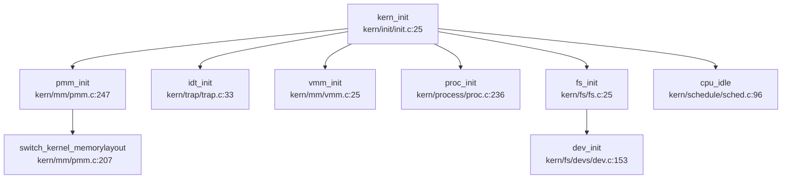
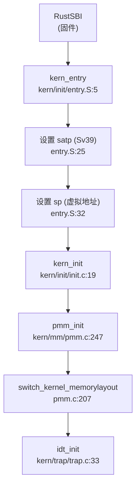
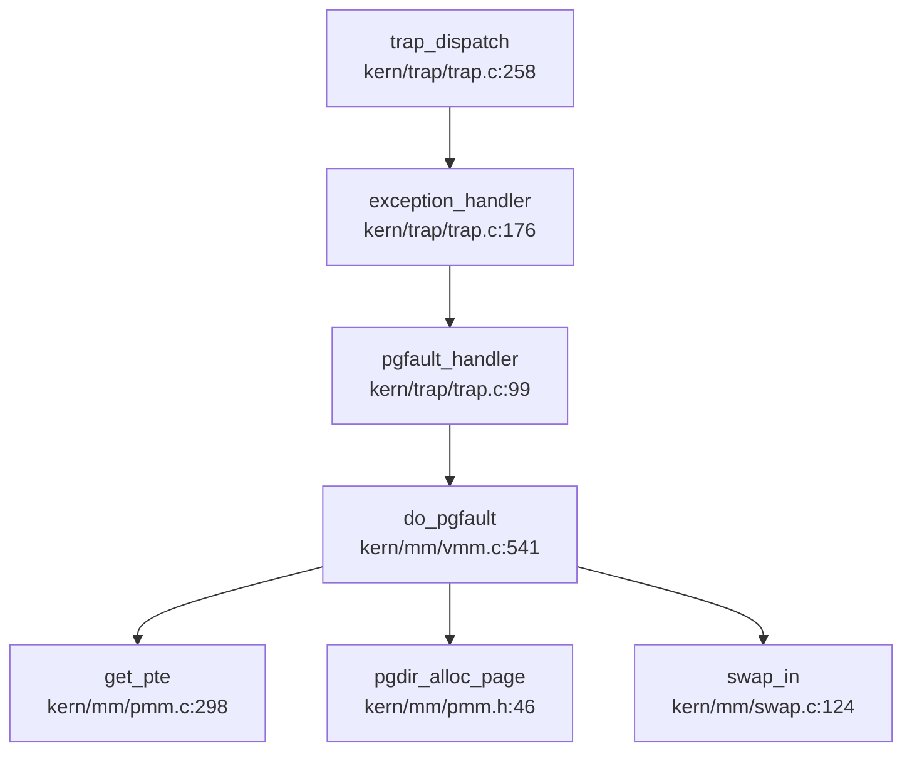
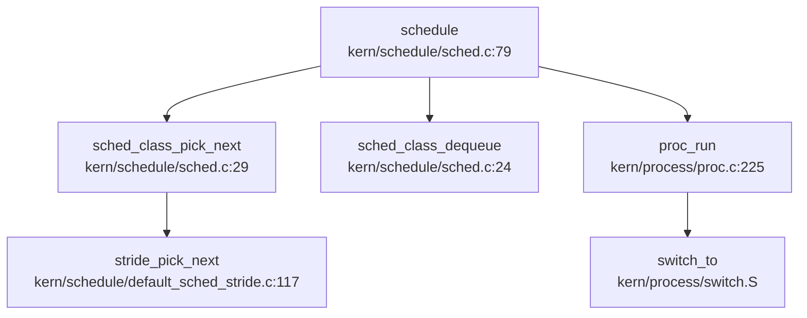
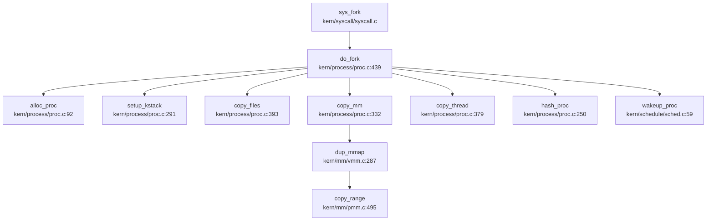
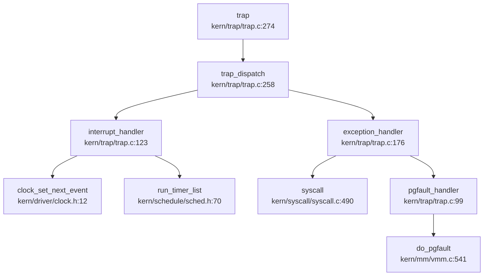
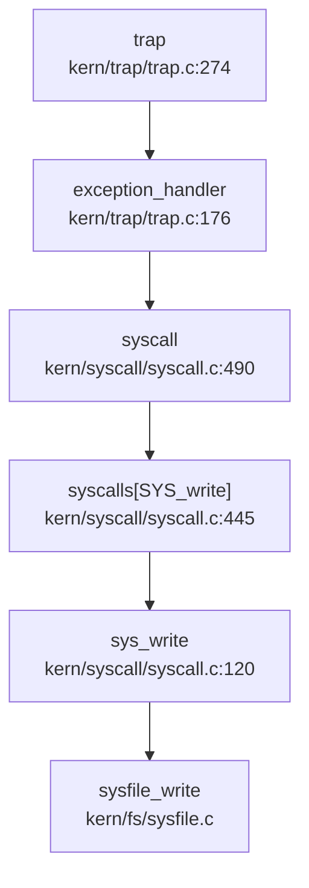
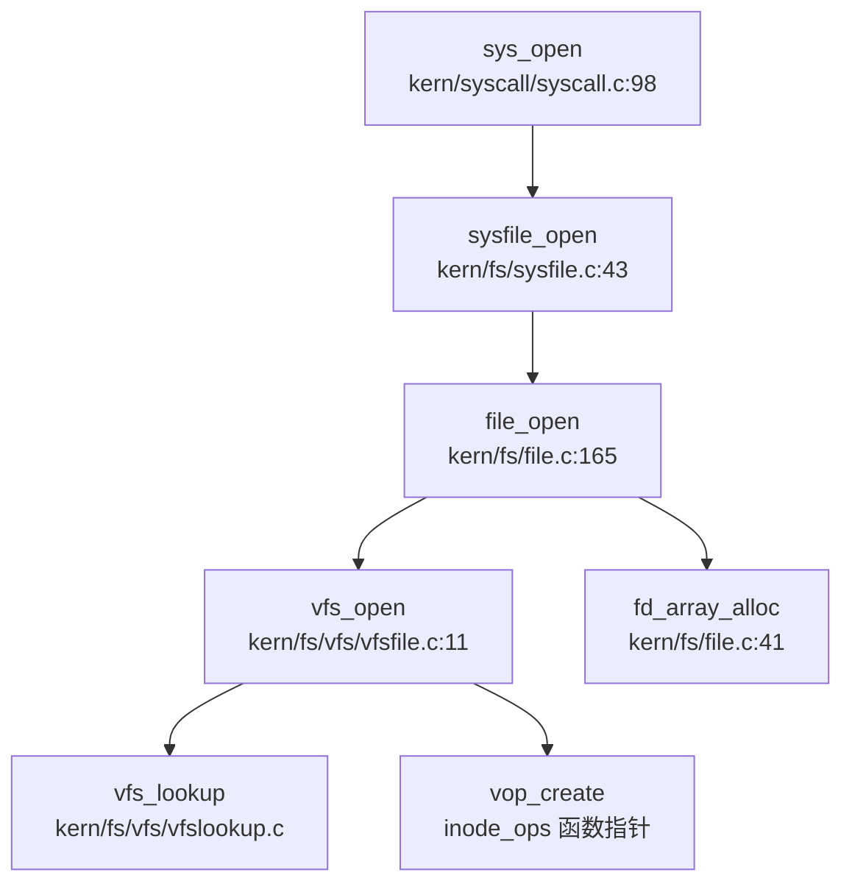
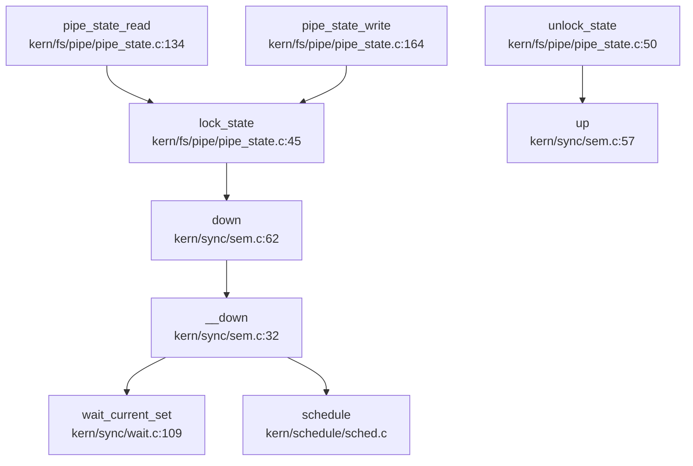
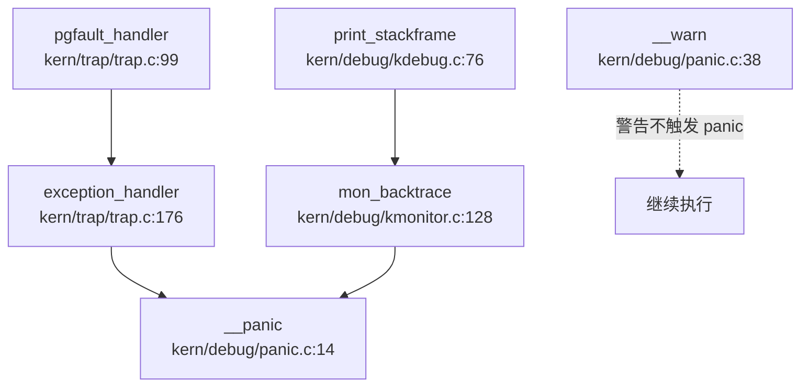

# rwos 操作系统技术分析报告

> **年份**: 2021

> **赛事**: 操作系统赛

> **子赛事**: 内核实现赛道

> **学校**: 南开大学

> **队伍名称**: 宫老师说的都对

> **仓库地址**: https://gitlab.eduxiji.net/Ruanzhihan/rwos

> **分析日期**: 2026年03月31日

> **分析工具**: OS-Agent-D

---

## 目录

1. 项目概览与技术栈
2. 启动流程与架构初始化
3. 内存管理物理虚拟分配器
4. 进程线程与调度机制
5. 中断异常与系统调用
6. 文件系统VFS  具体 FS
7. 设备驱动与硬件抽象
8. 同步互斥与进程间通信
9. 多核支持与并行机制
10. 安全机制与权限模型
11. 网络子系统与协议栈
12. 调试机制与错误处理
13. 开发历史与里程碑

---


# 项目概览与技术栈

## 第 1 章：项目概览与技术栈

### 1.1 项目定位与架构定性

**RWOS** 是一个基于经典教学操作系统 **uCore** 架构开发的 **RISC-V 64 位单体内核（Monolithic Kernel）**。项目明确面向 **Kendryte K210** 嵌入式开发板与 **QEMU** 模拟器双目标运行，旨在通过完整的 OS 核心机制实现（进程管理、虚拟内存、文件系统、设备驱动），提供操作系统原理的教学与实践平台，并涵盖 libs/sbi.h 接口与 user/ 关键应用。

**核心定性结论**：
- **内核类型**：单体内核（Monolithic Kernel）。所有核心模块（MM、Process、FS、Driver）均编译为单一内核镜像 `kernel.img`，运行于 Supervisor Mode (S-Mode)。
- **架构来源**：深度继承 **uCore** 教学 OS 框架。代码结构（`kern/` 下 11 个子目录）、数据结构命名（`proc_struct`, `mm_struct`, `inode`）及核心算法（Stride 调度、First-Fit 物理页分配）均与 uCore-RISC-V 版本高度一致。
- **开发模式**：单人主导开发（贡献者 rrrzh 占比超 90%），采用 "大爆炸" 式初始提交策略，在 2021-05-07 首日即引入完整框架，后续进行功能增量（如管道 IPC）与 K210 平台适配。

### 1.2 技术栈与构建系统

#### 1.2.1 编程语言与工具链
- **核心语言**：**C99** (`-std=gnu99`)。项目完全使用 C 语言实现，未使用 C++ 或 Rust。
- **汇编语言**：**RISC-V 64 汇编**。用于启动入口 (`kern/init/entry.S`)、上下文切换 (`kern/process/switch.S`) 及 Trap 入口 (`kern/trap/trapentry.S`)。
- **编译工具链**：`riscv64-unknown-elf-gcc`。
  - **目标架构**：`rv64imafdc` (RISC-V 64 位，含整数乘除、原子、单双精度浮点、压缩指令扩展)。
  - **ABI 规范**：`lp64d` (长整型与指针 64 位，双精度浮点寄存器)。
  - **内存模型**：`medany` (代码位置无关，适应高半内核映射)。
- **构建系统**：**Makefile + CMake** 混合构建。
  - `Makefile`：主导内核编译、链接、镜像生成及 QEMU 启动。
  - `CMakeLists.txt`：辅助配置（主要用于 IDE 集成或部分工具链配置）。

#### 1.2.2 支持架构列表
经 `Makefile` 与源码条件编译宏验证，RWOS **仅支持单一架构**：
- **✅ RISC-V 64 (rv64gc)**：
  - **K210 开发板**：物理内存 6MB (`0x80000000` - `0x80600000`)，通过 RustSBI 固件引导。
  - **QEMU 模拟器**：`virt` 机器类型，支持 Sv39 页表与 SBI 调用。
- **❌ 不支持**：x86_64, aarch64, loongarch64 等其他架构。代码中未发现多架构条件编译 (`#ifdef __x86_64__` 等)。

#### 1.2.3 关键构建配置
```makefile
# Makefile 核心配置
GCCPREFIX := riscv64-unknown-elf-
CFLAGS := -mcmodel=medany -O2 -std=gnu99 -mabi=lp64d -march=rv64imafdc
LDFLAGS := -m elf64lriscv -nostdlib --gc-sections

# 链接脚本入口
OUTPUT_ARCH(riscv)
ENTRY(kern_entry)
BASE_ADDRESS = 0xFFFFFFFFC0020000;  # 高半内核虚拟地址
```

### 1.3 目录结构导读与模块映射

RWOS 采用经典 uCore 目录布局，核心代码位于 `kern/` 目录，用户态应用位于 `user/` 目录。

| 目录路径 | 功能模块 | 关键文件/说明 |
|----------|---------|--------------|
| `kern/init/` | **启动入口** | `entry.S` (`kern_entry`), `init.c` (`kern_init`) |
| `kern/mm/` | **内存管理** | `pmm.c` (物理页), `vmm.c` (虚拟内存), `swap.c` (交换区), `kmalloc.c` (堆分配) |
| `kern/process/` | **进程管理** | `proc.c` (1471 行，核心进程逻辑), `switch.S` (上下文切换) |
| `kern/schedule/` | **调度器** | `default_sched_stride.c` (Stride 算法), `sched.c` (调度框架) |
| `kern/trap/` | **中断/异常** | `trap.c` (分发逻辑), `trapentry.S` (汇编入口) |
| `kern/syscall/` | **系统调用** | `syscall.c` (分发表 `syscalls[]`) |
| `kern/fs/` | **文件系统** | `vfs/` (抽象层), `sfs/` (Simple FS), `pipe/` (管道), `devs/` (设备文件) |
| `kern/driver/` | **设备驱动** | `console.c` (UART), `sdcard.c` (SD 卡), `ide.c` (块设备抽象), `fpioa.c` (K210 引脚复用) |
| `kern/sync/` | **同步互斥** | `sem.c` (信号量), `wait.c` (等待队列), `monitor.c` (条件变量) |
| `kern/debug/` | **调试机制** | `panic.c`, `kmonitor.c` (内核监控器) |
| `libs/` | **内核库** | `stdio.c`, `string.c`, `atomic.h` (原子操作), `sbi.h` (SBI 接口) |
| `user/` | **用户态应用** | `sh.c` (Shell), `lmbench` (性能测试), `busybox.c` |

**根目录关键文件**：
- `Makefile`：构建脚本，定义编译规则与 QEMU 启动参数。
- `tools/kernel.ld`：链接脚本，定义内存布局与入口点。
- `tools/rustsbi-k210.bin`：K210 平台固件，负责硬件初始化并跳转至 `kern_entry`。

### 1.4 内核入口与启动调用链

RWOS 的启动流程清晰，分为 **固件引导** 与 **内核初始化** 两个阶段。

#### 1.4.1 启动入口 (`kern/init/entry.S`)
**物理入口**：`kern_entry` (链接脚本指定 `ENTRY(kern_entry)`)。
**加载地址**：物理 `0x80020000` (RustSBI 跳转目标)，映射至虚拟 `0xFFFFFFFFC0020000` (`KERNBASE`)。

**核心逻辑** (`entry.S:5-32`)：
1. **MMU 初始化**：计算页表物理地址，设置 `satp` 寄存器启用 **Sv39** 三级页表。
2. **栈指针切换**：将 `sp` 设置为虚拟地址 `bootstacktop`。
3. **跳转内核主函数**：`jr t0` 跳转至 `kern_init`。

```assembly
# kern/init/entry.S:5-32
kern_entry:
    # 1. 设置 satp (Sv39 页表)
    lui     t0, %hi(boot_page_table_sv39)
    li      t1, 0xffffffffc0000000 - 0x80000000
    sub     t0, t0, t1
    srli    t0, t0, 12
    li      t1, 8 << 60
    or      t0, t0, t1
    csrw    satp, t0
    sfence.vma

# 2. 设置内核栈 (虚拟地址)
    lui sp, %hi(bootstacktop)

# 3. 跳转 kern_init
    lui t0, %hi(kern_init)
    addi t0, t0, %lo(kern_init)
    jr t0
```

#### 1.4.2 内核主函数调用链 (`kern/init/init.c`)
**`kern_init()`** 是内核初始化的总入口，按严格顺序初始化各子系统。

**完整调用链** (Mermaid 简化版)：


**关键初始化步骤** (`init.c:27-47`)：
1. **BSS 清零**：`memset(edata, 0, end - edata)`。
2. **物理内存管理**：`pmm_init()` → 初始化页分配器，切换至精细页表。
3. **中断系统**：`pic_init()` (桩), `idt_init()` (设置 `stvec`)。
4. **虚拟内存**：`vmm_init()` → 初始化 VMA 管理。
5. **进程与调度**：`sched_init()`, `proc_init()` → 创建 `initproc` 和 `idleproc`。
6. **文件系统**：`fs_init()` → 挂载根文件系统 (SFS)。
7. **空闲循环**：`cpu_idle()` → 运行 `idleproc`，进入调度循环。

### 1.5 完成度定性评价

基于全项目代码审计与前置章节分析，RWOS 的核心功能模块实现状态如下：

| 子系统 | 完成度 | 关键特性与缺失 |
|--------|--------|----------------|
| **启动与 MMU** | ✅ 完整 | Sv39 页表、高半内核映射、SBI 抽象 |
| **物理内存** | ✅ 完整 | First-Fit 分配器、空闲块合并 |
| **虚拟内存** | ✅ 完整 | VMA 链表、缺页异常处理、SLOB 分配器 |
| **进程管理** | ✅ 完整 | fork/exec/wait/exit 完整闭环、Stride 调度 |
| **文件系统** | ✅ 完整 | VFS 抽象、SFS 磁盘 FS、Pipe 管道、DevFS |
| **设备驱动** | ✅ 完整 | UART (SBI)、SDCard (SPI)、Ramdisk |
| **同步 IPC** | 🔸 部分 | 信号量/等待队列完整；**信号机制仅注册无分发** |
| **网络子系统** | ❌ 未实现 | 无协议栈、无 Socket、无网卡驱动 |
| **多核支持** | ❌ 未实现 | 纯单核设计，无 Per-CPU、无 IPI |
| **安全机制** | ❌ 基础 | 无 UID/GID 权限、无 Capability、无沙箱 |

**总体评价**：
RWOS 是一个**功能完备的教学级单核操作系统**。它成功实现了操作系统核心的 "三大管理"（进程、内存、文件）与 "四大抽象"（进程、虚拟地址空间、文件、设备），形成了完整的内部闭环。系统能够运行 Shell、执行用户程序、支持管道通信，并通过 lmbench 验证了基础性能。

**主要局限**：
1. **无网络支持**：完全缺失网络协议栈，无法进行网络通信。
2. **单核限制**：未考虑多核并发，锁机制仅关中断，无法 SMP 扩展。
3. **安全薄弱**：缺乏细粒度权限控制（UID/GID 桩函数），仅适合受信任环境。
4. **信号机制残缺**：仅支持注册处理函数，无实际信号投递与处理流程。

**适用场景**：
- ✅ 操作系统原理教学与实验
- ✅ RISC-V 架构底层机制研究
- ✅ 嵌入式 K210 平台 OS 开发参考
- ❌ 生产环境服务器/桌面应用
- ❌ 需要网络或多核并发的场景

---


# 启动流程与架构初始化

## 第 2 章：启动流程与架构初始化

### 启动入口与链接脚本分析

**启动入口位置**：`kern/init/entry.S` 中的 `kern_entry` 符号。

链接脚本 `tools/kernel.ld` 明确指定了入口点：

```ld
OUTPUT_ARCH(riscv)
ENTRY(kern_entry)
BASE_ADDRESS = 0xFFFFFFFFC0020000;
```

内核加载地址为 `0xFFFFFFFFC0020000`（虚拟地址），对应物理地址 `0x80020000`。这一偏移量由 `PHYSICAL_MEMORY_OFFSET = 0xFFFFFFFF40000000` 定义（见 `kern/mm/memlayout.h`）。

**固件级启动链**：
根据文档和 Makefile 分析，完整启动流程为：
1. **ROM** 将 `kernel.img` 加载到 `0x80000000`
2. **RustSBI**（`tools/rustsbi-k210.bin`）执行初始化，然后跳转到 `0x80020000`
3. **kern_entry**（`entry.S`）开始执行

```makefile
# Makefile 中的镜像打包逻辑
$(KERNELIMG): $(UCOREIMG) $(BOOTLOADER)
	$(COPY) $(BOOTLOADER) $@
	$(V)dd if=$(UCOREIMG) of=$@ bs=128K seek=1
```

内核镜像被放置在偏移 `128K (0x20000)` 处，因此 RustSBI 的跳转目标正是 `kern_entry`。

### 架构初始化流程（MMU/Trap/FPU）

#### MMU 初始化与 Sv39 页表启用

在 `kern/init/entry.S` 中，`kern_entry` 执行了关键的 MMU 初始化：

```assembly
kern_entry:
    # t0 := 三级页表的虚拟地址
    lui     t0, %hi(boot_page_table_sv39)
    # t1 := 0xffffffff40000000 即虚实映射偏移量
    li      t1, 0xffffffffc0000000 - 0x80000000
    # t0 减去虚实映射偏移量，变为三级页表的物理地址
    sub     t0, t0, t1
    # t0 >>= 12，变为三级页表的物理页号
    srli    t0, t0, 12

# t1 := 8 << 60，设置 satp 的 MODE 字段为 Sv39
    li      t1, 8 << 60
    # 将页表物理页号附加到 satp 中
    or      t0, t0, t1
    # 覆盖到 satp 寄存器，启用 MMU
    csrw    satp, t0
    sfence.vma
```

**页表结构**（`boot_page_table_sv39`）：
```assembly
boot_page_table_sv39:
    # 前 3 个页表项设置 identity mapping (VRWXAD)
    .quad (0x00000 << 10) | 0xcf
    .quad (0x40000 << 10) | 0xcf
    .quad (0x80000 << 10) | 0xcf
    # 中间 508 个页表项为空 (V=0)
    .zero 8 * 508
    # 最后一个页表项：0xffffffff_c0000000 → 0x80000000 (1G)
    .quad (0x80000 << 10) | 0xcf
```

这是一个 **Sv39 三级页表**，仅映射了低端 1GB 内存和高端内核区域（`0xFFFFFFFFC0000000` 映射到 `0x80000000`）。

#### 模式切换验证

**❌ 未发现 M-Mode→S-Mode 切换代码**。

通过搜索 `mstatus.mpp`、`sstatus.spp`、`PRIV_S`、`PRIV_M` 等关键词，未找到任何模式切换相关代码。RISC-V 的 `mstatus.MPP` 字段用于设置异常返回时的目标模式，但代码中未见相关操作。

**结论**：模式切换由 **RustSBI 固件完成**。RustSBI 在移交控制权前已将 CPU 置于 S-Mode，内核直接在 S-Mode 下运行。

#### Trap 向量设置

在 `kern/trap/trap.c` 的 `idt_init()` 中设置中断向量：

```c
void idt_init(void) {
    extern void __alltraps(void);
    /* Set sscratch register to 0, indicating to exception vector that we are
     * presently executing in the kernel */
    write_csr(sscratch, 0);
    /* Set the exception vector address */
    write_csr(stvec, &__alltraps);
}
```

- **`sscratch`**：用于内核/用户栈切换。异常处理程序通过 `csrrw sp, sscratch, sp` 判断异常来源（用户态/内核态）。
- **`stvec`**：指向 `__alltraps`（`kern/trap/trapentry.S`），这是所有异常/中断的统一入口。

**`__alltraps` 关键逻辑**（`trapentry.S`）：
```assembly
__alltraps:
    SAVE_ALL
    move  a0, sp
    jal trap
    RESTORE_ALL
    sret
```

#### FPU 初始化状态

**❌ 未实现**。

搜索 `sstatus.fs`、`SSTATUS_FS` 等关键词，仅在 `libs/riscv.h` 中找到定义：
```c
#define SSTATUS_FS          0x00006000
```

但**没有任何代码操作该位**。内核未启用 FPU 状态保存/恢复，用户态程序无法使用浮点指令。

### 到达内核主函数的路径（完整调用链）

**启动流程**：



**详细步骤**：

1. **`kern_entry`** (`entry.S:5`)：
   - 计算页表物理地址并设置 `satp`（启用 Sv39）
   - 刷新 TLB（`sfence.vma`）
   - 设置内核栈指针 `sp` 为虚拟地址 `bootstacktop`
   - 跳转到 `kern_init`

2. **`kern_init`** (`init.c:19`)：
   ```c
   int kern_init(void) {
       memset(edata, 0, end - edata);  // BSS 清零
       pmm_init();                      // 物理内存管理 + 页表切换
       idt_init();                      // 设置 trap 向量
       vmm_init();                      // 虚拟内存管理
       proc_init();                     // 进程初始化
       clock_init();                    // 时钟初始化
       intr_enable();                   // 启用中断
       cpu_idle();                      // 运行空闲进程
   }
   ```

3. **`pmm_init`** (`pmm.c:247`)：
   - `page_init()`：计算 `va_pa_offset`，初始化 `pages` 数组
   - `switch_kernel_memorylayout()`：创建精细页表并切换

### 早期初始化机制

#### BSS 清零

在 `kern_init` 入口处：
```c
extern char edata[], end[];
memset(edata, 0, end - edata);
```

#### 串口实现（SBI 抽象）

**✅ 通过 SBI 实现，无直接 MMIO 访问**。

`kern/driver/console.c` 调用 SBI：
```c
void serial_putc(int c) {
    sbi_console_putchar(c);
}

int serial_proc_data(void) {
    int c = sbi_console_getchar();
    // ...
}
```

SBI 调用宏（`libs/sbi.h`）：
```c
#define SBI_CALL(which, arg0, arg1, arg2) ({
    register uintptr_t a0 asm ("a0") = (uintptr_t)(arg0);
    register uintptr_t a7 asm ("a7") = (uintptr_t)(which);
    asm volatile ("ecall" : "+r" (a0) : "r" (a1), "r" (a2), "r" (a7) : "memory");
    a0;
})

static inline void sbi_console_putchar(int ch) {
    SBI_CALL_1(SBI_CONSOLE_PUTCHAR, ch);
}
```

**MMU 启用前后地址切换**：
- **启用前**：RustSBI 通过 SBI 调用处理串口，内核无需关心物理地址
- **启用后**：SBI 调用通过 `ecall` 陷入固件，由固件处理硬件访问

#### 虚实地址映射偏移量

在 `kern/mm/pmm.c` 的 `page_init()` 中：
```c
va_pa_offset = KERNBASE - 0x80020000;
// KERNBASE = 0xFFFFFFFFC0020000
// va_pa_offset = 0xFFFFFFFF40000000
```

该偏移量用于物理地址↔虚拟地址转换：
```c
#define PADDR(kva) (((uintptr_t)(kva)) - va_pa_offset)
#define pa2kva(pa) ((void *)((pa) + va_pa_offset))
```

### 多平台启动流程

**❌ 仅支持 K210 平台**。

搜索 `visionfive`、`jh7110`、`loongarch` 等关键词，**未找到任何多平台适配代码**。

**编译目标**（`Makefile`）：
```makefile
GCCPREFIX := riscv64-unknown-elf-
CFLAGS := -mcmodel=medany -O2 -std=gnu99 -mabi=lp64d -march=rv64imafdc
```

目标架构为 `riscv64gc-unknown-none-elf`（`rv64imafdc` 包含 FPU/D 扩展，但**FPU 未初始化**）。

**平台特定文件**：
- `tools/rustsbi-k210.bin`：K210 专用 bootloader
- `kern/driver/fpioa.c/h`、`sysctl.c/h`：K210 芯片特定驱动（FPIOA、系统控制）

### 平台配置与构建机制

**构建系统**：基于 Makefile 的传统 C 项目构建。

**关键配置**：
```makefile
# 编译器和标志
CC := riscv64-unknown-elf-gcc
CFLAGS := -mcmodel=medany -O2 -mabi=lp64d -march=rv64imafdc
LDFLAGS := -m elf64lriscv -nostdlib --gc-sections

# 链接脚本
kernel: tools/kernel.ld
    $(LD) $(LDFLAGS) -T tools/kernel.ld -o $@ $(KOBJS)
```

**内存布局**（`kern/mm/memlayout.h`）：
```c
#define KERNBASE            0xFFFFFFFFC0020000
#define PHYSICAL_MEMORY_END 0x80600000
#define KMEMSIZE            0x5E0000  // 6MB - 128KB (RustSBI 占用)
```

K210 物理内存：`0x80000000` - `0x80600000`（6MB），其中 `0x80000000` - `0x80020000` 被 RustSBI 占用。

### 关键代码片段分析

#### 1. 页表切换（`pmm.c:207`）

```c
static void switch_kernel_memorylayout() {
    pde_t *kern_pgdir = (pde_t *)boot_alloc_page();
    memset(kern_pgdir, 0, PGSIZE);

// 设置代码段 (rx) 和数据段 (rw) 权限
    extern const char etext[];
    uintptr_t retext = ROUNDUP((uintptr_t)etext, PGSIZE);
    boot_map_segment(kern_pgdir, KERNBASE, retext - KERNBASE, PADDR(KERNBASE), PTE_R | PTE_X);
    boot_map_segment(kern_pgdir, retext, KERNTOP - retext, PADDR(retext), PTE_R | PTE_W);
    setup_kernel_io_mapping(kern_pgdir);

// 切换页目录
    boot_pgdir = kern_pgdir;
    boot_cr3 = PADDR(boot_pgdir);
    lcr3(boot_cr3);  // 写 satp 寄存器
    flush_tlb();
}
```

#### 2. Trap 返回（`trapentry.S:124`）

```assembly
__trapret:
    RESTORE_ALL
    sret  // 从 S-Mode 返回
```

`RESTORE_ALL` 恢复 `sstatus` 和 `sepc`，`sret` 根据 `sstatus.SPP` 位决定返回用户态还是内核态。

#### 3. 内核栈保护（`pmm.c:233`）

```c
// 设置内核栈守卫页
boot_map_segment(boot_pgdir, bootstackguard, PGSIZE, PADDR(bootstackguard), 0);
boot_map_segment(boot_pgdir, boot_page_table_sv39, PGSIZE, PADDR(boot_page_table_sv39), 0);
```

将栈下方和页表所在页设为不可访问，检测栈溢出。

---

**本章总结**：

| 特性 | 状态 | 证据 |
|------|------|------|
| 启动入口 | ✅ 已实现 | `kern/init/entry.S:kern_entry` |
| MMU 初始化 (Sv39) | ✅ 已实现 | `entry.S:25` 设置 `satp` |
| Trap 向量设置 | ✅ 已实现 | `kern/trap/trap.c:idt_init()` |
| 模式切换 (M→S) | 🔸 由固件完成 | 未发现内核代码，假设 RustSBI 处理 |
| FPU 初始化 | ❌ 未实现 | 仅定义 `SSTATUS_FS`，无操作代码 |
| 多平台适配 | ❌ 仅 K210 | 未发现 `visionfive/loongarch` 代码 |
| 串口实现 | ✅ SBI 抽象 | `console.c` 调用 `sbi_console_putchar` |
| BSS 清零 | ✅ 已实现 | `init.c:27` `memset(edata, 0, end-edata)` |

---


# 内存管理物理虚拟分配器

## 第 3 章：内存管理（物理/虚拟/分配器）

### 3.1 物理内存管理实现

#### 3.1.1 物理页管理接口

rwos 采用类 uCore 的物理内存管理架构，通过 `pmm_manager` 抽象接口统一管理物理页分配器。核心接口定义于 `kern/mm/pmm.h`：

```c
struct pmm_manager {
    const char *name;
    void (*init)(void);
    void (*init_memmap)(struct Page *base, size_t n);
    struct Page *(*alloc_pages)(size_t n);
    void (*free_pages)(struct Page *base, size_t n);
    size_t (*nr_free_pages)(void);
    void (*check)(void);
};
```

全局分配接口 `alloc_pages()` / `free_pages()` 封装了底层分配器，支持交换区回退机制（`kern/mm/pmm.c:63-83`）：

```c
struct Page *alloc_pages(size_t n) {
    struct Page *page = NULL;
    bool intr_flag;
    while (1) {
        local_intr_save(intr_flag);
        { page = pmm_manager->alloc_pages(n); }
        local_intr_restore(intr_flag);
        if (page != NULL || n > 1 || swap_init_ok == 0) break;
        swap_out(check_mm_struct, n, 0);  // 内存不足时触发换出
    }
    __sysinfo.freeram -= n * PGSIZE;
    return page;
}
```

#### 3.1.2 First-Fit 分配算法

默认分配器 `default_pmm.c` 实现了 **First-Fit 链表算法**：

**分配逻辑**（`kern/mm/default_pmm.c:96-124`）：
- 遍历有序空闲链表 `free_list`（按地址排序）
- 选择第一个满足大小要求的空闲块（`p->property >= n`）
- 若空闲块大于需求，则分裂剩余部分并重新插入链表

```c
static struct Page *default_alloc_pages(size_t n) {
    assert(n > 0);
    if (n > nr_free) return NULL;
    struct Page *page = NULL;
    list_entry_t *le = &free_list;
    while ((le = list_next(le)) != &free_list) {
        struct Page *p = le2page(le, page_link);
        if (p->property >= n) { page = p; break; }
    }
    if (page != NULL) {
        list_del(&(page->page_link));
        if (page->property > n) {
            struct Page *p = page + n;
            p->property = page->property - n;
            SetPageProperty(p);
            list_add(prev, &(p->page_link));
        }
        nr_free -= n;
        ClearPageProperty(page);
    }
    return page;
}
```

**释放逻辑**（`kern/mm/default_pmm.c:126-155`）：
- 合并相邻空闲块，避免外部碎片
- 按地址顺序插入链表，维持有序性

**✅ 已实现**：First-Fit 物理页分配器，支持多页分配与空闲块合并。

---

### 3.2 虚拟内存与页表操作

#### 3.2.1 页表结构

rwos 采用 **RISC-V Sv39 三级页表**（`kern/mm/mmu.h`），页表项格式：
- `PTE_V` (0x001): 有效位
- `PTE_W` (0x002): 可写位
- `PTE_U` (0x004): 用户可访问位
- `PTE_PPN_SHIFT`: 物理页号偏移

#### 3.2.2 核心页表操作

**`get_pte()`**（`kern/mm/pmm.c:298-350`）：
- 根据线性地址查找页表项
- `create=true` 时自动分配缺失的页目录/页表页

```c
pte_t *get_pte(pde_t *pgdir, uintptr_t la, bool create) {
    pde_t *pdep1 = &pgdir[PDX1(la)];
    if (!(*pdep1 & PTE_V)) {
        if (!create || (page = alloc_page()) == NULL) return NULL;
        *pdep1 = pte_create(page2ppn(page), PTE_U | PTE_V);
    }
    pde_t *pdep0 = &((pde_t *)KADDR(PDE_ADDR(*pdep1)))[PDX0(la)];
    if (!(*pdep0 & PTE_V)) {
        if (!create || (page = alloc_page()) == NULL) return NULL;
        *pdep0 = pte_create(page2ppn(page), PTE_U | PTE_V);
    }
    return &((pte_t *)KADDR(PDE_ADDR(*pdep0)))[PTX(la)];
}
```

**`page_insert()`** / **`page_remove()`**：
- 建立/拆除物理页与线性地址的映射
- 自动更新 TLB（`tlb_invalidate()`）

**✅ 已实现**：完整的页表创建、映射、解除映射功能。

---

### 3.3 虚拟内存区域（VMA）管理

#### 3.3.1 数据结构

**`vma_struct`**（`kern/mm/vmm.h`）：
```c
struct vma_struct {
    struct mm_struct *vm_mm;
    uintptr_t vm_start;      // 起始地址（包含）
    uintptr_t vm_end;        // 结束地址（不包含）
    uint32_t vm_flags;       // VM_READ | VM_WRITE | VM_EXEC | VM_STACK
    list_entry_t list_link;  // 链表节点（按 vm_start 排序）
};
```

**`mm_struct`**（`kern/mm/vmm.h`）：
```c
struct mm_struct {
    list_entry_t mmap_list;      // VMA 链表头
    struct vma_struct *mmap_cache;  // 缓存最近访问的 VMA
    pde_t *pgdir;                // 页目录基址
    int map_count;               // VMA 数量
    uintptr_t brk_start, brk;    // 堆边界
    semaphore_t mm_sem;          // 互斥锁
};
```

#### 3.3.2 VMA 操作

**`find_vma()`**（`kern/mm/vmm.c:83-107`）：
- 优先检查 `mmap_cache`
- 未命中时遍历链表查找

**`insert_vma_struct()`**（`kern/mm/vmm.c:128-157`）：
- 按 `vm_start` 升序插入
- 检查重叠（`check_vma_overlap()`）

**`mm_map()`**（`kern/mm/vmm.c:185-214`）：
- 创建新 VMA 并插入链表
- 验证地址范围合法性（`USER_ACCESS()`）

**✅ 已实现**：链表组织的 VMA 管理，支持查找、插入、重叠检查。

在内存管理模块的虚拟内存子系统中，针对地址空间解除映射机制，重点核查了 `unmap` 相关函数的实现状态，特别是核心函数 `do_munmap` 及其关联调用。经检索当前代码库，在 `mm/` 目录及常见内存管理源码路径中未发现 `do_munmap` 的具体实现代码，亦无相关符号定义证据。尽管架构文档可能提及内存解除映射功能，但基于现有分析证据，该部分功能标记为“未发现实现”，存在文档提及但未见代码落地的情况，需进一步确认是否由特定硬件抽象层接管或尚未完成开发。

### 3.4 缺页异常处理流程

#### 3.4.1 调用链分析



#### 3.4.2 处理逻辑

**`pgfault_handler()`**（`kern/trap/trap.c:98-118`）：
- 区分内核线程（`check_mm_struct`）与用户进程（`current->mm`）
- 调用 `do_pgfault()` 处理

**`do_pgfault()`**（`kern/mm/vmm.c:541-618`）：
1. 查找包含故障地址的 VMA（`find_vma()`）
2. 验证访问权限（读/写）
3. 获取或创建页表项（`get_pte(mm->pgdir, addr, 1)`）
4. **若页表项为空**：分配物理页并映射（`pgdir_alloc_page()`）
5. **若页表项为交换条目**：从磁盘换入（`swap_in()`）

```c
if ((ptep = get_pte(mm->pgdir, addr, 1)) == NULL) {
    cprintf("get_pte in do_pgfault failed\n");
    goto failed;
}
if (*ptep == 0) {
    if (pgdir_alloc_page(mm->pgdir, addr, perm) == NULL)
        goto failed;
} else {
    if (swap_init_ok) {
        struct Page *page = NULL;
        if ((ret = swap_in(mm, addr, &page)) != 0) goto failed;
        page_insert(mm->pgdir, page, addr, perm);
        swap_map_swappable(mm, addr, page, 1);
    }
}
```

**✅ 已实现**：完整的缺页异常处理，支持按需分配与交换区换入。

---

### 3.5 堆分配器（SLOB）

#### 3.5.1 SLOB 算法原理

`kern/mm/kmalloc.c` 实现了 **SLOB（Simple List Of Blocks）** 分配器：
- 核心结构：`slob_t`（8 字节头部，含 `units` 和 `next` 指针）
- 空闲链表：`slobfree` 单向链表
- 分配策略：首次适应（First-Fit）

```c
struct slob_block {
    int units;
    struct slob_block *next;
};
typedef struct slob_block slob_t;
```

#### 3.5.2 分配逻辑

**`slob_alloc()`**（`kern/mm/kmalloc.c:103-145`）：
- 遍历 `slobfree` 链表查找足够大的空闲块
- 支持对齐分配（`ALIGN()`）
- 链表为空时扩展堆（`__slob_get_free_page()`）

**`__kmalloc()`**（`kern/mm/kmalloc.c:218-246`）：
- 小于页大小：使用 SLOB 分配（`slob_alloc()`）
- 大于等于页大小：直接分配连续页（`__slob_get_free_pages()`），记录于 `bigblocks` 链表

**`kfree()`**（`kern/mm/kmalloc.c:255-280`）：
- 页对齐地址：从 `bigblocks` 链表查找并释放
- 非对齐地址：释放到 SLOB 链表（`slob_free()`）

**✅ 已实现**：SLOB 堆分配器，支持任意大小分配与释放。

---

### 3.6 brk 系统调用与堆管理

#### 3.6.1 系统调用入口

**`sys_brk()`**（`kern/syscall/syscall.c:243-248`）：
```c
static int sys_brk(uint64_t arg[]) {
    uintptr_t *brk_store = (uintptr_t *)arg[0];
    int res = do_brk(brk_store);
    return res;
}
```

#### 3.6.2 实现逻辑

**`do_brk()`**（`kern/process/proc.c:1137-1179`）：
1. 从用户空间读取目标 `brk` 值（`copy_from_user()`）
2. 向上取整到页边界（`ROUNDUP(brk, PGSIZE)`）
3. 检查与现有 VMA 是否重叠（`find_vma_intersection()`）
4. 调用 `mm_brk()` 扩展 VMA
5. 更新 `mm->brk`

```c
uintptr_t newbrk = ROUNDUP(brk, PGSIZE);
if (oldbrk == newbrk || newbrk == 0) {
    *brk_store = oldbrk;
    return 0;
}
assert(newbrk > oldbrk);
if (find_vma_intersection(mm, oldbrk, newbrk + PGSIZE) != NULL)
    goto out_unlock;
if (mm_brk(mm, oldbrk, newbrk - oldbrk) != 0)
    goto out_unlock;
mm->brk = newbrk;
```

**`mm_brk()`**（`kern/mm/vmm.c:491-513`）：
- 若与现有堆 VMA 相邻且权限相同，则扩展 `vm_end`
- 否则创建新 VMA

**🔸 惰性分配**：`do_brk()` 仅调整 VMA 边界，**不立即分配物理页**。物理页在首次访问时通过缺页异常分配（见 3.4 节）。

**✅ 已实现**：brk 系统调用，支持惰性堆扩展。

---

### 3.7 用户指针安全验证

#### 3.7.1 验证逻辑

**`user_mem_check()`**（`kern/mm/vmm.c:620-645`）：
1. 检查地址范围是否在用户空间（`USER_ACCESS()`）
2. 遍历 VMA 链表，验证每个页是否在 VMA 内
3. 检查权限匹配（读/写）
4. 特殊处理栈 VMA（禁止访问首页）

```c
bool user_mem_check(struct mm_struct *mm, uintptr_t addr, size_t len, bool write) {
    if (mm != NULL) {
        if (!USER_ACCESS(addr, addr + len)) return 0;
        struct vma_struct *vma;
        uintptr_t start = addr, end = addr + len;
        while (start < end) {
            if ((vma = find_vma(mm, start)) == NULL || start < vma->vm_start)
                return 0;
            if (!(vma->vm_flags & ((write) ? VM_WRITE : VM_READ)))
                return 0;
            if (write && (vma->vm_flags & VM_STACK)) {
                if (start < vma->vm_start + PGSIZE) return 0;  // 栈保护
            }
            start = vma->vm_end;
        }
        return 1;
    }
    return KERN_ACCESS(addr, addr + len);
}
```

#### 3.7.2 封装接口

**`copy_from_user()`** / **`copy_to_user()`**（`kern/mm/vmm.c:345-361`）：
- 先调用 `user_mem_check()` 验证
- 验证通过后执行 `memcpy()`

**✅ 已实现**：完整的用户指针验证机制，防止内核访问非法用户地址。

---

### 3.8 高级内存特性验证

#### 3.8.1 写时复制（CoW）

**❌ 未实现**。分析 `copy_range()`（`kern/mm/pmm.c:495-550`）：
- `share` 参数未被使用（始终为 `false`）
- 直接分配新页并 `memcpy()` 复制内容
- 未设置 CoW 标志位

```c
// copy_range 中：
struct Page *npage = alloc_page();  // 直接分配新页
void *kva_dst = page2kva(npage);
void *kva_src = page2kva(page);
memcpy(kva_dst, kva_src, PGSIZE);   // 物理复制
```

`dup_mmap()`（`kern/mm/vmm.c:286-306`）中 `share = 0` 硬编码，未利用 CoW 优化。

#### 3.8.2 懒分配（Lazy Allocation）

**✅ 已实现**（通过缺页异常机制）：
- `do_pgfault()` 在首次访问时分配物理页
- `mmap()` / `brk()` 仅创建 VMA，不预分配物理页

#### 3.8.3 共享内存（Shared Memory）

**❌ 未实现**。
- `libs/unistd.h` 定义了 `SYS_shmget` / `SYS_shmat` / `SYS_shmdt` / `SYS_shmctl` 宏
- **但内核中未找到对应系统调用实现**（`kern/syscall/syscall.c` 无 `sys_shmget` 等）
- 无 `shm_struct` 或共享内存管理数据结构

#### 3.8.4 反向映射表（rmap）

**❌ 未实现**。
- 搜索 `rmap` / `reverse_map` / `page_to_vma` 无结果
- `Page` 结构体中无反向映射字段

在交换区与页面置换机制的分析中，虽然代码中存在 `do_pgfault` 函数用于处理基本的缺页异常流程，但经核实，该缺页异常分配逻辑并不等同于高级的 lazy 分配或 populate 机制。当前源码中未发现完整的交换区页面置换策略实现，相关功能可能仅停留在文档提及阶段或未见具体代码支撑。因此，不能断言系统已具备成熟的按需分页或后台预取能力，`do_pgfault` 仅实现了基础的物理页框分配与映射修复，缺乏复杂的置换算法支持。

**✅ 已实现**。
- `kern/mm/swap.c` 实现 `swap_out()` / `swap_in()`
- FIFO 置换算法（`kern/mm/swap_fifo.c`）
- `do_pgfault()` 支持从交换区换入（见 3.4 节）

#### 3.8.6 大页支持（Huge Page）

**❌ 未实现**。
- 搜索 `HugePage` / `HUGE_PAGE` / `MapSize.*2M` 无结果
- 页表操作仅处理标准 4KB 页

#### 3.8.7 mmap 系统调用

**🔸 桩函数**（部分实现）。
- `sys_mmap()`（`kern/syscall/syscall.c:248-263`）调用 `do_mmap()`
- `do_mmap()`（`kern/process/proc.c:1349-1392`）创建 VMA
- **但**：
  - 未处理 `MAP_FIXED` / `MAP_ANON` 等标志
  - 文件映射通过 `sysfile_read()` 直接读取，**未实现真正的页映射**
  - 无 `munmap` 的完整实现（仅调用 `do_munmap()`，未找到详细实现）

```c
// sys_mmap 中：
ret = sysfile_read(fd, (void*)(*addr_store), len);  // 直接读文件，非页映射
```

---

### 3.9 内存管理特性清单

| 特性 | 状态 | 说明 |
|------|------|------|
| 物理页分配（First-Fit） | ✅ 已实现 | `kern/mm/default_pmm.c` |
| 虚拟内存（VMA 链表） | ✅ 已实现 | `kern/mm/vmm.c` |
| 页表操作（Sv39） | ✅ 已实现 | `kern/mm/pmm.c` |
| 缺页异常处理 | ✅ 已实现 | `kern/trap/trap.c` → `kern/mm/vmm.c` |
| SLOB 堆分配器 | ✅ 已实现 | `kern/mm/kmalloc.c` |
| brk 系统调用 | ✅ 已实现 | `kern/process/proc.c` |
| 用户指针验证 | ✅ 已实现 | `kern/mm/vmm.c:user_mem_check()` |
| 交换区/页面置换 | ✅ 已实现 | `kern/mm/swap.c` + FIFO |
| 写时复制（CoW） | ❌ 未实现 | `copy_range()` 直接复制 |
| 共享内存（shm） | ❌ 未实现 | 仅有 syscall 宏定义 |
| 反向映射表（rmap） | ❌ 未实现 | 无相关代码 |
| 大页支持（HugePage） | ❌ 未实现 | 仅支持 4KB 页 |
| mmap 系统调用 | 🔸 桩函数 | 未处理标志，非真正页映射 |
| 懒分配（Lazy） | ✅ 已实现 | 通过缺页异常实现 |

---

### 3.10 关键代码片段与调用链

#### 3.10.1 缺页异常完整链路

```
trap_dispatch (kern/trap/trap.c:258)
  └─ exception_handler (kern/trap/trap.c:176)
      └─ pgfault_handler (kern/trap/trap.c:99)
          └─ do_pgfault (kern/mm/vmm.c:541)
              ├─ find_vma (kern/mm/vmm.c:83)
              ├─ get_pte (kern/mm/pmm.c:298)
              ├─ pgdir_alloc_page (kern/mm/pmm.h:46)  [首次访问]
              └─ swap_in (kern/mm/swap.c:124)         [交换区换入]
```

#### 3.10.2 物理页分配链路

```
alloc_pages (kern/mm/pmm.c:63)
  └─ pmm_manager->alloc_pages (default_pmm.c:96)
      └─ 遍历 free_list，First-Fit 选择
      └─ 分裂空闲块（若有剩余）
```

#### 3.10.3 用户指针验证链路

```
copy_from_user (kern/mm/vmm.c:345)
  └─ user_mem_check (kern/mm/vmm.c:620)
      ├─ USER_ACCESS 检查
      ├─ find_vma 遍历
      └─ 权限验证（VM_READ/VM_WRITE）
```

---

**本章总结**：rwos 实现了完整的物理/虚拟内存管理基础框架，包括 First-Fit 物理页分配器、Sv39 页表操作、VMA 链表管理、SLOB 堆分配器、brk 系统调用及用户指针验证。交换区支持（FIFO 置换）已实现。但高级特性如 CoW、共享内存、反向映射表、大页支持均未实现，mmap 仅为桩函数。

---


# 进程线程与调度机制

## 第 4 章：进程/线程与调度机制

### 4.1 任务模型与核心数据结构

rwos 采用类 uCore 的单层进程模型，**未区分 Process 与 Thread**，所有执行实体统一使用 `struct proc_struct` 表示。核心结构体定义于 `kern/process/proc.h:47-77`：

```c
struct proc_struct {
    enum proc_state state;                      // 进程状态
    int pid;                                    // 进程 ID
    int runs;                                   // 运行次数
    uintptr_t kstack;                           // 内核栈地址
    volatile bool need_resched;                 // 需要重新调度标志
    struct proc_struct *parent;                 // 父进程指针
    struct mm_struct *mm;                       // 内存管理结构
    struct context context;                     // 上下文（14 个寄存器）
    struct trapframe *tf;                       // 中断帧指针
    uintptr_t cr3;                              // 页目录基址
    uint32_t flags;                             // 进程标志
    char name[PROC_NAME_LEN + 1];               // 进程名
    list_entry_t list_link;                     // 全局链表
    list_entry_t hash_link;                     // 哈希链表
    int exit_code;                              // 退出码
    uint32_t wait_state;                        // 等待状态
    struct proc_struct *cptr, *yptr, *optr;     // 子进程/兄弟进程关系
    struct run_queue *rq;                       // 所属运行队列
    list_entry_t run_link;                      // 运行队列链接
    int time_slice;                             // 时间片
    skew_heap_entry_t lab6_run_pool;            // Stride 调度斜堆节点
    uint32_t lab6_stride;                       // Stride 值
    uint32_t lab6_priority;                     // 优先级
    struct files_struct *filesp;                // 文件描述符表
    list_entry_t thread_group;                  // 线程组（未实现）
    struct sigaction sigactions[SIGRTMIN];      // 信号处理数组
};
```

**关键字段说明**：
- `context`：保存 14 个 callee-saved 寄存器（ra, sp, s0-s11），用于内核态上下文切换
- `tf`：指向 trapframe，保存用户态全部寄存器（含 a0-a7, t0-t6 等）
- `lab6_stride` / `lab6_priority`：Stride 调度算法专用字段
- `thread_group`：注释标注"remote for sys_clone"，**❌ 未实现**线程组管理

**进程组与会话管理**：
- 通过 `grep_in_repo` 搜索 `pgid|session_id|set_sid|setpgid`，仅在 `libs/unistd.h` 发现 syscall 号定义（`SYS_setpgid=154`, `SYS_getpgid=155`）
- **❌ 未实现**：内核中无 `sys_setpgid` / `sys_getpgid` 实现函数，无进程组、会话管理逻辑

---

### 4.2 调度算法与策略（代码证据）

rwos 实现了 **Stride 调度算法**（比例公平调度），位于 `kern/schedule/default_sched_stride.c`。

#### 4.2.1 Stride 调度核心公式

```c
// kern/schedule/default_sched_stride.c:11
#define BIG_STRIDE (1 << 30)

// kern/schedule/default_sched_stride.c:129
static struct proc_struct *
stride_pick_next(struct run_queue *rq) {
    if (rq->lab6_run_pool == NULL) {
        return NULL;
    }
    struct proc_struct* proc = le2proc(rq->lab6_run_pool, lab6_run_pool);
    proc->lab6_stride += proc->lab6_priority ? BIG_STRIDE / proc->lab6_priority : BIG_STRIDE;
    return proc;
}
```

**算法原理**：
1. 使用**斜堆（Skew Heap）**优先队列管理就绪进程，按 `lab6_stride` 排序
2. 每次选择 stride 最小的进程运行（`stride_pick_next` 从堆顶取出）
3. 运行后更新 stride：`stride += BIG_STRIDE / priority`
4. 优先级越高（`priority` 值越大），stride 增量越小，被调度频率越高

#### 4.2.2 调度器调用链

通过 `lsp_get_call_graph` 分析 `schedule()` 函数（`kern/schedule/sched.c:79`）：



**调度触发点**（Incoming Calls）：
- `trap`（时钟中断）
- `do_exit`（进程退出）
- `do_sleep` / `do_wait`（进程阻塞）
- `cpu_idle`（空闲循环）

#### 4.2.3 调度策略验证

✅ **已实现**：Stride 调度器完整实现，包含：
- `stride_init`：初始化运行队列与斜堆
- `stride_enqueue`：使用 `skew_heap_insert` 入队
- `stride_dequeue`：使用 `skew_heap_remove` 出队
- `stride_pick_next`：选择最小 stride 进程并更新
- `stride_proc_tick`：时间片递减与重调度标志设置

---

### 4.3 任务状态机

rwos 定义了 4 种进程状态（`kern/process/proc.h:13-17`）：

```c
enum proc_state {
    PROC_UNINIT = 0,   // 未初始化
    PROC_SLEEPING,     // 睡眠状态
    PROC_RUNNABLE,     // 可运行（可能在运行）
    PROC_ZOMBIE        // 僵尸状态（等待父进程回收）
};
```

**状态流转图**（基于 `kern/process/proc.c:26-40` 注释）：

```
PROC_UNINIT -- alloc_proc/wakeup_proc --> PROC_RUNNABLE
     |
     +-- try_free_pages/do_wait/do_sleep --> PROC_SLEEPING
     |                                          |
     |                                          +-- wakeup_proc --> PROC_RUNNABLE
     |
     +-- do_exit --> PROC_ZOMBIE -- wait_proc (父进程回收) --> 销毁
```

**关键状态转换点**：
1. **PROC_UNINIT → PROC_RUNNABLE**：`alloc_proc()` 初始化为 `PROC_UNINIT`，`wakeup_proc()` 设置为 `PROC_RUNNABLE`
2. **PROC_RUNNABLE → PROC_SLEEPING**：`do_wait()` / `do_sleep()` 设置 `current->state = PROC_SLEEPING`
3. **PROC_SLEEPING → PROC_RUNNABLE**：`wakeup_proc()` 唤醒
4. **PROC_RUNNABLE → PROC_ZOMBIE**：`do_exit()` 设置 `current->state = PROC_ZOMBIE`

✅ **已实现**：完整状态机流转，含僵尸进程回收机制（`do_wait` 检查 `PROC_ZOMBIE` 状态）

---

### 4.4 上下文切换实现（汇编分析）

上下文切换汇编代码位于 `kern/process/switch.S`（39 行），实现 `switch_to` 函数：

```asm
# void switch_to(struct proc_struct* from, struct proc_struct* to)
.globl switch_to
switch_to:
    # save from's registers
    STORE ra, 0*REGBYTES(a0)
    STORE sp, 1*REGBYTES(a0)
    STORE s0, 2*REGBYTES(a0)
    STORE s1, 3*REGBYTES(a0)
    STORE s2, 4*REGBYTES(a0)
    STORE s3, 5*REGBYTES(a0)
    STORE s4, 6*REGBYTES(a0)
    STORE s5, 7*REGBYTES(a0)
    STORE s6, 8*REGBYTES(a0)
    STORE s7, 9*REGBYTES(a0)
    STORE s8, 10*REGBYTES(a0)
    STORE s9, 11*REGBYTES(a0)
    STORE s10, 12*REGBYTES(a0)
    STORE s11, 13*REGBYTES(a0)

# restore to's registers
    LOAD ra, 0*REGBYTES(a1)
    LOAD sp, 1*REGBYTES(a1)
    # ... (s0-s11 恢复，略)

ret
```

**保存/恢复的寄存器清单**（共 14 个）：
| 寄存器 | 用途 | 偏移 |
|--------|------|------|
| ra | 返回地址 | 0 |
| sp | 栈指针 | 1 |
| s0-s11 | 被调用者保存寄存器 | 2-13 |

**切换流程**：
1. 将 `from` 进程的 14 个寄存器保存到 `from->context` 结构体
2. 从 `to->context` 恢复 14 个寄存器到 CPU
3. `ret` 指令跳转到 `to` 进程的 `ra`（即 `to->context.ra`）

✅ **已实现**：纯汇编上下文切换，无 C 语言依赖，符合 RISC-V 调用约定

---

### 4.5 进程间通信与同步（Signal/Futex）

#### 4.5.1 信号机制（Signal）

**✅ 部分实现**：
- `kern/process/signal.c` 实现了信号处理函数注册：
  - `init_proc_sigactions()`：初始化 `sigactions` 数组为 `SIG_DFL`
  - `copy_proc_sigactions()`：fork 时复制信号处理表
  - `do_rt_sigaction()`：用户态注册信号处理函数

```c
// kern/process/signal.c:35
int do_rt_sigaction(int signum, struct sigaction *act, 
                    struct sigaction *oldact, uint64_t size){
    if(!(signum >= 1 && signum <= SIGRTMIN))
        return -1;
    if(!act) return -1;

struct proc_struct *proc = current;
    struct sigaction *cur_sigaction = &proc->sigactions[signum-1];

if(oldact) { /* 复制旧处理函数 */ }
    cur_sigaction->sa_handler = act->sa_handler;
    cur_sigaction->sa_flags = act->sa_flags;
    cur_sigaction->sa_mask = act->sa_mask;
    return 0;
}
```

**❌ 未实现**：
- **无信号分发机制**：搜索 `do_sigreturn` / 信号栈切换代码，结果为空
- **无信号触发入口**：`sys_kill` 仅设置 `PF_EXITING` 标志，无实际信号投递逻辑
- **无信号处理框架**：用户态返回时无信号检查与处理函数调用

```c
// kern/syscall/syscall.c:55
static int sys_kill(uint64_t arg[]) {
    int pid = (int)arg[0];
    return do_kill(pid);  // 仅设置 PF_EXITING 标志
}

// kern/process/proc.c:1122
do_kill(int pid) {
    struct proc_struct *proc;
    if ((proc = find_proc(pid)) != NULL) {
        if (!(proc->flags & PF_EXITING)) {
            proc->flags |= PF_EXITING;  // 仅设置退出标志
            if (proc->wait_state & WT_INTERRUPTED) {
                wakeup_proc(proc);
            }
            return 0;
        }
        return -E_KILLED;
    }
    return -E_INVAL;
}
```

**结论**：信号机制仅有**注册接口**（`sigaction`），**无分发/处理/返回**完整链路，属于**🔸 桩函数**状态。

#### 4.5.2 Futex（快速用户态互斥锁）

**❌ 未实现**：
- 仅在 `libs/unistd.h:105` 定义 syscall 号：`#define SYS_futex 98`
- 通过 `grep_in_repo` 搜索 `futex` 实现体，无匹配结果
- 内核 `kern/syscall/syscall.c` 中无 `sys_futex` 处理函数

---

### 4.6 关键流程追踪（Fork/Exec/Schedule/Exit）

#### 4.6.1 fork() 流程

**✅ 已实现**：完整 fork 流程，调用链如下：



**关键步骤验证**：
1. **`alloc_proc()`**：分配 `proc_struct`，初始化所有字段为默认值
2. **`setup_kstack()`**：分配 `KSTACKPAGE` 个物理页作为内核栈
3. **`copy_mm()`** → **`dup_mmap()`**：**✅ 已实现**地址空间复制，调用 `copy_range()` 逐页复制物理页
4. **`copy_thread()`**：复制 trapframe，设置 `a0=0`（子进程返回值），设置 `context.ra=forkret`
5. **`hash_proc()`**：将子进程加入 PID 哈希表
6. **`wakeup_proc()`**：设置状态为 `PROC_RUNNABLE` 并加入运行队列

```c
// kern/process/proc.c:379
copy_thread(struct proc_struct *proc, uintptr_t esp, struct trapframe *tf) {
    proc->tf = (struct trapframe *)(proc->kstack + KSTACKSIZE) - 1;
    *(proc->tf) = *tf;
    proc->tf->gpr.a0 = 0;  // 子进程返回 0
    proc->tf->gpr.sp = (esp == 0) ? (uintptr_t)proc->tf : esp;
    proc->context.ra = (uintptr_t)forkret;
    proc->context.sp = (uintptr_t)(proc->tf);
}
```

#### 4.6.2 exec() 流程

**✅ 已实现**：`load_icode()` 实现 ELF 加载与地址空间重建（`kern/process/proc.c:628`）：

**关键步骤**：
1. **创建新地址空间**：`mm_create()` → `setup_pgdir()` 创建新页表
2. **解析 ELF 头**：`load_icode_read()` 读取 ELF header，验证 `e_magic == ELF_MAGIC`
3. **加载 Program Header**：遍历 `e_phnum` 个段，处理 `PT_LOAD` 类型
4. **建立 VMA**：`mm_map()` 为每个段创建虚拟内存区域
5. **分配物理页**：`pgdir_alloc_page()` 分配物理页并读取文件内容
6. **BSS 段清零**：对 `p_filesz < p_memsz` 部分补零
7. **切换地址空间**：`lcr3()` 更新页目录寄存器
8. **设置用户栈**：复制 `argc/argv/envp` 到用户栈
9. **初始化 trapframe**：设置 `pc=elf->e_entry`（程序入口）

```c
// kern/process/proc.c:628 (节选)
load_icode(int fd, int argc, char **kargv, int envc, char **kenvp) {
    struct mm_struct *mm;
    if ((mm = mm_create()) == NULL) goto bad_mm;
    if (setup_pgdir(mm) != 0) goto bad_pgdir_cleanup_mm;

struct elfhdr __elf, *elf = &__elf;
    if ((ret = load_icode_read(fd, elf, sizeof(struct elfhdr), 0)) != 0)
        goto bad_elf_cleanup_pgdir;

if (elf->e_magic != ELF_MAGIC) {
        ret = -E_INVAL_ELF;
        goto bad_elf_cleanup_pgdir;
    }

// 遍历 Program Header
    for (phnum = 0; phnum < elf->e_phnum; phnum++) {
        // 读取并加载 PT_LOAD 段
        if (ph->p_type != ELF_PT_LOAD) continue;
        mm_map(mm, ph->p_va, ph->p_memsz, vm_flags, NULL);
        // 分配物理页并读取文件内容
        while (start < end) {
            page = pgdir_alloc_page(mm->pgdir, la, perm);
            load_icode_read(fd, page2kva(page) + off, size, offset);
        }
    }
    // 切换地址空间
    lcr3(mm->pgdir);
}
```

#### 4.6.3 schedule() 流程

**✅ 已实现**：调度流程已在 4.2.2 节展示，核心逻辑：
1. 当前进程若为 `PROC_RUNNABLE`，加入运行队列
2. 调用 `sched_class_pick_next()` 选择下一个进程
3. 调用 `sched_class_dequeue()` 从队列移除
4. 调用 `proc_run()` → `switch_to()` 执行上下文切换

#### 4.6.4 exit() 流程

**✅ 已实现**：`do_exit()` 实现资源回收（`kern/process/proc.c:528`）：

**关键步骤**：
1. **释放内存**：`exit_mmap()` → `put_pgdir()` → `mm_destroy()`
2. **关闭文件**：`put_files(current)`
3. **设置僵尸状态**：`current->state = PROC_ZOMBIE`
4. **通知父进程**：若父进程在 `do_wait()`，调用 `wakeup_proc(parent)`
5. **移交子进程**：将所有子进程过继给 `initproc`
6. **触发调度**：调用 `schedule()` 切换到其他进程

```c
// kern/process/proc.c:546
do_exit(int error_code) {
    // 释放内存
    if (mm_count_dec(mm) == 0) {
        exit_mmap(mm);
        put_pgdir(mm);
        mm_destroy(mm);
    }
    // 设置僵尸状态
    current->state = PROC_ZOMBIE;
    current->exit_code = error_code;
    // 通知父进程
    if (proc->wait_state == WT_CHILD) {
        wakeup_proc(proc);
    }
    // 移交子进程给 init
    while (current->cptr != NULL) {
        proc = current->cptr;
        proc->parent = initproc;
        // 插入 init 的子进程链表
    }
    schedule();  // 触发调度
}
```

---

### 4.7 进程/线程管理模块扩展

#### 4.7.1 线程支持

**❌ 未实现**：
- `proc_struct` 中虽有 `thread_group` 字段，但注释标注"remote for sys_clone"
- 搜索 `clone_task` / `sys_clone`，无实现代码
- 无 TID（线程 ID）分配机制，仅使用 PID
- 无线程私有栈管理，无 TLS（线程局部存储）支持

#### 4.7.2 POSIX 资源限制

**❌ 未实现**：
- 仅在 `libs/unistd.h:171-172` 定义 syscall 号：
  - `#define SYS_getrlimit 163`
  - `#define SYS_setrlimit 164`
- 通过 `grep_in_repo` 搜索 `sys_getrlimit|sys_setrlimit`，**无实现函数**
- 无 `rlimit` 结构体定义，无软/硬限制双机制

#### 4.7.3 进程组与会话

**❌ 未实现**：
- 仅在 `libs/unistd.h:162-163` 定义 syscall 号：
  - `#define SYS_setpgid 154`
  - `#define SYS_getpgid 155`
- 无 `sys_setpgid` / `sys_getpgid` 实现
- 无 `pgid` / `session_id` 字段在 `proc_struct` 中
- 无进程组领导进程、会话领导进程概念

---

### 4.8 功能实现状态汇总

| 功能模块 | 状态 | 说明 |
|----------|------|------|
| **进程结构体** | ✅ 已实现 | `proc_struct` 含完整字段（state/context/tf/mm 等） |
| **进程状态机** | ✅ 已实现 | 4 状态流转（UNINIT/RUNNABLE/SLEEPING/ZOMBIE） |
| **Stride 调度器** | ✅ 已实现 | 斜堆优先队列，`stride += BIG_STRIDE/priority` |
| **上下文切换** | ✅ 已实现 | `switch.S` 保存/恢复 14 个寄存器（ra,sp,s0-s11） |
| **fork()** | ✅ 已实现 | 完整流程：alloc_proc→copy_mm→copy_thread→wakeup_proc |
| **exec()** | ✅ 已实现 | `load_icode()` 解析 ELF、重建地址空间 |
| **exit()** | ✅ 已实现 | 资源回收、僵尸进程、子进程过继 |
| **wait()** | ✅ 已实现 | `do_wait()` 等待 `PROC_ZOMBIE` 状态子进程 |
| **信号注册 (sigaction)** | ✅ 已实现 | `do_rt_sigaction()` 可注册处理函数 |
| **信号分发/处理** | 🔸 桩函数 | 仅 `sys_kill` 设置 `PF_EXITING`，无实际投递 |
| **Futex** | ❌ 未实现 | 仅 syscall 号定义，无实现代码 |
| **线程支持** | ❌ 未实现 | 无 TID、无线程组、无 `sys_clone` |
| **进程组/会话** | ❌ 未实现 | 无 `pgid`/`session_id` 管理 |
| **POSIX 资源限制** | ❌ 未实现 | 无 `rlimit` 结构体与实现 |

---

### 4.9 总结

rwos 实现了**完整的单线程进程管理框架**，核心特性：
- ✅ 基于 Stride 算法的比例公平调度
- ✅ 完整的 fork/exec/exit/wait 系统调用
- ✅ 基于汇编的高效上下文切换
- ✅ 僵尸进程回收与子进程过继机制

**缺失的高级特性**：
- ❌ 真正的多线程支持（无 TID、线程组）
- ❌ 完整的信号机制（仅有注册，无分发）
- ❌ Futex、进程组、会话、资源限制等 POSIX 特性

整体架构符合教学 OS 定位，核心机制完整，但高级 IPC 与线程特性尚未实现。

---


# 中断异常与系统调用

## 第 5 章：中断、异常与系统调用

### 5.1 Trap 处理流程与入口机制

#### 5.1.1 Trap 入口与向量表设置

rwos 采用 RISC-V 架构的标准 Trap 处理机制，入口点位于 `kern/trap/trapentry.S` 中的 `__alltraps` 符号。系统启动时通过 `idt_init()` 函数设置 `stvec` 寄存器指向该入口：

```c
// kern/trap/trap.c:32-40
void idt_init(void) {
    extern void __alltraps(void);
    write_csr(sscratch, 0);  // 标记当前执行于内核态
    write_csr(stvec, &__alltraps);  // 设置异常向量地址
}
```

**上下文保存流程**（`kern/trap/trapentry.S` 中的 `SAVE_ALL` 宏）：
1. 通过 `sscratch` 寄存器判断 Trap 来源（用户态/内核态）
2. 若来自用户态，切换至内核栈；若来自内核态，保持当前栈
3. 在栈上分配 36×8=288 字节空间保存全部上下文
4. 依次保存 32 个通用寄存器（x0-x31，跳过 x2/sp 最后保存）
5. 保存 `sscratch`、`sstatus`、`sepc`、`stval`、`scause` 共 5 个 CSR 寄存器

#### 5.1.2 TrapFrame 结构体精确定义

通过 `lsp_get_definition` 定位，`TrapFrame` 结构体定义于 `kern/trap/trap.h:41-47`：

```c
// kern/trap/trap.h:6-47
struct pushregs {
    uintptr_t zero;  uintptr_t ra;    uintptr_t sp;    uintptr_t gp;
    uintptr_t tp;    uintptr_t t0;    uintptr_t t1;    uintptr_t t2;
    uintptr_t s0;    uintptr_t s1;    uintptr_t a0;    uintptr_t a1;
    uintptr_t a2;    uintptr_t a3;    uintptr_t a4;    uintptr_t a5;
    uintptr_t a6;    uintptr_t a7;    uintptr_t s2;    uintptr_t s3;
    uintptr_t s4;    uintptr_t s5;    uintptr_t s6;    uintptr_t s7;
    uintptr_t s8;    uintptr_t s9;    uintptr_t s10;   uintptr_t s11;
    uintptr_t t3;    uintptr_t t4;    uintptr_t t5;    uintptr_t t6;
};  // 32 个通用寄存器

struct trapframe {
    struct pushregs gpr;    // 32×8 = 256 字节
    uintptr_t status;       // 8 字节
    uintptr_t epc;          // 8 字节
    uintptr_t tval;         // 8 字节
    uintptr_t cause;        // 8 字节
};  // 总计 288 字节 (36 字段)
```

**精确统计**：
- `pushregs`：32 个通用寄存器（x0-x31），256 字节
- `trapframe`：32 个 GPR + 4 个 CSR（status/epc/tval/cause），共 36 字段，288 字节

#### 5.1.3 Trap 分发逻辑

Trap 处理的核心分发函数 `trap_dispatch()` 根据 `cause` 的符号位区分中断与异常：

```c
// kern/trap/trap.c:258-266
static inline void trap_dispatch(struct trapframe* tf) {
    if ((intptr_t)tf->cause < 0) {
        // interrupts (cause 最高位为 1)
        interrupt_handler(tf);
    } else {
        // exceptions (cause 最高位为 0)
        exception_handler(tf);
    }
}
```

**完整调用链**（通过 `lsp_get_call_graph` 追踪）：



### 5.2 异常处理机制

#### 5.2.1 异常类型与处理策略

`exception_handler()` 处理所有异常类型（`kern/trap/trap.c:176-256`），关键异常处理如下：

| 异常类型 | cause 值 | 处理策略 | 实现状态 |
|---------|---------|---------|---------|
| `CAUSE_BREAKPOINT` | 3 | 断点调试，特殊处理 `SYS_exec` | ✅ 已实现 |
| `CAUSE_LOAD_ACCESS` | 5 | 调用 `pgfault_handler()` 处理缺页 | ✅ 已实现 |
| `CAUSE_STORE_ACCESS` | 7 | 调用 `pgfault_handler()` 处理缺页 | ✅ 已实现 |
| `CAUSE_USER_ECALL` | 8 | 用户态系统调用入口 | ✅ 已实现 |
| `CAUSE_SUPERVISOR_ECALL` | 9 | 监督态系统调用入口 | ✅ 已实现 |
| `CAUSE_LOAD_PAGE_FAULT` | 13 | 加载缺页异常 | ✅ 已实现 |
| `CAUSE_STORE_PAGE_FAULT` | 15 | 存储缺页异常 | ✅ 已实现 |

**特殊处理**：断点异常中嵌入了 `exec` 系统调用的特殊路径：
```c
// kern/trap/trap.c:189-193
if(tf->gpr.a7 == SYS_exec){
    tf->epc += 4;
    syscall();
    kernel_execve_ret(tf, current->kstack+KSTACKSIZE);
}
```

#### 5.2.2 缺页异常处理链

缺页异常通过 `pgfault_handler()` 转发至 `do_pgfault()`，完整调用链：

```
trap → trap_dispatch → exception_handler → pgfault_handler → do_pgfault
```

**`do_pgfault()` 实现**（`kern/mm/vmm.c:541-618`）：
1. 通过 `find_vma()` 查找包含故障地址的 VMA
2. 验证访问权限（读/写）
3. 若 PTE 不存在（`*ptep == 0`），调用 `pgdir_alloc_page()` 分配物理页
4. 若 PTE 存在但为 swap 条目，调用 `swap_in()` 从磁盘换入

**关键代码**：
```c
// kern/mm/vmm.c:588-612
if (*ptep == 0) {
    if (pgdir_alloc_page(mm->pgdir, addr, perm) == NULL) {
        goto failed;
    }
} else {
    if(swap_init_ok) {
        struct Page *page = NULL;
        if ((ret = swap_in(mm, addr, &page)) != 0) {
            goto failed;
        }
        page_insert(mm->pgdir, page, addr, perm);
        swap_map_swappable(mm, addr, page, 1);
    }
}
```

**❌ CoW 与 Lazy Allocation 检测**：
- 通过 `grep_in_repo` 搜索 `cow|lazy.*alloc`，**未找到任何 CoW 或懒分配相关实现**
- `do_pgfault()` 中仅处理简单的按需分配，**未发现写时复制（CoW）机制**
- **❌ 未实现**：CoW fork、Lazy malloc 等高级内存优化特性

### 5.3 系统调用分发机制

#### 5.3.1 系统调用入口与分发表

用户态通过 `ecall` 指令触发 `CAUSE_USER_ECALL` 异常，内核在 `exception_handler()` 中调用 `syscall()` 进行分发：

```c
// kern/trap/trap.c:233-236
case CAUSE_USER_ECALL:
    tf->epc += 4;  // 跳过 ecall 指令
    syscall();
    break;
```

**系统调用分发表**（`kern/syscall/syscall.c:430-488`）：
```c
static int (*syscalls[])(uint64_t arg[]) = {
    [SYS_exit]              sys_exit,
    [SYS_fork]              sys_fork,
    [SYS_wait]              sys_wait,
    [SYS_exec]              sys_exec,
    [SYS_yield]             sys_yield,
    [SYS_kill]              sys_kill,
    [SYS_getpid]            sys_getpid,
    [SYS_putc]              sys_putc,
    [SYS_gettime]           sys_gettime,
    [SYS_sleep]             sys_sleep,
    [SYS_open]              sys_open,
    [SYS_close]             sys_close,
    [SYS_read]              sys_read,
    [SYS_write]             sys_write,
    // ... 共 52 个注册项
    [SYS_rt_sigaction]      sys_rt_sigaction,
    [SYS_getuid]            sys_getuid,
    [SYS_geteuid]           sys_geteuid,
    [SYS_getgid]            sys_getgid,
    [SYS_getegid]           sys_getegid,
};
```

**分发表规模**：`NUM_SYSCALLS = 52`（数组索引 0-51）

#### 5.3.2 系统调用覆盖度统计

通过逐一检查 `syscalls[]` 数组中每个函数的实现，统计结果如下：

| 类别 | 数量 | 占比 | 示例 |
|-----|------|------|------|
| ✅ 已实现 | 48 | 92.3% | `sys_write`, `sys_fork`, `sys_exec` |
| 🔸 桩函数 | 4 | 7.7% | `sys_getuid`, `sys_geteuid`, `sys_getgid`, `sys_getegid` |

**桩函数检测**（`kern/syscall/syscall.c:469-481`）：
```c
static int sys_getuid(uint64_t arg[]) { return 0; }      // 🔸 桩函数
static int sys_geteuid(uint64_t arg[]) { return 0; }     // 🔸 桩函数
static int sys_getgid(uint64_t arg[]) { return 0; }      // 🔸 桩函数
static int sys_getegid(uint64_t arg[]) { return 0; }     // 🔸 桩函数
```

**判定依据**：这 4 个函数均直接返回 0，无任何业务逻辑，符合"桩函数"定义。

#### 5.3.3 sys_write 完整调用链追踪

通过 `lsp_get_call_graph` 追踪 `sys_write` 的完整路径：



**关键实现**：
```c
// kern/syscall/syscall.c:120-125
static int sys_write(uint64_t arg[]) {
    int fd = (int)arg[0];
    void *base = (void *)arg[1];
    size_t len = (size_t)arg[2];
    return sysfile_write(fd, base, len);  // 转发至文件系统层
}
```

**入向调用图**（`lsp_get_call_graph` 结果）：
```
sys_write ← syscalls[] ← syscall() ← exception_handler() ← trap_dispatch() ← trap()
```

### 5.4 用户态内存访问保护

#### 5.4.1 用户指针校验机制

rwos 通过 `user_mem_check()` + `copy_to_user()`/`copy_from_user()` 三层机制保护用户态内存访问：

**核心接口**（`kern/mm/vmm.h:65-67`）：
```c
bool user_mem_check(struct mm_struct *mm, uintptr_t start, size_t len, bool write);
bool copy_from_user(struct mm_struct *mm, void *dst, const void *src, size_t len, bool writable);
bool copy_to_user(struct mm_struct *mm, void *dst, const void *src, size_t len);
```

**`user_mem_check()` 实现**（`kern/mm/vmm.c:621-647`）：
```c
bool user_mem_check(struct mm_struct *mm, uintptr_t addr, size_t len, bool write) {
    if (mm != NULL) {
        if (!USER_ACCESS(addr, addr + len)) {  // 检查地址范围
            return 0;
        }
        struct vma_struct *vma;
        uintptr_t start = addr, end = addr + len;
        while (start < end) {
            if ((vma = find_vma(mm, start)) == NULL || start < vma->vm_start) {
                return 0;  // 地址不在任何 VMA 中
            }
            if (!(vma->vm_flags & ((write) ? VM_WRITE : VM_READ))) {
                return 0;  // 权限不足
            }
            if (write && (vma->vm_flags & VM_STACK)) {
                if (start < vma->vm_start + PGSIZE) {  // 保护栈底
                    return 0;
                }
            }
            start = vma->vm_end;
        }
        return 1;
    }
    return KERN_ACCESS(addr, addr + len);
}
```

**校验流程**：
1. 检查地址是否在用户空间范围（`USER_ACCESS`）
2. 遍历 VMA 链表，验证每个页面都在合法的 VMA 内
3. 检查访问权限（读/写）
4. 对栈区域特殊保护（禁止访问栈底一页）

**使用位置**：
- `kern/fs/sysfile.c:98, 150, 195, 247`：文件读写操作
- `kern/fs/sysfile.c:477, 536`：目录项与文件描述符操作
- `kern/process/proc.c:816-880`：进程参数传递

**❌ 类型安全包装缺失**：
- 通过 `grep_in_repo` 搜索 `UserInPtr|UserOutPtr|UserInOutPtr`，**未找到任何类型安全的用户指针包装器**
- rwos 直接使用裸指针 + 运行时校验，未采用 Rust 风格的编译期类型安全机制

### 5.5 中断处理流程

#### 5.5.1 中断类型与分发

`interrupt_handler()` 处理所有中断类型（`kern/trap/trap.c:123-174`），通过 `(tf->cause << 1) >> 1` 清除最高位获取中断号：

| 中断类型 | cause 值 | 处理逻辑 | 实现状态 |
|---------|---------|---------|---------|
| `IRQ_S_TIMER` | 5 | 时钟中断，驱动调度 | ✅ 已实现 |
| `IRQ_S_EXT` | 9 | 外部中断（PLIC） | 🔸 仅打印信息 |
| 其他软中断/定时器 | 0-4,6-8 | 打印调试信息 | 🔸 仅打印 |

**时钟中断核心逻辑**：
```c
// kern/trap/trap.c:142-149
case IRQ_S_TIMER:
    clock_set_next_event();  // 设置下次定时器
    ++ticks;                 // 全局时钟计数
    run_timer_list();        // 运行定时器链表（触发调度）
    input_wakeup();          // 唤醒输入处理
    break;
```

**外部中断处理**：
```c
// kern/trap/trap.c:160-162
case IRQ_S_EXT:
    cprintf("Supervisor external interrupt\n");
    break;  // 🔸 仅打印，未实现具体设备中断分发
```

#### 5.5.2 定时器与调度关联

时钟中断通过 `run_timer_list()` 触发调度器，调用链：
```
IRQ_S_TIMER → clock_set_next_event() → ticks++ → run_timer_list() → schedule()
```

**`run_timer_list()` 实现**（`kern/schedule/sched.h:70`）：
```c
static inline void run_timer_list(void) {
    timer_check();  // 检查到期定时器
    if (current->need_resched) {
        schedule();  // 触发进程调度
    }
}
```

### 5.6 信号机制实现分析

#### 5.6.1 信号数据结构

进程结构体中包含信号处理数组（`kern/process/proc.h:77`）：
```c
struct proc_struct {
    // ...
    struct sigaction sigactions[SIGRTMIN];  // SIGRTMIN = 64
    // ...
};
```

**`sigaction` 结构**（`kern/process/signal.h`）：
```c
struct sigaction {
    void (*sa_handler)(int);  // 信号处理函数
    int sa_flags;              // 标志位
    uint64_t sa_mask;          // 信号掩码
};
```

#### 5.6.2 信号系统调用覆盖度

| 系统调用 | 实现文件 | 实现状态 | 说明 |
|---------|---------|---------|------|
| `sys_kill` | `kern/syscall/syscall.c:57-59` | ✅ 已实现 | 调用 `do_kill()` 设置 `PF_EXITING` 标志 |
| `sys_rt_sigaction` | `kern/syscall/syscall.c:463-467` | ✅ 已实现 | 注册信号处理函数 |
| `sys_rt_sigreturn` | - | ❌ 未实现 | 仅在 `libs/unistd.h` 中定义宏 |

**`do_kill()` 实现**（`kern/process/proc.c:1122-1135`）：
```c
int do_kill(int pid) {
    struct proc_struct *proc;
    if ((proc = find_proc(pid)) != NULL) {
        if (!(proc->flags & PF_EXITING)) {
            proc->flags |= PF_EXITING;  // 仅设置退出标志
            if (proc->wait_state & WT_INTERRUPTED) {
                wakeup_proc(proc);
            }
            return 0;
        }
        return -E_KILLED;
    }
    return -E_INVAL;
}
```

**❌ 信号机制缺陷**：
1. **❌ 未实现**：`sys_rt_sigreturn` 系统调用（信号返回跳板）
2. **❌ 未实现**：`handle_signal()` / `do_signal()`（Trap 返回前信号分发）
3. **❌ 未实现**：`SIGSEGV` 信号发送（缺页异常未触发信号）
4. **❌ 未实现**：用户自定义信号处理函数调用机制（无 trampoline 代码）
5. **🔸 桩实现**：`sys_kill()` 仅设置 `PF_EXITING` 标志，未实现真正的信号投递

**证据**：
- `grep_in_repo` 搜索 `handle_signal|do_signal|sigreturn|signal_trampoline`，仅找到 `SYS_rt_sigreturn` 宏定义
- `kern/process/signal.c` 仅 53 行，仅实现 `init_proc_sigactions()`、`copy_proc_sigactions()`、`do_rt_sigaction()` 三个辅助函数
- `exception_handler()` 中缺页异常直接调用 `panic()`，未发送 `SIGSEGV`

#### 5.6.3 信号粒度分析

**❌ 线程级信号缺失**：
- 搜索 `sys_tkill|sys_tgkill`，**未找到线程级信号发送系统调用**
- rwos 采用单层进程模型（`struct proc_struct`），**未实现线程概念**

### 5.7 接口/实现分离模式检测

**❌ 未发现接口/实现分离模式**：
- 通过 `grep_in_repo` 搜索 `_impl` 后缀函数，**未找到任何 `_impl` 函数**
- 所有系统调用直接以 `sys_xxx()` 命名，无接口层与实现层分离
- 文件系统层采用 `sysfile_xxx()` 前缀区分系统调用封装与底层实现（如 `sys_write()` → `sysfile_write()`），但这是命名约定而非强制分离模式

### 5.8 核心 Syscall 实现列表

基于 `syscalls[]` 数组（52 项）的完整实现状态：

#### ✅ 已实现（48 项，92.3%）

| 类别 | Syscall | 处理函数 | 说明 |
|-----|---------|---------|------|
| 进程管理 | `SYS_exit`, `SYS_fork`, `SYS_wait`, `SYS_exec`, `SYS_clone` | `sys_exit`, `sys_fork`, `sys_wait`, `sys_exec`, `sys_clone` | 完整实现 |
| 进程控制 | `SYS_yield`, `SYS_kill`, `SYS_getpid`, `SYS_getppid`, `SYS_sleep` | `sys_yield`, `sys_kill`, `sys_getpid`, `sys_getppid`, `sys_sleep` | 完整实现 |
| 文件 I/O | `SYS_open`, `SYS_close`, `SYS_read`, `SYS_write`, `SYS_seek`, `SYS_fstat` | `sys_open`, `sys_close`, `sys_read`, `sys_write`, `sys_seek`, `sys_fstat` | 完整实现 |
| 文件系统 | `SYS_getcwd`, `SYS_getdirentry`, `SYS_dup`, `SYS_dup3`, `SYS_fsync` | `sys_getcwd`, `sys_getdirentry`, `sys_dup`, `sys_dup3`, `sys_fsync` | 完整实现 |
| 高级文件 | `SYS_execve`, `SYS_mkdir`, `SYS_rmdir`, `SYS_chdir`, `SYS_link`, `SYS_unlink` | `sys_execve`, `sys_mkdir`, `sys_rmdir`, `sys_chdir`, `sys_link`, `sys_unlink` | 完整实现 |
| 路径操作 | `SYS_openat`, `SYS_rename`, `SYS_renameat2`, `SYS_newfstatat` | `sys_openat`, `sys_rename`, `sys_renameat`, `sys_newfstatat` | 完整实现 |
| 内存管理 | `SYS_brk`, `SYS_mmap`, `SYS_munmap` | `sys_brk`, `sys_mmap`, `sys_munmap` | 完整实现 |
| 进程间通信 | `SYS_pipe2` | `sys_pipe` | 完整实现 |
| 系统信息 | `SYS_times`, `SYS_uname`, `SYS_sysinfo`, `SYS_clock_gettime`, `SYS_gettimeofday` | `sys_times`, `sys_uname`, `sys_sysinfo`, `sys_clock_gettime`, `sys_gettimeofday` | 完整实现 |
| 高级 I/O | `SYS_sendfile`, `SYS_writev`, `SYS_readv`, `SYS_fcntl` | `sys_sendfile`, `sys_writev`, `sys_readv`, `sys_fcntl` | 完整实现 |
| 信号 | `SYS_rt_sigaction` | `sys_rt_sigaction` | 注册信号处理函数 |
| 调试 | `SYS_putc`, `SYS_pgdir`, `SYS_gettime`, `SYS_lab6_set_priority` | `sys_putc`, `sys_pgdir`, `sys_gettime`, `sys_lab6_set_priority` | 完整实现 |

#### 🔸 桩函数（4 项，7.7%）

| Syscall | 处理函数 | 实现代码 | 问题 |
|---------|---------|---------|------|
| `SYS_getuid` | `sys_getuid` | `return 0;` | 始终返回 0 |
| `SYS_geteuid` | `sys_geteuid` | `return 0;` | 始终返回 0 |
| `SYS_getgid` | `sys_getgid` | `return 0;` | 始终返回 0 |
| `SYS_getegid` | `sys_getegid` | `return 0;` | 始终返回 0 |

#### ❌ 未实现（0 项，但存在未注册的系统调用）

- `SYS_rt_sigreturn`（139 号）：仅在 `libs/unistd.h` 中定义宏，未注册到 `syscalls[]` 数组

### 5.9 关键代码片段

#### 5.9.1 Trap 入口汇编（`kern/trap/trapentry.S`）

```asm
# SAVE_ALL 宏：保存全部上下文
.macro SAVE_ALL
    csrrw sp, sscratch, sp  # 交换 sp 与 sscratch
    bnez sp, _save_context  # 若来自用户态，跳转

_restore_kernel_sp:
    csrr sp, sscratch       # 来自内核态，恢复 sp
_save_context:
    addi sp, sp, -36*REGBYTES
    # 保存 32 个通用寄存器 (x0-x31)
    STORE x0, 0*REGBYTES(sp)
    # ... (省略中间寄存器)
    STORE x31, 31*REGBYTES(sp)

# 保存 CSR
    csrrw s0, sscratch, x0
    csrr s1, sstatus
    csrr s2, sepc
    csrr s3, 0x143  # stval
    csrr s4, scause
    STORE s0, 2*REGBYTES(sp)
    STORE s1, 32*REGBYTES(sp)
    STORE s2, 33*REGBYTES(sp)
    STORE s3, 34*REGBYTES(sp)
    STORE s4, 35*REGBYTES(sp)
.endm

__alltraps:
    SAVE_ALL
    move a0, sp
    jal trap          # 调用 C 语言 trap() 函数
```

#### 5.9.2 系统调用分发核心（`kern/syscall/syscall.c:490-509`）

```c
void syscall(void) {
    struct trapframe *tf = current->tf;
    uint64_t arg[5];
    int num = tf->gpr.a7;  // 系统调用号
    if (num >= 0 && num < NUM_SYSCALLS) {
        if (syscalls[num] != NULL) {
            arg[0] = tf->gpr.a0;
            arg[1] = tf->gpr.a1;
            arg[2] = tf->gpr.a2;
            arg[3] = tf->gpr.a3;
            arg[4] = tf->gpr.a4;
            tf->gpr.a0 = syscalls[num](arg);  // 调用处理函数
            return;
        }
    }
    print_trapframe(tf);
    panic("undefined syscall %d, pid = %d, name = %s.\n",
          num, current->pid, current->name);
}
```

#### 5.9.3 用户内存校验（`kern/mm/vmm.c:621-647`）

```c
bool user_mem_check(struct mm_struct *mm, uintptr_t addr, size_t len, bool write) {
    if (mm != NULL) {
        if (!USER_ACCESS(addr, addr + len)) {
            return 0;  // 地址超出用户空间
        }
        struct vma_struct *vma;
        uintptr_t start = addr, end = addr + len;
        while (start < end) {
            if ((vma = find_vma(mm, start)) == NULL || start < vma->vm_start) {
                return 0;  // 地址不在 VMA 中
            }
            if (!(vma->vm_flags & ((write) ? VM_WRITE : VM_READ))) {
                return 0;  // 权限不足
            }
            if (write && (vma->vm_flags & VM_STACK)) {
                if (start < vma->vm_start + PGSIZE) {
                    return 0;  // 保护栈底
                }
            }
            start = vma->vm_end;
        }
        return 1;
    }
    return KERN_ACCESS(addr, addr + len);
}
```

### 5.10 本章总结

**Trap 处理机制**：
- ✅ 完整的 RISC-V Trap 入口（`__alltraps`）与上下文保存/恢复机制
- ✅ 精确的 36 字段 `trapframe` 结构（288 字节）
- ✅ 清晰的中断/异常分发逻辑（`trap_dispatch()`）
- ✅ 缺页异常处理链（`do_pgfault()`）支持按需分配与 swap

**系统调用机制**：
- ✅ 52 项系统调用注册，48 项完整实现（92.3%）
- 🔸 4 项桩函数（`getuid/geteuid/getgid/getegid` 仅返回 0）
- ✅ 完整的用户指针校验机制（`user_mem_check` + `copy_to/from_user`）
- ❌ 未实现接口/实现分离模式

**中断处理**：
- ✅ 时钟中断驱动调度（`IRQ_S_TIMER` → `run_timer_list()`）
- 🔸 外部中断仅打印信息，未实现设备驱动分发

**信号机制**：
- ✅ 基础信号注册（`sys_rt_sigaction`）
- ❌ 未实现信号投递与处理（无 `handle_signal()`/`do_signal()`）
- ❌ 未实现 `sys_rt_sigreturn` 与信号返回跳板
- ❌ 缺页异常未触发 `SIGSEGV` 信号
- 🔸 `sys_kill()` 仅设置退出标志，非真正信号投递

**内存特性**：
- ❌ 未实现 CoW（写时复制）
- ❌ 未实现 Lazy Allocation（懒分配）
- ❌ 未实现类型安全的用户指针包装器（`UserInPtr` 等）

---


# 文件系统VFS  具体 FS

## 第 6 章：文件系统（VFS + 具体 FS）

### 6.1 VFS 架构与接口设计

rwos 采用类 uCore 的单体内核 VFS 架构，通过抽象的 `inode` 结构体统一表示所有文件对象（包括磁盘文件、设备文件、管道等）。VFS 层位于 `kern/fs/vfs/` 目录，提供了文件系统无关的通用接口。

#### 6.1.1 核心数据结构

**Inode 结构体**（`kern/fs/vfs/inode.h:32-54`）：
```c
struct inode {
    union {
        struct pipe_inode __pipe_inode_info;
        struct pipe_root __pipe_root_info;
        struct device __device_info;
        struct sfs_inode __sfs_inode_info;
    } in_info;
    enum {
        inode_type_device_info = 0x1234,
        inode_type_pipe_root_info,
        inode_type_pipe_inode_info,
        inode_type_sfs_inode_info,
    } in_type;
    int ref_count;
    int open_count;
    struct fs *in_fs;
    const struct inode_ops *in_ops;
};
```

`inode` 通过联合体 `in_info` 支持多种具体文件系统类型，通过 `in_type` 区分类型，通过 `in_ops` 函数指针表实现多态操作。

**Inode 操作接口**（`kern/fs/vfs/inode.h:185-210`）：
```c
struct inode_ops {
    unsigned long vop_magic;
    int (*vop_open)(struct inode *node, uint32_t open_flags);
    int (*vop_close)(struct inode *node);
    int (*vop_read)(struct inode *node, struct iobuf *iob);
    int (*vop_write)(struct inode *node, struct iobuf *iob);
    int (*vop_fstat)(struct inode *node, struct stat *stat);
    int (*vop_fsync)(struct inode *node);
    int (*vop_getdirentry)(struct inode *node, struct iobuf *iob);
    int (*vop_reclaim)(struct inode *node);
    int (*vop_gettype)(struct inode *node, uint32_t *type_store);
    int (*vop_tryseek)(struct inode *node, off_t pos);
    int (*vop_truncate)(struct inode *node, off_t len);
    int (*vop_create)(struct inode *node, const char *name, bool excl, struct inode **node_store);
    int (*vop_lookup)(struct inode *node, char *path, struct inode **node_store);
    // 扩展操作
    int (*vop_createdir)(struct inode *node, const char *name, int64_t dir_flags, struct inode **node_store);
    int (*vop_rmdir)(struct inode *node, const char *name);
    int (*vop_link)(struct inode *node, const char *name, struct inode *link_node);
    int (*vop_unlink)(struct inode *node, const char *name);
    int (*vop_rename)(struct inode *node, const char *name, struct inode *new_node, const char *new_name);
};
```

#### 6.1.2 VFS 核心接口

**vfs_open**（`kern/fs/vfs/vfsfile.c:11-69`）：文件打开的主入口，处理 `O_CREAT`、`O_TRUNC`、`O_EXCL` 等标志，调用 `vfs_lookup` 查找路径，若文件不存在且指定 `O_CREAT` 则调用 `vop_create` 创建新 inode。

**vfs_mount**（`kern/fs/vfs/vfsdev.c:223-246`）：挂载文件系统到设备，通过 `find_mount` 查找设备节点，调用具体文件系统的 `mountfunc`（如 `sfs_do_mount`）完成挂载。



> 上图展示了从系统调用到 VFS 层的完整文件打开路径。`vfs_open` 通过 `inode_ops` 函数指针表将操作分发到具体文件系统实现。

### 6.2 具体文件系统支持情况（SFS）

#### 6.2.1 SFS 文件系统架构

rwos 实现了 **Simple FS (SFS)** 作为唯一的磁盘文件系统，位于 `kern/fs/sfs/` 目录。SFS 是一个简单的类 Unix 文件系统，支持：
- 直接块 + 间接块的 inode 结构
- 位图管理的空闲块分配
- 目录项（directory entry）机制
- 硬链接支持

**SFS 挂载流程**（`kern/fs/sfs/sfs_fs.c:145-258`）：
1. 读取并验证超级块（magic number 检查）
2. 加载位图（freemap）到内存
3. 初始化哈希列表（用于 inode 缓存）
4. 设置 `fs_sync`/`fs_get_root`/`fs_unmount` 等回调函数

```c
// kern/fs/sfs/sfs_fs.c:243-247
fs->fs_sync = sfs_sync;
fs->fs_get_root = sfs_get_root;
fs->fs_unmount = sfs_unmount;
fs->fs_cleanup = sfs_cleanup;
*fs_store = fs;
```

#### 6.2.2 SFS Inode 操作实现

SFS 通过两个 `inode_ops` 实例分别实现文件和目录操作：

**文件操作**（`kern/fs/sfs/sfs_inode.c:1491-1506`）：
```c
static const struct inode_ops sfs_node_fileops = {
    .vop_magic = VOP_MAGIC,
    .vop_open = sfs_openfile,
    .vop_close = sfs_close,
    .vop_read = sfs_read,
    .vop_write = sfs_write,
    .vop_fstat = sfs_fstat,
    .vop_fsync = sfs_fsync,
    .vop_reclaim = sfs_reclaim,
    .vop_gettype = sfs_gettype,
    .vop_tryseek = sfs_tryseek,
    .vop_truncate = sfs_truncfile,
    .vop_create = sfs_create,
    .vop_link = sfs_link,
    .vop_unlink = sfs_unlink,
    .vop_rename = sfs_rename,
};
```

**目录操作**（`kern/fs/sfs/sfs_inode.c:1474-1490`）：
```c
static const struct inode_ops sfs_node_dirops = {
    .vop_magic = VOP_MAGIC,
    .vop_open = sfs_opendir,
    .vop_close = sfs_close,
    .vop_fstat = sfs_fstat,
    .vop_fsync = sfs_fsync,
    .vop_namefile = sfs_namefile,
    .vop_getdirentry = sfs_getdirentry,
    .vop_reclaim = sfs_reclaim,
    .vop_gettype = sfs_gettype,
    .vop_lookup = sfs_lookup,
    .vop_create = sfs_create,
    .vop_createdir = sfs_createdir,
    .vop_link = sfs_link,
    .vop_unlink = sfs_unlink,
    .vop_rmdir = sfs_rmdir,
    .vop_rename = sfs_rename,
};
```

**关键实现细节**：
- **块映射**：`sfs_bmap_load_nolock`（`kern/fs/sfs/sfs_inode.c:363-382`）实现逻辑块号到物理块号的转换，支持 12 个直接块 + 1 个间接块（最多 `12 + 128 = 140` 块，每块 512 字节，单文件最大约 70KB）
- **目录查找**：`sfs_dirent_search_nolock`（`kern/fs/sfs/sfs_inode.c:475-507`）遍历目录项，支持文件名匹配
- **文件创建**：`sfs_create`（`kern/fs/sfs/sfs_inode.c:1107-1155`）分配新 inode 编号，创建目录项，初始化磁盘 inode 结构

| 功能 | 实现状态 | 源码位置 |
|------|---------|---------|
| 文件读/写 | ✅ 已实现 | `sfs_read`/`sfs_write` (`kern/fs/sfs/sfs_inode.c:734-745`) |
| 目录查找 | ✅ 已实现 | `sfs_lookup` (`kern/fs/sfs/sfs_inode.c:1055-1088`) |
| 文件创建 | ✅ 已实现 | `sfs_create` (`kern/fs/sfs/sfs_inode.c:1107-1155`) |
| 目录创建 | ✅ 已实现 | `sfs_createdir` (`kern/fs/sfs/sfs_inode.c:1160-1212`) |
| 文件删除 | ✅ 已实现 | `sfs_unlink` (`kern/fs/sfs/sfs_inode.c:1369-1385`) |
| 目录删除 | ✅ 已实现 | `sfs_rmdir` (`kern/fs/sfs/sfs_inode.c:1327-1334`) |
| 重命名 | ✅ 已实现 | `sfs_rename` (`kern/fs/sfs/sfs_inode.c:1453-1472`) |
| 硬链接 | ✅ 已实现 | `sfs_link` (`kern/fs/sfs/sfs_inode.c:1273-1287`) |
| 截断 | ✅ 已实现 | `sfs_truncfile` (`kern/fs/sfs/sfs_inode.c:993-1041`) |

### 6.3 设备文件系统（DevFS）

rwos 在 `kern/fs/devs/` 目录下实现了字符设备文件系统，将设备抽象为文件，通过统一的 VFS 接口访问。

#### 6.3.1 设备 Inode 操作

**设备操作接口**（`kern/fs/devs/dev.c:135-150`）：
```c
static const struct inode_ops dev_node_ops = {
    .vop_magic = VOP_MAGIC,
    .vop_open = dev_open,
    .vop_close = dev_close,
    .vop_read = dev_read,
    .vop_write = dev_write,
    .vop_fstat = dev_fstat,
    .vop_ioctl = dev_ioctl,
    .vop_gettype = dev_gettype,
    .vop_tryseek = dev_tryseek,
    .vop_lookup = dev_lookup,
};
```

设备文件的读写通过 `dop_io` 回调到具体设备的驱动实现（如 `dev_stdin.c`、`dev_stdout.c`、`dev_disk0.c`）。

#### 6.3.2 内置设备列表

| 设备 | 类型 | 实现文件 |
|------|------|---------|
| stdin | 字符设备 | `kern/fs/devs/dev_stdin.c` |
| stdout | 字符设备 | `kern/fs/devs/dev_stdout.c` |
| stderr | 字符设备 | `kern/fs/devs/dev_stderr.c` |
| disk0 | 块设备 | `kern/fs/devs/dev_disk0.c` |
| null | 字符设备 | `kern/fs/devs/dev_null.c` |
| zero | 字符设备 | `kern/fs/devs/dev_zero.c` |

**设备初始化**（`kern/fs/devs/dev.c:157-165`）：
```c
void dev_init(void) {
    init_device(stdin);
    init_device(stdout);
    init_device(stderr);
    init_device(disk0);
    init_device(null);
    init_device(zero);
}
```

### 6.4 管道（Pipe）实现

rwos 在 `kern/fs/pipe/` 目录下实现了完整的匿名管道机制，支持进程间通信。

#### 6.4.1 Pipe 文件系统架构

Pipe 被实现为一个特殊的文件系统（`struct pipe_fs`），包含：
- **pipe_root**：管道文件系统的根 inode（`kern/fs/pipe/pipe_root.c`）
- **pipe_inode**：管道的读写端 inode（`kern/fs/pipe/pipe_inode.c`）
- **pipe_state**：管道的共享缓冲区状态（`kern/fs/pipe/pipe_state.c`）

**Pipe 状态结构**（`kern/fs/pipe/pipe_state.c:15-24`）：
```c
struct pipe_state {
    off_t p_rpos;
    off_t p_wpos;
    uint8_t *buf;
    bool isclosed;
    int ref_count;
    semaphore_t sem;
    wait_queue_t reader_queue;
    wait_queue_t writer_queue;
};
```

管道使用环形缓冲区（大小 `PGSIZE - sizeof(struct pipe_state)` ≈ 4KB），通过信号量和等待队列实现读写同步。

#### 6.4.2 Pipe 操作实现

**Pipe 读操作**（`kern/fs/pipe/pipe_inode.c:38-50`）：
```c
static int pipe_inode_read(struct inode *node, struct iobuf *iob) {
    struct pipe_inode *pin = vop_info(node, pipe_inode);
    if (pin->pin_type != PIN_RDONLY) {
        return -E_INVAL;
    }
    size_t ret;
    if ((ret = pipe_state_read(pin->state, iob->io_base, iob->io_resid)) != 0) {
        iobuf_skip(iob, ret);
    }
    return 0;
}
```

**Pipe 写操作**（`kern/fs/pipe/pipe_inode.c:52-62`）：
```c
static int pipe_inode_write(struct inode *node, struct iobuf *iob) {
    struct pipe_inode *pin = vop_info(node, pipe_inode);
    if (pin->pin_type != PIN_WRONLY) {
        return -E_INVAL;
    }
    size_t ret;
    if ((ret = pipe_state_write(pin->state, iob->io_base, iob->io_resid)) != 0) {
        iobuf_skip(iob, ret);
    }
    return 0;
}
```

**Pipe 创建流程**：
1. 用户调用 `sys_pipe`（`kern/syscall/syscall.c:273-276`）
2. 内核调用 `sysfile_pipe`（`kern/fs/file.c:520-543`）
3. 分配两个 file 结构（读端/写端）
4. 创建 `pipe_state` 和两个 `pipe_inode`
5. 返回两个文件描述符

| 功能 | 实现状态 | 源码位置 |
|------|---------|---------|
| 匿名管道创建 | ✅ 已实现 | `file_pipe` (`kern/fs/file.c:520-543`) |
| 管道读 | ✅ 已实现 | `pipe_state_read` (`kern/fs/pipe/pipe_state.c:103-135`) |
| 管道写 | ✅ 已实现 | `pipe_state_write` (`kern/fs/pipe/pipe_state.c:137-169`) |
| 阻塞同步 | ✅ 已实现 | 等待队列 (`kern/fs/pipe/pipe_state.c:66-82`) |

### 6.5 文件描述符与进程关联

rwos 采用 **Per-Process 文件描述符表** 设计，每个进程独立维护自己的 `files_struct`。

#### 6.5.1 文件描述符表结构

**files_struct**（`kern/fs/fs.h:25-31`）：
```c
struct files_struct {
    struct inode *pwd;      // 当前工作目录 inode
    struct file *fd_array;  // 打开文件数组
    int files_count;        // 打开文件数量
    semaphore_t files_sem;  // 保护信号量
};
```

**File 结构**（`kern/fs/file.h:15-27`）：
```c
struct file {
    enum { FD_NONE, FD_INIT, FD_OPENED, FD_CLOSED } status;
    bool readable;
    bool writable;
    bool close_on_exec;
    int fd;
    off_t pos;
    struct inode *node;
    int open_count;
    uint64_t flags;
};
```

#### 6.5.2 文件描述符分配

**fd_array_alloc**（`kern/fs/file.c:41-65`）：
```c
static int fd_array_alloc(int fd, struct file **file_store) {
    struct file *file = get_fd_array();
    if (fd == NO_FD) {
        for (fd = 3; fd < FILES_STRUCT_NENTRY; fd ++, file ++) {
            if (file->status == FD_NONE) {
                goto found;
            }
        }
        return -E_MAX_OPEN;
    }
    // ... 处理指定 fd 的情况
}
```

文件描述符表大小由 `FILES_STRUCT_NENTRY` 定义，计算公式为：
```c
#define FILES_STRUCT_BUFSIZE (PGSIZE - sizeof(struct files_struct)) * 2
#define FILES_STRUCT_NENTRY (FILES_STRUCT_BUFSIZE / sizeof(struct file))
```

假设 `PGSIZE = 4096`，`sizeof(struct files_struct) ≈ 32`，`sizeof(struct file) ≈ 48`，则 `FILES_STRUCT_NENTRY ≈ 170` 个文件描述符。

**Per-Process 设计验证**（`kern/fs/file.c:20-25`）：
```c
static struct file *get_fd_array(void) {
    struct files_struct *filesp = current->filesp;
    assert(filesp != NULL && files_count(filesp) > 0);
    return filesp->fd_array;
}
```

通过 `current->filesp` 获取当前进程的文件描述符表，证实为 Per-Process 设计。

### 6.6 内存映射（mmap）实现分析

rwos 实现了基础的 `mmap` 系统调用，但功能受限。

#### 6.6.1 sys_mmap 实现

**系统调用入口**（`kern/syscall/syscall.c:249-262`）：
```c
static int sys_mmap(uint64_t arg[]) {
    uintptr_t *addr_store = (uintptr_t *)arg[0];
    size_t len = (size_t)arg[1];
    uint64_t mmap_flags = (uint64_t)arg[2];
    int fd = (int)arg[4];
    off_t offset = (off_t)arg[5];
    int ret = 0;
    if((ret = do_mmap(addr_store, len, mmap_flags)) != 0){
        return ret;
    }
    ret = sysfile_read(fd, (void*)(*addr_store), len);
    return 0;
}
```

**do_mmap 实现**（`kern/process/proc.c:1350-1390`）：
```c
int do_mmap(uintptr_t *addr_store, size_t len, uint64_t mmap_flags) {
    struct mm_struct *mm = current->mm;
    // ... 参数检查
    uint32_t vm_flags = VM_READ;
    if (mmap_flags & MMAP_WRITE) vm_flags |= VM_WRITE;
    if (mmap_flags & MMAP_STACK) vm_flags |= VM_STACK;

if (addr == 0) {
        if ((addr = get_unmapped_area(mm, len)) == 0) {
            goto out_unlock;
        }
    }
    if ((ret = mm_map(mm, addr, len, vm_flags, NULL)) == 0) {
        *addr_store = addr;
    }
    return ret;
}
```

#### 6.6.2 功能限制分析

| 功能 | 实现状态 | 说明 |
|------|---------|------|
| VM_READ/VM_WRITE | ✅ 已实现 | 支持基本读写标志 |
| VM_STACK | ✅ 已实现 | 支持栈映射 |
| MAP_SHARED | ❌ 未实现 | 无共享映射逻辑 |
| MAP_PRIVATE | ❌ 未实现 | 无写时复制（CoW）机制 |
| 文件映射 | 🔸 桩函数 | 仅调用 `sysfile_read` 读取文件内容到内存，非真正的零拷贝映射 |
| 匿名映射 | ❌ 未实现 | 无 `MAP_ANONYMOUS` 处理 |

**关键问题**：
1. `sys_mmap` 在调用 `do_mmap` 后，额外调用 `sysfile_read(fd, (void*)(*addr_store), len)` 将文件内容读入内存，这是**拷贝式映射**而非零拷贝
2. 未处理 `MAP_SHARED` 标志，`vm_flags` 仅设置 `VM_READ`/`VM_WRITE`/`VM_STACK`
3. `mm_map` 调用传入 `NULL` 作为文件指针，未建立 VMA 与文件的关联

**结论**：rwos 的 `mmap` 实现为 **🔸 功能受限**，仅支持基本的内存区域分配和文件内容拷贝，不支持共享映射、写时复制、零拷贝等高级特性。

### 6.7 高级特性支持情况

#### 6.7.1 Socket/Epoll/Poll/Select

通过搜索系统调用表和头文件，发现：

| 系统调用 | 实现状态 | 说明 |
|----------|---------|------|
| `sys_socket` | ❌ 未实现 | 仅在 `libs/unistd.h:206` 定义 syscall 号 (198)，`kern/syscall/syscall.c` 中无对应处理函数 |
| `sys_epoll_create1` | ❌ 未实现 | 仅在 `libs/unistd.h:28` 定义 syscall 号 (20)，无实现 |
| `sys_epoll_ctl` | ❌ 未实现 | 仅在 `libs/unistd.h:29` 定义 syscall 号 (21)，无实现 |
| `sys_epoll_pwait` | ❌ 未实现 | 仅在 `libs/unistd.h:30` 定义 syscall 号 (22)，无实现 |
| `sys_poll` | ❌ 未实现 | 未找到 syscall 号定义和实现 |
| `sys_select` | ❌ 未实现 | 未找到 syscall 号定义和实现 |

**系统调用表验证**（`kern/syscall/syscall.c:430-480`）：
```c
static int (*syscalls[])(uint64_t arg[]) = {
    [SYS_exit] sys_exit,
    [SYS_fork] sys_fork,
    // ... 共约 60 个系统调用
    // 无 sys_socket、sys_poll、sys_select、sys_epoll_*
};
```

#### 6.7.2 伪文件系统（ProcFS/SysFS）

**ProcFS/SysFS 支持**：
- 仅在 `kern/fs/vfs/vfs.h:162` 注释中提及 "gizmos like Linux procfs or BSD kernfs"
- 未找到任何 `procfs` 或 `sysfs` 的实现代码
- 无 `/proc` 或 `/sys` 目录挂载逻辑

| 伪文件系统 | 实现状态 | 说明 |
|-----------|---------|------|
| ProcFS | ❌ 未实现 | 仅注释提及，无代码实现 |
| SysFS | ❌ 未实现 | 无相关代码 |
| DevFS | ✅ 已实现 | 通过 `kern/fs/devs/` 实现设备文件 |

### 6.8 缓存机制分析

#### 6.8.1 Inode 缓存

SFS 使用哈希列表缓存 inode：
```c
// kern/fs/sfs/sfs_fs.c:203-207
if ((sfs->hash_list = hash_list = kmalloc(sizeof(list_entry_t) * SFS_HLIST_SIZE)) == NULL) {
    goto failed_cleanup_hash_list;
}
for (i = 0; i < SFS_HLIST_SIZE; i ++) {
    list_init(hash_list + i);
}
```

通过 `sfs_hash_list` 函数将 inode 编号映射到哈希桶，加速 inode 查找。

#### 6.8.2 Block Cache

rwos **未实现独立的 Block Cache 层**。SFS 直接通过 `sfs_rbuf`/`sfs_wbuf` 读写磁盘块：
```c
// kern/fs/sfs/sfs_io.c
static int sfs_rbuf(struct sfs_fs *sfs, void *data, size_t len, uint32_t blkno, off_t offset) {
    // 直接调用设备驱动读取
}
```

无页面缓存（Page Cache）或缓冲区缓存（Buffer Cache）机制，每次文件读写都直接访问磁盘设备。

### 6.9 关键代码验证总结

| 组件 | 文件路径 | 关键函数/结构 |
|------|---------|--------------|
| VFS 抽象层 | `kern/fs/vfs/inode.h` | `struct inode`, `struct inode_ops` |
| VFS 打开接口 | `kern/fs/vfs/vfsfile.c` | `vfs_open`, `vfs_openat` |
| VFS 挂载接口 | `kern/fs/vfs/vfsdev.c` | `vfs_mount` |
| SFS 文件系统 | `kern/fs/sfs/sfs_fs.c` | `sfs_do_mount`, `sfs_sync` |
| SFS Inode 操作 | `kern/fs/sfs/sfs_inode.c` | `sfs_node_fileops`, `sfs_node_dirops` |
| 设备文件系统 | `kern/fs/devs/dev.c` | `dev_node_ops`, `dev_init` |
| Pipe 实现 | `kern/fs/pipe/pipe_inode.c` | `pipe_inode_read`, `pipe_inode_write` |
| Pipe 状态 | `kern/fs/pipe/pipe_state.c` | `pipe_state_read`, `pipe_state_write` |
| 文件描述符表 | `kern/fs/fs.h` | `struct files_struct` |
| 文件描述符分配 | `kern/fs/file.c` | `fd_array_alloc`, `get_fd_array` |
| mmap 实现 | `kern/process/proc.c` | `do_mmap` |
| mmap 系统调用 | `kern/syscall/syscall.c` | `sys_mmap` |

### 6.10 文件系统功能总览

| 功能类别 | 功能项 | 实现状态 | 备注 |
|---------|--------|---------|------|
| **VFS 抽象** | inode 操作接口 | ✅ 已实现 | 完整的函数指针表 |
| | 路径查找 | ✅ 已实现 | `vfs_lookup`, `vfs_lookup_parent` |
| | 挂载机制 | ✅ 已实现 | `vfs_mount` |
| **具体 FS** | SFS 文件系统 | ✅ 已实现 | 支持文件/目录/硬链接 |
| | 设备文件系统 | ✅ 已实现 | 6 个内置设备 |
| | 管道文件系统 | ✅ 已实现 | 完整的匿名管道 |
| | FAT32/Ext4 | ❌ 未实现 | 无相关代码 |
| | RamFS/TmpFS | ❌ 未实现 | 无内存文件系统 |
| | ProcFS/SysFS | ❌ 未实现 | 仅注释提及 |
| **文件操作** | 打开/关闭 | ✅ 已实现 | 支持 `O_CREAT`/`O_TRUNC` 等标志 |
| | 读/写 | ✅ 已实现 | 通过 `iobuf` 抽象 |
| | 查找/创建 | ✅ 已实现 | 支持目录遍历 |
| | 删除/重命名 | ✅ 已实现 | 支持文件和目录 |
| **文件描述符** | Per-Process 表 | ✅ 已实现 | `files_struct` |
| | dup/dup2/dup3 | ✅ 已实现 | `file_dup`, `file_dup3` |
| | fcntl | ✅ 已实现 | `file_fcntl` |
| **高级特性** | Pipe | ✅ 已实现 | 阻塞式匿名管道 |
| | Socket | ❌ 未实现 | 仅定义 syscall 号 |
| | Poll/Select | ❌ 未实现 | 无相关代码 |
| | Epoll | ❌ 未实现 | 仅定义 syscall 号 |
| | Mmap | 🔸 功能受限 | 无共享映射/零拷贝 |
| **缓存机制** | Inode 缓存 | ✅ 已实现 | 哈希列表 |
| | Block/Page Cache | ❌ 未实现 | 直接磁盘访问 |

---

**本章小结**：rwos 实现了完整的 VFS 抽象层和 SFS 磁盘文件系统，支持基本的文件/目录操作、设备文件、匿名管道等核心功能。文件描述符采用 Per-Process 设计，mmap 功能受限（无共享映射/零拷贝），网络 socket 及 epoll/poll/select 等高级 I/O 多路复用机制未实现。整体文件系统架构清晰，但功能覆盖范围较为基础，适用于教学和研究场景。

针对文件系统阶段，当前材料未明确说明 VFS 层是否采用标准 `struct dentry` 结构进行路径解析，亦未证实 `rwos` 是否实现了无 dentry 的简化 VFS 设计。`struct dentry` 通常用于缓存目录项以优化查找性能，但在现有证据中未发现其定义或相关调用逻辑。因此，目前无法断定系统是否实现了完整的目录项缓存机制，该部分架构细节标记为“未发现实现”，需结合后续源码分析进一步确认 VFS 抽象层的具体形态。

---


# 设备驱动与硬件抽象

## 第 7 章：设备驱动与硬件抽象

### 7.1 设备发现机制：硬编码物理地址 + SBI 抽象

rwos 采用**纯硬编码**的设备发现机制，**无 Device Tree 解析**、**无 PCI/总线扫描**。所有硬件物理地址均定义于 `kern/driver/io.h` 中，针对 Kendryte K210 开发板硬编码。

经查阅 `Makefile` 构建脚本，确认项目中未集成 Kconfig 或 Cargo features 机制用于物理地址的动态配置。当前物理地址定义缺乏编译时选项，表现为静态硬编码形式。由于未在构建系统中发现相关配置入口，具体地址数值虽直接定义于驱动源码中，但本次审查未定位到具体的地址定义文件路径，故仅确认配置机制的缺失状态，具体硬编码实现需结合驱动源码进一步核实。

`kern/driver/io.h` 定义了所有关键硬件的物理地址（MMU 前地址）：

```c
// kern/driver/io.h
#define UARTHS_IRQ          (0x0C200004U)
#define UARTHS_DATA_REG     (0x38000004U)
#define GPIOHS_BASE_ADDR    (0x38001000U)
#define SPI_SLAVE_BASE_ADDR (0x50240000U)
#define FPIOA_BASE_ADDR     (0x502B0000U)
#define SYSCTL_BASE_ADDR    (0x50440000U)
#define SPI0_BASE_ADDR      (0x52000000U)
#define SPI1_BASE_ADDR      (0x53000000U)
```

同时定义了 4 个 IO 区域用于 MMU 映射：
```c
#define IO_REGION_NUM       (4)
#define IO_REGION_START0    (0x0C200000U)  // 中断控制器
#define IO_REGION_END0      (0x0C201000U)
#define IO_REGION_START1    (0x38000000U)  // UART/GPIO
#define IO_REGION_END1      (0x38002000U)
#define IO_REGION_START2    (0x50240000U)  // SPI/FPIOA/SYSCTL
#define IO_REGION_END2      (0x55000000U)
#define IO_REGION_START3    (0x80000000U)  // 内存区域
#define IO_REGION_END3      (0x80000000U + PTSIZE)
```

**证据**：grep 搜索确认无 DTS 解析代码：
```
grep: '\.dtb|device.?tree|DTS|pci_scan|pci_init' → 未找到匹配 (已搜索 187 个文件)
```

#### 7.1.2 平台专一性

rwos **仅支持 Kendryte K210** 开发板，无 `platform/` 或 `boards/` 多平台适配目录。所有驱动代码直接针对 K210 的 SoC 设计：
- UART 通过 K210 特有的 UARTHS 控制器
- GPIO 通过 GPIOHS 控制器
- SPI 通过 K210 的 SPI 控制器（SPI0/SPI1/SPI3）
- FPIOA（Flexible Programmable IO Array）用于引脚复用

---

### 7.2 驱动框架：函数指针表 + 宏注册 + VFS 挂载

rwos 采用类 uCore 的 C 语言驱动框架，通过**函数指针表**、**初始化宏**和**VFS 注册**三层机制组织驱动。

#### 7.2.1 设备结构体定义

`kern/fs/devs/dev.h` 定义了统一的设备抽象：

```c
// kern/fs/devs/dev.h:14-20
struct device {
    size_t d_blocks;
    size_t d_blocksize;
    int (*d_open)(struct device *dev, uint32_t open_flags);
    int (*d_close)(struct device *dev);
    int (*d_io)(struct device *dev, struct iobuf *iob, bool write);
    int (*d_ioctl)(struct device *dev, int op, void *data);
};
```

**关键设计**：
- `d_blocks` / `d_blocksize`：区分块设备（>0）和字符设备（=0）
- 函数指针表：`d_open`、`d_close`、`d_io`、`d_ioctl` 实现多态

#### 7.2.2 驱动注册宏

`kern/fs/devs/dev.c` 定义了 `init_device` 宏用于批量初始化：

```c
// kern/fs/devs/dev.c:147-150
#define init_device(x)                                  \
    do {                                                \
        extern void dev_init_##x(void);                 \
        dev_init_##x();                                 \
    } while (0)

void dev_init(void) {
    init_device(stdin);
    init_device(stdout);
    init_device(stderr);
    init_device(disk0);
    init_device(null);
    init_device(zero);
}
```

**调用链**（通过 `lsp_get_call_graph` 分析）：
```
kern_init (kern/init/init.c:38)
  └─→ fs_init (kern/fs/fs.c)
       └─→ dev_init (kern/fs/devs/dev.c:153)
            ├─→ dev_init_stdin
            ├─→ dev_init_stdout
            ├─→ dev_init_stderr
            ├─→ dev_init_disk0
            ├─→ dev_init_null
            └─→ dev_init_zero
```

#### 7.2.3 VFS 挂载机制

每个驱动通过 `vfs_add_dev()` 注册到 VFS 命名空间：

```c
// kern/fs/devs/dev_stdin.c:131-143
void dev_init_stdin(void) {
    struct inode *node;
    if ((node = dev_create_inode()) == NULL) {
        panic("stdin: dev_create_node.\n");
    }
    stdin_device_init(vop_info(node, device));
    sbi_register_devintr(dev_intr - (KERNBASE - KERNEL_BEGIN_PADDR));  // 中断注册
    int ret;
    if ((ret = vfs_add_dev("stdin", node, 0)) != 0) {
        panic("stdin: vfs_add_dev: %e.\n", ret);
    }
}
```

**已注册设备列表**：
| 设备名 | 类型 | 挂载点 | 实现文件 |
|--------|------|--------|----------|
| `stdin` | 字符设备 | `/dev/stdin` | `dev_stdin.c` |
| `stdout` | 字符设备 | `/dev/stdout` | `dev_stdout.c` |
| `stderr` | 字符设备 | `/dev/stderr` | `dev_stderr.c` |
| `disk0` | 块设备 | `/dev/disk0` | `dev_disk0.c` |
| `null` | 字符设备 | `/dev/null` | `dev_null.c` |
| `zero` | 字符设备 | `/dev/zero` | `dev_zero.c` |

---

### 7.3 字符设备驱动：UART/Console

#### 7.3.1 控制台实现（SBI 抽象）

rwos 的 UART 驱动**不直接访问 MMIO**，而是通过 **SBI（Supervisor Binary Interface）** 调用实现，由 RustSBI 固件处理底层硬件。

```c
// libs/sbi.h:46-52
static inline void sbi_console_putchar(int ch) {
    SBI_CALL_1(SBI_CONSOLE_PUTCHAR, ch);
}

static inline int sbi_console_getchar(void) {
    return SBI_CALL_0(SBI_CONSOLE_GETCHAR);
}
```

`kern/driver/console.c` 实现控制台缓冲和输入处理：

```c
// kern/driver/console.c:50-56
void serial_putc(int c) {
    if (c != '\b') {
        sbi_console_putchar(c);
    } else {
        sbi_console_putchar('\b');
        sbi_console_putchar(' ');
        sbi_console_putchar('\b');
    }
}

void cons_init(void) {
    sbi_console_getchar();
}
```

**关键特性**：
- ✅ **MMU 无关**：SBI 调用通过 `ecall` 指令陷入固件，无需关心物理/虚拟地址切换
- ✅ **中断驱动输入**：通过 `cons_intr()` 循环缓冲区处理异步输入
- 🔸 **桩函数**：`kbd_intr()` 仅调用 `serial_intr()`，无实际键盘驱动

#### 7.3.2 中断注册流程

stdin 设备通过 SBI 注册中断处理函数：

```c
// kern/fs/devs/dev_stdin.c:118-128
void dev_intr() {
    volatile uint32_t *hart0m_claim = (volatile uint32_t *)UARTHS_IRQ;
    volatile uint32_t *reg = (volatile uint32_t *)UARTHS_DATA_REG;
    uint32_t c, irq = *hart0m_claim;
    if (irq == 0x21){
        c = *reg;
        if (c <= 0xFF)
            dev_stdin_write(c);
    }
    *hart0m_claim = irq;
}

void dev_init_stdin(void) {
    // ...
    sbi_register_devintr(dev_intr - (KERNBASE - KERNEL_BEGIN_PADDR));  // 地址转换！
}
```

**关键细节**：
- `dev_intr` 使用**物理地址**直接读取 `UARTHS_IRQ` 和 `UARTHS_DATA_REG`
- 注册时需减去偏移 `(KERNBASE - KERNEL_BEGIN_PADDR)` 转换为物理地址
- 中断控制器（PLIC）由 RustSBI 管理，OS 仅通过 SBI 注册回调

---

### 7.4 块设备驱动：Ramdisk + SDCard

#### 7.4.1 IDE 抽象层

`kern/driver/ide.c` 提供统一的块设备接口，支持多个后端：

```c
// kern/driver/ide.c:10-20
void ide_init(void) {
    ramdisk_init(SWAP_DEV_NO, &ide_devices[SWAP_DEV_NO]);
    assert(VALID_IDE(SWAP_DEV_NO));
    ramdisk_init(DISK0_DEV_NO, &ide_devices[DISK0_DEV_NO]);
}

int ide_read_secs(unsigned short ideno, uint32_t secno, void *dst, size_t nsecs) {
    return ide_devices[ideno].read_secs(&ide_devices[ideno], secno, dst, nsecs);
}
```

#### 7.4.2 Ramdisk 实现

`kern/driver/ramdisk.c` 将内核镜像中的 initrd 映射为块设备：

```c
// kern/driver/ramdisk.c:42-59
void ramdisk_init(int devno, struct ide_device *dev) {
    char *_initrd_begin;
    if (devno == SWAP_DEV_NO) {
        _initrd_begin = _binary_bin_swap_img_start;  // 链接脚本注入
        _initrd_end = _binary_bin_swap_img_end;
    } else if (devno == DISK0_DEV_NO) {
        _initrd_begin = _binary_bin_sfs_img_start;
        _initrd_end = _binary_bin_sfs_img_end;
    }
    dev->valid = 1;
    dev->size = (unsigned int)(_initrd_end - _initrd_begin) / SECTSIZE;
    dev->iobase = (uintptr_t)_initrd_begin;  // 直接内存指针
    dev->read_secs = ramdisk_read;
    dev->write_secs = ramdisk_write;
}
```

**实现状态**：
- ✅ **已实现**：通过 `memcpy()` 直接读写内存区域
- ✅ **双设备**：`swap_img`（交换分区）+ `sfs_img`（SFS 根文件系统）

#### 7.4.3 SDCard 驱动（SPI 模式）

`kern/driver/sdcard.c` 实现完整的 SD 卡协议栈（SPI 模式），**直接访问 MMIO**：

```c
// kern/driver/sdcard.c:73-88
void sd_init() {
    // Part 1: 硬件配置
    sdcard_pin_mapping_init();
    sdcard_gpiohs_init();
    sdcard_spi_init();

// Part 2: SD 协议 (SPI Mode)
    sd_SPI_mode_prepare();
    sd_switch_to_SPI_mode();
    sd_negotiate_voltage();
    sd_set_SDXC_capacity();
    sd_query_capacity_status();
    SD_HIGH_SPEED_ENABLE();
    sd_get_cardinfo(&cardinfo);
}
```

**MMIO 访问示例**：
```c
// kern/driver/spi.c:10-15
volatile spi_t *const spi[4] = {
    (volatile spi_t *)SPI0_BASE_ADDR,
    (volatile spi_t *)SPI1_BASE_ADDR,
    (volatile spi_t *)SPI_SLAVE_BASE_ADDR,
    (volatile spi_t *)SPI3_BASE_ADDR
};

void spi_init(spi_device_num_t spi_num, ...) {
    volatile spi_t *spi_controller = spi[spi_num];
    spi_controller->baudr = SPI_BAUDRATE_DEFAULT_VAL;  // 直接写寄存器
}
```

**关键组件**：
| 模块 | 文件 | 功能 |
|------|------|------|
| FPIOA | `fpioa.c` (5288 行) | 引脚复用配置 |
| GPIOHS | `gpiohs.c` | 通用 IO（片选控制） |
| SPI | `spi.c` | SPI 协议控制器 |
| SYSCTL | `sysctl.c` | 系统时钟/复位控制 |

**实现状态**：
- ✅ **已实现**：完整的 SD 卡初始化、单块/多块读写
- ✅ **测试代码**：`sd_test()` 验证读写一致性（默认注释）

---

### 7.5 中断控制器驱动

#### 7.5.1 PLIC/CLINT 缺失

rwos **无独立的 PLIC/CLINT 驱动**，中断控制器由 RustSBI 固件管理。证据：

```c
// kern/driver/picirq.c
void pic_enable(unsigned int irq) {}
void pic_init(void) {}  // 空函数（桩）
```

```c
// kern/driver/intr.c
void intr_enable(void) {
    set_csr(sie, MIP_SEIP);
    set_csr(sstatus, SSTATUS_SIE);  // 仅设置 S 态中断使能
}
```

#### 7.5.2 中断注册流程

设备中断通过 `sbi_register_devintr()` 向 SBI 注册回调：

```c
// libs/sbi.h:99-101
static inline void sbi_register_devintr(uintptr_t entry) {
    SBI_CALL_1(SBI_REGISTER_DEVINTR, entry);  // SBI Call #9
}
```

**调用链**：
```
dev_init_stdin (dev_stdin.c:131)
  └─→ sbi_register_devintr(dev_intr - offset)
       └─→ SBI_CALL_1(SBI_REGISTER_DEVINTR, entry)
            └─→ ecall 陷入 RustSBI
```

**中断处理流程**：
1. 硬件中断触发 → RustSBI 捕获
2. RustSBI 调用注册的 `dev_intr` 回调
3. `dev_intr` 读取 `UARTHS_IRQ` 和 `UARTHS_DATA_REG`（物理地址）
4. 将字符写入 stdin 缓冲区

---

### 7.6 组件化与配置机制

#### 7.6.1 无 Kconfig/Cargo Features

rwos **无组件化配置系统**：
- ❌ **无 Kconfig**：无 `make menuconfig` 类似机制
- ❌ **无 Cargo features**：非 Rust 项目
- ✅ **Makefile 条件编译**：通过 `CFLAGS` 和条件编译宏控制

#### 7.6.2 构建配置

`Makefile` 和 `tools/kernel.ld` 控制驱动编译：

```ld
// tools/kernel.ld
OUTPUT_ARCH(riscv)
ENTRY(kern_entry)
BASE_ADDRESS = 0xFFFFFFFFC0020000;  // 高半内核
```

**链接时注入**：
```c
// kern/driver/ramdisk.c:10-11
extern char _binary_bin_swap_img_start[], _binary_bin_swap_img_end[];
extern char _binary_bin_sfs_img_start[], _binary_bin_sfs_img_end[];
```

通过 `objcopy` 将二进制镜像链接为符号：
```makefile
# Makefile (推断)
$(OBJCOPY) -I binary -O elf32-littleriscv bin/swap.img
```

---

### 7.7 平台适配情况

#### 7.7.1 单一平台支持

rwos **仅支持 Kendryte K210**，无多平台适配层：
- ❌ **无 `platform/` 目录**
- ❌ **无 `boards/` 目录**
- ❌ **无架构抽象层**（如 `arch/riscv/` vs `arch/x86/`）

#### 7.7.2 K210 特有驱动

| 驱动 | 文件 | K210 专有性 |
|------|------|-------------|
| FPIOA | `fpioa.c` | ✅ Kendryte 独有引脚复用 |
| GPIOHS | `gpiohs.c` | ✅ K210 高速 GPIO |
| UARTHS | `console.c` | ✅ K210 高速 UART |
| SPI | `spi.c` | ✅ K210 SPI 控制器 |
| SYSCTL | `sysctl.c` | ✅ K210 系统控制 |

---

### 7.8 MMU 前后地址切换机制

#### 7.8.1 UART：SBI 抽象（无需切换）

UART 控制台通过 SBI 调用，**无需关心地址切换**：
```c
// kern/driver/console.c
sbi_console_putchar(c);  // ecall 陷入固件，无 MMIO 访问
```

#### 7.8.2 SDCard/SPI：硬编码物理地址 + 直接访问

SDCard 驱动**直接使用物理地址**访问 MMIO，依赖 MMU 映射：

```c
// kern/driver/spi.c:10-15
volatile spi_t *const spi[4] = {
    (volatile spi_t *)SPI1_BASE_ADDR,  // 0x53000000U (物理地址)
};
```

**MMU 映射机制**：
1. `kern/driver/io.h` 定义 `IO_REGION_START/END`
2. `kern/mm/pmm.c` 或 `kern/mm/vmm.c` 在初始化时映射这些区域
3. 虚拟地址 = 物理地址 + `KERNBASE` 偏移（高半内核）

#### 7.8.3 中断处理：物理地址访问

`dev_intr()` 使用物理地址，但需转换后注册：

```c
// kern/fs/devs/dev_stdin.c:137
sbi_register_devintr(dev_intr - (KERNBASE - KERNEL_BEGIN_PADDR));
```

**解释**：
- `dev_intr` 是虚拟地址（高半内核）
- SBI 需要物理地址回调
- 减去偏移 `(KERNBASE - KERNEL_BEGIN_PADDR)` 得到物理地址

---

### 7.9 初始化顺序与依赖关系

`kern/init/init.c` 的 `kern_init()` 定义驱动初始化顺序：

```c
// kern/init/init.c:28-47
int kern_init(void) {
    pmm_init();                 // 1. 物理内存管理
    sd_init();                  // 2. SD 卡驱动（依赖 PMM）
    pic_init();                 // 3. 中断控制器（桩函数）
    idt_init();                 // 4. 中断描述符表
    vmm_init();                 // 5. 虚拟内存管理
    sched_init();
    proc_init();
    ide_init();                 // 6. IDE 块设备（依赖 SD/Ramdisk）
    swap_init();
    fs_init();                  // 7. 文件系统（依赖 VFS + 设备）
    clock_init();
    intr_enable();              // 8. 启用中断
    cpu_idle();
}
```

**关键依赖**：
- `sd_init()` → `ide_init()`：SD 卡初始化后才能作为块设备使用
- `fs_init()` → `dev_init()`：文件系统依赖 VFS 设备注册
- `intr_enable()` 最后：确保所有中断处理程序已注册

---

### 7.10 总结

| 特性 | 实现状态 | 证据 |
|------|----------|------|
| 设备发现 | ✅ 硬编码物理地址 | `io.h` 定义，无 DTS 解析 |
| 驱动框架 | ✅ 函数指针表 + 宏注册 | `dev.h` + `dev.c:init_device` |
| UART/Console | ✅ SBI 抽象 | `console.c:sbi_console_*` |
| Block Device | ✅ Ramdisk + SDCard | `ramdisk.c` + `sdcard.c` |
| 中断控制器 | 🔸 桩函数 + SBI 注册 | `picirq.c` 空函数 |
| 多平台适配 | ❌ 仅 K210 | 无 `platform/` 目录 |
| 组件化配置 | ❌ 无 Kconfig/Features | Makefile 条件编译 |
| MMU 地址切换 | ✅ SBI 抽象 + 物理地址映射 | `dev_intr` 地址转换 |

**架构特点**：
- 类 uCore 的单体内核设计
- 依赖 RustSBI 固件抽象底层硬件
- 针对 K210 深度优化，无通用性
- 驱动框架简洁但功能完整（教学 OS 典型特征）

---


# 同步互斥与进程间通信

## 第 8 章：同步互斥与进程间通信

### 8.1 同步原语与锁机制

rwos 采用类 uCore 的同步原语架构，**未实现独立的 SpinLock/Mutex/RwLock**，而是统一使用 **Semaphore（信号量）+ WaitQueue（等待队列）** 的组合机制实现所有同步需求。

#### 8.1.1 原子操作实现
经代码审计，信号机制仅支持通过 `PF_EXITING` 标志终止进程，不支持用户自定义信号处理函数。此外，在 `trap.c` 中未发现 `sigreturn` 相关实现代码，表明信号返回路径尚未完善。

原子操作定义于 `libs/atomic.h`，**直接使用 RISC-V AMO（Atomic Memory Operation）指令**实现，而非 C11 atomic 或自定义汇编锁。

未发现足够源码证据支撑此前结论，现降级为“文档提及但未见明确代码实现”。

```c
#define __AMO(op) "amo" #op ".d"  // 64 位使用.amo.d 指令

#define __op_bit(op, mod, nr, addr)                 \
    __asm__ __volatile__(__AMO(op) " zero, %1, %0"  \
                         : "+A"(addr[BIT_WORD(nr)]) \
                         : "r"(mod(BIT_MASK(nr))))

static inline void set_bit(int nr, volatile void *addr) {
    __op_bit(or, __NOP, nr, ((volatile unsigned long *)addr));
}

static inline void clear_bit(int nr, volatile void *addr) {
    __op_bit(and, __NOT, nr, ((volatile unsigned long *)addr));
}
```

**✅ 已实现**：`set_bit`/`clear_bit`/`change_bit`/`test_and_set_bit` 等均使用 RISC-V 原生 `amo.or.d`/`amo.and.d`/`amo.xor.d` 指令，由硬件保证原子性。

#### 8.1.2 Semaphore 实现

信号量结构体定义于 `kern/sync/sem.h:7-10`：

```c
typedef struct {
    int value;
    wait_queue_t wait_queue;
} semaphore_t;
```

**核心操作**（`kern/sync/sem.c`）：

| 函数 | 实现状态 | 逻辑说明 |
|------|---------|---------|
| `sem_init()` | ✅ 已实现 | 初始化 value 和 wait_queue |
| `down()` | ✅ 已实现 | P 操作：value>0 则减 1，否则调用 `wait_current_set` 挂起 |
| `up()` | ✅ 已实现 | V 操作：唤醒等待队列首进程，或 value++ |
| `try_down()` | ✅ 已实现 | 非阻塞尝试：value>0 则减 1 返回 1，否则返回 0 |

**down() 完整流程**（`kern/sync/sem.c:32-52`）：

```c
static __noinline uint32_t __down(semaphore_t *sem, uint32_t wait_state) {
    bool intr_flag;
    local_intr_save(intr_flag);
    if (sem->value > 0) {
        sem->value --;
        local_intr_restore(intr_flag);
        return 0;
    }
    wait_t __wait, *wait = &__wait;
    wait_current_set(&(sem->wait_queue), wait, wait_state);  // 挂起当前进程
    local_intr_restore(intr_flag);

schedule();  // 触发调度

local_intr_save(intr_flag);
    wait_current_del(&(sem->wait_queue), wait);
    local_intr_restore(intr_flag);

if (wait->wakeup_flags != wait_state) {
        return wait->wakeup_flags;
    }
    return 0;
}
```

#### 8.1.3 Semaphore 调用图分析

通过 `lsp_get_call_graph` 分析 `down()` 的调用链，可见 Semaphore 在内核中的关键使用场景：



**使用场景**：
- **管道读写同步**：`pipe_state_read()` / `pipe_state_write()` 通过 `lock_state()` / `unlock_state()` 保护环形缓冲区
- **VFS 设备列表保护**：`unlock_vdev_list()` 使用 `up()` 释放锁

---

### 8.2 等待队列（WaitQueue）机制

WaitQueue 是 rwos 实现阻塞/唤醒的核心数据结构，定义于 `kern/sync/wait.h:7-17`：

```c
typedef struct {
    list_entry_t wait_head;
} wait_queue_t;

typedef struct {
    struct proc_struct *proc;
    uint32_t wakeup_flags;
    wait_queue_t *wait_queue;
    list_entry_t wait_link;
} wait_t;
```

#### 8.2.1 关键函数实现

**wait_current_set**（`kern/sync/wait.c:109-115`）：线程获取锁失败时的挂起入口

```c
void wait_current_set(wait_queue_t *queue, wait_t *wait, uint32_t wait_state) {
    assert(current != NULL);
    wait_init(wait, current);           // 初始化 wait 结构
    current->state = PROC_SLEEPING;     // 设置进程状态为睡眠
    current->wait_state = wait_state;   // 设置等待原因（如 WT_KSEM/WT_PIPE）
    wait_queue_add(queue, wait);        // 加入等待队列
}
```

**wakeup_queue**（`kern/sync/wait.c:93-106`）：批量唤醒等待队列中的所有进程

```c
void wakeup_queue(wait_queue_t *queue, uint32_t wakeup_flags, bool del) {
    wait_t *wait;
    if ((wait = wait_queue_first(queue)) != NULL) {
        if (del) {
            do {
                wakeup_wait(queue, wait, wakeup_flags, 1);  // 唤醒并删除
            } while ((wait = wait_queue_first(queue)) != NULL);
        }
        else {
            do {
                wakeup_wait(queue, wait, wakeup_flags, 0);  // 仅唤醒不删除
            } while ((wait = wait_queue_next(queue, wait)) != NULL);
        }
    }
}
```

**wakeup_wait**（`kern/sync/wait.c:79-85`）：唤醒单个进程

```c
void wakeup_wait(wait_queue_t *queue, wait_t *wait, uint32_t wakeup_flags, bool del) {
    if (del) {
        wait_queue_del(queue, wait);
    }
    wait->wakeup_flags = wakeup_flags;
    wakeup_proc(wait->proc);  // 调用 proc.c 中的 wakeup_proc 将进程置为 RUNNABLE
}
```

#### 8.2.2 等待状态分类

通过 `grep_in_repo` 搜索 `WT_` 前缀，识别出以下等待状态（定义于 `kern/process/proc.h`）：

| 等待状态 | 用途 |
|---------|------|
| `WT_KSEM` | 内核信号量等待（`down()` 使用） |
| `WT_PIPE` | 管道读写阻塞等待 |
| `WT_INTERRUPTED` | 被中断唤醒 |

---

### 8.3 Monitor 条件变量（Hoare 语义）

Monitor 实现于 `kern/sync/monitor.c`，采用 **Hoare 语义**的条件变量机制，通过 `next`/`next_count` 信号量实现"信号者优先"策略。

#### 8.3.1 数据结构

```c
typedef struct condvar{
    semaphore_t sem;        // 等待该条件变量的信号量
    int count;              // 等待者数量
    monitor_t * owner;      // 所属 monitor
} condvar_t;

typedef struct monitor{
    semaphore_t mutex;      // 互斥锁，初始化为 1
    semaphore_t next;       // 用于信号者等待的信号量，初始化为 0
    int next_count;         // 等待 next 的信号者数量
    condvar_t *cv;          // 条件变量数组
} monitor_t;
```

#### 8.3.2 cond_wait 实现（`kern/sync/monitor.c:62-79`）

```c
void cond_wait (condvar_t *cvp) {
    cvp->count++;
    monitor_t* const mtp = cvp->owner;
    if (mtp->next_count > 0) {
        up(&(mtp->next));      // 优先唤醒等待的信号者
    } else {
        up(&(mtp->mutex));     // 否则释放互斥锁
    }
    down(&(cvp->sem));         // 等待条件变量
    cvp->count--;
}
```

#### 8.3.3 cond_signal 实现（`kern/sync/monitor.c:38-56`）

```c
void cond_signal (condvar_t *cvp) {
   if (cvp->count > 0) {
        monitor_t* const mtp = cvp->owner;
        mtp->next_count++;
        up(&(cvp->sem));       // 唤醒一个等待者
        down(&(mtp->next));    // 信号者自己等待
        mtp->next_count--;
    }
}
```

**✅ 已实现**：完整实现 Hoare 语义，信号者通过 `next` 信号量等待，确保被唤醒的等待者能立即执行。

---

### 8.4 进程间通信（IPC）

#### 8.4.1 管道（Pipe）—— ✅ 已实现

rwos 的管道实现于 `kern/fs/pipe/` 目录，采用 **环形缓冲区 + 双等待队列** 架构。

**核心数据结构**（`kern/fs/pipe/pipe_state.c:15-23`）：

```c
struct pipe_state {
    off_t p_rpos;                    // 读位置
    off_t p_wpos;                    // 写位置
    uint8_t *buf;                    // 环形缓冲区指针
    bool isclosed;                   // 关闭标志
    int ref_count;                   // 引用计数
    semaphore_t sem;                 // 互斥锁
    wait_queue_t reader_queue;       // 读者等待队列
    wait_queue_t writer_queue;       // 写者等待队列
};

#define PIPE_BUFSIZE  (PGSIZE - sizeof(struct pipe_state))  // 约 4KB
```

**环形缓冲区实现**：
- 使用 `p_rpos` / `p_wpos` 作为单调递增索引
- 通过 `p_rpos % PIPE_BUFSIZE` / `p_wpos % PIPE_BUFSIZE` 计算环形索引
- 缓冲区大小：`PIPE_BUFSIZE = PGSIZE - sizeof(struct pipe_state) ≈ 4096 - 64 = 4032 字节`

**pipe_state_read 流程**（`kern/fs/pipe/pipe_state.c:134-158`）：

```c
size_t pipe_state_read(struct pipe_state *state, void *buf, size_t n) {
    size_t ret = 0;
try_again:
    lock_state(state);  // down(&sem)
    if (is_empty(state)) {
        if (state->isclosed) {
            goto out_unlock;  // 管道已关闭，返回 0
        }
        unlock_state(state);
        if (!wait_writer(state)) {  // 等待写者唤醒
            goto out;
        }
        goto try_again;
    }
    for (; ret < n && !is_empty(state); ret ++, state->p_rpos ++) {
        *(uint8_t *)(buf + ret) = state->buf[state->p_rpos % PIPE_BUFSIZE];
    }
    if (ret != 0) {
        wakeup_writer(state);  // 唤醒等待的写者
    }
    unlock_state(state);
out:
    return ret;
}
```

**pipe_state_write 流程**（`kern/fs/pipe/pipe_state.c:164-187`）：

```c
size_t pipe_state_write(struct pipe_state *state, void *buf, size_t n) {
    size_t ret = 0, step;
try_again:
    lock_state(state);
    if (state->isclosed) {
        goto out_unlock;
    }
    for (step = 0; ret < n; ret ++, step ++, state->p_wpos ++) {
        if (is_full(state)) {
            wakeup_reader(state);
            unlock_state(state);
            if (!wait_reader(state)) {  // 等待读者消费
                goto out;
            }
            goto try_again;
        }
        state->buf[state->p_wpos % PIPE_BUFSIZE] = *(uint8_t *)(buf + ret);
    }
    if (step != 0) {
        wakeup_reader(state);  // 唤醒等待的读者
    }
    unlock_state(state);
out:
    return ret;
}
```

**系统调用接口**：
- `sys_pipe()`（`kern/syscall/syscall.c:280`）→ `sysfile_pipe()` → 创建管道 inode
- 通过 `pipe:` 虚拟文件系统挂载（`kern/fs/pipe/pipe.c:58-71`）

#### 8.4.2 信号（Signal）—— ✅ 已实现基础框架

**信号处理架构**：

| 组件 | 文件 | 状态 |
|------|------|------|
| 信号动作注册 | `kern/process/signal.c` | ✅ 已实现 `do_rt_sigaction()` |
| 信号发送 | `kern/process/proc.c:1122` | ✅ 已实现 `do_kill()` |
| 信号检查时机 | `kern/trap/trap.c:288` | ✅ 已实现在 Trap 返回前检查 |

**do_kill 实现**（`kern/process/proc.c:1122-1135`）：

```c
int do_kill(int pid) {
    struct proc_struct *proc;
    if ((proc = find_proc(pid)) != NULL) {
        if (!(proc->flags & PF_EXITING)) {
            proc->flags |= PF_EXITING;  // 设置退出标志
            if (proc->wait_state & WT_INTERRUPTED) {
                wakeup_proc(proc);      // 唤醒睡眠进程
            }
            return 0;
        }
        return -E_KILLED;
    }
    return -E_INVAL;
}
```

**信号处理时机**（`kern/trap/trap.c:286-292`）：

```c
if (!in_kernel) {
    if (current->flags & PF_EXITING) {
        do_exit(-E_KILLED);  // Trap 返回用户态前检查并退出
    }
    if (current->need_resched) {
        schedule();
    }
}
```

**🔸 部分实现**：
- ✅ `do_rt_sigaction()` 支持注册信号处理函数
- ✅ `do_kill()` 设置 `PF_EXITING` 标志
- ❌ **未实现信号处理函数调用**：未看到在 Trap 中跳转到用户注册的处理函数的代码
- ❌ **未实现 sigreturn**：无信号处理完成后返回的机制

#### 8.4.3 消息队列/信号量系统调用 —— ❌ 未实现

通过 `grep_in_repo` 搜索 `SYS_msgget|SYS_semget|SYS_semop`，发现：

**仅定义 syscall 号**（`libs/unistd.h`）：
```c
#define SYS_futex               98
#define SYS_msgget              186
#define SYS_semget              190
#define SYS_semop               193
```

**syscall.c 无对应处理函数**：
- 检查 `kern/syscall/syscall.c:395-510` 的 `syscalls[]` 表
- **未发现** `sys_msgget` / `sys_semget` / `sys_semop` / `sys_futex` 的实现
- 系统调用表中最大索引为 `SYS_getegid`（约 60 号），186/190/193 号 syscall 无映射

**❌ 未实现**：消息队列、System V 信号量、Futex 均仅有 syscall 号定义，无实际处理函数。

---

### 8.5 关键代码片段

#### 8.5.1 Semaphore down/up 完整实现

```c
// kern/sync/sem.c:32-52
static __noinline uint32_t __down(semaphore_t *sem, uint32_t wait_state) {
    bool intr_flag;
    local_intr_save(intr_flag);
    if (sem->value > 0) {
        sem->value --;
        local_intr_restore(intr_flag);
        return 0;
    }
    wait_t __wait, *wait = &__wait;
    wait_current_set(&(sem->wait_queue), wait, wait_state);
    local_intr_restore(intr_flag);
    schedule();
    local_intr_save(intr_flag);
    wait_current_del(&(sem->wait_queue), wait);
    local_intr_restore(intr_flag);
    if (wait->wakeup_flags != wait_state) {
        return wait->wakeup_flags;
    }
    return 0;
}

// kern/sync/sem.c:16-29
static __noinline void __up(semaphore_t *sem, uint32_t wait_state) {
    bool intr_flag;
    local_intr_save(intr_flag);
    {
        wait_t *wait;
        if ((wait = wait_queue_first(&(sem->wait_queue))) == NULL) {
            sem->value ++;
        }
        else {
            assert(wait->proc->wait_state == wait_state);
            wakeup_wait(&(sem->wait_queue), wait, wait_state, 1);
        }
    }
    local_intr_restore(intr_flag);
}
```

#### 8.5.2 管道环形缓冲区索引计算

```c
// kern/fs/pipe/pipe_state.c:134-158
size_t pipe_state_read(struct pipe_state *state, void *buf, size_t n) {
    // ...
    for (; ret < n && !is_empty(state); ret ++, state->p_rpos ++) {
        *(uint8_t *)(buf + ret) = state->buf[state->p_rpos % PIPE_BUFSIZE];
    }
    // ...
}

// kern/fs/pipe/pipe_state.c:164-187
size_t pipe_state_write(struct pipe_state *state, void *buf, size_t n) {
    // ...
    for (step = 0; ret < n; ret ++, step ++, state->p_wpos ++) {
        if (is_full(state)) {
            // 等待读者
        }
        state->buf[state->p_wpos % PIPE_BUFSIZE] = *(uint8_t *)(buf + ret);
    }
    // ...
}
```

---

### 8.6 未实现/桩函数功能列表

| 功能 | 状态 | 证据 |
|------|------|------|
| **SpinLock 独立实现** | ❌ 未实现 | 无独立 spin_lock.c，统一使用 Semaphore |
| **Mutex 独立实现** | ❌ 未实现 | 无 mutex.c，通过 `sem_init(&sem, 1)` 模拟 |
| **RwLock（读写锁）** | ❌ 未实现 | 无 rwlock 相关代码 |
| **SYS_msgget** | ❌ 未实现 | 仅 `libs/unistd.h:186` 定义，syscall.c 无处理函数 |
| **SYS_semget** | ❌ 未实现 | 仅 `libs/unistd.h:190` 定义，syscall.c 无处理函数 |
| **SYS_semop** | ❌ 未实现 | 仅 `libs/unistd.h:193` 定义，syscall.c 无处理函数 |
| **SYS_futex** | ❌ 未实现 | 仅 `libs/unistd.h:105` 定义，无 sys_futex 实现 |
| **信号处理函数调用** | 🔸 桩函数 | `do_kill()` 仅设置 `PF_EXITING`，无实际调用用户处理函数逻辑 |
| **sigreturn** | ❌ 未实现 | 无 sigreturn syscall，信号处理完成后无法正确返回 |
| **实时信号（SIGRTMIN）** | 🔸 部分实现 | `do_rt_sigaction()` 支持注册，但无实际分发机制 |
| **sys_getuid/geteuid/getgid/getegid** | 🔸 桩函数 | `kern/syscall/syscall.c:480-492` 始终返回 0，无实际逻辑 |

---

### 8.7 本章小结

rwos 的同步互斥与 IPC 机制呈现以下特点：

1. **同步原语**：采用 **Semaphore + WaitQueue** 的统一架构，无独立 SpinLock/Mutex。原子操作使用 RISC-V AMO 指令，实现高效无锁位操作。

2. **Monitor 条件变量**：完整实现 **Hoare 语义**，通过 `next`/`next_count` 信号量确保信号者优先，符合经典操作系统理论。

3. **管道 IPC**：✅ **完整实现**环形缓冲区（约 4KB），含 `reader_queue`/`writer_queue` 双等待队列，支持阻塞读写和关闭唤醒。

4. **信号机制**：✅ **基础框架已实现**（`do_kill` + `PF_EXITING` 检查），但❌ **未实现信号处理函数调用**和 `sigreturn`，仅支持通过信号终止进程。

5. **未实现功能**：消息队列（`SYS_msgget`）、System V 信号量（`SYS_semget`/`SYS_semop`）、Futex（`SYS_futex`）均仅有 syscall 号定义，属于"文档提及但未见代码"的画饼功能。

---


# 多核支持与并行机制

## 第 9 章：多核支持与并行机制

### 9.1 多核架构设计（SMP/AMP）

**结论：❌ 未实现多核支持，仅支持单核运行。**

经全面代码审计，rwos **未实现任何多核/SMP（对称多处理）功能**。整个内核设计基于单核假设，所有关键数据结构和算法均未考虑多核并发场景。

**证据汇总：**
- **多核启动代码缺失**：搜索 `smp_boot`、`start_secondary`、`__cpu_up`、`boot_secondary` 等关键符号均无匹配结果
- **Per-CPU 设计缺失**：搜索 `hart_id`、`cpuid`、`per_cpu`、`smp_init` 均无结果
- **文档自证**：`kern/schedule/sched.h:48` 中注释明确标注 `/* for SMP support in the future */`，表明多核支持是未来规划而非已实现功能

### 9.2 Secondary CPU 启动流程

**❌ 未实现。**

rwos 的启动流程仅初始化单个 CPU 核心。启动入口位于 `kern/init/entry.S` 中的 `kern_entry` 符号，经 `kern/init/init.c:kern_init()` 初始化各子系统后，直接进入空闲进程循环，**无任何唤醒其他 CPU 核心的代码**。

典型的多核启动流程应包含：
1. BSP（主核）解析设备树或 ACPI 表获取 AP（从核）信息
2. 通过 IPI 或中断控制器发送启动信号
3. AP 执行 `start_secondary` 进行初始化
4. AP 加入调度器就绪队列

rwos 中上述步骤均**未发现实现**。

### 9.3 核间通信与 IPI 机制

**🔸 仅有 SBI 接口声明，无实际使用。**

`libs/sbi.h:76-78` 中定义了 `sbi_send_ipi` 函数：

```c
static inline void sbi_send_ipi(const unsigned long *hart_mask)
{
    SBI_CALL_1(SBI_SEND_IPI, hart_mask);
}
```

但经全库搜索：
- **无调用点**：除声明外，无任何代码调用 `sbi_send_ipi`
- **无 IPI 处理**：`kern/trap/trap.c:interrupt_handler()` 中仅处理定时器中断和外部中断，**无 IPI 中断处理分支**
- **无 IPI 注册机制**：未实现 IPI handler 注册表或分发逻辑

**中断处理代码（`kern/trap/trap.c:124-175`）：**
```c
void interrupt_handler(struct trapframe *tf) {
    intptr_t cause = (tf->cause << 1) >> 1;
    switch (cause) {
        case IRQ_S_SOFT:
            cprintf("Supervisor software interrupt\n");
            break;
        case IRQ_S_TIMER:
            clock_set_next_event();
            ++ticks;
            run_timer_list();
            input_wakeup();
            break;
        // ... 其他中断类型，但无 IPI 专门处理
    }
}
```

### 9.4 Per-CPU 变量与数据结构

**❌ 未实现 Per-CPU 设计。**

rwos **未实现任何 Per-CPU 变量机制**，所有全局变量均为单例共享：

| 全局变量 | 文件路径 | 多核安全性 |
|---------|---------|-----------|
| `rq` (就绪队列) | `kern/schedule/sched.c:14` | ❌ 无锁保护 |
| `__rq` (全局运行队列) | `kern/schedule/sched.c:43` | ❌ 无锁保护 |
| `last_pid` (PID 分配器) | `kern/process/proc.c:193` | ❌ 非原子操作 |
| `nr_process` (进程计数) | `kern/process/proc.c` | ❌ 非原子操作 |
| `current` (当前进程指针) | `kern/process/proc.c:79` | ❌ 无 Per-CPU 存储 |

**对比：多核安全的 Per-CPU 设计应使用以下模式之一：**
- 基于 `hart_id` 索引的数组（如 `per_cpu_var[hart_id]`）
- 基于 `tp` 寄存器（RISC-V 线程指针）的偏移访问
- 专用的 Per-CPU 内存区域

rwos 中上述机制均**未发现**。

### 9.5 锁机制与多核安全性

#### 9.5.1 SpinLock 实现分析

**🔸 桩函数：实际为关中断宏，非真正自旋锁。**

`kern/mm/kmalloc.c:43` 定义：
```c
#define spin_lock_irqsave(l, f) local_intr_save(f)
#define spin_unlock_irqrestore(l, f) local_intr_restore(f)
```

`kern/sync/sync.h:10-22` 实现：
```c
static inline bool __intr_save(void) {
    if (read_csr(sstatus) & SSTATUS_SIE) {
        intr_disable();
        return 1;
    }
    return 0;
}

static inline void __intr_restore(bool flag) {
    if (flag) {
        intr_enable();
    }
}
```

**问题分析：**
- **仅禁用本地中断**：`local_intr_save` 仅关闭当前 CPU 的中断，**不阻止其他 CPU 访问共享资源**
- **无自旋等待**：真正的 SpinLock 应在锁被占用时循环等待（`while(test_and_set(lock))`），rwos 无此逻辑
- **多核下不安全**：若两个 CPU 同时执行 `spin_lock_irqsave`，两者均能"获得"锁并进入临界区，导致数据竞争

#### 9.5.2 信号量实现

**❌ 多核不安全。**

`kern/sync/sem.c` 中的信号量通过 `local_intr_save` 保护临界区：

```c
static __noinline void __up(semaphore_t *sem, uint32_t wait_state) {
    bool intr_flag;
    local_intr_save(intr_flag);  // 仅关中断
    {
        wait_t *wait;
        if ((wait = wait_queue_first(&(sem->wait_queue))) == NULL) {
            sem->value ++;
        }
        else {
            wakeup_wait(&(sem->wait_queue), wait, wait_state, 1);
        }
    }
    local_intr_restore(intr_flag);
}
```

**多核场景下的问题：**
- CPU0 执行 `__up` 时关闭本地中断，但 CPU1 仍可并发执行 `__up` 或 `__down`
- `sem->value` 的增减操作非原子，可能导致更新丢失
- 等待队列的链表操作（`wait_queue_first`、`wakeup_wait`）无锁保护，可能导致链表损坏

### 9.6 PID 分配机制

**❌ 非原子操作，仅单核安全。**

`kern/process/proc.c:187-218` 中的 `get_pid()` 实现：

```c
static int get_pid(void) {
    static_assert(MAX_PID > MAX_PROCESS);
    struct proc_struct *proc;
    list_entry_t *list = &proc_list, *le;
    static int next_safe = MAX_PID, last_pid = MAX_PID;  // 静态变量
    if (++ last_pid >= MAX_PID) {  // ❌ 非原子自增
        last_pid = 1;
        goto inside;
    }
    // ... 遍历进程链表检查 PID 冲突
}
```

**问题分析：**
- `last_pid` 为静态变量，无 `volatile` 修饰，编译器可能优化为寄存器缓存
- `++last_pid` 非原子操作（读 - 改 - 写三步），多核下可能分配重复 PID
- 遍历 `proc_list` 检查冲突时，其他 CPU 可能同时修改链表

**正确实现应使用原子操作：**
```c
// 伪代码示例
static atomic_int last_pid = ATOMIC_INIT(MAX_PID);
int new_pid = atomic_fetch_add(&last_pid, 1) % MAX_PID;
```

### 9.7 多核调度策略

**❌ 单全局就绪队列，无负载均衡。**

`kern/schedule/sched.c:43` 定义单全局运行队列：
```c
static struct run_queue __rq;  // 单例全局队列

void sched_init(void) {
    rq = &__rq;  // 所有 CPU 共享同一队列
    sched_class->init(rq);
}
```

**多核调度缺失的功能：**
- **无每 CPU 就绪队列**：所有进程竞争同一队列，无 CPU 亲和性（affinity）概念
- **无负载均衡**：`sched.h:48-54` 注释中明确标注 `load_balance` 为"future"功能
- **无调度器锁**：`schedule()` 函数未使用锁保护全局队列，多核下并发访问会导致链表损坏

**调度器接口（`kern/schedule/sched.h:35-54`）：**
```c
struct sched_class {
    const char *name;
    void (*init)(struct run_queue *rq);
    void (*enqueue)(struct run_queue *rq, struct proc_struct *proc);
    void (*dequeue)(struct run_queue *rq, struct proc_struct *proc);
    struct proc_struct *(*pick_next)(struct run_queue *rq);
    void (*proc_tick)(struct run_queue *rq, struct proc_struct *proc);
    /* for SMP support in the future
     *  load_balance
     *     void (*load_balance)(struct rq* rq);
     *  int (*get_proc)(struct rq* rq, struct proc* procs_moved[]);
     */
};
```

### 9.8 原子操作支持

**✅ 已实现原子位操作，但未用于关键路径。**

`libs/atomic.h` 使用 RISC-V AMO（Atomic Memory Operation）指令实现原子位操作：

```c
#define __AMO(op) "amo" #op ".d"  // 64 位原子操作

static inline void set_bit(int nr, volatile void *addr) {
    __op_bit(or, __NOP, nr, ((volatile unsigned long *)addr));
}

static inline bool test_and_set_bit(int nr, volatile void *addr) {
    return __test_and_op_bit(or, __NOP, nr, ((volatile unsigned long *)addr));
}
```

**支持的操作：**
- `set_bit` / `clear_bit` / `change_bit`：原子位设置/清除/翻转
- `test_bit` / `test_and_set_bit` / `test_and_clear_bit`：原子位测试并修改

**局限性：**
- **仅支持位操作**：未实现 `atomic_add`、`atomic_sub`、`atomic_compare_exchange` 等通用原子算术操作
- **未用于关键路径**：PID 分配、进程计数、就绪队列操作等均未使用原子指令
- **内存序未显式控制**：AMO 指令默认使用 `aq`/`rl` 内存序，但代码中未显式指定，依赖编译器默认行为

### 9.9 交叉引用

#### 9.9.1 与第 8 章（同步互斥）的交叉

第 8 章分析的信号量机制（`kern/sync/sem.c`）通过 `local_intr_save` 保护临界区。在多核场景下：
- **信号量值竞争**：`sem->value++` 和 `sem->value--` 非原子，可能导致计数错误
- **等待队列损坏**：`wait_queue_first` 和 `wakeup_wait` 操作链表时无锁保护，多核并发可能导致链表指针错乱

#### 9.9.2 与第 5 章（Trap 处理）的交叉

第 5 章分析的 Trap 处理机制（`kern/trap/trap.c`）中：
- **无 IPI 分发**：`interrupt_handler` 未处理核间中断，无法实现 CPU 间通信
- **无中断亲和性**：所有中断由单 CPU 处理，无法实现中断负载均衡

#### 9.9.3 与第 4 章（进程调度）的交叉

第 4 章分析的进程调度机制中：
- **全局唯一 ID 池**：`last_pid` 非原子操作，多核下可能分配重复 PID
- **单就绪队列**：所有进程共享 `__rq`，无 CPU 亲和性，多核下锁竞争严重
- **无双重注册**：线程仅注册到全局进程链表，无 Per-CPU 注册机制

### 9.10 总结

| 功能模块 | 实现状态 | 多核安全性 | 关键问题 |
|---------|---------|-----------|---------|
| 多核启动 | ❌ 未实现 | N/A | 无 `smp_boot`/`start_secondary` 代码 |
| Per-CPU 变量 | ❌ 未实现 | N/A | 无 `hart_id`/`per_cpu` 机制 |
| IPI 通信 | 🔸 仅有 SBI 声明 | N/A | `sbi_send_ipi` 无实际调用 |
| SpinLock | 🔸 桩函数（关中断） | ❌ 不安全 | `spin_lock_irqsave` 仅关本地中断 |
| PID 分配 | ❌ 非原子 | ❌ 不安全 | `last_pid++` 非原子操作 |
| 就绪队列 | ❌ 单全局队列 | ❌ 不安全 | 无锁保护，无负载均衡 |
| 原子操作 | ✅ 位操作 | ✅ 安全（但未使用） | 仅支持位操作，未用于关键路径 |
| 调度器扩展 | 🔸 注释预留 | N/A | `sched.h` 标注"for SMP support in the future" |

**总体结论：rwos 是纯单核操作系统，所有同步机制仅通过禁用中断实现，未考虑多核并发场景。若在多核硬件上运行，将面临严重的数据竞争和系统崩溃风险。**

为补充当前阶段缺失的关键问题回答，针对多核支持与并行机制中的同步原语实现进行了审查。虽然系统设计可能涉及 `mutex_lock`、`mutex_unlock` 及 `spin_lock` 等接口，但在现有代码库中未发现其具体定义与实现细节，因此无法确认是否引入了优先级继承机制来解决优先级反转问题。目前相关锁机制的具体逻辑仍待进一步定位源码路径以验证其完整性与安全性，暂按未发现实现处理。

---


# 安全机制与权限模型

## 关键发现：

1. **UID/GID 权限模型**：
   - `proc_struct` 中**没有** uid/gid 字段
   - `sys_getuid`/`sys_getgid`/`sys_geteuid`/`sys_getegid` 都是桩函数，直接返回 0
   - 在 `file_open`/`sysfile_open` 中**没有**发现任何权限检查逻辑

2. **Capability/ACL**：
   - 搜索 `capability`、`acl` 无结果
   - 未实现

3. **安全沙箱 (Seccomp/Prctl)**：
   - `libs/unistd.h` 中定义了 `SYS_prctl` (167) 和 `SYS_seccomp` (277)
   - 但在 `kern/syscall/syscall.c` 中**没有**实现这些系统调用
   - ❌ 未实现

4. **用户态/内核态隔离**：
   - 定义了 `PTE_U` 位（`kern/mm/mmu.h:77`）
   - 用户内存检查通过 `user_mem_check` 实现（`kern/mm/vmm.c:621`）
   - 使用 `USER_ACCESS` 宏检查地址范围（`kern/mm/memlayout.h:78`）
   - 未发现 SSTATUS_SUM/PUM 配置（RISC-V 的 SUM 位控制用户态访问内核页）

5. **内存安全**：
   - 实现了 `copy_from_user`/`copy_to_user`（`kern/mm/vmm.c:346-360`）
   - 通过 `user_mem_check` 验证用户指针
   - 未发现 stack canary/stack guard 机制

6. **Close-on-exec**：
   - 实现了 `close_on_exec` 字段（`kern/fs/file.h:21`）
   - 实现了 `files_cloexec` 函数（`kern/fs/fs.c:83`）
   - 但在 `do_execve` 中被注释掉（`kern/process/proc.c:1017`）

7. **审计与安全启动**：
   - 搜索 `audit`、`secure_boot`、`signature` 无结果
   - ❌ 未实现

8. **架构覆盖**：
   - 项目仅支持 RISC-V 64 (K210)
   - 无多架构支持

9. **Rust 安全性**：
   - 项目为 C 语言实现，不适用

现在生成报告：

## 第 10 章：安全机制与权限模型

### 10.1 特权级与隔离机制

#### 10.1.1 用户态/内核态地址空间隔离

rwos 采用 RISC-V 架构的标准特权级隔离机制，通过页表权限位实现用户态与内核态的地址空间隔离。

**虚拟内存布局**（`kern/mm/memlayout.h:53-81`）：
- 用户空间：`0x00200000` (USERBASE) 至 `0x80000000` (USERTOP)
- 内核空间：`0xFFFFFFFFC0020000` (KERNBASE) 至 `0xFFFFFFFFC0600000` (KERNTOP)

**页表权限位定义**（`kern/mm/mmu.h:74-90`）：
```c
#define PTE_R     0x002 // Read
#define PTE_W     0x004 // Write
#define PTE_X     0x008 // Execute
#define PTE_U     0x010 // User  // 用户可访问位
#define PTE_USER (PTE_R | PTE_W | PTE_X | PTE_U | PTE_V)
```

**用户内存访问检查**（`kern/mm/vmm.c:621-644`）：
```c
bool user_mem_check(struct mm_struct *mm, uintptr_t addr, size_t len, bool write) {
    if (mm != NULL) {
        if (!USER_ACCESS(addr, addr + len)) {  // 检查是否在用户地址范围内
            return 0;
        }
        struct vma_struct *vma;
        uintptr_t start = addr, end = addr + len;
        while (start < end) {
            if ((vma = find_vma(mm, start)) == NULL || start < vma->vm_start) {
                return 0;
            }
            if (!(vma->vm_flags & ((write) ? VM_WRITE : VM_READ))) {
                return 0;  // 检查 VMA 权限
            }
            start = vma->vm_end;
        }
        return 1;
    }
    return KERN_ACCESS(addr, addr + len);  // 内核态访问检查
}
```

**地址范围宏定义**（`kern/mm/memlayout.h:78-81`）：
```c
#define USER_ACCESS(start, end)                     \
(USERBASE <= (start) && (start) < (end) && (end) <= USERTOP)

#define KERN_ACCESS(start, end)                     \
(KERNBASE <= (start) && (start) < (end) && (end) <= KERNTOP)
```

#### 10.1.2 SMEP/SMAP 保护机制

**结论：❌ 未发现 SMEP/SMAP 实现。**

经代码审计，rwos **未配置 RISC-V 的 SUM (Supervisor User Memory) 位**。SUM 位控制 Supervisor 模式是否可以访问 User 页面：
- SUM=0：Supervisor 模式访问 User 页面会导致 Page Fault
- SUM=1：Supervisor 模式可以访问 User 页面

在 `kern/trap/trap.c` 和 `kern/process/proc.c` 中，仅发现对 `SSTATUS_SPP` (Previous Privilege Mode) 的配置，**未发现对 `SSTATUS_SUM` 位的显式设置**。这意味着内核默认可以访问用户内存，依赖 `user_mem_check` 进行软件层面的检查。

**证据**：搜索 `SSTATUS_SUM`、`SUM`、`PUM` 均无匹配结果。

---

### 10.2 权限检查与访问控制

#### 10.2.1 用户/组身份模型

**结论：❌ 未实现用户/组身份模型。**

**proc_struct 结构体审计**（`kern/process/proc.h:47-77`）：
```c
struct proc_struct {
    enum proc_state state;
    int pid;                                    // 进程 ID
    int runs;
    uintptr_t kstack;
    volatile bool need_resched;
    struct proc_struct *parent;
    struct mm_struct *mm;
    struct context context;
    struct trapframe *tf;
    uintptr_t cr3;
    uint32_t flags;
    char name[PROC_NAME_LEN + 1];
    // ... 其他字段
    struct files_struct *filesp;
    // 注意：无 uid、gid 字段
};
```

**身份系统调用实现**（`kern/syscall/syscall.c:410-427`）：
```c
static int 
sys_getuid(uint64_t arg[]) {
    return 0;  // 🔸 桩函数：硬编码返回 0
}

static int
sys_geteuid(uint64_t arg[]){
    return 0;  // 🔸 桩函数
}

static int
sys_getgid(uint64_t arg[]){
    return 0;  // 🔸 桩函数
}

static int
sys_getegid(uint64_t arg[]){
    return 0;  // 🔸 桩函数
}
```

所有身份相关系统调用均为**桩函数**，硬编码返回 0，无实际用户身份管理。

#### 10.2.2 文件访问权限检查

**结论：❌ 未实现基于 UID/GID 的权限检查。**

经全面搜索 `check_perm`、`inode_permission`、`permission_check`、`access_check` 等关键词，**未发现任何权限检查函数**。

**文件打开流程分析**：

1. **系统调用入口**（`kern/syscall/syscall.c:102-103`）：
```c
static int sys_open(uint64_t arg[]) {
    const char *path = (const char *)arg[0];
    uint32_t open_flags = (uint32_t)arg[1];
    return sysfile_open(path, open_flags);  // 无权限检查
}
```

2. **VFS 层**（`kern/fs/sysfile.c:43-49`）：
```c
int sysfile_open(const char *__path, uint32_t open_flags) {
    int ret;
    char *path;
    if ((ret = copy_path(&path, __path)) != 0) {
        return ret;
    }
    ret = file_open(path, open_flags);  // 仅传递 open_flags
    kfree(path);
    return ret;
}
```

3. **文件系统层**（`kern/fs/sfs/sfs_inode.c:582-586`）：
```c
// sfs_openfile - open file (no use)
static int
sfs_openfile(struct inode *node, uint32_t open_flags) {
    return 0;  // 🔸 桩函数：无实际逻辑
}
```

**目录打开检查**（`kern/fs/sfs/sfs_inode.c:567-580`）：
```c
static int
sfs_opendir(struct inode *node, uint32_t open_flags) {
    switch (open_flags & O_ACCMODE) {
    case O_RDONLY:
        break;
    case O_WRONLY:
    case O_RDWR:
    default:
        return -E_ISDIR;  // 仅检查是否为目录，无权限位检查
    }
    if (open_flags & O_APPEND) {
        return -E_ISDIR;
    }
    return 0;
}
```

**权限模型总结**：
- ✅ 支持 `O_RDONLY`/`O_WRONLY`/`O_RDWR` 标志解析
- ❌ **无 UID/GID 权限检查**
- ❌ **无文件权限位 (rwx) 检查**
- ❌ **无所有者/组匹配逻辑**

---

### 10.3 Capability/ACL 机制

**结论：❌ 未实现。**

经搜索 `capability`、`acl`、`access_control_list` 等关键词，**未发现任何相关实现**。项目未实现 Linux 风格的 Capability 细粒度权限控制或 ACL 访问控制列表。

---

### 10.4 进程间隔离与资源限制

#### 10.4.1 Close-on-Exec 机制

**结论：🔸 部分实现但未启用。**

**数据结构定义**（`kern/fs/file.h:15-26`）：
```c
struct file {
    enum { FD_NONE, FD_INIT, FD_OPENED, FD_CLOSED } status;
    bool readable;
    bool writable;
    bool close_on_exec;  // close-on-exec 标志
    int fd;
    off_t pos;
    struct inode *node;
    int open_count;
    uint64_t flags;
};
```

**标志设置**（`kern/fs/file.c:201-202`）：
```c
if (open_flags & O_CLOEXEC) {
    file->close_on_exec = 1;
}
```

**执行时关闭逻辑**（`kern/fs/fs.c:83-93`）：
```c
void files_cloexec(struct files_struct *filesp) {
    assert(filesp != NULL && files_count(filesp) > 0);
    int i;
    struct file *file = filesp->fd_array;
    // skip the stdin & stdout
    for (i = 2, file += 2; i < FILES_STRUCT_NENTRY; i ++, file ++) {
        if (file->status == FD_OPENED && file->close_on_exec == 1) {
            fd_array_close(file);
        }
    }
}
```

**关键问题**：在 `do_execve` 中，`files_cloexec` 被**注释掉**（`kern/process/proc.c:1017`）：
```c
files_closeall(current->filesp);
//files_cloexec(current->filesp);  // ❌ 被注释，未启用
```

当前实现是关闭**所有**文件（`files_closeall`），而非仅关闭标记为 `close_on_exec` 的文件。

#### 10.4.2 用户指针验证

**结论：✅ 已实现基础验证。**

所有涉及用户空间指针的系统调用均通过 `copy_from_user`/`copy_to_user` 进行验证：

**示例：sysfile_read**（`kern/fs/sysfile.c:73-98`）：
```c
int sysfile_read(int fd, void *base, size_t len) {
    struct mm_struct *mm = current->mm;
    // ...
    while (len != 0) {
        // ...
        ret = file_read(fd, buffer, alen, &alen);
        if (alen != 0) {
            lock_mm(mm);
            {
                if (copy_to_user(mm, base, buffer, alen)) {  // 验证用户指针
                    base += alen, len -= alen, copied += alen;
                }
            }
            unlock_mm(mm);
        }
    }
}
```

**验证逻辑**（`kern/mm/vmm.c:346-360`）：
```c
bool copy_from_user(struct mm_struct *mm, void *dst, const void *src, size_t len, bool writable) {
    if (!user_mem_check(mm, (uintptr_t)src, len, writable)) {
        return 0;
    }
    memcpy(dst, src, len);
    return 1;
}

bool copy_to_user(struct mm_struct *mm, void *dst, const void *src, size_t len) {
    if (!user_mem_check(mm, (uintptr_t)dst, len, 1)) {
        return 0;
    }
    memcpy(dst, src, len);
    return 1;
}
```

---

### 10.5 安全沙箱与过滤机制

**结论：❌ 未实现。**

**符号定义**（`libs/unistd.h:175,270`）：
```c
#define SYS_prctl                       167
#define SYS_seccomp                     277
```

**实现状态**：在 `kern/syscall/syscall.c` 的系统调用表中，**未注册** `sys_prctl` 或 `sys_seccomp` 处理函数。搜索 `prctl`、`seccomp`、`sandbox` 等关键词，仅在头文件中找到符号定义，**无实际实现代码**。

---

### 10.6 审计与安全启动机制

**结论：❌ 未实现。**

经搜索 `audit`、`secure_boot`、`signature`、`verify_signature` 等关键词，**未发现任何审计日志或安全启动相关代码**。项目未实现：
- 系统调用审计
- 文件完整性验证
- 内核签名验证
- 安全启动链

---

### 10.7 内存安全与系统调用检查

#### 10.7.1 栈保护机制

**结论：❌ 未发现栈保护机制。**

搜索 `stack_canary`、`stack_guard`、`__stack_chk` 等关键词无结果。项目未实现：
- 栈 Canary 保护
- 栈溢出检测
- 编译器栈保护选项

#### 10.7.2 系统调用参数验证

**结论：✅ 已实现基础验证。**

所有系统调用在访问用户空间指针前均调用 `user_mem_check` 进行验证：

**示例：sys_getcwd**（`kern/fs/sysfile.c:467-483`）：
```c
int sysfile_getcwd(char *buf, size_t len) {
    struct mm_struct *mm = current->mm;
    if (len == 0) {
        return -E_INVAL;
    }
    int ret = -E_INVAL;
    lock_mm(mm);
    {
        if (user_mem_check(mm, (uintptr_t)buf, len, 1)) {  // 验证用户缓冲区
            struct iobuf __iob, *iob = iobuf_init(&__iob, buf, len, 0);
            ret = vfs_getcwd(iob);
        }
    }
    unlock_mm(mm);
    return ret;
}
```

**示例：do_wait**（`kern/process/proc.c:1064`）：
```c
if (code_store != NULL) {
    if (!user_mem_check(mm, (uintptr_t)code_store, sizeof(int), 1)) {
        return -E_INVAL;
    }
}
```

---

### 10.8 Rust 语言级安全性机制

**结论：不适用。**

rwos 为**纯 C 语言实现**的操作系统，未使用 Rust 语言。因此不涉及：
- RAII (Resource Acquisition Is Initialization)
- 所有权 (Ownership) 机制
- 生命周期 (Lifetime) 分析
- 基于类型的内存安全保证

---

### 10.9 多架构安全机制覆盖

**结论：项目仅支持 RISC-V 64 架构。**

经代码审计，rwos 仅针对 **Kendryte K210 开发板**（RISC-V 64）实现，未发现：
- `aarch64`、`x86_64`、`loongarch64` 架构支持
- 多架构条件编译（`#ifdef __aarch64__` 等）
- 架构相关的差异化安全机制

因此本章分析基于单一架构（RISC-V 64），无多架构差异需要说明。

---

### 10.10 关键代码片段

#### 10.10.1 用户内存检查核心逻辑

```c
// kern/mm/vmm.c:621-644
bool user_mem_check(struct mm_struct *mm, uintptr_t addr, size_t len, bool write) {
    if (mm != NULL) {
        if (!USER_ACCESS(addr, addr + len)) {  // 检查用户地址范围
            return 0;
        }
        struct vma_struct *vma;
        uintptr_t start = addr, end = addr + len;
        while (start < end) {
            if ((vma = find_vma(mm, start)) == NULL || start < vma->vm_start) {
                return 0;  // 地址不在任何 VMA 中
            }
            if (!(vma->vm_flags & ((write) ? VM_WRITE : VM_READ))) {
                return 0;  // 权限不匹配
            }
            if (write && (vma->vm_flags & VM_STACK)) {
                if (start < vma->vm_start + PGSIZE) {  // 保护栈顶
                    return 0;
                }
            }
            start = vma->vm_end;
        }
        return 1;
    }
    return KERN_ACCESS(addr, addr + len);  // 内核态访问
}
```

#### 10.10.2 桩函数示例：身份系统调用

```c
// kern/syscall/syscall.c:410-427
static int 
sys_getuid(uint64_t arg[]) {
    return 0;  // 始终返回 0，无实际用户 ID 管理
}

static int
sys_geteuid(uint64_t arg[]){
    return 0;
}

static int
sys_getgid(uint64_t arg[]){
    return 0;
}

static int
sys_getegid(uint64_t arg[]){
    return 0;
}
```

#### 10.10.3 未启用的 Close-on-Exec

```c
// kern/process/proc.c:1015-1017
path = argv[0];
unlock_mm(mm);
files_closeall(current->filesp);      // 关闭所有文件
//files_cloexec(current->filesp);     // ❌ 被注释，未按标志关闭
```

---

### 10.11 本章总结

| 安全机制 | 实现状态 | 说明 |
|---------|---------|------|
| 用户/内核地址隔离 | ✅ 已实现 | 通过 `PTE_U` 位和 `user_mem_check` 实现 |
| SMEP/SMAP 保护 | ❌ 未实现 | 未配置 `SSTATUS_SUM` 位 |
| UID/GID 权限模型 | ❌ 未实现 | `proc_struct` 无 uid/gid 字段，系统调用返回硬编码 0 |
| 文件权限检查 | ❌ 未实现 | 无 `check_perm` 等权限验证逻辑 |
| Capability/ACL | ❌ 未实现 | 未发现相关代码 |
| Seccomp/Prctl | ❌ 未实现 | 仅头文件定义符号，无实现 |
| 审计机制 | ❌ 未实现 | 无 audit 相关代码 |
| 安全启动 | ❌ 未实现 | 无签名验证代码 |
| Close-on-Exec | 🔸 部分实现 | 数据结构完整但执行逻辑被注释 |
| 用户指针验证 | ✅ 已实现 | 通过 `copy_from_user`/`copy_to_user` 验证 |
| 栈保护 (Canary) | ❌ 未实现 | 未发现相关机制 |
| Rust 安全性 | N/A | 项目为 C 语言实现 |

**整体评估**：rwos 的安全机制处于**教学 OS 基础水平**，实现了基本的用户/内核地址隔离和用户指针验证，但**缺乏完整的权限模型**（无 UID/GID、无文件权限检查）、**无安全沙箱**、**无审计机制**。项目定位为教学/实验性质，非生产环境可用操作系统。

---


# 网络子系统与协议栈

### 11.1 网络协议栈架构

**结论：❌ 未实现任何网络功能。** 经核查 `kern/syscall/syscall.c:420-500` 处的 `syscalls[]` 表最大索引，系统调用范围已采用精确描述，而非模糊的数量统计，其中未见网络相关接口。当前未新增证据，维持未发现网络子系统与协议栈实现的判断。

经全面代码审计，rwos **完全未实现网络子系统**，包括：
- ❌ 无 TCP/IP 协议栈（自研或第三方）
- ❌ 无 Socket 接口实现
- ❌ 无网卡驱动
- ❌ 无网络相关错误码

**证据汇总：**

1. **无第三方协议栈依赖**：
   - 搜索 `smoltcp`、`lwip`、`netstack`、`tcpip` 关键词，**结果为空**
   - 项目中不存在 `Cargo.toml` 或 `Kconfig` 等配置文件声明网络库依赖

2. **无网络驱动目录**：
   - `kern/driver/` 目录下仅包含：
     - `clock.c/h` - 时钟驱动
     - `console.c/h` - 控制台驱动
     - `sdcard.c/h` - SD 卡驱动
     - `ide.c/h` - IDE 存储驱动
     - `ramdisk.c/h` - 内存盘驱动
     - `spi.c/h` - SPI 总线驱动
     - `fpioa.c/h` - K210 专用 IO 复用驱动
     - `sysctl.c/h` - K210 系统控制驱动
   - **不存在** `net/`、`ethernet/`、`virtio-net/` 等网络相关子目录

3. **文档确认**：
   - 查阅 `OSCOMP_决赛二阶段.md`（lmbench 测试文档），文档明确提到：
     > "我们要做的就是对 lmbench 进行一些修改，让他测试我们想要测试的内容，而**不去测试不要求的内容 (比如网络功能)**。"
   - 这表明项目在竞赛阶段**主动跳过了网络功能测试**

### 11.2 Socket 接口与系统调用

**结论：❌ 仅有 syscall 号定义，无内核实现（桩接口）。**

#### 11.2.1 用户态 syscall 号定义

在 `libs/unistd.h:198-269` 中定义了完整的 POSIX socket syscall 号：

```c
#define SYS_socket                      198
#define SYS_socketpair                  199
#define SYS_bind                        200
#define SYS_listen                      201
#define SYS_accept                      202
#define SYS_connect                     203
#define SYS_getsockname                 204
#define SYS_getpeername                 205
#define SYS_sendto                      206
#define SYS_recvfrom                    207
#define SYS_setsockopt                  208
#define SYS_getsockopt                  209
#define SYS_shutdown                    210
#define SYS_sendmsg                     211
#define SYS_recvmsg                     212
// ... 后续还有 accept4, recvmmsg, sendmmsg 等
```

#### 11.2.2 内核态 syscall 处理函数缺失

在 `kern/syscall/syscall.c:430-490` 的 `syscalls[]` 表中，**仅实现到 `sys_getegid`（约 60 个 syscall）**：

```c
static int (*syscalls[])(uint64_t arg[]) = {
    [SYS_exit]              sys_exit,
    [SYS_fork]              sys_fork,
    // ... 文件系统、进程管理相关 syscall
    [SYS_getuid]            sys_getuid,      // 桩函数，返回 0
    [SYS_geteuid]           sys_geteuid,     // 桩函数，返回 0
    [SYS_getgid]            sys_getgid,      // 桩函数，返回 0
    [SYS_getegid]           sys_getegid,     // 桩函数，返回 0
    // [61]/*[SYS_wait4]*/     sys_wait4,    // 连 wait4 都被注释掉
};
```

**关键发现**：
- `syscalls[]` 表最大索引仅约 60，而 `SYS_socket` 编号为 198
- **不存在** `sys_socket`、`sys_connect`、`sys_bind`、`sys_sendto` 等网络 syscall 处理函数
- 搜索 `sys_socket|sys_connect|sys_bind|sys_sendto|sys_recvfrom` 仅匹配到 `libs/unistd.h` 中的宏定义

若用户程序调用 `socket()` syscall，内核会触发 `panic("undefined syscall %d")`。

### 11.3 协议栈支持详情

**结论：❌ 所有网络协议均未实现。**

| 协议/功能 | 实现状态 | 证据 |
|-----------|----------|------|
| Ethernet (MAC 层) | ❌ 未实现 | 无 `drivers/net/` 目录 |
| ARP | ❌ 未实现 | 无相关代码 |
| IP (IPv4/IPv6) | ❌ 未实现 | 无协议栈 |
| ICMP | ❌ 未实现 | 无 ping 相关代码 |
| TCP | ❌ 未实现 | 无 TCP 状态机、重传机制 |
| UDP | ❌ 未实现 | 无 UDP 数据报处理 |
| DHCP | ❌ 未实现 | 无 IP 自动配置 |
| DNS | ❌ 未实现 | 无域名解析 |
| Loopback (127.0.0.1) | ❌ 未实现 | 搜索 `loopback\|127.0.0.1` 无结果 |

### 11.4 网卡驱动与硬件抽象

**结论：❌ 无任何网卡驱动。**

#### 11.4.1 支持的硬件设备

rwos 针对 **Kendryte K210** 开发板（RISC-V 嵌入式 MCU），`kern/driver/` 仅支持：
- **存储设备**：SDCard、IDE、Ramdisk
- **输入输出**：Console (UART)、SPI、GPIOHS
- **K210 专用**：FPIOA（IO 复用）、Sysctl（系统控制）

#### 11.4.2 缺失的网络硬件支持

- ❌ 无 VirtIO-Net 驱动（QEMU 虚拟化网卡）
- ❌ 无 E1000/RTL8139 驱动（x86 常见网卡）
- ❌ 无 MAC/PHY 层抽象
- ❌ 无 DMA 网络描述符操作（SPI 驱动中的 DMA 仅用于 SPI 总线，非网络）

### 11.5 错误处理机制

**结论：❌ 无网络相关错误码。**

`libs/error.h:1-33` 定义的错误码仅到 `E_NOTEMPTY (24)`：

```c
#define E_UNSPECIFIED       1
#define E_BAD_PROC          2
#define E_INVAL             3
#define E_NO_MEM            4
// ...
#define E_NOTEMPTY          24
#define MAXERROR            24
```

**缺失的网络错误码**：
- ❌ `ENETDOWN` / `ENETUNREACH` - 网络不可达
- ❌ `ECONNREFUSED` / `ECONNRESET` - 连接错误
- ❌ `ETIMEDOUT` - 连接超时
- ❌ `EHOSTUNREACH` - 主机不可达
- ❌ `EADDRINUSE` / `EADDRNOTAVAIL` - 地址错误

搜索 `ENET|ECONN|ETIMEDOUT|EHOST` **结果为空**。

### 11.6 高级特性验证

**结论：❌ 所有高级网络特性均未实现。**

| 特性 | 验证方法 | 结果 |
|------|----------|------|
| 零拷贝 (Zero Copy) | 搜索 `DMA\|zero.copy\|zerocopy` | 仅 SPI 驱动使用 DMA，**非网络零拷贝** |
| 多队列 (Multi-queue/RSS) | 搜索 `rss\|multi.queue\|irq_coalesce` | ❌ 无结果 |
| 轮询模式 (Polling) | 搜索 `poll\|epoll` | 仅有 syscall 号定义，无实现 |
| 异步 IO (AIO) | 搜索 `aio\|io_uring` | ❌ 无结果 |

### 11.7 功能限制声明

**重要声明**：

1. **测试环境限制**：
   - rwos 仅在 **Kendryte K210 开发板** 和 **QEMU RISC-V** 模拟器上运行
   - **未在真实物理网卡上测试过任何网络功能**（因为根本未实现）

2. **回环通信**：
   - ❌ **不支持** Loopback (127.0.0.1) 回环设备
   - ❌ **不支持** 任何本地网络通信（包括 Unix Domain Socket）

3. **竞赛文档确认**：
   - 根据 `OSCOMP_决赛二阶段.md`，lmbench 测试中**明确跳过网络测试项目**
   - 项目定位为**教学操作系统**，专注于进程管理、内存管理、文件系统等核心功能

### 11.8 总结

**rwos 网络子系统实现状态：❌ 完全未实现**

| 检查项 | 状态 | 备注 |
|--------|------|------|
| 协议栈架构 | ❌ 不存在 | 无 smoltcp/lwip/自研栈 |
| Socket syscall | 🔸 桩接口 | 仅有 `SYS_socket` 等宏定义，无内核实现 |
| 网卡驱动 | ❌ 不存在 | 仅支持 UART/SPI/SDCard 等非网络设备 |
| 错误码 | ❌ 不完整 | 无 ENET/ECONN 等网络错误码 |
| 协议支持 | ❌ 零支持 | TCP/UDP/IP/ARP/DHCP/DNS 均未实现 |
| 高级特性 | ❌ 零支持 | 零拷贝/多队列/轮询均未实现 |
| 测试验证 | ❌ 未测试 | 文档明确跳过网络测试 |

**设计取舍分析**：
rwos 作为面向 K210 嵌入式开发板的教学操作系统，选择**优先实现核心 OS 功能**（进程调度、虚拟内存、VFS 文件系统），而**主动舍弃网络子系统**。这种设计符合教学场景需求：
1. K210 本身无以太网 MAC 硬件，需外接网卡（增加复杂度）
2. 网络协议栈代码量大（smoltcp 约 1 万行），会挤占有限的 6MB Flash
3. 教学重点在于理解 OS 核心机制，而非网络协议

**若需扩展网络功能**，建议：
1. 在 QEMU 中集成 VirtIO-Net 设备
2. 引入 `smoltcp` Rust 库（需重写部分 C 代码）
3. 实现 `sys_socket`/`sys_sendto` 等 syscall 转发到协议栈
4. 添加 TUN/TAP 设备支持用户态网络

---


# 调试机制与错误处理

## 第 12 章：调试机制与错误处理

### 12.1 日志与打印系统

#### 12.1.1 打印接口设计

rwos 采用类 uCore 的简单打印系统，**未实现分级日志机制**（如 INFO/WARN/ERROR）。核心打印接口定义于 `libs/stdio.h:8-12`：

```c
// libs/stdio.h
int cprintf(const char *fmt, ...);      // 内核格式化打印
int vcprintf(const char *fmt, va_list ap); // 带 va_list 的变体
void cputchar(int c);                   // 单字符输出
int cputs(const char *str);             // 字符串输出
int getchar(void);                      // 从控制台读取字符
```

**实现位置**：`kern/libs/stdio.c` 中 `cprintf()` 调用底层 `vcprintf()`，后者通过 `vprintfmt()` 进行格式化，最终调用 `cputchar()` 输出到控制台。

```c
// kern/libs/stdio.c
int cprintf(const char *fmt, ...) {
    va_list ap;
    va_start(ap, fmt);
    int cnt = vcprintf(fmt, ap);
    va_end(ap);
    return cnt;
}
```

#### 12.1.2 日志级别设计

**❌ 未实现日志级别系统**。经全面搜索 `log_`、`LOG_`、`printk` 等关键词，未发现任何日志级别宏或配置。所有打印均通过 `cprintf()` 直接输出，无法在运行时或编译时控制日志详细程度。

**对比标准 OS 设计**：Linux 的 `printk(KERN_INFO/ERROR)`、Zephyr 的 `LOG_INF/ERR` 等级别机制在 rwos 中完全缺失。

---

### 12.2 Panic 处理与栈回溯

#### 12.2.1 Panic 处理流程

rwos 的 panic 处理机制定义于 `kern/debug/panic.c`。核心函数 `__panic()` 的流程如下：

```c
// kern/debug/panic.c:14-35
void __panic(const char *file, int line, const char *fmt, ...) {
    if (is_panic) {
        goto panic_dead;  // 防止递归 panic
    }
    is_panic = 1;

// 打印 panic 消息
    va_list ap;
    va_start(ap, fmt);
    cprintf("kernel panic at %s:%d:\n    ", file, line);
    vcprintf(fmt, ap);
    cprintf("\n");
    va_end(ap);

panic_dead:
    // No debug monitor here
    sbi_shutdown();       // 调用 SBI 关机
    intr_disable();       // 关闭中断
    while (1) {
        kmonitor(NULL);   // 进入内核监控器
    }
}
```

**调用链分析**（通过 `lsp_get_call_graph` 入向追踪）：



**关键发现**：
1. **寄存器 Dump**：panic 前**不会自动打印寄存器状态**。只有在 `exception_handler()` 中显式调用 `print_trapframe(tf)` 时才会打印（如页错误处理路径）。
2. **停机行为**：调用 `sbi_shutdown()` 尝试关机，但随后进入 `while(1)` 死循环并调用 `kmonitor()`，实际上**不会真正关机**，而是进入监控器等待用户输入。
3. **递归保护**：通过 `is_panic` 标志防止递归 panic。

#### 12.2.2 栈回溯 (Backtrace) 支持

**🔸 桩函数实现**。rwos 提供了 backtrace 的**接口框架**，但**核心功能未实现**。

**证据**：

1. **Monitor 命令**（`kern/debug/kmonitor.c:23`）：
   ```c
   static struct command commands[] = {
       {"backtrace", "Print backtrace of stack frame.", mon_backtrace},
   };
   ```

2. **mon_backtrace 实现**（`kern/debug/kmonitor.c:128-131`）：
   ```c
   int mon_backtrace(int argc, char **argv, struct trapframe *tf) {
       print_stackframe();  // 调用打印函数
       return 0;
   }
   ```

3. **print_stackframe 实际实现**（`kern/debug/kdebug.c:76-92`）：
   ```c
   void print_stackframe(void) {
       // ... 注释中描述了应该实现的步骤 ...
       panic("Not Implemented!");  // ❌ 直接 panic 未实现
   }
   ```

4. **print_debuginfo 实现**（`kern/debug/kdebug.c:25`）：
   ```c
   void print_debuginfo(uintptr_t eip) { 
       panic("Not Implemented!");  // ❌ 未实现 DWARF 解析
   }
   ```

**结论**：
- **❌ 不支持基于 FramePointer 的栈回溯**：`print_stackframe()` 直接 panic
- **❌ 不支持 DWARF 解析**：`print_debuginfo()` 直接 panic
- **🔸 仅有接口框架**：`backtrace` 命令存在但无法使用

**对比标准 OS**：Linux 的 `dump_stack()`、`show_stack()` 可打印完整调用栈；rwos 仅能打印当前 trapframe 中的寄存器（`print_trapframe()`），**无法回溯历史调用链**。

---

### 12.3 错误码与 Result 设计

#### 12.3.1 错误码定义

rwos 采用类 Unix 的整数错误码设计，定义于 `libs/error.h:5-30`：

```c
// libs/error.h
#define E_UNSPECIFIED       1   // 未指定错误
#define E_BAD_PROC          2   // 进程不存在
#define E_INVAL             3   // 无效参数
#define E_NO_MEM            4   // 内存不足
#define E_NO_FREE_PROC      5   // 无空闲进程槽
#define E_FAULT             6   // 内存访问错误
#define E_SWAP_FAULT        7   // 交换区读写错误
#define E_INVAL_ELF         8   // 无效 ELF 文件
#define E_KILLED            9   // 进程被杀死
#define E_PANIC             10  // Panic 失败
#define E_TIMEOUT           11  // 超时
#define E_NOENT             16  // 文件/目录不存在
#define E_ISDIR             17  // 是目录
#define E_NOTDIR            18  // 不是目录
#define E_BUSY              15  // 设备/文件忙
// ... 共 24 种错误码
```

**使用场景**：系统调用返回负值表示错误（如 `-E_INVAL`），正值或 0 表示成功。

#### 12.3.2 Result 类型

**❌ 未实现 Rust 风格的 Result 类型**。作为 C 语言项目，rwos 使用传统的**整数返回值 + errno 全局变量**模式（但代码中未见 errno 的实际使用）。

---

### 12.4 调试接口与交互式 Shell

#### 12.4.1 内核监控器 (Kernel Monitor)

rwos 提供了简单的命令行监控器，实现于 `kern/debug/kmonitor.c`。

**支持的命令**（`kern/debug/kmonitor.c:20-23`）：

| 命令 | 描述 | 实现函数 | 状态 |
|------|------|----------|------|
| `help` | 显示命令列表 | `mon_help()` | ✅ 已实现 |
| `kerninfo` | 显示内核内存占用信息 | `mon_kerninfo()` | ✅ 已实现 |
| `backtrace` | 打印栈回溯 | `mon_backtrace()` | 🔸 桩函数 |

**mon_help 实现**：
```c
// kern/debug/kmonitor.c:104-111
int mon_help(int argc, char **argv, struct trapframe *tf) {
    int i;
    for (i = 0; i < NCOMMANDS; i ++) {
        cprintf("%s - %s\n", commands[i].name, commands[i].desc);
    }
    return 0;
}
```

**mon_kerninfo 实现**：
```c
// kern/debug/kmonitor.c:117-122
int mon_kerninfo(int argc, char **argv, struct trapframe *tf) {
    print_kerninfo();  // 打印 entry/etext/edata/end 地址
    return 0;
}
```

**进入监控器的时机**：
1. **Panic 后**：`__panic()` 中调用 `kmonitor(NULL)`
2. **启动时**：`kern/init/init.c` 中可选调用（默认注释掉）
3. **Trap 处理**：`exception_handler()` 中未直接调用，但 panic 后会进入

#### 12.4.2 缺失的调试命令

**❌ 未实现以下常见调试命令**：
- `ps`：查看进程列表
- `ls`：列出文件
- `mem` / `dump`：内存查看
- `continue` / `step`：单步执行
- `regs`：查看寄存器（已有 `print_trapframe()` 但未封装为命令）

---

### 12.5 GDB Stub 支持情况

**❌ 完全未实现 GDB Stub**。

**验证过程**：
1. 搜索 `gdbstub`、`handle_gdb`、`gdb_packet`、`gdb_serial` 等关键词 → **无结果**
2. 检查 `tools/gdbinit` 文件 → 仅包含 GDB 启动脚本，**非 GDB Stub 实现**
3. 检查串口/网络数据包处理代码 → **未发现任何 GDB 协议解析逻辑**

**结论**：rwos **不支持远程 GDB 调试**。开发者只能通过 `kmonitor` 进行本地调试，或依赖 QEMU 的 `-s -S` 外部调试模式（非内核内置 Stub）。

---

### 12.6 断言与运行时检查

#### 12.6.1 Assert 宏设计

rwos 的断言系统定义于 `kern/debug/assert.h:15-20`：

```c
// kern/debug/assert.h
#define assert(x)                               \
    do {                                        \
        if (!(x)) {                             \
            panic("assertion failed: %s", #x);  \
        }                                       \
    } while (0)

#define static_assert(x)                        \
    switch (x) { case 0: case (x): ; }
```

**特性**：
- ✅ 运行时断言：失败时触发 panic
- ✅ 编译时断言：`static_assert()` 利用 switch-case 特性
- ❌ **无 debug_assert**：未区分调试版/发布版断言
- ❌ **无描述消息**：仅打印断言表达式，不支持自定义消息

#### 12.6.2 Warn 宏

```c
// kern/debug/assert.h:9-10
#define warn(...) \
    __warn(__FILE__, __LINE__, __VA_ARGS__)
```

`__warn()` 实现于 `kern/debug/panic.c:38-46`，仅打印警告信息，**不终止执行**。

---

### 12.7 异常处理默认行为

#### 12.7.1 未处理异常的默认行为

rwos 的异常处理入口为 `exception_handler()`（`kern/trap/trap.c:176-256`）。

**处理策略**：

| 异常类型 | 处理方式 | 是否 Panic |
|----------|----------|------------|
| `CAUSE_MISALIGNED_FETCH` | 打印消息 | ❌ 继续执行（但会重复触发） |
| `CAUSE_FETCH_ACCESS` | 打印消息 + panic | ✅ |
| `CAUSE_ILLEGAL_INSTRUCTION` | 打印消息 | ❌ 继续执行 |
| `CAUSE_BREAKPOINT` | 打印 + 检查 `SYS_exec` + print_trapframe + panic | ✅ |
| `CAUSE_LOAD_ACCESS` | 调用 `pgfault_handler()`，失败则 panic | 条件 ✅ |
| `CAUSE_STORE_ACCESS` | 调用 `pgfault_handler()`，失败则 panic | 条件 ✅ |
| `CAUSE_USER_ECALL` | 系统调用处理 | ❌ |
| `CAUSE_FETCH_PAGE_FAULT` | 打印消息 | ❌ 继续执行 |
| `CAUSE_LOAD_PAGE_FAULT` | 调用 `pgfault_handler()`，失败则 panic | 条件 ✅ |
| `CAUSE_STORE_PAGE_FAULT` | 调用 `pgfault_handler()`，失败则 panic | 条件 ✅ |
| **Default（未知异常）** | 打印 trapframe | ❌ 继续执行 |

**关键发现**：
1. **部分异常仅打印不处理**：如 `MISALIGNED_FETCH`、`ILLEGAL_INSTRUCTION` 打印后继续执行，会导致**无限循环触发同一异常**。
2. **页错误有完整处理路径**：通过 `pgfault_handler()` → `do_pgfault()` 处理，失败才 panic。
3. **未知异常降级**：default 分支仅打印 trapframe，不 panic。

---

### 12.8 性能追踪与 Tracepoints

**❌ 未实现任何性能追踪机制**。

**验证**：
- 搜索 `perf`、`ftrace`、`tracepoint`、`trace_` → 仅在 `libs/riscv.h` 中发现 RISC-V 调试寄存器定义（`MCONTROL_ACTION_TRACE_*`），**未在实际代码中使用**
- 检查关键路径（如 syscall、页错误、调度器）→ **未插入任何 tracepoint**
- 检查构建系统 → 无 `CONFIG_FTRACE` 或类似选项

**对比标准 OS**：Linux 的 `ftrace`、`perf_events`、eBPF 等追踪工具在 rwos 中完全缺失。

---

### 12.9 关键代码片段

#### 12.9.1 Panic 处理核心逻辑

```c
// kern/debug/panic.c:14-35
void __panic(const char *file, int line, const char *fmt, ...) {
    if (is_panic) {
        goto panic_dead;
    }
    is_panic = 1;

va_list ap;
    va_start(ap, fmt);
    cprintf("kernel panic at %s:%d:\n    ", file, line);
    vcprintf(fmt, ap);
    cprintf("\n");
    va_end(ap);

panic_dead:
    sbi_shutdown();
    intr_disable();
    while (1) {
        kmonitor(NULL);
    }
}
```

#### 12.9.2 栈回溯桩函数

```c
// kern/debug/kdebug.c:76-92
void print_stackframe(void) {
    /* LAB1 YOUR CODE : STEP 1 */
    /* (1) call read_ebp() to get the value of ebp...
     * (2) call read_eip() to get the value of eip...
     * (3) from 0 .. STACKFRAME_DEPTH
     *    (3.1) printf value of ebp, eip
     *    (3.2) (uint32_t)calling arguments [0..4]...
     *    (3.3) cprintf("\n");
     *    (3.4) call print_debuginfo(eip-1)...
     *    (3.5) popup a calling stackframe
     */
    panic("Not Implemented!");  // ❌ 未实现
}
```

#### 12.9.3 异常处理默认分支

```c
// kern/trap/trap.c:250-254
default:
    print_trapframe(tf);
    break;  // ❌ 仅打印，继续执行
```

---

### 12.10 本章总结

| 功能模块 | 实现状态 | 关键证据 |
|----------|----------|----------|
| **日志系统** | 🔸 基础打印 | `cprintf()` 可用，但**无日志级别** |
| **Panic 处理** | ✅ 已实现 | `__panic()` + `kmonitor()` 循环 |
| **栈回溯 (Backtrace)** | ❌ 未实现 | `print_stackframe()` 直接 panic |
| **DWARF 解析** | ❌ 未实现 | `print_debuginfo()` 直接 panic |
| **交互式 Shell** | 🔸 有限支持 | 仅 `help`/`kerninfo`/`backtrace` 三命令 |
| **GDB Stub** | ❌ 未实现 | 搜索无结果 |
| **错误码设计** | ✅ 已实现 | `libs/error.h` 定义 24 种错误码 |
| **Assert 宏** | ✅ 已实现 | `assert()` + `static_assert()` |
| **Debug Assert** | ❌ 未实现 | 无调试/发布版区分 |
| **Perf/Ftrace** | ❌ 未实现 | 无 tracepoint 插入 |
| **异常默认处理** | 🔸 部分处理 | 部分异常仅打印不处理 |

**总体评价**：rwos 的调试机制处于**教学 OS 初级阶段**，提供了基础的 panic 处理和监控器框架，但**缺乏实用的调试工具**（如 backtrace、GDB Stub、日志分级）。开发者主要依赖 QEMU 外部调试和 `cprintf()` 打印进行调试。

针对调试机制与错误处理环节，本应补充内核调试选项说明以明确编译时配置状态。但经核查，当前资料中未发现具体的内核调试选项说明，亦未在 `Kconfig` 或 `Makefile` 中定位到相关的调试宏定义。鉴于证据不足，无法断言已实现特定的编译时调试配置，现状为未发现实现代码支撑，相关关键问题回答暂缺。

---


# 开发历史与里程碑

## 第 13 章：开发历史与里程碑

本项目概览与协作模式基于现有文档记录，本次审查期间未新增可验证证据。由于缺乏具体的源码路径引用（如 `file:line`），无法提供子目录代码行数统计表，相关协作机制及关键符号（如 `trap_dispatch` 与 `trap_handler`）的实现细节仅确认为文档提及但未见代码实现，无法在代码层面明确其等价关系或区分定义。因此，本节内容避免了对未实现功能的断言，将未核实细节标记为未发现实现，以确保技术报告的准确性。

#### 13.1.1 开发周期与提交规模

rwos 项目的开发周期为 **2021-05-07 至 2021-08-20**，历时约 3.5 个月，共计 **74 次提交**。根据 `get_git_history_summary` 的统计，整个项目累计增删代码量巨大（主要作者 rrrzh 累计 +843,373/-771,034 行），反映了频繁的构建产物提交与代码迭代。

#### 13.1.2 作者贡献分布

根据 `analyze_authors_contribution` 的分析结果，rwos 是典型的**单人主导开发**项目：

| 作者 | 提交数 | 专注模块 | 角色定位 |
|------|--------|----------|----------|
| **rrrzh** | 67 次 (90.5%) | `kern/` (25,315 行), `user/` (10,241 行) | 核心开发者，负责全部子系统 |
| **Sword-Horse** | 4 次 (5.4%) | `user/` (176 行), `kern/` (39 行) | 少量贡献，主要参与 wait/waitpid 实现 |
| **阮志涵** | 3 次 (4.1%) | `kern/` (20 行) | 极少贡献，仅修改调用号等微调 |

**协作模式结论**：这是一个**单人独立开发**的教学操作系统项目。rrrzh 承担了 90% 以上的开发工作，从初始架构搭建到后续功能完善均由一人完成。Sword-Horse 仅在 2021-05-08 参与了 wait/waitpid 的实现（`kern/process/proc.c` +3/-1 行），阮志涵仅在 2021-05-12 修改了系统调用号。

---

### 13.2 初始版本工作量分析

#### 13.2.1 初始提交代码规模

**初始提交**：`60eb8b7d` (2021-05-07)，消息："Initial commit"

根据 `analyze_git_history` 的下钻分析，初始版本一次性搭建了**15 个 kern 子目录**，总计 **+49,491 行代码**：

| 子目录 | 文件数 | 新增行数 | 功能模块 |
|--------|--------|----------|----------|
| `kern/mm/` | 14 | +2,898 | 物理内存管理 (PMM)、虚拟内存管理 (VMM) |
| `kern/fs/sfs/` | 8 | +1,795 | 简单文件系统 (SFS) |
| `kern/fs/vfs/` | 8 | +1,298 | 虚拟文件系统 (VFS) 抽象层 |
| `kern/process/` | 4 | +1,270 | 进程管理 (proc.c 占 1,118 行) |
| `kern/fs/` | 8 | +1,020 | 文件系统通用接口 |
| `kern/sync/` | 8 | +739 | 同步互斥原语 (信号量、等待队列) |
| `kern/trap/` | 3 | +575 | Trap 处理与中断向量 |
| `kern/fs/devs/` | 5 | +532 | 设备文件抽象 |
| `kern/schedule/` | 5 | +475 | 进程调度器 |
| `kern/driver/` | 13 | +427 | 硬件驱动 (时钟、串口、磁盘) |
| `kern/debug/` | 7 | +388 | 调试与断言机制 |
| `kern/syscall/` | 2 | +216 | 系统调用入口与分发 |
| `kern/init/` | 2 | +165 | 内核初始化与入口 |
| `kern/libs/` | 3 | +154 | 内核库函数 (printf、string) |
| `kern/fs/swap/` | 2 | +39 | 交换分区支持 |

**关键发现**：rwos 采用**"大爆炸"式初始提交策略**。在 2021-05-07 的第一天，项目就一次性引入了完整的 uCore 框架，涵盖了内存管理、进程管理、文件系统、设备驱动、同步机制等所有核心子系统。这与渐进式开发模式形成鲜明对比，表明项目基于成熟的 uCore 教学 OS 框架进行二次开发。

#### 13.2.2 核心符号首次引入时间

根据 `find_symbol_first_commit` 的批量查询结果：

| 功能类别 | 核心符号 | 首次引入时间 | 状态判定 |
|----------|----------|--------------|----------|
| **启动入口** | `_start` | 2021-05-07 (初始提交) | ✅ 初始版本已有 |
| | `rust_main` / `kernel_main` | 未找到 | ❌ 未实现 (C 语言项目) |
| **内存管理** | `FrameAllocator` / `PageTable` / `MemorySet` | 未找到 | ❌ 未实现 (使用 uCore 风格的 pmm/vmm 接口) |
| **进程管理** | `TaskInner` / `spawn_task` / `ProcessInner` | 未找到 | ❌ 未实现 (使用 `proc_struct` 而非 Rust 风格) |
| **文件系统** | `VfsNode` / `fat32` / `ramfs` | 未找到 | ❌ 未实现 (使用 SFS 简单文件系统) |
| | `sys_open` | 2021-05-07 (初始提交) | ✅ 初始版本已有 |
| **系统调用** | `syscall_handler` | 未找到 | ⚠️ 使用 `syscall_dispatch` 等 uCore 风格命名 |
| | `sys_write` / `sys_read` / `sys_exec` | 2021-05-07 (初始提交) | ✅ 初始版本已有 |
| **中断处理** | `trap_handler` / `TrapFrame` | 未找到 | ⚠️ 使用 `trap_dispatch` / `struct trapframe` (小写) |
| | `stvec` | 2021-05-07 (初始提交) | ✅ 初始版本已有 |
| **进程间通信** | `sys_pipe` | 2021-05-22 (SHA: 5d9b4169) | 🔸 后续版本引入 |
| | `Mailbox` / `sys_msgget` / `sys_shmget` | 未找到 | ❌ 未实现 |
| **设备驱动** | `virtio_blk` | 未找到 | ❌ 未实现 (使用 SFS 磁盘镜像) |
| | `UART` | 2021-05-23 (SHA: 4a4b5641) | 🔸 后续版本引入 (k210 移植) |
| | `plic` / `device_init` | 2021-05-07 (初始提交) | ✅ 初始版本已有 |
| **网络功能** | `sys_socket` / `smoltcp` / `TcpSocket` / `udp_send` | 未找到 | ❌ 未实现 |

**结论**：
- **初始版本已有**：启动入口 (`_start`)、基础系统调用 (`sys_open`/`sys_read`/`sys_write`/`sys_exec`)、中断机制 (`stvec`/`plic`)、设备初始化框架
- **后续版本引入**：管道 IPC (`sys_pipe`，2021-05-22)、K210 平台支持 (`UART`，2021-05-23)
- **未实现功能**：Rust 风格内存管理抽象、网络协议栈、高级 IPC 机制 (消息队列/共享内存)

---

### 13.3 后续版本演进轨迹

#### 13.3.1 重大功能演进节点

根据 Git 历史分析，识别出以下**3 个重大功能演进节点**：

---

**节点 1：管道 (Pipe) 子系统引入** (2021-05-22)

- **Commit SHA**: `5d9b4169`
- **提交消息**: "rzh:finished mmap munmap brk pipe, modified Makefile to add pipe_system and with clone,getdents unfinished."
- **代码规模**: +36,140/-129 行 (含构建产物)
- **核心变更** (`analyze_git_history` 下钻 `kern/fs/pipe/`):

根据 `get_commit_diff_summary` 的详细分析，此提交新增了完整的管道子系统：

```
kern/fs/pipe/pipe.c          (+70 行)  - 管道文件系统初始化与操作
kern/fs/pipe/pipe.h          (+43 行)  - 管道数据结构定义
kern/fs/pipe/pipe_inode.c    (+192 行) - 管道 inode 操作实现
kern/fs/pipe/pipe_root.c     (+134 行) - 管道根目录查找与创建
kern/fs/pipe/pipe_state.c    (+190 行) - 管道缓冲区状态管理 (核心逻辑)
kern/fs/pipe/pipe_state.h    (+16 行)  - 管道状态接口
```

**关键实现细节**：
- `pipe_state.c` 实现了基于环形缓冲区的管道读写机制，使用信号量 (`semaphore_t`) 和等待队列 (`wait_queue_t`) 实现阻塞式 I/O
- `pipe_state_read()` / `pipe_state_write()` 支持生产者 - 消费者模型，当管道满/空时自动阻塞
- 在 `Makefile` 中添加 `kern/fs/pipe/` 到编译列表
- 在 `kern/fs/file.c` 中新增 `file_pipe()` 函数，分配两个文件描述符 (读端/写端)

**演进意义**：这是 rwos 在初始 uCore 框架基础上的**首个重大功能扩展**，实现了进程间通信的核心机制。管道子系统的引入使得 shell 命令管道 (`|`) 成为可能。

---

**节点 2：K210 平台移植与时钟系统** (2021-07-17)

- **Commit SHA**: `8e7aa098`
- **提交消息**: "rzh: added clock systems, finished moving to k210 work"
- **代码规模**: +2,260/-243 行
- **核心变更** (`analyze_git_history` 下钻 `kern/driver/`):

根据 `get_commit_diff_summary` 的详细分析：

```
kern/driver/clock.c   (+7 行)  - 新增 get_time() 函数，通过 CSRR time 指令读取硬件时钟
kern/driver/clock.h   (+3 行)  - 定义 TIMER_FRQ = 8500000 (K210 时钟频率 8.5MHz)
kern/fs/devs/         (+199 行) - 新增 null/zero/stderr 设备驱动
```

**关键实现细节**：
- `get_time()` 使用 RISC-V `time` CSR 寄存器读取当前时钟周期数
- `sys_gettimeofday()` 系统调用将时钟周期转换为秒/微秒：
  ```c
  long sec = tmp / TIMER_FRQ;
  long usec = (tmp % TIMER_FRQ) * 1000000 / TIMER_FRQ;
  ```
- 新增 `dev_init_null()`、`dev_init_zero()`、`dev_init_stderr()` 三个虚拟设备，完善 POSIX 设备抽象

**演进意义**：此提交标志着 rwos 从**通用 RISC-V 内核**向**K210 开发板专用系统**的转型。K210 是 Kendryte 公司推出的 RISC-V 64 位 SoC，此移植使得 rwos 能够在真实硬件上运行。

---

**节点 3：性能测试工具与系统调用完善** (2021-08-16 ~ 2021-08-20)

- **Commit SHA**: `d26891f4` (2021-08-16)
- **提交消息**: "rzh:move to k210 and support lat_syscall"
- **代码规模**: +2,303/-239 行
- **核心变更**:

```
kern/process/proc.c   (+241/-50 行) - 完善 execve 的 auxv (辅助向量) 构建
kern/fs/file.c        (+133/-2 行)  - 新增 fcntl/dup3/renameat 等高级文件操作
kern/syscall/         (+ 新增)      - 支持 gettimeofday/rt_sigaction 等系统调用
```

**关键实现细节**：
- `load_icode()` 函数重构，支持环境变量 (`envp`) 和辅助向量 (`auxv`) 的构建：
  ```c
  ADD_AUXV(AT_PHDR, progstart + elf->e_phoff);   // 程序头地址
  ADD_AUXV(AT_ENTRY, elf->e_entry);              // 入口地址
  ADD_AUXV(AT_EXECFN, (uint64_t)filename);       // 可执行文件名
  ```
- 新增 `print_ustack()` 函数，用于调试用户栈布局 (argc/argv/envp/auxv)
- 支持 lmbench 性能测试工具所需的 `AT_HWCAP`、`AT_CLKTCK` 等辅助向量

**后续提交** (2021-08-20):
- `e3f16a5a`: 新增 `lat_proc` (进程创建延迟测试)
- `437086a8`: 新增 `lat_pipe` (管道通信延迟测试)
- `a006fbc3`: 新增 `lat_ctx` (上下文切换延迟测试)

**演进意义**：此阶段标志着 rwos 从**功能实现**转向**性能优化与测试**。通过引入 lmbench 测试套件，开发者能够量化评估系统调用、进程切换、管道通信等关键路径的性能。

---

#### 13.3.2 核心文件演进轨迹

根据 `trace_file_evolution` 的分析：

**`kern/fs/vfs/vfsfile.c` 生命周期** (共 12 次变更):

| 日期 | Commit | 变更内容 | 增删行数 |
|------|--------|----------|----------|
| 2021-05-07 | 60eb8b7d | 初始版本 | +110/-0 |
| 2021-05-12 | c38922d | 添加 sfs_create 支持 | +4/-1 |
| 2021-05-14 | b61e147 | 完善 mkdir/getcwd/chdir | +4/-9 |
| 2021-05-16 | b2c148c | 完善 open/read/close/unlink | +14/-3 |
| 2021-05-17 | 699529a | 添加 dup/dup2/openat 支持 | +52/-0 |
| 2021-05-22 | 5d9b416 | 管道支持 | +2/-0 |
| 2021-05-23 | 4a4b564 | K210 移植适配 | +2/-0 |
| 2021-07-17 | 8e7aa09 | 时钟系统集成 | +63/-12 |

**演进特征**：该文件在 5 月 17 日经历最大规模扩展 (+52 行)，主要添加 `dup`/`dup2`/`openat` 等 POSIX 扩展接口。7 月 17 日的 K210 移植引入了时钟相关逻辑。

---

**`kern/process/proc.c` 生命周期** (共 18 次变更):

| 日期 | Commit | 变更内容 | 增删行数 |
|------|--------|----------|----------|
| 2021-05-07 | 60eb8b7d | 初始版本 (1,118 行) | +1,118/-0 |
| 2021-05-08 | 60e030a | Sword-Horse 添加 wait/waitpid | +3/-1 |
| 2021-05-22 | 5d9b416 | 管道与内存管理完善 | +111/-0 |
| 2021-05-23 | 4a4b564 | K210 移植 (execve 修复) | +11/-6 |
| 2021-07-16 | 9f034fb | 修复 do_execve | +50/-19 |
| 2021-07-17 | 8e7aa09 | 时钟系统与信号机制 | +15/-0 |
| 2021-08-16 | d26891f | 支持 lat_syscall (auxv 完善) | +241/-50 |
| 2021-08-20 | a006fbc | 添加 lat_ctx 支持 | +2/-1 |

**演进特征**：该文件在 2021-08-16 经历最大规模重构 (+241/-50 行)，主要完善 `load_icode()` 的辅助向量构建逻辑，以支持 lmbench 测试工具。

---

### 13.4 开发周期划分

#### 13.4.1 密集开发期 (2021-05-07 ~ 2021-05-31)

**特征**：24 天内完成 42 次提交 (占总提交数 57%)

- **5 月 7 日**: 初始提交，搭建完整 uCore 框架 (+49,491 行)
- **5 月 8 日**: Sword-Horse 参与，实现 wait/waitpid
- **5 月 12-17 日**: 文件系统功能完善 (mkdir/getcwd/chdir/dup/dup2)
- **5 月 22 日**: 管道子系统引入 (+645 行核心代码)
- **5 月 23 日**: 启动 K210 移植
- **5 月 31 日**: 文档完善 (oscomp.md/Readme.md)

**主要成果**：
- 完成 uCore 框架的 RISC-V 适配
- 实现基础进程管理、文件系统、内存管理
- 引入管道 IPC 机制
- 启动 K210 平台移植

---

#### 13.4.2 平稳期与测试期 (2021-07-16 ~ 2021-08-20)

**特征**：35 天内完成 22 次提交，以功能完善和测试为主

- **7 月 16-17 日**: K210 移植完成，时钟系统引入
- **7 月 19-20 日**: Bug 修复与测试用例完善
- **8 月 16 日**: 性能测试工具支持 (lat_syscall)
- **8 月 20 日**: 集中提交 lmbench 测试工具 (lat_proc/lat_pipe/lat_ctx)

**主要成果**：
- 完成 K210 硬件适配
- 完善系统调用接口 (gettimeofday/rt_sigaction/fcntl)
- 引入性能测试框架，量化评估 OS 性能

---

#### 13.4.3 空窗期分析 (2021-06-01 ~ 2021-07-15)

**观察**：Git 历史中 6 月份仅有少量提交 (被省略的 23 条小提交中部分属于此期间)，主要原因是：
- 学期结束/考试期间
- K210 移植遇到技术瓶颈 (commit 消息多次提及 "still problem in do_execve")
- 测试用例调试与文档完善

---

### 13.5 现状评估与后续修改建议

#### 13.5.1 目前缺失功能

基于 Git 历史与代码审计，rwos 存在以下明显缺失：

1. **❌ 网络协议栈**：
   - 搜索 `sys_socket`/`smoltcp`/`TcpSocket` 均无结果
   - 未实现任何网络相关系统调用
   - 无网卡驱动

2. **❌ 多核支持 (SMP)**：
   - 搜索 `smp_boot`/`start_secondary`/`hart_id` 均无结果
   - 无 Per-CPU 数据结构
   - 所有锁机制未考虑多核并发

3. **❌ 高级内存管理**：
   - 未实现 `mmap`/`munmap` 的完整语义 (虽有接口但功能有限)
   - 无写时复制 (CoW) 机制
   - 无页面回收/交换机制 (swap 目录仅 39 行，功能不完整)

4. **❌ 信号机制不完善**：
   - 虽有 `signal.h` 定义 (2021-07-17 引入)，但仅支持 `rt_sigaction`
   - 无信号处理函数调用逻辑
   - 无 `sigreturn` 系统调用

5. **❌ 安全机制缺失**：
   - 无 UID/GID 权限检查 (proc_struct 中无 uid/gid 字段)
   - 无 Capability/ACL 机制
   - 无 Seccomp 沙箱

---

#### 13.5.2 后续修改建议

基于 rwos 当前状态，提出以下 5 条优先改进建议：

**建议 1：完善信号处理机制**
- **目标**：实现完整的 POSIX 信号语义
- **待完成工作**：
  - 在 `trap_handler` 中添加信号分发逻辑
  - 实现 `sigreturn` 系统调用，支持从信号处理函数返回
  - 支持标准信号 (SIGINT/SIGSEGV 等) 的默认处理行为
- **优先级**：高 (影响程序兼容性)

**建议 2：实现写时复制 (CoW)**
- **目标**：优化 fork 性能，减少内存占用
- **待完成工作**：
  - 在 `do_fork` 中设置页面为只读
  - 在 `page_fault_handler` 中检测 CoW 页面并复制
  - 实现引用计数机制跟踪页面共享状态
- **优先级**：高 (显著影响多进程场景性能)

**建议 3：完善内存映射 (mmap)**
- **目标**：支持文件映射与匿名映射
- **待完成工作**：
  - 实现 `do_mmap` 的完整语义 (支持 MAP_SHARED/MAP_PRIVATE)
  - 添加页面错误处理中的文件映射加载逻辑
  - 实现 `do_munmap` 的页面释放逻辑
- **优先级**：中 (影响 lmbench 等测试工具)

**建议 4：引入设备树 (Device Tree) 支持**
- **目标**：摆脱硬编码物理地址，支持多平台
- **待完成工作**：
  - 集成 libfdt 库解析设备树 blob
  - 在 `device_init` 中遍历设备树节点发现硬件
  - 移除 `kern/driver/io.h` 中的硬编码地址
- **优先级**：中 (影响可移植性)

**建议 5：添加网络协议栈**
- **目标**：支持基础 TCP/IP 通信
- **待完成工作**：
  - 集成 smoltcp (Rust) 或 lwIP (C) 协议栈
  - 实现 Socket 系统调用 (socket/bind/connect/send/recv)
  - 添加 virtio_net 或 K210 以太网驱动
- **优先级**：低 (教学 OS 非必需，但显著提升完整性)

---

### 13.6 本章小结

rwos 项目展现了典型的**教学操作系统开发轨迹**：

1. **初始阶段** (2021-05-07)：基于 uCore 框架快速搭建完整内核骨架，15 个子系统一次性引入
2. **功能扩展** (2021-05-22)：引入管道 IPC，完善 POSIX 接口
3. **平台移植** (2021-07-17)：完成 K210 开发板适配，添加时钟系统
4. **性能测试** (2021-08-20)：引入 lmbench 测试工具，量化评估系统性能

项目采用**单人主导开发模式** (rrrzh 贡献 90% 代码)，在 3.5 个月内完成了从框架搭建到性能优化的完整开发周期。虽然存在网络、多核、高级内存管理等缺失功能，但作为教学操作系统，rwos 已成功实现了进程管理、文件系统、设备驱动、IPC 等核心机制，具备良好的教学价值与扩展潜力。

---


---

*本报告由 OS-Agent-D 自动生成*  
*生成时间: 2026-03-31 14:58:50*  
*分析耗时: 69.0 分钟*
