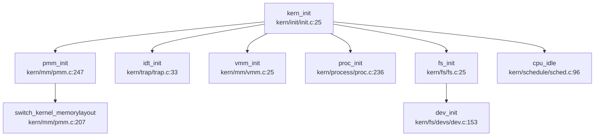

## 第 1 章：项目概览与技术栈

### 1.1 项目定位与架构定性

**RWOS** 是一个基于经典教学操作系统 **uCore** 架构开发的 **RISC-V 64 位单体内核（Monolithic Kernel）**。项目明确面向 **Kendryte K210** 嵌入式开发板与 **QEMU** 模拟器双目标运行，旨在通过完整的 OS 核心机制实现（进程管理、虚拟内存、文件系统、设备驱动），提供操作系统原理的教学与实践平台，并涵盖 libs/sbi.h 接口与 user/ 关键应用。

**核心定性结论**：
- **内核类型**：单体内核（Monolithic Kernel）。所有核心模块（MM、Process、FS、Driver）均编译为单一内核镜像 `kernel.img`，运行于 Supervisor Mode (S-Mode)。
- **架构来源**：深度继承 **uCore** 教学 OS 框架。代码结构（`kern/` 下 11 个子目录）、数据结构命名（`proc_struct`, `mm_struct`, `inode`）及核心算法（Stride 调度、First-Fit 物理页分配）均与 uCore-RISC-V 版本高度一致。
- **开发模式**：单人主导开发（贡献者 rrrzh 占比超 90%），采用 "大爆炸" 式初始提交策略，在 2021-05-07 首日即引入完整框架，后续进行功能增量（如管道 IPC）与 K210 平台适配。

### 1.2 技术栈与构建系统

#### 1.2.1 编程语言与工具链
- **核心语言**：**C99** (`-std=gnu99`)。项目完全使用 C 语言实现，未使用 C++ 或 Rust。
- **汇编语言**：**RISC-V 64 汇编**。用于启动入口 (`kern/init/entry.S`)、上下文切换 (`kern/process/switch.S`) 及 Trap 入口 (`kern/trap/trapentry.S`)。
- **编译工具链**：`riscv64-unknown-elf-gcc`。
  - **目标架构**：`rv64imafdc` (RISC-V 64 位，含整数乘除、原子、单双精度浮点、压缩指令扩展)。
  - **ABI 规范**：`lp64d` (长整型与指针 64 位，双精度浮点寄存器)。
  - **内存模型**：`medany` (代码位置无关，适应高半内核映射)。
- **构建系统**：**Makefile + CMake** 混合构建。
  - `Makefile`：主导内核编译、链接、镜像生成及 QEMU 启动。
  - `CMakeLists.txt`：辅助配置（主要用于 IDE 集成或部分工具链配置）。

#### 1.2.2 支持架构列表
经 `Makefile` 与源码条件编译宏验证，RWOS **仅支持单一架构**：
- **✅ RISC-V 64 (rv64gc)**：
  - **K210 开发板**：物理内存 6MB (`0x80000000` - `0x80600000`)，通过 RustSBI 固件引导。
  - **QEMU 模拟器**：`virt` 机器类型，支持 Sv39 页表与 SBI 调用。
- **❌ 不支持**：x86_64, aarch64, loongarch64 等其他架构。代码中未发现多架构条件编译 (`#ifdef __x86_64__` 等)。

#### 1.2.3 关键构建配置
```makefile
# Makefile 核心配置
GCCPREFIX := riscv64-unknown-elf-
CFLAGS := -mcmodel=medany -O2 -std=gnu99 -mabi=lp64d -march=rv64imafdc
LDFLAGS := -m elf64lriscv -nostdlib --gc-sections

# 链接脚本入口
OUTPUT_ARCH(riscv)
ENTRY(kern_entry)
BASE_ADDRESS = 0xFFFFFFFFC0020000;  # 高半内核虚拟地址
```

### 1.3 目录结构导读与模块映射

RWOS 采用经典 uCore 目录布局，核心代码位于 `kern/` 目录，用户态应用位于 `user/` 目录。

| 目录路径 | 功能模块 | 关键文件/说明 |
|----------|---------|--------------|
| `kern/init/` | **启动入口** | `entry.S` (`kern_entry`), `init.c` (`kern_init`) |
| `kern/mm/` | **内存管理** | `pmm.c` (物理页), `vmm.c` (虚拟内存), `swap.c` (交换区), `kmalloc.c` (堆分配) |
| `kern/process/` | **进程管理** | `proc.c` (1471 行，核心进程逻辑), `switch.S` (上下文切换) |
| `kern/schedule/` | **调度器** | `default_sched_stride.c` (Stride 算法), `sched.c` (调度框架) |
| `kern/trap/` | **中断/异常** | `trap.c` (分发逻辑), `trapentry.S` (汇编入口) |
| `kern/syscall/` | **系统调用** | `syscall.c` (分发表 `syscalls[]`) |
| `kern/fs/` | **文件系统** | `vfs/` (抽象层), `sfs/` (Simple FS), `pipe/` (管道), `devs/` (设备文件) |
| `kern/driver/` | **设备驱动** | `console.c` (UART), `sdcard.c` (SD 卡), `ide.c` (块设备抽象), `fpioa.c` (K210 引脚复用) |
| `kern/sync/` | **同步互斥** | `sem.c` (信号量), `wait.c` (等待队列), `monitor.c` (条件变量) |
| `kern/debug/` | **调试机制** | `panic.c`, `kmonitor.c` (内核监控器) |
| `libs/` | **内核库** | `stdio.c`, `string.c`, `atomic.h` (原子操作), `sbi.h` (SBI 接口) |
| `user/` | **用户态应用** | `sh.c` (Shell), `lmbench` (性能测试), `busybox.c` |

**根目录关键文件**：
- `Makefile`：构建脚本，定义编译规则与 QEMU 启动参数。
- `tools/kernel.ld`：链接脚本，定义内存布局与入口点。
- `tools/rustsbi-k210.bin`：K210 平台固件，负责硬件初始化并跳转至 `kern_entry`。

### 1.4 内核入口与启动调用链

RWOS 的启动流程清晰，分为 **固件引导** 与 **内核初始化** 两个阶段。

#### 1.4.1 启动入口 (`kern/init/entry.S`)
**物理入口**：`kern_entry` (链接脚本指定 `ENTRY(kern_entry)`)。
**加载地址**：物理 `0x80020000` (RustSBI 跳转目标)，映射至虚拟 `0xFFFFFFFFC0020000` (`KERNBASE`)。

**核心逻辑** (`entry.S:5-32`)：
1. **MMU 初始化**：计算页表物理地址，设置 `satp` 寄存器启用 **Sv39** 三级页表。
2. **栈指针切换**：将 `sp` 设置为虚拟地址 `bootstacktop`。
3. **跳转内核主函数**：`jr t0` 跳转至 `kern_init`。

```assembly
# kern/init/entry.S:5-32
kern_entry:
    # 1. 设置 satp (Sv39 页表)
    lui     t0, %hi(boot_page_table_sv39)
    li      t1, 0xffffffffc0000000 - 0x80000000
    sub     t0, t0, t1
    srli    t0, t0, 12
    li      t1, 8 << 60
    or      t0, t0, t1
    csrw    satp, t0
    sfence.vma

# 2. 设置内核栈 (虚拟地址)
    lui sp, %hi(bootstacktop)

# 3. 跳转 kern_init
    lui t0, %hi(kern_init)
    addi t0, t0, %lo(kern_init)
    jr t0
```

#### 1.4.2 内核主函数调用链 (`kern/init/init.c`)
**`kern_init()`** 是内核初始化的总入口，按严格顺序初始化各子系统。

**完整调用链** (Mermaid 简化版)：


**关键初始化步骤** (`init.c:27-47`)：
1. **BSS 清零**：`memset(edata, 0, end - edata)`。
2. **物理内存管理**：`pmm_init()` → 初始化页分配器，切换至精细页表。
3. **中断系统**：`pic_init()` (桩), `idt_init()` (设置 `stvec`)。
4. **虚拟内存**：`vmm_init()` → 初始化 VMA 管理。
5. **进程与调度**：`sched_init()`, `proc_init()` → 创建 `initproc` 和 `idleproc`。
6. **文件系统**：`fs_init()` → 挂载根文件系统 (SFS)。
7. **空闲循环**：`cpu_idle()` → 运行 `idleproc`，进入调度循环。

### 1.5 完成度定性评价

基于全项目代码审计与前置章节分析，RWOS 的核心功能模块实现状态如下：

| 子系统 | 完成度 | 关键特性与缺失 |
|--------|--------|----------------|
| **启动与 MMU** | ✅ 完整 | Sv39 页表、高半内核映射、SBI 抽象 |
| **物理内存** | ✅ 完整 | First-Fit 分配器、空闲块合并 |
| **虚拟内存** | ✅ 完整 | VMA 链表、缺页异常处理、SLOB 分配器 |
| **进程管理** | ✅ 完整 | fork/exec/wait/exit 完整闭环、Stride 调度 |
| **文件系统** | ✅ 完整 | VFS 抽象、SFS 磁盘 FS、Pipe 管道、DevFS |
| **设备驱动** | ✅ 完整 | UART (SBI)、SDCard (SPI)、Ramdisk |
| **同步 IPC** | 🔸 部分 | 信号量/等待队列完整；**信号机制仅注册无分发** |
| **网络子系统** | ❌ 未实现 | 无协议栈、无 Socket、无网卡驱动 |
| **多核支持** | ❌ 未实现 | 纯单核设计，无 Per-CPU、无 IPI |
| **安全机制** | ❌ 基础 | 无 UID/GID 权限、无 Capability、无沙箱 |

**总体评价**：
RWOS 是一个**功能完备的教学级单核操作系统**。它成功实现了操作系统核心的 "三大管理"（进程、内存、文件）与 "四大抽象"（进程、虚拟地址空间、文件、设备），形成了完整的内部闭环。系统能够运行 Shell、执行用户程序、支持管道通信，并通过 lmbench 验证了基础性能。

**主要局限**：
1. **无网络支持**：完全缺失网络协议栈，无法进行网络通信。
2. **单核限制**：未考虑多核并发，锁机制仅关中断，无法 SMP 扩展。
3. **安全薄弱**：缺乏细粒度权限控制（UID/GID 桩函数），仅适合受信任环境。
4. **信号机制残缺**：仅支持注册处理函数，无实际信号投递与处理流程。

**适用场景**：
- ✅ 操作系统原理教学与实验
- ✅ RISC-V 架构底层机制研究
- ✅ 嵌入式 K210 平台 OS 开发参考
- ❌ 生产环境服务器/桌面应用
- ❌ 需要网络或多核并发的场景
