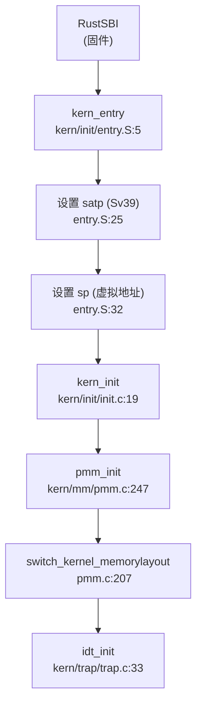

## 第 2 章：启动流程与架构初始化

### 启动入口与链接脚本分析

**启动入口位置**：`kern/init/entry.S` 中的 `kern_entry` 符号。

链接脚本 `tools/kernel.ld` 明确指定了入口点：

```ld
OUTPUT_ARCH(riscv)
ENTRY(kern_entry)
BASE_ADDRESS = 0xFFFFFFFFC0020000;
```

内核加载地址为 `0xFFFFFFFFC0020000`（虚拟地址），对应物理地址 `0x80020000`。这一偏移量由 `PHYSICAL_MEMORY_OFFSET = 0xFFFFFFFF40000000` 定义（见 `kern/mm/memlayout.h`）。

**固件级启动链**：
根据文档和 Makefile 分析，完整启动流程为：
1. **ROM** 将 `kernel.img` 加载到 `0x80000000`
2. **RustSBI**（`tools/rustsbi-k210.bin`）执行初始化，然后跳转到 `0x80020000`
3. **kern_entry**（`entry.S`）开始执行

```makefile
# Makefile 中的镜像打包逻辑
$(KERNELIMG): $(UCOREIMG) $(BOOTLOADER)
	$(COPY) $(BOOTLOADER) $@
	$(V)dd if=$(UCOREIMG) of=$@ bs=128K seek=1
```

内核镜像被放置在偏移 `128K (0x20000)` 处，因此 RustSBI 的跳转目标正是 `kern_entry`。

### 架构初始化流程（MMU/Trap/FPU）

#### MMU 初始化与 Sv39 页表启用

在 `kern/init/entry.S` 中，`kern_entry` 执行了关键的 MMU 初始化：

```assembly
kern_entry:
    # t0 := 三级页表的虚拟地址
    lui     t0, %hi(boot_page_table_sv39)
    # t1 := 0xffffffff40000000 即虚实映射偏移量
    li      t1, 0xffffffffc0000000 - 0x80000000
    # t0 减去虚实映射偏移量，变为三级页表的物理地址
    sub     t0, t0, t1
    # t0 >>= 12，变为三级页表的物理页号
    srli    t0, t0, 12

# t1 := 8 << 60，设置 satp 的 MODE 字段为 Sv39
    li      t1, 8 << 60
    # 将页表物理页号附加到 satp 中
    or      t0, t0, t1
    # 覆盖到 satp 寄存器，启用 MMU
    csrw    satp, t0
    sfence.vma
```

**页表结构**（`boot_page_table_sv39`）：
```assembly
boot_page_table_sv39:
    # 前 3 个页表项设置 identity mapping (VRWXAD)
    .quad (0x00000 << 10) | 0xcf
    .quad (0x40000 << 10) | 0xcf
    .quad (0x80000 << 10) | 0xcf
    # 中间 508 个页表项为空 (V=0)
    .zero 8 * 508
    # 最后一个页表项：0xffffffff_c0000000 → 0x80000000 (1G)
    .quad (0x80000 << 10) | 0xcf
```

这是一个 **Sv39 三级页表**，仅映射了低端 1GB 内存和高端内核区域（`0xFFFFFFFFC0000000` 映射到 `0x80000000`）。

#### 模式切换验证

**❌ 未发现 M-Mode→S-Mode 切换代码**。

通过搜索 `mstatus.mpp`、`sstatus.spp`、`PRIV_S`、`PRIV_M` 等关键词，未找到任何模式切换相关代码。RISC-V 的 `mstatus.MPP` 字段用于设置异常返回时的目标模式，但代码中未见相关操作。

**结论**：模式切换由 **RustSBI 固件完成**。RustSBI 在移交控制权前已将 CPU 置于 S-Mode，内核直接在 S-Mode 下运行。

#### Trap 向量设置

在 `kern/trap/trap.c` 的 `idt_init()` 中设置中断向量：

```c
void idt_init(void) {
    extern void __alltraps(void);
    /* Set sscratch register to 0, indicating to exception vector that we are
     * presently executing in the kernel */
    write_csr(sscratch, 0);
    /* Set the exception vector address */
    write_csr(stvec, &__alltraps);
}
```

- **`sscratch`**：用于内核/用户栈切换。异常处理程序通过 `csrrw sp, sscratch, sp` 判断异常来源（用户态/内核态）。
- **`stvec`**：指向 `__alltraps`（`kern/trap/trapentry.S`），这是所有异常/中断的统一入口。

**`__alltraps` 关键逻辑**（`trapentry.S`）：
```assembly
__alltraps:
    SAVE_ALL
    move  a0, sp
    jal trap
    RESTORE_ALL
    sret
```

#### FPU 初始化状态

**❌ 未实现**。

搜索 `sstatus.fs`、`SSTATUS_FS` 等关键词，仅在 `libs/riscv.h` 中找到定义：
```c
#define SSTATUS_FS          0x00006000
```

但**没有任何代码操作该位**。内核未启用 FPU 状态保存/恢复，用户态程序无法使用浮点指令。

### 到达内核主函数的路径（完整调用链）

**启动流程**：



**详细步骤**：

1. **`kern_entry`** (`entry.S:5`)：
   - 计算页表物理地址并设置 `satp`（启用 Sv39）
   - 刷新 TLB（`sfence.vma`）
   - 设置内核栈指针 `sp` 为虚拟地址 `bootstacktop`
   - 跳转到 `kern_init`

2. **`kern_init`** (`init.c:19`)：
   ```c
   int kern_init(void) {
       memset(edata, 0, end - edata);  // BSS 清零
       pmm_init();                      // 物理内存管理 + 页表切换
       idt_init();                      // 设置 trap 向量
       vmm_init();                      // 虚拟内存管理
       proc_init();                     // 进程初始化
       clock_init();                    // 时钟初始化
       intr_enable();                   // 启用中断
       cpu_idle();                      // 运行空闲进程
   }
   ```

3. **`pmm_init`** (`pmm.c:247`)：
   - `page_init()`：计算 `va_pa_offset`，初始化 `pages` 数组
   - `switch_kernel_memorylayout()`：创建精细页表并切换

### 早期初始化机制

#### BSS 清零

在 `kern_init` 入口处：
```c
extern char edata[], end[];
memset(edata, 0, end - edata);
```

#### 串口实现（SBI 抽象）

**✅ 通过 SBI 实现，无直接 MMIO 访问**。

`kern/driver/console.c` 调用 SBI：
```c
void serial_putc(int c) {
    sbi_console_putchar(c);
}

int serial_proc_data(void) {
    int c = sbi_console_getchar();
    // ...
}
```

SBI 调用宏（`libs/sbi.h`）：
```c
#define SBI_CALL(which, arg0, arg1, arg2) ({
    register uintptr_t a0 asm ("a0") = (uintptr_t)(arg0);
    register uintptr_t a7 asm ("a7") = (uintptr_t)(which);
    asm volatile ("ecall" : "+r" (a0) : "r" (a1), "r" (a2), "r" (a7) : "memory");
    a0;
})

static inline void sbi_console_putchar(int ch) {
    SBI_CALL_1(SBI_CONSOLE_PUTCHAR, ch);
}
```

**MMU 启用前后地址切换**：
- **启用前**：RustSBI 通过 SBI 调用处理串口，内核无需关心物理地址
- **启用后**：SBI 调用通过 `ecall` 陷入固件，由固件处理硬件访问

#### 虚实地址映射偏移量

在 `kern/mm/pmm.c` 的 `page_init()` 中：
```c
va_pa_offset = KERNBASE - 0x80020000;
// KERNBASE = 0xFFFFFFFFC0020000
// va_pa_offset = 0xFFFFFFFF40000000
```

该偏移量用于物理地址↔虚拟地址转换：
```c
#define PADDR(kva) (((uintptr_t)(kva)) - va_pa_offset)
#define pa2kva(pa) ((void *)((pa) + va_pa_offset))
```

### 多平台启动流程

**❌ 仅支持 K210 平台**。

搜索 `visionfive`、`jh7110`、`loongarch` 等关键词，**未找到任何多平台适配代码**。

**编译目标**（`Makefile`）：
```makefile
GCCPREFIX := riscv64-unknown-elf-
CFLAGS := -mcmodel=medany -O2 -std=gnu99 -mabi=lp64d -march=rv64imafdc
```

目标架构为 `riscv64gc-unknown-none-elf`（`rv64imafdc` 包含 FPU/D 扩展，但**FPU 未初始化**）。

**平台特定文件**：
- `tools/rustsbi-k210.bin`：K210 专用 bootloader
- `kern/driver/fpioa.c/h`、`sysctl.c/h`：K210 芯片特定驱动（FPIOA、系统控制）

### 平台配置与构建机制

**构建系统**：基于 Makefile 的传统 C 项目构建。

**关键配置**：
```makefile
# 编译器和标志
CC := riscv64-unknown-elf-gcc
CFLAGS := -mcmodel=medany -O2 -mabi=lp64d -march=rv64imafdc
LDFLAGS := -m elf64lriscv -nostdlib --gc-sections

# 链接脚本
kernel: tools/kernel.ld
    $(LD) $(LDFLAGS) -T tools/kernel.ld -o $@ $(KOBJS)
```

**内存布局**（`kern/mm/memlayout.h`）：
```c
#define KERNBASE            0xFFFFFFFFC0020000
#define PHYSICAL_MEMORY_END 0x80600000
#define KMEMSIZE            0x5E0000  // 6MB - 128KB (RustSBI 占用)
```

K210 物理内存：`0x80000000` - `0x80600000`（6MB），其中 `0x80000000` - `0x80020000` 被 RustSBI 占用。

### 关键代码片段分析

#### 1. 页表切换（`pmm.c:207`）

```c
static void switch_kernel_memorylayout() {
    pde_t *kern_pgdir = (pde_t *)boot_alloc_page();
    memset(kern_pgdir, 0, PGSIZE);

// 设置代码段 (rx) 和数据段 (rw) 权限
    extern const char etext[];
    uintptr_t retext = ROUNDUP((uintptr_t)etext, PGSIZE);
    boot_map_segment(kern_pgdir, KERNBASE, retext - KERNBASE, PADDR(KERNBASE), PTE_R | PTE_X);
    boot_map_segment(kern_pgdir, retext, KERNTOP - retext, PADDR(retext), PTE_R | PTE_W);
    setup_kernel_io_mapping(kern_pgdir);

// 切换页目录
    boot_pgdir = kern_pgdir;
    boot_cr3 = PADDR(boot_pgdir);
    lcr3(boot_cr3);  // 写 satp 寄存器
    flush_tlb();
}
```

#### 2. Trap 返回（`trapentry.S:124`）

```assembly
__trapret:
    RESTORE_ALL
    sret  // 从 S-Mode 返回
```

`RESTORE_ALL` 恢复 `sstatus` 和 `sepc`，`sret` 根据 `sstatus.SPP` 位决定返回用户态还是内核态。

#### 3. 内核栈保护（`pmm.c:233`）

```c
// 设置内核栈守卫页
boot_map_segment(boot_pgdir, bootstackguard, PGSIZE, PADDR(bootstackguard), 0);
boot_map_segment(boot_pgdir, boot_page_table_sv39, PGSIZE, PADDR(boot_page_table_sv39), 0);
```

将栈下方和页表所在页设为不可访问，检测栈溢出。

---

**本章总结**：

| 特性 | 状态 | 证据 |
|------|------|------|
| 启动入口 | ✅ 已实现 | `kern/init/entry.S:kern_entry` |
| MMU 初始化 (Sv39) | ✅ 已实现 | `entry.S:25` 设置 `satp` |
| Trap 向量设置 | ✅ 已实现 | `kern/trap/trap.c:idt_init()` |
| 模式切换 (M→S) | 🔸 由固件完成 | 未发现内核代码，假设 RustSBI 处理 |
| FPU 初始化 | ❌ 未实现 | 仅定义 `SSTATUS_FS`，无操作代码 |
| 多平台适配 | ❌ 仅 K210 | 未发现 `visionfive/loongarch` 代码 |
| 串口实现 | ✅ SBI 抽象 | `console.c` 调用 `sbi_console_putchar` |
| BSS 清零 | ✅ 已实现 | `init.c:27` `memset(edata, 0, end-edata)` |
