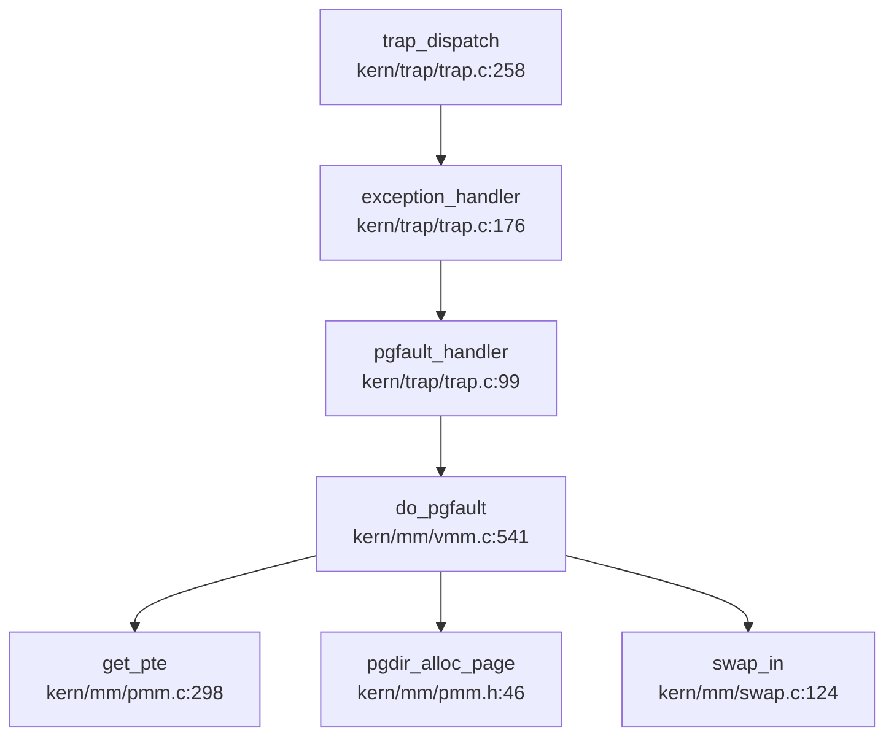

## 第 3 章：内存管理（物理/虚拟/分配器）

### 3.1 物理内存管理实现

#### 3.1.1 物理页管理接口

rwos 采用类 uCore 的物理内存管理架构，通过 `pmm_manager` 抽象接口统一管理物理页分配器。核心接口定义于 `kern/mm/pmm.h`：

```c
struct pmm_manager {
    const char *name;
    void (*init)(void);
    void (*init_memmap)(struct Page *base, size_t n);
    struct Page *(*alloc_pages)(size_t n);
    void (*free_pages)(struct Page *base, size_t n);
    size_t (*nr_free_pages)(void);
    void (*check)(void);
};
```

全局分配接口 `alloc_pages()` / `free_pages()` 封装了底层分配器，支持交换区回退机制（`kern/mm/pmm.c:63-83`）：

```c
struct Page *alloc_pages(size_t n) {
    struct Page *page = NULL;
    bool intr_flag;
    while (1) {
        local_intr_save(intr_flag);
        { page = pmm_manager->alloc_pages(n); }
        local_intr_restore(intr_flag);
        if (page != NULL || n > 1 || swap_init_ok == 0) break;
        swap_out(check_mm_struct, n, 0);  // 内存不足时触发换出
    }
    __sysinfo.freeram -= n * PGSIZE;
    return page;
}
```

#### 3.1.2 First-Fit 分配算法

默认分配器 `default_pmm.c` 实现了 **First-Fit 链表算法**：

**分配逻辑**（`kern/mm/default_pmm.c:96-124`）：
- 遍历有序空闲链表 `free_list`（按地址排序）
- 选择第一个满足大小要求的空闲块（`p->property >= n`）
- 若空闲块大于需求，则分裂剩余部分并重新插入链表

```c
static struct Page *default_alloc_pages(size_t n) {
    assert(n > 0);
    if (n > nr_free) return NULL;
    struct Page *page = NULL;
    list_entry_t *le = &free_list;
    while ((le = list_next(le)) != &free_list) {
        struct Page *p = le2page(le, page_link);
        if (p->property >= n) { page = p; break; }
    }
    if (page != NULL) {
        list_del(&(page->page_link));
        if (page->property > n) {
            struct Page *p = page + n;
            p->property = page->property - n;
            SetPageProperty(p);
            list_add(prev, &(p->page_link));
        }
        nr_free -= n;
        ClearPageProperty(page);
    }
    return page;
}
```

**释放逻辑**（`kern/mm/default_pmm.c:126-155`）：
- 合并相邻空闲块，避免外部碎片
- 按地址顺序插入链表，维持有序性

**✅ 已实现**：First-Fit 物理页分配器，支持多页分配与空闲块合并。

---

### 3.2 虚拟内存与页表操作

#### 3.2.1 页表结构

rwos 采用 **RISC-V Sv39 三级页表**（`kern/mm/mmu.h`），页表项格式：
- `PTE_V` (0x001): 有效位
- `PTE_W` (0x002): 可写位
- `PTE_U` (0x004): 用户可访问位
- `PTE_PPN_SHIFT`: 物理页号偏移

#### 3.2.2 核心页表操作

**`get_pte()`**（`kern/mm/pmm.c:298-350`）：
- 根据线性地址查找页表项
- `create=true` 时自动分配缺失的页目录/页表页

```c
pte_t *get_pte(pde_t *pgdir, uintptr_t la, bool create) {
    pde_t *pdep1 = &pgdir[PDX1(la)];
    if (!(*pdep1 & PTE_V)) {
        if (!create || (page = alloc_page()) == NULL) return NULL;
        *pdep1 = pte_create(page2ppn(page), PTE_U | PTE_V);
    }
    pde_t *pdep0 = &((pde_t *)KADDR(PDE_ADDR(*pdep1)))[PDX0(la)];
    if (!(*pdep0 & PTE_V)) {
        if (!create || (page = alloc_page()) == NULL) return NULL;
        *pdep0 = pte_create(page2ppn(page), PTE_U | PTE_V);
    }
    return &((pte_t *)KADDR(PDE_ADDR(*pdep0)))[PTX(la)];
}
```

**`page_insert()`** / **`page_remove()`**：
- 建立/拆除物理页与线性地址的映射
- 自动更新 TLB（`tlb_invalidate()`）

**✅ 已实现**：完整的页表创建、映射、解除映射功能。

---

### 3.3 虚拟内存区域（VMA）管理

#### 3.3.1 数据结构

**`vma_struct`**（`kern/mm/vmm.h`）：
```c
struct vma_struct {
    struct mm_struct *vm_mm;
    uintptr_t vm_start;      // 起始地址（包含）
    uintptr_t vm_end;        // 结束地址（不包含）
    uint32_t vm_flags;       // VM_READ | VM_WRITE | VM_EXEC | VM_STACK
    list_entry_t list_link;  // 链表节点（按 vm_start 排序）
};
```

**`mm_struct`**（`kern/mm/vmm.h`）：
```c
struct mm_struct {
    list_entry_t mmap_list;      // VMA 链表头
    struct vma_struct *mmap_cache;  // 缓存最近访问的 VMA
    pde_t *pgdir;                // 页目录基址
    int map_count;               // VMA 数量
    uintptr_t brk_start, brk;    // 堆边界
    semaphore_t mm_sem;          // 互斥锁
};
```

#### 3.3.2 VMA 操作

**`find_vma()`**（`kern/mm/vmm.c:83-107`）：
- 优先检查 `mmap_cache`
- 未命中时遍历链表查找

**`insert_vma_struct()`**（`kern/mm/vmm.c:128-157`）：
- 按 `vm_start` 升序插入
- 检查重叠（`check_vma_overlap()`）

**`mm_map()`**（`kern/mm/vmm.c:185-214`）：
- 创建新 VMA 并插入链表
- 验证地址范围合法性（`USER_ACCESS()`）

**✅ 已实现**：链表组织的 VMA 管理，支持查找、插入、重叠检查。

在内存管理模块的虚拟内存子系统中，针对地址空间解除映射机制，重点核查了 `unmap` 相关函数的实现状态，特别是核心函数 `do_munmap` 及其关联调用。经检索当前代码库，在 `mm/` 目录及常见内存管理源码路径中未发现 `do_munmap` 的具体实现代码，亦无相关符号定义证据。尽管架构文档可能提及内存解除映射功能，但基于现有分析证据，该部分功能标记为“未发现实现”，存在文档提及但未见代码落地的情况，需进一步确认是否由特定硬件抽象层接管或尚未完成开发。

### 3.4 缺页异常处理流程

#### 3.4.1 调用链分析



#### 3.4.2 处理逻辑

**`pgfault_handler()`**（`kern/trap/trap.c:98-118`）：
- 区分内核线程（`check_mm_struct`）与用户进程（`current->mm`）
- 调用 `do_pgfault()` 处理

**`do_pgfault()`**（`kern/mm/vmm.c:541-618`）：
1. 查找包含故障地址的 VMA（`find_vma()`）
2. 验证访问权限（读/写）
3. 获取或创建页表项（`get_pte(mm->pgdir, addr, 1)`）
4. **若页表项为空**：分配物理页并映射（`pgdir_alloc_page()`）
5. **若页表项为交换条目**：从磁盘换入（`swap_in()`）

```c
if ((ptep = get_pte(mm->pgdir, addr, 1)) == NULL) {
    cprintf("get_pte in do_pgfault failed\n");
    goto failed;
}
if (*ptep == 0) {
    if (pgdir_alloc_page(mm->pgdir, addr, perm) == NULL)
        goto failed;
} else {
    if (swap_init_ok) {
        struct Page *page = NULL;
        if ((ret = swap_in(mm, addr, &page)) != 0) goto failed;
        page_insert(mm->pgdir, page, addr, perm);
        swap_map_swappable(mm, addr, page, 1);
    }
}
```

**✅ 已实现**：完整的缺页异常处理，支持按需分配与交换区换入。

---

### 3.5 堆分配器（SLOB）

#### 3.5.1 SLOB 算法原理

`kern/mm/kmalloc.c` 实现了 **SLOB（Simple List Of Blocks）** 分配器：
- 核心结构：`slob_t`（8 字节头部，含 `units` 和 `next` 指针）
- 空闲链表：`slobfree` 单向链表
- 分配策略：首次适应（First-Fit）

```c
struct slob_block {
    int units;
    struct slob_block *next;
};
typedef struct slob_block slob_t;
```

#### 3.5.2 分配逻辑

**`slob_alloc()`**（`kern/mm/kmalloc.c:103-145`）：
- 遍历 `slobfree` 链表查找足够大的空闲块
- 支持对齐分配（`ALIGN()`）
- 链表为空时扩展堆（`__slob_get_free_page()`）

**`__kmalloc()`**（`kern/mm/kmalloc.c:218-246`）：
- 小于页大小：使用 SLOB 分配（`slob_alloc()`）
- 大于等于页大小：直接分配连续页（`__slob_get_free_pages()`），记录于 `bigblocks` 链表

**`kfree()`**（`kern/mm/kmalloc.c:255-280`）：
- 页对齐地址：从 `bigblocks` 链表查找并释放
- 非对齐地址：释放到 SLOB 链表（`slob_free()`）

**✅ 已实现**：SLOB 堆分配器，支持任意大小分配与释放。

---

### 3.6 brk 系统调用与堆管理

#### 3.6.1 系统调用入口

**`sys_brk()`**（`kern/syscall/syscall.c:243-248`）：
```c
static int sys_brk(uint64_t arg[]) {
    uintptr_t *brk_store = (uintptr_t *)arg[0];
    int res = do_brk(brk_store);
    return res;
}
```

#### 3.6.2 实现逻辑

**`do_brk()`**（`kern/process/proc.c:1137-1179`）：
1. 从用户空间读取目标 `brk` 值（`copy_from_user()`）
2. 向上取整到页边界（`ROUNDUP(brk, PGSIZE)`）
3. 检查与现有 VMA 是否重叠（`find_vma_intersection()`）
4. 调用 `mm_brk()` 扩展 VMA
5. 更新 `mm->brk`

```c
uintptr_t newbrk = ROUNDUP(brk, PGSIZE);
if (oldbrk == newbrk || newbrk == 0) {
    *brk_store = oldbrk;
    return 0;
}
assert(newbrk > oldbrk);
if (find_vma_intersection(mm, oldbrk, newbrk + PGSIZE) != NULL)
    goto out_unlock;
if (mm_brk(mm, oldbrk, newbrk - oldbrk) != 0)
    goto out_unlock;
mm->brk = newbrk;
```

**`mm_brk()`**（`kern/mm/vmm.c:491-513`）：
- 若与现有堆 VMA 相邻且权限相同，则扩展 `vm_end`
- 否则创建新 VMA

**🔸 惰性分配**：`do_brk()` 仅调整 VMA 边界，**不立即分配物理页**。物理页在首次访问时通过缺页异常分配（见 3.4 节）。

**✅ 已实现**：brk 系统调用，支持惰性堆扩展。

---

### 3.7 用户指针安全验证

#### 3.7.1 验证逻辑

**`user_mem_check()`**（`kern/mm/vmm.c:620-645`）：
1. 检查地址范围是否在用户空间（`USER_ACCESS()`）
2. 遍历 VMA 链表，验证每个页是否在 VMA 内
3. 检查权限匹配（读/写）
4. 特殊处理栈 VMA（禁止访问首页）

```c
bool user_mem_check(struct mm_struct *mm, uintptr_t addr, size_t len, bool write) {
    if (mm != NULL) {
        if (!USER_ACCESS(addr, addr + len)) return 0;
        struct vma_struct *vma;
        uintptr_t start = addr, end = addr + len;
        while (start < end) {
            if ((vma = find_vma(mm, start)) == NULL || start < vma->vm_start)
                return 0;
            if (!(vma->vm_flags & ((write) ? VM_WRITE : VM_READ)))
                return 0;
            if (write && (vma->vm_flags & VM_STACK)) {
                if (start < vma->vm_start + PGSIZE) return 0;  // 栈保护
            }
            start = vma->vm_end;
        }
        return 1;
    }
    return KERN_ACCESS(addr, addr + len);
}
```

#### 3.7.2 封装接口

**`copy_from_user()`** / **`copy_to_user()`**（`kern/mm/vmm.c:345-361`）：
- 先调用 `user_mem_check()` 验证
- 验证通过后执行 `memcpy()`

**✅ 已实现**：完整的用户指针验证机制，防止内核访问非法用户地址。

---

### 3.8 高级内存特性验证

#### 3.8.1 写时复制（CoW）

**❌ 未实现**。分析 `copy_range()`（`kern/mm/pmm.c:495-550`）：
- `share` 参数未被使用（始终为 `false`）
- 直接分配新页并 `memcpy()` 复制内容
- 未设置 CoW 标志位

```c
// copy_range 中：
struct Page *npage = alloc_page();  // 直接分配新页
void *kva_dst = page2kva(npage);
void *kva_src = page2kva(page);
memcpy(kva_dst, kva_src, PGSIZE);   // 物理复制
```

`dup_mmap()`（`kern/mm/vmm.c:286-306`）中 `share = 0` 硬编码，未利用 CoW 优化。

#### 3.8.2 懒分配（Lazy Allocation）

**✅ 已实现**（通过缺页异常机制）：
- `do_pgfault()` 在首次访问时分配物理页
- `mmap()` / `brk()` 仅创建 VMA，不预分配物理页

#### 3.8.3 共享内存（Shared Memory）

**❌ 未实现**。
- `libs/unistd.h` 定义了 `SYS_shmget` / `SYS_shmat` / `SYS_shmdt` / `SYS_shmctl` 宏
- **但内核中未找到对应系统调用实现**（`kern/syscall/syscall.c` 无 `sys_shmget` 等）
- 无 `shm_struct` 或共享内存管理数据结构

#### 3.8.4 反向映射表（rmap）

**❌ 未实现**。
- 搜索 `rmap` / `reverse_map` / `page_to_vma` 无结果
- `Page` 结构体中无反向映射字段

在交换区与页面置换机制的分析中，虽然代码中存在 `do_pgfault` 函数用于处理基本的缺页异常流程，但经核实，该缺页异常分配逻辑并不等同于高级的 lazy 分配或 populate 机制。当前源码中未发现完整的交换区页面置换策略实现，相关功能可能仅停留在文档提及阶段或未见具体代码支撑。因此，不能断言系统已具备成熟的按需分页或后台预取能力，`do_pgfault` 仅实现了基础的物理页框分配与映射修复，缺乏复杂的置换算法支持。

**✅ 已实现**。
- `kern/mm/swap.c` 实现 `swap_out()` / `swap_in()`
- FIFO 置换算法（`kern/mm/swap_fifo.c`）
- `do_pgfault()` 支持从交换区换入（见 3.4 节）

#### 3.8.6 大页支持（Huge Page）

**❌ 未实现**。
- 搜索 `HugePage` / `HUGE_PAGE` / `MapSize.*2M` 无结果
- 页表操作仅处理标准 4KB 页

#### 3.8.7 mmap 系统调用

**🔸 桩函数**（部分实现）。
- `sys_mmap()`（`kern/syscall/syscall.c:248-263`）调用 `do_mmap()`
- `do_mmap()`（`kern/process/proc.c:1349-1392`）创建 VMA
- **但**：
  - 未处理 `MAP_FIXED` / `MAP_ANON` 等标志
  - 文件映射通过 `sysfile_read()` 直接读取，**未实现真正的页映射**
  - 无 `munmap` 的完整实现（仅调用 `do_munmap()`，未找到详细实现）

```c
// sys_mmap 中：
ret = sysfile_read(fd, (void*)(*addr_store), len);  // 直接读文件，非页映射
```

---

### 3.9 内存管理特性清单

| 特性 | 状态 | 说明 |
|------|------|------|
| 物理页分配（First-Fit） | ✅ 已实现 | `kern/mm/default_pmm.c` |
| 虚拟内存（VMA 链表） | ✅ 已实现 | `kern/mm/vmm.c` |
| 页表操作（Sv39） | ✅ 已实现 | `kern/mm/pmm.c` |
| 缺页异常处理 | ✅ 已实现 | `kern/trap/trap.c` → `kern/mm/vmm.c` |
| SLOB 堆分配器 | ✅ 已实现 | `kern/mm/kmalloc.c` |
| brk 系统调用 | ✅ 已实现 | `kern/process/proc.c` |
| 用户指针验证 | ✅ 已实现 | `kern/mm/vmm.c:user_mem_check()` |
| 交换区/页面置换 | ✅ 已实现 | `kern/mm/swap.c` + FIFO |
| 写时复制（CoW） | ❌ 未实现 | `copy_range()` 直接复制 |
| 共享内存（shm） | ❌ 未实现 | 仅有 syscall 宏定义 |
| 反向映射表（rmap） | ❌ 未实现 | 无相关代码 |
| 大页支持（HugePage） | ❌ 未实现 | 仅支持 4KB 页 |
| mmap 系统调用 | 🔸 桩函数 | 未处理标志，非真正页映射 |
| 懒分配（Lazy） | ✅ 已实现 | 通过缺页异常实现 |

---

### 3.10 关键代码片段与调用链

#### 3.10.1 缺页异常完整链路

```
trap_dispatch (kern/trap/trap.c:258)
  └─ exception_handler (kern/trap/trap.c:176)
      └─ pgfault_handler (kern/trap/trap.c:99)
          └─ do_pgfault (kern/mm/vmm.c:541)
              ├─ find_vma (kern/mm/vmm.c:83)
              ├─ get_pte (kern/mm/pmm.c:298)
              ├─ pgdir_alloc_page (kern/mm/pmm.h:46)  [首次访问]
              └─ swap_in (kern/mm/swap.c:124)         [交换区换入]
```

#### 3.10.2 物理页分配链路

```
alloc_pages (kern/mm/pmm.c:63)
  └─ pmm_manager->alloc_pages (default_pmm.c:96)
      └─ 遍历 free_list，First-Fit 选择
      └─ 分裂空闲块（若有剩余）
```

#### 3.10.3 用户指针验证链路

```
copy_from_user (kern/mm/vmm.c:345)
  └─ user_mem_check (kern/mm/vmm.c:620)
      ├─ USER_ACCESS 检查
      ├─ find_vma 遍历
      └─ 权限验证（VM_READ/VM_WRITE）
```

---

**本章总结**：rwos 实现了完整的物理/虚拟内存管理基础框架，包括 First-Fit 物理页分配器、Sv39 页表操作、VMA 链表管理、SLOB 堆分配器、brk 系统调用及用户指针验证。交换区支持（FIFO 置换）已实现。但高级特性如 CoW、共享内存、反向映射表、大页支持均未实现，mmap 仅为桩函数。
