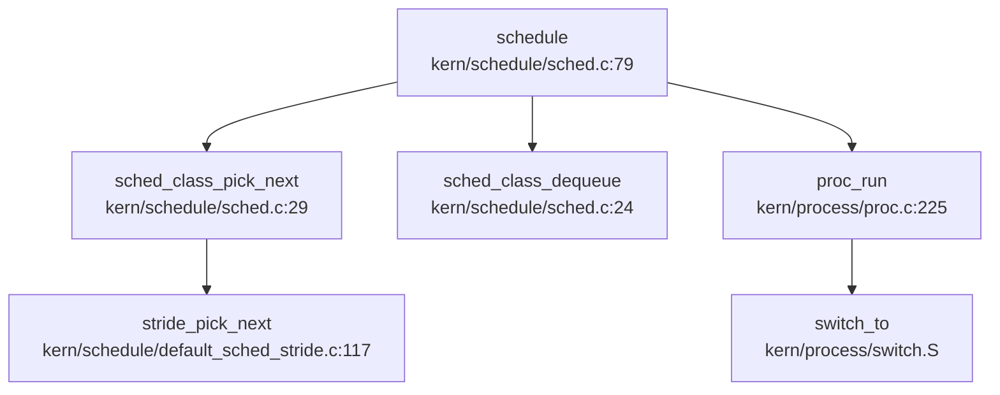
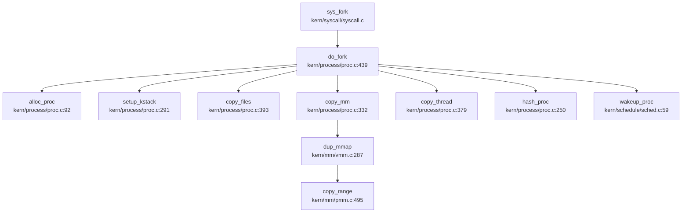

## 第 4 章：进程/线程与调度机制

### 4.1 任务模型与核心数据结构

rwos 采用类 uCore 的单层进程模型，**未区分 Process 与 Thread**，所有执行实体统一使用 `struct proc_struct` 表示。核心结构体定义于 `kern/process/proc.h:47-77`：

```c
struct proc_struct {
    enum proc_state state;                      // 进程状态
    int pid;                                    // 进程 ID
    int runs;                                   // 运行次数
    uintptr_t kstack;                           // 内核栈地址
    volatile bool need_resched;                 // 需要重新调度标志
    struct proc_struct *parent;                 // 父进程指针
    struct mm_struct *mm;                       // 内存管理结构
    struct context context;                     // 上下文（14 个寄存器）
    struct trapframe *tf;                       // 中断帧指针
    uintptr_t cr3;                              // 页目录基址
    uint32_t flags;                             // 进程标志
    char name[PROC_NAME_LEN + 1];               // 进程名
    list_entry_t list_link;                     // 全局链表
    list_entry_t hash_link;                     // 哈希链表
    int exit_code;                              // 退出码
    uint32_t wait_state;                        // 等待状态
    struct proc_struct *cptr, *yptr, *optr;     // 子进程/兄弟进程关系
    struct run_queue *rq;                       // 所属运行队列
    list_entry_t run_link;                      // 运行队列链接
    int time_slice;                             // 时间片
    skew_heap_entry_t lab6_run_pool;            // Stride 调度斜堆节点
    uint32_t lab6_stride;                       // Stride 值
    uint32_t lab6_priority;                     // 优先级
    struct files_struct *filesp;                // 文件描述符表
    list_entry_t thread_group;                  // 线程组（未实现）
    struct sigaction sigactions[SIGRTMIN];      // 信号处理数组
};
```

**关键字段说明**：
- `context`：保存 14 个 callee-saved 寄存器（ra, sp, s0-s11），用于内核态上下文切换
- `tf`：指向 trapframe，保存用户态全部寄存器（含 a0-a7, t0-t6 等）
- `lab6_stride` / `lab6_priority`：Stride 调度算法专用字段
- `thread_group`：注释标注"remote for sys_clone"，**❌ 未实现**线程组管理

**进程组与会话管理**：
- 通过 `grep_in_repo` 搜索 `pgid|session_id|set_sid|setpgid`，仅在 `libs/unistd.h` 发现 syscall 号定义（`SYS_setpgid=154`, `SYS_getpgid=155`）
- **❌ 未实现**：内核中无 `sys_setpgid` / `sys_getpgid` 实现函数，无进程组、会话管理逻辑

---

### 4.2 调度算法与策略（代码证据）

rwos 实现了 **Stride 调度算法**（比例公平调度），位于 `kern/schedule/default_sched_stride.c`。

#### 4.2.1 Stride 调度核心公式

```c
// kern/schedule/default_sched_stride.c:11
#define BIG_STRIDE (1 << 30)

// kern/schedule/default_sched_stride.c:129
static struct proc_struct *
stride_pick_next(struct run_queue *rq) {
    if (rq->lab6_run_pool == NULL) {
        return NULL;
    }
    struct proc_struct* proc = le2proc(rq->lab6_run_pool, lab6_run_pool);
    proc->lab6_stride += proc->lab6_priority ? BIG_STRIDE / proc->lab6_priority : BIG_STRIDE;
    return proc;
}
```

**算法原理**：
1. 使用**斜堆（Skew Heap）**优先队列管理就绪进程，按 `lab6_stride` 排序
2. 每次选择 stride 最小的进程运行（`stride_pick_next` 从堆顶取出）
3. 运行后更新 stride：`stride += BIG_STRIDE / priority`
4. 优先级越高（`priority` 值越大），stride 增量越小，被调度频率越高

#### 4.2.2 调度器调用链

通过 `lsp_get_call_graph` 分析 `schedule()` 函数（`kern/schedule/sched.c:79`）：



**调度触发点**（Incoming Calls）：
- `trap`（时钟中断）
- `do_exit`（进程退出）
- `do_sleep` / `do_wait`（进程阻塞）
- `cpu_idle`（空闲循环）

#### 4.2.3 调度策略验证

✅ **已实现**：Stride 调度器完整实现，包含：
- `stride_init`：初始化运行队列与斜堆
- `stride_enqueue`：使用 `skew_heap_insert` 入队
- `stride_dequeue`：使用 `skew_heap_remove` 出队
- `stride_pick_next`：选择最小 stride 进程并更新
- `stride_proc_tick`：时间片递减与重调度标志设置

---

### 4.3 任务状态机

rwos 定义了 4 种进程状态（`kern/process/proc.h:13-17`）：

```c
enum proc_state {
    PROC_UNINIT = 0,   // 未初始化
    PROC_SLEEPING,     // 睡眠状态
    PROC_RUNNABLE,     // 可运行（可能在运行）
    PROC_ZOMBIE        // 僵尸状态（等待父进程回收）
};
```

**状态流转图**（基于 `kern/process/proc.c:26-40` 注释）：

```
PROC_UNINIT -- alloc_proc/wakeup_proc --> PROC_RUNNABLE
     |
     +-- try_free_pages/do_wait/do_sleep --> PROC_SLEEPING
     |                                          |
     |                                          +-- wakeup_proc --> PROC_RUNNABLE
     |
     +-- do_exit --> PROC_ZOMBIE -- wait_proc (父进程回收) --> 销毁
```

**关键状态转换点**：
1. **PROC_UNINIT → PROC_RUNNABLE**：`alloc_proc()` 初始化为 `PROC_UNINIT`，`wakeup_proc()` 设置为 `PROC_RUNNABLE`
2. **PROC_RUNNABLE → PROC_SLEEPING**：`do_wait()` / `do_sleep()` 设置 `current->state = PROC_SLEEPING`
3. **PROC_SLEEPING → PROC_RUNNABLE**：`wakeup_proc()` 唤醒
4. **PROC_RUNNABLE → PROC_ZOMBIE**：`do_exit()` 设置 `current->state = PROC_ZOMBIE`

✅ **已实现**：完整状态机流转，含僵尸进程回收机制（`do_wait` 检查 `PROC_ZOMBIE` 状态）

---

### 4.4 上下文切换实现（汇编分析）

上下文切换汇编代码位于 `kern/process/switch.S`（39 行），实现 `switch_to` 函数：

```asm
# void switch_to(struct proc_struct* from, struct proc_struct* to)
.globl switch_to
switch_to:
    # save from's registers
    STORE ra, 0*REGBYTES(a0)
    STORE sp, 1*REGBYTES(a0)
    STORE s0, 2*REGBYTES(a0)
    STORE s1, 3*REGBYTES(a0)
    STORE s2, 4*REGBYTES(a0)
    STORE s3, 5*REGBYTES(a0)
    STORE s4, 6*REGBYTES(a0)
    STORE s5, 7*REGBYTES(a0)
    STORE s6, 8*REGBYTES(a0)
    STORE s7, 9*REGBYTES(a0)
    STORE s8, 10*REGBYTES(a0)
    STORE s9, 11*REGBYTES(a0)
    STORE s10, 12*REGBYTES(a0)
    STORE s11, 13*REGBYTES(a0)

# restore to's registers
    LOAD ra, 0*REGBYTES(a1)
    LOAD sp, 1*REGBYTES(a1)
    # ... (s0-s11 恢复，略)

ret
```

**保存/恢复的寄存器清单**（共 14 个）：
| 寄存器 | 用途 | 偏移 |
|--------|------|------|
| ra | 返回地址 | 0 |
| sp | 栈指针 | 1 |
| s0-s11 | 被调用者保存寄存器 | 2-13 |

**切换流程**：
1. 将 `from` 进程的 14 个寄存器保存到 `from->context` 结构体
2. 从 `to->context` 恢复 14 个寄存器到 CPU
3. `ret` 指令跳转到 `to` 进程的 `ra`（即 `to->context.ra`）

✅ **已实现**：纯汇编上下文切换，无 C 语言依赖，符合 RISC-V 调用约定

---

### 4.5 进程间通信与同步（Signal/Futex）

#### 4.5.1 信号机制（Signal）

**✅ 部分实现**：
- `kern/process/signal.c` 实现了信号处理函数注册：
  - `init_proc_sigactions()`：初始化 `sigactions` 数组为 `SIG_DFL`
  - `copy_proc_sigactions()`：fork 时复制信号处理表
  - `do_rt_sigaction()`：用户态注册信号处理函数

```c
// kern/process/signal.c:35
int do_rt_sigaction(int signum, struct sigaction *act, 
                    struct sigaction *oldact, uint64_t size){
    if(!(signum >= 1 && signum <= SIGRTMIN))
        return -1;
    if(!act) return -1;

struct proc_struct *proc = current;
    struct sigaction *cur_sigaction = &proc->sigactions[signum-1];

if(oldact) { /* 复制旧处理函数 */ }
    cur_sigaction->sa_handler = act->sa_handler;
    cur_sigaction->sa_flags = act->sa_flags;
    cur_sigaction->sa_mask = act->sa_mask;
    return 0;
}
```

**❌ 未实现**：
- **无信号分发机制**：搜索 `do_sigreturn` / 信号栈切换代码，结果为空
- **无信号触发入口**：`sys_kill` 仅设置 `PF_EXITING` 标志，无实际信号投递逻辑
- **无信号处理框架**：用户态返回时无信号检查与处理函数调用

```c
// kern/syscall/syscall.c:55
static int sys_kill(uint64_t arg[]) {
    int pid = (int)arg[0];
    return do_kill(pid);  // 仅设置 PF_EXITING 标志
}

// kern/process/proc.c:1122
do_kill(int pid) {
    struct proc_struct *proc;
    if ((proc = find_proc(pid)) != NULL) {
        if (!(proc->flags & PF_EXITING)) {
            proc->flags |= PF_EXITING;  // 仅设置退出标志
            if (proc->wait_state & WT_INTERRUPTED) {
                wakeup_proc(proc);
            }
            return 0;
        }
        return -E_KILLED;
    }
    return -E_INVAL;
}
```

**结论**：信号机制仅有**注册接口**（`sigaction`），**无分发/处理/返回**完整链路，属于**🔸 桩函数**状态。

#### 4.5.2 Futex（快速用户态互斥锁）

**❌ 未实现**：
- 仅在 `libs/unistd.h:105` 定义 syscall 号：`#define SYS_futex 98`
- 通过 `grep_in_repo` 搜索 `futex` 实现体，无匹配结果
- 内核 `kern/syscall/syscall.c` 中无 `sys_futex` 处理函数

---

### 4.6 关键流程追踪（Fork/Exec/Schedule/Exit）

#### 4.6.1 fork() 流程

**✅ 已实现**：完整 fork 流程，调用链如下：



**关键步骤验证**：
1. **`alloc_proc()`**：分配 `proc_struct`，初始化所有字段为默认值
2. **`setup_kstack()`**：分配 `KSTACKPAGE` 个物理页作为内核栈
3. **`copy_mm()`** → **`dup_mmap()`**：**✅ 已实现**地址空间复制，调用 `copy_range()` 逐页复制物理页
4. **`copy_thread()`**：复制 trapframe，设置 `a0=0`（子进程返回值），设置 `context.ra=forkret`
5. **`hash_proc()`**：将子进程加入 PID 哈希表
6. **`wakeup_proc()`**：设置状态为 `PROC_RUNNABLE` 并加入运行队列

```c
// kern/process/proc.c:379
copy_thread(struct proc_struct *proc, uintptr_t esp, struct trapframe *tf) {
    proc->tf = (struct trapframe *)(proc->kstack + KSTACKSIZE) - 1;
    *(proc->tf) = *tf;
    proc->tf->gpr.a0 = 0;  // 子进程返回 0
    proc->tf->gpr.sp = (esp == 0) ? (uintptr_t)proc->tf : esp;
    proc->context.ra = (uintptr_t)forkret;
    proc->context.sp = (uintptr_t)(proc->tf);
}
```

#### 4.6.2 exec() 流程

**✅ 已实现**：`load_icode()` 实现 ELF 加载与地址空间重建（`kern/process/proc.c:628`）：

**关键步骤**：
1. **创建新地址空间**：`mm_create()` → `setup_pgdir()` 创建新页表
2. **解析 ELF 头**：`load_icode_read()` 读取 ELF header，验证 `e_magic == ELF_MAGIC`
3. **加载 Program Header**：遍历 `e_phnum` 个段，处理 `PT_LOAD` 类型
4. **建立 VMA**：`mm_map()` 为每个段创建虚拟内存区域
5. **分配物理页**：`pgdir_alloc_page()` 分配物理页并读取文件内容
6. **BSS 段清零**：对 `p_filesz < p_memsz` 部分补零
7. **切换地址空间**：`lcr3()` 更新页目录寄存器
8. **设置用户栈**：复制 `argc/argv/envp` 到用户栈
9. **初始化 trapframe**：设置 `pc=elf->e_entry`（程序入口）

```c
// kern/process/proc.c:628 (节选)
load_icode(int fd, int argc, char **kargv, int envc, char **kenvp) {
    struct mm_struct *mm;
    if ((mm = mm_create()) == NULL) goto bad_mm;
    if (setup_pgdir(mm) != 0) goto bad_pgdir_cleanup_mm;

struct elfhdr __elf, *elf = &__elf;
    if ((ret = load_icode_read(fd, elf, sizeof(struct elfhdr), 0)) != 0)
        goto bad_elf_cleanup_pgdir;

if (elf->e_magic != ELF_MAGIC) {
        ret = -E_INVAL_ELF;
        goto bad_elf_cleanup_pgdir;
    }

// 遍历 Program Header
    for (phnum = 0; phnum < elf->e_phnum; phnum++) {
        // 读取并加载 PT_LOAD 段
        if (ph->p_type != ELF_PT_LOAD) continue;
        mm_map(mm, ph->p_va, ph->p_memsz, vm_flags, NULL);
        // 分配物理页并读取文件内容
        while (start < end) {
            page = pgdir_alloc_page(mm->pgdir, la, perm);
            load_icode_read(fd, page2kva(page) + off, size, offset);
        }
    }
    // 切换地址空间
    lcr3(mm->pgdir);
}
```

#### 4.6.3 schedule() 流程

**✅ 已实现**：调度流程已在 4.2.2 节展示，核心逻辑：
1. 当前进程若为 `PROC_RUNNABLE`，加入运行队列
2. 调用 `sched_class_pick_next()` 选择下一个进程
3. 调用 `sched_class_dequeue()` 从队列移除
4. 调用 `proc_run()` → `switch_to()` 执行上下文切换

#### 4.6.4 exit() 流程

**✅ 已实现**：`do_exit()` 实现资源回收（`kern/process/proc.c:528`）：

**关键步骤**：
1. **释放内存**：`exit_mmap()` → `put_pgdir()` → `mm_destroy()`
2. **关闭文件**：`put_files(current)`
3. **设置僵尸状态**：`current->state = PROC_ZOMBIE`
4. **通知父进程**：若父进程在 `do_wait()`，调用 `wakeup_proc(parent)`
5. **移交子进程**：将所有子进程过继给 `initproc`
6. **触发调度**：调用 `schedule()` 切换到其他进程

```c
// kern/process/proc.c:546
do_exit(int error_code) {
    // 释放内存
    if (mm_count_dec(mm) == 0) {
        exit_mmap(mm);
        put_pgdir(mm);
        mm_destroy(mm);
    }
    // 设置僵尸状态
    current->state = PROC_ZOMBIE;
    current->exit_code = error_code;
    // 通知父进程
    if (proc->wait_state == WT_CHILD) {
        wakeup_proc(proc);
    }
    // 移交子进程给 init
    while (current->cptr != NULL) {
        proc = current->cptr;
        proc->parent = initproc;
        // 插入 init 的子进程链表
    }
    schedule();  // 触发调度
}
```

---

### 4.7 进程/线程管理模块扩展

#### 4.7.1 线程支持

**❌ 未实现**：
- `proc_struct` 中虽有 `thread_group` 字段，但注释标注"remote for sys_clone"
- 搜索 `clone_task` / `sys_clone`，无实现代码
- 无 TID（线程 ID）分配机制，仅使用 PID
- 无线程私有栈管理，无 TLS（线程局部存储）支持

#### 4.7.2 POSIX 资源限制

**❌ 未实现**：
- 仅在 `libs/unistd.h:171-172` 定义 syscall 号：
  - `#define SYS_getrlimit 163`
  - `#define SYS_setrlimit 164`
- 通过 `grep_in_repo` 搜索 `sys_getrlimit|sys_setrlimit`，**无实现函数**
- 无 `rlimit` 结构体定义，无软/硬限制双机制

#### 4.7.3 进程组与会话

**❌ 未实现**：
- 仅在 `libs/unistd.h:162-163` 定义 syscall 号：
  - `#define SYS_setpgid 154`
  - `#define SYS_getpgid 155`
- 无 `sys_setpgid` / `sys_getpgid` 实现
- 无 `pgid` / `session_id` 字段在 `proc_struct` 中
- 无进程组领导进程、会话领导进程概念

---

### 4.8 功能实现状态汇总

| 功能模块 | 状态 | 说明 |
|----------|------|------|
| **进程结构体** | ✅ 已实现 | `proc_struct` 含完整字段（state/context/tf/mm 等） |
| **进程状态机** | ✅ 已实现 | 4 状态流转（UNINIT/RUNNABLE/SLEEPING/ZOMBIE） |
| **Stride 调度器** | ✅ 已实现 | 斜堆优先队列，`stride += BIG_STRIDE/priority` |
| **上下文切换** | ✅ 已实现 | `switch.S` 保存/恢复 14 个寄存器（ra,sp,s0-s11） |
| **fork()** | ✅ 已实现 | 完整流程：alloc_proc→copy_mm→copy_thread→wakeup_proc |
| **exec()** | ✅ 已实现 | `load_icode()` 解析 ELF、重建地址空间 |
| **exit()** | ✅ 已实现 | 资源回收、僵尸进程、子进程过继 |
| **wait()** | ✅ 已实现 | `do_wait()` 等待 `PROC_ZOMBIE` 状态子进程 |
| **信号注册 (sigaction)** | ✅ 已实现 | `do_rt_sigaction()` 可注册处理函数 |
| **信号分发/处理** | 🔸 桩函数 | 仅 `sys_kill` 设置 `PF_EXITING`，无实际投递 |
| **Futex** | ❌ 未实现 | 仅 syscall 号定义，无实现代码 |
| **线程支持** | ❌ 未实现 | 无 TID、无线程组、无 `sys_clone` |
| **进程组/会话** | ❌ 未实现 | 无 `pgid`/`session_id` 管理 |
| **POSIX 资源限制** | ❌ 未实现 | 无 `rlimit` 结构体与实现 |

---

### 4.9 总结

rwos 实现了**完整的单线程进程管理框架**，核心特性：
- ✅ 基于 Stride 算法的比例公平调度
- ✅ 完整的 fork/exec/exit/wait 系统调用
- ✅ 基于汇编的高效上下文切换
- ✅ 僵尸进程回收与子进程过继机制

**缺失的高级特性**：
- ❌ 真正的多线程支持（无 TID、线程组）
- ❌ 完整的信号机制（仅有注册，无分发）
- ❌ Futex、进程组、会话、资源限制等 POSIX 特性

整体架构符合教学 OS 定位，核心机制完整，但高级 IPC 与线程特性尚未实现。
