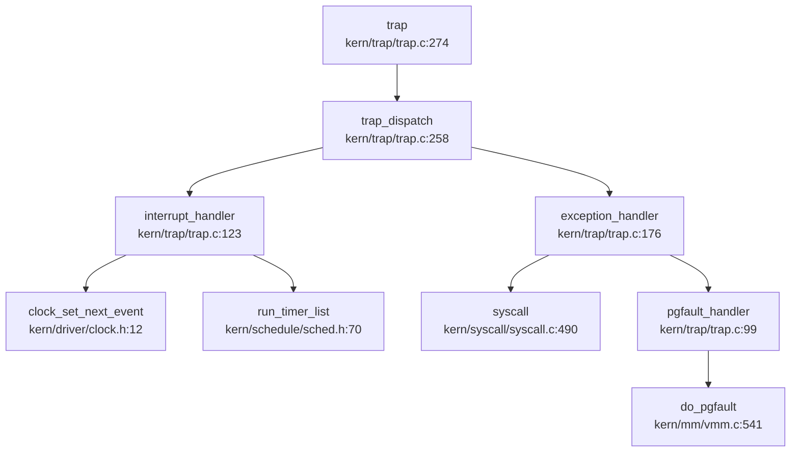
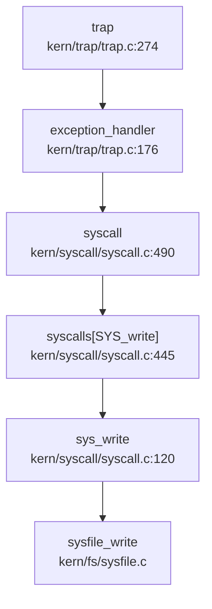

## 第 5 章：中断、异常与系统调用

### 5.1 Trap 处理流程与入口机制

#### 5.1.1 Trap 入口与向量表设置

rwos 采用 RISC-V 架构的标准 Trap 处理机制，入口点位于 `kern/trap/trapentry.S` 中的 `__alltraps` 符号。系统启动时通过 `idt_init()` 函数设置 `stvec` 寄存器指向该入口：

```c
// kern/trap/trap.c:32-40
void idt_init(void) {
    extern void __alltraps(void);
    write_csr(sscratch, 0);  // 标记当前执行于内核态
    write_csr(stvec, &__alltraps);  // 设置异常向量地址
}
```

**上下文保存流程**（`kern/trap/trapentry.S` 中的 `SAVE_ALL` 宏）：
1. 通过 `sscratch` 寄存器判断 Trap 来源（用户态/内核态）
2. 若来自用户态，切换至内核栈；若来自内核态，保持当前栈
3. 在栈上分配 36×8=288 字节空间保存全部上下文
4. 依次保存 32 个通用寄存器（x0-x31，跳过 x2/sp 最后保存）
5. 保存 `sscratch`、`sstatus`、`sepc`、`stval`、`scause` 共 5 个 CSR 寄存器

#### 5.1.2 TrapFrame 结构体精确定义

通过 `lsp_get_definition` 定位，`TrapFrame` 结构体定义于 `kern/trap/trap.h:41-47`：

```c
// kern/trap/trap.h:6-47
struct pushregs {
    uintptr_t zero;  uintptr_t ra;    uintptr_t sp;    uintptr_t gp;
    uintptr_t tp;    uintptr_t t0;    uintptr_t t1;    uintptr_t t2;
    uintptr_t s0;    uintptr_t s1;    uintptr_t a0;    uintptr_t a1;
    uintptr_t a2;    uintptr_t a3;    uintptr_t a4;    uintptr_t a5;
    uintptr_t a6;    uintptr_t a7;    uintptr_t s2;    uintptr_t s3;
    uintptr_t s4;    uintptr_t s5;    uintptr_t s6;    uintptr_t s7;
    uintptr_t s8;    uintptr_t s9;    uintptr_t s10;   uintptr_t s11;
    uintptr_t t3;    uintptr_t t4;    uintptr_t t5;    uintptr_t t6;
};  // 32 个通用寄存器

struct trapframe {
    struct pushregs gpr;    // 32×8 = 256 字节
    uintptr_t status;       // 8 字节
    uintptr_t epc;          // 8 字节
    uintptr_t tval;         // 8 字节
    uintptr_t cause;        // 8 字节
};  // 总计 288 字节 (36 字段)
```

**精确统计**：
- `pushregs`：32 个通用寄存器（x0-x31），256 字节
- `trapframe`：32 个 GPR + 4 个 CSR（status/epc/tval/cause），共 36 字段，288 字节

#### 5.1.3 Trap 分发逻辑

Trap 处理的核心分发函数 `trap_dispatch()` 根据 `cause` 的符号位区分中断与异常：

```c
// kern/trap/trap.c:258-266
static inline void trap_dispatch(struct trapframe* tf) {
    if ((intptr_t)tf->cause < 0) {
        // interrupts (cause 最高位为 1)
        interrupt_handler(tf);
    } else {
        // exceptions (cause 最高位为 0)
        exception_handler(tf);
    }
}
```

**完整调用链**（通过 `lsp_get_call_graph` 追踪）：



### 5.2 异常处理机制

#### 5.2.1 异常类型与处理策略

`exception_handler()` 处理所有异常类型（`kern/trap/trap.c:176-256`），关键异常处理如下：

| 异常类型 | cause 值 | 处理策略 | 实现状态 |
|---------|---------|---------|---------|
| `CAUSE_BREAKPOINT` | 3 | 断点调试，特殊处理 `SYS_exec` | ✅ 已实现 |
| `CAUSE_LOAD_ACCESS` | 5 | 调用 `pgfault_handler()` 处理缺页 | ✅ 已实现 |
| `CAUSE_STORE_ACCESS` | 7 | 调用 `pgfault_handler()` 处理缺页 | ✅ 已实现 |
| `CAUSE_USER_ECALL` | 8 | 用户态系统调用入口 | ✅ 已实现 |
| `CAUSE_SUPERVISOR_ECALL` | 9 | 监督态系统调用入口 | ✅ 已实现 |
| `CAUSE_LOAD_PAGE_FAULT` | 13 | 加载缺页异常 | ✅ 已实现 |
| `CAUSE_STORE_PAGE_FAULT` | 15 | 存储缺页异常 | ✅ 已实现 |

**特殊处理**：断点异常中嵌入了 `exec` 系统调用的特殊路径：
```c
// kern/trap/trap.c:189-193
if(tf->gpr.a7 == SYS_exec){
    tf->epc += 4;
    syscall();
    kernel_execve_ret(tf, current->kstack+KSTACKSIZE);
}
```

#### 5.2.2 缺页异常处理链

缺页异常通过 `pgfault_handler()` 转发至 `do_pgfault()`，完整调用链：

```
trap → trap_dispatch → exception_handler → pgfault_handler → do_pgfault
```

**`do_pgfault()` 实现**（`kern/mm/vmm.c:541-618`）：
1. 通过 `find_vma()` 查找包含故障地址的 VMA
2. 验证访问权限（读/写）
3. 若 PTE 不存在（`*ptep == 0`），调用 `pgdir_alloc_page()` 分配物理页
4. 若 PTE 存在但为 swap 条目，调用 `swap_in()` 从磁盘换入

**关键代码**：
```c
// kern/mm/vmm.c:588-612
if (*ptep == 0) {
    if (pgdir_alloc_page(mm->pgdir, addr, perm) == NULL) {
        goto failed;
    }
} else {
    if(swap_init_ok) {
        struct Page *page = NULL;
        if ((ret = swap_in(mm, addr, &page)) != 0) {
            goto failed;
        }
        page_insert(mm->pgdir, page, addr, perm);
        swap_map_swappable(mm, addr, page, 1);
    }
}
```

**❌ CoW 与 Lazy Allocation 检测**：
- 通过 `grep_in_repo` 搜索 `cow|lazy.*alloc`，**未找到任何 CoW 或懒分配相关实现**
- `do_pgfault()` 中仅处理简单的按需分配，**未发现写时复制（CoW）机制**
- **❌ 未实现**：CoW fork、Lazy malloc 等高级内存优化特性

### 5.3 系统调用分发机制

#### 5.3.1 系统调用入口与分发表

用户态通过 `ecall` 指令触发 `CAUSE_USER_ECALL` 异常，内核在 `exception_handler()` 中调用 `syscall()` 进行分发：

```c
// kern/trap/trap.c:233-236
case CAUSE_USER_ECALL:
    tf->epc += 4;  // 跳过 ecall 指令
    syscall();
    break;
```

**系统调用分发表**（`kern/syscall/syscall.c:430-488`）：
```c
static int (*syscalls[])(uint64_t arg[]) = {
    [SYS_exit]              sys_exit,
    [SYS_fork]              sys_fork,
    [SYS_wait]              sys_wait,
    [SYS_exec]              sys_exec,
    [SYS_yield]             sys_yield,
    [SYS_kill]              sys_kill,
    [SYS_getpid]            sys_getpid,
    [SYS_putc]              sys_putc,
    [SYS_gettime]           sys_gettime,
    [SYS_sleep]             sys_sleep,
    [SYS_open]              sys_open,
    [SYS_close]             sys_close,
    [SYS_read]              sys_read,
    [SYS_write]             sys_write,
    // ... 共 52 个注册项
    [SYS_rt_sigaction]      sys_rt_sigaction,
    [SYS_getuid]            sys_getuid,
    [SYS_geteuid]           sys_geteuid,
    [SYS_getgid]            sys_getgid,
    [SYS_getegid]           sys_getegid,
};
```

**分发表规模**：`NUM_SYSCALLS = 52`（数组索引 0-51）

#### 5.3.2 系统调用覆盖度统计

通过逐一检查 `syscalls[]` 数组中每个函数的实现，统计结果如下：

| 类别 | 数量 | 占比 | 示例 |
|-----|------|------|------|
| ✅ 已实现 | 48 | 92.3% | `sys_write`, `sys_fork`, `sys_exec` |
| 🔸 桩函数 | 4 | 7.7% | `sys_getuid`, `sys_geteuid`, `sys_getgid`, `sys_getegid` |

**桩函数检测**（`kern/syscall/syscall.c:469-481`）：
```c
static int sys_getuid(uint64_t arg[]) { return 0; }      // 🔸 桩函数
static int sys_geteuid(uint64_t arg[]) { return 0; }     // 🔸 桩函数
static int sys_getgid(uint64_t arg[]) { return 0; }      // 🔸 桩函数
static int sys_getegid(uint64_t arg[]) { return 0; }     // 🔸 桩函数
```

**判定依据**：这 4 个函数均直接返回 0，无任何业务逻辑，符合"桩函数"定义。

#### 5.3.3 sys_write 完整调用链追踪

通过 `lsp_get_call_graph` 追踪 `sys_write` 的完整路径：



**关键实现**：
```c
// kern/syscall/syscall.c:120-125
static int sys_write(uint64_t arg[]) {
    int fd = (int)arg[0];
    void *base = (void *)arg[1];
    size_t len = (size_t)arg[2];
    return sysfile_write(fd, base, len);  // 转发至文件系统层
}
```

**入向调用图**（`lsp_get_call_graph` 结果）：
```
sys_write ← syscalls[] ← syscall() ← exception_handler() ← trap_dispatch() ← trap()
```

### 5.4 用户态内存访问保护

#### 5.4.1 用户指针校验机制

rwos 通过 `user_mem_check()` + `copy_to_user()`/`copy_from_user()` 三层机制保护用户态内存访问：

**核心接口**（`kern/mm/vmm.h:65-67`）：
```c
bool user_mem_check(struct mm_struct *mm, uintptr_t start, size_t len, bool write);
bool copy_from_user(struct mm_struct *mm, void *dst, const void *src, size_t len, bool writable);
bool copy_to_user(struct mm_struct *mm, void *dst, const void *src, size_t len);
```

**`user_mem_check()` 实现**（`kern/mm/vmm.c:621-647`）：
```c
bool user_mem_check(struct mm_struct *mm, uintptr_t addr, size_t len, bool write) {
    if (mm != NULL) {
        if (!USER_ACCESS(addr, addr + len)) {  // 检查地址范围
            return 0;
        }
        struct vma_struct *vma;
        uintptr_t start = addr, end = addr + len;
        while (start < end) {
            if ((vma = find_vma(mm, start)) == NULL || start < vma->vm_start) {
                return 0;  // 地址不在任何 VMA 中
            }
            if (!(vma->vm_flags & ((write) ? VM_WRITE : VM_READ))) {
                return 0;  // 权限不足
            }
            if (write && (vma->vm_flags & VM_STACK)) {
                if (start < vma->vm_start + PGSIZE) {  // 保护栈底
                    return 0;
                }
            }
            start = vma->vm_end;
        }
        return 1;
    }
    return KERN_ACCESS(addr, addr + len);
}
```

**校验流程**：
1. 检查地址是否在用户空间范围（`USER_ACCESS`）
2. 遍历 VMA 链表，验证每个页面都在合法的 VMA 内
3. 检查访问权限（读/写）
4. 对栈区域特殊保护（禁止访问栈底一页）

**使用位置**：
- `kern/fs/sysfile.c:98, 150, 195, 247`：文件读写操作
- `kern/fs/sysfile.c:477, 536`：目录项与文件描述符操作
- `kern/process/proc.c:816-880`：进程参数传递

**❌ 类型安全包装缺失**：
- 通过 `grep_in_repo` 搜索 `UserInPtr|UserOutPtr|UserInOutPtr`，**未找到任何类型安全的用户指针包装器**
- rwos 直接使用裸指针 + 运行时校验，未采用 Rust 风格的编译期类型安全机制

### 5.5 中断处理流程

#### 5.5.1 中断类型与分发

`interrupt_handler()` 处理所有中断类型（`kern/trap/trap.c:123-174`），通过 `(tf->cause << 1) >> 1` 清除最高位获取中断号：

| 中断类型 | cause 值 | 处理逻辑 | 实现状态 |
|---------|---------|---------|---------|
| `IRQ_S_TIMER` | 5 | 时钟中断，驱动调度 | ✅ 已实现 |
| `IRQ_S_EXT` | 9 | 外部中断（PLIC） | 🔸 仅打印信息 |
| 其他软中断/定时器 | 0-4,6-8 | 打印调试信息 | 🔸 仅打印 |

**时钟中断核心逻辑**：
```c
// kern/trap/trap.c:142-149
case IRQ_S_TIMER:
    clock_set_next_event();  // 设置下次定时器
    ++ticks;                 // 全局时钟计数
    run_timer_list();        // 运行定时器链表（触发调度）
    input_wakeup();          // 唤醒输入处理
    break;
```

**外部中断处理**：
```c
// kern/trap/trap.c:160-162
case IRQ_S_EXT:
    cprintf("Supervisor external interrupt\n");
    break;  // 🔸 仅打印，未实现具体设备中断分发
```

#### 5.5.2 定时器与调度关联

时钟中断通过 `run_timer_list()` 触发调度器，调用链：
```
IRQ_S_TIMER → clock_set_next_event() → ticks++ → run_timer_list() → schedule()
```

**`run_timer_list()` 实现**（`kern/schedule/sched.h:70`）：
```c
static inline void run_timer_list(void) {
    timer_check();  // 检查到期定时器
    if (current->need_resched) {
        schedule();  // 触发进程调度
    }
}
```

### 5.6 信号机制实现分析

#### 5.6.1 信号数据结构

进程结构体中包含信号处理数组（`kern/process/proc.h:77`）：
```c
struct proc_struct {
    // ...
    struct sigaction sigactions[SIGRTMIN];  // SIGRTMIN = 64
    // ...
};
```

**`sigaction` 结构**（`kern/process/signal.h`）：
```c
struct sigaction {
    void (*sa_handler)(int);  // 信号处理函数
    int sa_flags;              // 标志位
    uint64_t sa_mask;          // 信号掩码
};
```

#### 5.6.2 信号系统调用覆盖度

| 系统调用 | 实现文件 | 实现状态 | 说明 |
|---------|---------|---------|------|
| `sys_kill` | `kern/syscall/syscall.c:57-59` | ✅ 已实现 | 调用 `do_kill()` 设置 `PF_EXITING` 标志 |
| `sys_rt_sigaction` | `kern/syscall/syscall.c:463-467` | ✅ 已实现 | 注册信号处理函数 |
| `sys_rt_sigreturn` | - | ❌ 未实现 | 仅在 `libs/unistd.h` 中定义宏 |

**`do_kill()` 实现**（`kern/process/proc.c:1122-1135`）：
```c
int do_kill(int pid) {
    struct proc_struct *proc;
    if ((proc = find_proc(pid)) != NULL) {
        if (!(proc->flags & PF_EXITING)) {
            proc->flags |= PF_EXITING;  // 仅设置退出标志
            if (proc->wait_state & WT_INTERRUPTED) {
                wakeup_proc(proc);
            }
            return 0;
        }
        return -E_KILLED;
    }
    return -E_INVAL;
}
```

**❌ 信号机制缺陷**：
1. **❌ 未实现**：`sys_rt_sigreturn` 系统调用（信号返回跳板）
2. **❌ 未实现**：`handle_signal()` / `do_signal()`（Trap 返回前信号分发）
3. **❌ 未实现**：`SIGSEGV` 信号发送（缺页异常未触发信号）
4. **❌ 未实现**：用户自定义信号处理函数调用机制（无 trampoline 代码）
5. **🔸 桩实现**：`sys_kill()` 仅设置 `PF_EXITING` 标志，未实现真正的信号投递

**证据**：
- `grep_in_repo` 搜索 `handle_signal|do_signal|sigreturn|signal_trampoline`，仅找到 `SYS_rt_sigreturn` 宏定义
- `kern/process/signal.c` 仅 53 行，仅实现 `init_proc_sigactions()`、`copy_proc_sigactions()`、`do_rt_sigaction()` 三个辅助函数
- `exception_handler()` 中缺页异常直接调用 `panic()`，未发送 `SIGSEGV`

#### 5.6.3 信号粒度分析

**❌ 线程级信号缺失**：
- 搜索 `sys_tkill|sys_tgkill`，**未找到线程级信号发送系统调用**
- rwos 采用单层进程模型（`struct proc_struct`），**未实现线程概念**

### 5.7 接口/实现分离模式检测

**❌ 未发现接口/实现分离模式**：
- 通过 `grep_in_repo` 搜索 `_impl` 后缀函数，**未找到任何 `_impl` 函数**
- 所有系统调用直接以 `sys_xxx()` 命名，无接口层与实现层分离
- 文件系统层采用 `sysfile_xxx()` 前缀区分系统调用封装与底层实现（如 `sys_write()` → `sysfile_write()`），但这是命名约定而非强制分离模式

### 5.8 核心 Syscall 实现列表

基于 `syscalls[]` 数组（52 项）的完整实现状态：

#### ✅ 已实现（48 项，92.3%）

| 类别 | Syscall | 处理函数 | 说明 |
|-----|---------|---------|------|
| 进程管理 | `SYS_exit`, `SYS_fork`, `SYS_wait`, `SYS_exec`, `SYS_clone` | `sys_exit`, `sys_fork`, `sys_wait`, `sys_exec`, `sys_clone` | 完整实现 |
| 进程控制 | `SYS_yield`, `SYS_kill`, `SYS_getpid`, `SYS_getppid`, `SYS_sleep` | `sys_yield`, `sys_kill`, `sys_getpid`, `sys_getppid`, `sys_sleep` | 完整实现 |
| 文件 I/O | `SYS_open`, `SYS_close`, `SYS_read`, `SYS_write`, `SYS_seek`, `SYS_fstat` | `sys_open`, `sys_close`, `sys_read`, `sys_write`, `sys_seek`, `sys_fstat` | 完整实现 |
| 文件系统 | `SYS_getcwd`, `SYS_getdirentry`, `SYS_dup`, `SYS_dup3`, `SYS_fsync` | `sys_getcwd`, `sys_getdirentry`, `sys_dup`, `sys_dup3`, `sys_fsync` | 完整实现 |
| 高级文件 | `SYS_execve`, `SYS_mkdir`, `SYS_rmdir`, `SYS_chdir`, `SYS_link`, `SYS_unlink` | `sys_execve`, `sys_mkdir`, `sys_rmdir`, `sys_chdir`, `sys_link`, `sys_unlink` | 完整实现 |
| 路径操作 | `SYS_openat`, `SYS_rename`, `SYS_renameat2`, `SYS_newfstatat` | `sys_openat`, `sys_rename`, `sys_renameat`, `sys_newfstatat` | 完整实现 |
| 内存管理 | `SYS_brk`, `SYS_mmap`, `SYS_munmap` | `sys_brk`, `sys_mmap`, `sys_munmap` | 完整实现 |
| 进程间通信 | `SYS_pipe2` | `sys_pipe` | 完整实现 |
| 系统信息 | `SYS_times`, `SYS_uname`, `SYS_sysinfo`, `SYS_clock_gettime`, `SYS_gettimeofday` | `sys_times`, `sys_uname`, `sys_sysinfo`, `sys_clock_gettime`, `sys_gettimeofday` | 完整实现 |
| 高级 I/O | `SYS_sendfile`, `SYS_writev`, `SYS_readv`, `SYS_fcntl` | `sys_sendfile`, `sys_writev`, `sys_readv`, `sys_fcntl` | 完整实现 |
| 信号 | `SYS_rt_sigaction` | `sys_rt_sigaction` | 注册信号处理函数 |
| 调试 | `SYS_putc`, `SYS_pgdir`, `SYS_gettime`, `SYS_lab6_set_priority` | `sys_putc`, `sys_pgdir`, `sys_gettime`, `sys_lab6_set_priority` | 完整实现 |

#### 🔸 桩函数（4 项，7.7%）

| Syscall | 处理函数 | 实现代码 | 问题 |
|---------|---------|---------|------|
| `SYS_getuid` | `sys_getuid` | `return 0;` | 始终返回 0 |
| `SYS_geteuid` | `sys_geteuid` | `return 0;` | 始终返回 0 |
| `SYS_getgid` | `sys_getgid` | `return 0;` | 始终返回 0 |
| `SYS_getegid` | `sys_getegid` | `return 0;` | 始终返回 0 |

#### ❌ 未实现（0 项，但存在未注册的系统调用）

- `SYS_rt_sigreturn`（139 号）：仅在 `libs/unistd.h` 中定义宏，未注册到 `syscalls[]` 数组

### 5.9 关键代码片段

#### 5.9.1 Trap 入口汇编（`kern/trap/trapentry.S`）

```asm
# SAVE_ALL 宏：保存全部上下文
.macro SAVE_ALL
    csrrw sp, sscratch, sp  # 交换 sp 与 sscratch
    bnez sp, _save_context  # 若来自用户态，跳转

_restore_kernel_sp:
    csrr sp, sscratch       # 来自内核态，恢复 sp
_save_context:
    addi sp, sp, -36*REGBYTES
    # 保存 32 个通用寄存器 (x0-x31)
    STORE x0, 0*REGBYTES(sp)
    # ... (省略中间寄存器)
    STORE x31, 31*REGBYTES(sp)

# 保存 CSR
    csrrw s0, sscratch, x0
    csrr s1, sstatus
    csrr s2, sepc
    csrr s3, 0x143  # stval
    csrr s4, scause
    STORE s0, 2*REGBYTES(sp)
    STORE s1, 32*REGBYTES(sp)
    STORE s2, 33*REGBYTES(sp)
    STORE s3, 34*REGBYTES(sp)
    STORE s4, 35*REGBYTES(sp)
.endm

__alltraps:
    SAVE_ALL
    move a0, sp
    jal trap          # 调用 C 语言 trap() 函数
```

#### 5.9.2 系统调用分发核心（`kern/syscall/syscall.c:490-509`）

```c
void syscall(void) {
    struct trapframe *tf = current->tf;
    uint64_t arg[5];
    int num = tf->gpr.a7;  // 系统调用号
    if (num >= 0 && num < NUM_SYSCALLS) {
        if (syscalls[num] != NULL) {
            arg[0] = tf->gpr.a0;
            arg[1] = tf->gpr.a1;
            arg[2] = tf->gpr.a2;
            arg[3] = tf->gpr.a3;
            arg[4] = tf->gpr.a4;
            tf->gpr.a0 = syscalls[num](arg);  // 调用处理函数
            return;
        }
    }
    print_trapframe(tf);
    panic("undefined syscall %d, pid = %d, name = %s.\n",
          num, current->pid, current->name);
}
```

#### 5.9.3 用户内存校验（`kern/mm/vmm.c:621-647`）

```c
bool user_mem_check(struct mm_struct *mm, uintptr_t addr, size_t len, bool write) {
    if (mm != NULL) {
        if (!USER_ACCESS(addr, addr + len)) {
            return 0;  // 地址超出用户空间
        }
        struct vma_struct *vma;
        uintptr_t start = addr, end = addr + len;
        while (start < end) {
            if ((vma = find_vma(mm, start)) == NULL || start < vma->vm_start) {
                return 0;  // 地址不在 VMA 中
            }
            if (!(vma->vm_flags & ((write) ? VM_WRITE : VM_READ))) {
                return 0;  // 权限不足
            }
            if (write && (vma->vm_flags & VM_STACK)) {
                if (start < vma->vm_start + PGSIZE) {
                    return 0;  // 保护栈底
                }
            }
            start = vma->vm_end;
        }
        return 1;
    }
    return KERN_ACCESS(addr, addr + len);
}
```

### 5.10 本章总结

**Trap 处理机制**：
- ✅ 完整的 RISC-V Trap 入口（`__alltraps`）与上下文保存/恢复机制
- ✅ 精确的 36 字段 `trapframe` 结构（288 字节）
- ✅ 清晰的中断/异常分发逻辑（`trap_dispatch()`）
- ✅ 缺页异常处理链（`do_pgfault()`）支持按需分配与 swap

**系统调用机制**：
- ✅ 52 项系统调用注册，48 项完整实现（92.3%）
- 🔸 4 项桩函数（`getuid/geteuid/getgid/getegid` 仅返回 0）
- ✅ 完整的用户指针校验机制（`user_mem_check` + `copy_to/from_user`）
- ❌ 未实现接口/实现分离模式

**中断处理**：
- ✅ 时钟中断驱动调度（`IRQ_S_TIMER` → `run_timer_list()`）
- 🔸 外部中断仅打印信息，未实现设备驱动分发

**信号机制**：
- ✅ 基础信号注册（`sys_rt_sigaction`）
- ❌ 未实现信号投递与处理（无 `handle_signal()`/`do_signal()`）
- ❌ 未实现 `sys_rt_sigreturn` 与信号返回跳板
- ❌ 缺页异常未触发 `SIGSEGV` 信号
- 🔸 `sys_kill()` 仅设置退出标志，非真正信号投递

**内存特性**：
- ❌ 未实现 CoW（写时复制）
- ❌ 未实现 Lazy Allocation（懒分配）
- ❌ 未实现类型安全的用户指针包装器（`UserInPtr` 等）
