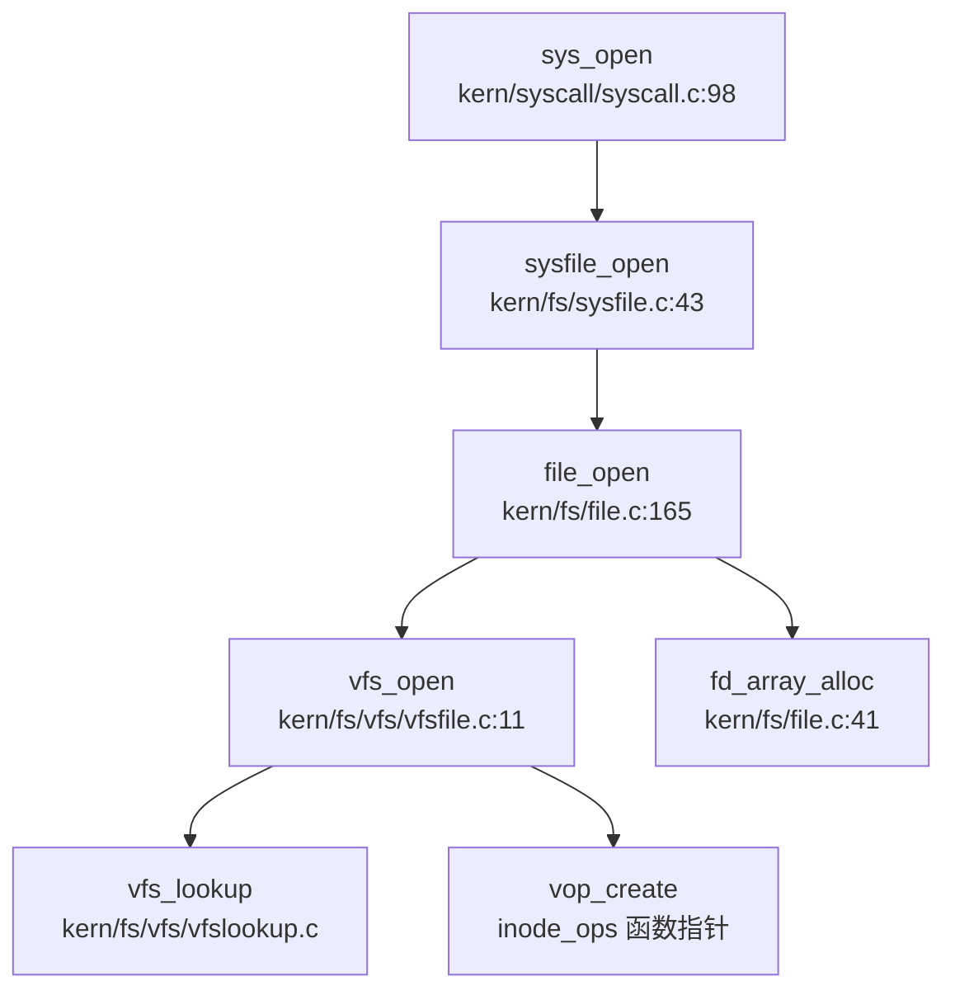

## 第 6 章：文件系统（VFS + 具体 FS）

### 6.1 VFS 架构与接口设计

rwos 采用类 uCore 的单体内核 VFS 架构，通过抽象的 `inode` 结构体统一表示所有文件对象（包括磁盘文件、设备文件、管道等）。VFS 层位于 `kern/fs/vfs/` 目录，提供了文件系统无关的通用接口。

#### 6.1.1 核心数据结构

**Inode 结构体**（`kern/fs/vfs/inode.h:32-54`）：
```c
struct inode {
    union {
        struct pipe_inode __pipe_inode_info;
        struct pipe_root __pipe_root_info;
        struct device __device_info;
        struct sfs_inode __sfs_inode_info;
    } in_info;
    enum {
        inode_type_device_info = 0x1234,
        inode_type_pipe_root_info,
        inode_type_pipe_inode_info,
        inode_type_sfs_inode_info,
    } in_type;
    int ref_count;
    int open_count;
    struct fs *in_fs;
    const struct inode_ops *in_ops;
};
```

`inode` 通过联合体 `in_info` 支持多种具体文件系统类型，通过 `in_type` 区分类型，通过 `in_ops` 函数指针表实现多态操作。

**Inode 操作接口**（`kern/fs/vfs/inode.h:185-210`）：
```c
struct inode_ops {
    unsigned long vop_magic;
    int (*vop_open)(struct inode *node, uint32_t open_flags);
    int (*vop_close)(struct inode *node);
    int (*vop_read)(struct inode *node, struct iobuf *iob);
    int (*vop_write)(struct inode *node, struct iobuf *iob);
    int (*vop_fstat)(struct inode *node, struct stat *stat);
    int (*vop_fsync)(struct inode *node);
    int (*vop_getdirentry)(struct inode *node, struct iobuf *iob);
    int (*vop_reclaim)(struct inode *node);
    int (*vop_gettype)(struct inode *node, uint32_t *type_store);
    int (*vop_tryseek)(struct inode *node, off_t pos);
    int (*vop_truncate)(struct inode *node, off_t len);
    int (*vop_create)(struct inode *node, const char *name, bool excl, struct inode **node_store);
    int (*vop_lookup)(struct inode *node, char *path, struct inode **node_store);
    // 扩展操作
    int (*vop_createdir)(struct inode *node, const char *name, int64_t dir_flags, struct inode **node_store);
    int (*vop_rmdir)(struct inode *node, const char *name);
    int (*vop_link)(struct inode *node, const char *name, struct inode *link_node);
    int (*vop_unlink)(struct inode *node, const char *name);
    int (*vop_rename)(struct inode *node, const char *name, struct inode *new_node, const char *new_name);
};
```

#### 6.1.2 VFS 核心接口

**vfs_open**（`kern/fs/vfs/vfsfile.c:11-69`）：文件打开的主入口，处理 `O_CREAT`、`O_TRUNC`、`O_EXCL` 等标志，调用 `vfs_lookup` 查找路径，若文件不存在且指定 `O_CREAT` 则调用 `vop_create` 创建新 inode。

**vfs_mount**（`kern/fs/vfs/vfsdev.c:223-246`）：挂载文件系统到设备，通过 `find_mount` 查找设备节点，调用具体文件系统的 `mountfunc`（如 `sfs_do_mount`）完成挂载。



> 上图展示了从系统调用到 VFS 层的完整文件打开路径。`vfs_open` 通过 `inode_ops` 函数指针表将操作分发到具体文件系统实现。

### 6.2 具体文件系统支持情况（SFS）

#### 6.2.1 SFS 文件系统架构

rwos 实现了 **Simple FS (SFS)** 作为唯一的磁盘文件系统，位于 `kern/fs/sfs/` 目录。SFS 是一个简单的类 Unix 文件系统，支持：
- 直接块 + 间接块的 inode 结构
- 位图管理的空闲块分配
- 目录项（directory entry）机制
- 硬链接支持

**SFS 挂载流程**（`kern/fs/sfs/sfs_fs.c:145-258`）：
1. 读取并验证超级块（magic number 检查）
2. 加载位图（freemap）到内存
3. 初始化哈希列表（用于 inode 缓存）
4. 设置 `fs_sync`/`fs_get_root`/`fs_unmount` 等回调函数

```c
// kern/fs/sfs/sfs_fs.c:243-247
fs->fs_sync = sfs_sync;
fs->fs_get_root = sfs_get_root;
fs->fs_unmount = sfs_unmount;
fs->fs_cleanup = sfs_cleanup;
*fs_store = fs;
```

#### 6.2.2 SFS Inode 操作实现

SFS 通过两个 `inode_ops` 实例分别实现文件和目录操作：

**文件操作**（`kern/fs/sfs/sfs_inode.c:1491-1506`）：
```c
static const struct inode_ops sfs_node_fileops = {
    .vop_magic = VOP_MAGIC,
    .vop_open = sfs_openfile,
    .vop_close = sfs_close,
    .vop_read = sfs_read,
    .vop_write = sfs_write,
    .vop_fstat = sfs_fstat,
    .vop_fsync = sfs_fsync,
    .vop_reclaim = sfs_reclaim,
    .vop_gettype = sfs_gettype,
    .vop_tryseek = sfs_tryseek,
    .vop_truncate = sfs_truncfile,
    .vop_create = sfs_create,
    .vop_link = sfs_link,
    .vop_unlink = sfs_unlink,
    .vop_rename = sfs_rename,
};
```

**目录操作**（`kern/fs/sfs/sfs_inode.c:1474-1490`）：
```c
static const struct inode_ops sfs_node_dirops = {
    .vop_magic = VOP_MAGIC,
    .vop_open = sfs_opendir,
    .vop_close = sfs_close,
    .vop_fstat = sfs_fstat,
    .vop_fsync = sfs_fsync,
    .vop_namefile = sfs_namefile,
    .vop_getdirentry = sfs_getdirentry,
    .vop_reclaim = sfs_reclaim,
    .vop_gettype = sfs_gettype,
    .vop_lookup = sfs_lookup,
    .vop_create = sfs_create,
    .vop_createdir = sfs_createdir,
    .vop_link = sfs_link,
    .vop_unlink = sfs_unlink,
    .vop_rmdir = sfs_rmdir,
    .vop_rename = sfs_rename,
};
```

**关键实现细节**：
- **块映射**：`sfs_bmap_load_nolock`（`kern/fs/sfs/sfs_inode.c:363-382`）实现逻辑块号到物理块号的转换，支持 12 个直接块 + 1 个间接块（最多 `12 + 128 = 140` 块，每块 512 字节，单文件最大约 70KB）
- **目录查找**：`sfs_dirent_search_nolock`（`kern/fs/sfs/sfs_inode.c:475-507`）遍历目录项，支持文件名匹配
- **文件创建**：`sfs_create`（`kern/fs/sfs/sfs_inode.c:1107-1155`）分配新 inode 编号，创建目录项，初始化磁盘 inode 结构

| 功能 | 实现状态 | 源码位置 |
|------|---------|---------|
| 文件读/写 | ✅ 已实现 | `sfs_read`/`sfs_write` (`kern/fs/sfs/sfs_inode.c:734-745`) |
| 目录查找 | ✅ 已实现 | `sfs_lookup` (`kern/fs/sfs/sfs_inode.c:1055-1088`) |
| 文件创建 | ✅ 已实现 | `sfs_create` (`kern/fs/sfs/sfs_inode.c:1107-1155`) |
| 目录创建 | ✅ 已实现 | `sfs_createdir` (`kern/fs/sfs/sfs_inode.c:1160-1212`) |
| 文件删除 | ✅ 已实现 | `sfs_unlink` (`kern/fs/sfs/sfs_inode.c:1369-1385`) |
| 目录删除 | ✅ 已实现 | `sfs_rmdir` (`kern/fs/sfs/sfs_inode.c:1327-1334`) |
| 重命名 | ✅ 已实现 | `sfs_rename` (`kern/fs/sfs/sfs_inode.c:1453-1472`) |
| 硬链接 | ✅ 已实现 | `sfs_link` (`kern/fs/sfs/sfs_inode.c:1273-1287`) |
| 截断 | ✅ 已实现 | `sfs_truncfile` (`kern/fs/sfs/sfs_inode.c:993-1041`) |

### 6.3 设备文件系统（DevFS）

rwos 在 `kern/fs/devs/` 目录下实现了字符设备文件系统，将设备抽象为文件，通过统一的 VFS 接口访问。

#### 6.3.1 设备 Inode 操作

**设备操作接口**（`kern/fs/devs/dev.c:135-150`）：
```c
static const struct inode_ops dev_node_ops = {
    .vop_magic = VOP_MAGIC,
    .vop_open = dev_open,
    .vop_close = dev_close,
    .vop_read = dev_read,
    .vop_write = dev_write,
    .vop_fstat = dev_fstat,
    .vop_ioctl = dev_ioctl,
    .vop_gettype = dev_gettype,
    .vop_tryseek = dev_tryseek,
    .vop_lookup = dev_lookup,
};
```

设备文件的读写通过 `dop_io` 回调到具体设备的驱动实现（如 `dev_stdin.c`、`dev_stdout.c`、`dev_disk0.c`）。

#### 6.3.2 内置设备列表

| 设备 | 类型 | 实现文件 |
|------|------|---------|
| stdin | 字符设备 | `kern/fs/devs/dev_stdin.c` |
| stdout | 字符设备 | `kern/fs/devs/dev_stdout.c` |
| stderr | 字符设备 | `kern/fs/devs/dev_stderr.c` |
| disk0 | 块设备 | `kern/fs/devs/dev_disk0.c` |
| null | 字符设备 | `kern/fs/devs/dev_null.c` |
| zero | 字符设备 | `kern/fs/devs/dev_zero.c` |

**设备初始化**（`kern/fs/devs/dev.c:157-165`）：
```c
void dev_init(void) {
    init_device(stdin);
    init_device(stdout);
    init_device(stderr);
    init_device(disk0);
    init_device(null);
    init_device(zero);
}
```

### 6.4 管道（Pipe）实现

rwos 在 `kern/fs/pipe/` 目录下实现了完整的匿名管道机制，支持进程间通信。

#### 6.4.1 Pipe 文件系统架构

Pipe 被实现为一个特殊的文件系统（`struct pipe_fs`），包含：
- **pipe_root**：管道文件系统的根 inode（`kern/fs/pipe/pipe_root.c`）
- **pipe_inode**：管道的读写端 inode（`kern/fs/pipe/pipe_inode.c`）
- **pipe_state**：管道的共享缓冲区状态（`kern/fs/pipe/pipe_state.c`）

**Pipe 状态结构**（`kern/fs/pipe/pipe_state.c:15-24`）：
```c
struct pipe_state {
    off_t p_rpos;
    off_t p_wpos;
    uint8_t *buf;
    bool isclosed;
    int ref_count;
    semaphore_t sem;
    wait_queue_t reader_queue;
    wait_queue_t writer_queue;
};
```

管道使用环形缓冲区（大小 `PGSIZE - sizeof(struct pipe_state)` ≈ 4KB），通过信号量和等待队列实现读写同步。

#### 6.4.2 Pipe 操作实现

**Pipe 读操作**（`kern/fs/pipe/pipe_inode.c:38-50`）：
```c
static int pipe_inode_read(struct inode *node, struct iobuf *iob) {
    struct pipe_inode *pin = vop_info(node, pipe_inode);
    if (pin->pin_type != PIN_RDONLY) {
        return -E_INVAL;
    }
    size_t ret;
    if ((ret = pipe_state_read(pin->state, iob->io_base, iob->io_resid)) != 0) {
        iobuf_skip(iob, ret);
    }
    return 0;
}
```

**Pipe 写操作**（`kern/fs/pipe/pipe_inode.c:52-62`）：
```c
static int pipe_inode_write(struct inode *node, struct iobuf *iob) {
    struct pipe_inode *pin = vop_info(node, pipe_inode);
    if (pin->pin_type != PIN_WRONLY) {
        return -E_INVAL;
    }
    size_t ret;
    if ((ret = pipe_state_write(pin->state, iob->io_base, iob->io_resid)) != 0) {
        iobuf_skip(iob, ret);
    }
    return 0;
}
```

**Pipe 创建流程**：
1. 用户调用 `sys_pipe`（`kern/syscall/syscall.c:273-276`）
2. 内核调用 `sysfile_pipe`（`kern/fs/file.c:520-543`）
3. 分配两个 file 结构（读端/写端）
4. 创建 `pipe_state` 和两个 `pipe_inode`
5. 返回两个文件描述符

| 功能 | 实现状态 | 源码位置 |
|------|---------|---------|
| 匿名管道创建 | ✅ 已实现 | `file_pipe` (`kern/fs/file.c:520-543`) |
| 管道读 | ✅ 已实现 | `pipe_state_read` (`kern/fs/pipe/pipe_state.c:103-135`) |
| 管道写 | ✅ 已实现 | `pipe_state_write` (`kern/fs/pipe/pipe_state.c:137-169`) |
| 阻塞同步 | ✅ 已实现 | 等待队列 (`kern/fs/pipe/pipe_state.c:66-82`) |

### 6.5 文件描述符与进程关联

rwos 采用 **Per-Process 文件描述符表** 设计，每个进程独立维护自己的 `files_struct`。

#### 6.5.1 文件描述符表结构

**files_struct**（`kern/fs/fs.h:25-31`）：
```c
struct files_struct {
    struct inode *pwd;      // 当前工作目录 inode
    struct file *fd_array;  // 打开文件数组
    int files_count;        // 打开文件数量
    semaphore_t files_sem;  // 保护信号量
};
```

**File 结构**（`kern/fs/file.h:15-27`）：
```c
struct file {
    enum { FD_NONE, FD_INIT, FD_OPENED, FD_CLOSED } status;
    bool readable;
    bool writable;
    bool close_on_exec;
    int fd;
    off_t pos;
    struct inode *node;
    int open_count;
    uint64_t flags;
};
```

#### 6.5.2 文件描述符分配

**fd_array_alloc**（`kern/fs/file.c:41-65`）：
```c
static int fd_array_alloc(int fd, struct file **file_store) {
    struct file *file = get_fd_array();
    if (fd == NO_FD) {
        for (fd = 3; fd < FILES_STRUCT_NENTRY; fd ++, file ++) {
            if (file->status == FD_NONE) {
                goto found;
            }
        }
        return -E_MAX_OPEN;
    }
    // ... 处理指定 fd 的情况
}
```

文件描述符表大小由 `FILES_STRUCT_NENTRY` 定义，计算公式为：
```c
#define FILES_STRUCT_BUFSIZE (PGSIZE - sizeof(struct files_struct)) * 2
#define FILES_STRUCT_NENTRY (FILES_STRUCT_BUFSIZE / sizeof(struct file))
```

假设 `PGSIZE = 4096`，`sizeof(struct files_struct) ≈ 32`，`sizeof(struct file) ≈ 48`，则 `FILES_STRUCT_NENTRY ≈ 170` 个文件描述符。

**Per-Process 设计验证**（`kern/fs/file.c:20-25`）：
```c
static struct file *get_fd_array(void) {
    struct files_struct *filesp = current->filesp;
    assert(filesp != NULL && files_count(filesp) > 0);
    return filesp->fd_array;
}
```

通过 `current->filesp` 获取当前进程的文件描述符表，证实为 Per-Process 设计。

### 6.6 内存映射（mmap）实现分析

rwos 实现了基础的 `mmap` 系统调用，但功能受限。

#### 6.6.1 sys_mmap 实现

**系统调用入口**（`kern/syscall/syscall.c:249-262`）：
```c
static int sys_mmap(uint64_t arg[]) {
    uintptr_t *addr_store = (uintptr_t *)arg[0];
    size_t len = (size_t)arg[1];
    uint64_t mmap_flags = (uint64_t)arg[2];
    int fd = (int)arg[4];
    off_t offset = (off_t)arg[5];
    int ret = 0;
    if((ret = do_mmap(addr_store, len, mmap_flags)) != 0){
        return ret;
    }
    ret = sysfile_read(fd, (void*)(*addr_store), len);
    return 0;
}
```

**do_mmap 实现**（`kern/process/proc.c:1350-1390`）：
```c
int do_mmap(uintptr_t *addr_store, size_t len, uint64_t mmap_flags) {
    struct mm_struct *mm = current->mm;
    // ... 参数检查
    uint32_t vm_flags = VM_READ;
    if (mmap_flags & MMAP_WRITE) vm_flags |= VM_WRITE;
    if (mmap_flags & MMAP_STACK) vm_flags |= VM_STACK;

if (addr == 0) {
        if ((addr = get_unmapped_area(mm, len)) == 0) {
            goto out_unlock;
        }
    }
    if ((ret = mm_map(mm, addr, len, vm_flags, NULL)) == 0) {
        *addr_store = addr;
    }
    return ret;
}
```

#### 6.6.2 功能限制分析

| 功能 | 实现状态 | 说明 |
|------|---------|------|
| VM_READ/VM_WRITE | ✅ 已实现 | 支持基本读写标志 |
| VM_STACK | ✅ 已实现 | 支持栈映射 |
| MAP_SHARED | ❌ 未实现 | 无共享映射逻辑 |
| MAP_PRIVATE | ❌ 未实现 | 无写时复制（CoW）机制 |
| 文件映射 | 🔸 桩函数 | 仅调用 `sysfile_read` 读取文件内容到内存，非真正的零拷贝映射 |
| 匿名映射 | ❌ 未实现 | 无 `MAP_ANONYMOUS` 处理 |

**关键问题**：
1. `sys_mmap` 在调用 `do_mmap` 后，额外调用 `sysfile_read(fd, (void*)(*addr_store), len)` 将文件内容读入内存，这是**拷贝式映射**而非零拷贝
2. 未处理 `MAP_SHARED` 标志，`vm_flags` 仅设置 `VM_READ`/`VM_WRITE`/`VM_STACK`
3. `mm_map` 调用传入 `NULL` 作为文件指针，未建立 VMA 与文件的关联

**结论**：rwos 的 `mmap` 实现为 **🔸 功能受限**，仅支持基本的内存区域分配和文件内容拷贝，不支持共享映射、写时复制、零拷贝等高级特性。

### 6.7 高级特性支持情况

#### 6.7.1 Socket/Epoll/Poll/Select

通过搜索系统调用表和头文件，发现：

| 系统调用 | 实现状态 | 说明 |
|----------|---------|------|
| `sys_socket` | ❌ 未实现 | 仅在 `libs/unistd.h:206` 定义 syscall 号 (198)，`kern/syscall/syscall.c` 中无对应处理函数 |
| `sys_epoll_create1` | ❌ 未实现 | 仅在 `libs/unistd.h:28` 定义 syscall 号 (20)，无实现 |
| `sys_epoll_ctl` | ❌ 未实现 | 仅在 `libs/unistd.h:29` 定义 syscall 号 (21)，无实现 |
| `sys_epoll_pwait` | ❌ 未实现 | 仅在 `libs/unistd.h:30` 定义 syscall 号 (22)，无实现 |
| `sys_poll` | ❌ 未实现 | 未找到 syscall 号定义和实现 |
| `sys_select` | ❌ 未实现 | 未找到 syscall 号定义和实现 |

**系统调用表验证**（`kern/syscall/syscall.c:430-480`）：
```c
static int (*syscalls[])(uint64_t arg[]) = {
    [SYS_exit] sys_exit,
    [SYS_fork] sys_fork,
    // ... 共约 60 个系统调用
    // 无 sys_socket、sys_poll、sys_select、sys_epoll_*
};
```

#### 6.7.2 伪文件系统（ProcFS/SysFS）

**ProcFS/SysFS 支持**：
- 仅在 `kern/fs/vfs/vfs.h:162` 注释中提及 "gizmos like Linux procfs or BSD kernfs"
- 未找到任何 `procfs` 或 `sysfs` 的实现代码
- 无 `/proc` 或 `/sys` 目录挂载逻辑

| 伪文件系统 | 实现状态 | 说明 |
|-----------|---------|------|
| ProcFS | ❌ 未实现 | 仅注释提及，无代码实现 |
| SysFS | ❌ 未实现 | 无相关代码 |
| DevFS | ✅ 已实现 | 通过 `kern/fs/devs/` 实现设备文件 |

### 6.8 缓存机制分析

#### 6.8.1 Inode 缓存

SFS 使用哈希列表缓存 inode：
```c
// kern/fs/sfs/sfs_fs.c:203-207
if ((sfs->hash_list = hash_list = kmalloc(sizeof(list_entry_t) * SFS_HLIST_SIZE)) == NULL) {
    goto failed_cleanup_hash_list;
}
for (i = 0; i < SFS_HLIST_SIZE; i ++) {
    list_init(hash_list + i);
}
```

通过 `sfs_hash_list` 函数将 inode 编号映射到哈希桶，加速 inode 查找。

#### 6.8.2 Block Cache

rwos **未实现独立的 Block Cache 层**。SFS 直接通过 `sfs_rbuf`/`sfs_wbuf` 读写磁盘块：
```c
// kern/fs/sfs/sfs_io.c
static int sfs_rbuf(struct sfs_fs *sfs, void *data, size_t len, uint32_t blkno, off_t offset) {
    // 直接调用设备驱动读取
}
```

无页面缓存（Page Cache）或缓冲区缓存（Buffer Cache）机制，每次文件读写都直接访问磁盘设备。

### 6.9 关键代码验证总结

| 组件 | 文件路径 | 关键函数/结构 |
|------|---------|--------------|
| VFS 抽象层 | `kern/fs/vfs/inode.h` | `struct inode`, `struct inode_ops` |
| VFS 打开接口 | `kern/fs/vfs/vfsfile.c` | `vfs_open`, `vfs_openat` |
| VFS 挂载接口 | `kern/fs/vfs/vfsdev.c` | `vfs_mount` |
| SFS 文件系统 | `kern/fs/sfs/sfs_fs.c` | `sfs_do_mount`, `sfs_sync` |
| SFS Inode 操作 | `kern/fs/sfs/sfs_inode.c` | `sfs_node_fileops`, `sfs_node_dirops` |
| 设备文件系统 | `kern/fs/devs/dev.c` | `dev_node_ops`, `dev_init` |
| Pipe 实现 | `kern/fs/pipe/pipe_inode.c` | `pipe_inode_read`, `pipe_inode_write` |
| Pipe 状态 | `kern/fs/pipe/pipe_state.c` | `pipe_state_read`, `pipe_state_write` |
| 文件描述符表 | `kern/fs/fs.h` | `struct files_struct` |
| 文件描述符分配 | `kern/fs/file.c` | `fd_array_alloc`, `get_fd_array` |
| mmap 实现 | `kern/process/proc.c` | `do_mmap` |
| mmap 系统调用 | `kern/syscall/syscall.c` | `sys_mmap` |

### 6.10 文件系统功能总览

| 功能类别 | 功能项 | 实现状态 | 备注 |
|---------|--------|---------|------|
| **VFS 抽象** | inode 操作接口 | ✅ 已实现 | 完整的函数指针表 |
| | 路径查找 | ✅ 已实现 | `vfs_lookup`, `vfs_lookup_parent` |
| | 挂载机制 | ✅ 已实现 | `vfs_mount` |
| **具体 FS** | SFS 文件系统 | ✅ 已实现 | 支持文件/目录/硬链接 |
| | 设备文件系统 | ✅ 已实现 | 6 个内置设备 |
| | 管道文件系统 | ✅ 已实现 | 完整的匿名管道 |
| | FAT32/Ext4 | ❌ 未实现 | 无相关代码 |
| | RamFS/TmpFS | ❌ 未实现 | 无内存文件系统 |
| | ProcFS/SysFS | ❌ 未实现 | 仅注释提及 |
| **文件操作** | 打开/关闭 | ✅ 已实现 | 支持 `O_CREAT`/`O_TRUNC` 等标志 |
| | 读/写 | ✅ 已实现 | 通过 `iobuf` 抽象 |
| | 查找/创建 | ✅ 已实现 | 支持目录遍历 |
| | 删除/重命名 | ✅ 已实现 | 支持文件和目录 |
| **文件描述符** | Per-Process 表 | ✅ 已实现 | `files_struct` |
| | dup/dup2/dup3 | ✅ 已实现 | `file_dup`, `file_dup3` |
| | fcntl | ✅ 已实现 | `file_fcntl` |
| **高级特性** | Pipe | ✅ 已实现 | 阻塞式匿名管道 |
| | Socket | ❌ 未实现 | 仅定义 syscall 号 |
| | Poll/Select | ❌ 未实现 | 无相关代码 |
| | Epoll | ❌ 未实现 | 仅定义 syscall 号 |
| | Mmap | 🔸 功能受限 | 无共享映射/零拷贝 |
| **缓存机制** | Inode 缓存 | ✅ 已实现 | 哈希列表 |
| | Block/Page Cache | ❌ 未实现 | 直接磁盘访问 |

---

**本章小结**：rwos 实现了完整的 VFS 抽象层和 SFS 磁盘文件系统，支持基本的文件/目录操作、设备文件、匿名管道等核心功能。文件描述符采用 Per-Process 设计，mmap 功能受限（无共享映射/零拷贝），网络 socket 及 epoll/poll/select 等高级 I/O 多路复用机制未实现。整体文件系统架构清晰，但功能覆盖范围较为基础，适用于教学和研究场景。

针对文件系统阶段，当前材料未明确说明 VFS 层是否采用标准 `struct dentry` 结构进行路径解析，亦未证实 `rwos` 是否实现了无 dentry 的简化 VFS 设计。`struct dentry` 通常用于缓存目录项以优化查找性能，但在现有证据中未发现其定义或相关调用逻辑。因此，目前无法断定系统是否实现了完整的目录项缓存机制，该部分架构细节标记为“未发现实现”，需结合后续源码分析进一步确认 VFS 抽象层的具体形态。
