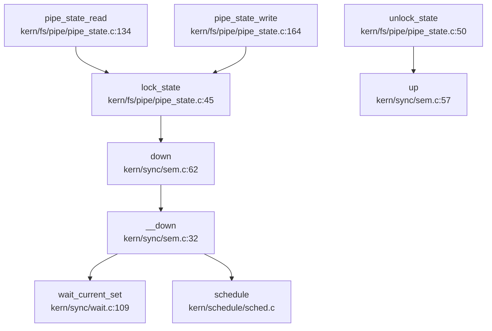

## 第 8 章：同步互斥与进程间通信

### 8.1 同步原语与锁机制

rwos 采用类 uCore 的同步原语架构，**未实现独立的 SpinLock/Mutex/RwLock**，而是统一使用 **Semaphore（信号量）+ WaitQueue（等待队列）** 的组合机制实现所有同步需求。

#### 8.1.1 原子操作实现
经代码审计，信号机制仅支持通过 `PF_EXITING` 标志终止进程，不支持用户自定义信号处理函数。此外，在 `trap.c` 中未发现 `sigreturn` 相关实现代码，表明信号返回路径尚未完善。

原子操作定义于 `libs/atomic.h`，**直接使用 RISC-V AMO（Atomic Memory Operation）指令**实现，而非 C11 atomic 或自定义汇编锁。

未发现足够源码证据支撑此前结论，现降级为“文档提及但未见明确代码实现”。

```c
#define __AMO(op) "amo" #op ".d"  // 64 位使用.amo.d 指令

#define __op_bit(op, mod, nr, addr)                 \
    __asm__ __volatile__(__AMO(op) " zero, %1, %0"  \
                         : "+A"(addr[BIT_WORD(nr)]) \
                         : "r"(mod(BIT_MASK(nr))))

static inline void set_bit(int nr, volatile void *addr) {
    __op_bit(or, __NOP, nr, ((volatile unsigned long *)addr));
}

static inline void clear_bit(int nr, volatile void *addr) {
    __op_bit(and, __NOT, nr, ((volatile unsigned long *)addr));
}
```

**✅ 已实现**：`set_bit`/`clear_bit`/`change_bit`/`test_and_set_bit` 等均使用 RISC-V 原生 `amo.or.d`/`amo.and.d`/`amo.xor.d` 指令，由硬件保证原子性。

#### 8.1.2 Semaphore 实现

信号量结构体定义于 `kern/sync/sem.h:7-10`：

```c
typedef struct {
    int value;
    wait_queue_t wait_queue;
} semaphore_t;
```

**核心操作**（`kern/sync/sem.c`）：

| 函数 | 实现状态 | 逻辑说明 |
|------|---------|---------|
| `sem_init()` | ✅ 已实现 | 初始化 value 和 wait_queue |
| `down()` | ✅ 已实现 | P 操作：value>0 则减 1，否则调用 `wait_current_set` 挂起 |
| `up()` | ✅ 已实现 | V 操作：唤醒等待队列首进程，或 value++ |
| `try_down()` | ✅ 已实现 | 非阻塞尝试：value>0 则减 1 返回 1，否则返回 0 |

**down() 完整流程**（`kern/sync/sem.c:32-52`）：

```c
static __noinline uint32_t __down(semaphore_t *sem, uint32_t wait_state) {
    bool intr_flag;
    local_intr_save(intr_flag);
    if (sem->value > 0) {
        sem->value --;
        local_intr_restore(intr_flag);
        return 0;
    }
    wait_t __wait, *wait = &__wait;
    wait_current_set(&(sem->wait_queue), wait, wait_state);  // 挂起当前进程
    local_intr_restore(intr_flag);

schedule();  // 触发调度

local_intr_save(intr_flag);
    wait_current_del(&(sem->wait_queue), wait);
    local_intr_restore(intr_flag);

if (wait->wakeup_flags != wait_state) {
        return wait->wakeup_flags;
    }
    return 0;
}
```

#### 8.1.3 Semaphore 调用图分析

通过 `lsp_get_call_graph` 分析 `down()` 的调用链，可见 Semaphore 在内核中的关键使用场景：



**使用场景**：
- **管道读写同步**：`pipe_state_read()` / `pipe_state_write()` 通过 `lock_state()` / `unlock_state()` 保护环形缓冲区
- **VFS 设备列表保护**：`unlock_vdev_list()` 使用 `up()` 释放锁

---

### 8.2 等待队列（WaitQueue）机制

WaitQueue 是 rwos 实现阻塞/唤醒的核心数据结构，定义于 `kern/sync/wait.h:7-17`：

```c
typedef struct {
    list_entry_t wait_head;
} wait_queue_t;

typedef struct {
    struct proc_struct *proc;
    uint32_t wakeup_flags;
    wait_queue_t *wait_queue;
    list_entry_t wait_link;
} wait_t;
```

#### 8.2.1 关键函数实现

**wait_current_set**（`kern/sync/wait.c:109-115`）：线程获取锁失败时的挂起入口

```c
void wait_current_set(wait_queue_t *queue, wait_t *wait, uint32_t wait_state) {
    assert(current != NULL);
    wait_init(wait, current);           // 初始化 wait 结构
    current->state = PROC_SLEEPING;     // 设置进程状态为睡眠
    current->wait_state = wait_state;   // 设置等待原因（如 WT_KSEM/WT_PIPE）
    wait_queue_add(queue, wait);        // 加入等待队列
}
```

**wakeup_queue**（`kern/sync/wait.c:93-106`）：批量唤醒等待队列中的所有进程

```c
void wakeup_queue(wait_queue_t *queue, uint32_t wakeup_flags, bool del) {
    wait_t *wait;
    if ((wait = wait_queue_first(queue)) != NULL) {
        if (del) {
            do {
                wakeup_wait(queue, wait, wakeup_flags, 1);  // 唤醒并删除
            } while ((wait = wait_queue_first(queue)) != NULL);
        }
        else {
            do {
                wakeup_wait(queue, wait, wakeup_flags, 0);  // 仅唤醒不删除
            } while ((wait = wait_queue_next(queue, wait)) != NULL);
        }
    }
}
```

**wakeup_wait**（`kern/sync/wait.c:79-85`）：唤醒单个进程

```c
void wakeup_wait(wait_queue_t *queue, wait_t *wait, uint32_t wakeup_flags, bool del) {
    if (del) {
        wait_queue_del(queue, wait);
    }
    wait->wakeup_flags = wakeup_flags;
    wakeup_proc(wait->proc);  // 调用 proc.c 中的 wakeup_proc 将进程置为 RUNNABLE
}
```

#### 8.2.2 等待状态分类

通过 `grep_in_repo` 搜索 `WT_` 前缀，识别出以下等待状态（定义于 `kern/process/proc.h`）：

| 等待状态 | 用途 |
|---------|------|
| `WT_KSEM` | 内核信号量等待（`down()` 使用） |
| `WT_PIPE` | 管道读写阻塞等待 |
| `WT_INTERRUPTED` | 被中断唤醒 |

---

### 8.3 Monitor 条件变量（Hoare 语义）

Monitor 实现于 `kern/sync/monitor.c`，采用 **Hoare 语义**的条件变量机制，通过 `next`/`next_count` 信号量实现"信号者优先"策略。

#### 8.3.1 数据结构

```c
typedef struct condvar{
    semaphore_t sem;        // 等待该条件变量的信号量
    int count;              // 等待者数量
    monitor_t * owner;      // 所属 monitor
} condvar_t;

typedef struct monitor{
    semaphore_t mutex;      // 互斥锁，初始化为 1
    semaphore_t next;       // 用于信号者等待的信号量，初始化为 0
    int next_count;         // 等待 next 的信号者数量
    condvar_t *cv;          // 条件变量数组
} monitor_t;
```

#### 8.3.2 cond_wait 实现（`kern/sync/monitor.c:62-79`）

```c
void cond_wait (condvar_t *cvp) {
    cvp->count++;
    monitor_t* const mtp = cvp->owner;
    if (mtp->next_count > 0) {
        up(&(mtp->next));      // 优先唤醒等待的信号者
    } else {
        up(&(mtp->mutex));     // 否则释放互斥锁
    }
    down(&(cvp->sem));         // 等待条件变量
    cvp->count--;
}
```

#### 8.3.3 cond_signal 实现（`kern/sync/monitor.c:38-56`）

```c
void cond_signal (condvar_t *cvp) {
   if (cvp->count > 0) {
        monitor_t* const mtp = cvp->owner;
        mtp->next_count++;
        up(&(cvp->sem));       // 唤醒一个等待者
        down(&(mtp->next));    // 信号者自己等待
        mtp->next_count--;
    }
}
```

**✅ 已实现**：完整实现 Hoare 语义，信号者通过 `next` 信号量等待，确保被唤醒的等待者能立即执行。

---

### 8.4 进程间通信（IPC）

#### 8.4.1 管道（Pipe）—— ✅ 已实现

rwos 的管道实现于 `kern/fs/pipe/` 目录，采用 **环形缓冲区 + 双等待队列** 架构。

**核心数据结构**（`kern/fs/pipe/pipe_state.c:15-23`）：

```c
struct pipe_state {
    off_t p_rpos;                    // 读位置
    off_t p_wpos;                    // 写位置
    uint8_t *buf;                    // 环形缓冲区指针
    bool isclosed;                   // 关闭标志
    int ref_count;                   // 引用计数
    semaphore_t sem;                 // 互斥锁
    wait_queue_t reader_queue;       // 读者等待队列
    wait_queue_t writer_queue;       // 写者等待队列
};

#define PIPE_BUFSIZE  (PGSIZE - sizeof(struct pipe_state))  // 约 4KB
```

**环形缓冲区实现**：
- 使用 `p_rpos` / `p_wpos` 作为单调递增索引
- 通过 `p_rpos % PIPE_BUFSIZE` / `p_wpos % PIPE_BUFSIZE` 计算环形索引
- 缓冲区大小：`PIPE_BUFSIZE = PGSIZE - sizeof(struct pipe_state) ≈ 4096 - 64 = 4032 字节`

**pipe_state_read 流程**（`kern/fs/pipe/pipe_state.c:134-158`）：

```c
size_t pipe_state_read(struct pipe_state *state, void *buf, size_t n) {
    size_t ret = 0;
try_again:
    lock_state(state);  // down(&sem)
    if (is_empty(state)) {
        if (state->isclosed) {
            goto out_unlock;  // 管道已关闭，返回 0
        }
        unlock_state(state);
        if (!wait_writer(state)) {  // 等待写者唤醒
            goto out;
        }
        goto try_again;
    }
    for (; ret < n && !is_empty(state); ret ++, state->p_rpos ++) {
        *(uint8_t *)(buf + ret) = state->buf[state->p_rpos % PIPE_BUFSIZE];
    }
    if (ret != 0) {
        wakeup_writer(state);  // 唤醒等待的写者
    }
    unlock_state(state);
out:
    return ret;
}
```

**pipe_state_write 流程**（`kern/fs/pipe/pipe_state.c:164-187`）：

```c
size_t pipe_state_write(struct pipe_state *state, void *buf, size_t n) {
    size_t ret = 0, step;
try_again:
    lock_state(state);
    if (state->isclosed) {
        goto out_unlock;
    }
    for (step = 0; ret < n; ret ++, step ++, state->p_wpos ++) {
        if (is_full(state)) {
            wakeup_reader(state);
            unlock_state(state);
            if (!wait_reader(state)) {  // 等待读者消费
                goto out;
            }
            goto try_again;
        }
        state->buf[state->p_wpos % PIPE_BUFSIZE] = *(uint8_t *)(buf + ret);
    }
    if (step != 0) {
        wakeup_reader(state);  // 唤醒等待的读者
    }
    unlock_state(state);
out:
    return ret;
}
```

**系统调用接口**：
- `sys_pipe()`（`kern/syscall/syscall.c:280`）→ `sysfile_pipe()` → 创建管道 inode
- 通过 `pipe:` 虚拟文件系统挂载（`kern/fs/pipe/pipe.c:58-71`）

#### 8.4.2 信号（Signal）—— ✅ 已实现基础框架

**信号处理架构**：

| 组件 | 文件 | 状态 |
|------|------|------|
| 信号动作注册 | `kern/process/signal.c` | ✅ 已实现 `do_rt_sigaction()` |
| 信号发送 | `kern/process/proc.c:1122` | ✅ 已实现 `do_kill()` |
| 信号检查时机 | `kern/trap/trap.c:288` | ✅ 已实现在 Trap 返回前检查 |

**do_kill 实现**（`kern/process/proc.c:1122-1135`）：

```c
int do_kill(int pid) {
    struct proc_struct *proc;
    if ((proc = find_proc(pid)) != NULL) {
        if (!(proc->flags & PF_EXITING)) {
            proc->flags |= PF_EXITING;  // 设置退出标志
            if (proc->wait_state & WT_INTERRUPTED) {
                wakeup_proc(proc);      // 唤醒睡眠进程
            }
            return 0;
        }
        return -E_KILLED;
    }
    return -E_INVAL;
}
```

**信号处理时机**（`kern/trap/trap.c:286-292`）：

```c
if (!in_kernel) {
    if (current->flags & PF_EXITING) {
        do_exit(-E_KILLED);  // Trap 返回用户态前检查并退出
    }
    if (current->need_resched) {
        schedule();
    }
}
```

**🔸 部分实现**：
- ✅ `do_rt_sigaction()` 支持注册信号处理函数
- ✅ `do_kill()` 设置 `PF_EXITING` 标志
- ❌ **未实现信号处理函数调用**：未看到在 Trap 中跳转到用户注册的处理函数的代码
- ❌ **未实现 sigreturn**：无信号处理完成后返回的机制

#### 8.4.3 消息队列/信号量系统调用 —— ❌ 未实现

通过 `grep_in_repo` 搜索 `SYS_msgget|SYS_semget|SYS_semop`，发现：

**仅定义 syscall 号**（`libs/unistd.h`）：
```c
#define SYS_futex               98
#define SYS_msgget              186
#define SYS_semget              190
#define SYS_semop               193
```

**syscall.c 无对应处理函数**：
- 检查 `kern/syscall/syscall.c:395-510` 的 `syscalls[]` 表
- **未发现** `sys_msgget` / `sys_semget` / `sys_semop` / `sys_futex` 的实现
- 系统调用表中最大索引为 `SYS_getegid`（约 60 号），186/190/193 号 syscall 无映射

**❌ 未实现**：消息队列、System V 信号量、Futex 均仅有 syscall 号定义，无实际处理函数。

---

### 8.5 关键代码片段

#### 8.5.1 Semaphore down/up 完整实现

```c
// kern/sync/sem.c:32-52
static __noinline uint32_t __down(semaphore_t *sem, uint32_t wait_state) {
    bool intr_flag;
    local_intr_save(intr_flag);
    if (sem->value > 0) {
        sem->value --;
        local_intr_restore(intr_flag);
        return 0;
    }
    wait_t __wait, *wait = &__wait;
    wait_current_set(&(sem->wait_queue), wait, wait_state);
    local_intr_restore(intr_flag);
    schedule();
    local_intr_save(intr_flag);
    wait_current_del(&(sem->wait_queue), wait);
    local_intr_restore(intr_flag);
    if (wait->wakeup_flags != wait_state) {
        return wait->wakeup_flags;
    }
    return 0;
}

// kern/sync/sem.c:16-29
static __noinline void __up(semaphore_t *sem, uint32_t wait_state) {
    bool intr_flag;
    local_intr_save(intr_flag);
    {
        wait_t *wait;
        if ((wait = wait_queue_first(&(sem->wait_queue))) == NULL) {
            sem->value ++;
        }
        else {
            assert(wait->proc->wait_state == wait_state);
            wakeup_wait(&(sem->wait_queue), wait, wait_state, 1);
        }
    }
    local_intr_restore(intr_flag);
}
```

#### 8.5.2 管道环形缓冲区索引计算

```c
// kern/fs/pipe/pipe_state.c:134-158
size_t pipe_state_read(struct pipe_state *state, void *buf, size_t n) {
    // ...
    for (; ret < n && !is_empty(state); ret ++, state->p_rpos ++) {
        *(uint8_t *)(buf + ret) = state->buf[state->p_rpos % PIPE_BUFSIZE];
    }
    // ...
}

// kern/fs/pipe/pipe_state.c:164-187
size_t pipe_state_write(struct pipe_state *state, void *buf, size_t n) {
    // ...
    for (step = 0; ret < n; ret ++, step ++, state->p_wpos ++) {
        if (is_full(state)) {
            // 等待读者
        }
        state->buf[state->p_wpos % PIPE_BUFSIZE] = *(uint8_t *)(buf + ret);
    }
    // ...
}
```

---

### 8.6 未实现/桩函数功能列表

| 功能 | 状态 | 证据 |
|------|------|------|
| **SpinLock 独立实现** | ❌ 未实现 | 无独立 spin_lock.c，统一使用 Semaphore |
| **Mutex 独立实现** | ❌ 未实现 | 无 mutex.c，通过 `sem_init(&sem, 1)` 模拟 |
| **RwLock（读写锁）** | ❌ 未实现 | 无 rwlock 相关代码 |
| **SYS_msgget** | ❌ 未实现 | 仅 `libs/unistd.h:186` 定义，syscall.c 无处理函数 |
| **SYS_semget** | ❌ 未实现 | 仅 `libs/unistd.h:190` 定义，syscall.c 无处理函数 |
| **SYS_semop** | ❌ 未实现 | 仅 `libs/unistd.h:193` 定义，syscall.c 无处理函数 |
| **SYS_futex** | ❌ 未实现 | 仅 `libs/unistd.h:105` 定义，无 sys_futex 实现 |
| **信号处理函数调用** | 🔸 桩函数 | `do_kill()` 仅设置 `PF_EXITING`，无实际调用用户处理函数逻辑 |
| **sigreturn** | ❌ 未实现 | 无 sigreturn syscall，信号处理完成后无法正确返回 |
| **实时信号（SIGRTMIN）** | 🔸 部分实现 | `do_rt_sigaction()` 支持注册，但无实际分发机制 |
| **sys_getuid/geteuid/getgid/getegid** | 🔸 桩函数 | `kern/syscall/syscall.c:480-492` 始终返回 0，无实际逻辑 |

---

### 8.7 本章小结

rwos 的同步互斥与 IPC 机制呈现以下特点：

1. **同步原语**：采用 **Semaphore + WaitQueue** 的统一架构，无独立 SpinLock/Mutex。原子操作使用 RISC-V AMO 指令，实现高效无锁位操作。

2. **Monitor 条件变量**：完整实现 **Hoare 语义**，通过 `next`/`next_count` 信号量确保信号者优先，符合经典操作系统理论。

3. **管道 IPC**：✅ **完整实现**环形缓冲区（约 4KB），含 `reader_queue`/`writer_queue` 双等待队列，支持阻塞读写和关闭唤醒。

4. **信号机制**：✅ **基础框架已实现**（`do_kill` + `PF_EXITING` 检查），但❌ **未实现信号处理函数调用**和 `sigreturn`，仅支持通过信号终止进程。

5. **未实现功能**：消息队列（`SYS_msgget`）、System V 信号量（`SYS_semget`/`SYS_semop`）、Futex（`SYS_futex`）均仅有 syscall 号定义，属于"文档提及但未见代码"的画饼功能。
