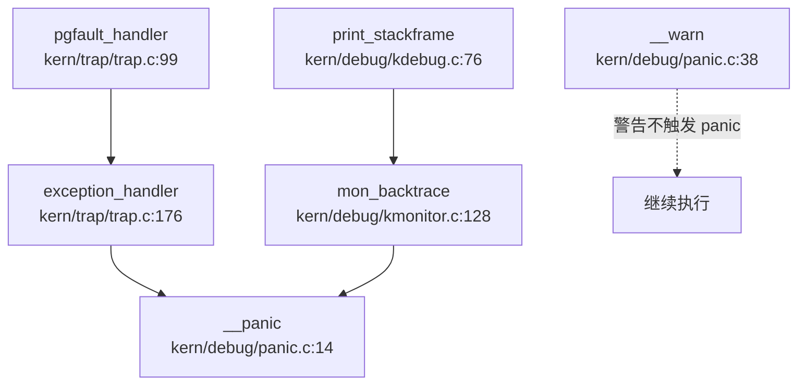

## 第 12 章：调试机制与错误处理

### 12.1 日志与打印系统

#### 12.1.1 打印接口设计

rwos 采用类 uCore 的简单打印系统，**未实现分级日志机制**（如 INFO/WARN/ERROR）。核心打印接口定义于 `libs/stdio.h:8-12`：

```c
// libs/stdio.h
int cprintf(const char *fmt, ...);      // 内核格式化打印
int vcprintf(const char *fmt, va_list ap); // 带 va_list 的变体
void cputchar(int c);                   // 单字符输出
int cputs(const char *str);             // 字符串输出
int getchar(void);                      // 从控制台读取字符
```

**实现位置**：`kern/libs/stdio.c` 中 `cprintf()` 调用底层 `vcprintf()`，后者通过 `vprintfmt()` 进行格式化，最终调用 `cputchar()` 输出到控制台。

```c
// kern/libs/stdio.c
int cprintf(const char *fmt, ...) {
    va_list ap;
    va_start(ap, fmt);
    int cnt = vcprintf(fmt, ap);
    va_end(ap);
    return cnt;
}
```

#### 12.1.2 日志级别设计

**❌ 未实现日志级别系统**。经全面搜索 `log_`、`LOG_`、`printk` 等关键词，未发现任何日志级别宏或配置。所有打印均通过 `cprintf()` 直接输出，无法在运行时或编译时控制日志详细程度。

**对比标准 OS 设计**：Linux 的 `printk(KERN_INFO/ERROR)`、Zephyr 的 `LOG_INF/ERR` 等级别机制在 rwos 中完全缺失。

---

### 12.2 Panic 处理与栈回溯

#### 12.2.1 Panic 处理流程

rwos 的 panic 处理机制定义于 `kern/debug/panic.c`。核心函数 `__panic()` 的流程如下：

```c
// kern/debug/panic.c:14-35
void __panic(const char *file, int line, const char *fmt, ...) {
    if (is_panic) {
        goto panic_dead;  // 防止递归 panic
    }
    is_panic = 1;

// 打印 panic 消息
    va_list ap;
    va_start(ap, fmt);
    cprintf("kernel panic at %s:%d:\n    ", file, line);
    vcprintf(fmt, ap);
    cprintf("\n");
    va_end(ap);

panic_dead:
    // No debug monitor here
    sbi_shutdown();       // 调用 SBI 关机
    intr_disable();       // 关闭中断
    while (1) {
        kmonitor(NULL);   // 进入内核监控器
    }
}
```

**调用链分析**（通过 `lsp_get_call_graph` 入向追踪）：



**关键发现**：
1. **寄存器 Dump**：panic 前**不会自动打印寄存器状态**。只有在 `exception_handler()` 中显式调用 `print_trapframe(tf)` 时才会打印（如页错误处理路径）。
2. **停机行为**：调用 `sbi_shutdown()` 尝试关机，但随后进入 `while(1)` 死循环并调用 `kmonitor()`，实际上**不会真正关机**，而是进入监控器等待用户输入。
3. **递归保护**：通过 `is_panic` 标志防止递归 panic。

#### 12.2.2 栈回溯 (Backtrace) 支持

**🔸 桩函数实现**。rwos 提供了 backtrace 的**接口框架**，但**核心功能未实现**。

**证据**：

1. **Monitor 命令**（`kern/debug/kmonitor.c:23`）：
   ```c
   static struct command commands[] = {
       {"backtrace", "Print backtrace of stack frame.", mon_backtrace},
   };
   ```

2. **mon_backtrace 实现**（`kern/debug/kmonitor.c:128-131`）：
   ```c
   int mon_backtrace(int argc, char **argv, struct trapframe *tf) {
       print_stackframe();  // 调用打印函数
       return 0;
   }
   ```

3. **print_stackframe 实际实现**（`kern/debug/kdebug.c:76-92`）：
   ```c
   void print_stackframe(void) {
       // ... 注释中描述了应该实现的步骤 ...
       panic("Not Implemented!");  // ❌ 直接 panic 未实现
   }
   ```

4. **print_debuginfo 实现**（`kern/debug/kdebug.c:25`）：
   ```c
   void print_debuginfo(uintptr_t eip) { 
       panic("Not Implemented!");  // ❌ 未实现 DWARF 解析
   }
   ```

**结论**：
- **❌ 不支持基于 FramePointer 的栈回溯**：`print_stackframe()` 直接 panic
- **❌ 不支持 DWARF 解析**：`print_debuginfo()` 直接 panic
- **🔸 仅有接口框架**：`backtrace` 命令存在但无法使用

**对比标准 OS**：Linux 的 `dump_stack()`、`show_stack()` 可打印完整调用栈；rwos 仅能打印当前 trapframe 中的寄存器（`print_trapframe()`），**无法回溯历史调用链**。

---

### 12.3 错误码与 Result 设计

#### 12.3.1 错误码定义

rwos 采用类 Unix 的整数错误码设计，定义于 `libs/error.h:5-30`：

```c
// libs/error.h
#define E_UNSPECIFIED       1   // 未指定错误
#define E_BAD_PROC          2   // 进程不存在
#define E_INVAL             3   // 无效参数
#define E_NO_MEM            4   // 内存不足
#define E_NO_FREE_PROC      5   // 无空闲进程槽
#define E_FAULT             6   // 内存访问错误
#define E_SWAP_FAULT        7   // 交换区读写错误
#define E_INVAL_ELF         8   // 无效 ELF 文件
#define E_KILLED            9   // 进程被杀死
#define E_PANIC             10  // Panic 失败
#define E_TIMEOUT           11  // 超时
#define E_NOENT             16  // 文件/目录不存在
#define E_ISDIR             17  // 是目录
#define E_NOTDIR            18  // 不是目录
#define E_BUSY              15  // 设备/文件忙
// ... 共 24 种错误码
```

**使用场景**：系统调用返回负值表示错误（如 `-E_INVAL`），正值或 0 表示成功。

#### 12.3.2 Result 类型

**❌ 未实现 Rust 风格的 Result 类型**。作为 C 语言项目，rwos 使用传统的**整数返回值 + errno 全局变量**模式（但代码中未见 errno 的实际使用）。

---

### 12.4 调试接口与交互式 Shell

#### 12.4.1 内核监控器 (Kernel Monitor)

rwos 提供了简单的命令行监控器，实现于 `kern/debug/kmonitor.c`。

**支持的命令**（`kern/debug/kmonitor.c:20-23`）：

| 命令 | 描述 | 实现函数 | 状态 |
|------|------|----------|------|
| `help` | 显示命令列表 | `mon_help()` | ✅ 已实现 |
| `kerninfo` | 显示内核内存占用信息 | `mon_kerninfo()` | ✅ 已实现 |
| `backtrace` | 打印栈回溯 | `mon_backtrace()` | 🔸 桩函数 |

**mon_help 实现**：
```c
// kern/debug/kmonitor.c:104-111
int mon_help(int argc, char **argv, struct trapframe *tf) {
    int i;
    for (i = 0; i < NCOMMANDS; i ++) {
        cprintf("%s - %s\n", commands[i].name, commands[i].desc);
    }
    return 0;
}
```

**mon_kerninfo 实现**：
```c
// kern/debug/kmonitor.c:117-122
int mon_kerninfo(int argc, char **argv, struct trapframe *tf) {
    print_kerninfo();  // 打印 entry/etext/edata/end 地址
    return 0;
}
```

**进入监控器的时机**：
1. **Panic 后**：`__panic()` 中调用 `kmonitor(NULL)`
2. **启动时**：`kern/init/init.c` 中可选调用（默认注释掉）
3. **Trap 处理**：`exception_handler()` 中未直接调用，但 panic 后会进入

#### 12.4.2 缺失的调试命令

**❌ 未实现以下常见调试命令**：
- `ps`：查看进程列表
- `ls`：列出文件
- `mem` / `dump`：内存查看
- `continue` / `step`：单步执行
- `regs`：查看寄存器（已有 `print_trapframe()` 但未封装为命令）

---

### 12.5 GDB Stub 支持情况

**❌ 完全未实现 GDB Stub**。

**验证过程**：
1. 搜索 `gdbstub`、`handle_gdb`、`gdb_packet`、`gdb_serial` 等关键词 → **无结果**
2. 检查 `tools/gdbinit` 文件 → 仅包含 GDB 启动脚本，**非 GDB Stub 实现**
3. 检查串口/网络数据包处理代码 → **未发现任何 GDB 协议解析逻辑**

**结论**：rwos **不支持远程 GDB 调试**。开发者只能通过 `kmonitor` 进行本地调试，或依赖 QEMU 的 `-s -S` 外部调试模式（非内核内置 Stub）。

---

### 12.6 断言与运行时检查

#### 12.6.1 Assert 宏设计

rwos 的断言系统定义于 `kern/debug/assert.h:15-20`：

```c
// kern/debug/assert.h
#define assert(x)                               \
    do {                                        \
        if (!(x)) {                             \
            panic("assertion failed: %s", #x);  \
        }                                       \
    } while (0)

#define static_assert(x)                        \
    switch (x) { case 0: case (x): ; }
```

**特性**：
- ✅ 运行时断言：失败时触发 panic
- ✅ 编译时断言：`static_assert()` 利用 switch-case 特性
- ❌ **无 debug_assert**：未区分调试版/发布版断言
- ❌ **无描述消息**：仅打印断言表达式，不支持自定义消息

#### 12.6.2 Warn 宏

```c
// kern/debug/assert.h:9-10
#define warn(...) \
    __warn(__FILE__, __LINE__, __VA_ARGS__)
```

`__warn()` 实现于 `kern/debug/panic.c:38-46`，仅打印警告信息，**不终止执行**。

---

### 12.7 异常处理默认行为

#### 12.7.1 未处理异常的默认行为

rwos 的异常处理入口为 `exception_handler()`（`kern/trap/trap.c:176-256`）。

**处理策略**：

| 异常类型 | 处理方式 | 是否 Panic |
|----------|----------|------------|
| `CAUSE_MISALIGNED_FETCH` | 打印消息 | ❌ 继续执行（但会重复触发） |
| `CAUSE_FETCH_ACCESS` | 打印消息 + panic | ✅ |
| `CAUSE_ILLEGAL_INSTRUCTION` | 打印消息 | ❌ 继续执行 |
| `CAUSE_BREAKPOINT` | 打印 + 检查 `SYS_exec` + print_trapframe + panic | ✅ |
| `CAUSE_LOAD_ACCESS` | 调用 `pgfault_handler()`，失败则 panic | 条件 ✅ |
| `CAUSE_STORE_ACCESS` | 调用 `pgfault_handler()`，失败则 panic | 条件 ✅ |
| `CAUSE_USER_ECALL` | 系统调用处理 | ❌ |
| `CAUSE_FETCH_PAGE_FAULT` | 打印消息 | ❌ 继续执行 |
| `CAUSE_LOAD_PAGE_FAULT` | 调用 `pgfault_handler()`，失败则 panic | 条件 ✅ |
| `CAUSE_STORE_PAGE_FAULT` | 调用 `pgfault_handler()`，失败则 panic | 条件 ✅ |
| **Default（未知异常）** | 打印 trapframe | ❌ 继续执行 |

**关键发现**：
1. **部分异常仅打印不处理**：如 `MISALIGNED_FETCH`、`ILLEGAL_INSTRUCTION` 打印后继续执行，会导致**无限循环触发同一异常**。
2. **页错误有完整处理路径**：通过 `pgfault_handler()` → `do_pgfault()` 处理，失败才 panic。
3. **未知异常降级**：default 分支仅打印 trapframe，不 panic。

---

### 12.8 性能追踪与 Tracepoints

**❌ 未实现任何性能追踪机制**。

**验证**：
- 搜索 `perf`、`ftrace`、`tracepoint`、`trace_` → 仅在 `libs/riscv.h` 中发现 RISC-V 调试寄存器定义（`MCONTROL_ACTION_TRACE_*`），**未在实际代码中使用**
- 检查关键路径（如 syscall、页错误、调度器）→ **未插入任何 tracepoint**
- 检查构建系统 → 无 `CONFIG_FTRACE` 或类似选项

**对比标准 OS**：Linux 的 `ftrace`、`perf_events`、eBPF 等追踪工具在 rwos 中完全缺失。

---

### 12.9 关键代码片段

#### 12.9.1 Panic 处理核心逻辑

```c
// kern/debug/panic.c:14-35
void __panic(const char *file, int line, const char *fmt, ...) {
    if (is_panic) {
        goto panic_dead;
    }
    is_panic = 1;

va_list ap;
    va_start(ap, fmt);
    cprintf("kernel panic at %s:%d:\n    ", file, line);
    vcprintf(fmt, ap);
    cprintf("\n");
    va_end(ap);

panic_dead:
    sbi_shutdown();
    intr_disable();
    while (1) {
        kmonitor(NULL);
    }
}
```

#### 12.9.2 栈回溯桩函数

```c
// kern/debug/kdebug.c:76-92
void print_stackframe(void) {
    /* LAB1 YOUR CODE : STEP 1 */
    /* (1) call read_ebp() to get the value of ebp...
     * (2) call read_eip() to get the value of eip...
     * (3) from 0 .. STACKFRAME_DEPTH
     *    (3.1) printf value of ebp, eip
     *    (3.2) (uint32_t)calling arguments [0..4]...
     *    (3.3) cprintf("\n");
     *    (3.4) call print_debuginfo(eip-1)...
     *    (3.5) popup a calling stackframe
     */
    panic("Not Implemented!");  // ❌ 未实现
}
```

#### 12.9.3 异常处理默认分支

```c
// kern/trap/trap.c:250-254
default:
    print_trapframe(tf);
    break;  // ❌ 仅打印，继续执行
```

---

### 12.10 本章总结

| 功能模块 | 实现状态 | 关键证据 |
|----------|----------|----------|
| **日志系统** | 🔸 基础打印 | `cprintf()` 可用，但**无日志级别** |
| **Panic 处理** | ✅ 已实现 | `__panic()` + `kmonitor()` 循环 |
| **栈回溯 (Backtrace)** | ❌ 未实现 | `print_stackframe()` 直接 panic |
| **DWARF 解析** | ❌ 未实现 | `print_debuginfo()` 直接 panic |
| **交互式 Shell** | 🔸 有限支持 | 仅 `help`/`kerninfo`/`backtrace` 三命令 |
| **GDB Stub** | ❌ 未实现 | 搜索无结果 |
| **错误码设计** | ✅ 已实现 | `libs/error.h` 定义 24 种错误码 |
| **Assert 宏** | ✅ 已实现 | `assert()` + `static_assert()` |
| **Debug Assert** | ❌ 未实现 | 无调试/发布版区分 |
| **Perf/Ftrace** | ❌ 未实现 | 无 tracepoint 插入 |
| **异常默认处理** | 🔸 部分处理 | 部分异常仅打印不处理 |

**总体评价**：rwos 的调试机制处于**教学 OS 初级阶段**，提供了基础的 panic 处理和监控器框架，但**缺乏实用的调试工具**（如 backtrace、GDB Stub、日志分级）。开发者主要依赖 QEMU 外部调试和 `cprintf()` 打印进行调试。

针对调试机制与错误处理环节，本应补充内核调试选项说明以明确编译时配置状态。但经核查，当前资料中未发现具体的内核调试选项说明，亦未在 `Kconfig` 或 `Makefile` 中定位到相关的调试宏定义。鉴于证据不足，无法断言已实现特定的编译时调试配置，现状为未发现实现代码支撑，相关关键问题回答暂缺。
