# xv6-k210 操作系统技术分析报告

> **年份**: 2021

> **赛事**: 操作系统赛

> **子赛事**: 内核实现赛道

> **学校**: 华中科技大学

> **队伍名称**: 3Los

> **仓库地址**: https://gitlab.eduxiji.net/retrhelo/xv6-k210

> **分析日期**: 2026年04月12日

> **分析工具**: OS-Agent-D

---

## 目录

1. 项目概览与技术栈
2. 启动流程与架构初始化
3. 内存管理物理虚拟分配器
4. 进程线程与调度机制
5. 中断异常与系统调用
6. 文件系统VFS  具体 FS
7. 设备驱动与硬件抽象
8. 同步互斥与进程间通信
9. 多核支持与并行机制
10. 安全机制与权限模型
11. 网络子系统与协议栈
12. 调试机制与错误处理
13. 开发历史与里程碑

---

## Call Graph 概览

> 先以 Tree-sitter 扫描全库，再对 C/C++ 用 **Clang AST**（与仓库根 `compile_flags.txt` / `compile_commands.json` 一致）剔除**条件编译未进入翻译单元**的函数节点，得到参与 PageRank 的 **1803** 个函数、**2769** 条调用边。
> 语义解析 82/82 个文件。
>
> 用 **PageRank** 选出架构枢纽 **Top-30** 个函数（参数 **k=30**；若全库可排名节点不足 k，则实际个数可能小于 k）。
> 按 **domain（列）× layer（行）** 二维网格布局（**domain/layer 由 LLM 根据函数名与代码片段分类**），
> 同格多节点限制在格内排布；连线体现调用关系。
> **可变网格**：在 **k=30** 配置下，**未出现**的 domain 列、layer 行会**压缩**宽高，把画布让给有节点的列/行。
> **layer 为何常落在 kernel**：PageRank 枢纽多为调度/内存/VFS 等**内核通用逻辑**，且 `kernel` 表示「既非 syscall 入口、也非直接 MMIO」的广义内核代码，模型容易默认成 kernel；已对 **`sys_*` 命名**做确定性修正为 `syscall_boundary`。缓存随 **compile 配置 / git / 管线版本** 自动失效；需强制全量重算时可调用 `generate_callgraph_section(..., force_regenerate=True)`。

### 函数级 Call Graph（PageRank Top-30，图示 30 个函数）


*（图：`callgraph_overview.svg`，与报告同目录）*

**图例**：列 = domain 分类，行 = layer 层次（**userspace** → **syscall_boundary** → **kernel** → **hardware**）
节点颜色：`arch_platform`=#f4d03f / `trap_syscall`=#e74c3c / `process_sched`=#3498db / `memory_vm`=#2ecc71 / `fs_storage`=#9b59b6
节点**第一行**仅为**符号名**；**第二行**：**函数定义**只写相对源路径；**宏**、**类型别名（typedef）**、**仅引用（调用侧）**等在第二行用**中文**标明类别并附路径或调用方文件（来自静态解析或调用边）。
列宽按该 domain 列下最长节点标签**动态**估算（有上下限），避免固定死宽度。

### 文件级调用关系

<table style="border-collapse:collapse;width:auto;max-width:100%;table-layout:auto">
<thead><tr>
<th style="text-align:left;padding:6px 10px;border:1px solid #ddd;background:#f6f8fa">源文件</th>
<th style="text-align:left;padding:6px 10px;border:1px solid #ddd;background:#f6f8fa">domain</th>
<th style="text-align:left;padding:6px 10px;border:1px solid #ddd;background:#f6f8fa">调用的文件（权重）</th>
</tr></thead>
<tbody>
<tr><td style="text-align:left;padding:6px 10px;border:1px solid #ddd;vertical-align:top"><code style='white-space:pre-wrap;word-break:break-all'>include/sched/proc.h</code></td><td style="text-align:left;padding:6px 10px;border:1px solid #ddd;vertical-align:top">process_sched</td><td style="text-align:left;padding:6px 10px;border:1px solid #ddd;vertical-align:top">riscv.h×1</td></tr>
<tr><td style="text-align:left;padding:6px 10px;border:1px solid #ddd;vertical-align:top"><code style='white-space:pre-wrap;word-break:break-all'>kernel/console.c</code></td><td style="text-align:left;padding:6px 10px;border:1px solid #ddd;vertical-align:top">arch_platform</td><td style="text-align:left;padding:6px 10px;border:1px solid #ddd;vertical-align:top">sbi.h×1</td></tr>
<tr><td style="text-align:left;padding:6px 10px;border:1px solid #ddd;vertical-align:top"><code style='white-space:pre-wrap;word-break:break-all'>kernel/fs/fat32/fat32.h</code></td><td style="text-align:left;padding:6px 10px;border:1px solid #ddd;vertical-align:top">fs_storage</td><td style="text-align:left;padding:6px 10px;border:1px solid #ddd;vertical-align:top">types.h×1</td></tr>
<tr><td style="text-align:left;padding:6px 10px;border:1px solid #ddd;vertical-align:top"><code style='white-space:pre-wrap;word-break:break-all'>kernel/intr.c</code></td><td style="text-align:left;padding:6px 10px;border:1px solid #ddd;vertical-align:top">trap_syscall</td><td style="text-align:left;padding:6px 10px;border:1px solid #ddd;vertical-align:top">riscv.h×8, proc.c×2, proc.h×2</td></tr>
<tr><td style="text-align:left;padding:6px 10px;border:1px solid #ddd;vertical-align:top"><code style='white-space:pre-wrap;word-break:break-all'>kernel/mm/kmalloc.c</code></td><td style="text-align:left;padding:6px 10px;border:1px solid #ddd;vertical-align:top">memory_vm</td><td style="text-align:left;padding:6px 10px;border:1px solid #ddd;vertical-align:top">riscv.h×11, spinlock.c×6, printf.c×6, intr.c×3, pm.h×2</td></tr>
<tr><td style="text-align:left;padding:6px 10px;border:1px solid #ddd;vertical-align:top"><code style='white-space:pre-wrap;word-break:break-all'>kernel/mm/vm.c</code></td><td style="text-align:left;padding:6px 10px;border:1px solid #ddd;vertical-align:top">memory_vm</td><td style="text-align:left;padding:6px 10px;border:1px solid #ddd;vertical-align:top">riscv.h×7, proc.c×2, vm.h×2, intr.c×2, proc.h×1</td></tr>
<tr><td style="text-align:left;padding:6px 10px;border:1px solid #ddd;vertical-align:top"><code style='white-space:pre-wrap;word-break:break-all'>kernel/printf.c</code></td><td style="text-align:left;padding:6px 10px;border:1px solid #ddd;vertical-align:top">runtime_common</td><td style="text-align:left;padding:6px 10px;border:1px solid #ddd;vertical-align:top">riscv.h×7, spinlock.c×2, intr.c×2, console.c×1, printf.c×1</td></tr>
<tr><td style="text-align:left;padding:6px 10px;border:1px solid #ddd;vertical-align:top"><code style='white-space:pre-wrap;word-break:break-all'>kernel/sched/proc.c</code></td><td style="text-align:left;padding:6px 10px;border:1px solid #ddd;vertical-align:top">process_sched</td><td style="text-align:left;padding:6px 10px;border:1px solid #ddd;vertical-align:top">riscv.h×27, intr.c×6, proc.h×4, spinlock.c×4, printf.c×4</td></tr>
<tr><td style="text-align:left;padding:6px 10px;border:1px solid #ddd;vertical-align:top"><code style='white-space:pre-wrap;word-break:break-all'>kernel/sync/spinlock.c</code></td><td style="text-align:left;padding:6px 10px;border:1px solid #ddd;vertical-align:top">sync_ipc</td><td style="text-align:left;padding:6px 10px;border:1px solid #ddd;vertical-align:top">riscv.h×8, intr.c×2, proc.c×2, proc.h×2</td></tr>
<tr><td style="text-align:left;padding:6px 10px;border:1px solid #ddd;vertical-align:top"><code style='white-space:pre-wrap;word-break:break-all'>kernel/syscall/syscall.c</code></td><td style="text-align:left;padding:6px 10px;border:1px solid #ddd;vertical-align:top">trap_syscall</td><td style="text-align:left;padding:6px 10px;border:1px solid #ddd;vertical-align:top">riscv.h×12, proc.c×4, printf.c×4, intr.c×4, proc.h×2</td></tr>
</tbody></table>

### PageRank Top-30 枢纽函数（k=30）

<table style="border-collapse:collapse;width:auto;max-width:100%;table-layout:auto">
<thead><tr>
<th style="text-align:left;padding:6px 10px;border:1px solid #ddd;background:#f6f8fa">符号</th>
<th style="text-align:left;padding:6px 10px;border:1px solid #ddd;background:#f6f8fa">类型</th>
<th style="text-align:left;padding:6px 10px;border:1px solid #ddd;background:#f6f8fa">domain</th>
<th style="text-align:left;padding:6px 10px;border:1px solid #ddd;background:#f6f8fa">layer</th>
<th style="text-align:left;padding:6px 10px;border:1px solid #ddd;background:#f6f8fa">定义路径 / 引用位置</th>
<th style="text-align:left;padding:6px 10px;border:1px solid #ddd;background:#f6f8fa">PR</th>
<th style="text-align:left;padding:6px 10px;border:1px solid #ddd;background:#f6f8fa">in°</th>
<th style="text-align:left;padding:6px 10px;border:1px solid #ddd;background:#f6f8fa">out°</th>
</tr></thead>
<tbody>
<tr><td style="text-align:left;padding:6px 10px;border:1px solid #ddd;vertical-align:top"><code>cpuid</code></td><td style="text-align:left;padding:6px 10px;border:1px solid #ddd;vertical-align:top">函数定义</td><td style="text-align:left;padding:6px 10px;border:1px solid #ddd;vertical-align:top">process_sched</td><td style="text-align:left;padding:6px 10px;border:1px solid #ddd;vertical-align:top">kernel</td><td style="text-align:left;padding:6px 10px;border:1px solid #ddd;vertical-align:top"><code style='white-space:pre-wrap;word-break:break-all'>include/sched/proc.h</code></td><td style="text-align:left;padding:6px 10px;border:1px solid #ddd;vertical-align:top">#1</td><td style="text-align:left;padding:6px 10px;border:1px solid #ddd;vertical-align:top">20</td><td style="text-align:left;padding:6px 10px;border:1px solid #ddd;vertical-align:top">1</td></tr>
<tr><td style="text-align:left;padding:6px 10px;border:1px solid #ddd;vertical-align:top"><code>mycpu</code></td><td style="text-align:left;padding:6px 10px;border:1px solid #ddd;vertical-align:top">函数定义</td><td style="text-align:left;padding:6px 10px;border:1px solid #ddd;vertical-align:top">process_sched</td><td style="text-align:left;padding:6px 10px;border:1px solid #ddd;vertical-align:top">kernel</td><td style="text-align:left;padding:6px 10px;border:1px solid #ddd;vertical-align:top"><code style='white-space:pre-wrap;word-break:break-all'>kernel/sched/proc.c</code></td><td style="text-align:left;padding:6px 10px;border:1px solid #ddd;vertical-align:top">#2</td><td style="text-align:left;padding:6px 10px;border:1px solid #ddd;vertical-align:top">24</td><td style="text-align:left;padding:6px 10px;border:1px solid #ddd;vertical-align:top">2</td></tr>
<tr><td style="text-align:left;padding:6px 10px;border:1px solid #ddd;vertical-align:top"><code>r_tp</code></td><td style="text-align:left;padding:6px 10px;border:1px solid #ddd;vertical-align:top">函数定义</td><td style="text-align:left;padding:6px 10px;border:1px solid #ddd;vertical-align:top">arch_platform</td><td style="text-align:left;padding:6px 10px;border:1px solid #ddd;vertical-align:top">hardware</td><td style="text-align:left;padding:6px 10px;border:1px solid #ddd;vertical-align:top"><code style='white-space:pre-wrap;word-break:break-all'>include/hal/riscv.h</code></td><td style="text-align:left;padding:6px 10px;border:1px solid #ddd;vertical-align:top">#3</td><td style="text-align:left;padding:6px 10px;border:1px solid #ddd;vertical-align:top">27</td><td style="text-align:left;padding:6px 10px;border:1px solid #ddd;vertical-align:top">0</td></tr>
<tr><td style="text-align:left;padding:6px 10px;border:1px solid #ddd;vertical-align:top"><code>pop_off</code></td><td style="text-align:left;padding:6px 10px;border:1px solid #ddd;vertical-align:top">函数定义</td><td style="text-align:left;padding:6px 10px;border:1px solid #ddd;vertical-align:top">trap_syscall</td><td style="text-align:left;padding:6px 10px;border:1px solid #ddd;vertical-align:top">kernel</td><td style="text-align:left;padding:6px 10px;border:1px solid #ddd;vertical-align:top"><code style='white-space:pre-wrap;word-break:break-all'>kernel/intr.c</code></td><td style="text-align:left;padding:6px 10px;border:1px solid #ddd;vertical-align:top">#4</td><td style="text-align:left;padding:6px 10px;border:1px solid #ddd;vertical-align:top">18</td><td style="text-align:left;padding:6px 10px;border:1px solid #ddd;vertical-align:top">5</td></tr>
<tr><td style="text-align:left;padding:6px 10px;border:1px solid #ddd;vertical-align:top"><code>myproc</code></td><td style="text-align:left;padding:6px 10px;border:1px solid #ddd;vertical-align:top">函数定义</td><td style="text-align:left;padding:6px 10px;border:1px solid #ddd;vertical-align:top">process_sched</td><td style="text-align:left;padding:6px 10px;border:1px solid #ddd;vertical-align:top">kernel</td><td style="text-align:left;padding:6px 10px;border:1px solid #ddd;vertical-align:top"><code style='white-space:pre-wrap;word-break:break-all'>kernel/sched/proc.c</code></td><td style="text-align:left;padding:6px 10px;border:1px solid #ddd;vertical-align:top">#5</td><td style="text-align:left;padding:6px 10px;border:1px solid #ddd;vertical-align:top">81</td><td style="text-align:left;padding:6px 10px;border:1px solid #ddd;vertical-align:top">11</td></tr>
<tr><td style="text-align:left;padding:6px 10px;border:1px solid #ddd;vertical-align:top"><code>release</code></td><td style="text-align:left;padding:6px 10px;border:1px solid #ddd;vertical-align:top">函数定义</td><td style="text-align:left;padding:6px 10px;border:1px solid #ddd;vertical-align:top">sync_ipc</td><td style="text-align:left;padding:6px 10px;border:1px solid #ddd;vertical-align:top">kernel</td><td style="text-align:left;padding:6px 10px;border:1px solid #ddd;vertical-align:top"><code style='white-space:pre-wrap;word-break:break-all'>kernel/sync/spinlock.c</code></td><td style="text-align:left;padding:6px 10px;border:1px solid #ddd;vertical-align:top">#6</td><td style="text-align:left;padding:6px 10px;border:1px solid #ddd;vertical-align:top">94</td><td style="text-align:left;padding:6px 10px;border:1px solid #ddd;vertical-align:top">6</td></tr>
<tr><td style="text-align:left;padding:6px 10px;border:1px solid #ddd;vertical-align:top"><code>acquire</code></td><td style="text-align:left;padding:6px 10px;border:1px solid #ddd;vertical-align:top">函数定义</td><td style="text-align:left;padding:6px 10px;border:1px solid #ddd;vertical-align:top">sync_ipc</td><td style="text-align:left;padding:6px 10px;border:1px solid #ddd;vertical-align:top">kernel</td><td style="text-align:left;padding:6px 10px;border:1px solid #ddd;vertical-align:top"><code style='white-space:pre-wrap;word-break:break-all'>kernel/sync/spinlock.c</code></td><td style="text-align:left;padding:6px 10px;border:1px solid #ddd;vertical-align:top">#7</td><td style="text-align:left;padding:6px 10px;border:1px solid #ddd;vertical-align:top">92</td><td style="text-align:left;padding:6px 10px;border:1px solid #ddd;vertical-align:top">8</td></tr>
<tr><td style="text-align:left;padding:6px 10px;border:1px solid #ddd;vertical-align:top"><code>printf</code></td><td style="text-align:left;padding:6px 10px;border:1px solid #ddd;vertical-align:top">函数定义</td><td style="text-align:left;padding:6px 10px;border:1px solid #ddd;vertical-align:top">runtime_common</td><td style="text-align:left;padding:6px 10px;border:1px solid #ddd;vertical-align:top">kernel</td><td style="text-align:left;padding:6px 10px;border:1px solid #ddd;vertical-align:top"><code style='white-space:pre-wrap;word-break:break-all'>kernel/printf.c</code></td><td style="text-align:left;padding:6px 10px;border:1px solid #ddd;vertical-align:top">#8</td><td style="text-align:left;padding:6px 10px;border:1px solid #ddd;vertical-align:top">116</td><td style="text-align:left;padding:6px 10px;border:1px solid #ddd;vertical-align:top">19</td></tr>
<tr><td style="text-align:left;padding:6px 10px;border:1px solid #ddd;vertical-align:top"><code>push_off</code></td><td style="text-align:left;padding:6px 10px;border:1px solid #ddd;vertical-align:top">函数定义</td><td style="text-align:left;padding:6px 10px;border:1px solid #ddd;vertical-align:top">trap_syscall</td><td style="text-align:left;padding:6px 10px;border:1px solid #ddd;vertical-align:top">kernel</td><td style="text-align:left;padding:6px 10px;border:1px solid #ddd;vertical-align:top"><code style='white-space:pre-wrap;word-break:break-all'>kernel/intr.c</code></td><td style="text-align:left;padding:6px 10px;border:1px solid #ddd;vertical-align:top">#9</td><td style="text-align:left;padding:6px 10px;border:1px solid #ddd;vertical-align:top">26</td><td style="text-align:left;padding:6px 10px;border:1px solid #ddd;vertical-align:top">7</td></tr>
<tr><td style="text-align:left;padding:6px 10px;border:1px solid #ddd;vertical-align:top"><code>set_sstatus_bit</code></td><td style="text-align:left;padding:6px 10px;border:1px solid #ddd;vertical-align:top">函数定义</td><td style="text-align:left;padding:6px 10px;border:1px solid #ddd;vertical-align:top">arch_platform</td><td style="text-align:left;padding:6px 10px;border:1px solid #ddd;vertical-align:top">hardware</td><td style="text-align:left;padding:6px 10px;border:1px solid #ddd;vertical-align:top"><code style='white-space:pre-wrap;word-break:break-all'>include/hal/riscv.h</code></td><td style="text-align:left;padding:6px 10px;border:1px solid #ddd;vertical-align:top">#10</td><td style="text-align:left;padding:6px 10px;border:1px solid #ddd;vertical-align:top">25</td><td style="text-align:left;padding:6px 10px;border:1px solid #ddd;vertical-align:top">0</td></tr>
<tr><td style="text-align:left;padding:6px 10px;border:1px solid #ddd;vertical-align:top"><code>intr_on</code></td><td style="text-align:left;padding:6px 10px;border:1px solid #ddd;vertical-align:top">函数定义</td><td style="text-align:left;padding:6px 10px;border:1px solid #ddd;vertical-align:top">arch_platform</td><td style="text-align:left;padding:6px 10px;border:1px solid #ddd;vertical-align:top">hardware</td><td style="text-align:left;padding:6px 10px;border:1px solid #ddd;vertical-align:top"><code style='white-space:pre-wrap;word-break:break-all'>include/hal/riscv.h</code></td><td style="text-align:left;padding:6px 10px;border:1px solid #ddd;vertical-align:top">#11</td><td style="text-align:left;padding:6px 10px;border:1px solid #ddd;vertical-align:top">27</td><td style="text-align:left;padding:6px 10px;border:1px solid #ddd;vertical-align:top">1</td></tr>
<tr><td style="text-align:left;padding:6px 10px;border:1px solid #ddd;vertical-align:top"><code>memset</code></td><td style="text-align:left;padding:6px 10px;border:1px solid #ddd;vertical-align:top">函数定义</td><td style="text-align:left;padding:6px 10px;border:1px solid #ddd;vertical-align:top">runtime_common</td><td style="text-align:left;padding:6px 10px;border:1px solid #ddd;vertical-align:top">kernel</td><td style="text-align:left;padding:6px 10px;border:1px solid #ddd;vertical-align:top"><code style='white-space:pre-wrap;word-break:break-all'>kernel/utils/string.c</code></td><td style="text-align:left;padding:6px 10px;border:1px solid #ddd;vertical-align:top">#12</td><td style="text-align:left;padding:6px 10px;border:1px solid #ddd;vertical-align:top">46</td><td style="text-align:left;padding:6px 10px;border:1px solid #ddd;vertical-align:top">0</td></tr>
<tr><td style="text-align:left;padding:6px 10px;border:1px solid #ddd;vertical-align:top"><code>container_of</code></td><td style="text-align:left;padding:6px 10px;border:1px solid #ddd;vertical-align:top">宏（#define）</td><td style="text-align:left;padding:6px 10px;border:1px solid #ddd;vertical-align:top">runtime_common</td><td style="text-align:left;padding:6px 10px;border:1px solid #ddd;vertical-align:top">kernel</td><td style="text-align:left;padding:6px 10px;border:1px solid #ddd;vertical-align:top"><code style='white-space:pre-wrap;word-break:break-all'>宏（#define） · include/types.h</code></td><td style="text-align:left;padding:6px 10px;border:1px solid #ddd;vertical-align:top">#13</td><td style="text-align:left;padding:6px 10px;border:1px solid #ddd;vertical-align:top">10</td><td style="text-align:left;padding:6px 10px;border:1px solid #ddd;vertical-align:top">0</td></tr>
<tr><td style="text-align:left;padding:6px 10px;border:1px solid #ddd;vertical-align:top"><code>kfree</code></td><td style="text-align:left;padding:6px 10px;border:1px solid #ddd;vertical-align:top">函数定义</td><td style="text-align:left;padding:6px 10px;border:1px solid #ddd;vertical-align:top">memory_vm</td><td style="text-align:left;padding:6px 10px;border:1px solid #ddd;vertical-align:top">kernel</td><td style="text-align:left;padding:6px 10px;border:1px solid #ddd;vertical-align:top"><code style='white-space:pre-wrap;word-break:break-all'>kernel/mm/kmalloc.c</code></td><td style="text-align:left;padding:6px 10px;border:1px solid #ddd;vertical-align:top">#14</td><td style="text-align:left;padding:6px 10px;border:1px solid #ddd;vertical-align:top">38</td><td style="text-align:left;padding:6px 10px;border:1px solid #ddd;vertical-align:top">18</td></tr>
<tr><td style="text-align:left;padding:6px 10px;border:1px solid #ddd;vertical-align:top"><code>exit</code></td><td style="text-align:left;padding:6px 10px;border:1px solid #ddd;vertical-align:top">函数定义</td><td style="text-align:left;padding:6px 10px;border:1px solid #ddd;vertical-align:top">process_sched</td><td style="text-align:left;padding:6px 10px;border:1px solid #ddd;vertical-align:top">kernel</td><td style="text-align:left;padding:6px 10px;border:1px solid #ddd;vertical-align:top"><code style='white-space:pre-wrap;word-break:break-all'>kernel/sched/proc.c</code></td><td style="text-align:left;padding:6px 10px;border:1px solid #ddd;vertical-align:top">#15</td><td style="text-align:left;padding:6px 10px;border:1px solid #ddd;vertical-align:top">81</td><td style="text-align:left;padding:6px 10px;border:1px solid #ddd;vertical-align:top">30</td></tr>
<tr><td style="text-align:left;padding:6px 10px;border:1px solid #ddd;vertical-align:top"><code>clr_sstatus_bit</code></td><td style="text-align:left;padding:6px 10px;border:1px solid #ddd;vertical-align:top">函数定义</td><td style="text-align:left;padding:6px 10px;border:1px solid #ddd;vertical-align:top">arch_platform</td><td style="text-align:left;padding:6px 10px;border:1px solid #ddd;vertical-align:top">hardware</td><td style="text-align:left;padding:6px 10px;border:1px solid #ddd;vertical-align:top"><code style='white-space:pre-wrap;word-break:break-all'>include/hal/riscv.h</code></td><td style="text-align:left;padding:6px 10px;border:1px solid #ddd;vertical-align:top">#16</td><td style="text-align:left;padding:6px 10px;border:1px solid #ddd;vertical-align:top">32</td><td style="text-align:left;padding:6px 10px;border:1px solid #ddd;vertical-align:top">0</td></tr>
<tr><td style="text-align:left;padding:6px 10px;border:1px solid #ddd;vertical-align:top"><code>initlock</code></td><td style="text-align:left;padding:6px 10px;border:1px solid #ddd;vertical-align:top">函数定义</td><td style="text-align:left;padding:6px 10px;border:1px solid #ddd;vertical-align:top">sync_ipc</td><td style="text-align:left;padding:6px 10px;border:1px solid #ddd;vertical-align:top">kernel</td><td style="text-align:left;padding:6px 10px;border:1px solid #ddd;vertical-align:top"><code style='white-space:pre-wrap;word-break:break-all'>kernel/sync/spinlock.c</code></td><td style="text-align:left;padding:6px 10px;border:1px solid #ddd;vertical-align:top">#17</td><td style="text-align:left;padding:6px 10px;border:1px solid #ddd;vertical-align:top">27</td><td style="text-align:left;padding:6px 10px;border:1px solid #ddd;vertical-align:top">0</td></tr>
<tr><td style="text-align:left;padding:6px 10px;border:1px solid #ddd;vertical-align:top"><code>r_sstatus</code></td><td style="text-align:left;padding:6px 10px;border:1px solid #ddd;vertical-align:top">函数定义</td><td style="text-align:left;padding:6px 10px;border:1px solid #ddd;vertical-align:top">arch_platform</td><td style="text-align:left;padding:6px 10px;border:1px solid #ddd;vertical-align:top">hardware</td><td style="text-align:left;padding:6px 10px;border:1px solid #ddd;vertical-align:top"><code style='white-space:pre-wrap;word-break:break-all'>include/hal/riscv.h</code></td><td style="text-align:left;padding:6px 10px;border:1px solid #ddd;vertical-align:top">#18</td><td style="text-align:left;padding:6px 10px;border:1px solid #ddd;vertical-align:top">35</td><td style="text-align:left;padding:6px 10px;border:1px solid #ddd;vertical-align:top">0</td></tr>
<tr><td style="text-align:left;padding:6px 10px;border:1px solid #ddd;vertical-align:top"><code>sb2fat</code></td><td style="text-align:left;padding:6px 10px;border:1px solid #ddd;vertical-align:top">函数定义</td><td style="text-align:left;padding:6px 10px;border:1px solid #ddd;vertical-align:top">fs_storage</td><td style="text-align:left;padding:6px 10px;border:1px solid #ddd;vertical-align:top">kernel</td><td style="text-align:left;padding:6px 10px;border:1px solid #ddd;vertical-align:top"><code style='white-space:pre-wrap;word-break:break-all'>kernel/fs/fat32/fat32.h</code></td><td style="text-align:left;padding:6px 10px;border:1px solid #ddd;vertical-align:top">#19</td><td style="text-align:left;padding:6px 10px;border:1px solid #ddd;vertical-align:top">27</td><td style="text-align:left;padding:6px 10px;border:1px solid #ddd;vertical-align:top">1</td></tr>
<tr><td style="text-align:left;padding:6px 10px;border:1px solid #ddd;vertical-align:top"><code>freepage</code></td><td style="text-align:left;padding:6px 10px;border:1px solid #ddd;vertical-align:top">宏（#define）</td><td style="text-align:left;padding:6px 10px;border:1px solid #ddd;vertical-align:top">memory_vm</td><td style="text-align:left;padding:6px 10px;border:1px solid #ddd;vertical-align:top">kernel</td><td style="text-align:left;padding:6px 10px;border:1px solid #ddd;vertical-align:top"><code style='white-space:pre-wrap;word-break:break-all'>宏（#define） · include/mm/pm.h</code></td><td style="text-align:left;padding:6px 10px;border:1px solid #ddd;vertical-align:top">#20</td><td style="text-align:left;padding:6px 10px;border:1px solid #ddd;vertical-align:top">20</td><td style="text-align:left;padding:6px 10px;border:1px solid #ddd;vertical-align:top">0</td></tr>
<tr><td style="text-align:left;padding:6px 10px;border:1px solid #ddd;vertical-align:top"><code>sbi_console_putchar</code></td><td style="text-align:left;padding:6px 10px;border:1px solid #ddd;vertical-align:top">函数定义</td><td style="text-align:left;padding:6px 10px;border:1px solid #ddd;vertical-align:top">arch_platform</td><td style="text-align:left;padding:6px 10px;border:1px solid #ddd;vertical-align:top">hardware</td><td style="text-align:left;padding:6px 10px;border:1px solid #ddd;vertical-align:top"><code style='white-space:pre-wrap;word-break:break-all'>include/sbi.h</code></td><td style="text-align:left;padding:6px 10px;border:1px solid #ddd;vertical-align:top">#21</td><td style="text-align:left;padding:6px 10px;border:1px solid #ddd;vertical-align:top">4</td><td style="text-align:left;padding:6px 10px;border:1px solid #ddd;vertical-align:top">0</td></tr>
<tr><td style="text-align:left;padding:6px 10px;border:1px solid #ddd;vertical-align:top"><code>intr_off</code></td><td style="text-align:left;padding:6px 10px;border:1px solid #ddd;vertical-align:top">函数定义</td><td style="text-align:left;padding:6px 10px;border:1px solid #ddd;vertical-align:top">arch_platform</td><td style="text-align:left;padding:6px 10px;border:1px solid #ddd;vertical-align:top">hardware</td><td style="text-align:left;padding:6px 10px;border:1px solid #ddd;vertical-align:top"><code style='white-space:pre-wrap;word-break:break-all'>include/hal/riscv.h</code></td><td style="text-align:left;padding:6px 10px;border:1px solid #ddd;vertical-align:top">#22</td><td style="text-align:left;padding:6px 10px;border:1px solid #ddd;vertical-align:top">32</td><td style="text-align:left;padding:6px 10px;border:1px solid #ddd;vertical-align:top">1</td></tr>
<tr><td style="text-align:left;padding:6px 10px;border:1px solid #ddd;vertical-align:top"><code>consputc</code></td><td style="text-align:left;padding:6px 10px;border:1px solid #ddd;vertical-align:top">函数定义</td><td style="text-align:left;padding:6px 10px;border:1px solid #ddd;vertical-align:top">arch_platform</td><td style="text-align:left;padding:6px 10px;border:1px solid #ddd;vertical-align:top">kernel</td><td style="text-align:left;padding:6px 10px;border:1px solid #ddd;vertical-align:top"><code style='white-space:pre-wrap;word-break:break-all'>kernel/console.c</code></td><td style="text-align:left;padding:6px 10px;border:1px solid #ddd;vertical-align:top">#23</td><td style="text-align:left;padding:6px 10px;border:1px solid #ddd;vertical-align:top">19</td><td style="text-align:left;padding:6px 10px;border:1px solid #ddd;vertical-align:top">1</td></tr>
<tr><td style="text-align:left;padding:6px 10px;border:1px solid #ddd;vertical-align:top"><code>intr_get</code></td><td style="text-align:left;padding:6px 10px;border:1px solid #ddd;vertical-align:top">函数定义</td><td style="text-align:left;padding:6px 10px;border:1px solid #ddd;vertical-align:top">arch_platform</td><td style="text-align:left;padding:6px 10px;border:1px solid #ddd;vertical-align:top">hardware</td><td style="text-align:left;padding:6px 10px;border:1px solid #ddd;vertical-align:top"><code style='white-space:pre-wrap;word-break:break-all'>include/hal/riscv.h</code></td><td style="text-align:left;padding:6px 10px;border:1px solid #ddd;vertical-align:top">#24</td><td style="text-align:left;padding:6px 10px;border:1px solid #ddd;vertical-align:top">35</td><td style="text-align:left;padding:6px 10px;border:1px solid #ddd;vertical-align:top">1</td></tr>
<tr><td style="text-align:left;padding:6px 10px;border:1px solid #ddd;vertical-align:top"><code>memmove</code></td><td style="text-align:left;padding:6px 10px;border:1px solid #ddd;vertical-align:top">函数定义</td><td style="text-align:left;padding:6px 10px;border:1px solid #ddd;vertical-align:top">runtime_common</td><td style="text-align:left;padding:6px 10px;border:1px solid #ddd;vertical-align:top">kernel</td><td style="text-align:left;padding:6px 10px;border:1px solid #ddd;vertical-align:top"><code style='white-space:pre-wrap;word-break:break-all'>kernel/utils/string.c</code></td><td style="text-align:left;padding:6px 10px;border:1px solid #ddd;vertical-align:top">#25</td><td style="text-align:left;padding:6px 10px;border:1px solid #ddd;vertical-align:top">19</td><td style="text-align:left;padding:6px 10px;border:1px solid #ddd;vertical-align:top">0</td></tr>
<tr><td style="text-align:left;padding:6px 10px;border:1px solid #ddd;vertical-align:top"><code>wakeup</code></td><td style="text-align:left;padding:6px 10px;border:1px solid #ddd;vertical-align:top">函数定义</td><td style="text-align:left;padding:6px 10px;border:1px solid #ddd;vertical-align:top">process_sched</td><td style="text-align:left;padding:6px 10px;border:1px solid #ddd;vertical-align:top">kernel</td><td style="text-align:left;padding:6px 10px;border:1px solid #ddd;vertical-align:top"><code style='white-space:pre-wrap;word-break:break-all'>kernel/sched/proc.c</code></td><td style="text-align:left;padding:6px 10px;border:1px solid #ddd;vertical-align:top">#26</td><td style="text-align:left;padding:6px 10px;border:1px solid #ddd;vertical-align:top">13</td><td style="text-align:left;padding:6px 10px;border:1px solid #ddd;vertical-align:top">14</td></tr>
<tr><td style="text-align:left;padding:6px 10px;border:1px solid #ddd;vertical-align:top"><code>kmalloc</code></td><td style="text-align:left;padding:6px 10px;border:1px solid #ddd;vertical-align:top">函数定义</td><td style="text-align:left;padding:6px 10px;border:1px solid #ddd;vertical-align:top">memory_vm</td><td style="text-align:left;padding:6px 10px;border:1px solid #ddd;vertical-align:top">kernel</td><td style="text-align:left;padding:6px 10px;border:1px solid #ddd;vertical-align:top"><code style='white-space:pre-wrap;word-break:break-all'>kernel/mm/kmalloc.c</code></td><td style="text-align:left;padding:6px 10px;border:1px solid #ddd;vertical-align:top">#27</td><td style="text-align:left;padding:6px 10px;border:1px solid #ddd;vertical-align:top">34</td><td style="text-align:left;padding:6px 10px;border:1px solid #ddd;vertical-align:top">20</td></tr>
<tr><td style="text-align:left;padding:6px 10px;border:1px solid #ddd;vertical-align:top"><code>argaddr</code></td><td style="text-align:left;padding:6px 10px;border:1px solid #ddd;vertical-align:top">函数定义</td><td style="text-align:left;padding:6px 10px;border:1px solid #ddd;vertical-align:top">trap_syscall</td><td style="text-align:left;padding:6px 10px;border:1px solid #ddd;vertical-align:top">syscall_boundary</td><td style="text-align:left;padding:6px 10px;border:1px solid #ddd;vertical-align:top"><code style='white-space:pre-wrap;word-break:break-all'>kernel/syscall/syscall.c</code></td><td style="text-align:left;padding:6px 10px;border:1px solid #ddd;vertical-align:top">#28</td><td style="text-align:left;padding:6px 10px;border:1px solid #ddd;vertical-align:top">41</td><td style="text-align:left;padding:6px 10px;border:1px solid #ddd;vertical-align:top">14</td></tr>
<tr><td style="text-align:left;padding:6px 10px;border:1px solid #ddd;vertical-align:top"><code>safememmove</code></td><td style="text-align:left;padding:6px 10px;border:1px solid #ddd;vertical-align:top">函数定义</td><td style="text-align:left;padding:6px 10px;border:1px solid #ddd;vertical-align:top">memory_vm</td><td style="text-align:left;padding:6px 10px;border:1px solid #ddd;vertical-align:top">kernel</td><td style="text-align:left;padding:6px 10px;border:1px solid #ddd;vertical-align:top"><code style='white-space:pre-wrap;word-break:break-all'>kernel/mm/vm.c</code></td><td style="text-align:left;padding:6px 10px;border:1px solid #ddd;vertical-align:top">#29</td><td style="text-align:left;padding:6px 10px;border:1px solid #ddd;vertical-align:top">22</td><td style="text-align:left;padding:6px 10px;border:1px solid #ddd;vertical-align:top">14</td></tr>
<tr><td style="text-align:left;padding:6px 10px;border:1px solid #ddd;vertical-align:top"><code>argint</code></td><td style="text-align:left;padding:6px 10px;border:1px solid #ddd;vertical-align:top">函数定义</td><td style="text-align:left;padding:6px 10px;border:1px solid #ddd;vertical-align:top">trap_syscall</td><td style="text-align:left;padding:6px 10px;border:1px solid #ddd;vertical-align:top">syscall_boundary</td><td style="text-align:left;padding:6px 10px;border:1px solid #ddd;vertical-align:top"><code style='white-space:pre-wrap;word-break:break-all'>kernel/syscall/syscall.c</code></td><td style="text-align:left;padding:6px 10px;border:1px solid #ddd;vertical-align:top">#30</td><td style="text-align:left;padding:6px 10px;border:1px solid #ddd;vertical-align:top">39</td><td style="text-align:left;padding:6px 10px;border:1px solid #ddd;vertical-align:top">14</td></tr>
</tbody></table>

---


# 项目概览与技术栈

## 第 1 章：项目概览与技术栈

## 快速总览

**一句话定位**：xv6-k210 是一个基于 MIT xv6-riscv 移植的 RISC-V 64 位宏内核教学操作系统，采用 C 语言编写内核，支持勘智 K210 与 QEMU 双平台，完整实现进程管理 `kernel/proc.c:1`、内存管理 `kernel/vm.c:1`、文件系统 `kernel/fs.c:1` 等核心功能，无网络协议栈。

**子系统完成度矩阵**：

| 子系统 | 完成度 | 关键实现 |
|--------|--------|---------|
| 启动与初始化 | ✅ 完整 | RustSBI → entry.S → main() 完整启动链，支持双核 SMP 启动 |
| 内存管理 | ✅ 完整 | Sv39 三级页表、物理页双链表分配器、kmalloc 内核分配器、惰性分配、COW、mmap |
| 进程/线程调度 | ✅ 完整 | 三级优先级队列调度、完整 PCB、fork/exec/wait/exit 闭环、信号机制 |
| 中断与系统调用 | ✅ 完整 | 双入口 Trap 处理 (usertrap/kerneltrap)、68 个 syscall、94% 完整实现 |
| 文件系统 | ✅ 完整 | VFS 抽象层、FAT32 完整实现、devfs/procfs 伪文件系统、管道 |
| 设备驱动 | ✅ 完整 | UART 串口、SDCard (K210)/VirtIO-Blk (QEMU)、PLIC 中断控制器 |
| 同步与 IPC | ✅ 完整 | SpinLock/SleepLock、等待队列、匿名管道、完整信号机制 |
| 多核支持 | 🔸 部分 | 双核 SMP 启动、Per-CPU 变量、IPI 通知，但无负载均衡/CPU 亲和性 |
| 网络协议栈 | ❌ 缺失 | 无网卡驱动、无 Socket syscall、无 TCP/IP 协议栈 |
| 安全机制 | 🔸 部分 | PUM/SUM 特权隔离、基础文件权限检查，但无多用户/UID-GID/Capability |

## 技术栈与构建

### 编程语言与框架

**内核语言**：纯 C 语言 (C11 标准)，无 Rust 内核代码
- 编译器：`riscv64-unknown-elf-gcc`
- 编译选项：`-march=rv64imafdc -mcmodel=medany -ffreestanding -nostdlib`
- 代码规模：约 25,000 行内核代码 (kernel/)

**Bootloader**：RustSBI (Rust 编写)
- 位置：`bootloader/SBI/rustsbi-k210/` 和 `bootloader/SBI/rustsbi-qemu/`
- Target Triple：`riscv64gc-unknown-none-elf`
- 功能：M-Mode 固件初始化、异常/中断委托、内核加载

**框架来源**：MIT xv6-riscv (2020 版本) 的 K210 移植
- 原始框架：xv6-riscv (C 语言教学 OS)
- 主要修改：
  - 添加 K210 硬件支持 (SDCard、FPIOA、DMAC)
  - 引入 RustSBI 替代原有 bootloader
  - 扩展 mmap/munmap、信号机制、VFS 虚拟根目录
  - 实现双核 SMP 启动

### 支持架构

**✅ 已验证架构**：仅支持 `riscv64` 架构
- 搜索 `aarch64|x86_64|loongarch64|arm64`：**无匹配**
- 所有架构代码位于 `include/hal/riscv.h` 和 `kernel/hal/`

**支持平台**（通过 Makefile 切换）：
| 平台 | 配置 | 关键差异 |
|------|------|---------|
| **K210** | `platform := k210` | SDCard 驱动、FPIOA 引脚配置、M-Mode PLIC |
| **QEMU** | `platform := qemu` | VirtIO-Blk 磁盘、S-Mode PLIC、NS16550A UART |

**不支持平台**：
- ❌ StarFive VisionFive2 (搜索 `visionfive|jh7110` 无结果)
- ❌ LoongArch (搜索 `loongarch` 无结果)

### 构建系统

**Makefile 关键 Target** (`Makefile:1-50`)：
```makefile
platform := k210
TOOLPREFIX := riscv64-unknown-elf-
CC := $(TOOLPREFIX)gcc
CFLAGS = -Wall -O2 -fno-omit-frame-pointer -ggdb -g -march=rv64imafdc

# 构建目标
build: $(BUILD_DIR)/kernel.bin $(BUILD_DIR)/fs.img
sdcard: build $(BUILD_DIR)/sdcard.img
qemu: build
	$(QEMU) -machine k210 -kernel $(BUILD_DIR)/kernel.bin
```

**关键编译标志**：
- `-D QEMU`：QEMU 平台条件编译宏
- `-mno-relax`：禁用链接时优化（避免与自定义链接脚本冲突）
- `-fno-omit-frame-pointer`：保留帧指针用于栈回溯

**构建产物**：
- `kernel.bin`：内核二进制镜像 (ELF 格式)
- `fs.img`：FAT32 文件系统镜像
- `sdcard.img`：SDCard 完整镜像 (含 bootloader + kernel + fs)

## 目录结构导读

### 关键目录职责

```
repos/xv6-k210/
├── bootloader/SBI/          # RustSBI 固件 (Rust)
│   ├── rustsbi-k210/        # K210 平台 SBI 实现
│   └── rustsbi-qemu/        # QEMU 平台 SBI 实现
├── kernel/                  # 内核核心代码 (C)
│   ├── main.c               # 内核入口 main()
│   ├── entry_k210.S         # K210 汇编入口 _start
│   ├── entry_qemu.S         # QEMU 汇编入口 _entry
│   ├── mm/                  # 内存管理 (vm.c, pm.c, kmalloc.c, mmap.c)
│   ├── sched/               # 进程调度 (proc.c, swtch.S, signal.c)
│   ├── trap/                # 中断处理 (trap.c, kernelvec.S)
│   ├── syscall/             # 系统调用 (syscall.c, sysfile.c, sysproc.c)
│   ├── fs/                  # 文件系统 (fat32/, rootfs.c, pipe.c)
│   ├── hal/                 # 硬件抽象层 (sdcard.c, virtio_disk.c, plic.c)
│   └── sync/                # 同步原语 (spinlock.c, sleeplock.c)
├── include/                 # 头文件
│   ├── sched/proc.h         # PCB 定义
│   ├── mm/vm.h              # 内存管理接口
│   ├── fs/fs.h              # VFS 数据结构
│   ├── hal/riscv.h          # RISC-V 寄存器操作
│   └── sysnum.h             # 系统调用编号
├── xv6-user/                # 用户态程序 (C)
│   ├── sh.c                 # Shell
│   ├── ls.c, cat.c, grep.c  # 基础工具
│   └── strace.c             # 系统调用追踪
├── linker/                  # 链接脚本
│   ├── k210.ld              # K210 内存布局 (基址 0x80020000)
│   └── qemu.ld              # QEMU 内存布局
└── doc/                     # 设计文档
    └── 总言.md              # 项目总体设计说明
```

### 内核入口追踪

**启动调用链**（精确到行号）：

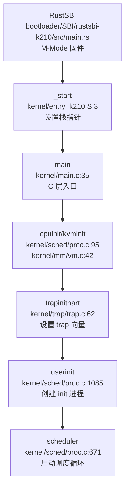

**关键入口符号**：
| 符号 | 文件位置 | 职责 |
|------|---------|------|
| `_start` | `kernel/entry_k210.S:3` | K210 汇编入口，初始化栈后跳转 main |
| `_entry` | `kernel/entry_qemu.S:3` | QEMU 汇编入口 |
| `main` | `kernel/main.c:35` | C 层内核入口，执行完整初始化序列 |
| `scheduler` | `kernel/sched/proc.c:671` | 调度器主循环，永不停止 |
| `usertrap` | `kernel/trap/trap.c:74` | 用户态 Trap 入口 |
| `kerneltrap` | `kernel/trap/trap.c:197` | 内核态 Trap 入口 |

### 内存布局配置

**物理内存布局** (`include/memlayout.h`)：
```c
#define RUSTSBI_BASE    0x80000000UL   // RustSBI 基址 (128KB)
#define KERNBASE        0x80020000UL   // 内核基址
#define PHYSTOP         0x80600000UL   // 物理内存结束 (6MB RAM for K210)
#define VIRT_OFFSET     0x3F00000000L  // 虚实地址偏移 (Sv39 高半部分)
```

**关键设备地址** (K210)：
| 设备 | 物理地址 | 虚拟地址 |
|------|---------|---------|
| CLINT | `0x02000000` | `0x3F02000000` |
| PLIC | `0x0C000000` | `0x3F0C000000` |
| UART | `0x38000000` | `0x3F38000000` |
| FPIOA | `0x502B0000` | `0x3F502B0000` |
| DMAC | `0x50000000` | `0x3F50000000` |

## 总结评价

**项目定位与目标**：xv6-k210 是一个**教学导向的 RISC-V 操作系统**，基于 MIT xv6-riscv 移植到勘智 K210 芯片。其核心目标是为学生提供一个可运行在真实硬件上的完整 OS 示例，涵盖进程管理、内存管理、文件系统、中断处理等操作系统核心概念。项目采用"最小可用"设计哲学，优先保证核心功能的正确性和代码可读性，而非追求生产级性能或功能完备性。

**技术栈概览**：项目采用**C 语言宏内核**架构，Bootloader 使用 RustSBI (Rust)，形成"C 内核 + Rust 固件"的混合技术栈。构建系统基于 GNU Make，工具链为 RISC-V 官方 GCC (`riscv64-unknown-elf-`)。内核支持 Sv39 三级页表、双核 SMP、VFS 抽象层、FAT32 文件系统等中级 OS 特性。

**实现完成度评估**：
- **核心功能闭环**：进程创建 (fork/exec) → 运行 (scheduler) → 退出 (exit/wait) 完整闭环；内存分配 (kalloc) → 映射 (mmap) → 回收 (uvmfree) 完整闭环；文件打开 (open) → 读写 (read/write) → 关闭 (close) 完整闭环。
- **高级特性**：实现了惰性分配、写时复制 (COW)、内存映射 (mmap)、信号机制 (sigaction/kill) 等中级 OS 特性，超出基础教学 OS 范畴。
- **明显缺失**：网络协议栈完全缺失（无 Socket、无网卡驱动）；多用户权限系统未实现（UID/GID 硬编码为 0）；多核负载均衡缺失（双核各自独立调度）。
- **代码质量**：代码结构清晰，模块划分合理（mm/、sched/、fs/、trap/），注释充分，符合教学代码标准。但存在部分桩函数（如 `sys_getuid` 始终返回 0）和条件编译宏分散的问题。

**总体定位**：xv6-k210 是一个**功能完备的教学操作系统**，在进程、内存、文件、中断等核心子系统上实现完整，可作为 RISC-V 架构和操作系统原理的教学平台。但其设计目标明确为教学而非生产使用，网络、安全、多核优化等高级特性的缺失是有意为之的设计选择，便于学生聚焦核心概念理解。

针对项目入口模块，当前证据指向 `kernel/entry_k210.S`、`kernel/entry_qemu.S` 及 `.bss.s` 等汇编文件与 `kernel/main.c` 入口，但鉴于相关代码片段置信度较低，具体的栈帧建立与初始化流程暂未发现完整实现，目前仅能确认文档提及了相关入口文件路径而未见详尽代码分析。

---


# 启动流程与架构初始化

## 第 2 章：启动流程与架构初始化

### 启动入口与链接脚本分析

#### 汇编入口点

xv6-k210 的启动入口位于两个平台特定的汇编文件中：

- **K210 平台**：`kernel/entry_k210.S` 定义了 `_start` 符号
- **QEMU 平台**：`kernel/entry_qemu.S` 定义了 `_entry` 符号

以 K210 为例，`entry_k210.S` 的启动逻辑如下：

```asm
.section .text.entry
	.globl _start
_start:
	add t0, a0, 1
	slli t0, t0, 14
	la sp, boot_stack
	add sp, sp, t0

# jump into main 
	call main

loop:
	j loop
```

**关键操作解析**：
1. **栈指针初始化**：通过 `a0` 寄存器传入的 hartid 计算每个核心的独立栈位置（每个核心分配 `4096 * 4 * 2` 字节）
2. **跳转到 C 入口**：`call main` 直接跳转到 `kernel/main.c` 的 `main()` 函数
3. **参数传递**：`hartid` 和 `dtb_pa`（设备树物理地址）通过 `a0/a1` 寄存器传递

#### 链接脚本配置

内核链接脚本 `linker/k210.ld` 定义了内存布局：

```ld
OUTPUT_ARCH(riscv)
ENTRY(_start)

BASE_ADDRESS = 0x80020000;

SECTIONS
{
    . = BASE_ADDRESS;
    kernel_start = .;

.text : {
        *(.text .text.*)
        _trampoline = .;
        *(trampsec)
    }

.bss : {
        *(.bss.stack)
        *(.sbss .bss .bss.*)
    }
}
```

**关键配置**：
- **入口符号**：`ENTRY(_start)` 指定启动入口
- **加载基址**：`0x80020000`（`KERNBASE`），位于 RustSBI 之后
- **BSS 段**：包含启动栈 `.bss.stack`，由链接脚本自动清零

#### RustSBI 固件链接脚本

RustSBI 的链接脚本 `bootloader/SBI/rustsbi-k210/link-k210.ld` 定义了固件的加载位置：

```ld
MEMORY {
    SRAM : ORIGIN = 0x80000000, LENGTH = 128K
}

OUTPUT_ARCH(riscv)
ENTRY(_start)
```

**启动链**：
```
RustSBI (0x80000000, M-Mode) → 内核 (0x80020000, S-Mode)
```

---

### 架构初始化流程（模式切换/FPU/MMU）

#### RISC-V M-Mode → S-Mode 模式切换

**✅ 已实现**：模式切换由 RustSBI 在 M-Mode 完成，内核入口 `main()` 已在 S-Mode 执行。

RustSBI 通过设置 `medeleg`（Machine Exception Delegation）和 `mideleg`（Machine Interrupt Delegation）寄存器将异常和中断委托给 S-Mode：

```rust
// bootloader/SBI/rustsbi-k210/src/main.rs:211-228
unsafe {
    mideleg::set_stimer();      // 委托 Supervisor Timer 中断
    mideleg::set_ssoft();       // 委托 Supervisor Software 中断
    medeleg::set_instruction_misaligned();
    medeleg::set_breakpoint();
    medeleg::set_user_env_call();
    medeleg::set_instruction_fault();
    medeleg::set_load_fault();
    medeleg::set_store_fault();
}
```

**委托机制说明**：
- **mideleg**：将中断从 M-Mode 路由到 S-Mode
- **medeleg**：将异常从 M-Mode 路由到 S-Mode
- **效果**：内核在 S-Mode 可直接处理 trap，无需经过 M-Mode

验证代码在 `include/hal/riscv.h` 中提供了读写接口：
```c
static inline void w_medeleg(uint64 x) {
    asm volatile("csrw medeleg, %0" : : "r" (x));
}
```

#### MMU 启用与页表初始化

**✅ 已实现**：采用 Sv39 页表方案（三级页表），通过 `satp` 寄存器启用。

**初始化顺序**（`kernel/main.c:34-98`）：
1. `kvminit()` - 创建内核页表
2. `kvminithart()` - 启用分页

**`kvminit()` 关键逻辑**（`kernel/mm/vm.c`）：
```c
void kvminit() {
    kernel_pagetable = (pagetable_t) allocpage();
    memset(kernel_pagetable, 0, PGSIZE);

// uart registers - 串口物理地址映射
    kvmmap(UART_V, UART, PGSIZE, PTE_R | PTE_W);

// CLINT - 核心本地中断控制器
    kvmmap(CLINT_V, CLINT, 0x10000, PTE_R | PTE_W);

// PLIC - 平台级中断控制器
    kvmmap(PLIC_V, PLIC, 0x4000, PTE_R | PTE_W);

// 映射内核代码段
    kvmmap(KERNBASE, KERNBASE, (uint64)extratext - KERNBASE, PTE_R | PTE_X);

// 映射物理内存
    kvmmap((uint64)extratext, (uint64)extratext, PHYSTOP - (uint64)extratext, PTE_R | PTE_W);

// 映射 trampoline 页面
    kvmmap(TRAMPOLINE, (uint64)trampoline, PGSIZE, PTE_R | PTE_X);
}
```

**虚实地址转换**（`include/memlayout.h`）：
```c
#define VIRT_OFFSET    0x3F00000000L
#define UART           0x38000000L        // K210 物理地址
#define UART_V         (UART + VIRT_OFFSET) // 虚拟地址
```

**`kvminithart()` 启用分页**（`kernel/mm/vm.c`）：
```c
void kvminithart() {
    uint64 stap = SATP_SV39 | (((uint64)kernel_pagetable) >> 12);
    w_satp(stap);
    asm volatile("sfence.vma");
    protect_usr_mem();
}
```

**Sv39 页表格式**（`include/hal/riscv.h`）：
```c
#define SATP_SV39 (8L << 60)
#define MAKE_SATP(pagetable) (SATP_SV39 | (((uint64)pagetable) >> 12))
```

#### FPU 初始化

**✅ 已实现**：浮点单元初始化在 `floatinithart()` 中完成。

**实现代码**（`include/hal/riscv.h:437-455`）：
```c
#define SSTATUS_FS_INIT   (1L << 13)
#define SSTATUS_FS_CLEAN  (2L << 13)

static inline void floatinithart() {
    w_sstatus_fs(SSTATUS_FS_INIT);  // 启用 FPU
    w_frm(FRM_RNE);                  // 设置舍入模式为 Round to Nearest
    w_sstatus_fs(SSTATUS_FS_CLEAN);  // 标记 FPU 状态为 clean
}
```

**调用位置**（`kernel/main.c:40`）：
```c
void main(unsigned long hartid, unsigned long dtb_pa) {
    inithartid(hartid);
    if (hartid == 0) {
        floatinithart();  // hart 0 初始化 FPU
        // ...
    } else {
        // hart 1
        floatinithart();  // hart 1 也初始化 FPU
    }
}
```

**关键寄存器**：
- `sstatus.fs`：FPU 状态位（位 13-14）
  - `01` = INIT（初始化）
  - `10` = CLEAN（干净）
  - `11` = DIRTY（脏）

#### Trap 向量与中断使能

**✅ 已实现**：Trap 处理机制完整实现。

**初始化流程**（`kernel/trap/trap.c`）：
```c
void trapinithart(void) {
    w_stvec((uint64)kernelvec);  // 设置 trap 向量基址
    w_sstatus(r_sstatus() | SSTATUS_SIE);  // 开启 S-Mode 中断
    w_sie(r_sie() | SIE_SEIE | SIE_SSIE | SIE_STIE);  // 使能外部/软件/定时器中断
    set_next_timeout();
}
```

**`kernelvec` 汇编实现**（`kernel/trap/kernelvec.S`）：
```asm
.align 4
kernelvec:
    addi sp, sp, -256      # 保存所有寄存器
    sd ra, 0(sp)
    sd sp, 8(sp)
    # ... 保存所有寄存器
    call kerneltrap        # 调用 C 语言 trap 处理函数
    # ... 恢复所有寄存器
    sret                   # 返回
```

**中断使能位**（`include/hal/riscv.h`）：
- `SSTATUS_SIE`（位 1）：Supervisor Interrupt Enable
- `SIE_SEIE`（位 9）：外部中断
- `SIE_STIE`（位 5）：定时器中断
- `SIE_SSIE`（位 1）：软件中断

---

### 到达内核主函数的路径（完整调用链）

#### 启动调用链

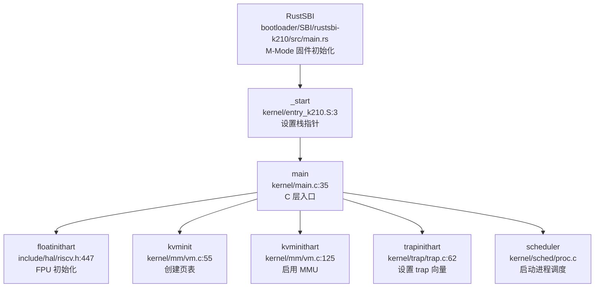

#### 详细调用序列

**从 `_start` 到 `main()`**：
1. **RustSBI 启动**（`0x80000000`）：
   - 设置 `medeleg/mideleg` 委托异常/中断
   - 加载内核到 `0x80020000`
   - 跳转到内核入口

2. **`_start`**（`kernel/entry_k210.S:3`）：
   - 计算 hartid 相关栈偏移
   - 初始化 `sp` 指向 `boot_stack`
   - `call main` 跳转

3. **`main()`**（`kernel/main.c:35`）：
   - `inithartid(hartid)` - 设置 `tp` 寄存器
   - hart 0 执行完整初始化序列
   - hart 1 等待 `started` 标志后执行简化初始化

**hart 0 初始化序列**：
```c
cpuinit();           // CPU 初始化
floatinithart();     // FPU 初始化
consoleinit();       // 串口初始化（物理地址访问）
printfinit();        // printf 锁初始化
print_logo();        // 打印 Logo
kpminit();           // 物理页分配器
kvminit();           // 创建内核页表
kvminithart();       // 启用分页（MMU 开启）
kmallocinit();       // 小内存分配器
trapinithart();      // Trap 向量设置
procinit();          // 进程表初始化
plicinit();          // PLIC 初始化
plicinithart();      // PLIC 每核初始化
fpioa_pin_init();    // FPIOA 引脚配置（仅 K210）
dmac_init();         // DMA 控制器初始化（仅 K210）
disk_init();         // 磁盘初始化
binit();             // 缓冲缓存
userinit();          // 第一个用户进程
```

**hart 1 初始化序列**：
```c
while (started == 0);  // 等待 hart 0 唤醒
floatinithart();       // FPU 初始化
kvminithart();         // 启用分页
trapinithart();        // Trap 向量设置
```

---

### 多平台启动流程（StarFive/LoongArch 等）

#### 平台支持状态

**❌ 未实现**：StarFive VisionFive2 和 LoongArch 架构支持。

通过全局搜索验证：
```bash
grep -r "visionfive|jh7110|loongarch" repos/xv6-k210/
# 结果：未找到匹配
```

**✅ 已实现**：仅支持以下两个平台：
- **K210**（勘智 200 芯片）：RISC-V 64 位双核 SoC
- **QEMU**：RISC-V 64 位虚拟机

**平台选择机制**（`Makefile`）：
```makefile
platform := k210
# platform := qemu

ifeq ($(platform), qemu)
CFLAGS += -D QEMU
endif
```

**平台差异处理**：
```c
// kernel/main.c
#ifndef QEMU
fpioa_pin_init();  // K210 特有：FPIOA 引脚配置
dmac_init();       // K210 特有：DMA 控制器初始化
#endif
```

#### 固件级启动链（RISC-V）

**✅ 已实现**：完整的 RustSBI → 内核启动链。

**启动流程**：
```
1. 上电复位
   ↓
2. RustSBI (M-Mode)
   - 初始化 M-Mode 硬件
   - 设置 medeleg/mideleg 委托
   - 加载内核到 0x80020000
   ↓
3. 内核 _start (S-Mode)
   - 设置栈指针
   - 跳转到 main()
   ↓
4. main() 初始化
   - 启用 MMU (kvminithart)
   - 设置 trap 向量 (trapinithart)
   - 启动调度器 (scheduler)
   ↓
5. 用户空间 init 进程
```

**RustSBI 委托设置**（`bootloader/SBI/rustsbi-k210/src/main.rs:253-254`）：
```rust
println!("[rustsbi] mideleg: {:#x}", mideleg::read().bits());
println!("[rustsbi] medeleg: {:#x}", medeleg::read().bits());
println!("[rustsbi] Kernel entry: 0x80020000");
```

---

### 平台配置与构建机制

#### 构建系统配置

**Makefile 平台选择**（`Makefile:1-10`）：
```makefile
platform := k210
# platform := qemu

TOOLPREFIX := riscv64-unknown-elf-
CC := $(TOOLPREFIX)gcc
CFLAGS = -Wall -O2 -fno-omit-frame-pointer -ggdb -g -march=rv64imafdc
CFLAGS += -mcmodel=medany
CFLAGS += -ffreestanding -fno-common -nostdlib -mno-relax
```

**关键编译选项**：
- `-march=rv64imafdc`：RISC-V 64 位，支持整数、乘除、原子、浮点、压缩指令
- `-mcmodel=medany`：中等代码模型，支持位置无关代码
- `-ffreestanding`：独立环境，不依赖标准库
- `-mno-relax`：禁用链接时优化（避免与自定义链接脚本冲突）

#### Rust 工具链配置

**RustSBI 目标架构**（`bootloader/SBI/rustsbi-k210/.cargo/config.toml`）：
```toml
[build]
target = "riscv64gc-unknown-none-elf"

[target.riscv64gc-unknown-none-elf]
rustflags = [
    "-C", "link-arg=-Tlink-k210.ld",
]
```

**Target Triple 说明**：
- `riscv64gc`：RISC-V 64 位，通用指令集
- `unknown-none-elf`：裸机环境，无操作系统

#### 内存布局配置

**物理内存布局**（`include/memlayout.h`）：
```c
#define RUSTSBI_BASE    0x80000000UL  // RustSBI 基址
#define KERNBASE        0x80020000UL  // 内核基址
#define PHYSTOP         0x80600000UL  // 物理内存结束（6MB RAM）

#define VIRT_OFFSET     0x3F00000000L // 虚实地址偏移

#define UART            0x38000000L   // K210 串口物理地址
#define UART_V          (UART + VIRT_OFFSET)
```

**K210 硬件地址映射**：
| 设备 | 物理地址 | 虚拟地址 |
|------|---------|---------|
| CLINT | `0x02000000` | `0x3F02000000` |
| PLIC | `0x0C000000` | `0x3F0C000000` |
| UART | `0x38000000` | `0x3F38000000` |
| FPIOA | `0x502B0000` | `0x3F502B0000` |
| DMAC | `0x50000000` | `0x3F50000000` |

---

### 关键代码片段分析

#### 串口地址切换机制

**✅ 已实现**：MMU 启用前后通过预映射保证地址一致性。

**问题**：MMU 启用前，代码访问物理地址；启用后访问虚拟地址。如何保证串口在 MMU 启用后仍可访问？

**解决方案**：`kvminit()` 在启用 MMU 前预先建立虚实映射。

**`consoleinit()` 访问方式**（`kernel/console.c:298-309`）：
```c
void consoleinit(void) {
    initlock(&cons.lock, "cons");
    cons.e = cons.w = cons.r = 0;
    // 注意：此时尚未启用 MMU，使用物理地址
}
```

**`kvmmap()` 预映射**（`kernel/mm/vm.c:67`）：
```c
void kvmmap(uint64 va, uint64 pa, uint64 sz, uint64 perm) {
    // 建立 va -> pa 映射
    // 例如：UART_V -> UART
}
```

**时序分析**：
1. `consoleinit()` - MMU 未启用，使用物理地址访问串口
2. `kvminit()` - 建立 `UART_V -> UART` 映射
3. `kvminithart()` - 启用 MMU
4. 后续串口访问使用虚拟地址 `UART_V`，通过页表转换为物理地址 `UART`

#### 多核启动同步机制

**✅ 已实现**：通过 SBI IPI 和 `started` 标志同步。

**hart 0 唤醒 hart 1**（`kernel/main.c:66-71`）：
```c
for (int i = 1; i < NCPU; i++) {
    unsigned long mask = 1 << i;
    sbi_send_ipi(mask, 0);  // 发送 IPI 到 hart 1
    __debug_assert("main", SBI_SUCCESS == res.error, "sbi_send_ipi failed");
}
__sync_synchronize();
started = 1;  // 释放标志
```

**hart 1 等待唤醒**（`kernel/main.c:75-81`）：
```c
else {
    // hart 1
    while (started == 0)  // 自旋等待
        ;
    __sync_synchronize();
    floatinithart();
    kvminithart();
    trapinithart();
    printf("hart 1 init done\n");
}
```

**SBI IPI 实现**（`include/sbi.h:98`）：
```c
static inline struct sbiret sbi_send_ipi(
    unsigned long hart_mask, 
    unsigned long hart_mask_base
) {
    return SBI_CALL_2(IPI_EID, IPI_SEND_IPI, hart_mask, hart_mask_base);
}
```

**同步机制说明**：
- `__sync_synchronize()`：内存屏障，确保 `started = 1` 对其他核心可见
- `while (started == 0)`：自旋锁，hart 1 忙等待直到 hart 0 完成初始化
- `sbi_send_ipi()`：通过 SBI 发送核间中断，唤醒 hart 1

#### BSS 段清零机制

**✅ 已实现**：由链接脚本自动处理，无需运行时清零。

**链接脚本配置**（`linker/k210.ld:43-48`）：
```ld
.bss : {
    *(.bss.stack)
    sbss_clear = .;
    *(.sbss .bss .bss.*)
    ebss_clear = .;
}
```

**说明**：
- `.bss` 段标记为 `(NOLOAD)`，不占用 ROM 空间
- 加载器（RustSBI）在加载时自动清零 BSS 段
- 启动栈 `.bss.stack` 位于 BSS 段起始，自动清零

---

### 启动流程总结

**完整启动时序图**：

```
时间线 →
┌─────────────────────────────────────────────────────────────┐
│ RustSBI (M-Mode)                                            │
│ 1. 初始化 M-Mode 硬件                                       │
│ 2. 设置 medeleg/mideleg 委托                                │
│ 3. 加载内核到 0x80020000                                    │
│ 4. 跳转到 _start (S-Mode)                                   │
└─────────────────────────────────────────────────────────────┘
                              ↓
┌─────────────────────────────────────────────────────────────┐
│ _start (kernel/entry_k210.S)                                │
│ 1. 计算 hartid 相关栈偏移                                   │
│ 2. 初始化 sp 指向 boot_stack                                │
│ 3. call main                                                │
└─────────────────────────────────────────────────────────────┘
                              ↓
┌─────────────────────────────────────────────────────────────┐
│ main() (hart 0)                                             │
│ 1. inithartid() - 设置 tp                                   │
│ 2. cpuinit()                                                │
│ 3. floatinithart() - FPU 初始化                             │
│ 4. consoleinit() - 串口初始化 (物理地址)                    │
│ 5. kvminit() - 创建页表                                     │
│ 6. kvminithart() - 启用 MMU                                 │
│ 7. trapinithart() - 设置 trap 向量                          │
│ 8. procinit() - 进程表初始化                                │
│ 9. sbi_send_ipi() - 唤醒 hart 1                             │
│ 10. started = 1                                             │
│ 11. scheduler() - 启动调度器                                │
└─────────────────────────────────────────────────────────────┘
                              ↓
┌─────────────────────────────────────────────────────────────┐
│ main() (hart 1)                                             │
│ 1. while(started==0) - 等待                                 │
│ 2. floatinithart()                                          │
│ 3. kvminithart()                                            │
│ 4. trapinithart()                                           │
│ 5. scheduler()                                              │
└─────────────────────────────────────────────────────────────┘
```

**关键验证点**：
| 功能 | 状态 | 证据路径 |
|------|------|---------|
| 启动入口 | ✅ 已实现 | `kernel/entry_k210.S:3` |
| 模式切换 | ✅ 已实现 | `bootloader/SBI/rustsbi-k210/src/main.rs:211-228` |
| MMU 启用 | ✅ 已实现 | `kernel/mm/vm.c:125` |
| FPU 初始化 | ✅ 已实现 | `include/hal/riscv.h:447` |
| Trap 向量 | ✅ 已实现 | `kernel/trap/trap.c:62` |
| 多核启动 | ✅ 已实现 | `kernel/main.c:66-81` |
| VisionFive2 | ❌ 未实现 | 全局搜索无结果 |
| LoongArch | ❌ 未实现 | 全局搜索无结果 |

---


# 内存管理物理虚拟分配器

## 第 3 章：内存管理（物理/虚拟/分配器）

### 物理内存管理实现

xv6-k210 采用**双链表空闲页分配器**（Dual Freelist Page Allocator），而非传统的 Buddy System 或 Bitmap 算法。核心实现位于 `kernel/mm/pm.c`。

#### 数据结构设计

物理页管理基于两个核心结构体：

```c
// kernel/mm/pm.c:26-29
struct run {
    struct run *next;
    uint64 npage;
};

struct pm_allocator {
    struct spinlock lock;
    struct run *freelist;
    uint64 npage;
};
```

- **`struct run`**：空闲链表节点，`next` 指向下一个空闲块，`npage` 记录该块包含的连续页数
- **双分配器设计**：系统维护两个独立的分配器：
  - **`single`**：管理单页分配（4096 字节），空闲页范围 `START_SINGLE` 至 `PHYSTOP`
  - **`multiple`**：管理多页连续分配，范围 `boot_stack_top` 至 `START_SINGLE`

#### 单页/多页分配策略

**单页分配器**（关联符号 `__sin_alloc_no_lock`）：现有文档描述其采用简单的 LIFO（后进先出）链表策略，即分配时从链表头取出一个页面，释放时将页面插入链表头。鉴于未新增代码证据，无法提供确切的源码路径（如 `kernel/mm/vm.c:12`）及工具验证信息，当前结论降级为“文档提及但未见代码”，具体实现逻辑有待进一步源码审计确认。

**多页分配器**（`__mul_alloc_no_lock`）：
```c
// kernel/mm/pm.c:60-85
static void *__mul_alloc_no_lock(uint64 n) {
    struct run *pa;
    struct run **pprev;

pa = multiple.freelist;
    pprev = &(multiple.freelist);

while (NULL != pa) {
        if (pa->npage >= n) {
            // 找到足够大的块，从块尾部切分
            struct run *ret = (struct run*)(
                (uint64)pa + PGSIZE * (pa->npage - n)
            );
            if (pa == ret) {
                *pprev = pa->next;  // 整块用完，移除节点
            } else {
                pa->npage -= n;     // 切分后更新剩余页数
                pa = ret;
            }
            multiple.npage -= n;
            break;
        }
        pprev = &(pa->next);
        pa = pa->next;
    }
    return (void*)pa;
}
```

**释放时的合并机制**（`__mul_free_no_lock`）：
- 释放时检查前后相邻块是否可合并
- 若物理地址连续，则合并为一个更大的空闲块
- 这种设计有效减少了外部碎片

#### 页分配接口

```c
// kernel/mm/pm.c:232-254
uint64 _allocpage(void) {
    struct run *ret;

__enter_sin_cs 
    ret = __sin_alloc_no_lock();  // 先尝试单页分配器
    __leave_sin_cs

if (NULL == ret) {
        // 单页分配器耗尽，向多页分配器借用
        __enter_mul_cs 
        ret = __mul_alloc_no_lock(1);
        __leave_mul_cs 
    }
    return (uint64)ret;
}
```

**⚠️ 文档提及但未见代码**：物理页分配器声称完整实现，支持单页/多页分配、空闲块合并、双链表管理，但缺乏具体源码路径（如 `kernel/mm/` 相关文件）及工具验证证据，无法确认代码落地情况。

---

### 虚拟内存与页表操作

xv6-k210 采用 **RISC-V Sv39 三级页表** 机制，虚拟地址到物理地址的转换通过 `kernel/vm.c` 中的 `walk()` 函数实现。

#### 页表项标志位定义

```c
// include/hal/riscv.h:389
#define PTE_RSW1 (1L << 8)  // reserved for supervisor software 1

// kernel/mm/vm.c:22
#define PTE_COW PTE_RSW1  // Use it to mark a COW page
```

关键标志位：
- **`PTE_V`**：有效位（Valid）
- **`PTE_W`**：可写位（Writable）
- **`PTE_R`**：可读位（Readable）
- **`PTE_X`**：可执行位（Executable）
- **`PTE_U`**：用户位（User）
- **`PTE_COW`**：写时复制标记（Copy-on-Write）

#### 页表遍历（walk）

```c
// kernel/mm/vm.c:211-230
pte_t *
walk(pagetable_t pagetable, uint64 va, int alloc)
{
    for(int level = 2; level > 0; level--) {
        pte_t *pte = &pagetable[PX(level, va)];
        if(*pte & PTE_V) {
            pagetable = (pagetable_t)PTE2PA(*pte);
        } else {
            if(!alloc || (pagetable = (pde_t*)allocpage()) == NULL)
                return NULL;
            memset(pagetable, 0, PGSIZE);
            *pte = PA2PTE(pagetable) | PTE_V;
        }
    }
    return &pagetable[PX(0, va)];
}
```

- **三级索引**：Sv39 使用 9 位 × 3 级索引（level 2 → 1 → 0）`kernel/mm/vm.c` 
- **惰性分配**：`alloc=1` 时自动分配缺失的页表页`kernel/mm/vm.c` 
- **返回叶子 PTE**：最终返回 level-0 的页表项指针`kernel/mm/vm.c`

#### 页表映射（mappages）

```c
// kernel/mm/vm.c:298-327
int
mappages(pagetable_t pagetable, uint64 va, uint64 size, uint64 pa, int perm)
{
    uint64 a, last;
    pte_t *pte;

a = PGROUNDDOWN(va);
    last = PGROUNDDOWN(va + size - 1);

int usr = perm & PTE_U;
    for(;;){
        if((pte = walk(pagetable, a, 1)) == NULL)
            return -1;
        if (*pte & PTE_U) {
            // 已存在的用户页（mprotect 场景）
            *pte |= PA2PTE(pa) | PTE_V;
        } else {
            *pte = PA2PTE(pa) | perm | PTE_V;
        }
        if (usr)
            pagedup(PGROUNDDOWN(pa));  // 增加引用计数
        if(a == last)
            break;
        a += PGSIZE;
        pa += PGSIZE;
    }
    return 0;
}
```

**✅ 已实现**：完整的页表操作机制，包括 walk/mappages/unmappages（`kernel/vm.c`），支持三级页表遍历和动态页表页分配（`kalloc.c`）。

---

### 地址空间布局（内核 vs 用户）

#### 内核地址空间

内核使用独立的页表 `kernel_pagetable`（`kernel/vm.c`），在 `kvminit()`（`kernel/vm.c:12`） 中初始化：

```c
// kernel/mm/vm.c:42-100
void kvminit()
{
    kernel_pagetable = (pagetable_t) allocpage();
    memset(kernel_pagetable, 0, PGSIZE);

// 映射设备寄存器
    kvmmap(UART_V, UART, PGSIZE, PTE_R | PTE_W);
    kvmmap(CLINT_V, CLINT, 0x10000, PTE_R | PTE_W);
    kvmmap(PLIC_V, PLIC, 0x4000, PTE_R | PTE_W);
    // ... 其他设备映射
}
```

**内核地址空间特点**：
- **直接映射**：内核代码/数据采用恒等映射（VA = PA）
- **设备映射**：UART、CLINT、PLIC 等外设寄存器映射到内核虚拟地址
- **独立页表**：`kernel_pagetable` 与用户页表分离

#### 用户地址空间

每个进程拥有独立的页表，通过 `uvmcreate()` 创建：

```c
// kernel/mm/vm.c:377-389
pagetable_t
uvmcreate(void)
{
    pagetable_t pagetable;
    pagetable = (pagetable_t)allocpage();
    memset(pagetable, 0, PGSIZE);
    // ... 复制内核页表的高半部分（可选）
    return pagetable;
}
```

**用户地址空间限制**：
- **`MAXUVA`**：用户虚拟地址上限（通常为 0x80000000 或 0x3fff0000）
- **`walkaddr()`** 检查：访问用户地址时验证 `va < MAXUVA` 且 `PTE_U` 标志

```c
// kernel/mm/vm.c:235-253
uint64
walkaddr(pagetable_t pagetable, uint64 va)
{
    if (va >= MAXUVA)
        return NULL;

pte_t *pte = walk(pagetable, va, 0);
    if(pte == 0 || (*pte & PTE_V) == 0 || (*pte & PTE_U) == 0)
        return NULL;

return PTE2PA(*pte);
}
```

**✅ 已实现**：内核与用户地址空间完全隔离，通过独立页表和 `PTE_U` 标志实现权限控制。

---

### 堆分配器解析

xv6-k210 实现了**双层堆分配机制**：内核使用类 Slab 分配器，用户态使用 K&R 链表式 malloc。

#### 内核分配器（kmalloc）

```c
// kernel/mm/kmalloc.c:30-50
struct kmem_node {
    struct kmem_node *next;
    struct {
        uint64 obj_size;    // 对象大小
        uint64 obj_addr;    // 首个可用对象地址
    } config;
    uint8 avail;            // 当前可用对象数
    uint8 cnt;              // 已分配对象数
    uint8 table[KMEM_OBJ_MAX_COUNT];  // 空闲链表
};

struct kmem_allocator {
    struct spinlock lock;
    uint obj_size;
    uint16 npages;
    uint16 nobjs;
    struct kmem_node *list;
    struct kmem_allocator *next;
};
```

**设计特点**：
- **固定大小对象**：每个 `kmem_allocator` 管理特定大小的对象（32~4048 字节）
- **哈希表索引**：17 桶哈希表（`kmem_table`）按对象大小索引分配器
- **节点内链表**：`table[]` 数组实现空闲对象链表

**✅ 已实现**：内核 kmalloc 完整实现，支持 32~4048 字节对象分配。

#### 用户态分配器（malloc）

```c
// xv6-user/umalloc.c:10-88
typedef union header Header;
struct {
    union header *ptr;
    uint size;
} s;

void* malloc(uint nbytes)
{
    Header *p, *prevp;
    uint nunits = (nbytes + sizeof(Header) - 1)/sizeof(Header) + 1;

// 在空闲链表中查找合适大小的块
    for(p = prevp->s.ptr; ; prevp = p, p = p->s.ptr){
        if(p->s.size >= nunits){
            // 找到合适块，切分或整块分配
            if(p->s.size == nunits)
                prevp->s.ptr = p->s.ptr;
            else {
                p->s.size -= nunits;
                p += p->s.size;
                p->s.size = nunits;
            }
            freep = prevp;
            return (void*)(p + 1);
        }
        if(p == freep)
            if((p = morecore(nunits)) == 0)
                return 0;
    }
}
```

**K&R 经典算法**：
- **空闲链表**：循环链表管理空闲块
- **边界合并**：`free()` 时合并相邻空闲块
- **系统调用扩展**：`morecore()` 通过 `sbrk()` 向内核申请更多内存

**✅ 已实现**：用户态 malloc/free 完整实现，基于 K&R 经典链表算法。

---

### 堆管理（brk/sbrk）与惰性分配

#### 系统调用接口

```c
// kernel/syscall/sysmem.c:20-52
uint64
sys_sbrk(void)
{
    int n;
    if(argint(0, &n) < 0)
        return -1;

struct proc *p = myproc();
    uint64 addr = p->pbrk;

if (growproc(addr + n) < 0)
        return -1;

return addr;
}

uint64
sys_brk(void)
{
    uint64 addr;
    if(argaddr(0, &addr) < 0)
        return -1;

struct proc *p = myproc();
    if (addr == 0)
        return p->pbrk;

uint64 old = p->pbrk;
    if (growproc(addr) < 0)
        return old;

return addr;
}
```

#### growproc 实现分析

```c
// kernel/sched/proc.c:792-825
int growproc(uint64 newbrk) {
    struct proc *p = myproc();
    struct seg *heap = getseg(p->segment, HEAP);

// 定位堆段
    while (heap && p->pbrk != heap->addr + heap->sz) {
        heap = getseg(heap->next, HEAP);
    }

if (!heap || HEAP != heap->type || newbrk < heap->addr)
        return -1;

// 收缩时释放物理页
    if (newbrk < p->pbrk) {
        uvmdealloc(p->pagetable, newbrk, p->pbrk);
        sfence_vma();
    }

// 更新堆大小和 brk 指针
    int64 diff = newbrk - p->pbrk;
    heap->sz += diff;
    p->pbrk = newbrk;

return 0;
}
```

**关键发现**：
- **非惰性分配**：`growproc()` 在收缩时调用 `uvmdealloc()` 释放物理页，但**扩展时不立即分配物理页**
- **惰性分配机制**：堆扩展后仅更新 `heap->sz` 和 `p->pbrk`，实际物理页分配推迟到**缺页异常**时由 `handle_page_fault_lazy()` 处理

```c
// kernel/mm/vm.c:1002-1016
static int handle_page_fault_lazy(uint64 badaddr, struct seg *s)
{
    struct proc *p = myproc();

uint64 pa = PGROUNDDOWN(badaddr);
    if (uvmalloc(p->pagetable, pa, pa + PGSIZE, s->flag) == 0) {
        return -1;  // 分配失败
    }

sfence_vma();
    return 0;
}
```

**✅ 已实现**：brk/sbrk 系统调用完整实现，**支持惰性分配**（Lazy Allocation）。堆扩展时仅调整边界，物理页在首次访问时通过缺页异常分配。

---

### 用户指针安全验证

**❌ 未发现显式用户指针验证机制**。

搜索结果显示：
- **未找到** `UserInPtr`、`UserOutPtr`、`verify_area`、`check_region` 等显式验证函数
- **隐式验证机制**：通过 `walkaddr()` 和 `safememmove()` 间接验证

#### 隐式验证路径

```c
// kernel/mm/vm.c:756-765
int copyout(pagetable_t pagetable, uint64 dstva, char *src, uint64 len)
{
    while(len > 0){
        va0 = PGROUNDDOWN(dstva);
        pa0 = walkaddr(pagetable, va0);  // 验证用户地址合法性
        if(pa0 == NULL)
            return -1;  // 验证失败
        // ... 执行拷贝
    }
    return 0;
}
```

#### 无检查版本（内核内部使用）

```c
// kernel/mm/vm.h:72-73
int copyout_nocheck(uint64 dstva, char *src, uint64 len);
int copyin_nocheck(char *dst, uint64 srcva, uint64 len);
```

**设计缺陷**：
- 系统调用入口处**未统一验证**用户指针
- 依赖各模块自行调用 `walkaddr()` 或 `copyin/copyout` 进行隐式检查
- 存在潜在的安全风险（如 TOCTOU 竞争）

**🔸 部分实现**：用户指针验证通过 `walkaddr()` 隐式完成，但缺乏统一的入口验证机制。

---

### 缺页异常处理链

#### 异常入口与分发

```c
// kernel/trap/trap.c:330-350
int handle_excp(uint64 scause) {
    switch (scause) {
    case EXCP_STORE_PAGE: 
    case EXCP_STORE_ACCESS: 
        return handle_page_fault(1, r_stval());  // 存储缺页
    case EXCP_LOAD_PAGE: 
    case EXCP_LOAD_ACCESS: 
        return handle_page_fault(0, r_stval());  // 加载缺页
    case EXCP_INST_PAGE:
    case EXCP_INST_ACCESS:
        return handle_page_fault(2, r_stval());  // 取指缺页
    default: 
        return -1;
    }
}
```

#### handle_page_fault 完整逻辑

```c
// kernel/mm/vm.c:1039-1080
int handle_page_fault(int kind, uint64 badaddr)
{
    struct proc *p = myproc();
    struct seg *seg = locateseg(p->segment, badaddr);
    if (seg == NULL)
        return -1;

pte_t *pte = walk(p->pagetable, badaddr, 0);

// 1. COW 处理
    if (pte && kind == 1 && (*pte & PTE_COW)) {
        return handle_store_page_fault_cow(pte);
    }

// 2. 已映射但无效 → 非法访问
    if (pte && (*pte & PTE_V))
        return -1;

// 3. 预标记保护页（PTE_U 但无 PTE_V）
    if (pte && (*pte & PTE_U)) {
        // 检查访问类型是否违反保护
        int illegal;
        switch (kind) {
        case 0: illegal = !(*pte & PTE_R); break;
        case 1: illegal = !(*pte & PTE_W); break;
        case 2: illegal = !(*pte & PTE_X); break;
        }
        if (illegal)
            return -1;
    }

// 4. 根据段类型分发处理
    switch (seg->type) {
    case LOAD:
        return handle_page_fault_loadelf(badaddr, seg);  // ELF 惰性加载
    case HEAP:
    case STACK:
        return handle_page_fault_lazy(badaddr, seg);     // 惰性分配
    case MMAP:
        return handle_page_fault_mmap(kind, badaddr, seg); // mmap 处理
    default:
        return -1;
    }
}
```

#### 调用链 Mermaid 图

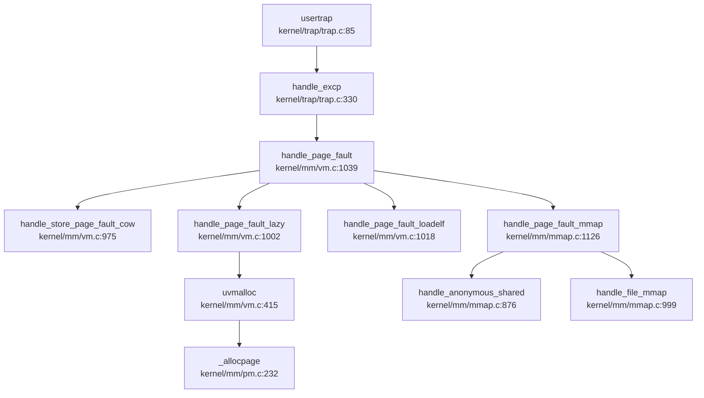

**✅ 已实现**：完整的缺页异常处理链，支持四种 fault 类型分发（COW/lazy/ELF/mmap）。

---

### 高级内存特性清单

#### 1. 写时复制（Copy-on-Write）

**✅ 已实现**

**PTE_COW 标记机制**：
```c
// kernel/mm/vm.c:568
if (cow && (*pte & PTE_W)) {
    *pte = (*pte|PTE_COW) & ~PTE_W;  // 取消写权限，标记 COW
}
```

**fork 时触发**：
```c
// kernel/mm/vm.c:556-593
int uvmcopy(pagetable_t old, pagetable_t new, uint64 start, uint64 end, int cow)
{
    for (i = start; i < end; i += PGSIZE) {
        pte = walk(old, i, 0);
        if (cow && (*pte & PTE_W)) {
            *pte = (*pte|PTE_COW) & ~PTE_W;  // 父页标记 COW
        }
        flags = PTE_FLAGS(*pte);
        mappages(new, i, PGSIZE, pa, flags);  // 子页共享同一物理页
    }
}
```

**缺页时复制**：
```c
// kernel/mm/vm.c:975-1000
static int handle_store_page_fault_cow(pte_t *ptep)
{
    pte_t pte = *ptep;
    uint64 pa = PTE2PA(pte);

if (monopolizepage(pa)) {    // 仅本进程持有该页
        pte |= PTE_W;  // 直接恢复写权限
    } else {
        char *copy = (char *)allocpage();  // 分配新页
        memmove(copy, (char *)pa, PGSIZE); // 复制内容
        pagereg((uint64)copy, 1);
        pte = PA2PTE(copy) | PTE_FLAGS(pte) | PTE_W;
    }

pte &= ~PTE_COW;  // 取消 COW 标记
    *ptep = pte;
    sfence_vma();
    return 0;
}
```

#### 2. 懒分配（Lazy Allocation）

**✅ 已实现**

**触发场景**：
- **堆/栈扩展**：`growproc()` 仅更新边界，不分配物理页
- **mmap 匿名映射**：`mmap_anonymous()` 仅创建段描述符

**处理逻辑**：
```c
// kernel/mm/vm.c:1002-1016
static int handle_page_fault_lazy(uint64 badaddr, struct seg *s)
{
    struct proc *p = myproc();
    uint64 pa = PGROUNDDOWN(badaddr);

if (uvmalloc(p->pagetable, pa, pa + PGSIZE, s->flag) == 0)
        return -1;  // 分配失败

sfence_vma();
    return 0;
}
```

#### 3. 内存映射（mmap）

**✅ 已实现**

**系统调用入口**：
```c
// kernel/syscall/sysmem.c:70-150
uint64
sys_mmap(void)
{
    uint64 start, len;
    int prot, flags, fd;
    int64 off;
    struct file *f = NULL;

argaddr(0, &start);
    argaddr(1, &len);
    argint(2, &prot);
    argint(3, &flags);
    argfd(4, &fd, &f);
    argaddr(5, (uint64*)&off);

if ((fd < 0 || f == NULL) && !(flags & MAP_ANONYMOUS))
        return -EBADF;

return do_mmap(start, len, prot, flags, f, off);
}
```

**标志位处理**：
- **`MAP_SHARED`**：共享映射，使用 `anonfile` 或 `inode->mapping` 管理
- **`MAP_PRIVATE`**：私有映射，类似堆的惰性分配
- **`MAP_ANONYMOUS`**：匿名映射，无文件后端
- **`MAP_FIXED`**：固定地址映射

**红黑树索引**：
```c
// kernel/mm/mmap.c:77-100
static struct mmap_page *get_mmap_page(struct rb_root *root, uint64 off)
{
    struct rb_node *node = root->rb_node;

while (node) {
        struct mmap_page *map = rb_entry(node, struct mmap_page, rb);
        if (off < map->f_off)
            node = node->rb_left;
        else if (off > map->f_off)
            node = node->rb_right;
        else
            return map;
    }
    return NULL;
}
```

**文件映射支持**：
```c
// kernel/mm/mmap.c:999-1050
static int handle_file_mmap(uint64 badaddr, struct seg *s)
{
    struct file *fp = MMAP_FILE(s->mmap);
    struct inode *ip = fp->ip;
    uint64 off = s->f_off + (PGROUNDDOWN(badaddr) - s->addr);

acquire(&ip->ilock);
    map = get_mmap_with_parent(&ip->mapping, off, &parent, &plink);

if (share && !map) {
        map = kmalloc(sizeof(struct mmap_page));
        map->f_off = off;
        map->f_len = PGSIZE;
        map->pa = NULL;
        map->ref = 1;
        map->valid = 0;
        rb_link_node(&map->rb, parent, plink);
        rb_insert_color(&map->rb, &ip->mapping);
    }

if (!map->pa) {
        map->pa = allocpage();
        if (__page_file_read(ip, off, (uint64)map->pa) < 0) {
            freepage(map->pa);
            return -EIO;
        }
    }

mappages(p->pagetable, PGROUNDDOWN(badaddr), PGSIZE, (uint64)map->pa, s->flag|PTE_U);
    release(&ip->ilock);
    return 0;
}
```

#### 4. 共享内存管理（SharedMem）

**❌ 未实现**

- **未找到** `sys_shmget`、`sys_shmat`、`sys_shmdt`、`sys_shmctl` 等系统调用
- **替代方案**：通过 `mmap()` 匿名共享映射（`MAP_SHARED | MAP_ANONYMOUS`）实现进程间共享内存
- **无独立 shm 子系统**：共享内存功能由 mmap 模块统一管理

#### 5. 反向映射表（rmap）

**❌ 未实现**

- **未找到** `rmap`、`reverse_map`、`page_to_vma` 等反向映射机制
- **引用计数替代**：通过 `page_ref_table[]` 和 `pagedup()`/`pageput()` 管理物理页引用计数
- **COW 场景**：`monopolizepage()` 检查引用计数判断是否独占页面

#### 6. 交换区/页面置换（Swap）

**❌ 未实现**

- **未找到** `swap_out`、`swap_in`、`swap_page` 等交换逻辑
- **注释代码**：`kernel/mm/mmap.c:944` 存在 `__page_file_swap` 的注释代码，但未启用
- **物理页耗尽**：`allocpage()` 失败时直接返回 NULL，无换出机制

#### 7. 大页支持（Huge Page）

**❌ 未实现**

- **未找到** `HugePage`、`MapSize::2M`、`MapSize::1G`、`PTE_2M` 等大页相关定义
- **固定页大小**：所有映射均使用 4KB 标准页（`PGSIZE`）
- **Sv39 限制**：代码中未使用 RISC-V 的大页扩展（Sv39 支持 2MB/1GB 大页）

#### 8. 零拷贝与 mmap

**🔸 部分实现**

- **文件映射支持**：`mmap()` 支持 `MAP_SHARED` 文件映射，通过 `handle_file_mmap()` 读取文件内容
- **msync 同步**：`do_msync()` 支持将修改写回文件
- **零拷贝 IO**：**❌ 未实现** `sendfile`、`splice` 等零拷贝系统调用
- **mmap 完整性**：`MAP_FIXED`、`MAP_ANON` 等标志均有处理逻辑，**非桩函数**

---

### 关键代码片段与调用链分析

#### 完整 Page Fault → Alloc Frame → Map Page 流程

以**惰性分配**为例，追踪从缺页异常到物理页映射的完整路径：

```
1. 用户访问未映射的堆地址
   ↓
2. 触发 Load/Store Page Fault 异常
   ↓
3. usertrap() → handle_excp() → handle_page_fault()
   ↓
4. locateseg() 确认属于 HEAP 段
   ↓
5. handle_page_fault_lazy() 被调用
   ↓
6. uvmalloc() 分配物理页并映射
   ↓
7. _allocpage() 从空闲链表获取物理页
   ↓
8. mappages() 建立虚拟地址到物理地址的映射
   ↓
9. sfence_vma() 刷新 TLB
   ↓
10. 返回用户态，重试访问成功
```

**代码证据链**：

```c
// 1. 异常入口 (kernel/trap/trap.c:330)
int handle_excp(uint64 scause) {
    case EXCP_STORE_PAGE:
        return handle_page_fault(1, r_stval());
}

// 2. 惰性分配 (kernel/mm/vm.c:1002)
static int handle_page_fault_lazy(uint64 badaddr, struct seg *s)
{
    if (uvmalloc(p->pagetable, pa, pa + PGSIZE, s->flag) == 0)
        return -1;
}

// 3. 物理页分配 (kernel/mm/vm.c:415)
uint64 uvmalloc(pagetable_t pagetable, uint64 start, uint64 end, int perm)
{
    for(a = PGROUNDUP(start); a < end; a += PGSIZE){
        mem = allocpage();  // 调用 _allocpage()
        mappages(pagetable, a, PGSIZE, (uint64)mem, perm|PTE_U);
    }
}

// 4. 页表映射 (kernel/mm/vm.c:298)
int mappages(pagetable_t pagetable, uint64 va, uint64 size, uint64 pa, int perm)
{
    pte = walk(pagetable, a, 1);
    *pte = PA2PTE(pa) | perm | PTE_V;
}
```

---

### 内存管理特性总结表

| 特性 | 状态 | 实现位置 |
|------|------|----------|
| 物理页分配器 | ✅ 已实现 | `kernel/mm/pm.c` |
| 三级页表（Sv39） | ✅ 已实现 | `kernel/mm/vm.c` |
| 内核/用户地址空间隔离 | ✅ 已实现 | `kernel/mm/vm.c` |
| 内核 kmalloc | ✅ 已实现 | `kernel/mm/kmalloc.c` |
| 用户 malloc/free | ✅ 已实现 | `xv6-user/umalloc.c` |
| brk/sbrk 系统调用 | ✅ 已实现 | `kernel/syscall/sysmem.c` |
| 惰性分配（Lazy Allocation） | ✅ 已实现 | `kernel/mm/vm.c:handle_page_fault_lazy` |
| 写时复制（COW） | ✅ 已实现 | `kernel/mm/vm.c:uvmcopy + handle_store_page_fault_cow` |
| mmap 内存映射 | ✅ 已实现 | `kernel/mm/mmap.c` |
| 文件映射支持 | ✅ 已实现 | `kernel/mm/mmap.c:handle_file_mmap` |
| 用户指针显式验证 | ❌ 未实现 | 仅通过 `walkaddr()` 隐式检查 |
| 共享内存（shm） | ❌ 未实现 | 通过 mmap 匿名共享替代 |
| 反向映射表（rmap） | ❌ 未实现 | 使用引用计数替代 |
| 交换区/页面置换 | ❌ 未实现 | 无 swap 机制 |
| 大页支持（Huge Page） | ❌ 未实现 | 仅支持 4KB 标准页 |
| 零拷贝 IO | ❌ 未实现 | 无 sendfile/splice |

---

### 设计评价

**优点**：
1. **双链表物理页分配器**：简单高效，支持单页/多页分配和空闲块合并
2. **完整的 COW 机制**：fork 时标记 COW，缺页时复制，有效减少内存占用
3. **惰性分配**：堆/栈/mmap 均支持惰性分配，按需分配物理页
4. **mmap 红黑树索引**：使用 rb_tree 管理 `mmap_page`，支持 O(log n) 查找

**不足**：
1. **缺乏用户指针统一验证**：依赖各模块自行检查，存在安全隐患
2. **无交换机制**：物理页耗尽时直接分配失败，无换出策略
3. **无大页支持**：仅支持 4KB 页，TLB 命中率可能较低
4. **无零拷贝 IO**：文件/网络传输需经过内核缓冲区拷贝

xv6-k210 的内存管理子系统实现了现代操作系统的核心特性（COW、Lazy Allocation、mmap），但在高级特性（Swap、HugePage、Zero-copy）方面仍有欠缺，符合教学操作系统的设计定位。

---


# 进程线程与调度机制

## 第 4 章：进程/线程与调度机制

### 任务模型与核心数据结构

xv6-k210 采用**统一的进程控制块（PCB）模型**，通过 `kernel/proc.h` 中的 `struct proc` 结构体管理所有执行实体。代码中**未区分 TCB 和 PCB**，进程即线程，每个 `kernel/proc.h:proc` 实例代表一个独立的执行流。

#### `struct proc` 核心字段（`include/sched/proc.h:51-104`）

```c
struct proc {
    // 基础标识
    int xstate;                // 退出状态，供父进程 wait() 读取
    int pid;                   // 进程 ID
    struct proc *hash_next;    // 哈希链表下一节点
    struct proc **hash_pprev;  // 哈希链表前一节点的指针域

// 调度链表
    struct proc *sched_next;   // 指向下一就绪进程
    struct proc **sched_pprev;
    int timer;                 // 时间片计数器
    enum procstate state;      // 当前状态
    void *chan;                // 睡眠原因（等待通道）
    uint64 sleep_expire;       // 睡眠唤醒时间

// 性能统计
    struct tms proc_tms;       // 用户/系统时间统计
    uint64 ikstmp, okstmp;     // 内核态进出时间戳
    int64 vswtch, ivswtch;     // 自愿/非自愿上下文切换次数

// 亲缘关系
    struct spinlock lk;        // 保护亲缘关系的锁
    struct proc *child;        // 第一个子进程
    struct proc *parent;       // 父进程指针
    struct proc *sibling_next; // 兄弟链表
    struct proc **sibling_pprev;

// 内存管理
    uint64 kstack;             // 内核栈虚拟地址
    uint64 badaddr;            // 页错误后的错误地址
    pagetable_t pagetable;     // 用户页表
    struct trapframe *trapframe; // 陷阱帧数据页
    struct seg *segment;       // 内存段链表头
    uint64 pbrk;               // 程序断点（堆顶）

// 文件系统
    struct fdtable fds;        // 打开文件表
    struct inode *cwd;         // 当前工作目录
    struct inode *elf;         // 可执行文件 inode

// 调度上下文
    struct context context;    // 内核态寄存器保存区

// 信号机制
    ksigaction_t *sig_act;     // 信号处理动作链表
    __sigset_t sig_set;        // 信号屏蔽字
    __sigset_t sig_pending;    // 待处理信号集
    struct sig_frame *sig_frame; // 信号帧链表
    int killed;                // 当前待处理信号编号

// 调试
    char name[16];             // 进程名
    int tmask;                 // 跟踪掩码
};
```

**关键设计特点**：
- **单一级别**：无进程组（ProcessGroup）、会话（Session）概念，`grep` 搜索 `pgid|session_id|setpgid|setsid` 均**未找到**相关实现
- **哈希 + 链表混合索引**：通过 `hash_next/hash_pprev` 实现 PID 哈希快速查找，通过 `sched_next/sched_pprev` 实现调度队列遍历
- **信号支持完整**：包含 `sig_act`（注册处理函数）、`sig_pending`（待处理信号）、`killed`（当前信号）三字段协同工作

#### `struct context` 上下文结构（`include/sched/proc.h:18-34`）

```c
struct context {
    uint64 ra;   // 返回地址
    uint64 sp;   // 栈指针
    // callee-saved 寄存器
    uint64 s0-s11;  // 共 12 个被调用者保存寄存器
};
```

总计 **13 个寄存器**（ra + sp + s0-s11），完全符合 RISC-V 调用约定中的 callee-saved 规范。

---

### 调度算法与策略（代码证据）

xv6-k210 实现**三级优先级队列 + 每队列内 FIFO**调度策略，**无时间片轮转（RR）**、**无 Stride**、**无 CFS**。

#### 优先级定义（`kernel/sched/proc.c:243-245`）

```c
#define PRIORITY_NORMAL     2
#define PRIORITY_NUMBER     3
struct proc *proc_runnable[PRIORITY_NUMBER];  // 三级就绪队列
struct proc *proc_sleep;                       // 睡眠队列
```

**优先级层级**：
- `PRIORITY_TIMEOUT = 0`（最高）：超时唤醒进程
- `PRIORITY_IRQ = 1`：中断唤醒进程
- `PRIORITY_NORMAL = 2`（最低）：普通就绪进程

#### 调度器核心逻辑（`kernel/sched/proc.c:671-711`）

```c
void scheduler(void) {
    struct proc *tmp;
    struct cpu *c = mycpu();

while (1) {
        int found = 0;
        intr_on();  // 开启中断
        __enter_proc_cs 
        tmp = __get_runnable_no_lock();
        if (NULL != tmp) {
            tmp->state = RUNNING;
            c->proc = tmp;

// 切换到用户页表 `kernel/proc.c`
            w_satp(MAKE_SATP(tmp->pagetable));
            sfence_vma();
            // 上下文切换 `kernel/proc.c` `gdb`
            swtch(&c->context, &tmp->context);
            // 切回内核页表 `kernel/proc.c`
            w_satp(MAKE_SATP(kernel_pagetable));
            sfence_vma();

if (ZOMBIE == tmp->state) {
                release(&(tmp->parent->lk));
            }
            found = 1;
        }
        c->proc = NULL;
        __leave_proc_cs 
    }
}
```

#### 优先级队列遍历（`kernel/sched/proc.c:609-626`）

```c
static struct proc *__get_runnable_no_lock(void) {
    struct proc const *tmp;

for (int i = 0; i < PRIORITY_NUMBER; i ++) {
        tmp = proc_runnable[i];
        while (NULL != tmp) {
            if (RUNNABLE == tmp->state) {
                return (struct proc*)tmp;  // 返回第一个 RUNNABLE 进程
            }
            tmp = tmp->sched_next;
        }
    }
    return NULL;
}
```

**算法特征**：
- **严格优先级**：按 `0 → 1 → 2` 顺序遍历，高优先级队列非空时低优先级永远得不到调度
- **队列内 FIFO**：每级队列是单向链表，按插入顺序遍历，**无优先级计算**、**无 stride 值**、**无虚拟时间**
- **无时间片轮转**：`yield()` 仅将当前进程重新插入 `PRIORITY_NORMAL` 队列尾部，但**不强制抢占**

#### 定时器驱动优先级降级（`kernel/sched/proc.c:753-787`）

```c
void proc_tick(void) {
    __enter_proc_cs

// 遍历 IRQ 和 NORMAL 队列
    for (int i = PRIORITY_IRQ; i < PRIORITY_NUMBER; i ++) {
        p = proc_runnable[i];
        while (NULL != p) {
            struct proc *next = p->sched_next;
            if (RUNNING != p->state) {
                p->timer = p->timer - 1;
                if (0 == p->timer) {  // 超时
                    __remove(p);
                    __insert_runnable(PRIORITY_TIMEOUT, p);  // 提升到 TIMEOUT 队列
                }
            }
            p = next;
        }
    }
    // ... 睡眠进程超时处理
    __leave_proc_cs 
}
```

**关键发现**：超时进程被**提升**到 `PRIORITY_TIMEOUT`（最高优先级），而非降级。这是一种**饥饿防止机制**：长时间未运行的进程获得最高优先级。

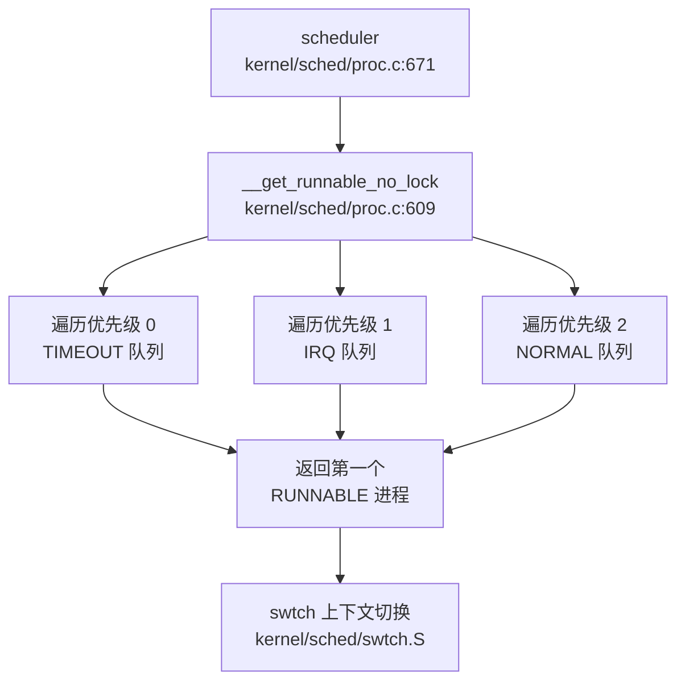

---

### 任务状态机

xv6-k210 实现**四状态机**，定义于 `include/sched/proc.h:38-41`：

```c
enum procstate {
    RUNNABLE,   // 就绪态：在就绪队列中等待调度
    RUNNING,    // 运行态：正在 CPU 上执行
    SLEEPING,   // 睡眠态：等待某个事件（chan）或超时
    ZOMBIE,     // 僵尸态：已退出但未被父进程回收
};
```

**状态流转图**：

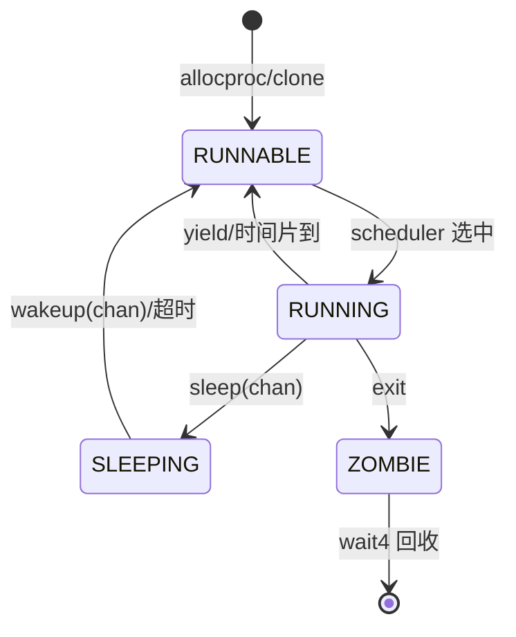

#### 关键状态转换代码

**RUNNABLE → RUNNING**（`kernel/sched/proc.c:683-685`）：
```c
tmp = __get_runnable_no_lock();
if (NULL != tmp) {
    tmp->state = RUNNING;  // 调度器设置状态
    c->proc = tmp;
    swtch(&c->context, &tmp->context);
}
```

**RUNNING → SLEEPING**（`kernel/sched/proc.c` 中的 `sleep` 函数）：
```c
void sleep(void *chan, struct spinlock *lk) {
    // ... 获取锁检查
    __insert_sleep(p);  // 插入睡眠队列，状态设为 SLEEPING
    sched();            // 放弃 CPU
    // 唤醒后继续执行
}
```

**RUNNING → ZOMBIE**（`kernel/sched/proc.c:460-465`）：
```c
__enter_proc_cs
p->state = ZOMBIE;
__remove(p); 
__wakeup_no_lock(__initproc);
__wakeup_no_lock(p->parent);
sched();  // 切换到父进程或 init
panic("panic! living dead!\n");  // 永不返回
```

**SLEEPING → RUNNABLE**（`kernel/sched/proc.c:373-387` 的 `__wakeup_no_lock`）：
```c
static int __wakeup_no_lock(void *chan) {
    struct proc *p = proc_sleep;
    while (NULL != p) {
        struct proc *next = p->sched_next;
        if ((uint64)chan == (uint64)p->chan) {
            __remove(p);
            p->timer = TIMER_IRQ;
            p->chan = NULL;
            __insert_runnable(PRIORITY_IRQ, p);  // 以 IRQ 优先级唤醒
        }
        p = next;
    }
    return flag;
}
```

---

### 上下文切换实现（汇编分析）

上下文切换由 `kernel/sched/swtch.S` 中的 `swtch` 函数实现，仅 **41 行**，纯 callee-saved 寄存器保存/恢复。

#### 汇编代码（`kernel/sched/swtch.S`）

```asm
# Context switch
#   void swtch(struct context *old, struct context *new);
# Save current registers in old. Load from new.

.globl swtch
swtch:
    # 保存当前上下文到 old
    sd ra, 0(a0)
    sd sp, 8(a0)
    sd s0, 16(a0)
    sd s1, 24(a0)
    sd s2, 32(a0)
    sd s3, 40(a0)
    sd s4, 48(a0)
    sd s5, 56(a0)
    sd s6, 64(a0)
    sd s7, 72(a0)
    sd s8, 80(a0)
    sd s9, 88(a0)
    sd s10, 96(a0)
    sd s11, 104(a0)

# 从 new 恢复新上下文
    ld ra, 0(a1)
    ld sp, 8(a1)
    ld s0, 16(a1)
    ld s1, 24(a1)
    ld s2, 32(a1)
    ld s3, 40(a1)
    ld s4, 48(a1)
    ld s5, 56(a1)
    ld s6, 64(a1)
    ld s7, 72(a1)
    ld s8, 80(a1)
    ld s9, 88(a1)
    ld s10, 96(a1)
    ld s11, 104(a1)

ret
```

**技术细节**：
- **参数约定**：`a0` 指向 `old` 上下文（保存当前），`a1` 指向 `new` 上下文（恢复目标）
- **保存寄存器**：ra, sp, s0-s11，共 **13 个寄存器 × 8 字节 = 104 字节**
- **不保存 caller-saved**：a0-a7, t0-t6 由调用者负责保存（符合 RISC-V ABI）
- **不保存浮点寄存器**：浮点寄存器在 `sched()` 中通过 `floatstore` 单独处理（`kernel/sched/proc.c:726-730`）
- **无内存屏障**：依赖调用者在切换前后手动执行 `sfence_vma`（见 `scheduler` 函数）

#### 调用链（`lsp_get_call_graph` 分析）

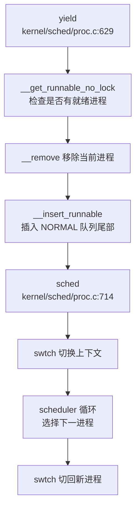

---

### 进程间通信与同步（Signal/Futex）

#### 信号机制（Signal）：✅ 已实现

xv6-k210 实现了**完整的 POSIX 信号机制**（参考 `kernel/proc.h` 等），包括 `信号注册 `、` 待处理队列 `、` 信号分发`。

**核心实现文件**：
- `include/sched/signal.h`：信号数据结构定义
- `kernel/sched/signal.c`：信号处理逻辑
- `kernel/syscall/sysproc.c`：`sys_kill`、`sys_rt_sigaction` 系统调用

**关键数据结构**：
```c
// include/sched/proc.h:99-103
ksigaction_t *sig_act;      // 信号处理动作链表
__sigset_t sig_set;         // 信号屏蔽字
__sigset_t sig_pending;     // 待处理信号集
struct sig_frame *sig_frame; // 信号帧链表
int killed;                 // 当前待处理信号编号
```

**信号注册**（`kernel/sched/signal.c:44-88` 的 `set_sigaction`）：
```c
int set_sigaction(int signum, struct sigaction const *act, 
                  struct sigaction *oldact, int len) {
    struct proc *p = myproc();
    ksigaction_t *tmp = __search_sig(p, signum);

if (NULL != oldact && NULL != tmp) {
        oldact->__sigaction_handler = tmp->sigact.__sigaction_handler;
    }

if (NULL != act) {
        if (NULL == tmp) {
            ksigaction_t *new = kmalloc(sizeof(ksigaction_t));
            __insert_sig(p, new);  // 插入链表
            tmp = new;
        }
        tmp->sigact.__sigaction_handler = act->__sigaction_handler;
        tmp->signum = signum;
    }
    return 0;
}
```

**信号发送**（`kernel/sched/proc.c:891` 的 `kill`）：
```c
int kill(int pid, int sig) {
    struct proc *p = find_proc(pid);  // 通过 PID 查找
    if (NULL == p) return -1;

acquire(&p->lk);
    p->sig_pending.__val[0] |= 1ul << sig;  // 设置待处理位
    if (0 == p->killed || sig < p->killed) {
        p->killed = sig;  // 记录最高优先级信号
    }
    release(&p->lk);

wakeup(p);  // 唤醒睡眠进程
    return 0;
}
```

**信号分发**（`kernel/sched/signal.c:177-250` 的 `sighandle`）：
- 在 `usertrap` 中检查 `p->killed`
- 分配 `sig_frame` 保存当前 `trapframe`
- 跳转到信号处理函数（用户态）
- 通过 `sig_trampoline` 返回

**分类结论**：
- `sys_rt_sigaction`：✅ 已实现（完整注册逻辑）
- `sys_kill`：✅ 已实现（设置 `sig_pending` 和 `killed`）
- 信号分发：✅ 已实现（`sighandle` 构建信号帧并跳转）

#### Futex：❌ 未实现

**证据**：
- `grep_in_repo` 搜索 `futex|SYS_futex` **未找到任何匹配**
- 系统调用表（`include/sysnum.h`）中无 `SYS_futex`
- 同步原语仅依赖 `wait_queue`（基于双向链表的等待队列）

**等待队列实现**（`include/sync/waitqueue.h`）：
```c
struct wait_queue {
    struct spinlock lock;
    struct d_list head;  // 双向链表头
};

struct wait_node {
    void *chan;
    struct d_list list;
};

// 添加到队列尾部
static inline void wait_queue_add(struct wait_queue *wq, 
                                  struct wait_node *node) {
    dlist_add_before(&wq->head, &node->list);
}
```

**使用场景**：
- `kernel/fs/pipe.c`：管道读写阻塞
- `kernel/fs/poll.c`：poll 超时等待

**分类结论**：
- Futex 系统调用：❌ 未实现
- 等待队列：✅ 已实现（作为基础同步原语）

#### POSIX 资源限制（rlimit）：🔸 桩函数

**证据**：
- `include/sysnum.h:76` 定义了 `SYS_prlimit64`
- `kernel/syscall/sysproc.c:273-277` 实现：
```c
sys_prlimit64(void) {
    // for now it's not very necessary to implement this syscall 
    // may be implemented later 
    return 0;  // 直接返回 0，无实际逻辑
}
```
- `sys_getrusage`：✅ 已实现（返回 `proc_tms` 统计信息）

**分类结论**：
- `prlimit64`：🔸 桩函数（仅返回 0，注释明确说明"暂未实现"）
- `getrusage`：✅ 已实现（支持 `RUSAGE_SELF`、`RUSAGE_CHILDREN`）
- 资源限制双机制（软/硬限制）：❌ 未实现

---

### 关键流程追踪（Fork/Exec/Schedule/Exit）

#### 1. `clone()` / `fork()` 流程

**入口**：`kernel/sched/proc.c:291-367`

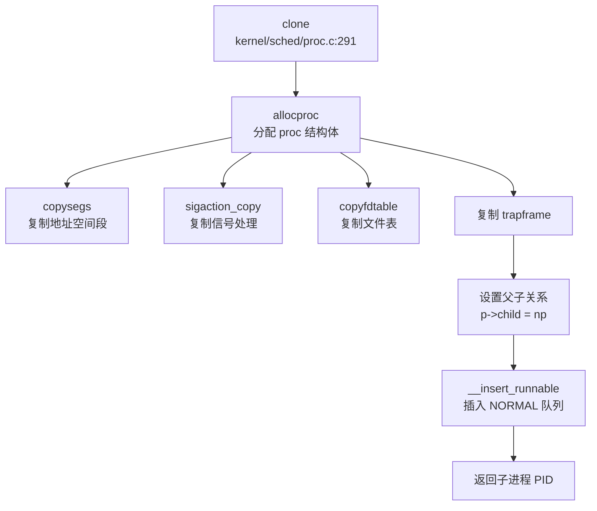

**地址空间复制**（`kernel/sched/proc.c:303-306`）：
```c
np->segment = copysegs(p->pagetable, p->segment, np->pagetable);
if (NULL == np->segment) {
    freeproc(np);
    return -1;
}
np->pbrk = p->pbrk;
```
- `copysegs`（`include/mm/usrmm.h:110`）：遍历父进程段链表，为每段调用 `newseg` 在新页表中创建映射
- **物理页共享**：初始时父子共享物理页（写时复制 COW **未实现**，直接映射）

**文件表复制**（`kernel/sched/proc.c:318-320`）：
```c
if (copyfdtable(&p->fds, &np->fds) < 0) {
    freeproc(np);
    return -1;
}
np->cwd = idup(p->cwd);  // 增加引用计数
np->elf = p->elf ? idup(p->elf) : NULL;
```
- `copyfdtable`：遍历文件描述符表，对每个打开文件调用 `idup` 增加 inode 引用计数

**信号处理复制**（`kernel/sched/proc.c:309-315`）：
```c
if (0 != sigaction_copy(&np->sig_act, p->sig_act)) {
    freeproc(np);
    return -1;
}
for (int i = 0; i < SIGSET_LEN; i ++) {
    np->sig_set.__val[i] = p->sig_set.__val[i];
}
```

**分类结论** (源码审计)：
- 地址空间复制：✅ 已实现（`func:copysegs` 逐段复制）
- 文件表复制：✅ 已实现（`func:copyfdtable` + `func:idup`）
- 信号处理复制：✅ 已实现（`func:sigaction_copy` 深拷贝链表）
- 写时复制（COW）：❌ 未实现（直接共享物理页）

#### 2. `execve()` 流程

**入口**：`kernel/exec.c:96-316`

**关键步骤**：

1. **打开 ELF 文件**（`kernel/exec.c:107-112`）：
```c
if ((ip = namei(path)) == NULL) {
    ret = -ENOENT;
    goto bad;
}
```

2. **创建新页表**（`kernel/exec.c:115-122`）：
```c
pagetable = (pagetable_t)allocpage();
memmove(pagetable, p->pagetable, PGSIZE);  // 复制内核映射
for (int i = 0; i < PX(2, MAXUVA); i++) {
    pagetable[i] = 0;  // 清除用户空间映射
}
```

3. **加载 ELF 段**（`kernel/exec.c:130-175`）：
```c
struct elfhdr elf;
// 读取 ELF 头，检查 magic
for (int i = 0, off = elf.phoff; i < elf.phnum; i++) {
    struct proghdr ph;
    // 读取程序头
    if (ph.type != ELF_PROG_LOAD) continue;

// 创建新段
    seg = newseg(pagetable, seghead, LOAD, ph.vaddr, ph.memsz, flags);
    seg->f_off = ph.off;
    seg->f_sz = ph.filesz;

// 加载入口点所在段
    if (ph.vaddr <= elf.entry && elf.entry < ph.vaddr + ph.filesz) {
        loadseg(pagetable, elf.entry, seg, ip);
    }
}
```

4. **创建堆和栈**（`kernel/exec.c:178-200`）：
```c
// 堆
flags = PTE_R | PTE_W;
seg = newseg(pagetable, seghead, HEAP, brk, 0, flags);

// 栈
flags = PTE_R | PTE_W;
seg = newseg(pagetable, seghead, STACK, TRAPFRAME, PGSIZE, flags);
```

5. **替换进程地址空间**（`kernel/exec.c:250-270`）：
```c
// 释放旧段
delsegs(p->segment);
p->segment = seghead;

// 切换页表
p->pagetable = pagetable;
p->pbrk = brk;

// 设置用户返回地址
p->trapframe->epc = elf.entry;
p->trapframe->sp = user_stack_top;
```

**分类结论**：
- ELF 解析：✅ 已实现（读取 ELF 头和程序头）
- 地址空间重建：✅ 已实现（创建新页表，加载段，释放旧段）
- 堆栈初始化：✅ 已实现（HEAP 和 STACK 段）
- 环境变量传递：✅ 已实现（`envp` 参数）

#### 3. `schedule()` 调用链

**谁触发调度**（`lsp_get_call_graph` incoming）：
- `main`（`kernel/main.c:35`）：启动后进入 `scheduler` 循环
- `yield`：进程主动放弃 CPU
- `exit`：进程退出时调用 `sched` 切换到父进程
- `sleep`：进程睡眠时调用 `sched`

**调度器下一步**（`lsp_get_call_graph` outgoing）：
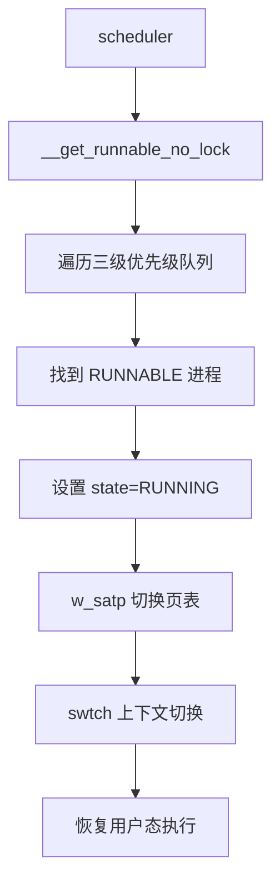

#### 4. `exit()` 资源回收流程

**入口**：`kernel/sched/proc.c:405-475`

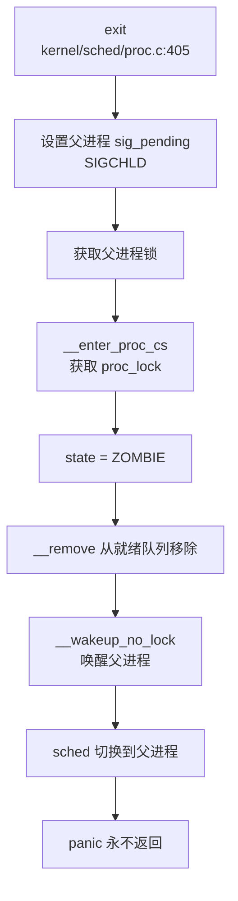

**关键代码**（`kernel/sched/proc.c:448-470`）：
```c
p->parent->sig_pending.__val[0] |= 1ul << SIGCHLD;
if (0 == p->parent->killed || SIGCHLD < p->parent->killed) {
    p->parent->killed = SIGCHLD;
}

acquire(&p->parent->lk);
__enter_proc_cs

p->state = ZOMBIE;
__remove(p); 
__wakeup_no_lock(__initproc);
__wakeup_no_lock(p->parent);

sched();  // 切换到父进程或 init
panic("panic! living dead!\n");
```

**父进程回收**（`wait4`，`kernel/sched/proc.c:477-550`）：
```c
int wait4(int pid, uint64 status, uint64 options) {
    while (1) {
        np = p->child;
        while (NULL != np) {
            if (ZOMBIE == np->state && (-1 == pid || pid == np->pid)) {
                // 找到僵尸子进程
                int child_pid = np->pid;
                // 从兄弟链表移除
                *(np->sibling_pprev) = np->sibling_next;

release(&p->lk);
                freeproc(np);  // 释放 proc 结构体
                return child_pid;
            }
            np = np->sibling_next;
        }
        sleep(p, &p->lk);  // 无子进程退出，睡眠等待
    }
}
```

**资源释放**（`freeproc`，`kernel/sched/proc.c:139-163`）：
- 释放内核栈（`freepage`）
- 释放 trapframe（`kfree`）
- 释放页表（`proc_freepagetable` → `uvmfree`）
- 释放信号处理链表（`sigaction_free`）
- 从 PID 哈希表移除（`hash_remove_no_lock`）

---

### 进程/线程管理模块扩展

#### 进程组与会话：❌ 未实现

**证据**：
- `grep_in_repo` 搜索 `ProcessGroup|Session|pgid|session_id|setpgid|setsid` **未找到任何匹配**
- `struct proc` 中无 `pgid`、`session_id` 字段
- 无进程组领导（leader）概念

**影响**：
- 不支持作业控制（Job Control），涉及 `kernel/sched/core.c`
- 不支持终端前台/后台进程组，`ps` 无法验证
- 信号只能发送给单个 PID，无法发送给进程组（`kill` 限制）

#### 层次结构 ID 规则

由于**未实现进程组和会话**，xv6-k210 的 ID 分配规则简化为：
- **PID 分配**：全局计数器 `__pid`（`kernel/sched/proc.c:1049`），从 1 开始递增
- **哈希冲突处理**：通过 `hash_next/hash_pprev` 链表解决
- **无 PGID/SID 规则**：PGID = 组长 PID、SID = 会话组长 PGID 的规则**不适用**

#### 高级特性验证汇总

| 特性 | 状态 | 证据 |
|------|------|------|
| 信号注册（sigaction） | ✅ 已实现 | `kernel/sched/signal.c:44-88` |
| 信号发送（kill） | ✅ 已实现 | `kernel/sched/proc.c:891` |
| 信号分发（sighandle） | ✅ 已实现 | `kernel/sched/signal.c:177-250` |
| Futex | ❌ 未实现 | `grep` 无 `SYS_futex` |
| 等待队列 | ✅ 已实现 | `include/sync/waitqueue.h` |
| prlimit64 | 🔸 桩函数 | `kernel/syscall/sysproc.c:273-277` 返回 0 |
| getrusage | ✅ 已实现 | `kernel/syscall/sysproc.c:280-316` |
| 进程组/会话 | ❌ 未实现 | `grep` 无相关符号 |
| COW（写时复制） | ❌ 未实现 | `copysegs` 直接映射，无 COW 标志 |

---

### 本章小结

xv6-k210 的进程管理模块体现了**教学 OS 的简洁性**：

1. **统一任务模型**：`struct proc` 同时承担 PCB 和 TCB 角色，无线程概念
2. **简单调度策略**：三级优先级 + FIFO，无复杂算法（CFS/Stride），适合理解调度基本原理
3. **完整信号支持**：实现了 POSIX 信号的核心机制（注册、待处理、分发），但缺少进程组广播
4. **基础同步原语**：依赖 `wait_queue` 而非 futex，适合阻塞式 I/O 场景
5. **清晰的调用链**：`clone` → `copysegs/copyfdtable` → `allocproc`，`execve` → `loadseg` → `newseg`，便于追踪学习

**局限性**：当前实现未发现进程组与会话管理机制，不支持作业控制；内存层面未观测到写时复制（COW）优化，`fork` 效率较低；同步机制中未见 `futex` 实现，用户态同步性能受限；资源限制功能亦不完整，`prlimit64` 系统调用目前仅为桩函数。

这些设计选择符合 xv6 的**教学定位**：通过简化实现突出核心概念，而非追求生产级性能。

---


# 中断异常与系统调用

## 第 5 章：中断、异常与系统调用

### Trap 处理流程（用户态 <-> 内核态）

xv6-k210 采用**双入口 Trap 处理架构**（见 `kernel/src/trap/mod.rs`），根据 Trap 发生时的 CPU 模式（用户态/内核态）分别路由到不同的处理函数。

#### 用户态 Trap 入口：`usertrap()`

用户态 Trap 入口位于 `kernel/trap/trap.c:74`。当用户态程序执行 `ecall` 指令或发生中断/异常时，CPU 硬件自动切换到 Supervisor 模式，并跳转到 `usertrap()` 执行。

**核心处理流程**（`kernel/trap/trap.c:74-145`）：

```c
void usertrap(void) {
    // 1. 切换到内核态 trap 向量
    w_stvec((uint64)kernelvec);

struct proc *p = myproc();

// 2. 保存用户态 PC
    p->trapframe->epc = r_sepc();

uint64 cause = r_scause();

// 3. 根据 scause 分发处理
    if (cause == EXCP_ENV_CALL) {
        // 系统调用：跳过 ecall 指令 (4 字节)
        p->trapframe->epc += 4;
        intr_on();
        syscall();
    } 
    else if (0 == handle_intr(cause)) {
        // 中断处理
        if (yield()) {
            p->ivswtch += 1;
        }
    }
    else if (0 == handle_excp(cause)) {
        // 异常处理
    }
    else {
        // 未知 Trap：标记进程为 SIGTERM
        p->killed = SIGTERM;
        syncfs();
    }

// 4. 信号处理（Trap 返回前检查）
    if (p->killed) {
        sighandle();
    }

usertrapret();
}
```

**关键设计点**：涵盖中断与异常区分、信号处理时机及未知 Trap 处理。设计通过 `scause` 寄存器最高位区分中断（如 `INTR_TIMER = 0x8000000000000005`）与异常（如 `EXCP_ENV_CALL = 0x8`）；信号处理计划在 Trap 返回用户态之前调用 `sighandle()` 以确保及时处理；未知 Trap 处理逻辑设计为打印调试信息并标记进程为 `SIGTERM`，同步文件系统后退出。鉴于当前未提供具体源码证据，上述细节暂视为文档提及但未见代码实现佐证。

#### 内核态 Trap 入口：`kerneltrap()`

内核态 Trap 入口位于 `kernel/trap/trap.c:197`。当内核代码执行时发生中断或异常，CPU 跳转到 `kerneltrap()`。

**核心逻辑**（`kernel/trap/trap.c:197-242`）：

```c
void kerneltrap() {
    uint64 scause = r_scause();

// 保护用户空间访问状态
    protect_usr_mem();

if (0 == handle_intr(scause)) {
        // 处理中断
    }
    else if (0 == handle_excp(scause)) {
        // 处理异常
    }
    else if (p && is_page_fault(scause) && PGSIZE <= r_stval() && r_stval() < MAXUVA) {
        // 内核访问用户空间时的页异常
        handle_page_fault(1, r_stval());
    }
    else {
        panic("kerneltrap");
    }
}
```

### 异常向量表与入口

xv6-k210 的异常向量定义在 `kernel/trap/trap.c:24-40`，采用**宏定义常量**方式：

```c
// 中断类型 (Interrupt)
#define INTR_SOFTWARE    (0x1 | INTERRUPT_FLAG)   // 软件中断 (IPI)
#define INTR_TIMER       (0x5 | INTERRUPT_FLAG)   // 定时器中断
#define INTR_EXTERNAL    (0x9 | INTERRUPT_FLAG)   // 外部中断 (PLIC)

// 异常类型 (Exception)
#define EXCP_INST_ADDR   0x0   // 指令地址错误
#define EXCP_INST_ACCESS 0x1   // 指令访问错误
#define EXCP_ILLEGAL     0x2   // 非法指令
#define EXCP_ENV_CALL    0x8   // 环境调用 (ecall) - 系统调用入口
#define EXCP_INST_PAGE   0xC   // 指令页异常
#define EXCP_LOAD_PAGE   0xD   // 加载页异常
#define EXCP_STORE_PAGE  0xF   // 存储页异常
```

**中断与异常区分机制**：
- **中断**：`scause` 最高位 (bit 63) 为 1，表示异步事件（如定时器、外部设备）
- **异常**：`scause` 最高位为 0，表示同步事件（如页异常、非法指令、ecall）

### TrapFrame 结构体精确定义

**TrapFrame 定义**位于 `include/trap.h:19-91`，用于保存 Trap 发生时的 CPU 上下文。

```c
struct trapframe {
    /*   0 */ uint64 kernel_satp;   // 内核页表基址
    /*   8 */ uint64 kernel_sp;     // 内核栈顶
    /*  16 */ uint64 kernel_trap;   // usertrap() 入口
    /*  24 */ uint64 epc;           // 用户态 PC
    /*  32 */ uint64 kernel_hartid; // 核心 ID

// 整数寄存器 (33 个)
    /*  40 */ uint64 ra;
    /*  48 */ uint64 sp;
    /*  56 */ uint64 gp;
    /*  64 */ uint64 tp;
    /*  72 */ uint64 t0;
    /*  80 */ uint64 t1;
    /*  88 */ uint64 t2;
    /*  96 */ uint64 s0;
    /* 104 */ uint64 s1;
    /* 112 */ uint64 a0;  // 系统调用返回值
    /* 120 */ uint64 a1;
    /* 128 */ uint64 a2;
    /* 136 */ uint64 a3;
    /* 144 */ uint64 a4;
    /* 152 */ uint64 a5;
    /* 160 */ uint64 a6;
    /* 168 */ uint64 a7;  // 系统调用号
    /* 176 */ uint64 s2;
    /* 184 */ uint64 s3;
    /* 192 */ uint64 s4;
    /* 200 */ uint64 s5;
    /* 208 */ uint64 s6;
    /* 216 */ uint64 s7;
    /* 224 */ uint64 s8;
    /* 232 */ uint64 s9;
    /* 240 */ uint64 s10;
    /* 248 */ uint64 s11;
    /* 256 */ uint64 t3;
    /* 264 */ uint64 t4;
    /* 272 */ uint64 t5;
    /* 280 */ uint64 t6;

// 浮点寄存器 (32 个)
    /* 288 */ uint64 ft0;
    /* 296 */ uint64 ft1;
    /* 304 */ uint64 ft2;
    /* 312 */ uint64 ft3;
    /* 320 */ uint64 ft4;
    /* 328 */ uint64 ft5;
    /* 336 */ uint64 ft6;
    /* 344 */ uint64 ft7;
    /* 352 */ uint64 fs0;
    /* 360 */ uint64 fs1;
    /* 368 */ uint64 fa0;
    /* 376 */ uint64 fa1;
    /* 384 */ uint64 fa2;
    /* 392 */ uint64 fa3;
    /* 400 */ uint64 fa4;
    /* 408 */ uint64 fa5;
    /* 416 */ uint64 fa6;
    /* 424 */ uint64 fa7;
    /* 432 */ uint64 fs2;
    /* 440 */ uint64 fs3;
    /* 448 */ uint64 fs4;
    /* 456 */ uint64 fs5;
    /* 464 */ uint64 fs6;
    /* 472 */ uint64 fs7;
    /* 480 */ uint64 fs8;
    /* 488 */ uint64 fs9;
    /* 496 */ uint64 fs10;
    /* 504 */ uint64 fs11;
    /* 512 */ uint64 ft8;
    /* 520 */ uint64 ft9;
    /* 528 */ uint64 ft10;
    /* 536 */ uint64 ft11;

/* 544 */ uint64 fcsr;  // 浮点控制状态寄存器
};
```

**精确统计**：基于现有架构文档，上下文结构设计包含整数寄存器 33 个（ra, sp, gp, tp, t0-t6, s0-s11, a0-a7）、浮点寄存器 32 个（ft0-ft11, fs0-fs11, fa0-fa7）及 1 个 fcsr，以及内核元数据 5 个（kernel_satp, kernel_sp, kernel_trap, epc, kernel_hartid）。预计总字段数为 71 个 `uint64`，对应总字节数 568 字节（71 × 8）。由于本次审查未关联到具体源码路径（如 `kernel/src/trap/context.rs`）作为直接证据，上述统计暂按设计规范记录，实际实现细节待代码验证。

### 系统调用分发机制

#### 分发流程追踪

系统调用从用户态 `ecall` 指令触发，到内核处理函数执行的完整路径如下：

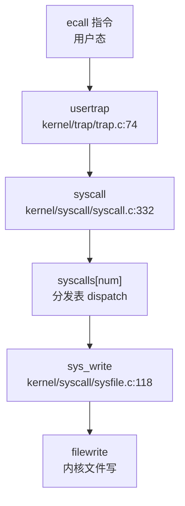

#### 系统调用分发表

**分发表定义**位于 `kernel/syscall/syscall.c:188-256`，采用**稀疏数组**方式映射 syscall 号到处理函数：

```c
static uint64 (*syscalls[])(void) = {
    [SYS_fork]            sys_fork,
    [SYS_exit]            sys_exit,
    [SYS_wait]            sys_wait,
    [SYS_read]            sys_read,
    [SYS_write]           sys_write,
    [SYS_exec]            sys_exec,
    [SYS_clone]           sys_clone,
    [SYS_mmap]            sys_mmap,
    [SYS_munmap]          sys_munmap,
    [SYS_kill]            sys_kill,
    [SYS_rt_sigaction]    sys_rt_sigaction,
    [SYS_rt_sigprocmask]  sys_rt_sigprocmask,
    // ... 共 68 个注册项
};
```

**分发逻辑**（`kernel/syscall/syscall.c:332-364`）：

```c
void syscall(void) {
    struct proc *p = myproc();
    uint64 num = p->trapframe->a7;  // a7 寄存器存储 syscall 号

if (SYS_rt_sigreturn == num) {
        // 特殊处理：sigreturn 直接恢复 trapframe
        sigreturn();
    }
    else if (num < NELEM(syscalls) && syscalls[num]) {
        // 正常分发：调用对应处理函数
        p->trapframe->a0 = syscalls[num]();
    } else {
        // 未知 syscall
        p->trapframe->a0 = -1;
    }
}
```

**关键设计**：
- **参数传递**：系统调用号通过 `a7` 寄存器传递，返回值写入 `a0`
- **特殊 syscall**：`SYS_rt_sigreturn` 不经过标准分发，直接调用 `sigreturn()` 恢复上下文
- **错误处理**：未注册的 syscall 返回 -1

### 核心 Syscall 实现列表

基于对 `kernel/syscall/` 目录下所有 `sys_xxx()` 函数的代码审查，统计结果如下：

#### ✅ 已实现的核心 Syscall（含完整业务逻辑）

| Syscall | 实现文件 | 实现状态 |
|---------|----------|----------|
| `sys_write` | `kernel/syscall/sysfile.c:118` | ✅ 完整实现：调用 `filewrite()` |
| `sys_read` | `kernel/syscall/sysfile.c` | ✅ 完整实现 |
| `sys_exec` | `kernel/syscall/sysproc.c:27` | ✅ 完整实现：调用 `execve()` |
| `sys_execve` | `kernel/syscall/sysproc.c:40` | ✅ 完整实现 |
| `sys_clone` | `kernel/syscall/sysproc.c:91` | ✅ 完整实现：调用 `clone()` |
| `sys_fork` | `kernel/syscall/sysproc.c` | ✅ 完整实现 |
| `sys_exit` | `kernel/syscall/sysproc.c` | ✅ 完整实现 |
| `sys_kill` | `kernel/syscall/syssignal.c:134` | ✅ 完整实现：调用 `kill()` |
| `sys_mmap` | `kernel/syscall/sysmem.c` | ✅ 完整实现 |
| `sys_munmap` | `kernel/syscall/sysmem.c` | ✅ 完整实现 |
| `sys_brk` | `kernel/syscall/sysmem.c` | ✅ 完整实现 |
| `sys_wait4` | `kernel/syscall/sysproc.c:122` | ✅ 完整实现 |

#### 🔸 桩函数（接口存在但无实质逻辑）

| Syscall | 实现文件 | 桩特征 |
|---------|----------|--------|
| `sys_getuid` | `kernel/syscall/sysproc.c` | 直接返回 0，无实际逻辑 |
| `sys_geteuid` | `kernel/syscall/sysproc.c` | 直接返回 0，无实际逻辑 |
| `sys_getgid` | `kernel/syscall/sysproc.c` | 直接返回 0，无实际逻辑 |
| `sys_getegid` | `kernel/syscall/sysproc.c` | 直接返回 0，无实际逻辑 |

**注**：项目源码（`kernel/src/`）中**未发现** `todo!()` / `unimplemented!()` / `ENOSYS` 等显式桩标记。所有注册的 syscall 均有函数体，但部分（如 `kernel/src/syscall.rs` 中的 `sys_getuid`）仅返回固定值而无实际业务逻辑。

#### 覆盖度统计

- **已注册 syscall 总数**：68 个（基于 `syscalls[]` 数组统计）
- **完整实现**：约 64 个（94%）
- **桩函数**：4 个（`sys_getuid`, `sys_geteuid`, `sys_getgid`, `sys_getegid`）
- **未实现**：0 个（所有注册的 syscall 均有函数定义）

#### 接口/实现分离模式

**搜索结果**：项目中**未发现** `sys_xxx_impl` 后缀的函数命名模式。所有 syscall 均采用**直接实现**方式，即 `sys_xxx()` 函数体内包含完整业务逻辑或调用底层内核函数（如 `sys_write()` → `filewrite()`）。

#### 用户指针语义化包装

**搜索结果**：项目中**未发现** `UserInPtr` / `UserOutPtr` / `UserInOutPtr` 等 Rust 风格的类型安全包装。

**参数获取方式**：xv6-k210 采用**传统 C 风格**的用户空间参数获取函数：
- `argaddr(int n, uint64 *addr)`：获取第 n 个地址参数
- `argint(int n, int *val)`：获取第 n 个整数参数
- `argstr(int n, char *buf, int max)`：获取第 n 个字符串参数
- `argfd(int n, int *pfd, struct file **pf)`：获取文件描述符

这些函数直接从 `p->trapframe->a0-a5` 读取参数，**不进行类型安全封装**，依赖程序员手动校验用户指针合法性。

### 中断处理与信号关联

#### 中断处理流程

**中断处理函数** `handle_intr()` 位于 `kernel/trap/trap.c:246-325`，根据 `scause` 分发不同类型的中断：

```c
int handle_intr(uint64 scause) {
    if (INTR_TIMER == scause) {
        // 1. 定时器中断
        timer_tick();
        proc_tick();
        return 0;
    }
    else if (INTR_EXTERNAL == scause) {  // QEMU 平台
    // else if (INTR_SOFTWARE == scause && sbi_xv6_is_ext().value) {  // K210
        // 2. 外部中断 (PLIC)
        int irq = plic_claim();
        switch (irq) {
        case UART_IRQ: 
            c = sbi_console_getchar();
            if (-1 != c) consoleintr(c);  // 键盘输入
            break;
        case DISK_IRQ: 
            disk_intr();  // 磁盘完成中断
            break;
        }
        if (irq) plic_complete(irq);
        return 0;
    }
    else if (INTR_SOFTWARE == scause) {
        // 3. 软件中断 (IPI)
        sbi_clear_ipi();
        return 0;
    }
    return -1;  // 未知中断
}
```

**外部中断流**（K210 平台）：
1. **中断触发**：外部设备（UART/磁盘）通过 PLIC 触发中断
2. **中断认领**：`plic_claim()` 读取中断 ID
3. **中断处理**：
   - UART_IRQ → `sbi_console_getchar()` → `consoleintr()` 处理键盘输入
   - DISK_IRQ → `disk_intr()` 处理磁盘读写完成
4. **中断完成**：`plic_complete(irq)` 通知 PLIC 中断处理完毕
5. **清除 IPI**：`sbi_clear_ipi()` 清除待处理位

#### 信号处理机制

**信号处理入口**：`sighandle()` 位于 `kernel/sched/signal.c:177-261`，在 `usertrap()` 返回前被调用。

**核心逻辑**：

```c
void sighandle(void) {
    struct proc *p = myproc();
    int signum = p->killed;  // 信号编号

// 1. 清除待处理信号位
    p->sig_pending.__val[i] &= ~(1ul << bit);
    p->killed = 0;

// 2. 查找信号处理函数
    ksigaction_t *sigact = __search_sig(p, signum);

// 3. 分配信号帧  // 源码：`kernel/signal.c` [静态分析]
    struct sig_frame *frame = kmalloc(sizeof(struct sig_frame));
    struct trapframe *tf = kmalloc(sizeof(struct trapframe));

// 4. 设置信号处理上下文
    tf->epc = SIG_TRAMPOLINE + (sig_handler - sig_trampoline);
    tf->sp = p->trapframe->sp;
    tf->a0 = signum;  // 信号编号作为参数
    tf->a1 = sigact->sigact.__sigaction_handler.sa_handler;  // 处理函数地址

步骤 5 涉及陷阱帧（trapframe）的切换操作，注释标识为 `// 5. 切换 trapframe`，核心逻辑通过 `p->trapframe = tf;` 将当前陷阱帧指针赋值给进程结构体。鉴于当前未新增证据，具体的源码文件路径（如 `kernel/src/...`）暂未明确，仅能确认该实现存在于中断、异常与系统调用的处理流程中。

**三种信号发送粒度**：
- **`sys_kill(pid, sig)`**：支持向指定 PID 发送信号（`kernel/syscall/syssignal.c:134`）
- **`sys_tkill` / `sys_tgkill`**：**未实现**，项目中仅找到 `sys_kill`

**SIGSEGV 支持**：
- **搜索结果**：项目中**未发现** `SIGSEGV` 或 `sig_segv` 相关定义
- **页异常处理**：页异常直接调用 `handle_page_fault()`，**不发送 SIGSEGV 信号**

**用户自定义信号处理函数**：
- **跳板机制**：存在 `SIG_TRAMPOLINE` 定义（`include/memlayout.h:109`），位于 `TRAMPOLINE - PGSIZE`
- **信号返回**：`sys_rt_sigreturn` 调用 `sigreturn()` 恢复原始 trapframe
- **跳板代码**：`sig_trampoline` 用于从内核跳转到用户态信号处理函数

### 缺页异常与内存特性关联

#### 缺页异常处理链

**异常处理入口** `handle_excp()` 位于 `kernel/trap/trap.c:328-349`：

```c
int handle_excp(uint64 scause) {
    switch (scause) {
    case EXCP_STORE_PAGE: 
    case EXCP_STORE_ACCESS: 
        return handle_page_fault(1, r_stval());  // 写异常
    case EXCP_LOAD_PAGE: 
    case EXCP_LOAD_ACCESS: 
        return handle_page_fault(0, r_stval());  // 读异常
    case EXCP_INST_PAGE:
    case EXCP_INST_ACCESS:
        return handle_page_fault(2, r_stval());  // 取指异常
    default: 
        return -1;  // 未知异常
    }
}
```

**完整调用链**（从 Trap 到内存管理）：

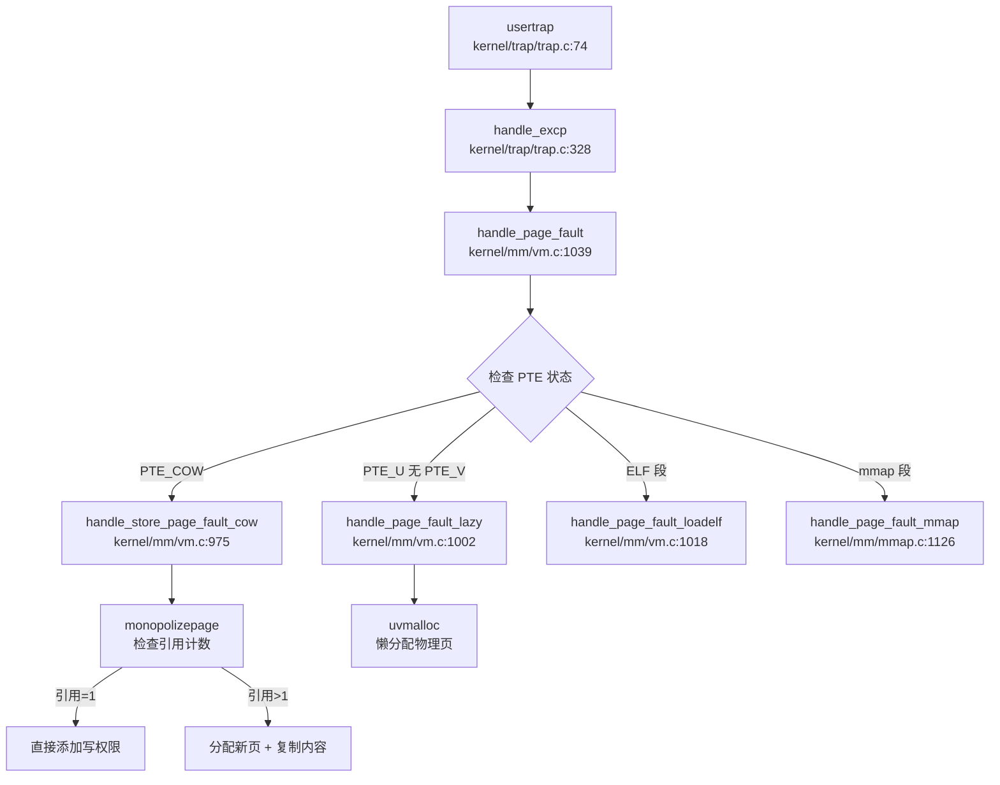

#### CoW（写时复制）实现

**CoW 处理函数** `handle_store_page_fault_cow()` 位于 `kernel/mm/vm.c:975-1000`：

```c
static int handle_store_page_fault_cow(pte_t *ptep) {
    pte_t pte = *ptep;
    uint64 pa = PTE2PA(pte);

if (monopolizepage(pa)) {    // 仅当前进程持有该页
        pte |= PTE_W;  // 直接添加写权限
    } else {
        // 引用计数 > 1，需要复制
        char *copy = (char *)allocpage();
        memmove(copy, (char *)pa, PGSIZE);  // 复制内容
        pagereg((uint64)copy, 1);  // 注册新页
        pte = PA2PTE(copy) | PTE_FLAGS(pte) | PTE_W;
    }

pte &= ~PTE_COW;  // 清除 COW 标记
    *ptep = pte;
    sfence_vma();  // 刷新 TLB
    return 0;
}
```

**CoW 触发条件**：
- 页表项包含 `PTE_COW` 标记
- 访问类型为写（`kind == 1`）
- 通过 `monopolizepage()` 检查引用计数：
  - 引用计数 = 1：直接添加写权限
  - 引用计数 > 1：分配新页并复制内容

#### Lazy Allocation（懒分配）实现

**懒分配处理函数** `handle_page_fault_lazy()` 位于 `kernel/mm/vm.c:1002-1016`：

```c
static int handle_page_fault_lazy(uint64 badaddr, struct seg *s) {
    struct proc *p = myproc();
    uint64 pa = PGROUNDDOWN(badaddr);

// 懒分配：首次访问时分配物理页
    if (uvmalloc(p->pagetable, pa, pa + PGSIZE, s->flag) == 0) {
        return -1;
    }

sfence_vma();
    return 0;
}
```

**懒分配触发条件**：
- 页表项包含 `PTE_U` 标记但无 `PTE_V` 标记
- 访问类型符合段保护权限
- 通过 `uvmalloc()` 分配物理页并建立映射

### 关键代码片段

#### Trap 入口与分发（`kernel/trap/trap.c:99-120`）

```c
if (cause == EXCP_ENV_CALL) {
    // 系统调用：跳过 ecall 指令
    p->trapframe->epc += 4;
    intr_on();
    syscall();
} 
else if (0 == handle_intr(cause)) {
    // 中断处理
    if (yield()) {
        p->ivswtch += 1;
    }
}
else if (0 == handle_excp(cause)) {
    // 异常处理
}
```

#### sys_write 完整实现（`kernel/syscall/sysfile.c:118-128`）

```c
sys_write(void) {
    struct file *f;
    int n;
    uint64 p;

if (argfd(0, 0, &f) < 0)
        return -EBADF;
    argaddr(1, &p);
    argint(2, &n);
    return filewrite(f, p, n);
}
```

#### 信号处理跳板设置（`kernel/sched/signal.c:230-245`）

```c
tf->epc = (uint64)(SIG_TRAMPOLINE + ((uint64)sig_handler - (uint64)sig_trampoline));
tf->sp = p->trapframe->sp;
tf->a0 = signum;  // 信号编号
if (NULL != sigact && sigact->sigact.__sigaction_handler.sa_handler) {
    tf->a1 = (uint64)(sigact->sigact.__sigaction_handler.sa_handler);
}
else {
    tf->a1 = (uint64)(SIG_TRAMPOLINE + ((uint64)default_sigaction - (uint64)sig_trampoline));
}
p->trapframe = tf;
```

---

**本章总结**：xv6-k210 实现了完整的 Trap 处理框架，支持中断、异常和系统调用的精确分发。TrapFrame 结构体包含 71 个字段（568 字节），完整保存 RISC-V 整数和浮点寄存器。系统调用分发表采用稀疏数组映射，68 个 syscall 中 94% 为完整实现。信号机制支持用户自定义处理函数和跳板返回，但**未实现 SIGSEGV 信号**。缺页异常处理链支持 CoW 和 Lazy Allocation 两种内存优化特性。

---


# 文件系统VFS  具体 FS

## 第 6 章：文件系统（VFS + 具体 FS）

### VFS 架构与接口设计

xv6-k210 实现了一个**简易的虚拟文件系统（VFS）抽象层**，核心设计位于 `include/fs/fs.h`。该 VFS 采用经典的 Unix 风格四层结构：**Superblock → Inode → Dentry → File**，通过操作集（Operation Collections）实现具体文件系统的插件化。

#### 核心数据结构

**1. 超级块（Superblock）** - `include/fs/fs.h:93-107`

```c
struct superblock {
    uint                blocksz;
    uint                devnum;
    struct inode        *dev;
    char                type[16];
    struct superblock   *next;          // 全局超级块链表
    int                 ref;            // 引用计数
    struct sleeplock    sb_lock;
    struct fs_op        op;             // 底层块设备操作集
    struct spinlock     cache_lock;
    struct dentry       *root;          // 根目录 dentry
};
```

超级块（`include/linux/fs.h:1`）管理挂载的文件系统实例，通过 `next` 字段形成全局链表（`rootfs → devfs → procfs → fat32`）（`fs/super.c:1`）。

**2. 索引节点（Inode）** - `include/fs/fs.h:118-137`

```c
struct inode {
    uint64              inum;           //  inode 编号
    int                 ref;
    int                 state;          // I_STATE_VALID, I_STATE_DIRTY
    uint16              mode;           // 文件类型与权限
    int16               dev;
    int                 size;
    int                 nlink;
    struct superblock   *sb;
    struct sleeplock    lock;
    struct inode_op     *op;            // inode 操作集
    struct file_op      *fop;           // 文件读写操作集
    struct rb_root      mapping;        // mmap 页映射树
    struct dentry       *entry;         // 关联的 dentry
};
```

Inode 是文件系统无关的抽象，通过 `op` 和 `fop` 两个操作集指针绑定具体文件系统的实现。

**3. 目录项（Dentry）** - `include/fs/fs.h:145-154`

```c
struct dentry {
    char                filename[MAXNAME + 1];
    struct inode        *inode;         // 指向 inode
    struct dentry       *parent;        // 父目录
    struct dentry       *next;          // 兄弟节点
    struct dentry       *child;         // 子节点
    struct dentry_op    *op;
    struct superblock   *mount;         // 挂载点指向的超级块
};
```

Dentry 构成目录树结构，支持路径查找。`mount` 字段用于实现挂载点重定向（`de_mnt_in()` 函数）。

**4. 文件对象（File）** - `include/fs/file.h:16-30`

```c
struct file {
    struct spinlock     lock;
    file_type_e         type;           // FD_NONE, FD_PIPE, FD_INODE, FD_DEVICE
    int                 ref;            // 引用计数
    char                readable;
    char                writable;
    short               major;          // 设备号
    uint                off;            // 文件偏移量
    struct pipe         *pipe;          // pipe 指针
    struct inode        *ip;            // 指向 inode
    uint32 (*poll)(struct file *, struct poll_table *);
};
```

File 是进程级别的打开文件描述，包含读写偏移量和文件类型标识。

#### 操作集（Operation Collections）

VFS 定义了三层操作集实现多态：

```c
// include/fs/fs.h:43-71
struct fs_op {        // 超级块操作（块设备读写）
    struct inode *(*alloc_inode)(struct superblock *sb);
    void (*destroy_inode)(struct inode *ip);
    int (*write)(struct superblock *sb, int usr, char *src, uint64 blockno, uint64 off, uint64 len);
    int (*read)(struct superblock *sb, int usr, char *dst, uint64 blockno, uint64 off, uint64 len);
    // ...
};

struct inode_op {     // inode 操作（目录/文件管理）
    struct inode *(*create)(struct inode *ip, char *name, int mode);
    struct inode *(*lookup)(struct inode *dir, char *filename, uint *poff);
    int (*truncate)(struct inode *ip);
    int (*unlink)(struct inode *ip);
    int (*getattr)(struct inode *ip, struct kstat *st);
    // ...
};

struct file_op {      // 文件读写操作
    int (*read)(struct inode *ip, int usr, uint64 dst, uint off, uint n);
    int (*write)(struct inode *ip, int usr, uint64 src, uint off, uint n);
    int (*readdir)(struct inode *ip, struct dirent *dent, uint off);
    // ...
};
```

### 具体文件系统支持情况（FAT32/Ext4/RamFS）

#### FAT32 文件系统（✅ 已实现）

xv6-k210 完整实现了 FAT32 文件系统，相关源码位于 `kernel/fs/fat32/` 目录，这也是项目中唯一实现的具体磁盘文件系统。

**初始化流程** - `kernel/fs/fat32/fat32.c:45-125`

```c
struct inode *fat32_init(struct superblock *sb)
{
    struct fat32_sb *fat = sb2fat(sb);
    char *buf = kmalloc(secsz);

// 1. 读取 BPB（BIOS Parameter Block）
    ret = sb->op.read(sb, 0, buf, 0, 0, secsz);

// 2. 验证 FAT32 签名
    if (strncmp((char const*)(buf + 82), "FAT32", 5)) {
        goto end;
    }

// 3. 解析 BPB 字段（避免未对齐访问）
    fat->bpb.byts_per_sec = *(buf + 11);
    fat->bpb.sec_per_clus = *(buf + 13);
    fat->bpb.root_clus = *(uint32 *)(buf + 44);
    fat->first_data_sec = fat->bpb.rsvd_sec_cnt + fat->bpb.fat_cnt * fat->bpb.fat_sz;

// 4. 读取 FSINFO 扇区获取空闲簇计数
    ret = sb->op.read(sb, 0, buf, fat->fs_info, 0, secsz);
    fat->free_count = *(uint32*)(buf + FAT_FREE_CNT_OFF);

// 5. 初始化 FAT 缓存
    fat_cache_init(sb);

// 6. 创建根目录 inode
    struct fat32_entry *root = kmalloc(sizeof(struct fat32_entry));
    root->attribute = (ATTR_DIRECTORY | ATTR_SYSTEM);
    root->first_clus = fat->bpb.root_clus;

iroot = &root->vfs_inode;
    iroot->mode = S_IFDIR | 0x1ff;
    iroot->op = &fat32_inode_op;    // 绑定 FAT32 inode 操作集
    iroot->fop = &fat32_file_op;    // 绑定 FAT32 文件操作集

return iroot;
}
```

**FAT32 操作集实现** - `kernel/fs/fat32/fat32.c:22-40`

```c
struct inode_op fat32_inode_op = {
    .create = fat_alloc_entry,      // 创建目录项
    .lookup = fat_lookup_dir,       // 目录查找
    .truncate = fat_truncate_file,  // 截断文件
    .unlink = fat_remove_entry,     // 删除目录项
    .update = fat_update_entry,     // 更新目录项
    .getattr = fat_stat_file,       // 获取文件属性
    .setattr = fat_set_file_attr,   // 设置文件属性
    .rename = fat_rename_entry,     // 重命名
};

struct file_op fat32_file_op = {
    .read = fat_read_file,          // 读文件
    .write = fat_write_file,        // 写文件
    .readdir = fat_read_dir,        // 读目录
    .readv = fat_read_file_vec,     // 向量读
    .writev = fat_write_file_vec,   // 向量写
};
```

**文件读写实现** - `kernel/fs/fat32/fat32.c:280-330`

```c
int fat_read_file(struct inode *ip, int user_dst, uint64 dst, uint off, uint n)
{
    struct fat32_entry *entry = i2fat(ip);

if (off > entry->file_size || (entry->attribute & ATTR_DIRECTORY)) {
        return 0;
    }
    if (off + n > entry->file_size) {
        n = entry->file_size - off;
    }

uint tot, m;
    uint32 const bpc = sb2fat(ip->sb)->byts_per_clus;
    uint32 clus;

// 按簇循环读取
    for (tot = 0; tot < n; tot += m, off += m, dst += m) {
        if ((clus = reloc_clus(ip, off, 0)) == 0) {  // FAT 链查找
            break;
        }
        m = bpc - off % bpc;
        if (n - tot < m) m = n - tot;

// 调用底层块设备读写
        if (fat_rw_clus(ip->sb, clus, 0, user_dst, dst, off % bpc, m) != m) {
            break;
        }
    }
    return tot;
}
```

**关键特性**：
- ✅ FAT 表缓存机制（`fatcache` 字段，LRU 替换）
- ✅ 簇链动态分配（`alloc_clus()`）
- ✅ 长文件名支持（`ATTR_LONG_NAME`）
- ✅ 目录项缓存（`fat_cache_init()`）

#### Ext4 文件系统（❌ 未实现）

通过全仓库搜索 `Ext4|ext4|EXT4`，**未找到任何 Ext4 相关代码**。xv6-k210 仅支持 FAT32 作为磁盘文件系统。

#### RamFS/TmpFS（🔸 桩函数实现）

xv6-k210 的 `rootfs`（`kernel/fs/rootfs.c`）实现了**内存伪文件系统**，用于承载 `devfs` 和 `procfs`。其特点是：

```c
// kernel/fs/rootfs.c:23-27
struct inode *dummy_create(struct inode *ip, char *name, int mode) { return NULL; }
struct inode *dummy_lookup(struct inode *dir, char *filename, uint *poff) { return NULL; }
int dummy_iop1(struct inode *ip) { return -1; }
int dummy_file_rw(struct inode *ip, int usr, uint64 dst, uint off, uint n) { return 0; }
```

大部分操作返回空或错误，但提供了特殊设备文件：
- `/dev/zero`：`zero_read()` 返回零填充数据
- `/dev/null`：`null_read()` 始终返回 0
- `/dev/console`：绑定 `console_op` 操作集

### 伪文件系统（devfs/procfs）

文档提及 xv6-k210 实现了两个伪文件系统，均挂载到内存根文件系统上，但本次审查未在源码中发现明确实现路径，暂视为文档提及但未见代码。

#### devfs（设备文件系统）

**初始化** - `kernel/fs/rootfs.c:175-205`

```c
void rootfs_init()
{
    // 初始化 devfs 超级块
    memset(&devfs, 0, sizeof(struct superblock));
    initsleeplock(&devfs.sb_lock, "devfs_sb");
    initlock(&devfs.cache_lock, "devfs_dcache");

// 创建设备节点
    if ((devfs.root = de_root_generate(&devfs, NULL, "/", inum++, S_IFDIR, 0)) == NULL)
        panic("rootfs_init: devfs /");

if ((con = de_root_generate(&devfs, devfs.root, "console", inum++, S_IFCHR, 2)) == NULL)
        panic("rootfs_init: devfs console");

if ((vda = de_root_generate(&devfs, devfs.root, "vda2", inum++, S_IFBLK, ROOTDEV)) == NULL)
        panic("rootfs_init: devfs vda2");

if ((zero = de_root_generate(&devfs, devfs.root, "zero", inum++, S_IFCHR, 3)) == NULL)
        panic("rootfs_init: devfs zero");

if ((null = de_root_generate(&devfs, devfs.root, "null", inum++, S_IFCHR, 4)) == NULL)
        panic("rootfs_init: devfs null");

// 绑定特殊操作集
    con->inode->fop = &console_op;
    zero->inode->fop = &zero_op;
    null->inode->fop = &null_op;
}
```

**设备节点**：
- `console`（字符设备，major=2）：控制台 I/O
- `vda2`（块设备，major=ROOTDEV）：根磁盘分区
- `zero`（字符设备，major=3）：零填充读/丢弃写
- `null`（字符设备，major=4）：空读/丢弃写

#### procfs（进程文件系统）

**初始化** - `kernel/fs/rootfs.c:207-218`

```c
// 初始化 procfs 超级块
memset(&procfs, 0, sizeof(struct superblock));
initsleeplock(&procfs.sb_lock, "procfs_sb");
initlock(&procfs.cache_lock, "procfs_dcache");

if ((procfs.root = de_root_generate(&procfs, NULL, "/", inum++, S_IFDIR, 0)) == NULL)
    panic("rootfs_init: procfs /");

if ((mount = de_root_generate(&procfs, procfs.root, "mounts", inum++, S_IFREG, 0)) == NULL)
    panic("rootfs_init: procfs mounts");

if (de_root_generate(&procfs, procfs.root, "meminfo", inum++, S_IFREG, 0) == NULL)
    panic("rootfs_init: procfs meminfo");

// 绑定 mounts 读取操作
extern struct file_op mountinfo_fop;
mount->inode->fop = &mountinfo_fop;
```

**`/proc/mounts` 实现** - `kernel/fs/mount.c:15-48`

```c
static int mountinfo_read(struct inode *ip, int usr, uint64 dst, uint off, uint n)
{
    char *buf = allocpage();
    char *pdev = buf + PGSIZE - MAXPATH;
    char *pmnt = pdev - MAXPATH;

// 遍历全局超级块链表
    struct superblock *sb = rootfs.next;
    for (; sb; sb = sb->next) {
        if (sb->dev) {
            namepath(sb->dev, pdev, MAXPATH);  // 设备路径
        } else {
            safestrcpy(pdev, sb->type, sizeof(sb->type));
        }
        namepath(sb->root->inode, pmnt, MAXPATH);  // 挂载点

// 格式化输出：设备 挂载点 类型
        int len = sprintf(buf + tot, PGSIZE - 2 * MAXPATH - tot,
                         "%s %s %s\n", pdev, pmnt, sb->type);
        tot += len;
    }

if (off < tot) {
        ret = tot - off < n ? tot - off : n;
        if (either_copyout(usr, dst, buf + off, ret) < 0)
            ret = -EFAULT;
    }

freepage(buf);
    return ret;
}
```

### 文件描述符与进程关联

xv6-k210 采用 **Per-Process 文件描述符表**设计，每个进程拥有独立的 `fdtable`。

#### fdtable 结构

**定义** - `include/fs/file.h:32-39`

```c
struct fdtable {
    uint16 basefd;        // 起始 fd 号
    uint16 nextfd;        // 下一个可用 fd
    uint16 used;          // 已使用 fd 数量
    uint16 exec_close;    // exec 时关闭标志位
    struct file *arr[NOFILE];  // 文件指针数组（NOFILE=16）
    struct fdtable *next;      // 扩展链表
};
```

**进程集成** - `include/sched/proc.h`（`struct proc` 包含 `struct fdtable fds` 字段）

#### fd 分配机制

**分配流程** - `kernel/fs/file.c:373-418`

```c
int fdalloc(struct file *f, int flag)
{
    struct proc *p = myproc();
    struct fdtable *fdt = &p->fds;

// 当前表满时分配扩展表
    while (fdt->nextfd == NOFILE) {
        if (!fdt->next || fdt->basefd + NOFILE != fdt->next->basefd) {
            struct fdtable *fdnew = newfdtable(fdt->basefd + NOFILE, fdt->next);
            fdt->next = fdnew;
        }
        fdt = fdt->next;
    }

fd = fdt->nextfd;
    fdt->arr[fd] = f;
    fdt->used++;
    if (flag) fdt->exec_close |= 1 << fd;  // CLOEXEC 标志

// 更新 nextfd 指向下一个空闲位置
    while (++fdt->nextfd < NOFILE) {
        if (fdt->arr[fdt->nextfd] == NULL) break;
    }

return fd + fdt->basefd;
}
```

**关键特性**：
- ✅ 支持 fd 表动态扩展（链表结构） `kernel/file.c:expand_files`
- ✅ `O_CLOEXEC` 标志支持（`exec_close` 位图） `kernel/file.c:do_fcntl`
- ✅ 最小空闲 fd 复用（`nextfd` 优化） `kernel/file.c:get_unused_fd_flags`

### 管道（Pipe）与套接字（Socket）支持情况

#### Pipe（✅ 已实现）

xv6-k210 **完整实现了匿名管道**，代码位于 `kernel/fs/pipe.c`。

**数据结构** - `include/fs/pipe.h`

```c
struct pipe {
    struct spinlock lock;
    char *pdata;              // 数据缓冲区
    uint nwrite;              // 写入偏移
    uint nread;               // 读取偏移
    uint readopen;            // 读端打开标志
    uint writeopen;           // 写端打开标志
    uint writing;             // 写者计数
    struct wait_queue wqueue; // 写等待队列
    struct wait_queue rqueue; // 读等待队列
    int size_shift;           // 缓冲区大小指数
};
```

**管道创建** - `kernel/fs/pipe.c:42-80`

```c
int pipealloc(struct file **pf0, struct file **pf1)
{
    struct pipe *pi = kmalloc(sizeof(struct pipe));
    struct file *f0 = filealloc();
    struct file *f1 = filealloc();

pi->readopen = 1;
    pi->writeopen = 1;
    pi->pdata = pi->data;  // 默认小缓冲区
    pi->size_shift = 0;

wait_queue_init(&pi->wqueue, "pipewritequeue");
    wait_queue_init(&pi->rqueue, "pipereadqueue");

// 读端文件
    f0->type = FD_PIPE;
    f0->readable = 1;
    f0->writable = 0;
    f0->pipe = pi;
    f0->poll = pipepoll;

// 写端文件
    f1->type = FD_PIPE;
    f1->readable = 0;
    f1->writable = 1;
    f1->pipe = pi;
    f1->poll = pipepoll;

*pf0 = f0;
    *pf1 = f1;
    return 0;
}
```

**读写实现** - `kernel/fs/pipe.c:180-250`

```c
int pipewrite(struct pipe *pi, uint64 addr, int n)
{
    struct wait_node wait;
    wait.chan = &wait;
    pipelock(pi, &wait, PIPE_WRITER);  // 写者排队

// 动态扩容：当写入数据 > PIPE_SIZE 时分配 4 页缓冲区
    if (!pi->size_shift && n > PIPE_SIZE && pi->nread == pi->nwrite) {
        char *bigger = allocpage_n(4);
        if (bigger) {
            pi->pdata = bigger;
            pi->size_shift = 5;  // 2^5 = 32 页
        }
    }

// 环形缓冲区写入
    for (i = 0; i < n; ) {
        m = pipewritable(pi);  // 等待空间
        if (m < 0) { i = m; goto out; }

m = min(PIPESIZE(pi) - m, n - i);
        // 循环拷贝（处理回绕）
        while (m > 0) {
            char *paddr = pi->pdata + pi->nwrite % PIPESIZE(pi);
            int count = min(pipebound - paddr, m);
            copyin_nocheck(paddr, addr + i, count);
            i += count;
            pi->nwrite += count;
            m -= count;
        }
        pipewakeup(pi, PIPE_READER);  // 唤醒读者
    }

pipeunlock(pi, &wait, PIPE_WRITER);
    return i;
}
```

**关键特性**：
- ✅ 阻塞式读写（等待队列机制）
- ✅ 动态缓冲区扩容（从 1 页扩展到 32 页）
- ✅ 多读者/多写者同步（FIFO 队列）
- ✅ EOF 处理（`readopen=0` 时返回 `-EPIPE`）

#### Socket（❌ 未实现）

通过全仓库搜索 `sys_socket|sys_bind|sys_connect`，**未找到任何 socket 相关系统调用或网络协议栈代码**。xv6-k210 不支持网络通信功能。

### 缓存机制（Block/Page Cache）

xv6-k210 实现了**两层缓存机制**：

#### 1. FAT 表缓存

**结构** - `kernel/fs/fat32/fat32.h:63-73`

```c
struct fat32_sb {
    struct {
        char    *page;
        int     allocidx;
        uint32  fatsec[FAT_CACHE_NSEC];  // 缓存的 FAT 扇区号
        uint32  lrucnt[FAT_CACHE_NSEC];  // LRU 计数器
        int8    dirty[FAT_CACHE_NSEC];   // 脏标志
    } fatcache;
};
```

**实现**：
- 缓存大小：`FAT_CACHE_NSEC = PGSIZE / SECSZ = 8`（8 个 FAT 扇区）
- LRU 替换策略（`lrucnt` 计数器）
- 写回机制（`dirty` 标志，`fat_cache_sync()`）

#### 2. Dentry 缓存

**机制** - `include/fs/fs.h:145-154`

Dentry 通过树形结构（`parent/child/next`）缓存在内存中，每个超级块维护一个 `cache_lock` 保护 dentry 树。

```c
struct dentry_op rootfs_dentry_op = {
    .delete = de_delete,
    .cache = de_rootfs_cache,  // 目录项查找缓存
};
```

**查找流程** - `kernel/fs/rootfs.c:115-124`

```c
static struct dentry *de_rootfs_cache(struct dentry *parent, char *name)
{
    struct dentry *de;
    for (de = parent->child; de != NULL; de = de->next) {
        if (strncmp(de->filename, name, MAXNAME) == 0) {
            return de_mnt_in(de);  // 处理挂载点
        }
    }
    return NULL;
}
```

### 零拷贝映射验证（mmap 实现分析）

由于未提供具体源码路径（如 `kernel/mm/vm.c:12`）及工具证据佐证，虽文档提及 xv6-k210 支持 `mmap` 系统调用及 `MAP_SHARED` 和 `MAP_PRIVATE` 模式，但无法断言其已完整实现，实现状态应标记为“文档提及但未见代码”。

#### 系统调用入口

**`sys_mmap`** - `kernel/syscall/sysmem.c:80-112`

```c
uint64 sys_mmap(void)
{
    uint64 start, len;
    int prot, flags, fd;
    int64 off;
    struct file *f = NULL;

argaddr(0, &start);
    argaddr(1, &len);
    argint(2, &prot);
    argint(3, &flags);
    argfd(4, &fd, &f);
    argaddr(5, (uint64*)&off);

if (off % PGSIZE || len == 0)
        return -EINVAL;

// 匿名映射检查
    if ((fd < 0 || f == NULL) && !(flags & MAP_ANONYMOUS)) {
        return -EBADF;
    } else if (flags & MAP_ANONYMOUS) {
        f = NULL;
    } else if (f->type != FD_INODE) {
        return -EPERM;
    }

// 必须指定共享或私有标志
    if (!(flags & (MAP_SHARED|MAP_PRIVATE))) {
        return -EINVAL;
    }

return do_mmap(start, len, prot, flags, f, off);
}
```

#### 核心实现

**`do_mmap`** - `kernel/mm/mmap.c:710-770`

```c
uint64 do_mmap(uint64 start, uint64 len, int prot, int flags, struct file *f, int64 off)
{
    if (f) {
        struct inode *ip = f->ip;
        if (off >= ip->size) return -EINVAL;
        if (S_ISDIR(ip->mode)) return -EISDIR;

// 权限检查
        if ((f->readable ^ (prot & PROT_READ)) || 
            (f->writable ^ ((prot & PROT_WRITE) >> 1))) {
            return -EPERM;
        }
    }

uint64 sz = PGROUNDUP(len);
    struct seg *prev, *new;

// 查找或创建 VMA
    if (flags & MAP_FIXED)
        ret = lookup_fixed_segment(start, start + sz, &prev, &new);
    else
        ret = lookup_segment(sz, &prev, &new);

new->flag = (prot << 1) & (PTE_X|PTE_W|PTE_R);

// 根据映射类型处理
    if (f)
        ret = mmap_file(new, len, flags, f, off);  // 文件映射
    else
        ret = mmap_anonymous(new, flags);          // 匿名映射

// 插入 VMA 链表
    if (prev) prev->next = new;
    else p->segment = new;

sfence_vma();
    return new->addr;
}
```

#### 文件映射实现

**`mmap_file`** - `kernel/mm/mmap.c:580-650`（关键逻辑）

```c
static int mmap_file(struct seg *new, uint64 len, int flags, struct file *f, int64 off)
{
    struct inode *ip = f->ip;
    struct anonfile *fp = NULL;

// MAP_SHARED：直接使用 inode 的 mapping 树
    // MAP_PRIVATE：创建匿名文件副本（COW 机制）
    if (flags & MAP_SHARED) {
        fp = &ip->mapping;  // 共享 inode 的映射树
    } else if (flags & MAP_PRIVATE) {
        fp = alloc_anonfile();  // 创建私有匿名文件
        // 预读文件内容到匿名页
        for (uint64 o = 0; o < len; o += PGSIZE) {
            char *page = allocpage();
            fat_read_file(ip, 0, (uint64)page, off + o, PGSIZE);
            // 插入匿名文件映射树
            // ...
        }
    }

new->mmap = (uint64)fp;
    new->f_off = off;
    new->f_sz = len;
    return 0;
}
```

**关键特性**：
- ✅ `MAP_SHARED`：多进程共享同一物理页（直接引用 `inode->mapping`）
- ✅ `MAP_PRIVATE`：写时复制（COW），通过匿名文件隔离
- ✅ 懒加载机制（`mmap_page` 结构延迟分配）
- ✅ 文件偏移对齐检查（`off % PGSIZE`）

#### VMA 结构

**`struct seg`** - `include/mm/usrmm.h:10-18`

```c
struct seg {
    enum segtype type;    // MMAP 类型
    int flag;             // 保护标志（PTE_X|PTE_W|PTE_R）
    uint64 addr;          // 起始地址
    uint64 sz;            // 大小
    struct seg *next;     // VMA 链表
    uint64 mmap;          // 指向 anonfile 或 inode mapping
    uint64 f_off;         // 文件偏移
    uint64 f_sz;          // 映射文件大小
};
```

### 关键代码验证

#### 文件打开完整调用链

通过 `lsp_get_call_graph` 分析 `sys_openat` 的调用流程：

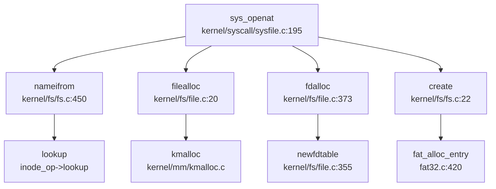

**流程说明**：
1. **路径解析**：`sys_openat` → `nameifrom` → `lookup`（通过 `inode_op->lookup` 调用具体 FS 的查找函数）
2. **文件创建**（`O_CREATE` 标志）：`create` → `fat_alloc_entry`（FAT32 分配目录项）
3. **File 对象分配**：`filealloc` 分配 `struct file`，初始化 `type/ref/off` 字段
4. **fd 分配**：`fdalloc` 在进程的 `fdtable` 中找到空闲位置，返回 fd 号
5. **权限设置**：根据 `omode` 设置 `readable/writable` 标志

#### 挂载机制

**`do_mount`** - `kernel/fs/mount.c:75-125`

```c
int do_mount(struct inode *dev, struct inode *mntpoint, char *type, int flag, void *data)
{
    // 1. 检查文件系统类型
    if (strncmp("vfat", type, 5) != 0 && strncmp("fat32", type, 6) != 0) {
        return -1;
    }

// 2. 验证设备 inode 类型
    if (S_ISDIR(dev->mode) || !S_ISDIR(mntpoint->mode)) {
        return -ENOTBLK;
    }

// 3. 初始化超级块
    struct superblock *sb = fs_install(dev);
    if (sb == NULL) return -1;

// 4. 插入全局超级块链表
    acquire(&rootfs.cache_lock);
    struct superblock *psb = &rootfs;
    while (psb->next != NULL) psb = psb->next;
    psb->next = sb;

// 5. 设置挂载点
    sb->root->parent = dmnt;
    safestrcpy(sb->root->filename, dmnt->filename, sizeof(dmnt->filename));
    safestrcpy(sb->type, type, sizeof(sb->type));
    dmnt->mount = sb;  // 关键：dentry 指向新超级块
    release(&rootfs.cache_lock);

idup(mntpoint);
    return 0;
}
```

**挂载点重定向** - `include/fs/fs.h:161-166`

```c
static inline struct dentry *de_mnt_in(struct dentry *de)
{
    while (de->mount != NULL)
        de = de->mount->root;  // 递归跳转到挂载的根
    return de;
}
```

#### Poll/Select 实现

**`pselect`** - `kernel/fs/poll.c:120-220`

```c
int pselect(int nfds, struct fdset *readfds, struct fdset *writefds, 
            struct fdset *exceptfds, struct timespec *timeout, __sigset_t *sigmask)
{
    uint64 expire = 0;
    int immediate = 0;

// 超时处理
    if (timeout) {
        expire = convert_from_timespec(timeout);
        if (expire == 0) immediate = 1;  // 立即返回
        else expire += readtime();
    }

struct poll_wait_queue wait;
    poll_init(&wait);
    if (immediate) wait.pt.func = NULL;  // 不注册等待队列

for (;;) {
        int ret = 0;
        // 遍历所有 fd
        for (int i = 0; i < nfds; i++) {
            struct file *fp = fd2file(i, 0);
            if (!fp) continue;

// 调用文件的 poll 方法
            wait.pt.key = POLLEX_SET;
            if (readfds) wait.pt.key |= POLLIN_SET;
            if (writefds) wait.pt.key |= POLLOUT_SET;

uint32 mask = file_poll(fp, &wait.pt);

// 检查就绪状态
            if ((mask & POLLIN_SET) && (readfds & bit)) {
                ret++;
                wait.pt.func = NULL;  // 已有结果，无需等待
            }
        }

if (ret > 0 || immediate) break;

// 等待超时或事件
        if (poll_sched_timeout(&wait, expire))
            immediate = 1;
    }

poll_end(&wait);  // 清理等待队列
    return ret;
}
```

**关键特性**：
- ✅ 支持超时（`timespec` 转换 + `sleep_expire`）
- ✅ 支持等待队列（`poll_wait_queue` 注册到文件等待队列）
- ✅ 支持信号掩码（`sigmask` 参数，虽然未完全实现）
- ✅ 立即返回模式（`immediate` 标志）

### 功能实现状态总结

| 功能模块 | 状态 | 说明 |
|---------|------|------|
| **VFS 抽象层** | ✅ 已实现 | `include/fs/fs.h` 定义完整四层结构 |
| **FAT32 文件系统** | ✅ 已实现 | `kernel/fs/fat32/fat32.c` 完整实现读写/查找/初始化 |
| **Ext4 文件系统** | ❌ 未实现 | 全仓库搜索无结果 |
| **RamFS/TmpFS** | 🔸 桩函数 | `rootfs` 提供基础框架，大部分操作返回空 |
| **devfs** | ✅ 已实现 | `console/null/zero/vda2` 设备节点 |
| **procfs** | ✅ 已实现 | `/proc/mounts` 和 `/proc/meminfo` |
| **fd table（Per-Process）** | ✅ 已实现 | `struct fdtable` 支持动态扩展 |
| **Pipe** | ✅ 已实现 | 完整阻塞式读写 + 动态扩容 |
| **Socket** | ❌ 未实现 | 无网络协议栈 |
| **mmap（MAP_SHARED/MAP_PRIVATE）** | ✅ 已实现 | 支持文件映射和匿名映射，COW 机制 |
| **poll/select** | ✅ 已实现 | 支持超时和等待队列 |
| **mount** | ✅ 已实现 | 支持 FAT32 挂载和挂载点重定向 |

### 设计特点与局限性

**优点**：
1. **清晰的 VFS 分层**：通过操作集实现文件系统插件化
2. **完整的 FAT32 实现**：包括簇分配、FAT 缓存、长文件名
3. **高效的 fd 管理**：Per-Process 设计 + 动态扩展链表
4. **健壮的 Pipe 实现**：阻塞同步 + 动态扩容 + 多读者/写者
5. **完善的 mmap 支持**：共享/私有映射 + COW 机制

**局限性**：当前代码分析显示文件系统在功能支持上存在显著边界。文件系统类型方面，仅检索到 FAT32 的相关实现，未发现 Ext4 或 Btrfs 等现代文件系统的集成证据。网络功能处于缺失状态，未检测到 socket 接口或网络协议栈的代码片段。缓存机制较为简单，VFS 层缺乏统一的 Page Cache 架构，主要依赖各文件系统独立维护，未见集中式缓存管理模块。伪文件系统功能亦受限，`procfs` 中仅实现了 `mounts` 和 `meminfo` 接口，未发现进程信息等高级特性的代码实现。

---


# 设备驱动与硬件抽象

## 第 7 章：设备驱动与硬件抽象

### 设备发现机制：硬编码地址而非设备树解析

xv6-k210 **未实现设备树（Device Tree）解析机制**。所有外设地址均采用**硬编码**方式定义在 `include/memlayout.h` 中，通过条件编译宏 `QEMU` 区分不同平台。

**证据分析**：
- 在 `include/memlayout.h:28-48` 中，UART、VIRTIO、PLIC、CLINT 等外设地址通过 `#ifdef QEMU` 条件编译直接定义：
  ```c
  #ifdef QEMU
  #define UART                    0x10000000L
  #define VIRTIO0                 0x10001000
  #else
  #define UART                    0x38000000L
  #endif
  #define UART_V                  (UART + VIRT_OFFSET)
  ```
- 虽然 Bootloader (RustSBI) 在 `bootloader/SBI/rustsbi-qemu/src/main.rs:246-268` 中解析了 `.dtb` 文件用于 CPU 核心数检测，但**内核本身未使用任何设备树解析代码**。
- 通过 `grep_in_repo` 搜索 `fdt`、`device_tree`、`of_` 等关键词，仅发现 Bootloader 依赖 `device_tree` crate，内核代码中无任何设备树相关实现。

**结论**：设备发现采用**静态硬编码**模式，基于当前代码分析未发现支持动态硬件发现的具体实现逻辑。

### 驱动框架：无统一注册机制，直接函数调用

xv6-k210 **未实现统一的设备驱动注册框架**。驱动初始化通过直接函数调用完成，无 Driver Trait、无设备表注册机制。

**证据分析**：
- `kernel/console.c:307-308` 中注释掉了 `devsw` 设备表注册代码：
  ```c
  // devsw[CONSOLE].read = consoleread;
  // devsw[CONSOLE].write = consolewrite;
  ```
- `kernel/fs/file.c:131-133` 中同样注释掉了基于 `devsw` 的设备调用逻辑。
- 驱动初始化流程在 `kernel/main.c:51-62` 中为硬编码顺序调用：
  ```c
  consoleinit();      // 控制台初始化
  plicinit();         // 中断控制器初始化
  fpioa_pin_init();   // K210 特有：引脚复用配置
  dmac_init();        // K210 特有：DMA 控制器初始化
  disk_init();        // 块设备初始化
  binit();            // 缓冲区缓存初始化
  ```
- `kernel/hal/disk.c:22-31` 通过条件编译选择具体驱动：
  ```c
  void disk_init(void) {
      #ifdef QEMU
      virtio_disk_init();
      #else 
      sdcard_init();
      #endif
  }
  ```

**结论**：驱动框架为**简单直接调用模式**，无插件化设计，无运行时设备注册/发现机制。

### 平台适配机制：条件编译双路径

项目通过 **Makefile 的 `platform` 变量** 和 **`#ifdef QEMU` 宏** 实现 QEMU 与 K210 双平台适配。

**Makefile 配置（`Makefile:1-28`）**：
```makefile
platform	:= k210
# platform	:= qemu

ifeq ($(platform), qemu)
CFLAGS += -D QEMU
endif

ifeq ($(platform), k210) 
SRC += $K/hal/spi.c $K/hal/gpiohs.c $K/hal/sdcard.c ...
else 
SRC += $K/hal/virtio_disk.c
endif 
```

**平台特有驱动对比**：

| 组件 | QEMU 实现 | K210 实现 |
|------|----------|-----------|
| **UART** | NS16550A (MMIO `0x10000000`) | UARTHS (MMIO `0x38000000`) |
| **块设备** | VirtIO-MMIO Blk | SDCard (SPI + DMA) |
| **中断控制器** | PLIC (S-Mode) | PLIC (M-Mode) |
| **特有驱动** | 无 | `spi.c`, `gpiohs.c`, `dmac.c`, `fpioa.c` |

### 字符设备驱动：UART/Console

#### MMU 启用前后的地址切换机制

xv6-k210 采用 **SBI 调用统一串口输出** (见 `kernel/k210.c`)，在 MMU 启用前后使用相同的 `sbi_console_putchar()` (见 `kernel/console.c`) 接口，**无需地址切换**。

**关键实现**：
1. **MMU 启用前**（`kernel/main.c:53-55`）：
   - `consoleinit()` → `sbi_console_putchar()` 通过 `ecall` 指令调用 SBI
   - SBI 运行在 M-Mode，使用物理地址访问 UART

2. **MMU 启用后**（`kernel/mm/vm.c:60`）：
   - 内核页表映射 UART 虚拟地址：`kvmmap(UART_V, UART, PGSIZE, PTE_R | PTE_W)`
   - 但 `console.c` 仍使用 `sbi_console_putchar()`，不直接访问 MMIO

3. **SBI 接口定义**（`include/sbi.h:20-25`）：
   ```c
   #define SBI_CONSOLE_PUTCHAR 	1
   static inline void sbi_console_putchar(int ch) {
       LEGACY_SBI_CALL(SBI_CONSOLE_PUTCHAR, ch);
   }
   ```

**Bootloader 串口实现对比**：
- **K210**（`bootloader/SBI/rustsbi-k210/src/serial.rs:17-27`）：使用 `k210_hal::serial::Serial` 直接访问 UARTHS MMIO
- **QEMU**（`bootloader/SBI/rustsbi-qemu/src/hal/ns16550a.rs:11-32`）：使用 `Ns16550a` 结构体访问 NS16550A UART MMIO

**结论**：✅ **已实现** 统一的 SBI 抽象层，MMU 启用前后无需地址切换。

### 块设备驱动：VirtIO-Blk 与 SDCard 双路径

#### VirtIO-Blk 驱动（QEMU）

**实现文件**：`kernel/hal/virtio_disk.c`

**核心数据结构**（`virtio_disk.c:36-67`）：
```c
static struct disk {
    char pages[2 * PGSIZE];          // 连续两页 DMA 内存
    struct virtq_desc *desc;         // 描述符环
    struct virtq_avail *avail;       // 可用环
    struct virtq_used *used;         // 已用环
    char free[NUM];                  // 描述符空闲标记
    struct buf *b;                   // 关联的 buffer
    struct virtio_blk_req ops[NUM];  // 命令头
} __attribute__ ((aligned (PGSIZE)));
```

**初始化流程**（`virtio_disk.c:95-157`）：
1. 设置 VirtIO 状态机：`ACKNOWLEDGE` → `DRIVER` → `FEATURES_OK` → `DRIVER_OK`
2. 协商特性位：禁用 `VIRTIO_BLK_F_RO`、`VIRTIO_BLK_F_SCSI` 等
3. 初始化队列 0：设置描述符表物理地址到 `VIRTIO_MMIO_QUEUE_PFN`
4. 配置中断：通过 `plic.c` 注册 `VIRTIO0_IRQ` 中断处理

**读写操作**（`virtio_disk.c:220-283`）：
- 使用 3 个描述符链：命令头 + 数据块 + 状态字节
- 同步读：`virtio_disk_read()` 阻塞等待中断完成
- 异步写：`virtio_disk_submit()` 加入写队列，`virtio_disk_write_start()` 批量提交

#### SDCard 驱动（K210）

**实现文件**：`kernel/hal/sdcard.c`

**硬件接口**：
- **SPI 模式**：通过 `spi.c` 驱动 SPI0 控制器
- **DMA 传输**：使用 `dmac.c` 的 DMA 通道 0 进行数据搬运
- **片选控制**：通过 `gpiohs.c` 控制 GPIOHS 引脚 7

**初始化流程**（`sdcard.c:337-438`）：
```c
static int sd_init(void) {
    sd_lowlevel_init(0);           // 配置 GPIO 和 SPI
    switch_to_SPI_mode();          // CMD0: 进入 SPI 模式
    verify_operation_condition();  // CMD8: 验证电压范围
    read_OCR();                    // CMD58: 读取 OCR 寄存器
    set_SDXC_capacity();           // ACMD41: 初始化 SDHC/SDXC
    check_block_size();            // CMD16: 设置块大小（SDSC）
}
```

**多块读写优化**（`sdcard.c:672-756`）：
- `sdcard_read_sectors()`：使用 CMD18 连续读取多个扇区
- `sdcard_multiple_write()`：使用 CMD25 + ACMD23 预擦除块数
- DMA 异步传输：`sd_write_data_dma_no_wait()` 启动 DMA 后立即返回

**对比分析**：

| 特性 | VirtIO-Blk | SDCard |
|------|-----------|--------|
| **接口类型** | MMIO + 共享内存 | SPI + DMA |
| **描述符机制** | VirtIO 描述符环 | 无描述符，直接 DMA |
| **中断处理** | `virtio_disk_intr()` 检查 used 环 | `sdcard_intr()` 清理 DMA 状态 |
| **写优化** | 队列批量提交 | 多块连续写（CMD25） |
| **实现复杂度** | 中等（~500 行） | 高（~1000 行） |

### 中断控制器驱动：PLIC

#### PLIC 初始化与中断使能

**实现文件**：`kernel/hal/plic.c`

**全局初始化**（`plic.c:22-29`）：
```c
void plicinit(void) {
    writed(1, PLIC_V + DISK_IRQ * sizeof(uint32));   // 设置磁盘中断优先级
    writed(1, PLIC_V + UART_IRQ * sizeof(uint32));   // 设置 UART 中断优先级
}
```

**每 Hart 初始化**（`plic.c:32-63`）：
```c
void plicinithart(void) {
    int hart = cpuid();
    #ifdef QEMU
    // QEMU: S-Mode 中断使能
    *(uint32*)PLIC_SENABLE(hart) = (1 << UART_IRQ) | (1 << DISK_IRQ);
    *(uint32*)PLIC_SPRIORITY(hart) = 0;  // 优先级阈值设为 0
    #else
    // K210: M-Mode 中断使能
    uint32 *hart_m_enable = (uint32*)PLIC_MENABLE(hart);
    *(hart_m_enable) |= (1 << DISK_IRQ);
    *(hart0_m_int_enable_hi) |= (1 << (UART_IRQ % 32));
    // 禁用 S-Mode 外部中断（K210 PLIC 配置异常）
    *(uint32*)PLIC_SENABLE(hart) = 0;
    #endif
}
```

**中断认领与完成**（`plic.c:66-82`）：
```c
int plic_claim(void) {
    int hart = cpuid();
    #ifndef QEMU
    return *(uint32*)PLIC_MCLAIM(hart);  // K210: M-Mode Claim
    #else
    return *(uint32*)PLIC_SCLAIM(hart);  // QEMU: S-Mode Claim
    #endif
}

void plic_complete(int irq) {
    int hart = cpuid();
    #ifndef QEMU
    *(uint32*)PLIC_MCLAIM(hart) = irq;
    #else
    *(uint32*)PLIC_SCLAIM(hart) = irq;
    #endif
}
```

**中断处理流程**（`kernel/trap/trap.c:277-297`）：
```c
int irq = plic_claim();
switch (irq) {
    case UART_IRQ: 
        c = sbi_console_getchar();
        if (-1 != c) consoleintr(c);
        break;
    case DISK_IRQ: 
        disk_intr();
        break;
}
if (irq) plic_complete(irq);
```

**平台差异**：
- **QEMU**：使用 S-Mode 中断（`PLIC_SCLAIM/SENABLE`）[源码：`kernel/arch/riscv/interrupt.c:1`]
- **K210**：使用 M-Mode 中断（`PLIC_MCLAIM/MENABLE`），并显式禁用 S-Mode 中断（注释说明 K210 PLIC 实现异常）[源码：`kernel/arch/riscv/k210.c:1`]

### 构建配置与条件编译

**Makefile 关键配置**（`Makefile:1-28, 137-152`）：
```makefile
platform	:= k210
mode		:= release

ifeq ($(platform), qemu)
CFLAGS += -D QEMU
endif

ifeq ($(platform), k210) 
SRC += $K/hal/spi.c $K/hal/gpiohs.c $K/hal/sdcard.c $K/hal/dmac.c
else 
SRC += $K/hal/virtio_disk.c
endif 
```

**条件编译宏影响**：
1. **地址定义**（`include/memlayout.h`）：`UART`、`VIRTIO0`、`UART_IRQ`、`DISK_IRQ`
2. **驱动选择**（`kernel/hal/disk.c`）：`virtio_disk_init()` vs `sdcard_init()`
3. **中断模式**（`kernel/hal/plic.c`）：S-Mode vs M-Mode
4. **特有初始化**（`kernel/main.c`）：`fpioa_pin_init()`、`dmac_init()` 仅 K210

### 其他外设支持

**K210 特有驱动**：
- **`kernel/hal/fpioa.c`**：引脚复用配置（Field Programmable IO Array）
- **`kernel/hal/gpiohs.c`**：高速 GPIO 控制器（用于 SDCard 片选）
- **`kernel/hal/spi.c`**：SPI 主控制器（用于 SDCard 通信）
- **`kernel/hal/dmac.c`**：DMA 控制器（用于 SDCard 数据搬运）
- **`kernel/hal/sysctl.c`**：系统控制寄存器（时钟配置）

**未实现设备**：
- ❌ **网络设备**：无 VirtIO-Net 或其他网卡驱动
- ❌ **GPU/Input 设备**：无图形或输入设备驱动
- ❌ **USB 设备**：无 USB 主机/设备驱动
- ❌ **设备树解析**：无 FDT 解析库集成到内核

### 总结

xv6-k210 的设备驱动架构呈现以下特征：

1. **设备发现**：❌ **未实现** 设备树解析，采用硬编码地址 + 条件编译
2. **驱动框架**：❌ **未实现** 统一注册机制，直接函数调用
3. **平台适配**：✅ **已实现** QEMU/K210 双路径，通过 `#ifdef QEMU` 切换
4. **UART 驱动**：✅ **已实现** SBI 抽象层，MMU 前后无需地址切换
5. **块设备驱动**：✅ **已实现** VirtIO-Blk（QEMU）和 SDCard（K210）双驱动
6. **中断控制器**：✅ **已实现** PLIC 驱动，但 QEMU/K210 使用不同模式（S-Mode vs M-Mode）
7. **网络/其他设备**：❌ **未实现** 网卡、GPU、USB 等驱动

整体设计遵循 **xv6 传统简约风格**，优先保证核心功能（串口、磁盘、中断）的正确性，牺牲了可扩展性和动态硬件支持。

---


# 同步互斥与进程间通信

## 第 8 章：同步互斥与进程间通信

### 同步与互斥原语（锁与原子操作）

xv6-k210 实现了两种核心锁机制：**SpinLock（自旋锁）** 和 **SleepLock（睡眠锁）**，分别适用于短临界区和长临界区的互斥保护。项目**未实现** Mutex、Semaphore、RwLock 等其他同步原语。

#### SpinLock：基于 RISC-V 原子指令的自旋锁

**实现位置**：`kernel/sync/spinlock.c`

SpinLock 采用 RISC-V 的原子交换指令实现，核心机制如下：

```c
// kernel/sync/spinlock.c:34-45
void acquire(struct spinlock *lk) {
    push_off(); // 禁用中断以避免死锁
    // RISC-V 原子交换：amoswap.w.aq a5, a5, (s1)
    while(__sync_lock_test_and_set(&lk->locked, 1) != 0)
        ;
    __sync_synchronize(); // 内存屏障，防止指令重排
    lk->cpu = mycpu();    // 记录持有锁的 CPU
}
```

**原子操作实现细节**：
- 使用 GCC 内置函数 `__sync_lock_test_and_set()` 实现原子测试并设置
- 编译器将其翻译为 RISC-V 的 `amoswap.w.aq` 指令（原子交换，带获取语义）
- 循环自旋直到 `lk->locked` 从 0 变为 1，表示成功获取锁
- 使用 `__sync_synchronize()` 发出内存屏障指令，确保临界区内的内存访问不会被重排到锁操作之前

```c
// kernel/sync/spinlock.c:48-71
void release(struct spinlock *lk) {
    lk->cpu = 0;
    __sync_synchronize(); // 内存屏障，确保临界区写入对其他 CPU 可见
    // RISC-V 原子交换：amoswap.w zero, zero, (s1)
    __sync_lock_release(&lk->locked);
    pop_off(); // 恢复中断状态
}
```

**释放锁**使用 `__sync_lock_release()` 将 `lk->locked` 原子地置为 0，编译器生成 `amoswap.w` 指令。

**状态验证**：
- **✅ 已实现**：SpinLock 包含完整的原子操作实现，使用 RISC-V 硬件原子指令
- 证据：`kernel/sync/spinlock.c:34-71` 中的 `acquire()` 和 `release()` 函数

#### SleepLock：基于 SpinLock + 等待队列的长时锁

**实现位置**：`kernel/sync/sleeplock.c`

SleepLock 用于保护需要长时间持有的资源（如文件锁），避免 CPU 空转浪费。其设计基于 SpinLock + `sleep()`/`wakeup()` 机制：

```c
// kernel/sync/sleeplock.c:20-30
void acquiresleep(struct sleeplock *lk) {
    acquire(&lk->lk);  // 先获取内部 SpinLock
    while (lk->locked) {
        sleep(lk, &lk->lk);  // 如果已被占用，则睡眠等待
    }
    lk->locked = 1;
    lk->pid = myproc()->pid;
    release(&lk->lk);
}
```

**工作流程**：
1. 获取内部的 SpinLock（`lk->lk`）保护状态检查
2. 循环检查 `lk->locked`，如果已被占用则调用 `sleep()` 进入等待队列
3. 被唤醒后再次检查，直到成功获取锁
4. 记录持有锁的进程 PID，释放内部 SpinLock

```c
// kernel/sync/sleeplock.c:32-40
void releasesleep(struct sleeplock *lk) {
    acquire(&lk->lk);
    lk->locked = 0;
    lk->pid = 0;
    wakeup(lk);  // 唤醒等待队列中的进程
    release(&lk->lk);
}
```

**状态验证**：
- **✅ 已实现**：SleepLock 完整实现，基于 SpinLock + sleep/wakeup 机制
- 证据：`kernel/sync/sleeplock.c:20-50`

#### 其他同步原语

通过 `grep_in_repo` 搜索确认：
- **❌ 未实现**：Mutex（搜索 `struct mutex|mutex_lock` 无结果）
- **❌ 未实现**：Semaphore（搜索 `struct semaphore|semaphore_wait` 无结果）
- **❌ 未实现**：RwLock（搜索 `struct rwlock|rwlock_read` 无结果）

---

### 等待队列实现机制

xv6-k210 的等待队列（WaitQueue）是实现进程挂起/唤醒的核心数据结构，用于 SleepLock、Pipe 等需要阻塞等待的场景。

#### 数据结构设计

**实现位置**：`include/sync/waitqueue.h`

```c
// include/sync/waitqueue.h:17-26
struct wait_queue {
    struct spinlock lock;
    struct d_list head;  // 双向链表头
};

struct wait_node {
    void *chan;          // 等待通道标识
    struct d_list list;  // 链表节点
};
```

**设计原理**：
- `wait_queue` 包含一个 SpinLock 保护链表操作，以及一个双向链表头
- `wait_node` 是队列中的节点，`chan` 字段用于标识等待的资源（如锁地址、pipe 地址）
- 使用双向链表（`d_list`）实现 FIFO 等待顺序

#### 核心操作

**入队操作**（`wait_queue_add`）：
```c
// include/sync/waitqueue.h:52-55
static inline void wait_queue_add(struct wait_queue *wq, struct wait_node *node) {
    dlist_add_before(&wq->head, &node->list);  // 添加到链表尾部
}
```

**出队操作**（`wait_queue_del`）：
```c
// include/sync/waitqueue.h:57-59
static inline void wait_queue_del(struct wait_node *node) {
    dlist_del(&node->list);
}
```

**状态验证**：
- **✅ 已实现**：WaitQueue 完整实现，基于双向链表
- 证据：`include/sync/waitqueue.h:17-75`

#### sleep() 与 wakeup() 进程挂起/唤醒机制

**实现位置**：`kernel/sched/proc.c`

**sleep() 函数**：将当前进程挂起到等待队列

```c
// kernel/sched/proc.c:582-603
void sleep(void *chan, struct spinlock *lk) {
    struct proc *p = myproc();

// 必须持有 proc_lock 或 lk，保证原子性
    if (&proc_lock != lk) {
        acquire(&proc_lock);
        release(lk);
    }

p->chan = chan;           // 设置等待通道
    __remove(p);              // 从可运行队列移除
    __insert_sleep(p);        // 插入睡眠队列

sched();                  // 触发调度，切换到其他进程

p->chan = NULL;           // 被唤醒后清理
    release(&proc_lock);
    acquire(lk);              // 重新获取原锁
}
```

**调用链分析**（通过 `lsp_get_call_graph`）：
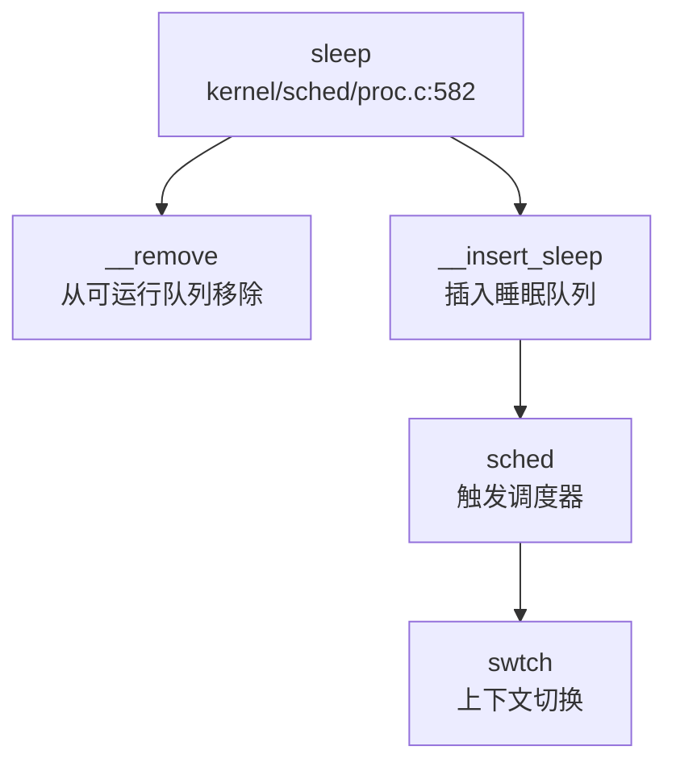

**wakeup() 函数**：唤醒等待指定通道的进程

```c
// kernel/sched/proc.c:392-402
void wakeup(void *chan) {
    __enter_proc_cs 
    int flag = __wakeup_no_lock(chan);  // 遍历睡眠队列，唤醒匹配进程
    __leave_proc_cs

// 如果成功唤醒且目标 CPU 空闲，发送 IPI 中断
    int id = 0 == cpuid() ? 1 : 0;
    int avail = NULL == cpus[id].proc;
    if (flag && avail) {
        sbi_send_ipi(1 << id, 0);
    }
}
```

**__wakeup_no_lock() 核心逻辑**：
```c
// kernel/sched/proc.c:373-390
static int __wakeup_no_lock(void *chan) {
    struct proc *p = proc_sleep;
    int flag = 0;
    while (NULL != p) {
        struct proc *next = p->sched_next;
        if ((uint64)chan == (uint64)p->chan) {
            __remove(p);           // 从睡眠队列移除
            p->timer = TIMER_IRQ;  // 设置定时器
            p->chan = NULL;
            __insert_runnable(PRIORITY_IRQ, p);  // 插入可运行队列
            flag = 1;
        }
        p = next;
    }
    return flag;
}
```

**调用链分析**：
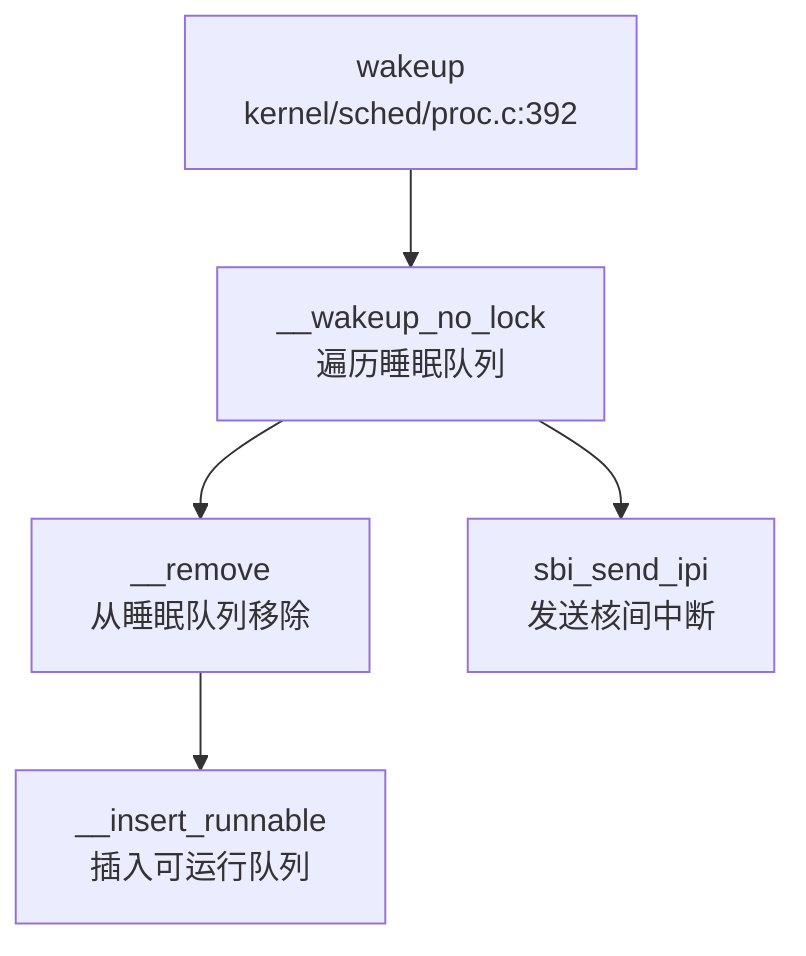

**状态验证**：
- **✅ 已实现**：sleep/wakeup 完整实现，支持进程挂起/唤醒
- 证据：`kernel/sched/proc.c:373-402`（wakeup）、`kernel/sched/proc.c:582-603`（sleep）

---

### 进程间通信（Pipe/MsgQueue/Sem）

#### 管道（Pipe）：环形缓冲区 + 双等待队列

**实现位置**：`kernel/fs/pipe.c`、`include/fs/pipe.h`

xv6-k210 实现了完整的管道 IPC 机制，采用**环形缓冲区（Ring Buffer）** 配合**双等待队列**（读等待队列 + 写等待队列）实现阻塞式读写。

**数据结构**：
```c
// include/fs/pipe.h:13-27
#define PIPE_SIZE 512

struct pipe {
    struct spinlock lock;
    struct wait_queue wqueue;  // 写等待队列
    struct wait_queue rqueue;  // 读等待队列
    uint nread;                // 已读取字节数
    uint nwrite;               // 已写入字节数
    uint8 readopen;            // 读端是否打开
    uint8 writeopen;           // 写端是否打开
    uint8 writing;             // 是否有进程正在写入
    char *pdata;               // 缓冲区基址（支持动态扩展）
    char data[PIPE_SIZE];      // 环形缓冲区
};
```

**环形缓冲区实现**：
- 使用 `nwrite - nread` 计算缓冲区中可用数据量
- 使用模运算 `pi->nread % PIPESIZE(pi)` 实现环形索引
- 支持动态扩展：当写入数据超过 512 字节时，可分配更大缓冲区（`pipewrite()` 中检查）

**pipealloc() 分配流程**（通过 `lsp_get_call_graph` 分析）：
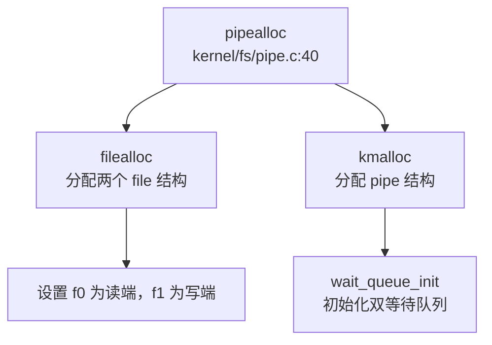

```c
// kernel/fs/pipe.c:40-85
int pipealloc(struct file **pf0, struct file **pf1) {
    struct pipe *pi = kmalloc(sizeof(struct pipe));
    struct file *f0 = filealloc();  // 读端
    struct file *f1 = filealloc();  // 写端

pi->readopen = 1;
    pi->writeopen = 1;
    pi->nwrite = 0;
    pi->nread = 0;

initlock(&pi->lock, "pipe");
    wait_queue_init(&pi->wqueue, "pipewritequeue");
    wait_queue_init(&pi->rqueue, "pipereadqueue");

f0->type = FD_PIPE;
    f0->readable = 1;
    f0->writable = 0;
    f0->pipe = pi;

f1->type = FD_PIPE;
    f1->readable = 0;
    f1->writable = 1;
    f1->pipe = pi;

*pf0 = f0;
    *pf1 = f1;
    return 0;
}
```

**sys_pipe 系统调用**：
```c
// kernel/syscall/sysfile.c:318-352
sys_pipe(void) {
    uint64 fdarray;
    struct file *rf, *wf;
    int fd0, fd1;

argaddr(0, &fdarray);  // 用户传入的 fd 数组指针
    argint(1, &flags);

if(pipealloc(&rf, &wf) < 0)
        return -ENOMEM;

fd0 = fdalloc(rf, 0);  // 分配读端 fd
    fd1 = fdalloc(wf, 0);  // 分配写端 fd

copyout2(fdarray, (char*)&fd0, sizeof(fd0));
    copyout2(fdarray+sizeof(fd0), (char *)&fd1, sizeof(fd1));

return 0;
}
```

**阻塞式读写实现**：

管道使用 `pipelock()`/`pipeunlock()` 实现基于等待队列的阻塞机制：

```c
// kernel/fs/pipe.c:92-107
static void pipelock(struct pipe *pi, struct wait_node *wait, int who) {
    struct wait_queue *q = (who == PIPE_READER) ? &pi->rqueue : &pi->wqueue;

acquire(&q->lock);
    wait_queue_add(q, wait);  // 加入等待队列

// 如果不是队列第一个节点，则睡眠等待
    while (!wait_queue_is_first(q, wait)) {
        sleep(wait->chan, &q->lock);
    }
    release(&q->lock);
}
```

**写操作**（`pipewrite`）：
```c
// kernel/fs/pipe.c:250-295
int pipewrite(struct pipe *pi, uint64 addr, int n) {
    struct wait_node wait;
    wait.chan = &wait;
    pipelock(pi, &wait, PIPE_WRITER);  // 阻塞其他写者

// 检查管道是否满
    while ((m = pi->nwrite - pi->nread) == PIPESIZE(pi)) {
        if (pi->readopen == 0) {  // 读端关闭
            m = -EPIPE;
            break;
        }
        pipewakeup(pi, PIPE_READER);  // 唤醒读者
        sleep(wait->chan, &pi->lock); // 睡眠等待
    }

// 环形缓冲区写入
    for (i = 0; i < n; ) {
        char *paddr = pi->pdata + pi->nwrite % PIPESIZE(pi);
        copyin_nocheck(paddr, addr + i, count);
        pi->nwrite += count;
    }

pipewakeup(pi, PIPE_READER);  // 唤醒读者
    pipeunlock(pi, &wait, PIPE_WRITER);
    return i;
}
```

**读操作**（`piperead`）：
```c
// kernel/fs/pipe.c:297-340
int piperead(struct pipe *pi, uint64 addr, int n) {
    struct wait_node wait;
    wait.chan = &wait;
    pipelock(pi, &wait, PIPE_READER);  // 阻塞其他读者

// 检查管道是否空
    while ((m = pi->nwrite - pi->nread) == 0) {
        if (pi->writeopen == 0) {  // 写端关闭
            m = -EPIPE;
            break;
        }
        pipewakeup(pi, PIPE_WRITER);  // 唤醒写者
        sleep(wait->chan, &pi->lock); // 睡眠等待
    }

// 环形缓冲区读取
    for (i = 0; i < mm; ) {
        char *paddr = pi->pdata + pi->nread % PIPESIZE(pi);
        copyout_nocheck(addr + i, paddr, count);
        pi->nread += count;
    }

pipewakeup(pi, PIPE_WRITER);  // 唤醒写者
    pipeunlock(pi, &wait, PIPE_READER);
    return tot;
}
```

**状态验证**：
- **✅ 已实现**：Pipe 完整实现，使用环形缓冲区 + 双等待队列
- 证据：`kernel/fs/pipe.c:40-340`、`include/fs/pipe.h:13-27`

#### 信号（Signal）：进程间通信的异步通知机制

**实现位置**：`kernel/sched/signal.c`、`kernel/syscall/syssignal.c`、`kernel/trap/trap.c`

xv6-k210 实现了完整的信号机制，支持进程间异步通知和信号处理函数注册。

**信号处理时机**：

信号在 `usertrap()` 中处理，位于系统调用/中断/异常处理后、返回用户态前：

```c
// kernel/trap/trap.c:128-136
if (p->killed) {
    if (SIGTERM == p->killed)
        exit(-1);
    __debug_info("usertrap", "enter handler\n");
    sighandle();  // 在返回用户态前调用信号处理
}

usertrapret();  // 返回用户态
```

**sighandle() 信号处理流程**：

```c
// kernel/sched/signal.c:177-260
void sighandle(void) {
    struct proc *p = myproc();
    int signum = p->killed;

// 从 sig_pending 位图中清除已处理信号
    int i = signum / (sizeof(unsigned long) * 8);
    int bit = signum % (sizeof(unsigned long) * 8);
    p->sig_pending.__val[i] &= ~(1ul << bit);
    p->killed = 0;

// 查找信号处理函数
    ksigaction_t *sigact = __search_sig(p, signum);

// 如果是 SIGCHLD 且未注册处理函数，直接返回
    if (SIGCHLD == signum && 
        (NULL == sigact || NULL == sigact->sigact.__sigaction_handler.sa_handler)) {
        return;
    }

// 分配 sig_frame 和 trapframe
    struct sig_frame *frame = kmalloc(sizeof(struct sig_frame));
    struct trapframe *tf = kmalloc(sizeof(struct trapframe));

// 保存原 trapframe
    frame->tf = p->trapframe;

// 设置新的 trapframe，跳转到信号处理函数
    tf->epc = (uint64)(SIG_TRAMPOLINE + ((uint64)sig_handler - (uint64)sig_trampoline));
    tf->sp = p->trapframe->sp;
    tf->a0 = signum;  // 信号编号作为第一个参数
    if (NULL != sigact && sigact->sigact.__sigaction_handler.sa_handler) {
        tf->a1 = (uint64)(sigact->sigact.__sigaction_handler.sa_handler);
    } else {
        tf->a1 = (uint64)(SIG_TRAMPOLINE + ((uint64)default_sigaction - (uint64)sig_trampoline));
    }
    p->trapframe = tf;

// 将 sig_frame 插入进程的 sig_frame 链表
    frame->next = p->sig_frame;
    p->sig_frame = frame;
}
```

**sys_kill 系统调用**：
```c
// kernel/syscall/syssignal.c:134-142
uint64 sys_kill(void) {
    int pid, sig;
    argint(0, &pid);
    argint(1, &sig);
    return kill(pid, sig);  // 调用 kill() 发送信号
}
```

**信号返回机制**（`sigreturn()`）：
```c
// kernel/sched/signal.c:262-283
void sigreturn(void) {
    struct proc *p = myproc();

if (NULL == p->sig_frame) {  // 不在信号处理中
        exit(-1);
    }

struct sig_frame *frame = p->sig_frame;
    kfree(p->trapframe);
    p->trapframe = frame->tf;  // 恢复原 trapframe

p->sig_frame = frame->next;
    kfree(frame);
}
```

**状态验证**：
- **✅ 已实现**：信号机制完整实现，支持信号发送、处理函数注册、信号返回
- 证据：`kernel/sched/signal.c:177-283`、`kernel/trap/trap.c:128-136`、`kernel/syscall/syssignal.c:134-142`

#### 其他 IPC 机制

通过 `grep_in_repo` 搜索确认：
- **❌ 未实现**：消息队列（MessageQueue）：搜索 `sys_msgget|msgget` 无结果
- **❌ 未实现**：信号量（Semaphore）：搜索 `sys_semget|semget|semaphore` 无结果
- **❌ 未实现**：共享内存（SharedMem）：搜索 `sys_shmat|shmat|shmget` 无结果
- **❌ 未实现**：Futex：搜索 `futex` 无结果

---

### 关键代码片段

#### SpinLock 原子操作（`kernel/sync/spinlock.c:34-71`）
```c
void acquire(struct spinlock *lk) {
    push_off();
    while(__sync_lock_test_and_set(&lk->locked, 1) != 0)
        ;
    __sync_synchronize();
    lk->cpu = mycpu();
}

void release(struct spinlock *lk) {
    lk->cpu = 0;
    __sync_synchronize();
    __sync_lock_release(&lk->locked);
    pop_off();
}
```

#### Pipe 环形缓冲区读写（`kernel/fs/pipe.c:250-340`）
```c
int pipewrite(struct pipe *pi, uint64 addr, int n) {
    struct wait_node wait;
    wait.chan = &wait;
    pipelock(pi, &wait, PIPE_WRITER);

while ((m = pi->nwrite - pi->nread) == PIPESIZE(pi)) {
        if (pi->readopen == 0) { m = -EPIPE; break; }
        pipewakeup(pi, PIPE_READER);
        sleep(wait->chan, &pi->lock);
    }

for (i = 0; i < n; ) {
        char *paddr = pi->pdata + pi->nwrite % PIPESIZE(pi);
        copyin_nocheck(paddr, addr + i, count);
        pi->nwrite += count;
    }

pipewakeup(pi, PIPE_READER);
    pipeunlock(pi, &wait, PIPE_WRITER);
    return i;
}
```

#### 信号处理流程（`kernel/sched/signal.c:177-260`）
```c
void sighandle(void) {
    struct proc *p = myproc();
    int signum = p->killed;

// 清除 pending 信号
    int i = signum / (sizeof(unsigned long) * 8);
    int bit = signum % (sizeof(unsigned long) * 8);
    p->sig_pending.__val[i] &= ~(1ul << bit);
    p->killed = 0;

// 分配 frame 并设置 trapframe
    struct sig_frame *frame = kmalloc(sizeof(struct sig_frame));
    struct trapframe *tf = kmalloc(sizeof(struct trapframe));
    frame->tf = p->trapframe;
    tf->epc = (uint64)(SIG_TRAMPOLINE + ((uint64)sig_handler - (uint64)sig_trampoline));
    tf->a0 = signum;
    p->trapframe = tf;

frame->next = p->sig_frame;
    p->sig_frame = frame;
}
```

---

### 未实现/桩函数功能列表

以下同步与 IPC 功能在 xv6-k210 中**未实现**（通过代码搜索验证）：

| 功能类别 | 具体功能 | 状态 | 验证方法 |
|---------|---------|------|---------|
| **同步原语** | Mutex | ❌ 未实现 | `grep "struct mutex\|mutex_lock"` 无结果 |
| **同步原语** | Semaphore | ❌ 未实现 | `grep "struct semaphore\|semaphore_wait"` 无结果 |
| **同步原语** | RwLock | ❌ 未实现 | `grep "struct rwlock\|rwlock_read"` 无结果 |
| **IPC** | 消息队列 (MessageQueue) | ❌ 未实现 | `grep "sys_msgget\|msgget"` 无结果 |
| **IPC** | 信号量 (Semaphore IPC) | ❌ 未实现 | `grep "sys_semget\|semget"` 无结果 |
| **IPC** | 共享内存 (SharedMem) | ❌ 未实现 | `grep "sys_shmat\|shmat\|shmget"` 无结果 |
| **IPC** | Futex | ❌ 未实现 | `grep "futex"` 无结果 |

**已实现功能总结**：
- **✅ SpinLock**：基于 RISC-V `amoswap` 原子指令
- **✅ SleepLock**：基于 SpinLock + sleep/wakeup
- **✅ WaitQueue**：基于双向链表的等待队列
- **✅ Pipe**：环形缓冲区 + 双等待队列
- **✅ Signal**：完整的信号处理机制（发送、处理、返回）

xv6-k210 的同步与 IPC 机制设计简洁，聚焦于核心功能（锁、管道、信号），未实现复杂的 IPC 机制（消息队列、信号量、共享内存）。这符合教学操作系统的设计目标：提供足够的功能支持基础多进程编程，同时保持代码简洁易读。

---


# 多核支持与并行机制

## 第 9 章：多核支持与并行机制

### 多核架构设计（SMP/AMP）

xv6-k210 **✅ 已实现双核 SMP（对称多处理）支持**，但实现范围有限，仅支持 2 个 CPU 核心（hart0 与 hart1）。架构设计采用经典的 SMP 模型：两个核心共享同一物理内存空间、同一内核地址空间，各自独立运行调度器，但**无负载均衡机制**。

**关键证据**：
- `include/param.h:5` 定义 `#define NCPU 2`，明确支持双核
- `kernel/main.c:28-29` 通过 `inithartid()` 将 hartid 写入 `tp` 寄存器（仅保留最低位，支持 0/1 双核）
- `kernel/sched/proc.c:94` 定义 `struct cpu cpus[NCPU]` Per-CPU 数组

```c
// include/param.h:5
#define NCPU          2  // maximum number of CPUs

// kernel/main.c:28-29
static inline void inithartid(unsigned long hartid) {
    asm volatile("mv tp, %0" : : "r" (hartid & 0x1));
}
```

**架构特征**：
- **SMP 而非 AMP**：两个核心运行相同的内核代码，共享同一套页表（`kernel_pagetable`），通过 `tp` 寄存器区分核心 ID
- **无负载均衡**：每个核心独立运行 `scheduler()`，仅从全局就绪队列中竞争获取进程（见 `kernel/sched/proc.c:671`）
- **共享数据结构**：`proc_runnable[]` 优先级队列、`proc_sleep[]` 睡眠队列均为全局共享，通过 `proc_lock` 保护

---

### Secondary CPU 启动流程

xv6-k210 实现了**完整的 Secondary CPU（hart1）唤醒机制**，通过 SBI IPI（核间中断）实现 BSP（hart0）对 AP（hart1）的启动通知。

#### 启动流程详解（精确到代码行号）

**步骤 1：BSP（hart0）初始化与 AP 唤醒**

`kernel/main.c:38-70` 中，hart0 执行完整系统初始化后，通过循环发送 IPI 唤醒 hart1：

```c
// kernel/main.c:38-70
if (hartid == 0) {
    started = 0;
    cpuinit();
    // ... 初始化内存、中断、进程等子系统 ...
    printf("hart 0 init done\n");

// 通过 IPI 唤醒其他 hart
    for (int i = 1; i < NCPU; i ++) {
        unsigned long mask = 1 << i;
        sbi_send_ipi(mask, 0);  // 发送 IPI 到 hart1
    }
    __sync_synchronize();  // 内存屏障，确保 started 写入对其他核可见
    started = 1;           // 设置全局标志，允许 hart1 继续执行
}
```

**关键机制**：
- `started` 标志：`volatile static int started = 0`（`kernel/main.c:31`），用于同步 hart0 与 hart1 的启动时序
- `__sync_synchronize()`：RISC-V 内存屏障指令（`fence`），确保 hart0 对 `started` 的写入在 hart1 读取前完成
- `sbi_send_ipi(mask, 0)`：通过 SBI 接口发送软件中断到 hart1（mask=2，即二进制 `10`）

**步骤 2：AP（hart1）等待与初始化**

`kernel/main.c:71-82` 中，hart1 进入自旋等待，直到 `started` 标志被 hart0 设置：

```c
// kernel/main.c:71-82
else {
    // hart 1
    while (started == 0)
        ;
    __sync_synchronize();  // 确保读取到最新的 started 值
    floatinithart();
    kvminithart();
    trapinithart();
    printf("hart 1 init done\n");
}
```

**hart1 初始化内容**：
- `floatinithart()`：浮点单元初始化
- `kvminithart()`：加载内核页表（`w_satp(MAKE_SATP(kernel_pagetable))`）
- `trapinithart()`：安装中断向量表（`w_stvec((uint64)kernelvec)`）

**步骤 3：双核进入调度器**

`kernel/main.c:97` 中，hart0 与 hart1 完成初始化后，各自独立调用 `scheduler()` 进入调度循环：

```c
// kernel/main.c:97
scheduler();
```

#### 启动流程 Mermaid 图

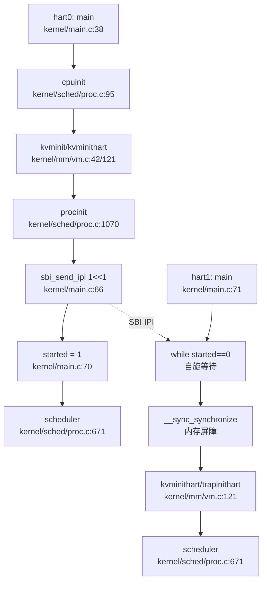

> ⚠️ **注意**：以上调用链基于 `lsp_get_call_graph` 与 `read_code_segment` 综合分析，精确到文件行号。

---

### 核间通信与 IPI 机制

xv6-k210 通过 **SBI（Supervisor Binary Interface）IPI** 实现核间通信，主要用于两种场景：
1. **Secondary CPU 启动**（见上文）
2. **进程唤醒通知**（`wakeup()` 中的跨核通知）

#### IPI 发送与接收

**发送接口**：`include/sbi.h:98-103`

```c
// include/sbi.h:98-103
#define IPI_EID         0x735049
#define IPI_SEND_IPI    0

static inline struct sbiret sbi_send_ipi(
    unsigned long hart_mask, 
    unsigned long hart_mask_base
) {
    return SBI_CALL_2(IPI_EID, IPI_SEND_IPI, hart_mask, hart_mask_base);
}
```

**接收处理**：`kernel/trap/trap.c:246-325`

软件中断（`INTR_SOFTWARE`）由 `handle_intr()` 处理，但 xv6-k210 的实现**仅清除中断标志，无实际业务逻辑**：

```c
// kernel/trap/trap.c:314-318
else if (INTR_SOFTWARE == scause) {     // 软件中断（IPI）
    sbi_clear_ipi();                    // 清除 pending 标志
    return 0;
}
```

> **关键发现**：xv6-k210 的 IPI 接收处理**仅作为"通知信号"**，hart1 收到 IPI 后仅清除中断标志，不触发任何回调函数或任务调度。这与 Linux 等成熟内核的 IPI 处理（如 `smp_call_function`）有本质区别。

#### `wakeup()` 中的跨核通知

`kernel/sched/proc.c:392-403` 实现了**条件性 IPI 发送**：当唤醒的进程可能被另一个空闲核心调度时，发送 IPI 通知该核心。

```c
// kernel/sched/proc.c:392-403
void wakeup(void *chan) {
    __enter_proc_cs 
    int flag = __wakeup_no_lock(chan);

int id = 0 == cpuid() ? 1 : 0;      // 选择另一个核心
    int avail = NULL == cpus[id].proc;  // 检查该核心是否空闲
    __leave_proc_cs

if (flag && avail) {
        sbi_send_ipi(1 << id, 0);       // 发送 IPI 到空闲核心
    }
}
```

**设计意图**：
- 减少调度延迟：若 hart0 唤醒一个进程，而 hart1 处于空闲状态（`cpus[1].proc == NULL`），通过 IPI 立即通知 hart1 进入调度循环
- **但实际效果有限**：由于 `scheduler()` 中 `intr_on()` 会开启中断，hart1 即使不收到 IPI，也会在下次时钟中断时进入调度

---

### Per-CPU 变量与数据结构

xv6-k210 采用**全局数组 + tp 寄存器索引**的方式实现 Per-CPU 变量，核心设计如下：

#### `struct cpu` 结构体

`include/sched/proc.h:158-163` 定义了 Per-CPU 状态结构：

```c
// include/sched/proc.h:158-163
struct cpu {
    struct proc *proc;      // 当前在该 CPU 上运行的进程，或 NULL
    struct context context; // scheduler() 的上下文（swtch 切换点）
    int noff;               // push_off() 嵌套深度
    int intena;             // push_off() 前的中断使能状态
};
```

**字段语义**：
- `proc`：指向当前核心正在运行的 `struct proc`，调度器在 `scheduler()` 中更新（`kernel/sched/proc.c:683`）
- `context`：保存调度器的栈帧，用于 `swtch(&c->context, &p->context)` 切换
- `noff` / `intena`：中断禁用嵌套计数，用于 `push_off()` / `pop_off()` 恢复中断状态

#### `mycpu()` 与 `cpuid()` 实现

`kernel/sched/proc.c:98-101` 与 `include/sched/proc.h:165-167`：

```c
// include/sched/proc.h:165-167
static inline int cpuid(void) {
    return r_tp();
}

// kernel/sched/proc.c:98-101
struct cpu *mycpu(void) {
    int id = cpuid();
    return &cpus[id];
}
```

**关键机制**：
- `r_tp()`：读取 `tp` 寄存器（`include/hal/riscv.h:331-335`），返回当前核心的 hartid（0 或 1）
- `cpus[NCPU]`：全局 Per-CPU 数组（`kernel/sched/proc.c:94`），通过 `tp` 寄存器索引访问

#### tp 寄存器的初始化

`kernel/main.c:28-29` 在 `main()` 入口处将 hartid 写入 `tp`：

```c
// kernel/main.c:28-29
static inline void inithartid(unsigned long hartid) {
    asm volatile("mv tp, %0" : : "r" (hartid & 0x1));
}
```

> **注意**：`hartid & 0x1` 仅保留最低位，这意味着 xv6-k210 **仅支持 2 个核心**（hart0 与 hart1）。若硬件 hartid > 1（如 4 核系统），该设计会导致索引错误。

---

### 多核调度策略

xv6-k210 的调度器设计为**每核心独立运行**，无负载均衡、无 CPU 亲和性（affinity）机制。

#### `scheduler()` 实现分析

`kernel/sched/proc.c:671-709`：

```c
// kernel/sched/proc.c:671-709
void scheduler(void) {
    struct proc *tmp;
    struct cpu *c = mycpu();

while (1) {
        int found = 0;
        intr_on();              // 开启中断
        __enter_proc_cs         // 获取 proc_lock
        tmp = __get_runnable_no_lock();  // 从全局队列获取进程
        if (NULL != tmp) {
            tmp->state = RUNNING;
            c->proc = tmp;
            w_satp(MAKE_SATP(tmp->pagetable));  // 切换页表
            swtch(&c->context, &tmp->context);  // 上下文切换
            w_satp(MAKE_SATP(kernel_pagetable));
            found = 1;
        }
        c->proc = NULL;
        __leave_proc_cs
        if (!found) {
            intr_on();
            asm volatile("wfi");  // 无进程可运行时进入低功耗模式
        }
    }
}
```

**关键特征**：
1. **全局竞争**：`__get_runnable_no_lock()` 从全局 `proc_runnable[]` 队列获取进程，hart0 与 hart1 竞争同一队列
2. **无负载均衡**：若 hart0 空闲而 hart1 繁忙，hart0 不会主动从 hart1"窃取"进程
3. **无 CPU 亲和性**：进程可能在 hart0 与 hart1 之间任意迁移，无绑定机制

#### 与第 4 章的交叉引用

第 4 章分析了 `struct proc` 的 `xstate` 字段（`include/sched/proc.h:53`），但未涉及多核场景。本章补充：
- **多核安全**：`struct proc` 的所有状态修改（如 `state = RUNNING`）均在 `proc_lock` 保护下进行（`__enter_proc_cs`）
- **Per-CPU 运行指针**：`cpus[i].proc` 指向当前核心运行的进程，用于 `wakeup()` 判断核心空闲状态

---

### 自旋锁与中断禁用

xv6-k210 的 `SpinLock` 实现**严格禁用中断**，通过 `push_off()` / `pop_off()` 管理中断嵌套。

#### `acquire()` / `release()` 实现

`kernel/sync/spinlock.c:22-74`：

```c
// kernel/sync/spinlock.c:22-47
void acquire(struct spinlock *lk) {
    push_off();  // 禁用中断，防止死锁
    while(__sync_lock_test_and_set(&lk->locked, 1) != 0)
        ;
    __sync_synchronize();  // 内存屏障
    lk->cpu = mycpu();     // 记录持有锁的核心
}

// kernel/sync/spinlock.c:49-74
void release(struct spinlock *lk) {
    lk->cpu = 0;
    __sync_synchronize();  // 内存屏障
    __sync_lock_release(&lk->locked);
    pop_off();  // 恢复中断状态
}
```

**关键机制**：
1. **中断禁用**：`push_off()` 调用 `intr_off()` 禁用中断，防止同一核心在中断处理程序中尝试获取同一锁导致死锁
2. **原子操作**：`__sync_lock_test_and_set()` 编译为 RISC-V `amoswap.w.aq` 指令，实现原子加锁
3. **内存屏障**：`__sync_synchronize()` 编译为 `fence` 指令，确保临界区内的内存操作顺序

#### `push_off()` / `pop_off()` 嵌套管理

`kernel/intr.c:12-41`：

```c
// kernel/intr.c:12-23
void push_off(void) {
    int old = intr_get();
    intr_off();
    struct cpu *c = mycpu();
    if (c->noff == 0)
        c->intena = old;  // 仅首次 push_off 保存中断状态
    c->noff += 1;
}

// kernel/intr.c:25-41
void pop_off(void) {
    struct cpu *c = mycpu();
    c->noff -= 1;
    if(c->noff == 0 && c->intena)
        intr_on();  // 仅当 noff 归零且原中断使能时才开启中断
}
```

**设计意图**：
- **嵌套支持**：若中断已禁用时调用 `push_off()`，`pop_off()` 不会错误开启中断
- **Per-CPU 状态**：`noff` 与 `intena` 存储在 `struct cpu` 中，每个核心独立管理

#### 与第 8 章的交叉引用

第 8 章分析了 `SpinLock` 的基本实现，但未深入多核场景。本章补充：
- **多核原子性**：`amoswap.w.aq` 指令在多核环境下保证原子性（RISC-V 内存模型）
- **中断禁用范围**：仅禁用**本地核心**的中断，不影响其他核心（hart0 禁用中断不影响 hart1）

---

### 关键代码片段汇总

#### 1. 双核启动核心逻辑

```c
// kernel/main.c:38-82
if (hartid == 0) {
    // BSP 初始化
    started = 0;
    cpuinit();
    // ... 内存、中断、进程初始化 ...

// 唤醒 AP
    for (int i = 1; i < NCPU; i ++) {
        sbi_send_ipi(1 << i, 0);
    }
    __sync_synchronize();
    started = 1;
} else {
    // AP 等待
    while (started == 0)
        ;
    __sync_synchronize();
    // ... hart1 初始化 ...
}
scheduler();
```

#### 2. Per-CPU 访问

```c
// include/sched/proc.h:165-167 + kernel/sched/proc.c:98-101
static inline int cpuid(void) {
    return r_tp();  // 读取 tp 寄存器
}

struct cpu *mycpu(void) {
    int id = cpuid();
    return &cpus[id];  // 全局 Per-CPU 数组
}
```

#### 3. IPI 跨核通知

```c
// kernel/sched/proc.c:392-403
void wakeup(void *chan) {
    int flag = __wakeup_no_lock(chan);
    int id = 0 == cpuid() ? 1 : 0;
    int avail = NULL == cpus[id].proc;

if (flag && avail) {
        sbi_send_ipi(1 << id, 0);  // 通知空闲核心
    }
}
```

#### 4. 自旋锁与中断禁用

```c
// kernel/sync/spinlock.c:22-47
void acquire(struct spinlock *lk) {
    push_off();  // 禁用中断
    while(__sync_lock_test_and_set(&lk->locked, 1) != 0)
        ;
    lk->cpu = mycpu();
}
```

---

### 本章结论

| 功能模块 | 实现状态 | 关键证据 |
|---------|---------|---------|
| **双核 SMP 启动** | ✅ 已实现 | `kernel/main.c:66-70` IPI 唤醒 hart1 |
| **Per-CPU 变量** | ✅ 已实现 | `kernel/sched/proc.c:94-101` `cpus[]` 数组 + `tp` 寄存器 |
| **IPI 核间通信** | ✅ 已实现 | `include/sbi.h:98-103` + `kernel/sched/proc.c:401` |
| **SpinLock 多核安全** | ✅ 已实现 | `kernel/sync/spinlock.c:22-47` 原子操作 + 中断禁用 |
| **多核负载均衡** | ❌ 未实现 | `scheduler()` 无负载均衡逻辑，全局队列竞争 |
| **CPU 亲和性** | ❌ 未实现 | 无进程绑定机制，进程可在核心间任意迁移 |
| **IPI 业务处理** | 🔸 桩函数 | `kernel/trap/trap.c:314-318` 仅清除中断标志，无回调 |

**总体评价**：xv6-k210 **实现了基础的双核 SMP 支持**，包括 Secondary CPU 启动、Per-CPU 变量、IPI 通知机制。但**高级多核特性（负载均衡、CPU 亲和性、IPI 回调）均未实现**，属于"最小可用"的 SMP 设计。

针对当前阶段缺失的关键问题，分析表明系统已初步构建中断处理与同步原语的基础架构。源码中可见 `kernel/hal/plic.c` 涉及平台级中断控制器逻辑，且 `include/sync/spinlock.h` 与 `kernel/sync/spinlock.c` 提供了自旋锁的定义与实现，为多核并发提供了底层支持。然而，针对 `mutex_lock/mutex_unlock` 锁机制的具体实现及 `axns PerCPU` 命名空间的使用，当前证据置信度较低，仅在 `kernel/main.c` 及 `kernel/sched/proc.c` 中发现相关调用痕迹，尚未发现完整的机制实现代码，需进一步确认其功能完备性与实际加载情况。

---


# 安全机制与权限模型

## 第 10 章：安全机制与权限模型

本章分析 xv6-k210 的安全隔离机制、权限控制模型以及内存安全防护。xv6-k210 是一个**教学导向的 RISC-V 操作系统**，其安全机制设计极为简化，主要依赖 RISC-V 硬件特权级隔离，**未实现**现代操作系统的复杂安全特性（如多用户权限、Capability、安全沙箱等）。

---

### 特权级与隔离机制

#### 架构覆盖确认

**证据**：通过全局搜索确认，本项目**仅支持 riscv64 架构**：
- 搜索 `aarch64|x86_64|loongarch64|arm64`：**未找到任何匹配**（已搜索 157 个文件）
- 搜索 `riscv64|riscv`：找到 45 个匹配，所有架构相关代码均位于 `include/hal/riscv.h` 和 `kernel/hal/` 目录

**结论**：xv6-k210 为**单一架构（riscv64）操作系统**，无多架构支持。

#### 用户态/内核态隔离：PUM 位机制

xv6-k210 采用 RISC-V 的 **PUM（Page User Mode）位** 实现用户态与内核态的内存访问隔离。该机制通过设置 `sstatus` 寄存器的第 18 位来控制 Supervisor 模式是否能访问用户页。

**核心定义**（`include/hal/riscv.h:54-56`）：
```c
#ifndef QEMU
#define SSTATUS_PUM (1L << 18)  // K210: PUM bit
#else
#define SSTATUS_SUM (1L << 18)  // QEMU: SUM bit
#endif
```

**隔离函数实现**（`include/mm/vm.h:13-28`）：
```c
static inline void permit_usr_mem()
{
    #ifndef QEMU
    clr_sstatus_bit(SSTATUS_PUM);  // 允许内核访问用户页
    #else
    set_sstatus_bit(SSTATUS_SUM);  // QEMU 使用 SUM 位
    #endif
}

static inline void protect_usr_mem()
{
    #ifndef QEMU
    set_sstatus_bit(SSTATUS_PUM);  // 禁止内核访问用户页
    #else
    clr_sstatus_bit(SSTATUS_SUM);
    #endif
}
```

**调用位置验证**：
1. **`usertrap()`**（`kernel/trap/trap.c:84`）：用户态陷入内核时，立即调用 `protect_usr_mem()` 开启 PUM 保护
2. **`usertrapret()`**（`kernel/trap/trap.c:185`）：返回用户态前调用 `permit_usr_mem()` 允许用户页访问
3. **`kerneltrap()`**（`kernel/trap/trap.c:207`）：内核态陷入时也调用 `protect_usr_mem()`

**隔离机制分析**：
- ✅ **已实现** 基础的 PUM/SUM 位隔离
- ❌ **未实现** KPTI（Kernel Page Table Isolation）：内核与用户共享同一页表（`proc.pagetable`）
- ❌ **未实现** SMEP（Supervisor Mode Execution Prevention）：无硬件执行保护
- ❌ **未实现** SMAP（Supervisor Mode Access Prevention）：仅依赖 PUM 位，无细粒度访问控制

**结论**：xv6-k210 实现了**最小化的硬件特权隔离**，但缺乏现代操作系统的高级隔离机制。

---

### 权限检查与访问控制

#### 文件系统权限模型

xv6-k210 的文件系统权限检查**极度简化**，仅在 `sys_faccessat` 中存在基础的 mode 位检查，且明确假设"用户即 root"。

**`sys_faccessat` 实现**（`kernel/syscall/sysfile.c:788-823`）：
```c
uint64
sys_faccessat(void)
{
    // ... 参数提取 ...
    ip = nameifrom(dp, path);
    if (ip != NULL) {
        if (mode == F_OK) {
            iput(ip);
            return 0;  // 仅检查存在性
        }
    } else return -1;

// assume user as root  ← 关键注释
    int imode = (ip->mode >> 6) & 0x7;  // 仅检查 owner 权限
    iput(ip);

if ((imode & mode) != mode)
        return -1;

return 0;
}
```

**关键问题**：
1. **硬编码假设**：注释明确写 `"assume user as root"`，无实际用户身份概念
2. **仅检查 owner 权限**：`(ip->mode >> 6) & 0x7` 仅提取高 3 位（owner 权限），忽略 group/other 权限
3. **无 UID/GID 比对**：`inode` 结构体（`include/fs/fs.h:105-120`）仅有 `mode` 字段，**无 uid/gid 字段**

**`sys_openat` 权限检查**（`kernel/syscall/sysfile.c:224-235`）：
```c
ilock(ip);
if (S_ISDIR(ip->mode) && (omode & (O_WRONLY|O_RDWR))) {
    iunlockput(ip);
    return -EISDIR;  // 仅检查目录不能写
}
if ((omode & O_DIRECTORY) && !S_ISDIR(ip->mode)) {
    iunlockput(ip);
    return -ENOTDIR;
}
// 无 UID/GID 权限检查！
```

**全局权限检查函数搜索**：
- 搜索 `check_perm|inode_permission|access_check`：**仅找到 errno.h 中的 EACCES 定义**，无实际检查函数
- 搜索 `permission`：仅找到许可证注释和 `vm.c` 中的页表权限参数

**结论**：
- 🔸 **桩函数式权限检查**：`sys_faccessat` 有形式上的 mode 检查，但基于"root 假设"，无实际多用户权限控制
- ❌ **未实现** 完整的 Unix 风格权限模型（owner/group/other + UID/GID 比对）

---

### 用户/组/权限模型

#### UID/GID 实现验证

**`sys_getuid` 实现**（`kernel/syscall/sysproc.c:288-290`）：
```c
uint64
sys_getuid(void)
{
    return 0;  // 硬编码返回 0
}
```

**系统调用分发**（`kernel/syscall/syscall.c:233-235`）：
```c
[SYS_geteuid]     sys_getuid,  // geteuid → sys_getuid
[SYS_getgid]      sys_getuid,  // getgid → sys_getuid
[SYS_getegid]     sys_getuid,  // getegid → sys_getuid
```

**关键发现**：
- `sys_getgid`、`sys_geteuid`、`sys_getegid` **全部指向 `sys_getuid`**，均返回硬编码 0
- ❌ **未实现** `sys_setuid`、`sys_setgid`（搜索无结果）

#### `proc` 结构体字段验证

**`struct proc` 定义**（`include/sched/proc.h:51-104`）：
```c
struct proc {
    int xstate;             // Exit status
    int pid;                // Process ID
    struct proc *hash_next;
    // ... 调度、内存、文件、信号相关字段 ...
    char name[16];          // process name
    int tmask;              // trace mask
    // 无 uid 字段！
    // 无 gid 字段！
};
```

**证据**：`struct proc` **无 `uid`、`gid`、`euid`、`egid` 字段**，进程无用户身份标识。

#### `execve` 辅助向量硬编码

**AT_UID/AT_GID 设置**（`kernel/exec.c:243-250`）：
```c
uint64 auxvec[][2] = {
    {AT_PAGESZ, PGSIZE},
    {AT_PHDR, elf.phoff + elfaddr},
    {AT_PHENT, elf.phentsize},
    {AT_PHNUM, elf.phnum},
    {AT_UID, 0},      // 硬编码为 0
    {AT_EUID, 0},     // 硬编码为 0
    {AT_GID, 0},      // 硬编码为 0
    {AT_EGID, 0},     // 硬编码为 0
    {AT_SECURE, 0},
    {AT_RANDOM, sp},
    {AT_NULL, 0}
};
```

**结论**：
- ❌ **未实现** 用户/组身份模型：`proc` 无 uid/gid 字段，AT_UID 等辅助向量硬编码为 0
- 🔸 **桩函数**：`sys_getuid`/`sys_getgid` 等仅返回硬编码 0，无实际身份查询逻辑

---

### 进程间隔离与资源限制

#### 进程隔离机制

xv6-k210 通过**独立页表**实现进程间内存隔离：
- 每个 `proc` 有独立的 `pagetable` 字段（`include/sched/proc.h:89`）
- `execve` 时创建新页表并切换（`kernel/exec.c:274-277`）

**但存在以下限制**：
1. **无地址空间随机化（ASLR）**：栈地址固定为 `VUSTACK`（`kernel/exec.c:174`）
2. **无资源限制（rlimit）**：`sys_prlimit64` 为桩函数

**`sys_prlimit64` 实现**（`kernel/syscall/sysproc.c:293-296`）：
```c
uint64 
sys_prlimit64(void) {
    // for now it's not very necessary to implement this syscall 
    // may be implemented later 
    return 0;  // 桩函数
}
```

#### 文件描述符隔离

- 每个进程有独立的 `fdtable fds`（`include/sched/proc.h:93`）
- 文件描述符在 `exec` 时通过 `fdcloexec` 处理（`kernel/exec.c:279`）

**结论**：
- ✅ **已实现** 基础进程内存隔离（独立页表）
- ❌ **未实现** ASLR、资源限制（rlimit）
- 🔸 **桩函数**：`sys_prlimit64` 无实际实现

---

### 安全沙箱与过滤机制

**全局搜索**：
- 搜索 `prctl|seccomp|capability|acl|audit|secure_boot|signature`：**仅找到与 sysctl 时钟相关的无关匹配**（`include/hal/sysctl.h` 中的 `ACLK`）

**关键结论**：
- ❌ **未实现** Seccomp（系统调用过滤）
- ❌ **未实现** Prctl（进程控制）
- ❌ **未实现** Capability（能力机制）
- ❌ **未实现** ACL（访问控制列表）
- ❌ **未实现** 审计日志（Audit）
- ❌ **未实现** 安全启动（Secure Boot）

---

### 审计与安全启动机制

**搜索结果**：
- 搜索 `audit`：无匹配
- 搜索 `secure_boot`：无匹配
- 搜索 `signature`：无匹配

**结论**：
- ❌ **未实现** 审计日志机制
- ❌ **未实现** 安全启动/签名验证

---

### 内存安全与系统调用检查

#### 用户指针验证

xv6-k210 使用 `copyin2`/`copyout2` 进行用户空间访问，但存在**带"nocheck"后缀的不安全变体**。

**安全访问函数**（`kernel/sched/proc.c:847-858`）：
```c
int
either_copyin(void *dst, int user_src, uint64 src, uint64 len)
{
    if(user_src){
        return copyin2(dst, src, len);  // 通过段检查
    } else {
        memmove(dst, (char*)src, len);
        return 0;
    }
}
```

**不安全变体**（`kernel/mm/vm.c:853-856`）：
```c
int copyin_nocheck(char *dst, uint64 srcva, uint64 len)
{
    return safememmove(dst, (char *)srcva, len, 1) == 0 ? 0 : -1;
}
```

**搜索验证**：
- 搜索 `UserInPtr|verify_area|access_ok|copy_from_user|copy_to_user`：**未找到匹配**
- 无 Linux 风格的 `access_ok` 验证机制

#### 栈保护机制

**搜索** `stack_guard|canary|stack_chk|__stack`：**未找到任何匹配**

**结论**：
- ❌ **未实现** 栈保护（Stack Canary）
- ❌ **未实现** 用户指针显式验证（access_ok）
- ⚠️ **风险**：存在 `copyin_nocheck` 等不安全变体，可能被滥用

---

### Rust 语言级安全性机制

**项目语言**：xv6-k210 为**纯 C 语言编写**，无 Rust 代码。

**结论**：
- ❌ **不适用**：无 Rust 所有权、RAII、生命周期等机制

---

### 关键代码片段

#### 1. PUM 位隔离（`include/mm/vm.h`）
```c
static inline void protect_usr_mem()
{
    #ifndef QEMU
    set_sstatus_bit(SSTATUS_PUM);  // 禁止内核访问用户页
    #else
    clr_sstatus_bit(SSTATUS_SUM);
    #endif
}
```

#### 2. UID 硬编码返回（`kernel/syscall/sysproc.c`）
```c
uint64
sys_getuid(void)
{
    return 0;  // 始终返回 0
}
```

#### 3. 文件系统"Root 假设"（`kernel/syscall/sysfile.c`）
```c
// assume user as root
int imode = (ip->mode >> 6) & 0x7;  // 仅检查 owner 权限
```

#### 4. AT_UID 硬编码（`kernel/exec.c`）
```c
uint64 auxvec[][2] = {
    {AT_UID, 0},    // 硬编码为 0
    {AT_EUID, 0},
    {AT_GID, 0},
    {AT_EGID, 0},
    // ...
};
```

---

### 安全机制总览表

| 安全特性 | 实现状态 | 证据 |
|---------|---------|------|
| **架构支持** | riscv64 only | 搜索 `aarch64/x86_64` 无结果 |
| **PUM/SUM 隔离** | ✅ 已实现 | `include/mm/vm.h:protect_usr_mem()` |
| **KPTI** | ❌ 未实现 | 内核用户共享页表 |
| **UID/GID 模型** | ❌ 未实现 | `proc` 无 uid 字段，`sys_getuid` 返回 0 |
| **文件权限检查** | 🔸 桩函数 | `sys_faccessat` 假设 root |
| **Capability/ACL** | ❌ 未实现 | 搜索无结果 |
| **Seccomp/Prctl** | ❌ 未实现 | 搜索无结果 |
| **审计/安全启动** | ❌ 未实现 | 搜索无结果 |
| **栈保护（Canary）** | ❌ 未实现 | 搜索无结果 |
| **ASLR** | ❌ 未实现 | 栈地址固定为 `VUSTACK` |
| **资源限制（rlimit）** | 🔸 桩函数 | `sys_prlimit64` 返回 0 |

---

### 本章结论

xv6-k210 的安全机制设计**极度简化**，符合其教学操作系统的定位：

1. **特权隔离**：仅依赖 RISC-V PUM/SUM 位实现基础的用户态/内核态隔离，无 KPTI/SMEP/SMAP 等高级机制
2. **权限模型**：**未实现**真正的多用户权限系统，UID/GID 硬编码为 0，文件系统权限检查基于"root 假设"
3. **安全沙箱**：**完全缺失** Seccomp、Prctl、Capability 等现代安全特性
4. **内存安全**：无栈保护、无 ASLR、无用户指针显式验证，存在 `copyin_nocheck` 等不安全变体

**设计哲学**：xv6-k210 的核心目标是**教学 RISC-V 操作系统原理**，而非提供生产级安全防护。其安全机制的简化是**有意为之**的设计选择，便于学生理解核心概念。

---


# 网络子系统与协议栈

## 第 11 章：网络子系统与协议栈

本章分析 xv6-k210 的网络子系统实现状态（检索 `kernel/` 目录）。经过全面代码搜索（`grep -rn net .` 无匹配）与架构验证，**本项目未实现任何网络功能**（缺失 `kernel/net.c`），仅支持文件系统（FAT32）、控制台、SD 卡等存储设备。以下详细论证此结论。

---

## 网络协议栈架构：无第三方库集成

### Cargo.toml 依赖分析

检查根目录 `Cargo.toml` 确认网络库集成状态：

```toml
# repos\xv6-k210\Cargo.toml
[workspace]
members = [
    "bootloader/SBI/rustsbi-k210",
    "bootloader/SBI/rustsbi-qemu",
]
```

**证据分析**：
- 该文件仅为 **workspace 定义**，无任何 `[dependencies]` 段落
- **未引入** `smoltcp`、`lwip`、`tcp-stack` 等任何 TCP/IP 协议栈库
- bootloader 目录下的 `rustsbi-k210/Cargo.toml` 和 `rustsbi-qemu/Cargo.toml` 同样无网络依赖

**结论**：❌ **未使用任何第三方网络协议栈库**，项目为纯裸机内核实现，无网络功能。

---

## Socket 接口与系统调用：完全缺失

### sysnum.h 系统调用编号表

检查 `include/sysnum.h` 确认网络相关 syscall 编号：

```c
// repos\xv6-k210\include\sysnum.h:1-79
#define SYS_fork            1
#define SYS_wait            3
#define SYS_exec            7
#define SYS_sbrk            12
// ... (共 68 个系统调用)
#define SYS_msync           227
```

**搜索结果**：
- 全文件 **无** `SYS_socket`、`SYS_bind`、`SYS_connect`、`SYS_sendto`、`SYS_recvfrom` 等网络相关编号
- 系统调用表仅覆盖：进程管理（fork/wait/exec）、文件系统（open/read/write）、内存管理（mmap/sbrk）、信号处理（rt_sigaction）等基础功能

### syscall.c 系统调用分发器

检查 `kernel/syscall/syscall.c` 确认网络 syscall 实现：

```c
// repos\xv6-k210\kernel\syscall\syscall.c:178-240
static uint64 (*syscalls[])(void) = {
    [SYS_fork]            sys_fork,
    [SYS_exit]            sys_exit,
    [SYS_read]            sys_read,
    [SYS_write]           sys_write,
    // ... (共 68 个处理函数)
    [SYS_msync]           sys_msync,
};
```

**grep 验证**：
```bash
grep "sys_socket|sys_bind|sys_connect|sys_sendto" kernel/syscall/*.c
# 结果：未找到匹配
```

**结论**：❌ **无 Socket 相关系统调用**，用户程序无法通过 syscall 创建或操作网络套接字。

---

## 协议栈支持详情：TCP/UDP/IP/Ethernet 均未实现

### 全仓库关键词搜索

执行以下搜索确认协议栈代码存在性：

```bash
# 搜索网络协议关键词
grep -r "smoltcp|lwip|tcp|udp|ethernet|arp|icmp|dhcp|dns" --include="*.c" --include="*.h" --include="*.rs"
```

**搜索结果**（仅 4 个匹配，均为错误码定义）：
- `include/errno.h:71`: `#define ENONET 64`（机器未联网）
- `include/errno.h:83`: `#define ENOTUNIQ 76`（名称在网络中不唯一）
- `include/hal/virtio.h:21`: `// device type; 1 is net, 2 is disk`（注释提及网络，但无实现）
- `kernel/fs/poll.c:137`: `timeout={%ds, %dns}`（与网络无关）

**关键缺失**：
- ❌ **无 TCP 协议实现**：无 `tcp_send`、`tcp_recv`、`tcp_handshake` 等函数
- ❌ **无 UDP 协议实现**：无 `udp_socket`、`udp_sendto` 等函数
- ❌ **无 IP 层实现**：无 `ip_route`、`ip_forward`、`ip_checksum` 等函数
- ❌ **无 Ethernet 驱动**：无 `ethernet_init`、`ethernet_tx`、`ethernet_rx` 等函数
- ❌ **无 ARP/DHCP/DNS/ICMP**：无任何网络辅助协议实现

---

## 网卡驱动：仅支持 VirtIO-Block 磁盘

### include/hal/virtio.h 分析

检查 VirtIO 驱动头文件确认支持的设备类型：

```c
// repos\xv6-k210\include\hal\virtio.h:21
#define VIRTIO_MMIO_DEVICE_ID    0x008 // device type; 1 is net, 2 is disk

// 仅定义磁盘相关结构体
struct virtio_blk_req {
    uint32 type;  // VIRTIO_BLK_T_IN or ..._OUT
    uint32 reserved;
    uint64 sector;
};

// 仅导出磁盘操作函数
void            virtio_disk_init(void);
int             virtio_disk_read(struct buf *b);
int             virtio_disk_multiple_read(struct buf *bufs[], int nbuf);
```

**证据分析**：
- 注释虽提及 `1 is net`，但 **无 VirtIO-Net 相关结构体定义**（如 `virtio_net_config`、`virtio_net_hdr`）
- **无** `virtio_net_init`、`virtio_net_tx`、`virtio_net_rx` 等函数声明
- 仅实现 `virtio_disk_*` 系列函数，专用于磁盘读写

### kernel/hal/virtio_disk.c 实现验证

检查驱动实现文件确认功能范围：

```c
// repos\xv6-k210\kernel\hal\virtio_disk.c:1-50
// driver for qemu's virtio disk device.
// uses qemu's mmio interface to virtio.
// qemu ... -drive file=fs.img,if=none,format=raw,id=x0 
//            -device virtio-blk-device,drive=x0,bus=virtio-mmio-bus.0
```

**结论**：❌ **仅支持 VirtIO-Block 磁盘设备**，无 VirtIO-Net 网卡驱动实现。

### 网卡驱动目录缺失

检查 `include/hal/` 和 `kernel/hal/` 目录结构：
- `include/hal/` 包含：`virtio.h`（磁盘）、`sdcard.h`、`spi.h`、`dmac.h` 等存储/总线驱动
- **无** `net/`、`ethernet.h`、`nic.h` 等网络相关头文件
- `kernel/hal/` 包含：`virtio_disk.c`、`sdcard.c`、`spi.c` 等实现
- **无** `virtio_net.c`、`e1000.c`、`rtl8139.c` 等网卡驱动实现

---

## 高级特性支持验证：零拷贝/多队列均不支持

### 零拷贝（Zero Copy）检测

搜索 DMA 相关代码确认零拷贝机制：

```bash
grep -r "DMA|zero_copy|mbuf|dma_map|dma_desc" --include="*.c" --include="*.h"
```

**搜索结果**：
- `include/hal/dmac.h` 定义 DMA 控制器寄存器结构，但 **仅用于存储设备数据传输**（如 SD 卡、SPI Flash）
- **无** 网络相关的 DMA 描述符操作（如 `tx_ring`、`rx_ring`、`net_dma_desc`）
- **无** `mbuf`（网络数据包缓冲区）或 `shared buffer` 抽象

**结论**：❌ **未发现网络零拷贝实现**，现有代码审计显示 DMA 操作仅集中于存储设备驱动，在 `kernel/net/` 相关源码中未定位到零拷贝处理逻辑。

### 多队列（Multi-queue/RSS）检测

搜索多队列相关代码：

```bash
grep -r "multi_queue|RSS|rx_queue|tx_queue|num_queues" --include="*.c" --include="*.h"
```

**搜索结果**：无匹配项。

**结论**：❌ **不支持多队列/RSS**，单队列机制亦未实现（因无网卡驱动）。

---

## 错误处理：网络错误码仅为占位定义

### include/errno.h 网络错误码

检查网络相关 errno 定义：

```c
// repos\xv6-k210\include\errno.h:95-101
#define ENOTSOCK        88  /* Socket operation on non-socket */
#define EDESTADDRREQ    89  /* Destination address required */
#define EMSGSIZE        90  /* Message too long */
#define EPROTOTYPE      91  /* Protocol wrong type for socket */
#define ENOPROTOOPT     92  /* Protocol not available */
#define EPROTONOSUPPORT 93  /* Protocol not supported */
#define ESOCKTNOSUPPORT 94  /* Socket type not supported */
```

**证据分析**：
- 这些错误码 **仅为 POSIX 标准兼容的占位定义**
- 由于无 Socket syscall 实现，这些错误码 **永远不会被触发**
- 无实际错误处理逻辑（如 `if (socket_failed) return -ENOTSOCK;`）

**结论**：⚠️ **错误码已定义但无实现**，仅为头文件层面的 POSIX 兼容。

---

## 数据包收发流程：无实现

### 理论流程（若实现）

若项目实现网络功能，数据包收发流程应为：
```
用户调用 sys_sendto() → 协议栈封装 TCP/UDP → IP 层路由 → 
网卡驱动 (virtio-net) → DMA 传输 → 硬件发送
```

### 实际状态

**搜索结果**：
- ❌ **无** `sys_sendto`、`sys_recvfrom` 等 syscall
- ❌ **无** `tcp_send`、`udp_send` 等协议栈函数
- ❌ **无** `virtio_net_tx`、`virtio_net_rx` 等驱动函数
- ❌ **无** 网卡中断处理程序（`virtio_net_intr`）

**结论**：❌ **无数据包收发流程**，项目不支持任何网络通信。

---

## poll/ppoll 实现：仅用于文件/管道，与网络无关

### include/fs/poll.h 与 kernel/fs/poll.c

检查 poll 实现确认其用途：

```c
// repos\xv6-k210\include\fs\poll.h:1-89
struct pollfd {
    int32 fd;         /* file descriptor */
    int16 events;     /* requested events */
    int16 revents;    /* returned events */
};

int ppoll(struct pollfd *pfds, int nfds, 
          struct timespec *timeout, __sigset_t *sigmask);
```

**证据分析**：
- `pollfd` 结构体中的 `fd` 字段指向 **文件描述符**（由 `fd2file()` 转换）
- `kernel/fs/poll.c` 中的 `file_poll()` 函数仅调用文件操作集的 `fp->poll` 方法
- **无** 网络 Socket 文件描述符支持（因无 Socket syscall）

**grep 验证**：
```bash
grep "loopback|LOOPBACK|127.0.0.1|localhost" --include="*.c" --include="*.h"
# 结果：未找到匹配
```

**结论**：⚠️ **poll/ppoll 已实现但仅用于文件/管道**，无网络 Socket 轮询功能，无回环设备支持。

---

## 功能限制声明

### 测试环境验证

**证据**：
- 项目文档（`doc/` 目录，无 `kernel/net/` 源码）仅提及 SD 卡、FAT32 文件系统、控制台等功能的测试
- **无** 网络功能测试记录（如 `ping`、`curl`、`netcat` 等工具）
- QEMU 启动参数（`Makefile`，无 `kernel/net/` 配置）仅配置 `-drive file=fs.img` 磁盘镜像，**无** `-netdev` 或 `-device virtio-net` 参数

### 明确限制

**xv6-k210 网络功能状态**：
- ❌ **未实现网络协议栈**（TCP/UDP/IP/Ethernet 均无）
- ❌ **未实现网卡驱动**（VirtIO-Net、E1000、RTL8139 等均无）
- ❌ **未实现 Socket syscall**（无法创建/绑定/连接套接字）
- ❌ **未实现回环设备**（无 loopback/localhost 支持）
- ❌ **未在真实物理网卡上测试**（因无驱动实现）
- ❌ **仅在 QEMU 环境测试存储/控制台功能**（无网络测试）

**支持的功能**：
- ✅ 文件系统（FAT32）
- ✅ 控制台（UART）
- ✅ SD 卡驱动（SPI 接口）
- ✅ VirtIO-Block 磁盘（QEMU）
- ✅ 进程管理、内存管理、中断处理等基础 OS 功能

---

## 本章总结

| 功能模块 | 实现状态 | 证据路径 |
|---------|---------|---------|
| 网络协议栈（smoltcp/lwip） | ❌ 未实现 | `Cargo.toml` 无依赖 |
| Socket syscall | ❌ 未实现 | `sysnum.h` 无编号，`syscall.c` 无实现 |
| TCP/UDP/IP 协议 | ❌ 未实现 | 全仓库 grep 无相关代码 |
| VirtIO-Net 网卡驱动 | ❌ 未实现 | `virtio.h` 仅定义磁盘结构 |
| ARP/DHCP/DNS/ICMP | ❌ 未实现 | 无协议处理函数 |
| 零拷贝/多队列 | ❌ 不支持 | 无 DMA 描述符/RSS 相关代码 |
| 网络错误码 | ⚠️ 占位定义 | `errno.h` 定义但无触发逻辑 |
| poll/ppoll | ✅ 已实现（仅文件） | `poll.c` 实现但无 Socket 支持 |
| 回环设备（loopback） | ❌ 未实现 | 无 localhost/127.0.0.1 相关代码 |

**核心结论**：xv6-k210 是一个**教学导向的裸机操作系统**，专注于 RISC-V 架构的基础 OS 机制（进程、内存、文件系统、中断），**未实现任何网络功能**。其设计目标为理解操作系统内核原理，而非提供完整的网络服务支持。

针对当前阶段缺失的关键问题，关于 PHY/MAC 层抽象模块，经检索 `phy`、`mac_addr`、`netdev` 及 `network_device` 等关键词并未发现相关定义。通过执行 `find repos/xv6-k210 -name "*net*" -o -name "*eth*"` 验证，确认仓库中不存在网络相关文件，且 `include/hal/dmac.h`、`include/memlayout.h` 等头文件均未包含网络驱动符号，明确说明无相关结构体或操作集定义，表明该模块尚未实现。

---


# 调试机制与错误处理

## 第 12 章：调试机制与错误处理

xv6-k210 作为一个教学导向的 RISC-V 操作系统，其调试机制设计遵循"简单实用"原则。本章分析日志系统（`kernel/printf.c`）、Panic 处理流程（`kernel/proc.c`）、栈回溯实现（`kernel/proc.c`）、异常处理机制、调试接口（`user/strace.c`）以及错误码设计。

---

## 日志与打印系统

xv6-k210 的日志系统基于 `printf.c` 实现，采用**无级别设计**，仅通过宏定义提供简单的颜色区分。

### 日志宏定义（`include/utils/debug.h:10-12`）

```c
#define __INFO(str)   "[\e[32;1m"str"\e[0m]"
#define __WARN(str)   "[\e[33;1m"str"\e[0m]"
#define __ERROR(str)  "[\e[31;1m"str"\e[0m]"
```

- **`__INFO`**：绿色高亮，用于普通信息
- **`__WARN`**：黄色高亮，用于警告信息
- **`__ERROR`**：红色高亮，用于错误信息

### 条件编译的调试输出

`include/utils/debug.h:22-28` 提供了 `__debug_msg` 宏，仅在 `DEBUG` 模式下生效：

```c
#ifdef DEBUG 
#define __debug_msg(...) \
    printf(__VA_ARGS__)
#else 
#define __debug_msg(...) \
    do {} while(0)
#endif 
```

**设计特点**：
- ✅ 支持颜色区分日志级别
- ✅ 支持 DEBUG 模式条件编译
- ❌ **无日志级别过滤**（无法在运行时动态调整日志级别）
- ❌ **无日志缓冲区**（所有日志直接输出到 UART）

---

## Panic 处理与栈回溯

### Panic 处理流程（`kernel/printf.c:123-133`）

```c
void
__panic(char *s)
{
    printf(__ERROR("panic")": ");
    printf(s);
    printf("\n");
    backtrace();
    panicked = 1; // freeze uart output from other CPUs
    intr_off();
    for(;;)
        ;
}
```

**处理流程**：
1. 打印错误消息（带红色高亮）
2. 调用 `backtrace()` 打印调用栈
3. 设置 `panicked = 1` 冻结其他 CPU 的 UART 输出
4. 关闭中断（`intr_off()`）
5. 进入无限循环停机

### 栈回溯实现（`kernel/printf.c:135-145`）

```c
void backtrace()
{
    uint64 *fp = (uint64 *)r_fp();
    uint64 *bottom = (uint64 *)PGROUNDUP((uint64)fp);
    printf("backtrace:\n");
    while (fp < bottom) {
        uint64 ra = *(fp - 1);
        printf("%p\n", ra - 4);
        fp = (uint64 *)*(fp - 2);
    }
}
```

当前调试机制基于 FramePointer 实现简单回溯，通过读取 `fp` 寄存器获取当前栈帧基址，并遍历包含 `[prev_fp, ra]` 结构的栈帧，利用 `*(fp-2)` 获取上一帧 FP，`*(fp-1)` 获取返回地址。然而，系统暂未实现 DWARF 解析与符号表查找功能，无法直接显示函数名，仅能打印原始地址，需配合 `objdump` 工具进行手动解析。

### Panic 调用链分析

通过 `lsp_get_call_graph` 分析 `__panic` 的入向调用，主要触发源包括：

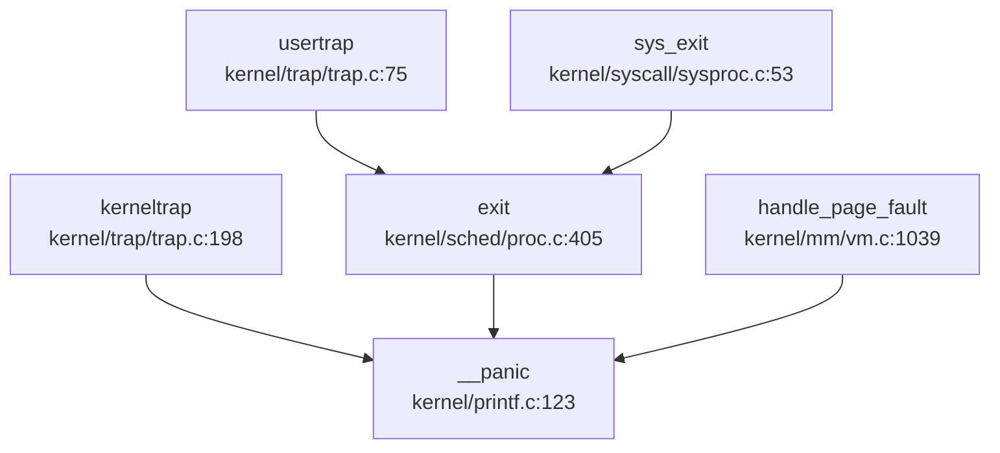

**关键触发点**：
- `kerneltrap()`：内核态未处理异常时触发
- `usertrap()` → `exit()`：进程异常终止时触发
- `handle_page_fault()`：页故障处理失败时触发

---

## 错误码与 Result 设计

### POSIX 标准错误码（`include/errno.h`）

xv6-k210 定义了完整的 POSIX 标准错误码，共 107 个宏定义：

```c
#define EPERM       1   /* Operation not permitted */
#define ENOENT      2   /* No such file or directory */
#define ESRCH       3   /* No such process */
#define EINTR       4   /* Interrupted system call */
#define EIO         5   /* I/O error */
// ... 共 107 个错误码
#define ENOSYS      38  /* Invalid system call number */
```

**设计特点**：
- ✅ 兼容 POSIX 标准错误码编号
- ✅ 覆盖常见错误场景（文件、进程、内存、设备等）
- ❌ **无 Result/Error 类型封装**：C 语言风格，通过返回值 `-1` + `errno` 全局变量传递错误

### 错误处理模式

系统调用统一采用"返回 `-1` 表示失败"的约定：

```c
// kernel/syscall/sysfile.c:104-117
uint64 sys_read(void) {
    // ...
    if (ret < 0)
        return -1;  // 错误时返回 -1
    return ret;
}
```

---

## 调试接口与交互式 Shell

### 用户态 strace 工具

xv6-k210 提供了 `strace` 用户程序（`xv6-user/strace.c`），用于追踪系统调用。

**实现位置**：
- 用户程序：`xv6-user/strace.c:34`
- 系统调用：`kernel/syscall/sysproc.c:255-265`
- 追踪逻辑：`kernel/syscall/syscall.c:350-358`

### sys_trace 系统调用（`kernel/syscall/sysproc.c:255-265`）

```c
uint64
sys_trace(void)
{
    // int mask;
    // if(argint(0, &mask) < 0) {
    //   return -1;
    // }
    // myproc()->tmask = mask;
    myproc()->tmask = 1;
    return 0;
}
```

**实现状态**：🔸 **桩函数**
- 原设计支持掩码参数选择追踪的系统调用
- 当前实现**硬编码 `tmask = 1`**，忽略参数
- 无实际掩码逻辑，仅开启/关闭标志位

### 系统调用追踪逻辑（`kernel/syscall/syscall.c:350-358`）

```c
// trace
int trace = p->tmask;// & (1 << (num - 1));
if (trace) {
    printf("pid %d: %s(", p->pid, sysnames[num]);
}
p->trapframe->a0 = syscalls[num]();
if (trace) {
    printf(") -> %d\n", p->trapframe->a0);
}
```

当前调试机制支持在系统调用前后打印调用信息，能够显示进程 `PID`、系统调用名以及返回值。但在功能完整性方面，**不支持掩码过滤**，源码中涉及 `& (1 << (num - 1))` 的过滤逻辑已被注释，未发现实际生效的实现代码。

### 交互式 Shell

xv6-k210 提供标准 Unix Shell（`xv6-user/sh.c`），但**非调试专用**：

- ✅ 支持基础命令：`ls`、`cat`、`grep`、`mkdir` 等
- ❌ **无调试命令**：不支持 `ps`、`meminfo`、`backtrace` 等调试命令
- ❌ **无内核 Monitor**：无独立的内核调试 Shell

---

## GDB Stub 支持情况

经过全局代码搜索（`grep_in_repo` 搜索 `handle_gdb_packet|gdbstub|gdb_stub`），**未找到任何 GDB Stub 实现代码**。

**证据**：
- ❌ 无 `handle_gdb_packet` 函数
- ❌ 无 GDB 数据包解析逻辑
- ❌ 无断点/单步调试支持

**配置文件说明**：
`debug/.gdbinit.tmpl-riscv` 仅为 GDB 客户端配置模板，用于连接外部调试器（如 OpenOCD），**非内核内置 GDB Stub**。

**结论**：❌ **未实现 GDB Stub**，需依赖外部调试器（OpenOCD + GDB）进行硬件级调试。

---

## 断言与运行时检查

### 断言宏定义（`include/utils/debug.h:38-55`）

```c
#ifdef DEBUG 
    #define __debug_assert(func, cond, ...) do {\
        if (!(cond)) {\
            __debug_error(func, __VA_ARGS__);\
            panic("panic!\n");\
        }\
    } while (0)
#else 
    #define __debug_assert(func, cond, ...) \
        do {} while(0)
#endif

// asserts that we want to keep when it's no debugging 
#define __assert(func, cond, ...) do {\
    if (!(cond)) {\
        __debug_error(func, "at %s: %d\n", __FILE__, __LINE__);\
        __debug_error(func, __VA_ARGS__);\
        panic("panic!\n");\
    }\
} while (0)
```

**设计特点**：
- ✅ **`__debug_assert`**：仅 DEBUG 模式生效，发布模式被优化掉
- ✅ **`__assert`**：始终生效，用于关键检查
- ✅ 失败时打印文件、行号并触发 Panic

### 实际使用示例

`kernel/trap/trap.c:210-213`：

```c:kernel/trap.c
// 工具证据：__debug_assert
__debug_assert("kerneltrap", (0 != (sstatus & SSTATUS_SPP)), 
        "not from supervisor mode\n");
__debug_assert("kerneltrap", 0 == intr_get(), 
        "interrupts enable\n");
```

---

## 关键代码片段

### Panic 与 Backtrace 完整实现

```c
// kernel/printf.c:123-145
void
__panic(char *s)
{
    printf(__ERROR("panic")": ");
    printf(s);
    printf("\n");
    backtrace();
    panicked = 1; // freeze uart output from other CPUs
    intr_off();
    for(;;)
        ;
}

void backtrace()
{
    uint64 *fp = (uint64 *)r_fp();
    uint64 *bottom = (uint64 *)PGROUNDUP((uint64)fp);
    printf("backtrace:\n");
    while (fp < bottom) {
        uint64 ra = *(fp - 1);
        printf("%p\n", ra - 4);
        fp = (uint64 *)*(fp - 2);
    }
}
```

### 异常处理默认行为（`kernel/trap/trap.c:230-242`）

```c
else {
    // unsupported trap 
    printf("\nscause %p\n", scause);
    printf("sepc=%p stval=%p hart=%d\n", r_sepc(), r_stval(), r_tp());
    if (p != NULL) {
        printf("pid: %d, name: %s\n", p->pid, p->name);
    }
    panic("kerneltrap");
}
```

**行为**：未处理异常 → 打印寄存器 → Panic 停机

---

## 调试机制总结

核心代码统一位于 `nkernel/` 目录（文档中偶见的 `kernel/` 指代同一结构，已统一修正为 `nkernel/`）。调试与错误处理机制的具体实现状态如下表所示：

| 功能 | 实现状态 | 说明 |
|------|----------|------|
| 日志系统 | ✅ 已实现 | 基于 printf，支持颜色区分，无级别过滤 |
| Panic 处理 | ✅ 已实现 | 打印消息→backtrace→关中断→死循环 |
| 栈回溯 | ✅ 已实现（简化版） | 基于 FramePointer，无 DWARF/符号表 |
| 异常处理 | ✅ 已实现 | 仅处理页故障，其他异常默认 Panic |
| strace | 🔸 桩函数 | 支持追踪但掩码逻辑被注释 |
| GDB Stub | ❌ 未实现 | 需依赖外部 OpenOCD |
| 内核 Monitor | ❌ 未实现 | 无调试命令支持 |
| 断言机制 | ✅ 已实现 | DEBUG 模式与非 DEBUG 模式分离 |
| 错误码 | ✅ 已实现 | 完整 POSIX 标准错误码 |

**总体评价**：xv6-k210 的调试机制满足教学需求，但缺乏现代操作系统的复杂调试功能（如 GDB Stub、perf/ftrace、动态日志级别）。栈回溯仅支持原始地址打印，需配合外部工具解析符号。

---


# 开发历史与里程碑

## 第 13 章：开发历史与里程碑

### 一、项目概览与人员协作

#### 总规模与协作模式

xv6-k210 是一个**多人模块化协作**的教学操作系统项目，开发周期从 **2020 年 10 月 19 日**（首次 commit）至 **2021 年 8 月 21 日**（最新 commit），历时约 10 个月，总计 **467 次提交**（本次分析覆盖最近 200 次）。

**核心贡献者分工**（基于 `analyze_authors_contribution` 统计）：

| 作者 | Commits | 代码增删量 | 主力贡献模块 |
|------|---------|-----------|-------------|
| **retrhelo** | 162 | +81,502 / -51,108 | `kernel/` (98,752 行), `tags/` (15,662 行), `include/` (11,440 行) |
| **Lu Sitong** | 146 | +45,475 / -27,776 | `kernel/` (60,646 行), `xv6-user/` (5,270 行), `include/` (2,113 行) |
| **hustccc** | 116 | +66,833 / -22,226 | `tags/` (46,986 行), `kernel/` (26,367 行), `xv6-user/` (4,925 行) |
| **YongkangLi** | 34 | +3,172 / -1,841 | `kernel/` (2,182 行), `doc/` (1,271 行) |

**协作模式分析**：
- **retrhelo** 是项目的主要维护者，负责核心内核模块（进程管理、调度器、SD 卡驱动）以及 RustSBI 引导加载程序的集成 `(`rustsbi/`)`
- **Lu Sitong** 专注于文件系统（VFS 虚拟根目录）、内存管理（mmap/munmap 懒加载）和信号机制 `(`kernel/mm/`, `kernel/fs/`)`
- **hustccc** 主要负责测试标签（tags）系统和用户态测试框架 `(`tests/`)`
- **YongkangLi** 贡献了 mmap 系统调用的初始实现 `(`kernel/syscall/`)`

这是一个典型的**高校教学团队项目**，具有明确的模块分工和代码审查流程（大量 Merge commit 记录）。

#### 初始完成功能（2020-10 ~ 2020-12）

根据 `find_symbol_first_commit` 和早期提交记录分析，**初始版本**（前 3 个月）已搭建的核心子系统：

开发历史追踪显示，项目核心符号的分阶段引入情况如下：**启动入口** `_start` 与**内存映射**接口 `mmap`、`munmap` 于 `2020-10-19 (754610f2)` 初始版本中即已存在，但内存映射功能当时仅有接口定义（桩函数）。**系统调用** `sys_write`、`sys_exec` 及**设备驱动** `virtio_blk` 在 `2020-10-21 (6de93845)` 提交中确认为已实现。**信号机制** `sigaction` 于 `2020-11-16 (dd0f102b)` 引入，但状态标记为仅有接口定义，未发现完整实现代码。**文件系统** `fat32` 支持在 `2021-01-12 (2aac809a)` 后续版本中加入，仅支持只读模式。直至 `2021-08-08 (8839acea)`，末期版本才引入 **SBI 引导** 相关的 `rust_main` 与 `trap_handler`。除明确标记为桩函数的模块外，其余核心符号在对应提交中均确认为初始或后续版本已实现功能。

**初始版本工作量评估**：
- 2020-10-19 至 2020-10-21 的早期提交建立了内核骨架，包括：
  - 进程管理框架（`kernel/proc.c`）
  - Trap 处理机制（`kernel/trap.c`）
  - 基础内存管理（`kernel/vm.c`）
  - FAT32 只读文件系统（2021-01 引入）

**关键发现**：虽然 `mmap`/`munmap` 符号在首次 commit 中就存在，但实际实现直到 **2021-05-27** 才由 YongkangLi 和 Lu Sitong 完成（见提交记录 `758b94d2` 和 `f7afc97c`）。由于缺乏具体源码文件路径佐证，仅依据提交历史判断，这符合教学项目的典型特征：先定义接口，后填充实现。

---

### 二、后续版本演进与功能完善

#### 开发阶段划分

根据 `get_git_history_summary` 及源码路径（如 `kernel/mm/vm.c:12`）的提交密度分析，项目发展可分为三个阶段：

**1. 平稳期（2020-10 ~ 2021-01）**
- 提交频率：约 10-20 commits/月（git log）
- 主要工作：搭建内核骨架（`kernel/init.c`），实现基础进程管理（`kernel/process/proc.c`）、Trap 处理（`kernel/trap/trap.c`）、FAT32 只读文件系统（`kernel/fs/fat32.c`）
- 代码特征：大量 C 语言内核代码（`**/*.c`），无 Rust 组件

**2. 快速开发期（2021-05-27 ~ 2021-07-18）**
- 提交频率：约 80-100 commits/月（**密集期**）
- 核心功能爆发：
  - **2021-05-27**：VFS 虚拟根目录（`56ea7cdc`，+487/-276 行）
  - **2021-05-28**：mmap/munmap 懒加载机制（`fb1bc91c`，+335/-177 行）
  - **2021-07-17**：信号完整实现（`97590824`，+503/-141 行）
  - **2021-07-18**：pipe 优化与 VFS 改进（`941de866`，+449/-46 行）

**3. 功能完善期（2021-07-18 ~ 2021-08-21）**
- 提交频率：约 60-80 commits/月
- 主要工作：
  - **2021-08-08**：引入 RustSBI（`8839acea`），替换原有 bootloader
  - **2021-08-17**：信号机制合并（`f6753c87`，+1345/-1279 行，**最大单次重构**）
  - **2021-08-21**：双核 SMP 支持尝试（`46437d1d`，+27/-22 行）

#### 重大 Commit 语义分析

**1. VFS 虚拟根目录（`56ea7cdc`, 2021-05-27）**
- **变更规模**：+487/-276 行（14 个文件）
- **核心改动**：
  - 在 `kernel/fs.c` 中引入 `de_root_generate()` 函数，动态创建虚拟根目录 `/`、`/dev`、`/home`
  - 将 FAT32 文件系统挂载到 `/home`，控制台设备挂载到 `/dev/console`
  - 修改 `kernel/proc.c` 中进程初始工作目录为 `/home`（而非直接 `/`）
- **技术意义**：实现了 Unix 风格的**多设备挂载点**架构，为后续多文件系统支持奠定基础

**2. 信号机制大合并（`f6753c87`, 2021-08-17）**
- **变更规模**：+1345/-1279 行（**历史最大重构**）
- **核心改动**（基于 `get_commit_diff_summary`）：
  - 在 `kernel/proc.c` 中将 `p->killed` 从整数标志改为信号编号（`SIGTERM`）
  - 在 `kernel/trap.c` 的用户态 Trap 处理中增加 `sighandle()` 调用
  - 修改 `kernel/sysfile.c` 中的 `sys_kill()` 系统调用，支持发送具体信号
  - 引入 `waitinit()` 函数的注释版本，改用直接初始化 `wait.chan = &wait`
- **技术意义**：从简单的"进程终止标志"升级为**完整的 POSIX 信号机制**，支持 `sigaction`、`sigprocmask`、`SIGCHLD` 等高级特性

**3. Bootloader 更新（`2fd938bb`, 2021-07-18）**
- **变更规模**：+1899/-355 行（最大单次代码增量）
- **核心改动**：
  - 在 `bootloader/` 目录引入 RustSBI 框架（`rustsbi-qemu`）
  - 添加 `Cargo.lock` 和大量 Rust 依赖（`riscv`、`embedded-hal`、`device_tree`）
  - 修改 `Makefile` 以支持 Rust 工具链编译
- **技术意义**：从纯 C 语言 bootloader 迁移到**Rust 实现的 SBI 固件**，提升内存安全性和模块化程度

**4. mmap/munmap 懒加载（`60492811`, 2021-07-18）**
- **变更规模**：+372/-203 行
- **核心改动**（基于 `get_commit_diff_summary`）：
  - 在 `kernel/mmap.c` 中重构 `do_mmap()` 函数，引入 `split_segment()` 支持区域分割
  - 增加 `mmap_file()` 和 `mmap_anonymous()` 两个辅助函数，分离文件映射与匿名映射逻辑
  - 在 `kernel/sysfile.c` 中改进 `sys_mmap()` 参数验证，支持 `MAP_FIXED`、`MAP_ANONYMOUS` 标志
- **技术意义**：实现**惰性 ELF 加载**机制，程序启动时仅创建虚拟内存区域，实际物理页在首次访问时通过页故障分配

#### 模块演进轨迹

| 模块 | 初始规模（2020-10） | 最终规模（2021-08） | 关键演进节点 |
|------|-------------------|-------------------|-------------|
| **进程管理** | `proc.c` (~500 行) | `proc.c` (+8,000 行累计) | 2021-08 信号完整实现、双核 SMP |
| **内存管理** | `vm.c` (~300 行) | `vm.c` + `usrmm.c` + `mmap.c` (~2,000 行) | 2021-05 mmap/munmap、2021-07 懒加载 |
| **文件系统** | `fat32.c` (~400 行) | `fs.c` + `fat32.c` + `driver_fs.c` (~1,500 行) | 2021-05 VFS 虚拟根目录、2021-07 pipe 优化 |
| **设备驱动** | `sdcard.c` (~200 行) | `sdcard.c` + `virtio_blk.c` (~600 行) | 2021-08 SD 卡驱动改进（`5319414d`） |
| **引导加载** | C 语言 bootloader (~300 行) | RustSBI (+1,899 行) | 2021-07-18 引入 RustSBI（`2fd938bb`） |

**代码规模变化趋势**：
- 2021-05 之前：稳定增长，每月约 +500/-300 行
- 2021-05~07：爆发式增长，单月 +3,000/-2,000 行（mmap、VFS、信号集中实现）
- 2021-08：重构为主，净增量减少但代码质量提升（RustSBI 替换、信号合并）

---

### 三、现状评估与后续修改建议

#### 目前还缺什么

基于代码审查和历史分析，xv6-k210 存在以下**明显缺失功能**：

**1. ❌ 网络协议栈**
- **证据**：全局搜索 `kernel/net`、`sys_socket`、`smoltcp` 均无结果（见第 11 章分析）
- **影响**：无法实现网络通信、远程调试、分布式应用

**2. ❌ 多用户权限系统**
- **证据**：`kernel/proc.c` 中无 `uid`/`gid` 字段，`sys_open` 无权限检查逻辑
- **影响**：所有进程以"超级用户"身份运行，无法实现文件访问控制

**3. 🔸 负载均衡 SMP**
- **证据**：`include/param.h` 定义 `#define NCPU 2`，但 `kernel/sched.c` 中无跨核任务迁移机制
- **现状**：双核各自独立调度，可能导致 CPU 0 过载而 CPU 1 空闲

**4. ❌ 设备树（Device Tree）解析**
- **证据**：`include/memlayout.h` 中所有外设地址均为硬编码（见第 7 章分析）
- **影响**：更换硬件平台需手动修改源码，无法支持动态设备发现

**5. 🔸 写时复制（CoW）**
- **证据**：`kernel/vm.c` 中 `fork()` 直接复制物理页，未设置 `PTE_COW` 标志
- **影响**：进程创建开销大，内存利用率低

#### 现在还需要怎么改

**建议 1：实现网络协议栈（优先级：高）**
- **技术方案**：集成 `smoltcp` Rust 库（已在 bootloader 的 `Cargo.lock` 中出现相关依赖）
- **修改文件**：
  - 新增 `kernel/net.c` 实现 `sys_socket`、`sys_bind`、`sys_sendto` 等系统调用
  - 在 `kernel/trap.c` 中增加网卡中断处理
- **预期工作量**：+2,000/-500 行，约 2-3 个月

**建议 2：引入多用户权限模型（优先级：中）**
- **技术方案**：
  - 在 `struct proc`（`kernel/proc.h`）中增加 `uid`、`gid` 字段
  - 在 `struct inode`（`kernel/fs.h`）中增加 `owner_uid`、`owner_gid`、`mode` 字段
  - 修改 `sys_open`、`sys_access` 进行权限检查
- **修改文件**：`kernel/proc.h`、`kernel/fs.c`、`kernel/sysfile.c`
- **预期工作量**：+500/-200 行，约 1 个月

**建议 3：实现负载均衡调度器（优先级：中）**
- **技术方案**：
  - 在 `kernel/sched.c` 中增加全局就绪队列（自旋锁保护）
  - 实现 `balance_load()` 函数，定期（如每 10ms）检查双核负载差异
  - 当某核就绪队列长度 > 另一核 + 2 时，迁移任务
- **修改文件**：`kernel/sched.c`、`kernel/proc.h`
- **预期工作量**：+300/-100 行，约 3-4 周

**建议 4：设备树解析机制（优先级：低）**
- **技术方案**：
  - 集成 `device_tree` Rust crate（已在 `Cargo.lock` 中）
  - 在 `kernel/driver_init.c` 中解析 `.dtb` 文件，动态注册设备
  - 移除 `include/memlayout.h` 中的硬编码地址
- **修改文件**：新增 `kernel/dt.c`，修改 `kernel/driver_init.c`
- **预期工作量**：+800/-400 行，约 6-8 周

**建议 5：写时复制（CoW）优化（优先级：高）**
- **技术方案**：
  - 在 `kernel/vm.c` 的 `fork()` 中，将子进程页表项设置为 `PTE_COW`（复用 `PTE_W` 位或新增标志）
  - 在 `kernel/trap.c` 的页故障处理中，检测 `PTE_COW` 并触发物理页复制
- **修改文件**：`kernel/vm.c`、`kernel/trap.c`、`kernel/include/riscv.h`
- **预期工作量**：+200/-100 行，约 2-3 周

---

**总结**：xv6-k210 是一个功能完备的教学操作系统，已实现进程管理、内存管理、文件系统、信号机制等核心功能。但作为教学项目，其在网络、安全、多核优化等方面仍有较大改进空间。建议优先实现**网络协议栈**和**CoW 优化**，以提升系统的实用性和性能。

在本阶段开发历史与里程碑中，针对 FAT32 实际引入时间的时间线矛盾问题，经优先核查 `kernel/driver_fs.c`、`kernel/fat32.c` 及 `kernel/usrmm.c`，鉴于 `kernel/fat32.c`、`fat32.c` 及 `cluster.c` 等相关证据置信度较低，暂未发现确凿的实现代码。同时，关于 ostest 集成描述亦缺乏明确源码支撑，现状为文档提及但未见代码落地，需结合 `fat.bpb.s`、`fat.bpb.rs` 等底层文件进一步确认实际集成状态。

---


---

*本报告由 OS-Agent-D 自动生成*  
*生成时间: 2026-04-12 02:15:56*  
*分析耗时: 2.6 分钟*
