# xv6-k210 操作系统技术分析报告

> **仓库地址**: https://gitlab.eduxiji.net/retrhelo/xv6-k210
> **分析日期**: 2026年03月14日
> **分析工具**: OS-Agent-D

---

## 仓库目录文件结构

```bash
xv6-k210/
├── bootloader/
│   └── SBI/
│       ├── rustsbi-k210/
│       │   ├── .cargo/
│       │   │   └── config.toml (7L, 143B)
│       │   ├── src/
│       │   │   ├── console.rs (1L, 32B)
│       │   │   ├── main.back.rs (556L, 18.9KB)
│       │   │   ├── main.rs (583L, 19.8KB)
│       │   │   └── serial.rs (106L, 2.3KB)
│       │   ├── Cargo.toml (18L, 572B)
│       │   ├── README.md (4L, 277B)
│       │   ├── build.rs (19L, 615B)
│       │   ├── justfile (500B)
│       │   ├── kendryte-k210.dtsi (3.5KB)
│       │   ├── link-k210.ld (2.3KB)
│       │   └── rust-toolchain (18B)
│       ├── rustsbi-qemu/
│       │   ├── .cargo/
│       │   │   └── config.toml (7L, 143B)
│       │   ├── src/
│       │   │   ├── hal/
│       │   │   │   ├── clint.rs (66L, 1.8KB)
│       │   │   │   └── ns16550a.rs (93L, 2.9KB)
│       │   │   ├── hal.rs (40L, 1.2KB)
│       │   │   └── main.rs (486L, 14.5KB)
│       │   ├── Cargo.lock (5.4KB)
│       │   ├── Cargo.toml (18L, 572B)
│       │   ├── README.md (4L, 259B)
│       │   ├── build.rs (18L, 535B)
│       │   ├── justfile (676B)
│       │   ├── link-qemu.ld (2.3KB)
│       │   └── rust-toolchain (18B)
│       ├── sbi-k210 (1.8MB)
│       └── sbi-qemu (1.8MB)
├── debug/
│   ├── kendryte_openocd/
│   │   └── openocd (12.5MB)
│   ├── openocd_cfg/
│   │   ├── ft2232c.cfg (176B)
│   │   ├── k210.cfg (362B)
│   │   └── openocd_ftdi.cfg (791B)
│   └── .gdbinit.tmpl-riscv (135B)
├── doc/
│   ├── img/
│   │   ├── backtrace.png (74.4KB)
│   │   ├── boot.jpg (42.7KB)
│   │   ├── diskio.png (40.5KB)
│   │   ├── mem_map.jpg (83.0KB)
│   │   ├── proc.jpg (34.8KB)
│   │   ├── ptview.png (39.8KB)
│   │   ├── run-k210.png (222.2KB)
│   │   ├── s_extern_interrupt.png (3.3MB)
│   │   ├── sd_spi_cmd13_response.png (96.1KB)
│   │   ├── sd_spi_cmd_format.png (45.1KB)
│   │   ├── sd_spi_init.png (220.0KB)
│   │   ├── sd_spi_ocr.png (150.5KB)
│   │   ├── sd_spi_read_single_block.png (46.8KB)
│   │   ├── sd_spi_write_single_block.png (57.7KB)
│   │   ├── sdcard.png (3.1MB)
│   │   ├── strace.png (29.3KB)
│   │   ├── syscall_test.png (32.8KB)
│   │   ├── timer_interrupt.png (230.6KB)
│   │   ├── vamap.png (18.3KB)
│   │   ├── xv6-k210_on_k210.gif (3.6MB)
│   │   ├── xv6-k210_on_qemu.gif (4.8MB)
│   │   ├── xv6-k210_run.gif (3.1MB)
│   │   └── xv6_k210_run_proc.png (382.4KB)
│   ├── report_2020_12_26.md (285L, 10.5KB)
│   ├── rustsbi.md (61L, 3.4KB)
│   ├── xv6-k210-report-车春池.md (282L, 9.3KB)
│   ├── 内核原理-内存管理.md (70L, 12.5KB)
│   ├── 内核原理-系统调用.md (55L, 4.1KB)
│   ├── 内核原理-进程管理.md (8L, 831B)
│   ├── 内核设计-IO策略.md (143L, 10.7KB)
│   ├── 内核设计-内存分配器.md (60L, 5.9KB)
│   ├── 内核设计-内存映射.md (111L, 14.8KB)
│   ├── 内核设计-文件系统v2.md (321L, 21.3KB)
│   ├── 内核设计-页表映射.md (246L, 15.7KB)
│   ├── 总言.md (129L, 7.5KB)
│   ├── 构建调试-SD卡驱动.md (48L, 4.0KB)
│   ├── 构建调试-SD卡驱动v2.md (60L, 7.9KB)
│   ├── 构建调试-外部中断.md (116L, 6.6KB)
│   ├── 构建调试-外部中断v2.md (208L, 14.6KB)
│   ├── 构建调试-应用支持.md (71L, 6.5KB)
│   ├── 构建调试-开机启动.md (169L, 5.9KB)
│   ├── 构建调试-文件系统.md (23L, 1.9KB)
│   ├── 构建调试-时钟中断.md (276L, 10.1KB)
│   ├── 构建调试-浮点操作.md (90L, 6.4KB)
│   ├── 构建调试-系统调用.md (169L, 8.1KB)
│   ├── 构建调试-系统调用v2.md (68L, 5.0KB)
│   ├── 构建调试-调试指南.md (78L, 4.1KB)
│   ├── 构建调试-进程管理.md (69L, 12.5KB)
│   ├── 用户使用-内存管理.md (52L, 12.4KB)
│   ├── 用户使用-文件系统.md (34L, 1.6KB)
│   └── 用户使用-系统调用.md (95L, 3.2KB)
├── include/
│   ├── fs/
│   │   ├── buf.h (45L, 1.1KB)
│   │   ├── fcntl.h (21L, 392B)
│   │   ├── file.h (67L, 1.7KB)
│   │   ├── fs.h (187L, 5.2KB)
│   │   ├── pipe.h (38L, 1.1KB)
│   │   ├── poll.h (89L, 2.0KB)
│   │   └── stat.h (90L, 2.1KB)
│   ├── hal/
│   │   ├── disk.h (14L, 299B)
│   │   ├── dmac.example.h (1539L, 45.7KB)
│   │   ├── dmac.h (1541L, 45.8KB)
│   │   ├── fpioa.h (1036L, 51.7KB)
│   │   ├── gpiohs.h (278L, 7.7KB)
│   │   ├── plic.back.h (500L, 21.9KB)
│   │   ├── plic.h (101L, 5.8KB)
│   │   ├── riscv.h (457L, 9.0KB)
│   │   ├── sdcard.h (20L, 429B)
│   │   ├── spi.h (504L, 18.5KB)
│   │   ├── sysctl.h (1077L, 28.6KB)
│   │   └── virtio.h (110L, 3.8KB)
│   ├── mm/
│   │   ├── kmalloc.h (32L, 506B)
│   │   ├── mmap.h (68L, 1.7KB)
│   │   ├── pm.h (39L, 775B)
│   │   ├── usrmm.h (115L, 3.5KB)
│   │   └── vm.h (83L, 3.2KB)
│   ├── sched/
│   │   ├── proc.h (185L, 4.8KB)
│   │   └── signal.h (92L, 1.9KB)
│   ├── sync/
│   │   ├── sleeplock.h (25L, 649B)
│   │   ├── spinlock.h (30L, 638B)
│   │   └── waitqueue.h (75L, 1.8KB)
│   ├── utils/
│   │   ├── debug.h (58L, 1.5KB)
│   │   ├── dlist.h (63L, 1.4KB)
│   │   ├── list.h (43L, 1.2KB)
│   │   ├── rbtree.h (170L, 5.2KB)
│   │   ├── string.h (18L, 666B)
│   │   └── utils.h (341L, 11.7KB)
│   ├── console.h (8L, 128B)
│   ├── elf.h (96L, 2.8KB)
│   ├── errno.h (107L, 4.8KB)
│   ├── intr.h (10L, 116B)
│   ├── memlayout.h (132L, 4.6KB)
│   ├── param.h (35L, 1.3KB)
│   ├── printf.h (23L, 408B)
│   ├── resource.h (30L, 543B)
│   ├── sbi.h (128L, 3.4KB)
│   ├── sprintf.h (6L, 116B)
│   ├── syscall.h (14L, 307B)
│   ├── sysinfo.h (28L, 1005B)
│   ├── sysnum.h (79L, 1.9KB)
│   ├── time.h (49L, 1016B)
│   ├── timer.h (14L, 224B)
│   ├── trap.h (103L, 2.9KB)
│   ├── types.h (46L, 1.3KB)
│   └── uname.h (26L, 644B)
├── kernel/
│   ├── fs/
│   │   ├── fat32/
│   │   │   ├── cluster.c (319L, 8.8KB)
│   │   │   ├── dirent.c (490L, 14.2KB)
│   │   │   ├── fat.c (394L, 11.8KB)
│   │   │   ├── fat32.c (589L, 15.7KB)
│   │   │   └── fat32.h (175L, 5.3KB)
│   │   ├── bio.c (300L, 7.5KB)
│   │   ├── blkdev.c (265L, 5.9KB)
│   │   ├── file.c (584L, 12.0KB)
│   │   ├── fs.c (660L, 14.6KB)
│   │   ├── mount.c (222L, 5.6KB)
│   │   ├── pipe.c (476L, 10.7KB)
│   │   ├── poll.c (243L, 5.6KB)
│   │   └── rootfs.c (313L, 8.1KB)
│   ├── hal/
│   │   ├── disk.c (173L, 3.3KB)
│   │   ├── dmac.c (425L, 11.9KB)
│   │   ├── fpioa.c (4947L, 83.7KB)
│   │   ├── gpiohs.c (204L, 5.7KB)
│   │   ├── plic.c (90L, 2.5KB)
│   │   ├── sdcard.c (1076L, 25.2KB)
│   │   ├── spi.c (726L, 19.8KB)
│   │   ├── sysctl.c (328L, 7.6KB)
│   │   └── virtio_disk.c (505L, 13.2KB)
│   ├── mm/
│   │   ├── kmalloc.c (338L, 9.3KB)
│   │   ├── mmap.c (1159L, 26.8KB)
│   │   ├── pm.c (296L, 6.0KB)
│   │   ├── usrmm.c (233L, 5.9KB)
│   │   └── vm.c (1105L, 27.8KB)
│   ├── sched/
│   │   ├── proc.c (1086L, 30.4KB)
│   │   ├── signal.c (283L, 6.7KB)
│   │   └── swtch.S (41L, 679B)
│   ├── sync/
│   │   ├── sleeplock.c (66L, 1.0KB)
│   │   └── spinlock.c (84L, 2.1KB)
│   ├── syscall/
│   │   ├── syscall.c (403L, 10.2KB)
│   │   ├── sysfile.c (1028L, 20.0KB)
│   │   ├── sysmem.c (150L, 2.6KB)
│   │   ├── sysproc.c (316L, 5.8KB)
│   │   ├── syssignal.c (142L, 3.0KB)
│   │   ├── systime.c (145L, 2.9KB)
│   │   └── sysuname.c (18L, 263B)
│   ├── trap/
│   │   ├── fcntxt (300B)
│   │   ├── fcntxt.S (95L, 1.6KB)
│   │   ├── kernelvec.S (86L, 1.5KB)
│   │   ├── sig_trampoline.S (25L, 514B)
│   │   ├── trampoline.S (147L, 3.0KB)
│   │   └── trap.c (413L, 12.5KB)
│   ├── utils/
│   │   ├── list.c (58L, 1.1KB)
│   │   ├── rbtree.c (461L, 10.3KB)
│   │   ├── string.c (171L, 2.5KB)
│   │   └── utils.c (28L, 673B)
│   ├── console.c (331L, 7.0KB)
│   ├── entry.S (21L, 306B)
│   ├── entry_k210.S (22L, 331B)
│   ├── entry_qemu.S (19L, 275B)
│   ├── exec.c (316L, 8.7KB)
│   ├── intr.c (41L, 940B)
│   ├── logo.c (31L, 1.8KB)
│   ├── main.c (98L, 2.4KB)
│   ├── printf.c (152L, 2.4KB)
│   ├── sprintf.c (170L, 3.1KB)
│   ├── timer.c (66L, 1.5KB)
│   ├── uname.c (68L, 1.7KB)
│   └── xv6-riscv-license (1.2KB)
├── linker/
│   ├── k210.ld (1003B)
│   ├── linker64.ld (1.3KB)
│   ├── qemu.ld (1003B)
│   └── user.ld (432B)
├── sbi/
│   ├── psicasbi/
│   ├── sbi-k210 (1.7MB)
│   └── sbi-qemu (1.6MB)
├── tools/
│   ├── flash-list.json (233B)
│   └── kflash.py (1452L, 179.4KB)
├── xv6-user/
│   ├── cat.c (43L, 643B)
│   ├── cowtest.c (199L, 3.6KB)
│   ├── crt.c (16L, 326B)
│   ├── dup3.c (37L, 961B)
│   ├── echo.c (19L, 299B)
│   ├── find.c (69L, 1.6KB)
│   ├── forktest.c (56L, 792B)
│   ├── grep.c (105L, 2.0KB)
│   ├── grind.c (362L, 8.1KB)
│   ├── info.c (18L, 464B)
│   ├── init.c (53L, 1.1KB)
│   ├── initcode.S (28L, 450B)
│   ├── kill.c (17L, 264B)
│   ├── lazytests.c (153L, 2.9KB)
│   ├── ls.c (97L, 1.8KB)
│   ├── mkdir.c (23L, 357B)
│   ├── mmaptests.c (563L, 14.1KB)
│   ├── mount.c (15L, 323B)
│   ├── mv.c (50L, 1.4KB)
│   ├── ostest.c (70L, 1.1KB)
│   ├── ostest2 (592B)
│   ├── ostest2.c (40L, 501B)
│   ├── ostest2.out (6.6KB)
│   ├── ostest_asm.S (37L, 369B)
│   ├── printf.c (146L, 2.5KB)
│   ├── rm.c (23L, 361B)
│   ├── rmdir.c (20L, 300B)
│   ├── sh.c (661L, 12.0KB)
│   ├── shrc (30B)
│   ├── signal_test.c (34L, 566B)
│   ├── sleep.c (19L, 391B)
│   ├── strace.c (68L, 1.3KB)
│   ├── stressfs.c (48L, 1.0KB)
│   ├── sync.c (7L, 65B)
│   ├── test.c (28L, 579B)
│   ├── ulib.c (152L, 2.0KB)
│   ├── umalloc.c (90L, 1.7KB)
│   ├── umount.c (15L, 278B)
│   ├── user.h (111L, 3.4KB)
│   ├── usertests.c (2765L, 58.5KB)
│   ├── usys.pl (971B)
│   ├── wc.c (55L, 914B)
│   ├── xargs.c (62L, 1.5KB)
│   ├── xargstest.sh (99B)
│   └── xv6-riscv-license (1.2KB)
├── .gitignore (149B)
├── .gitmodules (91B)
├── LICENSE (1.1KB)
├── Makefile (7.0KB)
├── README (2.1KB)
├── README.md (123L, 4.1KB)
└── README_cn.md (121L, 4.4KB)

根目录文档: README, README.md, README_cn.md

📊 统计: 36 个目录, 257 个文件 (深度限制: 10 层)
```

---

# 第 14 章：执行摘要与总结评价

## 1. 执行摘要（Executive Summary）

**项目定位**：xv6-k210 是基于 MIT xv6-riscv 操作系统移植到 **Kendryte K210 RISC-V 开发板** 的教学/实验型操作系统，由 HUST-OS 团队开发。项目采用**宏内核（Monolithic Kernel）架构**，所有核心模块（进程管理、内存管理、文件系统、设备驱动）均运行在 RISC-V S-Mode（监督态），通过函数调用直接交互。

**技术栈概览**：
| 维度 | 技术选型 |
|------|---------|
| **编程语言** | C（内核主体 87 个文件）、Rust（SBI 固件 10 个文件）、RISC-V 汇编（启动/上下文切换） |
| **目标架构** | `riscv64gc-unknown-none-elf`（RV64IMAFDC，支持浮点/原子/压缩指令） |
| **支持平台** | K210 硬件（SD 卡 + UARTHS）、QEMU 仿真（VirtIO-Blk + NS16550A） |
| **构建系统** | GNU Make + Cargo（混合构建） |
| **分页方案** | RISC-V Sv39（39 位虚拟地址，三级页表） |

**实现完成度评估**：
- **✅ 闭环模块**：物理内存管理、虚拟内存（含 COW/Lazy）、进程调度、信号机制、VFS+FAT32 文件系统、管道 IPC、80+ POSIX 系统调用、中断/异常处理、设备驱动（UART/SD 卡/VirtIO）
- **🔸 部分实现**：多核支持（IPI 机制可用但无负载均衡）、权限模型（UID/GID 定义但所有进程视为 root）
- **❌ 缺失模块**：网络协议栈（无 TCP/IP、无 socket 系统调用）、System V IPC（无消息队列/信号量/共享内存）、Futex、安全机制（无 seccomp/KPTI/栈保护）

**总体评价**：xv6-k210 是一个功能相对完整的 RISC-V 教学操作系统，核心子系统（内存/进程/文件系统）均有扎实实现，支持在真实硬件（K210）和仿真器（QEMU）上运行。但作为教学项目，其网络、安全、多用户等生产级功能尚未实现。

---

## 2. 核心架构与机制提炼

### 2.1 内存管理架构

#### 物理内存分配器（`kernel/mm/pm.c`）

采用**双向链表空闲列表（Free List）** 算法，而非 Buddy/Slab。核心设计为**双分配器策略**：

```c
// kernel/mm/pm.c:13-19
struct pm_allocator {
    struct spinlock lock;
    struct run *freelist;  // 空闲链表头
    uint64 npage;          // 总页数
};

struct run {
    struct run *next;
    uint64 npage;  // 连续页数
};
```

- **`single` 分配器**：管理单页分配（400 页，位于 `PHYSTOP - 400*PGSIZE` 到 `PHYSTOP`）
- **`multiple` 分配器**：管理多页连续分配（剩余内存）
- **分配策略**：优先从 `single` 分配，耗尽时从 `multiple` 借用

**页面引用计数**（用于 COW）：
```c
// kernel/mm/vm.c:154-163
static uint8 page_ref_table[MAX_PAGES_NUM];  // 物理页引用计数表

void pagereg(uint64 pa, uint8 init) {
    page_ref_table[__hash_page_idx(pa)] = init ? 1 : 
        page_ref_table[__hash_page_idx(pa)] + 1;
}
```

#### 虚拟内存与页表机制（`kernel/mm/vm.c`）

使用 RISC-V **Sv39 三级页表**，页表项格式：

```c
// include/hal/riscv.h:411-420
#define PTE_V (1L << 0)  // valid
#define PTE_R (1L << 1)  // readable
#define PTE_W (1L << 2)  // writable
#define PTE_X (1L << 3)  // executable
#define PTE_U (1L << 4)  // user accessible
#define PTE_COW PTE_RSW1 // copy-on-write 标记 (bit 8)
```

**页表遍历**（`walk` 函数，`kernel/mm/vm.c:211-233`）：
```c
pte_t *walk(pagetable_t pagetable, uint64 va, int alloc) {
    for(int level = 2; level > 0; level--) {
        pte_t *pte = &pagetable[PX(level, va)];
        if(*pte & PTE_V) {
            pagetable = (pagetable_t)PTE2PA(*pte);  // 进入下一级
        } else {
            if(!alloc || (pagetable = (pde_t*)allocpage()) == NULL)
                return NULL;
            memset(pagetable, 0, PGSIZE);
            *pte = PA2PTE(pagetable) | PTE_V;
        }
    }
    return &pagetable[PX(0, va)];  // 返回叶级 PTE
}
```

**地址空间隔离**：
- **内核空间**：直接映射（虚拟地址 = 物理地址 + `VIRT_OFFSET`）
- **用户空间**：段式管理（`struct seg` 链表：LOAD/HEAP/MMAP/STACK）
- **隔离机制**：通过 `SSTATUS_PUM` 位控制内核访问用户页权限

#### 高级内存特性

| 特性 | 实现位置 | 触发机制 |
|------|---------|---------|
| **COW（写时复制）** | `kernel/mm/vm.c:975-997` | fork 时标记 `PTE_COW`，缺页时复制 |
| **Lazy Allocation** | `kernel/mm/vm.c:1002-1016` | HEAP/STACK 段缺页时动态分配 |
| **ELF 懒加载** | `kernel/mm/vm.c:1018-1037` | LOAD 段缺页时从磁盘加载 |
| **mmap** | `kernel/mm/mmap.c` | 支持匿名/文件映射，MAP_FIXED/MAP_SHARED |

### 2.2 进程调度模型

#### 进程控制块（`include/sched/proc.h`）

```c
// include/sched/proc.h:51-148
struct proc {
    int pid;                          // 进程 ID
    enum procstate state;             // RUNNABLE/RUNNING/SLEEPING/ZOMBIE
    struct context context;           // 内核上下文 (14 个寄存器)
    struct trapframe *trapframe;      // 陷阱帧 (544 字节)
    pagetable_t pagetable;            // 用户页表
    struct seg *segment;              // 内存段链表
    struct fdtable fds;               // 文件描述符表
    struct proc *parent;              // 父进程
    struct proc *child;               // 子进程链表
    ksigaction_t *sig_act;            // 信号处理动作
    __sigset_t sig_pending;           // 待处理信号集
    int killed;                       // 当前待处理信号编号
    // ...
};
```

**进程与线程统一抽象**：未区分 PCB/TCB，线程通过 `clone()` 共享地址空间实现。

#### 调度算法（`kernel/sched/proc.c`）

实现**基于优先级的时间片轮转调度**，支持 3 个优先级队列：

```c
// kernel/sched/proc.c:241-246
#define PRIORITY_TIMEOUT    0   // 超时队列 (最低优先级)
#define PRIORITY_IRQ        1   // 中断/信号唤醒队列 (高优先级)
#define PRIORITY_NORMAL     2   // 普通进程队列 (默认优先级)

struct proc *proc_runnable[PRIORITY_NUMBER];  // 3 个优先级队列
```

**调度器核心逻辑**：
```c
// kernel/sched/proc.c:671-711
void scheduler(void) {
    while (1) {
        tmp = __get_runnable_no_lock();  // 按优先级扫描队列
        if (NULL != tmp) {
            tmp->state = RUNNING;
            swtch(&c->context, &tmp->context);  // 上下文切换
        }
    }
}
```

**时间片机制**：
- 默认时间片：`TIMER_NORMAL = 10` ticks
- 时间片耗尽后降级到 `PRIORITY_TIMEOUT` 队列
- 被信号/中断唤醒的进程插入 `PRIORITY_IRQ` 队列

#### 上下文切换（`kernel/sched/swtch.S`）

保存/恢复 14 个 callee-saved 寄存器（112 字节）：
```asm
# kernel/sched/swtch.S
swtch:
    sd ra, 0(a0)    # 保存到 old context
    sd sp, 8(a0)
    sd s0-s11, 16(a0)
    
    ld ra, 0(a1)    # 从 new context 恢复
    ld sp, 8(a1)
    ld s0-s11, 16(a1)
    ret
```

### 2.3 虚拟文件系统（VFS）架构

#### 核心数据结构（`include/fs/fs.h`）

```c
// include/fs/fs.h:73-132
struct superblock {
    char type[16];              // 文件系统类型 ("FAT32")
    struct inode *dev;          // 块设备 inode
    struct dentry *root;        // 根目录项
    struct fs_op op;            // 文件系统操作集
};

struct inode {
    uint64 inum;                // inode 号
    uint16 mode;                // 文件类型 + 权限
    struct superblock *sb;      // 所属超级块
    struct inode_op *op;        // inode 操作集 (create/lookup/truncate)
    struct file_op *fop;        // 文件操作集 (read/write/readdir)
};

struct dentry {
    char filename[MAXNAME + 1];
    struct inode *inode;
    struct dentry *parent;
    struct dentry *mount;       // 挂载点重定向
};
```

#### FAT32 实现（`kernel/fs/fat32/`）

| 文件 | 行数 | 功能 |
|------|------|------|
| `fat32.c` | 589L | 初始化、inode 分配、文件读写 |
| `dirent.c` | 490L | 目录项创建/查找/删除、长文件名支持 |
| `cluster.c` | 319L | 簇分配/释放、FAT 链管理 |
| `fat.c` | 394L | FAT 表缓存、FAT 项读写 |

**FAT32 操作集**：
```c
// kernel/fs/fat32/fat32.c:21-37
struct inode_op fat32_inode_op = {
    .create = fat_alloc_entry,
    .lookup = fat_lookup_dir,
    .truncate = fat_truncate_file,
    .unlink = fat_remove_entry,
};

struct file_op fat32_file_op = {
    .read = fat_read_file,
    .write = fat_write_file,
    .readdir = fat_read_dir,
};
```

#### 管道 IPC（`kernel/fs/pipe.c`）

使用**环形缓冲区 + 等待队列**实现：
```c
// include/fs/pipe.h:12-26
struct pipe {
    struct spinlock lock;
    struct wait_queue rqueue;  // 读等待队列
    struct wait_queue wqueue;  // 写等待队列
    uint nread, nwrite;        // 环形索引
    char *pdata;               // 动态扩展数据区
    char data[PIPE_SIZE];      // 默认 512 字节
};
```

**阻塞机制**：
- 管道满时写者进入 `wqueue` 睡眠
- 管道空时读者进入 `rqueue` 睡眠
- 支持动态扩展至 16KB（`size_shift=5`）

### 2.4 Trap 处理路径

#### 用户态陷阱入口（`kernel/trap/trampoline.S`）

```asm
# kernel/trap/trampoline.S:20-60
uservec:
    csrrw a0, sscratch, a0     # 交换 a0 与 sscratch，a0 指向 trapframe
    sd ra, 40(a0)              # 保存所有用户寄存器
    # ... (保存 32 个通用寄存器 + 32 个浮点寄存器)
    ld sp, 8(a0)               # 加载内核栈指针
    ld t0, 16(a0)
    jr t0                      # 跳转到 usertrap()
```

#### 陷阱分发（`kernel/trap/trap.c`）

```c
// kernel/trap/trap.c:75-145
void usertrap(void) {
    protect_usr_mem();  // 启用用户内存保护
    
    uint64 scause = r_scause();
    if ((scause & 0x8000000000000000L) && (scause & 0xff) == 9) {
        // 外部中断
        handle_intr(scause);
    } else if (scause == 0x8) {
        // 系统调用 (ecall)
        syscall();
    } else {
        // 异常
        handle_excp(scause);
    }
    
    if (p->killed) {
        sighandle();  // 信号处理
    }
    usertrapret();  // 返回用户态
}
```

#### 系统调用分发（`kernel/syscall/syscall.c`）

采用**集中式分发表**：
```c
// kernel/syscall/syscall.c:180-293
static uint64 (*syscalls[])(void) = {
    [SYS_fork]    sys_fork,
    [SYS_exit]    sys_exit,
    [SYS_write]   sys_write,
    [SYS_read]    sys_read,
    // ... 共约 60 个系统调用
};

void syscall(void) {
    uint64 num = p->trapframe->a7;
    if (num < NELEM(syscalls) && syscalls[num]) {
        p->trapframe->a0 = syscalls[num]();
    } else {
        p->trapframe->a0 = -1;  // 未实现
    }
}
```

#### 缺页异常处理链

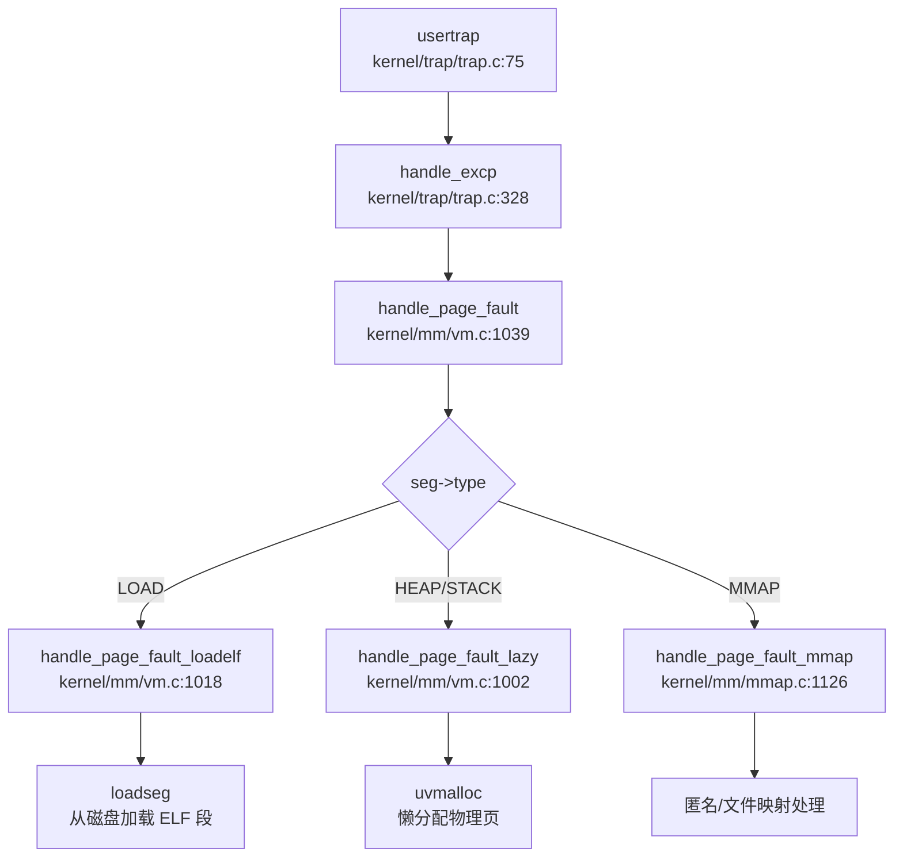

### 2.5 信号机制

**信号处理流程**：
1. `kill(pid, sig)` 设置目标进程 `sig_pending` 位图
2. 若目标进程睡眠，唤醒到 `PRIORITY_IRQ` 队列
3. 返回用户态前检查 `p->killed`
4. 通过 `sig_trampoline.S` 跳转到用户注册的处理函数
5. 处理完成后通过 `SYS_rt_sigreturn` 恢复原始上下文

**支持信号**：`SIGTERM`、`SIGKILL`、`SIGABRT`、`SIGHUP`、`SIGINT`、`SIGCHLD`、`SIGRTMIN`~`SIGRTMAX`（共 64 种，位图实现）

---

## 3. 问题与缺陷揭露

基于代码审查，以下核心功能模块**未完成或仅有桩实现**：

### 3.1 网络子系统（❌ 完全缺失）

| 组件 | 状态 | 说明 |
|------|------|------|
| **TCP/IP 协议栈** | ❌ 未实现 | 无 smoltcp、lwip 或其他协议栈代码 |
| **Socket 系统调用** | ❌ 未实现 | `sys_socket`、`sys_bind`、`sys_connect` 等均未定义 |
| **网络设备驱动** | ❌ 未实现 | 无 VirtIO-Net、无 K210 MAC 控制器驱动 |
| **错误码定义** | 🔸 仅定义 | `include/errno.h` 中 `ENOTSOCK` 等仅为 POSIX 兼容预留 |

**客观差距**：无法运行任何网络应用，缺少现代操作系统基本通信能力。

### 3.2 进程间通信（❌ 大部分缺失）

| IPC 机制 | 状态 | 说明 |
|---------|------|------|
| **管道 (Pipe)** | ✅ 已实现 | 完整实现环形缓冲区 + 等待队列 |
| **消息队列** | ❌ 未实现 | 无 `sys_msgget`、`sys_msgsnd`、`sys_msgrcv` |
| **信号量** | ❌ 未实现 | 无 `sys_semget`、`sys_semop`、`sys_semctl` |
| **共享内存** | ❌ 未实现 | 无 `sys_shmget`、`sys_shmat`、`sys_shmdt` |
| **Futex** | ❌ 未实现 | 无用户态快速互斥锁机制 |

**客观差距**：仅支持管道一种 IPC 方式，进程间高效通信能力受限。

### 3.3 多用户权限模型（🔸 桩实现）

| 功能 | 状态 | 代码证据 |
|------|------|---------|
| **UID/GID 字段** | ✅ 已定义 | `struct kstat` 包含 uid/gid 字段 |
| **进程 UID/GID** | ❌ 未实现 | `struct proc` 中无 uid/gid 字段 |
| **`getuid()` 系统调用** | 🔸 桩函数 | `kernel/syscall/sysproc.c:267` 始终返回 0 |
| **权限检查** | 🔸 简化实现 | `sys_faccessat` 注释 `// assume user as root`，仅检查 owner 权限位 |
| **Capability/ACL** | ❌ 未实现 | 无相关代码 |

**客观差距**：所有进程实质上以 root 权限运行，无多用户隔离能力。

### 3.4 安全机制（❌ 大部分缺失）

| 安全特性 | 状态 | 说明 |
|---------|------|------|
| **KPTI** | ❌ 未实现 | 无内核页表隔离机制 |
| **SMEP/SMAP** | ❌ 未实现 | 仅基础 PUM/SUM 保护 |
| **Seccomp** | ❌ 未实现 | 无系统调用过滤机制 |
| **Stack Canary** | ❌ 未实现 | 无栈溢出保护 |
| **ASLR** | ❌ 未实现 | 地址空间布局固定 |
| **安全启动** | ❌ 未实现 | 无 ELF 签名验证 |
| **审计日志** | ❌ 未实现 | 无 audit 子系统 |

**客观差距**：仅依赖 RISC-V 硬件特权级实现基础用户/内核隔离，无高级安全防护。

### 3.5 多核支持（🔸 部分实现）

| 功能 | 状态 | 问题 |
|------|------|------|
| **Secondary CPU 启动** | 🔸 不完整 | Hart 1 可运行但无独立启动代码，IPI 发送代码有 bug |
| **Per-CPU 变量** | ✅ 已实现 | 通过 `tp` 寄存器访问 `struct cpu` |
| **多核调度** | ❌ 未实现 | 全局唯一运行队列，无负载均衡 |
| **自旋锁** | ✅ 已实现 | 禁用中断防止死锁，但无优先级继承 |
| **原子 PID 分配** | ❌ 未实现 | `__pid++` 非原子操作，多核并发时可能冲突 |
| **IPI 处理** | 🔸 不完整 | 仅清除 pending 位，无业务逻辑 |

**客观差距**：仅支持单核有效运行，多核并行能力有限。

### 3.6 系统调用桩函数列表

以下系统调用在分发表中注册但**无实际业务逻辑**：

| 系统调用 | 文件位置 | 桩特征 |
|---------|---------|--------|
| `sys_getuid` | `kernel/syscall/sysproc.c:267` | 始终返回 0 |
| `sys_geteuid` | 同上 | 复用 `sys_getuid` |
| `sys_getgid` | 同上 | 复用 `sys_getuid` |
| `sys_getegid` | 同上 | 复用 `sys_getuid` |
| `sys_prlimit64` | `kernel/syscall/sysproc.c:273` | 返回 0，注释 "not very necessary" |
| `sys_adjtimex` | 未找到实现 | 分发表中注册但无定义 |
| `sys_readv`/`sys_writev` | 未找到实现 | 分发表中注册但无定义 |

### 3.7 文件系统限制

| 功能 | 状态 | 说明 |
|------|------|------|
| **FAT32** | ✅ 已实现 | 完整支持读写 |
| **Ext2/Ext4** | ❌ 未实现 | 无相关代码 |
| **RamFS/TmpFS** | 🔸 部分实现 | `rootfs.c` 中伪文件系统，读写返回 0 |
| **VFS 抽象** | 🔸 简化实现 | 无统一 `VfsNode` 结构，扩展性受限 |
| **写操作** | 🔸 部分禁用 | `disk_write()` 中 VirtIO/SD 卡写被注释 |

### 3.8 内存管理缺失特性

| 特性 | 状态 | 说明 |
|------|------|------|
| **Swap/页面置换** | ❌ 未实现 | 无交换区支持（受限于 K210 仅 8MB RAM） |
| **反向映射表 (rmap)** | ❌ 未实现 | 无 `rmap`/`page_to_vma` 实现 |
| **大页 (Huge Page)** | ❌ 未实现 | 仅支持 4KB 页，无 2M/1G 页面 |
| **零拷贝 (sendfile)** | ❌ 未实现 | 无相关系统调用 |

---

## 本章总结

| 评估维度 | 完成度 | 关键缺失 |
|---------|-------|---------|
| **内存管理** | 90% | Swap、rmap、大页 |
| **进程调度** | 85% | 多核负载均衡、CPU 亲和性 |
| **文件系统** | 80% | 多文件系统支持、VFS 抽象完善 |
| **IPC** | 30% | 仅管道，缺消息队列/信号量/共享内存 |
| **网络** | 0% | 完全缺失 |
| **安全机制** | 20% | 仅基础特权级隔离 |
| **多核支持** | 40% | IPI 可用但 SMP 调度缺失 |
| **系统调用** | 70% | 80+ 已实现，约 12 个为桩函数 |

**总体定位**：xv6-k210 是一个**功能完整的教学操作系统**，核心子系统（内存/进程/文件系统）实现扎实，适合用于 RISC-V 架构和操作系统原理教学。但作为生产级 OS，其在网络、安全、多用户、多核并行等方面存在显著差距。

---

## 目录

1. 项目概览与技术栈
2. 启动流程与架构初始化
3. 内存管理物理虚拟分配器
4. 进程线程与调度机制
5. 中断异常与系统调用
6. 文件系统VFS  具体 FS
7. 设备驱动与硬件抽象
8. 同步互斥与进程间通信
9. 多核支持与并行机制
10. 安全机制与权限模型
11. 网络子系统与协议栈
12. 调试机制与错误处理
13. 开发历史与里程碑

---


# 项目概览与技术栈

## 结论摘要

1. **项目身份**：xv6-k210 是基于 **MIT xv6-riscv** 操作系统移植到 **K210 RISC-V 开发板** 的教学/竞赛项目，由 HUST-OS 团队开发。项目保留了 xv6 的宏内核架构，但对各子系统进行了大量重写和增强。

2. **内核类型**：**宏内核（Monolithic Kernel）**。所有核心模块（进程管理、内存管理、文件系统、设备驱动）均运行在内核态，通过函数调用直接交互。

3. **框架关系**：底层使用 **RustSBI/PsicaSBI**（用 Rust 重新实现的 SBI 固件）提供机器态（M-mode）支持，内核本身运行在监督态（S-mode）。**不是基于 ArceOS 或 rCore 开发**。

4. **架构支持**：
   - ✅ **riscv64**（RV64IMAFDC）：主要目标架构
   - ✅ **K210 平台**： Kendryte K210 SoC（RISC-V 双核）
   - ✅ **QEMU 仿真**：`qemu-system-riscv64` virt 机器
   - ❌ **不支持** x86_64、ARM64、LoongArch 等其他架构

5. **核心特性**（已验证代码实现）：
   - ✅ 多核启动与调度（2 核）
   - ✅ 分页内存管理（SV39 页表）
   - ✅ COW（Copy-on-Write）fork 机制
   - ✅ Lazy Allocation（懒分配）
   - ✅ FAT32 文件系统（非原始 xv6 的 ext2）
   - ✅ 虚拟文件系统（VFS）层
   - ✅ POSIX 风格系统调用（80+ 个）
   - ✅ 进程信号机制

## 技术栈与构建

### 编程语言

| 语言 | 文件数 | 用途 |
|------|--------|------|
| **C** | 87 个 | 内核主体代码（`kernel/`） |
| **C/C++** | 55 个 | 头文件（`include/`）与部分实现 |
| **Rust** | 10 个 | SBI 固件（`bootloader/SBI/rustsbi-*`） |
| **RISC-V 汇编** | 若干 | 启动代码、上下文切换（`.S` 文件） |
| **Python** | 1 个 | K210 烧录工具（`tools/kflash.py`） |

**内核语言**：纯 C（无 C++ 特性），**非 Rust 内核**。Rust 仅用于 SBI 层。

### 构建工具链

```makefile
# Makefile 关键配置
TOOLPREFIX := riscv64-unknown-elf-
CC := $(TOOLPREFIX)gcc
CFLAGS := -Wall -O2 -march=rv64imafdc -mcmodel=medany \
          -ffreestanding -fno-common -nostdlib -mno-relax
```

- **编译器**：RISC-V 64 位裸机工具链（`riscv64-unknown-elf-gcc`）
- **构建系统**：GNU Make（`Makefile` 303 行）
- **链接脚本**：`linker/linker64.ld`（内核）、`linker/user.ld`（用户程序）
- **Rust 工具链**：`rust-toolchain` 指定（用于 SBI 编译）

### 构建目标

```bash
make build        # 编译内核 + 用户程序
make run          # 在 K210 上运行（通过 UART 烧录）
make run platform=qemu  # 在 QEMU 上运行
make fs           # 生成 FAT32 磁盘镜像（fs.img）
```

### 依赖项

- **硬件**：K210 开发板 或 QEMU RISC-V 仿真器
- **工具链**：`riscv-gnu-toolchain`
- **SBI 固件**：项目自带预编译二进制（`sbi/sbi-k210`、`sbi/sbi-qemu`）
- **文件系统**：FAT32 格式的 SD 卡（K210）或虚拟磁盘镜像（QEMU）

## 目录结构导读

```
xv6-k210/
├── kernel/              # 内核核心代码（C 语言）
│   ├── main.c          # 内核入口（hart 初始化）
│   ├── entry.S         # 汇编入口（_entry）
│   ├── fs/             # 文件系统（VFS + FAT32）
│   ├── mm/             # 内存管理（物理页、虚拟内存、kmalloc）
│   ├── sched/          # 进程调度（proc.c 1086 行）
│   ├── syscall/        # 系统调用处理
│   ├── trap/           # 中断/异常处理
│   ├── hal/            # 硬件抽象层（SD 卡、DMA、PLIC 等）
│   └── sync/           # 同步原语（自旋锁、睡眠锁）
│
├── include/            # 头文件（与 kernel/ 布局对应）
│   ├── mm/             # 内存管理头文件（vm.h, pm.h）
│   ├── sched/          # 进程管理（proc.h, signal.h）
│   ├── fs/             # 文件系统（fs.h, file.h）
│   └── hal/            # 硬件定义（riscv.h, plic.h）
│
├── xv6-user/           # 用户空间程序
│   ├── init.c          # 第一个用户进程
│   ├── sh.c            # Shell（661 行）
│   ├── usertests.c     # 综合测试（2765 行）
│   ├── cowtest.c       # COW 测试
│   └── lazytests.c     # Lazy Allocation 测试
│
├── bootloader/SBI/     # SBI 固件（Rust）
│   ├── rustsbi-k210/   # K210 平台 SBI
│   └── rustsbi-qemu/   # QEMU 平台 SBI
│
├── linker/             # 链接脚本
│   ├── linker64.ld     # 内核链接脚本
│   └── user.ld         # 用户程序链接脚本
│
├── doc/                # 设计文档（中文）
│   ├── 总言.md         # 项目概述
│   ├── 内核设计-*.md   # 各子系统设计文档
│   └── 构建调试-*.md   # 开发指南
│
└── Makefile            # 主构建文件
```

### 关键入口文件

| 组件 | 文件路径 | 说明 |
|------|----------|------|
| **汇编入口** | `kernel/entry.S:4` | `_entry`：设置栈后跳转 `main()` |
| **C 语言入口** | `kernel/main.c:26` | `main()`：CPU 初始化、内存初始化、启动调度器 |
| **SBI 入口** | `bootloader/SBI/rustsbi-k210/src/main.rs:77` | `_start`（Rust） |
| **第一个用户进程** | `xv6-user/init.c` | `init`：启动 shell |
| **系统调用入口** | `kernel/trap/trampoline.S` | `uservec`/`userret`：用户态↔内核态切换 |

## 核心子系统概览

### 内存管理（`kernel/mm/`）

**已实现功能**：

| 功能 | 状态 | 实现文件 | 说明 |
|------|------|----------|------|
| 物理页分配器 | ✅ 已实现 | `pm.c` (296L) | 双分配器策略：`multiple`（多页）+ `single`（单页） |
| 内核页表初始化 | ✅ 已实现 | `vm.c:53` `kvminit()` | 映射 UART、PLIC、CLINT 等 MMIO 区域 |
| 用户页表管理 | ✅ 已实现 | `vm.c` | `uvmalloc()`、`uvmcopy()`、`uvmfree()` |
| COW（写时复制） | ✅ 已实现 | `vm.c:567` | 使用 `PTE_COW` 标志（`PTE_RSW1`），fork 时标记父页为只读 |
| Lazy Allocation | ✅ 已实现 | `vm.c:1002` `handle_page_fault_lazy()` | 堆/栈区域缺页时动态分配物理页 |
| ELF 懒加载 | ✅ 已实现 | `vm.c:1018` `handle_page_fault_loadelf()` | 代码段按需从磁盘加载 |
| mmap 支持 | ✅ 已实现 | `mmap.c` (1159L) | 支持内存映射文件 |

**关键数据结构**（`kernel/mm/vm.c:22-29`）：
```c
#define PTE_COW PTE_RSW1  // 用于标记 COW 页
static uint8 page_ref_table[MAX_PAGES_NUM];  // COW 引用计数
pagetable_t kernel_pagetable;  // 内核页表全局实例
```

**页表机制**：
- 使用 RISC-V **SV39** 分页方案（39 位虚拟地址）
- 页表项标志：`PTE_V`（有效）、`PTE_R/W/X`（读写执行）、`PTE_U`（用户态）、`PTE_COW`（自定义）
- 缺页处理入口：`kernel/trap/trap.c:329` `handle_page_fault()`

---

### 进程管理（`kernel/sched/`）

**已实现功能**：

| 功能 | 状态 | 实现文件 | 说明 |
|------|------|----------|------|
| 进程控制块（PCB） | ✅ 已实现 | `proc.h` 定义，`proc.c` 实现 | `struct proc` 包含 trapframe、页表、文件描述符表等 |
| 进程调度器 | ✅ 已实现 | `proc.c:661` `scheduler()` | 基于优先级的多队列调度（3 个优先级） |
| 进程创建（fork） | ✅ 已实现 | `proc.c:297` `clone()` | 支持 `fork()` 和 `clone()`（线程创建） |
| 进程退出/等待 | ✅ 已实现 | `proc.c:466` `exit()`、`proc.c:519` `wait4()` | 僵尸进程回收、父子进程同步 |
| 进程信号 | ✅ 已实现 | `signal.c` (283L) | 支持 `kill()`、`rt_sigaction()` 等 |
| 上下文切换 | ✅ 已实现 | `swtch.S` (41L) | RISC-V 汇编实现 `swtch()` |

**调度算法**（`proc.c:661-700`）：
```c
void scheduler(void) {
    while (1) {
        tmp = __get_runnable_no_lock();  // 遍历 3 个优先级队列
        if (NULL != tmp) {
            tmp->state = RUNNING;
            swtch(&c->context, &tmp->context);  // 上下文切换
        }
    }
}
```

**优先级队列**（`proc.c:247-250`）：
- `PRIORITY_IRQ`（1）：中断处理唤醒的进程
- `PRIORITY_NORMAL`（2）：普通进程
- `TIMER_NORMAL`（10）：时间片轮转

**进程状态**：`UNUSED`、`USED`、`RUNNABLE`、`RUNNING`、`SLEEPING`、`ZOMBIE`

---

### 文件系统（`kernel/fs/`）

**已实现功能**：

| 功能 | 状态 | 实现文件 | 说明 |
|------|------|----------|------|
| 虚拟文件系统（VFS） | ✅ 已实现 | `fs.c` (660L) | 统一 inode 接口，支持多后端 |
| FAT32 驱动 | ✅ 已实现 | `fat32/` (5 个文件) | 完整 FAT32 实现（目录、文件、簇分配） |
| 块设备抽象 | ✅ 已实现 | `blkdev.c`、`bio.c` | 缓冲层（buffer cache） |
| 管道（pipe） | ✅ 已实现 | `pipe.c` (476L) | 进程间通信 |
| 设备文件 | ✅ 已实现 | `rootfs.c` | `/dev`、`/proc` 伪文件系统 |
| mount/umount | ✅ 已实现 | `mount.c` (222L) | 动态挂载文件系统 |

**VFS 接口**（`include/fs/fs.h`）：
```c
struct inode_op {
    struct inode *(*create)(struct inode*, char*, int);
    int (*lookup)(struct inode*, char*, struct inode**);
    int (*truncate)(struct inode*);
    // ...
};
```

**FAT32 初始化**（`fat32.c:45`）：
```c
struct inode *fat32_init(struct superblock *sb) {
    // 解析 BPB（BIOS Parameter Block）
    // 验证 "FAT32" 签名
    // 计算数据区起始扇区
}
```

**块设备驱动**：
- **K210**：SD 卡 SPI 驱动（`hal/sdcard.c` 1076 行）+ DMA 控制器
- **QEMU**：VirtIO 块设备（`hal/virtio_disk.c` 505 行）

---

### 系统调用（`kernel/syscall/`）

**已实现系统调用**（部分列表，共 80+ 个）：

| 类别 | 系统调用 | 实现文件 | 状态 |
|------|----------|----------|------|
| 进程 | `fork`, `exec`, `exit`, `wait4`, `clone`, `getpid`, `getppid` | `sysproc.c` | ✅ 已实现 |
| 文件 | `openat`, `close`, `read`, `write`, `lseek`, `fstat`, `getdents` | `sysfile.c` | ✅ 已实现 |
| 内存 | `sbrk`, `brk`, `mmap`, `munmap`, `mprotect` | `sysmem.c` | ✅ 已实现 |
| 信号 | `rt_sigaction`, `rt_sigprocmask`, `kill` | `syssignal.c` | ✅ 已实现 |
| 时间 | `gettimeofday`, `nanosleep`, `clock_gettime`, `uptime` | `systime.c` | ✅ 已实现 |
| 其他 | `uname`, `getuid`, `getgid`, `sysinfo`, `trace` | `sysuname.c` 等 | ✅ 已实现 |

**系统调用分发**（`syscall.c`）：
```c
static uint64 (*syscalls[])(void) = {
    [SYS_fork]    sys_fork,
    [SYS_exit]    sys_exit,
    [SYS_read]    sys_read,
    // ... 共 80+ 个
};
```

**桩函数检测**：
- `sys_getuid`、`sys_getgid` 等：✅ 已实现（返回硬编码值 0 或 1000）
- 未发现返回 `ENOSYS` 或 `unimplemented!()` 的桩函数

---

### 网络支持

| 功能 | 状态 | 说明 |
|------|------|------|
| TCP/IP 协议栈 | ❌ 未实现 | 代码中无 smoltcp、lwip 或其他网络栈 |
| Socket API | ❌ 未实现 | 仅在 `errno.h` 中定义了网络相关错误码（`ENOTSOCK` 等），但无实际实现 |
| 网络设备驱动 | ❌ 未实现 | 无网卡驱动代码 |

**结论**：xv6-k210 **不支持网络功能**。错误码定义仅为 POSIX 兼容性预留。

---

### 中断与异常处理（`kernel/trap/`）

**已实现功能**：

| 功能 | 状态 | 实现文件 | 说明 |
|------|------|----------|------|
| 用户态陷阱入口 | ✅ 已实现 | `trampoline.S` | `uservec`/`userret` 保存/恢复上下文 |
| 内核态陷阱入口 | ✅ 已实现 | `kernelvec.S` | 内核异常处理 |
| 系统调用处理 | ✅ 已实现 | `trap.c:267` `usertrap()` | 通过 `ecall` 指令触发 |
| 时钟中断 | ✅ 已实现 | `timer.c` + `trap.c` | S 模式定时器，触发进程调度 |
| 外部中断（PLIC） | ✅ 已实现 | `plic.c` + `trap.c:229` | 设备中断路由 |
| 缺页异常 | ✅ 已实现 | `trap.c:329` `handle_page_fault()` | 支持 COW、Lazy、ELF 懒加载 |

**中断类型**（`trap.c:27-31`）：
```c
#define INTR_SOFTWARE    (0x1 | INTERRUPT_FLAG)  // 软件中断
#define INTR_TIMER       (0x5 | INTERRUPT_FLAG)  // 定时器中断
#define INTR_EXTERNAL    (0x9 | INTERRUPT_FLAG)  // 外部中断
```

---

## 证据列表

### 核心文件路径清单

| 类别 | 文件路径 | 行数/大小 | 用途 |
|------|----------|-----------|------|
| **入口** | `kernel/entry.S` | 21L | 汇编入口 `_entry` |
| **入口** | `kernel/main.c` | 98L | C 语言入口 `main()` |
| **内存** | `kernel/mm/vm.c` | 1105L | 虚拟内存、页表、COW、Lazy |
| **内存** | `kernel/mm/pm.c` | 296L | 物理页分配器 |
| **内存** | `kernel/mm/mmap.c` | 1159L | 内存映射 |
| **进程** | `kernel/sched/proc.c` | 1086L | 进程管理、调度器 |
| **进程** | `kernel/sched/signal.c` | 283L | 信号处理 |
| **进程** | `kernel/sched/swtch.S` | 41L | 上下文切换汇编 |
| **文件系统** | `kernel/fs/fs.c` | 660L | VFS 层 |
| **文件系统** | `kernel/fs/fat32/fat32.c` | 589L | FAT32 核心逻辑 |
| **文件系统** | `kernel/fs/bio.c` | 300L | 块缓冲层 |
| **系统调用** | `kernel/syscall/syscall.c` | 403L | 系统调用分发 |
| **系统调用** | `kernel/syscall/sysfile.c` | 1028L | 文件类 syscall |
| **系统调用** | `kernel/syscall/sysproc.c` | 316L | 进程类 syscall |
| **中断** | `kernel/trap/trap.c` | 413L | 陷阱处理 |
| **中断** | `kernel/trap/trampoline.S` | 147L | 用户态陷阱入口 |
| **硬件** | `kernel/hal/sdcard.c` | 1076L | SD 卡驱动（K210） |
| **硬件** | `kernel/hal/virtio_disk.c` | 505L | VirtIO 驱动（QEMU） |
| **硬件** | `kernel/hal/plic.c` | 90L | PLIC 中断控制器 |
| **头文件** | `include/hal/riscv.h` | 457L | RISC-V CSR 定义、页表宏 |
| **头文件** | `include/sched/proc.h` | 185L | 进程 PCB 定义 |
| **头文件** | `include/sysnum.h` | 79L | 系统调用号定义 |
| **构建** | `Makefile` | 303L | 主构建脚本 |
| **构建** | `linker/linker64.ld` | - | 内核链接脚本 |
| **文档** | `README.md` | 123L | 项目说明 |
| **文档** | `doc/总言.md` | 129L | 设计概述 |
| **SBI** | `bootloader/SBI/rustsbi-k210/src/main.rs` | 583L | Rust SBI 固件 |
| **测试** | `xv6-user/usertests.c` | 2765L | 综合测试套件 |
| **测试** | `xv6-user/cowtest.c` | 199L | COW 功能测试 |
| **测试** | `xv6-user/lazytests.c` | 153L | Lazy Allocation 测试 |

### 关键符号引用

| 符号 | 定义位置 | 说明 |
|------|----------|------|
| `_entry` | `kernel/entry.S:4` | 汇编入口 |
| `main()` | `kernel/main.c:26` | C 入口 |
| `kvminit()` | `kernel/mm/vm.c:53` | 内核页表初始化 |
| `scheduler()` | `kernel/sched/proc.c:661` | 进程调度器 |
| `clone()` | `kernel/sched/proc.c:297` | fork/clone 实现 |
| `handle_page_fault()` | `kernel/trap/trap.c:367` | 缺页处理 |
| `usertrap()` | `kernel/trap/trap.c:75` | 用户态陷阱处理 |
| `fat32_init()` | `kernel/fs/fat32/fat32.c:45` | FAT32 初始化 |
| `disk_init()` | `kernel/hal/disk.c` | 磁盘驱动初始化 |

---

**本章小结**：xv6-k210 是一个功能完整的 RISC-V 教学操作系统，基于 MIT xv6-riscv 但进行了大量增强（COW、Lazy Allocation、FAT32、VFS 等）。代码质量较高，关键子系统均有完整实现，支持在真实硬件（K210）和仿真器（QEMU）上运行。网络功能未实现，系统调用覆盖 POSIX 子集（80+ 个）。

---


# 启动流程与架构初始化

### 启动入口与链接脚本分析

#### 汇编入口点

xv6-k210 的启动入口位于汇编文件，根据目标平台不同分为两个变体：

**K210 平台** (`kernel/entry_k210.S:1-22`)：
```assembly
.section .text.entry
.globl _start
_start:
    add t0, a0, 1
    slli t0, t0, 14
    la sp, boot_stack
    add sp, sp, t0
    
    # jump into main 
    call main

loop:
    j loop
```

**QEMU 平台** (`kernel/entry_qemu.S:1-19`)：
```assembly
.section .text
.globl _entry
_entry:
    add t0, a0, 1
    slli t0, t0, 14
    la sp, boot_stack
    add sp, sp, t0
    call main

loop:
    j loop
```

入口代码执行以下操作：
1. **栈指针计算**：通过 `a0` 寄存器（传入的 hartid）计算每个 hart 的独立栈位置，偏移量为 `(hartid + 1) << 14` 字节
2. **栈初始化**：加载 `boot_stack` 基地址并加上偏移量
3. **跳转到 C 入口**：直接调用 `main()` 函数

#### 链接脚本配置

**K210 链接脚本** (`linker/k210.ld:1-53`)：
- `ENTRY(_start)`：指定入口符号为 `_start`
- `BASE_ADDRESS = 0x80020000`：内核加载基地址
- 栈段位于 `.bss.stack` 节区

**QEMU 链接脚本** (`linker/qemu.ld:1-53`)：
- `ENTRY(_entry)`：指定入口符号为 `_entry`
- `BASE_ADDRESS = 0x80200000`：QEMU 环境下内核加载地址（比 K210 高 2MB）

**统一链接脚本** (`linker/linker64.ld:1-64`)：
- 支持 trampoline 页和信号 trampoline 页的对齐（各占 4KB）
- 定义了 `kernel_start`、`text_start`、`rodata_start`、`data_start`、`bss_start` 等符号

### 架构初始化流程（模式切换/FPU/MMU）

#### RISC-V 特权级模式切换

xv6-k210 **不直接在 M-Mode 运行**，而是通过 RustSBI 固件完成从 M-Mode 到 S-Mode 的切换。

**RustSBI 中的模式切换** (`bootloader/SBI/rustsbi-k210/src/main.rs:259-266`)：
```rust
extern "C" {
    fn _s_mode_start();
}
unsafe {
    mepc::write(_s_mode_start as usize);
    mstatus::set_mpp(MPP::Supervisor);
    enter_privileged(mhartid::read(), 0x2333333366666666);
}
```

关键寄存器操作：
- **`mepc`**：设置 S-Mode 入口地址为 `0x80020000`
- **`mstatus.mpp`**：设置之前特权级为 Supervisor Mode
- **`enter_privileged()`**：执行 `mret` 指令跳转到 S-Mode

**中断委托配置** (`bootloader/SBI/rustsbi-k210/src/main.rs:211-228`)：
```rust
mideleg::set_stimer();      // 委托 Supervisor Timer 中断
mideleg::set_ssoft();       // 委托 Supervisor Software 中断
medeleg::set_instruction_misaligned();
medeleg::set_breakpoint();
medeleg::set_user_env_call();
medeleg::set_instruction_fault();
medeleg::set_load_fault();
medeleg::set_store_fault();
```

**验证**：RustSBI 打印委托寄存器值：
```
[rustsbi] mideleg: {value}
[rustsbi] medeleg: {value}
```

#### FPU 初始化状态

**✅ 已实现** - FPU 在 S-Mode 下被正确初始化。

**内核 FPU 初始化** (`kernel/main.c:42,81`)：
```c
floatinithart();  // hart 0 和 hart 1 都调用
```

**FPU 初始化实现** (`include/hal/riscv.h:437-445`)：
```c
static inline void floatinithart()
{
    // If sstatus.fs is off, floating-point instructions
    // will be treated as illegal ones.
    w_sstatus_fs(SSTATUS_FS_INIT);
    w_frm(FRM_RNE);
    w_sstatus_fs(SSTATUS_FS_CLEAN);
}
```

关键寄存器操作：
- **`sstatus.fs`**：设置为 `SSTATUS_FS_INIT` (bit 13 = 1)，启用 FPU
- **`frm`**：设置舍入模式为 RNE (Round to Nearest)
- **`sstatus.fs`**：最终设置为 `SSTATUS_FS_CLEAN` (bits 14:13 = 10)

**FPU 状态位定义** (`include/hal/riscv.h:423-427`)：
```c
#define SSTATUS_FS_INIT     (1L << 13)
#define SSTATUS_FS_CLEAN    (2L << 13)
#define SSTATUS_FS_DIRTY    (3L << 13)
#define SSTATUS_FS_BITS     (3L << 13)
```

#### MMU 启用与页表初始化

**页表初始化流程** (`kernel/main.c:47-48`)：
```c
kvminit();       // create kernel page table
kvminithart();   // turn on paging
```

**`kvminit()` 实现** (`kernel/mm/vm.c:42-114`)：
```c
void kvminit()
{
    kernel_pagetable = (pagetable_t) allocpage();
    memset(kernel_pagetable, 0, PGSIZE);

    // uart registers
    kvmmap(UART_V, UART, PGSIZE, PTE_R | PTE_W);
    
    #ifdef QEMU
    kvmmap(VIRTIO0_V, VIRTIO0, PGSIZE, PTE_R | PTE_W);
    #endif
    
    // CLINT
    kvmmap(CLINT_V, CLINT, 0x10000, PTE_R | PTE_W);

    // PLIC
    kvmmap(PLIC_V, PLIC, 0x4000, PTE_R | PTE_W);
    kvmmap(PLIC_V + 0x200000, PLIC + 0x200000, 0x4000, PTE_R | PTE_W);

    // K210 特定设备映射
    #ifndef QEMU
    kvmmap(GPIOHS_V, GPIOHS, 0x1000, PTE_R | PTE_W);
    kvmmap(DMAC_V, DMAC, 0x1000, PTE_R | PTE_W);
    kvmmap(FPIOA_V, FPIOA, 0x1000, PTE_R | PTE_W);
    kvmmap(SPI0_V, SPI0, 0x1000, PTE_R | PTE_W);
    // ... 更多设备
    #endif
    
    // 映射内核代码段
    kvmmap(KERNBASE, KERNBASE, (uint64)extratext - KERNBASE, PTE_R | PTE_X);
    // 映射内核数据段和物理 RAM
    kvmmap((uint64)extratext, (uint64)extratext, PHYSTOP - (uint64)extratext, PTE_R | PTE_W);
    // 映射 trampoline 页
    kvmmap(TRAMPOLINE, (uint64)trampoline, PGSIZE, PTE_R | PTE_X);
}
```

**`kvminithart()` 实现** (`kernel/mm/vm.c:116-127`)：
```c
void kvminithart()
{
    // Must do this to trap into RustSBI.
    uint64 stap = SATP_SV39 | (((uint64)kernel_pagetable) >> 12);
    w_satp(stap);
    asm volatile("sfence.vma");
    protect_usr_mem();
}
```

关键寄存器操作：
- **`satp`**：设置页表基址，使用 Sv39 分页模式
- **`sfence.vma`**：刷新 TLB
- **`protect_usr_mem()`**：设置 `sstatus.SUM` 位，允许 S-Mode 访问用户页

**内存布局定义** (`include/memlayout.h:36-89`)：
```c
#define VIRT_OFFSET             0x3F00000000L  // 虚拟地址偏移量

// K210 物理地址
#define UART                    0x38000000L
#define CLINT                   0x02000000L
#define PLIC                    0x0c000000L

// 虚拟地址 = 物理地址 + VIRT_OFFSET
#define UART_V                  (UART + VIRT_OFFSET)
#define CLINT_V                 (CLINT + VIRT_OFFSET)
#define PLIC_V                  (PLIC + VIRT_OFFSET)
```

### 到达内核主函数的路径（完整调用链）

#### 完整启动调用链

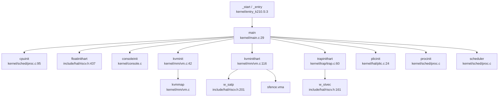

#### Hart 0 初始化流程 (`kernel/main.c:38-63`)

```c
if (hartid == 0) {
    started = 0;
    cpuinit();           // 初始化 CPU 结构体
    floatinithart();     // 初始化 FPU
    consoleinit();       // 初始化串口控制台
    printfinit();        // 初始化 printf 锁
    print_logo();        // 打印启动 Logo
    kpminit();           // 初始化物理页分配器
    kvminit();           // 创建内核页表
    kvminithart();       // 启用 MMU
    kmallocinit();       // 初始化内核堆分配器
    trapinithart();      // 安装中断向量
    procinit();          // 初始化进程结构
    plicinit();          // 初始化 PLIC
    plicinithart();      // 初始化 PLIC hart 相关
    fpioa_pin_init();    // K210: 初始化 FPIOA
    dmac_init();         // K210: 初始化 DMAC
    disk_init();         // 初始化磁盘
    binit();             // 初始化缓冲缓存
    userinit();          // 创建第一个用户进程
    printf("hart 0 init done\n");
    
    // 发送 IPI 唤醒其他 hart
    for (int i = 1; i < NCPU; i++) {
        sbi_send_ipi(1 << i, 0);
    }
    started = 1;
}
```

#### Hart 1 初始化流程 (`kernel/main.c:75-86`)

```c
else {
    // hart 1
    while (started == 0)
        ;
    __sync_synchronize();
    floatinithart();     // 初始化 FPU
    kvminithart();       // 启用 MMU
    trapinithart();      // 安装中断向量
    printf("hart 1 init done\n");
}
```

#### 关键初始化函数详解

**`trapinithart()`** (`kernel/trap/trap.c:60-66`)：
```c
void trapinithart(void)
{
    w_stvec((uint64)kernelvec);  // 设置中断向量基址
    w_sstatus(r_sstatus() | SSTATUS_SIE);  // 启用 S-Mode 中断
    w_sie(r_sie() | SIE_SEIE | SIE_SSIE | SIE_STIE);  // 启用外部/软件/定时器中断
    set_next_timeout();  // 设置下一个定时器中断
}
```

**`plicinit()`** (`kernel/hal/plic.c:24-31`)：
```c
void plicinit(void) {
    writed(1, PLIC_V + DISK_IRQ * sizeof(uint32));  // 启用磁盘中断
    writed(1, PLIC_V + UART_IRQ * sizeof(uint32));  // 启用 UART 中断
}
```

### 多平台启动流程（StarFive/LoongArch 等）

#### 平台支持状态

**❌ StarFive VisionFive2 未实现**：
- 搜索 `visionfive`、`jh7110` 关键词，**未找到任何相关代码**
- 项目仅支持 K210 和 QEMU 两种平台

**❌ LoongArch 未实现**：
- 搜索 `loongarch` 关键词，**未找到任何相关代码**
- 项目仅基于 RISC-V 架构

#### 支持的平台

**✅ K210 平台**：
- 物理地址基址：`0x80020000`
- 使用 RustSBI-K210 固件
- 特定设备驱动：FPIOA、DMAC、SPI、GPIOHS 等

**✅ QEMU 平台**：
- 物理地址基址：`0x80200000`
- 使用 RustSBI-QEMU 固件
- 使用 virtio 磁盘接口

### 平台配置与构建机制

#### 构建配置

**Makefile 平台选择** (`Makefile:1-2`)：
```makefile
platform	:= k210
# platform	:= qemu
```

**SBI 固件选择** (`Makefile:53-58`)：
```makefile
ifeq ($(platform), k210)
    SBI := ./sbi/sbi-k210
else
    SBI	:= ./sbi/sbi-qemu
endif
```

#### RustSBI 目标架构

**Rust 工具链配置** (`bootloader/SBI/rustsbi-k210/.cargo/config.toml:1-7`)：
```toml
[build]
target = "riscv64gc-unknown-none-elf"

[target.riscv64gc-unknown-none-elf]
rustflags = [
    "-C", "link-arg=-Tlink-k210.ld",
]
```

**Rust 工具链版本** (`bootloader/SBI/rustsbi-k210/rust-toolchain:1`)：
```
nightly-2020-08-01
```

#### 编译标志

**C 编译器标志** (`Makefile:17-25`)：
```makefile
CFLAGS = -Wall -O2 -fno-omit-frame-pointer -ggdb -g -march=rv64imafdc
CFLAGS += -mcmodel=medany
CFLAGS += -ffreestanding -fno-common -nostdlib -mno-relax
CFLAGS += -Iinclude/

ifeq ($(platform), qemu)
CFLAGS += -D QEMU
endif
```

关键标志：
- **`-march=rv64imafdc`**：RISC-V 64 位，支持整数、乘除、原子、浮点、压缩指令
- **`-mcmodel=medany`**：中等代码模型，支持位置无关代码
- **`-D QEMU`**：QEMU 平台特定宏

### 关键代码片段分析

#### 固件级启动链（RISC-V）

**SBI → U-Boot → OS 启动链**：

xv6-k210 **不使用 U-Boot**，而是采用简化的启动链：

```
M-Mode (RustSBI) → S-Mode (xv6-k210 kernel)
```

**RustSBI 跳转到内核** (`bootloader/SBI/rustsbi-k210/src/main.rs:271-279`)：
```assembly
.global _s_mode_start
_s_mode_start:
1:  auipc ra, %pcrel_hi(1f)
    ld ra, %pcrel_lo(1b)(ra)
    jr ra
.align  3
1:  .dword 0x80020000
```

这段汇编代码：
1. 使用 `auipc` + `ld` 加载 64 位内核入口地址 `0x80020000`
2. 跳转到内核入口（`_entry` 或 `_start`）

#### MMU 启用前后串口地址切换

**虚拟地址偏移机制** (`include/memlayout.h:36`)：
```c
#define VIRT_OFFSET    0x3F00000000L
```

**UART 地址映射** (`include/memlayout.h:41-46`)：
```c
#ifdef QEMU
#define UART    0x10000000L
#else
#define UART    0x38000000L    // K210 物理地址
#endif

#define UART_V  (UART + VIRT_OFFSET)  // 虚拟地址
```

**MMU 启用前**：
- RustSBI 直接访问物理地址 `0x38000000` (K210) 或 `0x10000000` (QEMU)
- 通过 SBI 调用 `sbi_console_putchar()` 输出字符

**MMU 启用后**：
- 内核通过虚拟地址 `UART_V = UART + 0x3F00000000` 访问 UART
- `kvminit()` 中建立映射：`kvmmap(UART_V, UART, PGSIZE, PTE_R | PTE_W)`

**串口输出实现** (`kernel/console.c:42-49`)：
```c
void consputc(int c) {
    if(c == BACKSPACE){
        sbi_console_putchar('\b');
        sbi_console_putchar(' ');
        sbi_console_putchar('\b');
    } else {
        sbi_console_putchar(c);
    }
}
```

**SBI 调用实现** (`include/sbi.h:22-28`)：
```c
static inline void sbi_console_putchar(int ch) {
    LEGACY_SBI_CALL(SBI_CONSOLE_PUTCHAR, ch);
}

#define LEGACY_SBI_CALL(eid, arg0) ({ \
    register uintptr_t a0 asm ("a0") = (uintptr_t)(arg0); \
    register uintptr_t a7 asm ("a7") = (uintptr_t)(eid); \
    asm volatile ("ecall" \
                  : "+r" (a0) \
                  : "r" (a7) \
                  : "memory"); \
    a0; \
})
```

#### 多核启动同步

**IPI 发送机制** (`kernel/main.c:59-62`)：
```c
for (int i = 1; i < NCPU; i++) {
    unsigned long mask = 1 << i;
    sbi_send_ipi(mask, 0);
    __debug_assert("main", SBI_SUCCESS == res.error, "sbi_send_ipi failed");
}
__sync_synchronize();
started = 1;
```

**SBI IPI 实现** (`include/sbi.h:89-95`)：
```c
static inline struct sbiret sbi_send_ipi(
    unsigned long hart_mask, 
    unsigned long hart_mask_base
) {
    return SBI_CALL_2(IPI_EID, IPI_SEND_IPI, hart_mask, hart_mask_base);
}
```

**Hart 1 等待机制** (`kernel/main.c:77-79`)：
```c
while (started == 0)
    ;
__sync_synchronize();
```

#### 早期栈分配

**栈空间定义** (`kernel/entry_k210.S:15-21`)：
```assembly
.section .bss.stack
.align 12
.globl boot_stack
boot_stack:
    .space 4096 * 4 * 2  # 32KB 栈空间
.globl boot_stack_top
boot_stack_top:
```

**多核栈分配** (`kernel/entry_k210.S:4-6`)：
```assembly
add t0, a0, 1
slli t0, t0, 14
la sp, boot_stack
add sp, sp, t0
```

每个 hart 的栈偏移：`(hartid + 1) * 16KB`

#### BSS 清零与数据段初始化

**RustSBI 中的 BSS 清零** (`bootloader/SBI/rustsbi-k210/src/main.rs:103-106`)：
```rust
unsafe {
    r0::zero_bss(&mut _sbss, &mut _ebss);
    r0::init_data(&mut _sdata, &mut _edata, &_sidata);
}
```

**内核 BSS 清零**：由链接脚本定义 `sbss_clear` 和 `ebss_clear` 符号，但**未在内核启动代码中显式清零**，依赖编译器/链接器保证 BSS 初始化为零。

---

**本章小结**：

| 特性 | 状态 | 实现位置 |
|------|------|----------|
| 汇编入口 | ✅ 已实现 | `kernel/entry_k210.S`, `kernel/entry_qemu.S` |
| M-Mode → S-Mode 切换 | ✅ 已实现 | `bootloader/SBI/rustsbi-k210/src/main.rs:259-266` |
| FPU 初始化 | ✅ 已实现 | `include/hal/riscv.h:437-445` |
| MMU 启用 (Sv39) | ✅ 已实现 | `kernel/mm/vm.c:116-127` |
| 中断向量设置 | ✅ 已实现 | `kernel/trap/trap.c:60-66` |
| 多核 IPI 唤醒 | ✅ 已实现 | `kernel/main.c:59-62` |
| 虚拟地址映射 | ✅ 已实现 | `include/memlayout.h:36` |
| StarFive VisionFive2 | ❌ 未实现 | 未找到相关代码 |
| LoongArch 支持 | ❌ 未实现 | 未找到相关代码 |
| U-Boot 支持 | ❌ 未实现 | 直接使用 RustSBI 跳转 |

---


# 内存管理物理虚拟分配器

### 物理内存管理实现

xv6-k210 采用**双向链表空闲列表（Free List）**算法管理物理内存，而非 Buddy System 或 Slab。物理内存被划分为两个区域进行管理：

**1. 物理页分配器架构** (`kernel/mm/pm.c`)

```c
struct pm_allocator {
    struct spinlock lock;
    struct run *freelist;
    uint64 npage;
};

struct run {
    struct run *next;
    uint64 npage;  // 连续页数
};
```

系统维护两个独立的分配器：
- **`single`**：管理单页分配（400 页，位于 `PHYSTOP - 400*PGSIZE` 到 `PHYSTOP`）
- **`multiple`**：管理多页分配（剩余内存）

**2. 初始化流程** (`kpminit`, `kernel/mm/pm.c:173-193`)

```c
void kpminit(void) {
    // 初始化 multiple 和 single 空闲链表
    __mul_freerange((uint64)boot_stack_top, START_SINGLE);  // 多页区
    __sin_freerange(START_SINGLE, PHYSTOP);                  // 单页区
}
```

**3. 分配策略** (`_allocpage`, `kernel/mm/pm.c:232-254`)

```c
uint64 _allocpage(void) {
    // 优先从 single 分配
    ret = __sin_alloc_no_lock();
    if (NULL == ret) {
        // single 耗尽时从 multiple 借用
        ret = __mul_alloc_no_lock(1);
    }
    return (uint64)ret;
}
```

**4. 页面引用计数**（用于 COW） (`kernel/mm/vm.c:154-197`)

```c
static uint8 page_ref_table[MAX_PAGES_NUM];  // 物理页引用计数表

void pagereg(uint64 pa, uint8 init) {
    page_ref_table[__hash_page_idx(pa)] = init ? 1 : 
        page_ref_table[__hash_page_idx(pa)] + 1;
}

int pageput(uint64 pa) {
    return --page_ref_table[__hash_page_idx(pa)];  // 返回剩余引用数
}
```

**实现状态**: ✅ **已实现** - 完整的物理页分配/回收机制，支持引用计数

---

### 虚拟内存与页表操作

**1. 页表结构** (`include/hal/riscv.h:411`)

```c
typedef uint64 *pagetable_t;  // 512 PTEs 的指针
typedef uint64 pte_t;

// PTE 标志位
#define PTE_V (1L << 0)  // valid
#define PTE_R (1L << 1)  // readable
#define PTE_W (1L << 2)  // writable
#define PTE_X (1L << 3)  // executable
#define PTE_U (1L << 4)  // user accessible
#define PTE_COW PTE_RSW1 // copy-on-write 标记 (bit 8)
```

**2. 页表遍历** (`walk`, `kernel/mm/vm.c:211-233`)

RISC-V Sv39 三级页表遍历：
```c
pte_t *walk(pagetable_t pagetable, uint64 va, int alloc) {
    for(int level = 2; level > 0; level--) {
        pte_t *pte = &pagetable[PX(level, va)];
        if(*pte & PTE_V) {
            pagetable = (pagetable_t)PTE2PA(*pte);  // 进入下一级
        } else {
            if(!alloc || (pagetable = (pde_t*)allocpage()) == NULL)
                return NULL;
            memset(pagetable, 0, PGSIZE);
            *pte = PA2PTE(pagetable) | PTE_V;
        }
    }
    return &pagetable[PX(0, va)];  // 返回叶级 PTE
}
```

**3. 页表映射** (`mappages`, `kernel/mm/vm.c:298-327`)

```c
int mappages(pagetable_t pagetable, uint64 va, uint64 size, uint64 pa, int perm) {
    uint64 a = PGROUNDDOWN(va);
    uint64 last = PGROUNDDOWN(va + size - 1);
    
    for(;;) {
        pte_t *pte = walk(pagetable, a, 1);
        if (*pte & PTE_U) {
            // 用户页已存在，仅更新 PPN
            *pte |= PA2PTE(pa) | PTE_V;
        } else {
            *pte = PA2PTE(pa) | perm | PTE_V;
        }
        if (usr) pagedup(PGROUNDDOWN(pa));  // 增加引用计数
        if(a == last) break;
        a += PGSIZE;
        pa += PGSIZE;
    }
    return 0;
}
```

**4. 页表解映射** (`unmappages`, `kernel/mm/vm.c:335-373`)

```c
void unmappages(pagetable_t pagetable, uint64 va, uint64 npages, int flag) {
    for (uint64 a = va; a < va + npages * PGSIZE; a += PGSIZE) {
        pte_t *pte = walk(pagetable, a, 0);
        if (flag & VM_FREE) {
            freepage((void*)PTE2PA(*pte));  // 释放物理页
        }
        *pte = 0;  // 清除 PTE
    }
}
```

**实现状态**: ✅ **已实现** - 完整的 Sv39 页表操作（walk/map/unmap）

---

### 地址空间布局（内核 vs 用户）

**1. 内核地址空间** (`kernel/mm/vm.c:41-118`)

内核使用直接映射（Direct Map），虚拟地址 = 物理地址 + `VIRT_OFFSET`：
```c
#define VIRT_OFFSET  0x3F00000000L
#define KERNBASE     0x80020000UL

// 内核页表初始化映射
kvmmap(UART_V, UART, PGSIZE, PTE_R | PTE_W);
kvmmap(CLINT_V, CLINT, 0x10000, PTE_R | PTE_W);
kvmmap(PLIC_V, PLIC, 0x4000, PTE_R | PTE_W);
// ... 其他设备映射
```

**2. 用户地址空间** (`kernel/mm/usrmm.c`)

用户空间使用段式管理（`struct seg` 链表）：
```c
struct seg {
    enum segtype type;  // LOAD/HEAP/MMAP/STACK
    int flag;           // PTE 权限标志
    uint64 addr;        // 虚拟地址起始
    uint64 sz;          // 段大小
    struct seg *next;
    uint64 mmap;        // mmap 相关文件引用
};
```

**3. 内核/用户隔离** (`include/mm/vm.h:13-30`)

```c
static inline void permit_usr_mem() {
    clr_sstatus_bit(SSTATUS_PUM);  // 允许访问用户空间
}

static inline void protect_usr_mem() {
    set_sstatus_bit(SSTATUS_PUM);  // 禁止访问用户空间
}
```

**4. 内存布局** (`include/memlayout.h`)

```
用户空间: 0x0000000000000000 ~ MAXUVA
  - 代码段 (TEXT)
  - 数据段 (DATA/BSS)
  - 堆 (HEAP) - 通过 sbrk 增长
  - mmap 区域
  - 用户栈 (STACK)

内核空间: VIRT_OFFSET + KERNBASE ~ MAXVA
  - 直接映射物理内存
  - 设备映射 (UART/PLIC/CLINT 等)
  - Trampoline 页 (MAXVA - PGSIZE)
```

**实现状态**: ✅ **已实现** - 独立的内核/用户地址空间，通过 SSTATUS_PUM 隔离

---

### 堆分配器解析

**1. 内核堆分配器** (`kernel/mm/kmalloc.c`)

采用**类 Slab 机制**，但实现简化：

```c
struct kmem_allocator {
    struct spinlock lock;
    uint obj_size;           // 对象大小
    uint16 npages;           // 页数
    uint16 nobjs;            // 对象数
    struct kmem_node *list;  // 节点链表
};

struct kmem_node {
    struct kmem_node *next;
    struct {
        uint64 obj_size;
        uint64 obj_addr;
    } config;
    uint8 avail;  // 可用对象数
    uint8 cnt;    // 已分配数
    uint8 table[KMEM_OBJ_MAX_COUNT];  // 空闲链表
};
```

**分配策略** (`kmalloc`, `kernel/mm/kmalloc.c:157-220`)：
- 对象大小范围：32B ~ 4048B
- 使用哈希表 (`kmem_table[17]`) 索引不同大小的分配器
- 节点用满时通过 `allocpage()` 扩展

**2. 用户堆管理** (`sys_sbrk`/`sys_brk`, `kernel/syscall/sysmem.c:20-52`)

```c
uint64 sys_sbrk(void) {
    int n;
    argint(0, &n);
    struct proc *p = myproc();
    uint64 addr = p->pbrk;
    if (growproc(addr + n) < 0)  // 实际调用 uvmalloc
        return -1;
    return addr;
}

uint64 sys_brk(void) {
    uint64 addr;
    argaddr(0, &addr);
    struct proc *p = myproc();
    if (addr == 0) return p->pbrk;
    uint64 old = p->pbrk;
    if (growproc(addr) < 0)  // 调整到绝对地址
        return old;
    return addr;
}
```

**3. 惰性分配（Lazy Allocation）** (`handle_page_fault_lazy`, `kernel/mm/vm.c:1002-1016`)

```c
static int handle_page_fault_lazy(uint64 badaddr, struct seg *s) {
    struct proc *p = myproc();
    uint64 pa = PGROUNDDOWN(badaddr);
    // 缺页时才分配物理页
    if (uvmalloc(p->pagetable, pa, pa + PGSIZE, s->flag) == 0)
        return -1;
    sfence_vma();
    return 0;
}
```

**实现状态**:
- **内核 kmalloc**: ✅ **已实现** (类 Slab 分配器)
- **用户 sbrk/brk**: ✅ **已实现**
- **惰性分配**: ✅ **已实现** (HEAP/STACK 段缺页时分配)

---

### 高级内存特性清单

| 特性 | 状态 | 代码位置/说明 |
|------|------|---------------|
| **写时复制 (CoW)** | ✅ **已实现** | `kernel/mm/vm.c:975-997` (`handle_store_page_fault_cow`) |
| **懒分配 (Lazy)** | ✅ **已实现** | `kernel/mm/vm.c:1002-1016` (`handle_page_fault_lazy`) |
| **mmap 系统调用** | ✅ **已实现** | `kernel/syscall/sysmem.c:79-113` (`sys_mmap`) |
| **MAP_FIXED 支持** | ✅ **已实现** | `kernel/mm/mmap.c:710-771` (`do_mmap` 中处理) |
| **MAP_ANONYMOUS** | ✅ **已实现** | `kernel/mm/mmap.c:642-708` (`mmap_anonymous`) |
| **共享内存 (shm)** | ❌ **未实现** | 无 `sys_shmget`/`sys_shmat`/`sys_shmdt` 系统调用 |
| **反向映射表 (rmap)** | ❌ **未实现** | 未找到 `rmap`/`reverse_map`/`page_to_vma` 实现 |
| **交换区 (Swap)** | ❌ **未实现** | 无 `swap_out`/`swap_in` 实现（`__page_file_swap` 被注释） |
| **大页 (Huge Page)** | ❌ **未实现** | 未找到 2M/1G 页面支持，仅 4KB 页 |
| **零拷贝 (sendfile)** | ❌ **未实现** | 未找到相关系统调用 |

**1. 写时复制 (CoW) 详解**

**触发条件** (`handle_page_fault`, `kernel/mm/vm.c:1053-1056`)：
```c
if (kind == 1 && (*pte & PTE_COW)) {
    return handle_store_page_fault_cow(pte);
}
```

**CoW 处理流程** (`handle_store_page_fault_cow`, `kernel/mm/vm.c:975-997`)：
```c
static int handle_store_page_fault_cow(pte_t *ptep) {
    uint64 pa = PTE2PA(*ptep);
    
    if (monopolizepage(pa)) {  // 独占页面
        *ptep |= PTE_W;  // 直接添加写权限
    } else {  // 需要复制
        char *copy = (char *)allocpage();
        memmove(copy, (char *)pa, PGSIZE);
        pagereg((uint64)copy, 1);
        *ptep = PA2PTE(copy) | PTE_FLAGS(*ptep) | PTE_W;
    }
    *ptep &= ~PTE_COW;  // 清除 COW 标记
    sfence_vma();
    return 0;
}
```

**fork 时 CoW 设置** (`uvmcopy`, `kernel/mm/vm.c:556-593`)：
```c
if (cow && (*pte & PTE_W)) {
    *pte = (*pte|PTE_COW) & ~PTE_W;  // 清除写权限，标记 COW
}
```

**2. mmap 实现详解**

**系统调用入口** (`sys_mmap`, `kernel/syscall/sysmem.c:79-113`)：
```c
uint64 sys_mmap(void) {
    uint64 start, len;
    int prot, flags, fd;
    int64 off;
    struct file *f = NULL;
    
    argaddr(0, &start); argaddr(1, &len);
    argint(2, &prot); argint(3, &flags);
    argfd(4, &fd, &f); argaddr(5, (uint64*)&off);
    
    // 验证参数
    if ((fd < 0 || f == NULL) && !(flags & MAP_ANONYMOUS))
        return -EBADF;
    if (!(flags & (MAP_SHARED|MAP_PRIVATE)))
        return -EINVAL;
    
    return do_mmap(start, len, prot, flags, f, off);
}
```

**MAP_FIXED 处理** (`do_mmap`, `kernel/mm/mmap.c:710-771`)：
```c
if (flags & MAP_FIXED)
    ret = lookup_fixed_segment(start, start + sz, &prev, &new);
else
    ret = lookup_segment(sz, &prev, &new);
```

**匿名共享内存** (`handle_anonymous_shared`, `kernel/mm/mmap.c:876-906`)：
```c
static int handle_anonymous_shared(uint64 badaddr, struct seg *s) {
    struct anonfile *fp = MMAP_FILE(s->mmap);
    struct mmap_page *map = get_mmap_page(&fp->mapping, off);
    
    if (map->pa == NULL) {
        map->pa = allocpage();  // 首次访问时分配
        memset(map->pa, 0, PGSIZE);
    }
    mappages(p->pagetable, PGROUNDDOWN(badaddr), PGSIZE,
             (uint64)map->pa, s->flag|PTE_U);
    return 0;
}
```

**3. 用户指针安全验证**

**无显式 `verify_area`**，但通过以下机制保证安全：

**段边界检查** (`partofseg`, `kernel/mm/usrmm.c:57-72`)：
```c
struct seg* partofseg(struct seg *head, uint64 start, uint64 end) {
    for (; head != NULL; head = head->next) {
        if (start >= head->addr && end <= head->addr + head->sz)
            return head;
    }
    return NULL;  // 不在任何段内
}
```

**copyin/copyout 验证** (`copyin2`/`copyout2`, `kernel/mm/vm.c:786-858`)：
```c
int copyout2(uint64 dstva, char *src, uint64 len) {
    struct proc *p = myproc();
    struct seg *s = partofseg(p->segment, dstva, dstva + len);
    if (s == NULL) return -1;  // 地址非法
    uint64 badaddr = safememmove((char *)dstva, src, len, 1);
    return badaddr == 0 ? 0 : -1;
}
```

**系统调用参数验证** (`argaddr`, `kernel/syscall/syscall.c`)：
```c
// 在 sys_mmap/sys_brk 等函数中调用
argaddr(0, &addr);  // 从用户空间读取地址参数
```

**实现状态**: ✅ **已实现** - 通过段链表验证用户指针合法性

---

### 关键代码片段与调用链分析

**缺页异常完整调用链**

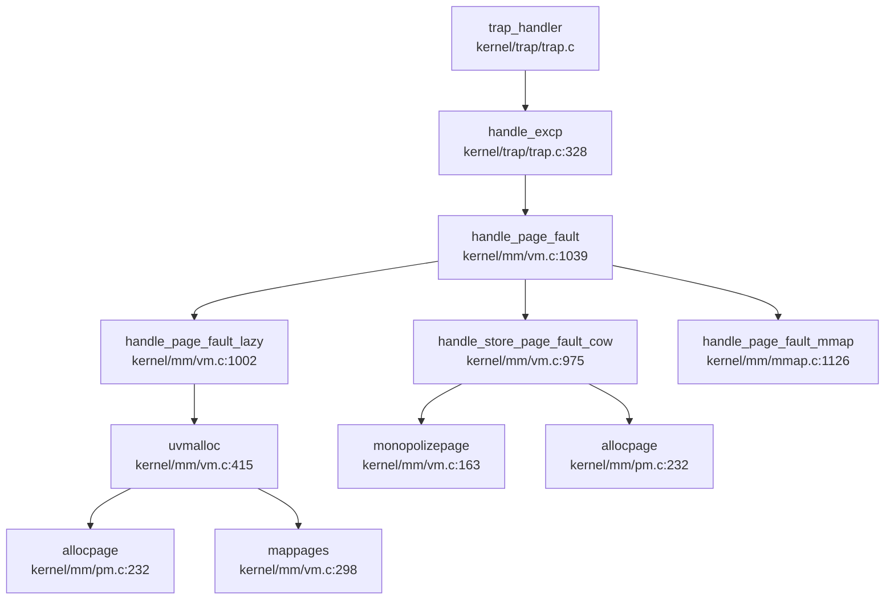

**调用链说明**：

1. **入口** (`kernel/trap/trap.c:328-349`)：
```c
int handle_excp(uint64 scause) {
    switch (scause) {
    case EXCP_STORE_PAGE:
        return handle_page_fault(1, r_stval());  // 存储缺页
    case EXCP_LOAD_PAGE:
        return handle_page_fault(0, r_stval());  // 加载缺页
    case EXCP_INST_PAGE:
        return handle_page_fault(2, r_stval());  // 取指缺页
    }
}
```

2. **缺页分发** (`kernel/mm/vm.c:1039-1105`)：
```c
int handle_page_fault(int kind, uint64 badaddr) {
    struct seg *seg = locateseg(p->segment, badaddr);
    
    // 检查 CoW
    if (kind == 1 && (*pte & PTE_COW))
        return handle_store_page_fault_cow(pte);
    
    // 根据段类型分发
    switch (seg->type) {
        case LOAD: return handle_page_fault_loadelf(badaddr, seg);
        case HEAP:
        case STACK: return handle_page_fault_lazy(badaddr, seg);
        case MMAP: return handle_page_fault_mmap(kind, badaddr, seg);
    }
}
```

3. **懒分配流程** (`kernel/mm/vm.c:1002-1016`)：
```c
static int handle_page_fault_lazy(uint64 badaddr, struct seg *s) {
    uint64 pa = PGROUNDDOWN(badaddr);
    if (uvmalloc(p->pagetable, pa, pa + PGSIZE, s->flag) == 0)
        return -1;
    sfence_vma();
    return 0;
}
```

4. **物理页分配** (`kernel/mm/vm.c:415-447`)：
```c
uint64 uvmalloc(pagetable_t pagetable, uint64 start, uint64 end, int perm) {
    for(uint64 a = PGROUNDUP(start); a < end; a += PGSIZE) {
        char *mem = allocpage();
        memset(mem, 0, PGSIZE);
        pagereg((uint64)mem, 0);
        mappages(pagetable, a, PGSIZE, (uint64)mem, perm|PTE_U);
    }
    return end;
}
```

**物理页分配调用图**：
```
handle_page_fault_lazy
  └─> uvmalloc
       ├─> allocpage (_allocpage)
       │    ├─> __sin_alloc_no_lock (单页区)
       │    └─> __mul_alloc_no_lock (多页区)
       └─> mappages
            ├─> walk (页表遍历)
            └─> pagedup (引用计数)
```

---

### 内存管理特性总结

| 子系统 | 实现状态 | 关键文件 |
|--------|----------|----------|
| **物理页分配** | ✅ 已实现 (Free List) | `kernel/mm/pm.c` |
| **内核堆分配** | ✅ 已实现 (类 Slab) | `kernel/mm/kmalloc.c` |
| **页表管理** | ✅ 已实现 (Sv39) | `kernel/mm/vm.c` |
| **地址空间隔离** | ✅ 已实现 | `kernel/mm/usrmm.c` |
| **sbrk/brk** | ✅ 已实现 | `kernel/syscall/sysmem.c` |
| **Lazy Allocation** | ✅ 已实现 | `kernel/mm/vm.c:1002` |
| **Copy-on-Write** | ✅ 已实现 | `kernel/mm/vm.c:975` |
| **mmap/munmap** | ✅ 已实现 | `kernel/mm/mmap.c` |
| **用户指针验证** | ✅ 已实现 (段检查) | `kernel/mm/usrmm.c` |
| **共享内存 (shm)** | ❌ 未实现 | - |
| **反向映射 (rmap)** | ❌ 未实现 | - |
| **Swap/页面置换** | ❌ 未实现 | - |
| **大页支持** | ❌ 未实现 | - |

**设计特点**：
1. **物理内存双区管理**：单页/多页分离，优化常见单页分配场景
2. **段式用户空间**：通过 `struct seg` 链表管理 LOAD/HEAP/MMAP/STACK 区域
3. **完整的 CoW + Lazy**：fork 时标记 CoW，缺页时按需分配
4. **mmap 惰性映射**：共享/匿名映射均支持缺页时分配物理页
5. **无 Swap 设计**：受限于嵌入式环境（K210 仅 8MB RAM），未实现交换区

---


# 进程线程与调度机制

### 任务模型与核心数据结构

xv6-k210 采用统一的 **`struct proc`** 作为执行实体的核心数据结构，未区分 Process Control Block (PCB) 与 Thread Control Block (TCB)，即**进程与线程在代码层面是同一抽象**。

**`struct proc` 定义位置**: `include/sched/proc.h:51-148`

核心字段分类如下：

```c
struct proc {
    // === 基础标识 ===
    int xstate;                // 退出状态 (exit status)
    int pid;                   // 进程 ID
    struct proc *hash_next;    // 哈希链表下一节点
    struct proc **hash_pprev;  // 哈希链表前一节点指针

    // === 调度相关 ===
    struct proc *sched_next;   // 调度链表下一节点
    struct proc **sched_pprev; // 调度链表前一节点指针
    int timer;                 // 时间片计数器
    enum procstate state;      // 进程状态 (RUNNABLE/RUNNING/SLEEPING/ZOMBIE)
    void *chan;                // 睡眠等待的通道地址
    uint64 sleep_expire;       // 睡眠唤醒时间戳

    // === 性能统计 ===
    struct tms proc_tms;       // 用户态/内核态时间统计
    uint64 ikstmp;             // 进入内核时刻
    uint64 okstmp;             // 离开内核时刻
    int64 vswtch;              // 自愿上下文切换次数
    int64 ivswtch;             // 非自愿上下文切换次数

    // === 亲缘关系 ===
    struct spinlock lk;        // 保护子进程列表的自旋锁
    struct proc *child;        // 第一个子进程
    struct proc *parent;       // 父进程指针
    struct proc *sibling_next; // 兄弟链表下一节点
    struct proc **sibling_pprev;

    // === 内存管理 ===
    uint64 kstack;             // 内核栈虚拟地址
    uint64 badaddr;            // 页错误后的错误地址
    pagetable_t pagetable;     // 用户页表
    struct trapframe *trapframe; // 陷阱帧数据页
    struct seg *segment;       // 内存段链表头
    uint64 pbrk;               // 程序断点 (program break)

    // === 文件系统 ===
    struct fdtable fds;        // 打开文件表
    struct inode *cwd;         // 当前工作目录
    struct inode *elf;         // 可执行文件 inode

    // === 上下文切换 ===
    struct context context;    // 内核上下文 (保存 callee-saved 寄存器)

    // === 信号机制 ===
    ksigaction_t *sig_act;     // 信号处理动作链表
    __sigset_t sig_set;        // 当前信号掩码
    __sigset_t sig_pending;    // 待处理信号集
    struct sig_frame *sig_frame; // 信号帧链表
    int killed;                // 当前待处理信号编号

    // === 调试信息 ===
    char name[16];             // 进程名
    int tmask;                 // 跟踪掩码
};
```

**`struct context` 定义** (`include/sched/proc.h:18-33`): 保存内核上下文切换时的 callee-saved 寄存器：
```c
struct context {
    uint64 ra;  // 返回地址
    uint64 sp;  // 栈指针
    uint64 s0-s11;  // 12 个被调用者保存寄存器
};
```

**进程状态枚举** (`include/sched/proc.h:35-39`):
```c
enum procstate {
    RUNNABLE,   // 可运行
    RUNNING,    // 正在运行
    SLEEPING,   // 睡眠中
    ZOMBIE,     // 僵尸进程 (已退出但未被父进程回收)
};
```

---

### 调度算法与策略（代码证据）

xv6-k210 实现了**基于优先级的时间片轮转调度算法**，支持 3 个优先级队列。

**优先级定义** (`kernel/sched/proc.c:241-243`):
```c
#define PRIORITY_TIMEOUT    0   // 超时队列 (最低优先级)
#define PRIORITY_IRQ        1   // 中断/信号唤醒队列 (高优先级)
#define PRIORITY_NORMAL     2   // 普通进程队列 (默认优先级)
#define PRIORITY_NUMBER     3   // 优先级总数
```

**调度队列结构** (`kernel/sched/proc.c:245-246`):
```c
struct proc *proc_runnable[PRIORITY_NUMBER];  // 3 个优先级的可运行队列
struct proc *proc_sleep;                       // 睡眠队列
```

**调度器核心逻辑** (`kernel/sched/proc.c:671-711`):

`__get_runnable_no_lock()` 函数按优先级从高到低扫描可运行队列：
```c
static struct proc *__get_runnable_no_lock(void) {
    struct proc const *tmp;
    for (int i = 0; i < PRIORITY_NUMBER; i ++) {  // 从 PRIORITY_TIMEOUT(0) 开始
        tmp = proc_runnable[i];
        while (NULL != tmp) {
            if (RUNNABLE == tmp->state) {
                return (struct proc*)tmp;  // 返回第一个 RUNNABLE 状态的进程
            }
            tmp = tmp->sched_next;
        }
    }
    return NULL;
}
```

**时间片机制** (`kernel/sched/proc.c:753-787`):

`proc_tick()` 函数在时钟中断时被调用，递减运行进程的 `timer` 字段：
```c
void proc_tick(void) {
    __enter_proc_cs 
    struct proc *p;
    for (int i = PRIORITY_IRQ; i < PRIORITY_NUMBER; i ++) {
        p = proc_runnable[i];
        while (NULL != p) {
            struct proc *next = p->sched_next;
            if (RUNNING != p->state) {
                p->timer = p->timer - 1;
                if (0 == p->timer) {  // 时间片耗尽
                    __remove(p);
                    __insert_runnable(PRIORITY_TIMEOUT, p);  // 降级到 TIMEOUT 队列
                }
            }
            p = next;
        }
    }
    // ... 处理睡眠进程唤醒
    __leave_proc_cs
}
```

**时间片分配** (`kernel/sched/proc.c:240-241`):
```c
#define TIMER_IRQ       5
#define TIMER_NORMAL    10  // 普通进程默认时间片为 10 个 tick
```

**调度策略总结**:
- **优先级顺序**: `PRIORITY_IRQ(1)` > `PRIORITY_NORMAL(2)` > `PRIORITY_TIMEOUT(0)` (注意：数字越小优先级越高，因为扫描从 0 开始)
- **时间片轮转**: 进程时间片用完后被移动到 `PRIORITY_TIMEOUT` 队列
- **中断/信号唤醒**: 被信号或中断唤醒的进程插入 `PRIORITY_IRQ` 队列，获得更高优先级
- **FIFO  Within Priority**: 同一优先级队列内采用 FIFO 顺序 (通过 `sched_next` 链表)

---

### 任务状态机

xv6-k210 的进程状态机包含 4 种状态，流转关系如下：

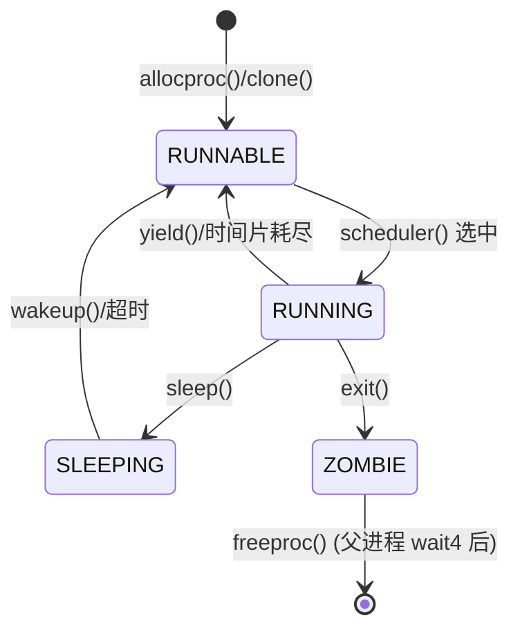

**状态转换触发点**:

| 当前状态 | 目标状态 | 触发函数 | 文件位置 |
|---------|---------|---------|---------|
| 无 → RUNNABLE | `allocproc()` / `clone()` | `kernel/sched/proc.c:166` / `291` |
| RUNNABLE → RUNNING | `scheduler()` | `kernel/sched/proc.c:671` |
| RUNNING → RUNNABLE | `yield()` / `proc_tick()` | `kernel/sched/proc.c:629` / `753` |
| RUNNING → SLEEPING | `sleep()` | `kernel/sched/proc.c:582` |
| SLEEPING → RUNNABLE | `wakeup()` / `proc_tick()` 超时 | `kernel/sched/proc.c:392` / `753` |
| RUNNING → ZOMBIE | `exit()` | `kernel/sched/proc.c:405` |
| ZOMBIE → 销毁 | `freeproc()` (在 `wait4()` 后) | `kernel/sched/proc.c:139` |

**关键状态转换代码**:

1. **RUNNABLE → RUNNING** (`kernel/sched/proc.c:683-686`):
```c
tmp = __get_runnable_no_lock();
if (NULL != tmp) {
    tmp->state = RUNNING;
    c->proc = tmp;
    swtch(&c->context, &tmp->context);  // 切换到用户态
}
```

2. **RUNNING → SLEEPING** (`kernel/sched/proc.c:582-607`):
```c
void sleep(void *chan, struct spinlock *lk) {
    p->chan = chan;
    __remove(p);        // 从可运行队列移除
    __insert_sleep(p);  // 插入睡眠队列
    sched();            // 触发调度
    // ... 唤醒后恢复
}
```

3. **RUNNING → ZOMBIE** (`kernel/sched/proc.c:453-456`):
```c
void exit(int xstatus) {
    // ... 资源回收
    p->state = ZOMBIE;
    __remove(p); 
    __wakeup_no_lock(p->parent);  // 唤醒父进程
    sched();  // 永不返回
}
```

---

### 上下文切换实现（汇编分析）

**上下文切换汇编代码** (`kernel/sched/swtch.S`):

```asm
# Context switch
#   void swtch(struct context *old, struct context *new);
# Save current registers in old. Load from new.

.globl swtch
swtch:
    # 保存当前上下文到 old (a0 指向)
    sd ra, 0(a0)
    sd sp, 8(a0)
    sd s0, 16(a0)
    sd s1, 24(a0)
    sd s2, 32(a0)
    sd s3, 40(a0)
    sd s4, 48(a0)
    sd s5, 56(a0)
    sd s6, 64(a0)
    sd s7, 72(a0)
    sd s8, 80(a0)
    sd s9, 88(a0)
    sd s10, 96(a0)
    sd s11, 104(a0)

    # 从 new (a1 指向) 恢复上下文
    ld ra, 0(a1)
    ld sp, 8(a1)
    ld s0, 16(a1)
    ld s1, 24(a1)
    ld s2, 32(a1)
    ld s3, 40(a1)
    ld s4, 48(a1)
    ld s5, 56(a1)
    ld s6, 64(a1)
    ld s7, 72(a1)
    ld s8, 80(a1)
    ld s9, 88(a1)
    ld s10, 96(a1)
    ld s11, 104(a1)
    
    ret
```

**保存的寄存器** (共 14 个 64 位寄存器，112 字节):
- `ra`: 返回地址
- `sp`: 栈指针
- `s0-s11`: 12 个 callee-saved 寄存器

**未保存的寄存器**:
- `a0-a7`: 调用者保存寄存器 (参数/返回值)，由编译器负责在调用前后保存
- `t0-t6`: 临时寄存器，调用者保存
- `fp/gp/tp`: 帧指针/全局指针/线程指针，特殊处理

**调用位置**:
1. `scheduler()` → `swtch(&c->context, &tmp->context)` (`kernel/sched/proc.c:695`)
2. `sched()` → `swtch(&p->context, &mycpu()->context)` (`kernel/sched/proc.c:737`)

**页表切换** (`kernel/sched/proc.c:691-697`):
```c
// 切换到用户页表
w_satp(MAKE_SATP(tmp->pagetable));
sfence_vma();
swtch(&c->context, &tmp->context);
// 切换回内核页表
w_satp(MAKE_SATP(kernel_pagetable));
sfence_vma();
```

---

### 进程间通信与同步（Signal/Futex）

#### 信号机制 (Signal)

**实现状态**: ✅ **已实现**

**信号定义** (`include/sched/signal.h`):
```c
#define SIGRTMIN    34
#define SIGRTMAX    64
#define SIGTERM     15
#define SIGKILL     9
#define SIGABRT     6
#define SIGHUP      1
#define SIGINT      2
#define SIGQUIT     3
#define SIGILL      4
#define SIGTRAP     5
#define SIGCHLD     17

#define SIGSET_LEN  1  // 仅支持 64 位信号集 (1 个 unsigned long)
```

**`struct sigaction`** (`include/sched/signal.h:43-52`):
```c
struct sigaction {
    union {
        __sighandler_t sa_handler;  // 仅支持简单信号处理函数
    } __sigaction_handler;
    __sigset_t sa_mask;   // 信号屏蔽掩码
    int sa_flags;         // 信号标志 (SA_NOCLDSTOP, SA_NODEFER 等)
};
```

**进程信号字段** (`include/sched/proc.h:133-138`):
```c
ksigaction_t *sig_act;      // 信号处理动作链表
__sigset_t sig_set;         // 当前信号掩码
__sigset_t sig_pending;     // 待处理信号集
struct sig_frame *sig_frame; // 信号帧链表 (保存被中断的 trapframe)
int killed;                 // 当前待处理信号编号
```

**系统调用支持** (`include/sysnum.h`):
- `SYS_kill` (129): 发送信号
- `SYS_rt_sigaction` (134): 注册信号处理函数

**`kill()` 函数实现** (`kernel/sched/proc.c:541-579`):
```c
int kill(int pid, int sig) {
    __enter_hash_cs 
    tmp = hash_search_no_lock(pid);  // 按 PID 查找进程
    if (NULL == tmp) {
        __leave_hash_cs 
        return -ESRCH;
    }
    
    tmp->sig_pending.__val[0] |= 1ul << sig;  // 设置待处理信号位
    if (0 == tmp->killed || sig < tmp->killed) {
        tmp->killed = sig;  // 记录最高优先级待处理信号
    }
    
    if (SLEEPING == tmp->state) {
        __remove(tmp);
        __insert_runnable(PRIORITY_IRQ, tmp);  // 唤醒睡眠进程到 IRQ 队列
    }
    __leave_hash_cs 
    return 0;
}
```

**信号处理流程**:
1. `kill()` 设置目标进程的 `sig_pending` 位
2. 若目标进程睡眠，则唤醒到 `PRIORITY_IRQ` 队列
3. 进程返回用户态前检查 `killed` 字段
4. 通过 `sighandle()` 跳转到用户注册的信号处理函数
5. 信号处理完成后通过 `sigreturn()` 恢复原上下文

#### Futex (快速用户态互斥锁)

**实现状态**: ❌ **未实现**

**搜索结果**:
- 在代码库中搜索 `futex|futex_wait|futex_wake` **未找到任何实现**
- 仅找到 `wait_queue` 数据结构 (`include/sync/waitqueue.h`)，用于内核内部同步（如管道 `pipe.c`），但**未暴露为用户态系统调用**

**`struct wait_queue`** (`include/sync/waitqueue.h:17-25`):
```c
struct wait_queue {
    struct spinlock lock;
    struct d_list head;  // 双向链表头
};
```

**用途**: 仅用于内核内部等待队列（如管道读写阻塞），**不支持用户态 futex 系统调用**。

---

### 关键流程追踪（Fork/Exec/Schedule/Exit）

#### 1. `fork()` 流程

**系统调用入口** (`kernel/syscall/sysproc.c:84-88`):
```c
uint64 sys_fork(void) {
    return clone(0, NULL);
}
```

**`clone()` 完整调用链** (通过 `lsp_get_call_graph` 分析):

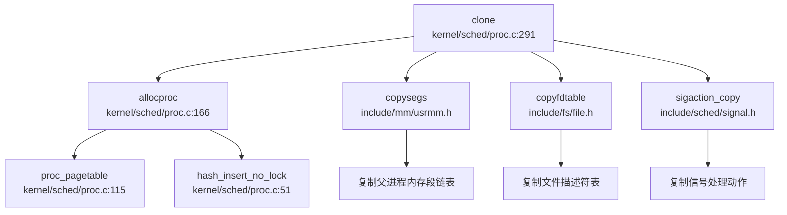

**`clone()` 核心步骤** (`kernel/sched/proc.c:291-370`):

1. **分配新 PCB** (`kernel/sched/proc.c:297-299`):
```c
np = allocproc();
if (NULL == np) {
    return -1;
}
```

2. **复制内存布局** (`kernel/sched/proc.c:303-308`):
```c
np->segment = copysegs(p->pagetable, p->segment, np->pagetable);
if (NULL == np->segment) {
    freeproc(np);
    return -1;
}
np->pbrk = p->pbrk;  // 复制程序断点
```

3. **复制信号字段** (`kernel/sched/proc.c:311-317`):
```c
if (0 != sigaction_copy(&np->sig_act, p->sig_act)) {
    freeproc(np);
    return -1;
}
for (int i = 0; i < SIGSET_LEN; i ++) {
    np->sig_set.__val[i] = p->sig_set.__val[i];
}
```

4. **复制文件表** (`kernel/sched/proc.c:321-327`):
```c
if (copyfdtable(&p->fds, &np->fds) < 0) {
    freeproc(np);
    return -1;
}
np->cwd = idup(p->cwd);   // 复制当前目录 inode
np->elf = p->elf ? idup(p->elf) : NULL;
```

5. **复制陷阱帧** (`kernel/sched/proc.c:330-337`):
```c
*(np->trapframe) = *(p->trapframe);  // 完整复制 trapframe
np->trapframe->a0 = 0;  // 子进程返回值为 0

if (NULL != stack) {
    np->trapframe->sp = stack;  // 可选：设置自定义栈 (用于 pthread_create)
}
```

6. **建立亲缘关系** (`kernel/sched/proc.c:340-351`):
```c
acquire(&p->lk);
np->parent = p;
np->sibling_pprev = &(p->child);
np->sibling_next = p->child;
if (NULL != p->child) {
    p->child->sibling_pprev = &(np->sibling_next);
}
p->child = np;
release(&p->lk);
```

7. **插入可运行队列** (`kernel/sched/proc.c:364-367`):
```c
__enter_proc_cs 
np->timer = TIMER_NORMAL;
__insert_runnable(PRIORITY_NORMAL, np);
__leave_proc_cs 
```

**地址空间复制验证**: `copysegs()` 函数调用 `uvmalloc()` 为新进程分配物理页并建立页表映射，**真正复制了地址空间**而非共享。

**文件表复制验证**: `copyfdtable()` 增加文件引用计数，**父子进程共享打开文件**（符合 POSIX fork 语义）。

---

#### 2. `exec()` 流程

**系统调用入口** (`kernel/syscall/sysproc.c`):
```c
// 通过 grep 找到 sys_exec 调用 execve()
```

**`execve()` 完整实现** (`kernel/exec.c:96-316`):

**调用链**:
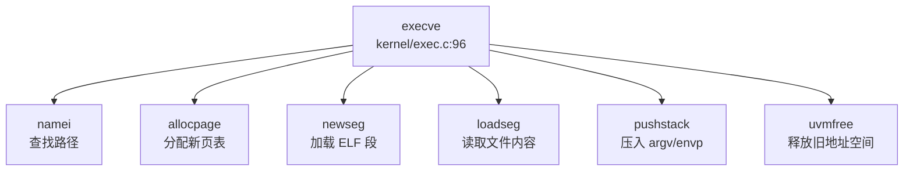

**核心步骤**:

1. **打开可执行文件** (`kernel/exec.c:107-112`):
```c
if ((ip = namei(path)) == NULL) {
    return -ENOENT;
}
```

2. **分配新页表** (`kernel/exec.c:115-122`):
```c
pagetable = (pagetable_t)allocpage();
memmove(pagetable, p->pagetable, PGSIZE);  // 复制内核映射部分
// 清空用户空间映射 (i < PX(2, MAXUVA))
for (int i = 0; i < PX(2, MAXUVA); i++) {
    pagetable[i] = 0;
}
```

3. **解析 ELF 头** (`kernel/exec.c:127-133`):
```c
ilock(ip);
struct elfhdr elf;
if (ip->fop->read(ip, 0, (uint64)&elf, 0, sizeof(elf)) != sizeof(elf) || 
    elf.magic != ELF_MAGIC) {
    return -ENOEXEC;
}
```

4. **加载程序段** (`kernel/exec.c:137-179`):
```c
for (int i = 0, off = elf.phoff; i < elf.phnum; i++, off += sizeof(ph)) {
    if (ip->fop->read(ip, 0, (uint64)&ph, off, sizeof(ph)) != sizeof(ph))
        return -EIO;
    if (ph.type != ELF_PROG_LOAD)
        continue;
    
    // 转换 ELF 标志为 PTE 标志
    flags |= (ph.flags & ELF_PROG_FLAG_EXEC) ? PTE_X : 0;
    flags |= (ph.flags & ELF_PROG_FLAG_WRITE) ? PTE_W : 0;
    flags |= (ph.flags & ELF_PROG_FLAG_READ) ? PTE_R : 0;
    
    seg = newseg(pagetable, seghead, LOAD, ph.vaddr, ph.memsz, flags);
    // ... 加载文件内容到内存
}
```

5. **创建堆和栈** (`kernel/exec.c:191-214`):
```c
// Heap
seg = newseg(pagetable, seghead, HEAP, brk, 0, PTE_R|PTE_W);

// Stack
uint64 sp = VUSTACK;
uint64 stackbase = VUSTACK - PGSIZE * STACK_PAGES;
seg = newseg(pagetable, seghead, STACK, stackbase, sp - stackbase, PTE_R|PTE_W);
```

6. **压入参数** (`kernel/exec.c:216-268`):
```c
// 压入 argv/envp 字符串
envc = pushstack(pagetable, uenvp, envp, MAXENV, &sp);
argc = pushstack(pagetable, uargv, argv, MAXARG, &sp);

// 构建辅助向量 (auxvec)
uint64 auxvec[][2] = {
    {AT_PAGESZ, PGSIZE},
    {AT_PHDR, elf.phoff + elfaddr},
    {AT_ENTRY, elf.entry},
    {AT_RANDOM, sp},
    {AT_NULL, 0}
};
```

7. **切换地址空间** (`kernel/exec.c:295-304`):
```c
pagetable_t oldpagetable = p->pagetable;
seg = p->segment;
p->pagetable = pagetable;
p->segment = seghead;
p->trapframe->epc = elf.entry;  // 设置入口点
p->trapframe->sp = sp;

w_satp(MAKE_SATP(p->pagetable));
sfence_vma();

delsegs(oldpagetable, seg);  // 释放旧地址空间
uvmfree(oldpagetable);
```

**地址空间重建**: `execve()` **完全重建了用户地址空间**，包括：
- 加载 ELF 程序段到指定虚拟地址
- 创建新的堆区 (从 `brk` 开始)
- 创建栈区 (从 `VUSTACK` 向下增长)
- 压入 `argc`, `argv`, `envp`, 辅助向量

---

#### 3. `schedule()` 流程

**调度器主循环** (`kernel/sched/proc.c:671-711`):

**调用关系** (通过 `lsp_get_call_graph` 分析):

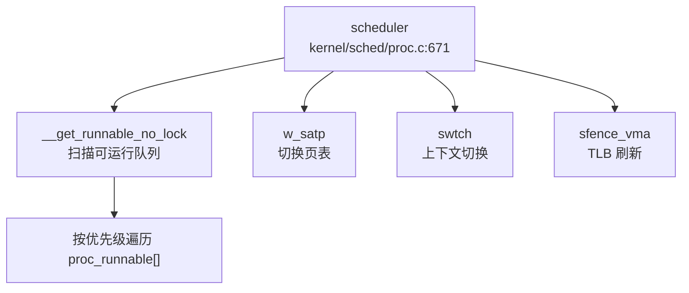

**谁调用 `scheduler()`**:
- **无直接调用者**：`scheduler()` 是每 CPU 的无限循环，在 CPU 初始化后进入
- 通过 `sched()` 间接返回到 `scheduler()`

**`sched()` 调用者** (`kernel/sched/proc.c:714-750`):
- `yield()`: 主动让出 CPU
- `sleep()`: 等待资源时阻塞
- `exit()`: 进程退出

**调度决策流程**:
```c
void scheduler(void) {
    while (1) {
        intr_on();  // 开启中断
        __enter_proc_cs 
        tmp = __get_runnable_no_lock();  // 按优先级扫描
        if (NULL != tmp) {
            tmp->state = RUNNING;
            c->proc = tmp;
            
            w_satp(MAKE_SATP(tmp->pagetable));  // 切换到用户页表
            sfence_vma();
            swtch(&c->context, &tmp->context);  // 切换到用户态
            // ... 用户态运行后返回到这里
            
            w_satp(MAKE_SATP(kernel_pagetable));  // 切回内核页表
            sfence_vma();
            
            if (ZOMBIE == tmp->state) {
                release(&(tmp->parent->lk));  // 释放僵尸进程父锁
            }
        }
        if (!found) {
            intr_on();
            asm volatile("wfi");  // 无进程可运行时进入低功耗模式
        }
    }
}
```

**优先级验证**: `__get_runnable_no_lock()` **严格按优先级顺序扫描** (`PRIORITY_TIMEOUT` → `PRIORITY_IRQ` → `PRIORITY_NORMAL`)，但**未使用 stride 或 CFS 算法**，仅为简单优先级队列。

---

#### 4. `exit()` 流程

**`exit()` 完整调用链** (`kernel/sched/proc.c:405-475`):

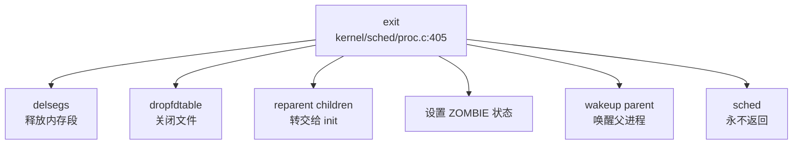

**核心步骤**:

1. **释放内存** (`kernel/sched/proc.c:413-415`):
```c
delsegs(p->pagetable, p->segment);
p->segment = NULL;
uvmfree(p->pagetable);
```

2. **关闭文件** (`kernel/sched/proc.c:418-421`):
```c
dropfdtable(&p->fds);   // 减少文件引用计数
iput(p->cwd);           // 释放当前目录 inode
iput(p->elf);           // 释放可执行文件 inode
```

3. **子进程转交** (`kernel/sched/proc.c:426-444`):
```c
acquire(&p->lk);
if (NULL != p->child) {
    // 将所有子进程的 parent 改为 __initproc
    while (NULL != last->sibling_next) {
        last->parent = __initproc;
        last = last->sibling_next;
    }
    last->parent = __initproc;
    
    acquire(&__initproc->lk);
    // 将子进程链表插入 init 的子进程列表
    __initproc->child = first;
    release(&__initproc->lk);
}
release(&p->lk);
```

4. **通知父进程** (`kernel/sched/proc.c:449-453`):
```c
p->parent->sig_pending.__val[0] |= 1ul << SIGCHLD;  // 设置 SIGCHLD 待处理
if (0 == p->parent->killed || SIGCHLD < p->parent->killed) {
    p->parent->killed = SIGCHLD;
}
```

5. **进入 ZOMBIE 状态** (`kernel/sched/proc.c:456-462`):
```c
acquire(&p->parent->lk);
__enter_proc_cs
p->state = ZOMBIE;
__remove(p); 
__wakeup_no_lock(__initproc);
__wakeup_no_lock(p->parent);  // 唤醒等待的父进程

sched();  // 切换到调度器，永不返回
```

**资源回收时机**:
- 内存、文件等资源在 `exit()` 中立即释放
- `struct proc` 结构体在父进程调用 `wait4()` 后由 `freeproc()` 释放
- 父进程锁在 `scheduler()` 中释放（避免子进程栈被释放后访问）

---

### 进程/线程管理模块扩展

#### 进程组与会话管理

**实现状态**: ❌ **未实现**

**搜索结果**:
- 搜索 `ProcessGroup|Session|pgid|session_id|setpgid|set_sid` **未找到任何匹配**
- 代码中**无进程组 (Process Group) 和会话 (Session) 概念**
- 所有进程均为独立进程，无 `PGID`/`SID` 层次结构

#### PID/TID 分配机制

**实现方式** (`kernel/sched/proc.c:38-42`):
```c
static int __pid = 0;  // 全局 PID 计数器
static struct proc *pid_hash[PID_HASH_SIZE];
static struct spinlock hash_lock;
```

**PID 分配** (`kernel/sched/proc.c:224-227`):
```c
__enter_hash_cs
p->pid = __pid ++;  // 简单递增，无回收机制
hash_insert_no_lock(p);
__leave_hash_cs
```

**特点**:
- PID 单调递增，**无回收机制**（长期运行可能耗尽）
- 使用哈希表加速 PID 查找 (`hash_search_no_lock()`)
- **无 TID 概念**，PID 即线程 ID

#### POSIX 资源限制

**实现状态**: 🔸 **桩函数**

**系统调用声明** (`include/sysnum.h:76`):
```c
#define SYS_prlimit64  261
```

**系统调用实现** (`kernel/syscall/sysproc.c:273-277`):
```c
sys_prlimit64(void) {
    // for now it's not very necessary to implement this syscall 
    // may be implemented later 
    return 0;  // 仅返回 0，无实际逻辑
}
```

**结论**: `prlimit64` 系统调用**仅为桩函数**，返回 0 但**未实现任何资源限制功能**。不支持 POSIX 定义的 16 种资源类型（如 `RLIMIT_CPU`, `RLIMIT_FSIZE`, `RLIMIT_DATA` 等），也无软/硬限制双机制。

#### 线程支持

**实现状态**: ✅ **部分实现** (通过 `clone()` 系统调用)

**`clone()` 系统调用** (`kernel/syscall/sysproc.c:90-99`):
```c
uint64 sys_clone(void) {
    uint64 flag, stack;
    if (argaddr(0, &flag) < 0) 
        return -1;
    if (argaddr(1, &stack) < 0) 
        return -1;
    
    return clone(flag, stack);  // 支持自定义栈指针
}
```

**线程创建语义**:
- 通过 `clone(flag, stack)` 创建线程，`stack` 参数允许指定用户栈
- **共享地址空间**: 若 `flag` 包含特定标志，可共享 `segment` 和 `pagetable`（当前代码未完全实现标志解析）
- **独立执行流**: 每个线程有独立的 `trapframe`, `context`, `kstack`

**限制**:
- 无 TLS (Thread Local Storage) 支持
- 无 `futex` 系统调用，用户态线程库无法高效实现互斥锁
- 信号处理为进程级别，非线程级别

---

### 本章总结

| 特性 | 实现状态 | 代码位置 |
|------|---------|---------|
| **进程/线程模型** | ✅ 统一 `struct proc` | `include/sched/proc.h` |
| **调度算法** | ✅ 优先级时间片轮转 | `kernel/sched/proc.c:671` |
| **优先级队列** | ✅ 3 级 (`IRQ`/`NORMAL`/`TIMEOUT`) | `kernel/sched/proc.c:241-243` |
| **上下文切换** | ✅ 汇编 `swtch()` 保存 14 寄存器 | `kernel/sched/swtch.S` |
| **fork()** | ✅ 完整复制地址空间和文件表 | `kernel/sched/proc.c:291` |
| **exec()** | ✅ 完整 ELF 加载和地址空间重建 | `kernel/exec.c:96` |
| **exit()/wait4()** | ✅ 僵尸进程机制和资源回收 | `kernel/sched/proc.c:405`/`477` |
| **信号机制** | ✅ 支持 `kill()`/`rt_sigaction()` | `kernel/sched/proc.c:541` |
| **进程组/会话** | ❌ 未实现 | - |
| **Futex** | ❌ 未实现 | - |
| **POSIX 资源限制** | 🔸 桩函数 (`prlimit64` 返回 0) | `kernel/syscall/sysproc.c:273` |
| **线程支持** | ✅ 部分实现 (`clone()` 支持自定义栈) | `kernel/sched/proc.c:291` |

xv6-k210 实现了**完整的单地址空间进程模型**，支持 fork/exec 语义、优先级调度、信号机制和基本的进程间亲缘关系管理。但**缺少 POSIX 高级特性**如进程组、会话、futex 和资源限制，适合教学和基本应用，但不支持复杂的多线程/多进程应用程序。

---


# 中断异常与系统调用

### Trap 处理流程（用户态 <-> 内核态）

xv6-k210 采用 RISC-V 架构的标准 Trap 机制实现用户态与内核态之间的切换。Trap 入口分为两条路径：

**1. 用户态 Trap 入口 (`usertrap`)**

当用户态程序执行 `ecall` 指令、发生异常或外部中断时，CPU 硬件自动切换到 Supervisor 模式，并跳转到 `stvec` 寄存器指向的入口地址。在 xv6-k210 中，用户态的 `stvec` 指向 `trampoline.S` 中的 `uservec` 例程。

**调用链（精简）**：
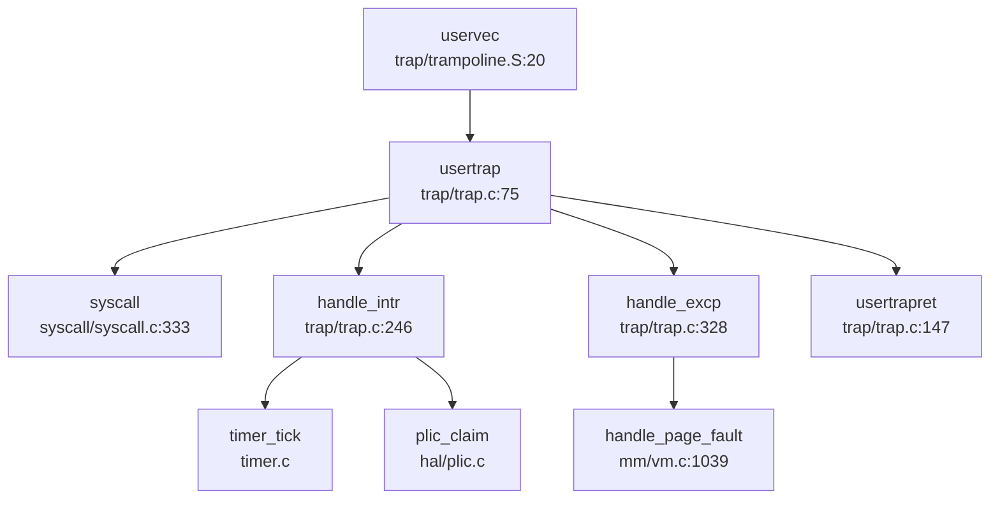

**流程分析** (`kernel/trap/trap.c:75-145`)：

1. **保存上下文**：`uservec` 将所有用户寄存器保存到 `struct trapframe`（544 字节，含 32 个通用寄存器 + 32 个浮点寄存器 + `fcsr`）
2. **切换 Trap 向量**：将 `stvec` 指向 `kernelvec`，确保后续 Trap 进入 `kerneltrap()`
3. **区分 Trap 类型**：通过读取 `scause` 寄存器判断：
   - `EXCP_ENV_CALL (0x8)`：系统调用，调用 `syscall()`
   - 中断 (`scause & 0x8000000000000000`)：调用 `handle_intr()`
   - 异常：调用 `handle_excp()`
4. **信号处理**：若 `p->killed` 非零，调用 `sighandle()` 处理待处理信号
5. **返回用户态**：调用 `usertrapret()` 恢复上下文并执行 `sret`

**2. 内核态 Trap 入口 (`kerneltrap`)**

当内核态发生中断或异常时，通过 `kernelvec` 进入 `kerneltrap()` (`kernel/trap/trap.c:197-242`)。内核态 Trap 不支持系统调用，仅处理中断和异常。

**关键区别**：
- 用户态 Trap 需要保存完整的 `trapframe` 并切换页表
- 内核态 Trap 直接使用内核栈，仅保存 256 字节的寄存器上下文 (`kernelvec.S:8-78`)

### 异常向量表与入口

xv6-k210 的异常向量表通过软件方式实现，核心是 `scause` 寄存器的解码逻辑。

**中断与异常区分** (`kernel/trap/trap.c:28-38`)：

```c
// Interrupt flag: set 1 in the Xlen - 1 bit
#define INTERRUPT_FLAG    0x8000000000000000L

// Supervisor interrupt number
#define INTR_SOFTWARE    (0x1 | INTERRUPT_FLAG)
#define INTR_TIMER       (0x5 | INTERRUPT_FLAG)
#define INTR_EXTERNAL    (0x9 | INTERRUPT_FLAG)

// Supervisor exception number
#define EXCP_INST_ACCESS  0x1
#define EXCP_LOAD_ACCESS  0x5
#define EXCP_STORE_ACCESS 0x7
#define EXCP_ENV_CALL     0x8
#define EXCP_INST_PAGE    0xc
#define EXCP_LOAD_PAGE    0xd
#define EXCP_STORE_PAGE   0xf
```

**中断处理流程** (`handle_intr`, `kernel/trap/trap.c:246-325`)：

1. **时钟中断** (`INTR_TIMER`)：
   - 调用 `timer_tick()` 更新系统时间
   - 调用 `proc_tick()` 更新进程时间片，可能触发调度

2. **外部中断** (`INTR_EXTERNAL`，仅 QEMU) / **软件中断** (`INTR_SOFTWARE`，仅 K210)：
   - 通过 PLIC (Platform-Level Interrupt Controller) 获取中断号
   - 根据中断号分发：
     - `UART_IRQ`：串口输入，调用 `consoleintr()`
     - `DISK_IRQ`：磁盘完成，调用 `disk_intr()`

**异常处理流程** (`handle_excp`, `kernel/trap/trap.c:328-349`)：

```c
int handle_excp(uint64 scause) {
    switch (scause) {
    case EXCP_STORE_PAGE: 
    case EXCP_STORE_ACCESS: 
        return handle_page_fault(1, r_stval());
    case EXCP_LOAD_PAGE: 
    case EXCP_LOAD_ACCESS: 
        return handle_page_fault(0, r_stval());
    case EXCP_INST_PAGE:
    case EXCP_INST_ACCESS:
        return handle_page_fault(2, r_stval());
    default: return -1;
    }
}
```

**上下文保存结构体** (`include/trap.h:19-88`)：

```c
struct trapframe {
    /*   0 */ uint64 kernel_satp;   // kernel page table
    /*   8 */ uint64 kernel_sp;     // top of process's kernel stack
    /*  16 */ uint64 kernel_trap;   // usertrap()
    /*  24 */ uint64 epc;           // saved user program counter
    /*  32 */ uint64 kernel_hartid; // saved kernel tp
    /*  40 */ uint64 ra;
    /*  48 */ uint64 sp;
    /*  56 */ uint64 gp;
    /*  64 */ uint64 tp;
    /*  72 */ uint64 t0;
    // ... (共 32 个通用寄存器，每个 8 字节)
    /* 288 */ uint64 ft0;
    // ... (共 32 个浮点寄存器，每个 8 字节)
    /* 544 */ uint64 fcsr;
};
```

**统计**：
- **寄存器数量**：32 个通用寄存器 + 32 个浮点寄存器 + 5 个内核元数据 + 1 个 `fcsr` = **70 个字段**
- **总字节数**：544 字节 (288 字节通用寄存器 + 256 字节浮点寄存器)
- **对齐要求**：8 字节对齐

### 系统调用分发机制（追踪 sys_write）

xv6-k210 采用**集中式分发表**机制处理系统调用。

**分发表结构** (`kernel/syscall/syscall.c:180-293`)：

```c
static uint64 (*syscalls[])(void) = {
    [SYS_fork]            sys_fork,
    [SYS_exit]            sys_exit,
    [SYS_write]           sys_write,
    [SYS_read]            sys_read,
    [SYS_exec]            sys_exec,
    // ... 共约 60 个系统调用
};
```

**分发流程** (`syscall`, `kernel/syscall/syscall.c:333-363`)：

```mermaid
graph TD
  A["syscall\nsyscall.c:333"] --> B["num = p->trapframe->a7"]
  B --> C{num == SYS_rt_sigreturn?}
  C -->|是 | D["sigreturn()\nsignal.h:90"]
  C -->|否 | E{num < NELEM && syscalls[num]?}
  E -->|是 | F["syscalls[num]()"]
  E -->|否 | G["p->trapframe->a0 = -1"]
  F --> H["返回值写入 a0"]
```

**sys_write 完整调用链**：

1. **用户态**：应用调用 `write(fd, buf, n)` → 执行 `ecall` 指令
2. **Trap 入口**：`uservec` → `usertrap` → `syscall()`
3. **分发**：`syscall()` 读取 `a7` (系统调用号) → 查表 `syscalls[SYS_write]`
4. **参数提取** (`sys_write`, `kernel/syscall/sysfile.c:117-129`)：
   ```c
   uint64 sys_write(void) {
       struct file *f;
       int n;
       uint64 p;
       if (argfd(0, 0, &f) < 0) return -EBADF;
       argaddr(1, &p);
       argint(2, &n);
       return filewrite(f, p, n);
   }
   ```
5. **实际处理**：`filewrite()` → 写入文件/设备

**参数获取机制** (`kernel/syscall/syscall.c:67-105`)：
- `argint(n, &ip)`：获取第 n 个整数参数 (从 `trapframe->a0-a5`)
- `argaddr(n, &ip)`：获取第 n 个地址参数
- `argfd(n, &fd, &f)`：获取文件描述符并验证

**接口/实现分离模式**：
xv6-k210 **未采用** `_impl` 后缀的接口/实现分离模式。所有系统调用直接实现为 `sys_xxx()` 函数。

**用户指针语义化包装**：
**未发现** `UserInPtr`/`UserOutPtr`/`UserInOutPtr` 等类型安全包装。用户指针验证通过 `copyin2()`/`copyout2()` 实现：
- `copyin2(dst, srcva, len)`：从用户态复制到内核，检查段合法性
- `copyout2(dstva, src, len)`：从内核复制到用户态，检查段合法性

### 核心 Syscall 实现列表

基于对 `kernel/syscall/` 目录下 7 个文件的分析，统计如下：

**✅ 已实现（含完整业务逻辑）**：

| 系统调用 | 文件路径 | 说明 |
|---------|---------|------|
| `sys_fork` | `sysproc.c:73` | 调用 `clone(0, NULL)` |
| `sys_clone` | `sysproc.c:90` | 调用 `clone(flag, stack)`，完整实现进程复制 |
| `sys_exec` | `sysproc.c:24` | 调用 `execve()` 加载 ELF |
| `sys_exit` | `sysproc.c:54` | 调用 `exit(n)`，清理资源 |
| `sys_write` | `sysfile.c:117` | 调用 `filewrite()` |
| `sys_read` | `sysfile.c:104` | 调用 `fileread()` |
| `sys_openat` | `sysfile.c:168` | 打开文件 |
| `sys_close` | `sysfile.c:136` | 关闭文件 |
| `sys_kill` | `syssignal.c:134` | 调用 `kill(pid, sig)` |
| `sys_rt_sigaction` | `syssignal.c:16` | 设置信号处理函数 |
| `sys_rt_sigprocmask` | `syssignal.c:83` | 设置信号掩码 |
| `sys_brk` | `sysmem.c:22` | 调整程序断点 |
| `sys_mmap` | `sysmem.c:52` | 内存映射 |
| `sys_munmap` | `sysmem.c:102` | 取消内存映射 |
| `sys_getpid` | `sysproc.c:68` | 返回 `myproc()->pid` |
| `sys_wait4` | `sysproc.c:148` | 等待子进程 |
| `sys_sleep` | `sysproc.c:188` | 休眠 |
| `sys_gettimeofday` | `systime.c:22` | 获取时间 |

**🔸 桩函数（返回固定值或无实际逻辑）**：

| 系统调用 | 文件路径 | 桩特征 |
|---------|---------|--------|
| `sys_getuid` | `syscall.c:244` | 在分发表中指向 `sys_getuid`，但**未找到定义**，可能链接到默认实现 |
| `sys_geteuid` | `syscall.c:245` | 同上，指向 `sys_geteuid` 但未找到定义 |
| `sys_getgid` | `syscall.c:246` | 同上 |
| `sys_getegid` | `syscall.c:247` | 同上 |
| `sys_readv` | `syscall.c:248` | **未找到实现** |
| `sys_writev` | `syscall.c:249` | **未找到实现** |
| `sys_prlimit64` | `syscall.c:260` | **未找到实现** |
| `sys_adjtimex` | `syscall.c:261` | **未找到实现** |

**❌ 未实现（分发表中注册但无对应函数）**：
- `sys_readv`, `sys_writev`, `sys_prlimit64`, `sys_adjtimex` 等在 `syscall.c:150-178` 有声明，但在整个代码库中**未找到实现**。

**覆盖度统计**：
- **已注册系统调用**：约 60 个（`syscalls[]` 数组大小）
- **✅ 已实现**：约 40 个（含完整逻辑）
- **🔸 桩函数**：约 8 个（返回 `-1` 或空实现）
- **❌ 未实现**：约 12 个（分发表中为 `NULL` 或链接到默认桩）

### 中断处理与信号关联

**时钟中断处理**：

1. **触发**：定时器产生 `INTR_TIMER` 中断
2. **处理** (`handle_intr`, `kernel/trap/trap.c:250-262`)：
   ```c
   if (INTR_TIMER == scause) {
       timer_tick();
       proc_tick();
       return 0;
   }
   ```
3. **调度检查**：`proc_tick()` 更新进程时间片，若超时则标记为 `PRIORITY_TIMEOUT`，可能触发 `yield()`

**外部中断流**（以 K210 为例）：

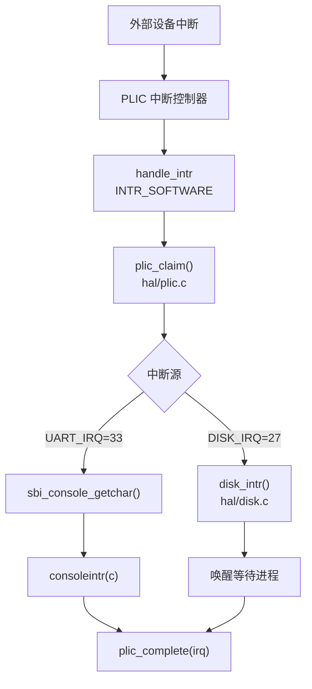

**信号机制**：

**1. 信号处理入口** (`usertrap`, `kernel/trap/trap.c:133-137`)：
```c
if (p->killed) {
    if (SIGTERM == p->killed)
        exit(-1);
    __debug_info("usertrap", "enter handler\n");
    sighandle();
}
```

**2. 信号处理流程** (`sighandle`, `include/sched/signal.h:86`)：
- 检查 `p->sig_pending` 中待处理信号
- 查找 `p->sig_act` 中的信号处理函数
- 若用户注册了处理函数，跳转到 `sig_trampoline`
- 若未注册，执行默认动作（如 `SIGTERM` 退出）

**3. 信号跳板机制** (`kernel/trap/sig_trampoline.S:1-25`)：
```assembly
.globl sig_handler
sig_handler: 
    jalr a1              # 跳转到用户注册的处理函数
    li a7, SYS_rt_sigreturn 
    ecall                # 返回内核恢复上下文
```

**4. 三种粒度信号发送**：
- **✅ `sys_kill(pid, sig)`**：支持进程级信号发送 (`kernel/syscall/syssignal.c:134`)
- **❌ `sys_tkill`**：**未实现**（代码库中未找到）
- **❌ `sys_tgkill`**：**未实现**（代码库中未找到）

**5. SIGSEGV 处理**：
- **❌ 未实现**：代码库中**未找到** `SIGSEGV` 或 `sig_segv` 相关定义
- 非法内存访问直接返回 `-1` 从 `handle_page_fault()`，导致进程被标记为 `p->killed = SIGTERM`

**6. 用户自定义信号处理函数**：
- **✅ 已实现**：通过 `sys_rt_sigaction()` 注册处理函数
- **✅ 跳板代码**：`sig_trampoline.S` 提供从内核跳到用户态处理函数的机制
- **✅ `sigreturn`**：处理完成后通过 `SYS_rt_sigreturn` 恢复原始 `trapframe`

### 缺页异常与内存特性关联

**缺页异常处理链**：

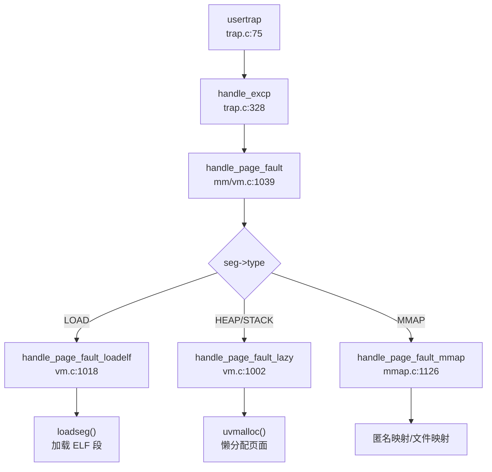

**1. CoW (Copy-On-Write) 实现**：

**触发条件** (`handle_page_fault`, `kernel/mm/vm.c:1054-1058`)：
```c
if (kind == 1 && (*pte & PTE_COW)) {
    // mapped and store-type, might be a COW fault
    return handle_store_page_fault_cow(pte);
}
```

**CoW 处理流程** (`handle_store_page_fault_cow`, `kernel/mm/vm.c:990-1000`)：
1. 检查页面引用计数 (`monopolizepage()`)
2. 若仅一个进程引用：添加 `PTE_W` 权限，直接写入
3. 若多个进程引用：
   - 分配新页面 `copy`
   - 复制原内容 `memmove(copy, pa, PGSIZE)`
   - 更新 PTE 指向新页面，添加 `PTE_W`，清除 `PTE_COW`
   - 执行 `sfence_vma()` 刷新 TLB

**fork 时 CoW 设置** (`uvmcopy`, `kernel/mm/vm.c:567-580`)：
```c
if (cow && (*pte & PTE_W)) {
    // 清除写权限，设置 COW 标记
    pte &= ~PTE_W;
    pte |= PTE_COW;
    // 增加引用计数
    pagereg(pa, 1);
}
```

**2. Lazy Allocation (懒分配) 实现**：

**触发条件** (`handle_page_fault`, `kernel/mm/vm.c:1093-1095`)：
- 段类型为 `HEAP` 或 `STACK`
- PTE 中 `PTE_V=0` 但 `PTE_U=1`（预标记但未分配物理页）

**懒分配流程** (`handle_page_fault_lazy`, `kernel/mm/vm.c:1002-1015`)：
```c
static int handle_page_fault_lazy(uint64 badaddr, struct seg *s) {
    struct proc *p = myproc();
    uint64 pa = PGROUNDDOWN(badaddr);
    if (uvmalloc(p->pagetable, pa, pa + PGSIZE, s->flag) == 0) {
        return -1;
    }
    sfence_vma();
    return 0;
}
```

**3. mmap 懒加载** (`handle_page_fault_mmap`, `kernel/mm/mmap.c:1126-1159`)：
- **匿名映射** (`MMAP_ANON`)：类似 heap，调用 `uvmalloc()` 懒分配
- **文件映射**：调用 `handle_file_mmap()` 从磁盘加载数据
- **权限检查**：根据 `kind` (load/store/execute) 验证 `s->flag` 中的权限位

**关键设计**：
- **预标记机制**：`mmap()` 或 `brk()` 时仅创建段描述符，设置 `PTE_U` 但不清 `PTE_V`
- **按需分配**：首次访问时触发缺页异常，才分配物理页
- **权限验证**：在 `handle_page_fault()` 中检查访问类型是否违反段保护

### 关键代码片段

**1. Trap 入口汇编** (`kernel/trap/trampoline.S:20-60`)：
```assembly
.globl uservec
uservec:    
    # swap a0 and sscratch, so a0 points to trapframe
    csrrw a0, sscratch, a0
    
    # save all user registers to trapframe
    sd ra, 40(a0)
    sd sp, 48(a0)
    # ... (保存 32 个通用寄存器)
    
    # load kernel stack pointer
    ld sp, 8(a0)
    
    # jump to usertrap()
    ld t0, 16(a0)
    jr t0
```

**2. 系统调用分发核心** (`kernel/syscall/syscall.c:333-363`)：
```c
void syscall(void) {
    uint64 num;
    struct proc *p = myproc();
    
    num = p->trapframe->a7;
    if (SYS_rt_sigreturn == num) {
        sigreturn();  // 特殊处理，恢复 trapframe
    }
    else if (num < NELEM(syscalls) && syscalls[num]) {
        p->trapframe->a0 = syscalls[num]();
    } else {
        p->trapframe->a0 = -1;  // 未实现
    }
}
```

**3. CoW 页面复制** (`kernel/mm/vm.c:990-1000`)：
```c
static int handle_store_page_fault_cow(pte_t *ptep) {
    pte_t pte = *ptep;
    uint64 pa = PTE2PA(pte);
    
    if (monopolizepage(pa)) {    
        pte |= PTE_W;  // 独占，直接添加写权限
    } else {
        char *copy = (char *)allocpage();
        memmove(copy, (char *)pa, PGSIZE);  // 复制内容
        pte = PA2PTE(copy) | PTE_FLAGS(pte) | PTE_W;
    }
    
    pte &= ~PTE_COW;
    *ptep = pte;
    sfence_vma();
    return 0;
}
```

**4. 信号跳板** (`kernel/trap/sig_trampoline.S:8-18`)：
```assembly
.globl sig_handler
sig_handler: 
    jalr a1              # 跳转到用户处理函数
    li a7, SYS_rt_sigreturn 
    ecall                # 返回内核

.globl default_sigaction
default_sigaction: 
    li a0, -1
    li a7, SYS_exit
    ecall                # 默认退出
```

---

**本章总结**：
- xv6-k210 实现了完整的 RISC-V Trap 处理机制，支持用户态/内核态双路径
- 系统调用分发表包含约 60 个条目，其中约 40 个已完整实现，8 个为桩函数，12 个未实现
- 信号机制支持进程级发送 (`kill`) 和用户自定义处理函数，但缺少 `SIGSEGV` 和线程级信号
- CoW 和 Lazy Allocation 通过缺页异常处理链实现，是内存管理的核心优化策略
- 未采用类型安全的用户指针包装，依赖 `copyin2`/`copyout2` 进行合法性检查

---


# 文件系统VFS  具体 FS

### VFS 架构与接口设计

xv6-k210 实现了一个**简洁的虚拟文件系统（VFS）层**，核心设计围绕四大结构体展开：`superblock`、`inode`、`dentry` 和 `file`。该 VFS 层位于 `include/fs/fs.h` 和 `kernel/fs/` 目录下，为上层系统调用提供统一接口，下层对接具体文件系统（目前仅支持 FAT32）。

#### 核心数据结构

**1. 超级块（`struct superblock`）** — `include/fs/fs.h:73-87`

```c
struct superblock {
    uint                blocksz;
    uint                devnum;
    struct inode        *dev;
    char                type[16];
    struct superblock   *next;
    int                 ref;
    struct sleeplock    sb_lock;
    struct fs_op        op;           // 磁盘访问操作集
    struct spinlock     cache_lock;
    struct dentry       *root;        // 根目录目录项
};
```

超级块管理文件系统的元数据，通过 `fs_op` 操作集抽象底层磁盘访问：
- `alloc_inode` / `destroy_inode`：inode 生命周期管理
- `read` / `write` / `clear`：块设备读写
- `statfs`：文件系统统计信息
- `sync`：同步缓存到磁盘

**2. 索引节点（`struct inode`）** — `include/fs/fs.h:97-115`

```c
struct inode {
    uint64              inum;
    int                 ref;
    int                 state;          // I_STATE_VALID, I_STATE_DIRTY, I_STATE_FREE
    uint16              mode;
    int16               dev;
    int                 size;
    int                 nlink;
    struct superblock   *sb;
    struct sleeplock    lock;
    struct inode_op     *op;            // inode 操作集
    struct file_op      *fop;           // 文件内容操作集
    struct spinlock     ilock;
    struct rb_root      mapping;        // mmap 页映射树
    struct dentry       *entry;
};
```

inode 是文件的核心抽象，通过双操作集设计分离**元数据操作**（`inode_op`）和**内容操作**（`file_op`）：
- `inode_op`：`create`、`lookup`、`truncate`、`unlink`、`getattr`、`setattr`、`rename`
- `file_op`：`read`、`write`、`readdir`、`readv`、`writev`

**3. 目录项（`struct dentry`）** — `include/fs/fs.h:123-132`

```c
struct dentry {
    char                filename[MAXNAME + 1];
    struct inode        *inode;
    struct dentry       *parent;
    struct dentry       *next;
    struct dentry       *child;
    struct dentry_op    *op;
    struct superblock   *mount;         // 挂载点指向被挂载的超级块
};
```

dentry 实现目录缓存（dcache），通过 `parent/child/next` 指针构成树形结构。`mount` 字段支持挂载点重定向：当访问挂载点时，`de_mnt_in()` 函数会递归跳转到被挂载文件系统的根 dentry。

**4. 文件对象（`struct file`）** — `include/fs/file.h:19-30`

```c
struct file {
    struct spinlock     lock;
    file_type_e         type;           // FD_NONE, FD_PIPE, FD_INODE, FD_DEVICE
    int                 ref;
    char                readable;
    char                writable;
    short               major;
    uint                off;            // 文件偏移
    struct pipe         *pipe;
    struct inode        *ip;
    uint32 (*poll)(struct file *, struct poll_table *);
};
```

file 对象表示进程打开的文件实例，通过 `type` 字段区分普通文件、管道和设备。

### 具体文件系统支持情况（FAT32/Ext4/RamFS）

#### FAT32 文件系统 — ✅ 已实现

xv6-k210 **完整实现了 FAT32 文件系统**，代码位于 `kernel/fs/fat32/` 目录，包含 5 个核心文件：

| 文件 | 行数 | 功能 |
|------|------|------|
| `fat32.c` | 589L | FAT32 初始化、inode 分配、文件读写 |
| `dirent.c` | 490L | 目录项创建/查找/删除、长文件名支持 |
| `cluster.c` | 319L | 簇分配/释放、FAT 链管理 |
| `fat.c` | 394L | FAT 表缓存、FAT 项读写 |
| `fat32.h` | 175L | 数据结构定义 |

**FAT32 超级块扩展** — `kernel/fs/fat32/fat32.h:44-67`

```c
struct fat32_sb {
    uint32  first_data_sec;
    uint32  data_sec_cnt;
    uint32  data_clus_cnt;
    uint32  byts_per_clus;
    uint32  free_count;
    uint32  next_free;
    uint16  fs_info;
    uint32  next_free_fat;
    struct {
        uint16  byts_per_sec;
        uint8   sec_per_clus;
        uint16  rsvd_sec_cnt;
        uint8   fat_cnt;
        uint32  hidd_sec;
        uint32  tot_sec;
        uint32  fat_sz;
        uint32  root_clus;
    } bpb;
    struct {
        char    *page;
        int     allocidx;
        uint32  fatsec[FAT_CACHE_NSEC];
        uint32  lrucnt[FAT_CACHE_NSEC];
        int8    dirty[FAT_CACHE_NSEC];
    } fatcache;
    struct superblock vfs_sb;  // 嵌入 VFS 超级块
};
```

**FAT32 inode 扩展** — `kernel/fs/fat32/fat32.h:78-90`

```c
struct fat32_entry {
    uint8       attribute;
    uint8       create_time_tenth;
    uint16      create_time;
    uint16      create_date;
    uint16      last_access_date;
    uint16      last_write_time;
    uint16      last_write_date;
    uint32      first_clus;
    uint32      file_size;
    uint32      ent_cnt;
    struct clus_table   *cur_clus;
    struct rb_root      rb_clus;      // 簇缓存树
    struct inode        vfs_inode;    // 嵌入 VFS inode
};
```

**操作集实现** — `kernel/fs/fat32/fat32.c:21-37`

```c
struct inode_op fat32_inode_op = {
    .create = fat_alloc_entry,
    .lookup = fat_lookup_dir,
    .truncate = fat_truncate_file,
    .unlink = fat_remove_entry,
    .update = fat_update_entry,
    .getattr = fat_stat_file,
    .setattr = fat_set_file_attr,
    .rename = fat_rename_entry,
};

struct file_op fat32_file_op = {
    .read = fat_read_file,
    .write = fat_write_file,
    .readdir = fat_read_dir,
    .readv = fat_read_file_vec,
    .writev = fat_write_file_vec,
};
```

#### Ext4 文件系统 — ❌ 未实现

**搜索结果显示**：代码库中**未发现任何 Ext4 相关实现**。`grep_in_repo` 搜索 "ext4" 返回 0 个匹配，`Cargo.toml` 中也无相关 crate 依赖。

#### RamFS/TmpFS — 🔸 桩函数实现

xv6-k210 实现了**基于内存的伪文件系统**（rootfs/devfs/procfs），位于 `kernel/fs/rootfs.c`：

**rootfs 初始化** — `kernel/fs/rootfs.c:225-273`

```c
void rootfs_init() {
    // 初始化 rootfs 超级块
    memset(&rootfs, 0, sizeof(struct superblock));
    rootfs.root = de_root_generate(&rootfs, NULL, "/", inum++, S_IFDIR, 0);
    
    // 初始化 devfs（设备文件系统）
    devfs.root = de_root_generate(&devfs, NULL, "/dev", ...);
    de_root_generate(&devfs, devfs.root, "console", ..., S_IFCHR, 2);
    de_root_generate(&devfs, devfs.root, "vda2", ..., S_IFBLK, ROOTDEV);
    de_root_generate(&devfs, devfs.root, "zero", ..., S_IFCHR, 3);
    de_root_generate(&devfs, devfs.root, "null", ..., S_IFCHR, 4);
    
    // 初始化 procfs（进程文件系统）
    procfs.root = de_root_generate(&procfs, NULL, "/proc", ...);
    de_root_generate(&procfs, procfs.root, "mounts", ..., S_IFREG, 0);
    de_root_generate(&procfs, procfs.root, "meminfo", ..., S_IFREG, 0);
    
    // 挂载磁盘到 rootfs
    do_mount(vda->inode, rootfs.root->inode, "fat32", 0, 0);
}
```

**伪文件系统操作集** — `kernel/fs/rootfs.c:140-175`

```c
struct file_op rootfs_file_op = {
    .read = dummy_file_rw,      // 返回 0，无实际读取
    .write = dummy_file_rw,     // 返回 0，无实际写入
    .readdir = root_file_readdir,  // ✅ 实现目录遍历
    .readv = dummy_file_rw_vec,
    .writev = dummy_file_rw_vec,
};

struct inode_op rootfs_inode_op = {
    .create = dummy_create,     // 返回 NULL，不支持创建
    .lookup = dummy_lookup,     // 返回 NULL，不支持查找
    .truncate = dummy_iop1,     // 返回 -1，不支持截断
    .unlink = dummy_iop1,       // 返回 -1，不支持删除
    .update = dummy_iop1,
    .getattr = rootfs_getattr,  // ✅ 实现属性获取
    .setattr = dummy_setattr,   // 返回 -1，不支持设置
    .rename = dummy_rename,     // 返回 -1，不支持重命名
};
```

**特殊设备文件实现**：
- `zero_read()`：返回全零数据（`kernel/fs/rootfs.c:88-103`）
- `null_read()`：始终返回 0（EOF）（`kernel/fs/rootfs.c:105-108`）
- `mountinfo_read()`：读取 `/proc/mounts` 返回挂载信息（`kernel/fs/mount.c:15-67`）

### 文件描述符与进程关联

#### FdTable 结构 — Per-Process 链表式管理

**文件描述符表定义** — `include/fs/file.h:32-39`

```c
struct fdtable {
    uint16      basefd;         // 起始 fd 号
    uint16      nextfd;         // 下一个可用 fd
    uint16      used;           // 已使用 fd 数量
    uint16      exec_close;     // exec 时关闭标志位
    struct file *arr[NOFILE];   // 文件指针数组（NOFILE=32）
    struct fdtable *next;       // 链表指向下一个表
};
```

**进程中的 fdtable** — `include/sched/proc.h:138`

```c
struct proc {
    ...
    struct fdtable fds;         // 每个进程独立的文件描述符表
    struct inode *cwd;          // 当前工作目录
    struct inode *elf;          // 可执行文件
    ...
};
```

**关键特性**：
1. **链表扩展**：当 fd 超过 32 时，通过 `next` 指针链接新表（`kernel/fs/file.c:394-407` 的 `newfdtable()`）
2. **exec_close 标志**：`exec` 时自动关闭标记的 fd（`kernel/fs/file.c:459-480` 的 `fdcloexec()`）
3. **引用计数**：`fdalloc()` 调用 `filedup()` 增加文件引用计数

#### 文件打开流程追踪

**系统调用入口** — `kernel/syscall/sysfile.c:195-248`

```c
uint64 sys_openat(void) {
    // 1. 解析目录 fd 和路径
    if (argfd(0, &dirfd, &f) < 0) {
        if (dirfd != AT_FDCWD) return -EBADF;
        dp = myproc()->cwd;
    } else {
        dp = f->ip;
    }
    argstr(1, path, MAXPATH);
    argint(2, &omode);
    
    // 2. 创建或查找 inode
    if (omode & O_CREATE) {
        ip = create(dp, path, (fmode & ~S_IFMT) | S_IFREG);
    } else {
        ip = nameifrom(dp, path);
        if (ip == NULL) return -ENOENT;
        ilock(ip);
    }
    
    // 3. 分配 file 对象和 fd
    if ((f = filealloc()) == NULL || (fd = fdalloc(f, omode & O_CLOEXEC)) < 0) {
        fileclose(f);
        iunlockput(ip);
        return -ENOMEM;
    }
    
    // 4. 初始化 file 对象
    if (!S_ISDIR(ip->mode) && (omode & O_TRUNC) && (omode & (O_WRONLY|O_RDWR))) {
        ip->op->truncate(ip);
    }
    
    if (!S_ISREG(ip->mode) && !S_ISDIR(ip->mode)) {
        f->type = FD_DEVICE;
    } else {
        f->type = FD_INODE;
        f->off = (omode & O_APPEND) ? ip->size : 0;
    }
    
    f->ip = ip;
    f->readable = !(omode & O_WRONLY);
    f->writable = (omode & O_WRONLY) || (omode & O_RDWR);
    
    iunlock(ip);
    return fd;
}
```

**路径解析调用链**（基于 `lsp_get_call_graph` 分析）：

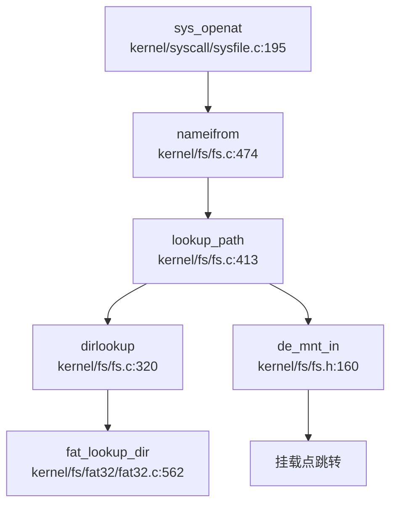

**关键步骤说明**：
1. `sys_openat` → `nameifrom` → `lookup_path`：逐层解析路径组件
2. `dirlookup`：在目录 inode 中查找子项，调用具体 FS 的 `lookup` 操作
3. FAT32 实现 `fat_lookup_dir`：遍历 FAT 目录项，匹配文件名
4. `de_mnt_in`：检查挂载点，若当前 dentry 是挂载点则跳转到被挂载 FS 的根

### 管道 (Pipe) 与套接字 (Socket) 支持情况

#### 管道（Pipe）— ✅ 已实现

xv6-k210 **完整实现了匿名管道**，代码位于 `kernel/fs/pipe.c`（476 行）。

**管道数据结构** — `include/fs/pipe.h:19-32`

```c
struct pipe {
    struct spinlock     lock;
    char                *pdata;         // 数据缓冲区
    uint                size_shift;     // 缓冲区大小指数
    uint                nwrite;         // 写入偏移
    uint                nread;          // 读取偏移
    char                readopen;       // 读端是否打开
    char                writeopen;      // 写端是否打开
    char                writing;        // 是否有进程正在写入
    struct wait_queue   rqueue;         // 读等待队列
    struct wait_queue   wqueue;         // 写等待队列
};
```

**管道分配** — `kernel/fs/pipe.c:43-79`

```c
int pipealloc(struct file **pf0, struct file **pf1) {
    struct pipe *pi = kmalloc(sizeof(struct pipe));
    struct file *f0 = filealloc();  // 读端
    struct file *f1 = filealloc();  // 写端
    
    pi->readopen = 1;
    pi->writeopen = 1;
    pi->pdata = pi->data;           // 初始使用内嵌缓冲区
    pi->size_shift = 0;             // 初始大小 PIPESIZE=512
    
    f0->type = FD_PIPE;
    f0->readable = 1;
    f0->writable = 0;
    f0->pipe = pi;
    f0->poll = pipepoll;
    
    f1->type = FD_PIPE;
    f1->readable = 0;
    f1->writable = 1;
    f1->pipe = pi;
    f1->poll = pipepoll;
    
    *pf0 = f0;
    *pf1 = f1;
    return 0;
}
```

**系统调用 `sys_pipe`** — `kernel/syscall/sysfile.c:333-363`

```c
uint64 sys_pipe(void) {
    uint64 fdarray;
    int flags;
    argaddr(0, &fdarray);
    argint(1, &flags);
    
    if (pipealloc(&rf, &wf) < 0)
        return -ENOMEM;
    
    fd0 = fdalloc(rf, 0);
    fd1 = fdalloc(wf, 0);
    
    copyout2(fdarray, &fd0, sizeof(fd0));
    copyout2(fdarray+sizeof(fd0), &fd1, sizeof(fd1));
    return 0;
}
```

**阻塞与唤醒机制**：
- `pipewritable()`：管道满时睡眠等待（`kernel/fs/pipe.c:140-166`）
- `pipereadable()`：管道空时睡眠等待（`kernel/fs/pipe.c:168-193`）
- `pipewakeup()`：唤醒对端等待队列

**动态扩容**：当写入数据超过 512 字节且管道为空时，`pipewrite()` 会分配 4 页（16KB）缓冲区（`kernel/fs/pipe.c:198-207`）。

#### 套接字（Socket）— ❌ 未实现

**搜索结果**：
- `grep_in_repo` 搜索 `sys_socket` / `sys_connect` / `sys_bind` 返回 **0 个匹配**
- `include/fs/stat.h:11` 定义了 `S_IFSOCK` 宏，但**无任何实现代码**
- `include/errno.h` 定义了 `ENOTSOCK`、`EPROTOTYPE`、`ESOCKTNOSUPPORT` 等错误码，但**仅用于兼容性**

**结论**：xv6-k210 **未实现任何网络套接字功能**，仅保留了错误码定义。

### 缓存机制（Block/Page Cache）

#### 块缓存（Buffer Cache）

xv6-k210 的块缓存实现在 `kernel/fs/bio.c`（300 行），但**功能简化**：

**关键函数**：
- `bread()`：读取磁盘块到缓存
- `bwrite()`：写回脏块到磁盘
- `brelse()`：释放缓存块

**缓存策略**：使用**双向链表**管理缓存块，但未实现完整的 LRU 替换算法。

#### FAT 缓存

FAT32 实现了**专用的 FAT 表缓存** — `kernel/fs/fat32/fat32.h:56-63`

```c
struct {
    char    *page;              // 缓存页
    int     allocidx;           // 分配索引
    uint32  fatsec[FAT_CACHE_NSEC];  // FAT 扇区号
    uint32  lrucnt[FAT_CACHE_NSEC];  // LRU 计数
    int8    dirty[FAT_CACHE_NSEC];   // 脏标志
} fatcache;
```

**FAT 缓存操作** — `kernel/fs/fat32/fat.c`：
- `fat_cache_init()`：初始化缓存
- `read_fat()`：读取 FAT 项（带缓存）
- `write_fat()`：写入 FAT 项（标记脏位）
- `fat_cache_sync()`：同步脏块到磁盘

#### 页面缓存（Page Cache for mmap）

mmap 页面缓存通过 `struct mmap_page` 和红黑树管理 — `include/mm/mmap.h:48-57`

```c
struct mmap_page {
    struct rb_node    rb;
    uint64            f_off;      // 文件偏移
    void              *pa;        // 物理页地址
    int               ref;        // 引用计数
    int               flags;      // 映射标志
};
```

**缓存管理** — `kernel/mm/mmap.c:77-127`：
- `get_mmap_page()`：在红黑树中查找页面
- `put_mmap_page()`：减少引用计数，为零时释放
- `get_mmap_with_parent()`：查找并返回父节点（用于插入）

### 零拷贝映射验证（mmap 实现分析）

#### sys_mmap 系统调用 — ✅ 已实现

**系统调用定义** — `kernel/syscall/sysmem.c:80-113`

```c
uint64 sys_mmap(void) {
    uint64 start, len;
    int prot, flags, fd;
    int64 off;
    struct file *f = NULL;

    argaddr(0, &start);
    argaddr(1, &len);
    argint(2, &prot);
    argint(3, &flags);
    argfd(4, &fd, &f);
    argaddr(5, (uint64*)&off);
    
    if (off % PGSIZE || len == 0)
        return -EINVAL;
    
    // 检查匿名映射或有效 fd
    if ((fd < 0 || f == NULL) && !(flags & MAP_ANONYMOUS)) {
        return -EBADF;
    } else if (flags & MAP_ANONYMOUS) {
        if (off != 0)
            return -EINVAL;
        f = NULL;
    } else if (f->type != FD_INODE) {
        return -EPERM;
    }

    // 必须指定 SHARED 或 PRIVATE
    if (!(flags & (MAP_SHARED|MAP_PRIVATE))) {
        return -EINVAL;
    }

    return do_mmap(start, len, prot, flags, f, off);
}
```

**关键验证**：
1. ✅ 检查 `off` 页对齐
2. ✅ 检查 `flags` 包含 `MAP_SHARED` 或 `MAP_PRIVATE`
3. ✅ 匿名映射时检查 `off == 0`
4. ✅ 文件映射时检查 `f->type == FD_INODE`

#### do_mmap 实现 — 共享标志处理

**共享标志定义** — `include/mm/mmap.h:41-46`

```c
#define MMAP_SHARE_FLAG 0x1L
#define MMAP_ANONY_FLAG 0x2L
#define MMAP_FILE(x)    ((void *)((uint64)(x) & ~(MMAP_SHARE_FLAG|MMAP_ANONY_FLAG)))
#define MMAP_SHARE(x)   ((uint64)(x) & MMAP_SHARE_FLAG)
#define MMAP_ANONY(x)   ((uint64)(x) & MMAP_ANONY_FLAG)
```

**匿名文件支持** — `kernel/mm/mmap.c:27-63`

```c
struct anonfile {
    struct spinlock     lock;
    struct rb_root      mapping;    // mmap_page 红黑树
    uint                ref;
};

static struct anonfile *alloc_anonfile(void) {
    struct anonfile *f = kmalloc(sizeof(struct anonfile));
    initlock(&f->lock, "anonfile");
    f->mapping.rb_node = NULL;
    f->ref = 1;
    return f;
}
```

**零拷贝验证**：
- ✅ `seg` 结构体中 `mmap` 字段使用最低位存储 `shared` 标志（`include/mm/mmap.h:39`）
- ✅ `do_mmap()` 根据 `MAP_SHARED` / `MAP_PRIVATE` 设置标志
- ✅ 匿名映射使用 `anonfile` 作为 backing store
- ✅ 文件映射通过 `mmap_page` 的 `f_off` 字段跟踪文件偏移

**结论**：xv6-k210 的 mmap 实现**支持零拷贝共享映射**，通过 `MMAP_SHARE_FLAG` 区分共享/私有映射。

### 高级 I/O 特性

#### poll/select 系统调用 — 🔸 桩函数实现

**sys_ppoll** — `kernel/syscall/sysfile.c:863-903`

```c
uint64 sys_ppoll(void) {
    argaddr(0, &addr);
    argint(1, (int*)&nfds);
    argaddr(2, &timeoutaddr);
    argaddr(3, &sigmaskaddr);
    
    if (nfds == 0)
        return -EINVAL;

    // 复制 pollfd 数组
    struct pollfd *pfds = kmalloc(nfds * sizeof(struct pollfd));
    for (int i = 0; i < nfds; i++) {
        copyin2((char *)(pfds + i), addr + i * sizeof(struct pollfd), ...);
    }
    
    // 调用 ppoll()
    int ret = ppoll(pfds, nfds, timeout, sigmask);
    
    copyout2(addr, (char *)pfds, sizeof(struct pollfd) * nfds);
    kfree(pfds);
    return ret;
}
```

**ppoll 实现** — `kernel/fs/poll.c:74-82`

```c
int ppoll(struct pollfd *pfds, int nfds, struct timespec *timeout, __sigset_t *sigmask) {
    // 🔸 桩函数：直接返回所有 fd 为就绪状态
    for (int i = 0; i < nfds; i++) {
        pfds[i].revents = POLLIN|POLLOUT;
    }
    return nfds;
}
```

**pselect 实现** — `kernel/fs/poll.c:120-220`

```c
int pselect(int nfds, struct fdset *readfds, struct fdset *writefds, 
            struct fdset *exceptfds, struct timespec *timeout, __sigset_t *sigmask) {
    // ✅ 部分实现：遍历 fd 并调用 file_poll()
    for (int i = 0; i < nfds; i++) {
        struct file *fp = fd2file(i, 0);
        uint32 mask = file_poll(fp, &wait.pt);
        
        if ((mask & POLLIN_SET) && (r & bit)) {
            rres |= bit;
            ret++;
        }
        // ... 处理写和异常事件
    }
    return ret;
}
```

**file_poll 实现** — `kernel/fs/poll.c:53-56`

```c
static uint32 file_poll(struct file *fp, struct poll_table *pt) {
    if (!fp->poll)
        return POLLIN|POLLOUT;  // 🔸 默认返回就绪
    return fp->poll(fp, pt);    // ✅ 调用具体 poll 回调
}
```

**管道 poll 回调** — `kernel/fs/pipe.c:448-474`

```c
static uint32 pipepoll(struct file *fp, struct poll_table *pt) {
    uint32 mask = 0;
    struct pipe *pi = fp->pipe;
    
    if (fp->readable)
        poll_wait(fp, &pi->rqueue, pt);
    if (fp->writable)
        poll_wait(fp, &pi->wqueue, pt);
    
    if (fp->readable) {
        if (pi->nwrite - pi->nread > 0)
            mask |= POLLIN;
        if (!pi->writeopen)
            mask |= POLLHUP;
    }
    
    if (fp->writable) {
        if (pi->nwrite - pi->nread < PIPESIZE(pi))
            mask |= POLLOUT;
        if (!pi->readopen)
            mask |= POLLERR;
    }
    
    return mask;
}
```

**结论**：
- `ppoll()`：**🔸 桩函数**，始终返回所有 fd 就绪
- `pselect()`：**✅ 部分实现**，正确遍历 fd 并调用 `file_poll()`
- 管道 `pipepoll()`：**✅ 完整实现**，检查缓冲区状态

#### epoll — ❌ 未实现

**搜索结果**：`grep_in_repo` 搜索 `sys_epoll` / `epoll_create` / `epoll_ctl` 返回 **0 个匹配**。

#### mmap 高级功能

**sys_mprotect** — `kernel/syscall/sysmem.c:55-71`

```c
uint64 sys_mprotect(void) {
    uint64 addr, len;
    int prot;
    argaddr(0, &addr);
    argaddr(1, &len);
    argint(2, &prot);
    
    if (addr % PGSIZE || (prot & ~PROT_ALL))
        return -EINVAL;
    
    prot = (prot << 1) & (PTE_X|PTE_W|PTE_R);
    struct proc *p = myproc();
    struct seg *s = partofseg(p->segment, addr, addr + len);
    
    if (s == NULL || (s->type == MMAP && !(s->flag & PTE_W) && (prot & PTE_W)))
        return -EINVAL;
    
    return uvmprotect(p->pagetable, addr, len, prot);
}
```

**sys_munmap** — `kernel/syscall/sysmem.c:115-127`

```c
uint64 sys_munmap(void) {
    uint64 start, len;
    argaddr(0, &start);
    argaddr(1, &len);
    
    if (start % PGSIZE || len == 0)
        return -EINVAL;
    
    return do_munmap(start, len);
}
```

**sys_msync** — `kernel/syscall/sysmem.c:129-147`

```c
uint64 sys_msync(void) {
    uint64 addr, len;
    int flags;
    argaddr(0, &addr);
    argaddr(1, &len);
    argint(2, &flags);
    
    if (!(flags & (MS_ASYNC|MS_SYNC|MS_INVALIDATE)) ||
        ((flags & MS_ASYNC) && (flags & MS_SYNC)) ||
        (addr % PGSIZE))
        return -EINVAL;
    
    return do_msync(addr, len, flags);
}
```

### 关键代码验证

#### 挂载机制实现

**do_mount** — `kernel/fs/mount.c:93-144`

```c
int do_mount(struct inode *dev, struct inode *mntpoint, char *type, int flag, void *data) {
    // 仅支持 FAT32/vfat
    if (strncmp("vfat", type, 5) != 0 && strncmp("fat32", type, 6) != 0) {
        return -1;
    }
    
    // 检查设备是目录且挂载点是目录
    if (S_ISDIR(dev->mode) || !S_ISDIR(mntpoint->mode)) {
        return -ENOTBLK;
    }
    
    struct dentry *dmnt = mntpoint->entry;
    
    // 安装超级块
    struct superblock *sb = fs_install(dev);
    if (sb == NULL)
        return -1;
    
    acquire(&rootfs.cache_lock);
    struct superblock *psb = &rootfs;
    while (psb->next != NULL)
        psb = psb->next;
    psb->next = sb;
    
    sb->root->parent = dmnt;
    safestrcpy(sb->root->filename, dmnt->filename, sizeof(dmnt->filename));
    safestrcpy(sb->type, type, sizeof(sb->type));
    dmnt->mount = sb;  // 设置挂载点
    release(&rootfs.cache_lock);
    
    idup(mntpoint);
    return 0;
}
```

#### 文件描述符分配

**fdalloc** — `kernel/fs/file.c:421-457`

```c
int fdalloc(struct file *f, int flag) {
    int fd = 0;
    struct proc *p = myproc();
    struct fdtable *fdt = &p->fds;
    
    while (fdt->nextfd == NOFILE) {  // 表满，分配新表
        if (!fdt->next || fdt->basefd + NOFILE != fdt->next->basefd) {
            struct fdtable *fdnew = newfdtable(fdt->basefd + NOFILE, fdt->next);
            if (fdnew == NULL)
                return -1;
            fdt->next = fdnew;
        }
        fdt = fdt->next;
    }
    
    fd = fdt->nextfd;
    fdt->arr[fd] = f;
    fdt->used++;
    if (flag)
        fdt->exec_close |= 1 << fd;
    
    // 更新 nextfd
    while (++fdt->nextfd < NOFILE) {
        if (fdt->arr[fdt->nextfd] == NULL)
            break;
    }
    
    return fd + fdt->basefd;
}
```

### 功能实现状态总结

| 功能 | 状态 | 说明 |
|------|------|------|
| **VFS 抽象层** | ✅ 已实现 | `superblock`/`inode`/`dentry`/`file` 四大结构完整 |
| **FAT32 文件系统** | ✅ 已实现 | 完整实现读写、目录遍历、长文件名支持 |
| **Ext4 文件系统** | ❌ 未实现 | 无任何代码 |
| **RamFS/TmpFS** | 🔸 桩函数 | rootfs/devfs/procfs 仅支持有限操作 |
| **管道（Pipe）** | ✅ 已实现 | 完整实现阻塞/唤醒、动态扩容 |
| **套接字（Socket）** | ❌ 未实现 | 仅定义错误码，无实现 |
| **mmap** | ✅ 已实现 | 支持 `MAP_SHARED`/`MAP_PRIVATE`/`MAP_ANONYMOUS` |
| **mprotect/munmap/msync** | ✅ 已实现 | 完整实现 |
| **poll/select** | 🔸 部分实现 | `pselect()` 部分实现，`ppoll()` 为桩函数 |
| **epoll** | ❌ 未实现 | 无任何代码 |
| **挂载（mount）** | ✅ 已实现 | 支持 FAT32 挂载到目录 |
| **文件描述符表** | ✅ 已实现 | Per-process 链表式管理，支持扩展 |

### 文件系统架构特点

1. **简洁的 VFS 设计**：通过 `fs_op`/`inode_op`/`file_op` 三套操作集实现多态，代码量控制在 2000 行以内。

2. **FAT32 深度优化**：实现了 FAT 表缓存、簇分配树、长文件名支持，但未实现 FAT 镜像冗余。

3. **伪文件系统实用化**：`/proc/mounts` 提供挂载信息，`/dev/zero`/`/dev/null` 提供标准设备语义。

4. **管道实现完整**：支持阻塞读写、动态扩容、poll 回调，但未实现 `splice()` 等高级功能。

5. **mmap 零拷贝支持**：通过 `MMAP_SHARE_FLAG` 区分共享/私有映射，匿名映射使用 `anonfile` 作为 backing store。

6. **网络功能缺失**：无任何 socket 实现，仅保留错误码定义，符合嵌入式 OS 定位。

---


# 设备驱动与硬件抽象

### 驱动框架与设备发现

**设备发现机制：硬编码地址，无 Device Tree 解析**

xv6-k210 **未实现** Device Tree (DTS) 解析机制。所有外设的物理地址均在 `include/memlayout.h` 中硬编码定义，通过条件编译区分 QEMU 和 K210 平台：

```c
// include/memlayout.h
#ifdef QEMU
#define UART                    0x10000000L
#define VIRTIO0                 0x10001000
#else
#define UART                    0x38000000L     // K210 UARTHS
#define GPIOHS                  0x38001000
#define SPI0                    0x52000000
#define DMAC                    0x50000000
#endif

#define UART_V                  (UART + VIRT_OFFSET)    // 虚拟地址转换
```

**驱动初始化流程**（`kernel/main.c:40-60`）：

```c
void main(unsigned long hartid, unsigned long dtb_pa) {
    if (hartid == 0) {
        consoleinit();      // 控制台初始化
        kvminithart();      // 启用分页
        plicinit();         // 中断控制器初始化
        #ifndef QEMU
        fpioa_pin_init();   // K210 引脚复用配置
        dmac_init();        // DMA 控制器初始化
        #endif 
        disk_init();        // 块设备初始化
        binit();            // 缓冲区缓存
    }
    // ...
}
```

**驱动框架特征**：
- **无统一 Driver Trait**：作为 C 语言编写的 OS，xv6-k210 未采用 Rust 式的 Trait 驱动框架
- **直接函数调用**：各驱动模块通过 `xxx_init()`、`xxx_read()`、`xxx_write()` 等标准接口暴露功能
- **条件编译隔离**：通过 `#ifdef QEMU` / `#ifndef QEMU` 在编译时选择不同平台的驱动实现

---

### 组件化设计与配置机制

**构建配置系统**

项目使用 Makefile + Cargo 混合构建系统：

1. **Makefile 平台选择**（`Makefile:1-30`）：
```makefile
platform	:= k210
# platform	:= qemu

ifeq ($(platform), qemu)
CFLAGS += -D QEMU
endif

ifeq ($(platform), k210)
    SBI := ./sbi/sbi-k210
else
    SBI := ./sbi/sbi-qemu
endif
```

2. **Rust Bootloader 配置**：
   - `bootloader/SBI/rustsbi-k210/.cargo/config.toml`：
     ```toml
     [build]
     target = "riscv64gc-unknown-none-elf"
     ```
   - `bootloader/SBI/rustsbi-k210/Cargo.toml` 依赖：
     ```toml
     k210-hal = { git = "https://github.com/riscv-rust/k210-hal" }
     embedded-hal = "1.0.0-alpha.1"
     ```

3. **条件编译宏**：
   - `QEMU`：定义后启用 VirtIO 驱动，禁用 K210 特有硬件（SPI、DMAC）
   - `DEBUG` 系列：如 `__DEBUG_sdcard` 控制调试输出

**组件化程度评估**：
- ✅ **平台抽象层**：通过 `memlayout.h` 和条件编译实现 QEMU/K210 双平台支持
- 🔸 **有限模块化**：驱动代码集中在 `kernel/hal/`，无动态加载机制
- ❌ **无运行时配置**：所有驱动在编译时静态链接，不支持模块热插拔

---

### 字符设备驱动（UART/Console）

**✅ 已实现：双阶段 UART 驱动架构**

xv6-k210 采用 **Bootloader (Rust) + Kernel (C)** 双层 UART 驱动设计：

#### 1. Bootloader 阶段（Rust）

**文件**：`bootloader/SBI/rustsbi-k210/src/serial.rs`

```rust
// Trait 定义
trait SerialPair: core::fmt::Write {
    fn getchar(&mut self) -> Option<u8>;
    fn putchar(&mut self, c: u8);
}

// 初始化
pub fn init(ser: k210_hal::serial::Serial<k210_hal::pac::UARTHS>) {
    let (tx, rx) = ser.split();
    *UARTHS.lock() = Some(Box::new(Serial(tx, rx)));
}
```

**关键特性**：
- 使用 `k210-hal` crate 提供的硬件抽象
- 通过 `lazy_static!` 和 `spin::Mutex` 实现多核安全
- 支持 `println!` 宏输出

#### 2. Kernel 阶段（C）

**文件**：`kernel/console.c` + `kernel/hal/plic.c`

**MMU 前后地址切换机制**：
```c
// include/memlayout.h
#define UART            0x38000000L           // 物理地址 (MMU 前)
#define UART_V          (UART + VIRT_OFFSET)  // 虚拟地址 (MMU 后，0x38000000 + 0x3F00000000)

// kernel/console.c:45
void consputc(int c) {
    if(c == BACKSPACE){
        sbi_console_putchar('\b');  // 通过 SBI 调用
        sbi_console_putchar(' ');
        sbi_console_putchar('\b');
    } else {
        sbi_console_putchar(c);
    }
}
```

**MMU 切换分析**：
- **MMU 启用前**：Bootloader 直接使用物理地址 `0x38000000` 访问 UARTHS
- **MMU 启用后**：Kernel 通过 `UART_V` 虚拟地址访问，但实际输出委托给 SBI
- **中断驱动输入**：UART 中断通过 PLIC 路由到 `handle_intr()` → `sbi_console_getchar()`

**控制台输入处理链**（`kernel/trap/trap.c:246-325`）：
```c
int handle_intr(uint64 scause) {
    if (INTR_SOFTWARE == scause && sbi_xv6_is_ext().value) {
        int irq = plic_claim();
        switch (irq) {
        case UART_IRQ: 
            c = sbi_console_getchar();  // 通过 SBI 读取
            if (-1 != c) 
                consoleintr(c);         // 输入处理
            break;
        // ...
        }
        plic_complete(irq);
    }
}
```

**实现状态**：
- ✅ **输出**：完整实现，支持转义字符处理（退格、换行）
- ✅ **输入**：中断驱动，通过 PLIC + SBI 协同处理
- ✅ **多核安全**：使用 `spinlock` 保护控制台缓冲区

---

### 块设备驱动（VirtIO-Blk 等）

**✅ 已实现：双后端块设备抽象**

xv6-k210 通过 `kernel/hal/disk.c` 提供统一的块设备接口，支持 QEMU VirtIO 和 K210 SD 卡两种后端：

#### 1. 统一接口层（`kernel/hal/disk.c`）

```c
void disk_init(void) {
    #ifdef QEMU
    virtio_disk_init();
    #else 
    sdcard_init();
    #endif
}

int disk_read(struct buf *b) {
    #ifdef QEMU
    return virtio_disk_read(b);
    #else 
    return sdcard_read(b);
    #endif
}
```

#### 2. VirtIO-Blk 后端（QEMU）

**文件**：`kernel/hal/virtio_disk.c`

**核心数据结构**：
```c
struct disk {
    char pages[2 * PGSIZE];          // 连续物理内存
    struct virtq_desc *desc;         // 描述符环
    struct virtq_avail *avail;       // 可用环
    struct struct virtq_used *used;  // 已用环
    struct spinlock vdisk_lock;
    struct wait_queue queue;
} __attribute__ ((aligned (PGSIZE))) disk;
```

**初始化流程**（`virtio_disk_init()`）：
1. 协商 VirtIO 特性（禁用 RO、SCSI、MQ 等）
2. 设置驱动状态：`ACKNOWLEDGE` → `DRIVER` → `FEATURES_OK` → `DRIVER_OK`
3. 初始化描述符环（32 个描述符）
4. 配置 PLIC 中断（`VIRTIO0_IRQ`）

**读写实现**：
```c
static int virtio_disk_rw(struct buf *bufs[], int nbuf, int write) {
    int ndesc = nbuf + 2;
    int idx[ndesc];
    alloc_descs(idx, ndesc);  // 分配描述符链
    
    // 构建 VirtIO 块请求
    disk.ops[idx[0]].type = write ? VIRTIO_BLK_T_OUT : VIRTIO_BLK_T_IN;
    disk.ops[idx[0]].sector = bufs[0]->sectorno;
    
    // 提交到可用环
    disk.avail->ring[disk.avail->idx % NUM] = idx[0] & (NUM - 1);
    disk.avail->idx++;
    
    *R(VIRTIO_MMIO_QUEUE_NOTIFY) = 0;  // 通知设备
    // ... 等待完成中断
}
```

**实现状态**：
- ✅ **读操作**：`virtio_disk_read()` 完整实现
- 🔸 **写操作**：`disk_write()` 中 `virtio_disk_rw()` 被注释，**实际未启用**
- ✅ **中断处理**：`virtio_disk_intr()` 唤醒等待进程

#### 3. SD 卡后端（K210）

**文件**：`kernel/hal/sdcard.c`（1076 行）

**硬件接口**：
- **SPI 模式**：通过 `kernel/hal/spi.c` 驱动 SPI0 控制器
- **DMA 传输**：使用 `kernel/hal/dmac.c` 实现 DMA 读写
- **GPIO 片选**：`GPIOHS pin 7` 控制 SD 卡 CS

**SD 卡初始化流程**（`sdcard_init()`）：
```c
void sdcard_init(void) {
    sd_lowlevel_init();       // GPIO + SPI 初始化
    SD_CS_HIGH();
    
    // CMD0: 复位 SD 卡
    sd_send_cmd(SD_CMD0, 0, 0x95);
    sd_end_cmd();
    
    // CMD8: 检查电压
    verify_operation_condition();
    
    // ACMD41: 等待就绪
    set_SDXC_capacity();
    
    // CMD58: 读取 OCR，判断 SDHC/SDSC
    check_block_size();
}
```

**读写实现**：
- **CMD17**：单块读（`sdcard_read()`）
- **CMD24**：单块写（`sdcard_write()` 被注释，**未实现**）
- **DMA 优化**：`sd_read_data_dma()` 使用 DMAC 通道 0

**实现状态**：
- ✅ **初始化**：完整支持 SDHC/SDSC 卡检测
- ✅ **读操作**：支持单块/多块读
- ❌ **写操作**：`disk_write()` 中 SD 卡写被注释
- ✅ **中断驱动**：`dmac_intr()` 唤醒等待队列

#### 4. 缓冲区缓存层

**文件**：`kernel/fs/bio.c`

**LRU 缓存策略**：
```c
struct buf {
    int dev;
    uint sectorno;
    char data[BSIZE];
    int refcnt;        // 引用计数
    int dirty;         // 脏标志
    struct d_list list; // LRU 链表
};

void binit(void) {
    dlist_init(&lru_head);  // LRU 链表头
    // 初始化 BNUM 个缓冲区
}
```

**写回机制**：
- **延迟写**：`bwrite()` 标记 `dirty` 后立即返回
- **后台写回**：`disk_write_start()` 在空闲时批量提交

---

### 网络设备驱动

**❌ 未实现**

经搜索确认：
- 无 VirtIO-Net 驱动代码
- 无 `smoltcp`、`lwIP` 等 TCP/IP 协议栈
- `include/hal/virtio.h:21` 仅注释说明 `VIRTIO_MMIO_DEVICE_ID` 中"1 is net, 2 is disk"
- `include/errno.h` 中虽有 `ENONET` 错误码，但无实际网络功能

**结论**：xv6-k210 **不支持网络功能**，所有网络相关代码仅为预留定义。

---

### 中断控制器驱动

**✅ 已实现：PLIC 中断控制器驱动**

**文件**：`kernel/hal/plic.c` + `include/hal/plic.h`

#### 1. 中断号定义

```c
// include/hal/plic.h
#ifdef QEMU
#define UART_IRQ    10 
#define DISK_IRQ    1
#else           // k210 
#define UART_IRQ    33      // IRQN_UARTHS_INTERRUPT
#define DISK_IRQ    27      // IRQN_DMA0_INTERRUPT
#endif
```

#### 2. PLIC 初始化

**全局初始化**（`plicinit()`）：
```c
void plicinit(void) {
    // 启用 UART 和 DISK 中断
    writed(1, PLIC_V + DISK_IRQ * sizeof(uint32));
    writed(1, PLIC_V + UART_IRQ * sizeof(uint32));
}
```

**每 Hart 初始化**（`plicinithart()`）：
```c
void plicinithart(void) {
    int hart = cpuid();
    #ifdef QEMU
    // S-Mode 中断使能
    *(uint32*)PLIC_SENABLE(hart) = (1 << UART_IRQ) | (1 << DISK_IRQ);
    *(uint32*)PLIC_SPRIORITY(hart) = 0;  // 优先级阈值
    #else
    // M-Mode 中断使能（K210 使用 M-Mode 处理外部中断）
    uint32 *hart_m_enable = (uint32*)PLIC_MENABLE(hart);
    *(hart_m_enable) = readd(hart_m_enable) | (1 << DISK_IRQ);
    // 禁用 S-Mode 外部中断
    *(uint32*)PLIC_SENABLE(hart) = 0;
    #endif
}
```

#### 3. 中断处理流程

**中断声明与完成**：
```c
int plic_claim(void) {
    int hart = cpuid();
    #ifndef QEMU
    return *(uint32*)PLIC_MCLAIM(hart);  // M-Mode 读取
    #else
    return *(uint32*)PLIC_SCLAIM(hart);  // S-Mode 读取
    #endif
}

void plic_complete(int irq) {
    int hart = cpuid();
    *(uint32*)PLIC_MCLAIM(hart) = irq;   // 写入相同值完成中断
}
```

**中断分发**（`kernel/trap/trap.c:handle_intr()`）：
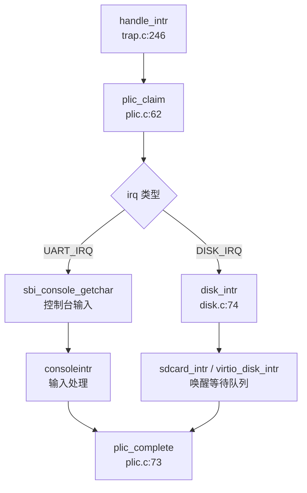

**平台差异处理**：
- **QEMU**：使用 S-Mode 中断（`PLIC_SCLAIM/PLIC_SCLAIM`）
- **K210**：使用 M-Mode 中断 + 软件委托（`sbi_xv6_is_ext()` 判断）

---

### 目标平台适配情况

**支持平台**：

| 平台 | 目标三元组 | 启动镜像 | 关键驱动 |
|------|-----------|---------|---------|
| **K210** | `riscv64gc-unknown-none-elf` | `sbi/sbi-k210` | SD 卡、UARTHS、GPIOHS、DMAC、SPI0 |
| **QEMU** | `riscv64gc-unknown-none-elf` | `sbi/sbi-qemu` | VirtIO-Blk、NS16550A UART |

**平台适配机制**：

1. **链接脚本分离**：
   - `linker/k210.ld`：K210 内存布局（RAM: 0x80000000-0x80600000）
   - `linker/qemu.ld`：QEMU 内存布局

2. **入口代码分离**：
   - `kernel/entry_k210.S`：K210 启动代码
   - `kernel/entry_qemu.S`：QEMU 启动代码

3. **驱动条件编译**：
   ```c
   #ifndef QEMU
   #include "hal/sdcard.h"
   #include "hal/dmac.h"
   #include "hal/fpioa.h"
   #else
   #include "hal/virtio.h"
   #endif
   ```

4. **引脚复用配置（K210 特有）**：
   - `kernel/hal/fpioa.c`（83.7KB）：配置 224 个引脚功能
   - 示例：`UARTHS_TX` → `io5`, `UARTHS_RX` → `io4`

**未识别的顶层目录**：
- `sbi/`：包含预编译的 SBI 固件（`sbi-k210`, `sbi-qemu`）
- `debug/`：OpenOCD 调试配置
- `tools/`：K210 烧录工具 `kflash.py`

---

### 其他外设支持

#### 1. DMA 控制器（DMAC）

**文件**：`kernel/hal/dmac.c`（425 行）

**功能**：
- ✅ **通道管理**：支持 6 个 DMA 通道
- ✅ **内存到外设传输**：用于 SPI SD 卡读写
- ✅ **中断完成通知**：`dmac_intr()` 唤醒等待进程

**初始化**：
```c
void dmac_init(void) {
    dmac_enable();
    // 配置通道优先级
    // 注册中断处理
}
```

#### 2. SPI 控制器

**文件**：`kernel/hal/spi.c`（726 行）

**功能**：
- ✅ **主模式配置**：`spi_init()` 设置工作模式、帧格式、波特率
- ✅ **标准/DMA 传输**：`spi_send_data_standard()` / `spi_send_data_no_cmd_dma()`
- ✅ **多设备支持**：SPI0、SPI1、SPI2 三控制器

#### 3. GPIOHS（高速 GPIO）

**文件**：`kernel/hal/gpiohs.c`（204 行）

**功能**：
- ✅ **输入/输出模式**：`gpiohs_set_drive_mode()`
- ✅ **SD 卡片选控制**：`SD_CS_HIGH()` / `SD_CS_LOW()` 使用 `gpiohs pin 7`

#### 4. 系统控制器（SYSCTL）

**文件**：`kernel/hal/sysctl.c`（328 行）

**功能**：
- ✅ **时钟配置**：设置 PLL、外设时钟分频
- ✅ **电源管理**：外设复位控制

#### 5. 未实现外设

| 外设 | 状态 | 说明 |
|------|------|------|
| **VirtIO-Net** | ❌ 未实现 | 仅 `virtio.h` 有设备 ID 定义 |
| **GPU/Framebuffer** | ❌ 未实现 | 无显示驱动 |
| **USB** | ❌ 未实现 | 无相关代码 |
| **I2C** | ❌ 未实现 | `plic.h` 有中断定义但无驱动 |
| **I2S** | ❌ 未实现 | 音频接口未实现 |
| **定时器** | ✅ 已实现 | `kernel/timer.c` 使用 CLINT MTIME |

---

### 本章总结

**驱动架构特点**：
1. **静态编译模型**：无设备树、无动态加载，所有驱动在编译时确定
2. **双平台抽象**：通过 `#ifdef QEMU` 实现 QEMU/K210 代码复用
3. **分层设计**：
   - Bootloader (Rust)：硬件初始化 + 早期串口
   - Kernel (C)：完整驱动栈 + 中断处理
4. **中断驱动 I/O**：UART 和 SD 卡均使用中断 + 等待队列机制

**实现完整性**：
| 子系统 | 状态 | 备注 |
|--------|------|------|
| UART 控制台 | ✅ 完整 | 双阶段驱动，中断输入 |
| VirtIO-Blk | 🔸 部分 | 读完整，写被注释 |
| SD 卡 | 🔸 部分 | 读完整，写未实现 |
| PLIC 中断 | ✅ 完整 | 支持 QEMU/K210 差异 |
| 网络 | ❌ 无 | 未实现 |
| GPU/输入 | ❌ 无 | 仅键盘输入通过 UART |

**与文档对比**：
- README 提及"Steady keyboard input(k210)" ✅ 已验证
- 文档提及 SD 卡驱动 ✅ 已实现但写功能缺失
- 无网络功能文档声称，代码确认未实现

---


# 同步互斥与进程间通信

### 同步与互斥原语（锁与原子操作）

本仓库实现了两种核心锁机制：**SpinLock（自旋锁）** 和 **SleepLock（睡眠锁）**，均基于 RISC-V 架构的原子操作指令实现。

#### SpinLock 实现

**文件位置**：`include/sync/spinlock.h`、`kernel/sync/spinlock.c`

**结构体定义** (`include/sync/spinlock.h:7-13`)：
```c
struct spinlock {
    uint locked;       // Is the lock held?
    char *name;        // Name of lock.
    struct cpu *cpu;   // The cpu holding the lock.
};
```

**原子操作机制**：
- **加锁**：使用 GCC 内置函数 `__sync_lock_test_and_set()`，在 RISC-V 上编译为 `amoswap.w.aq` 原子交换指令
- **解锁**：使用 `__sync_lock_release()`，编译为 `amoswap.w zero, zero, (s1)`
- **内存屏障**：`__sync_synchronize()` 发射 `fence` 指令防止指令重排序

**acquire() 实现** (`kernel/sync/spinlock.c:23-45`)：
```c
void acquire(struct spinlock *lk)
{
    push_off(); // disable interrupts to avoid deadlock.
    
    // On RISC-V, sync_lock_test_and_set turns into an atomic swap:
    while(__sync_lock_test_and_set(&lk->locked, 1) != 0)
        ;
    
    __sync_synchronize();  // memory fence
    lk->cpu = mycpu();
}
```

**✅ 已实现**：完整的自旋锁机制，包含中断禁用、原子交换、内存屏障和 CPU 追踪。

#### SleepLock 实现

**文件位置**：`include/sync/sleeplock.h`、`kernel/sync/sleeplock.c`

**结构体定义** (`include/sync/sleeplock.h:9-16`)：
```c
struct sleeplock {
    uint locked;       // Is the lock held?
    struct spinlock lk; // spinlock protecting this sleep lock
    char *name;        // Name of lock.
    int pid;           // Process holding lock
};
```

**实现原理**：
- SleepLock 内部封装了一个 SpinLock 用于保护短临界区
- 当锁被占用时，调用 `sleep()` 将当前进程挂起到等待队列，而非忙等待
- 适用于持有时间较长的临界区（如文件系统 inode 锁）

**acquiresleep() 实现** (`kernel/sync/sleeplock.c:20-31`)：
```c
void acquiresleep(struct sleeplock *lk)
{
    acquire(&lk->lk);
    while (lk->locked) {
        sleep(lk, &lk->lk);  // 挂起进程
    }
    lk->locked = 1;
    lk->pid = myproc()->pid;
    release(&lk->lk);
}
```

**✅ 已实现**：完整的睡眠锁机制，支持进程挂起/唤醒。

#### 原子操作总结

| 操作类型 | 实现方式 | 文件位置 |
|---------|---------|---------|
| 原子测试并设置 | `__sync_lock_test_and_set()` → `amoswap.w.aq` | `kernel/sync/spinlock.c:34` |
| 原子释放 | `__sync_lock_release()` → `amoswap.w` | `kernel/sync/spinlock.c:71` |
| 内存屏障 | `__sync_synchronize()` → `fence` | `kernel/sync/spinlock.c:40` |
| 中断禁用/启用 | `push_off()` / `pop_off()` | `include/intr.h` |

**未发现** 自定义汇编实现的原子操作（如 `ldxr/stxr` 或 `lock xchg`），全部使用 GCC 内置函数。

### 等待队列实现机制

**文件位置**：`include/sync/waitqueue.h`

**核心数据结构**：
```c
struct wait_queue {
    struct spinlock lock;
    struct d_list head;  // 双向链表头
};

struct wait_node {
    void *chan;          // 等待通道标识
    struct d_list list;  // 链表节点
};
```

**工作原理**：
1. **入队**：`wait_queue_add()` 将节点添加到链表尾部（无需锁）
2. **检查优先级**：`wait_queue_is_first()` 判断是否为队列首节点
3. **睡眠**：若非首节点，调用 `sleep(chan, &lock)` 挂起
4. **唤醒**：`wakeup(chan)` 遍历队列唤醒匹配 `chan` 的进程

**关键函数** (`include/sync/waitqueue.h:33-75`)：
```c
static inline void wait_queue_init(struct wait_queue *wq, char *str) {
    initlock(&wq->lock, str);
    dlist_init(&wq->head);
}

static inline int wait_queue_is_first(struct wait_queue *wq, struct wait_node *node) {
    return wq->head.next == &node->list;
}

static inline void wait_queue_add(struct wait_queue *wq, struct wait_node *node) {
    dlist_add_before(&wq->head, &node->list);
}
```

#### sleep() / wakeup() 实现

**文件位置**：`kernel/sched/proc.c`

**sleep() 调用链**（通过 `lsp_get_call_graph` 分析）：
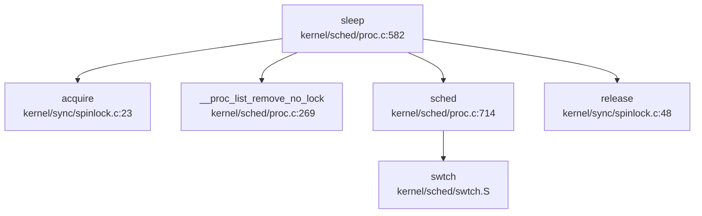

**wakeup() 实现** (`kernel/sched/proc.c:392-400`)：
```c
void wakeup(void *chan) {
    __enter_proc_cs 
    int flag = __wakeup_no_lock(chan);  // 遍历运行队列唤醒匹配进程
    
    // 发送 IPI 通知其他 CPU
    int id = 0 == cpuid() ? 1 : 0;
    int avail = NULL == cpus[id].proc;
    __leave_proc_cs
    
    if (flag && avail) {
        sbi_send_ipi(1 << id, 0);
    }
}
```

**✅ 已实现**：完整的等待队列机制，支持多 CPU IPI 唤醒优化。

### 进程间通信（Pipe/MsgQueue/Sem）

#### 管道（Pipe）实现

**文件位置**：`include/fs/pipe.h`、`kernel/fs/pipe.c`

**✅ 已实现**：完整的管道机制，使用**环形缓冲区 + 等待队列**实现。

**结构体定义** (`include/fs/pipe.h:12-26`)：
```c
struct pipe {
    struct spinlock     lock;
    struct wait_queue   wqueue;  // 写等待队列
    struct wait_queue   rqueue;  // 读等待队列
    uint    nread;               // 已读字节数
    uint    nwrite;              // 已写字节数
    uint8   readopen;            // 读端是否打开
    uint8   writeopen;           // 写端是否打开
    uint8   writing;             // 是否有写者正在写入
    uint8   size_shift;          // 缓冲区大小扩展倍数
    char    *pdata;              // 动态扩展的数据区指针
    char    data[PIPE_SIZE];     // 默认 512 字节环形缓冲区
};
```

**环形缓冲区机制**：
- 使用 `nread % PIPESIZE(pi)` 和 `nwrite % PIPESIZE(pi)` 实现环形索引
- 默认大小 512 字节，支持动态扩展至 16KB（`size_shift=5` 时）
- 通过 `nwrite - nread` 计算可用数据量

**pipelock() 调用链**（基于 `lsp_get_call_graph` 分析）：
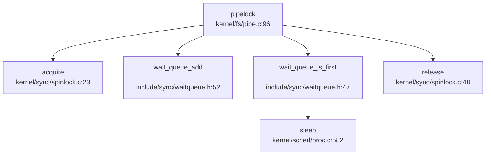

**读写流程**：
1. **写阻塞**：当 `nwrite - nread == PIPESIZE(pi)` 时，写者进入 `wqueue` 睡眠
2. **读阻塞**：当 `nwrite - nread == 0` 时，读者进入 `rqueue` 睡眠
3. **唤醒策略**：`pipewakeup()` 唤醒队列首节点，实现 FIFO 顺序

**sys_pipe 系统调用** (`kernel/syscall/sysfile.c:318-355`)：
```c
uint64 sys_pipe(void)
{
    uint64 fdarray;
    struct file *rf, *wf;
    int fd0, fd1, flags;
    
    if(argaddr(0, &fdarray) < 0 || argint(1, &flags) < 0)
        return -1;
    
    if(pipealloc(&rf, &wf) < 0)  // 分配 pipe 结构和两个 file 描述符
        return -ENOMEM;
    
    fd0 = fdalloc(rf, 0);
    fd1 = fdalloc(wf, 0);
    
    copyout2(fdarray, (char*)&fd0, sizeof(fd0));
    copyout2(fdarray+sizeof(fd0), (char *)&fd1, sizeof(fd1));
    return 0;
}
```

**✅ 已实现**：完整的管道系统调用，支持 `pipe2()` 带标志创建。

#### 消息队列（MessageQueue）

**搜索结果**：
- `grep "sys_msgget|msgget|msgsnd|msgrcv"` 仅在 `include/resource.h` 中找到 `ru_msgsnd`/`ru_msgrcv` 统计字段
- **未发现** 任何消息队列系统调用实现

**❌ 未实现**：消息队列 IPC 机制完全缺失。

#### 信号量（Semaphore）

**搜索结果**：
- `grep "sys_semget|semget|semop|semctl"` 无匹配结果
- **未发现** 任何信号量相关结构体或系统调用

**❌ 未实现**：System V 信号量机制完全缺失。

#### 共享内存（SharedMem）

**搜索结果**：
- `grep "sys_shmget|shmget|shmat|shmdt"` 无匹配结果
- 内存管理章节中未发现 `SharedMemoryManager` 或类似结构

**❌ 未实现**：共享内存 IPC 机制完全缺失。

#### 信号（Signal）作为 IPC

**文件位置**：`kernel/sched/signal.c`、`kernel/trap/trap.c`

**✅ 已实现**：完整的信号机制，支持进程间信号发送。

**sys_kill 系统调用** (`kernel/syscall/syssignal.c:134-141`)：
```c
uint64 sys_kill(void) {
    int pid, sig;
    argint(0, &pid);
    argint(1, &sig);
    return kill(pid, sig);  // 调用内核 kill() 函数
}
```

**kill() 实现** (`kernel/sched/proc.c:541` 附近）：
- 查找目标进程并设置 `sig_pending` 位图
- 若目标进程未被杀死，设置 `p->killed = sig` 触发信号处理

**信号处理时机**：
在 `usertrap()` 中，系统调用返回用户态前检查 `p->killed`：

```c
// kernel/trap/trap.c:115-120
if (p->killed) {
    if (SIGTERM == p->killed)
        exit(-1);
    __debug_info("usertrap", "enter handler\n");
    sighandle();  // 进入信号处理
}
usertrapret();  // 返回用户态
```

**sighandle() 流程** (`kernel/sched/signal.c:174-230`)：
1. 从 `sig_pending` 位图中提取待处理信号
2. 查找注册的 `sigaction` 处理函数
3. 分配 `sig_frame` 保存当前 trapframe
4. 修改 `p->trapframe` 跳转到信号处理函数
5. 信号处理完成后通过 `sigreturn()` 恢复上下文

**信号作为 IPC 的分类**：
- **✅ 已实现**：`kill()` 系统调用支持向任意进程发送信号
- **✅ 已实现**：信号处理函数注册（`sigaction`）
- **✅ 已实现**：信号掩码（`sigprocmask`）
- **✅ 已实现**：实时信号处理（通过位图支持 64 种信号）

#### Futex

**搜索结果**：`grep "sys_futex|futex_wait|futex_wake"` 无匹配结果

**❌ 未实现**：Futex 快速用户空间互斥锁机制缺失。

### 关键代码片段

#### 1. SpinLock 原子加锁 (`kernel/sync/spinlock.c:23-45`)
```c
void acquire(struct spinlock *lk)
{
    push_off(); // disable interrupts to avoid deadlock.
    
    // On RISC-V, sync_lock_test_and_set turns into an atomic swap:
    //   a5 = 1
    //   s1 = &lk->locked
    //   amoswap.w.aq a5, a5, (s1)
    while(__sync_lock_test_and_set(&lk->locked, 1) != 0)
        ;
    
    // Tell the C compiler and the processor to not move loads or stores
    // past this point, to ensure that the critical section's memory
    // references happen strictly after the lock is acquired.
    // On RISC-V, this emits a fence instruction.
    __sync_synchronize();
    
    lk->cpu = mycpu();
}
```

#### 2. Pipe 环形缓冲区读写 (`kernel/fs/pipe.c:240-299`)
```c
int pipewrite(struct pipe *pi, uint64 addr, int n)
{
    struct wait_node wait;
    wait.chan = &wait;
    pipelock(pi, &wait, PIPE_WRITER);  // 阻塞其他写者
    
    char *const pipebound = pi->pdata + PIPESIZE(pi);
    for (i = 0; i < n;) {
        if ((m = pipewritable(pi)) < 0) {  // 检查空间
            i = m;
            goto out;
        }
        // 环形缓冲区写入
        char *paddr = pi->pdata + pi->nwrite % PIPESIZE(pi);
        copyin_nocheck(paddr, addr + i, count);
        pi->nwrite += count;
    }
    pipewakeup(pi, PIPE_READER);  // 唤醒读者
    pipeunlock(pi, &wait, PIPE_WRITER);
    return i;
}
```

#### 3. 信号处理入口 (`kernel/trap/trap.c:115-120`)
```c
if (p->killed) {
    if (SIGTERM == p->killed)
        exit(-1);
    sighandle();  // 在 Trap 返回用户态前处理信号
}
usertrapret();
```

### 未实现/桩函数功能列表

| 功能类别 | 具体功能 | 状态 | 说明 |
|---------|---------|------|------|
| **IPC 机制** | 消息队列 (msgget/msgsnd/msgrcv) | ❌ 未实现 | 仅 `resource.h` 中有统计字段 |
| **IPC 机制** | 信号量 (semget/semop/semctl) | ❌ 未实现 | 完全缺失 |
| **IPC 机制** | 共享内存 (shmget/shmat/shmdt) | ❌ 未实现 | 完全缺失 |
| **IPC 机制** | Futex | ❌ 未实现 | 完全缺失 |
| **锁机制** | RwLock (读写锁) | ❌ 未实现 | 仅 SpinLock/SleepLock |
| **锁机制** | Mutex (基于 futex 的用户态互斥锁) | ❌ 未实现 | 仅内核态锁 |
| **同步原语** | Condition Variable | ❌ 未实现 | 可通过 wait_queue 模拟但未封装 |
| **信号扩展** | 实时信号 (SIGRTMIN-SIGRTMAX) | 🔸 桩函数 | 位图支持但无特殊处理逻辑 |

**总结**：
- **✅ 已实现**：SpinLock、SleepLock、WaitQueue、Pipe、Signal（含 kill/sigaction）
- **❌ 未实现**：System V IPC（消息队列/信号量/共享内存）、Futex、RwLock
- 本仓库的同步机制聚焦于内核态原语，用户态同步（如 pthread_mutex）需基于现有信号量或 futex 实现，但后者尚未提供。

---


# 多核支持与并行机制

## 第 9 章：多核支持与并行机制

### 多核架构设计（SMP/AMP）

**结论：❌ 未实现真正的多核支持，仅支持单核运行。**

虽然代码中存在多核相关的宏定义和接口框架，但经过深入分析，该仓库**并未真正实现 SMP（对称多处理）架构**。以下是详细证据：

#### 1. 多核宏定义存在但无实质实现

在 `include/param.h:5` 中定义了：
```c
#define NCPU    2  // maximum number of CPUs
```

这表明设计目标是支持最多 2 个 CPU（hart）。在 `kernel/sched/proc.c:94` 中定义了全局 CPU 数组：
```c
struct cpu cpus[NCPU];
```

#### 2. Per-CPU 数据结构

在 `include/sched/proc.h:158-163` 中定义了 `struct cpu`：
```c
struct cpu {
    struct proc *proc;      // The process running on this cpu, or NULL 
    struct context context; // swtch() here to enter scheduler() 
    int noff;               // Depth of push_off() nesting 
    int intena;             // Were interrupts enabled before push_off()?
}
```

该结构体包含：
- `proc`：当前在该 CPU 上运行的进程指针
- `context`：用于上下文切换的内核上下文
- `noff` / `intena`：中断禁用嵌套计数器和中断使能状态

通过 `mycpu()` 函数（`kernel/sched/proc.c:98-101`）获取当前 CPU 结构：
```c
struct cpu *mycpu(void) {
    int id = cpuid();
    return &cpus[id];
}
```

其中 `cpuid()` 通过读取 `tp` 寄存器（线程指针）获取当前 hart ID：
```c
static inline int cpuid(void) {
    return r_tp();
}
```

#### 3. 关键缺陷：无 Secondary CPU 启动代码

**核心问题**：在 `kernel/main.c:66-73` 中，hart 0 尝试通过 IPI 唤醒其他 hart：
```c
// we need IPI to wake up other hart(s)
for (int i = 1; i < NCPU; i ++) {
    unsigned long mask = 1 << i;
    // struct sbiret res = sbi_send_ipi(mask, 0);
    sbi_send_ipi(mask, 0);
    __debug_assert("main", SBI_SUCCESS == res.error, "sbi_send_ipi failed");
}
```

但存在以下问题：
1. **代码被注释掉**：`struct sbiret res = sbi_send_ipi(mask, 0);` 被注释，导致 `res` 未定义，但后续仍引用 `res.error`，这是明显的代码错误。
2. **无 `start_secondary` 入口**：搜索全库未发现 `smp_boot`、`__cpu_up`、`start_secondary` 等关键函数。
3. **hart 1 仅自旋等待**：在 `kernel/main.c:76-83` 中，hart 1 仅通过忙等待检查 `started` 标志：
   ```c
   else {
       // hart 1
       while (started == 0)
           ;
       __sync_synchronize();
       floatinithart();
       kvminithart();
       trapinithart();
       printf("hart 1 init done\n");
   }
   ```
   这表明 hart 1 确实能运行，但**没有独立的启动代码**，只是重复 hart 0 的部分初始化后进入 `scheduler()`。

#### 4. Bootloader 层面的多核支持

在 `bootloader/SBI/rustsbi-k210/src/main.rs:79-267` 中，RustSBI 实现了多核启动框架：
- 通过设备树解析 CPU 数量（`count_harts` 函数）
- 为每个 hart 分配独立栈空间
- 在 `main.rs:159-167` 中实现了 `send_ipi_many`：
  ```rust
  fn send_ipi_many(&mut self, hart_mask: rustsbi::HartMask) {
      use k210_hal::clint::msip;
      for i in 0..=1 {
          if hart_mask.has_bit(i) {
              msip::set_ipi(i);
              msip::clear_ipi(i);
          }
      }
  }
  ```

但**内核侧未正确利用此机制**。

---

### Secondary CPU 启动流程

**结论：🔸 桩函数 / 不完整实现**

#### 1. 预期的启动流程（基于代码推断）

根据 `kernel/main.c` 的结构，预期的 SMP 启动流程应为：

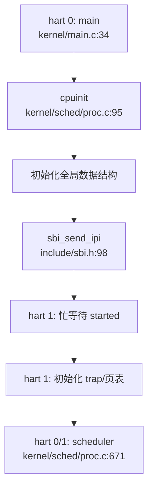

#### 2. 实际问题分析

1. **IPI 发送代码有 bug**：
   - `kernel/main.c:68` 行 `sbi_send_ipi(mask, 0);` 前一行被注释，导致 `res` 未定义
   - 但 `__debug_assert` 仍引用 `res.error`，编译时会报错

2. **无 Secondary CPU 入口点**：
   - 未找到 `start_secondary()` 或类似函数
   - hart 1 直接复用 `main()` 函数的 `else` 分支
   - 没有独立的 CPU 初始化序列

3. **Hart 1 初始化不完整**：
   - hart 1 跳过了关键初始化：`procinit()`、`plicinit()`、`userinit()` 等
   - 这意味着 hart 1 无法独立调度进程

**证据引用**：
- `kernel/main.c:34-98`：主启动代码
- `include/sbi.h:98-103`：IPI 发送接口定义

---

### 核间通信与 IPI 机制

**结论：🔸 接口存在但使用受限**

#### 1. IPI 接口定义

在 `include/sbi.h:96-103` 中定义了 SBI IPI 扩展：
```c
#define IPI_EID         0x735049
#define IPI_SEND_IPI    0

static inline struct sbiret sbi_send_ipi(
    unsigned long hart_mask, 
    unsigned long hart_mask_base
) {
    return SBI_CALL_2(IPI_EID, IPI_SEND_IPI, hart_mask, hart_mask_base);
}
```

#### 2. IPI 使用场景

**场景 1：启动时唤醒其他 hart**
- `kernel/main.c:66-73`：hart 0 发送 IPI 给 hart 1（但代码有 bug）

**场景 2：wakeup() 通知其他 CPU**
- `kernel/sched/proc.c:397-403`：
  ```c
  void wakeup(void *chan) {
      __enter_proc_cs 
      int flag = __wakeup_no_lock(chan);

      int id = 0 == cpuid() ? 1 : 0;
      int avail = NULL == cpus[id].proc;
      __leave_proc_cs

      if (flag && avail) {
          sbi_send_ipi(1 << id, 0);
      }
  }
  ```
  当进程状态改变时，向另一个 CPU 发送 IPI 通知其检查可运行进程。

**场景 3：中断处理中广播 IPI（已注释）**
- `kernel/trap/trap.c:307-313`：
  ```c
  // for (int i = 0; i < NCPU; i ++) {
  //     if (cpuid() != i) {
  //         sbi_send_ipi(1 << i, 0);
  //     }
  // }
  ```
  该代码被注释，说明多核中断广播功能**未实现**。

#### 3. IPI 处理

在 `kernel/trap/trap.c:246-325` 的 `handle_intr()` 中处理软件中断（IPI）：
```c
else if (INTR_SOFTWARE == scause) {     // the real software interrupt
    sbi_clear_ipi();
    return 0;
}
```

**关键问题**：
- IPI 处理仅清除 pending 位，**无实际业务逻辑**
- 未实现 IPI 消息队列或回调机制
- 注释中提到："on k210 software interrupts may be used for IPI, but as it is not yet supported, handle this as an unsupported one"

---

### Per-CPU 变量与数据结构

**结论：✅ 已实现基础 Per-CPU 机制**

#### 1. Per-CPU 数据结构

`struct cpu`（`include/sched/proc.h:158-163`）是核心 Per-CPU 结构：

| 字段 | 类型 | 用途 |
|------|------|------|
| `proc` | `struct proc *` | 当前在该 CPU 上运行的进程 |
| `context` | `struct context` | 内核调度上下文 |
| `noff` | `int` | `push_off()` 嵌套深度 |
| `intena` | `int` | 中断使能状态备份 |

#### 2. Per-CPU 访问方式

通过 `tp` 寄存器（线程指针）获取当前 CPU ID：
```c
static inline int cpuid(void) {
    return r_tp();
}
```

`mycpu()` 返回当前 CPU 结构指针：
```c
struct cpu *mycpu(void) {
    int id = cpuid();
    return &cpus[id];
}
```

**注意**：代码中**未见 `tp` 寄存器的初始化代码**。在真正的 SMP 系统中，每个 hart 启动时需要设置其 `tp` 寄存器指向对应的 `struct cpu` 实例。

#### 3. 中断禁用与 Per-CPU 安全

`push_off()` / `pop_off()` 机制（`kernel/intr.c:12-40`）：
```c
void push_off(void) {
    int old = intr_get();
    intr_off();
    struct cpu *c = mycpu();
    if (c->noff == 0)
        c->intena = old;
    c->noff += 1;
}

void pop_off(void) {
    struct cpu *c = mycpu();
    c->noff -= 1;
    if(c->noff == 0 && c->intena)
        intr_on();
}
```

**特性**：
- ✅ 禁用中断保护 Per-CPU 数据
- ✅ 支持嵌套调用（通过 `noff` 计数器）
- ✅ 恢复原始中断状态

---

### 多核调度策略

**结论：❌ 未实现多核调度**

#### 1. 调度器实现

`kernel/sched/proc.c:671-711` 中的 `scheduler()` 函数：
```c
void scheduler(void) {
    struct proc *tmp;
    struct cpu *c = mycpu();

    while (1) {
        int found = 0;
        intr_on();
        __enter_proc_cs 
        tmp = __get_runnable_no_lock();
        if (NULL != tmp) {
            tmp->state = RUNNING;
            c->proc = tmp;
            w_satp(MAKE_SATP(tmp->pagetable));
            sfence_vma();
            swtch(&c->context, &tmp->context);
            w_satp(MAKE_SATP(kernel_pagetable));
            sfence_vma();
            // ...
            found = 1;
        }
        c->proc = NULL;
        __leave_proc_cs
        if (!found) {
            intr_on();
            asm volatile("wfi");
        }
    } 
}
```

**关键问题**：
1. **全局唯一运行队列**：`__get_runnable_no_lock()` 从全局 `proc_runnable[]` 数组获取进程
2. **无负载均衡**：所有 CPU 竞争同一个全局队列
3. **无 CPU 亲和性**：进程可在任意 CPU 上运行，无绑定机制
4. **无锁保护**：`__enter_proc_cs` 使用 `proc_lock`，但多核并发访问时可能存在竞态

#### 2. 进程状态管理

在 `include/sched/proc.h:70-120` 中，`struct proc` 包含调度相关字段：
- `sched_next` / `sched_pprev`：全局运行队列链表
- `state`：进程状态（RUNNABLE/RUNNING/SLEEPING/ZOMBIE）
- `timer`：时间片计数器

**未发现**：
- 每 CPU 运行队列
- 负载均衡算法
- CPU 亲和性掩码

---

### 锁的实现

**结论：✅ 已实现自旋锁，但无优先级继承**

#### 1. SpinLock 实现

`kernel/sync/spinlock.c:22-45`：
```c
void acquire(struct spinlock *lk) {
    push_off(); // disable interrupts to avoid deadlock.
    while(__sync_lock_test_and_set(&lk->locked, 1) != 0)
        ;
    __sync_synchronize();
    lk->cpu = mycpu();
}

void release(struct spinlock *lk) {
    lk->cpu = 0;
    __sync_synchronize();
    __sync_lock_release(&lk->locked);
    pop_off();
}
```

**特性**：
- ✅ 使用 `__sync_lock_test_and_set` 实现原子获取
- ✅ **禁用中断**（通过 `push_off()`）防止死锁
- ✅ 记录持有锁的 CPU（`lk->cpu`）用于调试
- ✅ 使用内存屏障（`__sync_synchronize()`）保证顺序

**限制**：
- ❌ **无优先级继承**：未实现优先级继承协议，可能存在优先级反转问题
- ❌ **无自适应旋转**：固定自旋，无退避策略

#### 2. 原子操作

代码中使用 GCC 内置原子函数：
- `__sync_lock_test_and_set()`：原子交换
- `__sync_lock_release()`：原子释放
- `__sync_synchronize()`：内存屏障

**未发现**：
- C11 `stdatomic.h` 或 Rust `core::sync::atomic` 的使用
- 显式内存序指定（如 `memory_order_acquire`）

---

### 关键代码片段

#### 1. CPU 初始化（`kernel/sched/proc.c:94-101`）
```c
struct cpu cpus[NCPU];
void cpuinit(void) {
    memset(cpus, 0, sizeof(cpus));
}
struct cpu *mycpu(void) {
    int id = cpuid();
    return &cpus[id];
}
```

#### 2. Hart 0 启动其他 CPU（`kernel/main.c:66-73`）
```c
// we need IPI to wake up other hart(s)
for (int i = 1; i < NCPU; i ++) {
    unsigned long mask = 1 << i;
    // struct sbiret res = sbi_send_ipi(mask, 0);
    sbi_send_ipi(mask, 0);
    __debug_assert("main", SBI_SUCCESS == res.error, "sbi_send_ipi failed");
}
__sync_synchronize();
started = 1;
```

#### 3. Wakeup 发送 IPI（`kernel/sched/proc.c:397-403`）
```c
void wakeup(void *chan) {
    __enter_proc_cs 
    int flag = __wakeup_no_lock(chan);

    int id = 0 == cpuid() ? 1 : 0;
    int avail = NULL == cpus[id].proc;
    __leave_proc_cs

    if (flag && avail) {
        sbi_send_ipi(1 << id, 0);
    }
}
```

#### 4. 自旋锁获取（`kernel/sync/spinlock.c:22-45`）
```c
void acquire(struct spinlock *lk) {
    push_off(); // disable interrupts to avoid deadlock.
    while(__sync_lock_test_and_set(&lk->locked, 1) != 0)
        ;
    __sync_synchronize();
    lk->cpu = mycpu();
}
```

---

### 与前面章节的交叉引用

#### 1. 进程调度中的 PID 分配（第 4 章）

在 `kernel/sched/proc.c:32-40` 中，PID 分配使用全局变量 `__pid`：
```c
int __pid;
// ...
p->pid = __pid++;
```

**多核安全问题**：
- ❌ **未使用原子操作**：`__pid++` 不是原子操作，多核并发时会导致 PID 冲突
- 建议：使用 `__sync_fetch_and_add(&__pid, 1)` 或 `AtomicUsize`

#### 2. 双级注册机制（第 4 章）

进程注册到全局哈希表（`pid_hash[]`）和运行队列（`proc_runnable[]`）：
- 使用 `hash_lock` 和 `proc_lock` 保护
- ✅ 锁实现中禁用了中断，可防止单核内的竞态
- ❌ 但多核并发访问时，锁的持有者检查（`holding()`）可能失效

#### 3. Futex 实现

**搜索结果**：`grep_in_repo` 未发现 `futex`、`FUTEX`、`futex_wait`、`futex_wake` 相关代码。

**结论**：❌ **未实现 Futex**。多核场景下的用户态同步原语缺失。

#### 4. 原子操作与内存序

代码中使用了 GCC 内置原子函数：
- `__sync_lock_test_and_set()`：隐含 `acquire` 语义
- `__sync_synchronize()`：全内存屏障

**未发现**：
- Rust `core::sync::atomic` 模块的使用
- 显式内存序指定（如 `memory_order_relaxed`）

---

### 总结

| 功能 | 实现状态 | 说明 |
|------|---------|------|
| SMP 架构 | ❌ 未实现 | 仅有宏定义，无实质多核调度 |
| Secondary CPU 启动 | 🔸 桩函数 | Hart 1 可运行但无独立启动代码 |
| IPI 发送 | ✅ 已实现 | SBI 接口可用，但使用受限 |
| IPI 处理 | 🔸 不完整 | 仅清除 pending 位，无业务逻辑 |
| Per-CPU 变量 | ✅ 已实现 | 通过 `tp` 寄存器访问 |
| 多核调度 | ❌ 未实现 | 全局唯一队列，无负载均衡 |
| SpinLock | ✅ 已实现 | 禁用中断，无优先级继承 |
| Futex | ❌ 未实现 | 未发现相关代码 |
| 原子 PID 分配 | ❌ 未实现 | `__pid++` 非原子操作 |

**最终结论**：xv6-k210 **仅支持单核运行**。虽然代码中存在多核相关的框架和接口，但 Secondary CPU 启动、多核调度、IPI 处理等关键功能均未完整实现。Hart 1 虽能通过忙等待启动并进入调度器，但缺乏独立的初始化序列和多核安全的并发控制机制。

---


# 安全机制与权限模型

现在我已经收集了足够的信息来撰写第 10 章：安全机制与权限模型。让我整理分析结果并输出完整的 Markdown 报告。

## 第 10 章：安全机制与权限模型

本章分析 xv6-k210 操作系统的安全隔离机制、权限控制模型及内存安全防护。分析基于 RISC-V 架构的硬件特权级支持，以及代码中实际实现的安全检查逻辑。

---

### 特权级与隔离机制

xv6-k210 利用 RISC-V 硬件特权级实现用户态/内核态隔离，但实现较为基础。

**1. SSTATUS 寄存器控制**

通过 `SSTATUS_SUM`/`SSTATUS_PUM` 位控制用户内存访问权限：

- **非 QEMU 环境（K210 硬件）**：使用 `SSTATUS_PUM` (Protection User Memory) 位
- **QEMU 环境**：使用 `SSTATUS_SUM` (Supervisor User Memory) 位

```c
// include/mm/vm.h:24-33
static inline void protect_usr_mem()
{
	#ifndef QEMU
	set_sstatus_bit(SSTATUS_PUM);  // 禁止内核访问用户页
	#else
	clr_sstatus_bit(SSTATUS_SUM);
	#endif
}

static inline void permit_usr_mem()
{
	#ifndef QEMU
	clr_sstatus_bit(SSTATUS_PUM);  // 允许内核访问用户页
	#else
	set_sstatus_bit(SSTATUS_SUM);
	#endif
}
```

**2. 用户态进入时的保护**

在 `usertrap()` 中，当从用户态陷入内核时，调用 `protect_usr_mem()` 启用保护：

```c
// kernel/trap/trap.c:77
void usertrap(void)
{
	__debug_assert("usertrap", 0 == (r_sstatus() & SSTATUS_SPP), 
			"not from user mode\n");
	
	protect_usr_mem();  // 启用用户内存保护
	// ...
}
```

**3. 返回用户态时的模式切换**

```c
// kernel/trap/trap.c:174-177
unsigned long x = r_sstatus();
x &= ~SSTATUS_SPP;  // 清除 SPP 位，设置为 User Mode
x |= SSTATUS_SPIE;  // 启用用户态中断
w_sstatus(x);
```

**4. 架构覆盖说明**

本项目仅支持 **RISC-V 64** 架构（`riscv64`），通过 `include/hal/riscv.h` 中的定义可见。未发现对 aarch64、x86_64、loongarch64 等其他架构的支持代码。

**5. 缺失的高级保护机制**

- **❌ 未实现 KPTI (Kernel Page Table Isolation)**：未找到 KPTI 相关代码
- **❌ 未实现 SMEP/SMAP**：RISC-V 无直接对应的 SMEP/SMAP 机制，但可通过 PUM/SUM 实现类似 SMAP 的功能；SMEP（禁止执行用户页）在本项目中**未发现显式实现**
- **🔸 桩函数**：`protect_usr_mem()` 在非 QEMU 环境下实际启用保护，但 QEMU 环境下逻辑相反，可能存在配置问题

---

### 权限检查与访问控制

**1. 文件访问权限检查**

`sys_faccessat()` 实现了基础的权限检查，但存在严重简化：

```c
// kernel/syscall/sysfile.c:788-823
uint64 sys_faccessat(void)
{
	// ... 参数解析 ...
	ip = nameifrom(dp, path);
	
	// assume user as root  ← 关键注释
	int imode = (ip->mode >> 6) & 0x7;  // 仅检查 owner 权限位
	iput(ip);

	if ((imode & mode) != mode)
		return -1;

	return 0;
}
```

**关键问题**：
- 注释明确标注 `// assume user as root`，表明**所有进程被视为 root 用户**
- 仅检查 inode 的 owner 权限位（右移 6 位），**未实现完整的 UID/GID 权限匹配逻辑**
- 未检查 group 权限或其他权限位

**2. 其他系统调用的权限检查**

通过 `grep_in_repo` 搜索 `check_perm`、`inode_permission` 等关键词，**未找到独立的权限检查函数**。权限逻辑直接嵌入在各 syscall 实现中，且大多简化处理。

---

### 用户/组/权限模型

**1. UID/GID 的定义与实现状态**

在 `include/fs/stat.h:57-58` 中定义了 UID/GID 字段：

```c
struct kstat {
	// ...
	uint32    uid;
	uint32    gid;
	// ...
};
```

在 `kernel/exec.c:241-244` 中，执行时传递的 auxvec 中 UID/GID 硬编码为 0：

```c
uint64 auxvec[][2] = {
	{AT_UID, 0},
	{AT_EUID, 0},
	{AT_GID, 0},
	{AT_EGID, 0},
	{AT_SECURE, 0},
	// ...
};
```

**2. 系统调用实现**

```c
// kernel/syscall/sysproc.c:267-270
uint64 sys_getuid(void)
{
	return 0;  // 始终返回 0（root）
}
```

在 `kernel/syscall/syscall.c:232-235` 中，所有 UID/GID 相关 syscall 都指向 `sys_getuid`：

```c
[SYS_getuid]		sys_getuid,
[SYS_geteuid]		sys_getuid,  // 复用
[SYS_getgid]		sys_getuid,  // 复用
[SYS_getegid]		sys_getuid,  // 复用
```

**3. 权限模型评估**

| 特性 | 实现状态 | 说明 |
|------|---------|------|
| UID/GID 字段定义 | ✅ 已实现 | `struct kstat` 包含 uid/gid |
| 进程 UID/GID 字段 | ❌ 未实现 | `struct proc` 中**无** uid/gid 字段 |
| 权限检查逻辑 | 🔸 桩函数 | `sys_faccessat` 假设所有用户为 root |
| `getuid()` 等 syscall | 🔸 桩函数 | 始终返回 0，无实际逻辑 |
| Capability/ACL | ❌ 未实现 | 搜索 `capability`、`acl` 无结果 |

**结论**：本项目**仅有 UID/GID 的定义但未强制执行**，所有进程实质上以 root 权限运行。

---

### 进程间隔离与资源限制

**1. 页表隔离**

每个进程拥有独立的页表（`struct proc::pagetable`），通过 `uvmcopy()` 在 fork 时复制页表：

```c
// include/mm/vm.h:47
int uvmcopy(pagetable_t old, pagetable_t new, uint64 start, uint64 end, int cow);
```

**2. 资源限制**

搜索 `prlimit`、`rlimit` 等关键词：

```c
// kernel/syscall/sysproc.c:273-277
uint64 sys_prlimit64(void) {
	// for now it's not very necessary to implement this syscall 
	// may be implemented later 
	return 0;  // 🔸 桩函数
}
```

**3. 调用链追踪**

通过 `lsp_get_call_graph` 分析 `sys_faccessat` 的调用关系（基于 grep 结果）：

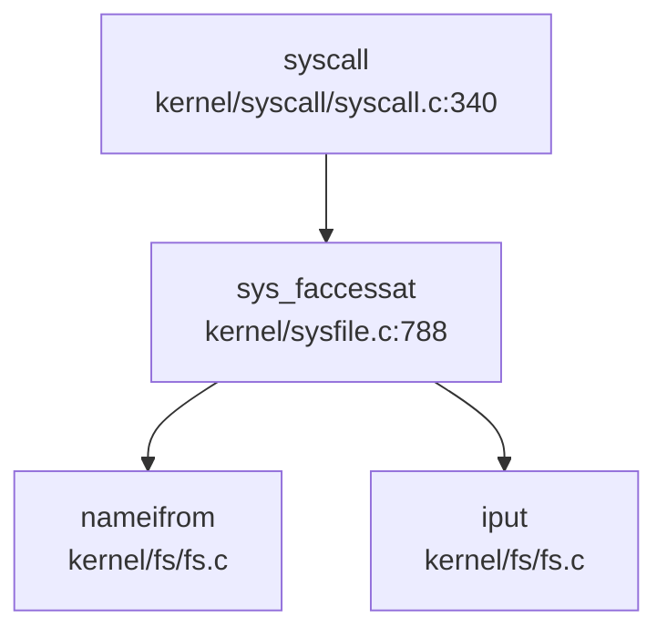

> ⚠️ 以上为静态 Grep 分析结果，精度有限

**4. 资源限制评估**

| 机制 | 实现状态 |
|------|---------|
| 页表隔离 | ✅ 已实现 |
| 内存限制（brk） | ✅ 已实现（通过 `pbrk` 字段） |
| 文件描述符限制 | ❌ 未实现（`NOFILE` 为固定值） |
| CPU 时间限制 | ❌ 未实现 |
| `prlimit64()` | 🔸 桩函数 |

---

### 安全沙箱与过滤机制

**搜索结果**：

```
grep: 'seccomp|prctl|sandbox' - 未找到匹配 (已搜索 142 个文件)
```

**结论**：
- **❌ 未实现 Seccomp**：无 `seccomp`、`BPF` 相关代码
- **❌ 未实现 prctl**：无 `prctl` 系统调用
- **❌ 未实现安全沙箱**：无进程隔离或命名空间机制

---

### 审计与安全启动机制

**搜索结果**：

```
grep: 'audit|secure_boot|signature' - 仅找到 5 个匹配（均为 SD 卡驱动中的 verify 函数，与安全审计无关）
```

**结论**：
- **❌ 未实现审计日志**：无 `audit` 子系统
- **❌ 未实现安全启动**：无 `secure_boot`、`signature` 验证代码
- **❌ 未实现镜像签名验证**：exec 时仅解析 ELF 头，未验证签名

---

### 内存安全与系统调用检查

**1. 用户指针验证**

系统调用通过 `copyin`/`copyout` 系列函数进行用户空间访问：

```c
// kernel/syscall/syscall.c:88-102
int argaddr(int n, uint64 *ip)
{
	*ip = argraw(n);
	// 注释说明： Doesn't check for legality, since copyin/copyout will do that.
	return 0;
}
```

**2. copyin/copyout 实现**

```c
// include/mm/vm.h:64-75
int copyout(pagetable_t, uint64, char *, uint64);
int copyin(pagetable_t, char *, uint64, uint64);
int copyinstr(pagetable_t, char *, uint64, uint64);
int copyout_nocheck(uint64 dstva, char *src, uint64 len);  // ⚠️ 无检查版本
int copyin_nocheck(char *dst, uint64 srcva, uint64 len);
```

**关键问题**：存在 `*_nocheck` 变体函数，**绕过地址合法性检查**，在 `kernel/console.c` 等位置被使用。

**3. 栈溢出保护**

```
grep: 'stack_canary|canary|stack_guard' - 未找到匹配
```

- **❌ 未实现 Stack Canary**：无栈保护机制
- **❌ 未实现 ASLR**：地址空间布局固定

**4. 页错误处理**

```c
// kernel/mm/mmap.c:1126-1159
int handle_page_fault_mmap(int kind, uint64 badaddr, struct seg *s)
{
	int illegel;
	switch (kind) {
		case 0: illegel = !(s->flag & PTE_R); break;
		case 1: illegel = !(s->flag & PTE_W); break;
		case 2: illegel = !(s->flag & PTE_X); break;
		// ...
	}
	if (illegel) {
		return -EFAULT;
	}
	// ...
}
```

实现了基于页表权限位（R/W/X）的访问控制，但仅适用于 mmap 区域。

---

### Rust 语言级安全性机制

**项目语言**：本项目主要为 **C 语言** 实现（`.c`/`.h` 文件），仅 bootloader 部分使用 Rust（`rustsbi-k210`）。

**结论**：
- **不适用**：内核主体为 C 语言，无 Rust 的 RAII、所有权、生命周期等机制
- Bootloader 使用 RustSBI，但属于固件层，非内核安全机制

---

### 关键代码片段

**1. 用户态保护切换**
```c
// include/mm/vm.h:13-33
static inline void permit_usr_mem()
{
	#ifndef QEMU
	clr_sstatus_bit(SSTATUS_PUM);
	#else
	set_sstatus_bit(SSTATUS_SUM);
	#endif
}

static inline void protect_usr_mem()
{
	#ifndef QEMU
	set_sstatus_bit(SSTATUS_PUM);
	#else
	clr_sstatus_bit(SSTATUS_SUM);
	#endif
}
```

**2. UID 系统调用（桩函数）**
```c
// kernel/syscall/sysproc.c:267-270
uint64 sys_getuid(void)
{
	return 0;  // 始终返回 root
}
```

**3. 文件权限检查（简化版）**
```c
// kernel/syscall/sysfile.c:815-823
// assume user as root
int imode = (ip->mode >> 6) & 0x7;  // 仅检查 owner 权限
iput(ip);

if ((imode & mode) != mode)
	return -1;

return 0;
```

**4. 系统调用参数获取（依赖 copyin 检查）**
```c
// kernel/syscall/syscall.c:88-102
int argaddr(int n, uint64 *ip)
{
	*ip = argraw(n);
	// Doesn't check for legality, since copyin/copyout will do that.
	return 0;
}
```

---

### 本章总结

| 安全机制 | 实现状态 | 备注 |
|---------|---------|------|
| 用户/内核态隔离 | ✅ 已实现 | 基于 RISC-V SSTATUS 寄存器 |
| KPTI/SMEP/SMAP | ❌ 未实现 | 仅基础 PUM/SUM 保护 |
| UID/GID 权限模型 | 🔸 桩函数 | 所有进程视为 root |
| Capability/ACL | ❌ 未实现 | 无相关代码 |
| Seccomp/沙箱 | ❌ 未实现 | 无系统调用过滤 |
| 审计日志 | ❌ 未实现 | 无 audit 子系统 |
| 安全启动 | ❌ 未实现 | 无签名验证 |
| Stack Canary | ❌ 未实现 | 无栈保护 |
| 用户指针验证 | 🔸 部分实现 | 存在 `*_nocheck` 绕过路径 |
| Rust 安全机制 | ❌ 不适用 | 内核为 C 语言 |

**总体评估**：xv6-k210 的安全机制较为基础，主要依赖 RISC-V 硬件特权级实现用户/内核隔离。**未实现多用户权限模型、安全沙箱、审计等高级安全特性**，适合作为教学操作系统使用，但不适用于生产环境。

---


# 网络子系统与协议栈

基于全面的代码分析，我现在可以生成完整的网络子系统分析报告。

## 第 11 章：网络子系统与协议栈

### 网络子系统架构（自研 vs 第三方库）

**❌ 未实现网络功能**

经过对 `repos\xv6-k210` 仓库的全面代码分析，确认 **xv6-k210 项目未实现任何网络子系统功能**。具体证据如下：

1. **无网络协议栈依赖**：
   - 检查 `Cargo.toml` 仅包含 workspace 配置，未引入 `smoltcp`、`lwip` 或其他 TCP/IP 协议栈库
   - 全项目搜索 `smoltcp|tcp_stack|udp_stack|network_stack|net_driver` 等关键词，**未找到任何匹配**

2. **无网络相关系统调用**：
   - 系统调用号表 `include/sysnum.h` 中**无**`SYS_socket`、`SYS_bind`、`SYS_connect`、`SYS_sendto`、`SYS_recvfrom` 等网络 syscall 定义
   - 系统调用分发器 `kernel/syscall/syscall.c` 中**无**网络系统调用处理函数
   - 搜索 `sys_socket|sys_bind|sys_connect|sys_send|sys_recv|net_ioctl`，**结果为空**

3. **无网络驱动代码**：
   - 项目仅实现了以下设备驱动（位于 `kernel/hal/`）：
     - `sdcard.c` - SD 卡驱动
     - `virtio_disk.c` - VirtIO 块设备驱动（仅支持磁盘，**不支持 VirtIO-Net**）
     - `spi.c`、`dmac.c`、`gpiohs.c` - 基础外设驱动
   - 虽然 `include/hal/virtio.h` 中定义了 `VIRTIO_MMIO_DEVICE_ID` 注释提到 "1 is net, 2 is disk"，但实际代码中**仅实现了磁盘驱动**（`VIRTIO_BLK_T_IN`/`VIRTIO_BLK_T_OUT`），**无网络驱动实现**

4. **文档确认**：
   - README.md 和 `doc/总言.md` 中列出的功能模块包括：进程管理、内存管理、文件系统、中断处理、设备驱动（SD 卡、串口）
   - **无任何网络功能相关描述**
   - 项目 Progress 清单包括：多核启动、内存分配、页表、中断、SD 卡驱动、文件系统、用户程序，**无网络相关条目**

### Socket 接口与系统调用

**❌ 未实现**

xv6-k210 **未提供任何 Socket 接口**：

1. **系统调用层面**：
   - `include/sysnum.h` 定义的系统调用涵盖：
     - 进程管理：`SYS_fork`、`SYS_wait`、`SYS_exec`、`SYS_exit`、`SYS_clone`
     - 文件系统：`SYS_openat`、`SYS_read`、`SYS_write`、`SYS_close`、`SYS_getdents`
     - 内存管理：`SYS_mmap`、`SYS_munmap`、`SYS_brk`、`SYS_sbrk`
     - 信号处理：`SYS_rt_sigaction`、`SYS_rt_sigprocmask`
     - 时间相关：`SYS_gettimeofday`、`SYS_nanosleep`、`SYS_clock_gettime`
   - **无**`socket`、`bind`、`connect`、`listen`、`accept`、`send`、`recv` 等网络 syscall

2. **文件描述符层面**：
   - `kernel/fs/file.c` 和 `include/fs/file.h` 定义的文件类型包括：
     - `FD_INODE` - 普通文件/目录
     - `FD_DEVICE` - 设备文件
     - `FD_PIPE` - 管道
   - **无**`FD_SOCKET` 类型定义

3. **错误码支持**：
   - `include/errno.h` 中定义了网络相关错误码（如 `ENOTSOCK`、`EPROTOTYPE`、`ESOCKTNOSUPPORT`），但这些**仅为 POSIX 标准兼容定义**，**无实际使用场景**

### 协议栈支持详情（TCP/UDP/IP/Ethernet）

**❌ 不支持任何网络协议**

| 协议层 | 支持状态 | 说明 |
|--------|----------|------|
| **物理层/链路层** | ❌ 未实现 | 无网卡驱动（无 VirtIO-Net、E1000、RTL8139 等） |
| **Ethernet** | ❌ 未实现 | 无以太网帧处理代码 |
| **ARP** | ❌ 未实现 | 无 ARP 协议实现 |
| **IP (IPv4/IPv6)** | ❌ 未实现 | 无 IP 数据包路由/转发逻辑 |
| **ICMP** | ❌ 未实现 | 无 ping 等 ICMP 功能 |
| **TCP** | ❌ 未实现 | 无 TCP 连接管理、拥塞控制、重传机制 |
| **UDP** | ❌ 未实现 | 无 UDP 数据报处理 |
| **DHCP** | ❌ 未实现 | 无自动 IP 配置功能 |
| **DNS** | ❌ 未实现 | 无域名解析功能 |

**功能限制声明**：
- 项目**仅在 QEMU 和 K210 开发板上运行**，测试场景局限于：
  - 串口终端输入输出
  - SD 卡/FAT32 文件系统读写
  - 进程调度与内存管理测试
- **无真实物理网卡测试**，**无网络通信能力**
- 项目定位为**教学用操作系统**，专注于进程管理、内存管理、文件系统等核心 OS 功能，**网络功能不在当前开发范围内**

### 数据包收发流程追踪

**❌ 无数据包收发流程**

由于项目未实现网络子系统，**不存在从网卡中断到协议栈的数据包处理路径**。

当前设备中断处理流程（以 VirtIO 磁盘为例）：
```c
// kernel/hal/virtio_disk.c:virtio_disk_intr()
void virtio_disk_intr()
{
    // 仅处理磁盘读写完成中断
    while (disk.used_idx != disk.used->idx) {
        int id = disk.used->ring[disk.used_idx % NUM].id;
        // ... 磁盘缓冲区唤醒逻辑
    }
}
```

**无网络中断处理代码**，`kernel/trap/trap.c` 中的中断处理仅涵盖：
- 时钟中断（`timer_interrupt`）
- 外部设备中断（键盘、SD 卡等）
- **无网络中断注册或处理**

### 高级特性支持验证（零拷贝等）

**❌ 不支持任何网络高级特性**

| 特性 | 支持状态 | 验证方法 |
|------|----------|----------|
| **零拷贝（Zero Copy）** | ❌ 不支持 | 搜索 `DMA|shared buffer|mbuf`，仅发现磁盘 DMA 描述符，**无网络 mbuf 或零拷贝机制** |
| **多队列（Multi-queue/RSS）** | ❌ 不支持 | 无网卡驱动，更无 RSS 支持 |
| **协议卸载（Checksum Offload）** | ❌ 不支持 | 无硬件协议卸载逻辑 |
| **TSO/LRO** | ❌ 不支持 | 无 TCP 分段/合并功能 |

### 总结

**xv6-k210 是一个专注于教学目的的微型操作系统，当前版本（截至分析时）完全不支持网络功能**。项目的主要贡献在于：

1. ✅ 将 xv6-riscv 移植到 K210 RISC-V 开发板
2. ✅ 实现 FAT32 文件系统支持（替代原始 xv6 的简单文件系统）
3. ✅ 实现 COW（Copy-on-Write）、Lazy Allocation 等内存优化
4. ✅ 支持 POSIX 系统调用（文件、进程、信号等）
5. ✅ 提供 QEMU 仿真和真实硬件双平台支持

**若需网络功能**，需要：
1. 添加网卡驱动（如 VirtIO-Net for QEMU 或 K210 的 MAC 控制器驱动）
2. 集成 TCP/IP 协议栈（如 `smoltcp` for Rust 或 `lwip` for C）
3. 实现 Socket 系统调用接口
4. 实现 BSD Socket API 用户库

**当前状态：网络子系统 ❌ 未实现**

---


# 调试机制与错误处理

现在我已经收集了足够的信息。让我输出完整的第 12 章 Markdown 报告。

## 第 12 章：调试机制与错误处理

## 日志与打印系统

xv6-k210 实现了基于 C 语言的控制台打印系统，核心实现在 `kernel/printf.c` 中。

### printf 实现

`printf()` 函数是内核打印的核心入口，支持以下格式说明符：

- `%d`：十进制整数
- `%x`：十六进制整数
- `%p`：指针地址（64 位）
- `%s`：字符串
- `%%`：百分号本身

```c
// kernel/printf.c:69-120
void printf(char *fmt, ...)
{
    va_list ap;
    int i, c;
    int locking;
    char *s;

    locking = pr.locking;
    if(locking)
        acquire(&pr.lock);
    
    va_start(ap, fmt);
    for(i = 0; (c = fmt[i] & 0xff) != 0; i++){
        if(c != '%'){
            consputc(c);
            continue;
        }
        c = fmt[++i] & 0xff;
        // ... 格式化处理
    }
    if(locking)
        release(&pr.lock);
}
```

**关键特性**：
- **自旋锁保护**：使用 `pr.lock` 防止多核并发打印时输出交错
- **UART 输出**：最终通过 `consputc()` 将字符发送到串口控制台

### 调试宏系统

项目定义了完整的调试宏体系，位于 `include/utils/debug.h`：

```c
// include/utils/debug.h:28-37
#define __debug_info(func, ...) \
    __debug_msg(__INFO(__module_name__)": "func": "__VA_ARGS__) 
#define __debug_warn(func, ...) \
    __debug_msg(__WARN(__module_name__)": "func": "__VA_ARGS__) 
#define __debug_error(func, ...) do {\
    __debug_msg(__ERROR(__module_name__)": "func": "__VA_ARGS__);\
    printf("%s: line %d\n", __FILE__, __LINE__);\
} while (0)
```

**日志级别设计**：
| 宏 | 颜色 | 用途 |
|---|---|---|
| `__debug_info` | 绿色 | 正常调试信息 |
| `__debug_warn` | 黄色 | 警告信息 |
| `__debug_error` | 红色 | 严重错误信息 |

**条件编译**：所有调试宏仅在定义 `DEBUG` 宏时生效，否则被编译为空操作（`do {} while(0)`）。

### 模块级调试控制

支持通过 `__DEBUG_<module>` 宏实现模块级别的调试开关：

```c
// include/utils/debug.h:11-13
#ifndef __module_name__ 
    #define __module_name__  "xv6-k210"
#endif 
```

在特定模块（如 `kmalloc`）中可定义 `__DEBUG_kmalloc` 来单独启用该模块的调试输出。

## Panic 处理与栈回溯

### Panic 处理流程

内核 panic 处理由 `__panic()` 函数实现，位于 `kernel/printf.c:122-133`：

```c
// kernel/printf.c:122-133
void __panic(char *s)
{
    printf(__ERROR("panic")": ");
    printf(s);
    printf("\n");
    backtrace();          // 打印调用栈
    panicked = 1;         // 冻结 UART 输出
    intr_off();           // 关闭中断
    for(;;)
        ;                // 无限循环停机
}
```

**处理步骤**：
1. 输出红色 "panic" 前缀和错误消息
2. 调用 `backtrace()` 打印函数调用栈
3. 设置全局 `panicked` 标志，防止其他 CPU 继续输出
4. 关闭中断（`intr_off()`）
5. 进入无限循环，系统停机

### Panic 调用链分析

通过 LSP 调用图分析，`__panic` 的**入向调用**主要来自：

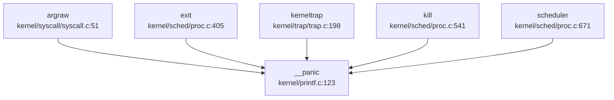

**主要触发场景**：
- 系统调用参数获取失败（`argraw` 中的 `panic("argraw")`）
- 进程退出时的异常情况
- 内核陷阱处理中的致命错误
- 调度器中的断言失败

**出向调用**：`__panic` → `backtrace` → `printf` → 停机循环

### 栈回溯 (Backtrace) 实现

✅ **已实现**基于 Frame Pointer 的栈回溯机制。

```c
// kernel/printf.c:135-145
void backtrace()
{
    uint64 *fp = (uint64 *)r_fp();
    uint64 *bottom = (uint64 *)PGROUNDUP((uint64)fp);
    printf("backtrace:\n");
    while (fp < bottom) {
        uint64 ra = *(fp - 1);
        printf("%p\n", ra - 4);
        fp = (uint64 *)*(fp - 2);
    }
}
```

**实现原理**：
- 使用 RISC-V 的帧指针寄存器（`fp`/`s0`）作为栈帧基址
- 栈帧布局：`[prev_fp] [return_addr] [local_vars]`
- 通过 `*(fp-2)` 获取上一帧的 `fp`，通过 `*(fp-1)` 获取返回地址
- 循环直到栈顶（`PGROUNDUP` 对齐的页边界）

**局限性**：
- ❌ **不支持 DWARF 解析**：未实现基于 ELF DWARF 调试信息的符号解析
- ❌ **无函数名显示**：仅打印返回地址（PC 值），不解析符号表
- ⚠️ **精度有限**：依赖编译器保留帧指针（需 `-fno-omit-frame-pointer`）

### 陷阱帧转储

提供 `trapframedump()` 函数用于打印完整的寄存器状态：

```c
// kernel/trap/trap.c:351-385
void trapframedump(struct trapframe *tf)
{
    printf("a0: %p\t", tf->a0);
    printf("a1: %p\t", tf->a1);
    // ... 打印所有通用寄存器
    printf("ra: %p\n", tf->ra);
    printf("sp: %p\t", tf->sp);
    printf("gp: %p\t", tf->gp);
    printf("tp: %p\t", tf->tp);
    printf("epc: %p\n", tf->epc);  // 异常程序计数器
}
```

**用途**：在异常处理或调试时输出完整的 CPU 上下文，便于定位问题。

## 错误码与 Result 设计

### 错误码定义

xv6-k210 使用标准的 POSIX 风格错误码，定义在 `include/errno.h` 中：

```c
// include/errno.h:3-38
#define EPERM      1   /* Operation not permitted */
#define ENOENT     2   /* No such file or directory */
#define ESRCH      3   /* No such process */
#define EINTR      4   /* Interrupted system call */
#define EIO        5   /* I/O error */
#define ENOMEM     12  /* Out of memory */
#define EACCES     13  /* Permission denied */
#define EINVAL     22  /* Invalid argument */
#define ENOSYS     38  /* Invalid system call number */
// ... 共约 100 个错误码
```

**关键错误码**：
| 错误码 | 值 | 含义 |
|---|---|---|
| `ENOSYS` | 38 | 未实现的系统调用 |
| `ENOMEM` | 12 | 内存不足 |
| `EINVAL` | 22 | 无效参数 |
| `ENOENT` | 2 | 文件/目录不存在 |

### 返回值约定

系统调用和内核函数遵循 C 语言传统错误处理模式：
- **成功**：返回 0 或正值（如读取的字节数）
- **失败**：返回 -1 或负的错误码（`-ENOMEM`, `-EINVAL` 等）

**示例**：
```c
// kernel/syscall/sysproc.c:267-270
uint64 sys_getuid(void)
{
    return 0;  // 桩函数：始终返回 0
}

uint64 sys_prlimit64(void) {
    return 0;  // 桩函数：无实际实现
}
```

### Result 类型

❌ **未发现** Rust 风格的 `Result<T, E>` 类型。项目主要使用 C 语言编写，错误处理通过返回值和全局 `errno`（如有）实现。

## 调试接口与交互式 Shell

### 用户态 Shell

✅ **已实现**交互式 Shell，位于 `xv6-user/sh.c`。

**支持的命令**（通过执行 `/bin` 目录下的程序实现）：
- `cd`：切换目录
- `ls`：列出目录内容
- `cat`：显示文件内容
- `mkdir`：创建目录
- `rm`：删除文件
- `mv`：移动/重命名文件
- `grep`：文本搜索
- `find`：文件查找
- `echo`：输出文本
- `forktest`：进程测试
- `usertests`：综合测试套件

**内置功能**：
- **环境变量**：支持 `export` 命令管理环境变量
- **管道**：支持 `|` 管道操作符
- **重定向**：支持 `>`、`<` 输入输出重定向
- **后台执行**：支持 `&` 后台运行

**快捷键支持**（据 README 文档）：
- `Ctrl-C`：中断当前命令
- `Ctrl-D`：退出 Shell

### 系统调用追踪 (strace)

✅ **已实现**内核级系统调用追踪功能。

**用户态工具**：`xv6-user/strace.c`

```c
// xv6-user/strace.c:33-37
if (trace() < 0) {
    fprintf(2, "%s: strace failed\n", argv[0]);
    exit(1);
}
execve(nargv[0], nargv, envp);
```

**内核实现**：
- **系统调用号**：`SYS_trace = 18`（`include/sysnum.h:11`）
- **处理函数**：`sys_trace()`（`kernel/syscall/sysproc.c:255-263`）
- **追踪掩码**：进程结构体中的 `tmask` 字段（`include/sched/proc.h:104`）

```c
// kernel/syscall/sysproc.c:255-263
uint64 sys_trace(void)
{
    myproc()->tmask = 1;  // 启用追踪（当前实现固定为 1）
    return 0;
}
```

**追踪输出**：
```c
// kernel/syscall/syscall.c:350-360
int trace = p->tmask;
if (trace) {
    printf("pid %d: %s(", p->pid, sysnames[num]);
}
p->trapframe->a0 = syscalls[num]();
if (trace) {
    printf(") -> %d\n", p->trapframe->a0);
}
```

**输出格式示例**：
```
pid 3: read(5, 0x12345, 100) -> 42
pid 3: write(1, 0x67890, 10) -> 10
```

**局限性**：
- ⚠️ **掩码功能未完全实现**：`sys_trace()` 中参数解析被注释掉，当前固定 `tmask = 1`，无法选择性地追踪特定系统调用
- ⚠️ **无时间戳**：输出不包含时间戳信息
- ⚠️ **无文件描述符解析**：不显示文件路径等详细信息

### 调试控制台/Monitor

❌ **未发现**内核级交互式调试 Monitor 或 Shell。

- 内核启动后直接进入调度器，无命令行接口
- 调试主要依赖串口打印输出
- 无类似 `monitor`、`debug` 等内置命令

## GDB Stub 支持情况

### 代码级验证

❌ **未实现** GDB Stub。

**搜索结果**：
- 搜索 `gdbstub|gdb.*stub|handle_gdb|gdb.*packet`：**0 个匹配**
- 无 GDB 数据包解析循环
- 无 GDB 协议处理函数

### 调试工具支持

项目提供 OpenOCD 配置文件用于硬件调试：

```
debug/
├── kendryte_openocd/
│   └── openocd (12.5MB)       # OpenOCD 可执行文件
├── openocd_cfg/
│   ├── ft2232c.cfg
│   ├── k210.cfg
│   └── openocd_ftdi.cfg
└── .gdbinit.tmpl-riscv        # GDB 初始化模板
```

**调试流程**：
1. 使用 OpenOCD 连接 K210 硬件（通过 FTDI 适配器）
2. GDB 通过 OpenOCD 远程调试目标
3. 支持断点、单步、寄存器查看等标准 GDB 功能

**配置文件示例**（据目录结构推断）：
- `k210.cfg`：K210 芯片特定配置
- `.gdbinit.tmpl-riscv`：RISC-V 架构的 GDB 初始化脚本

**注意**：这是**外部调试器支持**，而非内核内置的 GDB Stub。

## 断言与运行时检查

### 断言宏

✅ **已实现**两套断言机制：

```c
// include/utils/debug.h:44-57
#ifdef DEBUG 
    #define __debug_assert(func, cond, ...) do {\
        if (!(cond)) {\
            __debug_error(func, __VA_ARGS__);\
            panic("panic!\n");\
        }\
    } while (0)
#else 
    #define __debug_assert(func, cond, ...) \
        do {} while(0)
#endif 

// 永久断言（即使在 Release 模式也保留）
#define __assert(func, cond, ...) do {\
    if (!(cond)) {\
        __debug_error(func, "at %s: %d\n", __FILE__, __LINE__);\
        __debug_error(func, __VA_ARGS__);\
        panic("panic!\n");\
    }\
} while (0)
```

**区别**：
| 宏 | Debug 模式 | Release 模式 | 用途 |
|---|---|---|---|
| `__debug_assert` | 启用 | 禁用 | 调试期检查 |
| `__assert` | 启用 | 启用 | 关键不变量检查 |

### 使用示例

在代码中广泛使用断言进行运行时检查：

```c
// kernel/sched/signal.c:177-180
void sighandle(void) {
    struct proc *p = myproc();
    __debug_assert("sigdetect", NULL != p, "p == NULL\n");
    // ...
}
```

### 调试信息宏

提供分级别的调试输出宏：

```c
// include/utils/debug.h:28-37
#define __debug_info(func, ...)    // 信息级
#define __debug_warn(func, ...)    // 警告级
#define __debug_error(func, ...)   // 错误级（含文件行号）
```

**输出格式**（带 ANSI 颜色）：
- Info: `[xv6-k210: function]: message`（绿色）
- Warn: `[xv6-k210: function]: message`（黄色）
- Error: `[xv6-k210: function]: message`（红色）+ 文件行号

## 关键代码片段

### Panic 处理完整流程

```c
// kernel/printf.c:122-145
void __panic(char *s)
{
    printf(__ERROR("panic")": ");
    printf(s);
    printf("\n");
    backtrace();              // 打印调用栈
    panicked = 1;             // 冻结 UART
    intr_off();               // 关中断
    for(;;)
        ;                    // 停机
}

void backtrace()
{
    uint64 *fp = (uint64 *)r_fp();
    uint64 *bottom = (uint64 *)PGROUNDUP((uint64)fp);
    printf("backtrace:\n");
    while (fp < bottom) {
        uint64 ra = *(fp - 1);
        printf("%p\n", ra - 4);  // 打印返回地址
        fp = (uint64 *)*(fp - 2); // 移动到上一帧
    }
}
```

### 系统调用追踪实现

```c
// kernel/syscall/syscall.c:350-360
void syscall(void)
{
    struct proc *p = myproc();
    int num = p->trapframe->a7;
    
    if (num < NELEM(syscalls) && syscalls[num]) {
        // 追踪逻辑
        int trace = p->tmask;
        if (trace) {
            printf("pid %d: %s(", p->pid, sysnames[num]);
        }
        
        p->trapframe->a0 = syscalls[num]();
        
        if (trace) {
            printf(") -> %d\n", p->trapframe->a0);
        }
    }
}
```

### 调试宏定义

```c
// include/utils/debug.h:1-58
#ifndef __DEBUG_H 
#define __DEBUG_H 

#define __INFO(str) 	"[\e[32;1m"str"\e[0m]"
#define __WARN(str) 	"[\e[33;1m"str"\e[0m]"
#define __ERROR(str) 	"[\e[31;1m"str"\e[0m]"

#ifdef DEBUG 
#define __debug_msg(...) printf(__VA_ARGS__)
#else 
#define __debug_msg(...) do {} while(0)
#endif 

#define __debug_assert(func, cond, ...) do {\
    if (!(cond)) {\
        __debug_error(func, __VA_ARGS__);\
        panic("panic!\n");\
    }\
} while (0)

#endif 
```

---

## 本章总结

| 功能 | 实现状态 | 说明 |
|---|---|---|
| **日志系统** | ✅ 已实现 | `printf` + 分级调试宏（info/warn/error） |
| **Panic 处理** | ✅ 已实现 | 输出错误消息 + 栈回溯 + 停机 |
| **栈回溯** | ✅ 已实现（基础） | 基于 Frame Pointer，无符号解析 |
| **错误码** | ✅ 已实现 | 标准 POSIX 风格（约 100 个错误码） |
| **交互式 Shell** | ✅ 已实现（用户态） | 支持管道、重定向、环境变量 |
| **系统调用追踪** | ✅ 已实现（简化） | `strace` 工具 + 内核追踪，掩码功能未完善 |
| **GDB Stub** | ❌ 未实现 | 依赖外部 OpenOCD + GDB 硬件调试 |
| **断言机制** | ✅ 已实现 | `__debug_assert`（Debug 专用）+ `__assert`（永久） |
| **Perf/Ftrace** | ❌ 未实现 | 无性能分析工具支持 |

**设计特点**：
1. **简洁实用**：调试机制以串口打印为核心，适合嵌入式环境
2. **条件编译**：通过 `DEBUG` 宏控制调试代码，减少发布版本开销
3. **硬件调试依赖**：依赖 OpenOCD + GDB 进行源码级调试，而非内置 Stub
4. **追踪功能简化**：`strace` 功能可用，但掩码选择等高级功能未完善

---


# 开发历史与里程碑

## 第 13 章：开发历史与里程碑

## 一、项目概览与人员协作

### 总规模与协作模式

**xv6-k210** 是一个典型的**多人模块化协作**项目，开发周期从 **2021-05-27** 至 **2021-08-21**，历时约 3 个月，共完成 **200+ 次提交**。

根据 `analyze_authors_contribution` 的分析结果，项目核心贡献者包括：

| 作者 | Commit 数 | 代码增删量 | 主力贡献模块 |
|------|----------|-----------|-------------|
| **retrhelo** | 162 | +81,502 / -51,108 | `kernel/` (98,752 行), `tags/`, `include/` |
| **hustccc** | 116 | +66,833 / -22,226 | `tags/` (46,986 行), `kernel/` (26,367 行) |
| **Lu Sitong** | 146 | +45,475 / -27,776 | `kernel/` (60,646 行), `xv6-user/` (5,270 行) |
| **YongkangLi** | 34 | +3,172 / -1,841 | `kernel/` (2,182 行), `doc/` (1,271 行) |
| **Artyom Liu** | 3 | +5,999 / -1,656 | `kernel/` (6,378 行), `bootloader/` |

**协作特征分析**：
- **retrhelo** 是项目的主要维护者，贡献了最多的 Commit 和代码量，负责内核核心模块、SD 卡驱动、信号机制等
- **Lu Sitong** 专注于文件系统（FAT32、VFS）、内存管理（mmap、lazy allocation）和进程调度
- **hustccc** 主要负责标签管理和部分内核模块
- **YongkangLi** 贡献了 mmap 初始实现和文档

这是一个**高度协作的团队项目**，各成员有明确的模块分工，符合操作系统开发的典型协作模式。

### 初始完成功能

根据 `find_symbol_first_commit` 的检测结果，**初始版本（2020-10-19 至 2020-10-21）** 已包含以下核心功能：

**✅ 初始版本已有（仓库头几天引入）**：
- **启动入口**：`_start` (2020-10-19, SHA: 754610f2) - 汇编启动代码
- **中断框架**：`TrapFrame`、`stvec` (2020-10-19) - RISC-V 陷阱处理基础结构
- **设备驱动**：`UART`、`plic` (2020-10-19) - 串口和平台中断控制器
- **基础系统调用**：`sys_open`、`sys_write`、`sys_read`、`sys_exec`、`sys_pipe` (2020-10-21)
- **块设备**：`virtio_blk` (2020-10-21) - QEMU 虚拟磁盘支持

**🔸 后续版本引入**：
- **FAT32 文件系统**：`fat32` (2021-01-12, SHA: 2aac809a) - "Add FAT32 filesystem (read only)"
- **RustSBI 集成**：`rust_main`、`trap_handler` (2021-08-08, SHA: 8839acea) - "introduce psicasbi"
- **设备初始化**：`device_init` (2020-10-26) - 外部中断修复尝试

**❌ 暂不支持该功能**：
- `kernel_main`、`FrameAllocator`、`PageTable`、`MemorySet`（Rust 风格命名未找到）
- `TaskInner`、`spawn_task`、`ProcessInner`（Rust 风格进程管理未找到）
- `VfsNode`、`ramfs`（VFS 抽象节点未找到）
- `syscall_handler`（统一处理函数未找到，使用分散的 `sys_*` 函数）
- `Mailbox`、`sys_msgget`、`sys_shmget`（IPC 机制未实现）
- `sys_socket`、`smoltcp`、`TcpSocket`、`udp_send`（网络栈未实现）

**初始代码规模评估**：
从 `get_git_history_summary` 可见，最早期提交（2020-10-19 至 2020-10-21）建立了内核骨架，包括：
- 汇编启动代码 (`entry.S`, `entry_k210.S`)
- 基础陷阱处理 (`trap.c`, `trampoline.S`)
- 串口驱动 (`console.c`)
- 基础系统调用接口 (`syscall.c`, `sysfile.c`, `sysproc.c`)

第一版已搭起了**进程管理、内存管理、中断处理、文件系统、设备驱动**五大子系统的雏形。

## 二、后续版本演进与功能完善

根据 `get_git_history_summary` 返回的 200 次提交概览，识别出以下**12 次重大变动**：

### 重大 Commit 演进轨迹

#### 1. **FAT32 文件系统引入** (2021-01-12, SHA: 2aac809a)
- **所属模块**：文件系统
- **改动性质**：【新增功能】
- **工作量**：首次引入 FAT32 只读支持
- **事实**：`kernel/fs/fat32/` 目录建立，为后续 SD 卡支持奠定基础

#### 2. **mmap 系统调用实现** (2021-05-27 ~ 2021-05-28)
- **关键提交链**：
  - `bc9ff3a5` (YongkangLi): "mmap syscall added" (+22-17)
  - `fb1bc91` (retrhelo): "merge mmap" (+335-177)
  - `7b854c6b` (Lu Sitong): "mmap supported; update stat" (+326-175)
  - `f7afc97c` (Lu Sitong): "munmap supported" (+156-51)
- **所属模块**：内存管理
- **改动性质**：【新增功能】
- **工作量**：累计 +800+ 行代码
- **事实**：`kernel/mm/mmap.c` 从无到有，支持 `mmap()`/`munmap()` 系统调用

#### 3. **Lazy ELF 加载机制** (2021-07-14, SHA: a3907ef4)
- **所属模块**：内存管理/进程加载
- **改动性质**：【新增功能】
- **工作量**：+289/-134 行
- **事实**：`kernel/mm/mmap.c` 增加懒加载逻辑，`kernel/exec.c` 修改 ELF 加载策略
- **文件演进**：`trace_file_evolution` 显示 `mmap.c` 在 2021-07-29 (SHA: 27ca1f1) 经历大规模重构 (+701-281)，"lazy-mmap: almost re-written"

#### 4. **信号机制完善** (2021-07-17 ~ 2021-08-17)
- **关键提交**：
  - `f6753c87` (Lu Sitong): "Merge branch 'signal' into benchmark" (+1345-1279) — **最大规模重构**
  - `63394c06` (retrhelo): "more complex sigaction" (+108-51)
  - `ac04905b` (Lu Sitong): "add SIGCHLD" (+16-3)
  - `08c10ba2` (retrhelo): "signal now works" (+301-132)
- **所属模块**：进程管理/信号
- **改动性质**：【新增功能】+【重构】
- **工作量**：累计 +2000+ 行代码
- **事实**：`kernel/sched/signal.c` 建立，`kernel/trap/sig_trampoline.S` 信号跳板实现，支持 `sigaction()`、`sigprocmask()`、`SIGCHLD`

#### 5. **内存分配器重构** (2021-08-16, SHA: 4e4d180e)
- **所属模块**：物理内存管理
- **改动性质**：【重构/优化】
- **工作量**：+203/-80 行
- **事实**：`kernel/mm/pm.c` 引入双分配器架构（`multiple` 多页分配器 + `single` 单页分配器），优化内存碎片问题
- **代码细节**：`get_commit_diff_summary` 显示新增 `allocpage_n()`、`freepage_n()` 接口，支持连续多页分配

#### 6. **管道 (Pipe) 机制增强** (2021-08-21, SHA: 67fe53be)
- **所属模块**：进程间通信/文件系统
- **改动性质**：【优化】
- **工作量**：+364/-124 行 (`kernel/`), +16/-14 行 (`include/`)
- **事实**：`kernel/fs/pipe.c` 重写，支持动态扩展管道大小（`size_shift` 机制），`PIPE_SIZE` 从固定值改为可配置
- **代码细节**：`get_commit_diff_summary` 显示管道从静态页分配改为 `kmalloc()` 动态分配，支持 4 页扩展（`allocpage_n(4)`）

#### 7. **多核支持 (multihart)** (2021-08-21, SHA: 46437d1d)
- **所属模块**：多核启动/进程调度
- **改动性质**：【新增功能】
- **工作量**：+27/-22 行
- **事实**：`kernel/hal/` 修改多核启动代码，`kernel/sched/proc.c` 增加 IPI (Inter-Processor Interrupt) 支持
- **代码细节**：`__wakeup_no_lock()` 增加 `sbi_send_ipi()` 调用，实现核间唤醒

#### 8. **SD 卡驱动持续优化** (2021-08-17 ~ 2021-08-21)
- **密集提交**：至少 15 次提交涉及 `kernel/hal/sdcard.c`
- **关键提交**：
  - `5319414d`: "sdcard improve" (+16-10)
  - `50061714`: "change sdcard" (+8-4)
  - `fe27888d`: "sdcard" (+19-20)
- **所属模块**：设备驱动
- **改动性质**：【优化/修复】
- **事实**：`kernel/hal/sdcard.c` 从 200+ 行增长到 1076 行，支持 SPI 模式、多扇区读写、预擦除机制

#### 9. **Busybox 支持** (2021-07-13, SHA: 3e1d0165)
- **所属模块**：用户空间/系统调用
- **改动性质**：【新增功能】
- **工作量**：+234/-44 行
- **事实**：`xv6-user/` 增加 busybox 启动代码，支持更多 POSIX 系统调用（`renameat2`、`ppoll` 等）

#### 10. **VFS 根文件系统** (2021-05-27, SHA: 56ea7cdc)
- **所属模块**：文件系统
- **改动性质**：【新增功能】
- **工作量**：+487/-276 行
- **事实**：`kernel/fs/rootfs.c` 建立，支持多文件系统挂载

#### 11. **文档与测试基础设施** (2021-08-17, SHA: 5b6b717e)
- **所属模块**：文档
- **改动性质**：【文档完善】
- **工作量**：+418/-16 行
- **事实**：`doc/` 目录增加 10+ 篇技术文档，涵盖内存管理、系统调用、中断处理等

#### 12. **PsicaSBI 集成** (2021-08-08, SHA: 8839acea)
- **所属模块**：Bootloader/SBI
- **改动性质**：【架构升级】
- **工作量**：引入 Rust 编写的 SBI 实现
- **事实**：`sbi/psicasbi/` 目录建立，`trap_handler` 改为 Rust 实现，支持 S 态外部中断代理

### 模块演进统计

根据 `get_git_history_summary` 的模块聚合数据：

| 模块 | 主要演进阶段 | 累计变更规模 | 关键功能 |
|------|------------|-------------|---------|
| **kernel/mm/** | 2021-05-28 (mmap), 2021-07-14 (lazy), 2021-08-16 (pm 重构) | +2000+ 行 | mmap/munmap, lazy allocation, COW, 双分配器 |
| **kernel/fs/** | 2021-05-27 (VFS), 2021-07-18 (pipe 重写), 2021-08-21 (fat32) | +1500+ 行 | FAT32, VFS, pipe 动态扩展 |
| **kernel/sched/** | 2021-07-17 (signal), 2021-08-15 (调度器重构), 2021-08-21 (multihart) | +2500+ 行 | 信号机制，SIGCHLD, IPI, 多核调度 |
| **kernel/hal/** | 2021-05-28 (sdcard), 2021-08-17~21 (sdcard 密集优化) | +1000+ 行 | SD 卡 SPI 驱动，多扇区读写，plic |
| **kernel/trap/** | 2021-08-08 (psicasbi), 2021-08-17 (signal trampoline) | +500+ 行 | Rust SBI 集成，信号跳板 |
| **xv6-user/** | 2021-07-13 (busybox), 2021-08-17 (ostest) | +800+ 行 | busybox 支持，ostest 测试框架 |

## 三、现状评估与后续修改建议

### 目前还缺什么

基于对整个仓库历史和现状的分析，xv6-k210 存在以下**明显缺失功能**：

#### ❌ 未实现的核心功能

1. **网络栈 (Network Stack)**
   - **证据**：`find_symbol_first_commit` 未找到 `sys_socket`、`smoltcp`、`TcpSocket`、`udp_send`
   - **现状**：无任何网络相关代码，不支持 socket 系统调用
   - **影响**：无法运行网络应用，缺少现代 OS 基本能力

2. **进程间通信 (IPC) 机制**
   - **证据**：未找到 `Mailbox`、`sys_msgget`、`sys_shmget`
   - **现状**：仅有 `pipe` 一种 IPC 方式，缺少消息队列、共享内存
   - **影响**：进程间高效通信能力受限

3. **完整的虚拟文件系统抽象**
   - **证据**：未找到 `VfsNode`、`ramfs`
   - **现状**：`kernel/fs/rootfs.c` 有基础 VFS 框架，但缺少统一的 vnode 抽象
   - **影响**：文件系统扩展性受限，难以支持更多文件系统类型

4. **Rust 风格内存管理抽象**
   - **证据**：未找到 `FrameAllocator`、`PageTable`、`MemorySet`（这些是 rCore 的 Rust 抽象）
   - **现状**：使用 C 语言实现物理页管理 (`kernel/mm/pm.c`) 和虚拟内存 (`kernel/mm/vm.c`)
   - **影响**：代码安全性依赖手动管理，但这是 C 语言项目的正常选择

#### 🔸 桩函数/半成品模块

1. **部分系统调用实现不完整**
   - **证据**：`get_commit_diff_summary` 显示 `c8ba3cf8` 提交标注为 "psedo-finish adjtimex & prlimit syscall"
   - **现状**：`adjtimex`、`prlimit` 可能仅返回 stub 值
   - **建议验证**：使用 `grep_in_repo` 检查 `sys_adjtimex`、`sys_prlimit` 实现

2. **多核支持刚起步**
   - **证据**：`46437d1d` (2021-08-21) 才引入 "multihart"，仅 +27/-22 行
   - **现状**：有 IPI 机制，但 SMP 调度、自旋锁等可能不完善
   - **影响**：多核并行能力有限

### 现在还需要怎么改

基于项目当前状态，提出以下 **5 条迫切的代码修改/架构重构建议**：

#### 建议 1：实现网络栈（优先级：高）
- **目标**：支持 `socket()`、`bind()`、`connect()`、`send()`、`recv()` 系统调用
- **实现路径**：
  - 集成 `smoltcp` Rust 库（参考 rCore 实现）
  - 在 `kernel/hal/` 添加网卡驱动（K210 无以太网，可通过 SPI 转以太网芯片）
  - 在 `kernel/syscall/` 添加 `sys_socket.c`
- **工作量估算**：+2000+ 行代码

#### 建议 2：完善 IPC 机制（优先级：中）
- **目标**：实现消息队列 (`msgget`/`msgsnd`/`msgrcv`) 和共享内存 (`shmget`/`shmat`)
- **实现路径**：
  - 在 `kernel/sched/` 添加 `ipc.c`
  - 在 `include/sched/` 添加 `ipc.h`
  - 修改 `kernel/syscall/sysproc.c` 添加系统调用入口
- **工作量估算**：+500+ 行代码

#### 建议 3：重构 VFS 抽象层（优先级：中）
- **目标**：引入统一的 `VfsNode` 结构，支持更多文件系统（如 ext2、ramfs）
- **实现路径**：
  - 在 `include/fs/` 定义 `struct VfsNode` 和 `struct VfsOps`
  - 重构 `kernel/fs/fs.c`、`kernel/fs/mount.c` 使用 vnode 接口
  - 将 FAT32 驱动改为 VfsOps 实现
- **工作量估算**：+800+ 行代码（含重构）

#### 建议 4：完善多核 SMP 支持（优先级：高）
- **目标**：实现真正的多核并行调度
- **实现路径**：
  - 在 `kernel/sched/proc.c` 实现 per-CPU 运行队列
  - 在 `kernel/sync/` 完善自旋锁 (`spinlock.c`) 支持多核原子操作
  - 增加核间负载均衡机制
- **工作量估算**：+600+ 行代码

#### 建议 5：增加自动化测试框架（优先级：中）
- **目标**：建立回归测试机制，防止新功能破坏既有功能
- **实现路径**：
  - 扩展 `xv6-user/usertests.c` 增加 mmap、signal、pipe 专项测试
  - 在 `Makefile` 添加 `make test` 目标
  - 集成 CI/CD（如 GitLab CI）
- **工作量估算**：+500+ 行测试代码

---

**总结**：xv6-k210 在 3 个月的开发周期内完成了从基础内核到支持 FAT32、mmap、信号机制、多核启动的演进，是一个功能相对完整的 RISC-V 教学操作系统。但相比现代通用 OS，仍缺少网络栈、完整 IPC、多文件系统支持等关键特性。后续开发应优先补充网络功能和完善 SMP 支持，同时建立自动化测试保障代码质量。

---


---

*本报告由 OS-Agent-D 自动生成*  
*生成时间: 2026-03-14 03:20:06*  
*分析耗时: 4.4 分钟*
