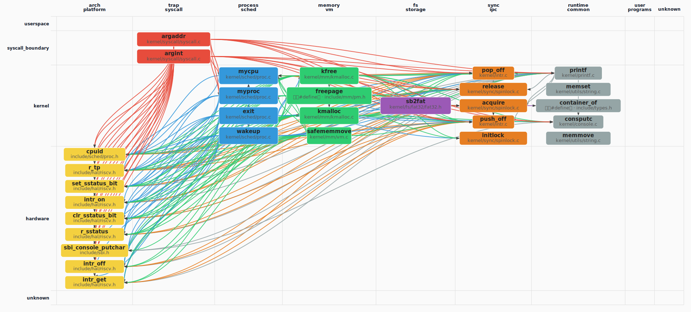

## Call Graph 概览

> 先以 Tree-sitter 扫描全库，再对 C/C++ 用 **Clang AST**（与仓库根 `compile_flags.txt` / `compile_commands.json` 一致）剔除**条件编译未进入翻译单元**的函数节点，得到参与 PageRank 的 **1803** 个函数、**4066** 条调用边。
> 语义解析 82/82 个文件。
>
> 用 **PageRank** 选出架构枢纽 **Top-30** 个函数（参数 **k=30**；若全库可排名节点不足 k，则实际个数可能小于 k）。
> 按 **domain（列）× layer（行）** 二维网格布局（**domain/layer 由 LLM 根据函数名与代码片段分类**），
> 同格多节点限制在格内排布；连线体现调用关系。
> **可变网格**：在 **k=30** 配置下，**未出现**的 domain 列、layer 行会**压缩**宽高，把画布让给有节点的列/行。
> **layer 为何常落在 kernel**：PageRank 枢纽多为调度/内存/VFS 等**内核通用逻辑**，且 `kernel` 表示「既非 syscall 入口、也非直接 MMIO」的广义内核代码，模型容易默认成 kernel；已对 **`sys_*` 命名**做确定性修正为 `syscall_boundary`。缓存随 **compile 配置 / git / 管线版本** 自动失效；需强制全量重算时可调用 `generate_callgraph_section(..., force_regenerate=True)`。

### 函数级 Call Graph（PageRank Top-30，图示 30 个函数）

*（图：`callgraph_overview.svg`，与报告同目录）*

**图例**：列 = domain 分类，行 = layer 层次（**userspace** → **syscall_boundary** → **kernel** → **hardware**）
节点颜色：`arch_platform`=#f4d03f / `trap_syscall`=#e74c3c / `process_sched`=#3498db / `memory_vm`=#2ecc71 / `fs_storage`=#9b59b6
节点**第一行**仅为**符号名**；**第二行**：**函数定义**只写相对源路径；**宏**、**类型别名（typedef）**、**仅引用（调用侧）**等在第二行用**中文**标明类别并附路径或调用方文件（来自静态解析或调用边）。
列宽按该 domain 列下最长节点标签**动态**估算（有上下限），避免固定死宽度。

### 文件级调用关系

<table style="border-collapse:collapse;width:auto;max-width:100%;table-layout:auto">
<thead><tr>
<th style="text-align:left;padding:6px 10px;border:1px solid #ddd;background:#f6f8fa">源文件</th>
<th style="text-align:left;padding:6px 10px;border:1px solid #ddd;background:#f6f8fa">domain</th>
<th style="text-align:left;padding:6px 10px;border:1px solid #ddd;background:#f6f8fa">调用的文件（权重）</th>
</tr></thead>
<tbody>
<tr><td style="text-align:left;padding:6px 10px;border:1px solid #ddd;vertical-align:top"><code style='white-space:pre-wrap;word-break:break-all'>include/mm/pm.h</code></td><td style="text-align:left;padding:6px 10px;border:1px solid #ddd;vertical-align:top">memory_vm</td><td style="text-align:left;padding:6px 10px;border:1px solid #ddd;vertical-align:top">riscv.h×7, spinlock.c×2, intr.c×2, proc.c×1, proc.h×1</td></tr>
<tr><td style="text-align:left;padding:6px 10px;border:1px solid #ddd;vertical-align:top"><code style='white-space:pre-wrap;word-break:break-all'>include/sched/proc.h</code></td><td style="text-align:left;padding:6px 10px;border:1px solid #ddd;vertical-align:top">arch_platform</td><td style="text-align:left;padding:6px 10px;border:1px solid #ddd;vertical-align:top">riscv.h×1</td></tr>
<tr><td style="text-align:left;padding:6px 10px;border:1px solid #ddd;vertical-align:top"><code style='white-space:pre-wrap;word-break:break-all'>kernel/console.c</code></td><td style="text-align:left;padding:6px 10px;border:1px solid #ddd;vertical-align:top">arch_platform</td><td style="text-align:left;padding:6px 10px;border:1px solid #ddd;vertical-align:top">sbi.h×1</td></tr>
<tr><td style="text-align:left;padding:6px 10px;border:1px solid #ddd;vertical-align:top"><code style='white-space:pre-wrap;word-break:break-all'>kernel/fs/fat32/fat32.h</code></td><td style="text-align:left;padding:6px 10px;border:1px solid #ddd;vertical-align:top">fs_storage</td><td style="text-align:left;padding:6px 10px;border:1px solid #ddd;vertical-align:top">types.h×1</td></tr>
<tr><td style="text-align:left;padding:6px 10px;border:1px solid #ddd;vertical-align:top"><code style='white-space:pre-wrap;word-break:break-all'>kernel/intr.c</code></td><td style="text-align:left;padding:6px 10px;border:1px solid #ddd;vertical-align:top">sync_ipc</td><td style="text-align:left;padding:6px 10px;border:1px solid #ddd;vertical-align:top">riscv.h×8, proc.c×2, proc.h×2</td></tr>
<tr><td style="text-align:left;padding:6px 10px;border:1px solid #ddd;vertical-align:top"><code style='white-space:pre-wrap;word-break:break-all'>kernel/mm/kmalloc.c</code></td><td style="text-align:left;padding:6px 10px;border:1px solid #ddd;vertical-align:top">memory_vm</td><td style="text-align:left;padding:6px 10px;border:1px solid #ddd;vertical-align:top">riscv.h×10, spinlock.c×6, printf.c×6, intr.c×4, pm.h×2</td></tr>
<tr><td style="text-align:left;padding:6px 10px;border:1px solid #ddd;vertical-align:top"><code style='white-space:pre-wrap;word-break:break-all'>kernel/mm/vm.c</code></td><td style="text-align:left;padding:6px 10px;border:1px solid #ddd;vertical-align:top">memory_vm</td><td style="text-align:left;padding:6px 10px;border:1px solid #ddd;vertical-align:top">riscv.h×7, proc.c×2, vm.h×2, intr.c×2, proc.h×1</td></tr>
<tr><td style="text-align:left;padding:6px 10px;border:1px solid #ddd;vertical-align:top"><code style='white-space:pre-wrap;word-break:break-all'>kernel/printf.c</code></td><td style="text-align:left;padding:6px 10px;border:1px solid #ddd;vertical-align:top">runtime_common</td><td style="text-align:left;padding:6px 10px;border:1px solid #ddd;vertical-align:top">riscv.h×7, spinlock.c×2, intr.c×2, console.c×1, printf.c×1</td></tr>
<tr><td style="text-align:left;padding:6px 10px;border:1px solid #ddd;vertical-align:top"><code style='white-space:pre-wrap;word-break:break-all'>kernel/sched/proc.c</code></td><td style="text-align:left;padding:6px 10px;border:1px solid #ddd;vertical-align:top">process_sched</td><td style="text-align:left;padding:6px 10px;border:1px solid #ddd;vertical-align:top">riscv.h×27, intr.c×6, proc.h×4, spinlock.c×4, printf.c×4</td></tr>
<tr><td style="text-align:left;padding:6px 10px;border:1px solid #ddd;vertical-align:top"><code style='white-space:pre-wrap;word-break:break-all'>kernel/sync/spinlock.c</code></td><td style="text-align:left;padding:6px 10px;border:1px solid #ddd;vertical-align:top">sync_ipc</td><td style="text-align:left;padding:6px 10px;border:1px solid #ddd;vertical-align:top">riscv.h×8, intr.c×2, proc.c×2, proc.h×2</td></tr>
<tr><td style="text-align:left;padding:6px 10px;border:1px solid #ddd;vertical-align:top"><code style='white-space:pre-wrap;word-break:break-all'>kernel/syscall/syscall.c</code></td><td style="text-align:left;padding:6px 10px;border:1px solid #ddd;vertical-align:top">trap_syscall</td><td style="text-align:left;padding:6px 10px;border:1px solid #ddd;vertical-align:top">riscv.h×12, proc.c×4, printf.c×4, intr.c×4, proc.h×2</td></tr>
</tbody></table>

### PageRank Top-30 枢纽函数（k=30）

<table style="border-collapse:collapse;width:auto;max-width:100%;table-layout:auto">
<thead><tr>
<th style="text-align:left;padding:6px 10px;border:1px solid #ddd;background:#f6f8fa">符号</th>
<th style="text-align:left;padding:6px 10px;border:1px solid #ddd;background:#f6f8fa">类型</th>
<th style="text-align:left;padding:6px 10px;border:1px solid #ddd;background:#f6f8fa">domain</th>
<th style="text-align:left;padding:6px 10px;border:1px solid #ddd;background:#f6f8fa">layer</th>
<th style="text-align:left;padding:6px 10px;border:1px solid #ddd;background:#f6f8fa">定义路径 / 引用位置</th>
<th style="text-align:left;padding:6px 10px;border:1px solid #ddd;background:#f6f8fa">PR</th>
<th style="text-align:left;padding:6px 10px;border:1px solid #ddd;background:#f6f8fa">in°</th>
<th style="text-align:left;padding:6px 10px;border:1px solid #ddd;background:#f6f8fa">out°</th>
</tr></thead>
<tbody>
<tr><td style="text-align:left;padding:6px 10px;border:1px solid #ddd;vertical-align:top"><code>cpuid</code></td><td style="text-align:left;padding:6px 10px;border:1px solid #ddd;vertical-align:top">函数定义</td><td style="text-align:left;padding:6px 10px;border:1px solid #ddd;vertical-align:top">arch_platform</td><td style="text-align:left;padding:6px 10px;border:1px solid #ddd;vertical-align:top">hardware</td><td style="text-align:left;padding:6px 10px;border:1px solid #ddd;vertical-align:top"><code style='white-space:pre-wrap;word-break:break-all'>include/sched/proc.h</code></td><td style="text-align:left;padding:6px 10px;border:1px solid #ddd;vertical-align:top">#1</td><td style="text-align:left;padding:6px 10px;border:1px solid #ddd;vertical-align:top">95</td><td style="text-align:left;padding:6px 10px;border:1px solid #ddd;vertical-align:top">1</td></tr>
<tr><td style="text-align:left;padding:6px 10px;border:1px solid #ddd;vertical-align:top"><code>mycpu</code></td><td style="text-align:left;padding:6px 10px;border:1px solid #ddd;vertical-align:top">函数定义</td><td style="text-align:left;padding:6px 10px;border:1px solid #ddd;vertical-align:top">process_sched</td><td style="text-align:left;padding:6px 10px;border:1px solid #ddd;vertical-align:top">kernel</td><td style="text-align:left;padding:6px 10px;border:1px solid #ddd;vertical-align:top"><code style='white-space:pre-wrap;word-break:break-all'>kernel/sched/proc.c</code></td><td style="text-align:left;padding:6px 10px;border:1px solid #ddd;vertical-align:top">#2</td><td style="text-align:left;padding:6px 10px;border:1px solid #ddd;vertical-align:top">88</td><td style="text-align:left;padding:6px 10px;border:1px solid #ddd;vertical-align:top">2</td></tr>
<tr><td style="text-align:left;padding:6px 10px;border:1px solid #ddd;vertical-align:top"><code>r_tp</code></td><td style="text-align:left;padding:6px 10px;border:1px solid #ddd;vertical-align:top">函数定义</td><td style="text-align:left;padding:6px 10px;border:1px solid #ddd;vertical-align:top">arch_platform</td><td style="text-align:left;padding:6px 10px;border:1px solid #ddd;vertical-align:top">hardware</td><td style="text-align:left;padding:6px 10px;border:1px solid #ddd;vertical-align:top"><code style='white-space:pre-wrap;word-break:break-all'>include/hal/riscv.h</code></td><td style="text-align:left;padding:6px 10px;border:1px solid #ddd;vertical-align:top">#3</td><td style="text-align:left;padding:6px 10px;border:1px solid #ddd;vertical-align:top">75</td><td style="text-align:left;padding:6px 10px;border:1px solid #ddd;vertical-align:top">0</td></tr>
<tr><td style="text-align:left;padding:6px 10px;border:1px solid #ddd;vertical-align:top"><code>pop_off</code></td><td style="text-align:left;padding:6px 10px;border:1px solid #ddd;vertical-align:top">函数定义</td><td style="text-align:left;padding:6px 10px;border:1px solid #ddd;vertical-align:top">sync_ipc</td><td style="text-align:left;padding:6px 10px;border:1px solid #ddd;vertical-align:top">kernel</td><td style="text-align:left;padding:6px 10px;border:1px solid #ddd;vertical-align:top"><code style='white-space:pre-wrap;word-break:break-all'>kernel/intr.c</code></td><td style="text-align:left;padding:6px 10px;border:1px solid #ddd;vertical-align:top">#4</td><td style="text-align:left;padding:6px 10px;border:1px solid #ddd;vertical-align:top">82</td><td style="text-align:left;padding:6px 10px;border:1px solid #ddd;vertical-align:top">5</td></tr>
<tr><td style="text-align:left;padding:6px 10px;border:1px solid #ddd;vertical-align:top"><code>myproc</code></td><td style="text-align:left;padding:6px 10px;border:1px solid #ddd;vertical-align:top">函数定义</td><td style="text-align:left;padding:6px 10px;border:1px solid #ddd;vertical-align:top">process_sched</td><td style="text-align:left;padding:6px 10px;border:1px solid #ddd;vertical-align:top">kernel</td><td style="text-align:left;padding:6px 10px;border:1px solid #ddd;vertical-align:top"><code style='white-space:pre-wrap;word-break:break-all'>kernel/sched/proc.c</code></td><td style="text-align:left;padding:6px 10px;border:1px solid #ddd;vertical-align:top">#5</td><td style="text-align:left;padding:6px 10px;border:1px solid #ddd;vertical-align:top">102</td><td style="text-align:left;padding:6px 10px;border:1px solid #ddd;vertical-align:top">11</td></tr>
<tr><td style="text-align:left;padding:6px 10px;border:1px solid #ddd;vertical-align:top"><code>release</code></td><td style="text-align:left;padding:6px 10px;border:1px solid #ddd;vertical-align:top">函数定义</td><td style="text-align:left;padding:6px 10px;border:1px solid #ddd;vertical-align:top">sync_ipc</td><td style="text-align:left;padding:6px 10px;border:1px solid #ddd;vertical-align:top">kernel</td><td style="text-align:left;padding:6px 10px;border:1px solid #ddd;vertical-align:top"><code style='white-space:pre-wrap;word-break:break-all'>kernel/sync/spinlock.c</code></td><td style="text-align:left;padding:6px 10px;border:1px solid #ddd;vertical-align:top">#6</td><td style="text-align:left;padding:6px 10px;border:1px solid #ddd;vertical-align:top">160</td><td style="text-align:left;padding:6px 10px;border:1px solid #ddd;vertical-align:top">6</td></tr>
<tr><td style="text-align:left;padding:6px 10px;border:1px solid #ddd;vertical-align:top"><code>acquire</code></td><td style="text-align:left;padding:6px 10px;border:1px solid #ddd;vertical-align:top">函数定义</td><td style="text-align:left;padding:6px 10px;border:1px solid #ddd;vertical-align:top">sync_ipc</td><td style="text-align:left;padding:6px 10px;border:1px solid #ddd;vertical-align:top">kernel</td><td style="text-align:left;padding:6px 10px;border:1px solid #ddd;vertical-align:top"><code style='white-space:pre-wrap;word-break:break-all'>kernel/sync/spinlock.c</code></td><td style="text-align:left;padding:6px 10px;border:1px solid #ddd;vertical-align:top">#7</td><td style="text-align:left;padding:6px 10px;border:1px solid #ddd;vertical-align:top">159</td><td style="text-align:left;padding:6px 10px;border:1px solid #ddd;vertical-align:top">8</td></tr>
<tr><td style="text-align:left;padding:6px 10px;border:1px solid #ddd;vertical-align:top"><code>printf</code></td><td style="text-align:left;padding:6px 10px;border:1px solid #ddd;vertical-align:top">函数定义</td><td style="text-align:left;padding:6px 10px;border:1px solid #ddd;vertical-align:top">runtime_common</td><td style="text-align:left;padding:6px 10px;border:1px solid #ddd;vertical-align:top">kernel</td><td style="text-align:left;padding:6px 10px;border:1px solid #ddd;vertical-align:top"><code style='white-space:pre-wrap;word-break:break-all'>kernel/printf.c</code></td><td style="text-align:left;padding:6px 10px;border:1px solid #ddd;vertical-align:top">#8</td><td style="text-align:left;padding:6px 10px;border:1px solid #ddd;vertical-align:top">136</td><td style="text-align:left;padding:6px 10px;border:1px solid #ddd;vertical-align:top">19</td></tr>
<tr><td style="text-align:left;padding:6px 10px;border:1px solid #ddd;vertical-align:top"><code>push_off</code></td><td style="text-align:left;padding:6px 10px;border:1px solid #ddd;vertical-align:top">函数定义</td><td style="text-align:left;padding:6px 10px;border:1px solid #ddd;vertical-align:top">sync_ipc</td><td style="text-align:left;padding:6px 10px;border:1px solid #ddd;vertical-align:top">kernel</td><td style="text-align:left;padding:6px 10px;border:1px solid #ddd;vertical-align:top"><code style='white-space:pre-wrap;word-break:break-all'>kernel/intr.c</code></td><td style="text-align:left;padding:6px 10px;border:1px solid #ddd;vertical-align:top">#9</td><td style="text-align:left;padding:6px 10px;border:1px solid #ddd;vertical-align:top">137</td><td style="text-align:left;padding:6px 10px;border:1px solid #ddd;vertical-align:top">7</td></tr>
<tr><td style="text-align:left;padding:6px 10px;border:1px solid #ddd;vertical-align:top"><code>set_sstatus_bit</code></td><td style="text-align:left;padding:6px 10px;border:1px solid #ddd;vertical-align:top">函数定义</td><td style="text-align:left;padding:6px 10px;border:1px solid #ddd;vertical-align:top">arch_platform</td><td style="text-align:left;padding:6px 10px;border:1px solid #ddd;vertical-align:top">hardware</td><td style="text-align:left;padding:6px 10px;border:1px solid #ddd;vertical-align:top"><code style='white-space:pre-wrap;word-break:break-all'>include/hal/riscv.h</code></td><td style="text-align:left;padding:6px 10px;border:1px solid #ddd;vertical-align:top">#10</td><td style="text-align:left;padding:6px 10px;border:1px solid #ddd;vertical-align:top">89</td><td style="text-align:left;padding:6px 10px;border:1px solid #ddd;vertical-align:top">0</td></tr>
<tr><td style="text-align:left;padding:6px 10px;border:1px solid #ddd;vertical-align:top"><code>intr_on</code></td><td style="text-align:left;padding:6px 10px;border:1px solid #ddd;vertical-align:top">函数定义</td><td style="text-align:left;padding:6px 10px;border:1px solid #ddd;vertical-align:top">arch_platform</td><td style="text-align:left;padding:6px 10px;border:1px solid #ddd;vertical-align:top">hardware</td><td style="text-align:left;padding:6px 10px;border:1px solid #ddd;vertical-align:top"><code style='white-space:pre-wrap;word-break:break-all'>include/hal/riscv.h</code></td><td style="text-align:left;padding:6px 10px;border:1px solid #ddd;vertical-align:top">#11</td><td style="text-align:left;padding:6px 10px;border:1px solid #ddd;vertical-align:top">134</td><td style="text-align:left;padding:6px 10px;border:1px solid #ddd;vertical-align:top">1</td></tr>
<tr><td style="text-align:left;padding:6px 10px;border:1px solid #ddd;vertical-align:top"><code>memset</code></td><td style="text-align:left;padding:6px 10px;border:1px solid #ddd;vertical-align:top">函数定义</td><td style="text-align:left;padding:6px 10px;border:1px solid #ddd;vertical-align:top">runtime_common</td><td style="text-align:left;padding:6px 10px;border:1px solid #ddd;vertical-align:top">kernel</td><td style="text-align:left;padding:6px 10px;border:1px solid #ddd;vertical-align:top"><code style='white-space:pre-wrap;word-break:break-all'>kernel/utils/string.c</code></td><td style="text-align:left;padding:6px 10px;border:1px solid #ddd;vertical-align:top">#12</td><td style="text-align:left;padding:6px 10px;border:1px solid #ddd;vertical-align:top">65</td><td style="text-align:left;padding:6px 10px;border:1px solid #ddd;vertical-align:top">0</td></tr>
<tr><td style="text-align:left;padding:6px 10px;border:1px solid #ddd;vertical-align:top"><code>container_of</code></td><td style="text-align:left;padding:6px 10px;border:1px solid #ddd;vertical-align:top">宏（#define）</td><td style="text-align:left;padding:6px 10px;border:1px solid #ddd;vertical-align:top">runtime_common</td><td style="text-align:left;padding:6px 10px;border:1px solid #ddd;vertical-align:top">kernel</td><td style="text-align:left;padding:6px 10px;border:1px solid #ddd;vertical-align:top"><code style='white-space:pre-wrap;word-break:break-all'>宏（#define） · include/types.h</code></td><td style="text-align:left;padding:6px 10px;border:1px solid #ddd;vertical-align:top">#13</td><td style="text-align:left;padding:6px 10px;border:1px solid #ddd;vertical-align:top">10</td><td style="text-align:left;padding:6px 10px;border:1px solid #ddd;vertical-align:top">0</td></tr>
<tr><td style="text-align:left;padding:6px 10px;border:1px solid #ddd;vertical-align:top"><code>kfree</code></td><td style="text-align:left;padding:6px 10px;border:1px solid #ddd;vertical-align:top">函数定义</td><td style="text-align:left;padding:6px 10px;border:1px solid #ddd;vertical-align:top">memory_vm</td><td style="text-align:left;padding:6px 10px;border:1px solid #ddd;vertical-align:top">kernel</td><td style="text-align:left;padding:6px 10px;border:1px solid #ddd;vertical-align:top"><code style='white-space:pre-wrap;word-break:break-all'>kernel/mm/kmalloc.c</code></td><td style="text-align:left;padding:6px 10px;border:1px solid #ddd;vertical-align:top">#14</td><td style="text-align:left;padding:6px 10px;border:1px solid #ddd;vertical-align:top">68</td><td style="text-align:left;padding:6px 10px;border:1px solid #ddd;vertical-align:top">19</td></tr>
<tr><td style="text-align:left;padding:6px 10px;border:1px solid #ddd;vertical-align:top"><code>exit</code></td><td style="text-align:left;padding:6px 10px;border:1px solid #ddd;vertical-align:top">函数定义</td><td style="text-align:left;padding:6px 10px;border:1px solid #ddd;vertical-align:top">process_sched</td><td style="text-align:left;padding:6px 10px;border:1px solid #ddd;vertical-align:top">kernel</td><td style="text-align:left;padding:6px 10px;border:1px solid #ddd;vertical-align:top"><code style='white-space:pre-wrap;word-break:break-all'>kernel/sched/proc.c</code></td><td style="text-align:left;padding:6px 10px;border:1px solid #ddd;vertical-align:top">#15</td><td style="text-align:left;padding:6px 10px;border:1px solid #ddd;vertical-align:top">84</td><td style="text-align:left;padding:6px 10px;border:1px solid #ddd;vertical-align:top">38</td></tr>
<tr><td style="text-align:left;padding:6px 10px;border:1px solid #ddd;vertical-align:top"><code>clr_sstatus_bit</code></td><td style="text-align:left;padding:6px 10px;border:1px solid #ddd;vertical-align:top">函数定义</td><td style="text-align:left;padding:6px 10px;border:1px solid #ddd;vertical-align:top">arch_platform</td><td style="text-align:left;padding:6px 10px;border:1px solid #ddd;vertical-align:top">hardware</td><td style="text-align:left;padding:6px 10px;border:1px solid #ddd;vertical-align:top"><code style='white-space:pre-wrap;word-break:break-all'>include/hal/riscv.h</code></td><td style="text-align:left;padding:6px 10px;border:1px solid #ddd;vertical-align:top">#16</td><td style="text-align:left;padding:6px 10px;border:1px solid #ddd;vertical-align:top">99</td><td style="text-align:left;padding:6px 10px;border:1px solid #ddd;vertical-align:top">0</td></tr>
<tr><td style="text-align:left;padding:6px 10px;border:1px solid #ddd;vertical-align:top"><code>initlock</code></td><td style="text-align:left;padding:6px 10px;border:1px solid #ddd;vertical-align:top">函数定义</td><td style="text-align:left;padding:6px 10px;border:1px solid #ddd;vertical-align:top">sync_ipc</td><td style="text-align:left;padding:6px 10px;border:1px solid #ddd;vertical-align:top">kernel</td><td style="text-align:left;padding:6px 10px;border:1px solid #ddd;vertical-align:top"><code style='white-space:pre-wrap;word-break:break-all'>kernel/sync/spinlock.c</code></td><td style="text-align:left;padding:6px 10px;border:1px solid #ddd;vertical-align:top">#17</td><td style="text-align:left;padding:6px 10px;border:1px solid #ddd;vertical-align:top">51</td><td style="text-align:left;padding:6px 10px;border:1px solid #ddd;vertical-align:top">0</td></tr>
<tr><td style="text-align:left;padding:6px 10px;border:1px solid #ddd;vertical-align:top"><code>r_sstatus</code></td><td style="text-align:left;padding:6px 10px;border:1px solid #ddd;vertical-align:top">函数定义</td><td style="text-align:left;padding:6px 10px;border:1px solid #ddd;vertical-align:top">arch_platform</td><td style="text-align:left;padding:6px 10px;border:1px solid #ddd;vertical-align:top">hardware</td><td style="text-align:left;padding:6px 10px;border:1px solid #ddd;vertical-align:top"><code style='white-space:pre-wrap;word-break:break-all'>include/hal/riscv.h</code></td><td style="text-align:left;padding:6px 10px;border:1px solid #ddd;vertical-align:top">#18</td><td style="text-align:left;padding:6px 10px;border:1px solid #ddd;vertical-align:top">96</td><td style="text-align:left;padding:6px 10px;border:1px solid #ddd;vertical-align:top">0</td></tr>
<tr><td style="text-align:left;padding:6px 10px;border:1px solid #ddd;vertical-align:top"><code>sb2fat</code></td><td style="text-align:left;padding:6px 10px;border:1px solid #ddd;vertical-align:top">函数定义</td><td style="text-align:left;padding:6px 10px;border:1px solid #ddd;vertical-align:top">fs_storage</td><td style="text-align:left;padding:6px 10px;border:1px solid #ddd;vertical-align:top">kernel</td><td style="text-align:left;padding:6px 10px;border:1px solid #ddd;vertical-align:top"><code style='white-space:pre-wrap;word-break:break-all'>kernel/fs/fat32/fat32.h</code></td><td style="text-align:left;padding:6px 10px;border:1px solid #ddd;vertical-align:top">#19</td><td style="text-align:left;padding:6px 10px;border:1px solid #ddd;vertical-align:top">27</td><td style="text-align:left;padding:6px 10px;border:1px solid #ddd;vertical-align:top">1</td></tr>
<tr><td style="text-align:left;padding:6px 10px;border:1px solid #ddd;vertical-align:top"><code>freepage</code></td><td style="text-align:left;padding:6px 10px;border:1px solid #ddd;vertical-align:top">宏（#define）</td><td style="text-align:left;padding:6px 10px;border:1px solid #ddd;vertical-align:top">memory_vm</td><td style="text-align:left;padding:6px 10px;border:1px solid #ddd;vertical-align:top">kernel</td><td style="text-align:left;padding:6px 10px;border:1px solid #ddd;vertical-align:top"><code style='white-space:pre-wrap;word-break:break-all'>宏（#define） · include/mm/pm.h</code></td><td style="text-align:left;padding:6px 10px;border:1px solid #ddd;vertical-align:top">#20</td><td style="text-align:left;padding:6px 10px;border:1px solid #ddd;vertical-align:top">66</td><td style="text-align:left;padding:6px 10px;border:1px solid #ddd;vertical-align:top">13</td></tr>
<tr><td style="text-align:left;padding:6px 10px;border:1px solid #ddd;vertical-align:top"><code>sbi_console_putchar</code></td><td style="text-align:left;padding:6px 10px;border:1px solid #ddd;vertical-align:top">函数定义</td><td style="text-align:left;padding:6px 10px;border:1px solid #ddd;vertical-align:top">arch_platform</td><td style="text-align:left;padding:6px 10px;border:1px solid #ddd;vertical-align:top">hardware</td><td style="text-align:left;padding:6px 10px;border:1px solid #ddd;vertical-align:top"><code style='white-space:pre-wrap;word-break:break-all'>include/sbi.h</code></td><td style="text-align:left;padding:6px 10px;border:1px solid #ddd;vertical-align:top">#21</td><td style="text-align:left;padding:6px 10px;border:1px solid #ddd;vertical-align:top">4</td><td style="text-align:left;padding:6px 10px;border:1px solid #ddd;vertical-align:top">0</td></tr>
<tr><td style="text-align:left;padding:6px 10px;border:1px solid #ddd;vertical-align:top"><code>intr_off</code></td><td style="text-align:left;padding:6px 10px;border:1px solid #ddd;vertical-align:top">函数定义</td><td style="text-align:left;padding:6px 10px;border:1px solid #ddd;vertical-align:top">arch_platform</td><td style="text-align:left;padding:6px 10px;border:1px solid #ddd;vertical-align:top">hardware</td><td style="text-align:left;padding:6px 10px;border:1px solid #ddd;vertical-align:top"><code style='white-space:pre-wrap;word-break:break-all'>include/hal/riscv.h</code></td><td style="text-align:left;padding:6px 10px;border:1px solid #ddd;vertical-align:top">#22</td><td style="text-align:left;padding:6px 10px;border:1px solid #ddd;vertical-align:top">133</td><td style="text-align:left;padding:6px 10px;border:1px solid #ddd;vertical-align:top">1</td></tr>
<tr><td style="text-align:left;padding:6px 10px;border:1px solid #ddd;vertical-align:top"><code>consputc</code></td><td style="text-align:left;padding:6px 10px;border:1px solid #ddd;vertical-align:top">函数定义</td><td style="text-align:left;padding:6px 10px;border:1px solid #ddd;vertical-align:top">arch_platform</td><td style="text-align:left;padding:6px 10px;border:1px solid #ddd;vertical-align:top">kernel</td><td style="text-align:left;padding:6px 10px;border:1px solid #ddd;vertical-align:top"><code style='white-space:pre-wrap;word-break:break-all'>kernel/console.c</code></td><td style="text-align:left;padding:6px 10px;border:1px solid #ddd;vertical-align:top">#23</td><td style="text-align:left;padding:6px 10px;border:1px solid #ddd;vertical-align:top">60</td><td style="text-align:left;padding:6px 10px;border:1px solid #ddd;vertical-align:top">1</td></tr>
<tr><td style="text-align:left;padding:6px 10px;border:1px solid #ddd;vertical-align:top"><code>intr_get</code></td><td style="text-align:left;padding:6px 10px;border:1px solid #ddd;vertical-align:top">函数定义</td><td style="text-align:left;padding:6px 10px;border:1px solid #ddd;vertical-align:top">arch_platform</td><td style="text-align:left;padding:6px 10px;border:1px solid #ddd;vertical-align:top">hardware</td><td style="text-align:left;padding:6px 10px;border:1px solid #ddd;vertical-align:top"><code style='white-space:pre-wrap;word-break:break-all'>include/hal/riscv.h</code></td><td style="text-align:left;padding:6px 10px;border:1px solid #ddd;vertical-align:top">#24</td><td style="text-align:left;padding:6px 10px;border:1px solid #ddd;vertical-align:top">135</td><td style="text-align:left;padding:6px 10px;border:1px solid #ddd;vertical-align:top">1</td></tr>
<tr><td style="text-align:left;padding:6px 10px;border:1px solid #ddd;vertical-align:top"><code>memmove</code></td><td style="text-align:left;padding:6px 10px;border:1px solid #ddd;vertical-align:top">函数定义</td><td style="text-align:left;padding:6px 10px;border:1px solid #ddd;vertical-align:top">runtime_common</td><td style="text-align:left;padding:6px 10px;border:1px solid #ddd;vertical-align:top">kernel</td><td style="text-align:left;padding:6px 10px;border:1px solid #ddd;vertical-align:top"><code style='white-space:pre-wrap;word-break:break-all'>kernel/utils/string.c</code></td><td style="text-align:left;padding:6px 10px;border:1px solid #ddd;vertical-align:top">#25</td><td style="text-align:left;padding:6px 10px;border:1px solid #ddd;vertical-align:top">48</td><td style="text-align:left;padding:6px 10px;border:1px solid #ddd;vertical-align:top">0</td></tr>
<tr><td style="text-align:left;padding:6px 10px;border:1px solid #ddd;vertical-align:top"><code>wakeup</code></td><td style="text-align:left;padding:6px 10px;border:1px solid #ddd;vertical-align:top">函数定义</td><td style="text-align:left;padding:6px 10px;border:1px solid #ddd;vertical-align:top">process_sched</td><td style="text-align:left;padding:6px 10px;border:1px solid #ddd;vertical-align:top">kernel</td><td style="text-align:left;padding:6px 10px;border:1px solid #ddd;vertical-align:top"><code style='white-space:pre-wrap;word-break:break-all'>kernel/sched/proc.c</code></td><td style="text-align:left;padding:6px 10px;border:1px solid #ddd;vertical-align:top">#26</td><td style="text-align:left;padding:6px 10px;border:1px solid #ddd;vertical-align:top">17</td><td style="text-align:left;padding:6px 10px;border:1px solid #ddd;vertical-align:top">14</td></tr>
<tr><td style="text-align:left;padding:6px 10px;border:1px solid #ddd;vertical-align:top"><code>kmalloc</code></td><td style="text-align:left;padding:6px 10px;border:1px solid #ddd;vertical-align:top">函数定义</td><td style="text-align:left;padding:6px 10px;border:1px solid #ddd;vertical-align:top">memory_vm</td><td style="text-align:left;padding:6px 10px;border:1px solid #ddd;vertical-align:top">kernel</td><td style="text-align:left;padding:6px 10px;border:1px solid #ddd;vertical-align:top"><code style='white-space:pre-wrap;word-break:break-all'>kernel/mm/kmalloc.c</code></td><td style="text-align:left;padding:6px 10px;border:1px solid #ddd;vertical-align:top">#27</td><td style="text-align:left;padding:6px 10px;border:1px solid #ddd;vertical-align:top">65</td><td style="text-align:left;padding:6px 10px;border:1px solid #ddd;vertical-align:top">19</td></tr>
<tr><td style="text-align:left;padding:6px 10px;border:1px solid #ddd;vertical-align:top"><code>argaddr</code></td><td style="text-align:left;padding:6px 10px;border:1px solid #ddd;vertical-align:top">函数定义</td><td style="text-align:left;padding:6px 10px;border:1px solid #ddd;vertical-align:top">trap_syscall</td><td style="text-align:left;padding:6px 10px;border:1px solid #ddd;vertical-align:top">syscall_boundary</td><td style="text-align:left;padding:6px 10px;border:1px solid #ddd;vertical-align:top"><code style='white-space:pre-wrap;word-break:break-all'>kernel/syscall/syscall.c</code></td><td style="text-align:left;padding:6px 10px;border:1px solid #ddd;vertical-align:top">#28</td><td style="text-align:left;padding:6px 10px;border:1px solid #ddd;vertical-align:top">49</td><td style="text-align:left;padding:6px 10px;border:1px solid #ddd;vertical-align:top">14</td></tr>
<tr><td style="text-align:left;padding:6px 10px;border:1px solid #ddd;vertical-align:top"><code>safememmove</code></td><td style="text-align:left;padding:6px 10px;border:1px solid #ddd;vertical-align:top">函数定义</td><td style="text-align:left;padding:6px 10px;border:1px solid #ddd;vertical-align:top">memory_vm</td><td style="text-align:left;padding:6px 10px;border:1px solid #ddd;vertical-align:top">kernel</td><td style="text-align:left;padding:6px 10px;border:1px solid #ddd;vertical-align:top"><code style='white-space:pre-wrap;word-break:break-all'>kernel/mm/vm.c</code></td><td style="text-align:left;padding:6px 10px;border:1px solid #ddd;vertical-align:top">#29</td><td style="text-align:left;padding:6px 10px;border:1px solid #ddd;vertical-align:top">37</td><td style="text-align:left;padding:6px 10px;border:1px solid #ddd;vertical-align:top">14</td></tr>
<tr><td style="text-align:left;padding:6px 10px;border:1px solid #ddd;vertical-align:top"><code>argint</code></td><td style="text-align:left;padding:6px 10px;border:1px solid #ddd;vertical-align:top">函数定义</td><td style="text-align:left;padding:6px 10px;border:1px solid #ddd;vertical-align:top">trap_syscall</td><td style="text-align:left;padding:6px 10px;border:1px solid #ddd;vertical-align:top">syscall_boundary</td><td style="text-align:left;padding:6px 10px;border:1px solid #ddd;vertical-align:top"><code style='white-space:pre-wrap;word-break:break-all'>kernel/syscall/syscall.c</code></td><td style="text-align:left;padding:6px 10px;border:1px solid #ddd;vertical-align:top">#30</td><td style="text-align:left;padding:6px 10px;border:1px solid #ddd;vertical-align:top">44</td><td style="text-align:left;padding:6px 10px;border:1px solid #ddd;vertical-align:top">14</td></tr>
</tbody></table>
