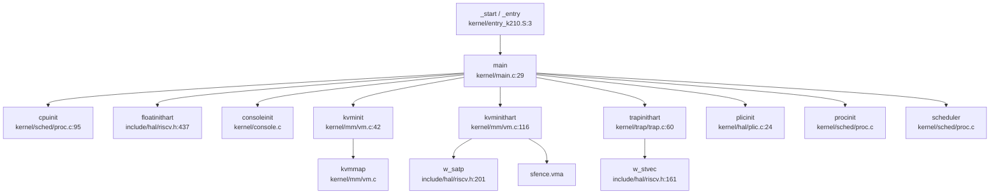

### 启动入口与链接脚本分析

#### 汇编入口点

xv6-k210 的启动入口位于汇编文件，根据目标平台不同分为两个变体：

**K210 平台** (`kernel/entry_k210.S:1-22`)：
```assembly
.section .text.entry
.globl _start
_start:
    add t0, a0, 1
    slli t0, t0, 14
    la sp, boot_stack
    add sp, sp, t0
    
    # jump into main 
    call main

loop:
    j loop
```

**QEMU 平台** (`kernel/entry_qemu.S:1-19`)：
```assembly
.section .text
.globl _entry
_entry:
    add t0, a0, 1
    slli t0, t0, 14
    la sp, boot_stack
    add sp, sp, t0
    call main

loop:
    j loop
```

入口代码执行以下操作：
1. **栈指针计算**：通过 `a0` 寄存器（传入的 hartid）计算每个 hart 的独立栈位置，偏移量为 `(hartid + 1) << 14` 字节
2. **栈初始化**：加载 `boot_stack` 基地址并加上偏移量
3. **跳转到 C 入口**：直接调用 `main()` 函数

#### 链接脚本配置

**K210 链接脚本** (`linker/k210.ld:1-53`)：
- `ENTRY(_start)`：指定入口符号为 `_start`
- `BASE_ADDRESS = 0x80020000`：内核加载基地址
- 栈段位于 `.bss.stack` 节区

**QEMU 链接脚本** (`linker/qemu.ld:1-53`)：
- `ENTRY(_entry)`：指定入口符号为 `_entry`
- `BASE_ADDRESS = 0x80200000`：QEMU 环境下内核加载地址（比 K210 高 2MB）

**统一链接脚本** (`linker/linker64.ld:1-64`)：
- 支持 trampoline 页和信号 trampoline 页的对齐（各占 4KB）
- 定义了 `kernel_start`、`text_start`、`rodata_start`、`data_start`、`bss_start` 等符号

### 架构初始化流程（模式切换/FPU/MMU）

#### RISC-V 特权级模式切换

xv6-k210 **不直接在 M-Mode 运行**，而是通过 RustSBI 固件完成从 M-Mode 到 S-Mode 的切换。

**RustSBI 中的模式切换** (`bootloader/SBI/rustsbi-k210/src/main.rs:259-266`)：
```rust
extern "C" {
    fn _s_mode_start();
}
unsafe {
    mepc::write(_s_mode_start as usize);
    mstatus::set_mpp(MPP::Supervisor);
    enter_privileged(mhartid::read(), 0x2333333366666666);
}
```

关键寄存器操作：
- **`mepc`**：设置 S-Mode 入口地址为 `0x80020000`
- **`mstatus.mpp`**：设置之前特权级为 Supervisor Mode
- **`enter_privileged()`**：执行 `mret` 指令跳转到 S-Mode

**中断委托配置** (`bootloader/SBI/rustsbi-k210/src/main.rs:211-228`)：
```rust
mideleg::set_stimer();      // 委托 Supervisor Timer 中断
mideleg::set_ssoft();       // 委托 Supervisor Software 中断
medeleg::set_instruction_misaligned();
medeleg::set_breakpoint();
medeleg::set_user_env_call();
medeleg::set_instruction_fault();
medeleg::set_load_fault();
medeleg::set_store_fault();
```

**验证**：RustSBI 打印委托寄存器值：
```
[rustsbi] mideleg: {value}
[rustsbi] medeleg: {value}
```

#### FPU 初始化状态

**✅ 已实现** - FPU 在 S-Mode 下被正确初始化。

**内核 FPU 初始化** (`kernel/main.c:42,81`)：
```c
floatinithart();  // hart 0 和 hart 1 都调用
```

**FPU 初始化实现** (`include/hal/riscv.h:437-445`)：
```c
static inline void floatinithart()
{
    // If sstatus.fs is off, floating-point instructions
    // will be treated as illegal ones.
    w_sstatus_fs(SSTATUS_FS_INIT);
    w_frm(FRM_RNE);
    w_sstatus_fs(SSTATUS_FS_CLEAN);
}
```

关键寄存器操作：
- **`sstatus.fs`**：设置为 `SSTATUS_FS_INIT` (bit 13 = 1)，启用 FPU
- **`frm`**：设置舍入模式为 RNE (Round to Nearest)
- **`sstatus.fs`**：最终设置为 `SSTATUS_FS_CLEAN` (bits 14:13 = 10)

**FPU 状态位定义** (`include/hal/riscv.h:423-427`)：
```c
#define SSTATUS_FS_INIT     (1L << 13)
#define SSTATUS_FS_CLEAN    (2L << 13)
#define SSTATUS_FS_DIRTY    (3L << 13)
#define SSTATUS_FS_BITS     (3L << 13)
```

#### MMU 启用与页表初始化

**页表初始化流程** (`kernel/main.c:47-48`)：
```c
kvminit();       // create kernel page table
kvminithart();   // turn on paging
```

**`kvminit()` 实现** (`kernel/mm/vm.c:42-114`)：
```c
void kvminit()
{
    kernel_pagetable = (pagetable_t) allocpage();
    memset(kernel_pagetable, 0, PGSIZE);

    // uart registers
    kvmmap(UART_V, UART, PGSIZE, PTE_R | PTE_W);
    
    #ifdef QEMU
    kvmmap(VIRTIO0_V, VIRTIO0, PGSIZE, PTE_R | PTE_W);
    #endif
    
    // CLINT
    kvmmap(CLINT_V, CLINT, 0x10000, PTE_R | PTE_W);

    // PLIC
    kvmmap(PLIC_V, PLIC, 0x4000, PTE_R | PTE_W);
    kvmmap(PLIC_V + 0x200000, PLIC + 0x200000, 0x4000, PTE_R | PTE_W);

    // K210 特定设备映射
    #ifndef QEMU
    kvmmap(GPIOHS_V, GPIOHS, 0x1000, PTE_R | PTE_W);
    kvmmap(DMAC_V, DMAC, 0x1000, PTE_R | PTE_W);
    kvmmap(FPIOA_V, FPIOA, 0x1000, PTE_R | PTE_W);
    kvmmap(SPI0_V, SPI0, 0x1000, PTE_R | PTE_W);
    // ... 更多设备
    #endif
    
    // 映射内核代码段
    kvmmap(KERNBASE, KERNBASE, (uint64)extratext - KERNBASE, PTE_R | PTE_X);
    // 映射内核数据段和物理 RAM
    kvmmap((uint64)extratext, (uint64)extratext, PHYSTOP - (uint64)extratext, PTE_R | PTE_W);
    // 映射 trampoline 页
    kvmmap(TRAMPOLINE, (uint64)trampoline, PGSIZE, PTE_R | PTE_X);
}
```

**`kvminithart()` 实现** (`kernel/mm/vm.c:116-127`)：
```c
void kvminithart()
{
    // Must do this to trap into RustSBI.
    uint64 stap = SATP_SV39 | (((uint64)kernel_pagetable) >> 12);
    w_satp(stap);
    asm volatile("sfence.vma");
    protect_usr_mem();
}
```

关键寄存器操作：
- **`satp`**：设置页表基址，使用 Sv39 分页模式
- **`sfence.vma`**：刷新 TLB
- **`protect_usr_mem()`**：设置 `sstatus.SUM` 位，允许 S-Mode 访问用户页

**内存布局定义** (`include/memlayout.h:36-89`)：
```c
#define VIRT_OFFSET             0x3F00000000L  // 虚拟地址偏移量

// K210 物理地址
#define UART                    0x38000000L
#define CLINT                   0x02000000L
#define PLIC                    0x0c000000L

// 虚拟地址 = 物理地址 + VIRT_OFFSET
#define UART_V                  (UART + VIRT_OFFSET)
#define CLINT_V                 (CLINT + VIRT_OFFSET)
#define PLIC_V                  (PLIC + VIRT_OFFSET)
```

### 到达内核主函数的路径（完整调用链）

#### 完整启动调用链



#### Hart 0 初始化流程 (`kernel/main.c:38-63`)

```c
if (hartid == 0) {
    started = 0;
    cpuinit();           // 初始化 CPU 结构体
    floatinithart();     // 初始化 FPU
    consoleinit();       // 初始化串口控制台
    printfinit();        // 初始化 printf 锁
    print_logo();        // 打印启动 Logo
    kpminit();           // 初始化物理页分配器
    kvminit();           // 创建内核页表
    kvminithart();       // 启用 MMU
    kmallocinit();       // 初始化内核堆分配器
    trapinithart();      // 安装中断向量
    procinit();          // 初始化进程结构
    plicinit();          // 初始化 PLIC
    plicinithart();      // 初始化 PLIC hart 相关
    fpioa_pin_init();    // K210: 初始化 FPIOA
    dmac_init();         // K210: 初始化 DMAC
    disk_init();         // 初始化磁盘
    binit();             // 初始化缓冲缓存
    userinit();          // 创建第一个用户进程
    printf("hart 0 init done\n");
    
    // 发送 IPI 唤醒其他 hart
    for (int i = 1; i < NCPU; i++) {
        sbi_send_ipi(1 << i, 0);
    }
    started = 1;
}
```

#### Hart 1 初始化流程 (`kernel/main.c:75-86`)

```c
else {
    // hart 1
    while (started == 0)
        ;
    __sync_synchronize();
    floatinithart();     // 初始化 FPU
    kvminithart();       // 启用 MMU
    trapinithart();      // 安装中断向量
    printf("hart 1 init done\n");
}
```

#### 关键初始化函数详解

**`trapinithart()`** (`kernel/trap/trap.c:60-66`)：
```c
void trapinithart(void)
{
    w_stvec((uint64)kernelvec);  // 设置中断向量基址
    w_sstatus(r_sstatus() | SSTATUS_SIE);  // 启用 S-Mode 中断
    w_sie(r_sie() | SIE_SEIE | SIE_SSIE | SIE_STIE);  // 启用外部/软件/定时器中断
    set_next_timeout();  // 设置下一个定时器中断
}
```

**`plicinit()`** (`kernel/hal/plic.c:24-31`)：
```c
void plicinit(void) {
    writed(1, PLIC_V + DISK_IRQ * sizeof(uint32));  // 启用磁盘中断
    writed(1, PLIC_V + UART_IRQ * sizeof(uint32));  // 启用 UART 中断
}
```

### 多平台启动流程（StarFive/LoongArch 等）

#### 平台支持状态

**❌ StarFive VisionFive2 未实现**：
- 搜索 `visionfive`、`jh7110` 关键词，**未找到任何相关代码**
- 项目仅支持 K210 和 QEMU 两种平台

**❌ LoongArch 未实现**：
- 搜索 `loongarch` 关键词，**未找到任何相关代码**
- 项目仅基于 RISC-V 架构

#### 支持的平台

**✅ K210 平台**：
- 物理地址基址：`0x80020000`
- 使用 RustSBI-K210 固件
- 特定设备驱动：FPIOA、DMAC、SPI、GPIOHS 等

**✅ QEMU 平台**：
- 物理地址基址：`0x80200000`
- 使用 RustSBI-QEMU 固件
- 使用 virtio 磁盘接口

### 平台配置与构建机制

#### 构建配置

**Makefile 平台选择** (`Makefile:1-2`)：
```makefile
platform	:= k210
# platform	:= qemu
```

**SBI 固件选择** (`Makefile:53-58`)：
```makefile
ifeq ($(platform), k210)
    SBI := ./sbi/sbi-k210
else
    SBI	:= ./sbi/sbi-qemu
endif
```

#### RustSBI 目标架构

**Rust 工具链配置** (`bootloader/SBI/rustsbi-k210/.cargo/config.toml:1-7`)：
```toml
[build]
target = "riscv64gc-unknown-none-elf"

[target.riscv64gc-unknown-none-elf]
rustflags = [
    "-C", "link-arg=-Tlink-k210.ld",
]
```

**Rust 工具链版本** (`bootloader/SBI/rustsbi-k210/rust-toolchain:1`)：
```
nightly-2020-08-01
```

#### 编译标志

**C 编译器标志** (`Makefile:17-25`)：
```makefile
CFLAGS = -Wall -O2 -fno-omit-frame-pointer -ggdb -g -march=rv64imafdc
CFLAGS += -mcmodel=medany
CFLAGS += -ffreestanding -fno-common -nostdlib -mno-relax
CFLAGS += -Iinclude/

ifeq ($(platform), qemu)
CFLAGS += -D QEMU
endif
```

关键标志：
- **`-march=rv64imafdc`**：RISC-V 64 位，支持整数、乘除、原子、浮点、压缩指令
- **`-mcmodel=medany`**：中等代码模型，支持位置无关代码
- **`-D QEMU`**：QEMU 平台特定宏

### 关键代码片段分析

#### 固件级启动链（RISC-V）

**SBI → U-Boot → OS 启动链**：

xv6-k210 **不使用 U-Boot**，而是采用简化的启动链：

```
M-Mode (RustSBI) → S-Mode (xv6-k210 kernel)
```

**RustSBI 跳转到内核** (`bootloader/SBI/rustsbi-k210/src/main.rs:271-279`)：
```assembly
.global _s_mode_start
_s_mode_start:
1:  auipc ra, %pcrel_hi(1f)
    ld ra, %pcrel_lo(1b)(ra)
    jr ra
.align  3
1:  .dword 0x80020000
```

这段汇编代码：
1. 使用 `auipc` + `ld` 加载 64 位内核入口地址 `0x80020000`
2. 跳转到内核入口（`_entry` 或 `_start`）

#### MMU 启用前后串口地址切换

**虚拟地址偏移机制** (`include/memlayout.h:36`)：
```c
#define VIRT_OFFSET    0x3F00000000L
```

**UART 地址映射** (`include/memlayout.h:41-46`)：
```c
#ifdef QEMU
#define UART    0x10000000L
#else
#define UART    0x38000000L    // K210 物理地址
#endif

#define UART_V  (UART + VIRT_OFFSET)  // 虚拟地址
```

**MMU 启用前**：
- RustSBI 直接访问物理地址 `0x38000000` (K210) 或 `0x10000000` (QEMU)
- 通过 SBI 调用 `sbi_console_putchar()` 输出字符

**MMU 启用后**：
- 内核通过虚拟地址 `UART_V = UART + 0x3F00000000` 访问 UART
- `kvminit()` 中建立映射：`kvmmap(UART_V, UART, PGSIZE, PTE_R | PTE_W)`

**串口输出实现** (`kernel/console.c:42-49`)：
```c
void consputc(int c) {
    if(c == BACKSPACE){
        sbi_console_putchar('\b');
        sbi_console_putchar(' ');
        sbi_console_putchar('\b');
    } else {
        sbi_console_putchar(c);
    }
}
```

**SBI 调用实现** (`include/sbi.h:22-28`)：
```c
static inline void sbi_console_putchar(int ch) {
    LEGACY_SBI_CALL(SBI_CONSOLE_PUTCHAR, ch);
}

#define LEGACY_SBI_CALL(eid, arg0) ({ \
    register uintptr_t a0 asm ("a0") = (uintptr_t)(arg0); \
    register uintptr_t a7 asm ("a7") = (uintptr_t)(eid); \
    asm volatile ("ecall" \
                  : "+r" (a0) \
                  : "r" (a7) \
                  : "memory"); \
    a0; \
})
```

#### 多核启动同步

**IPI 发送机制** (`kernel/main.c:59-62`)：
```c
for (int i = 1; i < NCPU; i++) {
    unsigned long mask = 1 << i;
    sbi_send_ipi(mask, 0);
    __debug_assert("main", SBI_SUCCESS == res.error, "sbi_send_ipi failed");
}
__sync_synchronize();
started = 1;
```

**SBI IPI 实现** (`include/sbi.h:89-95`)：
```c
static inline struct sbiret sbi_send_ipi(
    unsigned long hart_mask, 
    unsigned long hart_mask_base
) {
    return SBI_CALL_2(IPI_EID, IPI_SEND_IPI, hart_mask, hart_mask_base);
}
```

**Hart 1 等待机制** (`kernel/main.c:77-79`)：
```c
while (started == 0)
    ;
__sync_synchronize();
```

#### 早期栈分配

**栈空间定义** (`kernel/entry_k210.S:15-21`)：
```assembly
.section .bss.stack
.align 12
.globl boot_stack
boot_stack:
    .space 4096 * 4 * 2  # 32KB 栈空间
.globl boot_stack_top
boot_stack_top:
```

**多核栈分配** (`kernel/entry_k210.S:4-6`)：
```assembly
add t0, a0, 1
slli t0, t0, 14
la sp, boot_stack
add sp, sp, t0
```

每个 hart 的栈偏移：`(hartid + 1) * 16KB`

#### BSS 清零与数据段初始化

**RustSBI 中的 BSS 清零** (`bootloader/SBI/rustsbi-k210/src/main.rs:103-106`)：
```rust
unsafe {
    r0::zero_bss(&mut _sbss, &mut _ebss);
    r0::init_data(&mut _sdata, &mut _edata, &_sidata);
}
```

**内核 BSS 清零**：由链接脚本定义 `sbss_clear` 和 `ebss_clear` 符号，但**未在内核启动代码中显式清零**，依赖编译器/链接器保证 BSS 初始化为零。

---

**本章小结**：

| 特性 | 状态 | 实现位置 |
|------|------|----------|
| 汇编入口 | ✅ 已实现 | `kernel/entry_k210.S`, `kernel/entry_qemu.S` |
| M-Mode → S-Mode 切换 | ✅ 已实现 | `bootloader/SBI/rustsbi-k210/src/main.rs:259-266` |
| FPU 初始化 | ✅ 已实现 | `include/hal/riscv.h:437-445` |
| MMU 启用 (Sv39) | ✅ 已实现 | `kernel/mm/vm.c:116-127` |
| 中断向量设置 | ✅ 已实现 | `kernel/trap/trap.c:60-66` |
| 多核 IPI 唤醒 | ✅ 已实现 | `kernel/main.c:59-62` |
| 虚拟地址映射 | ✅ 已实现 | `include/memlayout.h:36` |
| StarFive VisionFive2 | ❌ 未实现 | 未找到相关代码 |
| LoongArch 支持 | ❌ 未实现 | 未找到相关代码 |
| U-Boot 支持 | ❌ 未实现 | 直接使用 RustSBI 跳转 |