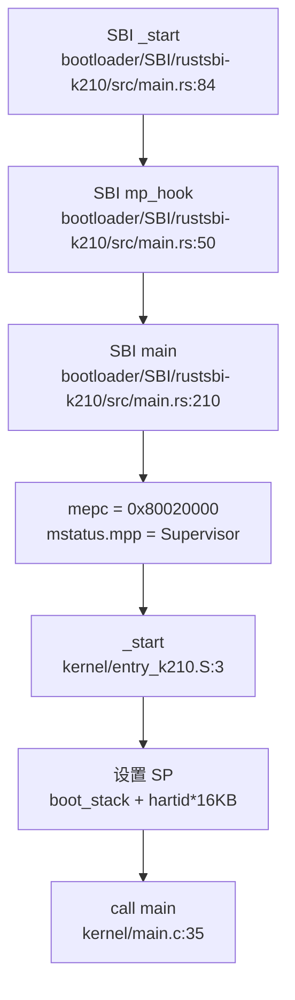

## 第 2 章：启动流程与架构初始化

### 启动入口与链接脚本分析

xv6-k210 支持双平台启动（K210 硬件与 QEMU 仿真），通过不同的链接脚本和汇编入口文件实现差异化启动。

**链接脚本配置**：

- **K210 平台**：`linker/k210.ld` 定义 `ENTRY(_start)`，基地址 `BASE_ADDRESS = 0x80020000`
- **QEMU 平台**：`linker/qemu.ld` 定义 `ENTRY(_entry)`，基地址 `BASE_ADDRESS = 0x80200000`

两个链接脚本的内存布局完全一致，均采用 Sv39 页表方案，包含 `.text`、`.rodata`、`.data`、`.bss` 四个主要段，并在 `.text` 段末尾预留一个完整页面（4KB）用于 trampoline 代码。

**汇编入口文件**：

| 平台 | 入口文件 | 入口符号 | 栈大小 |
|------|----------|----------|--------|
| K210 | `kernel/entry_k210.S` | `_start` | 32KB (8 页) |
| QEMU | `kernel/entry_qemu.S` | `_entry` | 32KB (8 页) |
| 通用 | `kernel/entry.S` | `_entry` | 32KB (8 页) |

以 `entry_k210.S` 为例，入口代码执行以下操作：

```assembly
.section .text.entry
.globl _start
_start:
    add t0, a0, 1
    slli t0, t0, 14
    la sp, boot_stack
    add sp, sp, t0

call main

loop:
    j loop

.section .bss.stack
.align 12
boot_stack:
    .space 4096 * 4 * 2
```

入口代码通过 `a0` 寄存器（传递 hartid）计算每核独立的栈空间偏移：`boot_stack + (hartid + 1) * 4096 * 4`，为每个 hart 分配 16KB 栈空间。随后直接 `call main` 跳转到 C 语言入口。

**SBI 固件链**：

RustSBI 固件位于 `bootloader/SBI/rustsbi-k210/`，其链接脚本 `link-k210.ld` 定义：
- `ENTRY(_start)`
- 加载地址 `ORIGIN = 0x80000000`（比内核基址低 128KB）
- `_max_hart_id = 1`（支持双核）

SBI 固件在 M-Mode 完成初始化后，通过以下代码跳转到内核：

```rust
// bootloader/SBI/rustsbi-k210/src/main.rs:274
unsafe {
    mepc::write(_s_mode_start as usize);
    mstatus::set_mpp(MPP::Supervisor);
    enter_privileged(mhartid::read(), 0x2333333366666666);
}
```

其中 `_s_mode_start` 通过内联汇编定义为：

```assembly
global_asm!(
    "
    .section .text
    .globl _s_mode_start
_s_mode_start:
1:  auipc ra, %pcrel_hi(1f)
    ld ra, %pcrel_lo(1b)(ra)
    jr ra
.align  3
1:  .dword 0x80020000
"
);
```

该代码将 `mepc` 设置为 `0x80020000`（K210 内核入口地址），并通过 `mstatus::set_mpp(MPP::Supervisor)` 设置返回模式为 S-Mode。**模式切换由 SBI 固件完成**，内核代码中无需显式执行 M→S 切换。

### 架构初始化流程（模式切换/FPU/MMU）

**模式切换验证**：

在内核代码中搜索 `mstatus.mpp`、`sstatus.spp`、`medeleg`、`mideleg` 等寄存器操作，发现：
- **内核代码中未发现 M-Mode 寄存器写操作**（如 `w_mstatus`、`w_medeleg`）
- 所有模式相关操作均在 SBI 固件中完成（`bootloader/SBI/rustsbi-k210/src/main.rs`）
- SBI 通过 `medeleg` 和 `mideleg` 将异常和中断委托给 S-Mode：
  ```rust
  mideleg::set_stimer();      // 委托 supervisor timer
  mideleg::set_ssoft();       // 委托 supervisor software
  medeleg::set_instruction_fault();
  medeleg::set_load_fault();
  medeleg::set_store_fault();
  ```

**结论**：✅ 模式切换已实现，但由 SBI 固件在跳转到内核前完成（`mstatus.mpp = Supervisor`），内核代码从 S-Mode 开始执行。

**FPU 初始化**：

FPU 初始化在 `include/hal/riscv.h` 中实现：

```c
// include/hal/riscv.h:447
#define SSTATUS_FS_INIT     (1L << 13)
#define SSTATUS_FS_CLEAN    (2L << 13)
#define SSTATUS_FS_BITS     (3L << 13)

static inline void floatinithart()
{
    w_sstatus_fs(SSTATUS_FS_INIT);
    w_frm(FRM_RNE);
    w_sstatus_fs(SSTATUS_FS_CLEAN);
}
```

该函数设置 `sstatus.fs` 位为 `SSTATUS_FS_CLEAN`（值为 `2 << 13`），启用浮点单元。若 `sstatus.fs` 为 `0`（`SSTATUS_FS_OFF`），浮点指令将触发非法指令异常。

**调用位置**：
- `kernel/main.c:42`（hart 0）：`floatinithart()` 在 `cpuinit()` 后调用
- `kernel/main.c:81`（hart 1+）：`floatinithart()` 在等待 `started` 标志后调用

**结论**：✅ FPU 已实现，通过 `floatinithart()` 设置 `sstatus.fs` 位启用。

**MMU 初始化**：

MMU 初始化分为两个阶段：

1. **页表创建**（`kvminit()`）：在 `kernel/mm/vm.c:67` 中创建内核页表，映射关键设备寄存器：
   ```c
   // kernel/mm/vm.c:94
   kvmmap(UART_V, UART, PGSIZE, PTE_R | PTE_W);  // UART
   kvmmap(CLINT_V, CLINT, 0x10000, PTE_R | PTE_W);  // CLINT
   kvmmap(PLIC_V, PLIC, 0x4000, PTE_R | PTE_W);  // PLIC
   #ifndef QEMU
   kvmmap(GPIOHS_V, GPIOHS, 0x1000, PTE_R | PTE_W);
   kvmmap(DMAC_V, DMAC, 0x1000, PTE_R | PTE_W);
   kvmmap(FPIOA_V, FPIOA, 0x1000, PTE_R | PTE_W);
   // ... 更多 K210 特有设备
   #endif
   ```

2. **启用分页**（`kvminithart()`）：在 `kernel/mm/vm.c:121` 中写入 `satp` 寄存器：
   ```c
   void kvminithart()
   {
       uint64 stap = SATP_SV39 | (((uint64)kernel_pagetable) >> 12);
       w_satp(stap);
       asm volatile("sfence.vma");
       protect_usr_mem();
   }
   ```

**关键细节**：
- 使用 Sv39 页表方案（`SATP_SV39 = 8L << 60`）
- `sfence.vma` 指令刷新 TLB
- `protect_usr_mem()` 设置 `sstatus.SUM` 位，允许 S-Mode 访问用户页面

**结论**：✅ MMU 已实现，通过 `kvminit()` 创建页表，`kvminithart()` 启用分页。

### 到达内核主函数的路径（完整调用链）

从复位到内核 `main()` 的完整调用链如下：



**详细流程**：

1. **SBI 阶段**（M-Mode）：
   - `_start`（`rustsbi-k210/src/main.rs:84`）：汇编入口，设置各 hart 的栈
   - `mp_hook()`（`rustsbi-k210/src/main.rs:50`）：hart 0 返回 `true` 继续执行，其他 hart 等待 IPI
   - `main()`（`rustsbi-k210/src/main.rs:210`）：初始化串口、设置中断委托（`medeleg`/`mideleg`）、打印版本信息
   - 设置 `mepc = 0x80020000` 和 `mstatus.mpp = Supervisor`
   - 执行 `enter_privileged()` 跳转到 S-Mode

2. **内核阶段**（S-Mode）：
   - `_start`（`kernel/entry_k210.S:3`）：计算 hart 专属栈空间
   - `call main`：跳转到 C 入口
   - `main(hartid, dtb_pa)`（`kernel/main.c:35`）：执行内核初始化

**hart 0 初始化顺序**（`kernel/main.c:39-67`）：
```c
cpuinit();           // CPU 相关初始化
floatinithart();     // FPU 初始化
consoleinit();       // 串口初始化
printfinit();        // printf 锁初始化
print_logo();        // 打印 Logo
kpminit();           // 物理页分配器初始化
kvminit();           // 创建内核页表
kvminithart();       // 启用分页（写 satp）
kmallocinit();       // 小内存分配器初始化
trapinithart();      // 设置 trap 向量（写 stvec）
procinit();          // 进程表初始化
plicinit();          // PLIC 初始化
plicinithart();      // PLIC per-hart 初始化
fpioa_pin_init();    // K210 特有：FPIOA 初始化
dmac_init();         // K210 特有：DMAC 初始化
disk_init();         // 磁盘初始化
binit();             // 缓冲缓存初始化
userinit();          // 创建第一个用户进程
```

**hart 1+ 初始化顺序**（`kernel/main.c:75-84`）：
```c
while (started == 0);  // 等待 hart 0 完成
floatinithart();       // FPU 初始化
kvminithart();         // 启用分页
trapinithart();        // 设置 trap 向量
```

### 多平台启动流程（StarFive/LoongArch 等）

**多平台分支机制**：

通过 `Makefile` 的 `platform` 变量控制：

```makefile
# Makefile:1
platform := k210
# platform := qemu

ifeq ($(platform), qemu)
CFLAGS += -D QEMU
endif

ifeq ($(platform), k210)
    SBI := ./sbi/sbi-k210
else
    SBI := ./sbi/sbi-qemu
endif
```

**平台差异**：

| 特性 | K210 | QEMU |
|------|------|------|
| 链接脚本 | `linker/k210.ld` (0x80020000) | `linker/qemu.ld` (0x80200000) |
| 汇编入口 | `kernel/entry_k210.S` | `kernel/entry_qemu.S` |
| SBI 固件 | `rustsbi-k210` | `rustsbi-qemu` |
| 设备映射 | UART/CLINT/PLIC/GPIOHS/DMAC/FPIOA/SPI | UART/CLINT/PLIC/VIRTIO |
| 编译宏 | 无 | `-D QEMU` |

**其他平台支持**：

通过 `grep_in_repo` 搜索 `visionfive`、`jh7110`、`loongarch` 等关键词，**未发现** StarFive VisionFive2 或 LoongArch 相关代码。

**结论**：
- ✅ K210 平台：已实现
- ✅ QEMU 平台：已实现
- ❌ StarFive VisionFive2：未发现
- ❌ LoongArch：未发现

### 平台配置与构建机制

**构建系统**：

项目使用 Makefile 作为主要构建系统，SBI 固件使用 Cargo（Rust）构建。

**关键配置**：

1. **工具链**（`Makefile:11-13`）：
   ```makefile
   TOOLPREFIX := riscv64-unknown-elf-
   CC := $(TOOLPREFIX)gcc
   AS := $(TOOLPREFIX)gas
   LD := $(TOOLPREFIX)ld
   ```

2. **编译标志**（`Makefile:17-25`）：
   ```makefile
   CFLAGS = -Wall -O2 -fno-omit-frame-pointer -ggdb -g -march=rv64imafdc
   CFLAGS += -mcmodel=medany
   CFLAGS += -ffreestanding -fno-common -nostdlib -mno-relax
   ```
   - `-march=rv64imafdc`：启用 RISC-V 64 位 + 整数 + 乘除 + 原子 + 浮点 + 压缩指令
   - `-mcmodel=medany`：中等代码模型，允许代码位于任意地址
   - `-ffreestanding`：独立环境，不依赖标准库

3. **平台宏**（`Makefile:27-29`）：
   ```makefile
   ifeq ($(platform), qemu)
   CFLAGS += -D QEMU
   endif
   ```

4. **SBI 构建**（`Makefile:203-207`）：
   ```makefile
   $(SBI): 
       cd ./sbi/psicasbi && cargo build --no-default-features --features=$(platform)
       cp ./sbi/psicasbi/target/riscv64imac-unknown-none-elf/$(mode)/psicasbi $@
   ```

**Cargo 配置**：

根目录 `Cargo.toml` 仅包含 workspace 定义，实际 SBI 代码在 `sbi/psicasbi/` 子目录中。

**结论**：构建系统通过 `platform` 变量和 `-D QEMU` 宏实现多平台编译，SBI 固件使用 Rust 构建，内核使用 C 构建。

### 关键代码片段分析

**1. 链接脚本 ENTRY 定义**：

```ld
// linker/k210.ld:1-4
OUTPUT_ARCH(riscv)
ENTRY(_start)
BASE_ADDRESS = 0x80020000;
```

```ld
// linker/qemu.ld:1-4
OUTPUT_ARCH(riscv)
ENTRY(_entry)
BASE_ADDRESS = 0x80200000;
```

**2. 汇编入口设置栈**：

```assembly
// kernel/entry_k210.S:3-10
_start:
    add t0, a0, 1
    slli t0, t0, 14      # t0 = (hartid + 1) * 16KB
    la sp, boot_stack
    add sp, sp, t0       # sp = boot_stack + t0
    call main
```

**3. SBI 模式切换**：

```rust
// bootloader/SBI/rustsbi-k210/src/main.rs:272-276
unsafe {
    mepc::write(_s_mode_start as usize);
    mstatus::set_mpp(MPP::Supervisor);
    enter_privileged(mhartid::read(), 0x2333333366666666);
}
```

**4. FPU 初始化**：

```c
// include/hal/riscv.h:447-453
static inline void floatinithart()
{
    w_sstatus_fs(SSTATUS_FS_INIT);
    w_frm(FRM_RNE);
    w_sstatus_fs(SSTATUS_FS_CLEAN);
}
```

**5. MMU 启用**：

```c
// kernel/mm/vm.c:121-132
void kvminithart()
{
    uint64 stap = SATP_SV39 | (((uint64)kernel_pagetable) >> 12);
    w_satp(stap);
    asm volatile("sfence.vma");
    protect_usr_mem();
}
```

**6. Trap 向量设置**：

```c
// kernel/trap/trap.c:55-60
void trapinithart(void)
{
    w_stvec((uint64)kernelvec);
    w_sstatus(r_sstatus() | SSTATUS_SIE);
    w_sie(r_sie() | SIE_SEIE | SIE_SSIE | SIE_STIE);
    set_next_timeout();
}
```

**总结**：xv6-k210 的启动流程清晰，从 SBI 固件（M-Mode）到内核（S-Mode）的切换由 RustSBI 完成。内核通过 `entry_k210.S`/`entry_qemu.S` 设置栈后直接跳转到 `main()`，依次完成 FPU、MMU、Trap 向量等关键初始化。多平台支持通过 Makefile 的 `platform` 变量和条件编译实现，但仅支持 K210 和 QEMU 两个平台。
