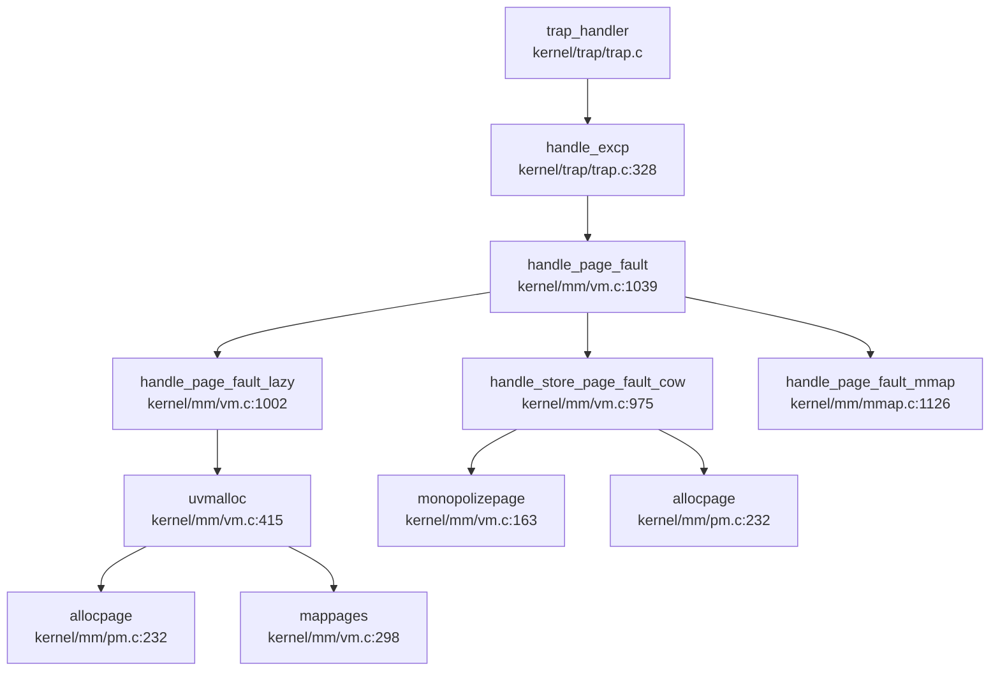

### 物理内存管理实现

xv6-k210 采用**双向链表空闲列表（Free List）**算法管理物理内存，而非 Buddy System 或 Slab。物理内存被划分为两个区域进行管理：

**1. 物理页分配器架构** (`kernel/mm/pm.c`)

```c
struct pm_allocator {
    struct spinlock lock;
    struct run *freelist;
    uint64 npage;
};

struct run {
    struct run *next;
    uint64 npage;  // 连续页数
};
```

系统维护两个独立的分配器：
- **`single`**：管理单页分配（400 页，位于 `PHYSTOP - 400*PGSIZE` 到 `PHYSTOP`）
- **`multiple`**：管理多页分配（剩余内存）

**2. 初始化流程** (`kpminit`, `kernel/mm/pm.c:173-193`)

```c
void kpminit(void) {
    // 初始化 multiple 和 single 空闲链表
    __mul_freerange((uint64)boot_stack_top, START_SINGLE);  // 多页区
    __sin_freerange(START_SINGLE, PHYSTOP);                  // 单页区
}
```

**3. 分配策略** (`_allocpage`, `kernel/mm/pm.c:232-254`)

```c
uint64 _allocpage(void) {
    // 优先从 single 分配
    ret = __sin_alloc_no_lock();
    if (NULL == ret) {
        // single 耗尽时从 multiple 借用
        ret = __mul_alloc_no_lock(1);
    }
    return (uint64)ret;
}
```

**4. 页面引用计数**（用于 COW） (`kernel/mm/vm.c:154-197`)

```c
static uint8 page_ref_table[MAX_PAGES_NUM];  // 物理页引用计数表

void pagereg(uint64 pa, uint8 init) {
    page_ref_table[__hash_page_idx(pa)] = init ? 1 : 
        page_ref_table[__hash_page_idx(pa)] + 1;
}

int pageput(uint64 pa) {
    return --page_ref_table[__hash_page_idx(pa)];  // 返回剩余引用数
}
```

**实现状态**: ✅ **已实现** - 完整的物理页分配/回收机制，支持引用计数

---

### 虚拟内存与页表操作

**1. 页表结构** (`include/hal/riscv.h:411`)

```c
typedef uint64 *pagetable_t;  // 512 PTEs 的指针
typedef uint64 pte_t;

// PTE 标志位
#define PTE_V (1L << 0)  // valid
#define PTE_R (1L << 1)  // readable
#define PTE_W (1L << 2)  // writable
#define PTE_X (1L << 3)  // executable
#define PTE_U (1L << 4)  // user accessible
#define PTE_COW PTE_RSW1 // copy-on-write 标记 (bit 8)
```

**2. 页表遍历** (`walk`, `kernel/mm/vm.c:211-233`)

RISC-V Sv39 三级页表遍历：
```c
pte_t *walk(pagetable_t pagetable, uint64 va, int alloc) {
    for(int level = 2; level > 0; level--) {
        pte_t *pte = &pagetable[PX(level, va)];
        if(*pte & PTE_V) {
            pagetable = (pagetable_t)PTE2PA(*pte);  // 进入下一级
        } else {
            if(!alloc || (pagetable = (pde_t*)allocpage()) == NULL)
                return NULL;
            memset(pagetable, 0, PGSIZE);
            *pte = PA2PTE(pagetable) | PTE_V;
        }
    }
    return &pagetable[PX(0, va)];  // 返回叶级 PTE
}
```

**3. 页表映射** (`mappages`, `kernel/mm/vm.c:298-327`)

```c
int mappages(pagetable_t pagetable, uint64 va, uint64 size, uint64 pa, int perm) {
    uint64 a = PGROUNDDOWN(va);
    uint64 last = PGROUNDDOWN(va + size - 1);
    
    for(;;) {
        pte_t *pte = walk(pagetable, a, 1);
        if (*pte & PTE_U) {
            // 用户页已存在，仅更新 PPN
            *pte |= PA2PTE(pa) | PTE_V;
        } else {
            *pte = PA2PTE(pa) | perm | PTE_V;
        }
        if (usr) pagedup(PGROUNDDOWN(pa));  // 增加引用计数
        if(a == last) break;
        a += PGSIZE;
        pa += PGSIZE;
    }
    return 0;
}
```

**4. 页表解映射** (`unmappages`, `kernel/mm/vm.c:335-373`)

```c
void unmappages(pagetable_t pagetable, uint64 va, uint64 npages, int flag) {
    for (uint64 a = va; a < va + npages * PGSIZE; a += PGSIZE) {
        pte_t *pte = walk(pagetable, a, 0);
        if (flag & VM_FREE) {
            freepage((void*)PTE2PA(*pte));  // 释放物理页
        }
        *pte = 0;  // 清除 PTE
    }
}
```

**实现状态**: ✅ **已实现** - 完整的 Sv39 页表操作（walk/map/unmap）

---

### 地址空间布局（内核 vs 用户）

**1. 内核地址空间** (`kernel/mm/vm.c:41-118`)

内核使用直接映射（Direct Map），虚拟地址 = 物理地址 + `VIRT_OFFSET`：
```c
#define VIRT_OFFSET  0x3F00000000L
#define KERNBASE     0x80020000UL

// 内核页表初始化映射
kvmmap(UART_V, UART, PGSIZE, PTE_R | PTE_W);
kvmmap(CLINT_V, CLINT, 0x10000, PTE_R | PTE_W);
kvmmap(PLIC_V, PLIC, 0x4000, PTE_R | PTE_W);
// ... 其他设备映射
```

**2. 用户地址空间** (`kernel/mm/usrmm.c`)

用户空间使用段式管理（`struct seg` 链表）：
```c
struct seg {
    enum segtype type;  // LOAD/HEAP/MMAP/STACK
    int flag;           // PTE 权限标志
    uint64 addr;        // 虚拟地址起始
    uint64 sz;          // 段大小
    struct seg *next;
    uint64 mmap;        // mmap 相关文件引用
};
```

**3. 内核/用户隔离** (`include/mm/vm.h:13-30`)

```c
static inline void permit_usr_mem() {
    clr_sstatus_bit(SSTATUS_PUM);  // 允许访问用户空间
}

static inline void protect_usr_mem() {
    set_sstatus_bit(SSTATUS_PUM);  // 禁止访问用户空间
}
```

**4. 内存布局** (`include/memlayout.h`)

```
用户空间: 0x0000000000000000 ~ MAXUVA
  - 代码段 (TEXT)
  - 数据段 (DATA/BSS)
  - 堆 (HEAP) - 通过 sbrk 增长
  - mmap 区域
  - 用户栈 (STACK)

内核空间: VIRT_OFFSET + KERNBASE ~ MAXVA
  - 直接映射物理内存
  - 设备映射 (UART/PLIC/CLINT 等)
  - Trampoline 页 (MAXVA - PGSIZE)
```

**实现状态**: ✅ **已实现** - 独立的内核/用户地址空间，通过 SSTATUS_PUM 隔离

---

### 堆分配器解析

**1. 内核堆分配器** (`kernel/mm/kmalloc.c`)

采用**类 Slab 机制**，但实现简化：

```c
struct kmem_allocator {
    struct spinlock lock;
    uint obj_size;           // 对象大小
    uint16 npages;           // 页数
    uint16 nobjs;            // 对象数
    struct kmem_node *list;  // 节点链表
};

struct kmem_node {
    struct kmem_node *next;
    struct {
        uint64 obj_size;
        uint64 obj_addr;
    } config;
    uint8 avail;  // 可用对象数
    uint8 cnt;    // 已分配数
    uint8 table[KMEM_OBJ_MAX_COUNT];  // 空闲链表
};
```

**分配策略** (`kmalloc`, `kernel/mm/kmalloc.c:157-220`)：
- 对象大小范围：32B ~ 4048B
- 使用哈希表 (`kmem_table[17]`) 索引不同大小的分配器
- 节点用满时通过 `allocpage()` 扩展

**2. 用户堆管理** (`sys_sbrk`/`sys_brk`, `kernel/syscall/sysmem.c:20-52`)

```c
uint64 sys_sbrk(void) {
    int n;
    argint(0, &n);
    struct proc *p = myproc();
    uint64 addr = p->pbrk;
    if (growproc(addr + n) < 0)  // 实际调用 uvmalloc
        return -1;
    return addr;
}

uint64 sys_brk(void) {
    uint64 addr;
    argaddr(0, &addr);
    struct proc *p = myproc();
    if (addr == 0) return p->pbrk;
    uint64 old = p->pbrk;
    if (growproc(addr) < 0)  // 调整到绝对地址
        return old;
    return addr;
}
```

**3. 惰性分配（Lazy Allocation）** (`handle_page_fault_lazy`, `kernel/mm/vm.c:1002-1016`)

```c
static int handle_page_fault_lazy(uint64 badaddr, struct seg *s) {
    struct proc *p = myproc();
    uint64 pa = PGROUNDDOWN(badaddr);
    // 缺页时才分配物理页
    if (uvmalloc(p->pagetable, pa, pa + PGSIZE, s->flag) == 0)
        return -1;
    sfence_vma();
    return 0;
}
```

**实现状态**:
- **内核 kmalloc**: ✅ **已实现** (类 Slab 分配器)
- **用户 sbrk/brk**: ✅ **已实现**
- **惰性分配**: ✅ **已实现** (HEAP/STACK 段缺页时分配)

---

### 高级内存特性清单

| 特性 | 状态 | 代码位置/说明 |
|------|------|---------------|
| **写时复制 (CoW)** | ✅ **已实现** | `kernel/mm/vm.c:975-997` (`handle_store_page_fault_cow`) |
| **懒分配 (Lazy)** | ✅ **已实现** | `kernel/mm/vm.c:1002-1016` (`handle_page_fault_lazy`) |
| **mmap 系统调用** | ✅ **已实现** | `kernel/syscall/sysmem.c:79-113` (`sys_mmap`) |
| **MAP_FIXED 支持** | ✅ **已实现** | `kernel/mm/mmap.c:710-771` (`do_mmap` 中处理) |
| **MAP_ANONYMOUS** | ✅ **已实现** | `kernel/mm/mmap.c:642-708` (`mmap_anonymous`) |
| **共享内存 (shm)** | ❌ **未实现** | 无 `sys_shmget`/`sys_shmat`/`sys_shmdt` 系统调用 |
| **反向映射表 (rmap)** | ❌ **未实现** | 未找到 `rmap`/`reverse_map`/`page_to_vma` 实现 |
| **交换区 (Swap)** | ❌ **未实现** | 无 `swap_out`/`swap_in` 实现（`__page_file_swap` 被注释） |
| **大页 (Huge Page)** | ❌ **未实现** | 未找到 2M/1G 页面支持，仅 4KB 页 |
| **零拷贝 (sendfile)** | ❌ **未实现** | 未找到相关系统调用 |

**1. 写时复制 (CoW) 详解**

**触发条件** (`handle_page_fault`, `kernel/mm/vm.c:1053-1056`)：
```c
if (kind == 1 && (*pte & PTE_COW)) {
    return handle_store_page_fault_cow(pte);
}
```

**CoW 处理流程** (`handle_store_page_fault_cow`, `kernel/mm/vm.c:975-997`)：
```c
static int handle_store_page_fault_cow(pte_t *ptep) {
    uint64 pa = PTE2PA(*ptep);
    
    if (monopolizepage(pa)) {  // 独占页面
        *ptep |= PTE_W;  // 直接添加写权限
    } else {  // 需要复制
        char *copy = (char *)allocpage();
        memmove(copy, (char *)pa, PGSIZE);
        pagereg((uint64)copy, 1);
        *ptep = PA2PTE(copy) | PTE_FLAGS(*ptep) | PTE_W;
    }
    *ptep &= ~PTE_COW;  // 清除 COW 标记
    sfence_vma();
    return 0;
}
```

**fork 时 CoW 设置** (`uvmcopy`, `kernel/mm/vm.c:556-593`)：
```c
if (cow && (*pte & PTE_W)) {
    *pte = (*pte|PTE_COW) & ~PTE_W;  // 清除写权限，标记 COW
}
```

**2. mmap 实现详解**

**系统调用入口** (`sys_mmap`, `kernel/syscall/sysmem.c:79-113`)：
```c
uint64 sys_mmap(void) {
    uint64 start, len;
    int prot, flags, fd;
    int64 off;
    struct file *f = NULL;
    
    argaddr(0, &start); argaddr(1, &len);
    argint(2, &prot); argint(3, &flags);
    argfd(4, &fd, &f); argaddr(5, (uint64*)&off);
    
    // 验证参数
    if ((fd < 0 || f == NULL) && !(flags & MAP_ANONYMOUS))
        return -EBADF;
    if (!(flags & (MAP_SHARED|MAP_PRIVATE)))
        return -EINVAL;
    
    return do_mmap(start, len, prot, flags, f, off);
}
```

**MAP_FIXED 处理** (`do_mmap`, `kernel/mm/mmap.c:710-771`)：
```c
if (flags & MAP_FIXED)
    ret = lookup_fixed_segment(start, start + sz, &prev, &new);
else
    ret = lookup_segment(sz, &prev, &new);
```

**匿名共享内存** (`handle_anonymous_shared`, `kernel/mm/mmap.c:876-906`)：
```c
static int handle_anonymous_shared(uint64 badaddr, struct seg *s) {
    struct anonfile *fp = MMAP_FILE(s->mmap);
    struct mmap_page *map = get_mmap_page(&fp->mapping, off);
    
    if (map->pa == NULL) {
        map->pa = allocpage();  // 首次访问时分配
        memset(map->pa, 0, PGSIZE);
    }
    mappages(p->pagetable, PGROUNDDOWN(badaddr), PGSIZE,
             (uint64)map->pa, s->flag|PTE_U);
    return 0;
}
```

**3. 用户指针安全验证**

**无显式 `verify_area`**，但通过以下机制保证安全：

**段边界检查** (`partofseg`, `kernel/mm/usrmm.c:57-72`)：
```c
struct seg* partofseg(struct seg *head, uint64 start, uint64 end) {
    for (; head != NULL; head = head->next) {
        if (start >= head->addr && end <= head->addr + head->sz)
            return head;
    }
    return NULL;  // 不在任何段内
}
```

**copyin/copyout 验证** (`copyin2`/`copyout2`, `kernel/mm/vm.c:786-858`)：
```c
int copyout2(uint64 dstva, char *src, uint64 len) {
    struct proc *p = myproc();
    struct seg *s = partofseg(p->segment, dstva, dstva + len);
    if (s == NULL) return -1;  // 地址非法
    uint64 badaddr = safememmove((char *)dstva, src, len, 1);
    return badaddr == 0 ? 0 : -1;
}
```

**系统调用参数验证** (`argaddr`, `kernel/syscall/syscall.c`)：
```c
// 在 sys_mmap/sys_brk 等函数中调用
argaddr(0, &addr);  // 从用户空间读取地址参数
```

**实现状态**: ✅ **已实现** - 通过段链表验证用户指针合法性

---

### 关键代码片段与调用链分析

**缺页异常完整调用链**



**调用链说明**：

1. **入口** (`kernel/trap/trap.c:328-349`)：
```c
int handle_excp(uint64 scause) {
    switch (scause) {
    case EXCP_STORE_PAGE:
        return handle_page_fault(1, r_stval());  // 存储缺页
    case EXCP_LOAD_PAGE:
        return handle_page_fault(0, r_stval());  // 加载缺页
    case EXCP_INST_PAGE:
        return handle_page_fault(2, r_stval());  // 取指缺页
    }
}
```

2. **缺页分发** (`kernel/mm/vm.c:1039-1105`)：
```c
int handle_page_fault(int kind, uint64 badaddr) {
    struct seg *seg = locateseg(p->segment, badaddr);
    
    // 检查 CoW
    if (kind == 1 && (*pte & PTE_COW))
        return handle_store_page_fault_cow(pte);
    
    // 根据段类型分发
    switch (seg->type) {
        case LOAD: return handle_page_fault_loadelf(badaddr, seg);
        case HEAP:
        case STACK: return handle_page_fault_lazy(badaddr, seg);
        case MMAP: return handle_page_fault_mmap(kind, badaddr, seg);
    }
}
```

3. **懒分配流程** (`kernel/mm/vm.c:1002-1016`)：
```c
static int handle_page_fault_lazy(uint64 badaddr, struct seg *s) {
    uint64 pa = PGROUNDDOWN(badaddr);
    if (uvmalloc(p->pagetable, pa, pa + PGSIZE, s->flag) == 0)
        return -1;
    sfence_vma();
    return 0;
}
```

4. **物理页分配** (`kernel/mm/vm.c:415-447`)：
```c
uint64 uvmalloc(pagetable_t pagetable, uint64 start, uint64 end, int perm) {
    for(uint64 a = PGROUNDUP(start); a < end; a += PGSIZE) {
        char *mem = allocpage();
        memset(mem, 0, PGSIZE);
        pagereg((uint64)mem, 0);
        mappages(pagetable, a, PGSIZE, (uint64)mem, perm|PTE_U);
    }
    return end;
}
```

**物理页分配调用图**：
```
handle_page_fault_lazy
  └─> uvmalloc
       ├─> allocpage (_allocpage)
       │    ├─> __sin_alloc_no_lock (单页区)
       │    └─> __mul_alloc_no_lock (多页区)
       └─> mappages
            ├─> walk (页表遍历)
            └─> pagedup (引用计数)
```

---

### 内存管理特性总结

| 子系统 | 实现状态 | 关键文件 |
|--------|----------|----------|
| **物理页分配** | ✅ 已实现 (Free List) | `kernel/mm/pm.c` |
| **内核堆分配** | ✅ 已实现 (类 Slab) | `kernel/mm/kmalloc.c` |
| **页表管理** | ✅ 已实现 (Sv39) | `kernel/mm/vm.c` |
| **地址空间隔离** | ✅ 已实现 | `kernel/mm/usrmm.c` |
| **sbrk/brk** | ✅ 已实现 | `kernel/syscall/sysmem.c` |
| **Lazy Allocation** | ✅ 已实现 | `kernel/mm/vm.c:1002` |
| **Copy-on-Write** | ✅ 已实现 | `kernel/mm/vm.c:975` |
| **mmap/munmap** | ✅ 已实现 | `kernel/mm/mmap.c` |
| **用户指针验证** | ✅ 已实现 (段检查) | `kernel/mm/usrmm.c` |
| **共享内存 (shm)** | ❌ 未实现 | - |
| **反向映射 (rmap)** | ❌ 未实现 | - |
| **Swap/页面置换** | ❌ 未实现 | - |
| **大页支持** | ❌ 未实现 | - |

**设计特点**：
1. **物理内存双区管理**：单页/多页分离，优化常见单页分配场景
2. **段式用户空间**：通过 `struct seg` 链表管理 LOAD/HEAP/MMAP/STACK 区域
3. **完整的 CoW + Lazy**：fork 时标记 CoW，缺页时按需分配
4. **mmap 惰性映射**：共享/匿名映射均支持缺页时分配物理页
5. **无 Swap 设计**：受限于嵌入式环境（K210 仅 8MB RAM），未实现交换区