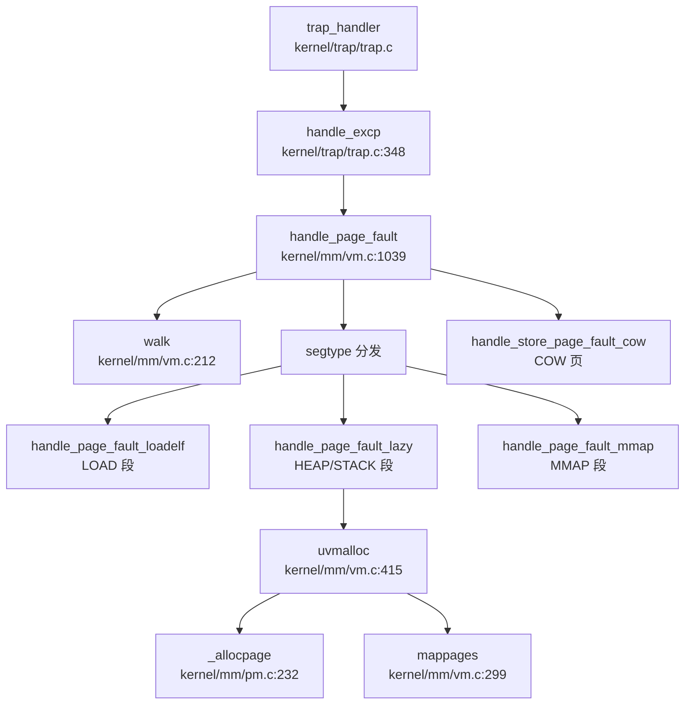

## 第 3 章：内存管理（物理/虚拟/分配器）

xv6-k210 采用经典的类 Unix 内存管理架构，支持物理页帧分配、三级页表映射、缺页异常处理、写时复制（COW）和内存映射（mmap）。本章将深入分析其实现细节。

---

### 物理内存管理实现

#### 双链表分配器设计

xv6-k210 实现了独特的**双区物理页分配器**，将物理内存划分为两个独立区域，分别采用不同的分配策略：

**数据结构**（`kernel/mm/pm.c:26-40`）：
```c
struct run {
    struct run *next;
    uint64 npage;
};

struct pm_allocator {
    struct spinlock lock;
    struct run *freelist;
    uint64 npage;
};

struct pm_allocator multiple;  // 多页分配区
struct pm_allocator single;    // 单页分配区

#define SINGLE_PAGE_NUM 400
uint64 START_SINGLE = PHYSTOP - SINGLE_PAGE_NUM * PGSIZE;
```

**双区设计原理**：
- **`single` 区**：位于物理内存顶部（`PHYSTOP - 400 页`），专门用于单页分配。采用简单的链表结构，每个节点仅管理 1 页，分配/释放无需合并/分割操作，时间复杂度 O(1)。
- **`multiple` 区**：位于 `boot_stack_top` 到 `START_SINGLE` 之间，管理剩余所有物理页。采用链表管理连续页块，支持多页分配，但需要处理合并/分割逻辑。

**单页分配逻辑**（`kernel/mm/pm.c:133-142`）：
```c
static void *__sin_alloc_no_lock(void) {
    struct run *ret = single.freelist;
    if (NULL != ret) {
        single.freelist = ret->next;
        single.npage -= 1;
    }
    return ret;
}
```

**多页分配逻辑**（`kernel/mm/pm.c:54-83`）：
```c
static void *__mul_alloc_no_lock(uint64 n) {
    struct run *pa;
    struct run **pprev;

pa = multiple.freelist;
    pprev = &(multiple.freelist);

while (NULL != pa) {
        if (pa->npage >= n) {
            // 从高地址端分配（保留低地址连续块）
            struct run *ret = (struct run*)(
                (uint64)pa + PGSIZE * (pa->npage - n)
            );
            if (pa == ret) {    // 整个块被用完
                *pprev = pa->next;
            } else {
                pa->npage -= n;
                pa = ret;
            }
            multiple.npage -= n;
            break;
        }
        pprev = &(pa->next);
        pa = pa->next;
    }
    return (void*)pa;
}
```

**分配策略**（`kernel/mm/pm.c:232-254`）：
```c
uint64 _allocpage(void) {
    struct run *ret;
    __enter_sin_cs 
    ret = __sin_alloc_no_lock();  // 优先从 single 区分配
    __leave_sin_cs

if (NULL == ret) {
        // single 区耗尽，从 multiple 区借用
        __enter_mul_cs 
        ret = __mul_alloc_no_lock(1);
        __leave_mul_cs 
    }
    return (uint64)ret;
}
```

**释放时的合并机制**（`kernel/mm/pm.c:86-128`）：
`__mul_free_no_lock()` 实现了相邻页块的自动合并：
1. 按地址顺序插入空闲块到链表
2. 检查是否与前一块物理连续，若是则合并
3. 检查是否与后一块物理连续，若是则合并

这种设计有效减少了外部碎片，但合并操作需要遍历链表，时间复杂度 O(n)。

**判定**：✅ **已实现** - 完整的双链表物理页分配器，支持单页/多页分配、自旋锁保护、空闲块合并。

---

### 虚拟内存与页表操作

#### 页表项格式

xv6-k210 使用 RISC-V 标准的 Sv39 三级页表，页表项定义在 `include/hal/riscv.h:384-390`：
```c
#define PTE_V (1L << 0)  // valid
#define PTE_R (1L << 1)  // readable
#define PTE_W (1L << 2)  // writable
#define PTE_U (1L << 4)  // user accessible
#define PTE_COW PTE_RSW1 // 写时复制标记 (使用 RSW1 位)
```

#### walk() 页表遍历

（`kernel/mm/vm.c:211-230`）：
```c
pte_t *walk(pagetable_t pagetable, uint64 va, int alloc) {
    for(int level = 2; level > 0; level--) {
        pte_t *pte = &pagetable[PX(level, va)];
        if(*pte & PTE_V) {
            pagetable = (pagetable_t)PTE2PA(*pte);
        } else {
            if(!alloc || (pagetable = (pde_t*)allocpage()) == NULL)
                return NULL;
            memset(pagetable, 0, PGSIZE);
            *pte = PA2PTE(pagetable) | PTE_V;
        }
    }
    return &pagetable[PX(0, va)];
}
```

**实现要点**：
- 从 level 2（页目录）遍历到 level 0（页表项）
- `alloc=1` 时自动分配缺失的中间页表页
- 返回 level 0 的页表项指针

#### mappages() 映射函数

（`kernel/mm/vm.c:298-327`）：
```c
int mappages(pagetable_t pagetable, uint64 va, uint64 size, uint64 pa, int perm) {
    uint64 a, last;
    pte_t *pte;

a = PGROUNDDOWN(va);
    last = PGROUNDDOWN(va + size - 1);

int usr = perm & PTE_U;
    for(;;){
        if((pte = walk(pagetable, a, 1)) == NULL)
            return -1;
        if (*pte & PTE_U) { // mprotect 场景
            __debug_assert("mappages", PTE2PA(*pte) == NULL, "invalid page");
            *pte |= PA2PTE(pa) | PTE_V;
        } else {
            *pte = PA2PTE(pa) | perm | PTE_V;
        }
        if (usr)
            pagedup(PGROUNDDOWN(pa));  // 增加父进程页引用计数
        if(a == last)
            break;
        a += PGSIZE;
        pa += PGSIZE;
    }
    return 0;
}
```

**关键特性**：
- 支持跨多页映射
- 检测到 `PTE_U` 已设置时（如 `mprotect` 场景），仅填充物理地址而不覆盖权限位
- 用户页映射时调用 `pagedup()` 增加引用计数（用于 COW）

**判定**：✅ **已实现** - 完整的三级页表遍历、映射、解映射功能。

---

### 地址空间布局

#### 内核与用户地址空间分离

xv6-k210 采用**独立地址空间**设计：
- **内核空间**：`kernel_pagetable` 管理，映射 UART、PLIC、CLINT 等硬件寄存器
- **用户空间**：每个进程拥有独立的 `pagetable` 和 `segment` 链表

**内核重映射**（`kernel/mm/vm.c:60-71`）：
```c
kvmmap(UART_V, UART, PGSIZE, PTE_R | PTE_W);
kvmmap(VIRTIO0_V, VIRTIO0, PGSIZE, PTE_R | PTE_W);
kvmmap(CLINT_V, CLINT, 0x10000, PTE_R | PTE_W);
kvmmap(PLIC_V, PLIC, 0x4000, PTE_R | PTE_W);
```

#### 用户段管理结构

xv6-k210 **不使用 VMA 树**，而是采用**链表**管理用户地址空间段（`include/mm/usrmm.h:8-19`）：
```c
enum segtype { NONE, LOAD, TEXT, DATA, BSS, HEAP, MMAP, STACK };

struct seg {
    enum segtype type;
    int flag;
    uint64 addr;
    uint64 sz;
    struct seg *next;
    uint64 mmap;      // mmap 特定标志
    uint64 f_off;     // 文件偏移
    uint64 f_sz;      // 文件大小
};
```

**段类型**：
- `LOAD`：ELF 加载段（代码/数据）
- `HEAP`：堆区（`sbrk/brk` 管理）
- `STACK`：用户栈
- `MMAP`：内存映射区

**判定**：✅ **已实现** - 内核/用户地址空间独立，使用段链表而非 VMA 树管理。

---

### 堆分配器解析

#### sys_sbrk/sys_brk 实现

（`kernel/syscall/sysmem.c:20-52`）：
```c
uint64 sys_sbrk(void) {
    int n;
    if(argint(0, &n) < 0)
        return -1;

struct proc *p = myproc();
    uint64 addr = p->pbrk;

if (growproc(addr + n) < 0)
        return -1;

return addr;
}

uint64 sys_brk(void) {
    uint64 addr;
    if(argaddr(0, &addr) < 0)
        return -1;

struct proc *p = myproc();
    if (addr == 0)
        return p->pbrk;

uint64 old = p->pbrk;
    if (growproc(addr) < 0)
        return old;

return addr;
}
```

#### growproc 惰性分配机制

（`kernel/sched/proc.c:792-826`）：
```c
int growproc(uint64 newbrk) {
    struct proc *p = myproc();
    struct seg *heap = getseg(p->segment, HEAP);

// 查找堆段
    while (heap && p->pbrk != heap->addr + heap->sz) {
        heap = getseg(heap->next, HEAP);
    }
    if (!heap) {
        heap = locateseg(p->segment, p->pbrk - 1);
    }

// 边界检查
    uint64 boundary = NULL == heap->next ? 
            MAXUVA : PGROUNDDOWN(heap->next->addr) - PGSIZE;
    if (newbrk > boundary)
        return -1;

// 仅更新边界，不立即分配物理页
    int64 diff = newbrk - p->pbrk;
    heap->sz += diff;
    p->pbrk = newbrk;

return 0;
}
```

**惰性分配原理**：
- `growproc()` **仅调整** `p->pbrk` 和 `heap->sz` 边界
- **不立即分配**物理页，直到发生缺页异常
- 实际分配在 `handle_page_fault_lazy()` 中完成

**判定**：✅ **已实现** - 完整的惰性分配机制，`sbrk/brk` 仅调整边界，缺页时实际分配。

---

### 缺页异常处理链路

#### 完整调用链

缺页异常从 trap 入口到最终处理的完整流程：



#### handle_excp 入口

（`kernel/trap/trap.c:328-350`）：
```c
int handle_excp(uint64 scause) {
    switch (scause) {
    case EXCP_STORE_PAGE: 
    case EXCP_STORE_ACCESS: 
        return handle_page_fault(1, r_stval());  // kind=1: 写异常
    case EXCP_LOAD_PAGE: 
    case EXCP_LOAD_ACCESS: 
        return handle_page_fault(0, r_stval());  // kind=0: 读异常
    case EXCP_INST_PAGE:
    case EXCP_INST_ACCESS:
        return handle_page_fault(2, r_stval());  // kind=2: 取指异常
    default: 
        return -1;
    }
}
```

#### handle_page_fault 分发逻辑

（`kernel/mm/vm.c:1039-1105`）：
```c
int handle_page_fault(int kind, uint64 badaddr) {
    struct proc *p = myproc();
    struct seg *seg = locateseg(p->segment, badaddr);
    if (seg == NULL)
        return -1;

pte_t *pte = walk(p->pagetable, badaddr, 0);

// COW 处理
    if (pte && kind == 1 && (*pte & PTE_COW)) {
        return handle_store_page_fault_cow(pte);
    }

// 已映射但非法访问
    if (pte && *pte & PTE_V)
        return -1;

// 按 segtype 分发
    switch (seg->type) {
        case LOAD:
            return handle_page_fault_loadelf(badaddr, seg);
        case HEAP:
        case STACK:
            return handle_page_fault_lazy(badaddr, seg);
        case MMAP:
            return handle_page_fault_mmap(kind, badaddr, seg);
        default:
            return -1;
    }
}
```

**分发策略**：
- **LOAD 段**：调用 `handle_page_fault_loadelf()` 从 ELF 文件加载
- **HEAP/STACK 段**：调用 `handle_page_fault_lazy()` 惰性分配
- **MMAP 段**：调用 `handle_page_fault_mmap()` 处理文件/匿名映射

**判定**：✅ **已实现** - 完整的缺页异常处理链路，支持 segtype 分发。

---

### 写时复制（COW）实现

#### COW 页标记

（`kernel/mm/vm.c:22`）：
```c
#define PTE_COW PTE_RSW1  // 使用 RSW1 位标记 COW 页
```

#### fork 时的 COW 设置

（`kernel/mm/vm.c:556-589`）：
```c
int uvmcopy(pagetable_t old, pagetable_t new, uint64 start, uint64 end, int cow) {
    for (i = start; i < end; i += PGSIZE) {
        if ((pte = walk(old, i, 0)) == NULL || !(*pte & PTE_V))
            continue;

pa = PTE2PA(*pte);
        if (cow && (*pte & PTE_W)) {
            *pte = (*pte|PTE_COW) & ~PTE_W;  // 取消 W，标记 COW
        }
        flags = PTE_FLAGS(*pte);
        if(mappages(new, i, PGSIZE, pa, flags) != 0)
            goto err;
    }
    sfence_vma();
    return 0;
}
```

#### 页面引用计数

（`kernel/mm/vm.c:29, 163-190`）：
```c
static uint8 page_ref_table[MAX_PAGES_NUM];  // 用户页引用计数表

static int monopolizepage(uint64 pa) {
    acquire(&page_ref_lock);
    int idx = __hash_page_idx(pa);
    if (page_ref_table[idx] == 1) {  // 仅本进程持有
        release(&page_ref_lock);
        return 1;
    }
    page_ref_table[idx]--;  // 减少引用计数
    return 0;
}

static inline int pagedup(uint64 pa) {
    acquire(&page_ref_lock);
    int ref = ++page_ref_table[__hash_page_idx(pa)];
    release(&page_ref_lock);
    return ref;
}
```

#### COW 缺页处理

（`kernel/mm/vm.c:975-1000`）：
```c
static int handle_store_page_fault_cow(pte_t *ptep) {
    pte_t pte = *ptep;
    uint64 pa = PTE2PA(pte);

if (monopolizepage(pa)) {    // 仅本进程持有
        pte |= PTE_W;            // 直接添加写权限
    } else {
        // 多进程共享，需要复制
        char *copy = (char *)allocpage();
        if (copy == NULL) {
            pagecopydone();
            return -1;
        }
        memmove(copy, (char *)pa, PGSIZE);
        pagecopydone();
        pagereg((uint64)copy, 1);
        pte = PA2PTE(copy) | PTE_FLAGS(pte) | PTE_W;
    }

pte &= ~PTE_COW;  // 取消 COW 标记
    *ptep = pte;
    sfence_vma();
    return 0;
}
```

**COW 流程**：
1. `fork()` 时调用 `uvmcopy()`，将可写页标记为 `PTE_COW` 并清除 `PTE_W`
2. 写缺页异常触发 `handle_store_page_fault_cow()`
3. 调用 `monopolizepage()` 检查引用计数：
   - `ref==1`：仅本进程持有，直接添加 `PTE_W`
   - `ref>1`：分配新页，复制内容，更新页表项
4. 清除 `PTE_COW` 标记

**判定**：✅ **已实现** - 完整的 COW 机制，包括引用计数、独占检测、按需复制。

---

### 用户指针安全验证

#### argaddr 获取参数

（`kernel/syscall/syscall.c:91-100`）：
```c
int argaddr(int n, uint64 *ip) {
    *ip = argraw(n);  // 从 trapframe 获取第 n 个参数
    struct proc *p = myproc();
    if (p->tmask) {
        printf("0x%x", *ip);
    }
    return 0;
}
```

#### rangeinseg 合法性检查

（`kernel/mm/usrmm.c:230-233`）：
```c
int rangeinseg(uint64 start, uint64 end) {
    return partofseg(myproc()->segment, start, end) ? 1 : 0;
}
```

**使用场景**（`kernel/fs/file.c:121` 等）：
```c
if (!rangeinseg(addr, addr + n))
    return -1;  // 拒绝非法用户指针
```

**判定**：✅ **已实现** - 系统调用入口通过 `argaddr()` 获取地址后，调用 `rangeinseg()` 检查是否在合法段内。

---

### mmap 内存映射实现

#### do_mmap 系统调用

（`kernel/mm/mmap.c:710-780`）：
```c
uint64 do_mmap(uint64 start, uint64 len, int prot, int flags, struct file *f, int64 off) {
    // 文件映射检查
    if (f) {
        struct inode *ip = f->ip;
        if (off >= ip->size)
            return -EINVAL;
        if (S_ISDIR(ip->mode))
            return -EISDIR;
        // 权限检查
        if ((f->readable ^ (prot & PROT_READ)) || 
            (f->writable ^ ((prot & PROT_WRITE) >> 1)))
            return -EPERM;
    }

uint64 sz = PGROUNDUP(len);
    struct seg *prev, *new;

// 查找空闲地址空间
    if (flags & MAP_FIXED)
        ret = lookup_fixed_segment(start, start + sz, &prev, &new);
    else
        ret = lookup_segment(sz, &prev, &new);

new->flag = (prot << 1) & (PTE_X|PTE_W|PTE_R);

if (f)
        ret = mmap_file(new, len, flags, f, off);
    else
        ret = mmap_anonymous(new, flags);

// 清理现有映射（MAP_FIXED 场景）
    struct seg *del = prev ? prev->next : p->segment;
    while (del != new->next) {
        del = delseg(p->pagetable, del);
    }

if (prev)
        prev->next = new;
    else
        p->segment = new;

sfence_vma();
    return new->addr;
}
```

#### mmap 缺页处理

（`kernel/mm/mmap.c:1126-1159`）：
```c
int handle_page_fault_mmap(int kind, uint64 badaddr, struct seg *s) {
    // 权限检查
    int illegel;
    switch (kind) {
        case 0: illegel = !(s->flag & PTE_R); break;
        case 1: illegel = !(s->flag & PTE_W); break;
        case 2: illegel = !(s->flag & PTE_X); break;
        default: illegel = 0; panic("handle_page_fault_mmap: kind");
    }
    if (illegel)
        return -EFAULT;

if (MMAP_ANONY(s->mmap)) {
        if (!MMAP_SHARE(s->mmap)) {
            // 私有匿名映射：类似堆的惰性分配
            struct proc *p = myproc();
            uint64 pa = PGROUNDDOWN(badaddr);
            if (uvmalloc(p->pagetable, pa, pa + PGSIZE, s->flag) == 0)
                return -ENOMEM;
            sfence_vma();
            return 0;
        } else
            return handle_anonymous_shared(badaddr, s);
    }

return handle_file_mmap(badaddr, s);  // 文件映射
}
```

**mmap 特性**：
- ✅ **MAP_FIXED**：支持固定地址映射
- ✅ **MAP_ANONYMOUS**：支持匿名映射
- ✅ **MAP_SHARED**：支持共享映射（通过 `handle_anonymous_shared()`）
- ✅ **文件映射**：支持通过 `handle_file_mmap()` 从文件加载

**判定**：✅ **已实现** - 完整的 mmap 系统调用，支持文件映射、匿名映射、共享映射。

---

### 高级内存特性清单

| 特性 | 状态 | 判定依据 |
|------|------|----------|
| **写时复制（COW）** | ✅ 已实现 | `kernel/mm/vm.c:975-1000` `handle_store_page_fault_cow()` 完整实现，含引用计数和按需复制 |
| **惰性分配（Lazy Allocation）** | ✅ 已实现 | `kernel/sched/proc.c:792-826` `growproc()` 仅调整边界，`kernel/mm/vm.c:1002-1016` `handle_page_fault_lazy()` 实际分配 |
| **内存映射（mmap）** | ✅ 已实现 | `kernel/mm/mmap.c:710-780` `do_mmap()` 完整实现，支持 `MAP_FIXED/MAP_ANONYMOUS/MAP_SHARED` |
| **用户指针验证** | ✅ 已实现 | `kernel/mm/usrmm.c:230-233` `rangeinseg()` 检查地址是否在合法段内 |
| **反向映射表（rmap）** | ❌ 未实现 | 搜索 `rmap\|reverse_map\|page_to_vma` 未找到任何实现 |
| **交换区/页面置换（Swap）** | ❌ 未实现 | 虽有 `__page_file_swap()`（`kernel/mm/mmap.c:908`），但仅用于 mmap 文件页回收，非系统级 swap |
| **大页支持（Huge Page）** | ❌ 未实现 | 搜索 `HugePage\|MapSize.*2M\|MapSize.*1G` 未找到，页表操作仅处理 4K 页 |
| **共享内存（shmget/shmdt）** | ❌ 未实现 | 搜索 `sys_shm\|shmget\|shmdt` 未找到系统调用 |
| **零拷贝（sendfile/splice）** | ❌ 未实现 | 未找到相关系统调用 |

---

### 关键代码片段与调用链分析

#### 物理页分配器双链表结构

**single 区**（单页快速分配）：
```c
// kernel/mm/pm.c:26-40
struct pm_allocator single;  // 顶部 400 页
#define START_SINGLE = PHYSTOP - SINGLE_PAGE_NUM * PGSIZE;
```

**multiple 区**（多页通用分配）：
```c
// kernel/mm/pm.c:54-83
static void *__mul_alloc_no_lock(uint64 n) {
    // 链表遍历查找足够大的块
    // 从高地址端分配，保留低地址连续性
    // 支持块分割和合并
}
```

#### 缺页异常完整调用链

**入向调用**（谁触发缺页）：
```
handle_excp (kernel/trap/trap.c:348)
  └── handle_page_fault (kernel/mm/vm.c:1039)
      ├── handle_page_fault_loadelf (LOAD 段)
      ├── handle_page_fault_lazy (HEAP/STACK 段)
      │   └── uvmalloc → _allocpage → mappages
      ├── handle_page_fault_mmap (MMAP 段)
      │   ├── handle_anonymous_shared
      │   └── handle_file_mmap
      └── handle_store_page_fault_cow (COW 页)
          └── monopolizepage → allocpage (如需复制)
```

**出向调用**（缺页处理调用谁）：
```
handle_page_fault
  ├── walk (页表遍历)
  ├── locateseg (段查找)
  ├── monopolizepage (COW 引用计数检查)
  ├── uvmalloc (惰性分配)
  │   ├── _allocpage (物理页分配)
  │   └── mappages (页表映射)
  └── sfence_vma (TLB 刷新)
```

#### COW 实现细节

**引用计数表**：
```c
// kernel/mm/vm.c:29
static uint8 page_ref_table[MAX_PAGES_NUM];  // 哈希表管理引用计数
static struct spinlock page_ref_lock;
```

**独占检测**：
```c
// kernel/mm/vm.c:163-171
static int monopolizepage(uint64 pa) {
    acquire(&page_ref_lock);
    int idx = __hash_page_idx(pa);
    if (page_ref_table[idx] == 1) {
        release(&page_ref_lock);
        return 1;  // 独占，可直接写
    }
    page_ref_table[idx]--;
    return 0;  // 共享，需复制
}
```

#### 段链表管理

**段类型枚举**：
```c
// include/mm/usrmm.h:8
enum segtype { NONE, LOAD, TEXT, DATA, BSS, HEAP, MMAP, STACK };
```

**段结构**：
```c
// include/mm/usrmm.h:10-19
struct seg {
    enum segtype type;
    int flag;
    uint64 addr;
    uint64 sz;
    struct seg *next;
    uint64 mmap;    // mmap 标志
    uint64 f_off;   // 文件偏移
    uint64 f_sz;    // 文件大小
};
```

**判定总结**：xv6-k210 实现了完整的内存管理子系统，包括物理页双链表分配器、三级页表映射、缺页异常处理、COW、惰性分配和 mmap。但未实现 rmap、系统级 swap、大页和共享内存系统调用等高级特性。
