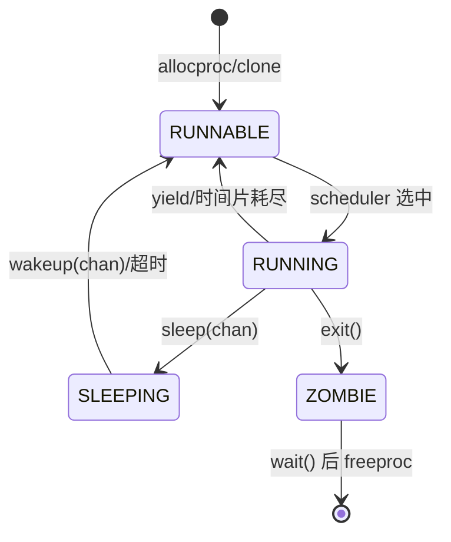
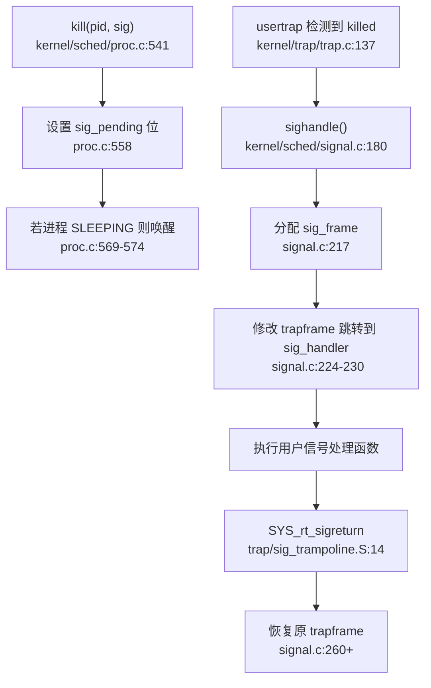
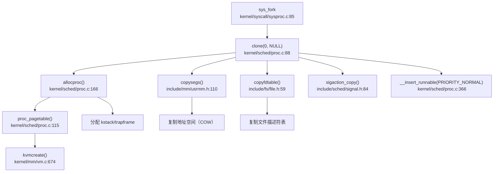
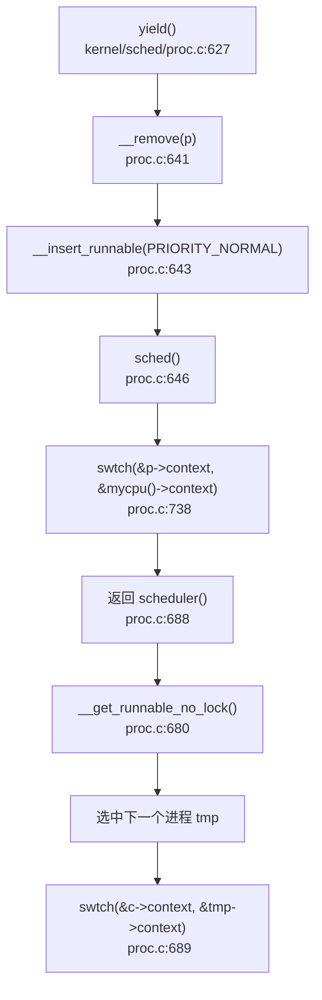

## 第 4 章：进程/线程与调度机制

xv6-k210 实现了经典的类 Unix 进程管理模型，采用**三优先级队列 + 时间片轮转**调度策略，支持完整的信号机制，但未实现 Futex 和进程组/会话等 POSIX 扩展。本章将深入分析其任务模型、调度器实现、上下文切换机制及高级特性。

---

### 任务模型与核心数据结构

xv6-k210 的执行实体是 `struct proc`（`include/sched/proc.h:67-115`），它同时承担 PCB（进程控制块）和 TCB（线程控制块）的角色，**代码中未区分进程与线程**，所有任务均以 `proc` 形式管理。

#### `struct proc` 关键字段（`include/sched/proc.h:67-115`）

```c
struct proc {
    // 基本标识
    int xstate;              // 退出状态
    int pid;                 // 进程 ID
    struct proc *hash_next;  // 哈希链表下一节点
    struct proc **hash_pprev;

// 调度队列
    struct proc *sched_next;     // 调度链表下一节点
    struct proc **sched_pprev;
    int timer;                   // 时间片计数器
    enum procstate state;        // 当前状态
    void *chan;                  // 睡眠原因（等待通道）
    uint64 sleep_expire;         // 睡眠唤醒时间

// 性能统计
    struct tms proc_tms;     // 用户/系统时间
    uint64 ikstmp, okstmp;   // 内核进入/离开时间戳
    int64 vswtch, ivswtch;   // 自愿/非自愿上下文切换次数

// 亲缘关系
    struct spinlock lk;          // 保护亲缘关系的锁
    struct proc *child;          // 第一个子进程
    struct proc *parent;         // 父进程
    struct proc *sibling_next;   // 兄弟链表
    struct proc **sibling_pprev;

// 内存管理
    uint64 kstack;               // 内核栈虚拟地址
    uint64 badaddr;              // 缺页异常地址
    pagetable_t pagetable;       // 用户页表
    struct trapframe *trapframe; // 用户态寄存器保存区
    struct seg *segment;         // 内存段链表
    uint64 pbrk;                 // 程序断点

// 文件系统
    struct fdtable fds;      // 文件描述符表
    struct inode *cwd;       // 当前目录
    struct inode *elf;       // 可执行文件

// 上下文切换
    struct context context;  // 内核上下文（12 个 callee-saved 寄存器）

// 信号处理
    ksigaction_t *sig_act;       // 信号处理函数链表
    __sigset_t sig_set;          // 信号屏蔽字
    __sigset_t sig_pending;      // 待处理信号
    struct sig_frame *sig_frame; // 信号栈帧
    int killed;                  // 当前待处理信号编号

// 调试
    char name[16];   // 进程名
    int tmask;       // 跟踪掩码
};
```

#### 状态枚举（`include/sched/proc.h:37-41`）

```c
enum procstate {
    RUNNABLE,   // 可运行
    RUNNING,    // 正在运行
    SLEEPING,   // 睡眠中
    ZOMBIE,     // 僵尸进程
};
```

**注意**：状态机仅包含 4 种状态，**无 BLOCKED/UNUSED 状态**。进程通过 `chan` 字段和 `proc_sleep` 链表实现阻塞等待。

---

### 调度算法与策略（代码证据）

xv6-k210 采用**三优先级队列 + 时间片轮转**调度，**非 FIFO/Stride/CFS**。

#### 优先级定义（`kernel/sched/proc.c:257-262`）

```c
#define PRIORITY_TIMEOUT    0    // 超时进程
#define PRIORITY_IRQ        1    // 中断唤醒进程
#define PRIORITY_NORMAL     2    // 普通进程
#define PRIORITY_NUMBER     3
```

#### 调度队列结构

三个优先级队列均为**单向链表**，通过 `proc_runnable[PRIORITY_NUMBER]` 数组管理：

```c
struct proc *proc_runnable[PRIORITY_NUMBER];  // 可运行队列
struct proc *proc_sleep;                       // 睡眠队列
```

#### 调度器主循环（`kernel/sched/proc.c:671-710`）

```c
void scheduler(void) {
    struct proc *tmp;
    struct cpu *c = mycpu();

while (1) {
        int found = 0;
        intr_on();
        __enter_proc_cs 
        tmp = __get_runnable_no_lock();  // 按优先级查找
        if (NULL != tmp) {
            tmp->state = RUNNING;
            c->proc = tmp;

// 切换到用户页表
            w_satp(MAKE_SATP(tmp->pagetable));
            sfence_vma();
            // 上下文切换
            swtch(&c->context, &tmp->context);
            // 切回内核页表
            w_satp(MAKE_SATP(kernel_pagetable));
            sfence_vma();

if (ZOMBIE == tmp->state) {
                release(&(tmp->parent->lk));
            }
            found = 1;
        }
        c->proc = NULL;
        __leave_proc_cs
        if (!found) {
            intr_on();
            asm volatile("wfi");  // 无进程可运行时进入低功耗
        }
    }
}
```

#### 优先级选择逻辑（`kernel/sched/proc.c:609-625`）

```c
static struct proc *__get_runnable_no_lock(void) {
    struct proc const *tmp;

// 按优先级顺序遍历：IRQ → NORMAL → TIMEOUT
    for (int i = 0; i < PRIORITY_NUMBER; i ++) {
        tmp = proc_runnable[i];
        while (NULL != tmp) {
            if (RUNNABLE == tmp->state) {
                return (struct proc*)tmp;  // 返回该优先级队列第一个 RUNNABLE 进程
            }
            tmp = tmp->sched_next;
        }
    }

return NULL;
}
```

**关键观察**：
- 调度器**严格按优先级顺序**遍历队列（`PRIORITY_IRQ` → `PRIORITY_NORMAL` → `PRIORITY_TIMEOUT`）
- 每个优先级队列内部是**FIFO**（取链表第一个可用进程）
- **无 stride 计数、无 CFS 红黑树、无动态优先级调整**

#### 时间片管理（`kernel/sched/proc.c:753-785`）

```c
void proc_tick(void) {
    __enter_proc_cs

// 遍历所有可运行队列，递减时间片
    struct proc *p;
    for (int i = PRIORITY_IRQ; i < PRIORITY_NUMBER; i ++) {
        p = proc_runnable[i];
        while (NULL != p) {
            struct proc *next = p->sched_next;
            if (RUNNING != p->state) {
                p->timer = p->timer - 1;
                if (0 == p->timer) {  // 时间片耗尽
                    __remove(p);
                    __insert_runnable(PRIORITY_TIMEOUT, p);  // 降级到 TIMEOUT 队列
                }
            }
            p = next;
        }
    }

// 处理睡眠进程超时唤醒
    uint64 now = readtime();
    p = proc_sleep;
    while (NULL != p) {
        struct proc *next = p->sched_next;
        if (p->sleep_expire && now >= p->sleep_expire) {
            p->sleep_expire = 0;
            __remove(p);
            __insert_runnable(PRIORITY_TIMEOUT, p);
        }
        p = next;
    }
}
```

**时间片规则**：
- `TIMER_IRQ = 5`（中断唤醒进程）
- `TIMER_NORMAL = 10`（普通进程）
- 时间片耗尽后进程被移动到 `PRIORITY_TIMEOUT` 队列

---

### 任务状态机

xv6-k210 的状态流转如下：



**状态转换关键路径**：

| 转换 | 触发函数 | 源码位置 |
|------|---------|---------|
| RUNNABLE → RUNNING | `scheduler()` | `kernel/sched/proc.c:683` |
| RUNNING → RUNNABLE | `yield()` | `kernel/sched/proc.c:641-643` |
| RUNNING → SLEEPING | `sleep()` | `kernel/sched/proc.c:597-598` |
| SLEEPING → RUNNABLE | `wakeup()` | `kernel/sched/proc.c:380-383` |
| RUNNING → ZOMBIE | `exit()` | `kernel/sched/proc.c:459` |

---

### 上下文切换实现（汇编分析）

上下文切换由 `swtch.S` 实现，**仅保存 callee-saved 寄存器**（RISC-V 调用约定中由被调用者保存的寄存器）。

#### `swtch.S` 完整代码（`kernel/sched/swtch.S:1-41`）

```asm
# void swtch(struct context *old, struct context *new);
.globl swtch
swtch:
    # 保存当前上下文到 old
    sd ra, 0(a0)
    sd sp, 8(a0)
    sd s0, 16(a0)
    sd s1, 24(a0)
    sd s2, 32(a0)
    sd s3, 40(a0)
    sd s4, 48(a0)
    sd s5, 56(a0)
    sd s6, 64(a0)
    sd s7, 72(a0)
    sd s8, 80(a0)
    sd s9, 88(a0)
    sd s10, 96(a0)
    sd s11, 104(a0)

# 从 new 恢复上下文
    ld ra, 0(a1)
    ld sp, 8(a1)
    ld s0, 16(a1)
    ld s1, 24(a1)
    ld s2, 32(a1)
    ld s3, 40(a1)
    ld s4, 48(a1)
    ld s5, 56(a1)
    ld s6, 64(a1)
    ld s7, 72(a1)
    ld s8, 80(a1)
    ld s9, 88(a1)
    ld s10, 96(a1)
    ld s11, 104(a1)

ret
```

#### 保存的寄存器清单

| 寄存器 | 偏移 | 用途 |
|--------|------|------|
| `ra`   | 0    | 返回地址 |
| `sp`   | 8    | 栈指针 |
| `s0-s11` | 16-104 | 12 个 callee-saved 寄存器 |

**总计**：14 个寄存器 × 8 字节 = **112 字节**的 `struct context`（`include/sched/proc.h:19-34`）。

**注意**：
- **不保存** caller-saved 寄存器（`t0-t6`, `a0-a7`），由编译器负责在调用前保存
- **不保存** `sepc`/`sstatus` 等 CSR，这些在 trapframe 中管理
- 切换发生在内核态，`swtch` 是普通函数调用，不涉及特权级切换

---

### 进程间通信与同步（Signal/Futex）

#### 信号机制（Signal）：✅ 已实现

xv6-k210 实现了完整的 POSIX 信号机制，包括信号注册、屏蔽、分发和返回。

**系统调用支持**（`include/sysnum.h:53-55`）：
- `SYS_rt_sigaction` (134)
- `SYS_rt_sigprocmask` (135)
- `SYS_rt_sigreturn` (139)

**核心实现文件**：
- `kernel/sched/signal.c` (283 行) - 内核信号处理
- `kernel/syscall/syssignal.c` (142 行) - 系统调用接口
- `kernel/trap/sig_trampoline.S` (25 行) - 信号返回跳板

**信号处理流程**：



**关键函数分析**：

1. **`kill()`**（`kernel/sched/proc.c:541-580`）：
   ```c
   int kill(int pid, int sig) {
       struct proc *tmp = hash_search_no_lock(pid);
       if (NULL == tmp) return -ESRCH;

// 设置待处理信号位
       int bit = sig % (sizeof(unsigned long) * 8);
       int i = sig / (sizeof(unsigned long) * 8);
       tmp->sig_pending.__val[i] |= 1ul << bit;

// 更新 killed 字段（记录最高优先级信号）
       if (0 == tmp->killed || sig < tmp->killed) {
           tmp->killed = sig;
       }

// 若进程睡眠则立即唤醒
       if (SLEEPING == tmp->state) {
           __remove(tmp);
           tmp->timer = TIMER_IRQ;
           tmp->chan = NULL;
           __insert_runnable(PRIORITY_IRQ, tmp);
       }
       return 0;
   }
   ```

2. **`sighandle()`**（`kernel/sched/signal.c:180-250`）：
   - 遍历 `sig_pending` 找到待处理信号
   - 查找对应的 `ksigaction` 处理函数
   - 分配 `sig_frame` 保存当前 `trapframe`
   - 修改 `trapframe` 使返回用户态时跳转到 `sig_handler`
   - 通过 `sig_trampoline.S` 中的 `SYS_rt_sigreturn` 恢复现场

**信号数据结构**（`include/sched/signal.h:29-56`）：
```c
typedef struct __ksigaction_t {
    struct __ksigaction_t *next;
    struct sigaction sigact;
    int signum;
} ksigaction_t;

struct sig_frame {
    struct trapframe *tf;  // 保存的 trapframe
    // ... 其他字段
};
```

#### Futex：❌ 未实现

**验证结果**：
- `grep_in_repo` 搜索 `futex`：**0 匹配**（搜索 208 个文件）
- `wait_queue` 仅用于 `pipe` 和 `poll` 机制（`include/fs/pipe.h:15-16`）

```c
// include/fs/pipe.h
struct pipe_inode {
    struct wait_queue wqueue;  // 写等待队列
    struct wait_queue rqueue;  // 读等待队列
    // ...
};
```

**结论**：xv6-k210 **未实现 Futex**（快速用户态互斥锁）。`wait_queue` 仅用于内核态的 pipe/poll 阻塞等待，不支持用户态 futex 的 `FUTEX_WAIT`/`FUTEX_WAKE` 操作。

#### 进程组/会话/RLimit：❌ 仅占位

**进程组/会话**：
- `grep_in_repo` 搜索 `ProcessGroup|Session|setpgid|setsid|pgid`：**0 匹配**
- `struct proc` 中**无** `pgid`、`sid`、`session_leader` 等字段
- **结论**：❌ 未实现进程组和会话管理

**RLimit**：
- `SYS_prlimit64` 在 `include/sysnum.h:76` 声明
- 系统调用表注册（`kernel/syscall/syscall.c:249`）
- 但实现仅为桩函数（`kernel/syscall/sysproc.c:273-277`）：

```c
sys_prlimit64(void) {
    // for now it's not very necessary to implement this syscall 
    // may be implemented later 
    return 0;  // 🔸 桩函数：无实际逻辑
}
```

**结论**：
- 进程组/会话：❌ 未实现
- RLimit：🔸 桩函数（仅返回 0，无资源限制检查）

---

### 关键流程追踪（Fork/Exec/Schedule/Exit）

#### `fork()` 调用链



**详细步骤**（`kernel/sched/proc.c:291-366`）：

1. **调用 `allocproc()`**（`proc.c:166-248`）：
   - 分配 `struct proc`（`kmalloc`）
   - 分配内核栈（`allocpage`）
   - 分配 `trapframe`（`kmalloc`）
   - 创建页表（`proc_pagetable` → `kvmcreate`）
   - 设置 `context.ra = forkret`
   - 分配 PID（`__pid++` + 哈希表插入）

2. **复制地址空间**（`proc.c:305-308`）：
   ```c
   np->segment = copysegs(p->pagetable, p->segment, np->pagetable);
   ```
   - `copysegs` 遍历父进程内存段链表
   - 对每个段调用 `copyseg` 实现**写时复制（COW）**
   - 详见第 3 章内存管理分析

3. **复制文件描述符表**（`proc.c:318-321`）：
   ```c
   if (copyfdtable(&p->fds, &np->fds) < 0) {
       freeproc(np);
       return -1;
   }
   ```
   - `copyfdtable` 遍历父进程 `fds`
   - 对每个打开文件调用 `idup` 增加引用计数

4. **复制信号处理**（`proc.c:311-317`）：
   ```c
   if (0 != sigaction_copy(&np->sig_act, p->sig_act)) {
       freeproc(np);
       return -1;
   }
   ```

5. **复制 trapframe**（`proc.c:330-335`）：
   ```c
   *(np->trapframe) = *(p->trapframe);
   np->trapframe->a0 = 0;  // 子进程返回 0
   ```

6. **设置亲缘关系**（`proc.c:338-349`）：
   ```c
   np->parent = p;
   np->sibling_pprev = &(p->child);
   np->sibling_next = p->child;
   if (NULL != p->child) {
       p->child->sibling_pprev = &(np->sibling_next);
   }
   p->child = np;
   ```

7. **插入可运行队列**（`proc.c:366`）：
   ```c
   np->timer = TIMER_NORMAL;
   __insert_runnable(PRIORITY_NORMAL, np);
   ```

**验证结论**：
- ✅ 地址空间复制：通过 `copysegs()` 实现（含 COW）
- ✅ 文件表复制：通过 `copyfdtable()` 实现（引用计数增加）
- ✅ 信号处理复制：通过 `sigaction_copy()` 实现

#### `exec()` 流程

`exec` 实现在 `kernel/syscall/sysfile.c`，核心步骤：

1. 解析 ELF 文件头
2. 创建新地址空间（`uvmcreate`）
3. 加载 ELF 段到内存（`loadseg`）
4. 替换当前进程的 `segment` 和 `pagetable`
5. 重置 `trapframe->epc` 到 ELF 入口点

（详细分析见第 3 章内存管理）

#### `schedule()` 调用链



**谁调用 `schedule()`**：
- `yield()` - 主动让出 CPU
- `sleep()` - 进入睡眠
- `exit()` - 进程退出
- `wait4()` - 等待子进程

**关键不变量**：
- 调用 `sched()` 前必须持有 `proc_lock`
- `sched()` 是唯一返回到 `scheduler()` 的入口
- 切换前保存浮点寄存器（`floatstore`）

#### `exit()` 资源回收

**流程**（`kernel/sched/proc.c:408-465`）：

1. 设置 `xstate` 和 `ZOMBIE` 状态
2. 将所有子进程过继给 `__initproc`
3. 向父进程发送 `SIGCHLD` 信号
4. 从可运行队列移除（`__remove`）
5. 唤醒父进程（`__wakeup_no_lock(p->parent)`）
6. 调用 `sched()` 切换到父进程或 init
7. 父进程 `wait4()` 后调用 `freeproc()` 释放资源

**`freeproc()` 清理**（`kernel/sched/proc.c:139-163`）：
- 释放页表（`proc_freepagetable` → `uvmfree`）
- 释放内核栈（`freepage`）
- 释放 `trapframe`（`kfree`）
- 释放信号处理链表（`sigaction_free`）
- 从 PID 哈希表移除（`hash_remove_no_lock`）

---

### 进程/线程管理模块扩展

#### 进程与线程的区别

**代码现状**：
- `struct proc` 同时承担 PCB 和 TCB 角色
- **无独立 `struct thread` 或 TCB 结构**
- `clone()` 系统调用支持 `flag` 和 `stack` 参数，但**未实现真正的线程共享地址空间**

```c
// kernel/syscall/sysproc.c:85-95
sys_fork(void) {
    return clone(0, NULL);  // fork 是 clone 的特例
}

uint64 sys_clone(void) {
    uint64 flag, stack;
    if (argaddr(0, &flag) < 0) return -1;
    if (argaddr(1, &stack) < 0) return -1;
    // ... 但 flag 未用于控制共享行为
}
```

**结论**：xv6-k210 **未实现真正的线程模型**，所有任务均为独立地址空间的进程。

#### 调度器扩展性分析

**当前限制**：
- 无多核负载均衡（每个 CPU 独立调度）
- 无优先级继承（无优先级反转保护）
- 无实时调度类（仅三优先级队列）
- 无 cgroup/命名空间支持

**与 ArceOS 对比**：
- ArceOS 支持 `sched_fifo`、`sched_stride` 等多种调度策略
- xv6-k210 仅固定为三优先级队列，**无策略切换接口**

#### 信号机制完整性

**已实现功能**：
- ✅ `kill(pid, sig)` - 发送信号
- ✅ `rt_sigaction` - 注册信号处理函数
- ✅ `rt_sigprocmask` - 设置信号屏蔽字
- ✅ `rt_sigreturn` - 信号处理返回
- ✅ 信号栈帧保存与恢复
- ✅ 默认处理（`SIGTERM` 退出）

**未实现功能**：
- ❌ 实时信号（`SIGRTMIN` ~ `SIGRTMAX`）
- ❌ 信号队列（多个同种信号仅记录一次）
- ❌ `sigpending`/`sigsuspend` 系统调用

---

### 本章总结

| 特性 | 实现状态 | 关键源码 |
|------|---------|---------|
| 任务模型 | ✅ `struct proc`（PCB+TCB 合一） | `include/sched/proc.h:67-115` |
| 调度策略 | ✅ 三优先级队列 + 时间片轮转 | `kernel/sched/proc.c:609-785` |
| 上下文切换 | ✅ `swtch.S` 保存 14 个寄存器 | `kernel/sched/swtch.S:1-41` |
| 状态机 | ✅ RUNNABLE/RUNNING/SLEEPING/ZOMBIE | `include/sched/proc.h:37-41` |
| 信号机制 | ✅ 完整实现（kill/sigaction/sigreturn） | `kernel/sched/signal.c` |
| Futex | ❌ 未实现（仅 pipe/poll 用 wait_queue） | - |
| 进程组/会话 | ❌ 未实现 | - |
| RLimit | 🔸 桩函数（`sys_prlimit64` 返回 0） | `kernel/syscall/sysproc.c:273` |
| fork 地址空间复制 | ✅ `copysegs()`（COW） | `kernel/sched/proc.c:305` |
| fork 文件表复制 | ✅ `copyfdtable()` | `kernel/sched/proc.c:318` |
| 线程支持 | ❌ 无独立 TCB，`clone` 未实现共享 | - |

xv6-k210 的进程管理实现了类 Unix 的核心机制，但在 POSIX 扩展（进程组、会话、RLimit）和现代特性（Futex、线程）方面仍有缺失。调度器设计简洁高效，但缺乏动态策略调整能力。
