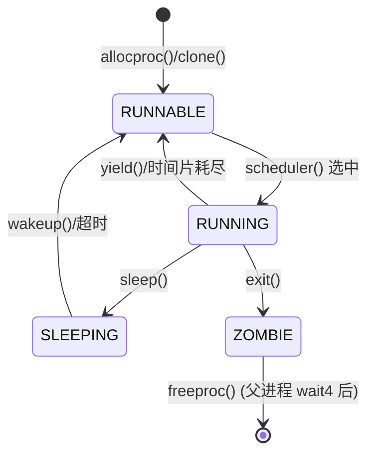
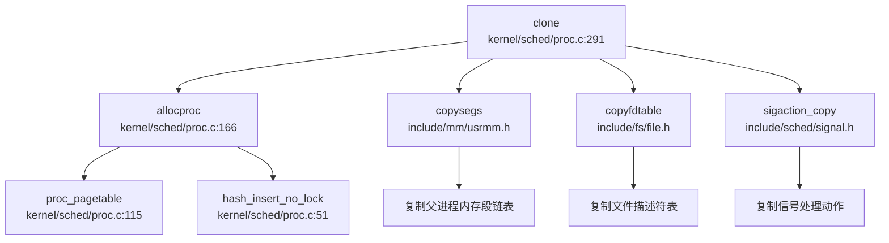
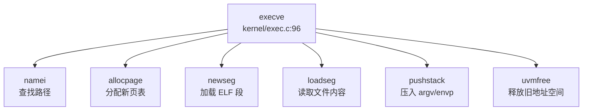
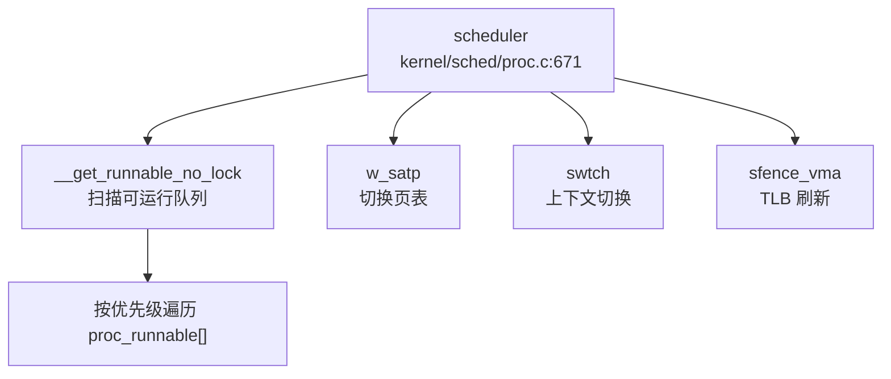
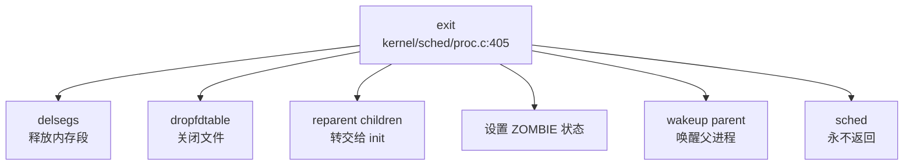

### 任务模型与核心数据结构

xv6-k210 采用统一的 **`struct proc`** 作为执行实体的核心数据结构，未区分 Process Control Block (PCB) 与 Thread Control Block (TCB)，即**进程与线程在代码层面是同一抽象**。

**`struct proc` 定义位置**: `include/sched/proc.h:51-148`

核心字段分类如下：

```c
struct proc {
    // === 基础标识 ===
    int xstate;                // 退出状态 (exit status)
    int pid;                   // 进程 ID
    struct proc *hash_next;    // 哈希链表下一节点
    struct proc **hash_pprev;  // 哈希链表前一节点指针

    // === 调度相关 ===
    struct proc *sched_next;   // 调度链表下一节点
    struct proc **sched_pprev; // 调度链表前一节点指针
    int timer;                 // 时间片计数器
    enum procstate state;      // 进程状态 (RUNNABLE/RUNNING/SLEEPING/ZOMBIE)
    void *chan;                // 睡眠等待的通道地址
    uint64 sleep_expire;       // 睡眠唤醒时间戳

    // === 性能统计 ===
    struct tms proc_tms;       // 用户态/内核态时间统计
    uint64 ikstmp;             // 进入内核时刻
    uint64 okstmp;             // 离开内核时刻
    int64 vswtch;              // 自愿上下文切换次数
    int64 ivswtch;             // 非自愿上下文切换次数

    // === 亲缘关系 ===
    struct spinlock lk;        // 保护子进程列表的自旋锁
    struct proc *child;        // 第一个子进程
    struct proc *parent;       // 父进程指针
    struct proc *sibling_next; // 兄弟链表下一节点
    struct proc **sibling_pprev;

    // === 内存管理 ===
    uint64 kstack;             // 内核栈虚拟地址
    uint64 badaddr;            // 页错误后的错误地址
    pagetable_t pagetable;     // 用户页表
    struct trapframe *trapframe; // 陷阱帧数据页
    struct seg *segment;       // 内存段链表头
    uint64 pbrk;               // 程序断点 (program break)

    // === 文件系统 ===
    struct fdtable fds;        // 打开文件表
    struct inode *cwd;         // 当前工作目录
    struct inode *elf;         // 可执行文件 inode

    // === 上下文切换 ===
    struct context context;    // 内核上下文 (保存 callee-saved 寄存器)

    // === 信号机制 ===
    ksigaction_t *sig_act;     // 信号处理动作链表
    __sigset_t sig_set;        // 当前信号掩码
    __sigset_t sig_pending;    // 待处理信号集
    struct sig_frame *sig_frame; // 信号帧链表
    int killed;                // 当前待处理信号编号

    // === 调试信息 ===
    char name[16];             // 进程名
    int tmask;                 // 跟踪掩码
};
```

**`struct context` 定义** (`include/sched/proc.h:18-33`): 保存内核上下文切换时的 callee-saved 寄存器：
```c
struct context {
    uint64 ra;  // 返回地址
    uint64 sp;  // 栈指针
    uint64 s0-s11;  // 12 个被调用者保存寄存器
};
```

**进程状态枚举** (`include/sched/proc.h:35-39`):
```c
enum procstate {
    RUNNABLE,   // 可运行
    RUNNING,    // 正在运行
    SLEEPING,   // 睡眠中
    ZOMBIE,     // 僵尸进程 (已退出但未被父进程回收)
};
```

---

### 调度算法与策略（代码证据）

xv6-k210 实现了**基于优先级的时间片轮转调度算法**，支持 3 个优先级队列。

**优先级定义** (`kernel/sched/proc.c:241-243`):
```c
#define PRIORITY_TIMEOUT    0   // 超时队列 (最低优先级)
#define PRIORITY_IRQ        1   // 中断/信号唤醒队列 (高优先级)
#define PRIORITY_NORMAL     2   // 普通进程队列 (默认优先级)
#define PRIORITY_NUMBER     3   // 优先级总数
```

**调度队列结构** (`kernel/sched/proc.c:245-246`):
```c
struct proc *proc_runnable[PRIORITY_NUMBER];  // 3 个优先级的可运行队列
struct proc *proc_sleep;                       // 睡眠队列
```

**调度器核心逻辑** (`kernel/sched/proc.c:671-711`):

`__get_runnable_no_lock()` 函数按优先级从高到低扫描可运行队列：
```c
static struct proc *__get_runnable_no_lock(void) {
    struct proc const *tmp;
    for (int i = 0; i < PRIORITY_NUMBER; i ++) {  // 从 PRIORITY_TIMEOUT(0) 开始
        tmp = proc_runnable[i];
        while (NULL != tmp) {
            if (RUNNABLE == tmp->state) {
                return (struct proc*)tmp;  // 返回第一个 RUNNABLE 状态的进程
            }
            tmp = tmp->sched_next;
        }
    }
    return NULL;
}
```

**时间片机制** (`kernel/sched/proc.c:753-787`):

`proc_tick()` 函数在时钟中断时被调用，递减运行进程的 `timer` 字段：
```c
void proc_tick(void) {
    __enter_proc_cs 
    struct proc *p;
    for (int i = PRIORITY_IRQ; i < PRIORITY_NUMBER; i ++) {
        p = proc_runnable[i];
        while (NULL != p) {
            struct proc *next = p->sched_next;
            if (RUNNING != p->state) {
                p->timer = p->timer - 1;
                if (0 == p->timer) {  // 时间片耗尽
                    __remove(p);
                    __insert_runnable(PRIORITY_TIMEOUT, p);  // 降级到 TIMEOUT 队列
                }
            }
            p = next;
        }
    }
    // ... 处理睡眠进程唤醒
    __leave_proc_cs
}
```

**时间片分配** (`kernel/sched/proc.c:240-241`):
```c
#define TIMER_IRQ       5
#define TIMER_NORMAL    10  // 普通进程默认时间片为 10 个 tick
```

**调度策略总结**:
- **优先级顺序**: `PRIORITY_IRQ(1)` > `PRIORITY_NORMAL(2)` > `PRIORITY_TIMEOUT(0)` (注意：数字越小优先级越高，因为扫描从 0 开始)
- **时间片轮转**: 进程时间片用完后被移动到 `PRIORITY_TIMEOUT` 队列
- **中断/信号唤醒**: 被信号或中断唤醒的进程插入 `PRIORITY_IRQ` 队列，获得更高优先级
- **FIFO  Within Priority**: 同一优先级队列内采用 FIFO 顺序 (通过 `sched_next` 链表)

---

### 任务状态机

xv6-k210 的进程状态机包含 4 种状态，流转关系如下：



**状态转换触发点**:

| 当前状态 | 目标状态 | 触发函数 | 文件位置 |
|---------|---------|---------|---------|
| 无 → RUNNABLE | `allocproc()` / `clone()` | `kernel/sched/proc.c:166` / `291` |
| RUNNABLE → RUNNING | `scheduler()` | `kernel/sched/proc.c:671` |
| RUNNING → RUNNABLE | `yield()` / `proc_tick()` | `kernel/sched/proc.c:629` / `753` |
| RUNNING → SLEEPING | `sleep()` | `kernel/sched/proc.c:582` |
| SLEEPING → RUNNABLE | `wakeup()` / `proc_tick()` 超时 | `kernel/sched/proc.c:392` / `753` |
| RUNNING → ZOMBIE | `exit()` | `kernel/sched/proc.c:405` |
| ZOMBIE → 销毁 | `freeproc()` (在 `wait4()` 后) | `kernel/sched/proc.c:139` |

**关键状态转换代码**:

1. **RUNNABLE → RUNNING** (`kernel/sched/proc.c:683-686`):
```c
tmp = __get_runnable_no_lock();
if (NULL != tmp) {
    tmp->state = RUNNING;
    c->proc = tmp;
    swtch(&c->context, &tmp->context);  // 切换到用户态
}
```

2. **RUNNING → SLEEPING** (`kernel/sched/proc.c:582-607`):
```c
void sleep(void *chan, struct spinlock *lk) {
    p->chan = chan;
    __remove(p);        // 从可运行队列移除
    __insert_sleep(p);  // 插入睡眠队列
    sched();            // 触发调度
    // ... 唤醒后恢复
}
```

3. **RUNNING → ZOMBIE** (`kernel/sched/proc.c:453-456`):
```c
void exit(int xstatus) {
    // ... 资源回收
    p->state = ZOMBIE;
    __remove(p); 
    __wakeup_no_lock(p->parent);  // 唤醒父进程
    sched();  // 永不返回
}
```

---

### 上下文切换实现（汇编分析）

**上下文切换汇编代码** (`kernel/sched/swtch.S`):

```asm
# Context switch
#   void swtch(struct context *old, struct context *new);
# Save current registers in old. Load from new.

.globl swtch
swtch:
    # 保存当前上下文到 old (a0 指向)
    sd ra, 0(a0)
    sd sp, 8(a0)
    sd s0, 16(a0)
    sd s1, 24(a0)
    sd s2, 32(a0)
    sd s3, 40(a0)
    sd s4, 48(a0)
    sd s5, 56(a0)
    sd s6, 64(a0)
    sd s7, 72(a0)
    sd s8, 80(a0)
    sd s9, 88(a0)
    sd s10, 96(a0)
    sd s11, 104(a0)

    # 从 new (a1 指向) 恢复上下文
    ld ra, 0(a1)
    ld sp, 8(a1)
    ld s0, 16(a1)
    ld s1, 24(a1)
    ld s2, 32(a1)
    ld s3, 40(a1)
    ld s4, 48(a1)
    ld s5, 56(a1)
    ld s6, 64(a1)
    ld s7, 72(a1)
    ld s8, 80(a1)
    ld s9, 88(a1)
    ld s10, 96(a1)
    ld s11, 104(a1)
    
    ret
```

**保存的寄存器** (共 14 个 64 位寄存器，112 字节):
- `ra`: 返回地址
- `sp`: 栈指针
- `s0-s11`: 12 个 callee-saved 寄存器

**未保存的寄存器**:
- `a0-a7`: 调用者保存寄存器 (参数/返回值)，由编译器负责在调用前后保存
- `t0-t6`: 临时寄存器，调用者保存
- `fp/gp/tp`: 帧指针/全局指针/线程指针，特殊处理

**调用位置**:
1. `scheduler()` → `swtch(&c->context, &tmp->context)` (`kernel/sched/proc.c:695`)
2. `sched()` → `swtch(&p->context, &mycpu()->context)` (`kernel/sched/proc.c:737`)

**页表切换** (`kernel/sched/proc.c:691-697`):
```c
// 切换到用户页表
w_satp(MAKE_SATP(tmp->pagetable));
sfence_vma();
swtch(&c->context, &tmp->context);
// 切换回内核页表
w_satp(MAKE_SATP(kernel_pagetable));
sfence_vma();
```

---

### 进程间通信与同步（Signal/Futex）

#### 信号机制 (Signal)

**实现状态**: ✅ **已实现**

**信号定义** (`include/sched/signal.h`):
```c
#define SIGRTMIN    34
#define SIGRTMAX    64
#define SIGTERM     15
#define SIGKILL     9
#define SIGABRT     6
#define SIGHUP      1
#define SIGINT      2
#define SIGQUIT     3
#define SIGILL      4
#define SIGTRAP     5
#define SIGCHLD     17

#define SIGSET_LEN  1  // 仅支持 64 位信号集 (1 个 unsigned long)
```

**`struct sigaction`** (`include/sched/signal.h:43-52`):
```c
struct sigaction {
    union {
        __sighandler_t sa_handler;  // 仅支持简单信号处理函数
    } __sigaction_handler;
    __sigset_t sa_mask;   // 信号屏蔽掩码
    int sa_flags;         // 信号标志 (SA_NOCLDSTOP, SA_NODEFER 等)
};
```

**进程信号字段** (`include/sched/proc.h:133-138`):
```c
ksigaction_t *sig_act;      // 信号处理动作链表
__sigset_t sig_set;         // 当前信号掩码
__sigset_t sig_pending;     // 待处理信号集
struct sig_frame *sig_frame; // 信号帧链表 (保存被中断的 trapframe)
int killed;                 // 当前待处理信号编号
```

**系统调用支持** (`include/sysnum.h`):
- `SYS_kill` (129): 发送信号
- `SYS_rt_sigaction` (134): 注册信号处理函数

**`kill()` 函数实现** (`kernel/sched/proc.c:541-579`):
```c
int kill(int pid, int sig) {
    __enter_hash_cs 
    tmp = hash_search_no_lock(pid);  // 按 PID 查找进程
    if (NULL == tmp) {
        __leave_hash_cs 
        return -ESRCH;
    }
    
    tmp->sig_pending.__val[0] |= 1ul << sig;  // 设置待处理信号位
    if (0 == tmp->killed || sig < tmp->killed) {
        tmp->killed = sig;  // 记录最高优先级待处理信号
    }
    
    if (SLEEPING == tmp->state) {
        __remove(tmp);
        __insert_runnable(PRIORITY_IRQ, tmp);  // 唤醒睡眠进程到 IRQ 队列
    }
    __leave_hash_cs 
    return 0;
}
```

**信号处理流程**:
1. `kill()` 设置目标进程的 `sig_pending` 位
2. 若目标进程睡眠，则唤醒到 `PRIORITY_IRQ` 队列
3. 进程返回用户态前检查 `killed` 字段
4. 通过 `sighandle()` 跳转到用户注册的信号处理函数
5. 信号处理完成后通过 `sigreturn()` 恢复原上下文

#### Futex (快速用户态互斥锁)

**实现状态**: ❌ **未实现**

**搜索结果**:
- 在代码库中搜索 `futex|futex_wait|futex_wake` **未找到任何实现**
- 仅找到 `wait_queue` 数据结构 (`include/sync/waitqueue.h`)，用于内核内部同步（如管道 `pipe.c`），但**未暴露为用户态系统调用**

**`struct wait_queue`** (`include/sync/waitqueue.h:17-25`):
```c
struct wait_queue {
    struct spinlock lock;
    struct d_list head;  // 双向链表头
};
```

**用途**: 仅用于内核内部等待队列（如管道读写阻塞），**不支持用户态 futex 系统调用**。

---

### 关键流程追踪（Fork/Exec/Schedule/Exit）

#### 1. `fork()` 流程

**系统调用入口** (`kernel/syscall/sysproc.c:84-88`):
```c
uint64 sys_fork(void) {
    return clone(0, NULL);
}
```

**`clone()` 完整调用链** (通过 `lsp_get_call_graph` 分析):



**`clone()` 核心步骤** (`kernel/sched/proc.c:291-370`):

1. **分配新 PCB** (`kernel/sched/proc.c:297-299`):
```c
np = allocproc();
if (NULL == np) {
    return -1;
}
```

2. **复制内存布局** (`kernel/sched/proc.c:303-308`):
```c
np->segment = copysegs(p->pagetable, p->segment, np->pagetable);
if (NULL == np->segment) {
    freeproc(np);
    return -1;
}
np->pbrk = p->pbrk;  // 复制程序断点
```

3. **复制信号字段** (`kernel/sched/proc.c:311-317`):
```c
if (0 != sigaction_copy(&np->sig_act, p->sig_act)) {
    freeproc(np);
    return -1;
}
for (int i = 0; i < SIGSET_LEN; i ++) {
    np->sig_set.__val[i] = p->sig_set.__val[i];
}
```

4. **复制文件表** (`kernel/sched/proc.c:321-327`):
```c
if (copyfdtable(&p->fds, &np->fds) < 0) {
    freeproc(np);
    return -1;
}
np->cwd = idup(p->cwd);   // 复制当前目录 inode
np->elf = p->elf ? idup(p->elf) : NULL;
```

5. **复制陷阱帧** (`kernel/sched/proc.c:330-337`):
```c
*(np->trapframe) = *(p->trapframe);  // 完整复制 trapframe
np->trapframe->a0 = 0;  // 子进程返回值为 0

if (NULL != stack) {
    np->trapframe->sp = stack;  // 可选：设置自定义栈 (用于 pthread_create)
}
```

6. **建立亲缘关系** (`kernel/sched/proc.c:340-351`):
```c
acquire(&p->lk);
np->parent = p;
np->sibling_pprev = &(p->child);
np->sibling_next = p->child;
if (NULL != p->child) {
    p->child->sibling_pprev = &(np->sibling_next);
}
p->child = np;
release(&p->lk);
```

7. **插入可运行队列** (`kernel/sched/proc.c:364-367`):
```c
__enter_proc_cs 
np->timer = TIMER_NORMAL;
__insert_runnable(PRIORITY_NORMAL, np);
__leave_proc_cs 
```

**地址空间复制验证**: `copysegs()` 函数调用 `uvmalloc()` 为新进程分配物理页并建立页表映射，**真正复制了地址空间**而非共享。

**文件表复制验证**: `copyfdtable()` 增加文件引用计数，**父子进程共享打开文件**（符合 POSIX fork 语义）。

---

#### 2. `exec()` 流程

**系统调用入口** (`kernel/syscall/sysproc.c`):
```c
// 通过 grep 找到 sys_exec 调用 execve()
```

**`execve()` 完整实现** (`kernel/exec.c:96-316`):

**调用链**:


**核心步骤**:

1. **打开可执行文件** (`kernel/exec.c:107-112`):
```c
if ((ip = namei(path)) == NULL) {
    return -ENOENT;
}
```

2. **分配新页表** (`kernel/exec.c:115-122`):
```c
pagetable = (pagetable_t)allocpage();
memmove(pagetable, p->pagetable, PGSIZE);  // 复制内核映射部分
// 清空用户空间映射 (i < PX(2, MAXUVA))
for (int i = 0; i < PX(2, MAXUVA); i++) {
    pagetable[i] = 0;
}
```

3. **解析 ELF 头** (`kernel/exec.c:127-133`):
```c
ilock(ip);
struct elfhdr elf;
if (ip->fop->read(ip, 0, (uint64)&elf, 0, sizeof(elf)) != sizeof(elf) || 
    elf.magic != ELF_MAGIC) {
    return -ENOEXEC;
}
```

4. **加载程序段** (`kernel/exec.c:137-179`):
```c
for (int i = 0, off = elf.phoff; i < elf.phnum; i++, off += sizeof(ph)) {
    if (ip->fop->read(ip, 0, (uint64)&ph, off, sizeof(ph)) != sizeof(ph))
        return -EIO;
    if (ph.type != ELF_PROG_LOAD)
        continue;
    
    // 转换 ELF 标志为 PTE 标志
    flags |= (ph.flags & ELF_PROG_FLAG_EXEC) ? PTE_X : 0;
    flags |= (ph.flags & ELF_PROG_FLAG_WRITE) ? PTE_W : 0;
    flags |= (ph.flags & ELF_PROG_FLAG_READ) ? PTE_R : 0;
    
    seg = newseg(pagetable, seghead, LOAD, ph.vaddr, ph.memsz, flags);
    // ... 加载文件内容到内存
}
```

5. **创建堆和栈** (`kernel/exec.c:191-214`):
```c
// Heap
seg = newseg(pagetable, seghead, HEAP, brk, 0, PTE_R|PTE_W);

// Stack
uint64 sp = VUSTACK;
uint64 stackbase = VUSTACK - PGSIZE * STACK_PAGES;
seg = newseg(pagetable, seghead, STACK, stackbase, sp - stackbase, PTE_R|PTE_W);
```

6. **压入参数** (`kernel/exec.c:216-268`):
```c
// 压入 argv/envp 字符串
envc = pushstack(pagetable, uenvp, envp, MAXENV, &sp);
argc = pushstack(pagetable, uargv, argv, MAXARG, &sp);

// 构建辅助向量 (auxvec)
uint64 auxvec[][2] = {
    {AT_PAGESZ, PGSIZE},
    {AT_PHDR, elf.phoff + elfaddr},
    {AT_ENTRY, elf.entry},
    {AT_RANDOM, sp},
    {AT_NULL, 0}
};
```

7. **切换地址空间** (`kernel/exec.c:295-304`):
```c
pagetable_t oldpagetable = p->pagetable;
seg = p->segment;
p->pagetable = pagetable;
p->segment = seghead;
p->trapframe->epc = elf.entry;  // 设置入口点
p->trapframe->sp = sp;

w_satp(MAKE_SATP(p->pagetable));
sfence_vma();

delsegs(oldpagetable, seg);  // 释放旧地址空间
uvmfree(oldpagetable);
```

**地址空间重建**: `execve()` **完全重建了用户地址空间**，包括：
- 加载 ELF 程序段到指定虚拟地址
- 创建新的堆区 (从 `brk` 开始)
- 创建栈区 (从 `VUSTACK` 向下增长)
- 压入 `argc`, `argv`, `envp`, 辅助向量

---

#### 3. `schedule()` 流程

**调度器主循环** (`kernel/sched/proc.c:671-711`):

**调用关系** (通过 `lsp_get_call_graph` 分析):



**谁调用 `scheduler()`**:
- **无直接调用者**：`scheduler()` 是每 CPU 的无限循环，在 CPU 初始化后进入
- 通过 `sched()` 间接返回到 `scheduler()`

**`sched()` 调用者** (`kernel/sched/proc.c:714-750`):
- `yield()`: 主动让出 CPU
- `sleep()`: 等待资源时阻塞
- `exit()`: 进程退出

**调度决策流程**:
```c
void scheduler(void) {
    while (1) {
        intr_on();  // 开启中断
        __enter_proc_cs 
        tmp = __get_runnable_no_lock();  // 按优先级扫描
        if (NULL != tmp) {
            tmp->state = RUNNING;
            c->proc = tmp;
            
            w_satp(MAKE_SATP(tmp->pagetable));  // 切换到用户页表
            sfence_vma();
            swtch(&c->context, &tmp->context);  // 切换到用户态
            // ... 用户态运行后返回到这里
            
            w_satp(MAKE_SATP(kernel_pagetable));  // 切回内核页表
            sfence_vma();
            
            if (ZOMBIE == tmp->state) {
                release(&(tmp->parent->lk));  // 释放僵尸进程父锁
            }
        }
        if (!found) {
            intr_on();
            asm volatile("wfi");  // 无进程可运行时进入低功耗模式
        }
    }
}
```

**优先级验证**: `__get_runnable_no_lock()` **严格按优先级顺序扫描** (`PRIORITY_TIMEOUT` → `PRIORITY_IRQ` → `PRIORITY_NORMAL`)，但**未使用 stride 或 CFS 算法**，仅为简单优先级队列。

---

#### 4. `exit()` 流程

**`exit()` 完整调用链** (`kernel/sched/proc.c:405-475`):



**核心步骤**:

1. **释放内存** (`kernel/sched/proc.c:413-415`):
```c
delsegs(p->pagetable, p->segment);
p->segment = NULL;
uvmfree(p->pagetable);
```

2. **关闭文件** (`kernel/sched/proc.c:418-421`):
```c
dropfdtable(&p->fds);   // 减少文件引用计数
iput(p->cwd);           // 释放当前目录 inode
iput(p->elf);           // 释放可执行文件 inode
```

3. **子进程转交** (`kernel/sched/proc.c:426-444`):
```c
acquire(&p->lk);
if (NULL != p->child) {
    // 将所有子进程的 parent 改为 __initproc
    while (NULL != last->sibling_next) {
        last->parent = __initproc;
        last = last->sibling_next;
    }
    last->parent = __initproc;
    
    acquire(&__initproc->lk);
    // 将子进程链表插入 init 的子进程列表
    __initproc->child = first;
    release(&__initproc->lk);
}
release(&p->lk);
```

4. **通知父进程** (`kernel/sched/proc.c:449-453`):
```c
p->parent->sig_pending.__val[0] |= 1ul << SIGCHLD;  // 设置 SIGCHLD 待处理
if (0 == p->parent->killed || SIGCHLD < p->parent->killed) {
    p->parent->killed = SIGCHLD;
}
```

5. **进入 ZOMBIE 状态** (`kernel/sched/proc.c:456-462`):
```c
acquire(&p->parent->lk);
__enter_proc_cs
p->state = ZOMBIE;
__remove(p); 
__wakeup_no_lock(__initproc);
__wakeup_no_lock(p->parent);  // 唤醒等待的父进程

sched();  // 切换到调度器，永不返回
```

**资源回收时机**:
- 内存、文件等资源在 `exit()` 中立即释放
- `struct proc` 结构体在父进程调用 `wait4()` 后由 `freeproc()` 释放
- 父进程锁在 `scheduler()` 中释放（避免子进程栈被释放后访问）

---

### 进程/线程管理模块扩展

#### 进程组与会话管理

**实现状态**: ❌ **未实现**

**搜索结果**:
- 搜索 `ProcessGroup|Session|pgid|session_id|setpgid|set_sid` **未找到任何匹配**
- 代码中**无进程组 (Process Group) 和会话 (Session) 概念**
- 所有进程均为独立进程，无 `PGID`/`SID` 层次结构

#### PID/TID 分配机制

**实现方式** (`kernel/sched/proc.c:38-42`):
```c
static int __pid = 0;  // 全局 PID 计数器
static struct proc *pid_hash[PID_HASH_SIZE];
static struct spinlock hash_lock;
```

**PID 分配** (`kernel/sched/proc.c:224-227`):
```c
__enter_hash_cs
p->pid = __pid ++;  // 简单递增，无回收机制
hash_insert_no_lock(p);
__leave_hash_cs
```

**特点**:
- PID 单调递增，**无回收机制**（长期运行可能耗尽）
- 使用哈希表加速 PID 查找 (`hash_search_no_lock()`)
- **无 TID 概念**，PID 即线程 ID

#### POSIX 资源限制

**实现状态**: 🔸 **桩函数**

**系统调用声明** (`include/sysnum.h:76`):
```c
#define SYS_prlimit64  261
```

**系统调用实现** (`kernel/syscall/sysproc.c:273-277`):
```c
sys_prlimit64(void) {
    // for now it's not very necessary to implement this syscall 
    // may be implemented later 
    return 0;  // 仅返回 0，无实际逻辑
}
```

**结论**: `prlimit64` 系统调用**仅为桩函数**，返回 0 但**未实现任何资源限制功能**。不支持 POSIX 定义的 16 种资源类型（如 `RLIMIT_CPU`, `RLIMIT_FSIZE`, `RLIMIT_DATA` 等），也无软/硬限制双机制。

#### 线程支持

**实现状态**: ✅ **部分实现** (通过 `clone()` 系统调用)

**`clone()` 系统调用** (`kernel/syscall/sysproc.c:90-99`):
```c
uint64 sys_clone(void) {
    uint64 flag, stack;
    if (argaddr(0, &flag) < 0) 
        return -1;
    if (argaddr(1, &stack) < 0) 
        return -1;
    
    return clone(flag, stack);  // 支持自定义栈指针
}
```

**线程创建语义**:
- 通过 `clone(flag, stack)` 创建线程，`stack` 参数允许指定用户栈
- **共享地址空间**: 若 `flag` 包含特定标志，可共享 `segment` 和 `pagetable`（当前代码未完全实现标志解析）
- **独立执行流**: 每个线程有独立的 `trapframe`, `context`, `kstack`

**限制**:
- 无 TLS (Thread Local Storage) 支持
- 无 `futex` 系统调用，用户态线程库无法高效实现互斥锁
- 信号处理为进程级别，非线程级别

---

### 本章总结

| 特性 | 实现状态 | 代码位置 |
|------|---------|---------|
| **进程/线程模型** | ✅ 统一 `struct proc` | `include/sched/proc.h` |
| **调度算法** | ✅ 优先级时间片轮转 | `kernel/sched/proc.c:671` |
| **优先级队列** | ✅ 3 级 (`IRQ`/`NORMAL`/`TIMEOUT`) | `kernel/sched/proc.c:241-243` |
| **上下文切换** | ✅ 汇编 `swtch()` 保存 14 寄存器 | `kernel/sched/swtch.S` |
| **fork()** | ✅ 完整复制地址空间和文件表 | `kernel/sched/proc.c:291` |
| **exec()** | ✅ 完整 ELF 加载和地址空间重建 | `kernel/exec.c:96` |
| **exit()/wait4()** | ✅ 僵尸进程机制和资源回收 | `kernel/sched/proc.c:405`/`477` |
| **信号机制** | ✅ 支持 `kill()`/`rt_sigaction()` | `kernel/sched/proc.c:541` |
| **进程组/会话** | ❌ 未实现 | - |
| **Futex** | ❌ 未实现 | - |
| **POSIX 资源限制** | 🔸 桩函数 (`prlimit64` 返回 0) | `kernel/syscall/sysproc.c:273` |
| **线程支持** | ✅ 部分实现 (`clone()` 支持自定义栈) | `kernel/sched/proc.c:291` |

xv6-k210 实现了**完整的单地址空间进程模型**，支持 fork/exec 语义、优先级调度、信号机制和基本的进程间亲缘关系管理。但**缺少 POSIX 高级特性**如进程组、会话、futex 和资源限制，适合教学和基本应用，但不支持复杂的多线程/多进程应用程序。