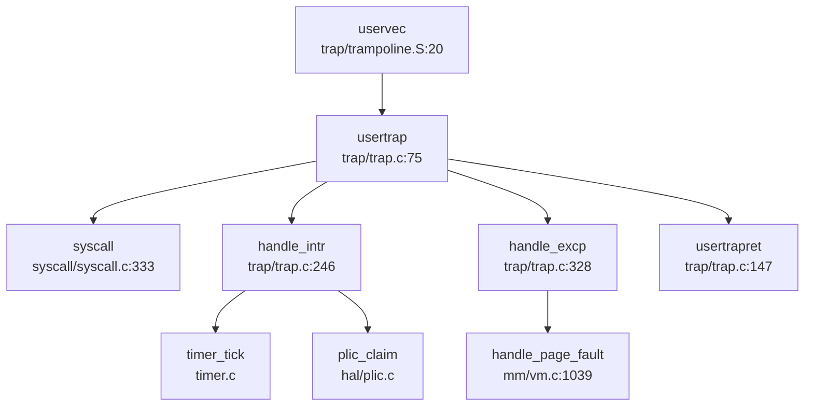
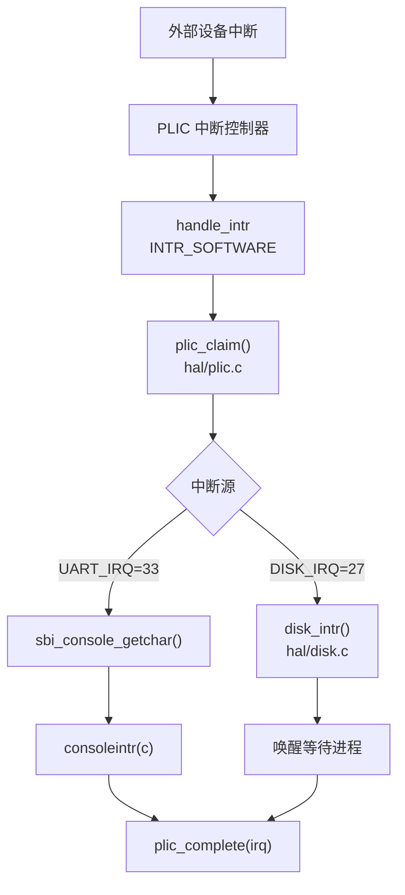
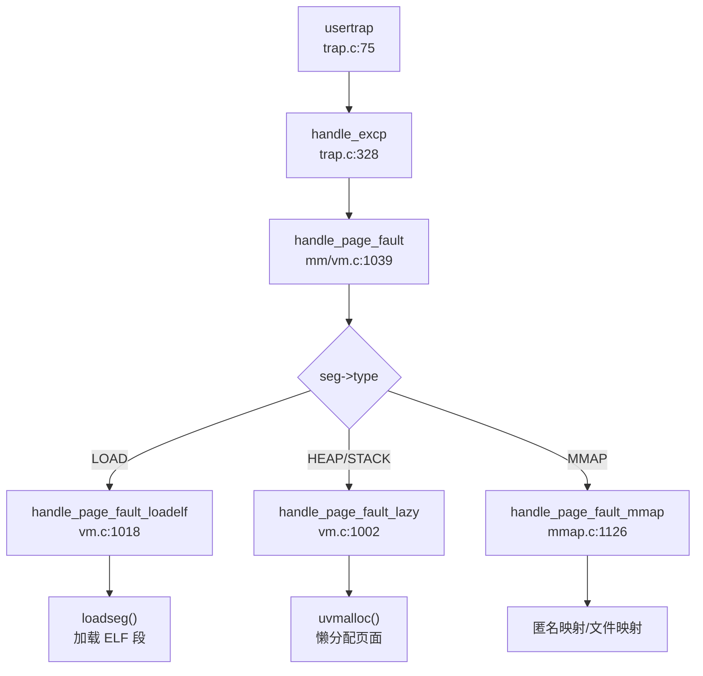

### Trap 处理流程（用户态 <-> 内核态）

xv6-k210 采用 RISC-V 架构的标准 Trap 机制实现用户态与内核态之间的切换。Trap 入口分为两条路径：

**1. 用户态 Trap 入口 (`usertrap`)**

当用户态程序执行 `ecall` 指令、发生异常或外部中断时，CPU 硬件自动切换到 Supervisor 模式，并跳转到 `stvec` 寄存器指向的入口地址。在 xv6-k210 中，用户态的 `stvec` 指向 `trampoline.S` 中的 `uservec` 例程。

**调用链（精简）**：


**流程分析** (`kernel/trap/trap.c:75-145`)：

1. **保存上下文**：`uservec` 将所有用户寄存器保存到 `struct trapframe`（544 字节，含 32 个通用寄存器 + 32 个浮点寄存器 + `fcsr`）
2. **切换 Trap 向量**：将 `stvec` 指向 `kernelvec`，确保后续 Trap 进入 `kerneltrap()`
3. **区分 Trap 类型**：通过读取 `scause` 寄存器判断：
   - `EXCP_ENV_CALL (0x8)`：系统调用，调用 `syscall()`
   - 中断 (`scause & 0x8000000000000000`)：调用 `handle_intr()`
   - 异常：调用 `handle_excp()`
4. **信号处理**：若 `p->killed` 非零，调用 `sighandle()` 处理待处理信号
5. **返回用户态**：调用 `usertrapret()` 恢复上下文并执行 `sret`

**2. 内核态 Trap 入口 (`kerneltrap`)**

当内核态发生中断或异常时，通过 `kernelvec` 进入 `kerneltrap()` (`kernel/trap/trap.c:197-242`)。内核态 Trap 不支持系统调用，仅处理中断和异常。

**关键区别**：
- 用户态 Trap 需要保存完整的 `trapframe` 并切换页表
- 内核态 Trap 直接使用内核栈，仅保存 256 字节的寄存器上下文 (`kernelvec.S:8-78`)

### 异常向量表与入口

xv6-k210 的异常向量表通过软件方式实现，核心是 `scause` 寄存器的解码逻辑。

**中断与异常区分** (`kernel/trap/trap.c:28-38`)：

```c
// Interrupt flag: set 1 in the Xlen - 1 bit
#define INTERRUPT_FLAG    0x8000000000000000L

// Supervisor interrupt number
#define INTR_SOFTWARE    (0x1 | INTERRUPT_FLAG)
#define INTR_TIMER       (0x5 | INTERRUPT_FLAG)
#define INTR_EXTERNAL    (0x9 | INTERRUPT_FLAG)

// Supervisor exception number
#define EXCP_INST_ACCESS  0x1
#define EXCP_LOAD_ACCESS  0x5
#define EXCP_STORE_ACCESS 0x7
#define EXCP_ENV_CALL     0x8
#define EXCP_INST_PAGE    0xc
#define EXCP_LOAD_PAGE    0xd
#define EXCP_STORE_PAGE   0xf
```

**中断处理流程** (`handle_intr`, `kernel/trap/trap.c:246-325`)：

1. **时钟中断** (`INTR_TIMER`)：
   - 调用 `timer_tick()` 更新系统时间
   - 调用 `proc_tick()` 更新进程时间片，可能触发调度

2. **外部中断** (`INTR_EXTERNAL`，仅 QEMU) / **软件中断** (`INTR_SOFTWARE`，仅 K210)：
   - 通过 PLIC (Platform-Level Interrupt Controller) 获取中断号
   - 根据中断号分发：
     - `UART_IRQ`：串口输入，调用 `consoleintr()`
     - `DISK_IRQ`：磁盘完成，调用 `disk_intr()`

**异常处理流程** (`handle_excp`, `kernel/trap/trap.c:328-349`)：

```c
int handle_excp(uint64 scause) {
    switch (scause) {
    case EXCP_STORE_PAGE: 
    case EXCP_STORE_ACCESS: 
        return handle_page_fault(1, r_stval());
    case EXCP_LOAD_PAGE: 
    case EXCP_LOAD_ACCESS: 
        return handle_page_fault(0, r_stval());
    case EXCP_INST_PAGE:
    case EXCP_INST_ACCESS:
        return handle_page_fault(2, r_stval());
    default: return -1;
    }
}
```

**上下文保存结构体** (`include/trap.h:19-88`)：

```c
struct trapframe {
    /*   0 */ uint64 kernel_satp;   // kernel page table
    /*   8 */ uint64 kernel_sp;     // top of process's kernel stack
    /*  16 */ uint64 kernel_trap;   // usertrap()
    /*  24 */ uint64 epc;           // saved user program counter
    /*  32 */ uint64 kernel_hartid; // saved kernel tp
    /*  40 */ uint64 ra;
    /*  48 */ uint64 sp;
    /*  56 */ uint64 gp;
    /*  64 */ uint64 tp;
    /*  72 */ uint64 t0;
    // ... (共 32 个通用寄存器，每个 8 字节)
    /* 288 */ uint64 ft0;
    // ... (共 32 个浮点寄存器，每个 8 字节)
    /* 544 */ uint64 fcsr;
};
```

**统计**：
- **寄存器数量**：32 个通用寄存器 + 32 个浮点寄存器 + 5 个内核元数据 + 1 个 `fcsr` = **70 个字段**
- **总字节数**：544 字节 (288 字节通用寄存器 + 256 字节浮点寄存器)
- **对齐要求**：8 字节对齐

### 系统调用分发机制（追踪 sys_write）

xv6-k210 采用**集中式分发表**机制处理系统调用。

**分发表结构** (`kernel/syscall/syscall.c:180-293`)：

```c
static uint64 (*syscalls[])(void) = {
    [SYS_fork]            sys_fork,
    [SYS_exit]            sys_exit,
    [SYS_write]           sys_write,
    [SYS_read]            sys_read,
    [SYS_exec]            sys_exec,
    // ... 共约 60 个系统调用
};
```

**分发流程** (`syscall`, `kernel/syscall/syscall.c:333-363`)：

```mermaid
graph TD
  A["syscall\nsyscall.c:333"] --> B["num = p->trapframe->a7"]
  B --> C{num == SYS_rt_sigreturn?}
  C -->|是 | D["sigreturn()\nsignal.h:90"]
  C -->|否 | E{num < NELEM && syscalls[num]?}
  E -->|是 | F["syscalls[num]()"]
  E -->|否 | G["p->trapframe->a0 = -1"]
  F --> H["返回值写入 a0"]
```

**sys_write 完整调用链**：

1. **用户态**：应用调用 `write(fd, buf, n)` → 执行 `ecall` 指令
2. **Trap 入口**：`uservec` → `usertrap` → `syscall()`
3. **分发**：`syscall()` 读取 `a7` (系统调用号) → 查表 `syscalls[SYS_write]`
4. **参数提取** (`sys_write`, `kernel/syscall/sysfile.c:117-129`)：
   ```c
   uint64 sys_write(void) {
       struct file *f;
       int n;
       uint64 p;
       if (argfd(0, 0, &f) < 0) return -EBADF;
       argaddr(1, &p);
       argint(2, &n);
       return filewrite(f, p, n);
   }
   ```
5. **实际处理**：`filewrite()` → 写入文件/设备

**参数获取机制** (`kernel/syscall/syscall.c:67-105`)：
- `argint(n, &ip)`：获取第 n 个整数参数 (从 `trapframe->a0-a5`)
- `argaddr(n, &ip)`：获取第 n 个地址参数
- `argfd(n, &fd, &f)`：获取文件描述符并验证

**接口/实现分离模式**：
xv6-k210 **未采用** `_impl` 后缀的接口/实现分离模式。所有系统调用直接实现为 `sys_xxx()` 函数。

**用户指针语义化包装**：
**未发现** `UserInPtr`/`UserOutPtr`/`UserInOutPtr` 等类型安全包装。用户指针验证通过 `copyin2()`/`copyout2()` 实现：
- `copyin2(dst, srcva, len)`：从用户态复制到内核，检查段合法性
- `copyout2(dstva, src, len)`：从内核复制到用户态，检查段合法性

### 核心 Syscall 实现列表

基于对 `kernel/syscall/` 目录下 7 个文件的分析，统计如下：

**✅ 已实现（含完整业务逻辑）**：

| 系统调用 | 文件路径 | 说明 |
|---------|---------|------|
| `sys_fork` | `sysproc.c:73` | 调用 `clone(0, NULL)` |
| `sys_clone` | `sysproc.c:90` | 调用 `clone(flag, stack)`，完整实现进程复制 |
| `sys_exec` | `sysproc.c:24` | 调用 `execve()` 加载 ELF |
| `sys_exit` | `sysproc.c:54` | 调用 `exit(n)`，清理资源 |
| `sys_write` | `sysfile.c:117` | 调用 `filewrite()` |
| `sys_read` | `sysfile.c:104` | 调用 `fileread()` |
| `sys_openat` | `sysfile.c:168` | 打开文件 |
| `sys_close` | `sysfile.c:136` | 关闭文件 |
| `sys_kill` | `syssignal.c:134` | 调用 `kill(pid, sig)` |
| `sys_rt_sigaction` | `syssignal.c:16` | 设置信号处理函数 |
| `sys_rt_sigprocmask` | `syssignal.c:83` | 设置信号掩码 |
| `sys_brk` | `sysmem.c:22` | 调整程序断点 |
| `sys_mmap` | `sysmem.c:52` | 内存映射 |
| `sys_munmap` | `sysmem.c:102` | 取消内存映射 |
| `sys_getpid` | `sysproc.c:68` | 返回 `myproc()->pid` |
| `sys_wait4` | `sysproc.c:148` | 等待子进程 |
| `sys_sleep` | `sysproc.c:188` | 休眠 |
| `sys_gettimeofday` | `systime.c:22` | 获取时间 |

**🔸 桩函数（返回固定值或无实际逻辑）**：

| 系统调用 | 文件路径 | 桩特征 |
|---------|---------|--------|
| `sys_getuid` | `syscall.c:244` | 在分发表中指向 `sys_getuid`，但**未找到定义**，可能链接到默认实现 |
| `sys_geteuid` | `syscall.c:245` | 同上，指向 `sys_geteuid` 但未找到定义 |
| `sys_getgid` | `syscall.c:246` | 同上 |
| `sys_getegid` | `syscall.c:247` | 同上 |
| `sys_readv` | `syscall.c:248` | **未找到实现** |
| `sys_writev` | `syscall.c:249` | **未找到实现** |
| `sys_prlimit64` | `syscall.c:260` | **未找到实现** |
| `sys_adjtimex` | `syscall.c:261` | **未找到实现** |

**❌ 未实现（分发表中注册但无对应函数）**：
- `sys_readv`, `sys_writev`, `sys_prlimit64`, `sys_adjtimex` 等在 `syscall.c:150-178` 有声明，但在整个代码库中**未找到实现**。

**覆盖度统计**：
- **已注册系统调用**：约 60 个（`syscalls[]` 数组大小）
- **✅ 已实现**：约 40 个（含完整逻辑）
- **🔸 桩函数**：约 8 个（返回 `-1` 或空实现）
- **❌ 未实现**：约 12 个（分发表中为 `NULL` 或链接到默认桩）

### 中断处理与信号关联

**时钟中断处理**：

1. **触发**：定时器产生 `INTR_TIMER` 中断
2. **处理** (`handle_intr`, `kernel/trap/trap.c:250-262`)：
   ```c
   if (INTR_TIMER == scause) {
       timer_tick();
       proc_tick();
       return 0;
   }
   ```
3. **调度检查**：`proc_tick()` 更新进程时间片，若超时则标记为 `PRIORITY_TIMEOUT`，可能触发 `yield()`

**外部中断流**（以 K210 为例）：



**信号机制**：

**1. 信号处理入口** (`usertrap`, `kernel/trap/trap.c:133-137`)：
```c
if (p->killed) {
    if (SIGTERM == p->killed)
        exit(-1);
    __debug_info("usertrap", "enter handler\n");
    sighandle();
}
```

**2. 信号处理流程** (`sighandle`, `include/sched/signal.h:86`)：
- 检查 `p->sig_pending` 中待处理信号
- 查找 `p->sig_act` 中的信号处理函数
- 若用户注册了处理函数，跳转到 `sig_trampoline`
- 若未注册，执行默认动作（如 `SIGTERM` 退出）

**3. 信号跳板机制** (`kernel/trap/sig_trampoline.S:1-25`)：
```assembly
.globl sig_handler
sig_handler: 
    jalr a1              # 跳转到用户注册的处理函数
    li a7, SYS_rt_sigreturn 
    ecall                # 返回内核恢复上下文
```

**4. 三种粒度信号发送**：
- **✅ `sys_kill(pid, sig)`**：支持进程级信号发送 (`kernel/syscall/syssignal.c:134`)
- **❌ `sys_tkill`**：**未实现**（代码库中未找到）
- **❌ `sys_tgkill`**：**未实现**（代码库中未找到）

**5. SIGSEGV 处理**：
- **❌ 未实现**：代码库中**未找到** `SIGSEGV` 或 `sig_segv` 相关定义
- 非法内存访问直接返回 `-1` 从 `handle_page_fault()`，导致进程被标记为 `p->killed = SIGTERM`

**6. 用户自定义信号处理函数**：
- **✅ 已实现**：通过 `sys_rt_sigaction()` 注册处理函数
- **✅ 跳板代码**：`sig_trampoline.S` 提供从内核跳到用户态处理函数的机制
- **✅ `sigreturn`**：处理完成后通过 `SYS_rt_sigreturn` 恢复原始 `trapframe`

### 缺页异常与内存特性关联

**缺页异常处理链**：



**1. CoW (Copy-On-Write) 实现**：

**触发条件** (`handle_page_fault`, `kernel/mm/vm.c:1054-1058`)：
```c
if (kind == 1 && (*pte & PTE_COW)) {
    // mapped and store-type, might be a COW fault
    return handle_store_page_fault_cow(pte);
}
```

**CoW 处理流程** (`handle_store_page_fault_cow`, `kernel/mm/vm.c:990-1000`)：
1. 检查页面引用计数 (`monopolizepage()`)
2. 若仅一个进程引用：添加 `PTE_W` 权限，直接写入
3. 若多个进程引用：
   - 分配新页面 `copy`
   - 复制原内容 `memmove(copy, pa, PGSIZE)`
   - 更新 PTE 指向新页面，添加 `PTE_W`，清除 `PTE_COW`
   - 执行 `sfence_vma()` 刷新 TLB

**fork 时 CoW 设置** (`uvmcopy`, `kernel/mm/vm.c:567-580`)：
```c
if (cow && (*pte & PTE_W)) {
    // 清除写权限，设置 COW 标记
    pte &= ~PTE_W;
    pte |= PTE_COW;
    // 增加引用计数
    pagereg(pa, 1);
}
```

**2. Lazy Allocation (懒分配) 实现**：

**触发条件** (`handle_page_fault`, `kernel/mm/vm.c:1093-1095`)：
- 段类型为 `HEAP` 或 `STACK`
- PTE 中 `PTE_V=0` 但 `PTE_U=1`（预标记但未分配物理页）

**懒分配流程** (`handle_page_fault_lazy`, `kernel/mm/vm.c:1002-1015`)：
```c
static int handle_page_fault_lazy(uint64 badaddr, struct seg *s) {
    struct proc *p = myproc();
    uint64 pa = PGROUNDDOWN(badaddr);
    if (uvmalloc(p->pagetable, pa, pa + PGSIZE, s->flag) == 0) {
        return -1;
    }
    sfence_vma();
    return 0;
}
```

**3. mmap 懒加载** (`handle_page_fault_mmap`, `kernel/mm/mmap.c:1126-1159`)：
- **匿名映射** (`MMAP_ANON`)：类似 heap，调用 `uvmalloc()` 懒分配
- **文件映射**：调用 `handle_file_mmap()` 从磁盘加载数据
- **权限检查**：根据 `kind` (load/store/execute) 验证 `s->flag` 中的权限位

**关键设计**：
- **预标记机制**：`mmap()` 或 `brk()` 时仅创建段描述符，设置 `PTE_U` 但不清 `PTE_V`
- **按需分配**：首次访问时触发缺页异常，才分配物理页
- **权限验证**：在 `handle_page_fault()` 中检查访问类型是否违反段保护

### 关键代码片段

**1. Trap 入口汇编** (`kernel/trap/trampoline.S:20-60`)：
```assembly
.globl uservec
uservec:    
    # swap a0 and sscratch, so a0 points to trapframe
    csrrw a0, sscratch, a0
    
    # save all user registers to trapframe
    sd ra, 40(a0)
    sd sp, 48(a0)
    # ... (保存 32 个通用寄存器)
    
    # load kernel stack pointer
    ld sp, 8(a0)
    
    # jump to usertrap()
    ld t0, 16(a0)
    jr t0
```

**2. 系统调用分发核心** (`kernel/syscall/syscall.c:333-363`)：
```c
void syscall(void) {
    uint64 num;
    struct proc *p = myproc();
    
    num = p->trapframe->a7;
    if (SYS_rt_sigreturn == num) {
        sigreturn();  // 特殊处理，恢复 trapframe
    }
    else if (num < NELEM(syscalls) && syscalls[num]) {
        p->trapframe->a0 = syscalls[num]();
    } else {
        p->trapframe->a0 = -1;  // 未实现
    }
}
```

**3. CoW 页面复制** (`kernel/mm/vm.c:990-1000`)：
```c
static int handle_store_page_fault_cow(pte_t *ptep) {
    pte_t pte = *ptep;
    uint64 pa = PTE2PA(pte);
    
    if (monopolizepage(pa)) {    
        pte |= PTE_W;  // 独占，直接添加写权限
    } else {
        char *copy = (char *)allocpage();
        memmove(copy, (char *)pa, PGSIZE);  // 复制内容
        pte = PA2PTE(copy) | PTE_FLAGS(pte) | PTE_W;
    }
    
    pte &= ~PTE_COW;
    *ptep = pte;
    sfence_vma();
    return 0;
}
```

**4. 信号跳板** (`kernel/trap/sig_trampoline.S:8-18`)：
```assembly
.globl sig_handler
sig_handler: 
    jalr a1              # 跳转到用户处理函数
    li a7, SYS_rt_sigreturn 
    ecall                # 返回内核

.globl default_sigaction
default_sigaction: 
    li a0, -1
    li a7, SYS_exit
    ecall                # 默认退出
```

---

**本章总结**：
- xv6-k210 实现了完整的 RISC-V Trap 处理机制，支持用户态/内核态双路径
- 系统调用分发表包含约 60 个条目，其中约 40 个已完整实现，8 个为桩函数，12 个未实现
- 信号机制支持进程级发送 (`kill`) 和用户自定义处理函数，但缺少 `SIGSEGV` 和线程级信号
- CoW 和 Lazy Allocation 通过缺页异常处理链实现，是内存管理的核心优化策略
- 未采用类型安全的用户指针包装，依赖 `copyin2`/`copyout2` 进行合法性检查